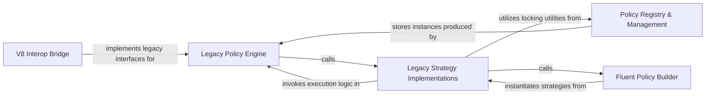

## Details

Maintains backward compatibility for V7 users. It wraps modern pipelines to look like legacy Policies and provides the infrastructure for the older PolicyWrap and synchronous execution models.

### V8 Interop Bridge
The core translation layer that wraps modern ResiliencePipeline instances into legacy IsyncPolicy and IAsyncPolicy interfaces.

**Related Classes/Methods**: _None_

**Source Files:**

- [`src/Polly/ResiliencePipelineConversionExtensions.cs`](https://github.com/CodeBoarding/Polly/blob/main/.codeboardingsrc/Polly/ResiliencePipelineConversionExtensions.cs)
  - `ResiliencePipelineConversionExtensions` ([L8-L48](https://github.com/CodeBoarding/Polly/blob/main/.codeboardingsrc/Polly/ResiliencePipelineConversionExtensions.cs#L8-L48)) - Class
  - `ResiliencePipelineConversionExtensions.AsAsyncPolicy(this ResiliencePipeline strategy)` ([L16-L18](https://github.com/CodeBoarding/Polly/blob/main/.codeboardingsrc/Polly/ResiliencePipelineConversionExtensions.cs#L16-L18)) - Method
  - `ResiliencePipelineConversionExtensions.AsAsyncPolicy<TResult>(this ResiliencePipeline<TResult> strategy)` ([L26-L28](https://github.com/CodeBoarding/Polly/blob/main/.codeboardingsrc/Polly/ResiliencePipelineConversionExtensions.cs#L26-L28)) - Method
  - `ResiliencePipelineConversionExtensions.AsSyncPolicy(this ResiliencePipeline strategy)` ([L35-L37](https://github.com/CodeBoarding/Polly/blob/main/.codeboardingsrc/Polly/ResiliencePipelineConversionExtensions.cs#L35-L37)) - Method
  - `ResiliencePipelineConversionExtensions.AsSyncPolicy<TResult>(this ResiliencePipeline<TResult> strategy)` ([L45-L47](https://github.com/CodeBoarding/Polly/blob/main/.codeboardingsrc/Polly/ResiliencePipelineConversionExtensions.cs#L45-L47)) - Method
- [`src/Polly/Utilities/Wrappers/ResiliencePipelineAsyncPolicy.TResult.cs`](https://github.com/CodeBoarding/Polly/blob/main/.codeboardingsrc/Polly/Utilities/Wrappers/ResiliencePipelineAsyncPolicy.TResult.cs)
  - `Utilities.Wrappers.ResiliencePipelineAsyncPolicy.TResult.ResiliencePipelineAsyncPolicy<TResult>` ([L3-L33](https://github.com/CodeBoarding/Polly/blob/main/.codeboardingsrc/Polly/Utilities/Wrappers/ResiliencePipelineAsyncPolicy.TResult.cs#L3-L33)) - Class
  - `Utilities.Wrappers.ResiliencePipelineAsyncPolicy.TResult.ResiliencePipelineAsyncPolicy<TResult>.ResiliencePipelineAsyncPolicy(ResiliencePipeline<TResult> strategy)` ([L7-L8](https://github.com/CodeBoarding/Polly/blob/main/.codeboardingsrc/Polly/Utilities/Wrappers/ResiliencePipelineAsyncPolicy.TResult.cs#L7-L8)) - Constructor
- [`src/Polly/Utilities/Wrappers/ResiliencePipelineAsyncPolicy.cs`](https://github.com/CodeBoarding/Polly/blob/main/.codeboardingsrc/Polly/Utilities/Wrappers/ResiliencePipelineAsyncPolicy.cs)
  - `Utilities.Wrappers.ResiliencePipelineAsyncPolicy` ([L3-L65](https://github.com/CodeBoarding/Polly/blob/main/.codeboardingsrc/Polly/Utilities/Wrappers/ResiliencePipelineAsyncPolicy.cs#L3-L65)) - Class
  - `Utilities.Wrappers.ResiliencePipelineAsyncPolicy.ResiliencePipelineAsyncPolicy(ResiliencePipeline strategy)` ([L7-L8](https://github.com/CodeBoarding/Polly/blob/main/.codeboardingsrc/Polly/Utilities/Wrappers/ResiliencePipelineAsyncPolicy.cs#L7-L8)) - Constructor
- [`src/Polly/Utilities/Wrappers/ResiliencePipelineSyncPolicy.TResult.cs`](https://github.com/CodeBoarding/Polly/blob/main/.codeboardingsrc/Polly/Utilities/Wrappers/ResiliencePipelineSyncPolicy.TResult.cs)
  - `Utilities.Wrappers.ResiliencePipelineSyncPolicy.TResult.ResiliencePipelineSyncPolicy<TResult>` ([L3-L33](https://github.com/CodeBoarding/Polly/blob/main/.codeboardingsrc/Polly/Utilities/Wrappers/ResiliencePipelineSyncPolicy.TResult.cs#L3-L33)) - Class
  - `Utilities.Wrappers.ResiliencePipelineSyncPolicy.TResult.ResiliencePipelineSyncPolicy<TResult>.ResiliencePipelineSyncPolicy(ResiliencePipeline<TResult> strategy)` ([L7-L8](https://github.com/CodeBoarding/Polly/blob/main/.codeboardingsrc/Polly/Utilities/Wrappers/ResiliencePipelineSyncPolicy.TResult.cs#L7-L8)) - Constructor
- [`src/Polly/Utilities/Wrappers/ResiliencePipelineSyncPolicy.cs`](https://github.com/CodeBoarding/Polly/blob/main/.codeboardingsrc/Polly/Utilities/Wrappers/ResiliencePipelineSyncPolicy.cs)
  - `Utilities.Wrappers.ResiliencePipelineSyncPolicy` ([L3-L57](https://github.com/CodeBoarding/Polly/blob/main/.codeboardingsrc/Polly/Utilities/Wrappers/ResiliencePipelineSyncPolicy.cs#L3-L57)) - Class
  - `Utilities.Wrappers.ResiliencePipelineSyncPolicy.ResiliencePipelineSyncPolicy(ResiliencePipeline strategy)` ([L7-L8](https://github.com/CodeBoarding/Polly/blob/main/.codeboardingsrc/Polly/Utilities/Wrappers/ResiliencePipelineSyncPolicy.cs#L7-L8)) - Constructor

### Legacy Policy Engine
Manages the complex execution logic of V7, including the propagation of Context, CancellationToken, and the handling of synchronous vs. asynchronous execution paths.

**Related Classes/Methods**: _None_

**Source Files:**

- [`src/Polly/AsyncPolicy.ExecuteOverloads.cs`](https://github.com/CodeBoarding/Polly/blob/main/.codeboardingsrc/Polly/AsyncPolicy.ExecuteOverloads.cs)
  - `AsyncPolicy.ExecuteOverloads.AsyncPolicy.ExecuteAsync(Func<Task> action)` ([L13-L15](https://github.com/CodeBoarding/Polly/blob/main/.codeboardingsrc/Polly/AsyncPolicy.ExecuteOverloads.cs#L13-L15)) - Method
  - `AsyncPolicy.ExecuteOverloads.AsyncPolicy.ExecuteAsync(Func<Context, Task> action, IDictionary<string, object> contextData)` ([L23-L25](https://github.com/CodeBoarding/Polly/blob/main/.codeboardingsrc/Polly/AsyncPolicy.ExecuteOverloads.cs#L23-L25)) - Method
  - `AsyncPolicy.ExecuteOverloads.AsyncPolicy.ExecuteAsync(Func<Context, Task> action, Context context)` ([L33-L35](https://github.com/CodeBoarding/Polly/blob/main/.codeboardingsrc/Polly/AsyncPolicy.ExecuteOverloads.cs#L33-L35)) - Method
  - `AsyncPolicy.ExecuteOverloads.AsyncPolicy.ExecuteAsync(Func<CancellationToken, Task> action, CancellationToken cancellationToken)` ([L43-L45](https://github.com/CodeBoarding/Polly/blob/main/.codeboardingsrc/Polly/AsyncPolicy.ExecuteOverloads.cs#L43-L45)) - Method
  - `AsyncPolicy.ExecuteOverloads.AsyncPolicy.ExecuteAsync(Func<Context, CancellationToken, Task> action, IDictionary<string, object> contextData, CancellationToken cancellationToken)` ([L54-L56](https://github.com/CodeBoarding/Polly/blob/main/.codeboardingsrc/Polly/AsyncPolicy.ExecuteOverloads.cs#L54-L56)) - Method
  - `AsyncPolicy.ExecuteOverloads.AsyncPolicy.ExecuteAsync(Func<Context, CancellationToken, Task> action, Context context, CancellationToken cancellationToken)` ([L65-L67](https://github.com/CodeBoarding/Polly/blob/main/.codeboardingsrc/Polly/AsyncPolicy.ExecuteOverloads.cs#L65-L67)) - Method
  - `AsyncPolicy.ExecuteOverloads.AsyncPolicy.ExecuteAsync(Func<CancellationToken, Task> action, CancellationToken cancellationToken, bool continueOnCapturedContext)` ([L77-L79](https://github.com/CodeBoarding/Polly/blob/main/.codeboardingsrc/Polly/AsyncPolicy.ExecuteOverloads.cs#L77-L79)) - Method
  - `AsyncPolicy.ExecuteOverloads.AsyncPolicy.ExecuteAsync(Func<Context, CancellationToken, Task> action, IDictionary<string, object> contextData, CancellationToken cancellationToken, bool continueOnCapturedContext)` ([L90-L92](https://github.com/CodeBoarding/Polly/blob/main/.codeboardingsrc/Polly/AsyncPolicy.ExecuteOverloads.cs#L90-L92)) - Method
  - `AsyncPolicy.ExecuteOverloads.AsyncPolicy.ExecuteAsync(Func<Context, CancellationToken, Task> action, Context context, CancellationToken cancellationToken, bool continueOnCapturedContext)` ([L103-L112](https://github.com/CodeBoarding/Polly/blob/main/.codeboardingsrc/Polly/AsyncPolicy.ExecuteOverloads.cs#L103-L112)) - Method
  - `AsyncPolicy.ExecuteOverloads.AsyncPolicy.ExecuteAsync<TResult>(Func<Task<TResult>> action)` ([L122-L124](https://github.com/CodeBoarding/Polly/blob/main/.codeboardingsrc/Polly/AsyncPolicy.ExecuteOverloads.cs#L122-L124)) - Method
  - `AsyncPolicy.ExecuteOverloads.AsyncPolicy.ExecuteAsync<TResult>(Func<Context, Task<TResult>> action, IDictionary<string, object> contextData)` ([L133-L135](https://github.com/CodeBoarding/Polly/blob/main/.codeboardingsrc/Polly/AsyncPolicy.ExecuteOverloads.cs#L133-L135)) - Method
  - `AsyncPolicy.ExecuteOverloads.AsyncPolicy.ExecuteAsync<TResult>(Func<Context, Task<TResult>> action, Context context)` ([L144-L146](https://github.com/CodeBoarding/Polly/blob/main/.codeboardingsrc/Polly/AsyncPolicy.ExecuteOverloads.cs#L144-L146)) - Method
  - `AsyncPolicy.ExecuteOverloads.AsyncPolicy.ExecuteAsync<TResult>(Func<CancellationToken, Task<TResult>> action, CancellationToken cancellationToken)` ([L155-L157](https://github.com/CodeBoarding/Polly/blob/main/.codeboardingsrc/Polly/AsyncPolicy.ExecuteOverloads.cs#L155-L157)) - Method
  - `AsyncPolicy.ExecuteOverloads.AsyncPolicy.ExecuteAsync<TResult>(Func<Context, CancellationToken, Task<TResult>> action, IDictionary<string, object> contextData, CancellationToken cancellationToken)` ([L167-L169](https://github.com/CodeBoarding/Polly/blob/main/.codeboardingsrc/Polly/AsyncPolicy.ExecuteOverloads.cs#L167-L169)) - Method
  - `AsyncPolicy.ExecuteOverloads.AsyncPolicy.ExecuteAsync<TResult>(Func<Context, CancellationToken, Task<TResult>> action, Context context, CancellationToken cancellationToken)` ([L179-L181](https://github.com/CodeBoarding/Polly/blob/main/.codeboardingsrc/Polly/AsyncPolicy.ExecuteOverloads.cs#L179-L181)) - Method
  - `AsyncPolicy.ExecuteOverloads.AsyncPolicy.ExecuteAsync<TResult>(Func<CancellationToken, Task<TResult>> action, CancellationToken cancellationToken, bool continueOnCapturedContext)` ([L192-L194](https://github.com/CodeBoarding/Polly/blob/main/.codeboardingsrc/Polly/AsyncPolicy.ExecuteOverloads.cs#L192-L194)) - Method
  - `AsyncPolicy.ExecuteOverloads.AsyncPolicy.ExecuteAsync<TResult>(Func<Context, CancellationToken, Task<TResult>> action, IDictionary<string, object> contextData, CancellationToken cancellationToken, bool continueOnCapturedContext)` ([L206-L208](https://github.com/CodeBoarding/Polly/blob/main/.codeboardingsrc/Polly/AsyncPolicy.ExecuteOverloads.cs#L206-L208)) - Method
  - `AsyncPolicy.ExecuteOverloads.AsyncPolicy.ExecuteAsync<TResult>(Func<Context, CancellationToken, Task<TResult>> action, Context context, CancellationToken cancellationToken, bool continueOnCapturedContext)` ([L220-L229](https://github.com/CodeBoarding/Polly/blob/main/.codeboardingsrc/Polly/AsyncPolicy.ExecuteOverloads.cs#L220-L229)) - Method
  - `AsyncPolicy.ExecuteOverloads.AsyncPolicy.ExecuteAndCaptureAsync(Func<Task> action)` ([L242-L244](https://github.com/CodeBoarding/Polly/blob/main/.codeboardingsrc/Polly/AsyncPolicy.ExecuteOverloads.cs#L242-L244)) - Method
  - `AsyncPolicy.ExecuteOverloads.AsyncPolicy.ExecuteAndCaptureAsync(Func<Context, Task> action, IDictionary<string, object> contextData)` ([L253-L255](https://github.com/CodeBoarding/Polly/blob/main/.codeboardingsrc/Polly/AsyncPolicy.ExecuteOverloads.cs#L253-L255)) - Method
  - `AsyncPolicy.ExecuteOverloads.AsyncPolicy.ExecuteAndCaptureAsync(Func<Context, Task> action, Context context)` ([L263-L265](https://github.com/CodeBoarding/Polly/blob/main/.codeboardingsrc/Polly/AsyncPolicy.ExecuteOverloads.cs#L263-L265)) - Method
  - `AsyncPolicy.ExecuteOverloads.AsyncPolicy.ExecuteAndCaptureAsync(Func<CancellationToken, Task> action, CancellationToken cancellationToken)` ([L273-L275](https://github.com/CodeBoarding/Polly/blob/main/.codeboardingsrc/Polly/AsyncPolicy.ExecuteOverloads.cs#L273-L275)) - Method
  - `AsyncPolicy.ExecuteOverloads.AsyncPolicy.ExecuteAndCaptureAsync(Func<Context, CancellationToken, Task> action, IDictionary<string, object> contextData, CancellationToken cancellationToken)` ([L285-L287](https://github.com/CodeBoarding/Polly/blob/main/.codeboardingsrc/Polly/AsyncPolicy.ExecuteOverloads.cs#L285-L287)) - Method
  - `AsyncPolicy.ExecuteOverloads.AsyncPolicy.ExecuteAndCaptureAsync(Func<Context, CancellationToken, Task> action, Context context, CancellationToken cancellationToken)` ([L296-L298](https://github.com/CodeBoarding/Polly/blob/main/.codeboardingsrc/Polly/AsyncPolicy.ExecuteOverloads.cs#L296-L298)) - Method
  - `AsyncPolicy.ExecuteOverloads.AsyncPolicy.ExecuteAndCaptureAsync(Func<CancellationToken, Task> action, CancellationToken cancellationToken, bool continueOnCapturedContext)` ([L308-L310](https://github.com/CodeBoarding/Polly/blob/main/.codeboardingsrc/Polly/AsyncPolicy.ExecuteOverloads.cs#L308-L310)) - Method
  - `AsyncPolicy.ExecuteOverloads.AsyncPolicy.ExecuteAndCaptureAsync(Func<Context, CancellationToken, Task> action, IDictionary<string, object> contextData, CancellationToken cancellationToken, bool continueOnCapturedContext)` ([L321-L323](https://github.com/CodeBoarding/Polly/blob/main/.codeboardingsrc/Polly/AsyncPolicy.ExecuteOverloads.cs#L321-L323)) - Method
  - `AsyncPolicy.ExecuteOverloads.AsyncPolicy.ExecuteAndCaptureAsync(Func<Context, CancellationToken, Task> action, Context context, CancellationToken cancellationToken, bool continueOnCapturedContext)` ([L334-L343](https://github.com/CodeBoarding/Polly/blob/main/.codeboardingsrc/Polly/AsyncPolicy.ExecuteOverloads.cs#L334-L343)) - Method
  - `AsyncPolicy.ExecuteOverloads.AsyncPolicy.ExecuteAndCaptureAsync<TResult>(Func<Task<TResult>> action)` ([L353-L355](https://github.com/CodeBoarding/Polly/blob/main/.codeboardingsrc/Polly/AsyncPolicy.ExecuteOverloads.cs#L353-L355)) - Method
  - `AsyncPolicy.ExecuteOverloads.AsyncPolicy.ExecuteAndCaptureAsync<TResult>(Func<Context, Task<TResult>> action, IDictionary<string, object> contextData)` ([L365-L367](https://github.com/CodeBoarding/Polly/blob/main/.codeboardingsrc/Polly/AsyncPolicy.ExecuteOverloads.cs#L365-L367)) - Method
  - `AsyncPolicy.ExecuteOverloads.AsyncPolicy.ExecuteAndCaptureAsync<TResult>(Func<Context, Task<TResult>> action, Context context)` ([L376-L378](https://github.com/CodeBoarding/Polly/blob/main/.codeboardingsrc/Polly/AsyncPolicy.ExecuteOverloads.cs#L376-L378)) - Method
  - `AsyncPolicy.ExecuteOverloads.AsyncPolicy.ExecuteAndCaptureAsync<TResult>(Func<CancellationToken, Task<TResult>> action, CancellationToken cancellationToken)` ([L387-L389](https://github.com/CodeBoarding/Polly/blob/main/.codeboardingsrc/Polly/AsyncPolicy.ExecuteOverloads.cs#L387-L389)) - Method
  - `AsyncPolicy.ExecuteOverloads.AsyncPolicy.ExecuteAndCaptureAsync<TResult>(Func<Context, CancellationToken, Task<TResult>> action, IDictionary<string, object> contextData, CancellationToken cancellationToken)` ([L400-L402](https://github.com/CodeBoarding/Polly/blob/main/.codeboardingsrc/Polly/AsyncPolicy.ExecuteOverloads.cs#L400-L402)) - Method
  - `AsyncPolicy.ExecuteOverloads.AsyncPolicy.ExecuteAndCaptureAsync<TResult>(Func<Context, CancellationToken, Task<TResult>> action, Context context, CancellationToken cancellationToken)` ([L412-L414](https://github.com/CodeBoarding/Polly/blob/main/.codeboardingsrc/Polly/AsyncPolicy.ExecuteOverloads.cs#L412-L414)) - Method
  - `AsyncPolicy.ExecuteOverloads.AsyncPolicy.ExecuteAndCaptureAsync<TResult>(Func<CancellationToken, Task<TResult>> action, CancellationToken cancellationToken, bool continueOnCapturedContext)` ([L425-L427](https://github.com/CodeBoarding/Polly/blob/main/.codeboardingsrc/Polly/AsyncPolicy.ExecuteOverloads.cs#L425-L427)) - Method
  - `AsyncPolicy.ExecuteOverloads.AsyncPolicy.ExecuteAndCaptureAsync<TResult>(Func<Context, CancellationToken, Task<TResult>> action, IDictionary<string, object> contextData, CancellationToken cancellationToken, bool continueOnCapturedContext)` ([L439-L441](https://github.com/CodeBoarding/Polly/blob/main/.codeboardingsrc/Polly/AsyncPolicy.ExecuteOverloads.cs#L439-L441)) - Method
  - `AsyncPolicy.ExecuteOverloads.AsyncPolicy.ExecuteAndCaptureAsync<TResult>(Func<Context, CancellationToken, Task<TResult>> action, Context context, CancellationToken cancellationToken, bool continueOnCapturedContext)` ([L453-L466](https://github.com/CodeBoarding/Polly/blob/main/.codeboardingsrc/Polly/AsyncPolicy.ExecuteOverloads.cs#L453-L466)) - Method
  - `AsyncPolicy.ExecuteOverloads.AsyncPolicy.ExecuteInternalAsync(Func<Context, CancellationToken, Task> action, Context context, bool continueOnCapturedContext, CancellationToken cancellationToken)` ([L471-L484](https://github.com/CodeBoarding/Polly/blob/main/.codeboardingsrc/Polly/AsyncPolicy.ExecuteOverloads.cs#L471-L484)) - Method
  - `AsyncPolicy.ExecuteOverloads.AsyncPolicy.ExecuteInternalAsync<TResult>(Func<Context, CancellationToken, Task<TResult>> action, Context context, bool continueOnCapturedContext, CancellationToken cancellationToken)` ([L485-L502](https://github.com/CodeBoarding/Polly/blob/main/.codeboardingsrc/Polly/AsyncPolicy.ExecuteOverloads.cs#L485-L502)) - Method
  - `AsyncPolicy.ExecuteOverloads.AsyncPolicy.ExecuteAndCaptureInternalAsync(Func<Context, CancellationToken, Task> action, Context context, bool continueOnCapturedContext, CancellationToken cancellationToken)` ([L503-L521](https://github.com/CodeBoarding/Polly/blob/main/.codeboardingsrc/Polly/AsyncPolicy.ExecuteOverloads.cs#L503-L521)) - Method
  - `AsyncPolicy.ExecuteOverloads.AsyncPolicy.ExecuteAndCaptureInternalAsync<TResult>(Func<Context, CancellationToken, Task<TResult>> action, Context context, bool continueOnCapturedContext, CancellationToken cancellationToken)` ([L522-L541](https://github.com/CodeBoarding/Polly/blob/main/.codeboardingsrc/Polly/AsyncPolicy.ExecuteOverloads.cs#L522-L541)) - Method
- [`src/Polly/AsyncPolicy.GenericImplementation.cs`](https://github.com/CodeBoarding/Polly/blob/main/.codeboardingsrc/Polly/AsyncPolicy.GenericImplementation.cs)
  - `AsyncPolicy.GenericImplementation.AsyncPolicy<TResult>.ImplementationAsync(Func<Context, CancellationToken, Task<TResult>> action, Context context, CancellationToken cancellationToken, bool continueOnCapturedContext)` ([L14-L19](https://github.com/CodeBoarding/Polly/blob/main/.codeboardingsrc/Polly/AsyncPolicy.GenericImplementation.cs#L14-L19)) - Method
- [`src/Polly/AsyncPolicy.NonGenericImplementation.cs`](https://github.com/CodeBoarding/Polly/blob/main/.codeboardingsrc/Polly/AsyncPolicy.NonGenericImplementation.cs)
  - `AsyncPolicy.NonGenericImplementation.AsyncPolicy.ImplementationAsync(Func<Context, CancellationToken, Task> action, Context context, CancellationToken cancellationToken, bool continueOnCapturedContext)` ([L14-L25](https://github.com/CodeBoarding/Polly/blob/main/.codeboardingsrc/Polly/AsyncPolicy.NonGenericImplementation.cs#L14-L25)) - Method
  - `AsyncPolicy.NonGenericImplementation.AsyncPolicy.ImplementationAsync<TResult>(Func<Context, CancellationToken, Task<TResult>> action, Context context, CancellationToken cancellationToken, bool continueOnCapturedContext)` ([L36-L41](https://github.com/CodeBoarding/Polly/blob/main/.codeboardingsrc/Polly/AsyncPolicy.NonGenericImplementation.cs#L36-L41)) - Method
- [`src/Polly/AsyncPolicy.TResult.ExecuteOverloads.cs`](https://github.com/CodeBoarding/Polly/blob/main/.codeboardingsrc/Polly/AsyncPolicy.TResult.ExecuteOverloads.cs)
  - `AsyncPolicy.TResult.ExecuteOverloads.AsyncPolicy<TResult>.ExecuteAsync(Func<Task<TResult>> action)` ([L13-L15](https://github.com/CodeBoarding/Polly/blob/main/.codeboardingsrc/Polly/AsyncPolicy.TResult.ExecuteOverloads.cs#L13-L15)) - Method
  - `AsyncPolicy.TResult.ExecuteOverloads.AsyncPolicy<TResult>.ExecuteAsync(Func<Context, Task<TResult>> action, IDictionary<string, object> contextData)` ([L23-L25](https://github.com/CodeBoarding/Polly/blob/main/.codeboardingsrc/Polly/AsyncPolicy.TResult.ExecuteOverloads.cs#L23-L25)) - Method
  - `AsyncPolicy.TResult.ExecuteOverloads.AsyncPolicy<TResult>.ExecuteAsync(Func<Context, Task<TResult>> action, Context context)` ([L33-L35](https://github.com/CodeBoarding/Polly/blob/main/.codeboardingsrc/Polly/AsyncPolicy.TResult.ExecuteOverloads.cs#L33-L35)) - Method
  - `AsyncPolicy.TResult.ExecuteOverloads.AsyncPolicy<TResult>.ExecuteAsync(Func<CancellationToken, Task<TResult>> action, CancellationToken cancellationToken)` ([L43-L45](https://github.com/CodeBoarding/Polly/blob/main/.codeboardingsrc/Polly/AsyncPolicy.TResult.ExecuteOverloads.cs#L43-L45)) - Method
  - `AsyncPolicy.TResult.ExecuteOverloads.AsyncPolicy<TResult>.ExecuteAsync(Func<CancellationToken, Task<TResult>> action, CancellationToken cancellationToken, bool continueOnCapturedContext)` ([L55-L57](https://github.com/CodeBoarding/Polly/blob/main/.codeboardingsrc/Polly/AsyncPolicy.TResult.ExecuteOverloads.cs#L55-L57)) - Method
  - `AsyncPolicy.TResult.ExecuteOverloads.AsyncPolicy<TResult>.ExecuteAsync(Func<Context, CancellationToken, Task<TResult>> action, IDictionary<string, object> contextData, CancellationToken cancellationToken)` ([L66-L68](https://github.com/CodeBoarding/Polly/blob/main/.codeboardingsrc/Polly/AsyncPolicy.TResult.ExecuteOverloads.cs#L66-L68)) - Method
  - `AsyncPolicy.TResult.ExecuteOverloads.AsyncPolicy<TResult>.ExecuteAsync(Func<Context, CancellationToken, Task<TResult>> action, Context context, CancellationToken cancellationToken)` ([L77-L79](https://github.com/CodeBoarding/Polly/blob/main/.codeboardingsrc/Polly/AsyncPolicy.TResult.ExecuteOverloads.cs#L77-L79)) - Method
  - `AsyncPolicy.TResult.ExecuteOverloads.AsyncPolicy<TResult>.ExecuteAsync(Func<Context, CancellationToken, Task<TResult>> action, IDictionary<string, object> contextData, CancellationToken cancellationToken, bool continueOnCapturedContext)` ([L90-L92](https://github.com/CodeBoarding/Polly/blob/main/.codeboardingsrc/Polly/AsyncPolicy.TResult.ExecuteOverloads.cs#L90-L92)) - Method
  - `AsyncPolicy.TResult.ExecuteOverloads.AsyncPolicy<TResult>.ExecuteAsync(Func<Context, CancellationToken, Task<TResult>> action, Context context, CancellationToken cancellationToken, bool continueOnCapturedContext)` ([L103-L112](https://github.com/CodeBoarding/Polly/blob/main/.codeboardingsrc/Polly/AsyncPolicy.TResult.ExecuteOverloads.cs#L103-L112)) - Method
  - `AsyncPolicy.TResult.ExecuteOverloads.AsyncPolicy<TResult>.ExecuteAndCaptureAsync(Func<Task<TResult>> action)` ([L123-L125](https://github.com/CodeBoarding/Polly/blob/main/.codeboardingsrc/Polly/AsyncPolicy.TResult.ExecuteOverloads.cs#L123-L125)) - Method
  - `AsyncPolicy.TResult.ExecuteOverloads.AsyncPolicy<TResult>.ExecuteAndCaptureAsync(Func<Context, Task<TResult>> action, IDictionary<string, object> contextData)` ([L134-L136](https://github.com/CodeBoarding/Polly/blob/main/.codeboardingsrc/Polly/AsyncPolicy.TResult.ExecuteOverloads.cs#L134-L136)) - Method
  - `AsyncPolicy.TResult.ExecuteOverloads.AsyncPolicy<TResult>.ExecuteAndCaptureAsync(Func<Context, Task<TResult>> action, Context context)` ([L144-L146](https://github.com/CodeBoarding/Polly/blob/main/.codeboardingsrc/Polly/AsyncPolicy.TResult.ExecuteOverloads.cs#L144-L146)) - Method
  - `AsyncPolicy.TResult.ExecuteOverloads.AsyncPolicy<TResult>.ExecuteAndCaptureAsync(Func<CancellationToken, Task<TResult>> action, CancellationToken cancellationToken)` ([L154-L156](https://github.com/CodeBoarding/Polly/blob/main/.codeboardingsrc/Polly/AsyncPolicy.TResult.ExecuteOverloads.cs#L154-L156)) - Method
  - `AsyncPolicy.TResult.ExecuteOverloads.AsyncPolicy<TResult>.ExecuteAndCaptureAsync(Func<CancellationToken, Task<TResult>> action, CancellationToken cancellationToken, bool continueOnCapturedContext)` ([L166-L168](https://github.com/CodeBoarding/Polly/blob/main/.codeboardingsrc/Polly/AsyncPolicy.TResult.ExecuteOverloads.cs#L166-L168)) - Method
  - `AsyncPolicy.TResult.ExecuteOverloads.AsyncPolicy<TResult>.ExecuteAndCaptureAsync(Func<Context, CancellationToken, Task<TResult>> action, IDictionary<string, object> contextData, CancellationToken cancellationToken)` ([L178-L180](https://github.com/CodeBoarding/Polly/blob/main/.codeboardingsrc/Polly/AsyncPolicy.TResult.ExecuteOverloads.cs#L178-L180)) - Method
  - `AsyncPolicy.TResult.ExecuteOverloads.AsyncPolicy<TResult>.ExecuteAndCaptureAsync(Func<Context, CancellationToken, Task<TResult>> action, Context context, CancellationToken cancellationToken)` ([L189-L191](https://github.com/CodeBoarding/Polly/blob/main/.codeboardingsrc/Polly/AsyncPolicy.TResult.ExecuteOverloads.cs#L189-L191)) - Method
  - `AsyncPolicy.TResult.ExecuteOverloads.AsyncPolicy<TResult>.ExecuteAndCaptureAsync(Func<Context, CancellationToken, Task<TResult>> action, IDictionary<string, object> contextData, CancellationToken cancellationToken, bool continueOnCapturedContext)` ([L202-L204](https://github.com/CodeBoarding/Polly/blob/main/.codeboardingsrc/Polly/AsyncPolicy.TResult.ExecuteOverloads.cs#L202-L204)) - Method
  - `AsyncPolicy.TResult.ExecuteOverloads.AsyncPolicy<TResult>.ExecuteAndCaptureAsync(Func<Context, CancellationToken, Task<TResult>> action, Context context, CancellationToken cancellationToken, bool continueOnCapturedContext)` ([L215-L224](https://github.com/CodeBoarding/Polly/blob/main/.codeboardingsrc/Polly/AsyncPolicy.TResult.ExecuteOverloads.cs#L215-L224)) - Method
  - `AsyncPolicy.TResult.ExecuteOverloads.AsyncPolicy<TResult>.ExecuteInternalAsync(Func<Context, CancellationToken, Task<TResult>> action, Context context, bool continueOnCapturedContext, CancellationToken cancellationToken)` ([L227-L244](https://github.com/CodeBoarding/Polly/blob/main/.codeboardingsrc/Polly/AsyncPolicy.TResult.ExecuteOverloads.cs#L227-L244)) - Method
  - `AsyncPolicy.TResult.ExecuteOverloads.AsyncPolicy<TResult>.ExecuteAndCaptureInternalAsync(Func<Context, CancellationToken, Task<TResult>> action, Context context, bool continueOnCapturedContext, CancellationToken cancellationToken)` ([L245-L269](https://github.com/CodeBoarding/Polly/blob/main/.codeboardingsrc/Polly/AsyncPolicy.TResult.ExecuteOverloads.cs#L245-L269)) - Method
- [`src/Polly/Bulkhead/AsyncBulkheadEngine.cs`](https://github.com/CodeBoarding/Polly/blob/main/.codeboardingsrc/Polly/Bulkhead/AsyncBulkheadEngine.cs)
  - `Bulkhead.AsyncBulkheadEngine` ([L4-L40](https://github.com/CodeBoarding/Polly/blob/main/.codeboardingsrc/Polly/Bulkhead/AsyncBulkheadEngine.cs#L4-L40)) - Class
  - `Bulkhead.AsyncBulkheadEngine.ImplementationAsync<TResult>(Func<Context, CancellationToken, Task<TResult>> action, Context context, Func<Context, Task> onBulkheadRejectedAsync, SemaphoreSlim maxParallelizationSemaphore, SemaphoreSlim maxQueuedActionsSemaphore, bool continueOnCapturedContext, CancellationToken cancellationToken)` ([L6-L39](https://github.com/CodeBoarding/Polly/blob/main/.codeboardingsrc/Polly/Bulkhead/AsyncBulkheadEngine.cs#L6-L39)) - Method
- [`src/Polly/Bulkhead/AsyncBulkheadPolicy.cs`](https://github.com/CodeBoarding/Polly/blob/main/.codeboardingsrc/Polly/Bulkhead/AsyncBulkheadPolicy.cs)
  - `Bulkhead.AsyncBulkheadPolicy.ImplementationAsync<TResult>(Func<Context, CancellationToken, Task<TResult>> action, Context context, CancellationToken cancellationToken, bool continueOnCapturedContext)` ([L40-L60](https://github.com/CodeBoarding/Polly/blob/main/.codeboardingsrc/Polly/Bulkhead/AsyncBulkheadPolicy.cs#L40-L60)) - Method
  - `Bulkhead.AsyncBulkheadPolicy.AsyncBulkheadPolicy<TResult>.ImplementationAsync(Func<Context, CancellationToken, Task<TResult>> action, Context context, CancellationToken cancellationToken, bool continueOnCapturedContext)` ([L99-L119](https://github.com/CodeBoarding/Polly/blob/main/.codeboardingsrc/Polly/Bulkhead/AsyncBulkheadPolicy.cs#L99-L119)) - Method
- [`src/Polly/Bulkhead/BulkheadEngine.cs`](https://github.com/CodeBoarding/Polly/blob/main/.codeboardingsrc/Polly/Bulkhead/BulkheadEngine.cs)
  - `Bulkhead.BulkheadEngine` ([L5-L52](https://github.com/CodeBoarding/Polly/blob/main/.codeboardingsrc/Polly/Bulkhead/BulkheadEngine.cs#L5-L52)) - Class
  - `Bulkhead.BulkheadEngine.Implementation<TResult>(Func<Context, CancellationToken, TResult> action, Context context, Action<Context> onBulkheadRejected, SemaphoreSlim maxParallelizationSemaphore, SemaphoreSlim maxQueuedActionsSemaphore, CancellationToken cancellationToken)` ([L7-L51](https://github.com/CodeBoarding/Polly/blob/main/.codeboardingsrc/Polly/Bulkhead/BulkheadEngine.cs#L7-L51)) - Method
- [`src/Polly/Bulkhead/BulkheadPolicy.cs`](https://github.com/CodeBoarding/Polly/blob/main/.codeboardingsrc/Polly/Bulkhead/BulkheadPolicy.cs)
  - `Bulkhead.BulkheadPolicy.Implementation<TResult>(Func<Context, CancellationToken, TResult> action, Context context, CancellationToken cancellationToken)` ([L30-L45](https://github.com/CodeBoarding/Polly/blob/main/.codeboardingsrc/Polly/Bulkhead/BulkheadPolicy.cs#L30-L45)) - Method
  - `Bulkhead.BulkheadPolicy.BulkheadPolicy<TResult>.Implementation(Func<Context, CancellationToken, TResult> action, Context context, CancellationToken cancellationToken)` ([L97-L111](https://github.com/CodeBoarding/Polly/blob/main/.codeboardingsrc/Polly/Bulkhead/BulkheadPolicy.cs#L97-L111)) - Method
- [`src/Polly/Bulkhead/BulkheadRejectedException.cs`](https://github.com/CodeBoarding/Polly/blob/main/.codeboardingsrc/Polly/Bulkhead/BulkheadRejectedException.cs)
  - `Bulkhead.BulkheadRejectedException` ([L14-L57](https://github.com/CodeBoarding/Polly/blob/main/.codeboardingsrc/Polly/Bulkhead/BulkheadRejectedException.cs#L14-L57)) - Class
  - `Bulkhead.BulkheadRejectedException.BulkheadRejectedException()` ([L19-L23](https://github.com/CodeBoarding/Polly/blob/main/.codeboardingsrc/Polly/Bulkhead/BulkheadRejectedException.cs#L19-L23)) - Constructor
  - `Bulkhead.BulkheadRejectedException.BulkheadRejectedException(string message)` ([L28-L32](https://github.com/CodeBoarding/Polly/blob/main/.codeboardingsrc/Polly/Bulkhead/BulkheadRejectedException.cs#L28-L32)) - Constructor
  - `Bulkhead.BulkheadRejectedException.BulkheadRejectedException(string message, Exception innerException)` ([L38-L42](https://github.com/CodeBoarding/Polly/blob/main/.codeboardingsrc/Polly/Bulkhead/BulkheadRejectedException.cs#L38-L42)) - Constructor
- [`src/Polly/Caching/AsyncCachePolicy.cs`](https://github.com/CodeBoarding/Polly/blob/main/.codeboardingsrc/Polly/Caching/AsyncCachePolicy.cs)
  - `Caching.AsyncCachePolicy.ImplementationAsync(Func<Context, CancellationToken, Task> action, Context context, CancellationToken cancellationToken, bool continueOnCapturedContext)` ([L41-L55](https://github.com/CodeBoarding/Polly/blob/main/.codeboardingsrc/Polly/Caching/AsyncCachePolicy.cs#L41-L55)) - Method
  - `Caching.AsyncCachePolicy.ImplementationAsync<TResult>(Func<Context, CancellationToken, Task<TResult>> action, Context context, CancellationToken cancellationToken, bool continueOnCapturedContext)` ([L58-L83](https://github.com/CodeBoarding/Polly/blob/main/.codeboardingsrc/Polly/Caching/AsyncCachePolicy.cs#L58-L83)) - Method
- [`src/Polly/Caching/CachePolicy.cs`](https://github.com/CodeBoarding/Polly/blob/main/.codeboardingsrc/Polly/Caching/CachePolicy.cs)
  - `Caching.CachePolicy.Implementation(Action<Context, CancellationToken> action, Context context, CancellationToken cancellationToken)` ([L41-L51](https://github.com/CodeBoarding/Polly/blob/main/.codeboardingsrc/Polly/Caching/CachePolicy.cs#L41-L51)) - Method
  - `Caching.CachePolicy.Implementation<TResult>(Func<Context, CancellationToken, TResult> action, Context context, CancellationToken cancellationToken)` ([L54-L74](https://github.com/CodeBoarding/Polly/blob/main/.codeboardingsrc/Polly/Caching/CachePolicy.cs#L54-L74)) - Method
- [`src/Polly/CircuitBreaker/AsyncCircuitBreakerPolicy.cs`](https://github.com/CodeBoarding/Polly/blob/main/.codeboardingsrc/Polly/CircuitBreaker/AsyncCircuitBreakerPolicy.cs)
  - `CircuitBreaker.AsyncCircuitBreakerPolicy.ImplementationAsync<TResult>(Func<Context, CancellationToken, Task<TResult>> action, Context context, CancellationToken cancellationToken, bool continueOnCapturedContext)` ([L40-L54](https://github.com/CodeBoarding/Polly/blob/main/.codeboardingsrc/Polly/CircuitBreaker/AsyncCircuitBreakerPolicy.cs#L40-L54)) - Method
- [`src/Polly/CircuitBreaker/CircuitBreakerPolicy.cs`](https://github.com/CodeBoarding/Polly/blob/main/.codeboardingsrc/Polly/CircuitBreaker/CircuitBreakerPolicy.cs)
  - `CircuitBreaker.CircuitBreakerPolicy.Implementation<TResult>(Func<Context, CancellationToken, TResult> action, Context context, CancellationToken cancellationToken)` ([L41-L53](https://github.com/CodeBoarding/Polly/blob/main/.codeboardingsrc/Polly/CircuitBreaker/CircuitBreakerPolicy.cs#L41-L53)) - Method
- [`src/Polly/Context.Dictionary.cs`](https://github.com/CodeBoarding/Polly/blob/main/.codeboardingsrc/Polly/Context.Dictionary.cs)
  - `Context.Dictionary.Context` ([L10-L168](https://github.com/CodeBoarding/Polly/blob/main/.codeboardingsrc/Polly/Context.Dictionary.cs#L10-L168)) - Class
  - `Context.Dictionary.Context.Context(string operationKey, IDictionary<string, object> contextData)` ([L27-L30](https://github.com/CodeBoarding/Polly/blob/main/.codeboardingsrc/Polly/Context.Dictionary.cs#L27-L30)) - Constructor
  - `Context.Dictionary.Context.Context(IDictionary<string, object> contextData)` ([L31-L41](https://github.com/CodeBoarding/Polly/blob/main/.codeboardingsrc/Polly/Context.Dictionary.cs#L31-L41)) - Constructor
  - `Context.Dictionary.Context.ICollection<KeyValuePair<string, object>>.Contains(KeyValuePair<string, object> item)` ([L88-L90](https://github.com/CodeBoarding/Polly/blob/main/.codeboardingsrc/Polly/Context.Dictionary.cs#L88-L90)) - Method
  - `Context.Dictionary.Context.ICollection<KeyValuePair<string, object>>.CopyTo(KeyValuePair<string, object>[] array, int arrayIndex)` ([L92-L94](https://github.com/CodeBoarding/Polly/blob/main/.codeboardingsrc/Polly/Context.Dictionary.cs#L92-L94)) - Method
  - `Context.Dictionary.Context.ICollection<KeyValuePair<string, object>>.Remove(KeyValuePair<string, object> item)` ([L96-L98](https://github.com/CodeBoarding/Polly/blob/main/.codeboardingsrc/Polly/Context.Dictionary.cs#L96-L98)) - Method
  - `Context.Dictionary.Context.Add(object key, object value)` ([L108-L110](https://github.com/CodeBoarding/Polly/blob/main/.codeboardingsrc/Polly/Context.Dictionary.cs#L108-L110)) - Method
  - `Context.Dictionary.Context.Contains(object key)` ([L112-L114](https://github.com/CodeBoarding/Polly/blob/main/.codeboardingsrc/Polly/Context.Dictionary.cs#L112-L114)) - Method
  - `Context.Dictionary.Context.IDictionary.GetEnumerator()` ([L116-L118](https://github.com/CodeBoarding/Polly/blob/main/.codeboardingsrc/Polly/Context.Dictionary.cs#L116-L118)) - Method
  - `Context.Dictionary.Context.Remove(object key)` ([L120-L122](https://github.com/CodeBoarding/Polly/blob/main/.codeboardingsrc/Polly/Context.Dictionary.cs#L120-L122)) - Method
  - `Context.Dictionary.Context.CopyTo(Array array, int index)` ([L124-L126](https://github.com/CodeBoarding/Polly/blob/main/.codeboardingsrc/Polly/Context.Dictionary.cs#L124-L126)) - Method
- [`src/Polly/Context.cs`](https://github.com/CodeBoarding/Polly/blob/main/.codeboardingsrc/Polly/Context.cs)
  - `Context` ([L9-L62](https://github.com/CodeBoarding/Polly/blob/main/.codeboardingsrc/Polly/Context.cs#L9-L62)) - Class
  - `Context.Context(string operationKey)` ([L20-L22](https://github.com/CodeBoarding/Polly/blob/main/.codeboardingsrc/Polly/Context.cs#L20-L22)) - Constructor
  - `Context.Context()` ([L26-L29](https://github.com/CodeBoarding/Polly/blob/main/.codeboardingsrc/Polly/Context.cs#L26-L29)) - Constructor
- [`src/Polly/Fallback/AsyncFallbackPolicy.cs`](https://github.com/CodeBoarding/Polly/blob/main/.codeboardingsrc/Polly/Fallback/AsyncFallbackPolicy.cs)
  - `Fallback.AsyncFallbackPolicy.ImplementationAsync<TResult>(Func<Context, CancellationToken, Task<TResult>> action, Context context, CancellationToken cancellationToken, bool continueOnCapturedContext)` ([L47-L53](https://github.com/CodeBoarding/Polly/blob/main/.codeboardingsrc/Polly/Fallback/AsyncFallbackPolicy.cs#L47-L53)) - Method
- [`src/Polly/Fallback/FallbackPolicy.cs`](https://github.com/CodeBoarding/Polly/blob/main/.codeboardingsrc/Polly/Fallback/FallbackPolicy.cs)
  - `Fallback.FallbackPolicy.Implementation<TResult>(Func<Context, CancellationToken, TResult> action, Context context, CancellationToken cancellationToken)` ([L43-L48](https://github.com/CodeBoarding/Polly/blob/main/.codeboardingsrc/Polly/Fallback/FallbackPolicy.cs#L43-L48)) - Method
- [`src/Polly/IAsyncPolicy.TResult.cs`](https://github.com/CodeBoarding/Polly/blob/main/.codeboardingsrc/Polly/IAsyncPolicy.TResult.cs)
  - `IAsyncPolicy.TResult.IAsyncPolicy<TResult>` ([L7-L193](https://github.com/CodeBoarding/Polly/blob/main/.codeboardingsrc/Polly/IAsyncPolicy.TResult.cs#L7-L193)) - Interface
  - `IAsyncPolicy.TResult.IAsyncPolicy<TResult>.WithPolicyKey(string policyKey)` ([L15-L16](https://github.com/CodeBoarding/Polly/blob/main/.codeboardingsrc/Polly/IAsyncPolicy.TResult.cs#L15-L16)) - Method
  - `IAsyncPolicy.TResult.IAsyncPolicy<TResult>.ExecuteAsync(Func<Task<TResult>> action)` ([L22-L23](https://github.com/CodeBoarding/Polly/blob/main/.codeboardingsrc/Polly/IAsyncPolicy.TResult.cs#L22-L23)) - Method
  - `IAsyncPolicy.TResult.IAsyncPolicy<TResult>.ExecuteAsync(Func<Context, Task<TResult>> action, Context context)` ([L30-L31](https://github.com/CodeBoarding/Polly/blob/main/.codeboardingsrc/Polly/IAsyncPolicy.TResult.cs#L30-L31)) - Method
  - `IAsyncPolicy.TResult.IAsyncPolicy<TResult>.ExecuteAsync(Func<Context, Task<TResult>> action, IDictionary<string, object> contextData)` ([L38-L39](https://github.com/CodeBoarding/Polly/blob/main/.codeboardingsrc/Polly/IAsyncPolicy.TResult.cs#L38-L39)) - Method
  - `IAsyncPolicy.TResult.IAsyncPolicy<TResult>.ExecuteAsync(Func<CancellationToken, Task<TResult>> action, CancellationToken cancellationToken)` ([L46-L47](https://github.com/CodeBoarding/Polly/blob/main/.codeboardingsrc/Polly/IAsyncPolicy.TResult.cs#L46-L47)) - Method
  - `IAsyncPolicy.TResult.IAsyncPolicy<TResult>.ExecuteAsync(Func<Context, CancellationToken, Task<TResult>> action, IDictionary<string, object> contextData, CancellationToken cancellationToken)` ([L55-L56](https://github.com/CodeBoarding/Polly/blob/main/.codeboardingsrc/Polly/IAsyncPolicy.TResult.cs#L55-L56)) - Method
  - `IAsyncPolicy.TResult.IAsyncPolicy<TResult>.ExecuteAsync(Func<Context, CancellationToken, Task<TResult>> action, Context context, CancellationToken cancellationToken)` ([L64-L65](https://github.com/CodeBoarding/Polly/blob/main/.codeboardingsrc/Polly/IAsyncPolicy.TResult.cs#L64-L65)) - Method
  - `IAsyncPolicy.TResult.IAsyncPolicy<TResult>.ExecuteAsync(Func<CancellationToken, Task<TResult>> action, CancellationToken cancellationToken, bool continueOnCapturedContext)` ([L75-L76](https://github.com/CodeBoarding/Polly/blob/main/.codeboardingsrc/Polly/IAsyncPolicy.TResult.cs#L75-L76)) - Method
  - `IAsyncPolicy.TResult.IAsyncPolicy<TResult>.ExecuteAsync(Func<Context, CancellationToken, Task<TResult>> action, IDictionary<string, object> contextData, CancellationToken cancellationToken, bool continueOnCapturedContext)` ([L88-L89](https://github.com/CodeBoarding/Polly/blob/main/.codeboardingsrc/Polly/IAsyncPolicy.TResult.cs#L88-L89)) - Method
  - `IAsyncPolicy.TResult.IAsyncPolicy<TResult>.ExecuteAsync(Func<Context, CancellationToken, Task<TResult>> action, Context context, CancellationToken cancellationToken, bool continueOnCapturedContext)` ([L101-L102](https://github.com/CodeBoarding/Polly/blob/main/.codeboardingsrc/Polly/IAsyncPolicy.TResult.cs#L101-L102)) - Method
  - `IAsyncPolicy.TResult.IAsyncPolicy<TResult>.ExecuteAndCaptureAsync(Func<Task<TResult>> action)` ([L109-L110](https://github.com/CodeBoarding/Polly/blob/main/.codeboardingsrc/Polly/IAsyncPolicy.TResult.cs#L109-L110)) - Method
  - `IAsyncPolicy.TResult.IAsyncPolicy<TResult>.ExecuteAndCaptureAsync(Func<Context, Task<TResult>> action, IDictionary<string, object> contextData)` ([L118-L119](https://github.com/CodeBoarding/Polly/blob/main/.codeboardingsrc/Polly/IAsyncPolicy.TResult.cs#L118-L119)) - Method
  - `IAsyncPolicy.TResult.IAsyncPolicy<TResult>.ExecuteAndCaptureAsync(Func<Context, Task<TResult>> action, Context context)` ([L126-L127](https://github.com/CodeBoarding/Polly/blob/main/.codeboardingsrc/Polly/IAsyncPolicy.TResult.cs#L126-L127)) - Method
  - `IAsyncPolicy.TResult.IAsyncPolicy<TResult>.ExecuteAndCaptureAsync(Func<CancellationToken, Task<TResult>> action, CancellationToken cancellationToken)` ([L134-L135](https://github.com/CodeBoarding/Polly/blob/main/.codeboardingsrc/Polly/IAsyncPolicy.TResult.cs#L134-L135)) - Method
  - `IAsyncPolicy.TResult.IAsyncPolicy<TResult>.ExecuteAndCaptureAsync(Func<Context, CancellationToken, Task<TResult>> action, IDictionary<string, object> contextData, CancellationToken cancellationToken)` ([L144-L145](https://github.com/CodeBoarding/Polly/blob/main/.codeboardingsrc/Polly/IAsyncPolicy.TResult.cs#L144-L145)) - Method
  - `IAsyncPolicy.TResult.IAsyncPolicy<TResult>.ExecuteAndCaptureAsync(Func<Context, CancellationToken, Task<TResult>> action, Context context, CancellationToken cancellationToken)` ([L153-L154](https://github.com/CodeBoarding/Polly/blob/main/.codeboardingsrc/Polly/IAsyncPolicy.TResult.cs#L153-L154)) - Method
  - `IAsyncPolicy.TResult.IAsyncPolicy<TResult>.ExecuteAndCaptureAsync(Func<CancellationToken, Task<TResult>> action, CancellationToken cancellationToken, bool continueOnCapturedContext)` ([L164-L165](https://github.com/CodeBoarding/Polly/blob/main/.codeboardingsrc/Polly/IAsyncPolicy.TResult.cs#L164-L165)) - Method
  - `IAsyncPolicy.TResult.IAsyncPolicy<TResult>.ExecuteAndCaptureAsync(Func<Context, CancellationToken, Task<TResult>> action, IDictionary<string, object> contextData, CancellationToken cancellationToken, bool continueOnCapturedContext)` ([L177-L178](https://github.com/CodeBoarding/Polly/blob/main/.codeboardingsrc/Polly/IAsyncPolicy.TResult.cs#L177-L178)) - Method
  - `IAsyncPolicy.TResult.IAsyncPolicy<TResult>.ExecuteAndCaptureAsync(Func<Context, CancellationToken, Task<TResult>> action, Context context, CancellationToken cancellationToken, bool continueOnCapturedContext)` ([L190-L191](https://github.com/CodeBoarding/Polly/blob/main/.codeboardingsrc/Polly/IAsyncPolicy.TResult.cs#L190-L191)) - Method
- [`src/Polly/IAsyncPolicy.cs`](https://github.com/CodeBoarding/Polly/blob/main/.codeboardingsrc/Polly/IAsyncPolicy.cs)
  - `IAsyncPolicy` ([L6-L386](https://github.com/CodeBoarding/Polly/blob/main/.codeboardingsrc/Polly/IAsyncPolicy.cs#L6-L386)) - Interface
  - `IAsyncPolicy.WithPolicyKey(string policyKey)` ([L14-L15](https://github.com/CodeBoarding/Polly/blob/main/.codeboardingsrc/Polly/IAsyncPolicy.cs#L14-L15)) - Method
  - `IAsyncPolicy.ExecuteAsync(Func<Task> action)` ([L21-L22](https://github.com/CodeBoarding/Polly/blob/main/.codeboardingsrc/Polly/IAsyncPolicy.cs#L21-L22)) - Method
  - `IAsyncPolicy.ExecuteAsync(Func<Context, Task> action, IDictionary<string, object> contextData)` ([L29-L30](https://github.com/CodeBoarding/Polly/blob/main/.codeboardingsrc/Polly/IAsyncPolicy.cs#L29-L30)) - Method
  - `IAsyncPolicy.ExecuteAsync(Func<Context, Task> action, Context context)` ([L37-L38](https://github.com/CodeBoarding/Polly/blob/main/.codeboardingsrc/Polly/IAsyncPolicy.cs#L37-L38)) - Method
  - `IAsyncPolicy.ExecuteAsync(Func<CancellationToken, Task> action, CancellationToken cancellationToken)` ([L45-L46](https://github.com/CodeBoarding/Polly/blob/main/.codeboardingsrc/Polly/IAsyncPolicy.cs#L45-L46)) - Method
  - `IAsyncPolicy.ExecuteAsync(Func<Context, CancellationToken, Task> action, IDictionary<string, object> contextData, CancellationToken cancellationToken)` ([L54-L55](https://github.com/CodeBoarding/Polly/blob/main/.codeboardingsrc/Polly/IAsyncPolicy.cs#L54-L55)) - Method
  - `IAsyncPolicy.ExecuteAsync(Func<Context, CancellationToken, Task> action, Context context, CancellationToken cancellationToken)` ([L63-L64](https://github.com/CodeBoarding/Polly/blob/main/.codeboardingsrc/Polly/IAsyncPolicy.cs#L63-L64)) - Method
  - `IAsyncPolicy.ExecuteAsync(Func<CancellationToken, Task> action, CancellationToken cancellationToken, bool continueOnCapturedContext)` ([L74-L75](https://github.com/CodeBoarding/Polly/blob/main/.codeboardingsrc/Polly/IAsyncPolicy.cs#L74-L75)) - Method
  - `IAsyncPolicy.ExecuteAsync(Func<Context, CancellationToken, Task> action, IDictionary<string, object> contextData, CancellationToken cancellationToken, bool continueOnCapturedContext)` ([L87-L88](https://github.com/CodeBoarding/Polly/blob/main/.codeboardingsrc/Polly/IAsyncPolicy.cs#L87-L88)) - Method
  - `IAsyncPolicy.ExecuteAsync(Func<Context, CancellationToken, Task> action, Context context, CancellationToken cancellationToken, bool continueOnCapturedContext)` ([L100-L101](https://github.com/CodeBoarding/Polly/blob/main/.codeboardingsrc/Polly/IAsyncPolicy.cs#L100-L101)) - Method
  - `IAsyncPolicy.ExecuteAsync<TResult>(Func<Task<TResult>> action)` ([L109-L110](https://github.com/CodeBoarding/Polly/blob/main/.codeboardingsrc/Polly/IAsyncPolicy.cs#L109-L110)) - Method
  - `IAsyncPolicy.ExecuteAsync<TResult>(Func<Context, Task<TResult>> action, Context context)` ([L118-L119](https://github.com/CodeBoarding/Polly/blob/main/.codeboardingsrc/Polly/IAsyncPolicy.cs#L118-L119)) - Method
  - `IAsyncPolicy.ExecuteAsync<TResult>(Func<Context, Task<TResult>> action, IDictionary<string, object> contextData)` ([L127-L128](https://github.com/CodeBoarding/Polly/blob/main/.codeboardingsrc/Polly/IAsyncPolicy.cs#L127-L128)) - Method
  - `IAsyncPolicy.ExecuteAsync<TResult>(Func<CancellationToken, Task<TResult>> action, CancellationToken cancellationToken)` ([L136-L137](https://github.com/CodeBoarding/Polly/blob/main/.codeboardingsrc/Polly/IAsyncPolicy.cs#L136-L137)) - Method
  - `IAsyncPolicy.ExecuteAsync<TResult>(Func<Context, CancellationToken, Task<TResult>> action, IDictionary<string, object> contextData, CancellationToken cancellationToken)` ([L146-L147](https://github.com/CodeBoarding/Polly/blob/main/.codeboardingsrc/Polly/IAsyncPolicy.cs#L146-L147)) - Method
  - `IAsyncPolicy.ExecuteAsync<TResult>(Func<Context, CancellationToken, Task<TResult>> action, Context context, CancellationToken cancellationToken)` ([L156-L157](https://github.com/CodeBoarding/Polly/blob/main/.codeboardingsrc/Polly/IAsyncPolicy.cs#L156-L157)) - Method
  - `IAsyncPolicy.ExecuteAsync<TResult>(Func<CancellationToken, Task<TResult>> action, CancellationToken cancellationToken, bool continueOnCapturedContext)` ([L168-L169](https://github.com/CodeBoarding/Polly/blob/main/.codeboardingsrc/Polly/IAsyncPolicy.cs#L168-L169)) - Method
  - `IAsyncPolicy.ExecuteAsync<TResult>(Func<Context, CancellationToken, Task<TResult>> action, IDictionary<string, object> contextData, CancellationToken cancellationToken, bool continueOnCapturedContext)` ([L182-L183](https://github.com/CodeBoarding/Polly/blob/main/.codeboardingsrc/Polly/IAsyncPolicy.cs#L182-L183)) - Method
  - `IAsyncPolicy.ExecuteAsync<TResult>(Func<Context, CancellationToken, Task<TResult>> action, Context context, CancellationToken cancellationToken, bool continueOnCapturedContext)` ([L196-L197](https://github.com/CodeBoarding/Polly/blob/main/.codeboardingsrc/Polly/IAsyncPolicy.cs#L196-L197)) - Method
  - `IAsyncPolicy.ExecuteAndCaptureAsync(Func<Task> action)` ([L204-L205](https://github.com/CodeBoarding/Polly/blob/main/.codeboardingsrc/Polly/IAsyncPolicy.cs#L204-L205)) - Method
  - `IAsyncPolicy.ExecuteAndCaptureAsync(Func<Context, Task> action, IDictionary<string, object> contextData)` ([L213-L214](https://github.com/CodeBoarding/Polly/blob/main/.codeboardingsrc/Polly/IAsyncPolicy.cs#L213-L214)) - Method
  - `IAsyncPolicy.ExecuteAndCaptureAsync(Func<Context, Task> action, Context context)` ([L221-L222](https://github.com/CodeBoarding/Polly/blob/main/.codeboardingsrc/Polly/IAsyncPolicy.cs#L221-L222)) - Method
  - `IAsyncPolicy.ExecuteAndCaptureAsync(Func<CancellationToken, Task> action, CancellationToken cancellationToken)` ([L229-L230](https://github.com/CodeBoarding/Polly/blob/main/.codeboardingsrc/Polly/IAsyncPolicy.cs#L229-L230)) - Method
  - `IAsyncPolicy.ExecuteAndCaptureAsync(Func<Context, CancellationToken, Task> action, IDictionary<string, object> contextData, CancellationToken cancellationToken)` ([L239-L240](https://github.com/CodeBoarding/Polly/blob/main/.codeboardingsrc/Polly/IAsyncPolicy.cs#L239-L240)) - Method
  - `IAsyncPolicy.ExecuteAndCaptureAsync(Func<Context, CancellationToken, Task> action, Context context, CancellationToken cancellationToken)` ([L248-L249](https://github.com/CodeBoarding/Polly/blob/main/.codeboardingsrc/Polly/IAsyncPolicy.cs#L248-L249)) - Method
  - `IAsyncPolicy.ExecuteAndCaptureAsync(Func<CancellationToken, Task> action, CancellationToken cancellationToken, bool continueOnCapturedContext)` ([L259-L260](https://github.com/CodeBoarding/Polly/blob/main/.codeboardingsrc/Polly/IAsyncPolicy.cs#L259-L260)) - Method
  - `IAsyncPolicy.ExecuteAndCaptureAsync(Func<Context, CancellationToken, Task> action, IDictionary<string, object> contextData, CancellationToken cancellationToken, bool continueOnCapturedContext)` ([L272-L273](https://github.com/CodeBoarding/Polly/blob/main/.codeboardingsrc/Polly/IAsyncPolicy.cs#L272-L273)) - Method
  - `IAsyncPolicy.ExecuteAndCaptureAsync(Func<Context, CancellationToken, Task> action, Context context, CancellationToken cancellationToken, bool continueOnCapturedContext)` ([L285-L286](https://github.com/CodeBoarding/Polly/blob/main/.codeboardingsrc/Polly/IAsyncPolicy.cs#L285-L286)) - Method
  - `IAsyncPolicy.ExecuteAndCaptureAsync<TResult>(Func<Task<TResult>> action)` ([L294-L295](https://github.com/CodeBoarding/Polly/blob/main/.codeboardingsrc/Polly/IAsyncPolicy.cs#L294-L295)) - Method
  - `IAsyncPolicy.ExecuteAndCaptureAsync<TResult>(Func<Context, Task<TResult>> action, IDictionary<string, object> contextData)` ([L304-L305](https://github.com/CodeBoarding/Polly/blob/main/.codeboardingsrc/Polly/IAsyncPolicy.cs#L304-L305)) - Method
  - `IAsyncPolicy.ExecuteAndCaptureAsync<TResult>(Func<Context, Task<TResult>> action, Context context)` ([L313-L314](https://github.com/CodeBoarding/Polly/blob/main/.codeboardingsrc/Polly/IAsyncPolicy.cs#L313-L314)) - Method
  - `IAsyncPolicy.ExecuteAndCaptureAsync<TResult>(Func<CancellationToken, Task<TResult>> action, CancellationToken cancellationToken)` ([L322-L323](https://github.com/CodeBoarding/Polly/blob/main/.codeboardingsrc/Polly/IAsyncPolicy.cs#L322-L323)) - Method
  - `IAsyncPolicy.ExecuteAndCaptureAsync<TResult>(Func<Context, CancellationToken, Task<TResult>> action, IDictionary<string, object> contextData, CancellationToken cancellationToken)` ([L333-L334](https://github.com/CodeBoarding/Polly/blob/main/.codeboardingsrc/Polly/IAsyncPolicy.cs#L333-L334)) - Method
  - `IAsyncPolicy.ExecuteAndCaptureAsync<TResult>(Func<Context, CancellationToken, Task<TResult>> action, Context context, CancellationToken cancellationToken)` ([L343-L344](https://github.com/CodeBoarding/Polly/blob/main/.codeboardingsrc/Polly/IAsyncPolicy.cs#L343-L344)) - Method
  - `IAsyncPolicy.ExecuteAndCaptureAsync<TResult>(Func<CancellationToken, Task<TResult>> action, CancellationToken cancellationToken, bool continueOnCapturedContext)` ([L355-L356](https://github.com/CodeBoarding/Polly/blob/main/.codeboardingsrc/Polly/IAsyncPolicy.cs#L355-L356)) - Method
  - `IAsyncPolicy.ExecuteAndCaptureAsync<TResult>(Func<Context, CancellationToken, Task<TResult>> action, IDictionary<string, object> contextData, CancellationToken cancellationToken, bool continueOnCapturedContext)` ([L369-L370](https://github.com/CodeBoarding/Polly/blob/main/.codeboardingsrc/Polly/IAsyncPolicy.cs#L369-L370)) - Method
  - `IAsyncPolicy.ExecuteAndCaptureAsync<TResult>(Func<Context, CancellationToken, Task<TResult>> action, Context context, CancellationToken cancellationToken, bool continueOnCapturedContext)` ([L383-L384](https://github.com/CodeBoarding/Polly/blob/main/.codeboardingsrc/Polly/IAsyncPolicy.cs#L383-L384)) - Method
- [`src/Polly/ISyncPolicy.TResult.cs`](https://github.com/CodeBoarding/Polly/blob/main/.codeboardingsrc/Polly/ISyncPolicy.TResult.cs)
  - `ISyncPolicy.TResult.ISyncPolicy<TResult>` ([L7-L121](https://github.com/CodeBoarding/Polly/blob/main/.codeboardingsrc/Polly/ISyncPolicy.TResult.cs#L7-L121)) - Interface
  - `ISyncPolicy.TResult.ISyncPolicy<TResult>.WithPolicyKey(string policyKey)` ([L15-L16](https://github.com/CodeBoarding/Polly/blob/main/.codeboardingsrc/Polly/ISyncPolicy.TResult.cs#L15-L16)) - Method
  - `ISyncPolicy.TResult.ISyncPolicy<TResult>.Execute(Func<TResult> action)` ([L22-L23](https://github.com/CodeBoarding/Polly/blob/main/.codeboardingsrc/Polly/ISyncPolicy.TResult.cs#L22-L23)) - Method
  - `ISyncPolicy.TResult.ISyncPolicy<TResult>.Execute(Func<Context, TResult> action, IDictionary<string, object> contextData)` ([L31-L32](https://github.com/CodeBoarding/Polly/blob/main/.codeboardingsrc/Polly/ISyncPolicy.TResult.cs#L31-L32)) - Method
  - `ISyncPolicy.TResult.ISyncPolicy<TResult>.Execute(Func<Context, TResult> action, Context context)` ([L40-L41](https://github.com/CodeBoarding/Polly/blob/main/.codeboardingsrc/Polly/ISyncPolicy.TResult.cs#L40-L41)) - Method
  - `ISyncPolicy.TResult.ISyncPolicy<TResult>.Execute(Func<CancellationToken, TResult> action, CancellationToken cancellationToken)` ([L48-L49](https://github.com/CodeBoarding/Polly/blob/main/.codeboardingsrc/Polly/ISyncPolicy.TResult.cs#L48-L49)) - Method
  - `ISyncPolicy.TResult.ISyncPolicy<TResult>.Execute(Func<Context, CancellationToken, TResult> action, IDictionary<string, object> contextData, CancellationToken cancellationToken)` ([L58-L59](https://github.com/CodeBoarding/Polly/blob/main/.codeboardingsrc/Polly/ISyncPolicy.TResult.cs#L58-L59)) - Method
  - `ISyncPolicy.TResult.ISyncPolicy<TResult>.Execute(Func<Context, CancellationToken, TResult> action, Context context, CancellationToken cancellationToken)` ([L67-L68](https://github.com/CodeBoarding/Polly/blob/main/.codeboardingsrc/Polly/ISyncPolicy.TResult.cs#L67-L68)) - Method
  - `ISyncPolicy.TResult.ISyncPolicy<TResult>.ExecuteAndCapture(Func<TResult> action)` ([L74-L75](https://github.com/CodeBoarding/Polly/blob/main/.codeboardingsrc/Polly/ISyncPolicy.TResult.cs#L74-L75)) - Method
  - `ISyncPolicy.TResult.ISyncPolicy<TResult>.ExecuteAndCapture(Func<Context, TResult> action, IDictionary<string, object> contextData)` ([L83-L84](https://github.com/CodeBoarding/Polly/blob/main/.codeboardingsrc/Polly/ISyncPolicy.TResult.cs#L83-L84)) - Method
  - `ISyncPolicy.TResult.ISyncPolicy<TResult>.ExecuteAndCapture(Func<Context, TResult> action, Context context)` ([L92-L93](https://github.com/CodeBoarding/Polly/blob/main/.codeboardingsrc/Polly/ISyncPolicy.TResult.cs#L92-L93)) - Method
  - `ISyncPolicy.TResult.ISyncPolicy<TResult>.ExecuteAndCapture(Func<CancellationToken, TResult> action, CancellationToken cancellationToken)` ([L100-L101](https://github.com/CodeBoarding/Polly/blob/main/.codeboardingsrc/Polly/ISyncPolicy.TResult.cs#L100-L101)) - Method
  - `ISyncPolicy.TResult.ISyncPolicy<TResult>.ExecuteAndCapture(Func<Context, CancellationToken, TResult> action, IDictionary<string, object> contextData, CancellationToken cancellationToken)` ([L110-L111](https://github.com/CodeBoarding/Polly/blob/main/.codeboardingsrc/Polly/ISyncPolicy.TResult.cs#L110-L111)) - Method
  - `ISyncPolicy.TResult.ISyncPolicy<TResult>.ExecuteAndCapture(Func<Context, CancellationToken, TResult> action, Context context, CancellationToken cancellationToken)` ([L119-L120](https://github.com/CodeBoarding/Polly/blob/main/.codeboardingsrc/Polly/ISyncPolicy.TResult.cs#L119-L120)) - Method
- [`src/Polly/ISyncPolicy.cs`](https://github.com/CodeBoarding/Polly/blob/main/.codeboardingsrc/Polly/ISyncPolicy.cs)
  - `ISyncPolicy` ([L6-L227](https://github.com/CodeBoarding/Polly/blob/main/.codeboardingsrc/Polly/ISyncPolicy.cs#L6-L227)) - Interface
  - `ISyncPolicy.WithPolicyKey(string policyKey)` ([L14-L15](https://github.com/CodeBoarding/Polly/blob/main/.codeboardingsrc/Polly/ISyncPolicy.cs#L14-L15)) - Method
  - `ISyncPolicy.Execute(Action action)` ([L20-L21](https://github.com/CodeBoarding/Polly/blob/main/.codeboardingsrc/Polly/ISyncPolicy.cs#L20-L21)) - Method
  - `ISyncPolicy.Execute(Action<Context> action, IDictionary<string, object> contextData)` ([L27-L28](https://github.com/CodeBoarding/Polly/blob/main/.codeboardingsrc/Polly/ISyncPolicy.cs#L27-L28)) - Method
  - `ISyncPolicy.Execute(Action<Context> action, Context context)` ([L34-L35](https://github.com/CodeBoarding/Polly/blob/main/.codeboardingsrc/Polly/ISyncPolicy.cs#L34-L35)) - Method
  - `ISyncPolicy.Execute(Action<CancellationToken> action, CancellationToken cancellationToken)` ([L41-L42](https://github.com/CodeBoarding/Polly/blob/main/.codeboardingsrc/Polly/ISyncPolicy.cs#L41-L42)) - Method
  - `ISyncPolicy.Execute(Action<Context, CancellationToken> action, IDictionary<string, object> contextData, CancellationToken cancellationToken)` ([L50-L51](https://github.com/CodeBoarding/Polly/blob/main/.codeboardingsrc/Polly/ISyncPolicy.cs#L50-L51)) - Method
  - `ISyncPolicy.Execute(Action<Context, CancellationToken> action, Context context, CancellationToken cancellationToken)` ([L58-L59](https://github.com/CodeBoarding/Polly/blob/main/.codeboardingsrc/Polly/ISyncPolicy.cs#L58-L59)) - Method
  - `ISyncPolicy.Execute<TResult>(Func<TResult> action)` ([L66-L67](https://github.com/CodeBoarding/Polly/blob/main/.codeboardingsrc/Polly/ISyncPolicy.cs#L66-L67)) - Method
  - `ISyncPolicy.Execute<TResult>(Func<Context, TResult> action, IDictionary<string, object> contextData)` ([L76-L77](https://github.com/CodeBoarding/Polly/blob/main/.codeboardingsrc/Polly/ISyncPolicy.cs#L76-L77)) - Method
  - `ISyncPolicy.Execute<TResult>(Func<Context, TResult> action, Context context)` ([L86-L87](https://github.com/CodeBoarding/Polly/blob/main/.codeboardingsrc/Polly/ISyncPolicy.cs#L86-L87)) - Method
  - `ISyncPolicy.Execute<TResult>(Func<CancellationToken, TResult> action, CancellationToken cancellationToken)` ([L95-L96](https://github.com/CodeBoarding/Polly/blob/main/.codeboardingsrc/Polly/ISyncPolicy.cs#L95-L96)) - Method
  - `ISyncPolicy.Execute<TResult>(Func<Context, CancellationToken, TResult> action, IDictionary<string, object> contextData, CancellationToken cancellationToken)` ([L106-L107](https://github.com/CodeBoarding/Polly/blob/main/.codeboardingsrc/Polly/ISyncPolicy.cs#L106-L107)) - Method
  - `ISyncPolicy.Execute<TResult>(Func<Context, CancellationToken, TResult> action, Context context, CancellationToken cancellationToken)` ([L116-L117](https://github.com/CodeBoarding/Polly/blob/main/.codeboardingsrc/Polly/ISyncPolicy.cs#L116-L117)) - Method
  - `ISyncPolicy.ExecuteAndCapture(Action action)` ([L123-L124](https://github.com/CodeBoarding/Polly/blob/main/.codeboardingsrc/Polly/ISyncPolicy.cs#L123-L124)) - Method
  - `ISyncPolicy.ExecuteAndCapture(Action<Context> action, IDictionary<string, object> contextData)` ([L132-L133](https://github.com/CodeBoarding/Polly/blob/main/.codeboardingsrc/Polly/ISyncPolicy.cs#L132-L133)) - Method
  - `ISyncPolicy.ExecuteAndCapture(Action<Context> action, Context context)` ([L140-L141](https://github.com/CodeBoarding/Polly/blob/main/.codeboardingsrc/Polly/ISyncPolicy.cs#L140-L141)) - Method
  - `ISyncPolicy.ExecuteAndCapture(Action<CancellationToken> action, CancellationToken cancellationToken)` ([L148-L149](https://github.com/CodeBoarding/Polly/blob/main/.codeboardingsrc/Polly/ISyncPolicy.cs#L148-L149)) - Method
  - `ISyncPolicy.ExecuteAndCapture(Action<Context, CancellationToken> action, IDictionary<string, object> contextData, CancellationToken cancellationToken)` ([L158-L159](https://github.com/CodeBoarding/Polly/blob/main/.codeboardingsrc/Polly/ISyncPolicy.cs#L158-L159)) - Method
  - `ISyncPolicy.ExecuteAndCapture(Action<Context, CancellationToken> action, Context context, CancellationToken cancellationToken)` ([L167-L168](https://github.com/CodeBoarding/Polly/blob/main/.codeboardingsrc/Polly/ISyncPolicy.cs#L167-L168)) - Method
  - `ISyncPolicy.ExecuteAndCapture<TResult>(Func<TResult> action)` ([L175-L176](https://github.com/CodeBoarding/Polly/blob/main/.codeboardingsrc/Polly/ISyncPolicy.cs#L175-L176)) - Method
  - `ISyncPolicy.ExecuteAndCapture<TResult>(Func<Context, TResult> action, IDictionary<string, object> contextData)` ([L185-L186](https://github.com/CodeBoarding/Polly/blob/main/.codeboardingsrc/Polly/ISyncPolicy.cs#L185-L186)) - Method
  - `ISyncPolicy.ExecuteAndCapture<TResult>(Func<Context, TResult> action, Context context)` ([L195-L196](https://github.com/CodeBoarding/Polly/blob/main/.codeboardingsrc/Polly/ISyncPolicy.cs#L195-L196)) - Method
  - `ISyncPolicy.ExecuteAndCapture<TResult>(Func<CancellationToken, TResult> action, CancellationToken cancellationToken)` ([L204-L205](https://github.com/CodeBoarding/Polly/blob/main/.codeboardingsrc/Polly/ISyncPolicy.cs#L204-L205)) - Method
  - `ISyncPolicy.ExecuteAndCapture<TResult>(Func<Context, CancellationToken, TResult> action, IDictionary<string, object> contextData, CancellationToken cancellationToken)` ([L215-L216](https://github.com/CodeBoarding/Polly/blob/main/.codeboardingsrc/Polly/ISyncPolicy.cs#L215-L216)) - Method
  - `ISyncPolicy.ExecuteAndCapture<TResult>(Func<Context, CancellationToken, TResult> action, Context context, CancellationToken cancellationToken)` ([L225-L226](https://github.com/CodeBoarding/Polly/blob/main/.codeboardingsrc/Polly/ISyncPolicy.cs#L225-L226)) - Method
- [`src/Polly/NoOp/AsyncNoOpPolicy.cs`](https://github.com/CodeBoarding/Polly/blob/main/.codeboardingsrc/Polly/NoOp/AsyncNoOpPolicy.cs)
  - `NoOp.AsyncNoOpPolicy` ([L7-L26](https://github.com/CodeBoarding/Polly/blob/main/.codeboardingsrc/Polly/NoOp/AsyncNoOpPolicy.cs#L7-L26)) - Class
  - `NoOp.AsyncNoOpPolicy.AsyncNoOpPolicy()` ([L9-L12](https://github.com/CodeBoarding/Polly/blob/main/.codeboardingsrc/Polly/NoOp/AsyncNoOpPolicy.cs#L9-L12)) - Constructor
  - `NoOp.AsyncNoOpPolicy.ImplementationAsync<TResult>(Func<Context, CancellationToken, Task<TResult>> action, Context context, CancellationToken cancellationToken, bool continueOnCapturedContext)` ([L15-L25](https://github.com/CodeBoarding/Polly/blob/main/.codeboardingsrc/Polly/NoOp/AsyncNoOpPolicy.cs#L15-L25)) - Method
  - `NoOp.AsyncNoOpPolicy.AsyncNoOpPolicy<TResult>` ([L31-L50](https://github.com/CodeBoarding/Polly/blob/main/.codeboardingsrc/Polly/NoOp/AsyncNoOpPolicy.cs#L31-L50)) - Class
  - `NoOp.AsyncNoOpPolicy.AsyncNoOpPolicy<TResult>.AsyncNoOpPolicy()` ([L33-L36](https://github.com/CodeBoarding/Polly/blob/main/.codeboardingsrc/Polly/NoOp/AsyncNoOpPolicy.cs#L33-L36)) - Constructor
  - `NoOp.AsyncNoOpPolicy.AsyncNoOpPolicy<TResult>.ImplementationAsync(Func<Context, CancellationToken, Task<TResult>> action, Context context, CancellationToken cancellationToken, bool continueOnCapturedContext)` ([L39-L49](https://github.com/CodeBoarding/Polly/blob/main/.codeboardingsrc/Polly/NoOp/AsyncNoOpPolicy.cs#L39-L49)) - Method
- [`src/Polly/NoOp/NoOpEngine.cs`](https://github.com/CodeBoarding/Polly/blob/main/.codeboardingsrc/Polly/NoOp/NoOpEngine.cs)
  - `NoOp.NoOpEngine` ([L4-L9](https://github.com/CodeBoarding/Polly/blob/main/.codeboardingsrc/Polly/NoOp/NoOpEngine.cs#L4-L9)) - Class
  - `NoOp.NoOpEngine.Implementation<TResult>(Func<Context, CancellationToken, TResult> action, Context context, CancellationToken cancellationToken)` ([L6-L8](https://github.com/CodeBoarding/Polly/blob/main/.codeboardingsrc/Polly/NoOp/NoOpEngine.cs#L6-L8)) - Method
- [`src/Polly/NoOp/NoOpEngineAsync.cs`](https://github.com/CodeBoarding/Polly/blob/main/.codeboardingsrc/Polly/NoOp/NoOpEngineAsync.cs)
  - `NoOp.NoOpEngineAsync.NoOpEngine` ([L4-L9](https://github.com/CodeBoarding/Polly/blob/main/.codeboardingsrc/Polly/NoOp/NoOpEngineAsync.cs#L4-L9)) - Class
  - `NoOp.NoOpEngineAsync.NoOpEngine.ImplementationAsync<TResult>(Func<Context, CancellationToken, Task<TResult>> action, Context context, CancellationToken cancellationToken)` ([L6-L8](https://github.com/CodeBoarding/Polly/blob/main/.codeboardingsrc/Polly/NoOp/NoOpEngineAsync.cs#L6-L8)) - Method
- [`src/Polly/NoOp/NoOpPolicy.cs`](https://github.com/CodeBoarding/Polly/blob/main/.codeboardingsrc/Polly/NoOp/NoOpPolicy.cs)
  - `NoOp.NoOpPolicy` ([L7-L25](https://github.com/CodeBoarding/Polly/blob/main/.codeboardingsrc/Polly/NoOp/NoOpPolicy.cs#L7-L25)) - Class
  - `NoOp.NoOpPolicy.NoOpPolicy()` ([L9-L12](https://github.com/CodeBoarding/Polly/blob/main/.codeboardingsrc/Polly/NoOp/NoOpPolicy.cs#L9-L12)) - Constructor
  - `NoOp.NoOpPolicy.Implementation<TResult>(Func<Context, CancellationToken, TResult> action, Context context, CancellationToken cancellationToken)` ([L15-L24](https://github.com/CodeBoarding/Polly/blob/main/.codeboardingsrc/Polly/NoOp/NoOpPolicy.cs#L15-L24)) - Method
  - `NoOp.NoOpPolicy.NoOpPolicy<TResult>` ([L30-L48](https://github.com/CodeBoarding/Polly/blob/main/.codeboardingsrc/Polly/NoOp/NoOpPolicy.cs#L30-L48)) - Class
  - `NoOp.NoOpPolicy.NoOpPolicy<TResult>.NoOpPolicy()` ([L32-L35](https://github.com/CodeBoarding/Polly/blob/main/.codeboardingsrc/Polly/NoOp/NoOpPolicy.cs#L32-L35)) - Constructor
  - `NoOp.NoOpPolicy.NoOpPolicy<TResult>.Implementation(Func<Context, CancellationToken, TResult> action, Context context, CancellationToken cancellationToken)` ([L38-L47](https://github.com/CodeBoarding/Polly/blob/main/.codeboardingsrc/Polly/NoOp/NoOpPolicy.cs#L38-L47)) - Method
- [`src/Polly/Policy.ExecuteOverloads.cs`](https://github.com/CodeBoarding/Polly/blob/main/.codeboardingsrc/Polly/Policy.ExecuteOverloads.cs)
  - `Policy.ExecuteOverloads.Policy.Execute(Action action)` ([L12-L14](https://github.com/CodeBoarding/Polly/blob/main/.codeboardingsrc/Polly/Policy.ExecuteOverloads.cs#L12-L14)) - Method
  - `Policy.ExecuteOverloads.Policy.Execute(Action<Context> action, IDictionary<string, object> contextData)` ([L21-L23](https://github.com/CodeBoarding/Polly/blob/main/.codeboardingsrc/Polly/Policy.ExecuteOverloads.cs#L21-L23)) - Method
  - `Policy.ExecuteOverloads.Policy.Execute(Action<Context> action, Context context)` ([L30-L32](https://github.com/CodeBoarding/Polly/blob/main/.codeboardingsrc/Polly/Policy.ExecuteOverloads.cs#L30-L32)) - Method
  - `Policy.ExecuteOverloads.Policy.Execute(Action<CancellationToken> action, CancellationToken cancellationToken)` ([L39-L41](https://github.com/CodeBoarding/Polly/blob/main/.codeboardingsrc/Polly/Policy.ExecuteOverloads.cs#L39-L41)) - Method
  - `Policy.ExecuteOverloads.Policy.Execute(Action<Context, CancellationToken> action, IDictionary<string, object> contextData, CancellationToken cancellationToken)` ([L50-L52](https://github.com/CodeBoarding/Polly/blob/main/.codeboardingsrc/Polly/Policy.ExecuteOverloads.cs#L50-L52)) - Method
  - `Policy.ExecuteOverloads.Policy.Execute(Action<Context, CancellationToken> action, Context context, CancellationToken cancellationToken)` ([L60-L78](https://github.com/CodeBoarding/Polly/blob/main/.codeboardingsrc/Polly/Policy.ExecuteOverloads.cs#L60-L78)) - Method
  - `Policy.ExecuteOverloads.Policy.Execute<TResult>(Func<TResult> action)` ([L88-L90](https://github.com/CodeBoarding/Polly/blob/main/.codeboardingsrc/Polly/Policy.ExecuteOverloads.cs#L88-L90)) - Method
  - `Policy.ExecuteOverloads.Policy.Execute<TResult>(Func<Context, TResult> action, IDictionary<string, object> contextData)` ([L100-L102](https://github.com/CodeBoarding/Polly/blob/main/.codeboardingsrc/Polly/Policy.ExecuteOverloads.cs#L100-L102)) - Method
  - `Policy.ExecuteOverloads.Policy.Execute<TResult>(Func<Context, TResult> action, Context context)` ([L112-L114](https://github.com/CodeBoarding/Polly/blob/main/.codeboardingsrc/Polly/Policy.ExecuteOverloads.cs#L112-L114)) - Method
  - `Policy.ExecuteOverloads.Policy.Execute<TResult>(Func<CancellationToken, TResult> action, CancellationToken cancellationToken)` ([L123-L125](https://github.com/CodeBoarding/Polly/blob/main/.codeboardingsrc/Polly/Policy.ExecuteOverloads.cs#L123-L125)) - Method
  - `Policy.ExecuteOverloads.Policy.Execute<TResult>(Func<Context, CancellationToken, TResult> action, IDictionary<string, object> contextData, CancellationToken cancellationToken)` ([L136-L138](https://github.com/CodeBoarding/Polly/blob/main/.codeboardingsrc/Polly/Policy.ExecuteOverloads.cs#L136-L138)) - Method
  - `Policy.ExecuteOverloads.Policy.Execute<TResult>(Func<Context, CancellationToken, TResult> action, Context context, CancellationToken cancellationToken)` ([L148-L166](https://github.com/CodeBoarding/Polly/blob/main/.codeboardingsrc/Polly/Policy.ExecuteOverloads.cs#L148-L166)) - Method
  - `Policy.ExecuteOverloads.Policy.ExecuteAndCapture(Action action)` ([L179-L181](https://github.com/CodeBoarding/Polly/blob/main/.codeboardingsrc/Polly/Policy.ExecuteOverloads.cs#L179-L181)) - Method
  - `Policy.ExecuteOverloads.Policy.ExecuteAndCapture(Action<Context> action, IDictionary<string, object> contextData)` ([L190-L192](https://github.com/CodeBoarding/Polly/blob/main/.codeboardingsrc/Polly/Policy.ExecuteOverloads.cs#L190-L192)) - Method
  - `Policy.ExecuteOverloads.Policy.ExecuteAndCapture(Action<Context> action, Context context)` ([L200-L202](https://github.com/CodeBoarding/Polly/blob/main/.codeboardingsrc/Polly/Policy.ExecuteOverloads.cs#L200-L202)) - Method
  - `Policy.ExecuteOverloads.Policy.ExecuteAndCapture(Action<CancellationToken> action, CancellationToken cancellationToken)` ([L210-L212](https://github.com/CodeBoarding/Polly/blob/main/.codeboardingsrc/Polly/Policy.ExecuteOverloads.cs#L210-L212)) - Method
  - `Policy.ExecuteOverloads.Policy.ExecuteAndCapture(Action<Context, CancellationToken> action, IDictionary<string, object> contextData, CancellationToken cancellationToken)` ([L222-L224](https://github.com/CodeBoarding/Polly/blob/main/.codeboardingsrc/Polly/Policy.ExecuteOverloads.cs#L222-L224)) - Method
  - `Policy.ExecuteOverloads.Policy.ExecuteAndCapture(Action<Context, CancellationToken> action, Context context, CancellationToken cancellationToken)` ([L233-L252](https://github.com/CodeBoarding/Polly/blob/main/.codeboardingsrc/Polly/Policy.ExecuteOverloads.cs#L233-L252)) - Method
  - `Policy.ExecuteOverloads.Policy.ExecuteAndCapture<TResult>(Func<TResult> action)` ([L262-L264](https://github.com/CodeBoarding/Polly/blob/main/.codeboardingsrc/Polly/Policy.ExecuteOverloads.cs#L262-L264)) - Method
  - `Policy.ExecuteOverloads.Policy.ExecuteAndCapture<TResult>(Func<Context, TResult> action, IDictionary<string, object> contextData)` ([L274-L276](https://github.com/CodeBoarding/Polly/blob/main/.codeboardingsrc/Polly/Policy.ExecuteOverloads.cs#L274-L276)) - Method
  - `Policy.ExecuteOverloads.Policy.ExecuteAndCapture<TResult>(Func<Context, TResult> action, Context context)` ([L286-L288](https://github.com/CodeBoarding/Polly/blob/main/.codeboardingsrc/Polly/Policy.ExecuteOverloads.cs#L286-L288)) - Method
  - `Policy.ExecuteOverloads.Policy.ExecuteAndCapture<TResult>(Func<CancellationToken, TResult> action, CancellationToken cancellationToken)` ([L296-L298](https://github.com/CodeBoarding/Polly/blob/main/.codeboardingsrc/Polly/Policy.ExecuteOverloads.cs#L296-L298)) - Method
  - `Policy.ExecuteOverloads.Policy.ExecuteAndCapture<TResult>(Func<Context, CancellationToken, TResult> action, IDictionary<string, object> contextData, CancellationToken cancellationToken)` ([L309-L311](https://github.com/CodeBoarding/Polly/blob/main/.codeboardingsrc/Polly/Policy.ExecuteOverloads.cs#L309-L311)) - Method
  - `Policy.ExecuteOverloads.Policy.ExecuteAndCapture<TResult>(Func<Context, CancellationToken, TResult> action, Context context, CancellationToken cancellationToken)` ([L321-L339](https://github.com/CodeBoarding/Polly/blob/main/.codeboardingsrc/Polly/Policy.ExecuteOverloads.cs#L321-L339)) - Method
- [`src/Polly/Policy.SyncGenericImplementation.cs`](https://github.com/CodeBoarding/Polly/blob/main/.codeboardingsrc/Polly/Policy.SyncGenericImplementation.cs)
  - `Policy.SyncGenericImplementation.Policy<TResult>.Implementation(Func<Context, CancellationToken, TResult> action, Context context, CancellationToken cancellationToken)` ([L12-L16](https://github.com/CodeBoarding/Polly/blob/main/.codeboardingsrc/Polly/Policy.SyncGenericImplementation.cs#L12-L16)) - Method
- [`src/Polly/Policy.SyncNonGenericImplementation.cs`](https://github.com/CodeBoarding/Polly/blob/main/.codeboardingsrc/Polly/Policy.SyncNonGenericImplementation.cs)
  - `Policy.SyncNonGenericImplementation.Policy.Implementation(Action<Context, CancellationToken> action, Context context, CancellationToken cancellationToken)` ([L12-L18](https://github.com/CodeBoarding/Polly/blob/main/.codeboardingsrc/Polly/Policy.SyncNonGenericImplementation.cs#L12-L18)) - Method
  - `Policy.SyncNonGenericImplementation.Policy.Implementation<TResult>(Func<Context, CancellationToken, TResult> action, Context context, CancellationToken cancellationToken)` ([L27-L28](https://github.com/CodeBoarding/Polly/blob/main/.codeboardingsrc/Polly/Policy.SyncNonGenericImplementation.cs#L27-L28)) - Method
- [`src/Polly/Policy.TResult.ExecuteOverloads.cs`](https://github.com/CodeBoarding/Polly/blob/main/.codeboardingsrc/Polly/Policy.TResult.ExecuteOverloads.cs)
  - `Policy.TResult.ExecuteOverloads.Policy<TResult>.Execute(Func<TResult> action)` ([L13-L15](https://github.com/CodeBoarding/Polly/blob/main/.codeboardingsrc/Polly/Policy.TResult.ExecuteOverloads.cs#L13-L15)) - Method
  - `Policy.TResult.ExecuteOverloads.Policy<TResult>.Execute(Func<Context, TResult> action, IDictionary<string, object> contextData)` ([L24-L26](https://github.com/CodeBoarding/Polly/blob/main/.codeboardingsrc/Polly/Policy.TResult.ExecuteOverloads.cs#L24-L26)) - Method
  - `Policy.TResult.ExecuteOverloads.Policy<TResult>.Execute(Func<Context, TResult> action, Context context)` ([L35-L37](https://github.com/CodeBoarding/Polly/blob/main/.codeboardingsrc/Polly/Policy.TResult.ExecuteOverloads.cs#L35-L37)) - Method
  - `Policy.TResult.ExecuteOverloads.Policy<TResult>.Execute(Func<CancellationToken, TResult> action, CancellationToken cancellationToken)` ([L45-L47](https://github.com/CodeBoarding/Polly/blob/main/.codeboardingsrc/Polly/Policy.TResult.ExecuteOverloads.cs#L45-L47)) - Method
  - `Policy.TResult.ExecuteOverloads.Policy<TResult>.Execute(Func<Context, CancellationToken, TResult> action, IDictionary<string, object> contextData, CancellationToken cancellationToken)` ([L57-L59](https://github.com/CodeBoarding/Polly/blob/main/.codeboardingsrc/Polly/Policy.TResult.ExecuteOverloads.cs#L57-L59)) - Method
  - `Policy.TResult.ExecuteOverloads.Policy<TResult>.Execute(Func<Context, CancellationToken, TResult> action, Context context, CancellationToken cancellationToken)` ([L68-L86](https://github.com/CodeBoarding/Polly/blob/main/.codeboardingsrc/Polly/Policy.TResult.ExecuteOverloads.cs#L68-L86)) - Method
  - `Policy.TResult.ExecuteOverloads.Policy<TResult>.ExecuteAndCapture(Func<TResult> action)` ([L97-L99](https://github.com/CodeBoarding/Polly/blob/main/.codeboardingsrc/Polly/Policy.TResult.ExecuteOverloads.cs#L97-L99)) - Method
  - `Policy.TResult.ExecuteOverloads.Policy<TResult>.ExecuteAndCapture(Func<Context, TResult> action, IDictionary<string, object> contextData)` ([L108-L110](https://github.com/CodeBoarding/Polly/blob/main/.codeboardingsrc/Polly/Policy.TResult.ExecuteOverloads.cs#L108-L110)) - Method
  - `Policy.TResult.ExecuteOverloads.Policy<TResult>.ExecuteAndCapture(Func<Context, TResult> action, Context context)` ([L119-L121](https://github.com/CodeBoarding/Polly/blob/main/.codeboardingsrc/Polly/Policy.TResult.ExecuteOverloads.cs#L119-L121)) - Method
  - `Policy.TResult.ExecuteOverloads.Policy<TResult>.ExecuteAndCapture(Func<CancellationToken, TResult> action, CancellationToken cancellationToken)` ([L129-L131](https://github.com/CodeBoarding/Polly/blob/main/.codeboardingsrc/Polly/Policy.TResult.ExecuteOverloads.cs#L129-L131)) - Method
  - `Policy.TResult.ExecuteOverloads.Policy<TResult>.ExecuteAndCapture(Func<Context, CancellationToken, TResult> action, IDictionary<string, object> contextData, CancellationToken cancellationToken)` ([L141-L143](https://github.com/CodeBoarding/Polly/blob/main/.codeboardingsrc/Polly/Policy.TResult.ExecuteOverloads.cs#L141-L143)) - Method
  - `Policy.TResult.ExecuteOverloads.Policy<TResult>.ExecuteAndCapture(Func<Context, CancellationToken, TResult> action, Context context, CancellationToken cancellationToken)` ([L152-L177](https://github.com/CodeBoarding/Polly/blob/main/.codeboardingsrc/Polly/Policy.TResult.ExecuteOverloads.cs#L152-L177)) - Method
- [`src/Polly/PolicyBase.ContextAndKeys.cs`](https://github.com/CodeBoarding/Polly/blob/main/.codeboardingsrc/Polly/PolicyBase.ContextAndKeys.cs)
  - `PolicyBase.ContextAndKeys.PolicyBase.RestorePolicyContext(Context executionContext, string priorPolicyWrapKey, string priorPolicyKey)` ([L27-L32](https://github.com/CodeBoarding/Polly/blob/main/.codeboardingsrc/Polly/PolicyBase.ContextAndKeys.cs#L27-L32)) - Method
  - `PolicyBase.ContextAndKeys.PolicyBase.SetPolicyContext(Context executionContext, out string priorPolicyWrapKey, out string priorPolicyKey)` ([L39-L46](https://github.com/CodeBoarding/Polly/blob/main/.codeboardingsrc/Polly/PolicyBase.ContextAndKeys.cs#L39-L46)) - Method
- [`src/Polly/PolicyBase.cs`](https://github.com/CodeBoarding/Polly/blob/main/.codeboardingsrc/Polly/PolicyBase.cs)
  - `PolicyBase.GetExceptionType(ExceptionPredicates exceptionPredicates, Exception exception)` ([L23-L31](https://github.com/CodeBoarding/Polly/blob/main/.codeboardingsrc/Polly/PolicyBase.cs#L23-L31)) - Method
- [`src/Polly/PolicyResult.cs`](https://github.com/CodeBoarding/Polly/blob/main/.codeboardingsrc/Polly/PolicyResult.cs)
  - `PolicyResult` ([L6-L58](https://github.com/CodeBoarding/Polly/blob/main/.codeboardingsrc/Polly/PolicyResult.cs#L6-L58)) - Class
  - `PolicyResult.PolicyResult(OutcomeType outcome, Exception finalException, ExceptionType? exceptionType, Context context)` ([L8-L15](https://github.com/CodeBoarding/Polly/blob/main/.codeboardingsrc/Polly/PolicyResult.cs#L8-L15)) - Constructor
  - `PolicyResult.Successful(Context context)` ([L43-L45](https://github.com/CodeBoarding/Polly/blob/main/.codeboardingsrc/Polly/PolicyResult.cs#L43-L45)) - Method
  - `PolicyResult.Failure(Exception exception, ExceptionType exceptionType, Context context)` ([L55-L57](https://github.com/CodeBoarding/Polly/blob/main/.codeboardingsrc/Polly/PolicyResult.cs#L55-L57)) - Method
  - `PolicyResult.PolicyResult<TResult>` ([L63-L163](https://github.com/CodeBoarding/Polly/blob/main/.codeboardingsrc/Polly/PolicyResult.cs#L63-L163)) - Class
  - `PolicyResult.PolicyResult<TResult>.PolicyResult(TResult result, OutcomeType outcome, Exception finalException, ExceptionType? exceptionType, Context context)` ([L65-L69](https://github.com/CodeBoarding/Polly/blob/main/.codeboardingsrc/Polly/PolicyResult.cs#L65-L69)) - Constructor
  - `PolicyResult.PolicyResult<TResult>.PolicyResult(TResult result, OutcomeType outcome, Exception finalException, ExceptionType? exceptionType, TResult finalHandledResult, FaultType? faultType, Context context)` ([L70-L80](https://github.com/CodeBoarding/Polly/blob/main/.codeboardingsrc/Polly/PolicyResult.cs#L70-L80)) - Constructor
  - `PolicyResult.PolicyResult<TResult>.Successful(TResult result, Context context)` ([L124-L126](https://github.com/CodeBoarding/Polly/blob/main/.codeboardingsrc/Polly/PolicyResult.cs#L124-L126)) - Method
  - `PolicyResult.PolicyResult<TResult>.Failure(Exception exception, ExceptionType exceptionType, Context context)` ([L136-L151](https://github.com/CodeBoarding/Polly/blob/main/.codeboardingsrc/Polly/PolicyResult.cs#L136-L151)) - Method
  - `PolicyResult.PolicyResult<TResult>.Failure(TResult handledResult, Context context)` ([L160-L162](https://github.com/CodeBoarding/Polly/blob/main/.codeboardingsrc/Polly/PolicyResult.cs#L160-L162)) - Method
  - `PolicyResult.OutcomeType` ([L167-L179](https://github.com/CodeBoarding/Polly/blob/main/.codeboardingsrc/Polly/PolicyResult.cs#L167-L179)) - Enum
  - `PolicyResult.ExceptionType` ([L183-L195](https://github.com/CodeBoarding/Polly/blob/main/.codeboardingsrc/Polly/PolicyResult.cs#L183-L195)) - Enum
  - `PolicyResult.FaultType` ([L199-L216](https://github.com/CodeBoarding/Polly/blob/main/.codeboardingsrc/Polly/PolicyResult.cs#L199-L216)) - Enum
- [`src/Polly/RateLimit/AsyncRateLimitEngine.cs`](https://github.com/CodeBoarding/Polly/blob/main/.codeboardingsrc/Polly/RateLimit/AsyncRateLimitEngine.cs)
  - `RateLimit.AsyncRateLimitEngine` ([L4-L29](https://github.com/CodeBoarding/Polly/blob/main/.codeboardingsrc/Polly/RateLimit/AsyncRateLimitEngine.cs#L4-L29)) - Class
  - `RateLimit.AsyncRateLimitEngine.ImplementationAsync<TResult>(IRateLimiter rateLimiter, Func<TimeSpan, Context, TResult> retryAfterFactory, Func<Context, CancellationToken, Task<TResult>> action, Context context, bool continueOnCapturedContext, CancellationToken cancellationToken)` ([L6-L28](https://github.com/CodeBoarding/Polly/blob/main/.codeboardingsrc/Polly/RateLimit/AsyncRateLimitEngine.cs#L6-L28)) - Method
- [`src/Polly/RateLimit/AsyncRateLimitPolicy.cs`](https://github.com/CodeBoarding/Polly/blob/main/.codeboardingsrc/Polly/RateLimit/AsyncRateLimitPolicy.cs)
  - `RateLimit.AsyncRateLimitPolicy.ImplementationAsync<TResult>(Func<Context, CancellationToken, Task<TResult>> action, Context context, CancellationToken cancellationToken, bool continueOnCapturedContext)` ([L16-L35](https://github.com/CodeBoarding/Polly/blob/main/.codeboardingsrc/Polly/RateLimit/AsyncRateLimitPolicy.cs#L16-L35)) - Method
  - `RateLimit.AsyncRateLimitPolicy.AsyncRateLimitPolicy<TResult>.ImplementationAsync(Func<Context, CancellationToken, Task<TResult>> action, Context context, CancellationToken cancellationToken, bool continueOnCapturedContext)` ([L56-L75](https://github.com/CodeBoarding/Polly/blob/main/.codeboardingsrc/Polly/RateLimit/AsyncRateLimitPolicy.cs#L56-L75)) - Method
- [`src/Polly/RateLimit/IRateLimiter.cs`](https://github.com/CodeBoarding/Polly/blob/main/.codeboardingsrc/Polly/RateLimit/IRateLimiter.cs)
  - `RateLimit.IRateLimiter` ([L7-L19](https://github.com/CodeBoarding/Polly/blob/main/.codeboardingsrc/Polly/RateLimit/IRateLimiter.cs#L7-L19)) - Interface
  - `RateLimit.IRateLimiter.PermitExecution()` ([L17-L18](https://github.com/CodeBoarding/Polly/blob/main/.codeboardingsrc/Polly/RateLimit/IRateLimiter.cs#L17-L18)) - Method
- [`src/Polly/RateLimit/LockFreeTokenBucketRateLimiter.cs`](https://github.com/CodeBoarding/Polly/blob/main/.codeboardingsrc/Polly/RateLimit/LockFreeTokenBucketRateLimiter.cs)
  - `RateLimit.LockFreeTokenBucketRateLimiter.PermitExecution()` ([L41-L110](https://github.com/CodeBoarding/Polly/blob/main/.codeboardingsrc/Polly/RateLimit/LockFreeTokenBucketRateLimiter.cs#L41-L110)) - Method
- [`src/Polly/RateLimit/RateLimitEngine.cs`](https://github.com/CodeBoarding/Polly/blob/main/.codeboardingsrc/Polly/RateLimit/RateLimitEngine.cs)
  - `RateLimit.RateLimitEngine` ([L4-L28](https://github.com/CodeBoarding/Polly/blob/main/.codeboardingsrc/Polly/RateLimit/RateLimitEngine.cs#L4-L28)) - Class
  - `RateLimit.RateLimitEngine.Implementation<TResult>(IRateLimiter rateLimiter, Func<TimeSpan, Context, TResult> retryAfterFactory, Func<Context, CancellationToken, TResult> action, Context context, CancellationToken cancellationToken)` ([L6-L27](https://github.com/CodeBoarding/Polly/blob/main/.codeboardingsrc/Polly/RateLimit/RateLimitEngine.cs#L6-L27)) - Method
- [`src/Polly/RateLimit/RateLimitPolicy.cs`](https://github.com/CodeBoarding/Polly/blob/main/.codeboardingsrc/Polly/RateLimit/RateLimitPolicy.cs)
  - `RateLimit.RateLimitPolicy.Implementation<TResult>(Func<Context, CancellationToken, TResult> action, Context context, CancellationToken cancellationToken)` ([L16-L25](https://github.com/CodeBoarding/Polly/blob/main/.codeboardingsrc/Polly/RateLimit/RateLimitPolicy.cs#L16-L25)) - Method
  - `RateLimit.RateLimitPolicy.RateLimitPolicy<TResult>.Implementation(Func<Context, CancellationToken, TResult> action, Context context, CancellationToken cancellationToken)` ([L46-L55](https://github.com/CodeBoarding/Polly/blob/main/.codeboardingsrc/Polly/RateLimit/RateLimitPolicy.cs#L46-L55)) - Method
- [`src/Polly/RateLimit/RateLimitRejectedException.cs`](https://github.com/CodeBoarding/Polly/blob/main/.codeboardingsrc/Polly/RateLimit/RateLimitRejectedException.cs)
  - `RateLimit.RateLimitRejectedException` ([L17-L110](https://github.com/CodeBoarding/Polly/blob/main/.codeboardingsrc/Polly/RateLimit/RateLimitRejectedException.cs#L17-L110)) - Class
  - `RateLimit.RateLimitRejectedException.RateLimitRejectedException()` ([L27-L31](https://github.com/CodeBoarding/Polly/blob/main/.codeboardingsrc/Polly/RateLimit/RateLimitRejectedException.cs#L27-L31)) - Constructor
  - `RateLimit.RateLimitRejectedException.RateLimitRejectedException(string message)` ([L36-L40](https://github.com/CodeBoarding/Polly/blob/main/.codeboardingsrc/Polly/RateLimit/RateLimitRejectedException.cs#L36-L40)) - Constructor
  - `RateLimit.RateLimitRejectedException.RateLimitRejectedException(string message, Exception inner)` ([L46-L50](https://github.com/CodeBoarding/Polly/blob/main/.codeboardingsrc/Polly/RateLimit/RateLimitRejectedException.cs#L46-L50)) - Constructor
  - `RateLimit.RateLimitRejectedException.RateLimitRejectedException(TimeSpan retryAfter)` ([L55-L59](https://github.com/CodeBoarding/Polly/blob/main/.codeboardingsrc/Polly/RateLimit/RateLimitRejectedException.cs#L55-L59)) - Constructor
  - `RateLimit.RateLimitRejectedException.RateLimitRejectedException(TimeSpan retryAfter, Exception innerException)` ([L65-L67](https://github.com/CodeBoarding/Polly/blob/main/.codeboardingsrc/Polly/RateLimit/RateLimitRejectedException.cs#L65-L67)) - Constructor
  - `RateLimit.RateLimitRejectedException.RateLimitRejectedException(TimeSpan retryAfter, string message)` ([L73-L75](https://github.com/CodeBoarding/Polly/blob/main/.codeboardingsrc/Polly/RateLimit/RateLimitRejectedException.cs#L73-L75)) - Constructor
  - `RateLimit.RateLimitRejectedException.RateLimitRejectedException(TimeSpan retryAfter, string message, Exception innerException)` ([L82-L84](https://github.com/CodeBoarding/Polly/blob/main/.codeboardingsrc/Polly/RateLimit/RateLimitRejectedException.cs#L82-L84)) - Constructor
  - `RateLimit.RateLimitRejectedException.DefaultMessage(TimeSpan retryAfter)` ([L85-L87](https://github.com/CodeBoarding/Polly/blob/main/.codeboardingsrc/Polly/RateLimit/RateLimitRejectedException.cs#L85-L87)) - Method
  - `RateLimit.RateLimitRejectedException.SetRetryAfter(TimeSpan retryAfter)` ([L88-L97](https://github.com/CodeBoarding/Polly/blob/main/.codeboardingsrc/Polly/RateLimit/RateLimitRejectedException.cs#L88-L97)) - Method
- [`src/Polly/Retry/AsyncRetryPolicy.cs`](https://github.com/CodeBoarding/Polly/blob/main/.codeboardingsrc/Polly/Retry/AsyncRetryPolicy.cs)
  - `Retry.AsyncRetryPolicy.ImplementationAsync<TResult>(Func<Context, CancellationToken, Task<TResult>> action, Context context, CancellationToken cancellationToken, bool continueOnCapturedContext)` ([L30-L57](https://github.com/CodeBoarding/Polly/blob/main/.codeboardingsrc/Polly/Retry/AsyncRetryPolicy.cs#L30-L57)) - Method
- [`src/Polly/Retry/RetryPolicy.cs`](https://github.com/CodeBoarding/Polly/blob/main/.codeboardingsrc/Polly/Retry/RetryPolicy.cs)
  - `Retry.RetryPolicy.Implementation<TResult>(Func<Context, CancellationToken, TResult> action, Context context, CancellationToken cancellationToken)` ([L29-L50](https://github.com/CodeBoarding/Polly/blob/main/.codeboardingsrc/Polly/Retry/RetryPolicy.cs#L29-L50)) - Method
  - `Retry.RetryPolicy.RetryPolicy<TResult>.Implementation(Func<Context, CancellationToken, TResult> action, Context context, CancellationToken cancellationToken)` ([L79-L97](https://github.com/CodeBoarding/Polly/blob/main/.codeboardingsrc/Polly/Retry/RetryPolicy.cs#L79-L97)) - Method
- [`src/Polly/Timeout/AsyncTimeoutPolicy.cs`](https://github.com/CodeBoarding/Polly/blob/main/.codeboardingsrc/Polly/Timeout/AsyncTimeoutPolicy.cs)
  - `Timeout.AsyncTimeoutPolicy.ImplementationAsync<TResult>(Func<Context, CancellationToken, Task<TResult>> action, Context context, CancellationToken cancellationToken, bool continueOnCapturedContext)` ([L24-L44](https://github.com/CodeBoarding/Polly/blob/main/.codeboardingsrc/Polly/Timeout/AsyncTimeoutPolicy.cs#L24-L44)) - Method
  - `Timeout.AsyncTimeoutPolicy.AsyncTimeoutPolicy<TResult>.ImplementationAsync(Func<Context, CancellationToken, Task<TResult>> action, Context context, CancellationToken cancellationToken, bool continueOnCapturedContext)` ([L68-L88](https://github.com/CodeBoarding/Polly/blob/main/.codeboardingsrc/Polly/Timeout/AsyncTimeoutPolicy.cs#L68-L88)) - Method
- [`src/Polly/Timeout/TimeoutPolicy.cs`](https://github.com/CodeBoarding/Polly/blob/main/.codeboardingsrc/Polly/Timeout/TimeoutPolicy.cs)
  - `Timeout.TimeoutPolicy.Implementation<TResult>(Func<Context, CancellationToken, TResult> action, Context context, CancellationToken cancellationToken)` ([L24-L39](https://github.com/CodeBoarding/Polly/blob/main/.codeboardingsrc/Polly/Timeout/TimeoutPolicy.cs#L24-L39)) - Method
  - `Timeout.TimeoutPolicy.TimeoutPolicy<TResult>.Implementation(Func<Context, CancellationToken, TResult> action, Context context, CancellationToken cancellationToken)` ([L62-L77](https://github.com/CodeBoarding/Polly/blob/main/.codeboardingsrc/Polly/Timeout/TimeoutPolicy.cs#L62-L77)) - Method
- [`src/Polly/Utilities/Wrappers/ResilienceContextFactory.cs`](https://github.com/CodeBoarding/Polly/blob/main/.codeboardingsrc/Polly/Utilities/Wrappers/ResilienceContextFactory.cs)
  - `Utilities.Wrappers.ResilienceContextFactory` ([L3-L23](https://github.com/CodeBoarding/Polly/blob/main/.codeboardingsrc/Polly/Utilities/Wrappers/ResilienceContextFactory.cs#L3-L23)) - Class
  - `Utilities.Wrappers.ResilienceContextFactory.Create(Context context, bool continueOnCapturedContext, out IDictionary<string, object> oldProperties, CancellationToken cancellationToken)` ([L5-L16](https://github.com/CodeBoarding/Polly/blob/main/.codeboardingsrc/Polly/Utilities/Wrappers/ResilienceContextFactory.cs#L5-L16)) - Method
  - `Utilities.Wrappers.ResilienceContextFactory.Cleanup(ResilienceContext resilienceContext, IDictionary<string, object> oldProperties)` ([L17-L22](https://github.com/CodeBoarding/Polly/blob/main/.codeboardingsrc/Polly/Utilities/Wrappers/ResilienceContextFactory.cs#L17-L22)) - Method
- [`src/Polly/Utilities/Wrappers/ResiliencePipelineAsyncPolicy.TResult.cs`](https://github.com/CodeBoarding/Polly/blob/main/.codeboardingsrc/Polly/Utilities/Wrappers/ResiliencePipelineAsyncPolicy.TResult.cs)
  - `Utilities.Wrappers.ResiliencePipelineAsyncPolicy.TResult.ResiliencePipelineAsyncPolicy<TResult>.ImplementationAsync(Func<Context, CancellationToken, Task<TResult>> action, Context context, CancellationToken cancellationToken, bool continueOnCapturedContext)` ([L9-L32](https://github.com/CodeBoarding/Polly/blob/main/.codeboardingsrc/Polly/Utilities/Wrappers/ResiliencePipelineAsyncPolicy.TResult.cs#L9-L32)) - Method
- [`src/Polly/Utilities/Wrappers/ResiliencePipelineAsyncPolicy.cs`](https://github.com/CodeBoarding/Polly/blob/main/.codeboardingsrc/Polly/Utilities/Wrappers/ResiliencePipelineAsyncPolicy.cs)
  - `Utilities.Wrappers.ResiliencePipelineAsyncPolicy.ImplementationAsync(Func<Context, CancellationToken, Task> action, Context context, CancellationToken cancellationToken, bool continueOnCapturedContext)` ([L9-L36](https://github.com/CodeBoarding/Polly/blob/main/.codeboardingsrc/Polly/Utilities/Wrappers/ResiliencePipelineAsyncPolicy.cs#L9-L36)) - Method
  - `Utilities.Wrappers.ResiliencePipelineAsyncPolicy.ImplementationAsync<TResult>(Func<Context, CancellationToken, Task<TResult>> action, Context context, CancellationToken cancellationToken, bool continueOnCapturedContext)` ([L37-L64](https://github.com/CodeBoarding/Polly/blob/main/.codeboardingsrc/Polly/Utilities/Wrappers/ResiliencePipelineAsyncPolicy.cs#L37-L64)) - Method
- [`src/Polly/Utilities/Wrappers/ResiliencePipelineSyncPolicy.TResult.cs`](https://github.com/CodeBoarding/Polly/blob/main/.codeboardingsrc/Polly/Utilities/Wrappers/ResiliencePipelineSyncPolicy.TResult.cs)
  - `Utilities.Wrappers.ResiliencePipelineSyncPolicy.TResult.ResiliencePipelineSyncPolicy<TResult>.Implementation(Func<Context, CancellationToken, TResult> action, Context context, CancellationToken cancellationToken)` ([L9-L32](https://github.com/CodeBoarding/Polly/blob/main/.codeboardingsrc/Polly/Utilities/Wrappers/ResiliencePipelineSyncPolicy.TResult.cs#L9-L32)) - Method
- [`src/Polly/Utilities/Wrappers/ResiliencePipelineSyncPolicy.cs`](https://github.com/CodeBoarding/Polly/blob/main/.codeboardingsrc/Polly/Utilities/Wrappers/ResiliencePipelineSyncPolicy.cs)
  - `Utilities.Wrappers.ResiliencePipelineSyncPolicy.Implementation(Action<Context, CancellationToken> action, Context context, CancellationToken cancellationToken)` ([L9-L32](https://github.com/CodeBoarding/Polly/blob/main/.codeboardingsrc/Polly/Utilities/Wrappers/ResiliencePipelineSyncPolicy.cs#L9-L32)) - Method
  - `Utilities.Wrappers.ResiliencePipelineSyncPolicy.Implementation<TResult>(Func<Context, CancellationToken, TResult> action, Context context, CancellationToken cancellationToken)` ([L33-L56](https://github.com/CodeBoarding/Polly/blob/main/.codeboardingsrc/Polly/Utilities/Wrappers/ResiliencePipelineSyncPolicy.cs#L33-L56)) - Method
- [`src/Polly/Wrap/AsyncPolicyWrap.ContextAndKeys.cs`](https://github.com/CodeBoarding/Polly/blob/main/.codeboardingsrc/Polly/Wrap/AsyncPolicyWrap.ContextAndKeys.cs)
  - `Wrap.AsyncPolicyWrap.ContextAndKeys.AsyncPolicyWrap.SetPolicyContext(Context executionContext, out string priorPolicyWrapKey, out string priorPolicyKey)` ([L11-L23](https://github.com/CodeBoarding/Polly/blob/main/.codeboardingsrc/Polly/Wrap/AsyncPolicyWrap.ContextAndKeys.cs#L11-L23)) - Method
  - `Wrap.AsyncPolicyWrap.ContextAndKeys.AsyncPolicyWrap<TResult>.SetPolicyContext(Context executionContext, out string priorPolicyWrapKey, out string priorPolicyKey)` ([L33-L45](https://github.com/CodeBoarding/Polly/blob/main/.codeboardingsrc/Polly/Wrap/AsyncPolicyWrap.ContextAndKeys.cs#L33-L45)) - Method
- [`src/Polly/Wrap/AsyncPolicyWrap.cs`](https://github.com/CodeBoarding/Polly/blob/main/.codeboardingsrc/Polly/Wrap/AsyncPolicyWrap.cs)
  - `Wrap.AsyncPolicyWrap.ImplementationAsync(Func<Context, CancellationToken, Task> action, Context context, CancellationToken cancellationToken, bool continueOnCapturedContext)` ([L30-L42](https://github.com/CodeBoarding/Polly/blob/main/.codeboardingsrc/Polly/Wrap/AsyncPolicyWrap.cs#L30-L42)) - Method
  - `Wrap.AsyncPolicyWrap.ImplementationAsync<TResult>(Func<Context, CancellationToken, Task<TResult>> action, Context context, CancellationToken cancellationToken, bool continueOnCapturedContext)` ([L45-L54](https://github.com/CodeBoarding/Polly/blob/main/.codeboardingsrc/Polly/Wrap/AsyncPolicyWrap.cs#L45-L54)) - Method
  - `Wrap.AsyncPolicyWrap.AsyncPolicyWrap<TResult>.ImplementationAsync(Func<Context, CancellationToken, Task<TResult>> action, Context context, CancellationToken cancellationToken, bool continueOnCapturedContext)` ([L100-L165](https://github.com/CodeBoarding/Polly/blob/main/.codeboardingsrc/Polly/Wrap/AsyncPolicyWrap.cs#L100-L165)) - Method
- [`src/Polly/Wrap/AsyncPolicyWrapEngine.cs`](https://github.com/CodeBoarding/Polly/blob/main/.codeboardingsrc/Polly/Wrap/AsyncPolicyWrapEngine.cs)
  - `Wrap.AsyncPolicyWrapEngine` ([L3-L90](https://github.com/CodeBoarding/Polly/blob/main/.codeboardingsrc/Polly/Wrap/AsyncPolicyWrapEngine.cs#L3-L90)) - Class
  - `Wrap.AsyncPolicyWrapEngine.ImplementationAsync<TResult>(Func<Context, CancellationToken, Task<TResult>> func, Context context, bool continueOnCapturedContext, IAsyncPolicy<TResult> outerPolicy, IAsyncPolicy<TResult> innerPolicy, CancellationToken cancellationToken)` ([L5-L21](https://github.com/CodeBoarding/Polly/blob/main/.codeboardingsrc/Polly/Wrap/AsyncPolicyWrapEngine.cs#L5-L21)) - Method
  - `Wrap.AsyncPolicyWrapEngine.ImplementationAsync<TResult>(Func<Context, CancellationToken, Task<TResult>> func, Context context, bool continueOnCapturedContext, IAsyncPolicy<TResult> outerPolicy, IAsyncPolicy innerPolicy, CancellationToken cancellationToken)` ([L22-L38](https://github.com/CodeBoarding/Polly/blob/main/.codeboardingsrc/Polly/Wrap/AsyncPolicyWrapEngine.cs#L22-L38)) - Method
  - `Wrap.AsyncPolicyWrapEngine.ImplementationAsync<TResult>(Func<Context, CancellationToken, Task<TResult>> func, Context context, bool continueOnCapturedContext, IAsyncPolicy outerPolicy, IAsyncPolicy<TResult> innerPolicy, CancellationToken cancellationToken)` ([L39-L55](https://github.com/CodeBoarding/Polly/blob/main/.codeboardingsrc/Polly/Wrap/AsyncPolicyWrapEngine.cs#L39-L55)) - Method
  - `Wrap.AsyncPolicyWrapEngine.ImplementationAsync<TResult>(Func<Context, CancellationToken, Task<TResult>> func, Context context, bool continueOnCapturedContext, IAsyncPolicy outerPolicy, IAsyncPolicy innerPolicy, CancellationToken cancellationToken)` ([L56-L72](https://github.com/CodeBoarding/Polly/blob/main/.codeboardingsrc/Polly/Wrap/AsyncPolicyWrapEngine.cs#L56-L72)) - Method
  - `Wrap.AsyncPolicyWrapEngine.ImplementationAsync(Func<Context, CancellationToken, Task> action, Context context, bool continueOnCapturedContext, IAsyncPolicy outerPolicy, IAsyncPolicy innerPolicy, CancellationToken cancellationToken)` ([L73-L89](https://github.com/CodeBoarding/Polly/blob/main/.codeboardingsrc/Polly/Wrap/AsyncPolicyWrapEngine.cs#L73-L89)) - Method
- [`src/Polly/Wrap/PolicyWrap.ContextAndKeys.cs`](https://github.com/CodeBoarding/Polly/blob/main/.codeboardingsrc/Polly/Wrap/PolicyWrap.ContextAndKeys.cs)
  - `Wrap.PolicyWrap.ContextAndKeys.PolicyWrap.SetPolicyContext(Context executionContext, out string priorPolicyWrapKey, out string priorPolicyKey)` ([L11-L23](https://github.com/CodeBoarding/Polly/blob/main/.codeboardingsrc/Polly/Wrap/PolicyWrap.ContextAndKeys.cs#L11-L23)) - Method
  - `Wrap.PolicyWrap.ContextAndKeys.PolicyWrap<TResult>.SetPolicyContext(Context executionContext, out string priorPolicyWrapKey, out string priorPolicyKey)` ([L33-L45](https://github.com/CodeBoarding/Polly/blob/main/.codeboardingsrc/Polly/Wrap/PolicyWrap.ContextAndKeys.cs#L33-L45)) - Method
- [`src/Polly/Wrap/PolicyWrap.cs`](https://github.com/CodeBoarding/Polly/blob/main/.codeboardingsrc/Polly/Wrap/PolicyWrap.cs)
  - `Wrap.PolicyWrap.Implementation(Action<Context, CancellationToken> action, Context context, CancellationToken cancellationToken)` ([L30-L37](https://github.com/CodeBoarding/Polly/blob/main/.codeboardingsrc/Polly/Wrap/PolicyWrap.cs#L30-L37)) - Method
  - `Wrap.PolicyWrap.Implementation<TResult>(Func<Context, CancellationToken, TResult> action, Context context, CancellationToken cancellationToken)` ([L40-L47](https://github.com/CodeBoarding/Polly/blob/main/.codeboardingsrc/Polly/Wrap/PolicyWrap.cs#L40-L47)) - Method
  - `Wrap.PolicyWrap.PolicyWrap<TResult>.Implementation(Func<Context, CancellationToken, TResult> action, Context context, CancellationToken cancellationToken)` ([L93-L151](https://github.com/CodeBoarding/Polly/blob/main/.codeboardingsrc/Polly/Wrap/PolicyWrap.cs#L93-L151)) - Method
- [`src/Polly/Wrap/PolicyWrapEngine.cs`](https://github.com/CodeBoarding/Polly/blob/main/.codeboardingsrc/Polly/Wrap/PolicyWrapEngine.cs)
  - `Wrap.PolicyWrapEngine` ([L3-L45](https://github.com/CodeBoarding/Polly/blob/main/.codeboardingsrc/Polly/Wrap/PolicyWrapEngine.cs#L3-L45)) - Class
  - `Wrap.PolicyWrapEngine.Implementation<TResult>(Func<Context, CancellationToken, TResult> func, Context context, ISyncPolicy<TResult> outerPolicy, ISyncPolicy<TResult> innerPolicy, CancellationToken cancellationToken)` ([L5-L12](https://github.com/CodeBoarding/Polly/blob/main/.codeboardingsrc/Polly/Wrap/PolicyWrapEngine.cs#L5-L12)) - Method
  - `Wrap.PolicyWrapEngine.Implementation<TResult>(Func<Context, CancellationToken, TResult> func, Context context, ISyncPolicy<TResult> outerPolicy, ISyncPolicy innerPolicy, CancellationToken cancellationToken)` ([L13-L20](https://github.com/CodeBoarding/Polly/blob/main/.codeboardingsrc/Polly/Wrap/PolicyWrapEngine.cs#L13-L20)) - Method
  - `Wrap.PolicyWrapEngine.Implementation<TResult>(Func<Context, CancellationToken, TResult> func, Context context, ISyncPolicy outerPolicy, ISyncPolicy<TResult> innerPolicy, CancellationToken cancellationToken)` ([L21-L28](https://github.com/CodeBoarding/Polly/blob/main/.codeboardingsrc/Polly/Wrap/PolicyWrapEngine.cs#L21-L28)) - Method
  - `Wrap.PolicyWrapEngine.Implementation<TResult>(Func<Context, CancellationToken, TResult> func, Context context, ISyncPolicy outerPolicy, ISyncPolicy innerPolicy, CancellationToken cancellationToken)` ([L29-L36](https://github.com/CodeBoarding/Polly/blob/main/.codeboardingsrc/Polly/Wrap/PolicyWrapEngine.cs#L29-L36)) - Method
  - `Wrap.PolicyWrapEngine.Implementation(Action<Context, CancellationToken> action, Context context, ISyncPolicy outerPolicy, ISyncPolicy innerPolicy, CancellationToken cancellationToken)` ([L37-L44](https://github.com/CodeBoarding/Polly/blob/main/.codeboardingsrc/Polly/Wrap/PolicyWrapEngine.cs#L37-L44)) - Method

### Fluent Policy Builder
Implements the V7 'Fluent' API, allowing users to define which exceptions and results a policy should handle.

**Related Classes/Methods**: _None_

**Source Files:**

- [`src/Polly/AsyncPolicy.ContextAndKeys.cs`](https://github.com/CodeBoarding/Polly/blob/main/.codeboardingsrc/Polly/AsyncPolicy.ContextAndKeys.cs)
  - `AsyncPolicy.ContextAndKeys.AsyncPolicy` ([L3-L39](https://github.com/CodeBoarding/Polly/blob/main/.codeboardingsrc/Polly/AsyncPolicy.ContextAndKeys.cs#L3-L39)) - Class
  - `AsyncPolicy.ContextAndKeys.AsyncPolicy.WithPolicyKey(string policyKey)` ([L11-L21](https://github.com/CodeBoarding/Polly/blob/main/.codeboardingsrc/Polly/AsyncPolicy.ContextAndKeys.cs#L11-L21)) - Method
  - `AsyncPolicy.ContextAndKeys.AsyncPolicy.IAsyncPolicy.WithPolicyKey(string policyKey)` ([L28-L38](https://github.com/CodeBoarding/Polly/blob/main/.codeboardingsrc/Polly/AsyncPolicy.ContextAndKeys.cs#L28-L38)) - Method
  - `AsyncPolicy.ContextAndKeys.AsyncPolicy<TResult>` ([L40-L76](https://github.com/CodeBoarding/Polly/blob/main/.codeboardingsrc/Polly/AsyncPolicy.ContextAndKeys.cs#L40-L76)) - Class
  - `AsyncPolicy.ContextAndKeys.AsyncPolicy<TResult>.WithPolicyKey(string policyKey)` ([L48-L58](https://github.com/CodeBoarding/Polly/blob/main/.codeboardingsrc/Polly/AsyncPolicy.ContextAndKeys.cs#L48-L58)) - Method
  - `AsyncPolicy.ContextAndKeys.AsyncPolicy<TResult>.IAsyncPolicy<TResult>.WithPolicyKey(string policyKey)` ([L65-L75](https://github.com/CodeBoarding/Polly/blob/main/.codeboardingsrc/Polly/AsyncPolicy.ContextAndKeys.cs#L65-L75)) - Method
- [`src/Polly/AsyncPolicy.ExecuteOverloads.cs`](https://github.com/CodeBoarding/Polly/blob/main/.codeboardingsrc/Polly/AsyncPolicy.ExecuteOverloads.cs)
  - `AsyncPolicy.ExecuteOverloads.AsyncPolicy` ([L3-L542](https://github.com/CodeBoarding/Polly/blob/main/.codeboardingsrc/Polly/AsyncPolicy.ExecuteOverloads.cs#L3-L542)) - Class
- [`src/Polly/AsyncPolicy.GenericImplementation.cs`](https://github.com/CodeBoarding/Polly/blob/main/.codeboardingsrc/Polly/AsyncPolicy.GenericImplementation.cs)
  - `AsyncPolicy.GenericImplementation.AsyncPolicy<TResult>` ([L3-L21](https://github.com/CodeBoarding/Polly/blob/main/.codeboardingsrc/Polly/AsyncPolicy.GenericImplementation.cs#L3-L21)) - Class
- [`src/Polly/AsyncPolicy.NonGenericImplementation.cs`](https://github.com/CodeBoarding/Polly/blob/main/.codeboardingsrc/Polly/AsyncPolicy.NonGenericImplementation.cs)
  - `AsyncPolicy.NonGenericImplementation.AsyncPolicy` ([L3-L43](https://github.com/CodeBoarding/Polly/blob/main/.codeboardingsrc/Polly/AsyncPolicy.NonGenericImplementation.cs#L3-L43)) - Class
- [`src/Polly/AsyncPolicy.TResult.ExecuteOverloads.cs`](https://github.com/CodeBoarding/Polly/blob/main/.codeboardingsrc/Polly/AsyncPolicy.TResult.ExecuteOverloads.cs)
  - `AsyncPolicy.TResult.ExecuteOverloads.AsyncPolicy<TResult>` ([L3-L270](https://github.com/CodeBoarding/Polly/blob/main/.codeboardingsrc/Polly/AsyncPolicy.TResult.ExecuteOverloads.cs#L3-L270)) - Class
- [`src/Polly/AsyncPolicy.TResult.cs`](https://github.com/CodeBoarding/Polly/blob/main/.codeboardingsrc/Polly/AsyncPolicy.TResult.cs)
  - `AsyncPolicy.TResult.AsyncPolicy<TResult>` ([L8-L31](https://github.com/CodeBoarding/Polly/blob/main/.codeboardingsrc/Polly/AsyncPolicy.TResult.cs#L8-L31)) - Class
  - `AsyncPolicy.TResult.AsyncPolicy<TResult>.AsyncPolicy(ExceptionPredicates exceptionPredicates, ResultPredicates<TResult> resultPredicates)` ([L15-L21](https://github.com/CodeBoarding/Polly/blob/main/.codeboardingsrc/Polly/AsyncPolicy.TResult.cs#L15-L21)) - Constructor
  - `AsyncPolicy.TResult.AsyncPolicy<TResult>.AsyncPolicy(PolicyBuilder<TResult> policyBuilder = null)` ([L26-L30](https://github.com/CodeBoarding/Polly/blob/main/.codeboardingsrc/Polly/AsyncPolicy.TResult.cs#L26-L30)) - Constructor
- [`src/Polly/AsyncPolicy.cs`](https://github.com/CodeBoarding/Polly/blob/main/.codeboardingsrc/Polly/AsyncPolicy.cs)
  - `AsyncPolicy` ([L7-L27](https://github.com/CodeBoarding/Polly/blob/main/.codeboardingsrc/Polly/AsyncPolicy.cs#L7-L27)) - Class
  - `AsyncPolicy.AsyncPolicy(ExceptionPredicates exceptionPredicates)` ([L13-L17](https://github.com/CodeBoarding/Polly/blob/main/.codeboardingsrc/Polly/AsyncPolicy.cs#L13-L17)) - Constructor
  - `AsyncPolicy.AsyncPolicy(PolicyBuilder policyBuilder = null)` ([L22-L26](https://github.com/CodeBoarding/Polly/blob/main/.codeboardingsrc/Polly/AsyncPolicy.cs#L22-L26)) - Constructor
- [`src/Polly/Bulkhead/AsyncBulkheadSyntax.cs`](https://github.com/CodeBoarding/Polly/blob/main/.codeboardingsrc/Polly/Bulkhead/AsyncBulkheadSyntax.cs)
  - `Bulkhead.AsyncBulkheadSyntax.Policy` ([L5-L84](https://github.com/CodeBoarding/Polly/blob/main/.codeboardingsrc/Polly/Bulkhead/AsyncBulkheadSyntax.cs#L5-L84)) - Class
- [`src/Polly/Bulkhead/AsyncBulkheadTResultSyntax.cs`](https://github.com/CodeBoarding/Polly/blob/main/.codeboardingsrc/Polly/Bulkhead/AsyncBulkheadTResultSyntax.cs)
  - `Bulkhead.AsyncBulkheadTResultSyntax.Policy` ([L4-L79](https://github.com/CodeBoarding/Polly/blob/main/.codeboardingsrc/Polly/Bulkhead/AsyncBulkheadTResultSyntax.cs#L4-L79)) - Class
- [`src/Polly/Bulkhead/BulkheadSyntax.cs`](https://github.com/CodeBoarding/Polly/blob/main/.codeboardingsrc/Polly/Bulkhead/BulkheadSyntax.cs)
  - `Bulkhead.BulkheadSyntax.Policy` ([L4-L79](https://github.com/CodeBoarding/Polly/blob/main/.codeboardingsrc/Polly/Bulkhead/BulkheadSyntax.cs#L4-L79)) - Class
- [`src/Polly/Bulkhead/BulkheadTResultSyntax.cs`](https://github.com/CodeBoarding/Polly/blob/main/.codeboardingsrc/Polly/Bulkhead/BulkheadTResultSyntax.cs)
  - `Bulkhead.BulkheadTResultSyntax.Policy` ([L4-L78](https://github.com/CodeBoarding/Polly/blob/main/.codeboardingsrc/Polly/Bulkhead/BulkheadTResultSyntax.cs#L4-L78)) - Class
- [`src/Polly/Caching/AsyncCacheSyntax.cs`](https://github.com/CodeBoarding/Polly/blob/main/.codeboardingsrc/Polly/Caching/AsyncCacheSyntax.cs)
  - `Caching.AsyncCacheSyntax.Policy` ([L4-L390](https://github.com/CodeBoarding/Polly/blob/main/.codeboardingsrc/Polly/Caching/AsyncCacheSyntax.cs#L4-L390)) - Class
- [`src/Polly/Caching/AsyncCacheTResultSyntax.cs`](https://github.com/CodeBoarding/Polly/blob/main/.codeboardingsrc/Polly/Caching/AsyncCacheTResultSyntax.cs)
  - `Caching.AsyncCacheTResultSyntax.Policy` ([L4-L1017](https://github.com/CodeBoarding/Polly/blob/main/.codeboardingsrc/Polly/Caching/AsyncCacheTResultSyntax.cs#L4-L1017)) - Class
- [`src/Polly/Caching/CacheSyntax.cs`](https://github.com/CodeBoarding/Polly/blob/main/.codeboardingsrc/Polly/Caching/CacheSyntax.cs)
  - `Caching.CacheSyntax.Policy` ([L4-L374](https://github.com/CodeBoarding/Polly/blob/main/.codeboardingsrc/Polly/Caching/CacheSyntax.cs#L4-L374)) - Class
- [`src/Polly/Caching/CacheTResultSyntax.cs`](https://github.com/CodeBoarding/Polly/blob/main/.codeboardingsrc/Polly/Caching/CacheTResultSyntax.cs)
  - `Caching.CacheTResultSyntax.Policy` ([L4-L969](https://github.com/CodeBoarding/Polly/blob/main/.codeboardingsrc/Polly/Caching/CacheTResultSyntax.cs#L4-L969)) - Class
- [`src/Polly/CircuitBreaker/AsyncCircuitBreakerPolicy.cs`](https://github.com/CodeBoarding/Polly/blob/main/.codeboardingsrc/Polly/CircuitBreaker/AsyncCircuitBreakerPolicy.cs)
  - `CircuitBreaker.AsyncCircuitBreakerPolicy.AsyncCircuitBreakerPolicy(PolicyBuilder policyBuilder, ICircuitController<EmptyStruct> breakerController)` ([L10-L15](https://github.com/CodeBoarding/Polly/blob/main/.codeboardingsrc/Polly/CircuitBreaker/AsyncCircuitBreakerPolicy.cs#L10-L15)) - Constructor
  - `CircuitBreaker.AsyncCircuitBreakerPolicy.AsyncCircuitBreakerPolicy<TResult>.AsyncCircuitBreakerPolicy(PolicyBuilder<TResult> policyBuilder, ICircuitController<TResult> breakerController)` ([L64-L69](https://github.com/CodeBoarding/Polly/blob/main/.codeboardingsrc/Polly/CircuitBreaker/AsyncCircuitBreakerPolicy.cs#L64-L69)) - Constructor
- [`src/Polly/CircuitBreaker/CircuitBreakerPolicy.cs`](https://github.com/CodeBoarding/Polly/blob/main/.codeboardingsrc/Polly/CircuitBreaker/CircuitBreakerPolicy.cs)
  - `CircuitBreaker.CircuitBreakerPolicy.CircuitBreakerPolicy(PolicyBuilder policyBuilder, ICircuitController<EmptyStruct> breakerController)` ([L10-L15](https://github.com/CodeBoarding/Polly/blob/main/.codeboardingsrc/Polly/CircuitBreaker/CircuitBreakerPolicy.cs#L10-L15)) - Constructor
  - `CircuitBreaker.CircuitBreakerPolicy.CircuitBreakerPolicy<TResult>.CircuitBreakerPolicy(PolicyBuilder<TResult> policyBuilder, ICircuitController<TResult> breakerController)` ([L63-L68](https://github.com/CodeBoarding/Polly/blob/main/.codeboardingsrc/Polly/CircuitBreaker/CircuitBreakerPolicy.cs#L63-L68)) - Constructor
- [`src/Polly/Context.Dictionary.cs`](https://github.com/CodeBoarding/Polly/blob/main/.codeboardingsrc/Polly/Context.Dictionary.cs)
  - `Context.Dictionary.Context.ICollection<KeyValuePair<string, object>>.Add(KeyValuePair<string, object> item)` ([L80-L82](https://github.com/CodeBoarding/Polly/blob/main/.codeboardingsrc/Polly/Context.Dictionary.cs#L80-L82)) - Method
- [`src/Polly/ExceptionPredicates.cs`](https://github.com/CodeBoarding/Polly/blob/main/.codeboardingsrc/Polly/ExceptionPredicates.cs)
  - `ExceptionPredicates` ([L6-L31](https://github.com/CodeBoarding/Polly/blob/main/.codeboardingsrc/Polly/ExceptionPredicates.cs#L6-L31)) - Class
  - `ExceptionPredicates.Add(ExceptionPredicate predicate)` ([L10-L16](https://github.com/CodeBoarding/Polly/blob/main/.codeboardingsrc/Polly/ExceptionPredicates.cs#L10-L16)) - Method
- [`src/Polly/Fallback/AsyncFallbackPolicy.cs`](https://github.com/CodeBoarding/Polly/blob/main/.codeboardingsrc/Polly/Fallback/AsyncFallbackPolicy.cs)
  - `Fallback.AsyncFallbackPolicy` ([L7-L54](https://github.com/CodeBoarding/Polly/blob/main/.codeboardingsrc/Polly/Fallback/AsyncFallbackPolicy.cs#L7-L54)) - Class
  - `Fallback.AsyncFallbackPolicy.AsyncFallbackPolicy(PolicyBuilder policyBuilder, Func<Exception, Context, Task> onFallbackAsync, Func<Exception, Context, CancellationToken, Task> fallbackAction)` ([L12-L21](https://github.com/CodeBoarding/Polly/blob/main/.codeboardingsrc/Polly/Fallback/AsyncFallbackPolicy.cs#L12-L21)) - Constructor
  - `Fallback.AsyncFallbackPolicy.AsyncFallbackPolicy<TResult>` ([L59-L98](https://github.com/CodeBoarding/Polly/blob/main/.codeboardingsrc/Polly/Fallback/AsyncFallbackPolicy.cs#L59-L98)) - Class
  - `Fallback.AsyncFallbackPolicy.AsyncFallbackPolicy<TResult>.AsyncFallbackPolicy(PolicyBuilder<TResult> policyBuilder, Func<DelegateResult<TResult>, Context, Task> onFallbackAsync, Func<DelegateResult<TResult>, Context, CancellationToken, Task<TResult>> fallbackAction)` ([L64-L73](https://github.com/CodeBoarding/Polly/blob/main/.codeboardingsrc/Polly/Fallback/AsyncFallbackPolicy.cs#L64-L73)) - Constructor
- [`src/Polly/Fallback/AsyncFallbackSyntax.cs`](https://github.com/CodeBoarding/Polly/blob/main/.codeboardingsrc/Polly/Fallback/AsyncFallbackSyntax.cs)
  - `Fallback.AsyncFallbackSyntax` ([L7-L88](https://github.com/CodeBoarding/Polly/blob/main/.codeboardingsrc/Polly/Fallback/AsyncFallbackSyntax.cs#L7-L88)) - Class
  - `Fallback.AsyncFallbackSyntax.FallbackAsync(this PolicyBuilder policyBuilder, Func<CancellationToken, Task> fallbackAction)` ([L16-L18](https://github.com/CodeBoarding/Polly/blob/main/.codeboardingsrc/Polly/Fallback/AsyncFallbackSyntax.cs#L16-L18)) - Method
  - `Fallback.AsyncFallbackSyntax.FallbackAsync(this PolicyBuilder policyBuilder, Func<CancellationToken, Task> fallbackAction, Func<Exception, Task> onFallbackAsync)` ([L28-L44](https://github.com/CodeBoarding/Polly/blob/main/.codeboardingsrc/Polly/Fallback/AsyncFallbackSyntax.cs#L28-L44)) - Method
  - `Fallback.AsyncFallbackSyntax.FallbackAsync(this PolicyBuilder policyBuilder, Func<Context, CancellationToken, Task> fallbackAction, Func<Exception, Context, Task> onFallbackAsync)` ([L54-L63](https://github.com/CodeBoarding/Polly/blob/main/.codeboardingsrc/Polly/Fallback/AsyncFallbackSyntax.cs#L54-L63)) - Method
  - `Fallback.AsyncFallbackSyntax.FallbackAsync(this PolicyBuilder policyBuilder, Func<Exception, Context, CancellationToken, Task> fallbackAction, Func<Exception, Context, Task> onFallbackAsync)` ([L73-L87](https://github.com/CodeBoarding/Polly/blob/main/.codeboardingsrc/Polly/Fallback/AsyncFallbackSyntax.cs#L73-L87)) - Method
  - `Fallback.AsyncFallbackSyntax.AsyncFallbackTResultSyntax` ([L92-L232](https://github.com/CodeBoarding/Polly/blob/main/.codeboardingsrc/Polly/Fallback/AsyncFallbackSyntax.cs#L92-L232)) - Class
  - `Fallback.AsyncFallbackSyntax.AsyncFallbackTResultSyntax.FallbackAsync<TResult>(this PolicyBuilder<TResult> policyBuilder, TResult fallbackValue)` ([L101-L103](https://github.com/CodeBoarding/Polly/blob/main/.codeboardingsrc/Polly/Fallback/AsyncFallbackSyntax.cs#L101-L103)) - Method
  - `Fallback.AsyncFallbackSyntax.AsyncFallbackTResultSyntax.FallbackAsync<TResult>(this PolicyBuilder<TResult> policyBuilder, Func<CancellationToken, Task<TResult>> fallbackAction)` ([L112-L114](https://github.com/CodeBoarding/Polly/blob/main/.codeboardingsrc/Polly/Fallback/AsyncFallbackSyntax.cs#L112-L114)) - Method
  - `Fallback.AsyncFallbackSyntax.AsyncFallbackTResultSyntax.FallbackAsync<TResult>(this PolicyBuilder<TResult> policyBuilder, TResult fallbackValue, Func<DelegateResult<TResult>, Task> onFallbackAsync)` ([L124-L135](https://github.com/CodeBoarding/Polly/blob/main/.codeboardingsrc/Polly/Fallback/AsyncFallbackSyntax.cs#L124-L135)) - Method
  - `Fallback.AsyncFallbackSyntax.AsyncFallbackTResultSyntax.FallbackAsync<TResult>(this PolicyBuilder<TResult> policyBuilder, Func<CancellationToken, Task<TResult>> fallbackAction, Func<DelegateResult<TResult>, Task> onFallbackAsync)` ([L146-L162](https://github.com/CodeBoarding/Polly/blob/main/.codeboardingsrc/Polly/Fallback/AsyncFallbackSyntax.cs#L146-L162)) - Method
  - `Fallback.AsyncFallbackSyntax.AsyncFallbackTResultSyntax.FallbackAsync<TResult>(this PolicyBuilder<TResult> policyBuilder, TResult fallbackValue, Func<DelegateResult<TResult>, Context, Task> onFallbackAsync)` ([L172-L183](https://github.com/CodeBoarding/Polly/blob/main/.codeboardingsrc/Polly/Fallback/AsyncFallbackSyntax.cs#L172-L183)) - Method
  - `Fallback.AsyncFallbackSyntax.AsyncFallbackTResultSyntax.FallbackAsync<TResult>(this PolicyBuilder<TResult> policyBuilder, Func<Context, CancellationToken, Task<TResult>> fallbackAction, Func<DelegateResult<TResult>, Context, Task> onFallbackAsync)` ([L194-L203](https://github.com/CodeBoarding/Polly/blob/main/.codeboardingsrc/Polly/Fallback/AsyncFallbackSyntax.cs#L194-L203)) - Method
  - `Fallback.AsyncFallbackSyntax.AsyncFallbackTResultSyntax.FallbackAsync<TResult>(this PolicyBuilder<TResult> policyBuilder, Func<DelegateResult<TResult>, Context, CancellationToken, Task<TResult>> fallbackAction, Func<DelegateResult<TResult>, Context, Task> onFallbackAsync)` ([L214-L231](https://github.com/CodeBoarding/Polly/blob/main/.codeboardingsrc/Polly/Fallback/AsyncFallbackSyntax.cs#L214-L231)) - Method
- [`src/Polly/Fallback/FallbackPolicy.cs`](https://github.com/CodeBoarding/Polly/blob/main/.codeboardingsrc/Polly/Fallback/FallbackPolicy.cs)
  - `Fallback.FallbackPolicy.FallbackPolicy(PolicyBuilder policyBuilder, Action<Exception, Context> onFallback, Action<Exception, Context, CancellationToken> fallbackAction)` ([L12-L21](https://github.com/CodeBoarding/Polly/blob/main/.codeboardingsrc/Polly/Fallback/FallbackPolicy.cs#L12-L21)) - Constructor
  - `Fallback.FallbackPolicy.FallbackPolicy<TResult>.FallbackPolicy(PolicyBuilder<TResult> policyBuilder, Action<DelegateResult<TResult>, Context> onFallback, Func<DelegateResult<TResult>, Context, CancellationToken, TResult> fallbackAction)` ([L59-L68](https://github.com/CodeBoarding/Polly/blob/main/.codeboardingsrc/Polly/Fallback/FallbackPolicy.cs#L59-L68)) - Constructor
- [`src/Polly/IAsyncPolicyExtensions.cs`](https://github.com/CodeBoarding/Polly/blob/main/.codeboardingsrc/Polly/IAsyncPolicyExtensions.cs)
  - `IAsyncPolicyExtensions` ([L6-L18](https://github.com/CodeBoarding/Polly/blob/main/.codeboardingsrc/Polly/IAsyncPolicyExtensions.cs#L6-L18)) - Class
  - `IAsyncPolicyExtensions.AsAsyncPolicy<TResult>(this IAsyncPolicy policy)` ([L15-L17](https://github.com/CodeBoarding/Polly/blob/main/.codeboardingsrc/Polly/IAsyncPolicyExtensions.cs#L15-L17)) - Method
- [`src/Polly/ISyncPolicyExtensions.cs`](https://github.com/CodeBoarding/Polly/blob/main/.codeboardingsrc/Polly/ISyncPolicyExtensions.cs)
  - `ISyncPolicyExtensions` ([L6-L18](https://github.com/CodeBoarding/Polly/blob/main/.codeboardingsrc/Polly/ISyncPolicyExtensions.cs#L6-L18)) - Class
  - `ISyncPolicyExtensions.AsPolicy<TResult>(this ISyncPolicy policy)` ([L15-L17](https://github.com/CodeBoarding/Polly/blob/main/.codeboardingsrc/Polly/ISyncPolicyExtensions.cs#L15-L17)) - Method
- [`src/Polly/NoOp/AsyncNoOpSyntax.cs`](https://github.com/CodeBoarding/Polly/blob/main/.codeboardingsrc/Polly/NoOp/AsyncNoOpSyntax.cs)
  - `NoOp.AsyncNoOpSyntax.Policy` ([L4-L12](https://github.com/CodeBoarding/Polly/blob/main/.codeboardingsrc/Polly/NoOp/AsyncNoOpSyntax.cs#L4-L12)) - Class
  - `NoOp.AsyncNoOpSyntax.Policy.NoOpAsync()` ([L10-L11](https://github.com/CodeBoarding/Polly/blob/main/.codeboardingsrc/Polly/NoOp/AsyncNoOpSyntax.cs#L10-L11)) - Method
- [`src/Polly/NoOp/AsyncNoOpTResultSyntax.cs`](https://github.com/CodeBoarding/Polly/blob/main/.codeboardingsrc/Polly/NoOp/AsyncNoOpTResultSyntax.cs)
  - `NoOp.AsyncNoOpTResultSyntax.Policy` ([L4-L13](https://github.com/CodeBoarding/Polly/blob/main/.codeboardingsrc/Polly/NoOp/AsyncNoOpTResultSyntax.cs#L4-L13)) - Class
  - `NoOp.AsyncNoOpTResultSyntax.Policy.NoOpAsync<TResult>()` ([L11-L12](https://github.com/CodeBoarding/Polly/blob/main/.codeboardingsrc/Polly/NoOp/AsyncNoOpTResultSyntax.cs#L11-L12)) - Method
- [`src/Polly/NoOp/NoOpSyntax.cs`](https://github.com/CodeBoarding/Polly/blob/main/.codeboardingsrc/Polly/NoOp/NoOpSyntax.cs)
  - `NoOp.NoOpSyntax.Policy` ([L4-L12](https://github.com/CodeBoarding/Polly/blob/main/.codeboardingsrc/Polly/NoOp/NoOpSyntax.cs#L4-L12)) - Class
  - `NoOp.NoOpSyntax.Policy.NoOp()` ([L10-L11](https://github.com/CodeBoarding/Polly/blob/main/.codeboardingsrc/Polly/NoOp/NoOpSyntax.cs#L10-L11)) - Method
- [`src/Polly/NoOp/NoOpTResultSyntax.cs`](https://github.com/CodeBoarding/Polly/blob/main/.codeboardingsrc/Polly/NoOp/NoOpTResultSyntax.cs)
  - `NoOp.NoOpTResultSyntax.Policy` ([L4-L13](https://github.com/CodeBoarding/Polly/blob/main/.codeboardingsrc/Polly/NoOp/NoOpTResultSyntax.cs#L4-L13)) - Class
  - `NoOp.NoOpTResultSyntax.Policy.NoOp<TResult>()` ([L11-L12](https://github.com/CodeBoarding/Polly/blob/main/.codeboardingsrc/Polly/NoOp/NoOpTResultSyntax.cs#L11-L12)) - Method
- [`src/Polly/Policy.ContextAndKeys.cs`](https://github.com/CodeBoarding/Polly/blob/main/.codeboardingsrc/Polly/Policy.ContextAndKeys.cs)
  - `Policy.ContextAndKeys.Policy` ([L3-L30](https://github.com/CodeBoarding/Polly/blob/main/.codeboardingsrc/Polly/Policy.ContextAndKeys.cs#L3-L30)) - Class
  - `Policy.ContextAndKeys.Policy.WithPolicyKey(string policyKey)` ([L11-L21](https://github.com/CodeBoarding/Polly/blob/main/.codeboardingsrc/Polly/Policy.ContextAndKeys.cs#L11-L21)) - Method
  - `Policy.ContextAndKeys.Policy.ISyncPolicy.WithPolicyKey(string policyKey)` ([L28-L29](https://github.com/CodeBoarding/Polly/blob/main/.codeboardingsrc/Polly/Policy.ContextAndKeys.cs#L28-L29)) - Method
  - `Policy.ContextAndKeys.Policy<TResult>` ([L32-L60](https://github.com/CodeBoarding/Polly/blob/main/.codeboardingsrc/Polly/Policy.ContextAndKeys.cs#L32-L60)) - Class
  - `Policy.ContextAndKeys.Policy<TResult>.WithPolicyKey(string policyKey)` ([L41-L51](https://github.com/CodeBoarding/Polly/blob/main/.codeboardingsrc/Polly/Policy.ContextAndKeys.cs#L41-L51)) - Method
  - `Policy.ContextAndKeys.Policy<TResult>.ISyncPolicy<TResult>.WithPolicyKey(string policyKey)` ([L58-L59](https://github.com/CodeBoarding/Polly/blob/main/.codeboardingsrc/Polly/Policy.ContextAndKeys.cs#L58-L59)) - Method
- [`src/Polly/Policy.ExecuteOverloads.cs`](https://github.com/CodeBoarding/Polly/blob/main/.codeboardingsrc/Polly/Policy.ExecuteOverloads.cs)
  - `Policy.ExecuteOverloads.Policy` ([L3-L343](https://github.com/CodeBoarding/Polly/blob/main/.codeboardingsrc/Polly/Policy.ExecuteOverloads.cs#L3-L343)) - Class
- [`src/Polly/Policy.HandleSyntax.cs`](https://github.com/CodeBoarding/Polly/blob/main/.codeboardingsrc/Polly/Policy.HandleSyntax.cs)
  - `Policy.HandleSyntax.Policy` ([L3-L66](https://github.com/CodeBoarding/Polly/blob/main/.codeboardingsrc/Polly/Policy.HandleSyntax.cs#L3-L66)) - Class
  - `Policy.HandleSyntax.Policy.Handle<TException>()` ([L10-L14](https://github.com/CodeBoarding/Polly/blob/main/.codeboardingsrc/Polly/Policy.HandleSyntax.cs#L10-L14)) - Method
  - `Policy.HandleSyntax.Policy.Handle<TException>(Func<TException, bool> exceptionPredicate)` ([L21-L25](https://github.com/CodeBoarding/Polly/blob/main/.codeboardingsrc/Polly/Policy.HandleSyntax.cs#L21-L25)) - Method
  - `Policy.HandleSyntax.Policy.HandleInner<TException>()` ([L31-L35](https://github.com/CodeBoarding/Polly/blob/main/.codeboardingsrc/Polly/Policy.HandleSyntax.cs#L31-L35)) - Method
  - `Policy.HandleSyntax.Policy.HandleInner<TException>(Func<TException, bool> exceptionPredicate)` ([L42-L46](https://github.com/CodeBoarding/Polly/blob/main/.codeboardingsrc/Polly/Policy.HandleSyntax.cs#L42-L46)) - Method
  - `Policy.HandleSyntax.Policy.HandleResult<TResult>(Func<TResult, bool> resultPredicate)` ([L53-L55](https://github.com/CodeBoarding/Polly/blob/main/.codeboardingsrc/Polly/Policy.HandleSyntax.cs#L53-L55)) - Method
  - `Policy.HandleSyntax.Policy.HandleResult<TResult>(TResult result)` ([L63-L65](https://github.com/CodeBoarding/Polly/blob/main/.codeboardingsrc/Polly/Policy.HandleSyntax.cs#L63-L65)) - Method
  - `Policy.HandleSyntax.Policy<TResult>` ([L67-L128](https://github.com/CodeBoarding/Polly/blob/main/.codeboardingsrc/Polly/Policy.HandleSyntax.cs#L67-L128)) - Class
  - `Policy.HandleSyntax.Policy<TResult>.Handle<TException>()` ([L74-L78](https://github.com/CodeBoarding/Polly/blob/main/.codeboardingsrc/Polly/Policy.HandleSyntax.cs#L74-L78)) - Method
  - `Policy.HandleSyntax.Policy<TResult>.Handle<TException>(Func<TException, bool> exceptionPredicate)` ([L85-L89](https://github.com/CodeBoarding/Polly/blob/main/.codeboardingsrc/Polly/Policy.HandleSyntax.cs#L85-L89)) - Method
  - `Policy.HandleSyntax.Policy<TResult>.HandleInner<TException>()` ([L95-L99](https://github.com/CodeBoarding/Polly/blob/main/.codeboardingsrc/Polly/Policy.HandleSyntax.cs#L95-L99)) - Method
  - `Policy.HandleSyntax.Policy<TResult>.HandleInner<TException>(Func<TException, bool> exceptionPredicate)` ([L106-L110](https://github.com/CodeBoarding/Polly/blob/main/.codeboardingsrc/Polly/Policy.HandleSyntax.cs#L106-L110)) - Method
  - `Policy.HandleSyntax.Policy<TResult>.HandleResult(Func<TResult, bool> resultPredicate)` ([L116-L118](https://github.com/CodeBoarding/Polly/blob/main/.codeboardingsrc/Polly/Policy.HandleSyntax.cs#L116-L118)) - Method
  - `Policy.HandleSyntax.Policy<TResult>.HandleResult(TResult result)` ([L125-L127](https://github.com/CodeBoarding/Polly/blob/main/.codeboardingsrc/Polly/Policy.HandleSyntax.cs#L125-L127)) - Method
- [`src/Polly/Policy.SyncGenericImplementation.cs`](https://github.com/CodeBoarding/Polly/blob/main/.codeboardingsrc/Polly/Policy.SyncGenericImplementation.cs)
  - `Policy.SyncGenericImplementation.Policy<TResult>` ([L3-L17](https://github.com/CodeBoarding/Polly/blob/main/.codeboardingsrc/Polly/Policy.SyncGenericImplementation.cs#L3-L17)) - Class
- [`src/Polly/Policy.SyncNonGenericImplementation.cs`](https://github.com/CodeBoarding/Polly/blob/main/.codeboardingsrc/Polly/Policy.SyncNonGenericImplementation.cs)
  - `Policy.SyncNonGenericImplementation.Policy` ([L3-L29](https://github.com/CodeBoarding/Polly/blob/main/.codeboardingsrc/Polly/Policy.SyncNonGenericImplementation.cs#L3-L29)) - Class
- [`src/Polly/Policy.TResult.ExecuteOverloads.cs`](https://github.com/CodeBoarding/Polly/blob/main/.codeboardingsrc/Polly/Policy.TResult.ExecuteOverloads.cs)
  - `Policy.TResult.ExecuteOverloads.Policy<TResult>` ([L3-L180](https://github.com/CodeBoarding/Polly/blob/main/.codeboardingsrc/Polly/Policy.TResult.ExecuteOverloads.cs#L3-L180)) - Class
- [`src/Polly/Policy.TResult.cs`](https://github.com/CodeBoarding/Polly/blob/main/.codeboardingsrc/Polly/Policy.TResult.cs)
  - `Policy.TResult.Policy<TResult>` ([L8-L29](https://github.com/CodeBoarding/Polly/blob/main/.codeboardingsrc/Polly/Policy.TResult.cs#L8-L29)) - Class
  - `Policy.TResult.Policy<TResult>.Policy(ExceptionPredicates exceptionPredicates, ResultPredicates<TResult> resultPredicates)` ([L15-L19](https://github.com/CodeBoarding/Polly/blob/main/.codeboardingsrc/Polly/Policy.TResult.cs#L15-L19)) - Constructor
  - `Policy.TResult.Policy<TResult>.Policy(PolicyBuilder<TResult> policyBuilder = null)` ([L24-L28](https://github.com/CodeBoarding/Polly/blob/main/.codeboardingsrc/Polly/Policy.TResult.cs#L24-L28)) - Constructor
- [`src/Polly/Policy.cs`](https://github.com/CodeBoarding/Polly/blob/main/.codeboardingsrc/Polly/Policy.cs)
  - `Policy` ([L7-L27](https://github.com/CodeBoarding/Polly/blob/main/.codeboardingsrc/Polly/Policy.cs#L7-L27)) - Class
  - `Policy.Policy(ExceptionPredicates exceptionPredicates)` ([L13-L17](https://github.com/CodeBoarding/Polly/blob/main/.codeboardingsrc/Polly/Policy.cs#L13-L17)) - Constructor
  - `Policy.Policy(PolicyBuilder policyBuilder = null)` ([L22-L26](https://github.com/CodeBoarding/Polly/blob/main/.codeboardingsrc/Polly/Policy.cs#L22-L26)) - Constructor
- [`src/Polly/PolicyBase.ContextAndKeys.cs`](https://github.com/CodeBoarding/Polly/blob/main/.codeboardingsrc/Polly/PolicyBase.ContextAndKeys.cs)
  - `PolicyBase.ContextAndKeys.PolicyBase` ([L3-L47](https://github.com/CodeBoarding/Polly/blob/main/.codeboardingsrc/Polly/PolicyBase.ContextAndKeys.cs#L3-L47)) - Class
  - `PolicyBase.ContextAndKeys.PolicyBase.PolicyKeyMustBeImmutableException(string policyKeyParamName)` ([L19-L20](https://github.com/CodeBoarding/Polly/blob/main/.codeboardingsrc/Polly/PolicyBase.ContextAndKeys.cs#L19-L20)) - Method
- [`src/Polly/PolicyBase.cs`](https://github.com/CodeBoarding/Polly/blob/main/.codeboardingsrc/Polly/PolicyBase.cs)
  - `PolicyBase` ([L6-L48](https://github.com/CodeBoarding/Polly/blob/main/.codeboardingsrc/Polly/PolicyBase.cs#L6-L48)) - Class
  - `PolicyBase.PolicyBase(ExceptionPredicates exceptionPredicates)` ([L36-L38](https://github.com/CodeBoarding/Polly/blob/main/.codeboardingsrc/Polly/PolicyBase.cs#L36-L38)) - Constructor
  - `PolicyBase.PolicyBase(PolicyBuilder policyBuilder)` ([L43-L47](https://github.com/CodeBoarding/Polly/blob/main/.codeboardingsrc/Polly/PolicyBase.cs#L43-L47)) - Constructor
  - `PolicyBase.PolicyBase<TResult>` ([L53-L80](https://github.com/CodeBoarding/Polly/blob/main/.codeboardingsrc/Polly/PolicyBase.cs#L53-L80)) - Class
  - `PolicyBase.PolicyBase<TResult>.PolicyBase(ExceptionPredicates exceptionPredicates, ResultPredicates<TResult> resultPredicates)` ([L65-L70](https://github.com/CodeBoarding/Polly/blob/main/.codeboardingsrc/Polly/PolicyBase.cs#L65-L70)) - Constructor
  - `PolicyBase.PolicyBase<TResult>.PolicyBase(PolicyBuilder<TResult> policyBuilder)` ([L75-L79](https://github.com/CodeBoarding/Polly/blob/main/.codeboardingsrc/Polly/PolicyBase.cs#L75-L79)) - Constructor
- [`src/Polly/PolicyBuilder.OrSyntax.cs`](https://github.com/CodeBoarding/Polly/blob/main/.codeboardingsrc/Polly/PolicyBuilder.OrSyntax.cs)
  - `PolicyBuilder.OrSyntax.PolicyBuilder` ([L3-L116](https://github.com/CodeBoarding/Polly/blob/main/.codeboardingsrc/Polly/PolicyBuilder.OrSyntax.cs#L3-L116)) - Class
  - `PolicyBuilder.OrSyntax.PolicyBuilder.Or<TException>()` ([L12-L18](https://github.com/CodeBoarding/Polly/blob/main/.codeboardingsrc/Polly/PolicyBuilder.OrSyntax.cs#L12-L18)) - Method
  - `PolicyBuilder.OrSyntax.PolicyBuilder.Or<TException>(Func<TException, bool> exceptionPredicate)` ([L25-L31](https://github.com/CodeBoarding/Polly/blob/main/.codeboardingsrc/Polly/PolicyBuilder.OrSyntax.cs#L25-L31)) - Method
  - `PolicyBuilder.OrSyntax.PolicyBuilder.OrInner<TException>()` ([L37-L43](https://github.com/CodeBoarding/Polly/blob/main/.codeboardingsrc/Polly/PolicyBuilder.OrSyntax.cs#L37-L43)) - Method
  - `PolicyBuilder.OrSyntax.PolicyBuilder.OrInner<TException>(Func<TException, bool> exceptionPredicate)` ([L50-L56](https://github.com/CodeBoarding/Polly/blob/main/.codeboardingsrc/Polly/PolicyBuilder.OrSyntax.cs#L50-L56)) - Method
  - `PolicyBuilder.OrSyntax.PolicyBuilder.HandleInner(Func<Exception, bool> predicate)` ([L57-L75](https://github.com/CodeBoarding/Polly/blob/main/.codeboardingsrc/Polly/PolicyBuilder.OrSyntax.cs#L57-L75)) - Method
  - `PolicyBuilder.OrSyntax.PolicyBuilder.HandleInnerNested(Func<Exception, bool> predicate, Exception current)` ([L76-L90](https://github.com/CodeBoarding/Polly/blob/main/.codeboardingsrc/Polly/PolicyBuilder.OrSyntax.cs#L76-L90)) - Method
  - `PolicyBuilder.OrSyntax.PolicyBuilder.OrResult<TResult>(Func<TResult, bool> resultPredicate)` ([L101-L103](https://github.com/CodeBoarding/Polly/blob/main/.codeboardingsrc/Polly/PolicyBuilder.OrSyntax.cs#L101-L103)) - Method
  - `PolicyBuilder.OrSyntax.PolicyBuilder.OrResult<TResult>(TResult result)` ([L111-L113](https://github.com/CodeBoarding/Polly/blob/main/.codeboardingsrc/Polly/PolicyBuilder.OrSyntax.cs#L111-L113)) - Method
  - `PolicyBuilder.OrSyntax.PolicyBuilder<TResult>` ([L117-L198](https://github.com/CodeBoarding/Polly/blob/main/.codeboardingsrc/Polly/PolicyBuilder.OrSyntax.cs#L117-L198)) - Class
  - `PolicyBuilder.OrSyntax.PolicyBuilder<TResult>.OrResult(Func<TResult, bool> resultPredicate)` ([L126-L132](https://github.com/CodeBoarding/Polly/blob/main/.codeboardingsrc/Polly/PolicyBuilder.OrSyntax.cs#L126-L132)) - Method
  - `PolicyBuilder.OrSyntax.PolicyBuilder<TResult>.OrResult(TResult result)` ([L139-L141](https://github.com/CodeBoarding/Polly/blob/main/.codeboardingsrc/Polly/PolicyBuilder.OrSyntax.cs#L139-L141)) - Method
  - `PolicyBuilder.OrSyntax.PolicyBuilder<TResult>.Or<TException>()` ([L151-L157](https://github.com/CodeBoarding/Polly/blob/main/.codeboardingsrc/Polly/PolicyBuilder.OrSyntax.cs#L151-L157)) - Method
  - `PolicyBuilder.OrSyntax.PolicyBuilder<TResult>.Or<TException>(Func<TException, bool> exceptionPredicate)` ([L164-L170](https://github.com/CodeBoarding/Polly/blob/main/.codeboardingsrc/Polly/PolicyBuilder.OrSyntax.cs#L164-L170)) - Method
  - `PolicyBuilder.OrSyntax.PolicyBuilder<TResult>.OrInner<TException>()` ([L176-L182](https://github.com/CodeBoarding/Polly/blob/main/.codeboardingsrc/Polly/PolicyBuilder.OrSyntax.cs#L176-L182)) - Method
  - `PolicyBuilder.OrSyntax.PolicyBuilder<TResult>.OrInner<TException>(Func<TException, bool> exceptionPredicate)` ([L189-L195](https://github.com/CodeBoarding/Polly/blob/main/.codeboardingsrc/Polly/PolicyBuilder.OrSyntax.cs#L189-L195)) - Method
- [`src/Polly/PolicyBuilder.cs`](https://github.com/CodeBoarding/Polly/blob/main/.codeboardingsrc/Polly/PolicyBuilder.cs)
  - `PolicyBuilder` ([L8-L68](https://github.com/CodeBoarding/Polly/blob/main/.codeboardingsrc/Polly/PolicyBuilder.cs#L8-L68)) - Class
  - `PolicyBuilder.PolicyBuilder(ExceptionPredicate exceptionPredicate)` ([L10-L15](https://github.com/CodeBoarding/Polly/blob/main/.codeboardingsrc/Polly/PolicyBuilder.cs#L10-L15)) - Constructor
  - `PolicyBuilder.ToString()` ([L30-L32](https://github.com/CodeBoarding/Polly/blob/main/.codeboardingsrc/Polly/PolicyBuilder.cs#L30-L32)) - Method
  - `PolicyBuilder.Equals(object obj)` ([L41-L43](https://github.com/CodeBoarding/Polly/blob/main/.codeboardingsrc/Polly/PolicyBuilder.cs#L41-L43)) - Method
  - `PolicyBuilder.GetHashCode()` ([L51-L53](https://github.com/CodeBoarding/Polly/blob/main/.codeboardingsrc/Polly/PolicyBuilder.cs#L51-L53)) - Method
  - `PolicyBuilder.GetType()` ([L62-L64](https://github.com/CodeBoarding/Polly/blob/main/.codeboardingsrc/Polly/PolicyBuilder.cs#L62-L64)) - Method
  - `PolicyBuilder.PolicyBuilder<TResult>` ([L73-L148](https://github.com/CodeBoarding/Polly/blob/main/.codeboardingsrc/Polly/PolicyBuilder.cs#L73-L148)) - Class
  - `PolicyBuilder.PolicyBuilder<TResult>.PolicyBuilder()` ([L75-L80](https://github.com/CodeBoarding/Polly/blob/main/.codeboardingsrc/Polly/PolicyBuilder.cs#L75-L80)) - Constructor
  - `PolicyBuilder.PolicyBuilder<TResult>.PolicyBuilder(Func<TResult, bool> resultPredicate)` ([L81-L83](https://github.com/CodeBoarding/Polly/blob/main/.codeboardingsrc/Polly/PolicyBuilder.cs#L81-L83)) - Constructor
  - `PolicyBuilder.PolicyBuilder<TResult>.PolicyBuilder(ExceptionPredicate predicate)` ([L84-L86](https://github.com/CodeBoarding/Polly/blob/main/.codeboardingsrc/Polly/PolicyBuilder.cs#L84-L86)) - Constructor
  - `PolicyBuilder.PolicyBuilder<TResult>.PolicyBuilder(ExceptionPredicates exceptionPredicates)` ([L87-L90](https://github.com/CodeBoarding/Polly/blob/main/.codeboardingsrc/Polly/PolicyBuilder.cs#L87-L90)) - Constructor
  - `PolicyBuilder.PolicyBuilder<TResult>.ToString()` ([L110-L112](https://github.com/CodeBoarding/Polly/blob/main/.codeboardingsrc/Polly/PolicyBuilder.cs#L110-L112)) - Method
  - `PolicyBuilder.PolicyBuilder<TResult>.Equals(object obj)` ([L121-L123](https://github.com/CodeBoarding/Polly/blob/main/.codeboardingsrc/Polly/PolicyBuilder.cs#L121-L123)) - Method
  - `PolicyBuilder.PolicyBuilder<TResult>.GetHashCode()` ([L131-L133](https://github.com/CodeBoarding/Polly/blob/main/.codeboardingsrc/Polly/PolicyBuilder.cs#L131-L133)) - Method
  - `PolicyBuilder.PolicyBuilder<TResult>.GetType()` ([L142-L144](https://github.com/CodeBoarding/Polly/blob/main/.codeboardingsrc/Polly/PolicyBuilder.cs#L142-L144)) - Method
- [`src/Polly/RateLimit/AsyncRateLimitSyntax.cs`](https://github.com/CodeBoarding/Polly/blob/main/.codeboardingsrc/Polly/RateLimit/AsyncRateLimitSyntax.cs)
  - `RateLimit.AsyncRateLimitSyntax.Policy` ([L4-L57](https://github.com/CodeBoarding/Polly/blob/main/.codeboardingsrc/Polly/RateLimit/AsyncRateLimitSyntax.cs#L4-L57)) - Class
- [`src/Polly/RateLimit/AsyncRateLimitTResultSyntax.cs`](https://github.com/CodeBoarding/Polly/blob/main/.codeboardingsrc/Polly/RateLimit/AsyncRateLimitTResultSyntax.cs)
  - `RateLimit.AsyncRateLimitTResultSyntax.Policy` ([L4-L93](https://github.com/CodeBoarding/Polly/blob/main/.codeboardingsrc/Polly/RateLimit/AsyncRateLimitTResultSyntax.cs#L4-L93)) - Class
- [`src/Polly/RateLimit/RateLimitSyntax.cs`](https://github.com/CodeBoarding/Polly/blob/main/.codeboardingsrc/Polly/RateLimit/RateLimitSyntax.cs)
  - `RateLimit.RateLimitSyntax.Policy` ([L4-L57](https://github.com/CodeBoarding/Polly/blob/main/.codeboardingsrc/Polly/RateLimit/RateLimitSyntax.cs#L4-L57)) - Class
- [`src/Polly/RateLimit/RateLimitTResultSyntax.cs`](https://github.com/CodeBoarding/Polly/blob/main/.codeboardingsrc/Polly/RateLimit/RateLimitTResultSyntax.cs)
  - `RateLimit.RateLimitTResultSyntax.Policy` ([L4-L93](https://github.com/CodeBoarding/Polly/blob/main/.codeboardingsrc/Polly/RateLimit/RateLimitTResultSyntax.cs#L4-L93)) - Class
- [`src/Polly/ResultPredicates.cs`](https://github.com/CodeBoarding/Polly/blob/main/.codeboardingsrc/Polly/ResultPredicates.cs)
  - `ResultPredicates.ResultPredicates<TResult>` ([L7-L38](https://github.com/CodeBoarding/Polly/blob/main/.codeboardingsrc/Polly/ResultPredicates.cs#L7-L38)) - Class
  - `ResultPredicates.ResultPredicates<TResult>.Add(ResultPredicate<TResult> predicate)` ([L11-L17](https://github.com/CodeBoarding/Polly/blob/main/.codeboardingsrc/Polly/ResultPredicates.cs#L11-L17)) - Method
- [`src/Polly/Retry/AsyncRetryPolicy.cs`](https://github.com/CodeBoarding/Polly/blob/main/.codeboardingsrc/Polly/Retry/AsyncRetryPolicy.cs)
  - `Retry.AsyncRetryPolicy` ([L6-L58](https://github.com/CodeBoarding/Polly/blob/main/.codeboardingsrc/Polly/Retry/AsyncRetryPolicy.cs#L6-L58)) - Class
  - `Retry.AsyncRetryPolicy.AsyncRetryPolicy(PolicyBuilder policyBuilder, Func<Exception, TimeSpan, int, Context, Task> onRetryAsync, int permittedRetryCount = 2147483647, IEnumerable<TimeSpan> sleepDurationsEnumerable = null, Func<int, Exception, Context, TimeSpan> sleepDurationProvider = null)` ([L13-L26](https://github.com/CodeBoarding/Polly/blob/main/.codeboardingsrc/Polly/Retry/AsyncRetryPolicy.cs#L13-L26)) - Constructor
  - `Retry.AsyncRetryPolicy.AsyncRetryPolicy<TResult>` ([L63-L110](https://github.com/CodeBoarding/Polly/blob/main/.codeboardingsrc/Polly/Retry/AsyncRetryPolicy.cs#L63-L110)) - Class
  - `Retry.AsyncRetryPolicy.AsyncRetryPolicy<TResult>.AsyncRetryPolicy(PolicyBuilder<TResult> policyBuilder, Func<DelegateResult<TResult>, TimeSpan, int, Context, Task> onRetryAsync, int permittedRetryCount = 2147483647, IEnumerable<TimeSpan> sleepDurationsEnumerable = null, Func<int, DelegateResult<TResult>, Context, TimeSpan> sleepDurationProvider = null)` ([L70-L83](https://github.com/CodeBoarding/Polly/blob/main/.codeboardingsrc/Polly/Retry/AsyncRetryPolicy.cs#L70-L83)) - Constructor
- [`src/Polly/Retry/AsyncRetrySyntax.cs`](https://github.com/CodeBoarding/Polly/blob/main/.codeboardingsrc/Polly/Retry/AsyncRetrySyntax.cs)
  - `Retry.AsyncRetrySyntax` ([L6-L1171](https://github.com/CodeBoarding/Polly/blob/main/.codeboardingsrc/Polly/Retry/AsyncRetrySyntax.cs#L6-L1171)) - Class
  - `Retry.AsyncRetrySyntax.RetryAsync(this PolicyBuilder policyBuilder)` ([L13-L15](https://github.com/CodeBoarding/Polly/blob/main/.codeboardingsrc/Polly/Retry/AsyncRetrySyntax.cs#L13-L15)) - Method
  - `Retry.AsyncRetrySyntax.RetryAsync(this PolicyBuilder policyBuilder, int retryCount)` ([L22-L24](https://github.com/CodeBoarding/Polly/blob/main/.codeboardingsrc/Polly/Retry/AsyncRetrySyntax.cs#L22-L24)) - Method
  - `Retry.AsyncRetrySyntax.RetryAsync(this PolicyBuilder policyBuilder, Action<Exception, int> onRetry)` ([L33-L37](https://github.com/CodeBoarding/Polly/blob/main/.codeboardingsrc/Polly/Retry/AsyncRetrySyntax.cs#L33-L37)) - Method
  - `Retry.AsyncRetrySyntax.RetryAsync(this PolicyBuilder policyBuilder, Func<Exception, int, Task> onRetryAsync)` ([L47-L49](https://github.com/CodeBoarding/Polly/blob/main/.codeboardingsrc/Polly/Retry/AsyncRetrySyntax.cs#L47-L49)) - Method
  - `Retry.AsyncRetrySyntax.RetryAsync(this PolicyBuilder policyBuilder, int retryCount, Action<Exception, int> onRetry)` ([L60-L71](https://github.com/CodeBoarding/Polly/blob/main/.codeboardingsrc/Polly/Retry/AsyncRetrySyntax.cs#L60-L71)) - Method
  - `Retry.AsyncRetrySyntax.RetryAsync(this PolicyBuilder policyBuilder, int retryCount, Func<Exception, int, Task> onRetryAsync)` ([L82-L91](https://github.com/CodeBoarding/Polly/blob/main/.codeboardingsrc/Polly/Retry/AsyncRetrySyntax.cs#L82-L91)) - Method
  - `Retry.AsyncRetrySyntax.RetryAsync(this PolicyBuilder policyBuilder, Action<Exception, int, Context> onRetry)` ([L100-L102](https://github.com/CodeBoarding/Polly/blob/main/.codeboardingsrc/Polly/Retry/AsyncRetrySyntax.cs#L100-L102)) - Method
  - `Retry.AsyncRetrySyntax.RetryAsync(this PolicyBuilder policyBuilder, Func<Exception, int, Context, Task> onRetryAsync)` ([L111-L113](https://github.com/CodeBoarding/Polly/blob/main/.codeboardingsrc/Polly/Retry/AsyncRetrySyntax.cs#L111-L113)) - Method
  - `Retry.AsyncRetrySyntax.RetryAsync(this PolicyBuilder policyBuilder, int retryCount, Action<Exception, int, Context> onRetry)` ([L124-L136](https://github.com/CodeBoarding/Polly/blob/main/.codeboardingsrc/Polly/Retry/AsyncRetrySyntax.cs#L124-L136)) - Method
  - `Retry.AsyncRetrySyntax.RetryAsync(this PolicyBuilder policyBuilder, int retryCount, Func<Exception, int, Context, Task> onRetryAsync)` ([L147-L164](https://github.com/CodeBoarding/Polly/blob/main/.codeboardingsrc/Polly/Retry/AsyncRetrySyntax.cs#L147-L164)) - Method
  - `Retry.AsyncRetrySyntax.RetryForeverAsync(this PolicyBuilder policyBuilder)` ([L170-L172](https://github.com/CodeBoarding/Polly/blob/main/.codeboardingsrc/Polly/Retry/AsyncRetrySyntax.cs#L170-L172)) - Method
  - `Retry.AsyncRetrySyntax.RetryForeverAsync(this PolicyBuilder policyBuilder, Action<Exception> onRetry)` ([L181-L193](https://github.com/CodeBoarding/Polly/blob/main/.codeboardingsrc/Polly/Retry/AsyncRetrySyntax.cs#L181-L193)) - Method
  - `Retry.AsyncRetrySyntax.RetryForeverAsync(this PolicyBuilder policyBuilder, Action<Exception, int> onRetry)` ([L202-L214](https://github.com/CodeBoarding/Polly/blob/main/.codeboardingsrc/Polly/Retry/AsyncRetrySyntax.cs#L202-L214)) - Method
  - `Retry.AsyncRetrySyntax.RetryForeverAsync(this PolicyBuilder policyBuilder, Func<Exception, Task> onRetryAsync)` ([L223-L232](https://github.com/CodeBoarding/Polly/blob/main/.codeboardingsrc/Polly/Retry/AsyncRetrySyntax.cs#L223-L232)) - Method
  - `Retry.AsyncRetrySyntax.RetryForeverAsync(this PolicyBuilder policyBuilder, Func<Exception, int, Task> onRetryAsync)` ([L241-L250](https://github.com/CodeBoarding/Polly/blob/main/.codeboardingsrc/Polly/Retry/AsyncRetrySyntax.cs#L241-L250)) - Method
  - `Retry.AsyncRetrySyntax.RetryForeverAsync(this PolicyBuilder policyBuilder, Action<Exception, Context> onRetry)` ([L259-L271](https://github.com/CodeBoarding/Polly/blob/main/.codeboardingsrc/Polly/Retry/AsyncRetrySyntax.cs#L259-L271)) - Method
  - `Retry.AsyncRetrySyntax.RetryForeverAsync(this PolicyBuilder policyBuilder, Action<Exception, int, Context> onRetry)` ([L280-L292](https://github.com/CodeBoarding/Polly/blob/main/.codeboardingsrc/Polly/Retry/AsyncRetrySyntax.cs#L280-L292)) - Method
  - `Retry.AsyncRetrySyntax.RetryForeverAsync(this PolicyBuilder policyBuilder, Func<Exception, Context, Task> onRetryAsync)` ([L301-L312](https://github.com/CodeBoarding/Polly/blob/main/.codeboardingsrc/Polly/Retry/AsyncRetrySyntax.cs#L301-L312)) - Method
  - `Retry.AsyncRetrySyntax.RetryForeverAsync(this PolicyBuilder policyBuilder, Func<Exception, int, Context, Task> onRetryAsync)` ([L321-L332](https://github.com/CodeBoarding/Polly/blob/main/.codeboardingsrc/Polly/Retry/AsyncRetrySyntax.cs#L321-L332)) - Method
  - `Retry.AsyncRetrySyntax.WaitAndRetryAsync(this PolicyBuilder policyBuilder, int retryCount, Func<int, TimeSpan> sleepDurationProvider)` ([L342-L344](https://github.com/CodeBoarding/Polly/blob/main/.codeboardingsrc/Polly/Retry/AsyncRetrySyntax.cs#L342-L344)) - Method
  - `Retry.AsyncRetrySyntax.WaitAndRetryAsync(this PolicyBuilder policyBuilder, int retryCount, Func<int, TimeSpan> sleepDurationProvider, Action<Exception, TimeSpan> onRetry)` ([L358-L372](https://github.com/CodeBoarding/Polly/blob/main/.codeboardingsrc/Polly/Retry/AsyncRetrySyntax.cs#L358-L372)) - Method
  - `Retry.AsyncRetrySyntax.WaitAndRetryAsync(this PolicyBuilder policyBuilder, int retryCount, Func<int, TimeSpan> sleepDurationProvider, Func<Exception, TimeSpan, Task> onRetryAsync)` ([L386-L400](https://github.com/CodeBoarding/Polly/blob/main/.codeboardingsrc/Polly/Retry/AsyncRetrySyntax.cs#L386-L400)) - Method
  - `Retry.AsyncRetrySyntax.WaitAndRetryAsync(this PolicyBuilder policyBuilder, int retryCount, Func<int, TimeSpan> sleepDurationProvider, Action<Exception, TimeSpan, Context> onRetry)` ([L414-L429](https://github.com/CodeBoarding/Polly/blob/main/.codeboardingsrc/Polly/Retry/AsyncRetrySyntax.cs#L414-L429)) - Method
  - `Retry.AsyncRetrySyntax.WaitAndRetryAsync(this PolicyBuilder policyBuilder, int retryCount, Func<int, TimeSpan> sleepDurationProvider, Func<Exception, TimeSpan, Context, Task> onRetryAsync)` ([L443-L456](https://github.com/CodeBoarding/Polly/blob/main/.codeboardingsrc/Polly/Retry/AsyncRetrySyntax.cs#L443-L456)) - Method
  - `Retry.AsyncRetrySyntax.WaitAndRetryAsync(this PolicyBuilder policyBuilder, int retryCount, Func<int, TimeSpan> sleepDurationProvider, Action<Exception, TimeSpan, int, Context> onRetry)` ([L470-L484](https://github.com/CodeBoarding/Polly/blob/main/.codeboardingsrc/Polly/Retry/AsyncRetrySyntax.cs#L470-L484)) - Method
  - `Retry.AsyncRetrySyntax.WaitAndRetryAsync(this PolicyBuilder policyBuilder, int retryCount, Func<int, TimeSpan> sleepDurationProvider, Func<Exception, TimeSpan, int, Context, Task> onRetryAsync)` ([L498-L523](https://github.com/CodeBoarding/Polly/blob/main/.codeboardingsrc/Polly/Retry/AsyncRetrySyntax.cs#L498-L523)) - Method
  - `Retry.AsyncRetrySyntax.WaitAndRetryAsync(this PolicyBuilder policyBuilder, int retryCount, Func<int, Context, TimeSpan> sleepDurationProvider, Action<Exception, TimeSpan, Context> onRetry)` ([L537-L555](https://github.com/CodeBoarding/Polly/blob/main/.codeboardingsrc/Polly/Retry/AsyncRetrySyntax.cs#L537-L555)) - Method
  - `Retry.AsyncRetrySyntax.WaitAndRetryAsync(this PolicyBuilder policyBuilder, int retryCount, Func<int, Context, TimeSpan> sleepDurationProvider, Func<Exception, TimeSpan, Context, Task> onRetryAsync)` ([L569-L585](https://github.com/CodeBoarding/Polly/blob/main/.codeboardingsrc/Polly/Retry/AsyncRetrySyntax.cs#L569-L585)) - Method
  - `Retry.AsyncRetrySyntax.WaitAndRetryAsync(this PolicyBuilder policyBuilder, int retryCount, Func<int, Context, TimeSpan> sleepDurationProvider, Action<Exception, TimeSpan, int, Context> onRetry)` ([L599-L613](https://github.com/CodeBoarding/Polly/blob/main/.codeboardingsrc/Polly/Retry/AsyncRetrySyntax.cs#L599-L613)) - Method
  - `Retry.AsyncRetrySyntax.WaitAndRetryAsync(this PolicyBuilder policyBuilder, int retryCount, Func<int, Context, TimeSpan> sleepDurationProvider, Func<Exception, TimeSpan, int, Context, Task> onRetryAsync)` ([L627-L643](https://github.com/CodeBoarding/Polly/blob/main/.codeboardingsrc/Polly/Retry/AsyncRetrySyntax.cs#L627-L643)) - Method
  - `Retry.AsyncRetrySyntax.WaitAndRetryAsync(this PolicyBuilder policyBuilder, int retryCount, Func<int, Exception, Context, TimeSpan> sleepDurationProvider, Func<Exception, TimeSpan, int, Context, Task> onRetryAsync)` ([L657-L684](https://github.com/CodeBoarding/Polly/blob/main/.codeboardingsrc/Polly/Retry/AsyncRetrySyntax.cs#L657-L684)) - Method
  - `Retry.AsyncRetrySyntax.WaitAndRetryAsync(this PolicyBuilder policyBuilder, IEnumerable<TimeSpan> sleepDurations)` ([L693-L695](https://github.com/CodeBoarding/Polly/blob/main/.codeboardingsrc/Polly/Retry/AsyncRetrySyntax.cs#L693-L695)) - Method
  - `Retry.AsyncRetrySyntax.WaitAndRetryAsync(this PolicyBuilder policyBuilder, IEnumerable<TimeSpan> sleepDurations, Action<Exception, TimeSpan> onRetry)` ([L707-L720](https://github.com/CodeBoarding/Polly/blob/main/.codeboardingsrc/Polly/Retry/AsyncRetrySyntax.cs#L707-L720)) - Method
  - `Retry.AsyncRetrySyntax.WaitAndRetryAsync(this PolicyBuilder policyBuilder, IEnumerable<TimeSpan> sleepDurations, Func<Exception, TimeSpan, Task> onRetryAsync)` ([L732-L743](https://github.com/CodeBoarding/Polly/blob/main/.codeboardingsrc/Polly/Retry/AsyncRetrySyntax.cs#L732-L743)) - Method
  - `Retry.AsyncRetrySyntax.WaitAndRetryAsync(this PolicyBuilder policyBuilder, IEnumerable<TimeSpan> sleepDurations, Action<Exception, TimeSpan, Context> onRetry)` ([L755-L768](https://github.com/CodeBoarding/Polly/blob/main/.codeboardingsrc/Polly/Retry/AsyncRetrySyntax.cs#L755-L768)) - Method
  - `Retry.AsyncRetrySyntax.WaitAndRetryAsync(this PolicyBuilder policyBuilder, IEnumerable<TimeSpan> sleepDurations, Func<Exception, TimeSpan, Context, Task> onRetryAsync)` ([L780-L791](https://github.com/CodeBoarding/Polly/blob/main/.codeboardingsrc/Polly/Retry/AsyncRetrySyntax.cs#L780-L791)) - Method
  - `Retry.AsyncRetrySyntax.WaitAndRetryAsync(this PolicyBuilder policyBuilder, IEnumerable<TimeSpan> sleepDurations, Action<Exception, TimeSpan, int, Context> onRetry)` ([L803-L816](https://github.com/CodeBoarding/Polly/blob/main/.codeboardingsrc/Polly/Retry/AsyncRetrySyntax.cs#L803-L816)) - Method
  - `Retry.AsyncRetrySyntax.WaitAndRetryAsync(this PolicyBuilder policyBuilder, IEnumerable<TimeSpan> sleepDurations, Func<Exception, TimeSpan, int, Context, Task> onRetryAsync)` ([L828-L845](https://github.com/CodeBoarding/Polly/blob/main/.codeboardingsrc/Polly/Retry/AsyncRetrySyntax.cs#L828-L845)) - Method
  - `Retry.AsyncRetrySyntax.WaitAndRetryForeverAsync(this PolicyBuilder policyBuilder, Func<int, TimeSpan> sleepDurationProvider)` ([L855-L857](https://github.com/CodeBoarding/Polly/blob/main/.codeboardingsrc/Polly/Retry/AsyncRetrySyntax.cs#L855-L857)) - Method
  - `Retry.AsyncRetrySyntax.WaitAndRetryForeverAsync(this PolicyBuilder policyBuilder, Func<int, Context, TimeSpan> sleepDurationProvider)` ([L867-L869](https://github.com/CodeBoarding/Polly/blob/main/.codeboardingsrc/Polly/Retry/AsyncRetrySyntax.cs#L867-L869)) - Method
  - `Retry.AsyncRetrySyntax.WaitAndRetryForeverAsync(this PolicyBuilder policyBuilder, Func<int, TimeSpan> sleepDurationProvider, Action<Exception, TimeSpan> onRetry)` ([L882-L898](https://github.com/CodeBoarding/Polly/blob/main/.codeboardingsrc/Polly/Retry/AsyncRetrySyntax.cs#L882-L898)) - Method
  - `Retry.AsyncRetrySyntax.WaitAndRetryForeverAsync(this PolicyBuilder policyBuilder, Func<int, TimeSpan> sleepDurationProvider, Action<Exception, int, TimeSpan> onRetry)` ([L911-L927](https://github.com/CodeBoarding/Polly/blob/main/.codeboardingsrc/Polly/Retry/AsyncRetrySyntax.cs#L911-L927)) - Method
  - `Retry.AsyncRetrySyntax.WaitAndRetryForeverAsync(this PolicyBuilder policyBuilder, Func<int, TimeSpan> sleepDurationProvider, Func<Exception, TimeSpan, Task> onRetryAsync)` ([L940-L956](https://github.com/CodeBoarding/Polly/blob/main/.codeboardingsrc/Polly/Retry/AsyncRetrySyntax.cs#L940-L956)) - Method
  - `Retry.AsyncRetrySyntax.WaitAndRetryForeverAsync(this PolicyBuilder policyBuilder, Func<int, TimeSpan> sleepDurationProvider, Func<Exception, int, TimeSpan, Task> onRetryAsync)` ([L969-L985](https://github.com/CodeBoarding/Polly/blob/main/.codeboardingsrc/Polly/Retry/AsyncRetrySyntax.cs#L969-L985)) - Method
  - `Retry.AsyncRetrySyntax.WaitAndRetryForeverAsync(this PolicyBuilder policyBuilder, Func<int, Context, TimeSpan> sleepDurationProvider, Action<Exception, TimeSpan, Context> onRetry)` ([L998-L1016](https://github.com/CodeBoarding/Polly/blob/main/.codeboardingsrc/Polly/Retry/AsyncRetrySyntax.cs#L998-L1016)) - Method
  - `Retry.AsyncRetrySyntax.WaitAndRetryForeverAsync(this PolicyBuilder policyBuilder, Func<int, Context, TimeSpan> sleepDurationProvider, Action<Exception, int, TimeSpan, Context> onRetry)` ([L1029-L1047](https://github.com/CodeBoarding/Polly/blob/main/.codeboardingsrc/Polly/Retry/AsyncRetrySyntax.cs#L1029-L1047)) - Method
  - `Retry.AsyncRetrySyntax.WaitAndRetryForeverAsync(this PolicyBuilder policyBuilder, Func<int, Context, TimeSpan> sleepDurationProvider, Func<Exception, TimeSpan, Context, Task> onRetryAsync)` ([L1060-L1071](https://github.com/CodeBoarding/Polly/blob/main/.codeboardingsrc/Polly/Retry/AsyncRetrySyntax.cs#L1060-L1071)) - Method
  - `Retry.AsyncRetrySyntax.WaitAndRetryForeverAsync(this PolicyBuilder policyBuilder, Func<int, Context, TimeSpan> sleepDurationProvider, Func<Exception, int, TimeSpan, Context, Task> onRetryAsync)` ([L1084-L1095](https://github.com/CodeBoarding/Polly/blob/main/.codeboardingsrc/Polly/Retry/AsyncRetrySyntax.cs#L1084-L1095)) - Method
  - `Retry.AsyncRetrySyntax.WaitAndRetryForeverAsync(this PolicyBuilder policyBuilder, Func<int, Exception, Context, TimeSpan> sleepDurationProvider, Func<Exception, TimeSpan, Context, Task> onRetryAsync)` ([L1108-L1125](https://github.com/CodeBoarding/Polly/blob/main/.codeboardingsrc/Polly/Retry/AsyncRetrySyntax.cs#L1108-L1125)) - Method
  - `Retry.AsyncRetrySyntax.WaitAndRetryForeverAsync(this PolicyBuilder policyBuilder, Func<int, Exception, Context, TimeSpan> sleepDurationProvider, Func<Exception, int, TimeSpan, Context, Task> onRetryAsync)` ([L1138-L1155](https://github.com/CodeBoarding/Polly/blob/main/.codeboardingsrc/Polly/Retry/AsyncRetrySyntax.cs#L1138-L1155)) - Method
  - `Retry.AsyncRetrySyntax.EmptyHandler(Exception exception, int retryCount, Context context)` ([L1156-L1160](https://github.com/CodeBoarding/Polly/blob/main/.codeboardingsrc/Polly/Retry/AsyncRetrySyntax.cs#L1156-L1160)) - Method
  - `Retry.AsyncRetrySyntax.EmptyHandler(Exception exception, TimeSpan duration)` ([L1161-L1165](https://github.com/CodeBoarding/Polly/blob/main/.codeboardingsrc/Polly/Retry/AsyncRetrySyntax.cs#L1161-L1165)) - Method
  - `Retry.AsyncRetrySyntax.EmptyHandlerWithContext(Exception exception, TimeSpan duration, Context context)` ([L1166-L1170](https://github.com/CodeBoarding/Polly/blob/main/.codeboardingsrc/Polly/Retry/AsyncRetrySyntax.cs#L1166-L1170)) - Method
- [`src/Polly/Retry/AsyncRetryTResultSyntax.cs`](https://github.com/CodeBoarding/Polly/blob/main/.codeboardingsrc/Polly/Retry/AsyncRetryTResultSyntax.cs)
  - `Retry.AsyncRetryTResultSyntax` ([L6-L1205](https://github.com/CodeBoarding/Polly/blob/main/.codeboardingsrc/Polly/Retry/AsyncRetryTResultSyntax.cs#L6-L1205)) - Class
  - `Retry.AsyncRetryTResultSyntax.RetryAsync<TResult>(this PolicyBuilder<TResult> policyBuilder)` ([L14-L16](https://github.com/CodeBoarding/Polly/blob/main/.codeboardingsrc/Polly/Retry/AsyncRetryTResultSyntax.cs#L14-L16)) - Method
  - `Retry.AsyncRetryTResultSyntax.RetryAsync<TResult>(this PolicyBuilder<TResult> policyBuilder, int retryCount)` ([L24-L26](https://github.com/CodeBoarding/Polly/blob/main/.codeboardingsrc/Polly/Retry/AsyncRetryTResultSyntax.cs#L24-L26)) - Method
  - `Retry.AsyncRetryTResultSyntax.RetryAsync<TResult>(this PolicyBuilder<TResult> policyBuilder, Action<DelegateResult<TResult>, int> onRetry)` ([L36-L39](https://github.com/CodeBoarding/Polly/blob/main/.codeboardingsrc/Polly/Retry/AsyncRetryTResultSyntax.cs#L36-L39)) - Method
  - `Retry.AsyncRetryTResultSyntax.RetryAsync<TResult>(this PolicyBuilder<TResult> policyBuilder, Func<DelegateResult<TResult>, int, Task> onRetryAsync)` ([L50-L52](https://github.com/CodeBoarding/Polly/blob/main/.codeboardingsrc/Polly/Retry/AsyncRetryTResultSyntax.cs#L50-L52)) - Method
  - `Retry.AsyncRetryTResultSyntax.RetryAsync<TResult>(this PolicyBuilder<TResult> policyBuilder, int retryCount, Action<DelegateResult<TResult>, int> onRetry)` ([L64-L76](https://github.com/CodeBoarding/Polly/blob/main/.codeboardingsrc/Polly/Retry/AsyncRetryTResultSyntax.cs#L64-L76)) - Method
  - `Retry.AsyncRetryTResultSyntax.RetryAsync<TResult>(this PolicyBuilder<TResult> policyBuilder, int retryCount, Func<DelegateResult<TResult>, int, Task> onRetryAsync)` ([L88-L97](https://github.com/CodeBoarding/Polly/blob/main/.codeboardingsrc/Polly/Retry/AsyncRetryTResultSyntax.cs#L88-L97)) - Method
  - `Retry.AsyncRetryTResultSyntax.RetryAsync<TResult>(this PolicyBuilder<TResult> policyBuilder, Action<DelegateResult<TResult>, int, Context> onRetry)` ([L107-L109](https://github.com/CodeBoarding/Polly/blob/main/.codeboardingsrc/Polly/Retry/AsyncRetryTResultSyntax.cs#L107-L109)) - Method
  - `Retry.AsyncRetryTResultSyntax.RetryAsync<TResult>(this PolicyBuilder<TResult> policyBuilder, Func<DelegateResult<TResult>, int, Context, Task> onRetryAsync)` ([L119-L121](https://github.com/CodeBoarding/Polly/blob/main/.codeboardingsrc/Polly/Retry/AsyncRetryTResultSyntax.cs#L119-L121)) - Method
  - `Retry.AsyncRetryTResultSyntax.RetryAsync<TResult>(this PolicyBuilder<TResult> policyBuilder, int retryCount, Action<DelegateResult<TResult>, int, Context> onRetry)` ([L133-L145](https://github.com/CodeBoarding/Polly/blob/main/.codeboardingsrc/Polly/Retry/AsyncRetryTResultSyntax.cs#L133-L145)) - Method
  - `Retry.AsyncRetryTResultSyntax.RetryAsync<TResult>(this PolicyBuilder<TResult> policyBuilder, int retryCount, Func<DelegateResult<TResult>, int, Context, Task> onRetryAsync)` ([L157-L174](https://github.com/CodeBoarding/Polly/blob/main/.codeboardingsrc/Polly/Retry/AsyncRetryTResultSyntax.cs#L157-L174)) - Method
  - `Retry.AsyncRetryTResultSyntax.RetryForeverAsync<TResult>(this PolicyBuilder<TResult> policyBuilder)` ([L181-L183](https://github.com/CodeBoarding/Polly/blob/main/.codeboardingsrc/Polly/Retry/AsyncRetryTResultSyntax.cs#L181-L183)) - Method
  - `Retry.AsyncRetryTResultSyntax.RetryForeverAsync<TResult>(this PolicyBuilder<TResult> policyBuilder, Action<DelegateResult<TResult>> onRetry)` ([L193-L205](https://github.com/CodeBoarding/Polly/blob/main/.codeboardingsrc/Polly/Retry/AsyncRetryTResultSyntax.cs#L193-L205)) - Method
  - `Retry.AsyncRetryTResultSyntax.RetryForeverAsync<TResult>(this PolicyBuilder<TResult> policyBuilder, Action<DelegateResult<TResult>, int> onRetry)` ([L215-L227](https://github.com/CodeBoarding/Polly/blob/main/.codeboardingsrc/Polly/Retry/AsyncRetryTResultSyntax.cs#L215-L227)) - Method
  - `Retry.AsyncRetryTResultSyntax.RetryForeverAsync<TResult>(this PolicyBuilder<TResult> policyBuilder, Func<DelegateResult<TResult>, Task> onRetryAsync)` ([L237-L246](https://github.com/CodeBoarding/Polly/blob/main/.codeboardingsrc/Polly/Retry/AsyncRetryTResultSyntax.cs#L237-L246)) - Method
  - `Retry.AsyncRetryTResultSyntax.RetryForeverAsync<TResult>(this PolicyBuilder<TResult> policyBuilder, Func<DelegateResult<TResult>, int, Task> onRetryAsync)` ([L256-L265](https://github.com/CodeBoarding/Polly/blob/main/.codeboardingsrc/Polly/Retry/AsyncRetryTResultSyntax.cs#L256-L265)) - Method
  - `Retry.AsyncRetryTResultSyntax.RetryForeverAsync<TResult>(this PolicyBuilder<TResult> policyBuilder, Action<DelegateResult<TResult>, Context> onRetry)` ([L275-L287](https://github.com/CodeBoarding/Polly/blob/main/.codeboardingsrc/Polly/Retry/AsyncRetryTResultSyntax.cs#L275-L287)) - Method
  - `Retry.AsyncRetryTResultSyntax.RetryForeverAsync<TResult>(this PolicyBuilder<TResult> policyBuilder, Action<DelegateResult<TResult>, int, Context> onRetry)` ([L297-L309](https://github.com/CodeBoarding/Polly/blob/main/.codeboardingsrc/Polly/Retry/AsyncRetryTResultSyntax.cs#L297-L309)) - Method
  - `Retry.AsyncRetryTResultSyntax.RetryForeverAsync<TResult>(this PolicyBuilder<TResult> policyBuilder, Func<DelegateResult<TResult>, Context, Task> onRetryAsync)` ([L319-L330](https://github.com/CodeBoarding/Polly/blob/main/.codeboardingsrc/Polly/Retry/AsyncRetryTResultSyntax.cs#L319-L330)) - Method
  - `Retry.AsyncRetryTResultSyntax.RetryForeverAsync<TResult>(this PolicyBuilder<TResult> policyBuilder, Func<DelegateResult<TResult>, int, Context, Task> onRetryAsync)` ([L340-L351](https://github.com/CodeBoarding/Polly/blob/main/.codeboardingsrc/Polly/Retry/AsyncRetryTResultSyntax.cs#L340-L351)) - Method
  - `Retry.AsyncRetryTResultSyntax.WaitAndRetryAsync<TResult>(this PolicyBuilder<TResult> policyBuilder, int retryCount, Func<int, TimeSpan> sleepDurationProvider)` ([L362-L364](https://github.com/CodeBoarding/Polly/blob/main/.codeboardingsrc/Polly/Retry/AsyncRetryTResultSyntax.cs#L362-L364)) - Method
  - `Retry.AsyncRetryTResultSyntax.WaitAndRetryAsync<TResult>(this PolicyBuilder<TResult> policyBuilder, int retryCount, Func<int, TimeSpan> sleepDurationProvider, Action<DelegateResult<TResult>, TimeSpan> onRetry)` ([L379-L397](https://github.com/CodeBoarding/Polly/blob/main/.codeboardingsrc/Polly/Retry/AsyncRetryTResultSyntax.cs#L379-L397)) - Method
  - `Retry.AsyncRetryTResultSyntax.WaitAndRetryAsync<TResult>(this PolicyBuilder<TResult> policyBuilder, int retryCount, Func<int, TimeSpan> sleepDurationProvider, Func<DelegateResult<TResult>, TimeSpan, Task> onRetryAsync)` ([L412-L426](https://github.com/CodeBoarding/Polly/blob/main/.codeboardingsrc/Polly/Retry/AsyncRetryTResultSyntax.cs#L412-L426)) - Method
  - `Retry.AsyncRetryTResultSyntax.WaitAndRetryAsync<TResult>(this PolicyBuilder<TResult> policyBuilder, int retryCount, Func<int, TimeSpan> sleepDurationProvider, Action<DelegateResult<TResult>, TimeSpan, Context> onRetry)` ([L441-L456](https://github.com/CodeBoarding/Polly/blob/main/.codeboardingsrc/Polly/Retry/AsyncRetryTResultSyntax.cs#L441-L456)) - Method
  - `Retry.AsyncRetryTResultSyntax.WaitAndRetryAsync<TResult>(this PolicyBuilder<TResult> policyBuilder, int retryCount, Func<int, TimeSpan> sleepDurationProvider, Func<DelegateResult<TResult>, TimeSpan, Context, Task> onRetryAsync)` ([L471-L483](https://github.com/CodeBoarding/Polly/blob/main/.codeboardingsrc/Polly/Retry/AsyncRetryTResultSyntax.cs#L471-L483)) - Method
  - `Retry.AsyncRetryTResultSyntax.WaitAndRetryAsync<TResult>(this PolicyBuilder<TResult> policyBuilder, int retryCount, Func<int, TimeSpan> sleepDurationProvider, Action<DelegateResult<TResult>, TimeSpan, int, Context> onRetry)` ([L498-L512](https://github.com/CodeBoarding/Polly/blob/main/.codeboardingsrc/Polly/Retry/AsyncRetryTResultSyntax.cs#L498-L512)) - Method
  - `Retry.AsyncRetryTResultSyntax.WaitAndRetryAsync<TResult>(this PolicyBuilder<TResult> policyBuilder, int retryCount, Func<int, TimeSpan> sleepDurationProvider, Func<DelegateResult<TResult>, TimeSpan, int, Context, Task> onRetryAsync)` ([L527-L557](https://github.com/CodeBoarding/Polly/blob/main/.codeboardingsrc/Polly/Retry/AsyncRetryTResultSyntax.cs#L527-L557)) - Method
  - `Retry.AsyncRetryTResultSyntax.WaitAndRetryAsync<TResult>(this PolicyBuilder<TResult> policyBuilder, int retryCount, Func<int, Context, TimeSpan> sleepDurationProvider, Action<DelegateResult<TResult>, TimeSpan, Context> onRetry)` ([L572-L590](https://github.com/CodeBoarding/Polly/blob/main/.codeboardingsrc/Polly/Retry/AsyncRetryTResultSyntax.cs#L572-L590)) - Method
  - `Retry.AsyncRetryTResultSyntax.WaitAndRetryAsync<TResult>(this PolicyBuilder<TResult> policyBuilder, int retryCount, Func<int, Context, TimeSpan> sleepDurationProvider, Func<DelegateResult<TResult>, TimeSpan, Context, Task> onRetryAsync)` ([L605-L617](https://github.com/CodeBoarding/Polly/blob/main/.codeboardingsrc/Polly/Retry/AsyncRetryTResultSyntax.cs#L605-L617)) - Method
  - `Retry.AsyncRetryTResultSyntax.WaitAndRetryAsync<TResult>(this PolicyBuilder<TResult> policyBuilder, int retryCount, Func<int, Context, TimeSpan> sleepDurationProvider, Action<DelegateResult<TResult>, TimeSpan, int, Context> onRetry)` ([L632-L646](https://github.com/CodeBoarding/Polly/blob/main/.codeboardingsrc/Polly/Retry/AsyncRetryTResultSyntax.cs#L632-L646)) - Method
  - `Retry.AsyncRetryTResultSyntax.WaitAndRetryAsync<TResult>(this PolicyBuilder<TResult> policyBuilder, int retryCount, Func<int, Context, TimeSpan> sleepDurationProvider, Func<DelegateResult<TResult>, TimeSpan, int, Context, Task> onRetryAsync)` ([L661-L677](https://github.com/CodeBoarding/Polly/blob/main/.codeboardingsrc/Polly/Retry/AsyncRetryTResultSyntax.cs#L661-L677)) - Method
  - `Retry.AsyncRetryTResultSyntax.WaitAndRetryAsync<TResult>(this PolicyBuilder<TResult> policyBuilder, int retryCount, Func<int, DelegateResult<TResult>, Context, TimeSpan> sleepDurationProvider, Func<DelegateResult<TResult>, TimeSpan, int, Context, Task> onRetryAsync)` ([L692-L719](https://github.com/CodeBoarding/Polly/blob/main/.codeboardingsrc/Polly/Retry/AsyncRetryTResultSyntax.cs#L692-L719)) - Method
  - `Retry.AsyncRetryTResultSyntax.WaitAndRetryAsync<TResult>(this PolicyBuilder<TResult> policyBuilder, IEnumerable<TimeSpan> sleepDurations)` ([L729-L731](https://github.com/CodeBoarding/Polly/blob/main/.codeboardingsrc/Polly/Retry/AsyncRetryTResultSyntax.cs#L729-L731)) - Method
  - `Retry.AsyncRetryTResultSyntax.WaitAndRetryAsync<TResult>(this PolicyBuilder<TResult> policyBuilder, IEnumerable<TimeSpan> sleepDurations, Action<DelegateResult<TResult>, TimeSpan> onRetry)` ([L744-L757](https://github.com/CodeBoarding/Polly/blob/main/.codeboardingsrc/Polly/Retry/AsyncRetryTResultSyntax.cs#L744-L757)) - Method
  - `Retry.AsyncRetryTResultSyntax.WaitAndRetryAsync<TResult>(this PolicyBuilder<TResult> policyBuilder, IEnumerable<TimeSpan> sleepDurations, Func<DelegateResult<TResult>, TimeSpan, Task> onRetryAsync)` ([L770-L781](https://github.com/CodeBoarding/Polly/blob/main/.codeboardingsrc/Polly/Retry/AsyncRetryTResultSyntax.cs#L770-L781)) - Method
  - `Retry.AsyncRetryTResultSyntax.WaitAndRetryAsync<TResult>(this PolicyBuilder<TResult> policyBuilder, IEnumerable<TimeSpan> sleepDurations, Action<DelegateResult<TResult>, TimeSpan, Context> onRetry)` ([L794-L807](https://github.com/CodeBoarding/Polly/blob/main/.codeboardingsrc/Polly/Retry/AsyncRetryTResultSyntax.cs#L794-L807)) - Method
  - `Retry.AsyncRetryTResultSyntax.WaitAndRetryAsync<TResult>(this PolicyBuilder<TResult> policyBuilder, IEnumerable<TimeSpan> sleepDurations, Func<DelegateResult<TResult>, TimeSpan, Context, Task> onRetryAsync)` ([L820-L831](https://github.com/CodeBoarding/Polly/blob/main/.codeboardingsrc/Polly/Retry/AsyncRetryTResultSyntax.cs#L820-L831)) - Method
  - `Retry.AsyncRetryTResultSyntax.WaitAndRetryAsync<TResult>(this PolicyBuilder<TResult> policyBuilder, IEnumerable<TimeSpan> sleepDurations, Action<DelegateResult<TResult>, TimeSpan, int, Context> onRetry)` ([L844-L857](https://github.com/CodeBoarding/Polly/blob/main/.codeboardingsrc/Polly/Retry/AsyncRetryTResultSyntax.cs#L844-L857)) - Method
  - `Retry.AsyncRetryTResultSyntax.WaitAndRetryAsync<TResult>(this PolicyBuilder<TResult> policyBuilder, IEnumerable<TimeSpan> sleepDurations, Func<DelegateResult<TResult>, TimeSpan, int, Context, Task> onRetryAsync)` ([L870-L887](https://github.com/CodeBoarding/Polly/blob/main/.codeboardingsrc/Polly/Retry/AsyncRetryTResultSyntax.cs#L870-L887)) - Method
  - `Retry.AsyncRetryTResultSyntax.WaitAndRetryForeverAsync<TResult>(this PolicyBuilder<TResult> policyBuilder, Func<int, TimeSpan> sleepDurationProvider)` ([L898-L900](https://github.com/CodeBoarding/Polly/blob/main/.codeboardingsrc/Polly/Retry/AsyncRetryTResultSyntax.cs#L898-L900)) - Method
  - `Retry.AsyncRetryTResultSyntax.WaitAndRetryForeverAsync<TResult>(this PolicyBuilder<TResult> policyBuilder, Func<int, Context, TimeSpan> sleepDurationProvider)` ([L911-L913](https://github.com/CodeBoarding/Polly/blob/main/.codeboardingsrc/Polly/Retry/AsyncRetryTResultSyntax.cs#L911-L913)) - Method
  - `Retry.AsyncRetryTResultSyntax.WaitAndRetryForeverAsync<TResult>(this PolicyBuilder<TResult> policyBuilder, Func<int, TimeSpan> sleepDurationProvider, Action<DelegateResult<TResult>, TimeSpan> onRetry)` ([L927-L943](https://github.com/CodeBoarding/Polly/blob/main/.codeboardingsrc/Polly/Retry/AsyncRetryTResultSyntax.cs#L927-L943)) - Method
  - `Retry.AsyncRetryTResultSyntax.WaitAndRetryForeverAsync<TResult>(this PolicyBuilder<TResult> policyBuilder, Func<int, TimeSpan> sleepDurationProvider, Action<DelegateResult<TResult>, int, TimeSpan> onRetry)` ([L957-L973](https://github.com/CodeBoarding/Polly/blob/main/.codeboardingsrc/Polly/Retry/AsyncRetryTResultSyntax.cs#L957-L973)) - Method
  - `Retry.AsyncRetryTResultSyntax.WaitAndRetryForeverAsync<TResult>(this PolicyBuilder<TResult> policyBuilder, Func<int, TimeSpan> sleepDurationProvider, Func<DelegateResult<TResult>, TimeSpan, Task> onRetryAsync)` ([L987-L1003](https://github.com/CodeBoarding/Polly/blob/main/.codeboardingsrc/Polly/Retry/AsyncRetryTResultSyntax.cs#L987-L1003)) - Method
  - `Retry.AsyncRetryTResultSyntax.WaitAndRetryForeverAsync<TResult>(this PolicyBuilder<TResult> policyBuilder, Func<int, TimeSpan> sleepDurationProvider, Func<DelegateResult<TResult>, int, TimeSpan, Task> onRetryAsync)` ([L1017-L1033](https://github.com/CodeBoarding/Polly/blob/main/.codeboardingsrc/Polly/Retry/AsyncRetryTResultSyntax.cs#L1017-L1033)) - Method
  - `Retry.AsyncRetryTResultSyntax.WaitAndRetryForeverAsync<TResult>(this PolicyBuilder<TResult> policyBuilder, Func<int, Context, TimeSpan> sleepDurationProvider, Action<DelegateResult<TResult>, TimeSpan, Context> onRetry)` ([L1047-L1060](https://github.com/CodeBoarding/Polly/blob/main/.codeboardingsrc/Polly/Retry/AsyncRetryTResultSyntax.cs#L1047-L1060)) - Method
  - `Retry.AsyncRetryTResultSyntax.WaitAndRetryForeverAsync<TResult>(this PolicyBuilder<TResult> policyBuilder, Func<int, Context, TimeSpan> sleepDurationProvider, Action<DelegateResult<TResult>, int, TimeSpan, Context> onRetry)` ([L1074-L1087](https://github.com/CodeBoarding/Polly/blob/main/.codeboardingsrc/Polly/Retry/AsyncRetryTResultSyntax.cs#L1074-L1087)) - Method
  - `Retry.AsyncRetryTResultSyntax.WaitAndRetryForeverAsync<TResult>(this PolicyBuilder<TResult> policyBuilder, Func<int, Context, TimeSpan> sleepDurationProvider, Func<DelegateResult<TResult>, TimeSpan, Context, Task> onRetryAsync)` ([L1101-L1112](https://github.com/CodeBoarding/Polly/blob/main/.codeboardingsrc/Polly/Retry/AsyncRetryTResultSyntax.cs#L1101-L1112)) - Method
  - `Retry.AsyncRetryTResultSyntax.WaitAndRetryForeverAsync<TResult>(this PolicyBuilder<TResult> policyBuilder, Func<int, Context, TimeSpan> sleepDurationProvider, Func<DelegateResult<TResult>, int, TimeSpan, Context, Task> onRetryAsync)` ([L1126-L1137](https://github.com/CodeBoarding/Polly/blob/main/.codeboardingsrc/Polly/Retry/AsyncRetryTResultSyntax.cs#L1126-L1137)) - Method
  - `Retry.AsyncRetryTResultSyntax.WaitAndRetryForeverAsync<TResult>(this PolicyBuilder<TResult> policyBuilder, Func<int, DelegateResult<TResult>, Context, TimeSpan> sleepDurationProvider, Func<DelegateResult<TResult>, TimeSpan, Context, Task> onRetryAsync)` ([L1151-L1168](https://github.com/CodeBoarding/Polly/blob/main/.codeboardingsrc/Polly/Retry/AsyncRetryTResultSyntax.cs#L1151-L1168)) - Method
  - `Retry.AsyncRetryTResultSyntax.WaitAndRetryForeverAsync<TResult>(this PolicyBuilder<TResult> policyBuilder, Func<int, DelegateResult<TResult>, Context, TimeSpan> sleepDurationProvider, Func<DelegateResult<TResult>, int, TimeSpan, Context, Task> onRetryAsync)` ([L1182-L1199](https://github.com/CodeBoarding/Polly/blob/main/.codeboardingsrc/Polly/Retry/AsyncRetryTResultSyntax.cs#L1182-L1199)) - Method
  - `Retry.AsyncRetryTResultSyntax.EmptyAction<T>(DelegateResult<T> result, TimeSpan retryAfter)` ([L1200-L1204](https://github.com/CodeBoarding/Polly/blob/main/.codeboardingsrc/Polly/Retry/AsyncRetryTResultSyntax.cs#L1200-L1204)) - Method
- [`src/Polly/Retry/RetryPolicy.cs`](https://github.com/CodeBoarding/Polly/blob/main/.codeboardingsrc/Polly/Retry/RetryPolicy.cs)
  - `Retry.RetryPolicy` ([L7-L51](https://github.com/CodeBoarding/Polly/blob/main/.codeboardingsrc/Polly/Retry/RetryPolicy.cs#L7-L51)) - Class
  - `Retry.RetryPolicy.RetryPolicy(PolicyBuilder policyBuilder, Action<Exception, TimeSpan, int, Context> onRetry, int permittedRetryCount = 2147483647, IEnumerable<TimeSpan> sleepDurationsEnumerable = null, Func<int, Exception, Context, TimeSpan> sleepDurationProvider = null)` ([L14-L27](https://github.com/CodeBoarding/Polly/blob/main/.codeboardingsrc/Polly/Retry/RetryPolicy.cs#L14-L27)) - Constructor
  - `Retry.RetryPolicy.RetryPolicy<TResult>` ([L56-L98](https://github.com/CodeBoarding/Polly/blob/main/.codeboardingsrc/Polly/Retry/RetryPolicy.cs#L56-L98)) - Class
  - `Retry.RetryPolicy.RetryPolicy<TResult>.RetryPolicy(PolicyBuilder<TResult> policyBuilder, Action<DelegateResult<TResult>, TimeSpan, int, Context> onRetry, int permittedRetryCount = 2147483647, IEnumerable<TimeSpan> sleepDurationsEnumerable = null, Func<int, DelegateResult<TResult>, Context, TimeSpan> sleepDurationProvider = null)` ([L63-L76](https://github.com/CodeBoarding/Polly/blob/main/.codeboardingsrc/Polly/Retry/RetryPolicy.cs#L63-L76)) - Constructor
- [`src/Polly/Retry/RetrySyntax.cs`](https://github.com/CodeBoarding/Polly/blob/main/.codeboardingsrc/Polly/Retry/RetrySyntax.cs)
  - `Retry.RetrySyntax` ([L6-L667](https://github.com/CodeBoarding/Polly/blob/main/.codeboardingsrc/Polly/Retry/RetrySyntax.cs#L6-L667)) - Class
  - `Retry.RetrySyntax.Retry(this PolicyBuilder policyBuilder)` ([L13-L15](https://github.com/CodeBoarding/Polly/blob/main/.codeboardingsrc/Polly/Retry/RetrySyntax.cs#L13-L15)) - Method
  - `Retry.RetrySyntax.Retry(this PolicyBuilder policyBuilder, int retryCount)` ([L22-L24](https://github.com/CodeBoarding/Polly/blob/main/.codeboardingsrc/Polly/Retry/RetrySyntax.cs#L22-L24)) - Method
  - `Retry.RetrySyntax.Retry(this PolicyBuilder policyBuilder, Action<Exception, int> onRetry)` ([L33-L35](https://github.com/CodeBoarding/Polly/blob/main/.codeboardingsrc/Polly/Retry/RetrySyntax.cs#L33-L35)) - Method
  - `Retry.RetrySyntax.Retry(this PolicyBuilder policyBuilder, int retryCount, Action<Exception, int> onRetry)` ([L46-L60](https://github.com/CodeBoarding/Polly/blob/main/.codeboardingsrc/Polly/Retry/RetrySyntax.cs#L46-L60)) - Method
  - `Retry.RetrySyntax.Retry(this PolicyBuilder policyBuilder, Action<Exception, int, Context> onRetry)` ([L69-L71](https://github.com/CodeBoarding/Polly/blob/main/.codeboardingsrc/Polly/Retry/RetrySyntax.cs#L69-L71)) - Method
  - `Retry.RetrySyntax.Retry(this PolicyBuilder policyBuilder, int retryCount, Action<Exception, int, Context> onRetry)` ([L82-L99](https://github.com/CodeBoarding/Polly/blob/main/.codeboardingsrc/Polly/Retry/RetrySyntax.cs#L82-L99)) - Method
  - `Retry.RetrySyntax.RetryForever(this PolicyBuilder policyBuilder)` ([L105-L107](https://github.com/CodeBoarding/Polly/blob/main/.codeboardingsrc/Polly/Retry/RetrySyntax.cs#L105-L107)) - Method
  - `Retry.RetrySyntax.RetryForever(this PolicyBuilder policyBuilder, Action<Exception> onRetry)` ([L116-L125](https://github.com/CodeBoarding/Polly/blob/main/.codeboardingsrc/Polly/Retry/RetrySyntax.cs#L116-L125)) - Method
  - `Retry.RetrySyntax.RetryForever(this PolicyBuilder policyBuilder, Action<Exception, int> onRetry)` ([L134-L143](https://github.com/CodeBoarding/Polly/blob/main/.codeboardingsrc/Polly/Retry/RetrySyntax.cs#L134-L143)) - Method
  - `Retry.RetrySyntax.RetryForever(this PolicyBuilder policyBuilder, Action<Exception, Context> onRetry)` ([L152-L163](https://github.com/CodeBoarding/Polly/blob/main/.codeboardingsrc/Polly/Retry/RetrySyntax.cs#L152-L163)) - Method
  - `Retry.RetrySyntax.RetryForever(this PolicyBuilder policyBuilder, Action<Exception, int, Context> onRetry)` ([L172-L183](https://github.com/CodeBoarding/Polly/blob/main/.codeboardingsrc/Polly/Retry/RetrySyntax.cs#L172-L183)) - Method
  - `Retry.RetrySyntax.WaitAndRetry(this PolicyBuilder policyBuilder, int retryCount, Func<int, TimeSpan> sleepDurationProvider)` ([L193-L195](https://github.com/CodeBoarding/Polly/blob/main/.codeboardingsrc/Polly/Retry/RetrySyntax.cs#L193-L195)) - Method
  - `Retry.RetrySyntax.WaitAndRetry(this PolicyBuilder policyBuilder, int retryCount, Func<int, TimeSpan> sleepDurationProvider, Action<Exception, TimeSpan> onRetry)` ([L209-L221](https://github.com/CodeBoarding/Polly/blob/main/.codeboardingsrc/Polly/Retry/RetrySyntax.cs#L209-L221)) - Method
  - `Retry.RetrySyntax.WaitAndRetry(this PolicyBuilder policyBuilder, int retryCount, Func<int, TimeSpan> sleepDurationProvider, Action<Exception, TimeSpan, Context> onRetry)` ([L235-L247](https://github.com/CodeBoarding/Polly/blob/main/.codeboardingsrc/Polly/Retry/RetrySyntax.cs#L235-L247)) - Method
  - `Retry.RetrySyntax.WaitAndRetry(this PolicyBuilder policyBuilder, int retryCount, Func<int, TimeSpan> sleepDurationProvider, Action<Exception, TimeSpan, int, Context> onRetry)` ([L261-L287](https://github.com/CodeBoarding/Polly/blob/main/.codeboardingsrc/Polly/Retry/RetrySyntax.cs#L261-L287)) - Method
  - `Retry.RetrySyntax.WaitAndRetry(this PolicyBuilder policyBuilder, int retryCount, Func<int, Context, TimeSpan> sleepDurationProvider)` ([L297-L299](https://github.com/CodeBoarding/Polly/blob/main/.codeboardingsrc/Polly/Retry/RetrySyntax.cs#L297-L299)) - Method
  - `Retry.RetrySyntax.WaitAndRetry(this PolicyBuilder policyBuilder, int retryCount, Func<int, Context, TimeSpan> sleepDurationProvider, Action<Exception, TimeSpan, Context> onRetry)` ([L313-L325](https://github.com/CodeBoarding/Polly/blob/main/.codeboardingsrc/Polly/Retry/RetrySyntax.cs#L313-L325)) - Method
  - `Retry.RetrySyntax.WaitAndRetry(this PolicyBuilder policyBuilder, int retryCount, Func<int, Context, TimeSpan> sleepDurationProvider, Action<Exception, TimeSpan, int, Context> onRetry)` ([L339-L351](https://github.com/CodeBoarding/Polly/blob/main/.codeboardingsrc/Polly/Retry/RetrySyntax.cs#L339-L351)) - Method
  - `Retry.RetrySyntax.WaitAndRetry(this PolicyBuilder policyBuilder, int retryCount, Func<int, Exception, Context, TimeSpan> sleepDurationProvider, Action<Exception, TimeSpan, int, Context> onRetry)` ([L365-L388](https://github.com/CodeBoarding/Polly/blob/main/.codeboardingsrc/Polly/Retry/RetrySyntax.cs#L365-L388)) - Method
  - `Retry.RetrySyntax.WaitAndRetry(this PolicyBuilder policyBuilder, IEnumerable<TimeSpan> sleepDurations)` ([L396-L398](https://github.com/CodeBoarding/Polly/blob/main/.codeboardingsrc/Polly/Retry/RetrySyntax.cs#L396-L398)) - Method
  - `Retry.RetrySyntax.WaitAndRetry(this PolicyBuilder policyBuilder, IEnumerable<TimeSpan> sleepDurations, Action<Exception, TimeSpan> onRetry)` ([L409-L418](https://github.com/CodeBoarding/Polly/blob/main/.codeboardingsrc/Polly/Retry/RetrySyntax.cs#L409-L418)) - Method
  - `Retry.RetrySyntax.WaitAndRetry(this PolicyBuilder policyBuilder, IEnumerable<TimeSpan> sleepDurations, Action<Exception, TimeSpan, Context> onRetry)` ([L429-L438](https://github.com/CodeBoarding/Polly/blob/main/.codeboardingsrc/Polly/Retry/RetrySyntax.cs#L429-L438)) - Method
  - `Retry.RetrySyntax.WaitAndRetry(this PolicyBuilder policyBuilder, IEnumerable<TimeSpan> sleepDurations, Action<Exception, TimeSpan, int, Context> onRetry)` ([L449-L466](https://github.com/CodeBoarding/Polly/blob/main/.codeboardingsrc/Polly/Retry/RetrySyntax.cs#L449-L466)) - Method
  - `Retry.RetrySyntax.WaitAndRetryForever(this PolicyBuilder policyBuilder, Func<int, TimeSpan> sleepDurationProvider)` ([L476-L478](https://github.com/CodeBoarding/Polly/blob/main/.codeboardingsrc/Polly/Retry/RetrySyntax.cs#L476-L478)) - Method
  - `Retry.RetrySyntax.WaitAndRetryForever(this PolicyBuilder policyBuilder, Func<int, Context, TimeSpan> sleepDurationProvider)` ([L488-L490](https://github.com/CodeBoarding/Polly/blob/main/.codeboardingsrc/Polly/Retry/RetrySyntax.cs#L488-L490)) - Method
  - `Retry.RetrySyntax.WaitAndRetryForever(this PolicyBuilder policyBuilder, Func<int, TimeSpan> sleepDurationProvider, Action<Exception, TimeSpan> onRetry)` ([L503-L519](https://github.com/CodeBoarding/Polly/blob/main/.codeboardingsrc/Polly/Retry/RetrySyntax.cs#L503-L519)) - Method
  - `Retry.RetrySyntax.WaitAndRetryForever(this PolicyBuilder policyBuilder, Func<int, TimeSpan> sleepDurationProvider, Action<Exception, int, TimeSpan> onRetry)` ([L532-L548](https://github.com/CodeBoarding/Polly/blob/main/.codeboardingsrc/Polly/Retry/RetrySyntax.cs#L532-L548)) - Method
  - `Retry.RetrySyntax.WaitAndRetryForever(this PolicyBuilder policyBuilder, Func<int, Context, TimeSpan> sleepDurationProvider, Action<Exception, TimeSpan, Context> onRetry)` ([L561-L572](https://github.com/CodeBoarding/Polly/blob/main/.codeboardingsrc/Polly/Retry/RetrySyntax.cs#L561-L572)) - Method
  - `Retry.RetrySyntax.WaitAndRetryForever(this PolicyBuilder policyBuilder, Func<int, Context, TimeSpan> sleepDurationProvider, Action<Exception, int, TimeSpan, Context> onRetry)` ([L585-L596](https://github.com/CodeBoarding/Polly/blob/main/.codeboardingsrc/Polly/Retry/RetrySyntax.cs#L585-L596)) - Method
  - `Retry.RetrySyntax.WaitAndRetryForever(this PolicyBuilder policyBuilder, Func<int, Exception, Context, TimeSpan> sleepDurationProvider, Action<Exception, TimeSpan, Context> onRetry)` ([L609-L626](https://github.com/CodeBoarding/Polly/blob/main/.codeboardingsrc/Polly/Retry/RetrySyntax.cs#L609-L626)) - Method
  - `Retry.RetrySyntax.WaitAndRetryForever(this PolicyBuilder policyBuilder, Func<int, Exception, Context, TimeSpan> sleepDurationProvider, Action<Exception, int, TimeSpan, Context> onRetry)` ([L639-L656](https://github.com/CodeBoarding/Polly/blob/main/.codeboardingsrc/Polly/Retry/RetrySyntax.cs#L639-L656)) - Method
  - `Retry.RetrySyntax.EmptyHandler(Exception exception, TimeSpan retryAfter)` ([L657-L661](https://github.com/CodeBoarding/Polly/blob/main/.codeboardingsrc/Polly/Retry/RetrySyntax.cs#L657-L661)) - Method
  - `Retry.RetrySyntax.EmptyHandlerWithContext(Exception exception, TimeSpan retryAfter, int attempts, Context context)` ([L662-L666](https://github.com/CodeBoarding/Polly/blob/main/.codeboardingsrc/Polly/Retry/RetrySyntax.cs#L662-L666)) - Method
- [`src/Polly/Retry/RetryTResultSyntax.cs`](https://github.com/CodeBoarding/Polly/blob/main/.codeboardingsrc/Polly/Retry/RetryTResultSyntax.cs)
  - `Retry.RetryTResultSyntax` ([L6-L731](https://github.com/CodeBoarding/Polly/blob/main/.codeboardingsrc/Polly/Retry/RetryTResultSyntax.cs#L6-L731)) - Class
  - `Retry.RetryTResultSyntax.Retry<TResult>(this PolicyBuilder<TResult> policyBuilder)` ([L14-L16](https://github.com/CodeBoarding/Polly/blob/main/.codeboardingsrc/Polly/Retry/RetryTResultSyntax.cs#L14-L16)) - Method
  - `Retry.RetryTResultSyntax.Retry<TResult>(this PolicyBuilder<TResult> policyBuilder, int retryCount)` ([L24-L26](https://github.com/CodeBoarding/Polly/blob/main/.codeboardingsrc/Polly/Retry/RetryTResultSyntax.cs#L24-L26)) - Method
  - `Retry.RetryTResultSyntax.Retry<TResult>(this PolicyBuilder<TResult> policyBuilder, Action<DelegateResult<TResult>, int> onRetry)` ([L36-L38](https://github.com/CodeBoarding/Polly/blob/main/.codeboardingsrc/Polly/Retry/RetryTResultSyntax.cs#L36-L38)) - Method
  - `Retry.RetryTResultSyntax.Retry<TResult>(this PolicyBuilder<TResult> policyBuilder, int retryCount, Action<DelegateResult<TResult>, int> onRetry)` ([L50-L64](https://github.com/CodeBoarding/Polly/blob/main/.codeboardingsrc/Polly/Retry/RetryTResultSyntax.cs#L50-L64)) - Method
  - `Retry.RetryTResultSyntax.Retry<TResult>(this PolicyBuilder<TResult> policyBuilder, Action<DelegateResult<TResult>, int, Context> onRetry)` ([L74-L76](https://github.com/CodeBoarding/Polly/blob/main/.codeboardingsrc/Polly/Retry/RetryTResultSyntax.cs#L74-L76)) - Method
  - `Retry.RetryTResultSyntax.Retry<TResult>(this PolicyBuilder<TResult> policyBuilder, int retryCount, Action<DelegateResult<TResult>, int, Context> onRetry)` ([L88-L105](https://github.com/CodeBoarding/Polly/blob/main/.codeboardingsrc/Polly/Retry/RetryTResultSyntax.cs#L88-L105)) - Method
  - `Retry.RetryTResultSyntax.RetryForever<TResult>(this PolicyBuilder<TResult> policyBuilder)` ([L112-L114](https://github.com/CodeBoarding/Polly/blob/main/.codeboardingsrc/Polly/Retry/RetryTResultSyntax.cs#L112-L114)) - Method
  - `Retry.RetryTResultSyntax.RetryForever<TResult>(this PolicyBuilder<TResult> policyBuilder, Action<DelegateResult<TResult>> onRetry)` ([L124-L133](https://github.com/CodeBoarding/Polly/blob/main/.codeboardingsrc/Polly/Retry/RetryTResultSyntax.cs#L124-L133)) - Method
  - `Retry.RetryTResultSyntax.RetryForever<TResult>(this PolicyBuilder<TResult> policyBuilder, Action<DelegateResult<TResult>, int> onRetry)` ([L143-L152](https://github.com/CodeBoarding/Polly/blob/main/.codeboardingsrc/Polly/Retry/RetryTResultSyntax.cs#L143-L152)) - Method
  - `Retry.RetryTResultSyntax.RetryForever<TResult>(this PolicyBuilder<TResult> policyBuilder, Action<DelegateResult<TResult>, Context> onRetry)` ([L162-L173](https://github.com/CodeBoarding/Polly/blob/main/.codeboardingsrc/Polly/Retry/RetryTResultSyntax.cs#L162-L173)) - Method
  - `Retry.RetryTResultSyntax.RetryForever<TResult>(this PolicyBuilder<TResult> policyBuilder, Action<DelegateResult<TResult>, int, Context> onRetry)` ([L183-L194](https://github.com/CodeBoarding/Polly/blob/main/.codeboardingsrc/Polly/Retry/RetryTResultSyntax.cs#L183-L194)) - Method
  - `Retry.RetryTResultSyntax.WaitAndRetry<TResult>(this PolicyBuilder<TResult> policyBuilder, int retryCount, Func<int, TimeSpan> sleepDurationProvider)` ([L205-L207](https://github.com/CodeBoarding/Polly/blob/main/.codeboardingsrc/Polly/Retry/RetryTResultSyntax.cs#L205-L207)) - Method
  - `Retry.RetryTResultSyntax.WaitAndRetry<TResult>(this PolicyBuilder<TResult> policyBuilder, int retryCount, Func<int, TimeSpan> sleepDurationProvider, Action<DelegateResult<TResult>, TimeSpan> onRetry)` ([L222-L234](https://github.com/CodeBoarding/Polly/blob/main/.codeboardingsrc/Polly/Retry/RetryTResultSyntax.cs#L222-L234)) - Method
  - `Retry.RetryTResultSyntax.WaitAndRetry<TResult>(this PolicyBuilder<TResult> policyBuilder, int retryCount, Func<int, TimeSpan> sleepDurationProvider, Action<DelegateResult<TResult>, TimeSpan, Context> onRetry)` ([L249-L261](https://github.com/CodeBoarding/Polly/blob/main/.codeboardingsrc/Polly/Retry/RetryTResultSyntax.cs#L249-L261)) - Method
  - `Retry.RetryTResultSyntax.WaitAndRetry<TResult>(this PolicyBuilder<TResult> policyBuilder, int retryCount, Func<int, TimeSpan> sleepDurationProvider, Action<DelegateResult<TResult>, TimeSpan, int, Context> onRetry)` ([L276-L302](https://github.com/CodeBoarding/Polly/blob/main/.codeboardingsrc/Polly/Retry/RetryTResultSyntax.cs#L276-L302)) - Method
  - `Retry.RetryTResultSyntax.WaitAndRetry<TResult>(this PolicyBuilder<TResult> policyBuilder, int retryCount, Func<int, Context, TimeSpan> sleepDurationProvider)` ([L313-L315](https://github.com/CodeBoarding/Polly/blob/main/.codeboardingsrc/Polly/Retry/RetryTResultSyntax.cs#L313-L315)) - Method
  - `Retry.RetryTResultSyntax.WaitAndRetry<TResult>(this PolicyBuilder<TResult> policyBuilder, int retryCount, Func<int, Context, TimeSpan> sleepDurationProvider, Action<DelegateResult<TResult>, TimeSpan, Context> onRetry)` ([L330-L342](https://github.com/CodeBoarding/Polly/blob/main/.codeboardingsrc/Polly/Retry/RetryTResultSyntax.cs#L330-L342)) - Method
  - `Retry.RetryTResultSyntax.WaitAndRetry<TResult>(this PolicyBuilder<TResult> policyBuilder, int retryCount, Func<int, Context, TimeSpan> sleepDurationProvider, Action<DelegateResult<TResult>, TimeSpan, int, Context> onRetry)` ([L357-L362](https://github.com/CodeBoarding/Polly/blob/main/.codeboardingsrc/Polly/Retry/RetryTResultSyntax.cs#L357-L362)) - Method
  - `Retry.RetryTResultSyntax.WaitAndRetry<TResult>(this PolicyBuilder<TResult> policyBuilder, int retryCount, Func<int, DelegateResult<TResult>, Context, TimeSpan> sleepDurationProvider)` ([L373-L375](https://github.com/CodeBoarding/Polly/blob/main/.codeboardingsrc/Polly/Retry/RetryTResultSyntax.cs#L373-L375)) - Method
  - `Retry.RetryTResultSyntax.WaitAndRetry<TResult>(this PolicyBuilder<TResult> policyBuilder, int retryCount, Func<int, DelegateResult<TResult>, Context, TimeSpan> sleepDurationProvider, Action<DelegateResult<TResult>, TimeSpan, Context> onRetry)` ([L390-L402](https://github.com/CodeBoarding/Polly/blob/main/.codeboardingsrc/Polly/Retry/RetryTResultSyntax.cs#L390-L402)) - Method
  - `Retry.RetryTResultSyntax.WaitAndRetry<TResult>(this PolicyBuilder<TResult> policyBuilder, int retryCount, Func<int, DelegateResult<TResult>, Context, TimeSpan> sleepDurationProvider, Action<DelegateResult<TResult>, TimeSpan, int, Context> onRetry)` ([L417-L440](https://github.com/CodeBoarding/Polly/blob/main/.codeboardingsrc/Polly/Retry/RetryTResultSyntax.cs#L417-L440)) - Method
  - `Retry.RetryTResultSyntax.WaitAndRetry<TResult>(this PolicyBuilder<TResult> policyBuilder, IEnumerable<TimeSpan> sleepDurations)` ([L449-L451](https://github.com/CodeBoarding/Polly/blob/main/.codeboardingsrc/Polly/Retry/RetryTResultSyntax.cs#L449-L451)) - Method
  - `Retry.RetryTResultSyntax.WaitAndRetry<TResult>(this PolicyBuilder<TResult> policyBuilder, IEnumerable<TimeSpan> sleepDurations, Action<DelegateResult<TResult>, TimeSpan> onRetry)` ([L463-L472](https://github.com/CodeBoarding/Polly/blob/main/.codeboardingsrc/Polly/Retry/RetryTResultSyntax.cs#L463-L472)) - Method
  - `Retry.RetryTResultSyntax.WaitAndRetry<TResult>(this PolicyBuilder<TResult> policyBuilder, IEnumerable<TimeSpan> sleepDurations, Action<DelegateResult<TResult>, TimeSpan, Context> onRetry)` ([L484-L493](https://github.com/CodeBoarding/Polly/blob/main/.codeboardingsrc/Polly/Retry/RetryTResultSyntax.cs#L484-L493)) - Method
  - `Retry.RetryTResultSyntax.WaitAndRetry<TResult>(this PolicyBuilder<TResult> policyBuilder, IEnumerable<TimeSpan> sleepDurations, Action<DelegateResult<TResult>, TimeSpan, int, Context> onRetry)` ([L505-L522](https://github.com/CodeBoarding/Polly/blob/main/.codeboardingsrc/Polly/Retry/RetryTResultSyntax.cs#L505-L522)) - Method
  - `Retry.RetryTResultSyntax.WaitAndRetryForever<TResult>(this PolicyBuilder<TResult> policyBuilder, Func<int, TimeSpan> sleepDurationProvider)` ([L533-L535](https://github.com/CodeBoarding/Polly/blob/main/.codeboardingsrc/Polly/Retry/RetryTResultSyntax.cs#L533-L535)) - Method
  - `Retry.RetryTResultSyntax.WaitAndRetryForever<TResult>(this PolicyBuilder<TResult> policyBuilder, Func<int, Context, TimeSpan> sleepDurationProvider)` ([L546-L548](https://github.com/CodeBoarding/Polly/blob/main/.codeboardingsrc/Polly/Retry/RetryTResultSyntax.cs#L546-L548)) - Method
  - `Retry.RetryTResultSyntax.WaitAndRetryForever<TResult>(this PolicyBuilder<TResult> policyBuilder, Func<int, TimeSpan> sleepDurationProvider, Action<DelegateResult<TResult>, TimeSpan> onRetry)` ([L562-L578](https://github.com/CodeBoarding/Polly/blob/main/.codeboardingsrc/Polly/Retry/RetryTResultSyntax.cs#L562-L578)) - Method
  - `Retry.RetryTResultSyntax.WaitAndRetryForever<TResult>(this PolicyBuilder<TResult> policyBuilder, Func<int, TimeSpan> sleepDurationProvider, Action<DelegateResult<TResult>, int, TimeSpan> onRetry)` ([L592-L608](https://github.com/CodeBoarding/Polly/blob/main/.codeboardingsrc/Polly/Retry/RetryTResultSyntax.cs#L592-L608)) - Method
  - `Retry.RetryTResultSyntax.WaitAndRetryForever<TResult>(this PolicyBuilder<TResult> policyBuilder, Func<int, Context, TimeSpan> sleepDurationProvider, Action<DelegateResult<TResult>, TimeSpan, Context> onRetry)` ([L622-L633](https://github.com/CodeBoarding/Polly/blob/main/.codeboardingsrc/Polly/Retry/RetryTResultSyntax.cs#L622-L633)) - Method
  - `Retry.RetryTResultSyntax.WaitAndRetryForever<TResult>(this PolicyBuilder<TResult> policyBuilder, Func<int, Context, TimeSpan> sleepDurationProvider, Action<DelegateResult<TResult>, int, TimeSpan, Context> onRetry)` ([L647-L658](https://github.com/CodeBoarding/Polly/blob/main/.codeboardingsrc/Polly/Retry/RetryTResultSyntax.cs#L647-L658)) - Method
  - `Retry.RetryTResultSyntax.WaitAndRetryForever<TResult>(this PolicyBuilder<TResult> policyBuilder, Func<int, DelegateResult<TResult>, Context, TimeSpan> sleepDurationProvider, Action<DelegateResult<TResult>, TimeSpan, Context> onRetry)` ([L672-L689](https://github.com/CodeBoarding/Polly/blob/main/.codeboardingsrc/Polly/Retry/RetryTResultSyntax.cs#L672-L689)) - Method
  - `Retry.RetryTResultSyntax.WaitAndRetryForever<TResult>(this PolicyBuilder<TResult> policyBuilder, Func<int, DelegateResult<TResult>, Context, TimeSpan> sleepDurationProvider, Action<DelegateResult<TResult>, int, TimeSpan, Context> onRetry)` ([L703-L720](https://github.com/CodeBoarding/Polly/blob/main/.codeboardingsrc/Polly/Retry/RetryTResultSyntax.cs#L703-L720)) - Method
  - `Retry.RetryTResultSyntax.EmptyHandler<T>(DelegateResult<T> result, TimeSpan retryAfter)` ([L721-L725](https://github.com/CodeBoarding/Polly/blob/main/.codeboardingsrc/Polly/Retry/RetryTResultSyntax.cs#L721-L725)) - Method
  - `Retry.RetryTResultSyntax.EmptyHandlerWithContext<T>(DelegateResult<T> result, TimeSpan retryAfter, int attempts, Context context)` ([L726-L730](https://github.com/CodeBoarding/Polly/blob/main/.codeboardingsrc/Polly/Retry/RetryTResultSyntax.cs#L726-L730)) - Method
- [`src/Polly/Timeout/AsyncTimeoutSyntax.cs`](https://github.com/CodeBoarding/Polly/blob/main/.codeboardingsrc/Polly/Timeout/AsyncTimeoutSyntax.cs)
  - `Timeout.AsyncTimeoutSyntax.Policy` ([L3-L400](https://github.com/CodeBoarding/Polly/blob/main/.codeboardingsrc/Polly/Timeout/AsyncTimeoutSyntax.cs#L3-L400)) - Class
- [`src/Polly/Timeout/AsyncTimeoutTResultSyntax.cs`](https://github.com/CodeBoarding/Polly/blob/main/.codeboardingsrc/Polly/Timeout/AsyncTimeoutTResultSyntax.cs)
  - `Timeout.AsyncTimeoutTResultSyntax.Policy` ([L3-L426](https://github.com/CodeBoarding/Polly/blob/main/.codeboardingsrc/Polly/Timeout/AsyncTimeoutTResultSyntax.cs#L3-L426)) - Class
- [`src/Polly/Timeout/TimeoutSyntax.cs`](https://github.com/CodeBoarding/Polly/blob/main/.codeboardingsrc/Polly/Timeout/TimeoutSyntax.cs)
  - `Timeout.TimeoutSyntax.Policy` ([L3-L415](https://github.com/CodeBoarding/Polly/blob/main/.codeboardingsrc/Polly/Timeout/TimeoutSyntax.cs#L3-L415)) - Class
- [`src/Polly/Timeout/TimeoutTResultSyntax.cs`](https://github.com/CodeBoarding/Polly/blob/main/.codeboardingsrc/Polly/Timeout/TimeoutTResultSyntax.cs)
  - `Timeout.TimeoutTResultSyntax.Policy` ([L3-L429](https://github.com/CodeBoarding/Polly/blob/main/.codeboardingsrc/Polly/Timeout/TimeoutTResultSyntax.cs#L3-L429)) - Class
- [`src/Polly/Utilities/KeyHelper.cs`](https://github.com/CodeBoarding/Polly/blob/main/.codeboardingsrc/Polly/Utilities/KeyHelper.cs)
  - `Utilities.KeyHelper` ([L4-L15](https://github.com/CodeBoarding/Polly/blob/main/.codeboardingsrc/Polly/Utilities/KeyHelper.cs#L4-L15)) - Class
  - `Utilities.KeyHelper.GuidPart()` ([L8-L11](https://github.com/CodeBoarding/Polly/blob/main/.codeboardingsrc/Polly/Utilities/KeyHelper.cs#L8-L11)) - Method
- [`src/Polly/Wrap/AsyncPolicyWrap.ContextAndKeys.cs`](https://github.com/CodeBoarding/Polly/blob/main/.codeboardingsrc/Polly/Wrap/AsyncPolicyWrap.ContextAndKeys.cs)
  - `Wrap.AsyncPolicyWrap.ContextAndKeys.AsyncPolicyWrap` ([L3-L24](https://github.com/CodeBoarding/Polly/blob/main/.codeboardingsrc/Polly/Wrap/AsyncPolicyWrap.ContextAndKeys.cs#L3-L24)) - Class
  - `Wrap.AsyncPolicyWrap.ContextAndKeys.AsyncPolicyWrap<TResult>` ([L25-L46](https://github.com/CodeBoarding/Polly/blob/main/.codeboardingsrc/Polly/Wrap/AsyncPolicyWrap.ContextAndKeys.cs#L25-L46)) - Class
- [`src/Polly/Wrap/AsyncPolicyWrap.cs`](https://github.com/CodeBoarding/Polly/blob/main/.codeboardingsrc/Polly/Wrap/AsyncPolicyWrap.cs)
  - `Wrap.AsyncPolicyWrap` ([L6-L55](https://github.com/CodeBoarding/Polly/blob/main/.codeboardingsrc/Polly/Wrap/AsyncPolicyWrap.cs#L6-L55)) - Class
  - `Wrap.AsyncPolicyWrap.AsyncPolicyWrap(AsyncPolicy outer, IAsyncPolicy inner)` ([L21-L27](https://github.com/CodeBoarding/Polly/blob/main/.codeboardingsrc/Polly/Wrap/AsyncPolicyWrap.cs#L21-L27)) - Constructor
  - `Wrap.AsyncPolicyWrap.AsyncPolicyWrap<TResult>` ([L60-L166](https://github.com/CodeBoarding/Polly/blob/main/.codeboardingsrc/Polly/Wrap/AsyncPolicyWrap.cs#L60-L166)) - Class
  - `Wrap.AsyncPolicyWrap.AsyncPolicyWrap<TResult>.AsyncPolicyWrap(AsyncPolicy outer, IAsyncPolicy<TResult> inner)` ([L78-L84](https://github.com/CodeBoarding/Polly/blob/main/.codeboardingsrc/Polly/Wrap/AsyncPolicyWrap.cs#L78-L84)) - Constructor
  - `Wrap.AsyncPolicyWrap.AsyncPolicyWrap<TResult>.AsyncPolicyWrap(AsyncPolicy<TResult> outer, IAsyncPolicy inner)` ([L85-L91](https://github.com/CodeBoarding/Polly/blob/main/.codeboardingsrc/Polly/Wrap/AsyncPolicyWrap.cs#L85-L91)) - Constructor
  - `Wrap.AsyncPolicyWrap.AsyncPolicyWrap<TResult>.AsyncPolicyWrap(AsyncPolicy<TResult> outer, IAsyncPolicy<TResult> inner)` ([L92-L98](https://github.com/CodeBoarding/Polly/blob/main/.codeboardingsrc/Polly/Wrap/AsyncPolicyWrap.cs#L92-L98)) - Constructor
- [`src/Polly/Wrap/IAsyncPolicyPolicyWrapExtensions.cs`](https://github.com/CodeBoarding/Polly/blob/main/.codeboardingsrc/Polly/Wrap/IAsyncPolicyPolicyWrapExtensions.cs)
  - `Wrap.IAsyncPolicyPolicyWrapExtensions` ([L6-L83](https://github.com/CodeBoarding/Polly/blob/main/.codeboardingsrc/Polly/Wrap/IAsyncPolicyPolicyWrapExtensions.cs#L6-L83)) - Class
  - `Wrap.IAsyncPolicyPolicyWrapExtensions.WrapAsync(this IAsyncPolicy outerPolicy, IAsyncPolicy innerPolicy)` ([L14-L25](https://github.com/CodeBoarding/Polly/blob/main/.codeboardingsrc/Polly/Wrap/IAsyncPolicyPolicyWrapExtensions.cs#L14-L25)) - Method
  - `Wrap.IAsyncPolicyPolicyWrapExtensions.WrapAsync<TResult>(this IAsyncPolicy outerPolicy, IAsyncPolicy<TResult> innerPolicy)` ([L33-L44](https://github.com/CodeBoarding/Polly/blob/main/.codeboardingsrc/Polly/Wrap/IAsyncPolicyPolicyWrapExtensions.cs#L33-L44)) - Method
  - `Wrap.IAsyncPolicyPolicyWrapExtensions.WrapAsync<TResult>(this IAsyncPolicy<TResult> outerPolicy, IAsyncPolicy innerPolicy)` ([L52-L63](https://github.com/CodeBoarding/Polly/blob/main/.codeboardingsrc/Polly/Wrap/IAsyncPolicyPolicyWrapExtensions.cs#L52-L63)) - Method
  - `Wrap.IAsyncPolicyPolicyWrapExtensions.WrapAsync<TResult>(this IAsyncPolicy<TResult> outerPolicy, IAsyncPolicy<TResult> innerPolicy)` ([L71-L82](https://github.com/CodeBoarding/Polly/blob/main/.codeboardingsrc/Polly/Wrap/IAsyncPolicyPolicyWrapExtensions.cs#L71-L82)) - Method
  - `Wrap.IAsyncPolicyPolicyWrapExtensions.AsyncPolicy` ([L84-L121](https://github.com/CodeBoarding/Polly/blob/main/.codeboardingsrc/Polly/Wrap/IAsyncPolicyPolicyWrapExtensions.cs#L84-L121)) - Class
  - `Wrap.IAsyncPolicyPolicyWrapExtensions.AsyncPolicy.WrapAsync(IAsyncPolicy innerPolicy)` ([L91-L102](https://github.com/CodeBoarding/Polly/blob/main/.codeboardingsrc/Polly/Wrap/IAsyncPolicyPolicyWrapExtensions.cs#L91-L102)) - Method
  - `Wrap.IAsyncPolicyPolicyWrapExtensions.AsyncPolicy.WrapAsync<TResult>(IAsyncPolicy<TResult> innerPolicy)` ([L109-L120](https://github.com/CodeBoarding/Polly/blob/main/.codeboardingsrc/Polly/Wrap/IAsyncPolicyPolicyWrapExtensions.cs#L109-L120)) - Method
  - `Wrap.IAsyncPolicyPolicyWrapExtensions.AsyncPolicy<TResult>` ([L122-L158](https://github.com/CodeBoarding/Polly/blob/main/.codeboardingsrc/Polly/Wrap/IAsyncPolicyPolicyWrapExtensions.cs#L122-L158)) - Class
  - `Wrap.IAsyncPolicyPolicyWrapExtensions.AsyncPolicy<TResult>.WrapAsync(IAsyncPolicy innerPolicy)` ([L129-L140](https://github.com/CodeBoarding/Polly/blob/main/.codeboardingsrc/Polly/Wrap/IAsyncPolicyPolicyWrapExtensions.cs#L129-L140)) - Method
  - `Wrap.IAsyncPolicyPolicyWrapExtensions.AsyncPolicy<TResult>.WrapAsync(IAsyncPolicy<TResult> innerPolicy)` ([L146-L157](https://github.com/CodeBoarding/Polly/blob/main/.codeboardingsrc/Polly/Wrap/IAsyncPolicyPolicyWrapExtensions.cs#L146-L157)) - Method
  - `Wrap.IAsyncPolicyPolicyWrapExtensions.Policy` ([L159-L210](https://github.com/CodeBoarding/Polly/blob/main/.codeboardingsrc/Polly/Wrap/IAsyncPolicyPolicyWrapExtensions.cs#L159-L210)) - Class
  - `Wrap.IAsyncPolicyPolicyWrapExtensions.Policy.WrapAsync(params IAsyncPolicy[] policies)` ([L169-L185](https://github.com/CodeBoarding/Polly/blob/main/.codeboardingsrc/Polly/Wrap/IAsyncPolicyPolicyWrapExtensions.cs#L169-L185)) - Method
  - `Wrap.IAsyncPolicyPolicyWrapExtensions.Policy.WrapAsync<TResult>(params IAsyncPolicy<TResult>[] policies)` ([L193-L209](https://github.com/CodeBoarding/Polly/blob/main/.codeboardingsrc/Polly/Wrap/IAsyncPolicyPolicyWrapExtensions.cs#L193-L209)) - Method
- [`src/Polly/Wrap/ISyncPolicyPolicyWrapExtensions.cs`](https://github.com/CodeBoarding/Polly/blob/main/.codeboardingsrc/Polly/Wrap/ISyncPolicyPolicyWrapExtensions.cs)
  - `Wrap.ISyncPolicyPolicyWrapExtensions` ([L6-L83](https://github.com/CodeBoarding/Polly/blob/main/.codeboardingsrc/Polly/Wrap/ISyncPolicyPolicyWrapExtensions.cs#L6-L83)) - Class
  - `Wrap.ISyncPolicyPolicyWrapExtensions.Wrap(this ISyncPolicy outerPolicy, ISyncPolicy innerPolicy)` ([L14-L25](https://github.com/CodeBoarding/Polly/blob/main/.codeboardingsrc/Polly/Wrap/ISyncPolicyPolicyWrapExtensions.cs#L14-L25)) - Method
  - `Wrap.ISyncPolicyPolicyWrapExtensions.Wrap<TResult>(this ISyncPolicy outerPolicy, ISyncPolicy<TResult> innerPolicy)` ([L33-L44](https://github.com/CodeBoarding/Polly/blob/main/.codeboardingsrc/Polly/Wrap/ISyncPolicyPolicyWrapExtensions.cs#L33-L44)) - Method
  - `Wrap.ISyncPolicyPolicyWrapExtensions.Wrap<TResult>(this ISyncPolicy<TResult> outerPolicy, ISyncPolicy innerPolicy)` ([L52-L63](https://github.com/CodeBoarding/Polly/blob/main/.codeboardingsrc/Polly/Wrap/ISyncPolicyPolicyWrapExtensions.cs#L52-L63)) - Method
  - `Wrap.ISyncPolicyPolicyWrapExtensions.Wrap<TResult>(this ISyncPolicy<TResult> outerPolicy, ISyncPolicy<TResult> innerPolicy)` ([L71-L82](https://github.com/CodeBoarding/Polly/blob/main/.codeboardingsrc/Polly/Wrap/ISyncPolicyPolicyWrapExtensions.cs#L71-L82)) - Method
  - `Wrap.ISyncPolicyPolicyWrapExtensions.Policy.Wrap(ISyncPolicy innerPolicy)` ([L91-L102](https://github.com/CodeBoarding/Polly/blob/main/.codeboardingsrc/Polly/Wrap/ISyncPolicyPolicyWrapExtensions.cs#L91-L102)) - Method
  - `Wrap.ISyncPolicyPolicyWrapExtensions.Policy.Wrap<TResult>(ISyncPolicy<TResult> innerPolicy)` ([L109-L120](https://github.com/CodeBoarding/Polly/blob/main/.codeboardingsrc/Polly/Wrap/ISyncPolicyPolicyWrapExtensions.cs#L109-L120)) - Method
  - `Wrap.ISyncPolicyPolicyWrapExtensions.Policy<TResult>` ([L122-L158](https://github.com/CodeBoarding/Polly/blob/main/.codeboardingsrc/Polly/Wrap/ISyncPolicyPolicyWrapExtensions.cs#L122-L158)) - Class
  - `Wrap.ISyncPolicyPolicyWrapExtensions.Policy<TResult>.Wrap(ISyncPolicy innerPolicy)` ([L129-L140](https://github.com/CodeBoarding/Polly/blob/main/.codeboardingsrc/Polly/Wrap/ISyncPolicyPolicyWrapExtensions.cs#L129-L140)) - Method
  - `Wrap.ISyncPolicyPolicyWrapExtensions.Policy<TResult>.Wrap(ISyncPolicy<TResult> innerPolicy)` ([L146-L157](https://github.com/CodeBoarding/Polly/blob/main/.codeboardingsrc/Polly/Wrap/ISyncPolicyPolicyWrapExtensions.cs#L146-L157)) - Method
  - `Wrap.ISyncPolicyPolicyWrapExtensions.Policy` ([L159-L210](https://github.com/CodeBoarding/Polly/blob/main/.codeboardingsrc/Polly/Wrap/ISyncPolicyPolicyWrapExtensions.cs#L159-L210)) - Class
  - `Wrap.ISyncPolicyPolicyWrapExtensions.Policy.Wrap(params ISyncPolicy[] policies)` ([L167-L184](https://github.com/CodeBoarding/Polly/blob/main/.codeboardingsrc/Polly/Wrap/ISyncPolicyPolicyWrapExtensions.cs#L167-L184)) - Method
  - `Wrap.ISyncPolicyPolicyWrapExtensions.Policy.Wrap<TResult>(params ISyncPolicy<TResult>[] policies)` ([L192-L209](https://github.com/CodeBoarding/Polly/blob/main/.codeboardingsrc/Polly/Wrap/ISyncPolicyPolicyWrapExtensions.cs#L192-L209)) - Method
- [`src/Polly/Wrap/PolicyWrap.ContextAndKeys.cs`](https://github.com/CodeBoarding/Polly/blob/main/.codeboardingsrc/Polly/Wrap/PolicyWrap.ContextAndKeys.cs)
  - `Wrap.PolicyWrap.ContextAndKeys.PolicyWrap` ([L3-L24](https://github.com/CodeBoarding/Polly/blob/main/.codeboardingsrc/Polly/Wrap/PolicyWrap.ContextAndKeys.cs#L3-L24)) - Class
  - `Wrap.PolicyWrap.ContextAndKeys.PolicyWrap<TResult>` ([L25-L46](https://github.com/CodeBoarding/Polly/blob/main/.codeboardingsrc/Polly/Wrap/PolicyWrap.ContextAndKeys.cs#L25-L46)) - Class
- [`src/Polly/Wrap/PolicyWrap.cs`](https://github.com/CodeBoarding/Polly/blob/main/.codeboardingsrc/Polly/Wrap/PolicyWrap.cs)
  - `Wrap.PolicyWrap` ([L6-L48](https://github.com/CodeBoarding/Polly/blob/main/.codeboardingsrc/Polly/Wrap/PolicyWrap.cs#L6-L48)) - Class
  - `Wrap.PolicyWrap.PolicyWrap(Policy outer, ISyncPolicy inner)` ([L21-L27](https://github.com/CodeBoarding/Polly/blob/main/.codeboardingsrc/Polly/Wrap/PolicyWrap.cs#L21-L27)) - Constructor
  - `Wrap.PolicyWrap.PolicyWrap<TResult>` ([L53-L152](https://github.com/CodeBoarding/Polly/blob/main/.codeboardingsrc/Polly/Wrap/PolicyWrap.cs#L53-L152)) - Class
  - `Wrap.PolicyWrap.PolicyWrap<TResult>.PolicyWrap(Policy outer, ISyncPolicy<TResult> inner)` ([L71-L77](https://github.com/CodeBoarding/Polly/blob/main/.codeboardingsrc/Polly/Wrap/PolicyWrap.cs#L71-L77)) - Constructor
  - `Wrap.PolicyWrap.PolicyWrap<TResult>.PolicyWrap(Policy<TResult> outer, ISyncPolicy inner)` ([L78-L84](https://github.com/CodeBoarding/Polly/blob/main/.codeboardingsrc/Polly/Wrap/PolicyWrap.cs#L78-L84)) - Constructor
  - `Wrap.PolicyWrap.PolicyWrap<TResult>.PolicyWrap(Policy<TResult> outer, ISyncPolicy<TResult> inner)` ([L85-L91](https://github.com/CodeBoarding/Polly/blob/main/.codeboardingsrc/Polly/Wrap/PolicyWrap.cs#L85-L91)) - Constructor

### Legacy Strategy Implementations
Contains the V7-specific logic for classic resilience patterns like Circuit Breaker, Bulkhead, and Fallback.

**Related Classes/Methods**: _None_

**Source Files:**

- [`src/Polly/Bulkhead/AsyncBulkheadPolicy.cs`](https://github.com/CodeBoarding/Polly/blob/main/.codeboardingsrc/Polly/Bulkhead/AsyncBulkheadPolicy.cs)
  - `Bulkhead.AsyncBulkheadPolicy` ([L8-L71](https://github.com/CodeBoarding/Polly/blob/main/.codeboardingsrc/Polly/Bulkhead/AsyncBulkheadPolicy.cs#L8-L71)) - Class
  - `Bulkhead.AsyncBulkheadPolicy.AsyncBulkheadPolicy(int maxParallelization, int maxQueueingActions, Func<Context, Task> onBulkheadRejectedAsync)` ([L15-L25](https://github.com/CodeBoarding/Polly/blob/main/.codeboardingsrc/Polly/Bulkhead/AsyncBulkheadPolicy.cs#L15-L25)) - Constructor
  - `Bulkhead.AsyncBulkheadPolicy.Dispose()` ([L63-L70](https://github.com/CodeBoarding/Polly/blob/main/.codeboardingsrc/Polly/Bulkhead/AsyncBulkheadPolicy.cs#L63-L70)) - Method
  - `Bulkhead.AsyncBulkheadPolicy.AsyncBulkheadPolicy<TResult>` ([L77-L140](https://github.com/CodeBoarding/Polly/blob/main/.codeboardingsrc/Polly/Bulkhead/AsyncBulkheadPolicy.cs#L77-L140)) - Class
  - `Bulkhead.AsyncBulkheadPolicy.AsyncBulkheadPolicy<TResult>.AsyncBulkheadPolicy(int maxParallelization, int maxQueueingActions, Func<Context, Task> onBulkheadRejectedAsync)` ([L84-L94](https://github.com/CodeBoarding/Polly/blob/main/.codeboardingsrc/Polly/Bulkhead/AsyncBulkheadPolicy.cs#L84-L94)) - Constructor
  - `Bulkhead.AsyncBulkheadPolicy.AsyncBulkheadPolicy<TResult>.Dispose()` ([L132-L139](https://github.com/CodeBoarding/Polly/blob/main/.codeboardingsrc/Polly/Bulkhead/AsyncBulkheadPolicy.cs#L132-L139)) - Method
- [`src/Polly/Bulkhead/AsyncBulkheadSyntax.cs`](https://github.com/CodeBoarding/Polly/blob/main/.codeboardingsrc/Polly/Bulkhead/AsyncBulkheadSyntax.cs)
  - `Bulkhead.AsyncBulkheadSyntax.Policy.BulkheadAsync(int maxParallelization)` ([L14-L19](https://github.com/CodeBoarding/Polly/blob/main/.codeboardingsrc/Polly/Bulkhead/AsyncBulkheadSyntax.cs#L14-L19)) - Method
  - `Bulkhead.AsyncBulkheadSyntax.Policy.BulkheadAsync(int maxParallelization, Func<Context, Task> onBulkheadRejectedAsync)` ([L29-L31](https://github.com/CodeBoarding/Polly/blob/main/.codeboardingsrc/Polly/Bulkhead/AsyncBulkheadSyntax.cs#L29-L31)) - Method
  - `Bulkhead.AsyncBulkheadSyntax.Policy.BulkheadAsync(int maxParallelization, int maxQueuingActions)` ([L41-L46](https://github.com/CodeBoarding/Polly/blob/main/.codeboardingsrc/Polly/Bulkhead/AsyncBulkheadSyntax.cs#L41-L46)) - Method
  - `Bulkhead.AsyncBulkheadSyntax.Policy.BulkheadAsync(int maxParallelization, int maxQueuingActions, Func<Context, Task> onBulkheadRejectedAsync)` ([L58-L83](https://github.com/CodeBoarding/Polly/blob/main/.codeboardingsrc/Polly/Bulkhead/AsyncBulkheadSyntax.cs#L58-L83)) - Method
- [`src/Polly/Bulkhead/AsyncBulkheadTResultSyntax.cs`](https://github.com/CodeBoarding/Polly/blob/main/.codeboardingsrc/Polly/Bulkhead/AsyncBulkheadTResultSyntax.cs)
  - `Bulkhead.AsyncBulkheadTResultSyntax.Policy.BulkheadAsync<TResult>(int maxParallelization)` ([L13-L15](https://github.com/CodeBoarding/Polly/blob/main/.codeboardingsrc/Polly/Bulkhead/AsyncBulkheadTResultSyntax.cs#L13-L15)) - Method
  - `Bulkhead.AsyncBulkheadTResultSyntax.Policy.BulkheadAsync<TResult>(int maxParallelization, Func<Context, Task> onBulkheadRejectedAsync)` ([L26-L28](https://github.com/CodeBoarding/Polly/blob/main/.codeboardingsrc/Polly/Bulkhead/AsyncBulkheadTResultSyntax.cs#L26-L28)) - Method
  - `Bulkhead.AsyncBulkheadTResultSyntax.Policy.BulkheadAsync<TResult>(int maxParallelization, int maxQueuingActions)` ([L39-L41](https://github.com/CodeBoarding/Polly/blob/main/.codeboardingsrc/Polly/Bulkhead/AsyncBulkheadTResultSyntax.cs#L39-L41)) - Method
  - `Bulkhead.AsyncBulkheadTResultSyntax.Policy.BulkheadAsync<TResult>(int maxParallelization, int maxQueuingActions, Func<Context, Task> onBulkheadRejectedAsync)` ([L54-L76](https://github.com/CodeBoarding/Polly/blob/main/.codeboardingsrc/Polly/Bulkhead/AsyncBulkheadTResultSyntax.cs#L54-L76)) - Method
  - `Bulkhead.AsyncBulkheadTResultSyntax.Policy.EmptyHandler(Context context)` ([L77-L78](https://github.com/CodeBoarding/Polly/blob/main/.codeboardingsrc/Polly/Bulkhead/AsyncBulkheadTResultSyntax.cs#L77-L78)) - Method
- [`src/Polly/Bulkhead/BulkheadPolicy.cs`](https://github.com/CodeBoarding/Polly/blob/main/.codeboardingsrc/Polly/Bulkhead/BulkheadPolicy.cs)
  - `Bulkhead.BulkheadPolicy` ([L8-L69](https://github.com/CodeBoarding/Polly/blob/main/.codeboardingsrc/Polly/Bulkhead/BulkheadPolicy.cs#L8-L69)) - Class
  - `Bulkhead.BulkheadPolicy.BulkheadPolicy(int maxParallelization, int maxQueueingActions, Action<Context> onBulkheadRejected)` ([L15-L25](https://github.com/CodeBoarding/Polly/blob/main/.codeboardingsrc/Polly/Bulkhead/BulkheadPolicy.cs#L15-L25)) - Constructor
  - `Bulkhead.BulkheadPolicy.Dispose()` ([L61-L68](https://github.com/CodeBoarding/Polly/blob/main/.codeboardingsrc/Polly/Bulkhead/BulkheadPolicy.cs#L61-L68)) - Method
  - `Bulkhead.BulkheadPolicy.BulkheadPolicy<TResult>` ([L75-L135](https://github.com/CodeBoarding/Polly/blob/main/.codeboardingsrc/Polly/Bulkhead/BulkheadPolicy.cs#L75-L135)) - Class
  - `Bulkhead.BulkheadPolicy.BulkheadPolicy<TResult>.BulkheadPolicy(int maxParallelization, int maxQueueingActions, Action<Context> onBulkheadRejected)` ([L82-L92](https://github.com/CodeBoarding/Polly/blob/main/.codeboardingsrc/Polly/Bulkhead/BulkheadPolicy.cs#L82-L92)) - Constructor
  - `Bulkhead.BulkheadPolicy.BulkheadPolicy<TResult>.Dispose()` ([L127-L134](https://github.com/CodeBoarding/Polly/blob/main/.codeboardingsrc/Polly/Bulkhead/BulkheadPolicy.cs#L127-L134)) - Method
- [`src/Polly/Bulkhead/BulkheadSemaphoreFactory.cs`](https://github.com/CodeBoarding/Polly/blob/main/.codeboardingsrc/Polly/Bulkhead/BulkheadSemaphoreFactory.cs)
  - `Bulkhead.BulkheadSemaphoreFactory` ([L4-L16](https://github.com/CodeBoarding/Polly/blob/main/.codeboardingsrc/Polly/Bulkhead/BulkheadSemaphoreFactory.cs#L4-L16)) - Class
  - `Bulkhead.BulkheadSemaphoreFactory.CreateBulkheadSemaphores(int maxParallelization, int maxQueueingActions)` ([L6-L15](https://github.com/CodeBoarding/Polly/blob/main/.codeboardingsrc/Polly/Bulkhead/BulkheadSemaphoreFactory.cs#L6-L15)) - Method
- [`src/Polly/Bulkhead/BulkheadSyntax.cs`](https://github.com/CodeBoarding/Polly/blob/main/.codeboardingsrc/Polly/Bulkhead/BulkheadSyntax.cs)
  - `Bulkhead.BulkheadSyntax.Policy.Bulkhead(int maxParallelization)` ([L13-L15](https://github.com/CodeBoarding/Polly/blob/main/.codeboardingsrc/Polly/Bulkhead/BulkheadSyntax.cs#L13-L15)) - Method
  - `Bulkhead.BulkheadSyntax.Policy.Bulkhead(int maxParallelization, Action<Context> onBulkheadRejected)` ([L25-L27](https://github.com/CodeBoarding/Polly/blob/main/.codeboardingsrc/Polly/Bulkhead/BulkheadSyntax.cs#L25-L27)) - Method
  - `Bulkhead.BulkheadSyntax.Policy.Bulkhead(int maxParallelization, int maxQueuingActions)` ([L37-L39](https://github.com/CodeBoarding/Polly/blob/main/.codeboardingsrc/Polly/Bulkhead/BulkheadSyntax.cs#L37-L39)) - Method
  - `Bulkhead.BulkheadSyntax.Policy.Bulkhead(int maxParallelization, int maxQueuingActions, Action<Context> onBulkheadRejected)` ([L51-L73](https://github.com/CodeBoarding/Polly/blob/main/.codeboardingsrc/Polly/Bulkhead/BulkheadSyntax.cs#L51-L73)) - Method
  - `Bulkhead.BulkheadSyntax.Policy.EmptyAction(Context context)` ([L74-L78](https://github.com/CodeBoarding/Polly/blob/main/.codeboardingsrc/Polly/Bulkhead/BulkheadSyntax.cs#L74-L78)) - Method
- [`src/Polly/Bulkhead/BulkheadTResultSyntax.cs`](https://github.com/CodeBoarding/Polly/blob/main/.codeboardingsrc/Polly/Bulkhead/BulkheadTResultSyntax.cs)
  - `Bulkhead.BulkheadTResultSyntax.Policy.Bulkhead<TResult>(int maxParallelization)` ([L14-L16](https://github.com/CodeBoarding/Polly/blob/main/.codeboardingsrc/Polly/Bulkhead/BulkheadTResultSyntax.cs#L14-L16)) - Method
  - `Bulkhead.BulkheadTResultSyntax.Policy.Bulkhead<TResult>(int maxParallelization, Action<Context> onBulkheadRejected)` ([L27-L29](https://github.com/CodeBoarding/Polly/blob/main/.codeboardingsrc/Polly/Bulkhead/BulkheadTResultSyntax.cs#L27-L29)) - Method
  - `Bulkhead.BulkheadTResultSyntax.Policy.Bulkhead<TResult>(int maxParallelization, int maxQueuingActions)` ([L40-L42](https://github.com/CodeBoarding/Polly/blob/main/.codeboardingsrc/Polly/Bulkhead/BulkheadTResultSyntax.cs#L40-L42)) - Method
  - `Bulkhead.BulkheadTResultSyntax.Policy.Bulkhead<TResult>(int maxParallelization, int maxQueuingActions, Action<Context> onBulkheadRejected)` ([L55-L77](https://github.com/CodeBoarding/Polly/blob/main/.codeboardingsrc/Polly/Bulkhead/BulkheadTResultSyntax.cs#L55-L77)) - Method
- [`src/Polly/Caching/AbsoluteTtl.cs`](https://github.com/CodeBoarding/Polly/blob/main/.codeboardingsrc/Polly/Caching/AbsoluteTtl.cs)
  - `Caching.AbsoluteTtl` ([L7-L18](https://github.com/CodeBoarding/Polly/blob/main/.codeboardingsrc/Polly/Caching/AbsoluteTtl.cs#L7-L18)) - Class
  - `Caching.AbsoluteTtl.AbsoluteTtl(DateTimeOffset absoluteExpirationTime)` ([L13-L17](https://github.com/CodeBoarding/Polly/blob/main/.codeboardingsrc/Polly/Caching/AbsoluteTtl.cs#L13-L17)) - Constructor
- [`src/Polly/Caching/AsyncCacheEngine.cs`](https://github.com/CodeBoarding/Polly/blob/main/.codeboardingsrc/Polly/Caching/AsyncCacheEngine.cs)
  - `Caching.AsyncCacheEngine` ([L4-L75](https://github.com/CodeBoarding/Polly/blob/main/.codeboardingsrc/Polly/Caching/AsyncCacheEngine.cs#L4-L75)) - Class
  - `Caching.AsyncCacheEngine.ImplementationAsync<TResult>(IAsyncCacheProvider<TResult> cacheProvider, ITtlStrategy<TResult> ttlStrategy, Func<Context, string> cacheKeyStrategy, Func<Context, CancellationToken, Task<TResult>> action, Context context, bool continueOnCapturedContext, Action<Context, string> onCacheGet, Action<Context, string> onCacheMiss, Action<Context, string> onCachePut, Action<Context, string, Exception> onCacheGetError, Action<Context, string, Exception> onCachePutError, CancellationToken cancellationToken)` ([L7-L74](https://github.com/CodeBoarding/Polly/blob/main/.codeboardingsrc/Polly/Caching/AsyncCacheEngine.cs#L7-L74)) - Method
- [`src/Polly/Caching/AsyncCachePolicy.cs`](https://github.com/CodeBoarding/Polly/blob/main/.codeboardingsrc/Polly/Caching/AsyncCachePolicy.cs)
  - `Caching.AsyncCachePolicy` ([L7-L84](https://github.com/CodeBoarding/Polly/blob/main/.codeboardingsrc/Polly/Caching/AsyncCachePolicy.cs#L7-L84)) - Class
  - `Caching.AsyncCachePolicy.AsyncCachePolicy(IAsyncCacheProvider asyncCacheProvider, ITtlStrategy ttlStrategy, Func<Context, string> cacheKeyStrategy, Action<Context, string> onCacheGet, Action<Context, string> onCacheMiss, Action<Context, string> onCachePut, Action<Context, string, Exception> onCacheGetError, Action<Context, string, Exception> onCachePutError)` ([L19-L39](https://github.com/CodeBoarding/Polly/blob/main/.codeboardingsrc/Polly/Caching/AsyncCachePolicy.cs#L19-L39)) - Constructor
  - `Caching.AsyncCachePolicy.AsyncCachePolicy<TResult>` ([L89-L151](https://github.com/CodeBoarding/Polly/blob/main/.codeboardingsrc/Polly/Caching/AsyncCachePolicy.cs#L89-L151)) - Class
  - `Caching.AsyncCachePolicy.AsyncCachePolicy<TResult>.AsyncCachePolicy(IAsyncCacheProvider<TResult> asyncCacheProvider, ITtlStrategy<TResult> ttlStrategy, Func<Context, string> cacheKeyStrategy, Action<Context, string> onCacheGet, Action<Context, string> onCacheMiss, Action<Context, string> onCachePut, Action<Context, string, Exception> onCacheGetError, Action<Context, string, Exception> onCachePutError)` ([L102-L122](https://github.com/CodeBoarding/Polly/blob/main/.codeboardingsrc/Polly/Caching/AsyncCachePolicy.cs#L102-L122)) - Constructor
  - `Caching.AsyncCachePolicy.AsyncCachePolicy<TResult>.ImplementationAsync(Func<Context, CancellationToken, Task<TResult>> action, Context context, CancellationToken cancellationToken, bool continueOnCapturedContext)` ([L125-L150](https://github.com/CodeBoarding/Polly/blob/main/.codeboardingsrc/Polly/Caching/AsyncCachePolicy.cs#L125-L150)) - Method
- [`src/Polly/Caching/AsyncCacheSyntax.cs`](https://github.com/CodeBoarding/Polly/blob/main/.codeboardingsrc/Polly/Caching/AsyncCacheSyntax.cs)
  - `Caching.AsyncCacheSyntax.Policy.CacheAsync(IAsyncCacheProvider cacheProvider, TimeSpan ttl, Action<Context, string, Exception> onCacheError = null)` ([L17-L19](https://github.com/CodeBoarding/Polly/blob/main/.codeboardingsrc/Polly/Caching/AsyncCacheSyntax.cs#L17-L19)) - Method
  - `Caching.AsyncCacheSyntax.Policy.CacheAsync(IAsyncCacheProvider cacheProvider, ITtlStrategy ttlStrategy, Action<Context, string, Exception> onCacheError = null)` ([L32-L34](https://github.com/CodeBoarding/Polly/blob/main/.codeboardingsrc/Polly/Caching/AsyncCacheSyntax.cs#L32-L34)) - Method
  - `Caching.AsyncCacheSyntax.Policy.CacheAsync(IAsyncCacheProvider cacheProvider, TimeSpan ttl, ICacheKeyStrategy cacheKeyStrategy, Action<Context, string, Exception> onCacheError = null)` ([L48-L57](https://github.com/CodeBoarding/Polly/blob/main/.codeboardingsrc/Polly/Caching/AsyncCacheSyntax.cs#L48-L57)) - Method
  - `Caching.AsyncCacheSyntax.Policy.CacheAsync(IAsyncCacheProvider cacheProvider, ITtlStrategy ttlStrategy, ICacheKeyStrategy cacheKeyStrategy, Action<Context, string, Exception> onCacheError = null)` ([L72-L93](https://github.com/CodeBoarding/Polly/blob/main/.codeboardingsrc/Polly/Caching/AsyncCacheSyntax.cs#L72-L93)) - Method
  - `Caching.AsyncCacheSyntax.Policy.CacheAsync(IAsyncCacheProvider cacheProvider, TimeSpan ttl, Func<Context, string> cacheKeyStrategy, Action<Context, string, Exception> onCacheError = null)` ([L107-L109](https://github.com/CodeBoarding/Polly/blob/main/.codeboardingsrc/Polly/Caching/AsyncCacheSyntax.cs#L107-L109)) - Method
  - `Caching.AsyncCacheSyntax.Policy.CacheAsync(IAsyncCacheProvider cacheProvider, ITtlStrategy ttlStrategy, Func<Context, string> cacheKeyStrategy, Action<Context, string, Exception> onCacheError = null)` ([L124-L145](https://github.com/CodeBoarding/Polly/blob/main/.codeboardingsrc/Polly/Caching/AsyncCacheSyntax.cs#L124-L145)) - Method
  - `Caching.AsyncCacheSyntax.Policy.CacheAsync(IAsyncCacheProvider cacheProvider, TimeSpan ttl, Action<Context, string> onCacheGet, Action<Context, string> onCacheMiss, Action<Context, string> onCachePut, Action<Context, string, Exception> onCacheGetError, Action<Context, string, Exception> onCachePutError)` ([L164-L173](https://github.com/CodeBoarding/Polly/blob/main/.codeboardingsrc/Polly/Caching/AsyncCacheSyntax.cs#L164-L173)) - Method
  - `Caching.AsyncCacheSyntax.Policy.CacheAsync(IAsyncCacheProvider cacheProvider, ITtlStrategy ttlStrategy, Action<Context, string> onCacheGet, Action<Context, string> onCacheMiss, Action<Context, string> onCachePut, Action<Context, string, Exception> onCacheGetError, Action<Context, string, Exception> onCachePutError)` ([L193-L202](https://github.com/CodeBoarding/Polly/blob/main/.codeboardingsrc/Polly/Caching/AsyncCacheSyntax.cs#L193-L202)) - Method
  - `Caching.AsyncCacheSyntax.Policy.CacheAsync(IAsyncCacheProvider cacheProvider, TimeSpan ttl, ICacheKeyStrategy cacheKeyStrategy, Action<Context, string> onCacheGet, Action<Context, string> onCacheMiss, Action<Context, string> onCachePut, Action<Context, string, Exception> onCacheGetError, Action<Context, string, Exception> onCachePutError)` ([L223-L247](https://github.com/CodeBoarding/Polly/blob/main/.codeboardingsrc/Polly/Caching/AsyncCacheSyntax.cs#L223-L247)) - Method
  - `Caching.AsyncCacheSyntax.Policy.CacheAsync(IAsyncCacheProvider cacheProvider, ITtlStrategy ttlStrategy, ICacheKeyStrategy cacheKeyStrategy, Action<Context, string> onCacheGet, Action<Context, string> onCacheMiss, Action<Context, string> onCachePut, Action<Context, string, Exception> onCacheGetError, Action<Context, string, Exception> onCachePutError)` ([L269-L294](https://github.com/CodeBoarding/Polly/blob/main/.codeboardingsrc/Polly/Caching/AsyncCacheSyntax.cs#L269-L294)) - Method
  - `Caching.AsyncCacheSyntax.Policy.CacheAsync(IAsyncCacheProvider cacheProvider, TimeSpan ttl, Func<Context, string> cacheKeyStrategy, Action<Context, string> onCacheGet, Action<Context, string> onCacheMiss, Action<Context, string> onCachePut, Action<Context, string, Exception> onCacheGetError, Action<Context, string, Exception> onCachePutError)` ([L315-L325](https://github.com/CodeBoarding/Polly/blob/main/.codeboardingsrc/Polly/Caching/AsyncCacheSyntax.cs#L315-L325)) - Method
  - `Caching.AsyncCacheSyntax.Policy.CacheAsync(IAsyncCacheProvider cacheProvider, ITtlStrategy ttlStrategy, Func<Context, string> cacheKeyStrategy, Action<Context, string> onCacheGet, Action<Context, string> onCacheMiss, Action<Context, string> onCachePut, Action<Context, string, Exception> onCacheGetError, Action<Context, string, Exception> onCachePutError)` ([L347-L389](https://github.com/CodeBoarding/Polly/blob/main/.codeboardingsrc/Polly/Caching/AsyncCacheSyntax.cs#L347-L389)) - Method
- [`src/Polly/Caching/AsyncCacheTResultSyntax.cs`](https://github.com/CodeBoarding/Polly/blob/main/.codeboardingsrc/Polly/Caching/AsyncCacheTResultSyntax.cs)
  - `Caching.AsyncCacheTResultSyntax.Policy.CacheAsync<TResult>(IAsyncCacheProvider cacheProvider, TimeSpan ttl, Action<Context, string, Exception> onCacheError = null)` ([L18-L27](https://github.com/CodeBoarding/Polly/blob/main/.codeboardingsrc/Polly/Caching/AsyncCacheTResultSyntax.cs#L18-L27)) - Method
  - `Caching.AsyncCacheTResultSyntax.Policy.CacheAsync<TResult>(IAsyncCacheProvider cacheProvider, ITtlStrategy ttlStrategy, Action<Context, string, Exception> onCacheError = null)` ([L41-L50](https://github.com/CodeBoarding/Polly/blob/main/.codeboardingsrc/Polly/Caching/AsyncCacheTResultSyntax.cs#L41-L50)) - Method
  - `Caching.AsyncCacheTResultSyntax.Policy.CacheAsync<TResult>(IAsyncCacheProvider cacheProvider, TimeSpan ttl, ICacheKeyStrategy cacheKeyStrategy, Action<Context, string, Exception> onCacheError = null)` ([L65-L83](https://github.com/CodeBoarding/Polly/blob/main/.codeboardingsrc/Polly/Caching/AsyncCacheTResultSyntax.cs#L65-L83)) - Method
  - `Caching.AsyncCacheTResultSyntax.Policy.CacheAsync<TResult>(IAsyncCacheProvider cacheProvider, ITtlStrategy ttlStrategy, ICacheKeyStrategy cacheKeyStrategy, Action<Context, string, Exception> onCacheError = null)` ([L99-L117](https://github.com/CodeBoarding/Polly/blob/main/.codeboardingsrc/Polly/Caching/AsyncCacheTResultSyntax.cs#L99-L117)) - Method
  - `Caching.AsyncCacheTResultSyntax.Policy.CacheAsync<TResult>(IAsyncCacheProvider cacheProvider, TimeSpan ttl, Func<Context, string> cacheKeyStrategy, Action<Context, string, Exception> onCacheError = null)` ([L132-L141](https://github.com/CodeBoarding/Polly/blob/main/.codeboardingsrc/Polly/Caching/AsyncCacheTResultSyntax.cs#L132-L141)) - Method
  - `Caching.AsyncCacheTResultSyntax.Policy.CacheAsync<TResult>(IAsyncCacheProvider cacheProvider, ITtlStrategy ttlStrategy, Func<Context, string> cacheKeyStrategy, Action<Context, string, Exception> onCacheError = null)` ([L157-L166](https://github.com/CodeBoarding/Polly/blob/main/.codeboardingsrc/Polly/Caching/AsyncCacheTResultSyntax.cs#L157-L166)) - Method
  - `Caching.AsyncCacheTResultSyntax.Policy.CacheAsync<TResult>(IAsyncCacheProvider cacheProvider, TimeSpan ttl, Action<Context, string> onCacheGet, Action<Context, string> onCacheMiss, Action<Context, string> onCachePut, Action<Context, string, Exception> onCacheGetError, Action<Context, string, Exception> onCachePutError)` ([L186-L202](https://github.com/CodeBoarding/Polly/blob/main/.codeboardingsrc/Polly/Caching/AsyncCacheTResultSyntax.cs#L186-L202)) - Method
  - `Caching.AsyncCacheTResultSyntax.Policy.CacheAsync<TResult>(IAsyncCacheProvider cacheProvider, ITtlStrategy ttlStrategy, Action<Context, string> onCacheGet, Action<Context, string> onCacheMiss, Action<Context, string> onCachePut, Action<Context, string, Exception> onCacheGetError, Action<Context, string, Exception> onCachePutError)` ([L223-L239](https://github.com/CodeBoarding/Polly/blob/main/.codeboardingsrc/Polly/Caching/AsyncCacheTResultSyntax.cs#L223-L239)) - Method
  - `Caching.AsyncCacheTResultSyntax.Policy.CacheAsync<TResult>(IAsyncCacheProvider cacheProvider, TimeSpan ttl, ICacheKeyStrategy cacheKeyStrategy, Action<Context, string> onCacheGet, Action<Context, string> onCacheMiss, Action<Context, string> onCachePut, Action<Context, string, Exception> onCacheGetError, Action<Context, string, Exception> onCachePutError)` ([L261-L283](https://github.com/CodeBoarding/Polly/blob/main/.codeboardingsrc/Polly/Caching/AsyncCacheTResultSyntax.cs#L261-L283)) - Method
  - `Caching.AsyncCacheTResultSyntax.Policy.CacheAsync<TResult>(IAsyncCacheProvider cacheProvider, ITtlStrategy ttlStrategy, ICacheKeyStrategy cacheKeyStrategy, Action<Context, string> onCacheGet, Action<Context, string> onCacheMiss, Action<Context, string> onCachePut, Action<Context, string, Exception> onCacheGetError, Action<Context, string, Exception> onCachePutError)` ([L306-L328](https://github.com/CodeBoarding/Polly/blob/main/.codeboardingsrc/Polly/Caching/AsyncCacheTResultSyntax.cs#L306-L328)) - Method
  - `Caching.AsyncCacheTResultSyntax.Policy.CacheAsync<TResult>(IAsyncCacheProvider cacheProvider, TimeSpan ttl, Func<Context, string> cacheKeyStrategy, Action<Context, string> onCacheGet, Action<Context, string> onCacheMiss, Action<Context, string> onCachePut, Action<Context, string, Exception> onCacheGetError, Action<Context, string, Exception> onCachePutError)` ([L350-L367](https://github.com/CodeBoarding/Polly/blob/main/.codeboardingsrc/Polly/Caching/AsyncCacheTResultSyntax.cs#L350-L367)) - Method
  - `Caching.AsyncCacheTResultSyntax.Policy.CacheAsync<TResult>(IAsyncCacheProvider cacheProvider, ITtlStrategy ttlStrategy, Func<Context, string> cacheKeyStrategy, Action<Context, string> onCacheGet, Action<Context, string> onCacheMiss, Action<Context, string> onCachePut, Action<Context, string, Exception> onCacheGetError, Action<Context, string, Exception> onCachePutError)` ([L390-L407](https://github.com/CodeBoarding/Polly/blob/main/.codeboardingsrc/Polly/Caching/AsyncCacheTResultSyntax.cs#L390-L407)) - Method
  - `Caching.AsyncCacheTResultSyntax.Policy.CacheAsync<TResult>(IAsyncCacheProvider<TResult> cacheProvider, TimeSpan ttl, Action<Context, string, Exception> onCacheError = null)` ([L420-L422](https://github.com/CodeBoarding/Polly/blob/main/.codeboardingsrc/Polly/Caching/AsyncCacheTResultSyntax.cs#L420-L422)) - Method
  - `Caching.AsyncCacheTResultSyntax.Policy.CacheAsync<TResult>(IAsyncCacheProvider<TResult> cacheProvider, ITtlStrategy ttlStrategy, Action<Context, string, Exception> onCacheError = null)` ([L436-L438](https://github.com/CodeBoarding/Polly/blob/main/.codeboardingsrc/Polly/Caching/AsyncCacheTResultSyntax.cs#L436-L438)) - Method
  - `Caching.AsyncCacheTResultSyntax.Policy.CacheAsync<TResult>(IAsyncCacheProvider<TResult> cacheProvider, ITtlStrategy<TResult> ttlStrategy, Action<Context, string, Exception> onCacheError = null)` ([L452-L454](https://github.com/CodeBoarding/Polly/blob/main/.codeboardingsrc/Polly/Caching/AsyncCacheTResultSyntax.cs#L452-L454)) - Method
  - `Caching.AsyncCacheTResultSyntax.Policy.CacheAsync<TResult>(IAsyncCacheProvider<TResult> cacheProvider, TimeSpan ttl, ICacheKeyStrategy cacheKeyStrategy, Action<Context, string, Exception> onCacheError = null)` ([L469-L482](https://github.com/CodeBoarding/Polly/blob/main/.codeboardingsrc/Polly/Caching/AsyncCacheTResultSyntax.cs#L469-L482)) - Method
  - `Caching.AsyncCacheTResultSyntax.Policy.CacheAsync<TResult>(IAsyncCacheProvider<TResult> cacheProvider, ITtlStrategy ttlStrategy, ICacheKeyStrategy cacheKeyStrategy, Action<Context, string, Exception> onCacheError = null)` ([L498-L519](https://github.com/CodeBoarding/Polly/blob/main/.codeboardingsrc/Polly/Caching/AsyncCacheTResultSyntax.cs#L498-L519)) - Method
  - `Caching.AsyncCacheTResultSyntax.Policy.CacheAsync<TResult>(IAsyncCacheProvider<TResult> cacheProvider, ITtlStrategy<TResult> ttlStrategy, ICacheKeyStrategy cacheKeyStrategy, Action<Context, string, Exception> onCacheError = null)` ([L535-L556](https://github.com/CodeBoarding/Polly/blob/main/.codeboardingsrc/Polly/Caching/AsyncCacheTResultSyntax.cs#L535-L556)) - Method
  - `Caching.AsyncCacheTResultSyntax.Policy.CacheAsync<TResult>(IAsyncCacheProvider<TResult> cacheProvider, TimeSpan ttl, Func<Context, string> cacheKeyStrategy, Action<Context, string, Exception> onCacheError = null)` ([L571-L573](https://github.com/CodeBoarding/Polly/blob/main/.codeboardingsrc/Polly/Caching/AsyncCacheTResultSyntax.cs#L571-L573)) - Method
  - `Caching.AsyncCacheTResultSyntax.Policy.CacheAsync<TResult>(IAsyncCacheProvider<TResult> cacheProvider, ITtlStrategy ttlStrategy, Func<Context, string> cacheKeyStrategy, Action<Context, string, Exception> onCacheError = null)` ([L589-L591](https://github.com/CodeBoarding/Polly/blob/main/.codeboardingsrc/Polly/Caching/AsyncCacheTResultSyntax.cs#L589-L591)) - Method
  - `Caching.AsyncCacheTResultSyntax.Policy.CacheAsync<TResult>(IAsyncCacheProvider<TResult> cacheProvider, ITtlStrategy<TResult> ttlStrategy, Func<Context, string> cacheKeyStrategy, Action<Context, string, Exception> onCacheError = null)` ([L607-L609](https://github.com/CodeBoarding/Polly/blob/main/.codeboardingsrc/Polly/Caching/AsyncCacheTResultSyntax.cs#L607-L609)) - Method
  - `Caching.AsyncCacheTResultSyntax.Policy.CacheAsync<TResult>(IAsyncCacheProvider<TResult> cacheProvider, TimeSpan ttl, Action<Context, string> onCacheGet, Action<Context, string> onCacheMiss, Action<Context, string> onCachePut, Action<Context, string, Exception> onCacheGetError, Action<Context, string, Exception> onCachePutError)` ([L629-L646](https://github.com/CodeBoarding/Polly/blob/main/.codeboardingsrc/Polly/Caching/AsyncCacheTResultSyntax.cs#L629-L646)) - Method
  - `Caching.AsyncCacheTResultSyntax.Policy.CacheAsync<TResult>(IAsyncCacheProvider<TResult> cacheProvider, ITtlStrategy ttlStrategy, Action<Context, string> onCacheGet, Action<Context, string> onCacheMiss, Action<Context, string> onCachePut, Action<Context, string, Exception> onCacheGetError, Action<Context, string, Exception> onCachePutError)` ([L667-L684](https://github.com/CodeBoarding/Polly/blob/main/.codeboardingsrc/Polly/Caching/AsyncCacheTResultSyntax.cs#L667-L684)) - Method
  - `Caching.AsyncCacheTResultSyntax.Policy.CacheAsync<TResult>(IAsyncCacheProvider<TResult> cacheProvider, ITtlStrategy<TResult> ttlStrategy, Action<Context, string> onCacheGet, Action<Context, string> onCacheMiss, Action<Context, string> onCachePut, Action<Context, string, Exception> onCacheGetError, Action<Context, string, Exception> onCachePutError)` ([L705-L722](https://github.com/CodeBoarding/Polly/blob/main/.codeboardingsrc/Polly/Caching/AsyncCacheTResultSyntax.cs#L705-L722)) - Method
  - `Caching.AsyncCacheTResultSyntax.Policy.CacheAsync<TResult>(IAsyncCacheProvider<TResult> cacheProvider, TimeSpan ttl, ICacheKeyStrategy cacheKeyStrategy, Action<Context, string> onCacheGet, Action<Context, string> onCacheMiss, Action<Context, string> onCachePut, Action<Context, string, Exception> onCacheGetError, Action<Context, string, Exception> onCachePutError)` ([L744-L769](https://github.com/CodeBoarding/Polly/blob/main/.codeboardingsrc/Polly/Caching/AsyncCacheTResultSyntax.cs#L744-L769)) - Method
  - `Caching.AsyncCacheTResultSyntax.Policy.CacheAsync<TResult>(IAsyncCacheProvider<TResult> cacheProvider, ITtlStrategy ttlStrategy, ICacheKeyStrategy cacheKeyStrategy, Action<Context, string> onCacheGet, Action<Context, string> onCacheMiss, Action<Context, string> onCachePut, Action<Context, string, Exception> onCacheGetError, Action<Context, string, Exception> onCachePutError)` ([L792-L817](https://github.com/CodeBoarding/Polly/blob/main/.codeboardingsrc/Polly/Caching/AsyncCacheTResultSyntax.cs#L792-L817)) - Method
  - `Caching.AsyncCacheTResultSyntax.Policy.CacheAsync<TResult>(IAsyncCacheProvider<TResult> cacheProvider, ITtlStrategy<TResult> ttlStrategy, ICacheKeyStrategy cacheKeyStrategy, Action<Context, string> onCacheGet, Action<Context, string> onCacheMiss, Action<Context, string> onCachePut, Action<Context, string, Exception> onCacheGetError, Action<Context, string, Exception> onCachePutError)` ([L840-L865](https://github.com/CodeBoarding/Polly/blob/main/.codeboardingsrc/Polly/Caching/AsyncCacheTResultSyntax.cs#L840-L865)) - Method
  - `Caching.AsyncCacheTResultSyntax.Policy.CacheAsync<TResult>(IAsyncCacheProvider<TResult> cacheProvider, TimeSpan ttl, Func<Context, string> cacheKeyStrategy, Action<Context, string> onCacheGet, Action<Context, string> onCacheMiss, Action<Context, string> onCachePut, Action<Context, string, Exception> onCacheGetError, Action<Context, string, Exception> onCachePutError)` ([L887-L905](https://github.com/CodeBoarding/Polly/blob/main/.codeboardingsrc/Polly/Caching/AsyncCacheTResultSyntax.cs#L887-L905)) - Method
  - `Caching.AsyncCacheTResultSyntax.Policy.CacheAsync<TResult>(IAsyncCacheProvider<TResult> cacheProvider, ITtlStrategy ttlStrategy, Func<Context, string> cacheKeyStrategy, Action<Context, string> onCacheGet, Action<Context, string> onCacheMiss, Action<Context, string> onCachePut, Action<Context, string, Exception> onCacheGetError, Action<Context, string, Exception> onCachePutError)` ([L928-L946](https://github.com/CodeBoarding/Polly/blob/main/.codeboardingsrc/Polly/Caching/AsyncCacheTResultSyntax.cs#L928-L946)) - Method
  - `Caching.AsyncCacheTResultSyntax.Policy.CacheAsync<TResult>(IAsyncCacheProvider<TResult> cacheProvider, ITtlStrategy<TResult> ttlStrategy, Func<Context, string> cacheKeyStrategy, Action<Context, string> onCacheGet, Action<Context, string> onCacheMiss, Action<Context, string> onCachePut, Action<Context, string, Exception> onCacheGetError, Action<Context, string, Exception> onCachePutError)` ([L969-L1011](https://github.com/CodeBoarding/Polly/blob/main/.codeboardingsrc/Polly/Caching/AsyncCacheTResultSyntax.cs#L969-L1011)) - Method
  - `Caching.AsyncCacheTResultSyntax.Policy.EmptyCallback(Context context, string key)` ([L1012-L1016](https://github.com/CodeBoarding/Polly/blob/main/.codeboardingsrc/Polly/Caching/AsyncCacheTResultSyntax.cs#L1012-L1016)) - Method
- [`src/Polly/Caching/AsyncGenericCacheProvider.cs`](https://github.com/CodeBoarding/Polly/blob/main/.codeboardingsrc/Polly/Caching/AsyncGenericCacheProvider.cs)
  - `Caching.AsyncGenericCacheProvider.AsyncGenericCacheProvider<TCacheFormat>` ([L8-L32](https://github.com/CodeBoarding/Polly/blob/main/.codeboardingsrc/Polly/Caching/AsyncGenericCacheProvider.cs#L8-L32)) - Class
  - `Caching.AsyncGenericCacheProvider.AsyncGenericCacheProvider<TCacheFormat>.AsyncGenericCacheProvider(IAsyncCacheProvider nonGenericCacheProvider)` ([L12-L14](https://github.com/CodeBoarding/Polly/blob/main/.codeboardingsrc/Polly/Caching/AsyncGenericCacheProvider.cs#L12-L14)) - Constructor
  - `Caching.AsyncGenericCacheProvider.AsyncGenericCacheProvider<TCacheFormat>.IAsyncCacheProvider<TCacheFormat>.TryGetAsync(string key, CancellationToken cancellationToken, bool continueOnCapturedContext)` ([L15-L28](https://github.com/CodeBoarding/Polly/blob/main/.codeboardingsrc/Polly/Caching/AsyncGenericCacheProvider.cs#L15-L28)) - Method
  - `Caching.AsyncGenericCacheProvider.AsyncGenericCacheProvider<TCacheFormat>.IAsyncCacheProvider<TCacheFormat>.PutAsync(string key, TCacheFormat value, Ttl ttl, CancellationToken cancellationToken, bool continueOnCapturedContext)` ([L29-L31](https://github.com/CodeBoarding/Polly/blob/main/.codeboardingsrc/Polly/Caching/AsyncGenericCacheProvider.cs#L29-L31)) - Method
- [`src/Polly/Caching/AsyncSerializingCacheProvider.cs`](https://github.com/CodeBoarding/Polly/blob/main/.codeboardingsrc/Polly/Caching/AsyncSerializingCacheProvider.cs)
  - `Caching.AsyncSerializingCacheProvider.AsyncSerializingCacheProvider<TSerialized>` ([L8-L60](https://github.com/CodeBoarding/Polly/blob/main/.codeboardingsrc/Polly/Caching/AsyncSerializingCacheProvider.cs#L8-L60)) - Class
  - `Caching.AsyncSerializingCacheProvider.AsyncSerializingCacheProvider<TSerialized>.AsyncSerializingCacheProvider(IAsyncCacheProvider<TSerialized> wrappedCacheProvider, ICacheItemSerializer<object, TSerialized> serializer)` ([L20-L25](https://github.com/CodeBoarding/Polly/blob/main/.codeboardingsrc/Polly/Caching/AsyncSerializingCacheProvider.cs#L20-L25)) - Constructor
  - `Caching.AsyncSerializingCacheProvider.AsyncSerializingCacheProvider<TSerialized>.TryGetAsync(string key, CancellationToken cancellationToken, bool continueOnCapturedContext)` ([L36-L41](https://github.com/CodeBoarding/Polly/blob/main/.codeboardingsrc/Polly/Caching/AsyncSerializingCacheProvider.cs#L36-L41)) - Method
  - `Caching.AsyncSerializingCacheProvider.AsyncSerializingCacheProvider<TSerialized>.PutAsync(string key, object value, Ttl ttl, CancellationToken cancellationToken, bool continueOnCapturedContext)` ([L51-L59](https://github.com/CodeBoarding/Polly/blob/main/.codeboardingsrc/Polly/Caching/AsyncSerializingCacheProvider.cs#L51-L59)) - Method
  - `Caching.AsyncSerializingCacheProvider.AsyncSerializingCacheProvider<TResult, TSerialized>` ([L66-L118](https://github.com/CodeBoarding/Polly/blob/main/.codeboardingsrc/Polly/Caching/AsyncSerializingCacheProvider.cs#L66-L118)) - Class
  - `Caching.AsyncSerializingCacheProvider.AsyncSerializingCacheProvider<TResult, TSerialized>.AsyncSerializingCacheProvider(IAsyncCacheProvider<TSerialized> wrappedCacheProvider, ICacheItemSerializer<TResult, TSerialized> serializer)` ([L78-L83](https://github.com/CodeBoarding/Polly/blob/main/.codeboardingsrc/Polly/Caching/AsyncSerializingCacheProvider.cs#L78-L83)) - Constructor
  - `Caching.AsyncSerializingCacheProvider.AsyncSerializingCacheProvider<TResult, TSerialized>.TryGetAsync(string key, CancellationToken cancellationToken, bool continueOnCapturedContext)` ([L94-L99](https://github.com/CodeBoarding/Polly/blob/main/.codeboardingsrc/Polly/Caching/AsyncSerializingCacheProvider.cs#L94-L99)) - Method
  - `Caching.AsyncSerializingCacheProvider.AsyncSerializingCacheProvider<TResult, TSerialized>.PutAsync(string key, TResult value, Ttl ttl, CancellationToken cancellationToken, bool continueOnCapturedContext)` ([L109-L117](https://github.com/CodeBoarding/Polly/blob/main/.codeboardingsrc/Polly/Caching/AsyncSerializingCacheProvider.cs#L109-L117)) - Method
- [`src/Polly/Caching/CacheEngine.cs`](https://github.com/CodeBoarding/Polly/blob/main/.codeboardingsrc/Polly/Caching/CacheEngine.cs)
  - `Caching.CacheEngine` ([L4-L74](https://github.com/CodeBoarding/Polly/blob/main/.codeboardingsrc/Polly/Caching/CacheEngine.cs#L4-L74)) - Class
  - `Caching.CacheEngine.Implementation<TResult>(ISyncCacheProvider<TResult> cacheProvider, ITtlStrategy<TResult> ttlStrategy, Func<Context, string> cacheKeyStrategy, Func<Context, CancellationToken, TResult> action, Context context, Action<Context, string> onCacheGet, Action<Context, string> onCacheMiss, Action<Context, string> onCachePut, Action<Context, string, Exception> onCacheGetError, Action<Context, string, Exception> onCachePutError, CancellationToken cancellationToken)` ([L7-L73](https://github.com/CodeBoarding/Polly/blob/main/.codeboardingsrc/Polly/Caching/CacheEngine.cs#L7-L73)) - Method
- [`src/Polly/Caching/CachePolicy.cs`](https://github.com/CodeBoarding/Polly/blob/main/.codeboardingsrc/Polly/Caching/CachePolicy.cs)
  - `Caching.CachePolicy` ([L7-L75](https://github.com/CodeBoarding/Polly/blob/main/.codeboardingsrc/Polly/Caching/CachePolicy.cs#L7-L75)) - Class
  - `Caching.CachePolicy.CachePolicy(ISyncCacheProvider syncCacheProvider, ITtlStrategy ttlStrategy, Func<Context, string> cacheKeyStrategy, Action<Context, string> onCacheGet, Action<Context, string> onCacheMiss, Action<Context, string> onCachePut, Action<Context, string, Exception> onCacheGetError, Action<Context, string, Exception> onCachePutError)` ([L19-L39](https://github.com/CodeBoarding/Polly/blob/main/.codeboardingsrc/Polly/Caching/CachePolicy.cs#L19-L39)) - Constructor
  - `Caching.CachePolicy.CachePolicy<TResult>` ([L80-L136](https://github.com/CodeBoarding/Polly/blob/main/.codeboardingsrc/Polly/Caching/CachePolicy.cs#L80-L136)) - Class
  - `Caching.CachePolicy.CachePolicy<TResult>.CachePolicy(ISyncCacheProvider<TResult> syncCacheProvider, ITtlStrategy<TResult> ttlStrategy, Func<Context, string> cacheKeyStrategy, Action<Context, string> onCacheGet, Action<Context, string> onCacheMiss, Action<Context, string> onCachePut, Action<Context, string, Exception> onCacheGetError, Action<Context, string, Exception> onCachePutError)` ([L92-L112](https://github.com/CodeBoarding/Polly/blob/main/.codeboardingsrc/Polly/Caching/CachePolicy.cs#L92-L112)) - Constructor
  - `Caching.CachePolicy.CachePolicy<TResult>.Implementation(Func<Context, CancellationToken, TResult> action, Context context, CancellationToken cancellationToken)` ([L115-L135](https://github.com/CodeBoarding/Polly/blob/main/.codeboardingsrc/Polly/Caching/CachePolicy.cs#L115-L135)) - Method
- [`src/Polly/Caching/CacheProviderExtensions.cs`](https://github.com/CodeBoarding/Polly/blob/main/.codeboardingsrc/Polly/Caching/CacheProviderExtensions.cs)
  - `Caching.CacheProviderExtensions` ([L7-L73](https://github.com/CodeBoarding/Polly/blob/main/.codeboardingsrc/Polly/Caching/CacheProviderExtensions.cs#L7-L73)) - Class
  - `Caching.CacheProviderExtensions.For<TCacheFormat>(this ISyncCacheProvider nonGenericCacheProvider)` ([L15-L17](https://github.com/CodeBoarding/Polly/blob/main/.codeboardingsrc/Polly/Caching/CacheProviderExtensions.cs#L15-L17)) - Method
  - `Caching.CacheProviderExtensions.AsyncFor<TCacheFormat>(this IAsyncCacheProvider nonGenericCacheProvider)` ([L24-L26](https://github.com/CodeBoarding/Polly/blob/main/.codeboardingsrc/Polly/Caching/CacheProviderExtensions.cs#L24-L26)) - Method
  - `Caching.CacheProviderExtensions.WithSerializer<TSerialized>(this IAsyncCacheProvider<TSerialized> cacheProvider, ICacheItemSerializer<object, TSerialized> serializer)` ([L57-L60](https://github.com/CodeBoarding/Polly/blob/main/.codeboardingsrc/Polly/Caching/CacheProviderExtensions.cs#L57-L60)) - Method
  - `Caching.CacheProviderExtensions.WithSerializer<TResult, TSerialized>(this IAsyncCacheProvider<TSerialized> cacheProvider, ICacheItemSerializer<TResult, TSerialized> serializer)` ([L69-L72](https://github.com/CodeBoarding/Polly/blob/main/.codeboardingsrc/Polly/Caching/CacheProviderExtensions.cs#L69-L72)) - Method
- [`src/Polly/Caching/CacheSyntax.cs`](https://github.com/CodeBoarding/Polly/blob/main/.codeboardingsrc/Polly/Caching/CacheSyntax.cs)
  - `Caching.CacheSyntax.Policy.Cache(ISyncCacheProvider cacheProvider, TimeSpan ttl, Action<Context, string, Exception> onCacheError = null)` ([L17-L19](https://github.com/CodeBoarding/Polly/blob/main/.codeboardingsrc/Polly/Caching/CacheSyntax.cs#L17-L19)) - Method
  - `Caching.CacheSyntax.Policy.Cache(ISyncCacheProvider cacheProvider, ITtlStrategy ttlStrategy, Action<Context, string, Exception> onCacheError = null)` ([L32-L34](https://github.com/CodeBoarding/Polly/blob/main/.codeboardingsrc/Polly/Caching/CacheSyntax.cs#L32-L34)) - Method
  - `Caching.CacheSyntax.Policy.Cache(ISyncCacheProvider cacheProvider, TimeSpan ttl, ICacheKeyStrategy cacheKeyStrategy, Action<Context, string, Exception> onCacheError = null)` ([L48-L61](https://github.com/CodeBoarding/Polly/blob/main/.codeboardingsrc/Polly/Caching/CacheSyntax.cs#L48-L61)) - Method
  - `Caching.CacheSyntax.Policy.Cache(ISyncCacheProvider cacheProvider, ITtlStrategy ttlStrategy, ICacheKeyStrategy cacheKeyStrategy, Action<Context, string, Exception> onCacheError = null)` ([L76-L95](https://github.com/CodeBoarding/Polly/blob/main/.codeboardingsrc/Polly/Caching/CacheSyntax.cs#L76-L95)) - Method
  - `Caching.CacheSyntax.Policy.Cache(ISyncCacheProvider cacheProvider, TimeSpan ttl, Func<Context, string> cacheKeyStrategy, Action<Context, string, Exception> onCacheError = null)` ([L109-L111](https://github.com/CodeBoarding/Polly/blob/main/.codeboardingsrc/Polly/Caching/CacheSyntax.cs#L109-L111)) - Method
  - `Caching.CacheSyntax.Policy.Cache(ISyncCacheProvider cacheProvider, ITtlStrategy ttlStrategy, Func<Context, string> cacheKeyStrategy, Action<Context, string, Exception> onCacheError = null)` ([L126-L128](https://github.com/CodeBoarding/Polly/blob/main/.codeboardingsrc/Polly/Caching/CacheSyntax.cs#L126-L128)) - Method
  - `Caching.CacheSyntax.Policy.Cache(ISyncCacheProvider cacheProvider, TimeSpan ttl, Action<Context, string> onCacheGet, Action<Context, string> onCacheMiss, Action<Context, string> onCachePut, Action<Context, string, Exception> onCacheGetError, Action<Context, string, Exception> onCachePutError)` ([L147-L156](https://github.com/CodeBoarding/Polly/blob/main/.codeboardingsrc/Polly/Caching/CacheSyntax.cs#L147-L156)) - Method
  - `Caching.CacheSyntax.Policy.Cache(ISyncCacheProvider cacheProvider, ITtlStrategy ttlStrategy, Action<Context, string> onCacheGet, Action<Context, string> onCacheMiss, Action<Context, string> onCachePut, Action<Context, string, Exception> onCacheGetError, Action<Context, string, Exception> onCachePutError)` ([L176-L185](https://github.com/CodeBoarding/Polly/blob/main/.codeboardingsrc/Polly/Caching/CacheSyntax.cs#L176-L185)) - Method
  - `Caching.CacheSyntax.Policy.Cache(ISyncCacheProvider cacheProvider, TimeSpan ttl, ICacheKeyStrategy cacheKeyStrategy, Action<Context, string> onCacheGet, Action<Context, string> onCacheMiss, Action<Context, string> onCachePut, Action<Context, string, Exception> onCacheGetError, Action<Context, string, Exception> onCachePutError)` ([L206-L231](https://github.com/CodeBoarding/Polly/blob/main/.codeboardingsrc/Polly/Caching/CacheSyntax.cs#L206-L231)) - Method
  - `Caching.CacheSyntax.Policy.Cache(ISyncCacheProvider cacheProvider, ITtlStrategy ttlStrategy, ICacheKeyStrategy cacheKeyStrategy, Action<Context, string> onCacheGet, Action<Context, string> onCacheMiss, Action<Context, string> onCachePut, Action<Context, string, Exception> onCacheGetError, Action<Context, string, Exception> onCachePutError)` ([L253-L278](https://github.com/CodeBoarding/Polly/blob/main/.codeboardingsrc/Polly/Caching/CacheSyntax.cs#L253-L278)) - Method
  - `Caching.CacheSyntax.Policy.Cache(ISyncCacheProvider cacheProvider, TimeSpan ttl, Func<Context, string> cacheKeyStrategy, Action<Context, string> onCacheGet, Action<Context, string> onCacheMiss, Action<Context, string> onCachePut, Action<Context, string, Exception> onCacheGetError, Action<Context, string, Exception> onCachePutError)` ([L299-L309](https://github.com/CodeBoarding/Polly/blob/main/.codeboardingsrc/Polly/Caching/CacheSyntax.cs#L299-L309)) - Method
  - `Caching.CacheSyntax.Policy.Cache(ISyncCacheProvider cacheProvider, ITtlStrategy ttlStrategy, Func<Context, string> cacheKeyStrategy, Action<Context, string> onCacheGet, Action<Context, string> onCacheMiss, Action<Context, string> onCachePut, Action<Context, string, Exception> onCacheGetError, Action<Context, string, Exception> onCachePutError)` ([L331-L373](https://github.com/CodeBoarding/Polly/blob/main/.codeboardingsrc/Polly/Caching/CacheSyntax.cs#L331-L373)) - Method
- [`src/Polly/Caching/CacheTResultSyntax.cs`](https://github.com/CodeBoarding/Polly/blob/main/.codeboardingsrc/Polly/Caching/CacheTResultSyntax.cs)
  - `Caching.CacheTResultSyntax.Policy.Cache<TResult>(ISyncCacheProvider cacheProvider, TimeSpan ttl, Action<Context, string, Exception> onCacheError = null)` ([L18-L27](https://github.com/CodeBoarding/Polly/blob/main/.codeboardingsrc/Polly/Caching/CacheTResultSyntax.cs#L18-L27)) - Method
  - `Caching.CacheTResultSyntax.Policy.Cache<TResult>(ISyncCacheProvider cacheProvider, ITtlStrategy ttlStrategy, Action<Context, string, Exception> onCacheError = null)` ([L41-L50](https://github.com/CodeBoarding/Polly/blob/main/.codeboardingsrc/Polly/Caching/CacheTResultSyntax.cs#L41-L50)) - Method
  - `Caching.CacheTResultSyntax.Policy.Cache<TResult>(ISyncCacheProvider cacheProvider, TimeSpan ttl, ICacheKeyStrategy cacheKeyStrategy, Action<Context, string, Exception> onCacheError = null)` ([L65-L79](https://github.com/CodeBoarding/Polly/blob/main/.codeboardingsrc/Polly/Caching/CacheTResultSyntax.cs#L65-L79)) - Method
  - `Caching.CacheTResultSyntax.Policy.Cache<TResult>(ISyncCacheProvider cacheProvider, ITtlStrategy ttlStrategy, ICacheKeyStrategy cacheKeyStrategy, Action<Context, string, Exception> onCacheError = null)` ([L95-L113](https://github.com/CodeBoarding/Polly/blob/main/.codeboardingsrc/Polly/Caching/CacheTResultSyntax.cs#L95-L113)) - Method
  - `Caching.CacheTResultSyntax.Policy.Cache<TResult>(ISyncCacheProvider cacheProvider, TimeSpan ttl, Func<Context, string> cacheKeyStrategy, Action<Context, string, Exception> onCacheError = null)` ([L128-L137](https://github.com/CodeBoarding/Polly/blob/main/.codeboardingsrc/Polly/Caching/CacheTResultSyntax.cs#L128-L137)) - Method
  - `Caching.CacheTResultSyntax.Policy.Cache<TResult>(ISyncCacheProvider cacheProvider, ITtlStrategy ttlStrategy, Func<Context, string> cacheKeyStrategy, Action<Context, string, Exception> onCacheError = null)` ([L153-L162](https://github.com/CodeBoarding/Polly/blob/main/.codeboardingsrc/Polly/Caching/CacheTResultSyntax.cs#L153-L162)) - Method
  - `Caching.CacheTResultSyntax.Policy.Cache<TResult>(ISyncCacheProvider cacheProvider, TimeSpan ttl, Action<Context, string> onCacheGet, Action<Context, string> onCacheMiss, Action<Context, string> onCachePut, Action<Context, string, Exception> onCacheGetError, Action<Context, string, Exception> onCachePutError)` ([L182-L198](https://github.com/CodeBoarding/Polly/blob/main/.codeboardingsrc/Polly/Caching/CacheTResultSyntax.cs#L182-L198)) - Method
  - `Caching.CacheTResultSyntax.Policy.Cache<TResult>(ISyncCacheProvider cacheProvider, ITtlStrategy ttlStrategy, Action<Context, string> onCacheGet, Action<Context, string> onCacheMiss, Action<Context, string> onCachePut, Action<Context, string, Exception> onCacheGetError, Action<Context, string, Exception> onCachePutError)` ([L219-L235](https://github.com/CodeBoarding/Polly/blob/main/.codeboardingsrc/Polly/Caching/CacheTResultSyntax.cs#L219-L235)) - Method
  - `Caching.CacheTResultSyntax.Policy.Cache<TResult>(ISyncCacheProvider cacheProvider, TimeSpan ttl, ICacheKeyStrategy cacheKeyStrategy, Action<Context, string> onCacheGet, Action<Context, string> onCacheMiss, Action<Context, string> onCachePut, Action<Context, string, Exception> onCacheGetError, Action<Context, string, Exception> onCachePutError)` ([L257-L279](https://github.com/CodeBoarding/Polly/blob/main/.codeboardingsrc/Polly/Caching/CacheTResultSyntax.cs#L257-L279)) - Method
  - `Caching.CacheTResultSyntax.Policy.Cache<TResult>(ISyncCacheProvider cacheProvider, ITtlStrategy ttlStrategy, ICacheKeyStrategy cacheKeyStrategy, Action<Context, string> onCacheGet, Action<Context, string> onCacheMiss, Action<Context, string> onCachePut, Action<Context, string, Exception> onCacheGetError, Action<Context, string, Exception> onCachePutError)` ([L302-L324](https://github.com/CodeBoarding/Polly/blob/main/.codeboardingsrc/Polly/Caching/CacheTResultSyntax.cs#L302-L324)) - Method
  - `Caching.CacheTResultSyntax.Policy.Cache<TResult>(ISyncCacheProvider cacheProvider, TimeSpan ttl, Func<Context, string> cacheKeyStrategy, Action<Context, string> onCacheGet, Action<Context, string> onCacheMiss, Action<Context, string> onCachePut, Action<Context, string, Exception> onCacheGetError, Action<Context, string, Exception> onCachePutError)` ([L346-L363](https://github.com/CodeBoarding/Polly/blob/main/.codeboardingsrc/Polly/Caching/CacheTResultSyntax.cs#L346-L363)) - Method
  - `Caching.CacheTResultSyntax.Policy.Cache<TResult>(ISyncCacheProvider cacheProvider, ITtlStrategy ttlStrategy, Func<Context, string> cacheKeyStrategy, Action<Context, string> onCacheGet, Action<Context, string> onCacheMiss, Action<Context, string> onCachePut, Action<Context, string, Exception> onCacheGetError, Action<Context, string, Exception> onCachePutError)` ([L386-L403](https://github.com/CodeBoarding/Polly/blob/main/.codeboardingsrc/Polly/Caching/CacheTResultSyntax.cs#L386-L403)) - Method
  - `Caching.CacheTResultSyntax.Policy.Cache<TResult>(ISyncCacheProvider<TResult> cacheProvider, TimeSpan ttl, Action<Context, string, Exception> onCacheError = null)` ([L416-L418](https://github.com/CodeBoarding/Polly/blob/main/.codeboardingsrc/Polly/Caching/CacheTResultSyntax.cs#L416-L418)) - Method
  - `Caching.CacheTResultSyntax.Policy.Cache<TResult>(ISyncCacheProvider<TResult> cacheProvider, ITtlStrategy ttlStrategy, Action<Context, string, Exception> onCacheError = null)` ([L432-L434](https://github.com/CodeBoarding/Polly/blob/main/.codeboardingsrc/Polly/Caching/CacheTResultSyntax.cs#L432-L434)) - Method
  - `Caching.CacheTResultSyntax.Policy.Cache<TResult>(ISyncCacheProvider<TResult> cacheProvider, ITtlStrategy<TResult> ttlStrategy, Action<Context, string, Exception> onCacheError = null)` ([L448-L450](https://github.com/CodeBoarding/Polly/blob/main/.codeboardingsrc/Polly/Caching/CacheTResultSyntax.cs#L448-L450)) - Method
  - `Caching.CacheTResultSyntax.Policy.Cache<TResult>(ISyncCacheProvider<TResult> cacheProvider, TimeSpan ttl, ICacheKeyStrategy cacheKeyStrategy, Action<Context, string, Exception> onCacheError = null)` ([L465-L478](https://github.com/CodeBoarding/Polly/blob/main/.codeboardingsrc/Polly/Caching/CacheTResultSyntax.cs#L465-L478)) - Method
  - `Caching.CacheTResultSyntax.Policy.Cache<TResult>(ISyncCacheProvider<TResult> cacheProvider, ITtlStrategy ttlStrategy, ICacheKeyStrategy cacheKeyStrategy, Action<Context, string, Exception> onCacheError = null)` ([L494-L517](https://github.com/CodeBoarding/Polly/blob/main/.codeboardingsrc/Polly/Caching/CacheTResultSyntax.cs#L494-L517)) - Method
  - `Caching.CacheTResultSyntax.Policy.Cache<TResult>(ISyncCacheProvider<TResult> cacheProvider, ITtlStrategy<TResult> ttlStrategy, ICacheKeyStrategy cacheKeyStrategy, Action<Context, string, Exception> onCacheError = null)` ([L533-L540](https://github.com/CodeBoarding/Polly/blob/main/.codeboardingsrc/Polly/Caching/CacheTResultSyntax.cs#L533-L540)) - Method
  - `Caching.CacheTResultSyntax.Policy.Cache<TResult>(ISyncCacheProvider<TResult> cacheProvider, TimeSpan ttl, Func<Context, string> cacheKeyStrategy, Action<Context, string, Exception> onCacheError = null)` ([L555-L557](https://github.com/CodeBoarding/Polly/blob/main/.codeboardingsrc/Polly/Caching/CacheTResultSyntax.cs#L555-L557)) - Method
  - `Caching.CacheTResultSyntax.Policy.Cache<TResult>(ISyncCacheProvider<TResult> cacheProvider, ITtlStrategy ttlStrategy, Func<Context, string> cacheKeyStrategy, Action<Context, string, Exception> onCacheError = null)` ([L573-L580](https://github.com/CodeBoarding/Polly/blob/main/.codeboardingsrc/Polly/Caching/CacheTResultSyntax.cs#L573-L580)) - Method
  - `Caching.CacheTResultSyntax.Policy.Cache<TResult>(ISyncCacheProvider<TResult> cacheProvider, ITtlStrategy<TResult> ttlStrategy, Func<Context, string> cacheKeyStrategy, Action<Context, string, Exception> onCacheError = null)` ([L596-L603](https://github.com/CodeBoarding/Polly/blob/main/.codeboardingsrc/Polly/Caching/CacheTResultSyntax.cs#L596-L603)) - Method
  - `Caching.CacheTResultSyntax.Policy.Cache<TResult>(ISyncCacheProvider<TResult> cacheProvider, TimeSpan ttl, Action<Context, string> onCacheGet, Action<Context, string> onCacheMiss, Action<Context, string> onCachePut, Action<Context, string, Exception> onCacheGetError, Action<Context, string, Exception> onCachePutError)` ([L623-L633](https://github.com/CodeBoarding/Polly/blob/main/.codeboardingsrc/Polly/Caching/CacheTResultSyntax.cs#L623-L633)) - Method
  - `Caching.CacheTResultSyntax.Policy.Cache<TResult>(ISyncCacheProvider<TResult> cacheProvider, ITtlStrategy ttlStrategy, Action<Context, string> onCacheGet, Action<Context, string> onCacheMiss, Action<Context, string> onCachePut, Action<Context, string, Exception> onCacheGetError, Action<Context, string, Exception> onCachePutError)` ([L654-L663](https://github.com/CodeBoarding/Polly/blob/main/.codeboardingsrc/Polly/Caching/CacheTResultSyntax.cs#L654-L663)) - Method
  - `Caching.CacheTResultSyntax.Policy.Cache<TResult>(ISyncCacheProvider<TResult> cacheProvider, ITtlStrategy<TResult> ttlStrategy, Action<Context, string> onCacheGet, Action<Context, string> onCacheMiss, Action<Context, string> onCachePut, Action<Context, string, Exception> onCacheGetError, Action<Context, string, Exception> onCachePutError)` ([L684-L693](https://github.com/CodeBoarding/Polly/blob/main/.codeboardingsrc/Polly/Caching/CacheTResultSyntax.cs#L684-L693)) - Method
  - `Caching.CacheTResultSyntax.Policy.Cache<TResult>(ISyncCacheProvider<TResult> cacheProvider, TimeSpan ttl, ICacheKeyStrategy cacheKeyStrategy, Action<Context, string> onCacheGet, Action<Context, string> onCacheMiss, Action<Context, string> onCachePut, Action<Context, string, Exception> onCacheGetError, Action<Context, string, Exception> onCachePutError)` ([L715-L740](https://github.com/CodeBoarding/Polly/blob/main/.codeboardingsrc/Polly/Caching/CacheTResultSyntax.cs#L715-L740)) - Method
  - `Caching.CacheTResultSyntax.Policy.Cache<TResult>(ISyncCacheProvider<TResult> cacheProvider, ITtlStrategy ttlStrategy, ICacheKeyStrategy cacheKeyStrategy, Action<Context, string> onCacheGet, Action<Context, string> onCacheMiss, Action<Context, string> onCachePut, Action<Context, string, Exception> onCacheGetError, Action<Context, string, Exception> onCachePutError)` ([L763-L788](https://github.com/CodeBoarding/Polly/blob/main/.codeboardingsrc/Polly/Caching/CacheTResultSyntax.cs#L763-L788)) - Method
  - `Caching.CacheTResultSyntax.Policy.Cache<TResult>(ISyncCacheProvider<TResult> cacheProvider, ITtlStrategy<TResult> ttlStrategy, ICacheKeyStrategy cacheKeyStrategy, Action<Context, string> onCacheGet, Action<Context, string> onCacheMiss, Action<Context, string> onCachePut, Action<Context, string, Exception> onCacheGetError, Action<Context, string, Exception> onCachePutError)` ([L811-L836](https://github.com/CodeBoarding/Polly/blob/main/.codeboardingsrc/Polly/Caching/CacheTResultSyntax.cs#L811-L836)) - Method
  - `Caching.CacheTResultSyntax.Policy.Cache<TResult>(ISyncCacheProvider<TResult> cacheProvider, TimeSpan ttl, Func<Context, string> cacheKeyStrategy, Action<Context, string> onCacheGet, Action<Context, string> onCacheMiss, Action<Context, string> onCachePut, Action<Context, string, Exception> onCacheGetError, Action<Context, string, Exception> onCachePutError)` ([L858-L869](https://github.com/CodeBoarding/Polly/blob/main/.codeboardingsrc/Polly/Caching/CacheTResultSyntax.cs#L858-L869)) - Method
  - `Caching.CacheTResultSyntax.Policy.Cache<TResult>(ISyncCacheProvider<TResult> cacheProvider, ITtlStrategy ttlStrategy, Func<Context, string> cacheKeyStrategy, Action<Context, string> onCacheGet, Action<Context, string> onCacheMiss, Action<Context, string> onCachePut, Action<Context, string, Exception> onCacheGetError, Action<Context, string, Exception> onCachePutError)` ([L892-L903](https://github.com/CodeBoarding/Polly/blob/main/.codeboardingsrc/Polly/Caching/CacheTResultSyntax.cs#L892-L903)) - Method
  - `Caching.CacheTResultSyntax.Policy.Cache<TResult>(ISyncCacheProvider<TResult> cacheProvider, ITtlStrategy<TResult> ttlStrategy, Func<Context, string> cacheKeyStrategy, Action<Context, string> onCacheGet, Action<Context, string> onCacheMiss, Action<Context, string> onCachePut, Action<Context, string, Exception> onCacheGetError, Action<Context, string, Exception> onCachePutError)` ([L926-L968](https://github.com/CodeBoarding/Polly/blob/main/.codeboardingsrc/Polly/Caching/CacheTResultSyntax.cs#L926-L968)) - Method
- [`src/Polly/Caching/ContextualTtl.cs`](https://github.com/CodeBoarding/Polly/blob/main/.codeboardingsrc/Polly/Caching/ContextualTtl.cs)
  - `Caching.ContextualTtl` ([L7-L50](https://github.com/CodeBoarding/Polly/blob/main/.codeboardingsrc/Polly/Caching/ContextualTtl.cs#L7-L50)) - Class
  - `Caching.ContextualTtl.GetTtl(Context context, object result)` ([L28-L49](https://github.com/CodeBoarding/Polly/blob/main/.codeboardingsrc/Polly/Caching/ContextualTtl.cs#L28-L49)) - Method
- [`src/Polly/Caching/DefaultCacheKeyStrategy.cs`](https://github.com/CodeBoarding/Polly/blob/main/.codeboardingsrc/Polly/Caching/DefaultCacheKeyStrategy.cs)
  - `Caching.DefaultCacheKeyStrategy` ([L7-L29](https://github.com/CodeBoarding/Polly/blob/main/.codeboardingsrc/Polly/Caching/DefaultCacheKeyStrategy.cs#L7-L29)) - Class
  - `Caching.DefaultCacheKeyStrategy.GetCacheKey(Context context)` ([L14-L23](https://github.com/CodeBoarding/Polly/blob/main/.codeboardingsrc/Polly/Caching/DefaultCacheKeyStrategy.cs#L14-L23)) - Method
- [`src/Polly/Caching/GenericCacheProvider.cs`](https://github.com/CodeBoarding/Polly/blob/main/.codeboardingsrc/Polly/Caching/GenericCacheProvider.cs)
  - `Caching.GenericCacheProvider.GenericCacheProvider<TCacheFormat>` ([L8-L32](https://github.com/CodeBoarding/Polly/blob/main/.codeboardingsrc/Polly/Caching/GenericCacheProvider.cs#L8-L32)) - Class
  - `Caching.GenericCacheProvider.GenericCacheProvider<TCacheFormat>.GenericCacheProvider(ISyncCacheProvider nonGenericCacheProvider)` ([L12-L14](https://github.com/CodeBoarding/Polly/blob/main/.codeboardingsrc/Polly/Caching/GenericCacheProvider.cs#L12-L14)) - Constructor
  - `Caching.GenericCacheProvider.GenericCacheProvider<TCacheFormat>.ISyncCacheProvider<TCacheFormat>.TryGet(string key)` ([L15-L28](https://github.com/CodeBoarding/Polly/blob/main/.codeboardingsrc/Polly/Caching/GenericCacheProvider.cs#L15-L28)) - Method
  - `Caching.GenericCacheProvider.GenericCacheProvider<TCacheFormat>.ISyncCacheProvider<TCacheFormat>.Put(string key, TCacheFormat value, Ttl ttl)` ([L29-L31](https://github.com/CodeBoarding/Polly/blob/main/.codeboardingsrc/Polly/Caching/GenericCacheProvider.cs#L29-L31)) - Method
- [`src/Polly/Caching/GenericTtlStrategy.cs`](https://github.com/CodeBoarding/Polly/blob/main/.codeboardingsrc/Polly/Caching/GenericTtlStrategy.cs)
  - `Caching.GenericTtlStrategy.GenericTtlStrategy<TResult>` ([L7-L23](https://github.com/CodeBoarding/Polly/blob/main/.codeboardingsrc/Polly/Caching/GenericTtlStrategy.cs#L7-L23)) - Class
  - `Caching.GenericTtlStrategy.GenericTtlStrategy<TResult>.GenericTtlStrategy(ITtlStrategy ttlStrategy)` ([L11-L13](https://github.com/CodeBoarding/Polly/blob/main/.codeboardingsrc/Polly/Caching/GenericTtlStrategy.cs#L11-L13)) - Constructor
  - `Caching.GenericTtlStrategy.GenericTtlStrategy<TResult>.GetTtl(Context context, TResult result)` ([L20-L22](https://github.com/CodeBoarding/Polly/blob/main/.codeboardingsrc/Polly/Caching/GenericTtlStrategy.cs#L20-L22)) - Method
- [`src/Polly/Caching/IAsyncCacheProvider.cs`](https://github.com/CodeBoarding/Polly/blob/main/.codeboardingsrc/Polly/Caching/IAsyncCacheProvider.cs)
  - `Caching.IAsyncCacheProvider` ([L7-L38](https://github.com/CodeBoarding/Polly/blob/main/.codeboardingsrc/Polly/Caching/IAsyncCacheProvider.cs#L7-L38)) - Interface
  - `Caching.IAsyncCacheProvider.TryGetAsync(string key, CancellationToken cancellationToken, bool continueOnCapturedContext)` ([L21-L22](https://github.com/CodeBoarding/Polly/blob/main/.codeboardingsrc/Polly/Caching/IAsyncCacheProvider.cs#L21-L22)) - Method
  - `Caching.IAsyncCacheProvider.PutAsync(string key, object value, Ttl ttl, CancellationToken cancellationToken, bool continueOnCapturedContext)` ([L35-L36](https://github.com/CodeBoarding/Polly/blob/main/.codeboardingsrc/Polly/Caching/IAsyncCacheProvider.cs#L35-L36)) - Method
  - `Caching.IAsyncCacheProvider.IAsyncCacheProvider<TResult>` ([L43-L74](https://github.com/CodeBoarding/Polly/blob/main/.codeboardingsrc/Polly/Caching/IAsyncCacheProvider.cs#L43-L74)) - Interface
  - `Caching.IAsyncCacheProvider.IAsyncCacheProvider<TResult>.TryGetAsync(string key, CancellationToken cancellationToken, bool continueOnCapturedContext)` ([L57-L58](https://github.com/CodeBoarding/Polly/blob/main/.codeboardingsrc/Polly/Caching/IAsyncCacheProvider.cs#L57-L58)) - Method
  - `Caching.IAsyncCacheProvider.IAsyncCacheProvider<TResult>.PutAsync(string key, TResult value, Ttl ttl, CancellationToken cancellationToken, bool continueOnCapturedContext)` ([L71-L72](https://github.com/CodeBoarding/Polly/blob/main/.codeboardingsrc/Polly/Caching/IAsyncCacheProvider.cs#L71-L72)) - Method
- [`src/Polly/Caching/ICacheItemSerializer.cs`](https://github.com/CodeBoarding/Polly/blob/main/.codeboardingsrc/Polly/Caching/ICacheItemSerializer.cs)
  - `Caching.ICacheItemSerializer.ICacheItemSerializer<TResult, TSerialized>` ([L9-L25](https://github.com/CodeBoarding/Polly/blob/main/.codeboardingsrc/Polly/Caching/ICacheItemSerializer.cs#L9-L25)) - Interface
  - `Caching.ICacheItemSerializer.ICacheItemSerializer<TResult, TSerialized>.Serialize(TResult objectToSerialize)` ([L16-L17](https://github.com/CodeBoarding/Polly/blob/main/.codeboardingsrc/Polly/Caching/ICacheItemSerializer.cs#L16-L17)) - Method
  - `Caching.ICacheItemSerializer.ICacheItemSerializer<TResult, TSerialized>.Deserialize(TSerialized objectToDeserialize)` ([L23-L24](https://github.com/CodeBoarding/Polly/blob/main/.codeboardingsrc/Polly/Caching/ICacheItemSerializer.cs#L23-L24)) - Method
- [`src/Polly/Caching/ICacheKeyStrategy.cs`](https://github.com/CodeBoarding/Polly/blob/main/.codeboardingsrc/Polly/Caching/ICacheKeyStrategy.cs)
  - `Caching.ICacheKeyStrategy` ([L7-L16](https://github.com/CodeBoarding/Polly/blob/main/.codeboardingsrc/Polly/Caching/ICacheKeyStrategy.cs#L7-L16)) - Interface
  - `Caching.ICacheKeyStrategy.GetCacheKey(Context context)` ([L14-L15](https://github.com/CodeBoarding/Polly/blob/main/.codeboardingsrc/Polly/Caching/ICacheKeyStrategy.cs#L14-L15)) - Method
- [`src/Polly/Caching/ISyncCacheProvider.cs`](https://github.com/CodeBoarding/Polly/blob/main/.codeboardingsrc/Polly/Caching/ISyncCacheProvider.cs)
  - `Caching.ISyncCacheProvider` ([L7-L29](https://github.com/CodeBoarding/Polly/blob/main/.codeboardingsrc/Polly/Caching/ISyncCacheProvider.cs#L7-L29)) - Interface
  - `Caching.ISyncCacheProvider.TryGet(string key)` ([L18-L19](https://github.com/CodeBoarding/Polly/blob/main/.codeboardingsrc/Polly/Caching/ISyncCacheProvider.cs#L18-L19)) - Method
  - `Caching.ISyncCacheProvider.Put(string key, object value, Ttl ttl)` ([L27-L28](https://github.com/CodeBoarding/Polly/blob/main/.codeboardingsrc/Polly/Caching/ISyncCacheProvider.cs#L27-L28)) - Method
  - `Caching.ISyncCacheProvider.ISyncCacheProvider<TResult>` ([L34-L56](https://github.com/CodeBoarding/Polly/blob/main/.codeboardingsrc/Polly/Caching/ISyncCacheProvider.cs#L34-L56)) - Interface
  - `Caching.ISyncCacheProvider.ISyncCacheProvider<TResult>.TryGet(string key)` ([L45-L46](https://github.com/CodeBoarding/Polly/blob/main/.codeboardingsrc/Polly/Caching/ISyncCacheProvider.cs#L45-L46)) - Method
  - `Caching.ISyncCacheProvider.ISyncCacheProvider<TResult>.Put(string key, TResult value, Ttl ttl)` ([L54-L55](https://github.com/CodeBoarding/Polly/blob/main/.codeboardingsrc/Polly/Caching/ISyncCacheProvider.cs#L54-L55)) - Method
- [`src/Polly/Caching/ITtlStrategy.cs`](https://github.com/CodeBoarding/Polly/blob/main/.codeboardingsrc/Polly/Caching/ITtlStrategy.cs)
  - `Caching.ITtlStrategy` ([L7-L10](https://github.com/CodeBoarding/Polly/blob/main/.codeboardingsrc/Polly/Caching/ITtlStrategy.cs#L7-L10)) - Interface
  - `Caching.ITtlStrategy.ITtlStrategy<TResult>` ([L16-L27](https://github.com/CodeBoarding/Polly/blob/main/.codeboardingsrc/Polly/Caching/ITtlStrategy.cs#L16-L27)) - Interface
  - `Caching.ITtlStrategy.ITtlStrategy<TResult>.GetTtl(Context context, TResult result)` ([L25-L26](https://github.com/CodeBoarding/Polly/blob/main/.codeboardingsrc/Polly/Caching/ITtlStrategy.cs#L25-L26)) - Method
- [`src/Polly/Caching/NonSlidingTtl.cs`](https://github.com/CodeBoarding/Polly/blob/main/.codeboardingsrc/Polly/Caching/NonSlidingTtl.cs)
  - `Caching.NonSlidingTtl` ([L7-L37](https://github.com/CodeBoarding/Polly/blob/main/.codeboardingsrc/Polly/Caching/NonSlidingTtl.cs#L7-L37)) - Class
  - `Caching.NonSlidingTtl.NonSlidingTtl(DateTimeOffset absoluteExpirationTime)` ([L22-L24](https://github.com/CodeBoarding/Polly/blob/main/.codeboardingsrc/Polly/Caching/NonSlidingTtl.cs#L22-L24)) - Constructor
  - `Caching.NonSlidingTtl.GetTtl(Context context, object result)` ([L31-L36](https://github.com/CodeBoarding/Polly/blob/main/.codeboardingsrc/Polly/Caching/NonSlidingTtl.cs#L31-L36)) - Method
- [`src/Polly/Caching/RelativeTtl.cs`](https://github.com/CodeBoarding/Polly/blob/main/.codeboardingsrc/Polly/Caching/RelativeTtl.cs)
  - `Caching.RelativeTtl` ([L7-L33](https://github.com/CodeBoarding/Polly/blob/main/.codeboardingsrc/Polly/Caching/RelativeTtl.cs#L7-L33)) - Class
  - `Caching.RelativeTtl.RelativeTtl(TimeSpan ttl)` ([L15-L24](https://github.com/CodeBoarding/Polly/blob/main/.codeboardingsrc/Polly/Caching/RelativeTtl.cs#L15-L24)) - Constructor
  - `Caching.RelativeTtl.GetTtl(Context context, object result)` ([L31-L32](https://github.com/CodeBoarding/Polly/blob/main/.codeboardingsrc/Polly/Caching/RelativeTtl.cs#L31-L32)) - Method
- [`src/Polly/Caching/ResultTtl.cs`](https://github.com/CodeBoarding/Polly/blob/main/.codeboardingsrc/Polly/Caching/ResultTtl.cs)
  - `Caching.ResultTtl.ResultTtl<TResult>` ([L8-L42](https://github.com/CodeBoarding/Polly/blob/main/.codeboardingsrc/Polly/Caching/ResultTtl.cs#L8-L42)) - Class
  - `Caching.ResultTtl.ResultTtl<TResult>.ResultTtl(Func<TResult, Ttl> ttlFunc)` ([L16-L25](https://github.com/CodeBoarding/Polly/blob/main/.codeboardingsrc/Polly/Caching/ResultTtl.cs#L16-L25)) - Constructor
  - `Caching.ResultTtl.ResultTtl<TResult>.ResultTtl(Func<Context, TResult, Ttl> ttlFunc)` ([L30-L32](https://github.com/CodeBoarding/Polly/blob/main/.codeboardingsrc/Polly/Caching/ResultTtl.cs#L30-L32)) - Constructor
  - `Caching.ResultTtl.ResultTtl<TResult>.GetTtl(Context context, TResult result)` ([L39-L41](https://github.com/CodeBoarding/Polly/blob/main/.codeboardingsrc/Polly/Caching/ResultTtl.cs#L39-L41)) - Method
- [`src/Polly/Caching/SerializingCacheProvider.cs`](https://github.com/CodeBoarding/Polly/blob/main/.codeboardingsrc/Polly/Caching/SerializingCacheProvider.cs)
  - `Caching.SerializingCacheProvider.SerializingCacheProvider<TSerialized>.TryGet(string key)` ([L34-L39](https://github.com/CodeBoarding/Polly/blob/main/.codeboardingsrc/Polly/Caching/SerializingCacheProvider.cs#L34-L39)) - Method
  - `Caching.SerializingCacheProvider.SerializingCacheProvider<TSerialized>.Put(string key, object value, Ttl ttl)` ([L46-L48](https://github.com/CodeBoarding/Polly/blob/main/.codeboardingsrc/Polly/Caching/SerializingCacheProvider.cs#L46-L48)) - Method
  - `Caching.SerializingCacheProvider.SerializingCacheProvider<TResult, TSerialized>.TryGet(string key)` ([L81-L86](https://github.com/CodeBoarding/Polly/blob/main/.codeboardingsrc/Polly/Caching/SerializingCacheProvider.cs#L81-L86)) - Method
  - `Caching.SerializingCacheProvider.SerializingCacheProvider<TResult, TSerialized>.Put(string key, TResult value, Ttl ttl)` ([L93-L95](https://github.com/CodeBoarding/Polly/blob/main/.codeboardingsrc/Polly/Caching/SerializingCacheProvider.cs#L93-L95)) - Method
- [`src/Polly/Caching/SlidingTtl.cs`](https://github.com/CodeBoarding/Polly/blob/main/.codeboardingsrc/Polly/Caching/SlidingTtl.cs)
  - `Caching.SlidingTtl` ([L7-L34](https://github.com/CodeBoarding/Polly/blob/main/.codeboardingsrc/Polly/Caching/SlidingTtl.cs#L7-L34)) - Class
  - `Caching.SlidingTtl.SlidingTtl(TimeSpan slidingTtl)` ([L15-L24](https://github.com/CodeBoarding/Polly/blob/main/.codeboardingsrc/Polly/Caching/SlidingTtl.cs#L15-L24)) - Constructor
  - `Caching.SlidingTtl.GetTtl(Context context, object result)` ([L31-L33](https://github.com/CodeBoarding/Polly/blob/main/.codeboardingsrc/Polly/Caching/SlidingTtl.cs#L31-L33)) - Method
- [`src/Polly/Caching/Ttl.cs`](https://github.com/CodeBoarding/Polly/blob/main/.codeboardingsrc/Polly/Caching/Ttl.cs)
  - `Caching.Ttl` ([L8-L46](https://github.com/CodeBoarding/Polly/blob/main/.codeboardingsrc/Polly/Caching/Ttl.cs#L8-L46)) - Struct
  - `Caching.Ttl.Ttl(TimeSpan timeSpan)` ([L30-L34](https://github.com/CodeBoarding/Polly/blob/main/.codeboardingsrc/Polly/Caching/Ttl.cs#L30-L34)) - Constructor
  - `Caching.Ttl.Ttl(TimeSpan timeSpan, bool slidingExpiration)` ([L40-L45](https://github.com/CodeBoarding/Polly/blob/main/.codeboardingsrc/Polly/Caching/Ttl.cs#L40-L45)) - Constructor
- [`src/Polly/Caching/TtlStrategyExtensions.cs`](https://github.com/CodeBoarding/Polly/blob/main/.codeboardingsrc/Polly/Caching/TtlStrategyExtensions.cs)
  - `Caching.TtlStrategyExtensions` ([L7-L18](https://github.com/CodeBoarding/Polly/blob/main/.codeboardingsrc/Polly/Caching/TtlStrategyExtensions.cs#L7-L18)) - Class
  - `Caching.TtlStrategyExtensions.For<TResult>(this ITtlStrategy ttlStrategy)` ([L15-L17](https://github.com/CodeBoarding/Polly/blob/main/.codeboardingsrc/Polly/Caching/TtlStrategyExtensions.cs#L15-L17)) - Method
- [`src/Polly/CircuitBreaker/AdvancedCircuitBreakerSyntax.cs`](https://github.com/CodeBoarding/Polly/blob/main/.codeboardingsrc/Polly/CircuitBreaker/AdvancedCircuitBreakerSyntax.cs)
  - `CircuitBreaker.AdvancedCircuitBreakerSyntax` ([L6-L279](https://github.com/CodeBoarding/Polly/blob/main/.codeboardingsrc/Polly/CircuitBreaker/AdvancedCircuitBreakerSyntax.cs#L6-L279)) - Class
  - `CircuitBreaker.AdvancedCircuitBreakerSyntax.AdvancedCircuitBreaker(this PolicyBuilder policyBuilder, double failureThreshold, TimeSpan samplingDuration, int minimumThroughput, TimeSpan durationOfBreak)` ([L31-L42](https://github.com/CodeBoarding/Polly/blob/main/.codeboardingsrc/Polly/CircuitBreaker/AdvancedCircuitBreakerSyntax.cs#L31-L42)) - Method
  - `CircuitBreaker.AdvancedCircuitBreakerSyntax.AdvancedCircuitBreaker(this PolicyBuilder policyBuilder, double failureThreshold, TimeSpan samplingDuration, int minimumThroughput, TimeSpan durationOfBreak, Action<Exception, TimeSpan> onBreak, Action onReset)` ([L69-L75](https://github.com/CodeBoarding/Polly/blob/main/.codeboardingsrc/Polly/CircuitBreaker/AdvancedCircuitBreakerSyntax.cs#L69-L75)) - Method
  - `CircuitBreaker.AdvancedCircuitBreakerSyntax.AdvancedCircuitBreaker(this PolicyBuilder policyBuilder, double failureThreshold, TimeSpan samplingDuration, int minimumThroughput, TimeSpan durationOfBreak, Action<Exception, TimeSpan, Context> onBreak, Action<Context> onReset)` ([L102-L111](https://github.com/CodeBoarding/Polly/blob/main/.codeboardingsrc/Polly/CircuitBreaker/AdvancedCircuitBreakerSyntax.cs#L102-L111)) - Method
  - `CircuitBreaker.AdvancedCircuitBreakerSyntax.AdvancedCircuitBreaker(this PolicyBuilder policyBuilder, double failureThreshold, TimeSpan samplingDuration, int minimumThroughput, TimeSpan durationOfBreak, Action<Exception, TimeSpan> onBreak, Action onReset, Action onHalfOpen)` ([L140-L147](https://github.com/CodeBoarding/Polly/blob/main/.codeboardingsrc/Polly/CircuitBreaker/AdvancedCircuitBreakerSyntax.cs#L140-L147)) - Method
  - `CircuitBreaker.AdvancedCircuitBreakerSyntax.AdvancedCircuitBreaker(this PolicyBuilder policyBuilder, double failureThreshold, TimeSpan samplingDuration, int minimumThroughput, TimeSpan durationOfBreak, Action<Exception, TimeSpan, Context> onBreak, Action<Context> onReset, Action onHalfOpen)` ([L177-L184](https://github.com/CodeBoarding/Polly/blob/main/.codeboardingsrc/Polly/CircuitBreaker/AdvancedCircuitBreakerSyntax.cs#L177-L184)) - Method
  - `CircuitBreaker.AdvancedCircuitBreakerSyntax.AdvancedCircuitBreaker(this PolicyBuilder policyBuilder, double failureThreshold, TimeSpan samplingDuration, int minimumThroughput, TimeSpan durationOfBreak, Action<Exception, CircuitState, TimeSpan, Context> onBreak, Action<Context> onReset, Action onHalfOpen)` ([L214-L278](https://github.com/CodeBoarding/Polly/blob/main/.codeboardingsrc/Polly/CircuitBreaker/AdvancedCircuitBreakerSyntax.cs#L214-L278)) - Method
- [`src/Polly/CircuitBreaker/AdvancedCircuitBreakerTResultSyntax.cs`](https://github.com/CodeBoarding/Polly/blob/main/.codeboardingsrc/Polly/CircuitBreaker/AdvancedCircuitBreakerTResultSyntax.cs)
  - `CircuitBreaker.AdvancedCircuitBreakerTResultSyntax` ([L6-L280](https://github.com/CodeBoarding/Polly/blob/main/.codeboardingsrc/Polly/CircuitBreaker/AdvancedCircuitBreakerTResultSyntax.cs#L6-L280)) - Class
  - `CircuitBreaker.AdvancedCircuitBreakerTResultSyntax.AdvancedCircuitBreaker<TResult>(this PolicyBuilder<TResult> policyBuilder, double failureThreshold, TimeSpan samplingDuration, int minimumThroughput, TimeSpan durationOfBreak)` ([L32-L38](https://github.com/CodeBoarding/Polly/blob/main/.codeboardingsrc/Polly/CircuitBreaker/AdvancedCircuitBreakerTResultSyntax.cs#L32-L38)) - Method
  - `CircuitBreaker.AdvancedCircuitBreakerTResultSyntax.AdvancedCircuitBreaker<TResult>(this PolicyBuilder<TResult> policyBuilder, double failureThreshold, TimeSpan samplingDuration, int minimumThroughput, TimeSpan durationOfBreak, Action<DelegateResult<TResult>, TimeSpan> onBreak, Action onReset)` ([L66-L72](https://github.com/CodeBoarding/Polly/blob/main/.codeboardingsrc/Polly/CircuitBreaker/AdvancedCircuitBreakerTResultSyntax.cs#L66-L72)) - Method
  - `CircuitBreaker.AdvancedCircuitBreakerTResultSyntax.AdvancedCircuitBreaker<TResult>(this PolicyBuilder<TResult> policyBuilder, double failureThreshold, TimeSpan samplingDuration, int minimumThroughput, TimeSpan durationOfBreak, Action<DelegateResult<TResult>, TimeSpan, Context> onBreak, Action<Context> onReset)` ([L100-L108](https://github.com/CodeBoarding/Polly/blob/main/.codeboardingsrc/Polly/CircuitBreaker/AdvancedCircuitBreakerTResultSyntax.cs#L100-L108)) - Method
  - `CircuitBreaker.AdvancedCircuitBreakerTResultSyntax.AdvancedCircuitBreaker<TResult>(this PolicyBuilder<TResult> policyBuilder, double failureThreshold, TimeSpan samplingDuration, int minimumThroughput, TimeSpan durationOfBreak, Action<DelegateResult<TResult>, TimeSpan> onBreak, Action onReset, Action onHalfOpen)` ([L138-L145](https://github.com/CodeBoarding/Polly/blob/main/.codeboardingsrc/Polly/CircuitBreaker/AdvancedCircuitBreakerTResultSyntax.cs#L138-L145)) - Method
  - `CircuitBreaker.AdvancedCircuitBreakerTResultSyntax.AdvancedCircuitBreaker<TResult>(this PolicyBuilder<TResult> policyBuilder, double failureThreshold, TimeSpan samplingDuration, int minimumThroughput, TimeSpan durationOfBreak, Action<DelegateResult<TResult>, TimeSpan, Context> onBreak, Action<Context> onReset, Action onHalfOpen)` ([L176-L183](https://github.com/CodeBoarding/Polly/blob/main/.codeboardingsrc/Polly/CircuitBreaker/AdvancedCircuitBreakerTResultSyntax.cs#L176-L183)) - Method
  - `CircuitBreaker.AdvancedCircuitBreakerTResultSyntax.AdvancedCircuitBreaker<TResult>(this PolicyBuilder<TResult> policyBuilder, double failureThreshold, TimeSpan samplingDuration, int minimumThroughput, TimeSpan durationOfBreak, Action<DelegateResult<TResult>, CircuitState, TimeSpan, Context> onBreak, Action<Context> onReset, Action onHalfOpen)` ([L214-L279](https://github.com/CodeBoarding/Polly/blob/main/.codeboardingsrc/Polly/CircuitBreaker/AdvancedCircuitBreakerTResultSyntax.cs#L214-L279)) - Method
- [`src/Polly/CircuitBreaker/AdvancedCircuitController.cs`](https://github.com/CodeBoarding/Polly/blob/main/.codeboardingsrc/Polly/CircuitBreaker/AdvancedCircuitController.cs)
  - `CircuitBreaker.AdvancedCircuitController.AdvancedCircuitController<TResult>` ([L3-L103](https://github.com/CodeBoarding/Polly/blob/main/.codeboardingsrc/Polly/CircuitBreaker/AdvancedCircuitController.cs#L3-L103)) - Class
  - `CircuitBreaker.AdvancedCircuitController.AdvancedCircuitController<TResult>.AdvancedCircuitController(double failureThreshold, TimeSpan samplingDuration, int minimumThroughput, TimeSpan durationOfBreak, Action<DelegateResult<TResult>, CircuitState, TimeSpan, Context> onBreak, Action<Context> onReset, Action onHalfOpen)` ([L13-L30](https://github.com/CodeBoarding/Polly/blob/main/.codeboardingsrc/Polly/CircuitBreaker/AdvancedCircuitController.cs#L13-L30)) - Constructor
  - `CircuitBreaker.AdvancedCircuitController.AdvancedCircuitController<TResult>.OnCircuitReset(Context context)` ([L33-L44](https://github.com/CodeBoarding/Polly/blob/main/.codeboardingsrc/Polly/CircuitBreaker/AdvancedCircuitController.cs#L33-L44)) - Method
  - `CircuitBreaker.AdvancedCircuitController.AdvancedCircuitController<TResult>.OnActionSuccess(Context context)` ([L45-L68](https://github.com/CodeBoarding/Polly/blob/main/.codeboardingsrc/Polly/CircuitBreaker/AdvancedCircuitController.cs#L45-L68)) - Method
  - `CircuitBreaker.AdvancedCircuitController.AdvancedCircuitController<TResult>.OnActionFailure(DelegateResult<TResult> outcome, Context context)` ([L69-L102](https://github.com/CodeBoarding/Polly/blob/main/.codeboardingsrc/Polly/CircuitBreaker/AdvancedCircuitController.cs#L69-L102)) - Method
- [`src/Polly/CircuitBreaker/AsyncAdvancedCircuitBreakerSyntax.cs`](https://github.com/CodeBoarding/Polly/blob/main/.codeboardingsrc/Polly/CircuitBreaker/AsyncAdvancedCircuitBreakerSyntax.cs)
  - `CircuitBreaker.AsyncAdvancedCircuitBreakerSyntax` ([L6-L283](https://github.com/CodeBoarding/Polly/blob/main/.codeboardingsrc/Polly/CircuitBreaker/AsyncAdvancedCircuitBreakerSyntax.cs#L6-L283)) - Class
  - `CircuitBreaker.AsyncAdvancedCircuitBreakerSyntax.AdvancedCircuitBreakerAsync(this PolicyBuilder policyBuilder, double failureThreshold, TimeSpan samplingDuration, int minimumThroughput, TimeSpan durationOfBreak)` ([L32-L43](https://github.com/CodeBoarding/Polly/blob/main/.codeboardingsrc/Polly/CircuitBreaker/AsyncAdvancedCircuitBreakerSyntax.cs#L32-L43)) - Method
  - `CircuitBreaker.AsyncAdvancedCircuitBreakerSyntax.AdvancedCircuitBreakerAsync(this PolicyBuilder policyBuilder, double failureThreshold, TimeSpan samplingDuration, int minimumThroughput, TimeSpan durationOfBreak, Action<Exception, TimeSpan> onBreak, Action onReset)` ([L71-L77](https://github.com/CodeBoarding/Polly/blob/main/.codeboardingsrc/Polly/CircuitBreaker/AsyncAdvancedCircuitBreakerSyntax.cs#L71-L77)) - Method
  - `CircuitBreaker.AsyncAdvancedCircuitBreakerSyntax.AdvancedCircuitBreakerAsync(this PolicyBuilder policyBuilder, double failureThreshold, TimeSpan samplingDuration, int minimumThroughput, TimeSpan durationOfBreak, Action<Exception, TimeSpan, Context> onBreak, Action<Context> onReset)` ([L105-L115](https://github.com/CodeBoarding/Polly/blob/main/.codeboardingsrc/Polly/CircuitBreaker/AsyncAdvancedCircuitBreakerSyntax.cs#L105-L115)) - Method
  - `CircuitBreaker.AsyncAdvancedCircuitBreakerSyntax.AdvancedCircuitBreakerAsync(this PolicyBuilder policyBuilder, double failureThreshold, TimeSpan samplingDuration, int minimumThroughput, TimeSpan durationOfBreak, Action<Exception, TimeSpan> onBreak, Action onReset, Action onHalfOpen)` ([L144-L151](https://github.com/CodeBoarding/Polly/blob/main/.codeboardingsrc/Polly/CircuitBreaker/AsyncAdvancedCircuitBreakerSyntax.cs#L144-L151)) - Method
  - `CircuitBreaker.AsyncAdvancedCircuitBreakerSyntax.AdvancedCircuitBreakerAsync(this PolicyBuilder policyBuilder, double failureThreshold, TimeSpan samplingDuration, int minimumThroughput, TimeSpan durationOfBreak, Action<Exception, TimeSpan, Context> onBreak, Action<Context> onReset, Action onHalfOpen)` ([L181-L188](https://github.com/CodeBoarding/Polly/blob/main/.codeboardingsrc/Polly/CircuitBreaker/AsyncAdvancedCircuitBreakerSyntax.cs#L181-L188)) - Method
  - `CircuitBreaker.AsyncAdvancedCircuitBreakerSyntax.AdvancedCircuitBreakerAsync(this PolicyBuilder policyBuilder, double failureThreshold, TimeSpan samplingDuration, int minimumThroughput, TimeSpan durationOfBreak, Action<Exception, CircuitState, TimeSpan, Context> onBreak, Action<Context> onReset, Action onHalfOpen)` ([L218-L282](https://github.com/CodeBoarding/Polly/blob/main/.codeboardingsrc/Polly/CircuitBreaker/AsyncAdvancedCircuitBreakerSyntax.cs#L218-L282)) - Method
- [`src/Polly/CircuitBreaker/AsyncAdvancedCircuitBreakerTResultSyntax.cs`](https://github.com/CodeBoarding/Polly/blob/main/.codeboardingsrc/Polly/CircuitBreaker/AsyncAdvancedCircuitBreakerTResultSyntax.cs)
  - `CircuitBreaker.AsyncAdvancedCircuitBreakerTResultSyntax` ([L6-L273](https://github.com/CodeBoarding/Polly/blob/main/.codeboardingsrc/Polly/CircuitBreaker/AsyncAdvancedCircuitBreakerTResultSyntax.cs#L6-L273)) - Class
  - `CircuitBreaker.AsyncAdvancedCircuitBreakerTResultSyntax.AdvancedCircuitBreakerAsync<TResult>(this PolicyBuilder<TResult> policyBuilder, double failureThreshold, TimeSpan samplingDuration, int minimumThroughput, TimeSpan durationOfBreak)` ([L32-L38](https://github.com/CodeBoarding/Polly/blob/main/.codeboardingsrc/Polly/CircuitBreaker/AsyncAdvancedCircuitBreakerTResultSyntax.cs#L32-L38)) - Method
  - `CircuitBreaker.AsyncAdvancedCircuitBreakerTResultSyntax.AdvancedCircuitBreakerAsync<TResult>(this PolicyBuilder<TResult> policyBuilder, double failureThreshold, TimeSpan samplingDuration, int minimumThroughput, TimeSpan durationOfBreak, Action<DelegateResult<TResult>, TimeSpan> onBreak, Action onReset)` ([L67-L73](https://github.com/CodeBoarding/Polly/blob/main/.codeboardingsrc/Polly/CircuitBreaker/AsyncAdvancedCircuitBreakerTResultSyntax.cs#L67-L73)) - Method
  - `CircuitBreaker.AsyncAdvancedCircuitBreakerTResultSyntax.AdvancedCircuitBreakerAsync<TResult>(this PolicyBuilder<TResult> policyBuilder, double failureThreshold, TimeSpan samplingDuration, int minimumThroughput, TimeSpan durationOfBreak, Action<DelegateResult<TResult>, TimeSpan, Context> onBreak, Action<Context> onReset)` ([L102-L109](https://github.com/CodeBoarding/Polly/blob/main/.codeboardingsrc/Polly/CircuitBreaker/AsyncAdvancedCircuitBreakerTResultSyntax.cs#L102-L109)) - Method
  - `CircuitBreaker.AsyncAdvancedCircuitBreakerTResultSyntax.AdvancedCircuitBreakerAsync<TResult>(this PolicyBuilder<TResult> policyBuilder, double failureThreshold, TimeSpan samplingDuration, int minimumThroughput, TimeSpan durationOfBreak, Action<DelegateResult<TResult>, TimeSpan> onBreak, Action onReset, Action onHalfOpen)` ([L139-L146](https://github.com/CodeBoarding/Polly/blob/main/.codeboardingsrc/Polly/CircuitBreaker/AsyncAdvancedCircuitBreakerTResultSyntax.cs#L139-L146)) - Method
  - `CircuitBreaker.AsyncAdvancedCircuitBreakerTResultSyntax.AdvancedCircuitBreakerAsync<TResult>(this PolicyBuilder<TResult> policyBuilder, double failureThreshold, TimeSpan samplingDuration, int minimumThroughput, TimeSpan durationOfBreak, Action<DelegateResult<TResult>, TimeSpan, Context> onBreak, Action<Context> onReset, Action onHalfOpen)` ([L177-L184](https://github.com/CodeBoarding/Polly/blob/main/.codeboardingsrc/Polly/CircuitBreaker/AsyncAdvancedCircuitBreakerTResultSyntax.cs#L177-L184)) - Method
  - `CircuitBreaker.AsyncAdvancedCircuitBreakerTResultSyntax.AdvancedCircuitBreakerAsync<TResult>(this PolicyBuilder<TResult> policyBuilder, double failureThreshold, TimeSpan samplingDuration, int minimumThroughput, TimeSpan durationOfBreak, Action<DelegateResult<TResult>, CircuitState, TimeSpan, Context> onBreak, Action<Context> onReset, Action onHalfOpen)` ([L215-L272](https://github.com/CodeBoarding/Polly/blob/main/.codeboardingsrc/Polly/CircuitBreaker/AsyncAdvancedCircuitBreakerTResultSyntax.cs#L215-L272)) - Method
- [`src/Polly/CircuitBreaker/AsyncCircuitBreakerEngine.cs`](https://github.com/CodeBoarding/Polly/blob/main/.codeboardingsrc/Polly/CircuitBreaker/AsyncCircuitBreakerEngine.cs)
  - `CircuitBreaker.AsyncCircuitBreakerEngine` ([L3-L49](https://github.com/CodeBoarding/Polly/blob/main/.codeboardingsrc/Polly/CircuitBreaker/AsyncCircuitBreakerEngine.cs#L3-L49)) - Class
  - `CircuitBreaker.AsyncCircuitBreakerEngine.ImplementationAsync<TResult>(Func<Context, CancellationToken, Task<TResult>> action, Context context, bool continueOnCapturedContext, ExceptionPredicates shouldHandleExceptionPredicates, ResultPredicates<TResult> shouldHandleResultPredicates, ICircuitController<TResult> breakerController, CancellationToken cancellationToken)` ([L6-L48](https://github.com/CodeBoarding/Polly/blob/main/.codeboardingsrc/Polly/CircuitBreaker/AsyncCircuitBreakerEngine.cs#L6-L48)) - Method
- [`src/Polly/CircuitBreaker/AsyncCircuitBreakerPolicy.cs`](https://github.com/CodeBoarding/Polly/blob/main/.codeboardingsrc/Polly/CircuitBreaker/AsyncCircuitBreakerPolicy.cs)
  - `CircuitBreaker.AsyncCircuitBreakerPolicy` ([L6-L55](https://github.com/CodeBoarding/Polly/blob/main/.codeboardingsrc/Polly/CircuitBreaker/AsyncCircuitBreakerPolicy.cs#L6-L55)) - Class
  - `CircuitBreaker.AsyncCircuitBreakerPolicy.Isolate()` ([L30-L32](https://github.com/CodeBoarding/Polly/blob/main/.codeboardingsrc/Polly/CircuitBreaker/AsyncCircuitBreakerPolicy.cs#L30-L32)) - Method
  - `CircuitBreaker.AsyncCircuitBreakerPolicy.Reset()` ([L36-L38](https://github.com/CodeBoarding/Polly/blob/main/.codeboardingsrc/Polly/CircuitBreaker/AsyncCircuitBreakerPolicy.cs#L36-L38)) - Method
  - `CircuitBreaker.AsyncCircuitBreakerPolicy.AsyncCircuitBreakerPolicy<TResult>` ([L60-L122](https://github.com/CodeBoarding/Polly/blob/main/.codeboardingsrc/Polly/CircuitBreaker/AsyncCircuitBreakerPolicy.cs#L60-L122)) - Class
  - `CircuitBreaker.AsyncCircuitBreakerPolicy.AsyncCircuitBreakerPolicy<TResult>.Isolate()` ([L90-L92](https://github.com/CodeBoarding/Polly/blob/main/.codeboardingsrc/Polly/CircuitBreaker/AsyncCircuitBreakerPolicy.cs#L90-L92)) - Method
  - `CircuitBreaker.AsyncCircuitBreakerPolicy.AsyncCircuitBreakerPolicy<TResult>.Reset()` ([L96-L98](https://github.com/CodeBoarding/Polly/blob/main/.codeboardingsrc/Polly/CircuitBreaker/AsyncCircuitBreakerPolicy.cs#L96-L98)) - Method
  - `CircuitBreaker.AsyncCircuitBreakerPolicy.AsyncCircuitBreakerPolicy<TResult>.ImplementationAsync(Func<Context, CancellationToken, Task<TResult>> action, Context context, CancellationToken cancellationToken, bool continueOnCapturedContext)` ([L101-L121](https://github.com/CodeBoarding/Polly/blob/main/.codeboardingsrc/Polly/CircuitBreaker/AsyncCircuitBreakerPolicy.cs#L101-L121)) - Method
- [`src/Polly/CircuitBreaker/AsyncCircuitBreakerSyntax.cs`](https://github.com/CodeBoarding/Polly/blob/main/.codeboardingsrc/Polly/CircuitBreaker/AsyncCircuitBreakerSyntax.cs)
  - `CircuitBreaker.AsyncCircuitBreakerSyntax` ([L6-L218](https://github.com/CodeBoarding/Polly/blob/main/.codeboardingsrc/Polly/CircuitBreaker/AsyncCircuitBreakerSyntax.cs#L6-L218)) - Class
  - `CircuitBreaker.AsyncCircuitBreakerSyntax.CircuitBreakerAsync(this PolicyBuilder policyBuilder, int exceptionsAllowedBeforeBreaking, TimeSpan durationOfBreak)` ([L26-L32](https://github.com/CodeBoarding/Polly/blob/main/.codeboardingsrc/Polly/CircuitBreaker/AsyncCircuitBreakerSyntax.cs#L26-L32)) - Method
  - `CircuitBreaker.AsyncCircuitBreakerSyntax.CircuitBreakerAsync(this PolicyBuilder policyBuilder, int exceptionsAllowedBeforeBreaking, TimeSpan durationOfBreak, Action<Exception, TimeSpan> onBreak, Action onReset)` ([L55-L61](https://github.com/CodeBoarding/Polly/blob/main/.codeboardingsrc/Polly/CircuitBreaker/AsyncCircuitBreakerSyntax.cs#L55-L61)) - Method
  - `CircuitBreaker.AsyncCircuitBreakerSyntax.CircuitBreakerAsync(this PolicyBuilder policyBuilder, int exceptionsAllowedBeforeBreaking, TimeSpan durationOfBreak, Action<Exception, TimeSpan, Context> onBreak, Action<Context> onReset)` ([L84-L91](https://github.com/CodeBoarding/Polly/blob/main/.codeboardingsrc/Polly/CircuitBreaker/AsyncCircuitBreakerSyntax.cs#L84-L91)) - Method
  - `CircuitBreaker.AsyncCircuitBreakerSyntax.CircuitBreakerAsync(this PolicyBuilder policyBuilder, int exceptionsAllowedBeforeBreaking, TimeSpan durationOfBreak, Action<Exception, TimeSpan> onBreak, Action onReset, Action onHalfOpen)` ([L115-L122](https://github.com/CodeBoarding/Polly/blob/main/.codeboardingsrc/Polly/CircuitBreaker/AsyncCircuitBreakerSyntax.cs#L115-L122)) - Method
  - `CircuitBreaker.AsyncCircuitBreakerSyntax.CircuitBreakerAsync(this PolicyBuilder policyBuilder, int exceptionsAllowedBeforeBreaking, TimeSpan durationOfBreak, Action<Exception, TimeSpan, Context> onBreak, Action<Context> onReset, Action onHalfOpen)` ([L147-L154](https://github.com/CodeBoarding/Polly/blob/main/.codeboardingsrc/Polly/CircuitBreaker/AsyncCircuitBreakerSyntax.cs#L147-L154)) - Method
  - `CircuitBreaker.AsyncCircuitBreakerSyntax.CircuitBreakerAsync(this PolicyBuilder policyBuilder, int exceptionsAllowedBeforeBreaking, TimeSpan durationOfBreak, Action<Exception, CircuitState, TimeSpan, Context> onBreak, Action<Context> onReset, Action onHalfOpen)` ([L179-L217](https://github.com/CodeBoarding/Polly/blob/main/.codeboardingsrc/Polly/CircuitBreaker/AsyncCircuitBreakerSyntax.cs#L179-L217)) - Method
- [`src/Polly/CircuitBreaker/AsyncCircuitBreakerTResultSyntax.cs`](https://github.com/CodeBoarding/Polly/blob/main/.codeboardingsrc/Polly/CircuitBreaker/AsyncCircuitBreakerTResultSyntax.cs)
  - `CircuitBreaker.AsyncCircuitBreakerTResultSyntax` ([L6-L224](https://github.com/CodeBoarding/Polly/blob/main/.codeboardingsrc/Polly/CircuitBreaker/AsyncCircuitBreakerTResultSyntax.cs#L6-L224)) - Class
  - `CircuitBreaker.AsyncCircuitBreakerTResultSyntax.CircuitBreakerAsync<TResult>(this PolicyBuilder<TResult> policyBuilder, int handledEventsAllowedBeforeBreaking, TimeSpan durationOfBreak)` ([L27-L33](https://github.com/CodeBoarding/Polly/blob/main/.codeboardingsrc/Polly/CircuitBreaker/AsyncCircuitBreakerTResultSyntax.cs#L27-L33)) - Method
  - `CircuitBreaker.AsyncCircuitBreakerTResultSyntax.CircuitBreakerAsync<TResult>(this PolicyBuilder<TResult> policyBuilder, int handledEventsAllowedBeforeBreaking, TimeSpan durationOfBreak, Action<DelegateResult<TResult>, TimeSpan> onBreak, Action onReset)` ([L57-L63](https://github.com/CodeBoarding/Polly/blob/main/.codeboardingsrc/Polly/CircuitBreaker/AsyncCircuitBreakerTResultSyntax.cs#L57-L63)) - Method
  - `CircuitBreaker.AsyncCircuitBreakerTResultSyntax.CircuitBreakerAsync<TResult>(this PolicyBuilder<TResult> policyBuilder, int handledEventsAllowedBeforeBreaking, TimeSpan durationOfBreak, Action<DelegateResult<TResult>, TimeSpan, Context> onBreak, Action<Context> onReset)` ([L87-L94](https://github.com/CodeBoarding/Polly/blob/main/.codeboardingsrc/Polly/CircuitBreaker/AsyncCircuitBreakerTResultSyntax.cs#L87-L94)) - Method
  - `CircuitBreaker.AsyncCircuitBreakerTResultSyntax.CircuitBreakerAsync<TResult>(this PolicyBuilder<TResult> policyBuilder, int handledEventsAllowedBeforeBreaking, TimeSpan durationOfBreak, Action<DelegateResult<TResult>, TimeSpan> onBreak, Action onReset, Action onHalfOpen)` ([L119-L126](https://github.com/CodeBoarding/Polly/blob/main/.codeboardingsrc/Polly/CircuitBreaker/AsyncCircuitBreakerTResultSyntax.cs#L119-L126)) - Method
  - `CircuitBreaker.AsyncCircuitBreakerTResultSyntax.CircuitBreakerAsync<TResult>(this PolicyBuilder<TResult> policyBuilder, int handledEventsAllowedBeforeBreaking, TimeSpan durationOfBreak, Action<DelegateResult<TResult>, TimeSpan, Context> onBreak, Action<Context> onReset, Action onHalfOpen)` ([L152-L159](https://github.com/CodeBoarding/Polly/blob/main/.codeboardingsrc/Polly/CircuitBreaker/AsyncCircuitBreakerTResultSyntax.cs#L152-L159)) - Method
  - `CircuitBreaker.AsyncCircuitBreakerTResultSyntax.CircuitBreakerAsync<TResult>(this PolicyBuilder<TResult> policyBuilder, int handledEventsAllowedBeforeBreaking, TimeSpan durationOfBreak, Action<DelegateResult<TResult>, CircuitState, TimeSpan, Context> onBreak, Action<Context> onReset, Action onHalfOpen)` ([L185-L223](https://github.com/CodeBoarding/Polly/blob/main/.codeboardingsrc/Polly/CircuitBreaker/AsyncCircuitBreakerTResultSyntax.cs#L185-L223)) - Method
- [`src/Polly/CircuitBreaker/BrokenCircuitException.TResult.cs`](https://github.com/CodeBoarding/Polly/blob/main/.codeboardingsrc/Polly/CircuitBreaker/BrokenCircuitException.TResult.cs)
  - `CircuitBreaker.BrokenCircuitException.TResult.BrokenCircuitException<TResult>` ([L16-L58](https://github.com/CodeBoarding/Polly/blob/main/.codeboardingsrc/Polly/CircuitBreaker/BrokenCircuitException.TResult.cs#L16-L58)) - Class
  - `CircuitBreaker.BrokenCircuitException.TResult.BrokenCircuitException<TResult>.BrokenCircuitException(TResult result)` ([L22-L23](https://github.com/CodeBoarding/Polly/blob/main/.codeboardingsrc/Polly/CircuitBreaker/BrokenCircuitException.TResult.cs#L22-L23)) - Constructor
  - `CircuitBreaker.BrokenCircuitException.TResult.BrokenCircuitException<TResult>.BrokenCircuitException(string message, TResult result)` ([L29-L31](https://github.com/CodeBoarding/Polly/blob/main/.codeboardingsrc/Polly/CircuitBreaker/BrokenCircuitException.TResult.cs#L29-L31)) - Constructor
  - `CircuitBreaker.BrokenCircuitException.TResult.BrokenCircuitException<TResult>.BrokenCircuitException(string message, Exception inner, TResult result)` ([L38-L40](https://github.com/CodeBoarding/Polly/blob/main/.codeboardingsrc/Polly/CircuitBreaker/BrokenCircuitException.TResult.cs#L38-L40)) - Constructor
- [`src/Polly/CircuitBreaker/CircuitBreakerEngine.cs`](https://github.com/CodeBoarding/Polly/blob/main/.codeboardingsrc/Polly/CircuitBreaker/CircuitBreakerEngine.cs)
  - `CircuitBreaker.CircuitBreakerEngine` ([L5-L54](https://github.com/CodeBoarding/Polly/blob/main/.codeboardingsrc/Polly/CircuitBreaker/CircuitBreakerEngine.cs#L5-L54)) - Class
  - `CircuitBreaker.CircuitBreakerEngine.Implementation<TResult>(Func<Context, CancellationToken, TResult> action, Context context, ExceptionPredicates shouldHandleExceptionPredicates, ResultPredicates<TResult> shouldHandleResultPredicates, ICircuitController<TResult> breakerController, CancellationToken cancellationToken)` ([L8-L53](https://github.com/CodeBoarding/Polly/blob/main/.codeboardingsrc/Polly/CircuitBreaker/CircuitBreakerEngine.cs#L8-L53)) - Method
- [`src/Polly/CircuitBreaker/CircuitBreakerPolicy.cs`](https://github.com/CodeBoarding/Polly/blob/main/.codeboardingsrc/Polly/CircuitBreaker/CircuitBreakerPolicy.cs)
  - `CircuitBreaker.CircuitBreakerPolicy` ([L6-L54](https://github.com/CodeBoarding/Polly/blob/main/.codeboardingsrc/Polly/CircuitBreaker/CircuitBreakerPolicy.cs#L6-L54)) - Class
  - `CircuitBreaker.CircuitBreakerPolicy.Isolate()` ([L30-L32](https://github.com/CodeBoarding/Polly/blob/main/.codeboardingsrc/Polly/CircuitBreaker/CircuitBreakerPolicy.cs#L30-L32)) - Method
  - `CircuitBreaker.CircuitBreakerPolicy.Reset()` ([L36-L38](https://github.com/CodeBoarding/Polly/blob/main/.codeboardingsrc/Polly/CircuitBreaker/CircuitBreakerPolicy.cs#L36-L38)) - Method
  - `CircuitBreaker.CircuitBreakerPolicy.CircuitBreakerPolicy<TResult>` ([L59-L116](https://github.com/CodeBoarding/Polly/blob/main/.codeboardingsrc/Polly/CircuitBreaker/CircuitBreakerPolicy.cs#L59-L116)) - Class
  - `CircuitBreaker.CircuitBreakerPolicy.CircuitBreakerPolicy<TResult>.Isolate()` ([L89-L91](https://github.com/CodeBoarding/Polly/blob/main/.codeboardingsrc/Polly/CircuitBreaker/CircuitBreakerPolicy.cs#L89-L91)) - Method
  - `CircuitBreaker.CircuitBreakerPolicy.CircuitBreakerPolicy<TResult>.Reset()` ([L95-L97](https://github.com/CodeBoarding/Polly/blob/main/.codeboardingsrc/Polly/CircuitBreaker/CircuitBreakerPolicy.cs#L95-L97)) - Method
  - `CircuitBreaker.CircuitBreakerPolicy.CircuitBreakerPolicy<TResult>.Implementation(Func<Context, CancellationToken, TResult> action, Context context, CancellationToken cancellationToken)` ([L100-L115](https://github.com/CodeBoarding/Polly/blob/main/.codeboardingsrc/Polly/CircuitBreaker/CircuitBreakerPolicy.cs#L100-L115)) - Method
- [`src/Polly/CircuitBreaker/CircuitBreakerSyntax.cs`](https://github.com/CodeBoarding/Polly/blob/main/.codeboardingsrc/Polly/CircuitBreaker/CircuitBreakerSyntax.cs)
  - `CircuitBreaker.CircuitBreakerSyntax` ([L6-L217](https://github.com/CodeBoarding/Polly/blob/main/.codeboardingsrc/Polly/CircuitBreaker/CircuitBreakerSyntax.cs#L6-L217)) - Class
  - `CircuitBreaker.CircuitBreakerSyntax.CircuitBreaker(this PolicyBuilder policyBuilder, int exceptionsAllowedBeforeBreaking, TimeSpan durationOfBreak)` ([L26-L32](https://github.com/CodeBoarding/Polly/blob/main/.codeboardingsrc/Polly/CircuitBreaker/CircuitBreakerSyntax.cs#L26-L32)) - Method
  - `CircuitBreaker.CircuitBreakerSyntax.CircuitBreaker(this PolicyBuilder policyBuilder, int exceptionsAllowedBeforeBreaking, TimeSpan durationOfBreak, Action<Exception, TimeSpan> onBreak, Action onReset)` ([L55-L61](https://github.com/CodeBoarding/Polly/blob/main/.codeboardingsrc/Polly/CircuitBreaker/CircuitBreakerSyntax.cs#L55-L61)) - Method
  - `CircuitBreaker.CircuitBreakerSyntax.CircuitBreaker(this PolicyBuilder policyBuilder, int exceptionsAllowedBeforeBreaking, TimeSpan durationOfBreak, Action<Exception, TimeSpan, Context> onBreak, Action<Context> onReset)` ([L84-L90](https://github.com/CodeBoarding/Polly/blob/main/.codeboardingsrc/Polly/CircuitBreaker/CircuitBreakerSyntax.cs#L84-L90)) - Method
  - `CircuitBreaker.CircuitBreakerSyntax.CircuitBreaker(this PolicyBuilder policyBuilder, int exceptionsAllowedBeforeBreaking, TimeSpan durationOfBreak, Action<Exception, TimeSpan> onBreak, Action onReset, Action onHalfOpen)` ([L114-L121](https://github.com/CodeBoarding/Polly/blob/main/.codeboardingsrc/Polly/CircuitBreaker/CircuitBreakerSyntax.cs#L114-L121)) - Method
  - `CircuitBreaker.CircuitBreakerSyntax.CircuitBreaker(this PolicyBuilder policyBuilder, int exceptionsAllowedBeforeBreaking, TimeSpan durationOfBreak, Action<Exception, TimeSpan, Context> onBreak, Action<Context> onReset, Action onHalfOpen)` ([L146-L153](https://github.com/CodeBoarding/Polly/blob/main/.codeboardingsrc/Polly/CircuitBreaker/CircuitBreakerSyntax.cs#L146-L153)) - Method
  - `CircuitBreaker.CircuitBreakerSyntax.CircuitBreaker(this PolicyBuilder policyBuilder, int exceptionsAllowedBeforeBreaking, TimeSpan durationOfBreak, Action<Exception, CircuitState, TimeSpan, Context> onBreak, Action<Context> onReset, Action onHalfOpen)` ([L178-L216](https://github.com/CodeBoarding/Polly/blob/main/.codeboardingsrc/Polly/CircuitBreaker/CircuitBreakerSyntax.cs#L178-L216)) - Method
- [`src/Polly/CircuitBreaker/CircuitBreakerTResultSyntax.cs`](https://github.com/CodeBoarding/Polly/blob/main/.codeboardingsrc/Polly/CircuitBreaker/CircuitBreakerTResultSyntax.cs)
  - `CircuitBreaker.CircuitBreakerTResultSyntax` ([L6-L228](https://github.com/CodeBoarding/Polly/blob/main/.codeboardingsrc/Polly/CircuitBreaker/CircuitBreakerTResultSyntax.cs#L6-L228)) - Class
  - `CircuitBreaker.CircuitBreakerTResultSyntax.CircuitBreaker<TResult>(this PolicyBuilder<TResult> policyBuilder, int handledEventsAllowedBeforeBreaking, TimeSpan durationOfBreak)` ([L27-L33](https://github.com/CodeBoarding/Polly/blob/main/.codeboardingsrc/Polly/CircuitBreaker/CircuitBreakerTResultSyntax.cs#L27-L33)) - Method
  - `CircuitBreaker.CircuitBreakerTResultSyntax.CircuitBreaker<TResult>(this PolicyBuilder<TResult> policyBuilder, int handledEventsAllowedBeforeBreaking, TimeSpan durationOfBreak, Action<DelegateResult<TResult>, TimeSpan> onBreak, Action onReset)` ([L57-L63](https://github.com/CodeBoarding/Polly/blob/main/.codeboardingsrc/Polly/CircuitBreaker/CircuitBreakerTResultSyntax.cs#L57-L63)) - Method
  - `CircuitBreaker.CircuitBreakerTResultSyntax.CircuitBreaker<TResult>(this PolicyBuilder<TResult> policyBuilder, int handledEventsAllowedBeforeBreaking, TimeSpan durationOfBreak, Action<DelegateResult<TResult>, TimeSpan, Context> onBreak, Action<Context> onReset)` ([L87-L93](https://github.com/CodeBoarding/Polly/blob/main/.codeboardingsrc/Polly/CircuitBreaker/CircuitBreakerTResultSyntax.cs#L87-L93)) - Method
  - `CircuitBreaker.CircuitBreakerTResultSyntax.CircuitBreaker<TResult>(this PolicyBuilder<TResult> policyBuilder, int handledEventsAllowedBeforeBreaking, TimeSpan durationOfBreak, Action<DelegateResult<TResult>, TimeSpan> onBreak, Action onReset, Action onHalfOpen)` ([L118-L125](https://github.com/CodeBoarding/Polly/blob/main/.codeboardingsrc/Polly/CircuitBreaker/CircuitBreakerTResultSyntax.cs#L118-L125)) - Method
  - `CircuitBreaker.CircuitBreakerTResultSyntax.CircuitBreaker<TResult>(this PolicyBuilder<TResult> policyBuilder, int handledEventsAllowedBeforeBreaking, TimeSpan durationOfBreak, Action<DelegateResult<TResult>, TimeSpan, Context> onBreak, Action<Context> onReset, Action onHalfOpen)` ([L151-L158](https://github.com/CodeBoarding/Polly/blob/main/.codeboardingsrc/Polly/CircuitBreaker/CircuitBreakerTResultSyntax.cs#L151-L158)) - Method
  - `CircuitBreaker.CircuitBreakerTResultSyntax.CircuitBreaker<TResult>(this PolicyBuilder<TResult> policyBuilder, int handledEventsAllowedBeforeBreaking, TimeSpan durationOfBreak, Action<DelegateResult<TResult>, CircuitState, TimeSpan, Context> onBreak, Action<Context> onReset, Action onHalfOpen)` ([L184-L222](https://github.com/CodeBoarding/Polly/blob/main/.codeboardingsrc/Polly/CircuitBreaker/CircuitBreakerTResultSyntax.cs#L184-L222)) - Method
  - `CircuitBreaker.CircuitBreakerTResultSyntax.EmptyCallback()` ([L223-L227](https://github.com/CodeBoarding/Polly/blob/main/.codeboardingsrc/Polly/CircuitBreaker/CircuitBreakerTResultSyntax.cs#L223-L227)) - Method
- [`src/Polly/CircuitBreaker/CircuitStateController.cs`](https://github.com/CodeBoarding/Polly/blob/main/.codeboardingsrc/Polly/CircuitBreaker/CircuitStateController.cs)
  - `CircuitBreaker.CircuitStateController.CircuitStateController<TResult>` ([L3-L173](https://github.com/CodeBoarding/Polly/blob/main/.codeboardingsrc/Polly/CircuitBreaker/CircuitStateController.cs#L3-L173)) - Class
  - `CircuitBreaker.CircuitStateController.CircuitStateController<TResult>.CircuitStateController(TimeSpan durationOfBreak, Action<DelegateResult<TResult>, CircuitState, TimeSpan, Context> onBreak, Action<Context> onReset, Action onHalfOpen)` ([L15-L29](https://github.com/CodeBoarding/Polly/blob/main/.codeboardingsrc/Polly/CircuitBreaker/CircuitStateController.cs#L15-L29)) - Constructor
  - `CircuitBreaker.CircuitStateController.CircuitStateController<TResult>.Isolate()` ([L73-L80](https://github.com/CodeBoarding/Polly/blob/main/.codeboardingsrc/Polly/CircuitBreaker/CircuitStateController.cs#L73-L80)) - Method
  - `CircuitBreaker.CircuitStateController.CircuitStateController<TResult>.Break_NeedsLock(Context context)` ([L81-L83](https://github.com/CodeBoarding/Polly/blob/main/.codeboardingsrc/Polly/CircuitBreaker/CircuitStateController.cs#L81-L83)) - Method
  - `CircuitBreaker.CircuitStateController.CircuitStateController<TResult>.BreakFor_NeedsLock(TimeSpan durationOfBreak, Context context)` ([L84-L97](https://github.com/CodeBoarding/Polly/blob/main/.codeboardingsrc/Polly/CircuitBreaker/CircuitStateController.cs#L84-L97)) - Method
  - `CircuitBreaker.CircuitStateController.CircuitStateController<TResult>.Reset()` ([L98-L100](https://github.com/CodeBoarding/Polly/blob/main/.codeboardingsrc/Polly/CircuitBreaker/CircuitStateController.cs#L98-L100)) - Method
  - `CircuitBreaker.CircuitStateController.CircuitStateController<TResult>.ResetInternal_NeedsLock(Context context)` ([L101-L113](https://github.com/CodeBoarding/Polly/blob/main/.codeboardingsrc/Polly/CircuitBreaker/CircuitStateController.cs#L101-L113)) - Method
  - `CircuitBreaker.CircuitStateController.CircuitStateController<TResult>.PermitHalfOpenCircuitTest()` ([L114-L126](https://github.com/CodeBoarding/Polly/blob/main/.codeboardingsrc/Polly/CircuitBreaker/CircuitStateController.cs#L114-L126)) - Method
  - `CircuitBreaker.CircuitStateController.CircuitStateController<TResult>.GetBreakingException()` ([L127-L144](https://github.com/CodeBoarding/Polly/blob/main/.codeboardingsrc/Polly/CircuitBreaker/CircuitStateController.cs#L127-L144)) - Method
  - `CircuitBreaker.CircuitStateController.CircuitStateController<TResult>.OnActionPreExecute()` ([L145-L166](https://github.com/CodeBoarding/Polly/blob/main/.codeboardingsrc/Polly/CircuitBreaker/CircuitStateController.cs#L145-L166)) - Method
  - `CircuitBreaker.CircuitStateController.CircuitStateController<TResult>.OnActionSuccess(Context context)` ([L167-L168](https://github.com/CodeBoarding/Polly/blob/main/.codeboardingsrc/Polly/CircuitBreaker/CircuitStateController.cs#L167-L168)) - Method
  - `CircuitBreaker.CircuitStateController.CircuitStateController<TResult>.OnActionFailure(DelegateResult<TResult> outcome, Context context)` ([L169-L170](https://github.com/CodeBoarding/Polly/blob/main/.codeboardingsrc/Polly/CircuitBreaker/CircuitStateController.cs#L169-L170)) - Method
  - `CircuitBreaker.CircuitStateController.CircuitStateController<TResult>.OnCircuitReset(Context context)` ([L171-L172](https://github.com/CodeBoarding/Polly/blob/main/.codeboardingsrc/Polly/CircuitBreaker/CircuitStateController.cs#L171-L172)) - Method
- [`src/Polly/CircuitBreaker/ConsecutiveCountCircuitController.cs`](https://github.com/CodeBoarding/Polly/blob/main/.codeboardingsrc/Polly/CircuitBreaker/ConsecutiveCountCircuitController.cs)
  - `CircuitBreaker.ConsecutiveCountCircuitController.ConsecutiveCountCircuitController<TResult>` ([L3-L77](https://github.com/CodeBoarding/Polly/blob/main/.codeboardingsrc/Polly/CircuitBreaker/ConsecutiveCountCircuitController.cs#L3-L77)) - Class
  - `CircuitBreaker.ConsecutiveCountCircuitController.ConsecutiveCountCircuitController<TResult>.ConsecutiveCountCircuitController(int exceptionsAllowedBeforeBreaking, TimeSpan durationOfBreak, Action<DelegateResult<TResult>, CircuitState, TimeSpan, Context> onBreak, Action<Context> onReset, Action onHalfOpen)` ([L8-L16](https://github.com/CodeBoarding/Polly/blob/main/.codeboardingsrc/Polly/CircuitBreaker/ConsecutiveCountCircuitController.cs#L8-L16)) - Constructor
  - `CircuitBreaker.ConsecutiveCountCircuitController.ConsecutiveCountCircuitController<TResult>.OnCircuitReset(Context context)` ([L17-L23](https://github.com/CodeBoarding/Polly/blob/main/.codeboardingsrc/Polly/CircuitBreaker/ConsecutiveCountCircuitController.cs#L17-L23)) - Method
  - `CircuitBreaker.ConsecutiveCountCircuitController.ConsecutiveCountCircuitController<TResult>.OnActionSuccess(Context context)` ([L24-L46](https://github.com/CodeBoarding/Polly/blob/main/.codeboardingsrc/Polly/CircuitBreaker/ConsecutiveCountCircuitController.cs#L24-L46)) - Method
  - `CircuitBreaker.ConsecutiveCountCircuitController.ConsecutiveCountCircuitController<TResult>.OnActionFailure(DelegateResult<TResult> outcome, Context context)` ([L47-L76](https://github.com/CodeBoarding/Polly/blob/main/.codeboardingsrc/Polly/CircuitBreaker/ConsecutiveCountCircuitController.cs#L47-L76)) - Method
- [`src/Polly/CircuitBreaker/HealthCount.cs`](https://github.com/CodeBoarding/Polly/blob/main/.codeboardingsrc/Polly/CircuitBreaker/HealthCount.cs)
  - `CircuitBreaker.HealthCount` ([L3-L13](https://github.com/CodeBoarding/Polly/blob/main/.codeboardingsrc/Polly/CircuitBreaker/HealthCount.cs#L3-L13)) - Class
- [`src/Polly/CircuitBreaker/ICircuitBreakerPolicy.cs`](https://github.com/CodeBoarding/Polly/blob/main/.codeboardingsrc/Polly/CircuitBreaker/ICircuitBreakerPolicy.cs)
  - `CircuitBreaker.ICircuitBreakerPolicy` ([L6-L29](https://github.com/CodeBoarding/Polly/blob/main/.codeboardingsrc/Polly/CircuitBreaker/ICircuitBreakerPolicy.cs#L6-L29)) - Interface
  - `CircuitBreaker.ICircuitBreakerPolicy.Isolate()` ([L22-L23](https://github.com/CodeBoarding/Polly/blob/main/.codeboardingsrc/Polly/CircuitBreaker/ICircuitBreakerPolicy.cs#L22-L23)) - Method
  - `CircuitBreaker.ICircuitBreakerPolicy.Reset()` ([L27-L28](https://github.com/CodeBoarding/Polly/blob/main/.codeboardingsrc/Polly/CircuitBreaker/ICircuitBreakerPolicy.cs#L27-L28)) - Method
  - `CircuitBreaker.ICircuitBreakerPolicy.ICircuitBreakerPolicy<TResult>` ([L35-L44](https://github.com/CodeBoarding/Polly/blob/main/.codeboardingsrc/Polly/CircuitBreaker/ICircuitBreakerPolicy.cs#L35-L44)) - Interface
- [`src/Polly/CircuitBreaker/ICircuitController.cs`](https://github.com/CodeBoarding/Polly/blob/main/.codeboardingsrc/Polly/CircuitBreaker/ICircuitController.cs)
  - `CircuitBreaker.ICircuitController.ICircuitController<TResult>` ([L7-L58](https://github.com/CodeBoarding/Polly/blob/main/.codeboardingsrc/Polly/CircuitBreaker/ICircuitController.cs#L7-L58)) - Interface
  - `CircuitBreaker.ICircuitController.ICircuitController<TResult>.Isolate()` ([L27-L28](https://github.com/CodeBoarding/Polly/blob/main/.codeboardingsrc/Polly/CircuitBreaker/ICircuitController.cs#L27-L28)) - Method
  - `CircuitBreaker.ICircuitController.ICircuitController<TResult>.Reset()` ([L32-L33](https://github.com/CodeBoarding/Polly/blob/main/.codeboardingsrc/Polly/CircuitBreaker/ICircuitController.cs#L32-L33)) - Method
  - `CircuitBreaker.ICircuitController.ICircuitController<TResult>.OnCircuitReset(Context context)` ([L38-L39](https://github.com/CodeBoarding/Polly/blob/main/.codeboardingsrc/Polly/CircuitBreaker/ICircuitController.cs#L38-L39)) - Method
  - `CircuitBreaker.ICircuitController.ICircuitController<TResult>.OnActionPreExecute()` ([L43-L44](https://github.com/CodeBoarding/Polly/blob/main/.codeboardingsrc/Polly/CircuitBreaker/ICircuitController.cs#L43-L44)) - Method
  - `CircuitBreaker.ICircuitController.ICircuitController<TResult>.OnActionSuccess(Context context)` ([L49-L50](https://github.com/CodeBoarding/Polly/blob/main/.codeboardingsrc/Polly/CircuitBreaker/ICircuitController.cs#L49-L50)) - Method
  - `CircuitBreaker.ICircuitController.ICircuitController<TResult>.OnActionFailure(DelegateResult<TResult> outcome, Context context)` ([L56-L57](https://github.com/CodeBoarding/Polly/blob/main/.codeboardingsrc/Polly/CircuitBreaker/ICircuitController.cs#L56-L57)) - Method
- [`src/Polly/CircuitBreaker/IHealthMetrics.cs`](https://github.com/CodeBoarding/Polly/blob/main/.codeboardingsrc/Polly/CircuitBreaker/IHealthMetrics.cs)
  - `CircuitBreaker.IHealthMetrics` ([L6-L29](https://github.com/CodeBoarding/Polly/blob/main/.codeboardingsrc/Polly/CircuitBreaker/IHealthMetrics.cs#L6-L29)) - Interface
  - `CircuitBreaker.IHealthMetrics.IncrementSuccess_NeedsLock()` ([L11-L12](https://github.com/CodeBoarding/Polly/blob/main/.codeboardingsrc/Polly/CircuitBreaker/IHealthMetrics.cs#L11-L12)) - Method
  - `CircuitBreaker.IHealthMetrics.IncrementFailure_NeedsLock()` ([L16-L17](https://github.com/CodeBoarding/Polly/blob/main/.codeboardingsrc/Polly/CircuitBreaker/IHealthMetrics.cs#L16-L17)) - Method
  - `CircuitBreaker.IHealthMetrics.Reset_NeedsLock()` ([L21-L22](https://github.com/CodeBoarding/Polly/blob/main/.codeboardingsrc/Polly/CircuitBreaker/IHealthMetrics.cs#L21-L22)) - Method
  - `CircuitBreaker.IHealthMetrics.GetHealthCount_NeedsLock()` ([L27-L28](https://github.com/CodeBoarding/Polly/blob/main/.codeboardingsrc/Polly/CircuitBreaker/IHealthMetrics.cs#L27-L28)) - Method
- [`src/Polly/CircuitBreaker/RollingHealthMetrics.cs`](https://github.com/CodeBoarding/Polly/blob/main/.codeboardingsrc/Polly/CircuitBreaker/RollingHealthMetrics.cs)
  - `CircuitBreaker.RollingHealthMetrics` ([L4-L87](https://github.com/CodeBoarding/Polly/blob/main/.codeboardingsrc/Polly/CircuitBreaker/RollingHealthMetrics.cs#L4-L87)) - Class
  - `CircuitBreaker.RollingHealthMetrics.RollingHealthMetrics(TimeSpan samplingDuration)` ([L14-L22](https://github.com/CodeBoarding/Polly/blob/main/.codeboardingsrc/Polly/CircuitBreaker/RollingHealthMetrics.cs#L14-L22)) - Constructor
  - `CircuitBreaker.RollingHealthMetrics.IncrementSuccess_NeedsLock()` ([L23-L29](https://github.com/CodeBoarding/Polly/blob/main/.codeboardingsrc/Polly/CircuitBreaker/RollingHealthMetrics.cs#L23-L29)) - Method
  - `CircuitBreaker.RollingHealthMetrics.IncrementFailure_NeedsLock()` ([L30-L36](https://github.com/CodeBoarding/Polly/blob/main/.codeboardingsrc/Polly/CircuitBreaker/RollingHealthMetrics.cs#L30-L36)) - Method
  - `CircuitBreaker.RollingHealthMetrics.Reset_NeedsLock()` ([L37-L42](https://github.com/CodeBoarding/Polly/blob/main/.codeboardingsrc/Polly/CircuitBreaker/RollingHealthMetrics.cs#L37-L42)) - Method
  - `CircuitBreaker.RollingHealthMetrics.GetHealthCount_NeedsLock()` ([L43-L62](https://github.com/CodeBoarding/Polly/blob/main/.codeboardingsrc/Polly/CircuitBreaker/RollingHealthMetrics.cs#L43-L62)) - Method
  - `CircuitBreaker.RollingHealthMetrics.ActualiseCurrentMetric_NeedsLock()` ([L63-L86](https://github.com/CodeBoarding/Polly/blob/main/.codeboardingsrc/Polly/CircuitBreaker/RollingHealthMetrics.cs#L63-L86)) - Method
- [`src/Polly/CircuitBreaker/SingleHealthMetrics.cs`](https://github.com/CodeBoarding/Polly/blob/main/.codeboardingsrc/Polly/CircuitBreaker/SingleHealthMetrics.cs)
  - `CircuitBreaker.SingleHealthMetrics` ([L4-L39](https://github.com/CodeBoarding/Polly/blob/main/.codeboardingsrc/Polly/CircuitBreaker/SingleHealthMetrics.cs#L4-L39)) - Class
  - `CircuitBreaker.SingleHealthMetrics.SingleHealthMetrics(TimeSpan samplingDuration)` ([L10-L12](https://github.com/CodeBoarding/Polly/blob/main/.codeboardingsrc/Polly/CircuitBreaker/SingleHealthMetrics.cs#L10-L12)) - Constructor
  - `CircuitBreaker.SingleHealthMetrics.IncrementSuccess_NeedsLock()` ([L13-L15](https://github.com/CodeBoarding/Polly/blob/main/.codeboardingsrc/Polly/CircuitBreaker/SingleHealthMetrics.cs#L13-L15)) - Method
  - `CircuitBreaker.SingleHealthMetrics.IncrementFailure_NeedsLock()` ([L16-L18](https://github.com/CodeBoarding/Polly/blob/main/.codeboardingsrc/Polly/CircuitBreaker/SingleHealthMetrics.cs#L16-L18)) - Method
  - `CircuitBreaker.SingleHealthMetrics.Reset_NeedsLock()` ([L19-L21](https://github.com/CodeBoarding/Polly/blob/main/.codeboardingsrc/Polly/CircuitBreaker/SingleHealthMetrics.cs#L19-L21)) - Method
  - `CircuitBreaker.SingleHealthMetrics.GetHealthCount_NeedsLock()` ([L22-L24](https://github.com/CodeBoarding/Polly/blob/main/.codeboardingsrc/Polly/CircuitBreaker/SingleHealthMetrics.cs#L22-L24)) - Method
  - `CircuitBreaker.SingleHealthMetrics.ActualiseCurrentMetric_NeedsLock()` ([L25-L38](https://github.com/CodeBoarding/Polly/blob/main/.codeboardingsrc/Polly/CircuitBreaker/SingleHealthMetrics.cs#L25-L38)) - Method
- [`src/Polly/Context.Dictionary.cs`](https://github.com/CodeBoarding/Polly/blob/main/.codeboardingsrc/Polly/Context.Dictionary.cs)
  - `Context.Dictionary.Context.ContainsKey(string key)` ([L68-L70](https://github.com/CodeBoarding/Polly/blob/main/.codeboardingsrc/Polly/Context.Dictionary.cs#L68-L70)) - Method
  - `Context.Dictionary.Context.TryGetValue(string key, out object value)` ([L76-L78](https://github.com/CodeBoarding/Polly/blob/main/.codeboardingsrc/Polly/Context.Dictionary.cs#L76-L78)) - Method
  - `Context.Dictionary.Context.GetEnumerator()` ([L100-L102](https://github.com/CodeBoarding/Polly/blob/main/.codeboardingsrc/Polly/Context.Dictionary.cs#L100-L102)) - Method
  - `Context.Dictionary.Context.IEnumerable.GetEnumerator()` ([L104-L106](https://github.com/CodeBoarding/Polly/blob/main/.codeboardingsrc/Polly/Context.Dictionary.cs#L104-L106)) - Method
- [`src/Polly/Context.cs`](https://github.com/CodeBoarding/Polly/blob/main/.codeboardingsrc/Polly/Context.cs)
  - `Context.None()` ([L12-L13](https://github.com/CodeBoarding/Polly/blob/main/.codeboardingsrc/Polly/Context.cs#L12-L13)) - Method
- [`src/Polly/DelegateResult.cs`](https://github.com/CodeBoarding/Polly/blob/main/.codeboardingsrc/Polly/DelegateResult.cs)
  - `DelegateResult.DelegateResult<TResult>` ([L7-L32](https://github.com/CodeBoarding/Polly/blob/main/.codeboardingsrc/Polly/DelegateResult.cs#L7-L32)) - Class
  - `DelegateResult.DelegateResult<TResult>.DelegateResult(TResult result)` ([L13-L14](https://github.com/CodeBoarding/Polly/blob/main/.codeboardingsrc/Polly/DelegateResult.cs#L13-L14)) - Constructor
  - `DelegateResult.DelegateResult<TResult>.DelegateResult(Exception exception)` ([L19-L21](https://github.com/CodeBoarding/Polly/blob/main/.codeboardingsrc/Polly/DelegateResult.cs#L19-L21)) - Constructor
- [`src/Polly/ExceptionPredicates.cs`](https://github.com/CodeBoarding/Polly/blob/main/.codeboardingsrc/Polly/ExceptionPredicates.cs)
  - `ExceptionPredicates.FirstMatchOrDefault(Exception ex)` ([L23-L25](https://github.com/CodeBoarding/Polly/blob/main/.codeboardingsrc/Polly/ExceptionPredicates.cs#L23-L25)) - Method
- [`src/Polly/Fallback/AsyncFallbackEngine.cs`](https://github.com/CodeBoarding/Polly/blob/main/.codeboardingsrc/Polly/Fallback/AsyncFallbackEngine.cs)
  - `Fallback.AsyncFallbackEngine` ([L4-L48](https://github.com/CodeBoarding/Polly/blob/main/.codeboardingsrc/Polly/Fallback/AsyncFallbackEngine.cs#L4-L48)) - Class
  - `Fallback.AsyncFallbackEngine.ImplementationAsync<TResult>(Func<Context, CancellationToken, Task<TResult>> action, Context context, ExceptionPredicates shouldHandleExceptionPredicates, ResultPredicates<TResult> shouldHandleResultPredicates, Func<DelegateResult<TResult>, Context, Task> onFallbackAsync, Func<DelegateResult<TResult>, Context, CancellationToken, Task<TResult>> fallbackAction, bool continueOnCapturedContext, CancellationToken cancellationToken)` ([L7-L47](https://github.com/CodeBoarding/Polly/blob/main/.codeboardingsrc/Polly/Fallback/AsyncFallbackEngine.cs#L7-L47)) - Method
- [`src/Polly/Fallback/AsyncFallbackPolicy.cs`](https://github.com/CodeBoarding/Polly/blob/main/.codeboardingsrc/Polly/Fallback/AsyncFallbackPolicy.cs)
  - `Fallback.AsyncFallbackPolicy.ImplementationAsync(Func<Context, CancellationToken, Task> action, Context context, CancellationToken cancellationToken, bool continueOnCapturedContext)` ([L23-L45](https://github.com/CodeBoarding/Polly/blob/main/.codeboardingsrc/Polly/Fallback/AsyncFallbackPolicy.cs#L23-L45)) - Method
  - `Fallback.AsyncFallbackPolicy.AsyncFallbackPolicy<TResult>.ImplementationAsync(Func<Context, CancellationToken, Task<TResult>> action, Context context, CancellationToken cancellationToken, bool continueOnCapturedContext)` ([L76-L97](https://github.com/CodeBoarding/Polly/blob/main/.codeboardingsrc/Polly/Fallback/AsyncFallbackPolicy.cs#L76-L97)) - Method
- [`src/Polly/Fallback/FallbackEngine.cs`](https://github.com/CodeBoarding/Polly/blob/main/.codeboardingsrc/Polly/Fallback/FallbackEngine.cs)
  - `Fallback.FallbackEngine` ([L4-L47](https://github.com/CodeBoarding/Polly/blob/main/.codeboardingsrc/Polly/Fallback/FallbackEngine.cs#L4-L47)) - Class
  - `Fallback.FallbackEngine.Implementation<TResult>(Func<Context, CancellationToken, TResult> action, Context context, ExceptionPredicates shouldHandleExceptionPredicates, ResultPredicates<TResult> shouldHandleResultPredicates, Action<DelegateResult<TResult>, Context> onFallback, Func<DelegateResult<TResult>, Context, CancellationToken, TResult> fallbackAction, CancellationToken cancellationToken)` ([L7-L46](https://github.com/CodeBoarding/Polly/blob/main/.codeboardingsrc/Polly/Fallback/FallbackEngine.cs#L7-L46)) - Method
- [`src/Polly/Fallback/FallbackPolicy.cs`](https://github.com/CodeBoarding/Polly/blob/main/.codeboardingsrc/Polly/Fallback/FallbackPolicy.cs)
  - `Fallback.FallbackPolicy` ([L7-L49](https://github.com/CodeBoarding/Polly/blob/main/.codeboardingsrc/Polly/Fallback/FallbackPolicy.cs#L7-L49)) - Class
  - `Fallback.FallbackPolicy.Implementation(Action<Context, CancellationToken> action, Context context, CancellationToken cancellationToken)` ([L24-L41](https://github.com/CodeBoarding/Polly/blob/main/.codeboardingsrc/Polly/Fallback/FallbackPolicy.cs#L24-L41)) - Method
  - `Fallback.FallbackPolicy.FallbackPolicy<TResult>` ([L54-L88](https://github.com/CodeBoarding/Polly/blob/main/.codeboardingsrc/Polly/Fallback/FallbackPolicy.cs#L54-L88)) - Class
  - `Fallback.FallbackPolicy.FallbackPolicy<TResult>.Implementation(Func<Context, CancellationToken, TResult> action, Context context, CancellationToken cancellationToken)` ([L71-L87](https://github.com/CodeBoarding/Polly/blob/main/.codeboardingsrc/Polly/Fallback/FallbackPolicy.cs#L71-L87)) - Method
- [`src/Polly/Fallback/FallbackSyntax.cs`](https://github.com/CodeBoarding/Polly/blob/main/.codeboardingsrc/Polly/Fallback/FallbackSyntax.cs)
  - `Fallback.FallbackSyntax` ([L7-L147](https://github.com/CodeBoarding/Polly/blob/main/.codeboardingsrc/Polly/Fallback/FallbackSyntax.cs#L7-L147)) - Class
  - `Fallback.FallbackSyntax.Fallback(this PolicyBuilder policyBuilder, Action fallbackAction)` ([L16-L18](https://github.com/CodeBoarding/Polly/blob/main/.codeboardingsrc/Polly/Fallback/FallbackSyntax.cs#L16-L18)) - Method
  - `Fallback.FallbackSyntax.Fallback(this PolicyBuilder policyBuilder, Action<CancellationToken> fallbackAction)` ([L26-L28](https://github.com/CodeBoarding/Polly/blob/main/.codeboardingsrc/Polly/Fallback/FallbackSyntax.cs#L26-L28)) - Method
  - `Fallback.FallbackSyntax.Fallback(this PolicyBuilder policyBuilder, Action fallbackAction, Action<Exception> onFallback)` ([L38-L52](https://github.com/CodeBoarding/Polly/blob/main/.codeboardingsrc/Polly/Fallback/FallbackSyntax.cs#L38-L52)) - Method
  - `Fallback.FallbackSyntax.Fallback(this PolicyBuilder policyBuilder, Action<CancellationToken> fallbackAction, Action<Exception> onFallback)` ([L62-L76](https://github.com/CodeBoarding/Polly/blob/main/.codeboardingsrc/Polly/Fallback/FallbackSyntax.cs#L62-L76)) - Method
  - `Fallback.FallbackSyntax.Fallback(this PolicyBuilder policyBuilder, Action<Context> fallbackAction, Action<Exception, Context> onFallback)` ([L86-L95](https://github.com/CodeBoarding/Polly/blob/main/.codeboardingsrc/Polly/Fallback/FallbackSyntax.cs#L86-L95)) - Method
  - `Fallback.FallbackSyntax.Fallback(this PolicyBuilder policyBuilder, Action<Context, CancellationToken> fallbackAction, Action<Exception, Context> onFallback)` ([L105-L114](https://github.com/CodeBoarding/Polly/blob/main/.codeboardingsrc/Polly/Fallback/FallbackSyntax.cs#L105-L114)) - Method
  - `Fallback.FallbackSyntax.Fallback(this PolicyBuilder policyBuilder, Action<Exception, Context, CancellationToken> fallbackAction, Action<Exception, Context> onFallback)` ([L124-L141](https://github.com/CodeBoarding/Polly/blob/main/.codeboardingsrc/Polly/Fallback/FallbackSyntax.cs#L124-L141)) - Method
  - `Fallback.FallbackSyntax.EmptyAction(Exception exception)` ([L142-L146](https://github.com/CodeBoarding/Polly/blob/main/.codeboardingsrc/Polly/Fallback/FallbackSyntax.cs#L142-L146)) - Method
  - `Fallback.FallbackSyntax.FallbackTResultSyntax` ([L151-L346](https://github.com/CodeBoarding/Polly/blob/main/.codeboardingsrc/Polly/Fallback/FallbackSyntax.cs#L151-L346)) - Class
  - `Fallback.FallbackSyntax.FallbackTResultSyntax.Fallback<TResult>(this PolicyBuilder<TResult> policyBuilder, TResult fallbackValue)` ([L160-L162](https://github.com/CodeBoarding/Polly/blob/main/.codeboardingsrc/Polly/Fallback/FallbackSyntax.cs#L160-L162)) - Method
  - `Fallback.FallbackSyntax.FallbackTResultSyntax.Fallback<TResult>(this PolicyBuilder<TResult> policyBuilder, Func<TResult> fallbackAction)` ([L171-L173](https://github.com/CodeBoarding/Polly/blob/main/.codeboardingsrc/Polly/Fallback/FallbackSyntax.cs#L171-L173)) - Method
  - `Fallback.FallbackSyntax.FallbackTResultSyntax.Fallback<TResult>(this PolicyBuilder<TResult> policyBuilder, Func<CancellationToken, TResult> fallbackAction)` ([L182-L184](https://github.com/CodeBoarding/Polly/blob/main/.codeboardingsrc/Polly/Fallback/FallbackSyntax.cs#L182-L184)) - Method
  - `Fallback.FallbackSyntax.FallbackTResultSyntax.Fallback<TResult>(this PolicyBuilder<TResult> policyBuilder, TResult fallbackValue, Action<DelegateResult<TResult>> onFallback)` ([L194-L203](https://github.com/CodeBoarding/Polly/blob/main/.codeboardingsrc/Polly/Fallback/FallbackSyntax.cs#L194-L203)) - Method
  - `Fallback.FallbackSyntax.FallbackTResultSyntax.Fallback<TResult>(this PolicyBuilder<TResult> policyBuilder, Func<TResult> fallbackAction, Action<DelegateResult<TResult>> onFallback)` ([L214-L228](https://github.com/CodeBoarding/Polly/blob/main/.codeboardingsrc/Polly/Fallback/FallbackSyntax.cs#L214-L228)) - Method
  - `Fallback.FallbackSyntax.FallbackTResultSyntax.Fallback<TResult>(this PolicyBuilder<TResult> policyBuilder, Func<CancellationToken, TResult> fallbackAction, Action<DelegateResult<TResult>> onFallback)` ([L239-L253](https://github.com/CodeBoarding/Polly/blob/main/.codeboardingsrc/Polly/Fallback/FallbackSyntax.cs#L239-L253)) - Method
  - `Fallback.FallbackSyntax.FallbackTResultSyntax.Fallback<TResult>(this PolicyBuilder<TResult> policyBuilder, TResult fallbackValue, Action<DelegateResult<TResult>, Context> onFallback)` ([L263-L272](https://github.com/CodeBoarding/Polly/blob/main/.codeboardingsrc/Polly/Fallback/FallbackSyntax.cs#L263-L272)) - Method
  - `Fallback.FallbackSyntax.FallbackTResultSyntax.Fallback<TResult>(this PolicyBuilder<TResult> policyBuilder, Func<Context, TResult> fallbackAction, Action<DelegateResult<TResult>, Context> onFallback)` ([L283-L292](https://github.com/CodeBoarding/Polly/blob/main/.codeboardingsrc/Polly/Fallback/FallbackSyntax.cs#L283-L292)) - Method
  - `Fallback.FallbackSyntax.FallbackTResultSyntax.Fallback<TResult>(this PolicyBuilder<TResult> policyBuilder, Func<Context, CancellationToken, TResult> fallbackAction, Action<DelegateResult<TResult>, Context> onFallback)` ([L303-L312](https://github.com/CodeBoarding/Polly/blob/main/.codeboardingsrc/Polly/Fallback/FallbackSyntax.cs#L303-L312)) - Method
  - `Fallback.FallbackSyntax.FallbackTResultSyntax.Fallback<TResult>(this PolicyBuilder<TResult> policyBuilder, Func<DelegateResult<TResult>, Context, CancellationToken, TResult> fallbackAction, Action<DelegateResult<TResult>, Context> onFallback)` ([L323-L340](https://github.com/CodeBoarding/Polly/blob/main/.codeboardingsrc/Polly/Fallback/FallbackSyntax.cs#L323-L340)) - Method
  - `Fallback.FallbackSyntax.FallbackTResultSyntax.EmptyAction<T>(DelegateResult<T> result)` ([L341-L345](https://github.com/CodeBoarding/Polly/blob/main/.codeboardingsrc/Polly/Fallback/FallbackSyntax.cs#L341-L345)) - Method
- [`src/Polly/RateLimit/AsyncRateLimitPolicy.cs`](https://github.com/CodeBoarding/Polly/blob/main/.codeboardingsrc/Polly/RateLimit/AsyncRateLimitPolicy.cs)
  - `RateLimit.AsyncRateLimitPolicy` ([L7-L36](https://github.com/CodeBoarding/Polly/blob/main/.codeboardingsrc/Polly/RateLimit/AsyncRateLimitPolicy.cs#L7-L36)) - Class
  - `RateLimit.AsyncRateLimitPolicy.AsyncRateLimitPolicy(IRateLimiter rateLimiter)` ([L11-L13](https://github.com/CodeBoarding/Polly/blob/main/.codeboardingsrc/Polly/RateLimit/AsyncRateLimitPolicy.cs#L11-L13)) - Constructor
  - `RateLimit.AsyncRateLimitPolicy.AsyncRateLimitPolicy<TResult>` ([L41-L76](https://github.com/CodeBoarding/Polly/blob/main/.codeboardingsrc/Polly/RateLimit/AsyncRateLimitPolicy.cs#L41-L76)) - Class
  - `RateLimit.AsyncRateLimitPolicy.AsyncRateLimitPolicy<TResult>.AsyncRateLimitPolicy(IRateLimiter rateLimiter, Func<TimeSpan, Context, TResult> retryAfterFactory)` ([L46-L53](https://github.com/CodeBoarding/Polly/blob/main/.codeboardingsrc/Polly/RateLimit/AsyncRateLimitPolicy.cs#L46-L53)) - Constructor
- [`src/Polly/RateLimit/AsyncRateLimitSyntax.cs`](https://github.com/CodeBoarding/Polly/blob/main/.codeboardingsrc/Polly/RateLimit/AsyncRateLimitSyntax.cs)
  - `RateLimit.AsyncRateLimitSyntax.Policy.RateLimitAsync(int numberOfExecutions, TimeSpan perTimeSpan)` ([L12-L16](https://github.com/CodeBoarding/Polly/blob/main/.codeboardingsrc/Polly/RateLimit/AsyncRateLimitSyntax.cs#L12-L16)) - Method
  - `RateLimit.AsyncRateLimitSyntax.Policy.RateLimitAsync(int numberOfExecutions, TimeSpan perTimeSpan, int maxBurst)` ([L25-L56](https://github.com/CodeBoarding/Polly/blob/main/.codeboardingsrc/Polly/RateLimit/AsyncRateLimitSyntax.cs#L25-L56)) - Method
- [`src/Polly/RateLimit/AsyncRateLimitTResultSyntax.cs`](https://github.com/CodeBoarding/Polly/blob/main/.codeboardingsrc/Polly/RateLimit/AsyncRateLimitTResultSyntax.cs)
  - `RateLimit.AsyncRateLimitTResultSyntax.Policy.RateLimitAsync<TResult>(int numberOfExecutions, TimeSpan perTimeSpan)` ([L13-L17](https://github.com/CodeBoarding/Polly/blob/main/.codeboardingsrc/Polly/RateLimit/AsyncRateLimitTResultSyntax.cs#L13-L17)) - Method
  - `RateLimit.AsyncRateLimitTResultSyntax.Policy.RateLimitAsync<TResult>(int numberOfExecutions, TimeSpan perTimeSpan, Func<TimeSpan, Context, TResult> retryAfterFactory)` ([L27-L32](https://github.com/CodeBoarding/Polly/blob/main/.codeboardingsrc/Polly/RateLimit/AsyncRateLimitTResultSyntax.cs#L27-L32)) - Method
  - `RateLimit.AsyncRateLimitTResultSyntax.Policy.RateLimitAsync<TResult>(int numberOfExecutions, TimeSpan perTimeSpan, int maxBurst)` ([L42-L47](https://github.com/CodeBoarding/Polly/blob/main/.codeboardingsrc/Polly/RateLimit/AsyncRateLimitTResultSyntax.cs#L42-L47)) - Method
  - `RateLimit.AsyncRateLimitTResultSyntax.Policy.RateLimitAsync<TResult>(int numberOfExecutions, TimeSpan perTimeSpan, int maxBurst, Func<TimeSpan, Context, TResult> retryAfterFactory)` ([L60-L92](https://github.com/CodeBoarding/Polly/blob/main/.codeboardingsrc/Polly/RateLimit/AsyncRateLimitTResultSyntax.cs#L60-L92)) - Method
- [`src/Polly/RateLimit/LockFreeTokenBucketRateLimiter.cs`](https://github.com/CodeBoarding/Polly/blob/main/.codeboardingsrc/Polly/RateLimit/LockFreeTokenBucketRateLimiter.cs)
  - `RateLimit.LockFreeTokenBucketRateLimiter` ([L7-L111](https://github.com/CodeBoarding/Polly/blob/main/.codeboardingsrc/Polly/RateLimit/LockFreeTokenBucketRateLimiter.cs#L7-L111)) - Class
  - `RateLimit.LockFreeTokenBucketRateLimiter.LockFreeTokenBucketRateLimiter(TimeSpan onePer, long bucketCapacity)` ([L29-L37](https://github.com/CodeBoarding/Polly/blob/main/.codeboardingsrc/Polly/RateLimit/LockFreeTokenBucketRateLimiter.cs#L29-L37)) - Constructor
- [`src/Polly/RateLimit/RateLimitPolicy.cs`](https://github.com/CodeBoarding/Polly/blob/main/.codeboardingsrc/Polly/RateLimit/RateLimitPolicy.cs)
  - `RateLimit.RateLimitPolicy` ([L7-L26](https://github.com/CodeBoarding/Polly/blob/main/.codeboardingsrc/Polly/RateLimit/RateLimitPolicy.cs#L7-L26)) - Class
  - `RateLimit.RateLimitPolicy.RateLimitPolicy(IRateLimiter rateLimiter)` ([L11-L13](https://github.com/CodeBoarding/Polly/blob/main/.codeboardingsrc/Polly/RateLimit/RateLimitPolicy.cs#L11-L13)) - Constructor
  - `RateLimit.RateLimitPolicy.RateLimitPolicy<TResult>` ([L31-L56](https://github.com/CodeBoarding/Polly/blob/main/.codeboardingsrc/Polly/RateLimit/RateLimitPolicy.cs#L31-L56)) - Class
  - `RateLimit.RateLimitPolicy.RateLimitPolicy<TResult>.RateLimitPolicy(IRateLimiter rateLimiter, Func<TimeSpan, Context, TResult> retryAfterFactory)` ([L36-L43](https://github.com/CodeBoarding/Polly/blob/main/.codeboardingsrc/Polly/RateLimit/RateLimitPolicy.cs#L36-L43)) - Constructor
- [`src/Polly/RateLimit/RateLimitSyntax.cs`](https://github.com/CodeBoarding/Polly/blob/main/.codeboardingsrc/Polly/RateLimit/RateLimitSyntax.cs)
  - `RateLimit.RateLimitSyntax.Policy.RateLimit(int numberOfExecutions, TimeSpan perTimeSpan)` ([L12-L16](https://github.com/CodeBoarding/Polly/blob/main/.codeboardingsrc/Polly/RateLimit/RateLimitSyntax.cs#L12-L16)) - Method
  - `RateLimit.RateLimitSyntax.Policy.RateLimit(int numberOfExecutions, TimeSpan perTimeSpan, int maxBurst)` ([L25-L56](https://github.com/CodeBoarding/Polly/blob/main/.codeboardingsrc/Polly/RateLimit/RateLimitSyntax.cs#L25-L56)) - Method
- [`src/Polly/RateLimit/RateLimitTResultSyntax.cs`](https://github.com/CodeBoarding/Polly/blob/main/.codeboardingsrc/Polly/RateLimit/RateLimitTResultSyntax.cs)
  - `RateLimit.RateLimitTResultSyntax.Policy.RateLimit<TResult>(int numberOfExecutions, TimeSpan perTimeSpan)` ([L13-L17](https://github.com/CodeBoarding/Polly/blob/main/.codeboardingsrc/Polly/RateLimit/RateLimitTResultSyntax.cs#L13-L17)) - Method
  - `RateLimit.RateLimitTResultSyntax.Policy.RateLimit<TResult>(int numberOfExecutions, TimeSpan perTimeSpan, Func<TimeSpan, Context, TResult> retryAfterFactory)` ([L27-L32](https://github.com/CodeBoarding/Polly/blob/main/.codeboardingsrc/Polly/RateLimit/RateLimitTResultSyntax.cs#L27-L32)) - Method
  - `RateLimit.RateLimitTResultSyntax.Policy.RateLimit<TResult>(int numberOfExecutions, TimeSpan perTimeSpan, int maxBurst)` ([L42-L47](https://github.com/CodeBoarding/Polly/blob/main/.codeboardingsrc/Polly/RateLimit/RateLimitTResultSyntax.cs#L42-L47)) - Method
  - `RateLimit.RateLimitTResultSyntax.Policy.RateLimit<TResult>(int numberOfExecutions, TimeSpan perTimeSpan, int maxBurst, Func<TimeSpan, Context, TResult> retryAfterFactory)` ([L60-L92](https://github.com/CodeBoarding/Polly/blob/main/.codeboardingsrc/Polly/RateLimit/RateLimitTResultSyntax.cs#L60-L92)) - Method
- [`src/Polly/Registry/PolicyRegistry.cs`](https://github.com/CodeBoarding/Polly/blob/main/.codeboardingsrc/Polly/Registry/PolicyRegistry.cs)
  - `Registry.PolicyRegistry.PolicyRegistry()` ([L15-L22](https://github.com/CodeBoarding/Polly/blob/main/.codeboardingsrc/Polly/Registry/PolicyRegistry.cs#L15-L22)) - Constructor
  - `Registry.PolicyRegistry.PolicyRegistry(IDictionary<string, IsPolicy> registry)` ([L28-L31](https://github.com/CodeBoarding/Polly/blob/main/.codeboardingsrc/Polly/Registry/PolicyRegistry.cs#L28-L31)) - Constructor
  - `Registry.PolicyRegistry.TryAdd<TPolicy>(string key, TPolicy policy)` ([L60-L63](https://github.com/CodeBoarding/Polly/blob/main/.codeboardingsrc/Polly/Registry/PolicyRegistry.cs#L60-L63)) - Method
  - `Registry.PolicyRegistry.TryGet<TPolicy>(string key, out TPolicy policy)` ([L100-L113](https://github.com/CodeBoarding/Polly/blob/main/.codeboardingsrc/Polly/Registry/PolicyRegistry.cs#L100-L113)) - Method
  - `Registry.PolicyRegistry.ContainsKey(string key)` ([L126-L128](https://github.com/CodeBoarding/Polly/blob/main/.codeboardingsrc/Polly/Registry/PolicyRegistry.cs#L126-L128)) - Method
  - `Registry.PolicyRegistry.TryRemove<TPolicy>(string key, out TPolicy policy)` ([L152-L165](https://github.com/CodeBoarding/Polly/blob/main/.codeboardingsrc/Polly/Registry/PolicyRegistry.cs#L152-L165)) - Method
  - `Registry.PolicyRegistry.TryUpdate<TPolicy>(string key, TPolicy newPolicy, TPolicy comparisonPolicy)` ([L177-L180](https://github.com/CodeBoarding/Polly/blob/main/.codeboardingsrc/Polly/Registry/PolicyRegistry.cs#L177-L180)) - Method
  - `Registry.PolicyRegistry.GetOrAdd<TPolicy>(string key, Func<string, TPolicy> policyFactory)` ([L191-L194](https://github.com/CodeBoarding/Polly/blob/main/.codeboardingsrc/Polly/Registry/PolicyRegistry.cs#L191-L194)) - Method
  - `Registry.PolicyRegistry.GetOrAdd<TPolicy>(string key, TPolicy policy)` ([L204-L207](https://github.com/CodeBoarding/Polly/blob/main/.codeboardingsrc/Polly/Registry/PolicyRegistry.cs#L204-L207)) - Method
  - `Registry.PolicyRegistry.AddOrUpdate<TPolicy>(string key, Func<string, TPolicy> addPolicyFactory, Func<string, TPolicy, TPolicy> updatePolicyFactory)` ([L220-L223](https://github.com/CodeBoarding/Polly/blob/main/.codeboardingsrc/Polly/Registry/PolicyRegistry.cs#L220-L223)) - Method
  - `Registry.PolicyRegistry.AddOrUpdate<TPolicy>(string key, TPolicy addPolicy, Func<string, TPolicy, TPolicy> updatePolicyFactory)` ([L236-L239](https://github.com/CodeBoarding/Polly/blob/main/.codeboardingsrc/Polly/Registry/PolicyRegistry.cs#L236-L239)) - Method
  - `Registry.PolicyRegistry.GetEnumerator()` ([L251-L253](https://github.com/CodeBoarding/Polly/blob/main/.codeboardingsrc/Polly/Registry/PolicyRegistry.cs#L251-L253)) - Method
  - `Registry.PolicyRegistry.IEnumerable.GetEnumerator()` ([L265-L267](https://github.com/CodeBoarding/Polly/blob/main/.codeboardingsrc/Polly/Registry/PolicyRegistry.cs#L265-L267)) - Method
- [`src/Polly/ResultPredicates.cs`](https://github.com/CodeBoarding/Polly/blob/main/.codeboardingsrc/Polly/ResultPredicates.cs)
  - `ResultPredicates.ResultPredicates<TResult>.AnyMatch(TResult result)` ([L23-L32](https://github.com/CodeBoarding/Polly/blob/main/.codeboardingsrc/Polly/ResultPredicates.cs#L23-L32)) - Method
- [`src/Polly/Retry/AsyncRetryEngine.cs`](https://github.com/CodeBoarding/Polly/blob/main/.codeboardingsrc/Polly/Retry/AsyncRetryEngine.cs)
  - `Retry.AsyncRetryEngine` ([L4-L89](https://github.com/CodeBoarding/Polly/blob/main/.codeboardingsrc/Polly/Retry/AsyncRetryEngine.cs#L4-L89)) - Class
  - `Retry.AsyncRetryEngine.ImplementationAsync<TResult>(Func<Context, CancellationToken, Task<TResult>> action, Context context, ExceptionPredicates shouldRetryExceptionPredicates, ResultPredicates<TResult> shouldRetryResultPredicates, Func<DelegateResult<TResult>, TimeSpan, int, Context, Task> onRetryAsync, CancellationToken cancellationToken, int permittedRetryCount = 2147483647, IEnumerable<TimeSpan> sleepDurationsEnumerable = null, Func<int, DelegateResult<TResult>, Context, TimeSpan> sleepDurationProvider = null, bool continueOnCapturedContext = false)` ([L7-L88](https://github.com/CodeBoarding/Polly/blob/main/.codeboardingsrc/Polly/Retry/AsyncRetryEngine.cs#L7-L88)) - Method
- [`src/Polly/Retry/AsyncRetryPolicy.cs`](https://github.com/CodeBoarding/Polly/blob/main/.codeboardingsrc/Polly/Retry/AsyncRetryPolicy.cs)
  - `Retry.AsyncRetryPolicy.AsyncRetryPolicy<TResult>.ImplementationAsync(Func<Context, CancellationToken, Task<TResult>> action, Context context, CancellationToken cancellationToken, bool continueOnCapturedContext)` ([L86-L109](https://github.com/CodeBoarding/Polly/blob/main/.codeboardingsrc/Polly/Retry/AsyncRetryPolicy.cs#L86-L109)) - Method
- [`src/Polly/Retry/RetryEngine.cs`](https://github.com/CodeBoarding/Polly/blob/main/.codeboardingsrc/Polly/Retry/RetryEngine.cs)
  - `Retry.RetryEngine` ([L4-L89](https://github.com/CodeBoarding/Polly/blob/main/.codeboardingsrc/Polly/Retry/RetryEngine.cs#L4-L89)) - Class
  - `Retry.RetryEngine.Implementation<TResult>(Func<Context, CancellationToken, TResult> action, Context context, ExceptionPredicates shouldRetryExceptionPredicates, ResultPredicates<TResult> shouldRetryResultPredicates, Action<DelegateResult<TResult>, TimeSpan, int, Context> onRetry, CancellationToken cancellationToken, int permittedRetryCount = 2147483647, IEnumerable<TimeSpan> sleepDurationsEnumerable = null, Func<int, DelegateResult<TResult>, Context, TimeSpan> sleepDurationProvider = null)` ([L7-L88](https://github.com/CodeBoarding/Polly/blob/main/.codeboardingsrc/Polly/Retry/RetryEngine.cs#L7-L88)) - Method
- [`src/Polly/Timeout/AsyncTimeoutEngine.cs`](https://github.com/CodeBoarding/Polly/blob/main/.codeboardingsrc/Polly/Timeout/AsyncTimeoutEngine.cs)
  - `Timeout.AsyncTimeoutEngine` ([L3-L88](https://github.com/CodeBoarding/Polly/blob/main/.codeboardingsrc/Polly/Timeout/AsyncTimeoutEngine.cs#L3-L88)) - Class
  - `Timeout.AsyncTimeoutEngine.ImplementationAsync<TResult>(Func<Context, CancellationToken, Task<TResult>> action, Context context, Func<Context, TimeSpan> timeoutProvider, TimeoutStrategy timeoutStrategy, Func<Context, TimeSpan, Task, Exception, Task> onTimeoutAsync, bool continueOnCapturedContext, CancellationToken cancellationToken)` ([L6-L70](https://github.com/CodeBoarding/Polly/blob/main/.codeboardingsrc/Polly/Timeout/AsyncTimeoutEngine.cs#L6-L70)) - Method
  - `Timeout.AsyncTimeoutEngine.AsTask<TResult>(this CancellationToken cancellationToken)` ([L71-L87](https://github.com/CodeBoarding/Polly/blob/main/.codeboardingsrc/Polly/Timeout/AsyncTimeoutEngine.cs#L71-L87)) - Method
- [`src/Polly/Timeout/AsyncTimeoutPolicy.cs`](https://github.com/CodeBoarding/Polly/blob/main/.codeboardingsrc/Polly/Timeout/AsyncTimeoutPolicy.cs)
  - `Timeout.AsyncTimeoutPolicy` ([L6-L45](https://github.com/CodeBoarding/Polly/blob/main/.codeboardingsrc/Polly/Timeout/AsyncTimeoutPolicy.cs#L6-L45)) - Class
  - `Timeout.AsyncTimeoutPolicy.AsyncTimeoutPolicy(Func<Context, TimeSpan> timeoutProvider, TimeoutStrategy timeoutStrategy, Func<Context, TimeSpan, Task, Exception, Task> onTimeoutAsync)` ([L12-L21](https://github.com/CodeBoarding/Polly/blob/main/.codeboardingsrc/Polly/Timeout/AsyncTimeoutPolicy.cs#L12-L21)) - Constructor
  - `Timeout.AsyncTimeoutPolicy.AsyncTimeoutPolicy<TResult>` ([L50-L89](https://github.com/CodeBoarding/Polly/blob/main/.codeboardingsrc/Polly/Timeout/AsyncTimeoutPolicy.cs#L50-L89)) - Class
  - `Timeout.AsyncTimeoutPolicy.AsyncTimeoutPolicy<TResult>.AsyncTimeoutPolicy(Func<Context, TimeSpan> timeoutProvider, TimeoutStrategy timeoutStrategy, Func<Context, TimeSpan, Task, Exception, Task> onTimeoutAsync)` ([L56-L65](https://github.com/CodeBoarding/Polly/blob/main/.codeboardingsrc/Polly/Timeout/AsyncTimeoutPolicy.cs#L56-L65)) - Constructor
- [`src/Polly/Timeout/AsyncTimeoutSyntax.cs`](https://github.com/CodeBoarding/Polly/blob/main/.codeboardingsrc/Polly/Timeout/AsyncTimeoutSyntax.cs)
  - `Timeout.AsyncTimeoutSyntax.Policy.TimeoutAsync(int seconds)` ([L11-L16](https://github.com/CodeBoarding/Polly/blob/main/.codeboardingsrc/Polly/Timeout/AsyncTimeoutSyntax.cs#L11-L16)) - Method
  - `Timeout.AsyncTimeoutSyntax.Policy.TimeoutAsync(int seconds, TimeoutStrategy timeoutStrategy)` ([L24-L29](https://github.com/CodeBoarding/Polly/blob/main/.codeboardingsrc/Polly/Timeout/AsyncTimeoutSyntax.cs#L24-L29)) - Method
  - `Timeout.AsyncTimeoutSyntax.Policy.TimeoutAsync(int seconds, Func<Context, TimeSpan, Task, Task> onTimeoutAsync)` ([L39-L44](https://github.com/CodeBoarding/Polly/blob/main/.codeboardingsrc/Polly/Timeout/AsyncTimeoutSyntax.cs#L39-L44)) - Method
  - `Timeout.AsyncTimeoutSyntax.Policy.TimeoutAsync(int seconds, Func<Context, TimeSpan, Task, Exception, Task> onTimeoutAsync)` ([L54-L63](https://github.com/CodeBoarding/Polly/blob/main/.codeboardingsrc/Polly/Timeout/AsyncTimeoutSyntax.cs#L54-L63)) - Method
  - `Timeout.AsyncTimeoutSyntax.Policy.TimeoutAsync(int seconds, TimeoutStrategy timeoutStrategy, Func<Context, TimeSpan, Task, Task> onTimeoutAsync)` ([L74-L80](https://github.com/CodeBoarding/Polly/blob/main/.codeboardingsrc/Polly/Timeout/AsyncTimeoutSyntax.cs#L74-L80)) - Method
  - `Timeout.AsyncTimeoutSyntax.Policy.TimeoutAsync(int seconds, TimeoutStrategy timeoutStrategy, Func<Context, TimeSpan, Task, Exception, Task> onTimeoutAsync)` ([L91-L100](https://github.com/CodeBoarding/Polly/blob/main/.codeboardingsrc/Polly/Timeout/AsyncTimeoutSyntax.cs#L91-L100)) - Method
  - `Timeout.AsyncTimeoutSyntax.Policy.TimeoutAsync(TimeSpan timeout)` ([L107-L112](https://github.com/CodeBoarding/Polly/blob/main/.codeboardingsrc/Polly/Timeout/AsyncTimeoutSyntax.cs#L107-L112)) - Method
  - `Timeout.AsyncTimeoutSyntax.Policy.TimeoutAsync(TimeSpan timeout, TimeoutStrategy timeoutStrategy)` ([L120-L125](https://github.com/CodeBoarding/Polly/blob/main/.codeboardingsrc/Polly/Timeout/AsyncTimeoutSyntax.cs#L120-L125)) - Method
  - `Timeout.AsyncTimeoutSyntax.Policy.TimeoutAsync(TimeSpan timeout, Func<Context, TimeSpan, Task, Task> onTimeoutAsync)` ([L135-L141](https://github.com/CodeBoarding/Polly/blob/main/.codeboardingsrc/Polly/Timeout/AsyncTimeoutSyntax.cs#L135-L141)) - Method
  - `Timeout.AsyncTimeoutSyntax.Policy.TimeoutAsync(TimeSpan timeout, Func<Context, TimeSpan, Task, Exception, Task> onTimeoutAsync)` ([L151-L157](https://github.com/CodeBoarding/Polly/blob/main/.codeboardingsrc/Polly/Timeout/AsyncTimeoutSyntax.cs#L151-L157)) - Method
  - `Timeout.AsyncTimeoutSyntax.Policy.TimeoutAsync(TimeSpan timeout, TimeoutStrategy timeoutStrategy, Func<Context, TimeSpan, Task, Task> onTimeoutAsync)` ([L168-L174](https://github.com/CodeBoarding/Polly/blob/main/.codeboardingsrc/Polly/Timeout/AsyncTimeoutSyntax.cs#L168-L174)) - Method
  - `Timeout.AsyncTimeoutSyntax.Policy.TimeoutAsync(TimeSpan timeout, TimeoutStrategy timeoutStrategy, Func<Context, TimeSpan, Task, Exception, Task> onTimeoutAsync)` ([L185-L191](https://github.com/CodeBoarding/Polly/blob/main/.codeboardingsrc/Polly/Timeout/AsyncTimeoutSyntax.cs#L185-L191)) - Method
  - `Timeout.AsyncTimeoutSyntax.Policy.TimeoutAsync(Func<TimeSpan> timeoutProvider)` ([L198-L207](https://github.com/CodeBoarding/Polly/blob/main/.codeboardingsrc/Polly/Timeout/AsyncTimeoutSyntax.cs#L198-L207)) - Method
  - `Timeout.AsyncTimeoutSyntax.Policy.TimeoutAsync(Func<TimeSpan> timeoutProvider, TimeoutStrategy timeoutStrategy)` ([L215-L224](https://github.com/CodeBoarding/Polly/blob/main/.codeboardingsrc/Polly/Timeout/AsyncTimeoutSyntax.cs#L215-L224)) - Method
  - `Timeout.AsyncTimeoutSyntax.Policy.TimeoutAsync(Func<TimeSpan> timeoutProvider, Func<Context, TimeSpan, Task, Task> onTimeoutAsync)` ([L234-L243](https://github.com/CodeBoarding/Polly/blob/main/.codeboardingsrc/Polly/Timeout/AsyncTimeoutSyntax.cs#L234-L243)) - Method
  - `Timeout.AsyncTimeoutSyntax.Policy.TimeoutAsync(Func<TimeSpan> timeoutProvider, Func<Context, TimeSpan, Task, Exception, Task> onTimeoutAsync)` ([L253-L262](https://github.com/CodeBoarding/Polly/blob/main/.codeboardingsrc/Polly/Timeout/AsyncTimeoutSyntax.cs#L253-L262)) - Method
  - `Timeout.AsyncTimeoutSyntax.Policy.TimeoutAsync(Func<TimeSpan> timeoutProvider, TimeoutStrategy timeoutStrategy, Func<Context, TimeSpan, Task, Task> onTimeoutAsync)` ([L273-L282](https://github.com/CodeBoarding/Polly/blob/main/.codeboardingsrc/Polly/Timeout/AsyncTimeoutSyntax.cs#L273-L282)) - Method
  - `Timeout.AsyncTimeoutSyntax.Policy.TimeoutAsync(Func<TimeSpan> timeoutProvider, TimeoutStrategy timeoutStrategy, Func<Context, TimeSpan, Task, Exception, Task> onTimeoutAsync)` ([L293-L302](https://github.com/CodeBoarding/Polly/blob/main/.codeboardingsrc/Polly/Timeout/AsyncTimeoutSyntax.cs#L293-L302)) - Method
  - `Timeout.AsyncTimeoutSyntax.Policy.TimeoutAsync(Func<Context, TimeSpan> timeoutProvider)` ([L309-L311](https://github.com/CodeBoarding/Polly/blob/main/.codeboardingsrc/Polly/Timeout/AsyncTimeoutSyntax.cs#L309-L311)) - Method
  - `Timeout.AsyncTimeoutSyntax.Policy.TimeoutAsync(Func<Context, TimeSpan> timeoutProvider, TimeoutStrategy timeoutStrategy)` ([L319-L321](https://github.com/CodeBoarding/Polly/blob/main/.codeboardingsrc/Polly/Timeout/AsyncTimeoutSyntax.cs#L319-L321)) - Method
  - `Timeout.AsyncTimeoutSyntax.Policy.TimeoutAsync(Func<Context, TimeSpan> timeoutProvider, Func<Context, TimeSpan, Task, Task> onTimeoutAsync)` ([L331-L333](https://github.com/CodeBoarding/Polly/blob/main/.codeboardingsrc/Polly/Timeout/AsyncTimeoutSyntax.cs#L331-L333)) - Method
  - `Timeout.AsyncTimeoutSyntax.Policy.TimeoutAsync(Func<Context, TimeSpan> timeoutProvider, Func<Context, TimeSpan, Task, Exception, Task> onTimeoutAsync)` ([L343-L345](https://github.com/CodeBoarding/Polly/blob/main/.codeboardingsrc/Polly/Timeout/AsyncTimeoutSyntax.cs#L343-L345)) - Method
  - `Timeout.AsyncTimeoutSyntax.Policy.TimeoutAsync(Func<Context, TimeSpan> timeoutProvider, TimeoutStrategy timeoutStrategy, Func<Context, TimeSpan, Task, Task> onTimeoutAsync)` ([L356-L365](https://github.com/CodeBoarding/Polly/blob/main/.codeboardingsrc/Polly/Timeout/AsyncTimeoutSyntax.cs#L356-L365)) - Method
  - `Timeout.AsyncTimeoutSyntax.Policy.TimeoutAsync(Func<Context, TimeSpan> timeoutProvider, TimeoutStrategy timeoutStrategy, Func<Context, TimeSpan, Task, Exception, Task> onTimeoutAsync)` ([L376-L396](https://github.com/CodeBoarding/Polly/blob/main/.codeboardingsrc/Polly/Timeout/AsyncTimeoutSyntax.cs#L376-L396)) - Method
  - `Timeout.AsyncTimeoutSyntax.Policy.EmptyHandlerAsync(Context context, TimeSpan timeout, Task task, Exception exception)` ([L397-L399](https://github.com/CodeBoarding/Polly/blob/main/.codeboardingsrc/Polly/Timeout/AsyncTimeoutSyntax.cs#L397-L399)) - Method
- [`src/Polly/Timeout/AsyncTimeoutTResultSyntax.cs`](https://github.com/CodeBoarding/Polly/blob/main/.codeboardingsrc/Polly/Timeout/AsyncTimeoutTResultSyntax.cs)
  - `Timeout.AsyncTimeoutTResultSyntax.Policy.TimeoutAsync<TResult>(int seconds)` ([L12-L17](https://github.com/CodeBoarding/Polly/blob/main/.codeboardingsrc/Polly/Timeout/AsyncTimeoutTResultSyntax.cs#L12-L17)) - Method
  - `Timeout.AsyncTimeoutTResultSyntax.Policy.TimeoutAsync<TResult>(int seconds, TimeoutStrategy timeoutStrategy)` ([L26-L31](https://github.com/CodeBoarding/Polly/blob/main/.codeboardingsrc/Polly/Timeout/AsyncTimeoutTResultSyntax.cs#L26-L31)) - Method
  - `Timeout.AsyncTimeoutTResultSyntax.Policy.TimeoutAsync<TResult>(int seconds, Func<Context, TimeSpan, Task, Task> onTimeoutAsync)` ([L42-L48](https://github.com/CodeBoarding/Polly/blob/main/.codeboardingsrc/Polly/Timeout/AsyncTimeoutTResultSyntax.cs#L42-L48)) - Method
  - `Timeout.AsyncTimeoutTResultSyntax.Policy.TimeoutAsync<TResult>(int seconds, Func<Context, TimeSpan, Task, Exception, Task> onTimeoutAsync)` ([L59-L68](https://github.com/CodeBoarding/Polly/blob/main/.codeboardingsrc/Polly/Timeout/AsyncTimeoutTResultSyntax.cs#L59-L68)) - Method
  - `Timeout.AsyncTimeoutTResultSyntax.Policy.TimeoutAsync<TResult>(int seconds, TimeoutStrategy timeoutStrategy, Func<Context, TimeSpan, Task, Task> onTimeoutAsync)` ([L80-L86](https://github.com/CodeBoarding/Polly/blob/main/.codeboardingsrc/Polly/Timeout/AsyncTimeoutTResultSyntax.cs#L80-L86)) - Method
  - `Timeout.AsyncTimeoutTResultSyntax.Policy.TimeoutAsync<TResult>(int seconds, TimeoutStrategy timeoutStrategy, Func<Context, TimeSpan, Task, Exception, Task> onTimeoutAsync)` ([L98-L107](https://github.com/CodeBoarding/Polly/blob/main/.codeboardingsrc/Polly/Timeout/AsyncTimeoutTResultSyntax.cs#L98-L107)) - Method
  - `Timeout.AsyncTimeoutTResultSyntax.Policy.TimeoutAsync<TResult>(TimeSpan timeout)` ([L115-L120](https://github.com/CodeBoarding/Polly/blob/main/.codeboardingsrc/Polly/Timeout/AsyncTimeoutTResultSyntax.cs#L115-L120)) - Method
  - `Timeout.AsyncTimeoutTResultSyntax.Policy.TimeoutAsync<TResult>(TimeSpan timeout, TimeoutStrategy timeoutStrategy)` ([L129-L134](https://github.com/CodeBoarding/Polly/blob/main/.codeboardingsrc/Polly/Timeout/AsyncTimeoutTResultSyntax.cs#L129-L134)) - Method
  - `Timeout.AsyncTimeoutTResultSyntax.Policy.TimeoutAsync<TResult>(TimeSpan timeout, Func<Context, TimeSpan, Task, Task> onTimeoutAsync)` ([L145-L150](https://github.com/CodeBoarding/Polly/blob/main/.codeboardingsrc/Polly/Timeout/AsyncTimeoutTResultSyntax.cs#L145-L150)) - Method
  - `Timeout.AsyncTimeoutTResultSyntax.Policy.TimeoutAsync<TResult>(TimeSpan timeout, Func<Context, TimeSpan, Task, Exception, Task> onTimeoutAsync)` ([L161-L170](https://github.com/CodeBoarding/Polly/blob/main/.codeboardingsrc/Polly/Timeout/AsyncTimeoutTResultSyntax.cs#L161-L170)) - Method
  - `Timeout.AsyncTimeoutTResultSyntax.Policy.TimeoutAsync<TResult>(TimeSpan timeout, TimeoutStrategy timeoutStrategy, Func<Context, TimeSpan, Task, Task> onTimeoutAsync)` ([L182-L188](https://github.com/CodeBoarding/Polly/blob/main/.codeboardingsrc/Polly/Timeout/AsyncTimeoutTResultSyntax.cs#L182-L188)) - Method
  - `Timeout.AsyncTimeoutTResultSyntax.Policy.TimeoutAsync<TResult>(TimeSpan timeout, TimeoutStrategy timeoutStrategy, Func<Context, TimeSpan, Task, Exception, Task> onTimeoutAsync)` ([L199-L208](https://github.com/CodeBoarding/Polly/blob/main/.codeboardingsrc/Polly/Timeout/AsyncTimeoutTResultSyntax.cs#L199-L208)) - Method
  - `Timeout.AsyncTimeoutTResultSyntax.Policy.TimeoutAsync<TResult>(Func<TimeSpan> timeoutProvider)` ([L216-L225](https://github.com/CodeBoarding/Polly/blob/main/.codeboardingsrc/Polly/Timeout/AsyncTimeoutTResultSyntax.cs#L216-L225)) - Method
  - `Timeout.AsyncTimeoutTResultSyntax.Policy.TimeoutAsync<TResult>(Func<TimeSpan> timeoutProvider, TimeoutStrategy timeoutStrategy)` ([L234-L243](https://github.com/CodeBoarding/Polly/blob/main/.codeboardingsrc/Polly/Timeout/AsyncTimeoutTResultSyntax.cs#L234-L243)) - Method
  - `Timeout.AsyncTimeoutTResultSyntax.Policy.TimeoutAsync<TResult>(Func<TimeSpan> timeoutProvider, Func<Context, TimeSpan, Task, Task> onTimeoutAsync)` ([L254-L263](https://github.com/CodeBoarding/Polly/blob/main/.codeboardingsrc/Polly/Timeout/AsyncTimeoutTResultSyntax.cs#L254-L263)) - Method
  - `Timeout.AsyncTimeoutTResultSyntax.Policy.TimeoutAsync<TResult>(Func<TimeSpan> timeoutProvider, Func<Context, TimeSpan, Task, Exception, Task> onTimeoutAsync)` ([L274-L283](https://github.com/CodeBoarding/Polly/blob/main/.codeboardingsrc/Polly/Timeout/AsyncTimeoutTResultSyntax.cs#L274-L283)) - Method
  - `Timeout.AsyncTimeoutTResultSyntax.Policy.TimeoutAsync<TResult>(Func<TimeSpan> timeoutProvider, TimeoutStrategy timeoutStrategy, Func<Context, TimeSpan, Task, Task> onTimeoutAsync)` ([L295-L304](https://github.com/CodeBoarding/Polly/blob/main/.codeboardingsrc/Polly/Timeout/AsyncTimeoutTResultSyntax.cs#L295-L304)) - Method
  - `Timeout.AsyncTimeoutTResultSyntax.Policy.TimeoutAsync<TResult>(Func<TimeSpan> timeoutProvider, TimeoutStrategy timeoutStrategy, Func<Context, TimeSpan, Task, Exception, Task> onTimeoutAsync)` ([L316-L325](https://github.com/CodeBoarding/Polly/blob/main/.codeboardingsrc/Polly/Timeout/AsyncTimeoutTResultSyntax.cs#L316-L325)) - Method
  - `Timeout.AsyncTimeoutTResultSyntax.Policy.TimeoutAsync<TResult>(Func<Context, TimeSpan> timeoutProvider)` ([L333-L335](https://github.com/CodeBoarding/Polly/blob/main/.codeboardingsrc/Polly/Timeout/AsyncTimeoutTResultSyntax.cs#L333-L335)) - Method
  - `Timeout.AsyncTimeoutTResultSyntax.Policy.TimeoutAsync<TResult>(Func<Context, TimeSpan> timeoutProvider, TimeoutStrategy timeoutStrategy)` ([L344-L346](https://github.com/CodeBoarding/Polly/blob/main/.codeboardingsrc/Polly/Timeout/AsyncTimeoutTResultSyntax.cs#L344-L346)) - Method
  - `Timeout.AsyncTimeoutTResultSyntax.Policy.TimeoutAsync<TResult>(Func<Context, TimeSpan> timeoutProvider, Func<Context, TimeSpan, Task, Task> onTimeoutAsync)` ([L357-L359](https://github.com/CodeBoarding/Polly/blob/main/.codeboardingsrc/Polly/Timeout/AsyncTimeoutTResultSyntax.cs#L357-L359)) - Method
  - `Timeout.AsyncTimeoutTResultSyntax.Policy.TimeoutAsync<TResult>(Func<Context, TimeSpan> timeoutProvider, Func<Context, TimeSpan, Task, Exception, Task> onTimeoutAsync)` ([L370-L372](https://github.com/CodeBoarding/Polly/blob/main/.codeboardingsrc/Polly/Timeout/AsyncTimeoutTResultSyntax.cs#L370-L372)) - Method
  - `Timeout.AsyncTimeoutTResultSyntax.Policy.TimeoutAsync<TResult>(Func<Context, TimeSpan> timeoutProvider, TimeoutStrategy timeoutStrategy, Func<Context, TimeSpan, Task, Task> onTimeoutAsync)` ([L384-L393](https://github.com/CodeBoarding/Polly/blob/main/.codeboardingsrc/Polly/Timeout/AsyncTimeoutTResultSyntax.cs#L384-L393)) - Method
  - `Timeout.AsyncTimeoutTResultSyntax.Policy.TimeoutAsync<TResult>(Func<Context, TimeSpan> timeoutProvider, TimeoutStrategy timeoutStrategy, Func<Context, TimeSpan, Task, Exception, Task> onTimeoutAsync)` ([L405-L422](https://github.com/CodeBoarding/Polly/blob/main/.codeboardingsrc/Polly/Timeout/AsyncTimeoutTResultSyntax.cs#L405-L422)) - Method
  - `Timeout.AsyncTimeoutTResultSyntax.Policy.EmptyHandlerOfT<T>(Context context, TimeSpan timeout, Task action, Exception exception)` ([L423-L425](https://github.com/CodeBoarding/Polly/blob/main/.codeboardingsrc/Polly/Timeout/AsyncTimeoutTResultSyntax.cs#L423-L425)) - Method
- [`src/Polly/Timeout/TimeoutEngine.cs`](https://github.com/CodeBoarding/Polly/blob/main/.codeboardingsrc/Polly/Timeout/TimeoutEngine.cs)
  - `Timeout.TimeoutEngine` ([L5-L72](https://github.com/CodeBoarding/Polly/blob/main/.codeboardingsrc/Polly/Timeout/TimeoutEngine.cs#L5-L72)) - Class
  - `Timeout.TimeoutEngine.Implementation<TResult>(Func<Context, CancellationToken, TResult> action, Context context, Func<Context, TimeSpan> timeoutProvider, TimeoutStrategy timeoutStrategy, Action<Context, TimeSpan, Task, Exception> onTimeout, CancellationToken cancellationToken)` ([L8-L71](https://github.com/CodeBoarding/Polly/blob/main/.codeboardingsrc/Polly/Timeout/TimeoutEngine.cs#L8-L71)) - Method
- [`src/Polly/Timeout/TimeoutPolicy.cs`](https://github.com/CodeBoarding/Polly/blob/main/.codeboardingsrc/Polly/Timeout/TimeoutPolicy.cs)
  - `Timeout.TimeoutPolicy` ([L6-L40](https://github.com/CodeBoarding/Polly/blob/main/.codeboardingsrc/Polly/Timeout/TimeoutPolicy.cs#L6-L40)) - Class
  - `Timeout.TimeoutPolicy.TimeoutPolicy(Func<Context, TimeSpan> timeoutProvider, TimeoutStrategy timeoutStrategy, Action<Context, TimeSpan, Task, Exception> onTimeout)` ([L12-L21](https://github.com/CodeBoarding/Polly/blob/main/.codeboardingsrc/Polly/Timeout/TimeoutPolicy.cs#L12-L21)) - Constructor
  - `Timeout.TimeoutPolicy.TimeoutPolicy<TResult>` ([L45-L78](https://github.com/CodeBoarding/Polly/blob/main/.codeboardingsrc/Polly/Timeout/TimeoutPolicy.cs#L45-L78)) - Class
  - `Timeout.TimeoutPolicy.TimeoutPolicy<TResult>.TimeoutPolicy(Func<Context, TimeSpan> timeoutProvider, TimeoutStrategy timeoutStrategy, Action<Context, TimeSpan, Task, Exception> onTimeout)` ([L51-L60](https://github.com/CodeBoarding/Polly/blob/main/.codeboardingsrc/Polly/Timeout/TimeoutPolicy.cs#L51-L60)) - Constructor
- [`src/Polly/Timeout/TimeoutSyntax.cs`](https://github.com/CodeBoarding/Polly/blob/main/.codeboardingsrc/Polly/Timeout/TimeoutSyntax.cs)
  - `Timeout.TimeoutSyntax.Policy.Timeout(int seconds)` ([L11-L16](https://github.com/CodeBoarding/Polly/blob/main/.codeboardingsrc/Polly/Timeout/TimeoutSyntax.cs#L11-L16)) - Method
  - `Timeout.TimeoutSyntax.Policy.Timeout(int seconds, TimeoutStrategy timeoutStrategy)` ([L24-L29](https://github.com/CodeBoarding/Polly/blob/main/.codeboardingsrc/Polly/Timeout/TimeoutSyntax.cs#L24-L29)) - Method
  - `Timeout.TimeoutSyntax.Policy.Timeout(int seconds, Action<Context, TimeSpan, Task> onTimeout)` ([L39-L45](https://github.com/CodeBoarding/Polly/blob/main/.codeboardingsrc/Polly/Timeout/TimeoutSyntax.cs#L39-L45)) - Method
  - `Timeout.TimeoutSyntax.Policy.Timeout(int seconds, Action<Context, TimeSpan, Task, Exception> onTimeout)` ([L55-L64](https://github.com/CodeBoarding/Polly/blob/main/.codeboardingsrc/Polly/Timeout/TimeoutSyntax.cs#L55-L64)) - Method
  - `Timeout.TimeoutSyntax.Policy.Timeout(int seconds, TimeoutStrategy timeoutStrategy, Action<Context, TimeSpan, Task> onTimeout)` ([L75-L81](https://github.com/CodeBoarding/Polly/blob/main/.codeboardingsrc/Polly/Timeout/TimeoutSyntax.cs#L75-L81)) - Method
  - `Timeout.TimeoutSyntax.Policy.Timeout(int seconds, TimeoutStrategy timeoutStrategy, Action<Context, TimeSpan, Task, Exception> onTimeout)` ([L92-L101](https://github.com/CodeBoarding/Polly/blob/main/.codeboardingsrc/Polly/Timeout/TimeoutSyntax.cs#L92-L101)) - Method
  - `Timeout.TimeoutSyntax.Policy.Timeout(TimeSpan timeout)` ([L109-L115](https://github.com/CodeBoarding/Polly/blob/main/.codeboardingsrc/Polly/Timeout/TimeoutSyntax.cs#L109-L115)) - Method
  - `Timeout.TimeoutSyntax.Policy.Timeout(TimeSpan timeout, TimeoutStrategy timeoutStrategy)` ([L124-L130](https://github.com/CodeBoarding/Polly/blob/main/.codeboardingsrc/Polly/Timeout/TimeoutSyntax.cs#L124-L130)) - Method
  - `Timeout.TimeoutSyntax.Policy.Timeout(TimeSpan timeout, Action<Context, TimeSpan, Task> onTimeout)` ([L141-L148](https://github.com/CodeBoarding/Polly/blob/main/.codeboardingsrc/Polly/Timeout/TimeoutSyntax.cs#L141-L148)) - Method
  - `Timeout.TimeoutSyntax.Policy.Timeout(TimeSpan timeout, Action<Context, TimeSpan, Task, Exception> onTimeout)` ([L159-L166](https://github.com/CodeBoarding/Polly/blob/main/.codeboardingsrc/Polly/Timeout/TimeoutSyntax.cs#L159-L166)) - Method
  - `Timeout.TimeoutSyntax.Policy.Timeout(TimeSpan timeout, TimeoutStrategy timeoutStrategy, Action<Context, TimeSpan, Task> onTimeout)` ([L178-L185](https://github.com/CodeBoarding/Polly/blob/main/.codeboardingsrc/Polly/Timeout/TimeoutSyntax.cs#L178-L185)) - Method
  - `Timeout.TimeoutSyntax.Policy.Timeout(TimeSpan timeout, TimeoutStrategy timeoutStrategy, Action<Context, TimeSpan, Task, Exception> onTimeout)` ([L197-L204](https://github.com/CodeBoarding/Polly/blob/main/.codeboardingsrc/Polly/Timeout/TimeoutSyntax.cs#L197-L204)) - Method
  - `Timeout.TimeoutSyntax.Policy.Timeout(Func<TimeSpan> timeoutProvider)` ([L211-L220](https://github.com/CodeBoarding/Polly/blob/main/.codeboardingsrc/Polly/Timeout/TimeoutSyntax.cs#L211-L220)) - Method
  - `Timeout.TimeoutSyntax.Policy.Timeout(Func<TimeSpan> timeoutProvider, TimeoutStrategy timeoutStrategy)` ([L228-L237](https://github.com/CodeBoarding/Polly/blob/main/.codeboardingsrc/Polly/Timeout/TimeoutSyntax.cs#L228-L237)) - Method
  - `Timeout.TimeoutSyntax.Policy.Timeout(Func<TimeSpan> timeoutProvider, Action<Context, TimeSpan, Task> onTimeout)` ([L247-L256](https://github.com/CodeBoarding/Polly/blob/main/.codeboardingsrc/Polly/Timeout/TimeoutSyntax.cs#L247-L256)) - Method
  - `Timeout.TimeoutSyntax.Policy.Timeout(Func<TimeSpan> timeoutProvider, Action<Context, TimeSpan, Task, Exception> onTimeout)` ([L266-L275](https://github.com/CodeBoarding/Polly/blob/main/.codeboardingsrc/Polly/Timeout/TimeoutSyntax.cs#L266-L275)) - Method
  - `Timeout.TimeoutSyntax.Policy.Timeout(Func<TimeSpan> timeoutProvider, TimeoutStrategy timeoutStrategy, Action<Context, TimeSpan, Task> onTimeout)` ([L286-L295](https://github.com/CodeBoarding/Polly/blob/main/.codeboardingsrc/Polly/Timeout/TimeoutSyntax.cs#L286-L295)) - Method
  - `Timeout.TimeoutSyntax.Policy.Timeout(Func<TimeSpan> timeoutProvider, TimeoutStrategy timeoutStrategy, Action<Context, TimeSpan, Task, Exception> onTimeout)` ([L306-L315](https://github.com/CodeBoarding/Polly/blob/main/.codeboardingsrc/Polly/Timeout/TimeoutSyntax.cs#L306-L315)) - Method
  - `Timeout.TimeoutSyntax.Policy.Timeout(Func<Context, TimeSpan> timeoutProvider)` ([L322-L324](https://github.com/CodeBoarding/Polly/blob/main/.codeboardingsrc/Polly/Timeout/TimeoutSyntax.cs#L322-L324)) - Method
  - `Timeout.TimeoutSyntax.Policy.Timeout(Func<Context, TimeSpan> timeoutProvider, TimeoutStrategy timeoutStrategy)` ([L332-L334](https://github.com/CodeBoarding/Polly/blob/main/.codeboardingsrc/Polly/Timeout/TimeoutSyntax.cs#L332-L334)) - Method
  - `Timeout.TimeoutSyntax.Policy.Timeout(Func<Context, TimeSpan> timeoutProvider, Action<Context, TimeSpan, Task> onTimeout)` ([L344-L346](https://github.com/CodeBoarding/Polly/blob/main/.codeboardingsrc/Polly/Timeout/TimeoutSyntax.cs#L344-L346)) - Method
  - `Timeout.TimeoutSyntax.Policy.Timeout(Func<Context, TimeSpan> timeoutProvider, Action<Context, TimeSpan, Task, Exception> onTimeout)` ([L356-L358](https://github.com/CodeBoarding/Polly/blob/main/.codeboardingsrc/Polly/Timeout/TimeoutSyntax.cs#L356-L358)) - Method
  - `Timeout.TimeoutSyntax.Policy.Timeout(Func<Context, TimeSpan> timeoutProvider, TimeoutStrategy timeoutStrategy, Action<Context, TimeSpan, Task> onTimeout)` ([L369-L378](https://github.com/CodeBoarding/Polly/blob/main/.codeboardingsrc/Polly/Timeout/TimeoutSyntax.cs#L369-L378)) - Method
  - `Timeout.TimeoutSyntax.Policy.Timeout(Func<Context, TimeSpan> timeoutProvider, TimeoutStrategy timeoutStrategy, Action<Context, TimeSpan, Task, Exception> onTimeout)` ([L389-L409](https://github.com/CodeBoarding/Polly/blob/main/.codeboardingsrc/Polly/Timeout/TimeoutSyntax.cs#L389-L409)) - Method
  - `Timeout.TimeoutSyntax.Policy.EmptyHandler(Context context, TimeSpan timeout, Task task, Exception exception)` ([L410-L414](https://github.com/CodeBoarding/Polly/blob/main/.codeboardingsrc/Polly/Timeout/TimeoutSyntax.cs#L410-L414)) - Method
- [`src/Polly/Timeout/TimeoutTResultSyntax.cs`](https://github.com/CodeBoarding/Polly/blob/main/.codeboardingsrc/Polly/Timeout/TimeoutTResultSyntax.cs)
  - `Timeout.TimeoutTResultSyntax.Policy.Timeout<TResult>(int seconds)` ([L12-L17](https://github.com/CodeBoarding/Polly/blob/main/.codeboardingsrc/Polly/Timeout/TimeoutTResultSyntax.cs#L12-L17)) - Method
  - `Timeout.TimeoutTResultSyntax.Policy.Timeout<TResult>(int seconds, TimeoutStrategy timeoutStrategy)` ([L26-L31](https://github.com/CodeBoarding/Polly/blob/main/.codeboardingsrc/Polly/Timeout/TimeoutTResultSyntax.cs#L26-L31)) - Method
  - `Timeout.TimeoutTResultSyntax.Policy.Timeout<TResult>(int seconds, Action<Context, TimeSpan, Task> onTimeout)` ([L42-L47](https://github.com/CodeBoarding/Polly/blob/main/.codeboardingsrc/Polly/Timeout/TimeoutTResultSyntax.cs#L42-L47)) - Method
  - `Timeout.TimeoutTResultSyntax.Policy.Timeout<TResult>(int seconds, Action<Context, TimeSpan, Task, Exception> onTimeout)` ([L58-L67](https://github.com/CodeBoarding/Polly/blob/main/.codeboardingsrc/Polly/Timeout/TimeoutTResultSyntax.cs#L58-L67)) - Method
  - `Timeout.TimeoutTResultSyntax.Policy.Timeout<TResult>(int seconds, TimeoutStrategy timeoutStrategy, Action<Context, TimeSpan, Task> onTimeout)` ([L79-L85](https://github.com/CodeBoarding/Polly/blob/main/.codeboardingsrc/Polly/Timeout/TimeoutTResultSyntax.cs#L79-L85)) - Method
  - `Timeout.TimeoutTResultSyntax.Policy.Timeout<TResult>(int seconds, TimeoutStrategy timeoutStrategy, Action<Context, TimeSpan, Task, Exception> onTimeout)` ([L97-L106](https://github.com/CodeBoarding/Polly/blob/main/.codeboardingsrc/Polly/Timeout/TimeoutTResultSyntax.cs#L97-L106)) - Method
  - `Timeout.TimeoutTResultSyntax.Policy.Timeout<TResult>(TimeSpan timeout)` ([L115-L121](https://github.com/CodeBoarding/Polly/blob/main/.codeboardingsrc/Polly/Timeout/TimeoutTResultSyntax.cs#L115-L121)) - Method
  - `Timeout.TimeoutTResultSyntax.Policy.Timeout<TResult>(TimeSpan timeout, TimeoutStrategy timeoutStrategy)` ([L131-L137](https://github.com/CodeBoarding/Polly/blob/main/.codeboardingsrc/Polly/Timeout/TimeoutTResultSyntax.cs#L131-L137)) - Method
  - `Timeout.TimeoutTResultSyntax.Policy.Timeout<TResult>(TimeSpan timeout, Action<Context, TimeSpan, Task> onTimeout)` ([L149-L155](https://github.com/CodeBoarding/Polly/blob/main/.codeboardingsrc/Polly/Timeout/TimeoutTResultSyntax.cs#L149-L155)) - Method
  - `Timeout.TimeoutTResultSyntax.Policy.Timeout<TResult>(TimeSpan timeout, Action<Context, TimeSpan, Task, Exception> onTimeout)` ([L167-L173](https://github.com/CodeBoarding/Polly/blob/main/.codeboardingsrc/Polly/Timeout/TimeoutTResultSyntax.cs#L167-L173)) - Method
  - `Timeout.TimeoutTResultSyntax.Policy.Timeout<TResult>(TimeSpan timeout, TimeoutStrategy timeoutStrategy, Action<Context, TimeSpan, Task> onTimeout)` ([L186-L192](https://github.com/CodeBoarding/Polly/blob/main/.codeboardingsrc/Polly/Timeout/TimeoutTResultSyntax.cs#L186-L192)) - Method
  - `Timeout.TimeoutTResultSyntax.Policy.Timeout<TResult>(TimeSpan timeout, TimeoutStrategy timeoutStrategy, Action<Context, TimeSpan, Task, Exception> onTimeout)` ([L205-L211](https://github.com/CodeBoarding/Polly/blob/main/.codeboardingsrc/Polly/Timeout/TimeoutTResultSyntax.cs#L205-L211)) - Method
  - `Timeout.TimeoutTResultSyntax.Policy.Timeout<TResult>(Func<TimeSpan> timeoutProvider)` ([L219-L228](https://github.com/CodeBoarding/Polly/blob/main/.codeboardingsrc/Polly/Timeout/TimeoutTResultSyntax.cs#L219-L228)) - Method
  - `Timeout.TimeoutTResultSyntax.Policy.Timeout<TResult>(Func<TimeSpan> timeoutProvider, TimeoutStrategy timeoutStrategy)` ([L237-L246](https://github.com/CodeBoarding/Polly/blob/main/.codeboardingsrc/Polly/Timeout/TimeoutTResultSyntax.cs#L237-L246)) - Method
  - `Timeout.TimeoutTResultSyntax.Policy.Timeout<TResult>(Func<TimeSpan> timeoutProvider, Action<Context, TimeSpan, Task> onTimeout)` ([L257-L266](https://github.com/CodeBoarding/Polly/blob/main/.codeboardingsrc/Polly/Timeout/TimeoutTResultSyntax.cs#L257-L266)) - Method
  - `Timeout.TimeoutTResultSyntax.Policy.Timeout<TResult>(Func<TimeSpan> timeoutProvider, Action<Context, TimeSpan, Task, Exception> onTimeout)` ([L277-L286](https://github.com/CodeBoarding/Polly/blob/main/.codeboardingsrc/Polly/Timeout/TimeoutTResultSyntax.cs#L277-L286)) - Method
  - `Timeout.TimeoutTResultSyntax.Policy.Timeout<TResult>(Func<TimeSpan> timeoutProvider, TimeoutStrategy timeoutStrategy, Action<Context, TimeSpan, Task> onTimeout)` ([L298-L307](https://github.com/CodeBoarding/Polly/blob/main/.codeboardingsrc/Polly/Timeout/TimeoutTResultSyntax.cs#L298-L307)) - Method
  - `Timeout.TimeoutTResultSyntax.Policy.Timeout<TResult>(Func<TimeSpan> timeoutProvider, TimeoutStrategy timeoutStrategy, Action<Context, TimeSpan, Task, Exception> onTimeout)` ([L319-L328](https://github.com/CodeBoarding/Polly/blob/main/.codeboardingsrc/Polly/Timeout/TimeoutTResultSyntax.cs#L319-L328)) - Method
  - `Timeout.TimeoutTResultSyntax.Policy.Timeout<TResult>(Func<Context, TimeSpan> timeoutProvider)` ([L336-L338](https://github.com/CodeBoarding/Polly/blob/main/.codeboardingsrc/Polly/Timeout/TimeoutTResultSyntax.cs#L336-L338)) - Method
  - `Timeout.TimeoutTResultSyntax.Policy.Timeout<TResult>(Func<Context, TimeSpan> timeoutProvider, TimeoutStrategy timeoutStrategy)` ([L347-L349](https://github.com/CodeBoarding/Polly/blob/main/.codeboardingsrc/Polly/Timeout/TimeoutTResultSyntax.cs#L347-L349)) - Method
  - `Timeout.TimeoutTResultSyntax.Policy.Timeout<TResult>(Func<Context, TimeSpan> timeoutProvider, Action<Context, TimeSpan, Task> onTimeout)` ([L360-L362](https://github.com/CodeBoarding/Polly/blob/main/.codeboardingsrc/Polly/Timeout/TimeoutTResultSyntax.cs#L360-L362)) - Method
  - `Timeout.TimeoutTResultSyntax.Policy.Timeout<TResult>(Func<Context, TimeSpan> timeoutProvider, Action<Context, TimeSpan, Task, Exception> onTimeout)` ([L373-L375](https://github.com/CodeBoarding/Polly/blob/main/.codeboardingsrc/Polly/Timeout/TimeoutTResultSyntax.cs#L373-L375)) - Method
  - `Timeout.TimeoutTResultSyntax.Policy.Timeout<TResult>(Func<Context, TimeSpan> timeoutProvider, TimeoutStrategy timeoutStrategy, Action<Context, TimeSpan, Task> onTimeout)` ([L387-L396](https://github.com/CodeBoarding/Polly/blob/main/.codeboardingsrc/Polly/Timeout/TimeoutTResultSyntax.cs#L387-L396)) - Method
  - `Timeout.TimeoutTResultSyntax.Policy.Timeout<TResult>(Func<Context, TimeSpan> timeoutProvider, TimeoutStrategy timeoutStrategy, Action<Context, TimeSpan, Task, Exception> onTimeout)` ([L408-L428](https://github.com/CodeBoarding/Polly/blob/main/.codeboardingsrc/Polly/Timeout/TimeoutTResultSyntax.cs#L408-L428)) - Method
- [`src/Polly/Timeout/TimeoutValidator.cs`](https://github.com/CodeBoarding/Polly/blob/main/.codeboardingsrc/Polly/Timeout/TimeoutValidator.cs)
  - `Timeout.TimeoutValidator` ([L3-L24](https://github.com/CodeBoarding/Polly/blob/main/.codeboardingsrc/Polly/Timeout/TimeoutValidator.cs#L3-L24)) - Class
  - `Timeout.TimeoutValidator.ValidateSecondsTimeout(int seconds)` ([L5-L12](https://github.com/CodeBoarding/Polly/blob/main/.codeboardingsrc/Polly/Timeout/TimeoutValidator.cs#L5-L12)) - Method
  - `Timeout.TimeoutValidator.ValidateTimeSpanTimeout(TimeSpan timeout)` ([L13-L23](https://github.com/CodeBoarding/Polly/blob/main/.codeboardingsrc/Polly/Timeout/TimeoutValidator.cs#L13-L23)) - Method
- [`src/Polly/Utilities/ExceptionExtensions.cs`](https://github.com/CodeBoarding/Polly/blob/main/.codeboardingsrc/Polly/Utilities/ExceptionExtensions.cs)
  - `Utilities.ExceptionExtensions` ([L9-L24](https://github.com/CodeBoarding/Polly/blob/main/.codeboardingsrc/Polly/Utilities/ExceptionExtensions.cs#L9-L24)) - Class
  - `Utilities.ExceptionExtensions.RethrowWithOriginalStackTraceIfDiffersFrom(this Exception exceptionPossiblyToThrow, Exception exceptionToCompare)` ([L16-L23](https://github.com/CodeBoarding/Polly/blob/main/.codeboardingsrc/Polly/Utilities/ExceptionExtensions.cs#L16-L23)) - Method
- [`src/Polly/Utilities/TimedLock.cs`](https://github.com/CodeBoarding/Polly/blob/main/.codeboardingsrc/Polly/Utilities/TimedLock.cs)
  - `Utilities.TimedLock.Lock(object o)` ([L26-L28](https://github.com/CodeBoarding/Polly/blob/main/.codeboardingsrc/Polly/Utilities/TimedLock.cs#L26-L28)) - Method
  - `Utilities.TimedLock.Dispose()` ([L59-L75](https://github.com/CodeBoarding/Polly/blob/main/.codeboardingsrc/Polly/Utilities/TimedLock.cs#L59-L75)) - Method
- [`src/Polly/Wrap/IPolicyWrapExtension.cs`](https://github.com/CodeBoarding/Polly/blob/main/.codeboardingsrc/Polly/Wrap/IPolicyWrapExtension.cs)
  - `Wrap.IPolicyWrapExtension` ([L6-L96](https://github.com/CodeBoarding/Polly/blob/main/.codeboardingsrc/Polly/Wrap/IPolicyWrapExtension.cs#L6-L96)) - Class
  - `Wrap.IPolicyWrapExtension.GetPolicies(this IPolicyWrap policyWrap)` ([L13-L22](https://github.com/CodeBoarding/Polly/blob/main/.codeboardingsrc/Polly/Wrap/IPolicyWrapExtension.cs#L13-L22)) - Method
  - `Wrap.IPolicyWrapExtension.GetPolicies<TPolicy>(this IPolicyWrap policyWrap)` ([L29-L31](https://github.com/CodeBoarding/Polly/blob/main/.codeboardingsrc/Polly/Wrap/IPolicyWrapExtension.cs#L29-L31)) - Method
  - `Wrap.IPolicyWrapExtension.GetPolicies<TPolicy>(this IPolicyWrap policyWrap, Func<TPolicy, bool> filter)` ([L39-L48](https://github.com/CodeBoarding/Polly/blob/main/.codeboardingsrc/Polly/Wrap/IPolicyWrapExtension.cs#L39-L48)) - Method
  - `Wrap.IPolicyWrapExtension.GetPolicy<TPolicy>(this IPolicyWrap policyWrap)` ([L56-L58](https://github.com/CodeBoarding/Polly/blob/main/.codeboardingsrc/Polly/Wrap/IPolicyWrapExtension.cs#L56-L58)) - Method
  - `Wrap.IPolicyWrapExtension.GetPolicy<TPolicy>(this IPolicyWrap policyWrap, Func<TPolicy, bool> filter)` ([L67-L76](https://github.com/CodeBoarding/Polly/blob/main/.codeboardingsrc/Polly/Wrap/IPolicyWrapExtension.cs#L67-L76)) - Method
  - `Wrap.IPolicyWrapExtension.GetPoliciesIterator(IPolicyWrap policyWrap)` ([L77-L95](https://github.com/CodeBoarding/Polly/blob/main/.codeboardingsrc/Polly/Wrap/IPolicyWrapExtension.cs#L77-L95)) - Method

### Policy Registry & Management
Provides a centralized repository for storing and retrieving named policy instances with thread-safe access.

**Related Classes/Methods**: _None_

**Source Files:**

- [`src/Polly/Context.Dictionary.cs`](https://github.com/CodeBoarding/Polly/blob/main/.codeboardingsrc/Polly/Context.Dictionary.cs)
  - `Context.Dictionary.Context.Add(string key, object value)` ([L64-L66](https://github.com/CodeBoarding/Polly/blob/main/.codeboardingsrc/Polly/Context.Dictionary.cs#L64-L66)) - Method
  - `Context.Dictionary.Context.Remove(string key)` ([L72-L74](https://github.com/CodeBoarding/Polly/blob/main/.codeboardingsrc/Polly/Context.Dictionary.cs#L72-L74)) - Method
  - `Context.Dictionary.Context.Clear()` ([L84-L86](https://github.com/CodeBoarding/Polly/blob/main/.codeboardingsrc/Polly/Context.Dictionary.cs#L84-L86)) - Method
- [`src/Polly/Registry/IPolicyRegistry.cs`](https://github.com/CodeBoarding/Polly/blob/main/.codeboardingsrc/Polly/Registry/IPolicyRegistry.cs)
  - `Registry.IPolicyRegistry.IPolicyRegistry<TKey>` ([L7-L43](https://github.com/CodeBoarding/Polly/blob/main/.codeboardingsrc/Polly/Registry/IPolicyRegistry.cs#L7-L43)) - Interface
  - `Registry.IPolicyRegistry.IPolicyRegistry<TKey>.Add<TPolicy>(TKey key, TPolicy policy)` ([L17-L19](https://github.com/CodeBoarding/Polly/blob/main/.codeboardingsrc/Polly/Registry/IPolicyRegistry.cs#L17-L19)) - Method
  - `Registry.IPolicyRegistry.IPolicyRegistry<TKey>.Remove(TKey key)` ([L36-L37](https://github.com/CodeBoarding/Polly/blob/main/.codeboardingsrc/Polly/Registry/IPolicyRegistry.cs#L36-L37)) - Method
  - `Registry.IPolicyRegistry.IPolicyRegistry<TKey>.Clear()` ([L41-L42](https://github.com/CodeBoarding/Polly/blob/main/.codeboardingsrc/Polly/Registry/IPolicyRegistry.cs#L41-L42)) - Method
- [`src/Polly/Registry/IReadOnlyPolicyRegistry.cs`](https://github.com/CodeBoarding/Polly/blob/main/.codeboardingsrc/Polly/Registry/IReadOnlyPolicyRegistry.cs)
  - `Registry.IReadOnlyPolicyRegistry.IReadOnlyPolicyRegistry<TKey>` ([L7-L58](https://github.com/CodeBoarding/Polly/blob/main/.codeboardingsrc/Polly/Registry/IReadOnlyPolicyRegistry.cs#L7-L58)) - Interface
  - `Registry.IReadOnlyPolicyRegistry.IReadOnlyPolicyRegistry<TKey>.Get<TPolicy>(TKey key)` ([L27-L29](https://github.com/CodeBoarding/Polly/blob/main/.codeboardingsrc/Polly/Registry/IReadOnlyPolicyRegistry.cs#L27-L29)) - Method
  - `Registry.IReadOnlyPolicyRegistry.IReadOnlyPolicyRegistry<TKey>.TryGet<TPolicy>(TKey key, out TPolicy policy)` ([L42-L44](https://github.com/CodeBoarding/Polly/blob/main/.codeboardingsrc/Polly/Registry/IReadOnlyPolicyRegistry.cs#L42-L44)) - Method
  - `Registry.IReadOnlyPolicyRegistry.IReadOnlyPolicyRegistry<TKey>.ContainsKey(TKey key)` ([L56-L57](https://github.com/CodeBoarding/Polly/blob/main/.codeboardingsrc/Polly/Registry/IReadOnlyPolicyRegistry.cs#L56-L57)) - Method
- [`src/Polly/Registry/PolicyRegistry.cs`](https://github.com/CodeBoarding/Polly/blob/main/.codeboardingsrc/Polly/Registry/PolicyRegistry.cs)
  - `Registry.PolicyRegistry` ([L8-L268](https://github.com/CodeBoarding/Polly/blob/main/.codeboardingsrc/Polly/Registry/PolicyRegistry.cs#L8-L268)) - Class
  - `Registry.PolicyRegistry.Add<TPolicy>(string key, TPolicy policy)` ([L46-L52](https://github.com/CodeBoarding/Polly/blob/main/.codeboardingsrc/Polly/Registry/PolicyRegistry.cs#L46-L52)) - Method
  - `Registry.PolicyRegistry.Get<TPolicy>(string key)` ([L86-L88](https://github.com/CodeBoarding/Polly/blob/main/.codeboardingsrc/Polly/Registry/PolicyRegistry.cs#L86-L88)) - Method
  - `Registry.PolicyRegistry.Clear()` ([L117-L119](https://github.com/CodeBoarding/Polly/blob/main/.codeboardingsrc/Polly/Registry/PolicyRegistry.cs#L117-L119)) - Method
  - `Registry.PolicyRegistry.Remove(string key)` ([L135-L140](https://github.com/CodeBoarding/Polly/blob/main/.codeboardingsrc/Polly/Registry/PolicyRegistry.cs#L135-L140)) - Method
- [`src/Polly/Utilities/TimedLock.cs`](https://github.com/CodeBoarding/Polly/blob/main/.codeboardingsrc/Polly/Utilities/TimedLock.cs)
  - `Utilities.TimedLock` ([L15-L95](https://github.com/CodeBoarding/Polly/blob/main/.codeboardingsrc/Polly/Utilities/TimedLock.cs#L15-L95)) - Struct
  - `Utilities.TimedLock.Lock(object o, TimeSpan timeout)` ([L29-L48](https://github.com/CodeBoarding/Polly/blob/main/.codeboardingsrc/Polly/Utilities/TimedLock.cs#L29-L48)) - Method
  - `Utilities.TimedLock.TimedLock(object o)` ([L49-L54](https://github.com/CodeBoarding/Polly/blob/main/.codeboardingsrc/Polly/Utilities/TimedLock.cs#L49-L54)) - Constructor
  - `Utilities.TimedLock.Sentinel` ([L79-L91](https://github.com/CodeBoarding/Polly/blob/main/.codeboardingsrc/Polly/Utilities/TimedLock.cs#L79-L91)) - Class
  - `Utilities.TimedLock.LockTimeoutException` ([L97-L127](https://github.com/CodeBoarding/Polly/blob/main/.codeboardingsrc/Polly/Utilities/TimedLock.cs#L97-L127)) - Class
  - `Utilities.TimedLock.LockTimeoutException.LockTimeoutException()` ([L103-L107](https://github.com/CodeBoarding/Polly/blob/main/.codeboardingsrc/Polly/Utilities/TimedLock.cs#L103-L107)) - Constructor
  - `Utilities.TimedLock.LockTimeoutException.LockTimeoutException(string message)` ([L112-L116](https://github.com/CodeBoarding/Polly/blob/main/.codeboardingsrc/Polly/Utilities/TimedLock.cs#L112-L116)) - Constructor
  - `Utilities.TimedLock.LockTimeoutException.LockTimeoutException(string message, Exception innerException)` ([L122-L126](https://github.com/CodeBoarding/Polly/blob/main/.codeboardingsrc/Polly/Utilities/TimedLock.cs#L122-L126)) - Constructor

### [FAQ](https://github.com/CodeBoarding/GeneratedOnBoardings/tree/main?tab=readme-ov-file#faq)