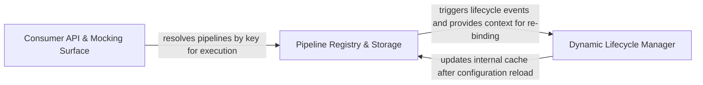

## Details

Provides a centralized store for managing the lifecycle of pipelines and policies. It integrates with .NET Dependency Injection to allow for dynamic retrieval and reloading of resilience configurations.

### Pipeline Registry & Storage
The core storage engine that manages the mapping between keys and resilience pipelines, ensuring thread-safe access and providing the primary API for manual pipeline retrieval and registration.

**Related Classes/Methods**: _None_

**Source Files:**

- [`src/Snippets/Docs/DependencyInjection.cs`](https://github.com/CodeBoarding/Polly/blob/main/.codeboardingsrc/Snippets/Docs/DependencyInjection.cs)
  - `Docs.DependencyInjection.KeyedServicesDefine(IServiceCollection services)` ([L90-L108](https://github.com/CodeBoarding/Polly/blob/main/.codeboardingsrc/Snippets/Docs/DependencyInjection.cs#L90-L108)) - Method
  - `Docs.DependencyInjection.MyApi` ([L111-L128](https://github.com/CodeBoarding/Polly/blob/main/.codeboardingsrc/Snippets/Docs/DependencyInjection.cs#L111-L128)) - Class
  - `Docs.DependencyInjection.MyApi.MyApi(ResiliencePipeline pipeline, ResiliencePipeline<HttpResponseMessage> genericPipeline)` ([L116-L127](https://github.com/CodeBoarding/Polly/blob/main/.codeboardingsrc/Snippets/Docs/DependencyInjection.cs#L116-L127)) - Constructor
  - `Docs.DependencyInjection.DeferredAddition(IServiceCollection services)` ([L131-L159](https://github.com/CodeBoarding/Polly/blob/main/.codeboardingsrc/Snippets/Docs/DependencyInjection.cs#L131-L159)) - Method
  - `Docs.DependencyInjection.DynamicReloads(IServiceCollection services, IConfigurationSection configurationSection)` ([L160-L180](https://github.com/CodeBoarding/Polly/blob/main/.codeboardingsrc/Snippets/Docs/DependencyInjection.cs#L160-L180)) - Method
  - `Docs.DependencyInjection.PipelineNameComparer` ([L224-L230](https://github.com/CodeBoarding/Polly/blob/main/.codeboardingsrc/Snippets/Docs/DependencyInjection.cs#L224-L230)) - Class
  - `Docs.DependencyInjection.PipelineNameComparer.Equals(MyPipelineKey x, MyPipelineKey y)` ([L226-L227](https://github.com/CodeBoarding/Polly/blob/main/.codeboardingsrc/Snippets/Docs/DependencyInjection.cs#L226-L227)) - Method
  - `Docs.DependencyInjection.PipelineNameComparer.GetHashCode(MyPipelineKey obj)` ([L228-L229](https://github.com/CodeBoarding/Polly/blob/main/.codeboardingsrc/Snippets/Docs/DependencyInjection.cs#L228-L229)) - Method
  - `Docs.DependencyInjection.ConfigureRegistry(IServiceCollection services)` ([L233-L249](https://github.com/CodeBoarding/Polly/blob/main/.codeboardingsrc/Snippets/Docs/DependencyInjection.cs#L233-L249)) - Method
  - `Docs.DependencyInjection.Pattern_1()` ([L287-L305](https://github.com/CodeBoarding/Polly/blob/main/.codeboardingsrc/Snippets/Docs/DependencyInjection.cs#L287-L305)) - Method

### Dynamic Lifecycle Manager
Manages the hot-swapping of pipelines by monitoring configuration changes via the Options pattern and handling the graceful disposal of old pipeline instances while initializing new ones.

**Related Classes/Methods**: _None_

**Source Files:**

- [`src/Polly.Extensions/DependencyInjection/AddResiliencePipelineContext.cs`](https://github.com/CodeBoarding/Polly/blob/main/.codeboardingsrc/Polly.Extensions/DependencyInjection/AddResiliencePipelineContext.cs)
  - `DependencyInjection.AddResiliencePipelineContext.AddResiliencePipelineContext<TKey>.EnableReloads<TOptions>(string name = null)` ([L48-L50](https://github.com/CodeBoarding/Polly/blob/main/.codeboardingsrc/Polly.Extensions/DependencyInjection/AddResiliencePipelineContext.cs#L48-L50)) - Method
  - `DependencyInjection.AddResiliencePipelineContext.AddResiliencePipelineContext<TKey>.GetOptions<TOptions>(string name = null)` ([L60-L65](https://github.com/CodeBoarding/Polly/blob/main/.codeboardingsrc/Polly.Extensions/DependencyInjection/AddResiliencePipelineContext.cs#L60-L65)) - Method
  - `DependencyInjection.AddResiliencePipelineContext.AddResiliencePipelineContext<TKey>.OnPipelineDisposed(Action callback)` ([L70-L72](https://github.com/CodeBoarding/Polly/blob/main/.codeboardingsrc/Polly.Extensions/DependencyInjection/AddResiliencePipelineContext.cs#L70-L72)) - Method
- [`src/Polly.Extensions/Registry/ConfigureBuilderContextExtensions.cs`](https://github.com/CodeBoarding/Polly/blob/main/.codeboardingsrc/Polly.Extensions/Registry/ConfigureBuilderContextExtensions.cs)
  - `Registry.ConfigureBuilderContextExtensions` ([L11-L58](https://github.com/CodeBoarding/Polly/blob/main/.codeboardingsrc/Polly.Extensions/Registry/ConfigureBuilderContextExtensions.cs#L11-L58)) - Class
  - `Registry.ConfigureBuilderContextExtensions.EnableReloads<TKey, TOptions>(this ConfigureBuilderContext<TKey> context, IOptionsMonitor<TOptions> optionsMonitor, string name = null)` ([L28-L57](https://github.com/CodeBoarding/Polly/blob/main/.codeboardingsrc/Polly.Extensions/Registry/ConfigureBuilderContextExtensions.cs#L28-L57)) - Method

### Consumer API & Mocking Surface
Defines the interface through which application code interacts with the registry, focusing on the resolution phase and providing abstractions for unit testing and mocking pipeline behavior.

**Related Classes/Methods**: _None_

**Source Files:**

- [`src/Snippets/Docs/DependencyInjection.cs`](https://github.com/CodeBoarding/Polly/blob/main/.codeboardingsrc/Snippets/Docs/DependencyInjection.cs)
  - `Docs.DependencyInjection` ([L15-L306](https://github.com/CodeBoarding/Polly/blob/main/.codeboardingsrc/Snippets/Docs/DependencyInjection.cs#L15-L306)) - Class
- [`src/Snippets/Docs/Testing.cs`](https://github.com/CodeBoarding/Polly/blob/main/.codeboardingsrc/Snippets/Docs/Testing.cs)
  - `Docs.Testing` ([L11-L84](https://github.com/CodeBoarding/Polly/blob/main/.codeboardingsrc/Snippets/Docs/Testing.cs#L11-L84)) - Class
  - `Docs.Testing.GetPipelineDescriptor()` ([L13-L42](https://github.com/CodeBoarding/Polly/blob/main/.codeboardingsrc/Snippets/Docs/Testing.cs#L13-L42)) - Method
  - `Docs.Testing.GetPipelineDescriptorGeneric()` ([L43-L64](https://github.com/CodeBoarding/Polly/blob/main/.codeboardingsrc/Snippets/Docs/Testing.cs#L43-L64)) - Method
  - `Docs.Testing.PipelineProviderProviderMocking()` ([L65-L83](https://github.com/CodeBoarding/Polly/blob/main/.codeboardingsrc/Snippets/Docs/Testing.cs#L65-L83)) - Method
  - `Docs.Testing.MyApi` ([L89-L109](https://github.com/CodeBoarding/Polly/blob/main/.codeboardingsrc/Snippets/Docs/Testing.cs#L89-L109)) - Class
  - `Docs.Testing.MyApi.MyApi(ResiliencePipelineProvider<string> pipelineProvider)` ([L94-L98](https://github.com/CodeBoarding/Polly/blob/main/.codeboardingsrc/Snippets/Docs/Testing.cs#L94-L98)) - Constructor
  - `Docs.Testing.MyApi.ExecuteAsync(CancellationToken cancellationToken)` ([L99-L108](https://github.com/CodeBoarding/Polly/blob/main/.codeboardingsrc/Snippets/Docs/Testing.cs#L99-L108)) - Method
  - `Docs.Testing.MyApiExtensions` ([L111-L126](https://github.com/CodeBoarding/Polly/blob/main/.codeboardingsrc/Snippets/Docs/Testing.cs#L111-L126)) - Class
  - `Docs.Testing.MyApiExtensions.AddMyApi(this IServiceCollection services)` ([L113-L125](https://github.com/CodeBoarding/Polly/blob/main/.codeboardingsrc/Snippets/Docs/Testing.cs#L113-L125)) - Method

### [FAQ](https://github.com/CodeBoarding/GeneratedOnBoardings/tree/main?tab=readme-ov-file#faq)