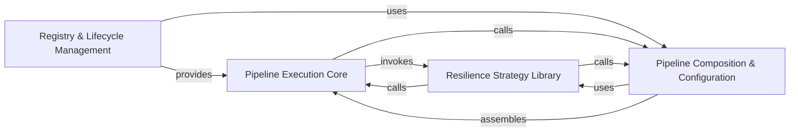

## Details

The core execution orchestrator of the modern Polly API. It manages the composition of multiple resilience strategies into a single execution unit and handles the state of each execution via a shared context.

### Pipeline Execution Core
The primary runtime engine that orchestrates the flow of execution through composed strategies, managing the ResilienceContext lifecycle and providing entry points for executing user-defined delegates.

**Related Classes/Methods**: _None_

**Source Files:**

- [`bench/Polly.Core.Benchmarks/PollyVersion.cs`](https://github.com/CodeBoarding/Polly/blob/main/.codeboardingbench/Polly.Core.Benchmarks/PollyVersion.cs)
  - `PollyVersion` ([L3-L8](https://github.com/CodeBoarding/Polly/blob/main/.codeboardingbench/Polly.Core.Benchmarks/PollyVersion.cs#L3-L8)) - Enum
- [`samples/Chaos/TodoModel.cs`](https://github.com/CodeBoarding/Polly/blob/main/.codeboardingsamples/Chaos/TodoModel.cs)
  - `TodoModel` ([L5-L7](https://github.com/CodeBoarding/Polly/blob/main/.codeboardingsamples/Chaos/TodoModel.cs#L5-L7)) - Class
- [`samples/Chaos/TodosClient.cs`](https://github.com/CodeBoarding/Polly/blob/main/.codeboardingsamples/Chaos/TodosClient.cs)
  - `TodosClient` ([L3-L8](https://github.com/CodeBoarding/Polly/blob/main/.codeboardingsamples/Chaos/TodosClient.cs#L3-L8)) - Class
  - `TodosClient.GetTodosAsync(CancellationToken cancellationToken)` ([L5-L7](https://github.com/CodeBoarding/Polly/blob/main/.codeboardingsamples/Chaos/TodosClient.cs#L5-L7)) - Method
- [`samples/Extensibility/Proactive/TimingStrategyOptions.cs`](https://github.com/CodeBoarding/Polly/blob/main/.codeboardingsamples/Extensibility/Proactive/TimingStrategyOptions.cs)
  - `Proactive.TimingStrategyOptions` ([L8-L26](https://github.com/CodeBoarding/Polly/blob/main/.codeboardingsamples/Extensibility/Proactive/TimingStrategyOptions.cs#L8-L26)) - Class
  - `Proactive.TimingStrategyOptions.TimingStrategyOptions()` ([L10-L15](https://github.com/CodeBoarding/Polly/blob/main/.codeboardingsamples/Extensibility/Proactive/TimingStrategyOptions.cs#L10-L15)) - Constructor
- [`samples/Extensibility/Reactive/ResultReportingStrategyOptions.cs`](https://github.com/CodeBoarding/Polly/blob/main/.codeboardingsamples/Extensibility/Reactive/ResultReportingStrategyOptions.cs)
  - `Reactive.ResultReportingStrategyOptions.ResultReportingStrategyOptions<TResult>` ([L8-L30](https://github.com/CodeBoarding/Polly/blob/main/.codeboardingsamples/Extensibility/Reactive/ResultReportingStrategyOptions.cs#L8-L30)) - Class
  - `Reactive.ResultReportingStrategyOptions.ResultReportingStrategyOptions<TResult>.ResultReportingStrategyOptions()` ([L10-L15](https://github.com/CodeBoarding/Polly/blob/main/.codeboardingsamples/Extensibility/Reactive/ResultReportingStrategyOptions.cs#L10-L15)) - Constructor
  - `Reactive.ResultReportingStrategyOptions` ([L37-L40](https://github.com/CodeBoarding/Polly/blob/main/.codeboardingsamples/Extensibility/Reactive/ResultReportingStrategyOptions.cs#L37-L40)) - Class
- [`samples/Retries/ExecuteHelper.cs`](https://github.com/CodeBoarding/Polly/blob/main/.codeboardingsamples/Retries/ExecuteHelper.cs)
  - `ExecuteHelper` ([L5-L23](https://github.com/CodeBoarding/Polly/blob/main/.codeboardingsamples/Retries/ExecuteHelper.cs#L5-L23)) - Class
  - `ExecuteHelper.ExecuteUnstable()` ([L9-L22](https://github.com/CodeBoarding/Polly/blob/main/.codeboardingsamples/Retries/ExecuteHelper.cs#L9-L22)) - Method
- [`src/Polly.Core/CircuitBreaker/CircuitBreakerManualControl.cs`](https://github.com/CodeBoarding/Polly/blob/main/.codeboardingsrc/Polly.Core/CircuitBreaker/CircuitBreakerManualControl.cs)
  - `CircuitBreaker.CircuitBreakerManualControl.CircuitBreakerManualControl()` ([L19-L22](https://github.com/CodeBoarding/Polly/blob/main/.codeboardingsrc/Polly.Core/CircuitBreaker/CircuitBreakerManualControl.cs#L19-L22)) - Constructor
  - `CircuitBreaker.CircuitBreakerManualControl.CircuitBreakerManualControl(bool isIsolated)` ([L27-L28](https://github.com/CodeBoarding/Polly/blob/main/.codeboardingsrc/Polly.Core/CircuitBreaker/CircuitBreakerManualControl.cs#L27-L28)) - Constructor
  - `CircuitBreaker.CircuitBreakerManualControl.Initialize(Func<ResilienceContext, Task> onIsolate, Func<ResilienceContext, Task> onReset)` ([L31-L50](https://github.com/CodeBoarding/Polly/blob/main/.codeboardingsrc/Polly.Core/CircuitBreaker/CircuitBreakerManualControl.cs#L31-L50)) - Method
  - `CircuitBreaker.CircuitBreakerManualControl.Remove(Func<ResilienceContext, Task> onIsolate, Func<ResilienceContext, Task> onReset)` ([L51-L59](https://github.com/CodeBoarding/Polly/blob/main/.codeboardingsrc/Polly.Core/CircuitBreaker/CircuitBreakerManualControl.cs#L51-L59)) - Method
  - `CircuitBreaker.CircuitBreakerManualControl.IsolateAsync(CancellationToken cancellationToken = default(CancellationToken))` ([L66-L89](https://github.com/CodeBoarding/Polly/blob/main/.codeboardingsrc/Polly.Core/CircuitBreaker/CircuitBreakerManualControl.cs#L66-L89)) - Method
  - `CircuitBreaker.CircuitBreakerManualControl.CloseAsync(CancellationToken cancellationToken = default(CancellationToken))` ([L96-L119](https://github.com/CodeBoarding/Polly/blob/main/.codeboardingsrc/Polly.Core/CircuitBreaker/CircuitBreakerManualControl.cs#L96-L119)) - Method
  - `CircuitBreaker.CircuitBreakerManualControl.RegistrationDisposable` ([L120-L128](https://github.com/CodeBoarding/Polly/blob/main/.codeboardingsrc/Polly.Core/CircuitBreaker/CircuitBreakerManualControl.cs#L120-L128)) - Class
- [`src/Polly.Core/CircuitBreaker/CircuitBreakerStrategyOptions.TResult.cs`](https://github.com/CodeBoarding/Polly/blob/main/.codeboardingsrc/Polly.Core/CircuitBreaker/CircuitBreakerStrategyOptions.TResult.cs)
  - `CircuitBreaker.CircuitBreakerStrategyOptions.TResult.CircuitBreakerStrategyOptions<TResult>` ([L25-L150](https://github.com/CodeBoarding/Polly/blob/main/.codeboardingsrc/Polly.Core/CircuitBreaker/CircuitBreakerStrategyOptions.TResult.cs#L25-L150)) - Class
  - `CircuitBreaker.CircuitBreakerStrategyOptions.TResult.CircuitBreakerStrategyOptions<TResult>.CircuitBreakerStrategyOptions()` ([L30-L31](https://github.com/CodeBoarding/Polly/blob/main/.codeboardingsrc/Polly.Core/CircuitBreaker/CircuitBreakerStrategyOptions.TResult.cs#L30-L31)) - Constructor
- [`src/Polly.Core/DelayBackoffType.cs`](https://github.com/CodeBoarding/Polly/blob/main/.codeboardingsrc/Polly.Core/DelayBackoffType.cs)
  - `DelayBackoffType` ([L6-L40](https://github.com/CodeBoarding/Polly/blob/main/.codeboardingsrc/Polly.Core/DelayBackoffType.cs#L6-L40)) - Enum
- [`src/Polly.Core/Fallback/FallbackStrategyOptions.TResult.cs`](https://github.com/CodeBoarding/Polly/blob/main/.codeboardingsrc/Polly.Core/Fallback/FallbackStrategyOptions.TResult.cs)
  - `Fallback.FallbackStrategyOptions.TResult.FallbackStrategyOptions<TResult>` ([L9-L42](https://github.com/CodeBoarding/Polly/blob/main/.codeboardingsrc/Polly.Core/Fallback/FallbackStrategyOptions.TResult.cs#L9-L42)) - Class
  - `Fallback.FallbackStrategyOptions.TResult.FallbackStrategyOptions<TResult>.FallbackStrategyOptions()` ([L14-L15](https://github.com/CodeBoarding/Polly/blob/main/.codeboardingsrc/Polly.Core/Fallback/FallbackStrategyOptions.TResult.cs#L14-L15)) - Constructor
- [`src/Polly.Core/Hedging/Controller/HedgedTaskType.cs`](https://github.com/CodeBoarding/Polly/blob/main/.codeboardingsrc/Polly.Core/Hedging/Controller/HedgedTaskType.cs)
  - `Hedging.Controller.HedgedTaskType` ([L3-L8](https://github.com/CodeBoarding/Polly/blob/main/.codeboardingsrc/Polly.Core/Hedging/Controller/HedgedTaskType.cs#L3-L8)) - Enum
- [`src/Polly.Core/Hedging/Controller/HedgingController.cs`](https://github.com/CodeBoarding/Polly/blob/main/.codeboardingsrc/Polly.Core/Hedging/Controller/HedgingController.cs)
  - `Hedging.Controller.HedgingController.HedgingController<T>` ([L6-L63](https://github.com/CodeBoarding/Polly/blob/main/.codeboardingsrc/Polly.Core/Hedging/Controller/HedgingController.cs#L6-L63)) - Class
  - `Hedging.Controller.HedgingController.HedgingController<T>.HedgingController(ResilienceStrategyTelemetry telemetry, TimeProvider provider, HedgingHandler<T> handler, int maxAttempts)` ([L13-L51](https://github.com/CodeBoarding/Polly/blob/main/.codeboardingsrc/Polly.Core/Hedging/Controller/HedgingController.cs#L13-L51)) - Constructor
  - `Hedging.Controller.HedgingController.HedgingController<T>.GetContext(ResilienceContext context)` ([L56-L62](https://github.com/CodeBoarding/Polly/blob/main/.codeboardingsrc/Polly.Core/Hedging/Controller/HedgingController.cs#L56-L62)) - Method
- [`src/Polly.Core/Hedging/Controller/HedgingExecutionContext.cs`](https://github.com/CodeBoarding/Polly/blob/main/.codeboardingsrc/Polly.Core/Hedging/Controller/HedgingExecutionContext.cs)
  - `Hedging.Controller.HedgingExecutionContext.HedgingExecutionContext<T>` ([L9-L212](https://github.com/CodeBoarding/Polly/blob/main/.codeboardingsrc/Polly.Core/Hedging/Controller/HedgingExecutionContext.cs#L9-L212)) - Class
  - `Hedging.Controller.HedgingExecutionContext.HedgingExecutionContext<T>.ExecutionInfo<TResult>` ([L11-L12](https://github.com/CodeBoarding/Polly/blob/main/.codeboardingsrc/Polly.Core/Hedging/Controller/HedgingExecutionContext.cs#L11-L12)) - Struct
  - `Hedging.Controller.HedgingExecutionContext.HedgingExecutionContext<T>.HedgingExecutionContext(ObjectPool<TaskExecution<T>> executionPool, TimeProvider timeProvider, int maxAttempts, Action<HedgingExecutionContext<T>> onReset)` ([L20-L31](https://github.com/CodeBoarding/Polly/blob/main/.codeboardingsrc/Polly.Core/Hedging/Controller/HedgingExecutionContext.cs#L20-L31)) - Constructor
  - `Hedging.Controller.HedgingExecutionContext.HedgingExecutionContext<T>.Initialize(ResilienceContext context)` ([L32-L33](https://github.com/CodeBoarding/Polly/blob/main/.codeboardingsrc/Polly.Core/Hedging/Controller/HedgingExecutionContext.cs#L32-L33)) - Method
  - `Hedging.Controller.HedgingExecutionContext.HedgingExecutionContext<T>.LoadExecutionAsync<TState>(Func<ResilienceContext, TState, ValueTask<Outcome<T>>> primaryCallback, TState state)` ([L44-L75](https://github.com/CodeBoarding/Polly/blob/main/.codeboardingsrc/Polly.Core/Hedging/Controller/HedgingExecutionContext.cs#L44-L75)) - Method
  - `Hedging.Controller.HedgingExecutionContext.HedgingExecutionContext<T>.DisposeAsync()` ([L76-L95](https://github.com/CodeBoarding/Polly/blob/main/.codeboardingsrc/Polly.Core/Hedging/Controller/HedgingExecutionContext.cs#L76-L95)) - Method
  - `Hedging.Controller.HedgingExecutionContext.HedgingExecutionContext<T>.TryWaitForCompletedExecutionAsync(TimeSpan hedgingDelay)` ([L96-L154](https://github.com/CodeBoarding/Polly/blob/main/.codeboardingsrc/Polly.Core/Hedging/Controller/HedgingExecutionContext.cs#L96-L154)) - Method
  - `Hedging.Controller.HedgingExecutionContext.HedgingExecutionContext<T>.CreateExecutionInfoWhenNoExecution()` ([L155-L168](https://github.com/CodeBoarding/Polly/blob/main/.codeboardingsrc/Polly.Core/Hedging/Controller/HedgingExecutionContext.cs#L155-L168)) - Method
  - `Hedging.Controller.HedgingExecutionContext.HedgingExecutionContext<T>.WaitForTaskCompetitionAsync()` ([L169-L180](https://github.com/CodeBoarding/Polly/blob/main/.codeboardingsrc/Polly.Core/Hedging/Controller/HedgingExecutionContext.cs#L169-L180)) - Method
  - `Hedging.Controller.HedgingExecutionContext.HedgingExecutionContext<T>.TryRemoveExecutedTask()` ([L181-L193](https://github.com/CodeBoarding/Polly/blob/main/.codeboardingsrc/Polly.Core/Hedging/Controller/HedgingExecutionContext.cs#L181-L193)) - Method
  - `Hedging.Controller.HedgingExecutionContext.HedgingExecutionContext<T>.UpdateOriginalContext()` ([L194-L201](https://github.com/CodeBoarding/Polly/blob/main/.codeboardingsrc/Polly.Core/Hedging/Controller/HedgingExecutionContext.cs#L194-L201)) - Method
  - `Hedging.Controller.HedgingExecutionContext.HedgingExecutionContext<T>.Reset()` ([L202-L211](https://github.com/CodeBoarding/Polly/blob/main/.codeboardingsrc/Polly.Core/Hedging/Controller/HedgingExecutionContext.cs#L202-L211)) - Method
- [`src/Polly.Core/Hedging/Controller/TaskExecution.cs`](https://github.com/CodeBoarding/Polly/blob/main/.codeboardingsrc/Polly.Core/Hedging/Controller/TaskExecution.cs)
  - `Hedging.Controller.TaskExecution.TaskExecution<T>` ([L21-L242](https://github.com/CodeBoarding/Polly/blob/main/.codeboardingsrc/Polly.Core/Hedging/Controller/TaskExecution.cs#L21-L242)) - Class
- [`src/Polly.Core/Hedging/HedgingConstants.cs`](https://github.com/CodeBoarding/Polly/blob/main/.codeboardingsrc/Polly.Core/Hedging/HedgingConstants.cs)
  - `Hedging.HedgingConstants` ([L3-L17](https://github.com/CodeBoarding/Polly/blob/main/.codeboardingsrc/Polly.Core/Hedging/HedgingConstants.cs#L3-L17)) - Class
- [`src/Polly.Core/Hedging/HedgingDelayGeneratorArguments.cs`](https://github.com/CodeBoarding/Polly/blob/main/.codeboardingsrc/Polly.Core/Hedging/HedgingDelayGeneratorArguments.cs)
  - `Hedging.HedgingDelayGeneratorArguments` ([L11-L34](https://github.com/CodeBoarding/Polly/blob/main/.codeboardingsrc/Polly.Core/Hedging/HedgingDelayGeneratorArguments.cs#L11-L34)) - Struct
  - `Hedging.HedgingDelayGeneratorArguments.HedgingDelayGeneratorArguments(ResilienceContext context, int attemptNumber)` ([L18-L23](https://github.com/CodeBoarding/Polly/blob/main/.codeboardingsrc/Polly.Core/Hedging/HedgingDelayGeneratorArguments.cs#L18-L23)) - Constructor
- [`src/Polly.Core/Hedging/HedgingResiliencePipelineBuilderExtensions.cs`](https://github.com/CodeBoarding/Polly/blob/main/.codeboardingsrc/Polly.Core/Hedging/HedgingResiliencePipelineBuilderExtensions.cs)
  - `Hedging.HedgingResiliencePipelineBuilderExtensions` ([L11-L49](https://github.com/CodeBoarding/Polly/blob/main/.codeboardingsrc/Polly.Core/Hedging/HedgingResiliencePipelineBuilderExtensions.cs#L11-L49)) - Class
- [`src/Polly.Core/Hedging/HedgingResilienceStrategy.cs`](https://github.com/CodeBoarding/Polly/blob/main/.codeboardingsrc/Polly.Core/Hedging/HedgingResilienceStrategy.cs)
  - `Hedging.HedgingResilienceStrategy.HedgingResilienceStrategy<T>.HedgingResilienceStrategy(TimeSpan hedgingDelay, int maxHedgedAttempts, HedgingHandler<T> hedgingHandler, Func<HedgingDelayGeneratorArguments, ValueTask<TimeSpan>> hedgingDelayGenerator, TimeProvider timeProvider, ResilienceStrategyTelemetry telemetry)` ([L10-L24](https://github.com/CodeBoarding/Polly/blob/main/.codeboardingsrc/Polly.Core/Hedging/HedgingResilienceStrategy.cs#L10-L24)) - Constructor
  - `Hedging.HedgingResilienceStrategy.HedgingResilienceStrategy<T>.ExecuteCore<TState>(Func<ResilienceContext, TState, ValueTask<Outcome<T>>> callback, ResilienceContext context, TState state)` ([L33-L84](https://github.com/CodeBoarding/Polly/blob/main/.codeboardingsrc/Polly.Core/Hedging/HedgingResilienceStrategy.cs#L33-L84)) - Method
  - `Hedging.HedgingResilienceStrategy.HedgingResilienceStrategy<T>.GetHedgingDelayAsync(ResilienceContext context, int attempt)` ([L85-L94](https://github.com/CodeBoarding/Polly/blob/main/.codeboardingsrc/Polly.Core/Hedging/HedgingResilienceStrategy.cs#L85-L94)) - Method
- [`src/Polly.Core/Hedging/HedgingStrategyOptions.TResult.cs`](https://github.com/CodeBoarding/Polly/blob/main/.codeboardingsrc/Polly.Core/Hedging/HedgingStrategyOptions.TResult.cs)
  - `Hedging.HedgingStrategyOptions.TResult.HedgingStrategyOptions<TResult>` ([L9-L93](https://github.com/CodeBoarding/Polly/blob/main/.codeboardingsrc/Polly.Core/Hedging/HedgingStrategyOptions.TResult.cs#L9-L93)) - Class
  - `Hedging.HedgingStrategyOptions.TResult.HedgingStrategyOptions<TResult>.HedgingStrategyOptions()` ([L14-L15](https://github.com/CodeBoarding/Polly/blob/main/.codeboardingsrc/Polly.Core/Hedging/HedgingStrategyOptions.TResult.cs#L14-L15)) - Constructor
- [`src/Polly.Core/PredicateBuilder.cs`](https://github.com/CodeBoarding/Polly/blob/main/.codeboardingsrc/Polly.Core/PredicateBuilder.cs)
  - `PredicateBuilder` ([L6-L9](https://github.com/CodeBoarding/Polly/blob/main/.codeboardingsrc/Polly.Core/PredicateBuilder.cs#L6-L9)) - Class
- [`src/Polly.Core/PredicateResult.cs`](https://github.com/CodeBoarding/Polly/blob/main/.codeboardingsrc/Polly.Core/PredicateResult.cs)
  - `PredicateResult` ([L6-L20](https://github.com/CodeBoarding/Polly/blob/main/.codeboardingsrc/Polly.Core/PredicateResult.cs#L6-L20)) - Class
  - `PredicateResult.True()` ([L12-L13](https://github.com/CodeBoarding/Polly/blob/main/.codeboardingsrc/Polly.Core/PredicateResult.cs#L12-L13)) - Method
  - `PredicateResult.False()` ([L18-L19](https://github.com/CodeBoarding/Polly/blob/main/.codeboardingsrc/Polly.Core/PredicateResult.cs#L18-L19)) - Method
- [`src/Polly.Core/Registry/RegistryPipelineComponentBuilder.cs`](https://github.com/CodeBoarding/Polly/blob/main/.codeboardingsrc/Polly.Core/Registry/RegistryPipelineComponentBuilder.cs)
  - `Registry.RegistryPipelineComponentBuilder.RegistryPipelineComponentBuilder<TBuilder, TKey>` ([L9-L63](https://github.com/CodeBoarding/Polly/blob/main/.codeboardingsrc/Polly.Core/Registry/RegistryPipelineComponentBuilder.cs#L9-L63)) - Class
- [`src/Polly.Core/Registry/ResiliencePipelineProvider.cs`](https://github.com/CodeBoarding/Polly/blob/main/.codeboardingsrc/Polly.Core/Registry/ResiliencePipelineProvider.cs)
  - `Registry.ResiliencePipelineProvider.ResiliencePipelineProvider<TKey>` ([L9-L64](https://github.com/CodeBoarding/Polly/blob/main/.codeboardingsrc/Polly.Core/Registry/ResiliencePipelineProvider.cs#L9-L64)) - Class
  - `Registry.ResiliencePipelineProvider.ResiliencePipelineProvider<TKey>.GetPipeline(TKey key)` ([L18-L28](https://github.com/CodeBoarding/Polly/blob/main/.codeboardingsrc/Polly.Core/Registry/ResiliencePipelineProvider.cs#L18-L28)) - Method
  - `Registry.ResiliencePipelineProvider.ResiliencePipelineProvider<TKey>.GetPipeline<TResult>(TKey key)` ([L36-L46](https://github.com/CodeBoarding/Polly/blob/main/.codeboardingsrc/Polly.Core/Registry/ResiliencePipelineProvider.cs#L36-L46)) - Method
  - `Registry.ResiliencePipelineProvider.ResiliencePipelineProvider<TKey>.TryGetPipeline(TKey key, out ResiliencePipeline pipeline)` ([L53-L54](https://github.com/CodeBoarding/Polly/blob/main/.codeboardingsrc/Polly.Core/Registry/ResiliencePipelineProvider.cs#L53-L54)) - Method
  - `Registry.ResiliencePipelineProvider.ResiliencePipelineProvider<TKey>.TryGetPipeline<TResult>(TKey key, out ResiliencePipeline<TResult> pipeline)` ([L62-L63](https://github.com/CodeBoarding/Polly/blob/main/.codeboardingsrc/Polly.Core/Registry/ResiliencePipelineProvider.cs#L62-L63)) - Method
- [`src/Polly.Core/Registry/ResiliencePipelineRegistry.TResult.cs`](https://github.com/CodeBoarding/Polly/blob/main/.codeboardingsrc/Polly.Core/Registry/ResiliencePipelineRegistry.TResult.cs)
  - `Registry.ResiliencePipelineRegistry.TResult.ResiliencePipelineRegistry<TKey>` ([L5-L78](https://github.com/CodeBoarding/Polly/blob/main/.codeboardingsrc/Polly.Core/Registry/ResiliencePipelineRegistry.TResult.cs#L5-L78)) - Class
  - `Registry.ResiliencePipelineRegistry.TResult.ResiliencePipelineRegistry<TKey>.GenericRegistry<TResult>` ([L8-L77](https://github.com/CodeBoarding/Polly/blob/main/.codeboardingsrc/Polly.Core/Registry/ResiliencePipelineRegistry.TResult.cs#L8-L77)) - Class
  - `Registry.ResiliencePipelineRegistry.TResult.ResiliencePipelineRegistry<TKey>.GenericRegistry<TResult>.GenericRegistry(Func<ResiliencePipelineBuilder<TResult>> activator, IEqualityComparer<TKey> builderComparer, IEqualityComparer<TKey> strategyComparer, Func<TKey, string> builderNameFormatter, Func<TKey, string> instanceNameFormatter)` ([L17-L30](https://github.com/CodeBoarding/Polly/blob/main/.codeboardingsrc/Polly.Core/Registry/ResiliencePipelineRegistry.TResult.cs#L17-L30)) - Constructor
  - `Registry.ResiliencePipelineRegistry.TResult.ResiliencePipelineRegistry<TKey>.GenericRegistry<TResult>.TryGet(TKey key, out ResiliencePipeline<TResult> strategy)` ([L31-L47](https://github.com/CodeBoarding/Polly/blob/main/.codeboardingsrc/Polly.Core/Registry/ResiliencePipelineRegistry.TResult.cs#L31-L47)) - Method
  - `Registry.ResiliencePipelineRegistry.TResult.ResiliencePipelineRegistry<TKey>.GenericRegistry<TResult>.GetOrAdd(TKey key, Action<ResiliencePipelineBuilder<TResult>, ConfigureBuilderContext<TKey>> configure)` ([L48-L66](https://github.com/CodeBoarding/Polly/blob/main/.codeboardingsrc/Polly.Core/Registry/ResiliencePipelineRegistry.TResult.cs#L48-L66)) - Method
  - `Registry.ResiliencePipelineRegistry.TResult.ResiliencePipelineRegistry<TKey>.GenericRegistry<TResult>.TryAddBuilder(TKey key, Action<ResiliencePipelineBuilder<TResult>, ConfigureBuilderContext<TKey>> configure)` ([L67-L68](https://github.com/CodeBoarding/Polly/blob/main/.codeboardingsrc/Polly.Core/Registry/ResiliencePipelineRegistry.TResult.cs#L67-L68)) - Method
  - `Registry.ResiliencePipelineRegistry.TResult.ResiliencePipelineRegistry<TKey>.GenericRegistry<TResult>.DisposeAsync()` ([L69-L76](https://github.com/CodeBoarding/Polly/blob/main/.codeboardingsrc/Polly.Core/Registry/ResiliencePipelineRegistry.TResult.cs#L69-L76)) - Method
- [`src/Polly.Core/Registry/ResiliencePipelineRegistry.cs`](https://github.com/CodeBoarding/Polly/blob/main/.codeboardingsrc/Polly.Core/Registry/ResiliencePipelineRegistry.cs)
  - `Registry.ResiliencePipelineRegistry.ResiliencePipelineRegistry<TKey>` ([L18-L272](https://github.com/CodeBoarding/Polly/blob/main/.codeboardingsrc/Polly.Core/Registry/ResiliencePipelineRegistry.cs#L18-L272)) - Class
  - `Registry.ResiliencePipelineRegistry.ResiliencePipelineRegistry<TKey>.ResiliencePipelineRegistry()` ([L35-L39](https://github.com/CodeBoarding/Polly/blob/main/.codeboardingsrc/Polly.Core/Registry/ResiliencePipelineRegistry.cs#L35-L39)) - Constructor
  - `Registry.ResiliencePipelineRegistry.ResiliencePipelineRegistry<TKey>.ResiliencePipelineRegistry(ResiliencePipelineRegistryOptions<TKey> options)` ([L46-L62](https://github.com/CodeBoarding/Polly/blob/main/.codeboardingsrc/Polly.Core/Registry/ResiliencePipelineRegistry.cs#L46-L62)) - Constructor
  - `Registry.ResiliencePipelineRegistry.ResiliencePipelineRegistry<TKey>.TryGetPipeline<TResult>(TKey key, out ResiliencePipeline<TResult> pipeline)` ([L64-L70](https://github.com/CodeBoarding/Polly/blob/main/.codeboardingsrc/Polly.Core/Registry/ResiliencePipelineRegistry.cs#L64-L70)) - Method
  - `Registry.ResiliencePipelineRegistry.ResiliencePipelineRegistry<TKey>.TryGetPipeline(TKey key, out ResiliencePipeline pipeline)` ([L72-L90](https://github.com/CodeBoarding/Polly/blob/main/.codeboardingsrc/Polly.Core/Registry/ResiliencePipelineRegistry.cs#L72-L90)) - Method
  - `Registry.ResiliencePipelineRegistry.ResiliencePipelineRegistry<TKey>.GetOrAddPipeline(TKey key, Action<ResiliencePipelineBuilder> configure)` ([L98-L106](https://github.com/CodeBoarding/Polly/blob/main/.codeboardingsrc/Polly.Core/Registry/ResiliencePipelineRegistry.cs#L98-L106)) - Method
  - `Registry.ResiliencePipelineRegistry.ResiliencePipelineRegistry<TKey>.GetOrAddPipeline(TKey key, Action<ResiliencePipelineBuilder, ConfigureBuilderContext<TKey>> configure)` ([L114-L136](https://github.com/CodeBoarding/Polly/blob/main/.codeboardingsrc/Polly.Core/Registry/ResiliencePipelineRegistry.cs#L114-L136)) - Method
  - `Registry.ResiliencePipelineRegistry.ResiliencePipelineRegistry<TKey>.GetOrAddPipeline<TResult>(TKey key, Action<ResiliencePipelineBuilder<TResult>> configure)` ([L145-L153](https://github.com/CodeBoarding/Polly/blob/main/.codeboardingsrc/Polly.Core/Registry/ResiliencePipelineRegistry.cs#L145-L153)) - Method
  - `Registry.ResiliencePipelineRegistry.ResiliencePipelineRegistry<TKey>.GetOrAddPipeline<TResult>(TKey key, Action<ResiliencePipelineBuilder<TResult>, ConfigureBuilderContext<TKey>> configure)` ([L162-L170](https://github.com/CodeBoarding/Polly/blob/main/.codeboardingsrc/Polly.Core/Registry/ResiliencePipelineRegistry.cs#L162-L170)) - Method
  - `Registry.ResiliencePipelineRegistry.ResiliencePipelineRegistry<TKey>.TryAddBuilder(TKey key, Action<ResiliencePipelineBuilder, ConfigureBuilderContext<TKey>> configure)` ([L182-L190](https://github.com/CodeBoarding/Polly/blob/main/.codeboardingsrc/Polly.Core/Registry/ResiliencePipelineRegistry.cs#L182-L190)) - Method
  - `Registry.ResiliencePipelineRegistry.ResiliencePipelineRegistry<TKey>.TryAddBuilder<TResult>(TKey key, Action<ResiliencePipelineBuilder<TResult>, ConfigureBuilderContext<TKey>> configure)` ([L203-L211](https://github.com/CodeBoarding/Polly/blob/main/.codeboardingsrc/Polly.Core/Registry/ResiliencePipelineRegistry.cs#L203-L211)) - Method
  - `Registry.ResiliencePipelineRegistry.ResiliencePipelineRegistry<TKey>.Dispose()` ([L219-L220](https://github.com/CodeBoarding/Polly/blob/main/.codeboardingsrc/Polly.Core/Registry/ResiliencePipelineRegistry.cs#L219-L220)) - Method
  - `Registry.ResiliencePipelineRegistry.ResiliencePipelineRegistry<TKey>.DisposeAsync()` ([L229-L248](https://github.com/CodeBoarding/Polly/blob/main/.codeboardingsrc/Polly.Core/Registry/ResiliencePipelineRegistry.cs#L229-L248)) - Method
  - `Registry.ResiliencePipelineRegistry.ResiliencePipelineRegistry<TKey>.GetGenericRegistry<TResult>()` ([L249-L263](https://github.com/CodeBoarding/Polly/blob/main/.codeboardingsrc/Polly.Core/Registry/ResiliencePipelineRegistry.cs#L249-L263)) - Method
  - `Registry.ResiliencePipelineRegistry.ResiliencePipelineRegistry<TKey>.EnsureNotDisposed()` ([L264-L271](https://github.com/CodeBoarding/Polly/blob/main/.codeboardingsrc/Polly.Core/Registry/ResiliencePipelineRegistry.cs#L264-L271)) - Method
- [`src/Polly.Core/ResilienceContext.cs`](https://github.com/CodeBoarding/Polly/blob/main/.codeboardingsrc/Polly.Core/ResilienceContext.cs)
  - `ResilienceContext` ([L14-L109](https://github.com/CodeBoarding/Polly/blob/main/.codeboardingsrc/Polly.Core/ResilienceContext.cs#L14-L109)) - Class
  - `ResilienceContext.ResilienceContext()` ([L16-L19](https://github.com/CodeBoarding/Polly/blob/main/.codeboardingsrc/Polly.Core/ResilienceContext.cs#L16-L19)) - Constructor
  - `ResilienceContext.InitializeFrom(ResilienceContext context, CancellationToken cancellationToken)` ([L66-L76](https://github.com/CodeBoarding/Polly/blob/main/.codeboardingsrc/Polly.Core/ResilienceContext.cs#L66-L76)) - Method
  - `ResilienceContext.AssertInitialized()` ([L80-L81](https://github.com/CodeBoarding/Polly/blob/main/.codeboardingsrc/Polly.Core/ResilienceContext.cs#L80-L81)) - Method
  - `ResilienceContext.Initialize<TResult>(bool isSynchronous)` ([L83-L90](https://github.com/CodeBoarding/Polly/blob/main/.codeboardingsrc/Polly.Core/ResilienceContext.cs#L83-L90)) - Method
  - `ResilienceContext.Reset()` ([L91-L101](https://github.com/CodeBoarding/Polly/blob/main/.codeboardingsrc/Polly.Core/ResilienceContext.cs#L91-L101)) - Method
  - `ResilienceContext.UnknownResult` ([L106-L107](https://github.com/CodeBoarding/Polly/blob/main/.codeboardingsrc/Polly.Core/ResilienceContext.cs#L106-L107)) - Class
- [`src/Polly.Core/ResilienceContextCreationArguments.cs`](https://github.com/CodeBoarding/Polly/blob/main/.codeboardingsrc/Polly.Core/ResilienceContextCreationArguments.cs)
  - `ResilienceContextCreationArguments` ([L8-L38](https://github.com/CodeBoarding/Polly/blob/main/.codeboardingsrc/Polly.Core/ResilienceContextCreationArguments.cs#L8-L38)) - Struct
  - `ResilienceContextCreationArguments.ResilienceContextCreationArguments(string operationKey, bool? continueOnCapturedContext, CancellationToken cancellationToken)` ([L16-L22](https://github.com/CodeBoarding/Polly/blob/main/.codeboardingsrc/Polly.Core/ResilienceContextCreationArguments.cs#L16-L22)) - Constructor
- [`src/Polly.Core/ResilienceContextPool.Shared.cs`](https://github.com/CodeBoarding/Polly/blob/main/.codeboardingsrc/Polly.Core/ResilienceContextPool.Shared.cs)
  - `ResilienceContextPool.Shared.ResilienceContextPool` ([L3-L25](https://github.com/CodeBoarding/Polly/blob/main/.codeboardingsrc/Polly.Core/ResilienceContextPool.Shared.cs#L3-L25)) - Class
  - `ResilienceContextPool.Shared.ResilienceContextPool.SharedPool` ([L7-L24](https://github.com/CodeBoarding/Polly/blob/main/.codeboardingsrc/Polly.Core/ResilienceContextPool.Shared.cs#L7-L24)) - Class
  - `ResilienceContextPool.Shared.ResilienceContextPool.SharedPool.Get(ResilienceContextCreationArguments arguments)` ([L11-L21](https://github.com/CodeBoarding/Polly/blob/main/.codeboardingsrc/Polly.Core/ResilienceContextPool.Shared.cs#L11-L21)) - Method
  - `ResilienceContextPool.Shared.ResilienceContextPool.SharedPool.Return(ResilienceContext context)` ([L22-L23](https://github.com/CodeBoarding/Polly/blob/main/.codeboardingsrc/Polly.Core/ResilienceContextPool.Shared.cs#L22-L23)) - Method
- [`src/Polly.Core/ResilienceContextPool.cs`](https://github.com/CodeBoarding/Polly/blob/main/.codeboardingsrc/Polly.Core/ResilienceContextPool.cs)
  - `ResilienceContextPool` ([L9-L84](https://github.com/CodeBoarding/Polly/blob/main/.codeboardingsrc/Polly.Core/ResilienceContextPool.cs#L9-L84)) - Class
  - `ResilienceContextPool.Get(CancellationToken cancellationToken = default(CancellationToken))` ([L25-L26](https://github.com/CodeBoarding/Polly/blob/main/.codeboardingsrc/Polly.Core/ResilienceContextPool.cs#L25-L26)) - Method
  - `ResilienceContextPool.Get(string operationKey, CancellationToken cancellationToken = default(CancellationToken))` ([L37-L38](https://github.com/CodeBoarding/Polly/blob/main/.codeboardingsrc/Polly.Core/ResilienceContextPool.cs#L37-L38)) - Method
  - `ResilienceContextPool.Get(string operationKey, bool? continueOnCapturedContext, CancellationToken cancellationToken = default(CancellationToken))` ([L50-L52](https://github.com/CodeBoarding/Polly/blob/main/.codeboardingsrc/Polly.Core/ResilienceContextPool.cs#L50-L52)) - Method
  - `ResilienceContextPool.Get(bool continueOnCapturedContext, CancellationToken cancellationToken = default(CancellationToken))` ([L63-L65](https://github.com/CodeBoarding/Polly/blob/main/.codeboardingsrc/Polly.Core/ResilienceContextPool.cs#L63-L65)) - Method
  - `ResilienceContextPool.Get(ResilienceContextCreationArguments arguments)` ([L75-L76](https://github.com/CodeBoarding/Polly/blob/main/.codeboardingsrc/Polly.Core/ResilienceContextPool.cs#L75-L76)) - Method
  - `ResilienceContextPool.Return(ResilienceContext context)` ([L82-L83](https://github.com/CodeBoarding/Polly/blob/main/.codeboardingsrc/Polly.Core/ResilienceContextPool.cs#L82-L83)) - Method
- [`src/Polly.Core/ResiliencePipeline.Async.cs`](https://github.com/CodeBoarding/Polly/blob/main/.codeboardingsrc/Polly.Core/ResiliencePipeline.Async.cs)
  - `ResiliencePipeline.Async.ResiliencePipeline` ([L6-L171](https://github.com/CodeBoarding/Polly/blob/main/.codeboardingsrc/Polly.Core/ResiliencePipeline.Async.cs#L6-L171)) - Class
  - `ResiliencePipeline.Async.ResiliencePipeline.ExecuteAsync<TState>(Func<ResilienceContext, TState, ValueTask> callback, ResilienceContext context, TState state)` ([L17-L45](https://github.com/CodeBoarding/Polly/blob/main/.codeboardingsrc/Polly.Core/ResiliencePipeline.Async.cs#L17-L45)) - Method
  - `ResiliencePipeline.Async.ResiliencePipeline.ExecuteAsync(Func<ResilienceContext, ValueTask> callback, ResilienceContext context)` ([L53-L80](https://github.com/CodeBoarding/Polly/blob/main/.codeboardingsrc/Polly.Core/ResiliencePipeline.Async.cs#L53-L80)) - Method
  - `ResiliencePipeline.Async.ResiliencePipeline.ExecuteAsync<TState>(Func<TState, CancellationToken, ValueTask> callback, TState state, CancellationToken cancellationToken = default(CancellationToken))` ([L90-L124](https://github.com/CodeBoarding/Polly/blob/main/.codeboardingsrc/Polly.Core/ResiliencePipeline.Async.cs#L90-L124)) - Method
  - `ResiliencePipeline.Async.ResiliencePipeline.ExecuteAsync(Func<CancellationToken, ValueTask> callback, CancellationToken cancellationToken = default(CancellationToken))` ([L132-L166](https://github.com/CodeBoarding/Polly/blob/main/.codeboardingsrc/Polly.Core/ResiliencePipeline.Async.cs#L132-L166)) - Method
  - `ResiliencePipeline.Async.ResiliencePipeline.GetAsyncContext(CancellationToken cancellationToken)` ([L167-L168](https://github.com/CodeBoarding/Polly/blob/main/.codeboardingsrc/Polly.Core/ResiliencePipeline.Async.cs#L167-L168)) - Method
  - `ResiliencePipeline.Async.ResiliencePipeline.InitializeAsyncContext(ResilienceContext context)` ([L169-L170](https://github.com/CodeBoarding/Polly/blob/main/.codeboardingsrc/Polly.Core/ResiliencePipeline.Async.cs#L169-L170)) - Method
- [`src/Polly.Core/ResiliencePipeline.AsyncT.cs`](https://github.com/CodeBoarding/Polly/blob/main/.codeboardingsrc/Polly.Core/ResiliencePipeline.AsyncT.cs)
  - `ResiliencePipeline.AsyncT.ResiliencePipeline` ([L6-L212](https://github.com/CodeBoarding/Polly/blob/main/.codeboardingsrc/Polly.Core/ResiliencePipeline.AsyncT.cs#L6-L212)) - Class
  - `ResiliencePipeline.AsyncT.ResiliencePipeline.ExecuteOutcomeAsync<TResult, TState>(Func<ResilienceContext, TState, ValueTask<Outcome<TResult>>> callback, ResilienceContext context, TState state)` ([L25-L37](https://github.com/CodeBoarding/Polly/blob/main/.codeboardingsrc/Polly.Core/ResiliencePipeline.AsyncT.cs#L25-L37)) - Method
  - `ResiliencePipeline.AsyncT.ResiliencePipeline.ExecuteAsync<TResult, TState>(Func<ResilienceContext, TState, ValueTask<TResult>> callback, ResilienceContext context, TState state)` ([L48-L75](https://github.com/CodeBoarding/Polly/blob/main/.codeboardingsrc/Polly.Core/ResiliencePipeline.AsyncT.cs#L48-L75)) - Method
  - `ResiliencePipeline.AsyncT.ResiliencePipeline.ExecuteAsync<TResult>(Func<ResilienceContext, ValueTask<TResult>> callback, ResilienceContext context)` ([L84-L110](https://github.com/CodeBoarding/Polly/blob/main/.codeboardingsrc/Polly.Core/ResiliencePipeline.AsyncT.cs#L84-L110)) - Method
  - `ResiliencePipeline.AsyncT.ResiliencePipeline.ExecuteAsync<TResult, TState>(Func<TState, CancellationToken, ValueTask<TResult>> callback, TState state, CancellationToken cancellationToken = default(CancellationToken))` ([L121-L154](https://github.com/CodeBoarding/Polly/blob/main/.codeboardingsrc/Polly.Core/ResiliencePipeline.AsyncT.cs#L121-L154)) - Method
  - `ResiliencePipeline.AsyncT.ResiliencePipeline.ExecuteAsync<TResult>(Func<CancellationToken, ValueTask<TResult>> callback, CancellationToken cancellationToken = default(CancellationToken))` ([L163-L195](https://github.com/CodeBoarding/Polly/blob/main/.codeboardingsrc/Polly.Core/ResiliencePipeline.AsyncT.cs#L163-L195)) - Method
  - `ResiliencePipeline.AsyncT.ResiliencePipeline.GetAsyncContext<TResult>(CancellationToken cancellationToken)` ([L196-L204](https://github.com/CodeBoarding/Polly/blob/main/.codeboardingsrc/Polly.Core/ResiliencePipeline.AsyncT.cs#L196-L204)) - Method
  - `ResiliencePipeline.AsyncT.ResiliencePipeline.InitializeAsyncContext<TResult>(ResilienceContext context)` ([L205-L211](https://github.com/CodeBoarding/Polly/blob/main/.codeboardingsrc/Polly.Core/ResiliencePipeline.AsyncT.cs#L205-L211)) - Method
- [`src/Polly.Core/ResiliencePipeline.Sync.cs`](https://github.com/CodeBoarding/Polly/blob/main/.codeboardingsrc/Polly.Core/ResiliencePipeline.Sync.cs)
  - `ResiliencePipeline.Sync.ResiliencePipeline` ([L6-L169](https://github.com/CodeBoarding/Polly/blob/main/.codeboardingsrc/Polly.Core/ResiliencePipeline.Sync.cs#L6-L169)) - Class
  - `ResiliencePipeline.Sync.ResiliencePipeline.Execute<TState>(Action<ResilienceContext, TState> callback, ResilienceContext context, TState state)` ([L16-L25](https://github.com/CodeBoarding/Polly/blob/main/.codeboardingsrc/Polly.Core/ResiliencePipeline.Sync.cs#L16-L25)) - Method
  - `ResiliencePipeline.Sync.ResiliencePipeline.Execute(Action<ResilienceContext> callback, ResilienceContext context)` ([L32-L41](https://github.com/CodeBoarding/Polly/blob/main/.codeboardingsrc/Polly.Core/ResiliencePipeline.Sync.cs#L32-L41)) - Method
  - `ResiliencePipeline.Sync.ResiliencePipeline.Execute<TState>(Action<TState, CancellationToken> callback, TState state, CancellationToken cancellationToken = default(CancellationToken))` ([L50-L75](https://github.com/CodeBoarding/Polly/blob/main/.codeboardingsrc/Polly.Core/ResiliencePipeline.Sync.cs#L50-L75)) - Method
  - `ResiliencePipeline.Sync.ResiliencePipeline.Execute(Action<CancellationToken> callback, CancellationToken cancellationToken = default(CancellationToken))` ([L82-L106](https://github.com/CodeBoarding/Polly/blob/main/.codeboardingsrc/Polly.Core/ResiliencePipeline.Sync.cs#L82-L106)) - Method
  - `ResiliencePipeline.Sync.ResiliencePipeline.Execute<TState>(Action<TState> callback, TState state)` ([L114-L138](https://github.com/CodeBoarding/Polly/blob/main/.codeboardingsrc/Polly.Core/ResiliencePipeline.Sync.cs#L114-L138)) - Method
  - `ResiliencePipeline.Sync.ResiliencePipeline.Execute(Action callback)` ([L144-L166](https://github.com/CodeBoarding/Polly/blob/main/.codeboardingsrc/Polly.Core/ResiliencePipeline.Sync.cs#L144-L166)) - Method
  - `ResiliencePipeline.Sync.ResiliencePipeline.GetSyncContext(CancellationToken cancellationToken)` ([L167-L168](https://github.com/CodeBoarding/Polly/blob/main/.codeboardingsrc/Polly.Core/ResiliencePipeline.Sync.cs#L167-L168)) - Method
- [`src/Polly.Core/ResiliencePipeline.SyncT.cs`](https://github.com/CodeBoarding/Polly/blob/main/.codeboardingsrc/Polly.Core/ResiliencePipeline.SyncT.cs)
  - `ResiliencePipeline.SyncT.ResiliencePipeline` ([L6-L173](https://github.com/CodeBoarding/Polly/blob/main/.codeboardingsrc/Polly.Core/ResiliencePipeline.SyncT.cs#L6-L173)) - Class
  - `ResiliencePipeline.SyncT.ResiliencePipeline.Execute<TResult, TState>(Func<ResilienceContext, TState, TResult> callback, ResilienceContext context, TState state)` ([L18-L30](https://github.com/CodeBoarding/Polly/blob/main/.codeboardingsrc/Polly.Core/ResiliencePipeline.SyncT.cs#L18-L30)) - Method
  - `ResiliencePipeline.SyncT.ResiliencePipeline.Execute<TResult>(Func<ResilienceContext, TResult> callback, ResilienceContext context)` ([L39-L41](https://github.com/CodeBoarding/Polly/blob/main/.codeboardingsrc/Polly.Core/ResiliencePipeline.SyncT.cs#L39-L41)) - Method
  - `ResiliencePipeline.SyncT.ResiliencePipeline.Execute<TResult>(Func<CancellationToken, TResult> callback, CancellationToken cancellationToken = default(CancellationToken))` ([L50-L70](https://github.com/CodeBoarding/Polly/blob/main/.codeboardingsrc/Polly.Core/ResiliencePipeline.SyncT.cs#L50-L70)) - Method
  - `ResiliencePipeline.SyncT.ResiliencePipeline.Execute<TResult>(Func<TResult> callback)` ([L78-L96](https://github.com/CodeBoarding/Polly/blob/main/.codeboardingsrc/Polly.Core/ResiliencePipeline.SyncT.cs#L78-L96)) - Method
  - `ResiliencePipeline.SyncT.ResiliencePipeline.Execute<TResult, TState>(Func<TState, TResult> callback, TState state)` ([L106-L124](https://github.com/CodeBoarding/Polly/blob/main/.codeboardingsrc/Polly.Core/ResiliencePipeline.SyncT.cs#L106-L124)) - Method
  - `ResiliencePipeline.SyncT.ResiliencePipeline.Execute<TResult, TState>(Func<TState, CancellationToken, TResult> callback, TState state, CancellationToken cancellationToken = default(CancellationToken))` ([L135-L156](https://github.com/CodeBoarding/Polly/blob/main/.codeboardingsrc/Polly.Core/ResiliencePipeline.SyncT.cs#L135-L156)) - Method
  - `ResiliencePipeline.SyncT.ResiliencePipeline.GetSyncContext<TResult>(CancellationToken cancellationToken)` ([L157-L165](https://github.com/CodeBoarding/Polly/blob/main/.codeboardingsrc/Polly.Core/ResiliencePipeline.SyncT.cs#L157-L165)) - Method
  - `ResiliencePipeline.SyncT.ResiliencePipeline.InitializeSyncContext<TResult>(ResilienceContext context)` ([L166-L172](https://github.com/CodeBoarding/Polly/blob/main/.codeboardingsrc/Polly.Core/ResiliencePipeline.SyncT.cs#L166-L172)) - Method
- [`src/Polly.Core/ResiliencePipeline.cs`](https://github.com/CodeBoarding/Polly/blob/main/.codeboardingsrc/Polly.Core/ResiliencePipeline.cs)
  - `ResiliencePipeline` ([L12-L32](https://github.com/CodeBoarding/Polly/blob/main/.codeboardingsrc/Polly.Core/ResiliencePipeline.cs#L12-L32)) - Class
  - `ResiliencePipeline.ResiliencePipeline(PipelineComponent component, DisposeBehavior disposeBehavior, ResilienceContextPool pool)` ([L19-L25](https://github.com/CodeBoarding/Polly/blob/main/.codeboardingsrc/Polly.Core/ResiliencePipeline.cs#L19-L25)) - Constructor
- [`src/Polly.Core/ResiliencePipelineBuilder.TResult.cs`](https://github.com/CodeBoarding/Polly/blob/main/.codeboardingsrc/Polly.Core/ResiliencePipelineBuilder.TResult.cs)
  - `ResiliencePipelineBuilder.TResult.ResiliencePipelineBuilder<TResult>` ([L14-L35](https://github.com/CodeBoarding/Polly/blob/main/.codeboardingsrc/Polly.Core/ResiliencePipelineBuilder.TResult.cs#L14-L35)) - Class
- [`src/Polly.Core/ResiliencePipelineT.Async.cs`](https://github.com/CodeBoarding/Polly/blob/main/.codeboardingsrc/Polly.Core/ResiliencePipelineT.Async.cs)
  - `ResiliencePipelineT.Async.ResiliencePipeline<T>` ([L5-L93](https://github.com/CodeBoarding/Polly/blob/main/.codeboardingsrc/Polly.Core/ResiliencePipelineT.Async.cs#L5-L93)) - Class
- [`src/Polly.Core/ResiliencePipelineT.Sync.cs`](https://github.com/CodeBoarding/Polly/blob/main/.codeboardingsrc/Polly.Core/ResiliencePipelineT.Sync.cs)
  - `ResiliencePipelineT.Sync.ResiliencePipeline<T>` ([L5-L93](https://github.com/CodeBoarding/Polly/blob/main/.codeboardingsrc/Polly.Core/ResiliencePipelineT.Sync.cs#L5-L93)) - Class
  - `ResiliencePipelineT.Sync.ResiliencePipeline<T>.Execute<TResult, TState>(Func<ResilienceContext, TState, TResult> callback, ResilienceContext context, TState state)` ([L17-L23](https://github.com/CodeBoarding/Polly/blob/main/.codeboardingsrc/Polly.Core/ResiliencePipelineT.Sync.cs#L17-L23)) - Method
  - `ResiliencePipelineT.Sync.ResiliencePipeline<T>.Execute<TResult>(Func<ResilienceContext, TResult> callback, ResilienceContext context)` ([L32-L37](https://github.com/CodeBoarding/Polly/blob/main/.codeboardingsrc/Polly.Core/ResiliencePipelineT.Sync.cs#L32-L37)) - Method
  - `ResiliencePipelineT.Sync.ResiliencePipeline<T>.Execute<TResult>(Func<CancellationToken, TResult> callback, CancellationToken cancellationToken = default(CancellationToken))` ([L46-L51](https://github.com/CodeBoarding/Polly/blob/main/.codeboardingsrc/Polly.Core/ResiliencePipelineT.Sync.cs#L46-L51)) - Method
  - `ResiliencePipelineT.Sync.ResiliencePipeline<T>.Execute<TResult>(Func<TResult> callback)` ([L59-L62](https://github.com/CodeBoarding/Polly/blob/main/.codeboardingsrc/Polly.Core/ResiliencePipelineT.Sync.cs#L59-L62)) - Method
  - `ResiliencePipelineT.Sync.ResiliencePipeline<T>.Execute<TResult, TState>(Func<TState, TResult> callback, TState state)` ([L72-L75](https://github.com/CodeBoarding/Polly/blob/main/.codeboardingsrc/Polly.Core/ResiliencePipelineT.Sync.cs#L72-L75)) - Method
  - `ResiliencePipelineT.Sync.ResiliencePipeline<T>.Execute<TResult, TState>(Func<TState, CancellationToken, TResult> callback, TState state, CancellationToken cancellationToken = default(CancellationToken))` ([L86-L92](https://github.com/CodeBoarding/Polly/blob/main/.codeboardingsrc/Polly.Core/ResiliencePipelineT.Sync.cs#L86-L92)) - Method
- [`src/Polly.Core/ResiliencePipelineT.cs`](https://github.com/CodeBoarding/Polly/blob/main/.codeboardingsrc/Polly.Core/ResiliencePipelineT.cs)
  - `ResiliencePipelineT.ResiliencePipeline<T>` ([L13-L35](https://github.com/CodeBoarding/Polly/blob/main/.codeboardingsrc/Polly.Core/ResiliencePipelineT.cs#L13-L35)) - Class
  - `ResiliencePipelineT.ResiliencePipeline<T>.ResiliencePipeline(PipelineComponent component, DisposeBehavior disposeBehavior, ResilienceContextPool pool)` ([L20-L28](https://github.com/CodeBoarding/Polly/blob/main/.codeboardingsrc/Polly.Core/ResiliencePipelineT.cs#L20-L28)) - Constructor
- [`src/Polly.Core/ResilienceProperties.cs`](https://github.com/CodeBoarding/Polly/blob/main/.codeboardingsrc/Polly.Core/ResilienceProperties.cs)
  - `ResilienceProperties` ([L9-L91](https://github.com/CodeBoarding/Polly/blob/main/.codeboardingsrc/Polly.Core/ResilienceProperties.cs#L9-L91)) - Class
  - `ResilienceProperties.TryGetValue<TValue>(ResiliencePropertyKey<TValue> key, out TValue value)` ([L21-L46](https://github.com/CodeBoarding/Polly/blob/main/.codeboardingsrc/Polly.Core/ResilienceProperties.cs#L21-L46)) - Method
  - `ResilienceProperties.GetValue<TValue>(ResiliencePropertyKey<TValue> key, TValue defaultValue)` ([L54-L63](https://github.com/CodeBoarding/Polly/blob/main/.codeboardingsrc/Polly.Core/ResilienceProperties.cs#L54-L63)) - Method
  - `ResilienceProperties.Set<TValue>(ResiliencePropertyKey<TValue> key, TValue value)` ([L70-L71](https://github.com/CodeBoarding/Polly/blob/main/.codeboardingsrc/Polly.Core/ResilienceProperties.cs#L70-L71)) - Method
  - `ResilienceProperties.AddOrReplaceProperties(ResilienceProperties other)` ([L72-L90](https://github.com/CodeBoarding/Polly/blob/main/.codeboardingsrc/Polly.Core/ResilienceProperties.cs#L72-L90)) - Method
- [`src/Polly.Core/ResilienceStrategy.TResult.cs`](https://github.com/CodeBoarding/Polly/blob/main/.codeboardingsrc/Polly.Core/ResilienceStrategy.TResult.cs)
  - `ResilienceStrategy.TResult.ResilienceStrategy<TResult>` ([L11-L32](https://github.com/CodeBoarding/Polly/blob/main/.codeboardingsrc/Polly.Core/ResilienceStrategy.TResult.cs#L11-L32)) - Class
  - `ResilienceStrategy.TResult.ResilienceStrategy<TResult>.ExecuteCore<TState>(Func<ResilienceContext, TState, ValueTask<Outcome<TResult>>> callback, ResilienceContext context, TState state)` ([L27-L31](https://github.com/CodeBoarding/Polly/blob/main/.codeboardingsrc/Polly.Core/ResilienceStrategy.TResult.cs#L27-L31)) - Method
- [`src/Polly.Core/ResilienceStrategy.cs`](https://github.com/CodeBoarding/Polly/blob/main/.codeboardingsrc/Polly.Core/ResilienceStrategy.cs)
  - `ResilienceStrategy` ([L6-L28](https://github.com/CodeBoarding/Polly/blob/main/.codeboardingsrc/Polly.Core/ResilienceStrategy.cs#L6-L28)) - Class
  - `ResilienceStrategy.ExecuteCore<TResult, TState>(Func<ResilienceContext, TState, ValueTask<Outcome<TResult>>> callback, ResilienceContext context, TState state)` ([L23-L27](https://github.com/CodeBoarding/Polly/blob/main/.codeboardingsrc/Polly.Core/ResilienceStrategy.cs#L23-L27)) - Method
- [`src/Polly.Core/ResilienceStrategyOptions.cs`](https://github.com/CodeBoarding/Polly/blob/main/.codeboardingsrc/Polly.Core/ResilienceStrategyOptions.cs)
  - `ResilienceStrategyOptions` ([L6-L18](https://github.com/CodeBoarding/Polly/blob/main/.codeboardingsrc/Polly.Core/ResilienceStrategyOptions.cs#L6-L18)) - Class
- [`src/Polly.Core/Telemetry/PipelineExecutedArguments.cs`](https://github.com/CodeBoarding/Polly/blob/main/.codeboardingsrc/Polly.Core/Telemetry/PipelineExecutedArguments.cs)
  - `Telemetry.PipelineExecutedArguments.PipelineExecutedArguments(TimeSpan duration)` ([L17-L18](https://github.com/CodeBoarding/Polly/blob/main/.codeboardingsrc/Polly.Core/Telemetry/PipelineExecutedArguments.cs#L17-L18)) - Constructor
- [`src/Polly.Core/Utils/CancellationTokenSourcePool.Disposable.cs`](https://github.com/CodeBoarding/Polly/blob/main/.codeboardingsrc/Polly.Core/Utils/CancellationTokenSourcePool.Disposable.cs)
  - `Utils.CancellationTokenSourcePool.Disposable.CancellationTokenSourcePool` ([L3-L26](https://github.com/CodeBoarding/Polly/blob/main/.codeboardingsrc/Polly.Core/Utils/CancellationTokenSourcePool.Disposable.cs#L3-L26)) - Class
- [`src/Polly.Core/Utils/DefaultPredicates.cs`](https://github.com/CodeBoarding/Polly/blob/main/.codeboardingsrc/Polly.Core/Utils/DefaultPredicates.cs)
  - `Utils.DefaultPredicates.DefaultPredicates<TArgs, TResult>` ([L3-L8](https://github.com/CodeBoarding/Polly/blob/main/.codeboardingsrc/Polly.Core/Utils/DefaultPredicates.cs#L3-L8)) - Class
- [`src/Polly.Core/Utils/DisposeHelper.cs`](https://github.com/CodeBoarding/Polly/blob/main/.codeboardingsrc/Polly.Core/Utils/DisposeHelper.cs)
  - `Utils.DisposeHelper.TryDisposeSafeAsync<T>(T value, bool isSynchronous)` ([L7-L40](https://github.com/CodeBoarding/Polly/blob/main/.codeboardingsrc/Polly.Core/Utils/DisposeHelper.cs#L7-L40)) - Method
- [`src/Polly.Core/Utils/ExceptionUtilities.cs`](https://github.com/CodeBoarding/Polly/blob/main/.codeboardingsrc/Polly.Core/Utils/ExceptionUtilities.cs)
  - `Utils.ExceptionUtilities.TrySetStackTrace<T>(this T exception)` ([L14-L29](https://github.com/CodeBoarding/Polly/blob/main/.codeboardingsrc/Polly.Core/Utils/ExceptionUtilities.cs#L14-L29)) - Method
- [`src/Polly.Core/Utils/IOutcomeArguments.cs`](https://github.com/CodeBoarding/Polly/blob/main/.codeboardingsrc/Polly.Core/Utils/IOutcomeArguments.cs)
  - `Utils.IOutcomeArguments.IOutcomeArguments<TResult>` ([L7-L19](https://github.com/CodeBoarding/Polly/blob/main/.codeboardingsrc/Polly.Core/Utils/IOutcomeArguments.cs#L7-L19)) - Interface
- [`src/Polly.Core/Utils/ObjectPool.cs`](https://github.com/CodeBoarding/Polly/blob/main/.codeboardingsrc/Polly.Core/Utils/ObjectPool.cs)
  - `Utils.ObjectPool.ObjectPool<T>` ([L4-L64](https://github.com/CodeBoarding/Polly/blob/main/.codeboardingsrc/Polly.Core/Utils/ObjectPool.cs#L4-L64)) - Class
  - `Utils.ObjectPool.ObjectPool<T>.ObjectPool(Func<T> createFunc, Func<T, bool> returnFunc)` ([L17-L22](https://github.com/CodeBoarding/Polly/blob/main/.codeboardingsrc/Polly.Core/Utils/ObjectPool.cs#L17-L22)) - Constructor
  - `Utils.ObjectPool.ObjectPool<T>.Get()` ([L23-L40](https://github.com/CodeBoarding/Polly/blob/main/.codeboardingsrc/Polly.Core/Utils/ObjectPool.cs#L23-L40)) - Method
  - `Utils.ObjectPool.ObjectPool<T>.Return(T obj)` ([L41-L63](https://github.com/CodeBoarding/Polly/blob/main/.codeboardingsrc/Polly.Core/Utils/ObjectPool.cs#L41-L63)) - Method
- [`src/Polly.Core/Utils/Pipeline/BridgeComponent.TResult.cs`](https://github.com/CodeBoarding/Polly/blob/main/.codeboardingsrc/Polly.Core/Utils/Pipeline/BridgeComponent.TResult.cs)
  - `Utils.Pipeline.BridgeComponent.TResult.BridgeComponent<T>` ([L6-L53](https://github.com/CodeBoarding/Polly/blob/main/.codeboardingsrc/Polly.Core/Utils/Pipeline/BridgeComponent.TResult.cs#L6-L53)) - Class
  - `Utils.Pipeline.BridgeComponent.TResult.BridgeComponent<T>.BridgeComponent(ResilienceStrategy<T> strategy)` ([L8-L10](https://github.com/CodeBoarding/Polly/blob/main/.codeboardingsrc/Polly.Core/Utils/Pipeline/BridgeComponent.TResult.cs#L8-L10)) - Constructor
  - `Utils.Pipeline.BridgeComponent.TResult.BridgeComponent<T>.ExecuteCore<TResult, TState>(Func<ResilienceContext, TState, ValueTask<Outcome<TResult>>> callback, ResilienceContext context, TState state)` ([L13-L52](https://github.com/CodeBoarding/Polly/blob/main/.codeboardingsrc/Polly.Core/Utils/Pipeline/BridgeComponent.TResult.cs#L13-L52)) - Method
- [`src/Polly.Core/Utils/Pipeline/BridgeComponent.cs`](https://github.com/CodeBoarding/Polly/blob/main/.codeboardingsrc/Polly.Core/Utils/Pipeline/BridgeComponent.cs)
  - `Utils.Pipeline.BridgeComponent` ([L4-L16](https://github.com/CodeBoarding/Polly/blob/main/.codeboardingsrc/Polly.Core/Utils/Pipeline/BridgeComponent.cs#L4-L16)) - Class
  - `Utils.Pipeline.BridgeComponent.BridgeComponent(ResilienceStrategy strategy)` ([L6-L8](https://github.com/CodeBoarding/Polly/blob/main/.codeboardingsrc/Polly.Core/Utils/Pipeline/BridgeComponent.cs#L6-L8)) - Constructor
  - `Utils.Pipeline.BridgeComponent.ExecuteCore<TResult, TState>(Func<ResilienceContext, TState, ValueTask<Outcome<TResult>>> callback, ResilienceContext context, TState state)` ([L11-L15](https://github.com/CodeBoarding/Polly/blob/main/.codeboardingsrc/Polly.Core/Utils/Pipeline/BridgeComponent.cs#L11-L15)) - Method
- [`src/Polly.Core/Utils/Pipeline/BridgeComponentBase.cs`](https://github.com/CodeBoarding/Polly/blob/main/.codeboardingsrc/Polly.Core/Utils/Pipeline/BridgeComponentBase.cs)
  - `Utils.Pipeline.BridgeComponentBase` ([L3-L31](https://github.com/CodeBoarding/Polly/blob/main/.codeboardingsrc/Polly.Core/Utils/Pipeline/BridgeComponentBase.cs#L3-L31)) - Class
  - `Utils.Pipeline.BridgeComponentBase.DisposeAsync()` ([L7-L20](https://github.com/CodeBoarding/Polly/blob/main/.codeboardingsrc/Polly.Core/Utils/Pipeline/BridgeComponentBase.cs#L7-L20)) - Method
  - `Utils.Pipeline.BridgeComponentBase.ConvertOutcome<TFrom, TTo>(Outcome<TFrom> outcome)` ([L21-L30](https://github.com/CodeBoarding/Polly/blob/main/.codeboardingsrc/Polly.Core/Utils/Pipeline/BridgeComponentBase.cs#L21-L30)) - Method
- [`src/Polly.Core/Utils/Pipeline/ComponentDisposeHelper.cs`](https://github.com/CodeBoarding/Polly/blob/main/.codeboardingsrc/Polly.Core/Utils/Pipeline/ComponentDisposeHelper.cs)
  - `Utils.Pipeline.ComponentDisposeHelper` ([L3-L56](https://github.com/CodeBoarding/Polly/blob/main/.codeboardingsrc/Polly.Core/Utils/Pipeline/ComponentDisposeHelper.cs#L3-L56)) - Class
  - `Utils.Pipeline.ComponentDisposeHelper.ComponentDisposeHelper(PipelineComponent component, DisposeBehavior disposeBehavior)` ([L9-L14](https://github.com/CodeBoarding/Polly/blob/main/.codeboardingsrc/Polly.Core/Utils/Pipeline/ComponentDisposeHelper.cs#L9-L14)) - Constructor
  - `Utils.Pipeline.ComponentDisposeHelper.DisposeAsync()` ([L15-L24](https://github.com/CodeBoarding/Polly/blob/main/.codeboardingsrc/Polly.Core/Utils/Pipeline/ComponentDisposeHelper.cs#L15-L24)) - Method
  - `Utils.Pipeline.ComponentDisposeHelper.EnsureNotDisposed()` ([L25-L32](https://github.com/CodeBoarding/Polly/blob/main/.codeboardingsrc/Polly.Core/Utils/Pipeline/ComponentDisposeHelper.cs#L25-L32)) - Method
  - `Utils.Pipeline.ComponentDisposeHelper.ThrowDisposed()` ([L33-L34](https://github.com/CodeBoarding/Polly/blob/main/.codeboardingsrc/Polly.Core/Utils/Pipeline/ComponentDisposeHelper.cs#L33-L34)) - Method
  - `Utils.Pipeline.ComponentDisposeHelper.ForceDisposeAsync()` ([L35-L40](https://github.com/CodeBoarding/Polly/blob/main/.codeboardingsrc/Polly.Core/Utils/Pipeline/ComponentDisposeHelper.cs#L35-L40)) - Method
  - `Utils.Pipeline.ComponentDisposeHelper.EnsureDisposable()` ([L41-L55](https://github.com/CodeBoarding/Polly/blob/main/.codeboardingsrc/Polly.Core/Utils/Pipeline/ComponentDisposeHelper.cs#L41-L55)) - Method
- [`src/Polly.Core/Utils/Pipeline/ComponentWithDisposeCallbacks.cs`](https://github.com/CodeBoarding/Polly/blob/main/.codeboardingsrc/Polly.Core/Utils/Pipeline/ComponentWithDisposeCallbacks.cs)
  - `Utils.Pipeline.ComponentWithDisposeCallbacks` ([L3-L37](https://github.com/CodeBoarding/Polly/blob/main/.codeboardingsrc/Polly.Core/Utils/Pipeline/ComponentWithDisposeCallbacks.cs#L3-L37)) - Class
  - `Utils.Pipeline.ComponentWithDisposeCallbacks.ComponentWithDisposeCallbacks(PipelineComponent component, List<Action> callbacks)` ([L7-L12](https://github.com/CodeBoarding/Polly/blob/main/.codeboardingsrc/Polly.Core/Utils/Pipeline/ComponentWithDisposeCallbacks.cs#L7-L12)) - Constructor
  - `Utils.Pipeline.ComponentWithDisposeCallbacks.DisposeAsync()` ([L15-L21](https://github.com/CodeBoarding/Polly/blob/main/.codeboardingsrc/Polly.Core/Utils/Pipeline/ComponentWithDisposeCallbacks.cs#L15-L21)) - Method
  - `Utils.Pipeline.ComponentWithDisposeCallbacks.ExecuteCore<TResult, TState>(Func<ResilienceContext, TState, ValueTask<Outcome<TResult>>> callback, ResilienceContext context, TState state)` ([L22-L26](https://github.com/CodeBoarding/Polly/blob/main/.codeboardingsrc/Polly.Core/Utils/Pipeline/ComponentWithDisposeCallbacks.cs#L22-L26)) - Method
  - `Utils.Pipeline.ComponentWithDisposeCallbacks.ExecuteCallbacks()` ([L27-L36](https://github.com/CodeBoarding/Polly/blob/main/.codeboardingsrc/Polly.Core/Utils/Pipeline/ComponentWithDisposeCallbacks.cs#L27-L36)) - Method
- [`src/Polly.Core/Utils/Pipeline/CompositeComponent.cs`](https://github.com/CodeBoarding/Polly/blob/main/.codeboardingsrc/Polly.Core/Utils/Pipeline/CompositeComponent.cs)
  - `Utils.Pipeline.CompositeComponent` ([L10-L119](https://github.com/CodeBoarding/Polly/blob/main/.codeboardingsrc/Polly.Core/Utils/Pipeline/CompositeComponent.cs#L10-L119)) - Class
  - `Utils.Pipeline.CompositeComponent.CompositeComponent(PipelineComponent first, IReadOnlyList<PipelineComponent> components, ResilienceStrategyTelemetry telemetry, TimeProvider timeProvider)` ([L15-L27](https://github.com/CodeBoarding/Polly/blob/main/.codeboardingsrc/Polly.Core/Utils/Pipeline/CompositeComponent.cs#L15-L27)) - Constructor
  - `Utils.Pipeline.CompositeComponent.Create(IReadOnlyList<PipelineComponent> components, ResilienceStrategyTelemetry telemetry, TimeProvider timeProvider)` ([L30-L60](https://github.com/CodeBoarding/Polly/blob/main/.codeboardingsrc/Polly.Core/Utils/Pipeline/CompositeComponent.cs#L30-L60)) - Method
  - `Utils.Pipeline.CompositeComponent.DisposeAsync()` ([L63-L70](https://github.com/CodeBoarding/Polly/blob/main/.codeboardingsrc/Polly.Core/Utils/Pipeline/CompositeComponent.cs#L63-L70)) - Method
  - `Utils.Pipeline.CompositeComponent.ExecuteCore<TResult, TState>(Func<ResilienceContext, TState, ValueTask<Outcome<TResult>>> callback, ResilienceContext context, TState state)` ([L71-L83](https://github.com/CodeBoarding/Polly/blob/main/.codeboardingsrc/Polly.Core/Utils/Pipeline/CompositeComponent.cs#L71-L83)) - Method
  - `Utils.Pipeline.CompositeComponent.ExecuteCoreWithoutTelemetry<TResult, TState>(Func<ResilienceContext, TState, ValueTask<Outcome<TResult>>> callback, ResilienceContext context, TState state)` ([L84-L98](https://github.com/CodeBoarding/Polly/blob/main/.codeboardingsrc/Polly.Core/Utils/Pipeline/CompositeComponent.cs#L84-L98)) - Method
  - `Utils.Pipeline.CompositeComponent.ExecuteCoreWithTelemetry<TResult, TState>(Func<ResilienceContext, TState, ValueTask<Outcome<TResult>>> callback, ResilienceContext context, TState state)` ([L99-L118](https://github.com/CodeBoarding/Polly/blob/main/.codeboardingsrc/Polly.Core/Utils/Pipeline/CompositeComponent.cs#L99-L118)) - Method
- [`src/Polly.Core/Utils/Pipeline/CompositeComponentDebuggerProxy.cs`](https://github.com/CodeBoarding/Polly/blob/main/.codeboardingsrc/Polly.Core/Utils/Pipeline/CompositeComponentDebuggerProxy.cs)
  - `Utils.Pipeline.CompositeComponentDebuggerProxy` ([L3-L12](https://github.com/CodeBoarding/Polly/blob/main/.codeboardingsrc/Polly.Core/Utils/Pipeline/CompositeComponentDebuggerProxy.cs#L3-L12)) - Class
  - `Utils.Pipeline.CompositeComponentDebuggerProxy.CompositeComponentDebuggerProxy(CompositeComponent pipeline)` ([L7-L8](https://github.com/CodeBoarding/Polly/blob/main/.codeboardingsrc/Polly.Core/Utils/Pipeline/CompositeComponentDebuggerProxy.cs#L7-L8)) - Constructor
- [`src/Polly.Core/Utils/Pipeline/DelegatingComponent.cs`](https://github.com/CodeBoarding/Polly/blob/main/.codeboardingsrc/Polly.Core/Utils/Pipeline/DelegatingComponent.cs)
  - `Utils.Pipeline.DelegatingComponent` ([L9-L77](https://github.com/CodeBoarding/Polly/blob/main/.codeboardingsrc/Polly.Core/Utils/Pipeline/DelegatingComponent.cs#L9-L77)) - Class
  - `Utils.Pipeline.DelegatingComponent.DelegatingComponent(PipelineComponent component)` ([L13-L14](https://github.com/CodeBoarding/Polly/blob/main/.codeboardingsrc/Polly.Core/Utils/Pipeline/DelegatingComponent.cs#L13-L14)) - Constructor
  - `Utils.Pipeline.DelegatingComponent.DisposeAsync()` ([L17-L18](https://github.com/CodeBoarding/Polly/blob/main/.codeboardingsrc/Polly.Core/Utils/Pipeline/DelegatingComponent.cs#L17-L18)) - Method
  - `Utils.Pipeline.DelegatingComponent.ExecuteCore<TResult, TState>(Func<ResilienceContext, TState, ValueTask<Outcome<TResult>>> callback, ResilienceContext context, TState state)` ([L20-L26](https://github.com/CodeBoarding/Polly/blob/main/.codeboardingsrc/Polly.Core/Utils/Pipeline/DelegatingComponent.cs#L20-L26)) - Method
  - `Utils.Pipeline.DelegatingComponent.ExecuteNext<TResult, TState>(PipelineComponent next, Func<ResilienceContext, TState, ValueTask<Outcome<TResult>>> callback, ResilienceContext context, TState state)` ([L31-L44](https://github.com/CodeBoarding/Polly/blob/main/.codeboardingsrc/Polly.Core/Utils/Pipeline/DelegatingComponent.cs#L31-L44)) - Method
  - `Utils.Pipeline.DelegatingComponent.ExecuteComponent<TResult, TState>(Func<ResilienceContext, TState, ValueTask<Outcome<TResult>>> callback, ResilienceContext context, TState state)` ([L46-L54](https://github.com/CodeBoarding/Polly/blob/main/.codeboardingsrc/Polly.Core/Utils/Pipeline/DelegatingComponent.cs#L46-L54)) - Method
  - `Utils.Pipeline.DelegatingComponent.ExecuteComponentAot<TResult, TState>(Func<ResilienceContext, TState, ValueTask<Outcome<TResult>>> callback, ResilienceContext context, TState state)` ([L60-L73](https://github.com/CodeBoarding/Polly/blob/main/.codeboardingsrc/Polly.Core/Utils/Pipeline/DelegatingComponent.cs#L60-L73)) - Method
  - `Utils.Pipeline.DelegatingComponent.StateWrapper` ([L74-L75](https://github.com/CodeBoarding/Polly/blob/main/.codeboardingsrc/Polly.Core/Utils/Pipeline/DelegatingComponent.cs#L74-L75)) - Struct
- [`src/Polly.Core/Utils/Pipeline/ExecutionTrackingComponent.cs`](https://github.com/CodeBoarding/Polly/blob/main/.codeboardingsrc/Polly.Core/Utils/Pipeline/ExecutionTrackingComponent.cs)
  - `Utils.Pipeline.ExecutionTrackingComponent` ([L3-L63](https://github.com/CodeBoarding/Polly/blob/main/.codeboardingsrc/Polly.Core/Utils/Pipeline/ExecutionTrackingComponent.cs#L3-L63)) - Class
  - `Utils.Pipeline.ExecutionTrackingComponent.ExecutionTrackingComponent(PipelineComponent component, TimeProvider timeProvider)` ([L12-L17](https://github.com/CodeBoarding/Polly/blob/main/.codeboardingsrc/Polly.Core/Utils/Pipeline/ExecutionTrackingComponent.cs#L12-L17)) - Constructor
  - `Utils.Pipeline.ExecutionTrackingComponent.ExecuteCore<TResult, TState>(Func<ResilienceContext, TState, ValueTask<Outcome<TResult>>> callback, ResilienceContext context, TState state)` ([L22-L38](https://github.com/CodeBoarding/Polly/blob/main/.codeboardingsrc/Polly.Core/Utils/Pipeline/ExecutionTrackingComponent.cs#L22-L38)) - Method
  - `Utils.Pipeline.ExecutionTrackingComponent.DisposeAsync()` ([L39-L62](https://github.com/CodeBoarding/Polly/blob/main/.codeboardingsrc/Polly.Core/Utils/Pipeline/ExecutionTrackingComponent.cs#L39-L62)) - Method
- [`src/Polly.Core/Utils/Pipeline/ExternalComponent.cs`](https://github.com/CodeBoarding/Polly/blob/main/.codeboardingsrc/Polly.Core/Utils/Pipeline/ExternalComponent.cs)
  - `Utils.Pipeline.ExternalComponent` ([L4-L17](https://github.com/CodeBoarding/Polly/blob/main/.codeboardingsrc/Polly.Core/Utils/Pipeline/ExternalComponent.cs#L4-L17)) - Class
  - `Utils.Pipeline.ExternalComponent.ExternalComponent(PipelineComponent component)` ([L6-L7](https://github.com/CodeBoarding/Polly/blob/main/.codeboardingsrc/Polly.Core/Utils/Pipeline/ExternalComponent.cs#L6-L7)) - Constructor
  - `Utils.Pipeline.ExternalComponent.ExecuteCore<TResult, TState>(Func<ResilienceContext, TState, ValueTask<Outcome<TResult>>> callback, ResilienceContext context, TState state)` ([L10-L14](https://github.com/CodeBoarding/Polly/blob/main/.codeboardingsrc/Polly.Core/Utils/Pipeline/ExternalComponent.cs#L10-L14)) - Method
  - `Utils.Pipeline.ExternalComponent.DisposeAsync()` ([L15-L16](https://github.com/CodeBoarding/Polly/blob/main/.codeboardingsrc/Polly.Core/Utils/Pipeline/ExternalComponent.cs#L15-L16)) - Method
- [`src/Polly.Core/Utils/Pipeline/PipelineComponent.cs`](https://github.com/CodeBoarding/Polly/blob/main/.codeboardingsrc/Polly.Core/Utils/Pipeline/PipelineComponent.cs)
  - `Utils.Pipeline.PipelineComponent` ([L9-L49](https://github.com/CodeBoarding/Polly/blob/main/.codeboardingsrc/Polly.Core/Utils/Pipeline/PipelineComponent.cs#L9-L49)) - Class
  - `Utils.Pipeline.PipelineComponent.ExecuteCore<TResult, TState>(Func<ResilienceContext, TState, ValueTask<Outcome<TResult>>> callback, ResilienceContext context, TState state)` ([L15-L19](https://github.com/CodeBoarding/Polly/blob/main/.codeboardingsrc/Polly.Core/Utils/Pipeline/PipelineComponent.cs#L15-L19)) - Method
  - `Utils.Pipeline.PipelineComponent.ExecuteCoreSync<TResult, TState>(Func<ResilienceContext, TState, TResult> callback, ResilienceContext context, TState state)` ([L20-L38](https://github.com/CodeBoarding/Polly/blob/main/.codeboardingsrc/Polly.Core/Utils/Pipeline/PipelineComponent.cs#L20-L38)) - Method
  - `Utils.Pipeline.PipelineComponent.DisposeAsync()` ([L39-L40](https://github.com/CodeBoarding/Polly/blob/main/.codeboardingsrc/Polly.Core/Utils/Pipeline/PipelineComponent.cs#L39-L40)) - Method
  - `Utils.Pipeline.PipelineComponent.NullComponent` ([L41-L48](https://github.com/CodeBoarding/Polly/blob/main/.codeboardingsrc/Polly.Core/Utils/Pipeline/PipelineComponent.cs#L41-L48)) - Class
  - `Utils.Pipeline.PipelineComponent.NullComponent.ExecuteCore<TResult, TState>(Func<ResilienceContext, TState, ValueTask<Outcome<TResult>>> callback, ResilienceContext context, TState state)` ([L43-L45](https://github.com/CodeBoarding/Polly/blob/main/.codeboardingsrc/Polly.Core/Utils/Pipeline/PipelineComponent.cs#L43-L45)) - Method
  - `Utils.Pipeline.PipelineComponent.NullComponent.DisposeAsync()` ([L46-L47](https://github.com/CodeBoarding/Polly/blob/main/.codeboardingsrc/Polly.Core/Utils/Pipeline/PipelineComponent.cs#L46-L47)) - Method
- [`src/Polly.Core/Utils/Pipeline/PipelineComponentFactory.cs`](https://github.com/CodeBoarding/Polly/blob/main/.codeboardingsrc/Polly.Core/Utils/Pipeline/PipelineComponentFactory.cs)
  - `Utils.Pipeline.PipelineComponentFactory` ([L5-L29](https://github.com/CodeBoarding/Polly/blob/main/.codeboardingsrc/Polly.Core/Utils/Pipeline/PipelineComponentFactory.cs#L5-L29)) - Class
- [`src/Polly.Core/Utils/Pipeline/ReloadableComponent.cs`](https://github.com/CodeBoarding/Polly/blob/main/.codeboardingsrc/Polly.Core/Utils/Pipeline/ReloadableComponent.cs)
  - `Utils.Pipeline.ReloadableComponent` ([L7-L108](https://github.com/CodeBoarding/Polly/blob/main/.codeboardingsrc/Polly.Core/Utils/Pipeline/ReloadableComponent.cs#L7-L108)) - Class
  - `Utils.Pipeline.ReloadableComponent.ReloadableComponent(Entry entry, Func<Entry> factory)` ([L19-L28](https://github.com/CodeBoarding/Polly/blob/main/.codeboardingsrc/Polly.Core/Utils/Pipeline/ReloadableComponent.cs#L19-L28)) - Constructor
  - `Utils.Pipeline.ReloadableComponent.ExecuteCore<TResult, TState>(Func<ResilienceContext, TState, ValueTask<Outcome<TResult>>> callback, ResilienceContext context, TState state)` ([L31-L35](https://github.com/CodeBoarding/Polly/blob/main/.codeboardingsrc/Polly.Core/Utils/Pipeline/ReloadableComponent.cs#L31-L35)) - Method
  - `Utils.Pipeline.ReloadableComponent.DisposeAsync()` ([L36-L41](https://github.com/CodeBoarding/Polly/blob/main/.codeboardingsrc/Polly.Core/Utils/Pipeline/ReloadableComponent.cs#L36-L41)) - Method
  - `Utils.Pipeline.ReloadableComponent.TryRegisterOnReload(List<CancellationToken> reloadTokens)` ([L42-L56](https://github.com/CodeBoarding/Polly/blob/main/.codeboardingsrc/Polly.Core/Utils/Pipeline/ReloadableComponent.cs#L42-L56)) - Method
  - `Utils.Pipeline.ReloadableComponent.Reload()` ([L57-L82](https://github.com/CodeBoarding/Polly/blob/main/.codeboardingsrc/Polly.Core/Utils/Pipeline/ReloadableComponent.cs#L57-L82)) - Method
  - `Utils.Pipeline.ReloadableComponent.DisposeDiscardedComponentSafeAsync(PipelineComponent component)` ([L83-L95](https://github.com/CodeBoarding/Polly/blob/main/.codeboardingsrc/Polly.Core/Utils/Pipeline/ReloadableComponent.cs#L83-L95)) - Method
  - `Utils.Pipeline.ReloadableComponent.ReloadFailedArguments` ([L96-L97](https://github.com/CodeBoarding/Polly/blob/main/.codeboardingsrc/Polly.Core/Utils/Pipeline/ReloadableComponent.cs#L96-L97)) - Class
  - `Utils.Pipeline.ReloadableComponent.DisposedFailedArguments` ([L98-L99](https://github.com/CodeBoarding/Polly/blob/main/.codeboardingsrc/Polly.Core/Utils/Pipeline/ReloadableComponent.cs#L98-L99)) - Class
  - `Utils.Pipeline.ReloadableComponent.OnReloadArguments` ([L102-L103](https://github.com/CodeBoarding/Polly/blob/main/.codeboardingsrc/Polly.Core/Utils/Pipeline/ReloadableComponent.cs#L102-L103)) - Class
  - `Utils.Pipeline.ReloadableComponent.Entry` ([L106-L107](https://github.com/CodeBoarding/Polly/blob/main/.codeboardingsrc/Polly.Core/Utils/Pipeline/ReloadableComponent.cs#L106-L107)) - Class
- [`src/Polly.Core/Utils/TaskHelper.cs`](https://github.com/CodeBoarding/Polly/blob/main/.codeboardingsrc/Polly.Core/Utils/TaskHelper.cs)
  - `Utils.TaskHelper.GetResult<TResult>(this ValueTask<TResult> task)` ([L8-L22](https://github.com/CodeBoarding/Polly/blob/main/.codeboardingsrc/Polly.Core/Utils/TaskHelper.cs#L8-L22)) - Method
- [`src/Polly.Extensions/DependencyInjection/ConfigureResiliencePipelineRegistryOptions.cs`](https://github.com/CodeBoarding/Polly/blob/main/.codeboardingsrc/Polly.Extensions/DependencyInjection/ConfigureResiliencePipelineRegistryOptions.cs)
  - `DependencyInjection.ConfigureResiliencePipelineRegistryOptions.ConfigureResiliencePipelineRegistryOptions<TKey>` ([L5-L10](https://github.com/CodeBoarding/Polly/blob/main/.codeboardingsrc/Polly.Extensions/DependencyInjection/ConfigureResiliencePipelineRegistryOptions.cs#L5-L10)) - Class
- [`src/Polly.RateLimiting/RateLimiterConstants.cs`](https://github.com/CodeBoarding/Polly/blob/main/.codeboardingsrc/Polly.RateLimiting/RateLimiterConstants.cs)
  - `RateLimiterConstants` ([L3-L13](https://github.com/CodeBoarding/Polly/blob/main/.codeboardingsrc/Polly.RateLimiting/RateLimiterConstants.cs#L3-L13)) - Class
- [`src/Polly/Bulkhead/IBulkheadPolicy.cs`](https://github.com/CodeBoarding/Polly/blob/main/.codeboardingsrc/Polly/Bulkhead/IBulkheadPolicy.cs)
  - `Bulkhead.IBulkheadPolicy` ([L7-L19](https://github.com/CodeBoarding/Polly/blob/main/.codeboardingsrc/Polly/Bulkhead/IBulkheadPolicy.cs#L7-L19)) - Interface
  - `Bulkhead.IBulkheadPolicy.IBulkheadPolicy<TResult>` ([L24-L27](https://github.com/CodeBoarding/Polly/blob/main/.codeboardingsrc/Polly/Bulkhead/IBulkheadPolicy.cs#L24-L27)) - Interface
- [`src/Polly/Caching/ICachePolicy.cs`](https://github.com/CodeBoarding/Polly/blob/main/.codeboardingsrc/Polly/Caching/ICachePolicy.cs)
  - `Caching.ICachePolicy` ([L7-L10](https://github.com/CodeBoarding/Polly/blob/main/.codeboardingsrc/Polly/Caching/ICachePolicy.cs#L7-L10)) - Interface
  - `Caching.ICachePolicy.ICachePolicy<TResult>` ([L15-L18](https://github.com/CodeBoarding/Polly/blob/main/.codeboardingsrc/Polly/Caching/ICachePolicy.cs#L15-L18)) - Interface
- [`src/Polly/ExceptionPredicate.cs`](https://github.com/CodeBoarding/Polly/blob/main/.codeboardingsrc/Polly/ExceptionPredicate.cs)
  - `ExceptionPredicate` ([L8-L9](https://github.com/CodeBoarding/Polly/blob/main/.codeboardingsrc/Polly/ExceptionPredicate.cs#L8-L9)) - Class
- [`src/Polly/IsPolicy.cs`](https://github.com/CodeBoarding/Polly/blob/main/.codeboardingsrc/Polly/IsPolicy.cs)
  - `IsPolicy` ([L7-L15](https://github.com/CodeBoarding/Polly/blob/main/.codeboardingsrc/Polly/IsPolicy.cs#L7-L15)) - Interface
- [`src/Polly/NoOp/INoOpPolicy.cs`](https://github.com/CodeBoarding/Polly/blob/main/.codeboardingsrc/Polly/NoOp/INoOpPolicy.cs)
  - `NoOp.INoOpPolicy` ([L7-L10](https://github.com/CodeBoarding/Polly/blob/main/.codeboardingsrc/Polly/NoOp/INoOpPolicy.cs#L7-L10)) - Interface
  - `NoOp.INoOpPolicy.INoOpPolicy<TResult>` ([L15-L18](https://github.com/CodeBoarding/Polly/blob/main/.codeboardingsrc/Polly/NoOp/INoOpPolicy.cs#L15-L18)) - Interface
- [`src/Polly/RateLimit/IRateLimitPolicy.cs`](https://github.com/CodeBoarding/Polly/blob/main/.codeboardingsrc/Polly/RateLimit/IRateLimitPolicy.cs)
  - `RateLimit.IRateLimitPolicy` ([L7-L10](https://github.com/CodeBoarding/Polly/blob/main/.codeboardingsrc/Polly/RateLimit/IRateLimitPolicy.cs#L7-L10)) - Interface
  - `RateLimit.IRateLimitPolicy.IRateLimitPolicy<TResult>` ([L15-L18](https://github.com/CodeBoarding/Polly/blob/main/.codeboardingsrc/Polly/RateLimit/IRateLimitPolicy.cs#L15-L18)) - Interface
- [`src/Polly/ResultPredicate.cs`](https://github.com/CodeBoarding/Polly/blob/main/.codeboardingsrc/Polly/ResultPredicate.cs)
  - `ResultPredicate.ResultPredicate<TResult>` ([L9-L9](https://github.com/CodeBoarding/Polly/blob/main/.codeboardingsrc/Polly/ResultPredicate.cs#L9-L9)) - Class
- [`src/Polly/Utilities/EmptyStruct.cs`](https://github.com/CodeBoarding/Polly/blob/main/.codeboardingsrc/Polly/Utilities/EmptyStruct.cs)
  - `Utilities.EmptyStruct` ([L6-L10](https://github.com/CodeBoarding/Polly/blob/main/.codeboardingsrc/Polly/Utilities/EmptyStruct.cs#L6-L10)) - Struct
- [`src/Polly/Utilities/SystemClock.cs`](https://github.com/CodeBoarding/Polly/blob/main/.codeboardingsrc/Polly/Utilities/SystemClock.cs)
  - `Utilities.SystemClock` ([L9-L81](https://github.com/CodeBoarding/Polly/blob/main/.codeboardingsrc/Polly/Utilities/SystemClock.cs#L9-L81)) - Class
  - `Utilities.SystemClock.Reset()` ([L62-L80](https://github.com/CodeBoarding/Polly/blob/main/.codeboardingsrc/Polly/Utilities/SystemClock.cs#L62-L80)) - Method
- [`src/Polly/Utilities/TaskHelper.cs`](https://github.com/CodeBoarding/Polly/blob/main/.codeboardingsrc/Polly/Utilities/TaskHelper.cs)
  - `Utilities.TaskHelper` ([L7-L17](https://github.com/CodeBoarding/Polly/blob/main/.codeboardingsrc/Polly/Utilities/TaskHelper.cs#L7-L17)) - Class
- [`src/Polly/Wrap/IPolicyWrap.cs`](https://github.com/CodeBoarding/Polly/blob/main/.codeboardingsrc/Polly/Wrap/IPolicyWrap.cs)
  - `Wrap.IPolicyWrap` ([L6-L18](https://github.com/CodeBoarding/Polly/blob/main/.codeboardingsrc/Polly/Wrap/IPolicyWrap.cs#L6-L18)) - Interface
  - `Wrap.IPolicyWrap.IPolicyWrap<TResult>` ([L23-L26](https://github.com/CodeBoarding/Polly/blob/main/.codeboardingsrc/Polly/Wrap/IPolicyWrap.cs#L23-L26)) - Interface
- [`src/Snippets/Docs/Chaos.Latency.cs`](https://github.com/CodeBoarding/Polly/blob/main/.codeboardingsrc/Snippets/Docs/Chaos.Latency.cs)
  - `Docs.Chaos.Latency.Chaos` ([L9-L84](https://github.com/CodeBoarding/Polly/blob/main/.codeboardingsrc/Snippets/Docs/Chaos.Latency.cs#L9-L84)) - Class
  - `Docs.Chaos.Latency.Chaos.LatencyUsage()` ([L11-L83](https://github.com/CodeBoarding/Polly/blob/main/.codeboardingsrc/Snippets/Docs/Chaos.Latency.cs#L11-L83)) - Method
- [`src/Snippets/Docs/General.cs`](https://github.com/CodeBoarding/Polly/blob/main/.codeboardingsrc/Snippets/Docs/General.cs)
  - `Docs.General.SynchronizationContext()` ([L5-L31](https://github.com/CodeBoarding/Polly/blob/main/.codeboardingsrc/Snippets/Docs/General.cs#L5-L31)) - Method
  - `Docs.General.CancellationTokenSample()` ([L32-L55](https://github.com/CodeBoarding/Polly/blob/main/.codeboardingsrc/Snippets/Docs/General.cs#L32-L55)) - Method
- [`src/Snippets/Docs/Migration.Interoperability.cs`](https://github.com/CodeBoarding/Polly/blob/main/.codeboardingsrc/Snippets/Docs/Migration.Interoperability.cs)
  - `Docs.Migration.Interoperability.Migration` ([L6-L33](https://github.com/CodeBoarding/Polly/blob/main/.codeboardingsrc/Snippets/Docs/Migration.Interoperability.cs#L6-L33)) - Class
  - `Docs.Migration.Interoperability.Migration.Interoperability()` ([L8-L32](https://github.com/CodeBoarding/Polly/blob/main/.codeboardingsrc/Snippets/Docs/Migration.Interoperability.cs#L8-L32)) - Method
- [`src/Snippets/Docs/ResilienceContextUsage.cs`](https://github.com/CodeBoarding/Polly/blob/main/.codeboardingsrc/Snippets/Docs/ResilienceContextUsage.cs)
  - `Docs.ResilienceContextUsage.MyResilienceKeys` ([L7-L13](https://github.com/CodeBoarding/Polly/blob/main/.codeboardingsrc/Snippets/Docs/ResilienceContextUsage.cs#L7-L13)) - Class
  - `Docs.ResilienceContextUsage.Usage()` ([L16-L59](https://github.com/CodeBoarding/Polly/blob/main/.codeboardingsrc/Snippets/Docs/ResilienceContextUsage.cs#L16-L59)) - Method
  - `Docs.ResilienceContextUsage.Pooling()` ([L60-L91](https://github.com/CodeBoarding/Polly/blob/main/.codeboardingsrc/Snippets/Docs/ResilienceContextUsage.cs#L60-L91)) - Method

### Pipeline Composition & Configuration
Provides the fluent API and internal logic for assembling individual resilience strategies into a functional pipeline, validating configurations and converting them into an executable component tree.

**Related Classes/Methods**: _None_

**Source Files:**

- [`src/Polly.Core/Fallback/FallbackHandler.cs`](https://github.com/CodeBoarding/Polly/blob/main/.codeboardingsrc/Polly.Core/Fallback/FallbackHandler.cs)
  - `Fallback.FallbackHandler.FallbackHandler<T>` ([L3-L6](https://github.com/CodeBoarding/Polly/blob/main/.codeboardingsrc/Polly.Core/Fallback/FallbackHandler.cs#L3-L6)) - Class
- [`src/Polly.Core/Fallback/FallbackResiliencePipelineBuilderExtensions.cs`](https://github.com/CodeBoarding/Polly/blob/main/.codeboardingsrc/Polly.Core/Fallback/FallbackResiliencePipelineBuilderExtensions.cs)
  - `Fallback.FallbackResiliencePipelineBuilderExtensions.AddFallback<TResult>(this ResiliencePipelineBuilder<TResult> builder, FallbackStrategyOptions<TResult> options)` ([L25-L34](https://github.com/CodeBoarding/Polly/blob/main/.codeboardingsrc/Polly.Core/Fallback/FallbackResiliencePipelineBuilderExtensions.cs#L25-L34)) - Method
  - `Fallback.FallbackResiliencePipelineBuilderExtensions.CreateFallback<TResult>(StrategyBuilderContext context, FallbackStrategyOptions<TResult> options)` ([L35-L48](https://github.com/CodeBoarding/Polly/blob/main/.codeboardingsrc/Polly.Core/Fallback/FallbackResiliencePipelineBuilderExtensions.cs#L35-L48)) - Method
- [`src/Polly.Core/Fallback/FallbackResilienceStrategy.cs`](https://github.com/CodeBoarding/Polly/blob/main/.codeboardingsrc/Polly.Core/Fallback/FallbackResilienceStrategy.cs)
  - `Fallback.FallbackResilienceStrategy.FallbackResilienceStrategy<T>` ([L7-L57](https://github.com/CodeBoarding/Polly/blob/main/.codeboardingsrc/Polly.Core/Fallback/FallbackResilienceStrategy.cs#L7-L57)) - Class
- [`src/Polly.Core/Hedging/Controller/HedgingHandler.cs`](https://github.com/CodeBoarding/Polly/blob/main/.codeboardingsrc/Polly.Core/Hedging/Controller/HedgingHandler.cs)
  - `Hedging.Controller.HedgingHandler.HedgingHandler<T>` ([L3-L10](https://github.com/CodeBoarding/Polly/blob/main/.codeboardingsrc/Polly.Core/Hedging/Controller/HedgingHandler.cs#L3-L10)) - Class
- [`src/Polly.Core/Hedging/HedgingResiliencePipelineBuilderExtensions.cs`](https://github.com/CodeBoarding/Polly/blob/main/.codeboardingsrc/Polly.Core/Hedging/HedgingResiliencePipelineBuilderExtensions.cs)
  - `Hedging.HedgingResiliencePipelineBuilderExtensions.AddHedging<TResult>(this ResiliencePipelineBuilder<TResult> builder, HedgingStrategyOptions<TResult> options)` ([L26-L35](https://github.com/CodeBoarding/Polly/blob/main/.codeboardingsrc/Polly.Core/Hedging/HedgingResiliencePipelineBuilderExtensions.cs#L26-L35)) - Method
  - `Hedging.HedgingResiliencePipelineBuilderExtensions.CreateHedgingStrategy<TResult>(StrategyBuilderContext context, HedgingStrategyOptions<TResult> options)` ([L36-L48](https://github.com/CodeBoarding/Polly/blob/main/.codeboardingsrc/Polly.Core/Hedging/HedgingResiliencePipelineBuilderExtensions.cs#L36-L48)) - Method
- [`src/Polly.Core/Hedging/HedgingResilienceStrategy.cs`](https://github.com/CodeBoarding/Polly/blob/main/.codeboardingsrc/Polly.Core/Hedging/HedgingResilienceStrategy.cs)
  - `Hedging.HedgingResilienceStrategy.HedgingResilienceStrategy<T>` ([L6-L95](https://github.com/CodeBoarding/Polly/blob/main/.codeboardingsrc/Polly.Core/Hedging/HedgingResilienceStrategy.cs#L6-L95)) - Class
- [`src/Polly.Core/LegacySupport.cs`](https://github.com/CodeBoarding/Polly/blob/main/.codeboardingsrc/Polly.Core/LegacySupport.cs)
  - `LegacySupport` ([L12-L36](https://github.com/CodeBoarding/Polly/blob/main/.codeboardingsrc/Polly.Core/LegacySupport.cs#L12-L36)) - Class
  - `LegacySupport.SetProperties(this ResilienceProperties resilienceProperties, IDictionary<string, object> properties, out IDictionary<string, object> oldProperties)` ([L24-L35](https://github.com/CodeBoarding/Polly/blob/main/.codeboardingsrc/Polly.Core/LegacySupport.cs#L24-L35)) - Method
- [`src/Polly.Core/PredicateBuilder.Operators.cs`](https://github.com/CodeBoarding/Polly/blob/main/.codeboardingsrc/Polly.Core/PredicateBuilder.Operators.cs)
  - `PredicateBuilder.Operators.PredicateBuilder<TResult>` ([L11-L57](https://github.com/CodeBoarding/Polly/blob/main/.codeboardingsrc/Polly.Core/PredicateBuilder.Operators.cs#L11-L57)) - Class
- [`src/Polly.Core/PredicateBuilder.TResult.cs`](https://github.com/CodeBoarding/Polly/blob/main/.codeboardingsrc/Polly.Core/PredicateBuilder.TResult.cs)
  - `PredicateBuilder.TResult.PredicateBuilder<TResult>` ([L7-L161](https://github.com/CodeBoarding/Polly/blob/main/.codeboardingsrc/Polly.Core/PredicateBuilder.TResult.cs#L7-L161)) - Class
  - `PredicateBuilder.TResult.PredicateBuilder<TResult>.Handle<TException>()` ([L16-L18](https://github.com/CodeBoarding/Polly/blob/main/.codeboardingsrc/Polly.Core/PredicateBuilder.TResult.cs#L16-L18)) - Method
  - `PredicateBuilder.TResult.PredicateBuilder<TResult>.Handle<TException>(Func<TException, bool> predicate)` ([L26-L33](https://github.com/CodeBoarding/Polly/blob/main/.codeboardingsrc/Polly.Core/PredicateBuilder.TResult.cs#L26-L33)) - Method
  - `PredicateBuilder.TResult.PredicateBuilder<TResult>.HandleInner<TException>()` ([L43-L45](https://github.com/CodeBoarding/Polly/blob/main/.codeboardingsrc/Polly.Core/PredicateBuilder.TResult.cs#L43-L45)) - Method
  - `PredicateBuilder.TResult.PredicateBuilder<TResult>.HandleInner<TException>(Func<TException, bool> predicate)` ([L57-L94](https://github.com/CodeBoarding/Polly/blob/main/.codeboardingsrc/Polly.Core/PredicateBuilder.TResult.cs#L57-L94)) - Method
  - `PredicateBuilder.TResult.PredicateBuilder<TResult>.HandleResult(Func<TResult, bool> predicate)` ([L100-L102](https://github.com/CodeBoarding/Polly/blob/main/.codeboardingsrc/Polly.Core/PredicateBuilder.TResult.cs#L100-L102)) - Method
  - `PredicateBuilder.TResult.PredicateBuilder<TResult>.HandleResult(TResult result, IEqualityComparer<TResult> comparer = null)` ([L109-L115](https://github.com/CodeBoarding/Polly/blob/main/.codeboardingsrc/Polly.Core/PredicateBuilder.TResult.cs#L109-L115)) - Method
  - `PredicateBuilder.TResult.PredicateBuilder<TResult>.Build()` ([L126-L132](https://github.com/CodeBoarding/Polly/blob/main/.codeboardingsrc/Polly.Core/PredicateBuilder.TResult.cs#L126-L132)) - Method
  - `PredicateBuilder.TResult.PredicateBuilder<TResult>.Build<TArgs>()` ([L133-L140](https://github.com/CodeBoarding/Polly/blob/main/.codeboardingsrc/Polly.Core/PredicateBuilder.TResult.cs#L133-L140)) - Method
  - `PredicateBuilder.TResult.PredicateBuilder<TResult>.CreatePredicate(Predicate<Outcome<TResult>>[] predicates)` ([L141-L154](https://github.com/CodeBoarding/Polly/blob/main/.codeboardingsrc/Polly.Core/PredicateBuilder.TResult.cs#L141-L154)) - Method
  - `PredicateBuilder.TResult.PredicateBuilder<TResult>.Add(Predicate<Outcome<TResult>> predicate)` ([L155-L160](https://github.com/CodeBoarding/Polly/blob/main/.codeboardingsrc/Polly.Core/PredicateBuilder.TResult.cs#L155-L160)) - Method
- [`src/Polly.Core/Registry/ConfigureBuilderContext.cs`](https://github.com/CodeBoarding/Polly/blob/main/.codeboardingsrc/Polly.Core/Registry/ConfigureBuilderContext.cs)
  - `Registry.ConfigureBuilderContext.ConfigureBuilderContext<TKey>` ([L7-L64](https://github.com/CodeBoarding/Polly/blob/main/.codeboardingsrc/Polly.Core/Registry/ConfigureBuilderContext.cs#L7-L64)) - Class
  - `Registry.ConfigureBuilderContext.ConfigureBuilderContext<TKey>.ConfigureBuilderContext(TKey strategyKey, string builderName, string builderInstanceName)` ([L10-L16](https://github.com/CodeBoarding/Polly/blob/main/.codeboardingsrc/Polly.Core/Registry/ConfigureBuilderContext.cs#L10-L16)) - Constructor
  - `Registry.ConfigureBuilderContext.ConfigureBuilderContext<TKey>.AddReloadToken(CancellationToken cancellationToken)` ([L43-L52](https://github.com/CodeBoarding/Polly/blob/main/.codeboardingsrc/Polly.Core/Registry/ConfigureBuilderContext.cs#L43-L52)) - Method
  - `Registry.ConfigureBuilderContext.ConfigureBuilderContext<TKey>.OnPipelineDisposed(Action callback)` ([L57-L63](https://github.com/CodeBoarding/Polly/blob/main/.codeboardingsrc/Polly.Core/Registry/ConfigureBuilderContext.cs#L57-L63)) - Method
- [`src/Polly.Core/Registry/RegistryPipelineComponentBuilder.cs`](https://github.com/CodeBoarding/Polly/blob/main/.codeboardingsrc/Polly.Core/Registry/RegistryPipelineComponentBuilder.cs)
  - `Registry.RegistryPipelineComponentBuilder.RegistryPipelineComponentBuilder<TBuilder, TKey>.CreateComponent()` ([L24-L43](https://github.com/CodeBoarding/Polly/blob/main/.codeboardingsrc/Polly.Core/Registry/RegistryPipelineComponentBuilder.cs#L24-L43)) - Method
  - `Registry.RegistryPipelineComponentBuilder.RegistryPipelineComponentBuilder<TBuilder, TKey>.CreateBuilder()` ([L44-L62](https://github.com/CodeBoarding/Polly/blob/main/.codeboardingsrc/Polly.Core/Registry/RegistryPipelineComponentBuilder.cs#L44-L62)) - Method
- [`src/Polly.Core/ResiliencePipelineBuilder.TResult.cs`](https://github.com/CodeBoarding/Polly/blob/main/.codeboardingsrc/Polly.Core/ResiliencePipelineBuilder.TResult.cs)
  - `ResiliencePipelineBuilder.TResult.ResiliencePipelineBuilder<TResult>.ResiliencePipelineBuilder()` ([L19-L22](https://github.com/CodeBoarding/Polly/blob/main/.codeboardingsrc/Polly.Core/ResiliencePipelineBuilder.TResult.cs#L19-L22)) - Constructor
  - `ResiliencePipelineBuilder.TResult.ResiliencePipelineBuilder<TResult>.ResiliencePipelineBuilder(ResiliencePipelineBuilderBase other)` ([L23-L27](https://github.com/CodeBoarding/Polly/blob/main/.codeboardingsrc/Polly.Core/ResiliencePipelineBuilder.TResult.cs#L23-L27)) - Constructor
  - `ResiliencePipelineBuilder.TResult.ResiliencePipelineBuilder<TResult>.Build()` ([L33-L34](https://github.com/CodeBoarding/Polly/blob/main/.codeboardingsrc/Polly.Core/ResiliencePipelineBuilder.TResult.cs#L33-L34)) - Method
- [`src/Polly.Core/ResiliencePipelineBuilderBase.cs`](https://github.com/CodeBoarding/Polly/blob/main/.codeboardingsrc/Polly.Core/ResiliencePipelineBuilderBase.cs)
  - `ResiliencePipelineBuilderBase` ([L18-L150](https://github.com/CodeBoarding/Polly/blob/main/.codeboardingsrc/Polly.Core/ResiliencePipelineBuilderBase.cs#L18-L150)) - Class
  - `ResiliencePipelineBuilderBase.ResiliencePipelineBuilderBase()` ([L24-L27](https://github.com/CodeBoarding/Polly/blob/main/.codeboardingsrc/Polly.Core/ResiliencePipelineBuilderBase.cs#L24-L27)) - Constructor
  - `ResiliencePipelineBuilderBase.ResiliencePipelineBuilderBase(ResiliencePipelineBuilderBase other)` ([L28-L34](https://github.com/CodeBoarding/Polly/blob/main/.codeboardingsrc/Polly.Core/ResiliencePipelineBuilderBase.cs#L28-L34)) - Constructor
  - `ResiliencePipelineBuilderBase.AddPipelineComponent(Func<StrategyBuilderContext, PipelineComponent> factory, ResilienceStrategyOptions options)` ([L103-L117](https://github.com/CodeBoarding/Polly/blob/main/.codeboardingsrc/Polly.Core/ResiliencePipelineBuilderBase.cs#L103-L117)) - Method
  - `ResiliencePipelineBuilderBase.BuildPipelineComponent()` ([L118-L136](https://github.com/CodeBoarding/Polly/blob/main/.codeboardingsrc/Polly.Core/ResiliencePipelineBuilderBase.cs#L118-L136)) - Method
  - `ResiliencePipelineBuilderBase.CreateComponent(Entry entry)` ([L137-L147](https://github.com/CodeBoarding/Polly/blob/main/.codeboardingsrc/Polly.Core/ResiliencePipelineBuilderBase.cs#L137-L147)) - Method
  - `ResiliencePipelineBuilderBase.Entry` ([L148-L149](https://github.com/CodeBoarding/Polly/blob/main/.codeboardingsrc/Polly.Core/ResiliencePipelineBuilderBase.cs#L148-L149)) - Class
- [`src/Polly.Core/ResiliencePipelineBuilderExtensions.cs`](https://github.com/CodeBoarding/Polly/blob/main/.codeboardingsrc/Polly.Core/ResiliencePipelineBuilderExtensions.cs)
  - `ResiliencePipelineBuilderExtensions` ([L10-L194](https://github.com/CodeBoarding/Polly/blob/main/.codeboardingsrc/Polly.Core/ResiliencePipelineBuilderExtensions.cs#L10-L194)) - Class
  - `ResiliencePipelineBuilderExtensions.AddPipeline<TBuilder>(this TBuilder builder, ResiliencePipeline pipeline)` ([L25-L34](https://github.com/CodeBoarding/Polly/blob/main/.codeboardingsrc/Polly.Core/ResiliencePipelineBuilderExtensions.cs#L25-L34)) - Method
  - `ResiliencePipelineBuilderExtensions.AddPipeline<TResult>(this ResiliencePipelineBuilder<TResult> builder, ResiliencePipeline<TResult> pipeline)` ([L48-L56](https://github.com/CodeBoarding/Polly/blob/main/.codeboardingsrc/Polly.Core/ResiliencePipelineBuilderExtensions.cs#L48-L56)) - Method
  - `ResiliencePipelineBuilderExtensions.AddStrategy<TBuilder>(this TBuilder builder, Func<StrategyBuilderContext, ResilienceStrategy> factory, ResilienceStrategyOptions options)` ([L69-L82](https://github.com/CodeBoarding/Polly/blob/main/.codeboardingsrc/Polly.Core/ResiliencePipelineBuilderExtensions.cs#L69-L82)) - Method
  - `ResiliencePipelineBuilderExtensions.AddStrategy(this ResiliencePipelineBuilder builder, Func<StrategyBuilderContext, ResilienceStrategy<object>> factory, ResilienceStrategyOptions options)` ([L94-L106](https://github.com/CodeBoarding/Polly/blob/main/.codeboardingsrc/Polly.Core/ResiliencePipelineBuilderExtensions.cs#L94-L106)) - Method
  - `ResiliencePipelineBuilderExtensions.AddStrategy<TResult>(this ResiliencePipelineBuilder<TResult> builder, Func<StrategyBuilderContext, ResilienceStrategy<TResult>> factory, ResilienceStrategyOptions options)` ([L119-L131](https://github.com/CodeBoarding/Polly/blob/main/.codeboardingsrc/Polly.Core/ResiliencePipelineBuilderExtensions.cs#L119-L131)) - Method
  - `ResiliencePipelineBuilderExtensions.AddStrategy<TBuilder>(this TBuilder builder, Func<StrategyBuilderContext, ResilienceStrategy> factory)` ([L146-L151](https://github.com/CodeBoarding/Polly/blob/main/.codeboardingsrc/Polly.Core/ResiliencePipelineBuilderExtensions.cs#L146-L151)) - Method
  - `ResiliencePipelineBuilderExtensions.AddStrategy(this ResiliencePipelineBuilder builder, Func<StrategyBuilderContext, ResilienceStrategy<object>> factory)` ([L165-L169](https://github.com/CodeBoarding/Polly/blob/main/.codeboardingsrc/Polly.Core/ResiliencePipelineBuilderExtensions.cs#L165-L169)) - Method
  - `ResiliencePipelineBuilderExtensions.AddStrategy<TResult>(this ResiliencePipelineBuilder<TResult> builder, Func<StrategyBuilderContext, ResilienceStrategy<TResult>> factory)` ([L184-L188](https://github.com/CodeBoarding/Polly/blob/main/.codeboardingsrc/Polly.Core/ResiliencePipelineBuilderExtensions.cs#L184-L188)) - Method
  - `ResiliencePipelineBuilderExtensions.EmptyOptions` ([L189-L193](https://github.com/CodeBoarding/Polly/blob/main/.codeboardingsrc/Polly.Core/ResiliencePipelineBuilderExtensions.cs#L189-L193)) - Class
- [`src/Polly.Core/ResilienceValidationContext.cs`](https://github.com/CodeBoarding/Polly/blob/main/.codeboardingsrc/Polly.Core/ResilienceValidationContext.cs)
  - `ResilienceValidationContext` ([L8-L34](https://github.com/CodeBoarding/Polly/blob/main/.codeboardingsrc/Polly.Core/ResilienceValidationContext.cs#L8-L34)) - Class
  - `ResilienceValidationContext.ResilienceValidationContext(object instance, string primaryMessage)` ([L15-L20](https://github.com/CodeBoarding/Polly/blob/main/.codeboardingsrc/Polly.Core/ResilienceValidationContext.cs#L15-L20)) - Constructor
- [`src/Polly.Core/Retry/OnRetryArguments.cs`](https://github.com/CodeBoarding/Polly/blob/main/.codeboardingsrc/Polly.Core/Retry/OnRetryArguments.cs)
  - `Retry.OnRetryArguments.OnRetryArguments<TResult>` ([L12-L56](https://github.com/CodeBoarding/Polly/blob/main/.codeboardingsrc/Polly.Core/Retry/OnRetryArguments.cs#L12-L56)) - Struct
  - `Retry.OnRetryArguments.OnRetryArguments<TResult>.OnRetryArguments(ResilienceContext context, Outcome<TResult> outcome, int attemptNumber, TimeSpan retryDelay, TimeSpan duration)` ([L22-L30](https://github.com/CodeBoarding/Polly/blob/main/.codeboardingsrc/Polly.Core/Retry/OnRetryArguments.cs#L22-L30)) - Constructor
- [`src/Polly.Core/Retry/RetryDelayGeneratorArguments.cs`](https://github.com/CodeBoarding/Polly/blob/main/.codeboardingsrc/Polly.Core/Retry/RetryDelayGeneratorArguments.cs)
  - `Retry.RetryDelayGeneratorArguments.RetryDelayGeneratorArguments<TResult>` ([L12-L42](https://github.com/CodeBoarding/Polly/blob/main/.codeboardingsrc/Polly.Core/Retry/RetryDelayGeneratorArguments.cs#L12-L42)) - Struct
  - `Retry.RetryDelayGeneratorArguments.RetryDelayGeneratorArguments<TResult>.RetryDelayGeneratorArguments(ResilienceContext context, Outcome<TResult> outcome, int attemptNumber)` ([L20-L26](https://github.com/CodeBoarding/Polly/blob/main/.codeboardingsrc/Polly.Core/Retry/RetryDelayGeneratorArguments.cs#L20-L26)) - Constructor
- [`src/Polly.Core/Retry/RetryHelper.cs`](https://github.com/CodeBoarding/Polly/blob/main/.codeboardingsrc/Polly.Core/Retry/RetryHelper.cs)
  - `Retry.RetryHelper.IsValidDelay(TimeSpan delay)` ([L14-L15](https://github.com/CodeBoarding/Polly/blob/main/.codeboardingsrc/Polly.Core/Retry/RetryHelper.cs#L14-L15)) - Method
  - `Retry.RetryHelper.GetRetryDelay(DelayBackoffType type, bool jitter, int attempt, TimeSpan baseDelay, TimeSpan? maxDelay, ref double state, Func<double> randomizer)` ([L16-L47](https://github.com/CodeBoarding/Polly/blob/main/.codeboardingsrc/Polly.Core/Retry/RetryHelper.cs#L16-L47)) - Method
  - `Retry.RetryHelper.ApplyJitter(TimeSpan delay, Func<double> randomizer)` ([L49-L57](https://github.com/CodeBoarding/Polly/blob/main/.codeboardingsrc/Polly.Core/Retry/RetryHelper.cs#L49-L57)) - Method
  - `Retry.RetryHelper.DecorrelatedJitterBackoffV2(int attempt, TimeSpan baseDelay, ref double prev, Func<double> randomizer)` ([L75-L112](https://github.com/CodeBoarding/Polly/blob/main/.codeboardingsrc/Polly.Core/Retry/RetryHelper.cs#L75-L112)) - Method
  - `Retry.RetryHelper.GetRetryDelayCore(DelayBackoffType type, bool jitter, int attempt, TimeSpan baseDelay, ref double state, Func<double> randomizer)` ([L113-L144](https://github.com/CodeBoarding/Polly/blob/main/.codeboardingsrc/Polly.Core/Retry/RetryHelper.cs#L113-L144)) - Method
- [`src/Polly.Core/Retry/RetryPredicateArguments.cs`](https://github.com/CodeBoarding/Polly/blob/main/.codeboardingsrc/Polly.Core/Retry/RetryPredicateArguments.cs)
  - `Retry.RetryPredicateArguments.RetryPredicateArguments<TResult>` ([L12-L42](https://github.com/CodeBoarding/Polly/blob/main/.codeboardingsrc/Polly.Core/Retry/RetryPredicateArguments.cs#L12-L42)) - Struct
  - `Retry.RetryPredicateArguments.RetryPredicateArguments<TResult>.RetryPredicateArguments(ResilienceContext context, Outcome<TResult> outcome, int attemptNumber)` ([L20-L26](https://github.com/CodeBoarding/Polly/blob/main/.codeboardingsrc/Polly.Core/Retry/RetryPredicateArguments.cs#L20-L26)) - Constructor
- [`src/Polly.Core/Retry/RetryResiliencePipelineBuilderExtensions.cs`](https://github.com/CodeBoarding/Polly/blob/main/.codeboardingsrc/Polly.Core/Retry/RetryResiliencePipelineBuilderExtensions.cs)
  - `Retry.RetryResiliencePipelineBuilderExtensions.AddRetry(this ResiliencePipelineBuilder builder, RetryStrategyOptions options)` ([L25-L34](https://github.com/CodeBoarding/Polly/blob/main/.codeboardingsrc/Polly.Core/Retry/RetryResiliencePipelineBuilderExtensions.cs#L25-L34)) - Method
  - `Retry.RetryResiliencePipelineBuilderExtensions.AddRetry<TResult>(this ResiliencePipelineBuilder<TResult> builder, RetryStrategyOptions<TResult> options)` ([L48-L59](https://github.com/CodeBoarding/Polly/blob/main/.codeboardingsrc/Polly.Core/Retry/RetryResiliencePipelineBuilderExtensions.cs#L48-L59)) - Method
- [`src/Polly.Core/Retry/RetryResilienceStrategy.cs`](https://github.com/CodeBoarding/Polly/blob/main/.codeboardingsrc/Polly.Core/Retry/RetryResilienceStrategy.cs)
  - `Retry.RetryResilienceStrategy.RetryResilienceStrategy<T>` ([L5-L149](https://github.com/CodeBoarding/Polly/blob/main/.codeboardingsrc/Polly.Core/Retry/RetryResilienceStrategy.cs#L5-L149)) - Class
  - `Retry.RetryResilienceStrategy.RetryResilienceStrategy<T>.RetryResilienceStrategy(RetryStrategyOptions<T> options, TimeProvider timeProvider, ResilienceStrategyTelemetry telemetry)` ([L11-L29](https://github.com/CodeBoarding/Polly/blob/main/.codeboardingsrc/Polly.Core/Retry/RetryResilienceStrategy.cs#L11-L29)) - Constructor
  - `Retry.RetryResilienceStrategy.RetryResilienceStrategy<T>.ExecuteCore<TState>(Func<ResilienceContext, TState, ValueTask<Outcome<T>>> callback, ResilienceContext context, TState state)` ([L46-L136](https://github.com/CodeBoarding/Polly/blob/main/.codeboardingsrc/Polly.Core/Retry/RetryResilienceStrategy.cs#L46-L136)) - Method
  - `Retry.RetryResilienceStrategy.RetryResilienceStrategy<T>.IsLastAttempt(int attempt, out bool incrementAttempts)` ([L137-L148](https://github.com/CodeBoarding/Polly/blob/main/.codeboardingsrc/Polly.Core/Retry/RetryResilienceStrategy.cs#L137-L148)) - Method
- [`src/Polly.Core/Retry/RetryStrategyOptions.TResult.cs`](https://github.com/CodeBoarding/Polly/blob/main/.codeboardingsrc/Polly.Core/Retry/RetryStrategyOptions.TResult.cs)
  - `Retry.RetryStrategyOptions.TResult.RetryStrategyOptions<TResult>` ([L12-L136](https://github.com/CodeBoarding/Polly/blob/main/.codeboardingsrc/Polly.Core/Retry/RetryStrategyOptions.TResult.cs#L12-L136)) - Class
  - `Retry.RetryStrategyOptions.TResult.RetryStrategyOptions<TResult>.RetryStrategyOptions()` ([L17-L18](https://github.com/CodeBoarding/Polly/blob/main/.codeboardingsrc/Polly.Core/Retry/RetryStrategyOptions.TResult.cs#L17-L18)) - Constructor
- [`src/Polly.Core/Simmy/Behavior/BehaviorGeneratorArguments.cs`](https://github.com/CodeBoarding/Polly/blob/main/.codeboardingsrc/Polly.Core/Simmy/Behavior/BehaviorGeneratorArguments.cs)
  - `Simmy.Behavior.BehaviorGeneratorArguments` ([L8-L21](https://github.com/CodeBoarding/Polly/blob/main/.codeboardingsrc/Polly.Core/Simmy/Behavior/BehaviorGeneratorArguments.cs#L8-L21)) - Struct
  - `Simmy.Behavior.BehaviorGeneratorArguments.BehaviorGeneratorArguments(ResilienceContext context)` ([L14-L15](https://github.com/CodeBoarding/Polly/blob/main/.codeboardingsrc/Polly.Core/Simmy/Behavior/BehaviorGeneratorArguments.cs#L14-L15)) - Constructor
- [`src/Polly.Core/Simmy/Behavior/ChaosBehaviorConstants.cs`](https://github.com/CodeBoarding/Polly/blob/main/.codeboardingsrc/Polly.Core/Simmy/Behavior/ChaosBehaviorConstants.cs)
  - `Simmy.Behavior.ChaosBehaviorConstants` ([L3-L9](https://github.com/CodeBoarding/Polly/blob/main/.codeboardingsrc/Polly.Core/Simmy/Behavior/ChaosBehaviorConstants.cs#L3-L9)) - Class
- [`src/Polly.Core/Simmy/Behavior/ChaosBehaviorPipelineBuilderExtensions.cs`](https://github.com/CodeBoarding/Polly/blob/main/.codeboardingsrc/Polly.Core/Simmy/Behavior/ChaosBehaviorPipelineBuilderExtensions.cs)
  - `Simmy.Behavior.ChaosBehaviorPipelineBuilderExtensions` ([L10-L56](https://github.com/CodeBoarding/Polly/blob/main/.codeboardingsrc/Polly.Core/Simmy/Behavior/ChaosBehaviorPipelineBuilderExtensions.cs#L10-L56)) - Class
  - `Simmy.Behavior.ChaosBehaviorPipelineBuilderExtensions.AddChaosBehavior<TBuilder>(this TBuilder builder, double injectionRate, Func<CancellationToken, ValueTask> behavior)` ([L22-L33](https://github.com/CodeBoarding/Polly/blob/main/.codeboardingsrc/Polly.Core/Simmy/Behavior/ChaosBehaviorPipelineBuilderExtensions.cs#L22-L33)) - Method
  - `Simmy.Behavior.ChaosBehaviorPipelineBuilderExtensions.AddChaosBehavior<TBuilder>(this TBuilder builder, ChaosBehaviorStrategyOptions options)` ([L47-L55](https://github.com/CodeBoarding/Polly/blob/main/.codeboardingsrc/Polly.Core/Simmy/Behavior/ChaosBehaviorPipelineBuilderExtensions.cs#L47-L55)) - Method
- [`src/Polly.Core/Simmy/Behavior/ChaosBehaviorStrategy.cs`](https://github.com/CodeBoarding/Polly/blob/main/.codeboardingsrc/Polly.Core/Simmy/Behavior/ChaosBehaviorStrategy.cs)
  - `Simmy.Behavior.ChaosBehaviorStrategy` ([L5-L52](https://github.com/CodeBoarding/Polly/blob/main/.codeboardingsrc/Polly.Core/Simmy/Behavior/ChaosBehaviorStrategy.cs#L5-L52)) - Class
  - `Simmy.Behavior.ChaosBehaviorStrategy.ChaosBehaviorStrategy(ChaosBehaviorStrategyOptions options, ResilienceStrategyTelemetry telemetry)` ([L9-L18](https://github.com/CodeBoarding/Polly/blob/main/.codeboardingsrc/Polly.Core/Simmy/Behavior/ChaosBehaviorStrategy.cs#L9-L18)) - Constructor
  - `Simmy.Behavior.ChaosBehaviorStrategy.ExecuteCore<TResult, TState>(Func<ResilienceContext, TState, ValueTask<Outcome<TResult>>> callback, ResilienceContext context, TState state)` ([L23-L51](https://github.com/CodeBoarding/Polly/blob/main/.codeboardingsrc/Polly.Core/Simmy/Behavior/ChaosBehaviorStrategy.cs#L23-L51)) - Method
- [`src/Polly.Core/Simmy/Behavior/ChaosBehaviorStrategyOptions.cs`](https://github.com/CodeBoarding/Polly/blob/main/.codeboardingsrc/Polly.Core/Simmy/Behavior/ChaosBehaviorStrategyOptions.cs)
  - `Simmy.Behavior.ChaosBehaviorStrategyOptions` ([L8-L32](https://github.com/CodeBoarding/Polly/blob/main/.codeboardingsrc/Polly.Core/Simmy/Behavior/ChaosBehaviorStrategyOptions.cs#L8-L32)) - Class
  - `Simmy.Behavior.ChaosBehaviorStrategyOptions.ChaosBehaviorStrategyOptions()` ([L13-L14](https://github.com/CodeBoarding/Polly/blob/main/.codeboardingsrc/Polly.Core/Simmy/Behavior/ChaosBehaviorStrategyOptions.cs#L13-L14)) - Constructor
- [`src/Polly.Core/Simmy/Behavior/OnBehaviorInjectedArguments.cs`](https://github.com/CodeBoarding/Polly/blob/main/.codeboardingsrc/Polly.Core/Simmy/Behavior/OnBehaviorInjectedArguments.cs)
  - `Simmy.Behavior.OnBehaviorInjectedArguments` ([L8-L21](https://github.com/CodeBoarding/Polly/blob/main/.codeboardingsrc/Polly.Core/Simmy/Behavior/OnBehaviorInjectedArguments.cs#L8-L21)) - Struct
  - `Simmy.Behavior.OnBehaviorInjectedArguments.OnBehaviorInjectedArguments(ResilienceContext context)` ([L14-L15](https://github.com/CodeBoarding/Polly/blob/main/.codeboardingsrc/Polly.Core/Simmy/Behavior/OnBehaviorInjectedArguments.cs#L14-L15)) - Constructor
- [`src/Polly.Core/Simmy/ChaosStrategy.TResult.cs`](https://github.com/CodeBoarding/Polly/blob/main/.codeboardingsrc/Polly.Core/Simmy/ChaosStrategy.TResult.cs)
  - `Simmy.ChaosStrategy.TResult.ChaosStrategy<T>.ChaosStrategy(ChaosStrategyOptions options)` ([L20-L29](https://github.com/CodeBoarding/Polly/blob/main/.codeboardingsrc/Polly.Core/Simmy/ChaosStrategy.TResult.cs#L20-L29)) - Constructor
  - `Simmy.ChaosStrategy.TResult.ChaosStrategy<T>.ShouldInjectAsync(ResilienceContext context)` ([L46-L50](https://github.com/CodeBoarding/Polly/blob/main/.codeboardingsrc/Polly.Core/Simmy/ChaosStrategy.TResult.cs#L46-L50)) - Method
- [`src/Polly.Core/Simmy/ChaosStrategy.cs`](https://github.com/CodeBoarding/Polly/blob/main/.codeboardingsrc/Polly.Core/Simmy/ChaosStrategy.cs)
  - `Simmy.ChaosStrategy` ([L8-L45](https://github.com/CodeBoarding/Polly/blob/main/.codeboardingsrc/Polly.Core/Simmy/ChaosStrategy.cs#L8-L45)) - Class
  - `Simmy.ChaosStrategy.ChaosStrategy(ChaosStrategyOptions options)` ([L16-L25](https://github.com/CodeBoarding/Polly/blob/main/.codeboardingsrc/Polly.Core/Simmy/ChaosStrategy.cs#L16-L25)) - Constructor
  - `Simmy.ChaosStrategy.ShouldInjectAsync(ResilienceContext context)` ([L42-L44](https://github.com/CodeBoarding/Polly/blob/main/.codeboardingsrc/Polly.Core/Simmy/ChaosStrategy.cs#L42-L44)) - Method
- [`src/Polly.Core/Simmy/ChaosStrategyConstants.cs`](https://github.com/CodeBoarding/Polly/blob/main/.codeboardingsrc/Polly.Core/Simmy/ChaosStrategyConstants.cs)
  - `Simmy.ChaosStrategyConstants` ([L3-L13](https://github.com/CodeBoarding/Polly/blob/main/.codeboardingsrc/Polly.Core/Simmy/ChaosStrategyConstants.cs#L3-L13)) - Class
- [`src/Polly.Core/Simmy/ChaosStrategyOptions.cs`](https://github.com/CodeBoarding/Polly/blob/main/.codeboardingsrc/Polly.Core/Simmy/ChaosStrategyOptions.cs)
  - `Simmy.ChaosStrategyOptions` ([L8-L52](https://github.com/CodeBoarding/Polly/blob/main/.codeboardingsrc/Polly.Core/Simmy/ChaosStrategyOptions.cs#L8-L52)) - Class
- [`src/Polly.Core/Simmy/EnabledGeneratorArguments.cs`](https://github.com/CodeBoarding/Polly/blob/main/.codeboardingsrc/Polly.Core/Simmy/EnabledGeneratorArguments.cs)
  - `Simmy.EnabledGeneratorArguments` ([L8-L21](https://github.com/CodeBoarding/Polly/blob/main/.codeboardingsrc/Polly.Core/Simmy/EnabledGeneratorArguments.cs#L8-L21)) - Struct
  - `Simmy.EnabledGeneratorArguments.EnabledGeneratorArguments(ResilienceContext context)` ([L14-L15](https://github.com/CodeBoarding/Polly/blob/main/.codeboardingsrc/Polly.Core/Simmy/EnabledGeneratorArguments.cs#L14-L15)) - Constructor
- [`src/Polly.Core/Simmy/Fault/ChaosFaultConstants.cs`](https://github.com/CodeBoarding/Polly/blob/main/.codeboardingsrc/Polly.Core/Simmy/Fault/ChaosFaultConstants.cs)
  - `Simmy.Fault.ChaosFaultConstants` ([L3-L9](https://github.com/CodeBoarding/Polly/blob/main/.codeboardingsrc/Polly.Core/Simmy/Fault/ChaosFaultConstants.cs#L3-L9)) - Class
- [`src/Polly.Core/Simmy/Fault/ChaosFaultPipelineBuilderExtensions.cs`](https://github.com/CodeBoarding/Polly/blob/main/.codeboardingsrc/Polly.Core/Simmy/Fault/ChaosFaultPipelineBuilderExtensions.cs)
  - `Simmy.Fault.ChaosFaultPipelineBuilderExtensions` ([L9-L53](https://github.com/CodeBoarding/Polly/blob/main/.codeboardingsrc/Polly.Core/Simmy/Fault/ChaosFaultPipelineBuilderExtensions.cs#L9-L53)) - Class
  - `Simmy.Fault.ChaosFaultPipelineBuilderExtensions.AddChaosFault<TBuilder>(this TBuilder builder, double injectionRate, Func<Exception> faultGenerator)` ([L19-L30](https://github.com/CodeBoarding/Polly/blob/main/.codeboardingsrc/Polly.Core/Simmy/Fault/ChaosFaultPipelineBuilderExtensions.cs#L19-L30)) - Method
  - `Simmy.Fault.ChaosFaultPipelineBuilderExtensions.AddChaosFault<TBuilder>(this TBuilder builder, ChaosFaultStrategyOptions options)` ([L42-L52](https://github.com/CodeBoarding/Polly/blob/main/.codeboardingsrc/Polly.Core/Simmy/Fault/ChaosFaultPipelineBuilderExtensions.cs#L42-L52)) - Method
- [`src/Polly.Core/Simmy/Fault/ChaosFaultStrategy.cs`](https://github.com/CodeBoarding/Polly/blob/main/.codeboardingsrc/Polly.Core/Simmy/Fault/ChaosFaultStrategy.cs)
  - `Simmy.Fault.ChaosFaultStrategy` ([L5-L55](https://github.com/CodeBoarding/Polly/blob/main/.codeboardingsrc/Polly.Core/Simmy/Fault/ChaosFaultStrategy.cs#L5-L55)) - Class
  - `Simmy.Fault.ChaosFaultStrategy.ChaosFaultStrategy(ChaosFaultStrategyOptions options, ResilienceStrategyTelemetry telemetry)` ([L9-L17](https://github.com/CodeBoarding/Polly/blob/main/.codeboardingsrc/Polly.Core/Simmy/Fault/ChaosFaultStrategy.cs#L9-L17)) - Constructor
  - `Simmy.Fault.ChaosFaultStrategy.ExecuteCore<TResult, TState>(Func<ResilienceContext, TState, ValueTask<Outcome<TResult>>> callback, ResilienceContext context, TState state)` ([L22-L54](https://github.com/CodeBoarding/Polly/blob/main/.codeboardingsrc/Polly.Core/Simmy/Fault/ChaosFaultStrategy.cs#L22-L54)) - Method
- [`src/Polly.Core/Simmy/Fault/ChaosFaultStrategyOptions.cs`](https://github.com/CodeBoarding/Polly/blob/main/.codeboardingsrc/Polly.Core/Simmy/Fault/ChaosFaultStrategyOptions.cs)
  - `Simmy.Fault.ChaosFaultStrategyOptions` ([L8-L32](https://github.com/CodeBoarding/Polly/blob/main/.codeboardingsrc/Polly.Core/Simmy/Fault/ChaosFaultStrategyOptions.cs#L8-L32)) - Class
  - `Simmy.Fault.ChaosFaultStrategyOptions.ChaosFaultStrategyOptions()` ([L13-L14](https://github.com/CodeBoarding/Polly/blob/main/.codeboardingsrc/Polly.Core/Simmy/Fault/ChaosFaultStrategyOptions.cs#L13-L14)) - Constructor
- [`src/Polly.Core/Simmy/Fault/FaultGenerator.cs`](https://github.com/CodeBoarding/Polly/blob/main/.codeboardingsrc/Polly.Core/Simmy/Fault/FaultGenerator.cs)
  - `Simmy.Fault.FaultGenerator` ([L15-L84](https://github.com/CodeBoarding/Polly/blob/main/.codeboardingsrc/Polly.Core/Simmy/Fault/FaultGenerator.cs#L15-L84)) - Class
  - `Simmy.Fault.FaultGenerator.FaultGenerator()` ([L24-L25](https://github.com/CodeBoarding/Polly/blob/main/.codeboardingsrc/Polly.Core/Simmy/Fault/FaultGenerator.cs#L24-L25)) - Constructor
  - `Simmy.Fault.FaultGenerator.AddException(Func<Exception> generator, int weight = 100)` ([L32-L40](https://github.com/CodeBoarding/Polly/blob/main/.codeboardingsrc/Polly.Core/Simmy/Fault/FaultGenerator.cs#L32-L40)) - Method
  - `Simmy.Fault.FaultGenerator.AddException(Func<ResilienceContext, Exception> generator, int weight = 100)` ([L47-L55](https://github.com/CodeBoarding/Polly/blob/main/.codeboardingsrc/Polly.Core/Simmy/Fault/FaultGenerator.cs#L47-L55)) - Method
  - `Simmy.Fault.FaultGenerator.AddException<TException>(int weight = 100)` ([L62-L69](https://github.com/CodeBoarding/Polly/blob/main/.codeboardingsrc/Polly.Core/Simmy/Fault/FaultGenerator.cs#L62-L69)) - Method
- [`src/Polly.Core/Simmy/Fault/FaultGeneratorArguments.cs`](https://github.com/CodeBoarding/Polly/blob/main/.codeboardingsrc/Polly.Core/Simmy/Fault/FaultGeneratorArguments.cs)
  - `Simmy.Fault.FaultGeneratorArguments` ([L8-L21](https://github.com/CodeBoarding/Polly/blob/main/.codeboardingsrc/Polly.Core/Simmy/Fault/FaultGeneratorArguments.cs#L8-L21)) - Struct
  - `Simmy.Fault.FaultGeneratorArguments.FaultGeneratorArguments(ResilienceContext context)` ([L14-L15](https://github.com/CodeBoarding/Polly/blob/main/.codeboardingsrc/Polly.Core/Simmy/Fault/FaultGeneratorArguments.cs#L14-L15)) - Constructor
- [`src/Polly.Core/Simmy/Fault/OnFaultInjectedArguments.cs`](https://github.com/CodeBoarding/Polly/blob/main/.codeboardingsrc/Polly.Core/Simmy/Fault/OnFaultInjectedArguments.cs)
  - `Simmy.Fault.OnFaultInjectedArguments` ([L8-L31](https://github.com/CodeBoarding/Polly/blob/main/.codeboardingsrc/Polly.Core/Simmy/Fault/OnFaultInjectedArguments.cs#L8-L31)) - Struct
  - `Simmy.Fault.OnFaultInjectedArguments.OnFaultInjectedArguments(ResilienceContext context, Exception fault)` ([L15-L20](https://github.com/CodeBoarding/Polly/blob/main/.codeboardingsrc/Polly.Core/Simmy/Fault/OnFaultInjectedArguments.cs#L15-L20)) - Constructor
- [`src/Polly.Core/Simmy/InjectionRateGeneratorArguments.cs`](https://github.com/CodeBoarding/Polly/blob/main/.codeboardingsrc/Polly.Core/Simmy/InjectionRateGeneratorArguments.cs)
  - `Simmy.InjectionRateGeneratorArguments` ([L8-L21](https://github.com/CodeBoarding/Polly/blob/main/.codeboardingsrc/Polly.Core/Simmy/InjectionRateGeneratorArguments.cs#L8-L21)) - Struct
  - `Simmy.InjectionRateGeneratorArguments.InjectionRateGeneratorArguments(ResilienceContext context)` ([L14-L15](https://github.com/CodeBoarding/Polly/blob/main/.codeboardingsrc/Polly.Core/Simmy/InjectionRateGeneratorArguments.cs#L14-L15)) - Constructor
- [`src/Polly.Core/Simmy/Latency/ChaosLatencyConstants.cs`](https://github.com/CodeBoarding/Polly/blob/main/.codeboardingsrc/Polly.Core/Simmy/Latency/ChaosLatencyConstants.cs)
  - `Simmy.Latency.ChaosLatencyConstants` ([L3-L11](https://github.com/CodeBoarding/Polly/blob/main/.codeboardingsrc/Polly.Core/Simmy/Latency/ChaosLatencyConstants.cs#L3-L11)) - Class
- [`src/Polly.Core/Simmy/Latency/ChaosLatencyPipelineBuilderExtensions.cs`](https://github.com/CodeBoarding/Polly/blob/main/.codeboardingsrc/Polly.Core/Simmy/Latency/ChaosLatencyPipelineBuilderExtensions.cs)
  - `Simmy.Latency.ChaosLatencyPipelineBuilderExtensions` ([L10-L56](https://github.com/CodeBoarding/Polly/blob/main/.codeboardingsrc/Polly.Core/Simmy/Latency/ChaosLatencyPipelineBuilderExtensions.cs#L10-L56)) - Class
  - `Simmy.Latency.ChaosLatencyPipelineBuilderExtensions.AddChaosLatency<TBuilder>(this TBuilder builder, double injectionRate, TimeSpan latency)` ([L22-L33](https://github.com/CodeBoarding/Polly/blob/main/.codeboardingsrc/Polly.Core/Simmy/Latency/ChaosLatencyPipelineBuilderExtensions.cs#L22-L33)) - Method
  - `Simmy.Latency.ChaosLatencyPipelineBuilderExtensions.AddChaosLatency<TBuilder>(this TBuilder builder, ChaosLatencyStrategyOptions options)` ([L47-L55](https://github.com/CodeBoarding/Polly/blob/main/.codeboardingsrc/Polly.Core/Simmy/Latency/ChaosLatencyPipelineBuilderExtensions.cs#L47-L55)) - Method
- [`src/Polly.Core/Simmy/Latency/ChaosLatencyStrategy.cs`](https://github.com/CodeBoarding/Polly/blob/main/.codeboardingsrc/Polly.Core/Simmy/Latency/ChaosLatencyStrategy.cs)
  - `Simmy.Latency.ChaosLatencyStrategy` ([L5-L63](https://github.com/CodeBoarding/Polly/blob/main/.codeboardingsrc/Polly.Core/Simmy/Latency/ChaosLatencyStrategy.cs#L5-L63)) - Class
  - `Simmy.Latency.ChaosLatencyStrategy.ChaosLatencyStrategy(ChaosLatencyStrategyOptions options, TimeProvider timeProvider, ResilienceStrategyTelemetry telemetry)` ([L10-L23](https://github.com/CodeBoarding/Polly/blob/main/.codeboardingsrc/Polly.Core/Simmy/Latency/ChaosLatencyStrategy.cs#L10-L23)) - Constructor
  - `Simmy.Latency.ChaosLatencyStrategy.ExecuteCore<TResult, TState>(Func<ResilienceContext, TState, ValueTask<Outcome<TResult>>> callback, ResilienceContext context, TState state)` ([L30-L62](https://github.com/CodeBoarding/Polly/blob/main/.codeboardingsrc/Polly.Core/Simmy/Latency/ChaosLatencyStrategy.cs#L30-L62)) - Method
- [`src/Polly.Core/Simmy/Latency/ChaosLatencyStrategyOptions.cs`](https://github.com/CodeBoarding/Polly/blob/main/.codeboardingsrc/Polly.Core/Simmy/Latency/ChaosLatencyStrategyOptions.cs)
  - `Simmy.Latency.ChaosLatencyStrategyOptions` ([L8-L39](https://github.com/CodeBoarding/Polly/blob/main/.codeboardingsrc/Polly.Core/Simmy/Latency/ChaosLatencyStrategyOptions.cs#L8-L39)) - Class
  - `Simmy.Latency.ChaosLatencyStrategyOptions.ChaosLatencyStrategyOptions()` ([L13-L14](https://github.com/CodeBoarding/Polly/blob/main/.codeboardingsrc/Polly.Core/Simmy/Latency/ChaosLatencyStrategyOptions.cs#L13-L14)) - Constructor
- [`src/Polly.Core/Simmy/Latency/LatencyGeneratorArguments.cs`](https://github.com/CodeBoarding/Polly/blob/main/.codeboardingsrc/Polly.Core/Simmy/Latency/LatencyGeneratorArguments.cs)
  - `Simmy.Latency.LatencyGeneratorArguments` ([L8-L21](https://github.com/CodeBoarding/Polly/blob/main/.codeboardingsrc/Polly.Core/Simmy/Latency/LatencyGeneratorArguments.cs#L8-L21)) - Struct
  - `Simmy.Latency.LatencyGeneratorArguments.LatencyGeneratorArguments(ResilienceContext context)` ([L14-L15](https://github.com/CodeBoarding/Polly/blob/main/.codeboardingsrc/Polly.Core/Simmy/Latency/LatencyGeneratorArguments.cs#L14-L15)) - Constructor
- [`src/Polly.Core/Simmy/Latency/OnLatencyInjectedArguments.cs`](https://github.com/CodeBoarding/Polly/blob/main/.codeboardingsrc/Polly.Core/Simmy/Latency/OnLatencyInjectedArguments.cs)
  - `Simmy.Latency.OnLatencyInjectedArguments` ([L8-L31](https://github.com/CodeBoarding/Polly/blob/main/.codeboardingsrc/Polly.Core/Simmy/Latency/OnLatencyInjectedArguments.cs#L8-L31)) - Struct
  - `Simmy.Latency.OnLatencyInjectedArguments.OnLatencyInjectedArguments(ResilienceContext context, TimeSpan latency)` ([L15-L20](https://github.com/CodeBoarding/Polly/blob/main/.codeboardingsrc/Polly.Core/Simmy/Latency/OnLatencyInjectedArguments.cs#L15-L20)) - Constructor
- [`src/Polly.Core/Simmy/Outcomes/OutcomeGenerator.cs`](https://github.com/CodeBoarding/Polly/blob/main/.codeboardingsrc/Polly.Core/Simmy/Outcomes/OutcomeGenerator.cs)
  - `Simmy.Outcomes.OutcomeGenerator.OutcomeGenerator<TResult>` ([L16-L114](https://github.com/CodeBoarding/Polly/blob/main/.codeboardingsrc/Polly.Core/Simmy/Outcomes/OutcomeGenerator.cs#L16-L114)) - Class
  - `Simmy.Outcomes.OutcomeGenerator.OutcomeGenerator<TResult>.OutcomeGenerator()` ([L24-L25](https://github.com/CodeBoarding/Polly/blob/main/.codeboardingsrc/Polly.Core/Simmy/Outcomes/OutcomeGenerator.cs#L24-L25)) - Constructor
  - `Simmy.Outcomes.OutcomeGenerator.OutcomeGenerator<TResult>.AddException(Func<Exception> generator, int weight = 100)` ([L32-L40](https://github.com/CodeBoarding/Polly/blob/main/.codeboardingsrc/Polly.Core/Simmy/Outcomes/OutcomeGenerator.cs#L32-L40)) - Method
  - `Simmy.Outcomes.OutcomeGenerator.OutcomeGenerator<TResult>.AddException(Func<ResilienceContext, Exception> generator, int weight = 100)` ([L47-L55](https://github.com/CodeBoarding/Polly/blob/main/.codeboardingsrc/Polly.Core/Simmy/Outcomes/OutcomeGenerator.cs#L47-L55)) - Method
  - `Simmy.Outcomes.OutcomeGenerator.OutcomeGenerator<TResult>.AddException<TException>(int weight = 100)` ([L62-L69](https://github.com/CodeBoarding/Polly/blob/main/.codeboardingsrc/Polly.Core/Simmy/Outcomes/OutcomeGenerator.cs#L62-L69)) - Method
  - `Simmy.Outcomes.OutcomeGenerator.OutcomeGenerator<TResult>.AddResult(Func<TResult> generator, int weight = 100)` ([L76-L84](https://github.com/CodeBoarding/Polly/blob/main/.codeboardingsrc/Polly.Core/Simmy/Outcomes/OutcomeGenerator.cs#L76-L84)) - Method
  - `Simmy.Outcomes.OutcomeGenerator.OutcomeGenerator<TResult>.AddResult(Func<ResilienceContext, TResult> generator, int weight = 100)` ([L91-L99](https://github.com/CodeBoarding/Polly/blob/main/.codeboardingsrc/Polly.Core/Simmy/Outcomes/OutcomeGenerator.cs#L91-L99)) - Method
- [`src/Polly.Core/Simmy/Utils/ChaosStrategyHelper.cs`](https://github.com/CodeBoarding/Polly/blob/main/.codeboardingsrc/Polly.Core/Simmy/Utils/ChaosStrategyHelper.cs)
  - `Simmy.Utils.ChaosStrategyHelper` ([L3-L50](https://github.com/CodeBoarding/Polly/blob/main/.codeboardingsrc/Polly.Core/Simmy/Utils/ChaosStrategyHelper.cs#L3-L50)) - Class
  - `Simmy.Utils.ChaosStrategyHelper.ShouldInjectAsync(ResilienceContext context, Func<InjectionRateGeneratorArguments, ValueTask<double>> injectionRateGenerator, Func<EnabledGeneratorArguments, ValueTask<bool>> enabledGenerator, Func<double> randomizer)` ([L5-L32](https://github.com/CodeBoarding/Polly/blob/main/.codeboardingsrc/Polly.Core/Simmy/Utils/ChaosStrategyHelper.cs#L5-L32)) - Method
  - `Simmy.Utils.ChaosStrategyHelper.CoerceInjectionThreshold(double injectionThreshold)` ([L33-L49](https://github.com/CodeBoarding/Polly/blob/main/.codeboardingsrc/Polly.Core/Simmy/Utils/ChaosStrategyHelper.cs#L33-L49)) - Method
- [`src/Polly.Core/Simmy/Utils/GeneratorHelper.cs`](https://github.com/CodeBoarding/Polly/blob/main/.codeboardingsrc/Polly.Core/Simmy/Utils/GeneratorHelper.cs)
  - `Simmy.Utils.GeneratorHelper.GeneratorHelper<TResult>` ([L3-L50](https://github.com/CodeBoarding/Polly/blob/main/.codeboardingsrc/Polly.Core/Simmy/Utils/GeneratorHelper.cs#L3-L50)) - Class
  - `Simmy.Utils.GeneratorHelper.GeneratorHelper<TResult>.AddOutcome(Func<ResilienceContext, Outcome<TResult>> generator, int weight)` ([L11-L19](https://github.com/CodeBoarding/Polly/blob/main/.codeboardingsrc/Polly.Core/Simmy/Utils/GeneratorHelper.cs#L11-L19)) - Method
  - `Simmy.Utils.GeneratorHelper.GeneratorHelper<TResult>.CreateGenerator()` ([L20-L49](https://github.com/CodeBoarding/Polly/blob/main/.codeboardingsrc/Polly.Core/Simmy/Utils/GeneratorHelper.cs#L20-L49)) - Method
- [`src/Polly.Core/StrategyBuilderContext.cs`](https://github.com/CodeBoarding/Polly/blob/main/.codeboardingsrc/Polly.Core/StrategyBuilderContext.cs)
  - `StrategyBuilderContext` ([L8-L26](https://github.com/CodeBoarding/Polly/blob/main/.codeboardingsrc/Polly.Core/StrategyBuilderContext.cs#L8-L26)) - Class
  - `StrategyBuilderContext.StrategyBuilderContext(ResilienceStrategyTelemetry telemetry, TimeProvider timeProvider)` ([L10-L15](https://github.com/CodeBoarding/Polly/blob/main/.codeboardingsrc/Polly.Core/StrategyBuilderContext.cs#L10-L15)) - Constructor
- [`src/Polly.Core/Telemetry/ExecutionAttemptArguments.cs`](https://github.com/CodeBoarding/Polly/blob/main/.codeboardingsrc/Polly.Core/Telemetry/ExecutionAttemptArguments.cs)
  - `Telemetry.ExecutionAttemptArguments` ([L11-L41](https://github.com/CodeBoarding/Polly/blob/main/.codeboardingsrc/Polly.Core/Telemetry/ExecutionAttemptArguments.cs#L11-L41)) - Struct
  - `Telemetry.ExecutionAttemptArguments.ExecutionAttemptArguments(int attemptNumber, TimeSpan duration, bool handled)` ([L19-L25](https://github.com/CodeBoarding/Polly/blob/main/.codeboardingsrc/Polly.Core/Telemetry/ExecutionAttemptArguments.cs#L19-L25)) - Constructor
- [`src/Polly.Core/Telemetry/PipelineExecutedArguments.cs`](https://github.com/CodeBoarding/Polly/blob/main/.codeboardingsrc/Polly.Core/Telemetry/PipelineExecutedArguments.cs)
  - `Telemetry.PipelineExecutedArguments` ([L11-L24](https://github.com/CodeBoarding/Polly/blob/main/.codeboardingsrc/Polly.Core/Telemetry/PipelineExecutedArguments.cs#L11-L24)) - Struct
- [`src/Polly.Core/Telemetry/PipelineExecutingArguments.cs`](https://github.com/CodeBoarding/Polly/blob/main/.codeboardingsrc/Polly.Core/Telemetry/PipelineExecutingArguments.cs)
  - `Telemetry.PipelineExecutingArguments` ([L9-L12](https://github.com/CodeBoarding/Polly/blob/main/.codeboardingsrc/Polly.Core/Telemetry/PipelineExecutingArguments.cs#L9-L12)) - Struct
- [`src/Polly.Core/Telemetry/ResilienceEvent.cs`](https://github.com/CodeBoarding/Polly/blob/main/.codeboardingsrc/Polly.Core/Telemetry/ResilienceEvent.cs)
  - `Telemetry.ResilienceEvent` ([L11-L40](https://github.com/CodeBoarding/Polly/blob/main/.codeboardingsrc/Polly.Core/Telemetry/ResilienceEvent.cs#L11-L40)) - Struct
- [`src/Polly.Core/Telemetry/ResilienceEventSeverity.cs`](https://github.com/CodeBoarding/Polly/blob/main/.codeboardingsrc/Polly.Core/Telemetry/ResilienceEventSeverity.cs)
  - `Telemetry.ResilienceEventSeverity` ([L6-L38](https://github.com/CodeBoarding/Polly/blob/main/.codeboardingsrc/Polly.Core/Telemetry/ResilienceEventSeverity.cs#L6-L38)) - Enum
- [`src/Polly.Core/Telemetry/ResilienceStrategyTelemetry.cs`](https://github.com/CodeBoarding/Polly/blob/main/.codeboardingsrc/Polly.Core/Telemetry/ResilienceStrategyTelemetry.cs)
  - `Telemetry.ResilienceStrategyTelemetry` ([L11-L88](https://github.com/CodeBoarding/Polly/blob/main/.codeboardingsrc/Polly.Core/Telemetry/ResilienceStrategyTelemetry.cs#L11-L88)) - Class
  - `Telemetry.ResilienceStrategyTelemetry.ResilienceStrategyTelemetry(ResilienceTelemetrySource source, TelemetryListener listener)` ([L13-L19](https://github.com/CodeBoarding/Polly/blob/main/.codeboardingsrc/Polly.Core/Telemetry/ResilienceStrategyTelemetry.cs#L13-L19)) - Constructor
  - `Telemetry.ResilienceStrategyTelemetry.SetTelemetrySource(ExecutionRejectedException exception)` ([L31-L37](https://github.com/CodeBoarding/Polly/blob/main/.codeboardingsrc/Polly.Core/Telemetry/ResilienceStrategyTelemetry.cs#L31-L37)) - Method
  - `Telemetry.ResilienceStrategyTelemetry.Report<TArgs>(ResilienceEvent resilienceEvent, ResilienceContext context, TArgs args)` ([L46-L57](https://github.com/CodeBoarding/Polly/blob/main/.codeboardingsrc/Polly.Core/Telemetry/ResilienceStrategyTelemetry.cs#L46-L57)) - Method
  - `Telemetry.ResilienceStrategyTelemetry.Report<TArgs, TResult>(ResilienceEvent resilienceEvent, ResilienceContext context, Outcome<TResult> outcome, TArgs args)` ([L67-L76](https://github.com/CodeBoarding/Polly/blob/main/.codeboardingsrc/Polly.Core/Telemetry/ResilienceStrategyTelemetry.cs#L67-L76)) - Method
  - `Telemetry.ResilienceStrategyTelemetry.Report<TArgs, TResult>(ResilienceEvent resilienceEvent, TArgs args)` ([L77-L87](https://github.com/CodeBoarding/Polly/blob/main/.codeboardingsrc/Polly.Core/Telemetry/ResilienceStrategyTelemetry.cs#L77-L87)) - Method
- [`src/Polly.Core/Telemetry/ResilienceTelemetrySource.cs`](https://github.com/CodeBoarding/Polly/blob/main/.codeboardingsrc/Polly.Core/Telemetry/ResilienceTelemetrySource.cs)
  - `Telemetry.ResilienceTelemetrySource` ([L9-L42](https://github.com/CodeBoarding/Polly/blob/main/.codeboardingsrc/Polly.Core/Telemetry/ResilienceTelemetrySource.cs#L9-L42)) - Class
  - `Telemetry.ResilienceTelemetrySource.ResilienceTelemetrySource(string pipelineName, string pipelineInstanceName, string strategyName)` ([L17-L26](https://github.com/CodeBoarding/Polly/blob/main/.codeboardingsrc/Polly.Core/Telemetry/ResilienceTelemetrySource.cs#L17-L26)) - Constructor
- [`src/Polly.Core/Telemetry/TelemetryEventArguments.cs`](https://github.com/CodeBoarding/Polly/blob/main/.codeboardingsrc/Polly.Core/Telemetry/TelemetryEventArguments.cs)
  - `Telemetry.TelemetryEventArguments.TelemetryEventArguments<TResult, TArgs>` ([L13-L57](https://github.com/CodeBoarding/Polly/blob/main/.codeboardingsrc/Polly.Core/Telemetry/TelemetryEventArguments.cs#L13-L57)) - Struct
  - `Telemetry.TelemetryEventArguments.TelemetryEventArguments<TResult, TArgs>.TelemetryEventArguments(ResilienceTelemetrySource source, ResilienceEvent resilienceEvent, ResilienceContext context, TArgs args, Outcome<TResult>? outcome)` ([L23-L31](https://github.com/CodeBoarding/Polly/blob/main/.codeboardingsrc/Polly.Core/Telemetry/TelemetryEventArguments.cs#L23-L31)) - Constructor
- [`src/Polly.Core/Telemetry/TelemetryListener.cs`](https://github.com/CodeBoarding/Polly/blob/main/.codeboardingsrc/Polly.Core/Telemetry/TelemetryListener.cs)
  - `Telemetry.TelemetryListener` ([L6-L16](https://github.com/CodeBoarding/Polly/blob/main/.codeboardingsrc/Polly.Core/Telemetry/TelemetryListener.cs#L6-L16)) - Class
  - `Telemetry.TelemetryListener.Write<TResult, TArgs>(in TelemetryEventArguments<TResult, TArgs> args)` ([L14-L15](https://github.com/CodeBoarding/Polly/blob/main/.codeboardingsrc/Polly.Core/Telemetry/TelemetryListener.cs#L14-L15)) - Method
- [`src/Polly.Core/Telemetry/TelemetryUtil.cs`](https://github.com/CodeBoarding/Polly/blob/main/.codeboardingsrc/Polly.Core/Telemetry/TelemetryUtil.cs)
  - `Telemetry.TelemetryUtil` ([L3-L58](https://github.com/CodeBoarding/Polly/blob/main/.codeboardingsrc/Polly.Core/Telemetry/TelemetryUtil.cs#L3-L58)) - Class
  - `Telemetry.TelemetryUtil.ReportExecutionAttempt<TResult>(ResilienceStrategyTelemetry telemetry, ResilienceContext context, Outcome<TResult> outcome, int attempt, TimeSpan executionTime, bool handled)` ([L13-L28](https://github.com/CodeBoarding/Polly/blob/main/.codeboardingsrc/Polly.Core/Telemetry/TelemetryUtil.cs#L13-L28)) - Method
  - `Telemetry.TelemetryUtil.ReportFinalExecutionAttempt<TResult>(ResilienceStrategyTelemetry telemetry, ResilienceContext context, Outcome<TResult> outcome, int attempt, TimeSpan executionTime, bool handled)` ([L29-L44](https://github.com/CodeBoarding/Polly/blob/main/.codeboardingsrc/Polly.Core/Telemetry/TelemetryUtil.cs#L29-L44)) - Method
  - `Telemetry.TelemetryUtil.ReportAttempt<TResult>(ResilienceStrategyTelemetry telemetry, ResilienceEvent resilienceEvent, ResilienceContext context, Outcome<TResult> outcome, ExecutionAttemptArguments args)` ([L45-L57](https://github.com/CodeBoarding/Polly/blob/main/.codeboardingsrc/Polly.Core/Telemetry/TelemetryUtil.cs#L45-L57)) - Method
- [`src/Polly.Core/Utils/Guard.cs`](https://github.com/CodeBoarding/Polly/blob/main/.codeboardingsrc/Polly.Core/Utils/Guard.cs)
  - `Utils.Guard.NotNull<T>(T value, string argumentName = "")` ([L9-L23](https://github.com/CodeBoarding/Polly/blob/main/.codeboardingsrc/Polly.Core/Utils/Guard.cs#L9-L23)) - Method
- [`src/Polly.Core/Utils/Pipeline/PipelineComponentFactory.cs`](https://github.com/CodeBoarding/Polly/blob/main/.codeboardingsrc/Polly.Core/Utils/Pipeline/PipelineComponentFactory.cs)
  - `Utils.Pipeline.PipelineComponentFactory.FromPipeline(ResiliencePipeline pipeline)` ([L7-L8](https://github.com/CodeBoarding/Polly/blob/main/.codeboardingsrc/Polly.Core/Utils/Pipeline/PipelineComponentFactory.cs#L7-L8)) - Method
  - `Utils.Pipeline.PipelineComponentFactory.FromPipeline<T>(ResiliencePipeline<T> pipeline)` ([L9-L10](https://github.com/CodeBoarding/Polly/blob/main/.codeboardingsrc/Polly.Core/Utils/Pipeline/PipelineComponentFactory.cs#L9-L10)) - Method
  - `Utils.Pipeline.PipelineComponentFactory.FromStrategy(ResilienceStrategy strategy)` ([L11-L12](https://github.com/CodeBoarding/Polly/blob/main/.codeboardingsrc/Polly.Core/Utils/Pipeline/PipelineComponentFactory.cs#L11-L12)) - Method
  - `Utils.Pipeline.PipelineComponentFactory.FromStrategy<T>(ResilienceStrategy<T> strategy)` ([L13-L14](https://github.com/CodeBoarding/Polly/blob/main/.codeboardingsrc/Polly.Core/Utils/Pipeline/PipelineComponentFactory.cs#L13-L14)) - Method
  - `Utils.Pipeline.PipelineComponentFactory.WithDisposableCallbacks(PipelineComponent component, List<Action> callbacks)` ([L15-L17](https://github.com/CodeBoarding/Polly/blob/main/.codeboardingsrc/Polly.Core/Utils/Pipeline/PipelineComponentFactory.cs#L15-L17)) - Method
  - `Utils.Pipeline.PipelineComponentFactory.WithExecutionTracking(PipelineComponent component, TimeProvider timeProvider)` ([L18-L19](https://github.com/CodeBoarding/Polly/blob/main/.codeboardingsrc/Polly.Core/Utils/Pipeline/PipelineComponentFactory.cs#L18-L19)) - Method
  - `Utils.Pipeline.PipelineComponentFactory.CreateComposite(IReadOnlyList<PipelineComponent> components, ResilienceStrategyTelemetry telemetry, TimeProvider timeProvider)` ([L20-L24](https://github.com/CodeBoarding/Polly/blob/main/.codeboardingsrc/Polly.Core/Utils/Pipeline/PipelineComponentFactory.cs#L20-L24)) - Method
  - `Utils.Pipeline.PipelineComponentFactory.CreateReloadable(Entry initial, Func<Entry> factory)` ([L25-L28](https://github.com/CodeBoarding/Polly/blob/main/.codeboardingsrc/Polly.Core/Utils/Pipeline/PipelineComponentFactory.cs#L25-L28)) - Method
- [`src/Polly.Core/Utils/RandomUtil.cs`](https://github.com/CodeBoarding/Polly/blob/main/.codeboardingsrc/Polly.Core/Utils/RandomUtil.cs)
  - `Utils.RandomUtil.NextDouble()` ([L8-L9](https://github.com/CodeBoarding/Polly/blob/main/.codeboardingsrc/Polly.Core/Utils/RandomUtil.cs#L8-L9)) - Method
  - `Utils.RandomUtil.Next(int maxValue)` ([L9-L10](https://github.com/CodeBoarding/Polly/blob/main/.codeboardingsrc/Polly.Core/Utils/RandomUtil.cs#L9-L10)) - Method
- [`src/Polly.Core/Utils/TimeProviderExtensions.cs`](https://github.com/CodeBoarding/Polly/blob/main/.codeboardingsrc/Polly.Core/Utils/TimeProviderExtensions.cs)
  - `Utils.TimeProviderExtensions.DelayAsync(this TimeProvider timeProvider, TimeSpan delay, ResilienceContext context)` ([L19-L54](https://github.com/CodeBoarding/Polly/blob/main/.codeboardingsrc/Polly.Core/Utils/TimeProviderExtensions.cs#L19-L54)) - Method
- [`src/Polly.Core/Utils/TypeNameFormatter.cs`](https://github.com/CodeBoarding/Polly/blob/main/.codeboardingsrc/Polly.Core/Utils/TypeNameFormatter.cs)
  - `Utils.TypeNameFormatter.Format(Type type)` ([L7-L28](https://github.com/CodeBoarding/Polly/blob/main/.codeboardingsrc/Polly.Core/Utils/TypeNameFormatter.cs#L7-L28)) - Method
- [`src/Polly.Extensions/Telemetry/ResilienceTelemetryTags.cs`](https://github.com/CodeBoarding/Polly/blob/main/.codeboardingsrc/Polly.Extensions/Telemetry/ResilienceTelemetryTags.cs)
  - `Telemetry.ResilienceTelemetryTags` ([L3-L23](https://github.com/CodeBoarding/Polly/blob/main/.codeboardingsrc/Polly.Extensions/Telemetry/ResilienceTelemetryTags.cs#L3-L23)) - Class
- [`src/Snippets/Docs/Extensibility.cs`](https://github.com/CodeBoarding/Polly/blob/main/.codeboardingsrc/Snippets/Docs/Extensibility.cs)
  - `Docs.Extensibility` ([L5-L41](https://github.com/CodeBoarding/Polly/blob/main/.codeboardingsrc/Snippets/Docs/Extensibility.cs#L5-L41)) - Class
  - `Docs.Extensibility.DelegateUsage()` ([L7-L40](https://github.com/CodeBoarding/Polly/blob/main/.codeboardingsrc/Snippets/Docs/Extensibility.cs#L7-L40)) - Method
- [`src/Snippets/Docs/General.cs`](https://github.com/CodeBoarding/Polly/blob/main/.codeboardingsrc/Snippets/Docs/General.cs)
  - `Docs.General` ([L3-L56](https://github.com/CodeBoarding/Polly/blob/main/.codeboardingsrc/Snippets/Docs/General.cs#L3-L56)) - Class
- [`src/Snippets/Docs/Migration.Bulkhead.cs`](https://github.com/CodeBoarding/Polly/blob/main/.codeboardingsrc/Snippets/Docs/Migration.Bulkhead.cs)
  - `Docs.Migration.Bulkhead.Migration` ([L5-L53](https://github.com/CodeBoarding/Polly/blob/main/.codeboardingsrc/Snippets/Docs/Migration.Bulkhead.cs#L5-L53)) - Class
  - `Docs.Migration.Bulkhead.Migration.Bulkhead_V7()` ([L7-L33](https://github.com/CodeBoarding/Polly/blob/main/.codeboardingsrc/Snippets/Docs/Migration.Bulkhead.cs#L7-L33)) - Method
  - `Docs.Migration.Bulkhead.Migration.Bulkhead_V8()` ([L34-L52](https://github.com/CodeBoarding/Polly/blob/main/.codeboardingsrc/Snippets/Docs/Migration.Bulkhead.cs#L34-L52)) - Method
- [`src/Snippets/Docs/Migration.CircuitBreaker.cs`](https://github.com/CodeBoarding/Polly/blob/main/.codeboardingsrc/Snippets/Docs/Migration.CircuitBreaker.cs)
  - `Docs.Migration.CircuitBreaker.Migration` ([L7-L153](https://github.com/CodeBoarding/Polly/blob/main/.codeboardingsrc/Snippets/Docs/Migration.CircuitBreaker.cs#L7-L153)) - Class
  - `Docs.Migration.CircuitBreaker.Migration.CircuitBreaker_V7()` ([L9-L43](https://github.com/CodeBoarding/Polly/blob/main/.codeboardingsrc/Snippets/Docs/Migration.CircuitBreaker.cs#L9-L43)) - Method
  - `Docs.Migration.CircuitBreaker.Migration.AdvancedCircuitBreaker_V7()` ([L44-L94](https://github.com/CodeBoarding/Polly/blob/main/.codeboardingsrc/Snippets/Docs/Migration.CircuitBreaker.cs#L44-L94)) - Method
  - `Docs.Migration.CircuitBreaker.Migration.CircuitBreaker_V8()` ([L95-L152](https://github.com/CodeBoarding/Polly/blob/main/.codeboardingsrc/Snippets/Docs/Migration.CircuitBreaker.cs#L95-L152)) - Method
- [`src/Snippets/Docs/Migration.Context.cs`](https://github.com/CodeBoarding/Polly/blob/main/.codeboardingsrc/Snippets/Docs/Migration.Context.cs)
  - `Docs.Migration.Context.Migration` ([L3-L69](https://github.com/CodeBoarding/Polly/blob/main/.codeboardingsrc/Snippets/Docs/Migration.Context.cs#L3-L69)) - Class
  - `Docs.Migration.Context.Migration.Context_V7()` ([L7-L34](https://github.com/CodeBoarding/Polly/blob/main/.codeboardingsrc/Snippets/Docs/Migration.Context.cs#L7-L34)) - Method
  - `Docs.Migration.Context.Migration.Context_V8()` ([L35-L68](https://github.com/CodeBoarding/Polly/blob/main/.codeboardingsrc/Snippets/Docs/Migration.Context.cs#L35-L68)) - Method
- [`src/Snippets/Docs/Migration.Execute.cs`](https://github.com/CodeBoarding/Polly/blob/main/.codeboardingsrc/Snippets/Docs/Migration.Execute.cs)
  - `Docs.Migration.Execute.Migration` ([L5-L134](https://github.com/CodeBoarding/Polly/blob/main/.codeboardingsrc/Snippets/Docs/Migration.Execute.cs#L5-L134)) - Class
  - `Docs.Migration.Execute.Migration.Method()` ([L7-L8](https://github.com/CodeBoarding/Polly/blob/main/.codeboardingsrc/Snippets/Docs/Migration.Execute.cs#L7-L8)) - Method
  - `Docs.Migration.Execute.Migration.MethodAsync(CancellationToken token)` ([L8-L9](https://github.com/CodeBoarding/Polly/blob/main/.codeboardingsrc/Snippets/Docs/Migration.Execute.cs#L8-L9)) - Method
  - `Docs.Migration.Execute.Migration.SafeExecute_V7()` ([L9-L49](https://github.com/CodeBoarding/Polly/blob/main/.codeboardingsrc/Snippets/Docs/Migration.Execute.cs#L9-L49)) - Method
  - `Docs.Migration.Execute.Migration.SafeExecute_V8()` ([L50-L133](https://github.com/CodeBoarding/Polly/blob/main/.codeboardingsrc/Snippets/Docs/Migration.Execute.cs#L50-L133)) - Method
- [`src/Snippets/Docs/Migration.Policies.cs`](https://github.com/CodeBoarding/Polly/blob/main/.codeboardingsrc/Snippets/Docs/Migration.Policies.cs)
  - `Docs.Migration.Policies.Migration` ([L6-L126](https://github.com/CodeBoarding/Polly/blob/main/.codeboardingsrc/Snippets/Docs/Migration.Policies.cs#L6-L126)) - Class
  - `Docs.Migration.Policies.Migration.Policies()` ([L8-L57](https://github.com/CodeBoarding/Polly/blob/main/.codeboardingsrc/Snippets/Docs/Migration.Policies.cs#L8-L57)) - Method
  - `Docs.Migration.Policies.Migration.Strategies()` ([L58-L121](https://github.com/CodeBoarding/Polly/blob/main/.codeboardingsrc/Snippets/Docs/Migration.Policies.cs#L58-L121)) - Method
  - `Docs.Migration.Policies.Migration.GetResponse()` ([L122-L123](https://github.com/CodeBoarding/Polly/blob/main/.codeboardingsrc/Snippets/Docs/Migration.Policies.cs#L122-L123)) - Method
  - `Docs.Migration.Policies.Migration.GetResponseAsync(CancellationToken cancellationToken)` ([L124-L125](https://github.com/CodeBoarding/Polly/blob/main/.codeboardingsrc/Snippets/Docs/Migration.Policies.cs#L124-L125)) - Method
- [`src/Snippets/Docs/Migration.RateLimiter.cs`](https://github.com/CodeBoarding/Polly/blob/main/.codeboardingsrc/Snippets/Docs/Migration.RateLimiter.cs)
  - `Docs.Migration.RateLimiter.Migration` ([L6-L67](https://github.com/CodeBoarding/Polly/blob/main/.codeboardingsrc/Snippets/Docs/Migration.RateLimiter.cs#L6-L67)) - Class
  - `Docs.Migration.RateLimiter.Migration.RateLimiter_V7()` ([L8-L34](https://github.com/CodeBoarding/Polly/blob/main/.codeboardingsrc/Snippets/Docs/Migration.RateLimiter.cs#L8-L34)) - Method
  - `Docs.Migration.RateLimiter.Migration.RateLimiter_V8()` ([L35-L66](https://github.com/CodeBoarding/Polly/blob/main/.codeboardingsrc/Snippets/Docs/Migration.RateLimiter.cs#L35-L66)) - Method
- [`src/Snippets/Docs/Migration.Retry.cs`](https://github.com/CodeBoarding/Polly/blob/main/.codeboardingsrc/Snippets/Docs/Migration.Retry.cs)
  - `Docs.Migration.Retry.Migration` ([L8-L196](https://github.com/CodeBoarding/Polly/blob/main/.codeboardingsrc/Snippets/Docs/Migration.Retry.cs#L8-L196)) - Class
  - `Docs.Migration.Retry.Migration.Retry_V7()` ([L10-L71](https://github.com/CodeBoarding/Polly/blob/main/.codeboardingsrc/Snippets/Docs/Migration.Retry.cs#L10-L71)) - Method
  - `Docs.Migration.Retry.Migration.Retry_V8()` ([L72-L195](https://github.com/CodeBoarding/Polly/blob/main/.codeboardingsrc/Snippets/Docs/Migration.Retry.cs#L72-L195)) - Method
- [`src/Snippets/Docs/Migration.Timeout.cs`](https://github.com/CodeBoarding/Polly/blob/main/.codeboardingsrc/Snippets/Docs/Migration.Timeout.cs)
  - `Docs.Migration.Timeout.Migration` ([L5-L45](https://github.com/CodeBoarding/Polly/blob/main/.codeboardingsrc/Snippets/Docs/Migration.Timeout.cs#L5-L45)) - Class
  - `Docs.Migration.Timeout.Migration.Timeout_V7()` ([L7-L25](https://github.com/CodeBoarding/Polly/blob/main/.codeboardingsrc/Snippets/Docs/Migration.Timeout.cs#L7-L25)) - Method
  - `Docs.Migration.Timeout.Migration.Timeout_V8()` ([L26-L44](https://github.com/CodeBoarding/Polly/blob/main/.codeboardingsrc/Snippets/Docs/Migration.Timeout.cs#L26-L44)) - Method
- [`src/Snippets/Docs/Migration.Wrap.cs`](https://github.com/CodeBoarding/Polly/blob/main/.codeboardingsrc/Snippets/Docs/Migration.Wrap.cs)
  - `Docs.Migration.Wrap.Migration` ([L3-L42](https://github.com/CodeBoarding/Polly/blob/main/.codeboardingsrc/Snippets/Docs/Migration.Wrap.cs#L3-L42)) - Class
  - `Docs.Migration.Wrap.Migration.PolicyWrap_V7()` ([L5-L20](https://github.com/CodeBoarding/Polly/blob/main/.codeboardingsrc/Snippets/Docs/Migration.Wrap.cs#L5-L20)) - Method
  - `Docs.Migration.Wrap.Migration.PolicyWrap_V8()` ([L21-L41](https://github.com/CodeBoarding/Polly/blob/main/.codeboardingsrc/Snippets/Docs/Migration.Wrap.cs#L21-L41)) - Method
- [`src/Snippets/Docs/Readme.cs`](https://github.com/CodeBoarding/Polly/blob/main/.codeboardingsrc/Snippets/Docs/Readme.cs)
  - `Docs.Readme` ([L7-L62](https://github.com/CodeBoarding/Polly/blob/main/.codeboardingsrc/Snippets/Docs/Readme.cs#L7-L62)) - Class
  - `Docs.Readme.QuickStart()` ([L9-L26](https://github.com/CodeBoarding/Polly/blob/main/.codeboardingsrc/Snippets/Docs/Readme.cs#L9-L26)) - Method
  - `Docs.Readme.QuickStartDi()` ([L27-L61](https://github.com/CodeBoarding/Polly/blob/main/.codeboardingsrc/Snippets/Docs/Readme.cs#L27-L61)) - Method
- [`src/Snippets/Docs/ResilienceContextUsage.cs`](https://github.com/CodeBoarding/Polly/blob/main/.codeboardingsrc/Snippets/Docs/ResilienceContextUsage.cs)
  - `Docs.ResilienceContextUsage` ([L3-L92](https://github.com/CodeBoarding/Polly/blob/main/.codeboardingsrc/Snippets/Docs/ResilienceContextUsage.cs#L3-L92)) - Class
- [`src/Snippets/Docs/ResiliencePipelines.cs`](https://github.com/CodeBoarding/Polly/blob/main/.codeboardingsrc/Snippets/Docs/ResiliencePipelines.cs)
  - `Docs.ResiliencePipelines` ([L10-L177](https://github.com/CodeBoarding/Polly/blob/main/.codeboardingsrc/Snippets/Docs/ResiliencePipelines.cs#L10-L177)) - Class
- [`src/Snippets/Docs/Timeout.cs`](https://github.com/CodeBoarding/Polly/blob/main/.codeboardingsrc/Snippets/Docs/Timeout.cs)
  - `Docs.Timeout` ([L6-L138](https://github.com/CodeBoarding/Polly/blob/main/.codeboardingsrc/Snippets/Docs/Timeout.cs#L6-L138)) - Class
  - `Docs.Timeout.Usage()` ([L8-L69](https://github.com/CodeBoarding/Polly/blob/main/.codeboardingsrc/Snippets/Docs/Timeout.cs#L8-L69)) - Method
  - `Docs.Timeout.HandleTimeout()` ([L70-L103](https://github.com/CodeBoarding/Polly/blob/main/.codeboardingsrc/Snippets/Docs/Timeout.cs#L70-L103)) - Method
  - `Docs.Timeout.AntiPattern_CancellationToken()` ([L104-L120](https://github.com/CodeBoarding/Polly/blob/main/.codeboardingsrc/Snippets/Docs/Timeout.cs#L104-L120)) - Method
  - `Docs.Timeout.Pattern_CancellationToken()` ([L121-L137](https://github.com/CodeBoarding/Polly/blob/main/.codeboardingsrc/Snippets/Docs/Timeout.cs#L121-L137)) - Method

### Resilience Strategy Library
Contains the concrete implementations of resilience patterns and fault-injection logic that serve as the building blocks for the execution engine.

**Related Classes/Methods**: _None_

**Source Files:**

- [`samples/Chaos/ChaosManager.cs`](https://github.com/CodeBoarding/Polly/blob/main/.codeboardingsamples/Chaos/ChaosManager.cs)
  - `ChaosManager` ([L5-L45](https://github.com/CodeBoarding/Polly/blob/main/.codeboardingsamples/Chaos/ChaosManager.cs#L5-L45)) - Class
  - `ChaosManager.IsChaosEnabledAsync(ResilienceContext context)` ([L11-L30](https://github.com/CodeBoarding/Polly/blob/main/.codeboardingsamples/Chaos/ChaosManager.cs#L11-L30)) - Method
  - `ChaosManager.GetInjectionRateAsync(ResilienceContext context)` ([L31-L45](https://github.com/CodeBoarding/Polly/blob/main/.codeboardingsamples/Chaos/ChaosManager.cs#L31-L45)) - Method
- [`samples/Chaos/IChaosManager.cs`](https://github.com/CodeBoarding/Polly/blob/main/.codeboardingsamples/Chaos/IChaosManager.cs)
  - `IChaosManager` ([L8-L13](https://github.com/CodeBoarding/Polly/blob/main/.codeboardingsamples/Chaos/IChaosManager.cs#L8-L13)) - Interface
  - `IChaosManager.IsChaosEnabledAsync(ResilienceContext context)` ([L10-L11](https://github.com/CodeBoarding/Polly/blob/main/.codeboardingsamples/Chaos/IChaosManager.cs#L10-L11)) - Method
  - `IChaosManager.GetInjectionRateAsync(ResilienceContext context)` ([L12-L13](https://github.com/CodeBoarding/Polly/blob/main/.codeboardingsamples/Chaos/IChaosManager.cs#L12-L13)) - Method
- [`src/Polly.Core/CircuitBreaker/BreakDurationGeneratorArguments.cs`](https://github.com/CodeBoarding/Polly/blob/main/.codeboardingsrc/Polly.Core/CircuitBreaker/BreakDurationGeneratorArguments.cs)
  - `CircuitBreaker.BreakDurationGeneratorArguments` ([L10-L75](https://github.com/CodeBoarding/Polly/blob/main/.codeboardingsrc/Polly.Core/CircuitBreaker/BreakDurationGeneratorArguments.cs#L10-L75)) - Struct
  - `CircuitBreaker.BreakDurationGeneratorArguments.BreakDurationGeneratorArguments(double failureRate, int failureCount, ResilienceContext context)` ([L22-L32](https://github.com/CodeBoarding/Polly/blob/main/.codeboardingsrc/Polly.Core/CircuitBreaker/BreakDurationGeneratorArguments.cs#L22-L32)) - Constructor
  - `CircuitBreaker.BreakDurationGeneratorArguments.BreakDurationGeneratorArguments(double failureRate, int failureCount, ResilienceContext context, int halfOpenAttempts)` ([L43-L54](https://github.com/CodeBoarding/Polly/blob/main/.codeboardingsrc/Polly.Core/CircuitBreaker/BreakDurationGeneratorArguments.cs#L43-L54)) - Constructor
- [`src/Polly.Core/CircuitBreaker/BrokenCircuitException.cs`](https://github.com/CodeBoarding/Polly/blob/main/.codeboardingsrc/Polly.Core/CircuitBreaker/BrokenCircuitException.cs)
  - `CircuitBreaker.BrokenCircuitException` ([L13-L118](https://github.com/CodeBoarding/Polly/blob/main/.codeboardingsrc/Polly.Core/CircuitBreaker/BrokenCircuitException.cs#L13-L118)) - Class
  - `CircuitBreaker.BrokenCircuitException.BrokenCircuitException()` ([L20-L24](https://github.com/CodeBoarding/Polly/blob/main/.codeboardingsrc/Polly.Core/CircuitBreaker/BrokenCircuitException.cs#L20-L24)) - Constructor
  - `CircuitBreaker.BrokenCircuitException.BrokenCircuitException(TimeSpan retryAfter)` ([L29-L32](https://github.com/CodeBoarding/Polly/blob/main/.codeboardingsrc/Polly.Core/CircuitBreaker/BrokenCircuitException.cs#L29-L32)) - Constructor
  - `CircuitBreaker.BrokenCircuitException.BrokenCircuitException(string message)` ([L37-L41](https://github.com/CodeBoarding/Polly/blob/main/.codeboardingsrc/Polly.Core/CircuitBreaker/BrokenCircuitException.cs#L37-L41)) - Constructor
  - `CircuitBreaker.BrokenCircuitException.BrokenCircuitException(string message, TimeSpan retryAfter)` ([L47-L49](https://github.com/CodeBoarding/Polly/blob/main/.codeboardingsrc/Polly.Core/CircuitBreaker/BrokenCircuitException.cs#L47-L49)) - Constructor
  - `CircuitBreaker.BrokenCircuitException.BrokenCircuitException(string message, Exception inner)` ([L55-L59](https://github.com/CodeBoarding/Polly/blob/main/.codeboardingsrc/Polly.Core/CircuitBreaker/BrokenCircuitException.cs#L55-L59)) - Constructor
  - `CircuitBreaker.BrokenCircuitException.BrokenCircuitException(string message, TimeSpan retryAfter, Exception inner)` ([L66-L68](https://github.com/CodeBoarding/Polly/blob/main/.codeboardingsrc/Polly.Core/CircuitBreaker/BrokenCircuitException.cs#L66-L68)) - Constructor
- [`src/Polly.Core/CircuitBreaker/CircuitBreakerConstants.cs`](https://github.com/CodeBoarding/Polly/blob/main/.codeboardingsrc/Polly.Core/CircuitBreaker/CircuitBreakerConstants.cs)
  - `CircuitBreaker.CircuitBreakerConstants` ([L3-L23](https://github.com/CodeBoarding/Polly/blob/main/.codeboardingsrc/Polly.Core/CircuitBreaker/CircuitBreakerConstants.cs#L3-L23)) - Class
- [`src/Polly.Core/CircuitBreaker/CircuitBreakerManualControl.cs`](https://github.com/CodeBoarding/Polly/blob/main/.codeboardingsrc/Polly.Core/CircuitBreaker/CircuitBreakerManualControl.cs)
  - `CircuitBreaker.CircuitBreakerManualControl` ([L9-L129](https://github.com/CodeBoarding/Polly/blob/main/.codeboardingsrc/Polly.Core/CircuitBreaker/CircuitBreakerManualControl.cs#L9-L129)) - Class
  - `CircuitBreaker.CircuitBreakerManualControl.RegistrationDisposable.Dispose()` ([L126-L127](https://github.com/CodeBoarding/Polly/blob/main/.codeboardingsrc/Polly.Core/CircuitBreaker/CircuitBreakerManualControl.cs#L126-L127)) - Method
- [`src/Polly.Core/CircuitBreaker/CircuitBreakerPredicateArguments.cs`](https://github.com/CodeBoarding/Polly/blob/main/.codeboardingsrc/Polly.Core/CircuitBreaker/CircuitBreakerPredicateArguments.cs)
  - `CircuitBreaker.CircuitBreakerPredicateArguments.CircuitBreakerPredicateArguments<TResult>` ([L12-L35](https://github.com/CodeBoarding/Polly/blob/main/.codeboardingsrc/Polly.Core/CircuitBreaker/CircuitBreakerPredicateArguments.cs#L12-L35)) - Struct
  - `CircuitBreaker.CircuitBreakerPredicateArguments.CircuitBreakerPredicateArguments<TResult>.CircuitBreakerPredicateArguments(ResilienceContext context, Outcome<TResult> outcome)` ([L19-L24](https://github.com/CodeBoarding/Polly/blob/main/.codeboardingsrc/Polly.Core/CircuitBreaker/CircuitBreakerPredicateArguments.cs#L19-L24)) - Constructor
- [`src/Polly.Core/CircuitBreaker/CircuitBreakerResiliencePipelineBuilderExtensions.cs`](https://github.com/CodeBoarding/Polly/blob/main/.codeboardingsrc/Polly.Core/CircuitBreaker/CircuitBreakerResiliencePipelineBuilderExtensions.cs)
  - `CircuitBreaker.CircuitBreakerResiliencePipelineBuilderExtensions` ([L11-L97](https://github.com/CodeBoarding/Polly/blob/main/.codeboardingsrc/Polly.Core/CircuitBreaker/CircuitBreakerResiliencePipelineBuilderExtensions.cs#L11-L97)) - Class
  - `CircuitBreaker.CircuitBreakerResiliencePipelineBuilderExtensions.AddCircuitBreaker(this ResiliencePipelineBuilder builder, CircuitBreakerStrategyOptions options)` ([L33-L40](https://github.com/CodeBoarding/Polly/blob/main/.codeboardingsrc/Polly.Core/CircuitBreaker/CircuitBreakerResiliencePipelineBuilderExtensions.cs#L33-L40)) - Method
  - `CircuitBreaker.CircuitBreakerResiliencePipelineBuilderExtensions.AddCircuitBreaker<TResult>(this ResiliencePipelineBuilder<TResult> builder, CircuitBreakerStrategyOptions<TResult> options)` ([L61-L70](https://github.com/CodeBoarding/Polly/blob/main/.codeboardingsrc/Polly.Core/CircuitBreaker/CircuitBreakerResiliencePipelineBuilderExtensions.cs#L61-L70)) - Method
  - `CircuitBreaker.CircuitBreakerResiliencePipelineBuilderExtensions.CreateStrategy<TResult>(StrategyBuilderContext context, CircuitBreakerStrategyOptions<TResult> options)` ([L71-L96](https://github.com/CodeBoarding/Polly/blob/main/.codeboardingsrc/Polly.Core/CircuitBreaker/CircuitBreakerResiliencePipelineBuilderExtensions.cs#L71-L96)) - Method
- [`src/Polly.Core/CircuitBreaker/CircuitBreakerResilienceStrategy.cs`](https://github.com/CodeBoarding/Polly/blob/main/.codeboardingsrc/Polly.Core/CircuitBreaker/CircuitBreakerResilienceStrategy.cs)
  - `CircuitBreaker.CircuitBreakerResilienceStrategy.CircuitBreakerResilienceStrategy<T>` ([L3-L62](https://github.com/CodeBoarding/Polly/blob/main/.codeboardingsrc/Polly.Core/CircuitBreaker/CircuitBreakerResilienceStrategy.cs#L3-L62)) - Class
  - `CircuitBreaker.CircuitBreakerResilienceStrategy.CircuitBreakerResilienceStrategy<T>.CircuitBreakerResilienceStrategy(Func<CircuitBreakerPredicateArguments<T>, ValueTask<bool>> handler, CircuitStateController<T> controller, CircuitBreakerStateProvider stateProvider, CircuitBreakerManualControl manualControl)` ([L9-L23](https://github.com/CodeBoarding/Polly/blob/main/.codeboardingsrc/Polly.Core/CircuitBreaker/CircuitBreakerResilienceStrategy.cs#L9-L23)) - Constructor
  - `CircuitBreaker.CircuitBreakerResilienceStrategy.CircuitBreakerResilienceStrategy<T>.Dispose()` ([L24-L29](https://github.com/CodeBoarding/Polly/blob/main/.codeboardingsrc/Polly.Core/CircuitBreaker/CircuitBreakerResilienceStrategy.cs#L24-L29)) - Method
  - `CircuitBreaker.CircuitBreakerResilienceStrategy.CircuitBreakerResilienceStrategy<T>.ExecuteCore<TState>(Func<ResilienceContext, TState, ValueTask<Outcome<T>>> callback, ResilienceContext context, TState state)` ([L30-L61](https://github.com/CodeBoarding/Polly/blob/main/.codeboardingsrc/Polly.Core/CircuitBreaker/CircuitBreakerResilienceStrategy.cs#L30-L61)) - Method
- [`src/Polly.Core/CircuitBreaker/CircuitBreakerStateProvider.cs`](https://github.com/CodeBoarding/Polly/blob/main/.codeboardingsrc/Polly.Core/CircuitBreaker/CircuitBreakerStateProvider.cs)
  - `CircuitBreaker.CircuitBreakerStateProvider` ([L6-L34](https://github.com/CodeBoarding/Polly/blob/main/.codeboardingsrc/Polly.Core/CircuitBreaker/CircuitBreakerStateProvider.cs#L6-L34)) - Class
  - `CircuitBreaker.CircuitBreakerStateProvider.Initialize(Func<CircuitState> circuitStateProvider)` ([L10-L19](https://github.com/CodeBoarding/Polly/blob/main/.codeboardingsrc/Polly.Core/CircuitBreaker/CircuitBreakerStateProvider.cs#L10-L19)) - Method
- [`src/Polly.Core/CircuitBreaker/CircuitBreakerStrategyOptions.cs`](https://github.com/CodeBoarding/Polly/blob/main/.codeboardingsrc/Polly.Core/CircuitBreaker/CircuitBreakerStrategyOptions.cs)
  - `CircuitBreaker.CircuitBreakerStrategyOptions` ([L4-L7](https://github.com/CodeBoarding/Polly/blob/main/.codeboardingsrc/Polly.Core/CircuitBreaker/CircuitBreakerStrategyOptions.cs#L4-L7)) - Class
- [`src/Polly.Core/CircuitBreaker/CircuitState.cs`](https://github.com/CodeBoarding/Polly/blob/main/.codeboardingsrc/Polly.Core/CircuitBreaker/CircuitState.cs)
  - `CircuitBreaker.CircuitState` ([L6-L33](https://github.com/CodeBoarding/Polly/blob/main/.codeboardingsrc/Polly.Core/CircuitBreaker/CircuitState.cs#L6-L33)) - Enum
- [`src/Polly.Core/CircuitBreaker/Controller/AdvancedCircuitBehavior.cs`](https://github.com/CodeBoarding/Polly/blob/main/.codeboardingsrc/Polly.Core/CircuitBreaker/Controller/AdvancedCircuitBehavior.cs)
  - `CircuitBreaker.Controller.AdvancedCircuitBehavior` ([L5-L50](https://github.com/CodeBoarding/Polly/blob/main/.codeboardingsrc/Polly.Core/CircuitBreaker/Controller/AdvancedCircuitBehavior.cs#L5-L50)) - Class
  - `CircuitBreaker.Controller.AdvancedCircuitBehavior.AdvancedCircuitBehavior(double failureRatio, int minimumThroughput, HealthMetrics metrics)` ([L11-L17](https://github.com/CodeBoarding/Polly/blob/main/.codeboardingsrc/Polly.Core/CircuitBreaker/Controller/AdvancedCircuitBehavior.cs#L11-L17)) - Constructor
  - `CircuitBreaker.Controller.AdvancedCircuitBehavior.OnActionSuccess(CircuitState currentState)` ([L18-L19](https://github.com/CodeBoarding/Polly/blob/main/.codeboardingsrc/Polly.Core/CircuitBreaker/Controller/AdvancedCircuitBehavior.cs#L18-L19)) - Method
  - `CircuitBreaker.Controller.AdvancedCircuitBehavior.OnActionFailure(CircuitState currentState, out bool shouldBreak)` ([L20-L45](https://github.com/CodeBoarding/Polly/blob/main/.codeboardingsrc/Polly.Core/CircuitBreaker/Controller/AdvancedCircuitBehavior.cs#L20-L45)) - Method
  - `CircuitBreaker.Controller.AdvancedCircuitBehavior.OnCircuitClosed()` ([L46-L47](https://github.com/CodeBoarding/Polly/blob/main/.codeboardingsrc/Polly.Core/CircuitBreaker/Controller/AdvancedCircuitBehavior.cs#L46-L47)) - Method
- [`src/Polly.Core/CircuitBreaker/Controller/CircuitBehavior.cs`](https://github.com/CodeBoarding/Polly/blob/main/.codeboardingsrc/Polly.Core/CircuitBreaker/Controller/CircuitBehavior.cs)
  - `CircuitBreaker.Controller.CircuitBehavior` ([L6-L16](https://github.com/CodeBoarding/Polly/blob/main/.codeboardingsrc/Polly.Core/CircuitBreaker/Controller/CircuitBehavior.cs#L6-L16)) - Class
  - `CircuitBreaker.Controller.CircuitBehavior.OnActionSuccess(CircuitState currentState)` ([L8-L9](https://github.com/CodeBoarding/Polly/blob/main/.codeboardingsrc/Polly.Core/CircuitBreaker/Controller/CircuitBehavior.cs#L8-L9)) - Method
  - `CircuitBreaker.Controller.CircuitBehavior.OnActionFailure(CircuitState currentState, out bool shouldBreak)` ([L10-L11](https://github.com/CodeBoarding/Polly/blob/main/.codeboardingsrc/Polly.Core/CircuitBreaker/Controller/CircuitBehavior.cs#L10-L11)) - Method
  - `CircuitBreaker.Controller.CircuitBehavior.OnCircuitClosed()` ([L12-L13](https://github.com/CodeBoarding/Polly/blob/main/.codeboardingsrc/Polly.Core/CircuitBreaker/Controller/CircuitBehavior.cs#L12-L13)) - Method
- [`src/Polly.Core/CircuitBreaker/Controller/CircuitStateController.cs`](https://github.com/CodeBoarding/Polly/blob/main/.codeboardingsrc/Polly.Core/CircuitBreaker/Controller/CircuitStateController.cs)
  - `CircuitBreaker.Controller.CircuitStateController.CircuitStateController<T>` ([L8-L367](https://github.com/CodeBoarding/Polly/blob/main/.codeboardingsrc/Polly.Core/CircuitBreaker/Controller/CircuitStateController.cs#L8-L367)) - Class
  - `CircuitBreaker.Controller.CircuitStateController.CircuitStateController<T>.CircuitStateController(TimeSpan breakDuration, Func<OnCircuitOpenedArguments<T>, ValueTask> onOpened, Func<OnCircuitClosedArguments<T>, ValueTask> onClosed, Func<OnCircuitHalfOpenedArguments, ValueTask> onHalfOpen, CircuitBehavior behavior, TimeProvider timeProvider, ResilienceStrategyTelemetry telemetry, Func<BreakDurationGeneratorArguments, ValueTask<TimeSpan>> breakDurationGenerator)` ([L28-L48](https://github.com/CodeBoarding/Polly/blob/main/.codeboardingsrc/Polly.Core/CircuitBreaker/Controller/CircuitStateController.cs#L28-L48)) - Constructor
  - `CircuitBreaker.Controller.CircuitStateController.CircuitStateController<T>.IsolateCircuitAsync(ResilienceContext context)` ([L88-L107](https://github.com/CodeBoarding/Polly/blob/main/.codeboardingsrc/Polly.Core/CircuitBreaker/Controller/CircuitStateController.cs#L88-L107)) - Method
  - `CircuitBreaker.Controller.CircuitStateController.CircuitStateController<T>.CloseCircuitAsync(ResilienceContext context)` ([L108-L123](https://github.com/CodeBoarding/Polly/blob/main/.codeboardingsrc/Polly.Core/CircuitBreaker/Controller/CircuitStateController.cs#L108-L123)) - Method
  - `CircuitBreaker.Controller.CircuitStateController.CircuitStateController<T>.OnActionPreExecuteAsync(ResilienceContext context)` ([L124-L178](https://github.com/CodeBoarding/Polly/blob/main/.codeboardingsrc/Polly.Core/CircuitBreaker/Controller/CircuitStateController.cs#L124-L178)) - Method
  - `CircuitBreaker.Controller.CircuitStateController.CircuitStateController<T>.WaitHalfOpenTask(Task task, bool continueOnCapturedContext)` ([L179-L184](https://github.com/CodeBoarding/Polly/blob/main/.codeboardingsrc/Polly.Core/CircuitBreaker/Controller/CircuitStateController.cs#L179-L184)) - Method
  - `CircuitBreaker.Controller.CircuitStateController.CircuitStateController<T>.OnUnhandledOutcomeAsync(Outcome<T> outcome, ResilienceContext context)` ([L185-L210](https://github.com/CodeBoarding/Polly/blob/main/.codeboardingsrc/Polly.Core/CircuitBreaker/Controller/CircuitStateController.cs#L185-L210)) - Method
  - `CircuitBreaker.Controller.CircuitStateController.CircuitStateController<T>.OnHandledOutcomeAsync(Outcome<T> outcome, ResilienceContext context)` ([L211-L239](https://github.com/CodeBoarding/Polly/blob/main/.codeboardingsrc/Polly.Core/CircuitBreaker/Controller/CircuitStateController.cs#L211-L239)) - Method
  - `CircuitBreaker.Controller.CircuitStateController.CircuitStateController<T>.Dispose()` ([L240-L245](https://github.com/CodeBoarding/Polly/blob/main/.codeboardingsrc/Polly.Core/CircuitBreaker/Controller/CircuitStateController.cs#L240-L245)) - Method
  - `CircuitBreaker.Controller.CircuitStateController.CircuitStateController<T>.ExecuteScheduledTaskAsync(Task task, ResilienceContext context)` ([L246-L259](https://github.com/CodeBoarding/Polly/blob/main/.codeboardingsrc/Polly.Core/CircuitBreaker/Controller/CircuitStateController.cs#L246-L259)) - Method
  - `CircuitBreaker.Controller.CircuitStateController.CircuitStateController<T>.IsDateTimeOverflow(DateTimeOffset utcNow, TimeSpan breakDuration)` ([L260-L267](https://github.com/CodeBoarding/Polly/blob/main/.codeboardingsrc/Polly.Core/CircuitBreaker/Controller/CircuitStateController.cs#L260-L267)) - Method
  - `CircuitBreaker.Controller.CircuitStateController.CircuitStateController<T>.EnsureNotDisposed()` ([L269-L271](https://github.com/CodeBoarding/Polly/blob/main/.codeboardingsrc/Polly.Core/CircuitBreaker/Controller/CircuitStateController.cs#L269-L271)) - Method
  - `CircuitBreaker.Controller.CircuitStateController.CircuitStateController<T>.CloseCircuit_NeedsLock(Outcome<T> outcome, bool manual, ResilienceContext context)` ([L281-L304](https://github.com/CodeBoarding/Polly/blob/main/.codeboardingsrc/Polly.Core/CircuitBreaker/Controller/CircuitStateController.cs#L281-L304)) - Method
  - `CircuitBreaker.Controller.CircuitStateController.CircuitStateController<T>.PermitHalfOpenCircuitTest_NeedsLock()` ([L305-L316](https://github.com/CodeBoarding/Polly/blob/main/.codeboardingsrc/Polly.Core/CircuitBreaker/Controller/CircuitStateController.cs#L305-L316)) - Method
  - `CircuitBreaker.Controller.CircuitStateController.CircuitStateController<T>.SetLastHandledOutcome_NeedsLock(Outcome<T> outcome)` ([L317-L322](https://github.com/CodeBoarding/Polly/blob/main/.codeboardingsrc/Polly.Core/CircuitBreaker/Controller/CircuitStateController.cs#L317-L322)) - Method
  - `CircuitBreaker.Controller.CircuitStateController.CircuitStateController<T>.CreateBrokenCircuitException()` ([L323-L334](https://github.com/CodeBoarding/Polly/blob/main/.codeboardingsrc/Polly.Core/CircuitBreaker/Controller/CircuitStateController.cs#L323-L334)) - Method
  - `CircuitBreaker.Controller.CircuitStateController.CircuitStateController<T>.OpenCircuitFor_NeedsLock(Outcome<T> outcome, TimeSpan breakDuration, bool manual, ResilienceContext context)` ([L335-L361](https://github.com/CodeBoarding/Polly/blob/main/.codeboardingsrc/Polly.Core/CircuitBreaker/Controller/CircuitStateController.cs#L335-L361)) - Method
  - `CircuitBreaker.Controller.CircuitStateController.CircuitStateController<T>.ScheduleHalfOpenTask(ResilienceContext context)` ([L362-L366](https://github.com/CodeBoarding/Polly/blob/main/.codeboardingsrc/Polly.Core/CircuitBreaker/Controller/CircuitStateController.cs#L362-L366)) - Method
- [`src/Polly.Core/CircuitBreaker/Controller/ScheduledTaskExecutor.cs`](https://github.com/CodeBoarding/Polly/blob/main/.codeboardingsrc/Polly.Core/CircuitBreaker/Controller/ScheduledTaskExecutor.cs)
  - `CircuitBreaker.Controller.ScheduledTaskExecutor` ([L8-L82](https://github.com/CodeBoarding/Polly/blob/main/.codeboardingsrc/Polly.Core/CircuitBreaker/Controller/ScheduledTaskExecutor.cs#L8-L82)) - Class
  - `CircuitBreaker.Controller.ScheduledTaskExecutor.ScheduledTaskExecutor()` ([L14-L15](https://github.com/CodeBoarding/Polly/blob/main/.codeboardingsrc/Polly.Core/CircuitBreaker/Controller/ScheduledTaskExecutor.cs#L14-L15)) - Constructor
  - `CircuitBreaker.Controller.ScheduledTaskExecutor.ScheduleTask(Func<Task> taskFactory)` ([L18-L35](https://github.com/CodeBoarding/Polly/blob/main/.codeboardingsrc/Polly.Core/CircuitBreaker/Controller/ScheduledTaskExecutor.cs#L18-L35)) - Method
  - `CircuitBreaker.Controller.ScheduledTaskExecutor.Dispose()` ([L36-L53](https://github.com/CodeBoarding/Polly/blob/main/.codeboardingsrc/Polly.Core/CircuitBreaker/Controller/ScheduledTaskExecutor.cs#L36-L53)) - Method
  - `CircuitBreaker.Controller.ScheduledTaskExecutor.StartProcessingAsync()` ([L54-L79](https://github.com/CodeBoarding/Polly/blob/main/.codeboardingsrc/Polly.Core/CircuitBreaker/Controller/ScheduledTaskExecutor.cs#L54-L79)) - Method
  - `CircuitBreaker.Controller.ScheduledTaskExecutor.Entry` ([L80-L81](https://github.com/CodeBoarding/Polly/blob/main/.codeboardingsrc/Polly.Core/CircuitBreaker/Controller/ScheduledTaskExecutor.cs#L80-L81)) - Class
- [`src/Polly.Core/CircuitBreaker/Health/HealthInfo.cs`](https://github.com/CodeBoarding/Polly/blob/main/.codeboardingsrc/Polly.Core/CircuitBreaker/Health/HealthInfo.cs)
  - `CircuitBreaker.Health.HealthInfo` ([L3-L16](https://github.com/CodeBoarding/Polly/blob/main/.codeboardingsrc/Polly.Core/CircuitBreaker/Health/HealthInfo.cs#L3-L16)) - Struct
  - `CircuitBreaker.Health.HealthInfo.Create(int successes, int failures)` ([L5-L15](https://github.com/CodeBoarding/Polly/blob/main/.codeboardingsrc/Polly.Core/CircuitBreaker/Health/HealthInfo.cs#L5-L15)) - Method
- [`src/Polly.Core/CircuitBreaker/Health/HealthMetrics.cs`](https://github.com/CodeBoarding/Polly/blob/main/.codeboardingsrc/Polly.Core/CircuitBreaker/Health/HealthMetrics.cs)
  - `CircuitBreaker.Health.HealthMetrics` ([L7-L29](https://github.com/CodeBoarding/Polly/blob/main/.codeboardingsrc/Polly.Core/CircuitBreaker/Health/HealthMetrics.cs#L7-L29)) - Class
  - `CircuitBreaker.Health.HealthMetrics.HealthMetrics(TimeProvider timeProvider)` ([L12-L13](https://github.com/CodeBoarding/Polly/blob/main/.codeboardingsrc/Polly.Core/CircuitBreaker/Health/HealthMetrics.cs#L12-L13)) - Constructor
  - `CircuitBreaker.Health.HealthMetrics.Create(TimeSpan samplingDuration, TimeProvider timeProvider)` ([L14-L18](https://github.com/CodeBoarding/Polly/blob/main/.codeboardingsrc/Polly.Core/CircuitBreaker/Health/HealthMetrics.cs#L14-L18)) - Method
  - `CircuitBreaker.Health.HealthMetrics.IncrementSuccess()` ([L21-L22](https://github.com/CodeBoarding/Polly/blob/main/.codeboardingsrc/Polly.Core/CircuitBreaker/Health/HealthMetrics.cs#L21-L22)) - Method
  - `CircuitBreaker.Health.HealthMetrics.IncrementFailure()` ([L23-L24](https://github.com/CodeBoarding/Polly/blob/main/.codeboardingsrc/Polly.Core/CircuitBreaker/Health/HealthMetrics.cs#L23-L24)) - Method
  - `CircuitBreaker.Health.HealthMetrics.Reset()` ([L25-L26](https://github.com/CodeBoarding/Polly/blob/main/.codeboardingsrc/Polly.Core/CircuitBreaker/Health/HealthMetrics.cs#L25-L26)) - Method
  - `CircuitBreaker.Health.HealthMetrics.GetHealthInfo()` ([L27-L28](https://github.com/CodeBoarding/Polly/blob/main/.codeboardingsrc/Polly.Core/CircuitBreaker/Health/HealthMetrics.cs#L27-L28)) - Method
- [`src/Polly.Core/CircuitBreaker/Health/RollingHealthMetrics.cs`](https://github.com/CodeBoarding/Polly/blob/main/.codeboardingsrc/Polly.Core/CircuitBreaker/Health/RollingHealthMetrics.cs)
  - `CircuitBreaker.Health.RollingHealthMetrics` ([L4-L74](https://github.com/CodeBoarding/Polly/blob/main/.codeboardingsrc/Polly.Core/CircuitBreaker/Health/RollingHealthMetrics.cs#L4-L74)) - Class
  - `CircuitBreaker.Health.RollingHealthMetrics.RollingHealthMetrics(TimeSpan samplingDuration, short numberOfWindows, TimeProvider timeProvider)` ([L12-L19](https://github.com/CodeBoarding/Polly/blob/main/.codeboardingsrc/Polly.Core/CircuitBreaker/Health/RollingHealthMetrics.cs#L12-L19)) - Constructor
  - `CircuitBreaker.Health.RollingHealthMetrics.IncrementSuccess()` ([L20-L21](https://github.com/CodeBoarding/Polly/blob/main/.codeboardingsrc/Polly.Core/CircuitBreaker/Health/RollingHealthMetrics.cs#L20-L21)) - Method
  - `CircuitBreaker.Health.RollingHealthMetrics.IncrementFailure()` ([L22-L23](https://github.com/CodeBoarding/Polly/blob/main/.codeboardingsrc/Polly.Core/CircuitBreaker/Health/RollingHealthMetrics.cs#L22-L23)) - Method
  - `CircuitBreaker.Health.RollingHealthMetrics.Reset()` ([L24-L29](https://github.com/CodeBoarding/Polly/blob/main/.codeboardingsrc/Polly.Core/CircuitBreaker/Health/RollingHealthMetrics.cs#L24-L29)) - Method
  - `CircuitBreaker.Health.RollingHealthMetrics.GetHealthInfo()` ([L30-L44](https://github.com/CodeBoarding/Polly/blob/main/.codeboardingsrc/Polly.Core/CircuitBreaker/Health/RollingHealthMetrics.cs#L30-L44)) - Method
  - `CircuitBreaker.Health.RollingHealthMetrics.UpdateCurrentWindow()` ([L45-L64](https://github.com/CodeBoarding/Polly/blob/main/.codeboardingsrc/Polly.Core/CircuitBreaker/Health/RollingHealthMetrics.cs#L45-L64)) - Method
  - `CircuitBreaker.Health.RollingHealthMetrics.HealthWindow` ([L65-L73](https://github.com/CodeBoarding/Polly/blob/main/.codeboardingsrc/Polly.Core/CircuitBreaker/Health/RollingHealthMetrics.cs#L65-L73)) - Class
- [`src/Polly.Core/CircuitBreaker/Health/SingleHealthMetrics.cs`](https://github.com/CodeBoarding/Polly/blob/main/.codeboardingsrc/Polly.Core/CircuitBreaker/Health/SingleHealthMetrics.cs)
  - `CircuitBreaker.Health.SingleHealthMetrics` ([L4-L53](https://github.com/CodeBoarding/Polly/blob/main/.codeboardingsrc/Polly.Core/CircuitBreaker/Health/SingleHealthMetrics.cs#L4-L53)) - Class
  - `CircuitBreaker.Health.SingleHealthMetrics.SingleHealthMetrics(TimeSpan samplingDuration, TimeProvider timeProvider)` ([L12-L18](https://github.com/CodeBoarding/Polly/blob/main/.codeboardingsrc/Polly.Core/CircuitBreaker/Health/SingleHealthMetrics.cs#L12-L18)) - Constructor
  - `CircuitBreaker.Health.SingleHealthMetrics.IncrementSuccess()` ([L19-L24](https://github.com/CodeBoarding/Polly/blob/main/.codeboardingsrc/Polly.Core/CircuitBreaker/Health/SingleHealthMetrics.cs#L19-L24)) - Method
  - `CircuitBreaker.Health.SingleHealthMetrics.IncrementFailure()` ([L25-L30](https://github.com/CodeBoarding/Polly/blob/main/.codeboardingsrc/Polly.Core/CircuitBreaker/Health/SingleHealthMetrics.cs#L25-L30)) - Method
  - `CircuitBreaker.Health.SingleHealthMetrics.Reset()` ([L31-L37](https://github.com/CodeBoarding/Polly/blob/main/.codeboardingsrc/Polly.Core/CircuitBreaker/Health/SingleHealthMetrics.cs#L31-L37)) - Method
  - `CircuitBreaker.Health.SingleHealthMetrics.GetHealthInfo()` ([L38-L44](https://github.com/CodeBoarding/Polly/blob/main/.codeboardingsrc/Polly.Core/CircuitBreaker/Health/SingleHealthMetrics.cs#L38-L44)) - Method
  - `CircuitBreaker.Health.SingleHealthMetrics.TryReset()` ([L45-L52](https://github.com/CodeBoarding/Polly/blob/main/.codeboardingsrc/Polly.Core/CircuitBreaker/Health/SingleHealthMetrics.cs#L45-L52)) - Method
- [`src/Polly.Core/CircuitBreaker/IsolatedCircuitException.cs`](https://github.com/CodeBoarding/Polly/blob/main/.codeboardingsrc/Polly.Core/CircuitBreaker/IsolatedCircuitException.cs)
  - `CircuitBreaker.IsolatedCircuitException` ([L13-L56](https://github.com/CodeBoarding/Polly/blob/main/.codeboardingsrc/Polly.Core/CircuitBreaker/IsolatedCircuitException.cs#L13-L56)) - Class
  - `CircuitBreaker.IsolatedCircuitException.IsolatedCircuitException()` ([L18-L22](https://github.com/CodeBoarding/Polly/blob/main/.codeboardingsrc/Polly.Core/CircuitBreaker/IsolatedCircuitException.cs#L18-L22)) - Constructor
  - `CircuitBreaker.IsolatedCircuitException.IsolatedCircuitException(string message)` ([L27-L31](https://github.com/CodeBoarding/Polly/blob/main/.codeboardingsrc/Polly.Core/CircuitBreaker/IsolatedCircuitException.cs#L27-L31)) - Constructor
  - `CircuitBreaker.IsolatedCircuitException.IsolatedCircuitException(string message, Exception innerException)` ([L37-L41](https://github.com/CodeBoarding/Polly/blob/main/.codeboardingsrc/Polly.Core/CircuitBreaker/IsolatedCircuitException.cs#L37-L41)) - Constructor
- [`src/Polly.Core/CircuitBreaker/OnCircuitClosedArguments.cs`](https://github.com/CodeBoarding/Polly/blob/main/.codeboardingsrc/Polly.Core/CircuitBreaker/OnCircuitClosedArguments.cs)
  - `CircuitBreaker.OnCircuitClosedArguments.OnCircuitClosedArguments<TResult>` ([L12-L42](https://github.com/CodeBoarding/Polly/blob/main/.codeboardingsrc/Polly.Core/CircuitBreaker/OnCircuitClosedArguments.cs#L12-L42)) - Struct
  - `CircuitBreaker.OnCircuitClosedArguments.OnCircuitClosedArguments<TResult>.OnCircuitClosedArguments(ResilienceContext context, Outcome<TResult> outcome, bool isManual)` ([L20-L26](https://github.com/CodeBoarding/Polly/blob/main/.codeboardingsrc/Polly.Core/CircuitBreaker/OnCircuitClosedArguments.cs#L20-L26)) - Constructor
- [`src/Polly.Core/CircuitBreaker/OnCircuitHalfOpenedArguments.cs`](https://github.com/CodeBoarding/Polly/blob/main/.codeboardingsrc/Polly.Core/CircuitBreaker/OnCircuitHalfOpenedArguments.cs)
  - `CircuitBreaker.OnCircuitHalfOpenedArguments` ([L11-L24](https://github.com/CodeBoarding/Polly/blob/main/.codeboardingsrc/Polly.Core/CircuitBreaker/OnCircuitHalfOpenedArguments.cs#L11-L24)) - Struct
  - `CircuitBreaker.OnCircuitHalfOpenedArguments.OnCircuitHalfOpenedArguments(ResilienceContext context)` ([L17-L18](https://github.com/CodeBoarding/Polly/blob/main/.codeboardingsrc/Polly.Core/CircuitBreaker/OnCircuitHalfOpenedArguments.cs#L17-L18)) - Constructor
- [`src/Polly.Core/CircuitBreaker/OnCircuitOpenedArguments.cs`](https://github.com/CodeBoarding/Polly/blob/main/.codeboardingsrc/Polly.Core/CircuitBreaker/OnCircuitOpenedArguments.cs)
  - `CircuitBreaker.OnCircuitOpenedArguments.OnCircuitOpenedArguments<TResult>` ([L12-L49](https://github.com/CodeBoarding/Polly/blob/main/.codeboardingsrc/Polly.Core/CircuitBreaker/OnCircuitOpenedArguments.cs#L12-L49)) - Struct
  - `CircuitBreaker.OnCircuitOpenedArguments.OnCircuitOpenedArguments<TResult>.OnCircuitOpenedArguments(ResilienceContext context, Outcome<TResult> outcome, TimeSpan breakDuration, bool isManual)` ([L21-L28](https://github.com/CodeBoarding/Polly/blob/main/.codeboardingsrc/Polly.Core/CircuitBreaker/OnCircuitOpenedArguments.cs#L21-L28)) - Constructor
- [`src/Polly.Core/ExecutionRejectedException.cs`](https://github.com/CodeBoarding/Polly/blob/main/.codeboardingsrc/Polly.Core/ExecutionRejectedException.cs)
  - `ExecutionRejectedException` ([L13-L60](https://github.com/CodeBoarding/Polly/blob/main/.codeboardingsrc/Polly.Core/ExecutionRejectedException.cs#L13-L60)) - Class
  - `ExecutionRejectedException.ExecutionRejectedException()` ([L18-L21](https://github.com/CodeBoarding/Polly/blob/main/.codeboardingsrc/Polly.Core/ExecutionRejectedException.cs#L18-L21)) - Constructor
  - `ExecutionRejectedException.ExecutionRejectedException(string message)` ([L26-L30](https://github.com/CodeBoarding/Polly/blob/main/.codeboardingsrc/Polly.Core/ExecutionRejectedException.cs#L26-L30)) - Constructor
  - `ExecutionRejectedException.ExecutionRejectedException(string message, Exception inner)` ([L36-L40](https://github.com/CodeBoarding/Polly/blob/main/.codeboardingsrc/Polly.Core/ExecutionRejectedException.cs#L36-L40)) - Constructor
- [`src/Polly.Core/Fallback/FallbackActionArguments.cs`](https://github.com/CodeBoarding/Polly/blob/main/.codeboardingsrc/Polly.Core/Fallback/FallbackActionArguments.cs)
  - `Fallback.FallbackActionArguments.FallbackActionArguments<TResult>` ([L12-L35](https://github.com/CodeBoarding/Polly/blob/main/.codeboardingsrc/Polly.Core/Fallback/FallbackActionArguments.cs#L12-L35)) - Struct
  - `Fallback.FallbackActionArguments.FallbackActionArguments<TResult>.FallbackActionArguments(ResilienceContext context, Outcome<TResult> outcome)` ([L19-L24](https://github.com/CodeBoarding/Polly/blob/main/.codeboardingsrc/Polly.Core/Fallback/FallbackActionArguments.cs#L19-L24)) - Constructor
- [`src/Polly.Core/Fallback/FallbackConstants.cs`](https://github.com/CodeBoarding/Polly/blob/main/.codeboardingsrc/Polly.Core/Fallback/FallbackConstants.cs)
  - `Fallback.FallbackConstants` ([L3-L9](https://github.com/CodeBoarding/Polly/blob/main/.codeboardingsrc/Polly.Core/Fallback/FallbackConstants.cs#L3-L9)) - Class
- [`src/Polly.Core/Fallback/FallbackPredicateArguments.cs`](https://github.com/CodeBoarding/Polly/blob/main/.codeboardingsrc/Polly.Core/Fallback/FallbackPredicateArguments.cs)
  - `Fallback.FallbackPredicateArguments.FallbackPredicateArguments<TResult>` ([L12-L35](https://github.com/CodeBoarding/Polly/blob/main/.codeboardingsrc/Polly.Core/Fallback/FallbackPredicateArguments.cs#L12-L35)) - Struct
  - `Fallback.FallbackPredicateArguments.FallbackPredicateArguments<TResult>.FallbackPredicateArguments(ResilienceContext context, Outcome<TResult> outcome)` ([L19-L24](https://github.com/CodeBoarding/Polly/blob/main/.codeboardingsrc/Polly.Core/Fallback/FallbackPredicateArguments.cs#L19-L24)) - Constructor
- [`src/Polly.Core/Fallback/FallbackResiliencePipelineBuilderExtensions.cs`](https://github.com/CodeBoarding/Polly/blob/main/.codeboardingsrc/Polly.Core/Fallback/FallbackResiliencePipelineBuilderExtensions.cs)
  - `Fallback.FallbackResiliencePipelineBuilderExtensions` ([L10-L49](https://github.com/CodeBoarding/Polly/blob/main/.codeboardingsrc/Polly.Core/Fallback/FallbackResiliencePipelineBuilderExtensions.cs#L10-L49)) - Class
- [`src/Polly.Core/Fallback/FallbackResilienceStrategy.cs`](https://github.com/CodeBoarding/Polly/blob/main/.codeboardingsrc/Polly.Core/Fallback/FallbackResilienceStrategy.cs)
  - `Fallback.FallbackResilienceStrategy.FallbackResilienceStrategy<T>.FallbackResilienceStrategy(FallbackHandler<T> handler, Func<OnFallbackArguments<T>, ValueTask> onFallback, ResilienceStrategyTelemetry telemetry)` ([L13-L19](https://github.com/CodeBoarding/Polly/blob/main/.codeboardingsrc/Polly.Core/Fallback/FallbackResilienceStrategy.cs#L13-L19)) - Constructor
  - `Fallback.FallbackResilienceStrategy.FallbackResilienceStrategy<T>.ExecuteCore<TState>(Func<ResilienceContext, TState, ValueTask<Outcome<T>>> callback, ResilienceContext context, TState state)` ([L20-L56](https://github.com/CodeBoarding/Polly/blob/main/.codeboardingsrc/Polly.Core/Fallback/FallbackResilienceStrategy.cs#L20-L56)) - Method
- [`src/Polly.Core/Fallback/OnFallbackArguments.cs`](https://github.com/CodeBoarding/Polly/blob/main/.codeboardingsrc/Polly.Core/Fallback/OnFallbackArguments.cs)
  - `Fallback.OnFallbackArguments.OnFallbackArguments<TResult>` ([L12-L35](https://github.com/CodeBoarding/Polly/blob/main/.codeboardingsrc/Polly.Core/Fallback/OnFallbackArguments.cs#L12-L35)) - Struct
  - `Fallback.OnFallbackArguments.OnFallbackArguments<TResult>.OnFallbackArguments(ResilienceContext context, Outcome<TResult> outcome)` ([L19-L24](https://github.com/CodeBoarding/Polly/blob/main/.codeboardingsrc/Polly.Core/Fallback/OnFallbackArguments.cs#L19-L24)) - Constructor
- [`src/Polly.Core/Hedging/Controller/TaskExecution.cs`](https://github.com/CodeBoarding/Polly/blob/main/.codeboardingsrc/Polly.Core/Hedging/Controller/TaskExecution.cs)
  - `Hedging.Controller.TaskExecution.TaskExecution<T>.TaskExecution(HedgingHandler<T> handler, CancellationTokenSourcePool cancellationTokenSourcePool, TimeProvider timeProvider, ResilienceStrategyTelemetry telemetry)` ([L34-L41](https://github.com/CodeBoarding/Polly/blob/main/.codeboardingsrc/Polly.Core/Hedging/Controller/TaskExecution.cs#L34-L41)) - Constructor
  - `Hedging.Controller.TaskExecution.TaskExecution<T>.AcceptOutcome()` ([L68-L79](https://github.com/CodeBoarding/Polly/blob/main/.codeboardingsrc/Polly.Core/Hedging/Controller/TaskExecution.cs#L68-L79)) - Method
  - `Hedging.Controller.TaskExecution.TaskExecution<T>.Cancel()` ([L80-L87](https://github.com/CodeBoarding/Polly/blob/main/.codeboardingsrc/Polly.Core/Hedging/Controller/TaskExecution.cs#L80-L87)) - Method
  - `Hedging.Controller.TaskExecution.TaskExecution<T>.InitializeAsync<TState>(HedgedTaskType type, ResilienceContext primaryContext, Func<ResilienceContext, TState, ValueTask<Outcome<T>>> primaryCallback, TState state, int attemptNumber)` ([L88-L147](https://github.com/CodeBoarding/Polly/blob/main/.codeboardingsrc/Polly.Core/Hedging/Controller/TaskExecution.cs#L88-L147)) - Method
  - `Hedging.Controller.TaskExecution.TaskExecution<T>.CreateArguments<TState>(Func<ResilienceContext, TState, ValueTask<Outcome<T>>> primaryCallback, ResilienceContext primaryContext, TState state, int attempt)` ([L148-L153](https://github.com/CodeBoarding/Polly/blob/main/.codeboardingsrc/Polly.Core/Hedging/Controller/TaskExecution.cs#L148-L153)) - Method
  - `Hedging.Controller.TaskExecution.TaskExecution<T>.ResetAsync()` ([L154-L189](https://github.com/CodeBoarding/Polly/blob/main/.codeboardingsrc/Polly.Core/Hedging/Controller/TaskExecution.cs#L154-L189)) - Method
  - `Hedging.Controller.TaskExecution.TaskExecution<T>.ExecuteSecondaryActionAsync<TState>(Func<ValueTask<Outcome<T>>> action, Func<ResilienceContext, TState, ValueTask<Outcome<T>>> primaryCallback, TState state, bool isSynchronous)` ([L191-L212](https://github.com/CodeBoarding/Polly/blob/main/.codeboardingsrc/Polly.Core/Hedging/Controller/TaskExecution.cs#L191-L212)) - Method
  - `Hedging.Controller.TaskExecution.TaskExecution<T>.ExecuteSecondaryActionSync<TState>(Func<ResilienceContext, TState, ValueTask<Outcome<T>>> primaryCallback, TState state)` ([L213-L215](https://github.com/CodeBoarding/Polly/blob/main/.codeboardingsrc/Polly.Core/Hedging/Controller/TaskExecution.cs#L213-L215)) - Method
  - `Hedging.Controller.TaskExecution.TaskExecution<T>.ExecutePrimaryActionAsync<TState>(Func<ResilienceContext, TState, ValueTask<Outcome<T>>> primaryCallback, TState state)` ([L217-L233](https://github.com/CodeBoarding/Polly/blob/main/.codeboardingsrc/Polly.Core/Hedging/Controller/TaskExecution.cs#L217-L233)) - Method
  - `Hedging.Controller.TaskExecution.TaskExecution<T>.UpdateOutcomeAsync(Outcome<T> outcome)` ([L234-L241](https://github.com/CodeBoarding/Polly/blob/main/.codeboardingsrc/Polly.Core/Hedging/Controller/TaskExecution.cs#L234-L241)) - Method
- [`src/Polly.Core/Hedging/HedgingActionGeneratorArguments.cs`](https://github.com/CodeBoarding/Polly/blob/main/.codeboardingsrc/Polly.Core/Hedging/HedgingActionGeneratorArguments.cs)
  - `Hedging.HedgingActionGeneratorArguments.HedgingActionGeneratorArguments<TResult>` ([L17-L61](https://github.com/CodeBoarding/Polly/blob/main/.codeboardingsrc/Polly.Core/Hedging/HedgingActionGeneratorArguments.cs#L17-L61)) - Struct
  - `Hedging.HedgingActionGeneratorArguments.HedgingActionGeneratorArguments<TResult>.HedgingActionGeneratorArguments(ResilienceContext primaryContext, ResilienceContext actionContext, int attemptNumber, Func<ResilienceContext, ValueTask<Outcome<TResult>>> callback)` ([L26-L37](https://github.com/CodeBoarding/Polly/blob/main/.codeboardingsrc/Polly.Core/Hedging/HedgingActionGeneratorArguments.cs#L26-L37)) - Constructor
- [`src/Polly.Core/Hedging/HedgingPredicateArguments.cs`](https://github.com/CodeBoarding/Polly/blob/main/.codeboardingsrc/Polly.Core/Hedging/HedgingPredicateArguments.cs)
  - `Hedging.HedgingPredicateArguments.HedgingPredicateArguments<TResult>` ([L12-L49](https://github.com/CodeBoarding/Polly/blob/main/.codeboardingsrc/Polly.Core/Hedging/HedgingPredicateArguments.cs#L12-L49)) - Struct
  - `Hedging.HedgingPredicateArguments.HedgingPredicateArguments<TResult>.HedgingPredicateArguments(ResilienceContext context, Outcome<TResult> outcome)` ([L19-L24](https://github.com/CodeBoarding/Polly/blob/main/.codeboardingsrc/Polly.Core/Hedging/HedgingPredicateArguments.cs#L19-L24)) - Constructor
  - `Hedging.HedgingPredicateArguments.HedgingPredicateArguments<TResult>.HedgingPredicateArguments(ResilienceContext context, Outcome<TResult> outcome, int attemptNumber)` ([L31-L33](https://github.com/CodeBoarding/Polly/blob/main/.codeboardingsrc/Polly.Core/Hedging/HedgingPredicateArguments.cs#L31-L33)) - Constructor
- [`src/Polly.Core/Hedging/OnHedgingArguments.cs`](https://github.com/CodeBoarding/Polly/blob/main/.codeboardingsrc/Polly.Core/Hedging/OnHedgingArguments.cs)
  - `Hedging.OnHedgingArguments.OnHedgingArguments<TResult>` ([L17-L50](https://github.com/CodeBoarding/Polly/blob/main/.codeboardingsrc/Polly.Core/Hedging/OnHedgingArguments.cs#L17-L50)) - Struct
  - `Hedging.OnHedgingArguments.OnHedgingArguments<TResult>.OnHedgingArguments(ResilienceContext primaryContext, ResilienceContext actionContext, int attemptNumber)` ([L25-L31](https://github.com/CodeBoarding/Polly/blob/main/.codeboardingsrc/Polly.Core/Hedging/OnHedgingArguments.cs#L25-L31)) - Constructor
- [`src/Polly.Core/Outcome.TResult.cs`](https://github.com/CodeBoarding/Polly/blob/main/.codeboardingsrc/Polly.Core/Outcome.TResult.cs)
  - `Outcome.TResult.Outcome<TResult>` ([L14-L94](https://github.com/CodeBoarding/Polly/blob/main/.codeboardingsrc/Polly.Core/Outcome.TResult.cs#L14-L94)) - Struct
  - `Outcome.TResult.Outcome<TResult>.Outcome(Exception exception)` ([L16-L18](https://github.com/CodeBoarding/Polly/blob/main/.codeboardingsrc/Polly.Core/Outcome.TResult.cs#L16-L18)) - Constructor
  - `Outcome.TResult.Outcome<TResult>.Outcome(TResult result)` ([L19-L21](https://github.com/CodeBoarding/Polly/blob/main/.codeboardingsrc/Polly.Core/Outcome.TResult.cs#L19-L21)) - Constructor
  - `Outcome.TResult.Outcome<TResult>.Outcome(ExceptionDispatchInfo exceptionDispatchInfo)` ([L22-L24](https://github.com/CodeBoarding/Polly/blob/main/.codeboardingsrc/Polly.Core/Outcome.TResult.cs#L22-L24)) - Constructor
  - `Outcome.TResult.Outcome<TResult>.ThrowIfException()` ([L59-L60](https://github.com/CodeBoarding/Polly/blob/main/.codeboardingsrc/Polly.Core/Outcome.TResult.cs#L59-L60)) - Method
  - `Outcome.TResult.Outcome<TResult>.TryGetResult(out TResult result)` ([L66-L77](https://github.com/CodeBoarding/Polly/blob/main/.codeboardingsrc/Polly.Core/Outcome.TResult.cs#L66-L77)) - Method
  - `Outcome.TResult.Outcome<TResult>.ToString()` ([L84-L87](https://github.com/CodeBoarding/Polly/blob/main/.codeboardingsrc/Polly.Core/Outcome.TResult.cs#L84-L87)) - Method
  - `Outcome.TResult.Outcome<TResult>.GetResultOrRethrow()` ([L88-L93](https://github.com/CodeBoarding/Polly/blob/main/.codeboardingsrc/Polly.Core/Outcome.TResult.cs#L88-L93)) - Method
- [`src/Polly.Core/Outcome.cs`](https://github.com/CodeBoarding/Polly/blob/main/.codeboardingsrc/Polly.Core/Outcome.cs)
  - `Outcome` ([L6-L56](https://github.com/CodeBoarding/Polly/blob/main/.codeboardingsrc/Polly.Core/Outcome.cs#L6-L56)) - Class
  - `Outcome.FromResult<TResult>(TResult value)` ([L14-L15](https://github.com/CodeBoarding/Polly/blob/main/.codeboardingsrc/Polly.Core/Outcome.cs#L14-L15)) - Method
  - `Outcome.FromResultAsValueTask<TResult>(TResult value)` ([L22-L23](https://github.com/CodeBoarding/Polly/blob/main/.codeboardingsrc/Polly.Core/Outcome.cs#L22-L23)) - Method
  - `Outcome.FromException<TResult>(Exception exception)` ([L31-L37](https://github.com/CodeBoarding/Polly/blob/main/.codeboardingsrc/Polly.Core/Outcome.cs#L31-L37)) - Method
  - `Outcome.FromExceptionAsValueTask<TResult>(Exception exception)` ([L45-L51](https://github.com/CodeBoarding/Polly/blob/main/.codeboardingsrc/Polly.Core/Outcome.cs#L45-L51)) - Method
  - `Outcome.FromException(Exception exception)` ([L54-L55](https://github.com/CodeBoarding/Polly/blob/main/.codeboardingsrc/Polly.Core/Outcome.cs#L54-L55)) - Method
- [`src/Polly.Core/Registry/ResiliencePipelineRegistryOptions.cs`](https://github.com/CodeBoarding/Polly/blob/main/.codeboardingsrc/Polly.Core/Registry/ResiliencePipelineRegistryOptions.cs)
  - `Registry.ResiliencePipelineRegistryOptions.ResiliencePipelineRegistryOptions<TKey>` ([L9-L65](https://github.com/CodeBoarding/Polly/blob/main/.codeboardingsrc/Polly.Core/Registry/ResiliencePipelineRegistryOptions.cs#L9-L65)) - Class
- [`src/Polly.Core/ResiliencePipelineBuilder.cs`](https://github.com/CodeBoarding/Polly/blob/main/.codeboardingsrc/Polly.Core/ResiliencePipelineBuilder.cs)
  - `ResiliencePipelineBuilder` ([L13-L22](https://github.com/CodeBoarding/Polly/blob/main/.codeboardingsrc/Polly.Core/ResiliencePipelineBuilder.cs#L13-L22)) - Class
  - `ResiliencePipelineBuilder.Build()` ([L20-L21](https://github.com/CodeBoarding/Polly/blob/main/.codeboardingsrc/Polly.Core/ResiliencePipelineBuilder.cs#L20-L21)) - Method
- [`src/Polly.Core/ResiliencePipelineT.Async.cs`](https://github.com/CodeBoarding/Polly/blob/main/.codeboardingsrc/Polly.Core/ResiliencePipelineT.Async.cs)
  - `ResiliencePipelineT.Async.ResiliencePipeline<T>.ExecuteAsync<TResult, TState>(Func<ResilienceContext, TState, ValueTask<TResult>> callback, ResilienceContext context, TState state)` ([L17-L23](https://github.com/CodeBoarding/Polly/blob/main/.codeboardingsrc/Polly.Core/ResiliencePipelineT.Async.cs#L17-L23)) - Method
  - `ResiliencePipelineT.Async.ResiliencePipeline<T>.ExecuteAsync<TResult>(Func<ResilienceContext, ValueTask<TResult>> callback, ResilienceContext context)` ([L32-L37](https://github.com/CodeBoarding/Polly/blob/main/.codeboardingsrc/Polly.Core/ResiliencePipelineT.Async.cs#L32-L37)) - Method
  - `ResiliencePipelineT.Async.ResiliencePipeline<T>.ExecuteAsync<TResult, TState>(Func<TState, CancellationToken, ValueTask<TResult>> callback, TState state, CancellationToken cancellationToken = default(CancellationToken))` ([L48-L54](https://github.com/CodeBoarding/Polly/blob/main/.codeboardingsrc/Polly.Core/ResiliencePipelineT.Async.cs#L48-L54)) - Method
  - `ResiliencePipelineT.Async.ResiliencePipeline<T>.ExecuteAsync<TResult>(Func<CancellationToken, ValueTask<TResult>> callback, CancellationToken cancellationToken = default(CancellationToken))` ([L63-L68](https://github.com/CodeBoarding/Polly/blob/main/.codeboardingsrc/Polly.Core/ResiliencePipelineT.Async.cs#L63-L68)) - Method
  - `ResiliencePipelineT.Async.ResiliencePipeline<T>.ExecuteOutcomeAsync<TResult, TState>(Func<ResilienceContext, TState, ValueTask<Outcome<TResult>>> callback, ResilienceContext context, TState state)` ([L86-L92](https://github.com/CodeBoarding/Polly/blob/main/.codeboardingsrc/Polly.Core/ResiliencePipelineT.Async.cs#L86-L92)) - Method
- [`src/Polly.Core/ResiliencePropertyKey.cs`](https://github.com/CodeBoarding/Polly/blob/main/.codeboardingsrc/Polly.Core/ResiliencePropertyKey.cs)
  - `ResiliencePropertyKey.ResiliencePropertyKey<TValue>` ([L9-L30](https://github.com/CodeBoarding/Polly/blob/main/.codeboardingsrc/Polly.Core/ResiliencePropertyKey.cs#L9-L30)) - Struct
  - `ResiliencePropertyKey.ResiliencePropertyKey<TValue>.ResiliencePropertyKey(string key)` ([L15-L21](https://github.com/CodeBoarding/Polly/blob/main/.codeboardingsrc/Polly.Core/ResiliencePropertyKey.cs#L15-L21)) - Constructor
  - `ResiliencePropertyKey.ResiliencePropertyKey<TValue>.ToString()` ([L28-L29](https://github.com/CodeBoarding/Polly/blob/main/.codeboardingsrc/Polly.Core/ResiliencePropertyKey.cs#L28-L29)) - Method
- [`src/Polly.Core/Retry/RetryConstants.cs`](https://github.com/CodeBoarding/Polly/blob/main/.codeboardingsrc/Polly.Core/Retry/RetryConstants.cs)
  - `Retry.RetryConstants` ([L3-L17](https://github.com/CodeBoarding/Polly/blob/main/.codeboardingsrc/Polly.Core/Retry/RetryConstants.cs#L3-L17)) - Class
- [`src/Polly.Core/Retry/RetryHelper.cs`](https://github.com/CodeBoarding/Polly/blob/main/.codeboardingsrc/Polly.Core/Retry/RetryHelper.cs)
  - `Retry.RetryHelper` ([L3-L145](https://github.com/CodeBoarding/Polly/blob/main/.codeboardingsrc/Polly.Core/Retry/RetryHelper.cs#L3-L145)) - Class
- [`src/Polly.Core/Retry/RetryResiliencePipelineBuilderExtensions.cs`](https://github.com/CodeBoarding/Polly/blob/main/.codeboardingsrc/Polly.Core/Retry/RetryResiliencePipelineBuilderExtensions.cs)
  - `Retry.RetryResiliencePipelineBuilderExtensions` ([L10-L60](https://github.com/CodeBoarding/Polly/blob/main/.codeboardingsrc/Polly.Core/Retry/RetryResiliencePipelineBuilderExtensions.cs#L10-L60)) - Class
- [`src/Polly.Core/Retry/RetryStrategyOptions.cs`](https://github.com/CodeBoarding/Polly/blob/main/.codeboardingsrc/Polly.Core/Retry/RetryStrategyOptions.cs)
  - `Retry.RetryStrategyOptions` ([L4-L7](https://github.com/CodeBoarding/Polly/blob/main/.codeboardingsrc/Polly.Core/Retry/RetryStrategyOptions.cs#L4-L7)) - Class
- [`src/Polly.Core/Simmy/ChaosStrategy.TResult.cs`](https://github.com/CodeBoarding/Polly/blob/main/.codeboardingsrc/Polly.Core/Simmy/ChaosStrategy.TResult.cs)
  - `Simmy.ChaosStrategy.TResult.ChaosStrategy<T>` ([L12-L51](https://github.com/CodeBoarding/Polly/blob/main/.codeboardingsrc/Polly.Core/Simmy/ChaosStrategy.TResult.cs#L12-L51)) - Class
- [`src/Polly.Core/Simmy/Outcomes/ChaosOutcomeConstants.cs`](https://github.com/CodeBoarding/Polly/blob/main/.codeboardingsrc/Polly.Core/Simmy/Outcomes/ChaosOutcomeConstants.cs)
  - `Simmy.Outcomes.ChaosOutcomeConstants` ([L3-L9](https://github.com/CodeBoarding/Polly/blob/main/.codeboardingsrc/Polly.Core/Simmy/Outcomes/ChaosOutcomeConstants.cs#L3-L9)) - Class
- [`src/Polly.Core/Simmy/Outcomes/ChaosOutcomePipelineBuilderExtensions.cs`](https://github.com/CodeBoarding/Polly/blob/main/.codeboardingsrc/Polly.Core/Simmy/Outcomes/ChaosOutcomePipelineBuilderExtensions.cs)
  - `Simmy.Outcomes.ChaosOutcomePipelineBuilderExtensions` ([L9-L62](https://github.com/CodeBoarding/Polly/blob/main/.codeboardingsrc/Polly.Core/Simmy/Outcomes/ChaosOutcomePipelineBuilderExtensions.cs#L9-L62)) - Class
  - `Simmy.Outcomes.ChaosOutcomePipelineBuilderExtensions.AddChaosOutcome<TResult>(this ResiliencePipelineBuilder<TResult> builder, double injectionRate, Func<TResult> resultGenerator)` ([L19-L36](https://github.com/CodeBoarding/Polly/blob/main/.codeboardingsrc/Polly.Core/Simmy/Outcomes/ChaosOutcomePipelineBuilderExtensions.cs#L19-L36)) - Method
  - `Simmy.Outcomes.ChaosOutcomePipelineBuilderExtensions.AddChaosOutcome<TResult>(this ResiliencePipelineBuilder<TResult> builder, ChaosOutcomeStrategyOptions<TResult> options)` ([L48-L61](https://github.com/CodeBoarding/Polly/blob/main/.codeboardingsrc/Polly.Core/Simmy/Outcomes/ChaosOutcomePipelineBuilderExtensions.cs#L48-L61)) - Method
- [`src/Polly.Core/Simmy/Outcomes/ChaosOutcomeStrategy.cs`](https://github.com/CodeBoarding/Polly/blob/main/.codeboardingsrc/Polly.Core/Simmy/Outcomes/ChaosOutcomeStrategy.cs)
  - `Simmy.Outcomes.ChaosOutcomeStrategy.ChaosOutcomeStrategy<T>` ([L5-L46](https://github.com/CodeBoarding/Polly/blob/main/.codeboardingsrc/Polly.Core/Simmy/Outcomes/ChaosOutcomeStrategy.cs#L5-L46)) - Class
  - `Simmy.Outcomes.ChaosOutcomeStrategy.ChaosOutcomeStrategy<T>.ChaosOutcomeStrategy(ChaosOutcomeStrategyOptions<T> options, ResilienceStrategyTelemetry telemetry)` ([L11-L18](https://github.com/CodeBoarding/Polly/blob/main/.codeboardingsrc/Polly.Core/Simmy/Outcomes/ChaosOutcomeStrategy.cs#L11-L18)) - Constructor
  - `Simmy.Outcomes.ChaosOutcomeStrategy.ChaosOutcomeStrategy<T>.ExecuteCore<TState>(Func<ResilienceContext, TState, ValueTask<Outcome<T>>> callback, ResilienceContext context, TState state)` ([L19-L45](https://github.com/CodeBoarding/Polly/blob/main/.codeboardingsrc/Polly.Core/Simmy/Outcomes/ChaosOutcomeStrategy.cs#L19-L45)) - Method
- [`src/Polly.Core/Simmy/Outcomes/ChaosOutcomeStrategyOptions.cs`](https://github.com/CodeBoarding/Polly/blob/main/.codeboardingsrc/Polly.Core/Simmy/Outcomes/ChaosOutcomeStrategyOptions.cs)
  - `Simmy.Outcomes.ChaosOutcomeStrategyOptions.ChaosOutcomeStrategyOptions<TResult>` ([L9-L33](https://github.com/CodeBoarding/Polly/blob/main/.codeboardingsrc/Polly.Core/Simmy/Outcomes/ChaosOutcomeStrategyOptions.cs#L9-L33)) - Class
  - `Simmy.Outcomes.ChaosOutcomeStrategyOptions.ChaosOutcomeStrategyOptions<TResult>.ChaosOutcomeStrategyOptions()` ([L14-L15](https://github.com/CodeBoarding/Polly/blob/main/.codeboardingsrc/Polly.Core/Simmy/Outcomes/ChaosOutcomeStrategyOptions.cs#L14-L15)) - Constructor
- [`src/Polly.Core/Simmy/Outcomes/OnOutcomeInjectedArguments.cs`](https://github.com/CodeBoarding/Polly/blob/main/.codeboardingsrc/Polly.Core/Simmy/Outcomes/OnOutcomeInjectedArguments.cs)
  - `Simmy.Outcomes.OnOutcomeInjectedArguments.OnOutcomeInjectedArguments<TResult>` ([L9-L32](https://github.com/CodeBoarding/Polly/blob/main/.codeboardingsrc/Polly.Core/Simmy/Outcomes/OnOutcomeInjectedArguments.cs#L9-L32)) - Struct
  - `Simmy.Outcomes.OnOutcomeInjectedArguments.OnOutcomeInjectedArguments<TResult>.OnOutcomeInjectedArguments(ResilienceContext context, Outcome<TResult> outcome)` ([L16-L21](https://github.com/CodeBoarding/Polly/blob/main/.codeboardingsrc/Polly.Core/Simmy/Outcomes/OnOutcomeInjectedArguments.cs#L16-L21)) - Constructor
- [`src/Polly.Core/Simmy/Outcomes/OutcomeGeneratorArguments.cs`](https://github.com/CodeBoarding/Polly/blob/main/.codeboardingsrc/Polly.Core/Simmy/Outcomes/OutcomeGeneratorArguments.cs)
  - `Simmy.Outcomes.OutcomeGeneratorArguments` ([L8-L21](https://github.com/CodeBoarding/Polly/blob/main/.codeboardingsrc/Polly.Core/Simmy/Outcomes/OutcomeGeneratorArguments.cs#L8-L21)) - Struct
  - `Simmy.Outcomes.OutcomeGeneratorArguments.OutcomeGeneratorArguments(ResilienceContext context)` ([L14-L15](https://github.com/CodeBoarding/Polly/blob/main/.codeboardingsrc/Polly.Core/Simmy/Outcomes/OutcomeGeneratorArguments.cs#L14-L15)) - Constructor
- [`src/Polly.Core/Telemetry/ResilienceEvent.cs`](https://github.com/CodeBoarding/Polly/blob/main/.codeboardingsrc/Polly.Core/Telemetry/ResilienceEvent.cs)
  - `Telemetry.ResilienceEvent.ResilienceEvent(ResilienceEventSeverity severity, string eventName)` ([L18-L23](https://github.com/CodeBoarding/Polly/blob/main/.codeboardingsrc/Polly.Core/Telemetry/ResilienceEvent.cs#L18-L23)) - Constructor
  - `Telemetry.ResilienceEvent.ToString()` ([L38-L39](https://github.com/CodeBoarding/Polly/blob/main/.codeboardingsrc/Polly.Core/Telemetry/ResilienceEvent.cs#L38-L39)) - Method
- [`src/Polly.Core/Timeout/OnTimeoutArguments.cs`](https://github.com/CodeBoarding/Polly/blob/main/.codeboardingsrc/Polly.Core/Timeout/OnTimeoutArguments.cs)
  - `Timeout.OnTimeoutArguments` ([L11-L34](https://github.com/CodeBoarding/Polly/blob/main/.codeboardingsrc/Polly.Core/Timeout/OnTimeoutArguments.cs#L11-L34)) - Struct
  - `Timeout.OnTimeoutArguments.OnTimeoutArguments(ResilienceContext context, TimeSpan timeout)` ([L18-L23](https://github.com/CodeBoarding/Polly/blob/main/.codeboardingsrc/Polly.Core/Timeout/OnTimeoutArguments.cs#L18-L23)) - Constructor
- [`src/Polly.Core/Timeout/TimeoutConstants.cs`](https://github.com/CodeBoarding/Polly/blob/main/.codeboardingsrc/Polly.Core/Timeout/TimeoutConstants.cs)
  - `Timeout.TimeoutConstants` ([L3-L9](https://github.com/CodeBoarding/Polly/blob/main/.codeboardingsrc/Polly.Core/Timeout/TimeoutConstants.cs#L3-L9)) - Class
- [`src/Polly.Core/Timeout/TimeoutGeneratorArguments.cs`](https://github.com/CodeBoarding/Polly/blob/main/.codeboardingsrc/Polly.Core/Timeout/TimeoutGeneratorArguments.cs)
  - `Timeout.TimeoutGeneratorArguments` ([L11-L24](https://github.com/CodeBoarding/Polly/blob/main/.codeboardingsrc/Polly.Core/Timeout/TimeoutGeneratorArguments.cs#L11-L24)) - Struct
  - `Timeout.TimeoutGeneratorArguments.TimeoutGeneratorArguments(ResilienceContext context)` ([L17-L18](https://github.com/CodeBoarding/Polly/blob/main/.codeboardingsrc/Polly.Core/Timeout/TimeoutGeneratorArguments.cs#L17-L18)) - Constructor
- [`src/Polly.Core/Timeout/TimeoutRejectedException.cs`](https://github.com/CodeBoarding/Polly/blob/main/.codeboardingsrc/Polly.Core/Timeout/TimeoutRejectedException.cs)
  - `Timeout.TimeoutRejectedException` ([L13-L93](https://github.com/CodeBoarding/Polly/blob/main/.codeboardingsrc/Polly.Core/Timeout/TimeoutRejectedException.cs#L13-L93)) - Class
  - `Timeout.TimeoutRejectedException.TimeoutRejectedException()` ([L18-L22](https://github.com/CodeBoarding/Polly/blob/main/.codeboardingsrc/Polly.Core/Timeout/TimeoutRejectedException.cs#L18-L22)) - Constructor
  - `Timeout.TimeoutRejectedException.TimeoutRejectedException(string message)` ([L27-L31](https://github.com/CodeBoarding/Polly/blob/main/.codeboardingsrc/Polly.Core/Timeout/TimeoutRejectedException.cs#L27-L31)) - Constructor
  - `Timeout.TimeoutRejectedException.TimeoutRejectedException(string message, Exception innerException)` ([L37-L41](https://github.com/CodeBoarding/Polly/blob/main/.codeboardingsrc/Polly.Core/Timeout/TimeoutRejectedException.cs#L37-L41)) - Constructor
  - `Timeout.TimeoutRejectedException.TimeoutRejectedException(TimeSpan timeout)` ([L46-L48](https://github.com/CodeBoarding/Polly/blob/main/.codeboardingsrc/Polly.Core/Timeout/TimeoutRejectedException.cs#L46-L48)) - Constructor
  - `Timeout.TimeoutRejectedException.TimeoutRejectedException(string message, TimeSpan timeout)` ([L54-L56](https://github.com/CodeBoarding/Polly/blob/main/.codeboardingsrc/Polly.Core/Timeout/TimeoutRejectedException.cs#L54-L56)) - Constructor
  - `Timeout.TimeoutRejectedException.TimeoutRejectedException(string message, TimeSpan timeout, Exception innerException)` ([L63-L65](https://github.com/CodeBoarding/Polly/blob/main/.codeboardingsrc/Polly.Core/Timeout/TimeoutRejectedException.cs#L63-L65)) - Constructor
- [`src/Polly.Core/Timeout/TimeoutResiliencePipelineBuilderExtensions.cs`](https://github.com/CodeBoarding/Polly/blob/main/.codeboardingsrc/Polly.Core/Timeout/TimeoutResiliencePipelineBuilderExtensions.cs)
  - `Timeout.TimeoutResiliencePipelineBuilderExtensions` ([L10-L52](https://github.com/CodeBoarding/Polly/blob/main/.codeboardingsrc/Polly.Core/Timeout/TimeoutResiliencePipelineBuilderExtensions.cs#L10-L52)) - Class
  - `Timeout.TimeoutResiliencePipelineBuilderExtensions.AddTimeout<TBuilder>(this TBuilder builder, TimeSpan timeout)` ([L21-L27](https://github.com/CodeBoarding/Polly/blob/main/.codeboardingsrc/Polly.Core/Timeout/TimeoutResiliencePipelineBuilderExtensions.cs#L21-L27)) - Method
  - `Timeout.TimeoutResiliencePipelineBuilderExtensions.AddTimeout<TBuilder>(this TBuilder builder, TimeoutStrategyOptions options)` ([L42-L51](https://github.com/CodeBoarding/Polly/blob/main/.codeboardingsrc/Polly.Core/Timeout/TimeoutResiliencePipelineBuilderExtensions.cs#L42-L51)) - Method
- [`src/Polly.Core/Timeout/TimeoutResilienceStrategy.cs`](https://github.com/CodeBoarding/Polly/blob/main/.codeboardingsrc/Polly.Core/Timeout/TimeoutResilienceStrategy.cs)
  - `Timeout.TimeoutResilienceStrategy` ([L5-L104](https://github.com/CodeBoarding/Polly/blob/main/.codeboardingsrc/Polly.Core/Timeout/TimeoutResilienceStrategy.cs#L5-L104)) - Class
  - `Timeout.TimeoutResilienceStrategy.TimeoutResilienceStrategy(TimeoutStrategyOptions options, TimeProvider timeProvider, ResilienceStrategyTelemetry telemetry)` ([L10-L18](https://github.com/CodeBoarding/Polly/blob/main/.codeboardingsrc/Polly.Core/Timeout/TimeoutResilienceStrategy.cs#L10-L18)) - Constructor
  - `Timeout.TimeoutResilienceStrategy.ExecuteCore<TResult, TState>(Func<ResilienceContext, TState, ValueTask<Outcome<TResult>>> callback, ResilienceContext context, TState state)` ([L25-L94](https://github.com/CodeBoarding/Polly/blob/main/.codeboardingsrc/Polly.Core/Timeout/TimeoutResilienceStrategy.cs#L25-L94)) - Method
  - `Timeout.TimeoutResilienceStrategy.CreateRegistration(CancellationTokenSource cancellationSource, CancellationToken previousToken)` ([L95-L103](https://github.com/CodeBoarding/Polly/blob/main/.codeboardingsrc/Polly.Core/Timeout/TimeoutResilienceStrategy.cs#L95-L103)) - Method
- [`src/Polly.Core/Timeout/TimeoutStrategyOptions.cs`](https://github.com/CodeBoarding/Polly/blob/main/.codeboardingsrc/Polly.Core/Timeout/TimeoutStrategyOptions.cs)
  - `Timeout.TimeoutStrategyOptions` ([L9-L50](https://github.com/CodeBoarding/Polly/blob/main/.codeboardingsrc/Polly.Core/Timeout/TimeoutStrategyOptions.cs#L9-L50)) - Class
  - `Timeout.TimeoutStrategyOptions.TimeoutStrategyOptions()` ([L14-L15](https://github.com/CodeBoarding/Polly/blob/main/.codeboardingsrc/Polly.Core/Timeout/TimeoutStrategyOptions.cs#L14-L15)) - Constructor
- [`src/Polly.Core/Timeout/TimeoutUtil.cs`](https://github.com/CodeBoarding/Polly/blob/main/.codeboardingsrc/Polly.Core/Timeout/TimeoutUtil.cs)
  - `Timeout.TimeoutUtil` ([L3-L9](https://github.com/CodeBoarding/Polly/blob/main/.codeboardingsrc/Polly.Core/Timeout/TimeoutUtil.cs#L3-L9)) - Class
  - `Timeout.TimeoutUtil.ShouldApplyTimeout(TimeSpan timeout)` ([L7-L8](https://github.com/CodeBoarding/Polly/blob/main/.codeboardingsrc/Polly.Core/Timeout/TimeoutUtil.cs#L7-L8)) - Method
- [`src/Polly.Core/Utils/CancellationTokenSourcePool.Pooled.cs`](https://github.com/CodeBoarding/Polly/blob/main/.codeboardingsrc/Polly.Core/Utils/CancellationTokenSourcePool.Pooled.cs)
  - `Utils.CancellationTokenSourcePool.Pooled.CancellationTokenSourcePool` ([L3-L49](https://github.com/CodeBoarding/Polly/blob/main/.codeboardingsrc/Polly.Core/Utils/CancellationTokenSourcePool.Pooled.cs#L3-L49)) - Class
  - `Utils.CancellationTokenSourcePool.Pooled.CancellationTokenSourcePool.PooledCancellationTokenSourcePool` ([L6-L47](https://github.com/CodeBoarding/Polly/blob/main/.codeboardingsrc/Polly.Core/Utils/CancellationTokenSourcePool.Pooled.cs#L6-L47)) - Class
  - `Utils.CancellationTokenSourcePool.Pooled.CancellationTokenSourcePool.PooledCancellationTokenSourcePool.PooledCancellationTokenSourcePool(TimeProvider timeProvider)` ([L12-L22](https://github.com/CodeBoarding/Polly/blob/main/.codeboardingsrc/Polly.Core/Utils/CancellationTokenSourcePool.Pooled.cs#L12-L22)) - Constructor
  - `Utils.CancellationTokenSourcePool.Pooled.CancellationTokenSourcePool.PooledCancellationTokenSourcePool.GetCore(TimeSpan delay)` ([L23-L34](https://github.com/CodeBoarding/Polly/blob/main/.codeboardingsrc/Polly.Core/Utils/CancellationTokenSourcePool.Pooled.cs#L23-L34)) - Method
  - `Utils.CancellationTokenSourcePool.Pooled.CancellationTokenSourcePool.PooledCancellationTokenSourcePool.Return(CancellationTokenSource source)` ([L35-L46](https://github.com/CodeBoarding/Polly/blob/main/.codeboardingsrc/Polly.Core/Utils/CancellationTokenSourcePool.Pooled.cs#L35-L46)) - Method
- [`src/Polly.Core/Utils/CancellationTokenSourcePool.cs`](https://github.com/CodeBoarding/Polly/blob/main/.codeboardingsrc/Polly.Core/Utils/CancellationTokenSourcePool.cs)
  - `Utils.CancellationTokenSourcePool.Create(TimeProvider timeProvider)` ([L7-L27](https://github.com/CodeBoarding/Polly/blob/main/.codeboardingsrc/Polly.Core/Utils/CancellationTokenSourcePool.cs#L7-L27)) - Method
  - `Utils.CancellationTokenSourcePool.Get(TimeSpan delay)` ([L28-L37](https://github.com/CodeBoarding/Polly/blob/main/.codeboardingsrc/Polly.Core/Utils/CancellationTokenSourcePool.cs#L28-L37)) - Method
  - `Utils.CancellationTokenSourcePool.GetCore(TimeSpan delay)` ([L38-L39](https://github.com/CodeBoarding/Polly/blob/main/.codeboardingsrc/Polly.Core/Utils/CancellationTokenSourcePool.cs#L38-L39)) - Method
  - `Utils.CancellationTokenSourcePool.Return(CancellationTokenSource source)` ([L40-L41](https://github.com/CodeBoarding/Polly/blob/main/.codeboardingsrc/Polly.Core/Utils/CancellationTokenSourcePool.cs#L40-L41)) - Method
  - `Utils.CancellationTokenSourcePool.IsCancellable(TimeSpan delay)` ([L42-L43](https://github.com/CodeBoarding/Polly/blob/main/.codeboardingsrc/Polly.Core/Utils/CancellationTokenSourcePool.cs#L42-L43)) - Method
- [`src/Polly.Core/Utils/ValidationHelper.cs`](https://github.com/CodeBoarding/Polly/blob/main/.codeboardingsrc/Polly.Core/Utils/ValidationHelper.cs)
  - `Utils.ValidationHelper.GetMemberName(this ValidationContext validationContext)` ([L13-L18](https://github.com/CodeBoarding/Polly/blob/main/.codeboardingsrc/Polly.Core/Utils/ValidationHelper.cs#L13-L18)) - Method
  - `Utils.ValidationHelper.GetDisplayName(this ValidationContext validationContext)` ([L20-L22](https://github.com/CodeBoarding/Polly/blob/main/.codeboardingsrc/Polly.Core/Utils/ValidationHelper.cs#L20-L22)) - Method
  - `Utils.ValidationHelper.ValidateObject(ResilienceValidationContext context)` ([L28-L54](https://github.com/CodeBoarding/Polly/blob/main/.codeboardingsrc/Polly.Core/Utils/ValidationHelper.cs#L28-L54)) - Method
- [`src/Polly.Core/VoidResult.cs`](https://github.com/CodeBoarding/Polly/blob/main/.codeboardingsrc/Polly.Core/VoidResult.cs)
  - `VoidResult` ([L6-L16](https://github.com/CodeBoarding/Polly/blob/main/.codeboardingsrc/Polly.Core/VoidResult.cs#L6-L16)) - Class
  - `VoidResult.VoidResult()` ([L8-L11](https://github.com/CodeBoarding/Polly/blob/main/.codeboardingsrc/Polly.Core/VoidResult.cs#L8-L11)) - Constructor
  - `VoidResult.ToString()` ([L14-L15](https://github.com/CodeBoarding/Polly/blob/main/.codeboardingsrc/Polly.Core/VoidResult.cs#L14-L15)) - Method
- [`src/Polly/Fallback/IFallbackPolicy.cs`](https://github.com/CodeBoarding/Polly/blob/main/.codeboardingsrc/Polly/Fallback/IFallbackPolicy.cs)
  - `Fallback.IFallbackPolicy` ([L7-L10](https://github.com/CodeBoarding/Polly/blob/main/.codeboardingsrc/Polly/Fallback/IFallbackPolicy.cs#L7-L10)) - Interface
  - `Fallback.IFallbackPolicy.IFallbackPolicy<TResult>` ([L15-L18](https://github.com/CodeBoarding/Polly/blob/main/.codeboardingsrc/Polly/Fallback/IFallbackPolicy.cs#L15-L18)) - Interface
- [`src/Polly/Retry/IRetryPolicy.cs`](https://github.com/CodeBoarding/Polly/blob/main/.codeboardingsrc/Polly/Retry/IRetryPolicy.cs)
  - `Retry.IRetryPolicy` ([L6-L9](https://github.com/CodeBoarding/Polly/blob/main/.codeboardingsrc/Polly/Retry/IRetryPolicy.cs#L6-L9)) - Interface
  - `Retry.IRetryPolicy.IRetryPolicy<TResult>` ([L14-L17](https://github.com/CodeBoarding/Polly/blob/main/.codeboardingsrc/Polly/Retry/IRetryPolicy.cs#L14-L17)) - Interface
- [`src/Polly/Timeout/ITimeoutPolicy.cs`](https://github.com/CodeBoarding/Polly/blob/main/.codeboardingsrc/Polly/Timeout/ITimeoutPolicy.cs)
  - `Timeout.ITimeoutPolicy` ([L6-L9](https://github.com/CodeBoarding/Polly/blob/main/.codeboardingsrc/Polly/Timeout/ITimeoutPolicy.cs#L6-L9)) - Interface
  - `Timeout.ITimeoutPolicy.ITimeoutPolicy<TResult>` ([L14-L17](https://github.com/CodeBoarding/Polly/blob/main/.codeboardingsrc/Polly/Timeout/ITimeoutPolicy.cs#L14-L17)) - Interface
- [`src/Polly/Timeout/TimeoutStrategy.cs`](https://github.com/CodeBoarding/Polly/blob/main/.codeboardingsrc/Polly/Timeout/TimeoutStrategy.cs)
  - `Timeout.TimeoutStrategy` ([L6-L19](https://github.com/CodeBoarding/Polly/blob/main/.codeboardingsrc/Polly/Timeout/TimeoutStrategy.cs#L6-L19)) - Enum
- [`src/Snippets/Docs/Chaos.Outcome.cs`](https://github.com/CodeBoarding/Polly/blob/main/.codeboardingsrc/Snippets/Docs/Chaos.Outcome.cs)
  - `Docs.Chaos.Outcome.Chaos` ([L12-L245](https://github.com/CodeBoarding/Polly/blob/main/.codeboardingsrc/Snippets/Docs/Chaos.Outcome.cs#L12-L245)) - Class
  - `Docs.Chaos.Outcome.Chaos.OutcomeUsage()` ([L16-L76](https://github.com/CodeBoarding/Polly/blob/main/.codeboardingsrc/Snippets/Docs/Chaos.Outcome.cs#L16-L76)) - Method
  - `Docs.Chaos.Outcome.Chaos.OutcomeGenerator()` ([L77-L94](https://github.com/CodeBoarding/Polly/blob/main/.codeboardingsrc/Snippets/Docs/Chaos.Outcome.cs#L77-L94)) - Method
  - `Docs.Chaos.Outcome.Chaos.OutcomeGeneratorDelegates()` ([L95-L120](https://github.com/CodeBoarding/Polly/blob/main/.codeboardingsrc/Snippets/Docs/Chaos.Outcome.cs#L95-L120)) - Method
  - `Docs.Chaos.Outcome.Chaos.AntiPattern_GeneratorDelegateInjectFault()` ([L121-L160](https://github.com/CodeBoarding/Polly/blob/main/.codeboardingsrc/Snippets/Docs/Chaos.Outcome.cs#L121-L160)) - Method
  - `Docs.Chaos.Outcome.Chaos.Pattern_GeneratorDelegateInjectFaultAndOutcome()` ([L161-L210](https://github.com/CodeBoarding/Polly/blob/main/.codeboardingsrc/Snippets/Docs/Chaos.Outcome.cs#L161-L210)) - Method
  - `Docs.Chaos.Outcome.Chaos.AntiPattern_OnlyInjectFault()` ([L211-L224](https://github.com/CodeBoarding/Polly/blob/main/.codeboardingsrc/Snippets/Docs/Chaos.Outcome.cs#L211-L224)) - Method
  - `Docs.Chaos.Outcome.Chaos.Pattern_OnlyInjectFault()` ([L225-L238](https://github.com/CodeBoarding/Polly/blob/main/.codeboardingsrc/Snippets/Docs/Chaos.Outcome.cs#L225-L238)) - Method
  - `Docs.Chaos.Outcome.Chaos.ShouldEnableFaults(ResilienceContext context)` ([L239-L240](https://github.com/CodeBoarding/Polly/blob/main/.codeboardingsrc/Snippets/Docs/Chaos.Outcome.cs#L239-L240)) - Method
  - `Docs.Chaos.Outcome.Chaos.ShouldEnableOutcome(ResilienceContext context)` ([L241-L242](https://github.com/CodeBoarding/Polly/blob/main/.codeboardingsrc/Snippets/Docs/Chaos.Outcome.cs#L241-L242)) - Method
  - `Docs.Chaos.Outcome.Chaos.CreateResultFromContext(ResilienceContext context)` ([L243-L244](https://github.com/CodeBoarding/Polly/blob/main/.codeboardingsrc/Snippets/Docs/Chaos.Outcome.cs#L243-L244)) - Method

### Registry & Lifecycle Management
Manages the storage, retrieval, and dynamic updates of pipelines, enabling centralized management and integration with dependency injection containers.

**Related Classes/Methods**: _None_

**Source Files:**

- [`bench/Polly.Benchmarks/PollyConfig.cs`](https://github.com/CodeBoarding/Polly/blob/main/.codeboardingbench/Polly.Benchmarks/PollyConfig.cs)
  - `PollyConfig` ([L3-L11](https://github.com/CodeBoarding/Polly/blob/main/.codeboardingbench/Polly.Benchmarks/PollyConfig.cs#L3-L11)) - Class
  - `PollyConfig.PollyConfig()` ([L5-L10](https://github.com/CodeBoarding/Polly/blob/main/.codeboardingbench/Polly.Benchmarks/PollyConfig.cs#L5-L10)) - Constructor
- [`bench/Polly.Core.Benchmarks/BridgeBenchmark.cs`](https://github.com/CodeBoarding/Polly/blob/main/.codeboardingbench/Polly.Core.Benchmarks/BridgeBenchmark.cs)
  - `BridgeBenchmark` ([L3-L21](https://github.com/CodeBoarding/Polly/blob/main/.codeboardingbench/Polly.Core.Benchmarks/BridgeBenchmark.cs#L3-L21)) - Class
  - `BridgeBenchmark.Setup()` ([L9-L14](https://github.com/CodeBoarding/Polly/blob/main/.codeboardingbench/Polly.Core.Benchmarks/BridgeBenchmark.cs#L9-L14)) - Method
  - `BridgeBenchmark.NoOpAsync()` ([L16-L17](https://github.com/CodeBoarding/Polly/blob/main/.codeboardingbench/Polly.Core.Benchmarks/BridgeBenchmark.cs#L16-L17)) - Method
  - `BridgeBenchmark.NullResiliencePipeline()` ([L19-L20](https://github.com/CodeBoarding/Polly/blob/main/.codeboardingbench/Polly.Core.Benchmarks/BridgeBenchmark.cs#L19-L20)) - Method
- [`bench/Polly.Core.Benchmarks/CircuitBreakerBenchmark.cs`](https://github.com/CodeBoarding/Polly/blob/main/.codeboardingbench/Polly.Core.Benchmarks/CircuitBreakerBenchmark.cs)
  - `CircuitBreakerBenchmark` ([L3-L21](https://github.com/CodeBoarding/Polly/blob/main/.codeboardingbench/Polly.Core.Benchmarks/CircuitBreakerBenchmark.cs#L3-L21)) - Class
  - `CircuitBreakerBenchmark.Setup()` ([L9-L14](https://github.com/CodeBoarding/Polly/blob/main/.codeboardingbench/Polly.Core.Benchmarks/CircuitBreakerBenchmark.cs#L9-L14)) - Method
  - `CircuitBreakerBenchmark.ExecuteCircuitBreaker_V7()` ([L16-L17](https://github.com/CodeBoarding/Polly/blob/main/.codeboardingbench/Polly.Core.Benchmarks/CircuitBreakerBenchmark.cs#L16-L17)) - Method
  - `CircuitBreakerBenchmark.ExecuteCircuitBreaker_V8()` ([L19-L20](https://github.com/CodeBoarding/Polly/blob/main/.codeboardingbench/Polly.Core.Benchmarks/CircuitBreakerBenchmark.cs#L19-L20)) - Method
- [`bench/Polly.Core.Benchmarks/CircuitBreakerOpenedBenchmark.cs`](https://github.com/CodeBoarding/Polly/blob/main/.codeboardingbench/Polly.Core.Benchmarks/CircuitBreakerOpenedBenchmark.cs)
  - `CircuitBreakerOpenedBenchmark` ([L3-L47](https://github.com/CodeBoarding/Polly/blob/main/.codeboardingbench/Polly.Core.Benchmarks/CircuitBreakerOpenedBenchmark.cs#L3-L47)) - Class
  - `CircuitBreakerOpenedBenchmark.Setup()` ([L10-L16](https://github.com/CodeBoarding/Polly/blob/main/.codeboardingbench/Polly.Core.Benchmarks/CircuitBreakerOpenedBenchmark.cs#L10-L16)) - Method
  - `CircuitBreakerOpenedBenchmark.ExecuteAsync_Exception_V7()` ([L18-L29](https://github.com/CodeBoarding/Polly/blob/main/.codeboardingbench/Polly.Core.Benchmarks/CircuitBreakerOpenedBenchmark.cs#L18-L29)) - Method
  - `CircuitBreakerOpenedBenchmark.ExecuteAsync_Exception_V8()` ([L31-L42](https://github.com/CodeBoarding/Polly/blob/main/.codeboardingbench/Polly.Core.Benchmarks/CircuitBreakerOpenedBenchmark.cs#L31-L42)) - Method
  - `CircuitBreakerOpenedBenchmark.ExecuteAsync_Outcome_V8()` ([L44-L46](https://github.com/CodeBoarding/Polly/blob/main/.codeboardingbench/Polly.Core.Benchmarks/CircuitBreakerOpenedBenchmark.cs#L44-L46)) - Method
- [`bench/Polly.Core.Benchmarks/CompositeComponentBenchmark.cs`](https://github.com/CodeBoarding/Polly/blob/main/.codeboardingbench/Polly.Core.Benchmarks/CompositeComponentBenchmark.cs)
  - `CompositeComponentBenchmark` ([L6-L28](https://github.com/CodeBoarding/Polly/blob/main/.codeboardingbench/Polly.Core.Benchmarks/CompositeComponentBenchmark.cs#L6-L28)) - Class
  - `CompositeComponentBenchmark.Setup()` ([L12-L23](https://github.com/CodeBoarding/Polly/blob/main/.codeboardingbench/Polly.Core.Benchmarks/CompositeComponentBenchmark.cs#L12-L23)) - Method
  - `CompositeComponentBenchmark.CompositeComponent_ExecuteCore()` ([L25-L27](https://github.com/CodeBoarding/Polly/blob/main/.codeboardingbench/Polly.Core.Benchmarks/CompositeComponentBenchmark.cs#L25-L27)) - Method
- [`bench/Polly.Core.Benchmarks/CreationBenchmark.cs`](https://github.com/CodeBoarding/Polly/blob/main/.codeboardingbench/Polly.Core.Benchmarks/CreationBenchmark.cs)
  - `CreationBenchmark` ([L5-L22](https://github.com/CodeBoarding/Polly/blob/main/.codeboardingbench/Polly.Core.Benchmarks/CreationBenchmark.cs#L5-L22)) - Class
  - `CreationBenchmark.Fallback_V7()` ([L8-L12](https://github.com/CodeBoarding/Polly/blob/main/.codeboardingbench/Polly.Core.Benchmarks/CreationBenchmark.cs#L8-L12)) - Method
  - `CreationBenchmark.Fallback_V8()` ([L14-L21](https://github.com/CodeBoarding/Polly/blob/main/.codeboardingbench/Polly.Core.Benchmarks/CreationBenchmark.cs#L14-L21)) - Method
- [`bench/Polly.Core.Benchmarks/DelegatingComponentBenchmark.cs`](https://github.com/CodeBoarding/Polly/blob/main/.codeboardingbench/Polly.Core.Benchmarks/DelegatingComponentBenchmark.cs)
  - `DelegatingComponentBenchmark` ([L5-L39](https://github.com/CodeBoarding/Polly/blob/main/.codeboardingbench/Polly.Core.Benchmarks/DelegatingComponentBenchmark.cs#L5-L39)) - Class
  - `DelegatingComponentBenchmark.Setup()` ([L11-L19](https://github.com/CodeBoarding/Polly/blob/main/.codeboardingbench/Polly.Core.Benchmarks/DelegatingComponentBenchmark.cs#L11-L19)) - Method
  - `DelegatingComponentBenchmark.DisposeAsync()` ([L20-L30](https://github.com/CodeBoarding/Polly/blob/main/.codeboardingbench/Polly.Core.Benchmarks/DelegatingComponentBenchmark.cs#L20-L30)) - Method
  - `DelegatingComponentBenchmark.DelegatingComponent_ExecuteCore_Jit()` ([L32-L34](https://github.com/CodeBoarding/Polly/blob/main/.codeboardingbench/Polly.Core.Benchmarks/DelegatingComponentBenchmark.cs#L32-L34)) - Method
  - `DelegatingComponentBenchmark.DelegatingComponent_ExecuteCore_Aot()` ([L36-L38](https://github.com/CodeBoarding/Polly/blob/main/.codeboardingbench/Polly.Core.Benchmarks/DelegatingComponentBenchmark.cs#L36-L38)) - Method
- [`bench/Polly.Core.Benchmarks/GenericOverheadBenchmark.cs`](https://github.com/CodeBoarding/Polly/blob/main/.codeboardingbench/Polly.Core.Benchmarks/GenericOverheadBenchmark.cs)
  - `GenericOverheadBenchmark` ([L5-L34](https://github.com/CodeBoarding/Polly/blob/main/.codeboardingbench/Polly.Core.Benchmarks/GenericOverheadBenchmark.cs#L5-L34)) - Class
  - `GenericOverheadBenchmark.GenericOverheadBenchmark()` ([L10-L15](https://github.com/CodeBoarding/Polly/blob/main/.codeboardingbench/Polly.Core.Benchmarks/GenericOverheadBenchmark.cs#L10-L15)) - Constructor
  - `GenericOverheadBenchmark.ExecuteAsync_Generic()` ([L17-L18](https://github.com/CodeBoarding/Polly/blob/main/.codeboardingbench/Polly.Core.Benchmarks/GenericOverheadBenchmark.cs#L17-L18)) - Method
  - `GenericOverheadBenchmark.ExecuteAsync_NonGeneric()` ([L20-L21](https://github.com/CodeBoarding/Polly/blob/main/.codeboardingbench/Polly.Core.Benchmarks/GenericOverheadBenchmark.cs#L20-L21)) - Method
  - `GenericOverheadBenchmark.GenericStrategy<T>` ([L22-L27](https://github.com/CodeBoarding/Polly/blob/main/.codeboardingbench/Polly.Core.Benchmarks/GenericOverheadBenchmark.cs#L22-L27)) - Class
  - `GenericOverheadBenchmark.GenericStrategy<T>.ExecuteAsync(Func<ValueTask<T>> callback)` ([L25-L26](https://github.com/CodeBoarding/Polly/blob/main/.codeboardingbench/Polly.Core.Benchmarks/GenericOverheadBenchmark.cs#L25-L26)) - Method
  - `GenericOverheadBenchmark.NonGenericStrategy` ([L28-L33](https://github.com/CodeBoarding/Polly/blob/main/.codeboardingbench/Polly.Core.Benchmarks/GenericOverheadBenchmark.cs#L28-L33)) - Class
  - `GenericOverheadBenchmark.NonGenericStrategy.ExecuteAsync<T>(Func<ValueTask<T>> callback)` ([L31-L32](https://github.com/CodeBoarding/Polly/blob/main/.codeboardingbench/Polly.Core.Benchmarks/GenericOverheadBenchmark.cs#L31-L32)) - Method
- [`bench/Polly.Core.Benchmarks/HedgingBenchmark.cs`](https://github.com/CodeBoarding/Polly/blob/main/.codeboardingbench/Polly.Core.Benchmarks/HedgingBenchmark.cs)
  - `HedgingBenchmark` ([L3-L36](https://github.com/CodeBoarding/Polly/blob/main/.codeboardingbench/Polly.Core.Benchmarks/HedgingBenchmark.cs#L3-L36)) - Class
  - `HedgingBenchmark.Setup()` ([L8-L9](https://github.com/CodeBoarding/Polly/blob/main/.codeboardingbench/Polly.Core.Benchmarks/HedgingBenchmark.cs#L8-L9)) - Method
  - `HedgingBenchmark.Hedging_Primary()` ([L11-L13](https://github.com/CodeBoarding/Polly/blob/main/.codeboardingbench/Polly.Core.Benchmarks/HedgingBenchmark.cs#L11-L13)) - Method
  - `HedgingBenchmark.Hedging_Secondary()` ([L15-L17](https://github.com/CodeBoarding/Polly/blob/main/.codeboardingbench/Polly.Core.Benchmarks/HedgingBenchmark.cs#L15-L17)) - Method
  - `HedgingBenchmark.Hedging_Primary_AsyncWork()` ([L19-L26](https://github.com/CodeBoarding/Polly/blob/main/.codeboardingbench/Polly.Core.Benchmarks/HedgingBenchmark.cs#L19-L26)) - Method
  - `HedgingBenchmark.Hedging_Secondary_AsyncWork()` ([L28-L35](https://github.com/CodeBoarding/Polly/blob/main/.codeboardingbench/Polly.Core.Benchmarks/HedgingBenchmark.cs#L28-L35)) - Method
- [`bench/Polly.Core.Benchmarks/MultipleStrategiesBenchmark.cs`](https://github.com/CodeBoarding/Polly/blob/main/.codeboardingbench/Polly.Core.Benchmarks/MultipleStrategiesBenchmark.cs)
  - `MultipleStrategiesBenchmark` ([L5-L63](https://github.com/CodeBoarding/Polly/blob/main/.codeboardingbench/Polly.Core.Benchmarks/MultipleStrategiesBenchmark.cs#L5-L63)) - Class
  - `MultipleStrategiesBenchmark.Setup()` ([L15-L24](https://github.com/CodeBoarding/Polly/blob/main/.codeboardingbench/Polly.Core.Benchmarks/MultipleStrategiesBenchmark.cs#L15-L24)) - Method
  - `MultipleStrategiesBenchmark.Cleanup()` ([L26-L27](https://github.com/CodeBoarding/Polly/blob/main/.codeboardingbench/Polly.Core.Benchmarks/MultipleStrategiesBenchmark.cs#L26-L27)) - Method
  - `MultipleStrategiesBenchmark.ExecuteStrategyPipeline_Generic_V7()` ([L29-L30](https://github.com/CodeBoarding/Polly/blob/main/.codeboardingbench/Polly.Core.Benchmarks/MultipleStrategiesBenchmark.cs#L29-L30)) - Method
  - `MultipleStrategiesBenchmark.ExecuteStrategyPipeline_Generic_V8()` ([L32-L33](https://github.com/CodeBoarding/Polly/blob/main/.codeboardingbench/Polly.Core.Benchmarks/MultipleStrategiesBenchmark.cs#L32-L33)) - Method
  - `MultipleStrategiesBenchmark.ExecuteStrategyPipeline_GenericTelemetry_V8()` ([L35-L36](https://github.com/CodeBoarding/Polly/blob/main/.codeboardingbench/Polly.Core.Benchmarks/MultipleStrategiesBenchmark.cs#L35-L36)) - Method
  - `MultipleStrategiesBenchmark.ExecuteStrategyPipeline_NonGeneric_V8()` ([L38-L49](https://github.com/CodeBoarding/Polly/blob/main/.codeboardingbench/Polly.Core.Benchmarks/MultipleStrategiesBenchmark.cs#L38-L49)) - Method
  - `MultipleStrategiesBenchmark.ExecuteStrategyPipeline_NonGenericTelemetry_V8()` ([L51-L62](https://github.com/CodeBoarding/Polly/blob/main/.codeboardingbench/Polly.Core.Benchmarks/MultipleStrategiesBenchmark.cs#L51-L62)) - Method
- [`bench/Polly.Core.Benchmarks/PipelineBenchmark.cs`](https://github.com/CodeBoarding/Polly/blob/main/.codeboardingbench/Polly.Core.Benchmarks/PipelineBenchmark.cs)
  - `PipelineBenchmark` ([L3-L24](https://github.com/CodeBoarding/Polly/blob/main/.codeboardingbench/Polly.Core.Benchmarks/PipelineBenchmark.cs#L3-L24)) - Class
  - `PipelineBenchmark.Setup()` ([L9-L14](https://github.com/CodeBoarding/Polly/blob/main/.codeboardingbench/Polly.Core.Benchmarks/PipelineBenchmark.cs#L9-L14)) - Method
  - `PipelineBenchmark.ExecutePipeline_V7()` ([L19-L20](https://github.com/CodeBoarding/Polly/blob/main/.codeboardingbench/Polly.Core.Benchmarks/PipelineBenchmark.cs#L19-L20)) - Method
  - `PipelineBenchmark.ExecutePipeline_V8()` ([L22-L23](https://github.com/CodeBoarding/Polly/blob/main/.codeboardingbench/Polly.Core.Benchmarks/PipelineBenchmark.cs#L22-L23)) - Method
- [`bench/Polly.Core.Benchmarks/PredicateBenchmark.cs`](https://github.com/CodeBoarding/Polly/blob/main/.codeboardingbench/Polly.Core.Benchmarks/PredicateBenchmark.cs)
  - `PredicateBenchmark` ([L6-L41](https://github.com/CodeBoarding/Polly/blob/main/.codeboardingbench/Polly.Core.Benchmarks/PredicateBenchmark.cs#L6-L41)) - Class
  - `PredicateBenchmark.Predicate_SwitchExpression()` ([L34-L36](https://github.com/CodeBoarding/Polly/blob/main/.codeboardingbench/Polly.Core.Benchmarks/PredicateBenchmark.cs#L34-L36)) - Method
  - `PredicateBenchmark.Predicate_PredicateBuilder()` ([L38-L40](https://github.com/CodeBoarding/Polly/blob/main/.codeboardingbench/Polly.Core.Benchmarks/PredicateBenchmark.cs#L38-L40)) - Method
- [`bench/Polly.Core.Benchmarks/RateLimiterBenchmark.cs`](https://github.com/CodeBoarding/Polly/blob/main/.codeboardingbench/Polly.Core.Benchmarks/RateLimiterBenchmark.cs)
  - `RateLimiterBenchmark` ([L3-L21](https://github.com/CodeBoarding/Polly/blob/main/.codeboardingbench/Polly.Core.Benchmarks/RateLimiterBenchmark.cs#L3-L21)) - Class
  - `RateLimiterBenchmark.Setup()` ([L9-L14](https://github.com/CodeBoarding/Polly/blob/main/.codeboardingbench/Polly.Core.Benchmarks/RateLimiterBenchmark.cs#L9-L14)) - Method
  - `RateLimiterBenchmark.ExecuteRateLimiter_V7()` ([L16-L17](https://github.com/CodeBoarding/Polly/blob/main/.codeboardingbench/Polly.Core.Benchmarks/RateLimiterBenchmark.cs#L16-L17)) - Method
  - `RateLimiterBenchmark.ExecuteRateLimiter_V8()` ([L19-L20](https://github.com/CodeBoarding/Polly/blob/main/.codeboardingbench/Polly.Core.Benchmarks/RateLimiterBenchmark.cs#L19-L20)) - Method
- [`bench/Polly.Core.Benchmarks/ResiliencePipelineBenchmark.cs`](https://github.com/CodeBoarding/Polly/blob/main/.codeboardingbench/Polly.Core.Benchmarks/ResiliencePipelineBenchmark.cs)
  - `ResiliencePipelineBenchmark` ([L7-L55](https://github.com/CodeBoarding/Polly/blob/main/.codeboardingbench/Polly.Core.Benchmarks/ResiliencePipelineBenchmark.cs#L7-L55)) - Class
  - `ResiliencePipelineBenchmark.ExecuteOutcomeAsync()` ([L10-L16](https://github.com/CodeBoarding/Polly/blob/main/.codeboardingbench/Polly.Core.Benchmarks/ResiliencePipelineBenchmark.cs#L10-L16)) - Method
  - `ResiliencePipelineBenchmark.ExecuteAsync_ResilienceContextAndState()` ([L18-L24](https://github.com/CodeBoarding/Polly/blob/main/.codeboardingbench/Polly.Core.Benchmarks/ResiliencePipelineBenchmark.cs#L18-L24)) - Method
  - `ResiliencePipelineBenchmark.ExecuteAsync_CancellationToken()` ([L26-L28](https://github.com/CodeBoarding/Polly/blob/main/.codeboardingbench/Polly.Core.Benchmarks/ResiliencePipelineBenchmark.cs#L26-L28)) - Method
  - `ResiliencePipelineBenchmark.ExecuteAsync_GenericStrategy_CancellationToken()` ([L30-L32](https://github.com/CodeBoarding/Polly/blob/main/.codeboardingbench/Polly.Core.Benchmarks/ResiliencePipelineBenchmark.cs#L30-L32)) - Method
  - `ResiliencePipelineBenchmark.Execute_ResilienceContextAndState()` ([L34-L40](https://github.com/CodeBoarding/Polly/blob/main/.codeboardingbench/Polly.Core.Benchmarks/ResiliencePipelineBenchmark.cs#L34-L40)) - Method
  - `ResiliencePipelineBenchmark.Execute_CancellationToken()` ([L42-L44](https://github.com/CodeBoarding/Polly/blob/main/.codeboardingbench/Polly.Core.Benchmarks/ResiliencePipelineBenchmark.cs#L42-L44)) - Method
  - `ResiliencePipelineBenchmark.Execute_GenericStrategy_CancellationToken()` ([L46-L48](https://github.com/CodeBoarding/Polly/blob/main/.codeboardingbench/Polly.Core.Benchmarks/ResiliencePipelineBenchmark.cs#L46-L48)) - Method
  - `ResiliencePipelineBenchmark.NonGenericStrategy` ([L49-L54](https://github.com/CodeBoarding/Polly/blob/main/.codeboardingbench/Polly.Core.Benchmarks/ResiliencePipelineBenchmark.cs#L49-L54)) - Class
  - `ResiliencePipelineBenchmark.NonGenericStrategy.ExecuteAsync<T>(Func<ValueTask<T>> callback)` ([L52-L53](https://github.com/CodeBoarding/Polly/blob/main/.codeboardingbench/Polly.Core.Benchmarks/ResiliencePipelineBenchmark.cs#L52-L53)) - Method
- [`bench/Polly.Core.Benchmarks/ResiliencePipelineProviderBenchmark.cs`](https://github.com/CodeBoarding/Polly/blob/main/.codeboardingbench/Polly.Core.Benchmarks/ResiliencePipelineProviderBenchmark.cs)
  - `ResiliencePipelineProviderBenchmark` ([L5-L23](https://github.com/CodeBoarding/Polly/blob/main/.codeboardingbench/Polly.Core.Benchmarks/ResiliencePipelineProviderBenchmark.cs#L5-L23)) - Class
  - `ResiliencePipelineProviderBenchmark.Setup()` ([L10-L16](https://github.com/CodeBoarding/Polly/blob/main/.codeboardingbench/Polly.Core.Benchmarks/ResiliencePipelineProviderBenchmark.cs#L10-L16)) - Method
  - `ResiliencePipelineProviderBenchmark.GetPipeline_Ok()` ([L18-L19](https://github.com/CodeBoarding/Polly/blob/main/.codeboardingbench/Polly.Core.Benchmarks/ResiliencePipelineProviderBenchmark.cs#L18-L19)) - Method
  - `ResiliencePipelineProviderBenchmark.GetPipeline_Generic_Ok()` ([L21-L22](https://github.com/CodeBoarding/Polly/blob/main/.codeboardingbench/Polly.Core.Benchmarks/ResiliencePipelineProviderBenchmark.cs#L21-L22)) - Method
- [`bench/Polly.Core.Benchmarks/RetryBenchmark.cs`](https://github.com/CodeBoarding/Polly/blob/main/.codeboardingbench/Polly.Core.Benchmarks/RetryBenchmark.cs)
  - `RetryBenchmark` ([L3-L21](https://github.com/CodeBoarding/Polly/blob/main/.codeboardingbench/Polly.Core.Benchmarks/RetryBenchmark.cs#L3-L21)) - Class
  - `RetryBenchmark.Setup()` ([L9-L14](https://github.com/CodeBoarding/Polly/blob/main/.codeboardingbench/Polly.Core.Benchmarks/RetryBenchmark.cs#L9-L14)) - Method
  - `RetryBenchmark.ExecuteRetry_V7()` ([L16-L17](https://github.com/CodeBoarding/Polly/blob/main/.codeboardingbench/Polly.Core.Benchmarks/RetryBenchmark.cs#L16-L17)) - Method
  - `RetryBenchmark.ExecuteRetry_V8()` ([L19-L20](https://github.com/CodeBoarding/Polly/blob/main/.codeboardingbench/Polly.Core.Benchmarks/RetryBenchmark.cs#L19-L20)) - Method
- [`bench/Polly.Core.Benchmarks/TelemetryBenchmark.cs`](https://github.com/CodeBoarding/Polly/blob/main/.codeboardingbench/Polly.Core.Benchmarks/TelemetryBenchmark.cs)
  - `TelemetryBenchmark` ([L7-L90](https://github.com/CodeBoarding/Polly/blob/main/.codeboardingbench/Polly.Core.Benchmarks/TelemetryBenchmark.cs#L7-L90)) - Class
  - `TelemetryBenchmark.Prepare()` ([L13-L22](https://github.com/CodeBoarding/Polly/blob/main/.codeboardingbench/Polly.Core.Benchmarks/TelemetryBenchmark.cs#L13-L22)) - Method
  - `TelemetryBenchmark.Cleanup()` ([L24-L25](https://github.com/CodeBoarding/Polly/blob/main/.codeboardingbench/Polly.Core.Benchmarks/TelemetryBenchmark.cs#L24-L25)) - Method
  - `TelemetryBenchmark.Execute()` ([L33-L39](https://github.com/CodeBoarding/Polly/blob/main/.codeboardingbench/Polly.Core.Benchmarks/TelemetryBenchmark.cs#L33-L39)) - Method
  - `TelemetryBenchmark.Build(ResiliencePipelineBuilder builder)` ([L40-L58](https://github.com/CodeBoarding/Polly/blob/main/.codeboardingbench/Polly.Core.Benchmarks/TelemetryBenchmark.cs#L40-L58)) - Method
  - `TelemetryBenchmark.CustomEnricher` ([L59-L73](https://github.com/CodeBoarding/Polly/blob/main/.codeboardingbench/Polly.Core.Benchmarks/TelemetryBenchmark.cs#L59-L73)) - Class
  - `TelemetryBenchmark.CustomEnricher.Enrich<TResult, TArgs>(in EnrichmentContext<TResult, TArgs> context)` ([L61-L72](https://github.com/CodeBoarding/Polly/blob/main/.codeboardingbench/Polly.Core.Benchmarks/TelemetryBenchmark.cs#L61-L72)) - Method
  - `TelemetryBenchmark.TelemetryEventStrategy` ([L74-L89](https://github.com/CodeBoarding/Polly/blob/main/.codeboardingbench/Polly.Core.Benchmarks/TelemetryBenchmark.cs#L74-L89)) - Class
  - `TelemetryBenchmark.TelemetryEventStrategy.TelemetryEventStrategy(ResilienceStrategyTelemetry telemetry)` ([L78-L79](https://github.com/CodeBoarding/Polly/blob/main/.codeboardingbench/Polly.Core.Benchmarks/TelemetryBenchmark.cs#L78-L79)) - Constructor
  - `TelemetryBenchmark.TelemetryEventStrategy.ExecuteCore<TResult, TState>(Func<ResilienceContext, TState, ValueTask<Outcome<TResult>>> callback, ResilienceContext context, TState state)` ([L80-L88](https://github.com/CodeBoarding/Polly/blob/main/.codeboardingbench/Polly.Core.Benchmarks/TelemetryBenchmark.cs#L80-L88)) - Method
- [`bench/Polly.Core.Benchmarks/TimeoutBenchmark.cs`](https://github.com/CodeBoarding/Polly/blob/main/.codeboardingbench/Polly.Core.Benchmarks/TimeoutBenchmark.cs)
  - `TimeoutBenchmark` ([L3-L21](https://github.com/CodeBoarding/Polly/blob/main/.codeboardingbench/Polly.Core.Benchmarks/TimeoutBenchmark.cs#L3-L21)) - Class
  - `TimeoutBenchmark.Setup()` ([L9-L14](https://github.com/CodeBoarding/Polly/blob/main/.codeboardingbench/Polly.Core.Benchmarks/TimeoutBenchmark.cs#L9-L14)) - Method
  - `TimeoutBenchmark.ExecuteTimeout_V7()` ([L16-L17](https://github.com/CodeBoarding/Polly/blob/main/.codeboardingbench/Polly.Core.Benchmarks/TimeoutBenchmark.cs#L16-L17)) - Method
  - `TimeoutBenchmark.ExecuteTimeout_V8()` ([L19-L20](https://github.com/CodeBoarding/Polly/blob/main/.codeboardingbench/Polly.Core.Benchmarks/TimeoutBenchmark.cs#L19-L20)) - Method
- [`bench/Polly.Core.Benchmarks/Utils/EmptyResilienceOptions.cs`](https://github.com/CodeBoarding/Polly/blob/main/.codeboardingbench/Polly.Core.Benchmarks/Utils/EmptyResilienceOptions.cs)
  - `Utils.EmptyResilienceOptions` ([L3-L6](https://github.com/CodeBoarding/Polly/blob/main/.codeboardingbench/Polly.Core.Benchmarks/Utils/EmptyResilienceOptions.cs#L3-L6)) - Class
- [`bench/Polly.Core.Benchmarks/Utils/EmptyResilienceStrategy.cs`](https://github.com/CodeBoarding/Polly/blob/main/.codeboardingbench/Polly.Core.Benchmarks/Utils/EmptyResilienceStrategy.cs)
  - `Utils.EmptyResilienceStrategy` ([L3-L10](https://github.com/CodeBoarding/Polly/blob/main/.codeboardingbench/Polly.Core.Benchmarks/Utils/EmptyResilienceStrategy.cs#L3-L10)) - Class
  - `Utils.EmptyResilienceStrategy.ExecuteCore<TResult, TState>(Func<ResilienceContext, TState, ValueTask<Outcome<TResult>>> callback, ResilienceContext context, TState state)` ([L5-L9](https://github.com/CodeBoarding/Polly/blob/main/.codeboardingbench/Polly.Core.Benchmarks/Utils/EmptyResilienceStrategy.cs#L5-L9)) - Method
- [`bench/Polly.Core.Benchmarks/Utils/Helper.CircuitBreaker.cs`](https://github.com/CodeBoarding/Polly/blob/main/.codeboardingbench/Polly.Core.Benchmarks/Utils/Helper.CircuitBreaker.cs)
  - `Utils.Helper.CircuitBreaker.Helper` ([L3-L85](https://github.com/CodeBoarding/Polly/blob/main/.codeboardingbench/Polly.Core.Benchmarks/Utils/Helper.CircuitBreaker.cs#L3-L85)) - Class
  - `Utils.Helper.CircuitBreaker.Helper.CreateOpenedCircuitBreaker(PollyVersion version, bool handleOutcome)` ([L5-L34](https://github.com/CodeBoarding/Polly/blob/main/.codeboardingbench/Polly.Core.Benchmarks/Utils/Helper.CircuitBreaker.cs#L5-L34)) - Method
  - `Utils.Helper.CircuitBreaker.Helper.CreateCircuitBreaker(PollyVersion technology)` ([L35-L66](https://github.com/CodeBoarding/Polly/blob/main/.codeboardingbench/Polly.Core.Benchmarks/Utils/Helper.CircuitBreaker.cs#L35-L66)) - Method
  - `Utils.Helper.CircuitBreaker.Helper.OutcomeHandlingStrategy` ([L67-L84](https://github.com/CodeBoarding/Polly/blob/main/.codeboardingbench/Polly.Core.Benchmarks/Utils/Helper.CircuitBreaker.cs#L67-L84)) - Class
  - `Utils.Helper.CircuitBreaker.Helper.OutcomeHandlingStrategy.ExecuteCore<TResult, TState>(Func<ResilienceContext, TState, ValueTask<Outcome<TResult>>> callback, ResilienceContext context, TState state)` ([L69-L83](https://github.com/CodeBoarding/Polly/blob/main/.codeboardingbench/Polly.Core.Benchmarks/Utils/Helper.CircuitBreaker.cs#L69-L83)) - Method
- [`bench/Polly.Core.Benchmarks/Utils/Helper.Hedging.cs`](https://github.com/CodeBoarding/Polly/blob/main/.codeboardingbench/Polly.Core.Benchmarks/Utils/Helper.Hedging.cs)
  - `Utils.Helper.Hedging.Helper` ([L5-L19](https://github.com/CodeBoarding/Polly/blob/main/.codeboardingbench/Polly.Core.Benchmarks/Utils/Helper.Hedging.cs#L5-L19)) - Class
  - `Utils.Helper.Hedging.Helper.CreateHedging()` ([L9-L18](https://github.com/CodeBoarding/Polly/blob/main/.codeboardingbench/Polly.Core.Benchmarks/Utils/Helper.Hedging.cs#L9-L18)) - Method
- [`bench/Polly.Core.Benchmarks/Utils/Helper.MultipleStrategies.cs`](https://github.com/CodeBoarding/Polly/blob/main/.codeboardingbench/Polly.Core.Benchmarks/Utils/Helper.MultipleStrategies.cs)
  - `Utils.Helper.MultipleStrategies.Helper` ([L6-L104](https://github.com/CodeBoarding/Polly/blob/main/.codeboardingbench/Polly.Core.Benchmarks/Utils/Helper.MultipleStrategies.cs#L6-L104)) - Class
  - `Utils.Helper.MultipleStrategies.Helper.CreateStrategyPipeline(PollyVersion technology, bool telemetry)` ([L8-L59](https://github.com/CodeBoarding/Polly/blob/main/.codeboardingbench/Polly.Core.Benchmarks/Utils/Helper.MultipleStrategies.cs#L8-L59)) - Method
  - `Utils.Helper.MultipleStrategies.Helper.CreateNonGenericStrategyPipeline(bool telemetry)` ([L60-L103](https://github.com/CodeBoarding/Polly/blob/main/.codeboardingbench/Polly.Core.Benchmarks/Utils/Helper.MultipleStrategies.cs#L60-L103)) - Method
- [`bench/Polly.Core.Benchmarks/Utils/Helper.RateLimiting.cs`](https://github.com/CodeBoarding/Polly/blob/main/.codeboardingbench/Polly.Core.Benchmarks/Utils/Helper.RateLimiting.cs)
  - `Utils.Helper.RateLimiting.Helper` ([L5-L23](https://github.com/CodeBoarding/Polly/blob/main/.codeboardingbench/Polly.Core.Benchmarks/Utils/Helper.RateLimiting.cs#L5-L23)) - Class
  - `Utils.Helper.RateLimiting.Helper.CreateRateLimiter(PollyVersion technology)` ([L7-L22](https://github.com/CodeBoarding/Polly/blob/main/.codeboardingbench/Polly.Core.Benchmarks/Utils/Helper.RateLimiting.cs#L7-L22)) - Method
- [`bench/Polly.Core.Benchmarks/Utils/Helper.Retry.cs`](https://github.com/CodeBoarding/Polly/blob/main/.codeboardingbench/Polly.Core.Benchmarks/Utils/Helper.Retry.cs)
  - `Utils.Helper.Retry.Helper` ([L3-L37](https://github.com/CodeBoarding/Polly/blob/main/.codeboardingbench/Polly.Core.Benchmarks/Utils/Helper.Retry.cs#L3-L37)) - Class
  - `Utils.Helper.Retry.Helper.CreateRetry(PollyVersion technology)` ([L5-L36](https://github.com/CodeBoarding/Polly/blob/main/.codeboardingbench/Polly.Core.Benchmarks/Utils/Helper.Retry.cs#L5-L36)) - Method
- [`bench/Polly.Core.Benchmarks/Utils/Helper.StrategyPipeline.cs`](https://github.com/CodeBoarding/Polly/blob/main/.codeboardingbench/Polly.Core.Benchmarks/Utils/Helper.StrategyPipeline.cs)
  - `Utils.Helper.StrategyPipeline.Helper` ([L3-L19](https://github.com/CodeBoarding/Polly/blob/main/.codeboardingbench/Polly.Core.Benchmarks/Utils/Helper.StrategyPipeline.cs#L3-L19)) - Class
  - `Utils.Helper.StrategyPipeline.Helper.CreatePipeline(PollyVersion technology, int count)` ([L5-L18](https://github.com/CodeBoarding/Polly/blob/main/.codeboardingbench/Polly.Core.Benchmarks/Utils/Helper.StrategyPipeline.cs#L5-L18)) - Method
- [`bench/Polly.Core.Benchmarks/Utils/Helper.Timeout.cs`](https://github.com/CodeBoarding/Polly/blob/main/.codeboardingbench/Polly.Core.Benchmarks/Utils/Helper.Timeout.cs)
  - `Utils.Helper.Timeout.Helper` ([L3-L17](https://github.com/CodeBoarding/Polly/blob/main/.codeboardingbench/Polly.Core.Benchmarks/Utils/Helper.Timeout.cs#L3-L17)) - Class
  - `Utils.Helper.Timeout.Helper.CreateTimeout(PollyVersion technology)` ([L5-L16](https://github.com/CodeBoarding/Polly/blob/main/.codeboardingbench/Polly.Core.Benchmarks/Utils/Helper.Timeout.cs#L5-L16)) - Method
- [`bench/Polly.Core.Benchmarks/Utils/Helper.cs`](https://github.com/CodeBoarding/Polly/blob/main/.codeboardingbench/Polly.Core.Benchmarks/Utils/Helper.cs)
  - `Utils.Helper` ([L5-L36](https://github.com/CodeBoarding/Polly/blob/main/.codeboardingbench/Polly.Core.Benchmarks/Utils/Helper.cs#L5-L36)) - Class
  - `Utils.Helper.ExecuteAsync(this object obj, PollyVersion version)` ([L7-L28](https://github.com/CodeBoarding/Polly/blob/main/.codeboardingbench/Polly.Core.Benchmarks/Utils/Helper.cs#L7-L28)) - Method
  - `Utils.Helper.CreateStrategy(Action<ResiliencePipelineBuilder<string>> configure)` ([L29-L35](https://github.com/CodeBoarding/Polly/blob/main/.codeboardingbench/Polly.Core.Benchmarks/Utils/Helper.cs#L29-L35)) - Method
- [`bench/Polly.Core.Benchmarks/Utils/MeteringUtil.cs`](https://github.com/CodeBoarding/Polly/blob/main/.codeboardingbench/Polly.Core.Benchmarks/Utils/MeteringUtil.cs)
  - `Utils.MeteringUtil` ([L5-L35](https://github.com/CodeBoarding/Polly/blob/main/.codeboardingbench/Polly.Core.Benchmarks/Utils/MeteringUtil.cs#L5-L35)) - Class
  - `Utils.MeteringUtil.ListenPollyMetrics()` ([L7-L34](https://github.com/CodeBoarding/Polly/blob/main/.codeboardingbench/Polly.Core.Benchmarks/Utils/MeteringUtil.cs#L7-L34)) - Method
- [`src/Polly.Core/Utils/CancellationTokenSourcePool.cs`](https://github.com/CodeBoarding/Polly/blob/main/.codeboardingsrc/Polly.Core/Utils/CancellationTokenSourcePool.cs)
  - `Utils.CancellationTokenSourcePool` ([L5-L44](https://github.com/CodeBoarding/Polly/blob/main/.codeboardingsrc/Polly.Core/Utils/CancellationTokenSourcePool.cs#L5-L44)) - Class
- [`src/Polly.Core/Utils/Constants.cs`](https://github.com/CodeBoarding/Polly/blob/main/.codeboardingsrc/Polly.Core/Utils/Constants.cs)
  - `Utils.Constants` ([L3-L10](https://github.com/CodeBoarding/Polly/blob/main/.codeboardingsrc/Polly.Core/Utils/Constants.cs#L3-L10)) - Class
- [`src/Polly.Core/Utils/DisposeBehavior.cs`](https://github.com/CodeBoarding/Polly/blob/main/.codeboardingsrc/Polly.Core/Utils/DisposeBehavior.cs)
  - `Utils.DisposeBehavior` ([L3-L9](https://github.com/CodeBoarding/Polly/blob/main/.codeboardingsrc/Polly.Core/Utils/DisposeBehavior.cs#L3-L9)) - Enum
- [`src/Polly.Core/Utils/DisposeHelper.cs`](https://github.com/CodeBoarding/Polly/blob/main/.codeboardingsrc/Polly.Core/Utils/DisposeHelper.cs)
  - `Utils.DisposeHelper` ([L5-L41](https://github.com/CodeBoarding/Polly/blob/main/.codeboardingsrc/Polly.Core/Utils/DisposeHelper.cs#L5-L41)) - Class
- [`src/Polly.Core/Utils/ExceptionUtilities.cs`](https://github.com/CodeBoarding/Polly/blob/main/.codeboardingsrc/Polly.Core/Utils/ExceptionUtilities.cs)
  - `Utils.ExceptionUtilities` ([L5-L38](https://github.com/CodeBoarding/Polly/blob/main/.codeboardingsrc/Polly.Core/Utils/ExceptionUtilities.cs#L5-L38)) - Class
- [`src/Polly.Core/Utils/Guard.cs`](https://github.com/CodeBoarding/Polly/blob/main/.codeboardingsrc/Polly.Core/Utils/Guard.cs)
  - `Utils.Guard` ([L7-L24](https://github.com/CodeBoarding/Polly/blob/main/.codeboardingsrc/Polly.Core/Utils/Guard.cs#L7-L24)) - Class
- [`src/Polly.Core/Utils/RandomUtil.cs`](https://github.com/CodeBoarding/Polly/blob/main/.codeboardingsrc/Polly.Core/Utils/RandomUtil.cs)
  - `Utils.RandomUtil` ([L5-L17](https://github.com/CodeBoarding/Polly/blob/main/.codeboardingsrc/Polly.Core/Utils/RandomUtil.cs#L5-L17)) - Class
- [`src/Polly.Core/Utils/TaskHelper.cs`](https://github.com/CodeBoarding/Polly/blob/main/.codeboardingsrc/Polly.Core/Utils/TaskHelper.cs)
  - `Utils.TaskHelper` ([L6-L23](https://github.com/CodeBoarding/Polly/blob/main/.codeboardingsrc/Polly.Core/Utils/TaskHelper.cs#L6-L23)) - Class
- [`src/Polly.Core/Utils/TimeProviderExtensions.cs`](https://github.com/CodeBoarding/Polly/blob/main/.codeboardingsrc/Polly.Core/Utils/TimeProviderExtensions.cs)
  - `Utils.TimeProviderExtensions` ([L6-L55](https://github.com/CodeBoarding/Polly/blob/main/.codeboardingsrc/Polly.Core/Utils/TimeProviderExtensions.cs#L6-L55)) - Class
- [`src/Polly.Core/Utils/TypeNameFormatter.cs`](https://github.com/CodeBoarding/Polly/blob/main/.codeboardingsrc/Polly.Core/Utils/TypeNameFormatter.cs)
  - `Utils.TypeNameFormatter` ([L3-L29](https://github.com/CodeBoarding/Polly/blob/main/.codeboardingsrc/Polly.Core/Utils/TypeNameFormatter.cs#L3-L29)) - Class
- [`src/Polly.Core/Utils/ValidationHelper.cs`](https://github.com/CodeBoarding/Polly/blob/main/.codeboardingsrc/Polly.Core/Utils/ValidationHelper.cs)
  - `Utils.ValidationHelper` ([L8-L55](https://github.com/CodeBoarding/Polly/blob/main/.codeboardingsrc/Polly.Core/Utils/ValidationHelper.cs#L8-L55)) - Class
- [`src/Polly.Testing/ResiliencePipelineDescriptor.cs`](https://github.com/CodeBoarding/Polly/blob/main/.codeboardingsrc/Polly.Testing/ResiliencePipelineDescriptor.cs)
  - `ResiliencePipelineDescriptor` ([L6-L29](https://github.com/CodeBoarding/Polly/blob/main/.codeboardingsrc/Polly.Testing/ResiliencePipelineDescriptor.cs#L6-L29)) - Class
  - `ResiliencePipelineDescriptor.ResiliencePipelineDescriptor(IReadOnlyList<ResilienceStrategyDescriptor> strategies, bool isReloadable)` ([L8-L13](https://github.com/CodeBoarding/Polly/blob/main/.codeboardingsrc/Polly.Testing/ResiliencePipelineDescriptor.cs#L8-L13)) - Constructor
- [`src/Polly.Testing/ResiliencePipelineExtensions.cs`](https://github.com/CodeBoarding/Polly/blob/main/.codeboardingsrc/Polly.Testing/ResiliencePipelineExtensions.cs)
  - `ResiliencePipelineExtensions` ([L9-L96](https://github.com/CodeBoarding/Polly/blob/main/.codeboardingsrc/Polly.Testing/ResiliencePipelineExtensions.cs#L9-L96)) - Class
  - `ResiliencePipelineExtensions.GetPipelineDescriptor<TResult>(this ResiliencePipeline<TResult> pipeline)` ([L18-L24](https://github.com/CodeBoarding/Polly/blob/main/.codeboardingsrc/Polly.Testing/ResiliencePipelineExtensions.cs#L18-L24)) - Method
  - `ResiliencePipelineExtensions.GetPipelineDescriptor(this ResiliencePipeline pipeline)` ([L31-L37](https://github.com/CodeBoarding/Polly/blob/main/.codeboardingsrc/Polly.Testing/ResiliencePipelineExtensions.cs#L31-L37)) - Method
  - `ResiliencePipelineExtensions.GetPipelineDescriptorCore<T>(PipelineComponent component)` ([L38-L53](https://github.com/CodeBoarding/Polly/blob/main/.codeboardingsrc/Polly.Testing/ResiliencePipelineExtensions.cs#L38-L53)) - Method
  - `ResiliencePipelineExtensions.GetStrategyInstance<T>(PipelineComponent component)` ([L54-L63](https://github.com/CodeBoarding/Polly/blob/main/.codeboardingsrc/Polly.Testing/ResiliencePipelineExtensions.cs#L54-L63)) - Method
  - `ResiliencePipelineExtensions.ExpandComponents(this PipelineComponent component, List<PipelineComponent> components)` ([L64-L95](https://github.com/CodeBoarding/Polly/blob/main/.codeboardingsrc/Polly.Testing/ResiliencePipelineExtensions.cs#L64-L95)) - Method
- [`src/Polly.Testing/ResilienceStrategyDescriptor.cs`](https://github.com/CodeBoarding/Polly/blob/main/.codeboardingsrc/Polly.Testing/ResilienceStrategyDescriptor.cs)
  - `ResilienceStrategyDescriptor` ([L6-L24](https://github.com/CodeBoarding/Polly/blob/main/.codeboardingsrc/Polly.Testing/ResilienceStrategyDescriptor.cs#L6-L24)) - Class
  - `ResilienceStrategyDescriptor.ResilienceStrategyDescriptor(ResilienceStrategyOptions options, object strategyInstance)` ([L8-L13](https://github.com/CodeBoarding/Polly/blob/main/.codeboardingsrc/Polly.Testing/ResilienceStrategyDescriptor.cs#L8-L13)) - Constructor
- [`src/Polly/Registry/IConcurrentPolicyRegistry.cs`](https://github.com/CodeBoarding/Polly/blob/main/.codeboardingsrc/Polly/Registry/IConcurrentPolicyRegistry.cs)
  - `Registry.IConcurrentPolicyRegistry.IConcurrentPolicyRegistry<TKey>` ([L7-L99](https://github.com/CodeBoarding/Polly/blob/main/.codeboardingsrc/Polly/Registry/IConcurrentPolicyRegistry.cs#L7-L99)) - Interface
  - `Registry.IConcurrentPolicyRegistry.IConcurrentPolicyRegistry<TKey>.TryAdd<TPolicy>(TKey key, TPolicy policy)` ([L16-L18](https://github.com/CodeBoarding/Polly/blob/main/.codeboardingsrc/Polly/Registry/IConcurrentPolicyRegistry.cs#L16-L18)) - Method
  - `Registry.IConcurrentPolicyRegistry.IConcurrentPolicyRegistry<TKey>.TryRemove<TPolicy>(TKey key, out TPolicy policy)` ([L30-L32](https://github.com/CodeBoarding/Polly/blob/main/.codeboardingsrc/Polly/Registry/IConcurrentPolicyRegistry.cs#L30-L32)) - Method
  - `Registry.IConcurrentPolicyRegistry.IConcurrentPolicyRegistry<TKey>.TryUpdate<TPolicy>(TKey key, TPolicy newPolicy, TPolicy comparisonPolicy)` ([L41-L43](https://github.com/CodeBoarding/Polly/blob/main/.codeboardingsrc/Polly/Registry/IConcurrentPolicyRegistry.cs#L41-L43)) - Method
  - `Registry.IConcurrentPolicyRegistry.IConcurrentPolicyRegistry<TKey>.GetOrAdd<TPolicy>(TKey key, Func<TKey, TPolicy> policyFactory)` ([L54-L56](https://github.com/CodeBoarding/Polly/blob/main/.codeboardingsrc/Polly/Registry/IConcurrentPolicyRegistry.cs#L54-L56)) - Method
  - `Registry.IConcurrentPolicyRegistry.IConcurrentPolicyRegistry<TKey>.GetOrAdd<TPolicy>(TKey key, TPolicy policy)` ([L66-L68](https://github.com/CodeBoarding/Polly/blob/main/.codeboardingsrc/Polly/Registry/IConcurrentPolicyRegistry.cs#L66-L68)) - Method
  - `Registry.IConcurrentPolicyRegistry.IConcurrentPolicyRegistry<TKey>.AddOrUpdate<TPolicy>(TKey key, Func<TKey, TPolicy> addPolicyFactory, Func<TKey, TPolicy, TPolicy> updatePolicyFactory)` ([L81-L83](https://github.com/CodeBoarding/Polly/blob/main/.codeboardingsrc/Polly/Registry/IConcurrentPolicyRegistry.cs#L81-L83)) - Method
  - `Registry.IConcurrentPolicyRegistry.IConcurrentPolicyRegistry<TKey>.AddOrUpdate<TPolicy>(TKey key, TPolicy addPolicy, Func<TKey, TPolicy, TPolicy> updatePolicyFactory)` ([L96-L98](https://github.com/CodeBoarding/Polly/blob/main/.codeboardingsrc/Polly/Registry/IConcurrentPolicyRegistry.cs#L96-L98)) - Method
- [`src/Snippets/Docs/Migration.Registry.cs`](https://github.com/CodeBoarding/Polly/blob/main/.codeboardingsrc/Snippets/Docs/Migration.Registry.cs)
  - `Docs.Migration.Registry.Migration` ([L5-L56](https://github.com/CodeBoarding/Polly/blob/main/.codeboardingsrc/Snippets/Docs/Migration.Registry.cs#L5-L56)) - Class
  - `Docs.Migration.Registry.Migration.Registry_V7()` ([L8-L32](https://github.com/CodeBoarding/Polly/blob/main/.codeboardingsrc/Snippets/Docs/Migration.Registry.cs#L8-L32)) - Method
  - `Docs.Migration.Registry.Migration.Registry_V8()` ([L34-L55](https://github.com/CodeBoarding/Polly/blob/main/.codeboardingsrc/Snippets/Docs/Migration.Registry.cs#L34-L55)) - Method
- [`src/Snippets/Docs/ResiliencePipelines.cs`](https://github.com/CodeBoarding/Polly/blob/main/.codeboardingsrc/Snippets/Docs/ResiliencePipelines.cs)
  - `Docs.ResiliencePipelines.Usage()` ([L12-L71](https://github.com/CodeBoarding/Polly/blob/main/.codeboardingsrc/Snippets/Docs/ResiliencePipelines.cs#L12-L71)) - Method
  - `Docs.ResiliencePipelines.ConfigureMyPipelines(IServiceCollection services)` ([L74-L83](https://github.com/CodeBoarding/Polly/blob/main/.codeboardingsrc/Snippets/Docs/ResiliencePipelines.cs#L74-L83)) - Method
  - `Docs.ResiliencePipelines.ResiliencePipelinesDiagramRetryTimeout()` ([L86-L97](https://github.com/CodeBoarding/Polly/blob/main/.codeboardingsrc/Snippets/Docs/ResiliencePipelines.cs#L86-L97)) - Method
  - `Docs.ResiliencePipelines.ResiliencePipelinesDiagramTimeoutRetry()` ([L98-L109](https://github.com/CodeBoarding/Polly/blob/main/.codeboardingsrc/Snippets/Docs/ResiliencePipelines.cs#L98-L109)) - Method
  - `Docs.ResiliencePipelines.ResiliencePipelinesDiagramTimeoutRetryTimeout()` ([L110-L122](https://github.com/CodeBoarding/Polly/blob/main/.codeboardingsrc/Snippets/Docs/ResiliencePipelines.cs#L110-L122)) - Method
  - `Docs.ResiliencePipelines.ExecuteOutcomeAsync()` ([L123-L169](https://github.com/CodeBoarding/Polly/blob/main/.codeboardingsrc/Snippets/Docs/ResiliencePipelines.cs#L123-L169)) - Method
  - `Docs.ResiliencePipelines.MyMethodAsync(CancellationToken cancellationToken)` ([L170-L171](https://github.com/CodeBoarding/Polly/blob/main/.codeboardingsrc/Snippets/Docs/ResiliencePipelines.cs#L170-L171)) - Method
  - `Docs.ResiliencePipelines.MyMethod()` ([L172-L176](https://github.com/CodeBoarding/Polly/blob/main/.codeboardingsrc/Snippets/Docs/ResiliencePipelines.cs#L172-L176)) - Method

### [FAQ](https://github.com/CodeBoarding/GeneratedOnBoardings/tree/main?tab=readme-ov-file#faq)