```mermaid
graph LR
    Rate_Limiting_Sub_component["Rate Limiting Sub-component"]
    Reactive_Observation_Sub_component["Reactive Observation Sub-component"]
    Proactive_Timing_Sub_component["Proactive Timing Sub-component"]
    Caching_Serialization_Sub_component["Caching & Serialization Sub-component"]
    Rate_Limiting_Sub_component -- "often used together as pre-execution gates" --> Proactive_Timing_Sub_component
    Reactive_Observation_Sub_component -- "observes cache-miss outcomes to trigger population logic" --> Caching_Serialization_Sub_component
    Proactive_Timing_Sub_component -- "provides duration metrics for slow-path detection" --> Reactive_Observation_Sub_component
```

## Details

Contains the specific logic for proactive and reactive resilience patterns. This includes both standard strategies (Retry, Timeout) and specialized extensions like Rate Limiting that plug into the core engine.

### Rate Limiting Sub-component
Implements load-shedding patterns to protect downstream resources from exhaustion by integrating the System.Threading.RateLimiting library.

**Related Classes/Methods**: _None_

**Source Files:**

- [`src/Polly.RateLimiting/OnRateLimiterRejectedArguments.cs`](https://github.com/CodeBoarding/Polly/blob/main/.codeboardingsrc/Polly.RateLimiting/OnRateLimiterRejectedArguments.cs)
  - `OnRateLimiterRejectedArguments` ([L13-L36](https://github.com/CodeBoarding/Polly/blob/main/.codeboardingsrc/Polly.RateLimiting/OnRateLimiterRejectedArguments.cs#L13-L36)) - Struct
  - `OnRateLimiterRejectedArguments.OnRateLimiterRejectedArguments(ResilienceContext context, RateLimitLease lease)` ([L20-L25](https://github.com/CodeBoarding/Polly/blob/main/.codeboardingsrc/Polly.RateLimiting/OnRateLimiterRejectedArguments.cs#L20-L25)) - Constructor
- [`src/Polly.RateLimiting/RateLimiterArguments.cs`](https://github.com/CodeBoarding/Polly/blob/main/.codeboardingsrc/Polly.RateLimiting/RateLimiterArguments.cs)
  - `RateLimiterArguments` ([L8-L21](https://github.com/CodeBoarding/Polly/blob/main/.codeboardingsrc/Polly.RateLimiting/RateLimiterArguments.cs#L8-L21)) - Struct
  - `RateLimiterArguments.RateLimiterArguments(ResilienceContext context)` ([L14-L15](https://github.com/CodeBoarding/Polly/blob/main/.codeboardingsrc/Polly.RateLimiting/RateLimiterArguments.cs#L14-L15)) - Constructor
- [`src/Polly.RateLimiting/RateLimiterRejectedException.cs`](https://github.com/CodeBoarding/Polly/blob/main/.codeboardingsrc/Polly.RateLimiting/RateLimiterRejectedException.cs)
  - `RateLimiterRejectedException` ([L14-L108](https://github.com/CodeBoarding/Polly/blob/main/.codeboardingsrc/Polly.RateLimiting/RateLimiterRejectedException.cs#L14-L108)) - Class
  - `RateLimiterRejectedException.RateLimiterRejectedException()` ([L19-L23](https://github.com/CodeBoarding/Polly/blob/main/.codeboardingsrc/Polly.RateLimiting/RateLimiterRejectedException.cs#L19-L23)) - Constructor
  - `RateLimiterRejectedException.RateLimiterRejectedException(TimeSpan retryAfter)` ([L28-L31](https://github.com/CodeBoarding/Polly/blob/main/.codeboardingsrc/Polly.RateLimiting/RateLimiterRejectedException.cs#L28-L31)) - Constructor
  - `RateLimiterRejectedException.RateLimiterRejectedException(string message)` ([L36-L40](https://github.com/CodeBoarding/Polly/blob/main/.codeboardingsrc/Polly.RateLimiting/RateLimiterRejectedException.cs#L36-L40)) - Constructor
  - `RateLimiterRejectedException.RateLimiterRejectedException(string message, TimeSpan retryAfter)` ([L46-L49](https://github.com/CodeBoarding/Polly/blob/main/.codeboardingsrc/Polly.RateLimiting/RateLimiterRejectedException.cs#L46-L49)) - Constructor
  - `RateLimiterRejectedException.RateLimiterRejectedException(string message, Exception inner)` ([L55-L59](https://github.com/CodeBoarding/Polly/blob/main/.codeboardingsrc/Polly.RateLimiting/RateLimiterRejectedException.cs#L55-L59)) - Constructor
  - `RateLimiterRejectedException.RateLimiterRejectedException(string message, TimeSpan retryAfter, Exception inner)` ([L66-L69](https://github.com/CodeBoarding/Polly/blob/main/.codeboardingsrc/Polly.RateLimiting/RateLimiterRejectedException.cs#L66-L69)) - Constructor
- [`src/Polly.RateLimiting/RateLimiterResiliencePipelineBuilderExtensions.cs`](https://github.com/CodeBoarding/Polly/blob/main/.codeboardingsrc/Polly.RateLimiting/RateLimiterResiliencePipelineBuilderExtensions.cs)
  - `RateLimiterResiliencePipelineBuilderExtensions` ([L11-L128](https://github.com/CodeBoarding/Polly/blob/main/.codeboardingsrc/Polly.RateLimiting/RateLimiterResiliencePipelineBuilderExtensions.cs#L11-L128)) - Class
  - `RateLimiterResiliencePipelineBuilderExtensions.AddConcurrencyLimiter<TBuilder>(this TBuilder builder, int permitLimit, int queueLimit = 0)` ([L24-L36](https://github.com/CodeBoarding/Polly/blob/main/.codeboardingsrc/Polly.RateLimiting/RateLimiterResiliencePipelineBuilderExtensions.cs#L24-L36)) - Method
  - `RateLimiterResiliencePipelineBuilderExtensions.AddConcurrencyLimiter<TBuilder>(this TBuilder builder, ConcurrencyLimiterOptions options)` ([L47-L60](https://github.com/CodeBoarding/Polly/blob/main/.codeboardingsrc/Polly.RateLimiting/RateLimiterResiliencePipelineBuilderExtensions.cs#L47-L60)) - Method
  - `RateLimiterResiliencePipelineBuilderExtensions.AddRateLimiter<TBuilder>(this TBuilder builder, RateLimiter limiter)` ([L70-L83](https://github.com/CodeBoarding/Polly/blob/main/.codeboardingsrc/Polly.RateLimiting/RateLimiterResiliencePipelineBuilderExtensions.cs#L70-L83)) - Method
  - `RateLimiterResiliencePipelineBuilderExtensions.AddRateLimiter<TBuilder>(this TBuilder builder, RateLimiterStrategyOptions options)` ([L99-L127](https://github.com/CodeBoarding/Polly/blob/main/.codeboardingsrc/Polly.RateLimiting/RateLimiterResiliencePipelineBuilderExtensions.cs#L99-L127)) - Method
- [`src/Polly.RateLimiting/RateLimiterResilienceStrategy.cs`](https://github.com/CodeBoarding/Polly/blob/main/.codeboardingsrc/Polly.RateLimiting/RateLimiterResilienceStrategy.cs)
  - `RateLimiterResilienceStrategy` ([L6-L77](https://github.com/CodeBoarding/Polly/blob/main/.codeboardingsrc/Polly.RateLimiting/RateLimiterResilienceStrategy.cs#L6-L77)) - Class
  - `RateLimiterResilienceStrategy.RateLimiterResilienceStrategy(Func<RateLimiterArguments, ValueTask<RateLimitLease>> limiter, Func<OnRateLimiterRejectedArguments, ValueTask> onRejected, ResilienceStrategyTelemetry telemetry, RateLimiter wrapper)` ([L10-L22](https://github.com/CodeBoarding/Polly/blob/main/.codeboardingsrc/Polly.RateLimiting/RateLimiterResilienceStrategy.cs#L10-L22)) - Constructor
  - `RateLimiterResilienceStrategy.Dispose()` ([L29-L30](https://github.com/CodeBoarding/Polly/blob/main/.codeboardingsrc/Polly.RateLimiting/RateLimiterResilienceStrategy.cs#L29-L30)) - Method
  - `RateLimiterResilienceStrategy.DisposeAsync()` ([L31-L40](https://github.com/CodeBoarding/Polly/blob/main/.codeboardingsrc/Polly.RateLimiting/RateLimiterResilienceStrategy.cs#L31-L40)) - Method
  - `RateLimiterResilienceStrategy.ExecuteCore<TResult, TState>(Func<ResilienceContext, TState, ValueTask<Outcome<TResult>>> callback, ResilienceContext context, TState state)` ([L41-L76](https://github.com/CodeBoarding/Polly/blob/main/.codeboardingsrc/Polly.RateLimiting/RateLimiterResilienceStrategy.cs#L41-L76)) - Method
- [`src/Polly.RateLimiting/RateLimiterStrategyOptions.cs`](https://github.com/CodeBoarding/Polly/blob/main/.codeboardingsrc/Polly.RateLimiting/RateLimiterStrategyOptions.cs)
  - `RateLimiterStrategyOptions` ([L9-L50](https://github.com/CodeBoarding/Polly/blob/main/.codeboardingsrc/Polly.RateLimiting/RateLimiterStrategyOptions.cs#L9-L50)) - Class
  - `RateLimiterStrategyOptions.RateLimiterStrategyOptions()` ([L14-L15](https://github.com/CodeBoarding/Polly/blob/main/.codeboardingsrc/Polly.RateLimiting/RateLimiterStrategyOptions.cs#L14-L15)) - Constructor

### Reactive Observation Sub-component
Provides extensibility points for strategies that react to the outcome of an execution, focusing on monitoring results and triggering side effects.

**Related Classes/Methods**:

- `Reactive.ResultReportingResilienceStrategyBuilderExtensions`:9-54

**Source Files:**

- [`samples/Extensibility/Reactive/OnReportResultArguments.cs`](https://github.com/CodeBoarding/Polly/blob/main/.codeboardingsamples/Extensibility/Reactive/OnReportResultArguments.cs)
  - `Reactive.OnReportResultArguments.OnReportResultArguments<TResult>` ([L7-L21](https://github.com/CodeBoarding/Polly/blob/main/.codeboardingsamples/Extensibility/Reactive/OnReportResultArguments.cs#L7-L21)) - Struct
  - `Reactive.OnReportResultArguments.OnReportResultArguments<TResult>.OnReportResultArguments(ResilienceContext context, Outcome<TResult> outcome)` ([L9-L14](https://github.com/CodeBoarding/Polly/blob/main/.codeboardingsamples/Extensibility/Reactive/OnReportResultArguments.cs#L9-L14)) - Constructor
- [`samples/Extensibility/Reactive/ResultReportingPredicateArguments.cs`](https://github.com/CodeBoarding/Polly/blob/main/.codeboardingsamples/Extensibility/Reactive/ResultReportingPredicateArguments.cs)
  - `Reactive.ResultReportingPredicateArguments.ResultReportingPredicateArguments<TResult>` ([L7-L21](https://github.com/CodeBoarding/Polly/blob/main/.codeboardingsamples/Extensibility/Reactive/ResultReportingPredicateArguments.cs#L7-L21)) - Struct
  - `Reactive.ResultReportingPredicateArguments.ResultReportingPredicateArguments<TResult>.ResultReportingPredicateArguments(ResilienceContext context, Outcome<TResult> outcome)` ([L9-L14](https://github.com/CodeBoarding/Polly/blob/main/.codeboardingsamples/Extensibility/Reactive/ResultReportingPredicateArguments.cs#L9-L14)) - Constructor
- [`samples/Extensibility/Reactive/ResultReportingResilienceStrategy.cs`](https://github.com/CodeBoarding/Polly/blob/main/.codeboardingsamples/Extensibility/Reactive/ResultReportingResilienceStrategy.cs)
  - `Reactive.ResultReportingResilienceStrategy.ResultReportingResilienceStrategy<T>` ([L10-L54](https://github.com/CodeBoarding/Polly/blob/main/.codeboardingsamples/Extensibility/Reactive/ResultReportingResilienceStrategy.cs#L10-L54)) - Class
  - `Reactive.ResultReportingResilienceStrategy.ResultReportingResilienceStrategy<T>.ResultReportingResilienceStrategy(Func<ResultReportingPredicateArguments<T>, ValueTask<bool>> shouldHandle, Func<OnReportResultArguments<T>, ValueTask> onReportResult, ResilienceStrategyTelemetry telemetry)` ([L16-L25](https://github.com/CodeBoarding/Polly/blob/main/.codeboardingsamples/Extensibility/Reactive/ResultReportingResilienceStrategy.cs#L16-L25)) - Constructor
  - `Reactive.ResultReportingResilienceStrategy.ResultReportingResilienceStrategy<T>.ExecuteCore<TState>(Func<ResilienceContext, TState, ValueTask<Outcome<T>>> callback, ResilienceContext context, TState state)` ([L26-L53](https://github.com/CodeBoarding/Polly/blob/main/.codeboardingsamples/Extensibility/Reactive/ResultReportingResilienceStrategy.cs#L26-L53)) - Method
- [`samples/Extensibility/Reactive/ResultReportingResilienceStrategyBuilderExtensions.cs`](https://github.com/CodeBoarding/Polly/blob/main/.codeboardingsamples/Extensibility/Reactive/ResultReportingResilienceStrategyBuilderExtensions.cs)
  - `Reactive.ResultReportingResilienceStrategyBuilderExtensions` ([L9-L54](https://github.com/CodeBoarding/Polly/blob/main/.codeboardingsamples/Extensibility/Reactive/ResultReportingResilienceStrategyBuilderExtensions.cs#L9-L54)) - Class
  - `Reactive.ResultReportingResilienceStrategyBuilderExtensions.AddResultReporting<TResult>(this ResiliencePipelineBuilder<TResult> builder, ResultReportingStrategyOptions<TResult> options)` ([L13-L34](https://github.com/CodeBoarding/Polly/blob/main/.codeboardingsamples/Extensibility/Reactive/ResultReportingResilienceStrategyBuilderExtensions.cs#L13-L34)) - Method
  - `Reactive.ResultReportingResilienceStrategyBuilderExtensions.AddResultReporting(this ResiliencePipelineBuilder builder, ResultReportingStrategyOptions options)` ([L37-L53](https://github.com/CodeBoarding/Polly/blob/main/.codeboardingsamples/Extensibility/Reactive/ResultReportingResilienceStrategyBuilderExtensions.cs#L37-L53)) - Method

### Proactive Timing Sub-component
Implements proactive resilience patterns that trigger based on execution metrics like timing-based thresholds.

**Related Classes/Methods**:

- `Proactive.TimingResilienceStrategy`:11-58
- `Proactive.TimingResilienceStrategyBuilderExtensions`:9-35
- `Proactive.OnThresholdExceededArguments`:9-25

**Source Files:**

- [`samples/Extensibility/Proactive/OnThresholdExceededArguments.cs`](https://github.com/CodeBoarding/Polly/blob/main/.codeboardingsamples/Extensibility/Proactive/OnThresholdExceededArguments.cs)
  - `Proactive.OnThresholdExceededArguments` ([L9-L25](https://github.com/CodeBoarding/Polly/blob/main/.codeboardingsamples/Extensibility/Proactive/OnThresholdExceededArguments.cs#L9-L25)) - Struct
  - `Proactive.OnThresholdExceededArguments.OnThresholdExceededArguments(ResilienceContext context, TimeSpan threshold, TimeSpan duration)` ([L11-L17](https://github.com/CodeBoarding/Polly/blob/main/.codeboardingsamples/Extensibility/Proactive/OnThresholdExceededArguments.cs#L11-L17)) - Constructor
- [`samples/Extensibility/Proactive/TimingResilienceStrategy.cs`](https://github.com/CodeBoarding/Polly/blob/main/.codeboardingsamples/Extensibility/Proactive/TimingResilienceStrategy.cs)
  - `Proactive.TimingResilienceStrategy` ([L11-L58](https://github.com/CodeBoarding/Polly/blob/main/.codeboardingsamples/Extensibility/Proactive/TimingResilienceStrategy.cs#L11-L58)) - Class
  - `Proactive.TimingResilienceStrategy.TimingResilienceStrategy(TimeSpan threshold, Func<OnThresholdExceededArguments, ValueTask> onThresholdExceeded, ResilienceStrategyTelemetry telemetry)` ([L17-L26](https://github.com/CodeBoarding/Polly/blob/main/.codeboardingsamples/Extensibility/Proactive/TimingResilienceStrategy.cs#L17-L26)) - Constructor
  - `Proactive.TimingResilienceStrategy.ExecuteCore<TResult, TState>(Func<ResilienceContext, TState, ValueTask<Outcome<TResult>>> callback, ResilienceContext context, TState state)` ([L27-L57](https://github.com/CodeBoarding/Polly/blob/main/.codeboardingsamples/Extensibility/Proactive/TimingResilienceStrategy.cs#L27-L57)) - Method
- [`samples/Extensibility/Proactive/TimingResilienceStrategyBuilderExtensions.cs`](https://github.com/CodeBoarding/Polly/blob/main/.codeboardingsamples/Extensibility/Proactive/TimingResilienceStrategyBuilderExtensions.cs)
  - `Proactive.TimingResilienceStrategyBuilderExtensions` ([L9-L35](https://github.com/CodeBoarding/Polly/blob/main/.codeboardingsamples/Extensibility/Proactive/TimingResilienceStrategyBuilderExtensions.cs#L9-L35)) - Class
  - `Proactive.TimingResilienceStrategyBuilderExtensions.AddTiming<TBuilder>(this TBuilder builder, TimingStrategyOptions options)` ([L14-L34](https://github.com/CodeBoarding/Polly/blob/main/.codeboardingsamples/Extensibility/Proactive/TimingResilienceStrategyBuilderExtensions.cs#L14-L34)) - Method

### Caching & Serialization Sub-component
Manages the persistence and retrieval of execution results, bridging Polly's pipeline with external cache providers.

**Related Classes/Methods**:

- `Caching.CacheProviderExtensions`:7-73

**Source Files:**

- [`src/Polly/Caching/CacheProviderExtensions.cs`](https://github.com/CodeBoarding/Polly/blob/main/.codeboardingsrc/Polly/Caching/CacheProviderExtensions.cs)
  - `Caching.CacheProviderExtensions.WithSerializer<TSerialized>(this ISyncCacheProvider<TSerialized> cacheProvider, ICacheItemSerializer<object, TSerialized> serializer)` ([L34-L37](https://github.com/CodeBoarding/Polly/blob/main/.codeboardingsrc/Polly/Caching/CacheProviderExtensions.cs#L34-L37)) - Method
  - `Caching.CacheProviderExtensions.WithSerializer<TResult, TSerialized>(this ISyncCacheProvider<TSerialized> cacheProvider, ICacheItemSerializer<TResult, TSerialized> serializer)` ([L46-L49](https://github.com/CodeBoarding/Polly/blob/main/.codeboardingsrc/Polly/Caching/CacheProviderExtensions.cs#L46-L49)) - Method
- [`src/Polly/Caching/SerializingCacheProvider.cs`](https://github.com/CodeBoarding/Polly/blob/main/.codeboardingsrc/Polly/Caching/SerializingCacheProvider.cs)
  - `Caching.SerializingCacheProvider.SerializingCacheProvider<TSerialized>` ([L8-L49](https://github.com/CodeBoarding/Polly/blob/main/.codeboardingsrc/Polly/Caching/SerializingCacheProvider.cs#L8-L49)) - Class
  - `Caching.SerializingCacheProvider.SerializingCacheProvider<TSerialized>.SerializingCacheProvider(ISyncCacheProvider<TSerialized> wrappedCacheProvider, ICacheItemSerializer<object, TSerialized> serializer)` ([L20-L25](https://github.com/CodeBoarding/Polly/blob/main/.codeboardingsrc/Polly/Caching/SerializingCacheProvider.cs#L20-L25)) - Constructor
  - `Caching.SerializingCacheProvider.SerializingCacheProvider<TResult, TSerialized>` ([L55-L96](https://github.com/CodeBoarding/Polly/blob/main/.codeboardingsrc/Polly/Caching/SerializingCacheProvider.cs#L55-L96)) - Class
  - `Caching.SerializingCacheProvider.SerializingCacheProvider<TResult, TSerialized>.SerializingCacheProvider(ISyncCacheProvider<TSerialized> wrappedCacheProvider, ICacheItemSerializer<TResult, TSerialized> serializer)` ([L67-L72](https://github.com/CodeBoarding/Polly/blob/main/.codeboardingsrc/Polly/Caching/SerializingCacheProvider.cs#L67-L72)) - Constructor

### [FAQ](https://github.com/CodeBoarding/GeneratedOnBoardings/tree/main?tab=readme-ov-file#faq)