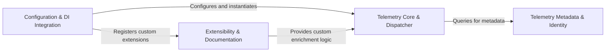

## Details

The diagnostic backbone that monitors execution events. It captures strategy-specific events (like "on retry" or "on break") and broadcasts them to external listeners for logging and metrics.

### Telemetry Core & Dispatcher
The central processing hub that receives raw events from resilience strategies and orchestrates their transformation into logs and metrics.

**Related Classes/Methods**: _None_

**Source Files:**

- [`src/Polly.Extensions/Telemetry/EnrichmentContext.cs`](https://github.com/CodeBoarding/Polly/blob/main/.codeboardingsrc/Polly.Extensions/Telemetry/EnrichmentContext.cs)
  - `Telemetry.EnrichmentContext.EnrichmentContext<TResult, TArgs>` ([L14-L40](https://github.com/CodeBoarding/Polly/blob/main/.codeboardingsrc/Polly.Extensions/Telemetry/EnrichmentContext.cs#L14-L40)) - Struct
  - `Telemetry.EnrichmentContext.EnrichmentContext<TResult, TArgs>.EnrichmentContext(in TelemetryEventArguments<TResult, TArgs> telemetryEvent, IList<KeyValuePair<string, object>> tags)` ([L21-L26](https://github.com/CodeBoarding/Polly/blob/main/.codeboardingsrc/Polly.Extensions/Telemetry/EnrichmentContext.cs#L21-L26)) - Constructor
- [`src/Polly.Extensions/Telemetry/Log.cs`](https://github.com/CodeBoarding/Polly/blob/main/.codeboardingsrc/Polly.Extensions/Telemetry/Log.cs)
  - `Telemetry.Log` ([L9-L91](https://github.com/CodeBoarding/Polly/blob/main/.codeboardingsrc/Polly.Extensions/Telemetry/Log.cs#L9-L91)) - Class
  - `Telemetry.Log.ResilienceEvent(this ILogger logger, LogLevel logLevel, string eventName, string pipelineName, string pipelineInstance, string strategyName, string operationKey, object result, Exception exception)` ([L26-L36](https://github.com/CodeBoarding/Polly/blob/main/.codeboardingsrc/Polly.Extensions/Telemetry/Log.cs#L26-L36)) - Method
  - `Telemetry.Log.PipelineExecuting(this ILogger logger, LogLevel logLevel, string pipelineName, string pipelineInstance, string operationKey)` ([L43-L49](https://github.com/CodeBoarding/Polly/blob/main/.codeboardingsrc/Polly.Extensions/Telemetry/Log.cs#L43-L49)) - Method
  - `Telemetry.Log.PipelineExecuted(this ILogger logger, LogLevel logLevel, string pipelineName, string pipelineInstance, string operationKey, object result, double executionTimeMs, Exception exception)` ([L58-L67](https://github.com/CodeBoarding/Polly/blob/main/.codeboardingsrc/Polly.Extensions/Telemetry/Log.cs#L58-L67)) - Method
  - `Telemetry.Log.ExecutionAttempt(this ILogger logger, LogLevel level, string pipelineName, string pipelineInstance, string strategyName, string operationKey, object result, bool handled, int attempt, double executionTimeMs, Exception exception)` ([L78-L90](https://github.com/CodeBoarding/Polly/blob/main/.codeboardingsrc/Polly.Extensions/Telemetry/Log.cs#L78-L90)) - Method
- [`src/Polly.Extensions/Telemetry/MeteringEnricher.cs`](https://github.com/CodeBoarding/Polly/blob/main/.codeboardingsrc/Polly.Extensions/Telemetry/MeteringEnricher.cs)
  - `Telemetry.MeteringEnricher` ([L6-L16](https://github.com/CodeBoarding/Polly/blob/main/.codeboardingsrc/Polly.Extensions/Telemetry/MeteringEnricher.cs#L6-L16)) - Class
  - `Telemetry.MeteringEnricher.Enrich<TResult, TArgs>(in EnrichmentContext<TResult, TArgs> context)` ([L14-L15](https://github.com/CodeBoarding/Polly/blob/main/.codeboardingsrc/Polly.Extensions/Telemetry/MeteringEnricher.cs#L14-L15)) - Method
- [`src/Polly.Extensions/Telemetry/SeverityProviderArguments.cs`](https://github.com/CodeBoarding/Polly/blob/main/.codeboardingsrc/Polly.Extensions/Telemetry/SeverityProviderArguments.cs)
  - `Telemetry.SeverityProviderArguments` ([L8-L38](https://github.com/CodeBoarding/Polly/blob/main/.codeboardingsrc/Polly.Extensions/Telemetry/SeverityProviderArguments.cs#L8-L38)) - Struct
  - `Telemetry.SeverityProviderArguments.SeverityProviderArguments(ResilienceTelemetrySource source, ResilienceEvent resilienceEvent, ResilienceContext context)` ([L16-L22](https://github.com/CodeBoarding/Polly/blob/main/.codeboardingsrc/Polly.Extensions/Telemetry/SeverityProviderArguments.cs#L16-L22)) - Constructor
- [`src/Polly.Extensions/Telemetry/TagsList.cs`](https://github.com/CodeBoarding/Polly/blob/main/.codeboardingsrc/Polly.Extensions/Telemetry/TagsList.cs)
  - `Telemetry.TagsList` ([L8-L50](https://github.com/CodeBoarding/Polly/blob/main/.codeboardingsrc/Polly.Extensions/Telemetry/TagsList.cs#L8-L50)) - Class
  - `Telemetry.TagsList.TagsList()` ([L16-L19](https://github.com/CodeBoarding/Polly/blob/main/.codeboardingsrc/Polly.Extensions/Telemetry/TagsList.cs#L16-L19)) - Constructor
  - `Telemetry.TagsList.Get()` ([L20-L21](https://github.com/CodeBoarding/Polly/blob/main/.codeboardingsrc/Polly.Extensions/Telemetry/TagsList.cs#L20-L21)) - Method
  - `Telemetry.TagsList.Return(TagsList context)` ([L22-L30](https://github.com/CodeBoarding/Polly/blob/main/.codeboardingsrc/Polly.Extensions/Telemetry/TagsList.cs#L22-L30)) - Method
- [`src/Polly.Extensions/Telemetry/TelemetryListenerImpl.cs`](https://github.com/CodeBoarding/Polly/blob/main/.codeboardingsrc/Polly.Extensions/Telemetry/TelemetryListenerImpl.cs)
  - `Telemetry.TelemetryListenerImpl.Write<TResult, TArgs>(in TelemetryEventArguments<TResult, TArgs> args)` ([L46-L64](https://github.com/CodeBoarding/Polly/blob/main/.codeboardingsrc/Polly.Extensions/Telemetry/TelemetryListenerImpl.cs#L46-L64)) - Method
  - `Telemetry.TelemetryListenerImpl.GetArgs<T, TArgs>(T inArgs, out TArgs outArgs)` ([L65-L76](https://github.com/CodeBoarding/Polly/blob/main/.codeboardingsrc/Polly.Extensions/Telemetry/TelemetryListenerImpl.cs#L65-L76)) - Method
  - `Telemetry.TelemetryListenerImpl.AddCommonTags<TResult, TArgs>(in EnrichmentContext<TResult, TArgs> context, ResilienceEventSeverity severity)` ([L77-L110](https://github.com/CodeBoarding/Polly/blob/main/.codeboardingsrc/Polly.Extensions/Telemetry/TelemetryListenerImpl.cs#L77-L110)) - Method
  - `Telemetry.TelemetryListenerImpl.MeterEvent<TResult, TArgs>(in TelemetryEventArguments<TResult, TArgs> args, ResilienceEventSeverity severity)` ([L111-L148](https://github.com/CodeBoarding/Polly/blob/main/.codeboardingsrc/Polly.Extensions/Telemetry/TelemetryListenerImpl.cs#L111-L148)) - Method
  - `Telemetry.TelemetryListenerImpl.UpdateEnrichmentContext<TResult, TArgs>(in EnrichmentContext<TResult, TArgs> context, ResilienceEventSeverity severity)` ([L149-L161](https://github.com/CodeBoarding/Polly/blob/main/.codeboardingsrc/Polly.Extensions/Telemetry/TelemetryListenerImpl.cs#L149-L161)) - Method
  - `Telemetry.TelemetryListenerImpl.LogEvent<TResult, TArgs>(in TelemetryEventArguments<TResult, TArgs> args, ResilienceEventSeverity severity)` ([L162-L218](https://github.com/CodeBoarding/Polly/blob/main/.codeboardingsrc/Polly.Extensions/Telemetry/TelemetryListenerImpl.cs#L162-L218)) - Method
  - `Telemetry.TelemetryListenerImpl.GetResult<T>(ResilienceContext context, Outcome<T>? outcome)` ([L219-L233](https://github.com/CodeBoarding/Polly/blob/main/.codeboardingsrc/Polly.Extensions/Telemetry/TelemetryListenerImpl.cs#L219-L233)) - Method
- [`src/Polly.Extensions/Telemetry/TelemetryUtil.cs`](https://github.com/CodeBoarding/Polly/blob/main/.codeboardingsrc/Polly.Extensions/Telemetry/TelemetryUtil.cs)
  - `Telemetry.TelemetryUtil.GetValueOrPlaceholder(this string value)` ([L15-L16](https://github.com/CodeBoarding/Polly/blob/main/.codeboardingsrc/Polly.Extensions/Telemetry/TelemetryUtil.cs#L15-L16)) - Method
  - `Telemetry.TelemetryUtil.AsBoxedBool(this bool value)` ([L17-L22](https://github.com/CodeBoarding/Polly/blob/main/.codeboardingsrc/Polly.Extensions/Telemetry/TelemetryUtil.cs#L17-L22)) - Method
  - `Telemetry.TelemetryUtil.AsBoxedInt(this int value)` ([L23-L28](https://github.com/CodeBoarding/Polly/blob/main/.codeboardingsrc/Polly.Extensions/Telemetry/TelemetryUtil.cs#L23-L28)) - Method
  - `Telemetry.TelemetryUtil.AsLogLevel(this ResilienceEventSeverity severity)` ([L29-L38](https://github.com/CodeBoarding/Polly/blob/main/.codeboardingsrc/Polly.Extensions/Telemetry/TelemetryUtil.cs#L29-L38)) - Method
  - `Telemetry.TelemetryUtil.AsString(this ResilienceEventSeverity severity)` ([L39-L49](https://github.com/CodeBoarding/Polly/blob/main/.codeboardingsrc/Polly.Extensions/Telemetry/TelemetryUtil.cs#L39-L49)) - Method

### Configuration & DI Integration
Handles the registration of telemetry services and the attachment of listeners to the ResiliencePipelineBuilder.

**Related Classes/Methods**: _None_

**Source Files:**

- [`src/Polly.Extensions/DependencyInjection/AddResiliencePipelineContext.cs`](https://github.com/CodeBoarding/Polly/blob/main/.codeboardingsrc/Polly.Extensions/DependencyInjection/AddResiliencePipelineContext.cs)
  - `DependencyInjection.AddResiliencePipelineContext.AddResiliencePipelineContext<TKey>` ([L12-L73](https://github.com/CodeBoarding/Polly/blob/main/.codeboardingsrc/Polly.Extensions/DependencyInjection/AddResiliencePipelineContext.cs#L12-L73)) - Class
  - `DependencyInjection.AddResiliencePipelineContext.AddResiliencePipelineContext<TKey>.AddResiliencePipelineContext(ConfigureBuilderContext<TKey> registryContext, IServiceProvider serviceProvider)` ([L15-L20](https://github.com/CodeBoarding/Polly/blob/main/.codeboardingsrc/Polly.Extensions/DependencyInjection/AddResiliencePipelineContext.cs#L15-L20)) - Constructor
- [`src/Polly.Extensions/DependencyInjection/AddResiliencePipelinesContext.cs`](https://github.com/CodeBoarding/Polly/blob/main/.codeboardingsrc/Polly.Extensions/DependencyInjection/AddResiliencePipelinesContext.cs)
  - `DependencyInjection.AddResiliencePipelinesContext.AddResiliencePipelinesContext<TKey>` ([L9-L82](https://github.com/CodeBoarding/Polly/blob/main/.codeboardingsrc/Polly.Extensions/DependencyInjection/AddResiliencePipelinesContext.cs#L9-L82)) - Class
  - `DependencyInjection.AddResiliencePipelinesContext.AddResiliencePipelinesContext<TKey>.AddResiliencePipelinesContext(ConfigureResiliencePipelineRegistryOptions<TKey> options, IServiceProvider serviceProvider)` ([L14-L21](https://github.com/CodeBoarding/Polly/blob/main/.codeboardingsrc/Polly.Extensions/DependencyInjection/AddResiliencePipelinesContext.cs#L14-L21)) - Constructor
  - `DependencyInjection.AddResiliencePipelinesContext.AddResiliencePipelinesContext<TKey>.AddResiliencePipeline(TKey key, Action<ResiliencePipelineBuilder, AddResiliencePipelineContext<TKey>> configure)` ([L38-L53](https://github.com/CodeBoarding/Polly/blob/main/.codeboardingsrc/Polly.Extensions/DependencyInjection/AddResiliencePipelinesContext.cs#L38-L53)) - Method
  - `DependencyInjection.AddResiliencePipelinesContext.AddResiliencePipelinesContext<TKey>.AddResiliencePipeline<TResult>(TKey key, Action<ResiliencePipelineBuilder<TResult>, AddResiliencePipelineContext<TKey>> configure)` ([L66-L81](https://github.com/CodeBoarding/Polly/blob/main/.codeboardingsrc/Polly.Extensions/DependencyInjection/AddResiliencePipelinesContext.cs#L66-L81)) - Method
- [`src/Polly.Extensions/DependencyInjection/PollyServiceCollectionExtensions.cs`](https://github.com/CodeBoarding/Polly/blob/main/.codeboardingsrc/Polly.Extensions/DependencyInjection/PollyServiceCollectionExtensions.cs)
  - `DependencyInjection.PollyServiceCollectionExtensions` ([L16-L295](https://github.com/CodeBoarding/Polly/blob/main/.codeboardingsrc/Polly.Extensions/DependencyInjection/PollyServiceCollectionExtensions.cs#L16-L295)) - Class
  - `DependencyInjection.PollyServiceCollectionExtensions.AddResiliencePipeline<TKey, TResult>(this IServiceCollection services, TKey key, Action<ResiliencePipelineBuilder<TResult>> configure)` ([L34-L45](https://github.com/CodeBoarding/Polly/blob/main/.codeboardingsrc/Polly.Extensions/DependencyInjection/PollyServiceCollectionExtensions.cs#L34-L45)) - Method
  - `DependencyInjection.PollyServiceCollectionExtensions.AddResiliencePipeline<TKey, TResult>(this IServiceCollection services, TKey key, Action<ResiliencePipelineBuilder<TResult>, AddResiliencePipelineContext<TKey>> configure)` ([L62-L85](https://github.com/CodeBoarding/Polly/blob/main/.codeboardingsrc/Polly.Extensions/DependencyInjection/PollyServiceCollectionExtensions.cs#L62-L85)) - Method
  - `DependencyInjection.PollyServiceCollectionExtensions.AddResiliencePipeline<TKey>(this IServiceCollection services, TKey key, Action<ResiliencePipelineBuilder> configure)` ([L101-L112](https://github.com/CodeBoarding/Polly/blob/main/.codeboardingsrc/Polly.Extensions/DependencyInjection/PollyServiceCollectionExtensions.cs#L101-L112)) - Method
  - `DependencyInjection.PollyServiceCollectionExtensions.AddResiliencePipeline<TKey>(this IServiceCollection services, TKey key, Action<ResiliencePipelineBuilder, AddResiliencePipelineContext<TKey>> configure)` ([L128-L151](https://github.com/CodeBoarding/Polly/blob/main/.codeboardingsrc/Polly.Extensions/DependencyInjection/PollyServiceCollectionExtensions.cs#L128-L151)) - Method
  - `DependencyInjection.PollyServiceCollectionExtensions.AddResiliencePipelines<TKey>(this IServiceCollection services, Action<AddResiliencePipelinesContext<TKey>> configure)` ([L170-L187](https://github.com/CodeBoarding/Polly/blob/main/.codeboardingsrc/Polly.Extensions/DependencyInjection/PollyServiceCollectionExtensions.cs#L170-L187)) - Method
  - `DependencyInjection.PollyServiceCollectionExtensions.AddResiliencePipelineRegistry<TKey>(this IServiceCollection services, Action<ResiliencePipelineRegistryOptions<TKey>> configure)` ([L200-L213](https://github.com/CodeBoarding/Polly/blob/main/.codeboardingsrc/Polly.Extensions/DependencyInjection/PollyServiceCollectionExtensions.cs#L200-L213)) - Method
  - `DependencyInjection.PollyServiceCollectionExtensions.AddResiliencePipelineRegistry<TKey>(this IServiceCollection services)` ([L225-L266](https://github.com/CodeBoarding/Polly/blob/main/.codeboardingsrc/Polly.Extensions/DependencyInjection/PollyServiceCollectionExtensions.cs#L225-L266)) - Method
  - `DependencyInjection.PollyServiceCollectionExtensions.AddResiliencePipelineBuilder(this IServiceCollection services)` ([L267-L289](https://github.com/CodeBoarding/Polly/blob/main/.codeboardingsrc/Polly.Extensions/DependencyInjection/PollyServiceCollectionExtensions.cs#L267-L289)) - Method
  - `DependencyInjection.PollyServiceCollectionExtensions.RegistryMarker<TKey>` ([L290-L294](https://github.com/CodeBoarding/Polly/blob/main/.codeboardingsrc/Polly.Extensions/DependencyInjection/PollyServiceCollectionExtensions.cs#L290-L294)) - Class
- [`src/Polly.Extensions/Telemetry/TelemetryListenerImpl.cs`](https://github.com/CodeBoarding/Polly/blob/main/.codeboardingsrc/Polly.Extensions/Telemetry/TelemetryListenerImpl.cs)
  - `Telemetry.TelemetryListenerImpl` ([L7-L234](https://github.com/CodeBoarding/Polly/blob/main/.codeboardingsrc/Polly.Extensions/Telemetry/TelemetryListenerImpl.cs#L7-L234)) - Class
  - `Telemetry.TelemetryListenerImpl.TelemetryListenerImpl(TelemetryOptions options)` ([L15-L39](https://github.com/CodeBoarding/Polly/blob/main/.codeboardingsrc/Polly.Extensions/Telemetry/TelemetryListenerImpl.cs#L15-L39)) - Constructor
- [`src/Polly.Extensions/Telemetry/TelemetryOptions.cs`](https://github.com/CodeBoarding/Polly/blob/main/.codeboardingsrc/Polly.Extensions/Telemetry/TelemetryOptions.cs)
  - `Telemetry.TelemetryOptions` ([L12-L83](https://github.com/CodeBoarding/Polly/blob/main/.codeboardingsrc/Polly.Extensions/Telemetry/TelemetryOptions.cs#L12-L83)) - Class
  - `Telemetry.TelemetryOptions.TelemetryOptions()` ([L17-L20](https://github.com/CodeBoarding/Polly/blob/main/.codeboardingsrc/Polly.Extensions/Telemetry/TelemetryOptions.cs#L17-L20)) - Constructor
  - `Telemetry.TelemetryOptions.TelemetryOptions(TelemetryOptions other)` ([L25-L35](https://github.com/CodeBoarding/Polly/blob/main/.codeboardingsrc/Polly.Extensions/Telemetry/TelemetryOptions.cs#L25-L35)) - Constructor
- [`src/Polly.Extensions/Telemetry/TelemetryResiliencePipelineBuilderExtensions.cs`](https://github.com/CodeBoarding/Polly/blob/main/.codeboardingsrc/Polly.Extensions/Telemetry/TelemetryResiliencePipelineBuilderExtensions.cs)
  - `Telemetry.TelemetryResiliencePipelineBuilderExtensions` ([L11-L59](https://github.com/CodeBoarding/Polly/blob/main/.codeboardingsrc/Polly.Extensions/Telemetry/TelemetryResiliencePipelineBuilderExtensions.cs#L11-L59)) - Class
  - `Telemetry.TelemetryResiliencePipelineBuilderExtensions.ConfigureTelemetry<TBuilder>(this TBuilder builder, ILoggerFactory loggerFactory)` ([L25-L33](https://github.com/CodeBoarding/Polly/blob/main/.codeboardingsrc/Polly.Extensions/Telemetry/TelemetryResiliencePipelineBuilderExtensions.cs#L25-L33)) - Method
  - `Telemetry.TelemetryResiliencePipelineBuilderExtensions.ConfigureTelemetry<TBuilder>(this TBuilder builder, TelemetryOptions options)` ([L47-L58](https://github.com/CodeBoarding/Polly/blob/main/.codeboardingsrc/Polly.Extensions/Telemetry/TelemetryResiliencePipelineBuilderExtensions.cs#L47-L58)) - Method

### Telemetry Metadata & Identity
Provides the static environmental context and versioning information required to identify the source of telemetry data.

**Related Classes/Methods**: _None_

**Source Files:**

- [`src/Polly.Extensions/Telemetry/TelemetrySource.cs`](https://github.com/CodeBoarding/Polly/blob/main/.codeboardingsrc/Polly.Extensions/Telemetry/TelemetrySource.cs)
  - `Telemetry.TelemetrySource` ([L5-L51](https://github.com/CodeBoarding/Polly/blob/main/.codeboardingsrc/Polly.Extensions/Telemetry/TelemetrySource.cs#L5-L51)) - Class
  - `Telemetry.TelemetrySource.TelemetrySource()` ([L11-L16](https://github.com/CodeBoarding/Polly/blob/main/.codeboardingsrc/Polly.Extensions/Telemetry/TelemetrySource.cs#L11-L16)) - Constructor
  - `Telemetry.TelemetrySource.GetVersion()` ([L20-L50](https://github.com/CodeBoarding/Polly/blob/main/.codeboardingsrc/Polly.Extensions/Telemetry/TelemetrySource.cs#L20-L50)) - Method

### Extensibility & Documentation
Defines the public-facing contracts and reference implementations for users to extend the telemetry system.

**Related Classes/Methods**:

- `Docs.Telemetry.MyMeteringEnricher`:93-100
- `Docs.Telemetry.MyTelemetryListener`:85-92

**Source Files:**

- [`src/Snippets/Docs/Telemetry.cs`](https://github.com/CodeBoarding/Polly/blob/main/.codeboardingsrc/Snippets/Docs/Telemetry.cs)
  - `Docs.Telemetry` ([L8-L167](https://github.com/CodeBoarding/Polly/blob/main/.codeboardingsrc/Snippets/Docs/Telemetry.cs#L8-L167)) - Class
  - `Docs.Telemetry.TelemetryCoordinates()` ([L10-L39](https://github.com/CodeBoarding/Polly/blob/main/.codeboardingsrc/Snippets/Docs/Telemetry.cs#L10-L39)) - Method
  - `Docs.Telemetry.ConfigureTelemetry()` ([L40-L63](https://github.com/CodeBoarding/Polly/blob/main/.codeboardingsrc/Snippets/Docs/Telemetry.cs#L40-L63)) - Method
  - `Docs.Telemetry.AddResiliencePipelineWithTelemetry()` ([L64-L82](https://github.com/CodeBoarding/Polly/blob/main/.codeboardingsrc/Snippets/Docs/Telemetry.cs#L64-L82)) - Method
  - `Docs.Telemetry.MyTelemetryListener` ([L85-L92](https://github.com/CodeBoarding/Polly/blob/main/.codeboardingsrc/Snippets/Docs/Telemetry.cs#L85-L92)) - Class
  - `Docs.Telemetry.MyTelemetryListener.Write<TResult, TArgs>(in TelemetryEventArguments<TResult, TArgs> args)` ([L87-L91](https://github.com/CodeBoarding/Polly/blob/main/.codeboardingsrc/Snippets/Docs/Telemetry.cs#L87-L91)) - Method
  - `Docs.Telemetry.MyMeteringEnricher` ([L93-L100](https://github.com/CodeBoarding/Polly/blob/main/.codeboardingsrc/Snippets/Docs/Telemetry.cs#L93-L100)) - Class
  - `Docs.Telemetry.MyMeteringEnricher.Enrich<TResult, TArgs>(in EnrichmentContext<TResult, TArgs> context)` ([L95-L99](https://github.com/CodeBoarding/Polly/blob/main/.codeboardingsrc/Snippets/Docs/Telemetry.cs#L95-L99)) - Method
  - `Docs.Telemetry.MeteringEnricherRegistration()` ([L103-L119](https://github.com/CodeBoarding/Polly/blob/main/.codeboardingsrc/Snippets/Docs/Telemetry.cs#L103-L119)) - Method
  - `Docs.Telemetry.CustomMeteringEnricher` ([L122-L135](https://github.com/CodeBoarding/Polly/blob/main/.codeboardingsrc/Snippets/Docs/Telemetry.cs#L122-L135)) - Class
  - `Docs.Telemetry.CustomMeteringEnricher.Enrich<TResult, TArgs>(in EnrichmentContext<TResult, TArgs> context)` ([L124-L134](https://github.com/CodeBoarding/Polly/blob/main/.codeboardingsrc/Snippets/Docs/Telemetry.cs#L124-L134)) - Method
  - `Docs.Telemetry.SeverityOverrides()` ([L138-L166](https://github.com/CodeBoarding/Polly/blob/main/.codeboardingsrc/Snippets/Docs/Telemetry.cs#L138-L166)) - Method

### [FAQ](https://github.com/CodeBoarding/GeneratedOnBoardings/tree/main?tab=readme-ov-file#faq)