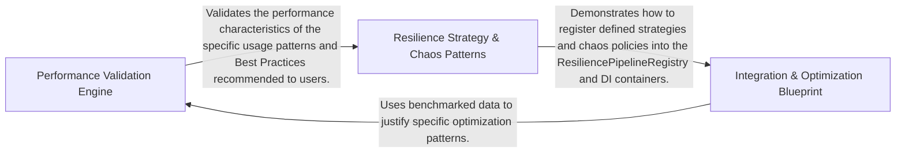

## Details

Encompasses the benchmarks, usage samples, and documentation that validate the performance and guide the implementation of the library.

### Performance Validation Engine
Quantitatively validates the library's overhead and execution efficiency using BenchmarkDotNet, establishing baselines for core strategies and specialized providers.

**Related Classes/Methods**:

- `Cache.MemoryCacheProvider`:48-91

**Source Files:**

- [`bench/Polly.Benchmarks/Bulkhead.cs`](https://github.com/CodeBoarding/Polly/blob/main/.codeboardingbench/Polly.Benchmarks/Bulkhead.cs)
  - `Bulkhead` ([L4-L33](https://github.com/CodeBoarding/Polly/blob/main/.codeboardingbench/Polly.Benchmarks/Bulkhead.cs#L4-L33)) - Class
  - `Bulkhead.Bulkhead_Synchronous()` ([L10-L12](https://github.com/CodeBoarding/Polly/blob/main/.codeboardingbench/Polly.Benchmarks/Bulkhead.cs#L10-L12)) - Method
  - `Bulkhead.Bulkhead_Asynchronous()` ([L14-L16](https://github.com/CodeBoarding/Polly/blob/main/.codeboardingbench/Polly.Benchmarks/Bulkhead.cs#L14-L16)) - Method
  - `Bulkhead.Bulkhead_Asynchronous_With_CancellationToken()` ([L18-L20](https://github.com/CodeBoarding/Polly/blob/main/.codeboardingbench/Polly.Benchmarks/Bulkhead.cs#L18-L20)) - Method
  - `Bulkhead.Bulkhead_Synchronous_With_Result()` ([L22-L24](https://github.com/CodeBoarding/Polly/blob/main/.codeboardingbench/Polly.Benchmarks/Bulkhead.cs#L22-L24)) - Method
  - `Bulkhead.Bulkhead_Asynchronous_With_Result()` ([L26-L28](https://github.com/CodeBoarding/Polly/blob/main/.codeboardingbench/Polly.Benchmarks/Bulkhead.cs#L26-L28)) - Method
  - `Bulkhead.Bulkhead_Asynchronous_With_Result_With_CancellationToken()` ([L30-L32](https://github.com/CodeBoarding/Polly/blob/main/.codeboardingbench/Polly.Benchmarks/Bulkhead.cs#L30-L32)) - Method
- [`bench/Polly.Benchmarks/Cache.cs`](https://github.com/CodeBoarding/Polly/blob/main/.codeboardingbench/Polly.Benchmarks/Cache.cs)
  - `Cache` ([L6-L92](https://github.com/CodeBoarding/Polly/blob/main/.codeboardingbench/Polly.Benchmarks/Cache.cs#L6-L92)) - Class
  - `Cache.GlobalSetup()` ([L21-L26](https://github.com/CodeBoarding/Polly/blob/main/.codeboardingbench/Polly.Benchmarks/Cache.cs#L21-L26)) - Method
  - `Cache.Cache_Synchronous_Hit()` ([L28-L30](https://github.com/CodeBoarding/Polly/blob/main/.codeboardingbench/Polly.Benchmarks/Cache.cs#L28-L30)) - Method
  - `Cache.Cache_Asynchronous_Hit()` ([L32-L34](https://github.com/CodeBoarding/Polly/blob/main/.codeboardingbench/Polly.Benchmarks/Cache.cs#L32-L34)) - Method
  - `Cache.Cache_Synchronous_Miss()` ([L36-L38](https://github.com/CodeBoarding/Polly/blob/main/.codeboardingbench/Polly.Benchmarks/Cache.cs#L36-L38)) - Method
  - `Cache.Cache_Asynchronous_Miss()` ([L40-L42](https://github.com/CodeBoarding/Polly/blob/main/.codeboardingbench/Polly.Benchmarks/Cache.cs#L40-L42)) - Method
  - `Cache.GetObject()` ([L43-L44](https://github.com/CodeBoarding/Polly/blob/main/.codeboardingbench/Polly.Benchmarks/Cache.cs#L43-L44)) - Method
  - `Cache.GetObjectAsync(CancellationToken cancellationToken)` ([L45-L47](https://github.com/CodeBoarding/Polly/blob/main/.codeboardingbench/Polly.Benchmarks/Cache.cs#L45-L47)) - Method
  - `Cache.MemoryCacheProvider` ([L48-L91](https://github.com/CodeBoarding/Polly/blob/main/.codeboardingbench/Polly.Benchmarks/Cache.cs#L48-L91)) - Class
  - `Cache.MemoryCacheProvider.TryGet(string key)` ([L52-L57](https://github.com/CodeBoarding/Polly/blob/main/.codeboardingbench/Polly.Benchmarks/Cache.cs#L52-L57)) - Method
  - `Cache.MemoryCacheProvider.Put(string key, object value, Ttl ttl)` ([L58-L81](https://github.com/CodeBoarding/Polly/blob/main/.codeboardingbench/Polly.Benchmarks/Cache.cs#L58-L81)) - Method
  - `Cache.MemoryCacheProvider.TryGetAsync(string key, CancellationToken cancellationToken, bool continueOnCapturedContext)` ([L82-L84](https://github.com/CodeBoarding/Polly/blob/main/.codeboardingbench/Polly.Benchmarks/Cache.cs#L82-L84)) - Method
  - `Cache.MemoryCacheProvider.PutAsync(string key, object value, Ttl ttl, CancellationToken cancellationToken, bool continueOnCapturedContext)` ([L85-L90](https://github.com/CodeBoarding/Polly/blob/main/.codeboardingbench/Polly.Benchmarks/Cache.cs#L85-L90)) - Method
- [`bench/Polly.Benchmarks/CircuitBreaker.cs`](https://github.com/CodeBoarding/Polly/blob/main/.codeboardingbench/Polly.Benchmarks/CircuitBreaker.cs)
  - `CircuitBreaker` ([L4-L25](https://github.com/CodeBoarding/Polly/blob/main/.codeboardingbench/Polly.Benchmarks/CircuitBreaker.cs#L4-L25)) - Class
  - `CircuitBreaker.CircuitBreaker_Synchronous_Succeeds()` ([L10-L12](https://github.com/CodeBoarding/Polly/blob/main/.codeboardingbench/Polly.Benchmarks/CircuitBreaker.cs#L10-L12)) - Method
  - `CircuitBreaker.CircuitBreaker_Asynchronous_Succeeds()` ([L14-L16](https://github.com/CodeBoarding/Polly/blob/main/.codeboardingbench/Polly.Benchmarks/CircuitBreaker.cs#L14-L16)) - Method
  - `CircuitBreaker.CircuitBreaker_Synchronous_With_Result_Succeeds()` ([L18-L20](https://github.com/CodeBoarding/Polly/blob/main/.codeboardingbench/Polly.Benchmarks/CircuitBreaker.cs#L18-L20)) - Method
  - `CircuitBreaker.CircuitBreaker_Asynchronous_With_Result_Succeeds()` ([L22-L24](https://github.com/CodeBoarding/Polly/blob/main/.codeboardingbench/Polly.Benchmarks/CircuitBreaker.cs#L22-L24)) - Method
- [`bench/Polly.Benchmarks/Fallback.cs`](https://github.com/CodeBoarding/Polly/blob/main/.codeboardingbench/Polly.Benchmarks/Fallback.cs)
  - `Fallback` ([L4-L25](https://github.com/CodeBoarding/Polly/blob/main/.codeboardingbench/Polly.Benchmarks/Fallback.cs#L4-L25)) - Class
  - `Fallback.Fallback_Synchronous_Succeeds()` ([L10-L12](https://github.com/CodeBoarding/Polly/blob/main/.codeboardingbench/Polly.Benchmarks/Fallback.cs#L10-L12)) - Method
  - `Fallback.Fallback_Asynchronous_Succeeds()` ([L14-L16](https://github.com/CodeBoarding/Polly/blob/main/.codeboardingbench/Polly.Benchmarks/Fallback.cs#L14-L16)) - Method
  - `Fallback.Fallback_Synchronous_Throws()` ([L18-L20](https://github.com/CodeBoarding/Polly/blob/main/.codeboardingbench/Polly.Benchmarks/Fallback.cs#L18-L20)) - Method
  - `Fallback.Fallback_Asynchronous_Throws()` ([L22-L24](https://github.com/CodeBoarding/Polly/blob/main/.codeboardingbench/Polly.Benchmarks/Fallback.cs#L22-L24)) - Method
- [`bench/Polly.Benchmarks/NoOp.cs`](https://github.com/CodeBoarding/Polly/blob/main/.codeboardingbench/Polly.Benchmarks/NoOp.cs)
  - `NoOp` ([L4-L25](https://github.com/CodeBoarding/Polly/blob/main/.codeboardingbench/Polly.Benchmarks/NoOp.cs#L4-L25)) - Class
  - `NoOp.NoOp_Synchronous()` ([L10-L12](https://github.com/CodeBoarding/Polly/blob/main/.codeboardingbench/Polly.Benchmarks/NoOp.cs#L10-L12)) - Method
  - `NoOp.NoOp_Asynchronous()` ([L14-L16](https://github.com/CodeBoarding/Polly/blob/main/.codeboardingbench/Polly.Benchmarks/NoOp.cs#L14-L16)) - Method
  - `NoOp.NoOp_Synchronous_With_Result()` ([L18-L20](https://github.com/CodeBoarding/Polly/blob/main/.codeboardingbench/Polly.Benchmarks/NoOp.cs#L18-L20)) - Method
  - `NoOp.NoOp_Asynchronous_With_Result()` ([L22-L24](https://github.com/CodeBoarding/Polly/blob/main/.codeboardingbench/Polly.Benchmarks/NoOp.cs#L22-L24)) - Method
- [`bench/Polly.Benchmarks/PolicyWrap.cs`](https://github.com/CodeBoarding/Polly/blob/main/.codeboardingbench/Polly.Benchmarks/PolicyWrap.cs)
  - `PolicyWrap` ([L4-L34](https://github.com/CodeBoarding/Polly/blob/main/.codeboardingbench/Polly.Benchmarks/PolicyWrap.cs#L4-L34)) - Class
  - `PolicyWrap.PolicyWrap_Synchronous()` ([L19-L21](https://github.com/CodeBoarding/Polly/blob/main/.codeboardingbench/Polly.Benchmarks/PolicyWrap.cs#L19-L21)) - Method
  - `PolicyWrap.PolicyWrap_Asynchronous()` ([L23-L25](https://github.com/CodeBoarding/Polly/blob/main/.codeboardingbench/Polly.Benchmarks/PolicyWrap.cs#L23-L25)) - Method
  - `PolicyWrap.PolicyWrap_Synchronous_With_Result()` ([L27-L29](https://github.com/CodeBoarding/Polly/blob/main/.codeboardingbench/Polly.Benchmarks/PolicyWrap.cs#L27-L29)) - Method
  - `PolicyWrap.PolicyWrap_Asynchronous_With_Result()` ([L31-L33](https://github.com/CodeBoarding/Polly/blob/main/.codeboardingbench/Polly.Benchmarks/PolicyWrap.cs#L31-L33)) - Method
- [`bench/Polly.Benchmarks/RateLimit.cs`](https://github.com/CodeBoarding/Polly/blob/main/.codeboardingbench/Polly.Benchmarks/RateLimit.cs)
  - `RateLimit` ([L4-L25](https://github.com/CodeBoarding/Polly/blob/main/.codeboardingbench/Polly.Benchmarks/RateLimit.cs#L4-L25)) - Class
  - `RateLimit.RateLimit_Synchronous_Succeeds()` ([L10-L12](https://github.com/CodeBoarding/Polly/blob/main/.codeboardingbench/Polly.Benchmarks/RateLimit.cs#L10-L12)) - Method
  - `RateLimit.RateLimit_Asynchronous_Succeeds()` ([L14-L16](https://github.com/CodeBoarding/Polly/blob/main/.codeboardingbench/Polly.Benchmarks/RateLimit.cs#L14-L16)) - Method
  - `RateLimit.RateLimit_Synchronous_With_Result_Succeeds()` ([L18-L20](https://github.com/CodeBoarding/Polly/blob/main/.codeboardingbench/Polly.Benchmarks/RateLimit.cs#L18-L20)) - Method
  - `RateLimit.RateLimit_Asynchronous_With_Result_Succeeds()` ([L22-L24](https://github.com/CodeBoarding/Polly/blob/main/.codeboardingbench/Polly.Benchmarks/RateLimit.cs#L22-L24)) - Method
- [`bench/Polly.Benchmarks/Retry.cs`](https://github.com/CodeBoarding/Polly/blob/main/.codeboardingbench/Polly.Benchmarks/Retry.cs)
  - `Retry` ([L4-L63](https://github.com/CodeBoarding/Polly/blob/main/.codeboardingbench/Polly.Benchmarks/Retry.cs#L4-L63)) - Class
  - `Retry.Retry_Synchronous_Succeeds()` ([L10-L12](https://github.com/CodeBoarding/Polly/blob/main/.codeboardingbench/Polly.Benchmarks/Retry.cs#L10-L12)) - Method
  - `Retry.Retry_Asynchronous_Succeeds()` ([L14-L16](https://github.com/CodeBoarding/Polly/blob/main/.codeboardingbench/Polly.Benchmarks/Retry.cs#L14-L16)) - Method
  - `Retry.Retry_Asynchronous_Succeeds_With_CancellationToken()` ([L18-L20](https://github.com/CodeBoarding/Polly/blob/main/.codeboardingbench/Polly.Benchmarks/Retry.cs#L18-L20)) - Method
  - `Retry.Retry_Synchronous_With_Result_Succeeds()` ([L22-L24](https://github.com/CodeBoarding/Polly/blob/main/.codeboardingbench/Polly.Benchmarks/Retry.cs#L22-L24)) - Method
  - `Retry.Retry_Asynchronous_With_Result_Succeeds()` ([L26-L28](https://github.com/CodeBoarding/Polly/blob/main/.codeboardingbench/Polly.Benchmarks/Retry.cs#L26-L28)) - Method
  - `Retry.Retry_Asynchronous_With_Result_Succeeds_With_CancellationToken()` ([L30-L32](https://github.com/CodeBoarding/Polly/blob/main/.codeboardingbench/Polly.Benchmarks/Retry.cs#L30-L32)) - Method
  - `Retry.Retry_Synchronous_Throws_Then_Succeeds()` ([L34-L46](https://github.com/CodeBoarding/Polly/blob/main/.codeboardingbench/Polly.Benchmarks/Retry.cs#L34-L46)) - Method
  - `Retry.Retry_Asynchronous_Throws_Then_Succeeds()` ([L48-L62](https://github.com/CodeBoarding/Polly/blob/main/.codeboardingbench/Polly.Benchmarks/Retry.cs#L48-L62)) - Method
- [`bench/Polly.Benchmarks/Timeout.cs`](https://github.com/CodeBoarding/Polly/blob/main/.codeboardingbench/Polly.Benchmarks/Timeout.cs)
  - `Timeout` ([L4-L37](https://github.com/CodeBoarding/Polly/blob/main/.codeboardingbench/Polly.Benchmarks/Timeout.cs#L4-L37)) - Class
  - `Timeout.Timeout_Synchronous_Succeeds()` ([L10-L12](https://github.com/CodeBoarding/Polly/blob/main/.codeboardingbench/Polly.Benchmarks/Timeout.cs#L10-L12)) - Method
  - `Timeout.Timeout_Asynchronous_Succeeds()` ([L14-L16](https://github.com/CodeBoarding/Polly/blob/main/.codeboardingbench/Polly.Benchmarks/Timeout.cs#L14-L16)) - Method
  - `Timeout.Timeout_Asynchronous_Succeeds_With_CancellationToken()` ([L18-L20](https://github.com/CodeBoarding/Polly/blob/main/.codeboardingbench/Polly.Benchmarks/Timeout.cs#L18-L20)) - Method
  - `Timeout.Timeout_Synchronous_With_Result_Succeeds()` ([L22-L24](https://github.com/CodeBoarding/Polly/blob/main/.codeboardingbench/Polly.Benchmarks/Timeout.cs#L22-L24)) - Method
  - `Timeout.Timeout_Asynchronous_With_Result_Succeeds()` ([L26-L28](https://github.com/CodeBoarding/Polly/blob/main/.codeboardingbench/Polly.Benchmarks/Timeout.cs#L26-L28)) - Method
  - `Timeout.Timeout_Asynchronous_With_Result_Succeeds_With_CancellationToken()` ([L30-L32](https://github.com/CodeBoarding/Polly/blob/main/.codeboardingbench/Polly.Benchmarks/Timeout.cs#L30-L32)) - Method
  - `Timeout.Timeout_Asynchronous_Times_Out_Optimistic()` ([L34-L36](https://github.com/CodeBoarding/Polly/blob/main/.codeboardingbench/Polly.Benchmarks/Timeout.cs#L34-L36)) - Method
- [`bench/Polly.Benchmarks/Workloads.cs`](https://github.com/CodeBoarding/Polly/blob/main/.codeboardingbench/Polly.Benchmarks/Workloads.cs)
  - `Workloads` ([L3-L53](https://github.com/CodeBoarding/Polly/blob/main/.codeboardingbench/Polly.Benchmarks/Workloads.cs#L3-L53)) - Class
  - `Workloads.Action()` ([L5-L9](https://github.com/CodeBoarding/Polly/blob/main/.codeboardingbench/Polly.Benchmarks/Workloads.cs#L5-L9)) - Method
  - `Workloads.ActionAsync()` ([L10-L12](https://github.com/CodeBoarding/Polly/blob/main/.codeboardingbench/Polly.Benchmarks/Workloads.cs#L10-L12)) - Method
  - `Workloads.ActionAsync(CancellationToken cancellationToken)` ([L13-L15](https://github.com/CodeBoarding/Polly/blob/main/.codeboardingbench/Polly.Benchmarks/Workloads.cs#L13-L15)) - Method
  - `Workloads.ActionInfiniteAsync()` ([L17-L24](https://github.com/CodeBoarding/Polly/blob/main/.codeboardingbench/Polly.Benchmarks/Workloads.cs#L17-L24)) - Method
  - `Workloads.ActionInfiniteAsync(CancellationToken cancellationToken)` ([L26-L33](https://github.com/CodeBoarding/Polly/blob/main/.codeboardingbench/Polly.Benchmarks/Workloads.cs#L26-L33)) - Method
  - `Workloads.Func<T>()` ([L34-L37](https://github.com/CodeBoarding/Polly/blob/main/.codeboardingbench/Polly.Benchmarks/Workloads.cs#L34-L37)) - Method
  - `Workloads.FuncAsync<T>()` ([L38-L41](https://github.com/CodeBoarding/Polly/blob/main/.codeboardingbench/Polly.Benchmarks/Workloads.cs#L38-L41)) - Method
  - `Workloads.FuncAsync<T>(CancellationToken cancellationToken)` ([L42-L45](https://github.com/CodeBoarding/Polly/blob/main/.codeboardingbench/Polly.Benchmarks/Workloads.cs#L42-L45)) - Method
  - `Workloads.FuncThrows<TResult, TException>()` ([L46-L49](https://github.com/CodeBoarding/Polly/blob/main/.codeboardingbench/Polly.Benchmarks/Workloads.cs#L46-L49)) - Method
  - `Workloads.FuncThrowsAsync<TResult, TException>()` ([L50-L53](https://github.com/CodeBoarding/Polly/blob/main/.codeboardingbench/Polly.Benchmarks/Workloads.cs#L50-L53)) - Method

### Resilience Strategy & Chaos Patterns
The primary educational core demonstrating reactive resilience and proactive fault injection, providing best practice guidance for distributed system behaviors.

**Related Classes/Methods**:

- `Docs.Retry`:14-435
- `Docs.CircuitBreaker`:11-314
- `Docs.Hedging.HedgingHandler`:135-169

**Source Files:**

- [`src/Snippets/Docs/Chaos.Behavior.cs`](https://github.com/CodeBoarding/Polly/blob/main/.codeboardingsrc/Snippets/Docs/Chaos.Behavior.cs)
  - `Docs.Chaos.Behavior.Chaos` ([L9-L88](https://github.com/CodeBoarding/Polly/blob/main/.codeboardingsrc/Snippets/Docs/Chaos.Behavior.cs#L9-L88)) - Class
  - `Docs.Chaos.Behavior.Chaos.BehaviorUsage()` ([L11-L59](https://github.com/CodeBoarding/Polly/blob/main/.codeboardingsrc/Snippets/Docs/Chaos.Behavior.cs#L11-L59)) - Method
  - `Docs.Chaos.Behavior.Chaos.AntiPattern_InjectDelay()` ([L60-L75](https://github.com/CodeBoarding/Polly/blob/main/.codeboardingsrc/Snippets/Docs/Chaos.Behavior.cs#L60-L75)) - Method
  - `Docs.Chaos.Behavior.Chaos.Pattern_InjectDelay()` ([L76-L87](https://github.com/CodeBoarding/Polly/blob/main/.codeboardingsrc/Snippets/Docs/Chaos.Behavior.cs#L76-L87)) - Method
  - `Docs.Chaos.Behavior.RedisConnectionException` ([L89-L105](https://github.com/CodeBoarding/Polly/blob/main/.codeboardingsrc/Snippets/Docs/Chaos.Behavior.cs#L89-L105)) - Class
  - `Docs.Chaos.Behavior.RedisConnectionException.RedisConnectionException()` ([L91-L94](https://github.com/CodeBoarding/Polly/blob/main/.codeboardingsrc/Snippets/Docs/Chaos.Behavior.cs#L91-L94)) - Constructor
  - `Docs.Chaos.Behavior.RedisConnectionException.RedisConnectionException(string message)` ([L95-L99](https://github.com/CodeBoarding/Polly/blob/main/.codeboardingsrc/Snippets/Docs/Chaos.Behavior.cs#L95-L99)) - Constructor
  - `Docs.Chaos.Behavior.RedisConnectionException.RedisConnectionException(string message, Exception innerException)` ([L100-L104](https://github.com/CodeBoarding/Polly/blob/main/.codeboardingsrc/Snippets/Docs/Chaos.Behavior.cs#L100-L104)) - Constructor
- [`src/Snippets/Docs/Chaos.Fault.cs`](https://github.com/CodeBoarding/Polly/blob/main/.codeboardingsrc/Snippets/Docs/Chaos.Fault.cs)
  - `Docs.Chaos.Fault.Chaos` ([L10-L128](https://github.com/CodeBoarding/Polly/blob/main/.codeboardingsrc/Snippets/Docs/Chaos.Fault.cs#L10-L128)) - Class
  - `Docs.Chaos.Fault.Chaos.FaultUsage()` ([L12-L81](https://github.com/CodeBoarding/Polly/blob/main/.codeboardingsrc/Snippets/Docs/Chaos.Fault.cs#L12-L81)) - Method
  - `Docs.Chaos.Fault.Chaos.FaultGenerator()` ([L82-L99](https://github.com/CodeBoarding/Polly/blob/main/.codeboardingsrc/Snippets/Docs/Chaos.Fault.cs#L82-L99)) - Method
  - `Docs.Chaos.Fault.Chaos.FaultGeneratorDelegates()` ([L100-L125](https://github.com/CodeBoarding/Polly/blob/main/.codeboardingsrc/Snippets/Docs/Chaos.Fault.cs#L100-L125)) - Method
  - `Docs.Chaos.Fault.Chaos.CreateExceptionFromContext(ResilienceContext context)` ([L126-L127](https://github.com/CodeBoarding/Polly/blob/main/.codeboardingsrc/Snippets/Docs/Chaos.Fault.cs#L126-L127)) - Method
- [`src/Snippets/Docs/Chaos.Index.cs`](https://github.com/CodeBoarding/Polly/blob/main/.codeboardingsrc/Snippets/Docs/Chaos.Index.cs)
  - `Docs.Chaos.Index.Chaos` ([L13-L260](https://github.com/CodeBoarding/Polly/blob/main/.codeboardingsrc/Snippets/Docs/Chaos.Index.cs#L13-L260)) - Class
  - `Docs.Chaos.Index.Chaos.Usage()` ([L15-L49](https://github.com/CodeBoarding/Polly/blob/main/.codeboardingsrc/Snippets/Docs/Chaos.Index.cs#L15-L49)) - Method
  - `Docs.Chaos.Index.Chaos.ApplyChaosSelectively(IServiceCollection services)` ([L50-L109](https://github.com/CodeBoarding/Polly/blob/main/.codeboardingsrc/Snippets/Docs/Chaos.Index.cs#L50-L109)) - Method
  - `Docs.Chaos.Index.Chaos.ApplyChaosSelectivelyWithChaosManager(IServiceCollection services)` ([L110-L137](https://github.com/CodeBoarding/Polly/blob/main/.codeboardingsrc/Snippets/Docs/Chaos.Index.cs#L110-L137)) - Method
  - `Docs.Chaos.Index.Chaos.CentralPipeline(IServiceCollection services)` ([L138-L161](https://github.com/CodeBoarding/Polly/blob/main/.codeboardingsrc/Snippets/Docs/Chaos.Index.cs#L138-L161)) - Method
  - `Docs.Chaos.Index.Chaos.CentralPipelineIntegration(IServiceCollection services)` ([L162-L180](https://github.com/CodeBoarding/Polly/blob/main/.codeboardingsrc/Snippets/Docs/Chaos.Index.cs#L162-L180)) - Method
  - `Docs.Chaos.Index.Chaos.MyChaosOptions` ([L184-L198](https://github.com/CodeBoarding/Polly/blob/main/.codeboardingsrc/Snippets/Docs/Chaos.Index.cs#L184-L198)) - Class
  - `Docs.Chaos.Index.Chaos.AddMyChaos(this ResiliencePipelineBuilder builder, Action<MyChaosOptions> configure = null)` ([L200-L209](https://github.com/CodeBoarding/Polly/blob/main/.codeboardingsrc/Snippets/Docs/Chaos.Index.cs#L200-L209)) - Method
  - `Docs.Chaos.Index.Chaos.ExtensionIntegration(IServiceCollection services)` ([L212-L238](https://github.com/CodeBoarding/Polly/blob/main/.codeboardingsrc/Snippets/Docs/Chaos.Index.cs#L212-L238)) - Method
  - `Docs.Chaos.Index.Chaos.ResolveInjectionRate(ResilienceContext context, out double injectionRate)` ([L239-L244](https://github.com/CodeBoarding/Polly/blob/main/.codeboardingsrc/Snippets/Docs/Chaos.Index.cs#L239-L244)) - Method
  - `Docs.Chaos.Index.Chaos.ShouldEnableChaos(ResilienceContext context)` ([L245-L246](https://github.com/CodeBoarding/Polly/blob/main/.codeboardingsrc/Snippets/Docs/Chaos.Index.cs#L245-L246)) - Method
  - `Docs.Chaos.Index.Chaos.RestartRedisAsync(CancellationToken cancellationToken)` ([L247-L248](https://github.com/CodeBoarding/Polly/blob/main/.codeboardingsrc/Snippets/Docs/Chaos.Index.cs#L247-L248)) - Method
  - `Docs.Chaos.Index.Chaos.IChaosManager` ([L251-L257](https://github.com/CodeBoarding/Polly/blob/main/.codeboardingsrc/Snippets/Docs/Chaos.Index.cs#L251-L257)) - Interface
  - `Docs.Chaos.Index.Chaos.IChaosManager.IsChaosEnabled(ResilienceContext context)` ([L253-L254](https://github.com/CodeBoarding/Polly/blob/main/.codeboardingsrc/Snippets/Docs/Chaos.Index.cs#L253-L254)) - Method
  - `Docs.Chaos.Index.Chaos.IChaosManager.GetInjectionRate(ResilienceContext context)` ([L255-L256](https://github.com/CodeBoarding/Polly/blob/main/.codeboardingsrc/Snippets/Docs/Chaos.Index.cs#L255-L256)) - Method
- [`src/Snippets/Docs/CircuitBreaker.cs`](https://github.com/CodeBoarding/Polly/blob/main/.codeboardingsrc/Snippets/Docs/CircuitBreaker.cs)
  - `Docs.CircuitBreaker.Usage()` ([L13-L115](https://github.com/CodeBoarding/Polly/blob/main/.codeboardingsrc/Snippets/Docs/CircuitBreaker.cs#L13-L115)) - Method
  - `Docs.CircuitBreaker.AntiPattern_CircuitAwareRetry()` ([L116-L150](https://github.com/CodeBoarding/Polly/blob/main/.codeboardingsrc/Snippets/Docs/CircuitBreaker.cs#L116-L150)) - Method
  - `Docs.CircuitBreaker.Pattern_CircuitAwareRetry()` ([L152-L190](https://github.com/CodeBoarding/Polly/blob/main/.codeboardingsrc/Snippets/Docs/CircuitBreaker.cs#L152-L190)) - Method
  - `Docs.CircuitBreaker.AntiPattern_CircuitPerEndpoint()` ([L191-L210](https://github.com/CodeBoarding/Polly/blob/main/.codeboardingsrc/Snippets/Docs/CircuitBreaker.cs#L191-L210)) - Method
  - `Docs.CircuitBreaker.Pattern_CircuitPerEndpoint()` ([L211-L237](https://github.com/CodeBoarding/Polly/blob/main/.codeboardingsrc/Snippets/Docs/CircuitBreaker.cs#L211-L237)) - Method
  - `Docs.CircuitBreaker.IssueRequest()` ([L238-L239](https://github.com/CodeBoarding/Polly/blob/main/.codeboardingsrc/Snippets/Docs/CircuitBreaker.cs#L238-L239)) - Method
  - `Docs.CircuitBreaker.AntiPattern_ReduceThrownExceptions()` ([L239-L267](https://github.com/CodeBoarding/Polly/blob/main/.codeboardingsrc/Snippets/Docs/CircuitBreaker.cs#L239-L267)) - Method
  - `Docs.CircuitBreaker.Pattern_ReduceThrownExceptions()` ([L268-L313](https://github.com/CodeBoarding/Polly/blob/main/.codeboardingsrc/Snippets/Docs/CircuitBreaker.cs#L268-L313)) - Method
- [`src/Snippets/Docs/Fallback.cs`](https://github.com/CodeBoarding/Polly/blob/main/.codeboardingsrc/Snippets/Docs/Fallback.cs)
  - `Docs.Fallback.Usage()` ([L10-L59](https://github.com/CodeBoarding/Polly/blob/main/.codeboardingsrc/Snippets/Docs/Fallback.cs#L10-L59)) - Method
  - `Docs.Fallback.UserAvatar` ([L60-L66](https://github.com/CodeBoarding/Polly/blob/main/.codeboardingsrc/Snippets/Docs/Fallback.cs#L60-L66)) - Class
  - `Docs.Fallback.UserAvatar.GetRandomAvatar()` ([L64-L65](https://github.com/CodeBoarding/Polly/blob/main/.codeboardingsrc/Snippets/Docs/Fallback.cs#L64-L65)) - Method
  - `Docs.Fallback.CustomNetworkException` ([L67-L83](https://github.com/CodeBoarding/Polly/blob/main/.codeboardingsrc/Snippets/Docs/Fallback.cs#L67-L83)) - Class
  - `Docs.Fallback.CustomNetworkException.CustomNetworkException()` ([L69-L72](https://github.com/CodeBoarding/Polly/blob/main/.codeboardingsrc/Snippets/Docs/Fallback.cs#L69-L72)) - Constructor
  - `Docs.Fallback.CustomNetworkException.CustomNetworkException(string message)` ([L73-L77](https://github.com/CodeBoarding/Polly/blob/main/.codeboardingsrc/Snippets/Docs/Fallback.cs#L73-L77)) - Constructor
  - `Docs.Fallback.CustomNetworkException.CustomNetworkException(string message, Exception innerException)` ([L78-L82](https://github.com/CodeBoarding/Polly/blob/main/.codeboardingsrc/Snippets/Docs/Fallback.cs#L78-L82)) - Constructor
  - `Docs.Fallback.AntiPattern_ReplaceException()` ([L84-L99](https://github.com/CodeBoarding/Polly/blob/main/.codeboardingsrc/Snippets/Docs/Fallback.cs#L84-L99)) - Method
  - `Docs.Fallback.Action(ResilienceContext context, string state)` ([L101-L102](https://github.com/CodeBoarding/Polly/blob/main/.codeboardingsrc/Snippets/Docs/Fallback.cs#L101-L102)) - Method
  - `Docs.Fallback.Pattern_ReplaceException()` ([L102-L116](https://github.com/CodeBoarding/Polly/blob/main/.codeboardingsrc/Snippets/Docs/Fallback.cs#L102-L116)) - Method
  - `Docs.Fallback.Action()` ([L118-L146](https://github.com/CodeBoarding/Polly/blob/main/.codeboardingsrc/Snippets/Docs/Fallback.cs#L118-L146)) - Method
  - `Docs.Fallback.ActionCore()` ([L147-L152](https://github.com/CodeBoarding/Polly/blob/main/.codeboardingsrc/Snippets/Docs/Fallback.cs#L147-L152)) - Method
  - `Docs.Fallback.CallPrimary(CancellationToken ct)` ([L154-L155](https://github.com/CodeBoarding/Polly/blob/main/.codeboardingsrc/Snippets/Docs/Fallback.cs#L154-L155)) - Method
  - `Docs.Fallback.CallSecondary(CancellationToken ct)` ([L155-L156](https://github.com/CodeBoarding/Polly/blob/main/.codeboardingsrc/Snippets/Docs/Fallback.cs#L155-L156)) - Method
  - `Docs.Fallback.AntiPattern_RetryForFallback()` ([L156-L193](https://github.com/CodeBoarding/Polly/blob/main/.codeboardingsrc/Snippets/Docs/Fallback.cs#L156-L193)) - Method
  - `Docs.Fallback.Pattern_RetryForFallback()` ([L194-L211](https://github.com/CodeBoarding/Polly/blob/main/.codeboardingsrc/Snippets/Docs/Fallback.cs#L194-L211)) - Method
  - `Docs.Fallback.CallExternalSystem(CancellationToken ct)` ([L212-L213](https://github.com/CodeBoarding/Polly/blob/main/.codeboardingsrc/Snippets/Docs/Fallback.cs#L212-L213)) - Method
  - `Docs.Fallback.AntiPattern_NestingExecute()` ([L213-L230](https://github.com/CodeBoarding/Polly/blob/main/.codeboardingsrc/Snippets/Docs/Fallback.cs#L213-L230)) - Method
  - `Docs.Fallback.Pattern_NestingExecute()` ([L231-L245](https://github.com/CodeBoarding/Polly/blob/main/.codeboardingsrc/Snippets/Docs/Fallback.cs#L231-L245)) - Method
  - `Docs.Fallback.Pattern_FallbackAfterRetries()` ([L246-L279](https://github.com/CodeBoarding/Polly/blob/main/.codeboardingsrc/Snippets/Docs/Fallback.cs#L246-L279)) - Method
  - `Docs.Fallback.ResolveFallbackResponse(Outcome<HttpResponseMessage> outcome)` ([L280-L281](https://github.com/CodeBoarding/Polly/blob/main/.codeboardingsrc/Snippets/Docs/Fallback.cs#L280-L281)) - Method
- [`src/Snippets/Docs/Hedging.cs`](https://github.com/CodeBoarding/Polly/blob/main/.codeboardingsrc/Snippets/Docs/Hedging.cs)
  - `Docs.Hedging.Usage()` ([L12-L54](https://github.com/CodeBoarding/Polly/blob/main/.codeboardingsrc/Snippets/Docs/Hedging.cs#L12-L54)) - Method
  - `Docs.Hedging.DynamicMode()` ([L55-L77](https://github.com/CodeBoarding/Polly/blob/main/.codeboardingsrc/Snippets/Docs/Hedging.cs#L55-L77)) - Method
  - `Docs.Hedging.ActionGenerator()` ([L78-L123](https://github.com/CodeBoarding/Polly/blob/main/.codeboardingsrc/Snippets/Docs/Hedging.cs#L78-L123)) - Method
  - `Docs.Hedging.ResilienceKeys` ([L126-L130](https://github.com/CodeBoarding/Polly/blob/main/.codeboardingsrc/Snippets/Docs/Hedging.cs#L126-L130)) - Class
  - `Docs.Hedging.HedgingHandler` ([L135-L169](https://github.com/CodeBoarding/Polly/blob/main/.codeboardingsrc/Snippets/Docs/Hedging.cs#L135-L169)) - Class
  - `Docs.Hedging.HedgingHandler.HedgingHandler(ResiliencePipeline<HttpResponseMessage> pipeline)` ([L139-L143](https://github.com/CodeBoarding/Polly/blob/main/.codeboardingsrc/Snippets/Docs/Hedging.cs#L139-L143)) - Constructor
  - `Docs.Hedging.HedgingHandler.SendAsync(HttpRequestMessage request, CancellationToken cancellationToken)` ([L144-L168](https://github.com/CodeBoarding/Polly/blob/main/.codeboardingsrc/Snippets/Docs/Hedging.cs#L144-L168)) - Method
  - `Docs.Hedging.ParametrizedCallback()` ([L172-L202](https://github.com/CodeBoarding/Polly/blob/main/.codeboardingsrc/Snippets/Docs/Hedging.cs#L172-L202)) - Method
  - `Docs.Hedging.PrepareRequest(HttpRequestMessage request)` ([L203-L204](https://github.com/CodeBoarding/Polly/blob/main/.codeboardingsrc/Snippets/Docs/Hedging.cs#L203-L204)) - Method
  - `Docs.Hedging.MyRemoteCallAsync(CancellationToken cancellationToken)` ([L205-L207](https://github.com/CodeBoarding/Polly/blob/main/.codeboardingsrc/Snippets/Docs/Hedging.cs#L205-L207)) - Method
- [`src/Snippets/Docs/ResilienceStrategies.cs`](https://github.com/CodeBoarding/Polly/blob/main/.codeboardingsrc/Snippets/Docs/ResilienceStrategies.cs)
  - `Docs.ResilienceStrategies.Usage()` ([L9-L22](https://github.com/CodeBoarding/Polly/blob/main/.codeboardingsrc/Snippets/Docs/ResilienceStrategies.cs#L9-L22)) - Method
  - `Docs.ResilienceStrategies.ShouldHandleManual()` ([L23-L41](https://github.com/CodeBoarding/Polly/blob/main/.codeboardingsrc/Snippets/Docs/ResilienceStrategies.cs#L23-L41)) - Method
  - `Docs.ResilienceStrategies.ShouldHandleManualAsync()` ([L42-L67](https://github.com/CodeBoarding/Polly/blob/main/.codeboardingsrc/Snippets/Docs/ResilienceStrategies.cs#L42-L67)) - Method
  - `Docs.ResilienceStrategies.ShouldRetryAsync(HttpResponseMessage response, CancellationToken cancellationToken)` ([L68-L69](https://github.com/CodeBoarding/Polly/blob/main/.codeboardingsrc/Snippets/Docs/ResilienceStrategies.cs#L68-L69)) - Method
  - `Docs.ResilienceStrategies.ShouldHandlePredicateBuilder()` ([L70-L85](https://github.com/CodeBoarding/Polly/blob/main/.codeboardingsrc/Snippets/Docs/ResilienceStrategies.cs#L70-L85)) - Method
- [`src/Snippets/Docs/Retry.cs`](https://github.com/CodeBoarding/Polly/blob/main/.codeboardingsrc/Snippets/Docs/Retry.cs)
  - `Docs.Retry.Usage()` ([L16-L101](https://github.com/CodeBoarding/Polly/blob/main/.codeboardingsrc/Snippets/Docs/Retry.cs#L16-L101)) - Method
  - `Docs.Retry.TryGetDelay(HttpResponseMessage response, out TimeSpan delay)` ([L102-L115](https://github.com/CodeBoarding/Polly/blob/main/.codeboardingsrc/Snippets/Docs/Retry.cs#L102-L115)) - Method
  - `Docs.Retry.Pattern_MaxDelay()` ([L116-L152](https://github.com/CodeBoarding/Polly/blob/main/.codeboardingsrc/Snippets/Docs/Retry.cs#L116-L152)) - Method
  - `Docs.Retry.AntiPattern_OverusingBuilder()` ([L153-L172](https://github.com/CodeBoarding/Polly/blob/main/.codeboardingsrc/Snippets/Docs/Retry.cs#L153-L172)) - Method
  - `Docs.Retry.Pattern_OverusingBuilder()` ([L173-L204](https://github.com/CodeBoarding/Polly/blob/main/.codeboardingsrc/Snippets/Docs/Retry.cs#L173-L204)) - Method
  - `Docs.Retry.AntiPattern_PeriodicExecution()` ([L205-L219](https://github.com/CodeBoarding/Polly/blob/main/.codeboardingsrc/Snippets/Docs/Retry.cs#L205-L219)) - Method
  - `Docs.Retry.AntiPattern_SleepingStrategies()` ([L220-L241](https://github.com/CodeBoarding/Polly/blob/main/.codeboardingsrc/Snippets/Docs/Retry.cs#L220-L241)) - Method
  - `Docs.Retry.Pattern_SleepingStrategies()` ([L242-L268](https://github.com/CodeBoarding/Polly/blob/main/.codeboardingsrc/Snippets/Docs/Retry.cs#L242-L268)) - Method
  - `Docs.Retry.AntiPattern_BranchingByUrl()` ([L269-L282](https://github.com/CodeBoarding/Polly/blob/main/.codeboardingsrc/Snippets/Docs/Retry.cs#L269-L282)) - Method
  - `Docs.Retry.Pattern_BranchingByUrl()` ([L283-L298](https://github.com/CodeBoarding/Polly/blob/main/.codeboardingsrc/Snippets/Docs/Retry.cs#L283-L298)) - Method
  - `Docs.Retry.AntiPattern_CallingMethodBefore()` ([L299-L321](https://github.com/CodeBoarding/Polly/blob/main/.codeboardingsrc/Snippets/Docs/Retry.cs#L299-L321)) - Method
  - `Docs.Retry.Pattern_CallingMethodBefore()` ([L322-L341](https://github.com/CodeBoarding/Polly/blob/main/.codeboardingsrc/Snippets/Docs/Retry.cs#L322-L341)) - Method
  - `Docs.Retry.Foo` ([L342-L343](https://github.com/CodeBoarding/Polly/blob/main/.codeboardingsrc/Snippets/Docs/Retry.cs#L342-L343)) - Struct
  - `Docs.Retry.AntiPattern_MultipleFailures()` ([L343-L368](https://github.com/CodeBoarding/Polly/blob/main/.codeboardingsrc/Snippets/Docs/Retry.cs#L343-L368)) - Method
  - `Docs.Retry.Pattern_MultipleFailures()` ([L369-L396](https://github.com/CodeBoarding/Polly/blob/main/.codeboardingsrc/Snippets/Docs/Retry.cs#L369-L396)) - Method
  - `Docs.Retry.AntiPattern_CancellingRetry()` ([L397-L420](https://github.com/CodeBoarding/Polly/blob/main/.codeboardingsrc/Snippets/Docs/Retry.cs#L397-L420)) - Method
  - `Docs.Retry.Pattern_CancellingRetry()` ([L421-L434](https://github.com/CodeBoarding/Polly/blob/main/.codeboardingsrc/Snippets/Docs/Retry.cs#L421-L434)) - Method
- [`src/Snippets/Docs/Utils/SomeExceptionType.cs`](https://github.com/CodeBoarding/Polly/blob/main/.codeboardingsrc/Snippets/Docs/Utils/SomeExceptionType.cs)
  - `Docs.Utils.SomeExceptionType` ([L3-L19](https://github.com/CodeBoarding/Polly/blob/main/.codeboardingsrc/Snippets/Docs/Utils/SomeExceptionType.cs#L3-L19)) - Class
  - `Docs.Utils.SomeExceptionType.SomeExceptionType(string message)` ([L5-L9](https://github.com/CodeBoarding/Polly/blob/main/.codeboardingsrc/Snippets/Docs/Utils/SomeExceptionType.cs#L5-L9)) - Constructor
  - `Docs.Utils.SomeExceptionType.SomeExceptionType(string message, Exception innerException)` ([L10-L14](https://github.com/CodeBoarding/Polly/blob/main/.codeboardingsrc/Snippets/Docs/Utils/SomeExceptionType.cs#L10-L14)) - Constructor
  - `Docs.Utils.SomeExceptionType.SomeExceptionType()` ([L15-L18](https://github.com/CodeBoarding/Polly/blob/main/.codeboardingsrc/Snippets/Docs/Utils/SomeExceptionType.cs#L15-L18)) - Constructor

### Integration & Optimization Blueprint
Focuses on the plumbing and efficiency of Polly within the .NET host, covering Dependency Injection, HttpClient factory integration, and allocation minimization.

**Related Classes/Methods**:

- `Docs.HttpClientIntegrations`:11-124
- `Docs.DependencyInjection`:15-306
- `Docs.Performance.MyApi`:130-161
- `Docs.ResiliencePipelineRegistry`:9-257

**Source Files:**

- [`src/Snippets/Docs/CircuitBreaker.cs`](https://github.com/CodeBoarding/Polly/blob/main/.codeboardingsrc/Snippets/Docs/CircuitBreaker.cs)
  - `Docs.CircuitBreaker` ([L11-L314](https://github.com/CodeBoarding/Polly/blob/main/.codeboardingsrc/Snippets/Docs/CircuitBreaker.cs#L11-L314)) - Class
- [`src/Snippets/Docs/DependencyInjection.cs`](https://github.com/CodeBoarding/Polly/blob/main/.codeboardingsrc/Snippets/Docs/DependencyInjection.cs)
  - `Docs.DependencyInjection.AddResiliencePipeline()` ([L17-L51](https://github.com/CodeBoarding/Polly/blob/main/.codeboardingsrc/Snippets/Docs/DependencyInjection.cs#L17-L51)) - Method
  - `Docs.DependencyInjection.AddResiliencePipelineGeneric()` ([L52-L89](https://github.com/CodeBoarding/Polly/blob/main/.codeboardingsrc/Snippets/Docs/DependencyInjection.cs#L52-L89)) - Method
  - `Docs.DependencyInjection.ResourceDisposal(IServiceCollection services)` ([L181-L199](https://github.com/CodeBoarding/Polly/blob/main/.codeboardingsrc/Snippets/Docs/DependencyInjection.cs#L181-L199)) - Method
  - `Docs.DependencyInjection.MyPipelineKey` ([L202-L205](https://github.com/CodeBoarding/Polly/blob/main/.codeboardingsrc/Snippets/Docs/DependencyInjection.cs#L202-L205)) - Struct
  - `Docs.DependencyInjection.AddResiliencePipelineWithComplexKey(IServiceCollection services)` ([L208-L221](https://github.com/CodeBoarding/Polly/blob/main/.codeboardingsrc/Snippets/Docs/DependencyInjection.cs#L208-L221)) - Method
  - `Docs.DependencyInjection.ConfigureRegistry(IServiceProvider serviceProvider)` ([L250-L264](https://github.com/CodeBoarding/Polly/blob/main/.codeboardingsrc/Snippets/Docs/DependencyInjection.cs#L250-L264)) - Method
  - `Docs.DependencyInjection.AntiPattern_1()` ([L265-L286](https://github.com/CodeBoarding/Polly/blob/main/.codeboardingsrc/Snippets/Docs/DependencyInjection.cs#L265-L286)) - Method
- [`src/Snippets/Docs/Fallback.cs`](https://github.com/CodeBoarding/Polly/blob/main/.codeboardingsrc/Snippets/Docs/Fallback.cs)
  - `Docs.Fallback` ([L8-L282](https://github.com/CodeBoarding/Polly/blob/main/.codeboardingsrc/Snippets/Docs/Fallback.cs#L8-L282)) - Class
- [`src/Snippets/Docs/Hedging.cs`](https://github.com/CodeBoarding/Polly/blob/main/.codeboardingsrc/Snippets/Docs/Hedging.cs)
  - `Docs.Hedging` ([L10-L208](https://github.com/CodeBoarding/Polly/blob/main/.codeboardingsrc/Snippets/Docs/Hedging.cs#L10-L208)) - Class
- [`src/Snippets/Docs/HttpClientIntegrations.cs`](https://github.com/CodeBoarding/Polly/blob/main/.codeboardingsrc/Snippets/Docs/HttpClientIntegrations.cs)
  - `Docs.HttpClientIntegrations` ([L11-L124](https://github.com/CodeBoarding/Polly/blob/main/.codeboardingsrc/Snippets/Docs/HttpClientIntegrations.cs#L11-L124)) - Class
  - `Docs.HttpClientIntegrations.HandleTransientHttpError(Outcome<HttpResponseMessage> outcome)` ([L17-L24](https://github.com/CodeBoarding/Polly/blob/main/.codeboardingsrc/Snippets/Docs/HttpClientIntegrations.cs#L17-L24)) - Method
  - `Docs.HttpClientIntegrations.GetRetryOptions()` ([L25-L33](https://github.com/CodeBoarding/Polly/blob/main/.codeboardingsrc/Snippets/Docs/HttpClientIntegrations.cs#L25-L33)) - Method
  - `Docs.HttpClientIntegrations.HttpClientExample()` ([L36-L57](https://github.com/CodeBoarding/Polly/blob/main/.codeboardingsrc/Snippets/Docs/HttpClientIntegrations.cs#L36-L57)) - Method
  - `Docs.HttpClientIntegrations.RefitExample()` ([L59-L78](https://github.com/CodeBoarding/Polly/blob/main/.codeboardingsrc/Snippets/Docs/HttpClientIntegrations.cs#L59-L78)) - Method
  - `Docs.HttpClientIntegrations.FlurlExample()` ([L79-L100](https://github.com/CodeBoarding/Polly/blob/main/.codeboardingsrc/Snippets/Docs/HttpClientIntegrations.cs#L79-L100)) - Method
  - `Docs.HttpClientIntegrations.RestSharpExample()` ([L101-L123](https://github.com/CodeBoarding/Polly/blob/main/.codeboardingsrc/Snippets/Docs/HttpClientIntegrations.cs#L101-L123)) - Method
  - `Docs.HttpClientIntegrations.IHttpStatusApi` ([L126-L131](https://github.com/CodeBoarding/Polly/blob/main/.codeboardingsrc/Snippets/Docs/HttpClientIntegrations.cs#L126-L131)) - Interface
  - `Docs.HttpClientIntegrations.IHttpStatusApi.GetRequestTimeoutEndpointAsync()` ([L129-L130](https://github.com/CodeBoarding/Polly/blob/main/.codeboardingsrc/Snippets/Docs/HttpClientIntegrations.cs#L129-L130)) - Method
- [`src/Snippets/Docs/Performance.cs`](https://github.com/CodeBoarding/Polly/blob/main/.codeboardingsrc/Snippets/Docs/Performance.cs)
  - `Docs.Performance` ([L9-L164](https://github.com/CodeBoarding/Polly/blob/main/.codeboardingsrc/Snippets/Docs/Performance.cs#L9-L164)) - Class
  - `Docs.Performance.Lambda()` ([L11-L34](https://github.com/CodeBoarding/Polly/blob/main/.codeboardingsrc/Snippets/Docs/Performance.cs#L11-L34)) - Method
  - `Docs.Performance.SwitchExpressions()` ([L35-L66](https://github.com/CodeBoarding/Polly/blob/main/.codeboardingsrc/Snippets/Docs/Performance.cs#L35-L66)) - Method
  - `Docs.Performance.ExecuteOutcomeAsync()` ([L67-L121](https://github.com/CodeBoarding/Polly/blob/main/.codeboardingsrc/Snippets/Docs/Performance.cs#L67-L121)) - Method
  - `Docs.Performance.GetMemberAsync(string id, CancellationToken token)` ([L122-L123](https://github.com/CodeBoarding/Polly/blob/main/.codeboardingsrc/Snippets/Docs/Performance.cs#L122-L123)) - Method
  - `Docs.Performance.Member` ([L124-L127](https://github.com/CodeBoarding/Polly/blob/main/.codeboardingsrc/Snippets/Docs/Performance.cs#L124-L127)) - Class
  - `Docs.Performance.MyApi` ([L130-L161](https://github.com/CodeBoarding/Polly/blob/main/.codeboardingsrc/Snippets/Docs/Performance.cs#L130-L161)) - Class
  - `Docs.Performance.MyApi.MyApi(ResiliencePipelineRegistry<string> registry)` ([L135-L139](https://github.com/CodeBoarding/Polly/blob/main/.codeboardingsrc/Snippets/Docs/Performance.cs#L135-L139)) - Constructor
  - `Docs.Performance.MyApi.UpdateData(CancellationToken cancellationToken)` ([L140-L160](https://github.com/CodeBoarding/Polly/blob/main/.codeboardingsrc/Snippets/Docs/Performance.cs#L140-L160)) - Method
- [`src/Snippets/Docs/RateLimiter.cs`](https://github.com/CodeBoarding/Polly/blob/main/.codeboardingsrc/Snippets/Docs/RateLimiter.cs)
  - `Docs.RateLimiter` ([L7-L197](https://github.com/CodeBoarding/Polly/blob/main/.codeboardingsrc/Snippets/Docs/RateLimiter.cs#L7-L197)) - Class
  - `Docs.RateLimiter.Usage()` ([L9-L97](https://github.com/CodeBoarding/Polly/blob/main/.codeboardingsrc/Snippets/Docs/RateLimiter.cs#L9-L97)) - Method
  - `Docs.RateLimiter.HandleRejection()` ([L98-L137](https://github.com/CodeBoarding/Polly/blob/main/.codeboardingsrc/Snippets/Docs/RateLimiter.cs#L98-L137)) - Method
  - `Docs.RateLimiter.Execution()` ([L138-L166](https://github.com/CodeBoarding/Polly/blob/main/.codeboardingsrc/Snippets/Docs/RateLimiter.cs#L138-L166)) - Method
  - `Docs.RateLimiter.Disposal()` ([L167-L192](https://github.com/CodeBoarding/Polly/blob/main/.codeboardingsrc/Snippets/Docs/RateLimiter.cs#L167-L192)) - Method
  - `Docs.RateLimiter.TextSearchAsync(string query, CancellationToken token)` ([L193-L194](https://github.com/CodeBoarding/Polly/blob/main/.codeboardingsrc/Snippets/Docs/RateLimiter.cs#L193-L194)) - Method
  - `Docs.RateLimiter.GetPartitionKey(ResilienceContext context)` ([L195-L196](https://github.com/CodeBoarding/Polly/blob/main/.codeboardingsrc/Snippets/Docs/RateLimiter.cs#L195-L196)) - Method
- [`src/Snippets/Docs/ResiliencePipelineRegistry.cs`](https://github.com/CodeBoarding/Polly/blob/main/.codeboardingsrc/Snippets/Docs/ResiliencePipelineRegistry.cs)
  - `Docs.ResiliencePipelineRegistry` ([L9-L257](https://github.com/CodeBoarding/Polly/blob/main/.codeboardingsrc/Snippets/Docs/ResiliencePipelineRegistry.cs#L9-L257)) - Class
  - `Docs.ResiliencePipelineRegistry.Usage()` ([L11-L53](https://github.com/CodeBoarding/Polly/blob/main/.codeboardingsrc/Snippets/Docs/ResiliencePipelineRegistry.cs#L11-L53)) - Method
  - `Docs.ResiliencePipelineRegistry.UsageWithoutBuilders()` ([L54-L76](https://github.com/CodeBoarding/Polly/blob/main/.codeboardingsrc/Snippets/Docs/ResiliencePipelineRegistry.cs#L54-L76)) - Method
  - `Docs.ResiliencePipelineRegistry.RegistryOptions()` ([L77-L98](https://github.com/CodeBoarding/Polly/blob/main/.codeboardingsrc/Snippets/Docs/ResiliencePipelineRegistry.cs#L77-L98)) - Method
  - `Docs.ResiliencePipelineRegistry.DynamicReloads()` ([L99-L121](https://github.com/CodeBoarding/Polly/blob/main/.codeboardingsrc/Snippets/Docs/ResiliencePipelineRegistry.cs#L99-L121)) - Method
  - `Docs.ResiliencePipelineRegistry.RegistryDisposed()` ([L122-L146](https://github.com/CodeBoarding/Polly/blob/main/.codeboardingsrc/Snippets/Docs/ResiliencePipelineRegistry.cs#L122-L146)) - Method
  - `Docs.ResiliencePipelineRegistry.DynamicReloadsWithDispose()` ([L147-L171](https://github.com/CodeBoarding/Polly/blob/main/.codeboardingsrc/Snippets/Docs/ResiliencePipelineRegistry.cs#L147-L171)) - Method
  - `Docs.ResiliencePipelineRegistry.RegisterCancellationSource(CancellationTokenSource cancellation)` ([L172-L176](https://github.com/CodeBoarding/Polly/blob/main/.codeboardingsrc/Snippets/Docs/ResiliencePipelineRegistry.cs#L172-L176)) - Method
  - `Docs.ResiliencePipelineRegistry.Program` ([L178-L187](https://github.com/CodeBoarding/Polly/blob/main/.codeboardingsrc/Snippets/Docs/ResiliencePipelineRegistry.cs#L178-L187)) - Class
  - `Docs.ResiliencePipelineRegistry.Program.Main()` ([L180-L186](https://github.com/CodeBoarding/Polly/blob/main/.codeboardingsrc/Snippets/Docs/ResiliencePipelineRegistry.cs#L180-L186)) - Method
  - `Docs.ResiliencePipelineRegistry.PipelineRegistryAdapter` ([L188-L255](https://github.com/CodeBoarding/Polly/blob/main/.codeboardingsrc/Snippets/Docs/ResiliencePipelineRegistry.cs#L188-L255)) - Class
  - `Docs.ResiliencePipelineRegistry.PipelineRegistryAdapter.Dispose()` ([L193-L201](https://github.com/CodeBoarding/Polly/blob/main/.codeboardingsrc/Snippets/Docs/ResiliencePipelineRegistry.cs#L193-L201)) - Method
  - `Docs.ResiliencePipelineRegistry.PipelineRegistryAdapter.CreateConcurrencyLimiter(string partitionKey, int permitLimit)` ([L202-L207](https://github.com/CodeBoarding/Polly/blob/main/.codeboardingsrc/Snippets/Docs/ResiliencePipelineRegistry.cs#L202-L207)) - Method
  - `Docs.ResiliencePipelineRegistry.PipelineRegistryAdapter.CreateFixedWindowLimiter(string partitionKey, int permitLimit, TimeSpan window)` ([L208-L213](https://github.com/CodeBoarding/Polly/blob/main/.codeboardingsrc/Snippets/Docs/ResiliencePipelineRegistry.cs#L208-L213)) - Method
  - `Docs.ResiliencePipelineRegistry.PipelineRegistryAdapter.GetOrCreateResiliencePipeline(string partitionKey, int maximumConcurrentThreads, int sendLimitPerSecond, int sendLimitPerHour, int sendLimitPerDay)` ([L214-L254](https://github.com/CodeBoarding/Polly/blob/main/.codeboardingsrc/Snippets/Docs/ResiliencePipelineRegistry.cs#L214-L254)) - Method
- [`src/Snippets/Docs/ResilienceStrategies.cs`](https://github.com/CodeBoarding/Polly/blob/main/.codeboardingsrc/Snippets/Docs/ResilienceStrategies.cs)
  - `Docs.ResilienceStrategies` ([L7-L86](https://github.com/CodeBoarding/Polly/blob/main/.codeboardingsrc/Snippets/Docs/ResilienceStrategies.cs#L7-L86)) - Class
- [`src/Snippets/Docs/Retry.cs`](https://github.com/CodeBoarding/Polly/blob/main/.codeboardingsrc/Snippets/Docs/Retry.cs)
  - `Docs.Retry` ([L14-L435](https://github.com/CodeBoarding/Polly/blob/main/.codeboardingsrc/Snippets/Docs/Retry.cs#L14-L435)) - Class

### [FAQ](https://github.com/CodeBoarding/GeneratedOnBoardings/tree/main?tab=readme-ov-file#faq)