```mermaid
graph LR
    Resilience_Pipeline_Engine["Resilience Pipeline Engine"]
    Strategy_Implementation_Layer["Strategy Implementation Layer"]
    Legacy_Compatibility_Bridge["Legacy Compatibility Bridge"]
    Registry_Lifecycle_Management["Registry & Lifecycle Management"]
    Telemetry_Observability["Telemetry & Observability"]
    Validation_Documentation_Non_Production_["Validation & Documentation (Non-Production)"]
    Resilience_Pipeline_Engine -- "invokes strategy logic" --> Strategy_Implementation_Layer
    Resilience_Pipeline_Engine -- "emits execution events" --> Telemetry_Observability
    Registry_Lifecycle_Management -- "provides pipeline instances" --> Resilience_Pipeline_Engine
    Legacy_Compatibility_Bridge -- "wraps modern pipelines" --> Resilience_Pipeline_Engine
    Strategy_Implementation_Layer -- "reports state changes" --> Telemetry_Observability
    Registry_Lifecycle_Management -- "manages legacy policies" --> Legacy_Compatibility_Bridge
    click Resilience_Pipeline_Engine href "https://github.com/CodeBoarding/Polly/blob/main/.codeboarding/Resilience_Pipeline_Engine.md" "Details"
    click Strategy_Implementation_Layer href "https://github.com/CodeBoarding/Polly/blob/main/.codeboarding/Strategy_Implementation_Layer.md" "Details"
    click Legacy_Compatibility_Bridge href "https://github.com/CodeBoarding/Polly/blob/main/.codeboarding/Legacy_Compatibility_Bridge.md" "Details"
    click Registry_Lifecycle_Management href "https://github.com/CodeBoarding/Polly/blob/main/.codeboarding/Registry_Lifecycle_Management.md" "Details"
    click Telemetry_Observability href "https://github.com/CodeBoarding/Polly/blob/main/.codeboarding/Telemetry_Observability.md" "Details"
    click Validation_Documentation_Non_Production_ href "https://github.com/CodeBoarding/Polly/blob/main/.codeboarding/Validation_Documentation_Non_Production_.md" "Details"
```

## Details

This architectural analysis of the Polly library focuses on the transition from the legacy Policy-based model to the modern Resilience Pipeline architecture (v8+). The system is designed as a high-performance composition engine where developers define execution strategies (Retry, Circuit Breaker, etc.) that are orchestrated by a central pipeline. Data flows from the consumer through a builder/registry phase into an execution context, where telemetry captures state changes and the engine manages the lifecycle of transient fault handling.

### Resilience Pipeline Engine [[Expand]](./Resilience_Pipeline_Engine.md)
The core execution orchestrator of the modern Polly API. It manages the composition of multiple resilience strategies into a single execution unit and handles the state of each execution via a shared context.

**Related Classes/Methods**:

- `Polly.ResiliencePipeline`
- `Polly.ResilienceContext`
- `Polly.ResiliencePipelineBuilder`
- `Polly.Utils.Pipeline.PipelineComponent`

**Source Files:**

- [`bench/Polly.Benchmarks/PollyConfig.cs`](https://github.com/CodeBoarding/Polly/blob/main/.codeboardingbench/Polly.Benchmarks/PollyConfig.cs)
  - `PollyConfig` ([L3-L11](https://github.com/CodeBoarding/Polly/blob/main/.codeboardingbench/Polly.Benchmarks/PollyConfig.cs#L3-L11)) - Class
  - `PollyConfig.PollyConfig()` ([L5-L10](https://github.com/CodeBoarding/Polly/blob/main/.codeboardingbench/Polly.Benchmarks/PollyConfig.cs#L5-L10)) - Constructor
- [`bench/Polly.Core.Benchmarks/BridgeBenchmark.cs`](https://github.com/CodeBoarding/Polly/blob/main/.codeboardingbench/Polly.Core.Benchmarks/BridgeBenchmark.cs)
  - `BridgeBenchmark` ([L3-L21](https://github.com/CodeBoarding/Polly/blob/main/.codeboardingbench/Polly.Core.Benchmarks/BridgeBenchmark.cs#L3-L21)) - Class
  - `BridgeBenchmark.Setup()` ([L9-L14](https://github.com/CodeBoarding/Polly/blob/main/.codeboardingbench/Polly.Core.Benchmarks/BridgeBenchmark.cs#L9-L14)) - Method
  - `BridgeBenchmark.NoOpAsync()` ([L16-L17](https://github.com/CodeBoarding/Polly/blob/main/.codeboardingbench/Polly.Core.Benchmarks/BridgeBenchmark.cs#L16-L17)) - Method
  - `BridgeBenchmark.NullResiliencePipeline()` ([L19-L20](https://github.com/CodeBoarding/Polly/blob/main/.codeboardingbench/Polly.Core.Benchmarks/BridgeBenchmark.cs#L19-L20)) - Method
- [`bench/Polly.Core.Benchmarks/CircuitBreakerBenchmark.cs`](https://github.com/CodeBoarding/Polly/blob/main/.codeboardingbench/Polly.Core.Benchmarks/CircuitBreakerBenchmark.cs)
  - `CircuitBreakerBenchmark` ([L3-L21](https://github.com/CodeBoarding/Polly/blob/main/.codeboardingbench/Polly.Core.Benchmarks/CircuitBreakerBenchmark.cs#L3-L21)) - Class
  - `CircuitBreakerBenchmark.Setup()` ([L9-L14](https://github.com/CodeBoarding/Polly/blob/main/.codeboardingbench/Polly.Core.Benchmarks/CircuitBreakerBenchmark.cs#L9-L14)) - Method
  - `CircuitBreakerBenchmark.ExecuteCircuitBreaker_V7()` ([L16-L17](https://github.com/CodeBoarding/Polly/blob/main/.codeboardingbench/Polly.Core.Benchmarks/CircuitBreakerBenchmark.cs#L16-L17)) - Method
  - `CircuitBreakerBenchmark.ExecuteCircuitBreaker_V8()` ([L19-L20](https://github.com/CodeBoarding/Polly/blob/main/.codeboardingbench/Polly.Core.Benchmarks/CircuitBreakerBenchmark.cs#L19-L20)) - Method
- [`bench/Polly.Core.Benchmarks/CircuitBreakerOpenedBenchmark.cs`](https://github.com/CodeBoarding/Polly/blob/main/.codeboardingbench/Polly.Core.Benchmarks/CircuitBreakerOpenedBenchmark.cs)
  - `CircuitBreakerOpenedBenchmark` ([L3-L47](https://github.com/CodeBoarding/Polly/blob/main/.codeboardingbench/Polly.Core.Benchmarks/CircuitBreakerOpenedBenchmark.cs#L3-L47)) - Class
  - `CircuitBreakerOpenedBenchmark.Setup()` ([L10-L16](https://github.com/CodeBoarding/Polly/blob/main/.codeboardingbench/Polly.Core.Benchmarks/CircuitBreakerOpenedBenchmark.cs#L10-L16)) - Method
  - `CircuitBreakerOpenedBenchmark.ExecuteAsync_Exception_V7()` ([L18-L29](https://github.com/CodeBoarding/Polly/blob/main/.codeboardingbench/Polly.Core.Benchmarks/CircuitBreakerOpenedBenchmark.cs#L18-L29)) - Method
  - `CircuitBreakerOpenedBenchmark.ExecuteAsync_Exception_V8()` ([L31-L42](https://github.com/CodeBoarding/Polly/blob/main/.codeboardingbench/Polly.Core.Benchmarks/CircuitBreakerOpenedBenchmark.cs#L31-L42)) - Method
  - `CircuitBreakerOpenedBenchmark.ExecuteAsync_Outcome_V8()` ([L44-L46](https://github.com/CodeBoarding/Polly/blob/main/.codeboardingbench/Polly.Core.Benchmarks/CircuitBreakerOpenedBenchmark.cs#L44-L46)) - Method
- [`bench/Polly.Core.Benchmarks/CompositeComponentBenchmark.cs`](https://github.com/CodeBoarding/Polly/blob/main/.codeboardingbench/Polly.Core.Benchmarks/CompositeComponentBenchmark.cs)
  - `CompositeComponentBenchmark` ([L6-L28](https://github.com/CodeBoarding/Polly/blob/main/.codeboardingbench/Polly.Core.Benchmarks/CompositeComponentBenchmark.cs#L6-L28)) - Class
  - `CompositeComponentBenchmark.Setup()` ([L12-L23](https://github.com/CodeBoarding/Polly/blob/main/.codeboardingbench/Polly.Core.Benchmarks/CompositeComponentBenchmark.cs#L12-L23)) - Method
  - `CompositeComponentBenchmark.CompositeComponent_ExecuteCore()` ([L25-L27](https://github.com/CodeBoarding/Polly/blob/main/.codeboardingbench/Polly.Core.Benchmarks/CompositeComponentBenchmark.cs#L25-L27)) - Method
- [`bench/Polly.Core.Benchmarks/CreationBenchmark.cs`](https://github.com/CodeBoarding/Polly/blob/main/.codeboardingbench/Polly.Core.Benchmarks/CreationBenchmark.cs)
  - `CreationBenchmark` ([L5-L22](https://github.com/CodeBoarding/Polly/blob/main/.codeboardingbench/Polly.Core.Benchmarks/CreationBenchmark.cs#L5-L22)) - Class
  - `CreationBenchmark.Fallback_V7()` ([L8-L12](https://github.com/CodeBoarding/Polly/blob/main/.codeboardingbench/Polly.Core.Benchmarks/CreationBenchmark.cs#L8-L12)) - Method
  - `CreationBenchmark.Fallback_V8()` ([L14-L21](https://github.com/CodeBoarding/Polly/blob/main/.codeboardingbench/Polly.Core.Benchmarks/CreationBenchmark.cs#L14-L21)) - Method
- [`bench/Polly.Core.Benchmarks/DelegatingComponentBenchmark.cs`](https://github.com/CodeBoarding/Polly/blob/main/.codeboardingbench/Polly.Core.Benchmarks/DelegatingComponentBenchmark.cs)
  - `DelegatingComponentBenchmark` ([L5-L39](https://github.com/CodeBoarding/Polly/blob/main/.codeboardingbench/Polly.Core.Benchmarks/DelegatingComponentBenchmark.cs#L5-L39)) - Class
  - `DelegatingComponentBenchmark.Setup()` ([L11-L19](https://github.com/CodeBoarding/Polly/blob/main/.codeboardingbench/Polly.Core.Benchmarks/DelegatingComponentBenchmark.cs#L11-L19)) - Method
  - `DelegatingComponentBenchmark.DisposeAsync()` ([L20-L30](https://github.com/CodeBoarding/Polly/blob/main/.codeboardingbench/Polly.Core.Benchmarks/DelegatingComponentBenchmark.cs#L20-L30)) - Method
  - `DelegatingComponentBenchmark.DelegatingComponent_ExecuteCore_Jit()` ([L32-L34](https://github.com/CodeBoarding/Polly/blob/main/.codeboardingbench/Polly.Core.Benchmarks/DelegatingComponentBenchmark.cs#L32-L34)) - Method
  - `DelegatingComponentBenchmark.DelegatingComponent_ExecuteCore_Aot()` ([L36-L38](https://github.com/CodeBoarding/Polly/blob/main/.codeboardingbench/Polly.Core.Benchmarks/DelegatingComponentBenchmark.cs#L36-L38)) - Method
- [`bench/Polly.Core.Benchmarks/GenericOverheadBenchmark.cs`](https://github.com/CodeBoarding/Polly/blob/main/.codeboardingbench/Polly.Core.Benchmarks/GenericOverheadBenchmark.cs)
  - `GenericOverheadBenchmark` ([L5-L34](https://github.com/CodeBoarding/Polly/blob/main/.codeboardingbench/Polly.Core.Benchmarks/GenericOverheadBenchmark.cs#L5-L34)) - Class
  - `GenericOverheadBenchmark.GenericOverheadBenchmark()` ([L10-L15](https://github.com/CodeBoarding/Polly/blob/main/.codeboardingbench/Polly.Core.Benchmarks/GenericOverheadBenchmark.cs#L10-L15)) - Constructor
  - `GenericOverheadBenchmark.ExecuteAsync_Generic()` ([L17-L18](https://github.com/CodeBoarding/Polly/blob/main/.codeboardingbench/Polly.Core.Benchmarks/GenericOverheadBenchmark.cs#L17-L18)) - Method
  - `GenericOverheadBenchmark.ExecuteAsync_NonGeneric()` ([L20-L21](https://github.com/CodeBoarding/Polly/blob/main/.codeboardingbench/Polly.Core.Benchmarks/GenericOverheadBenchmark.cs#L20-L21)) - Method
  - `GenericOverheadBenchmark.GenericStrategy<T>` ([L22-L27](https://github.com/CodeBoarding/Polly/blob/main/.codeboardingbench/Polly.Core.Benchmarks/GenericOverheadBenchmark.cs#L22-L27)) - Class
  - `GenericOverheadBenchmark.GenericStrategy<T>.ExecuteAsync(Func<ValueTask<T>> callback)` ([L25-L26](https://github.com/CodeBoarding/Polly/blob/main/.codeboardingbench/Polly.Core.Benchmarks/GenericOverheadBenchmark.cs#L25-L26)) - Method
  - `GenericOverheadBenchmark.NonGenericStrategy` ([L28-L33](https://github.com/CodeBoarding/Polly/blob/main/.codeboardingbench/Polly.Core.Benchmarks/GenericOverheadBenchmark.cs#L28-L33)) - Class
  - `GenericOverheadBenchmark.NonGenericStrategy.ExecuteAsync<T>(Func<ValueTask<T>> callback)` ([L31-L32](https://github.com/CodeBoarding/Polly/blob/main/.codeboardingbench/Polly.Core.Benchmarks/GenericOverheadBenchmark.cs#L31-L32)) - Method
- [`bench/Polly.Core.Benchmarks/HedgingBenchmark.cs`](https://github.com/CodeBoarding/Polly/blob/main/.codeboardingbench/Polly.Core.Benchmarks/HedgingBenchmark.cs)
  - `HedgingBenchmark` ([L3-L36](https://github.com/CodeBoarding/Polly/blob/main/.codeboardingbench/Polly.Core.Benchmarks/HedgingBenchmark.cs#L3-L36)) - Class
  - `HedgingBenchmark.Setup()` ([L8-L9](https://github.com/CodeBoarding/Polly/blob/main/.codeboardingbench/Polly.Core.Benchmarks/HedgingBenchmark.cs#L8-L9)) - Method
  - `HedgingBenchmark.Hedging_Primary()` ([L11-L13](https://github.com/CodeBoarding/Polly/blob/main/.codeboardingbench/Polly.Core.Benchmarks/HedgingBenchmark.cs#L11-L13)) - Method
  - `HedgingBenchmark.Hedging_Secondary()` ([L15-L17](https://github.com/CodeBoarding/Polly/blob/main/.codeboardingbench/Polly.Core.Benchmarks/HedgingBenchmark.cs#L15-L17)) - Method
  - `HedgingBenchmark.Hedging_Primary_AsyncWork()` ([L19-L26](https://github.com/CodeBoarding/Polly/blob/main/.codeboardingbench/Polly.Core.Benchmarks/HedgingBenchmark.cs#L19-L26)) - Method
  - `HedgingBenchmark.Hedging_Secondary_AsyncWork()` ([L28-L35](https://github.com/CodeBoarding/Polly/blob/main/.codeboardingbench/Polly.Core.Benchmarks/HedgingBenchmark.cs#L28-L35)) - Method
- [`bench/Polly.Core.Benchmarks/MultipleStrategiesBenchmark.cs`](https://github.com/CodeBoarding/Polly/blob/main/.codeboardingbench/Polly.Core.Benchmarks/MultipleStrategiesBenchmark.cs)
  - `MultipleStrategiesBenchmark` ([L5-L63](https://github.com/CodeBoarding/Polly/blob/main/.codeboardingbench/Polly.Core.Benchmarks/MultipleStrategiesBenchmark.cs#L5-L63)) - Class
  - `MultipleStrategiesBenchmark.Setup()` ([L15-L24](https://github.com/CodeBoarding/Polly/blob/main/.codeboardingbench/Polly.Core.Benchmarks/MultipleStrategiesBenchmark.cs#L15-L24)) - Method
  - `MultipleStrategiesBenchmark.Cleanup()` ([L26-L27](https://github.com/CodeBoarding/Polly/blob/main/.codeboardingbench/Polly.Core.Benchmarks/MultipleStrategiesBenchmark.cs#L26-L27)) - Method
  - `MultipleStrategiesBenchmark.ExecuteStrategyPipeline_Generic_V7()` ([L29-L30](https://github.com/CodeBoarding/Polly/blob/main/.codeboardingbench/Polly.Core.Benchmarks/MultipleStrategiesBenchmark.cs#L29-L30)) - Method
  - `MultipleStrategiesBenchmark.ExecuteStrategyPipeline_Generic_V8()` ([L32-L33](https://github.com/CodeBoarding/Polly/blob/main/.codeboardingbench/Polly.Core.Benchmarks/MultipleStrategiesBenchmark.cs#L32-L33)) - Method
  - `MultipleStrategiesBenchmark.ExecuteStrategyPipeline_GenericTelemetry_V8()` ([L35-L36](https://github.com/CodeBoarding/Polly/blob/main/.codeboardingbench/Polly.Core.Benchmarks/MultipleStrategiesBenchmark.cs#L35-L36)) - Method
  - `MultipleStrategiesBenchmark.ExecuteStrategyPipeline_NonGeneric_V8()` ([L38-L49](https://github.com/CodeBoarding/Polly/blob/main/.codeboardingbench/Polly.Core.Benchmarks/MultipleStrategiesBenchmark.cs#L38-L49)) - Method
  - `MultipleStrategiesBenchmark.ExecuteStrategyPipeline_NonGenericTelemetry_V8()` ([L51-L62](https://github.com/CodeBoarding/Polly/blob/main/.codeboardingbench/Polly.Core.Benchmarks/MultipleStrategiesBenchmark.cs#L51-L62)) - Method
- [`bench/Polly.Core.Benchmarks/PipelineBenchmark.cs`](https://github.com/CodeBoarding/Polly/blob/main/.codeboardingbench/Polly.Core.Benchmarks/PipelineBenchmark.cs)
  - `PipelineBenchmark` ([L3-L24](https://github.com/CodeBoarding/Polly/blob/main/.codeboardingbench/Polly.Core.Benchmarks/PipelineBenchmark.cs#L3-L24)) - Class
  - `PipelineBenchmark.Setup()` ([L9-L14](https://github.com/CodeBoarding/Polly/blob/main/.codeboardingbench/Polly.Core.Benchmarks/PipelineBenchmark.cs#L9-L14)) - Method
  - `PipelineBenchmark.ExecutePipeline_V7()` ([L19-L20](https://github.com/CodeBoarding/Polly/blob/main/.codeboardingbench/Polly.Core.Benchmarks/PipelineBenchmark.cs#L19-L20)) - Method
  - `PipelineBenchmark.ExecutePipeline_V8()` ([L22-L23](https://github.com/CodeBoarding/Polly/blob/main/.codeboardingbench/Polly.Core.Benchmarks/PipelineBenchmark.cs#L22-L23)) - Method
- [`bench/Polly.Core.Benchmarks/PollyVersion.cs`](https://github.com/CodeBoarding/Polly/blob/main/.codeboardingbench/Polly.Core.Benchmarks/PollyVersion.cs)
  - `PollyVersion` ([L3-L8](https://github.com/CodeBoarding/Polly/blob/main/.codeboardingbench/Polly.Core.Benchmarks/PollyVersion.cs#L3-L8)) - Enum
- [`bench/Polly.Core.Benchmarks/PredicateBenchmark.cs`](https://github.com/CodeBoarding/Polly/blob/main/.codeboardingbench/Polly.Core.Benchmarks/PredicateBenchmark.cs)
  - `PredicateBenchmark` ([L6-L41](https://github.com/CodeBoarding/Polly/blob/main/.codeboardingbench/Polly.Core.Benchmarks/PredicateBenchmark.cs#L6-L41)) - Class
  - `PredicateBenchmark.Predicate_SwitchExpression()` ([L34-L36](https://github.com/CodeBoarding/Polly/blob/main/.codeboardingbench/Polly.Core.Benchmarks/PredicateBenchmark.cs#L34-L36)) - Method
  - `PredicateBenchmark.Predicate_PredicateBuilder()` ([L38-L40](https://github.com/CodeBoarding/Polly/blob/main/.codeboardingbench/Polly.Core.Benchmarks/PredicateBenchmark.cs#L38-L40)) - Method
- [`bench/Polly.Core.Benchmarks/RateLimiterBenchmark.cs`](https://github.com/CodeBoarding/Polly/blob/main/.codeboardingbench/Polly.Core.Benchmarks/RateLimiterBenchmark.cs)
  - `RateLimiterBenchmark` ([L3-L21](https://github.com/CodeBoarding/Polly/blob/main/.codeboardingbench/Polly.Core.Benchmarks/RateLimiterBenchmark.cs#L3-L21)) - Class
  - `RateLimiterBenchmark.Setup()` ([L9-L14](https://github.com/CodeBoarding/Polly/blob/main/.codeboardingbench/Polly.Core.Benchmarks/RateLimiterBenchmark.cs#L9-L14)) - Method
  - `RateLimiterBenchmark.ExecuteRateLimiter_V7()` ([L16-L17](https://github.com/CodeBoarding/Polly/blob/main/.codeboardingbench/Polly.Core.Benchmarks/RateLimiterBenchmark.cs#L16-L17)) - Method
  - `RateLimiterBenchmark.ExecuteRateLimiter_V8()` ([L19-L20](https://github.com/CodeBoarding/Polly/blob/main/.codeboardingbench/Polly.Core.Benchmarks/RateLimiterBenchmark.cs#L19-L20)) - Method
- [`bench/Polly.Core.Benchmarks/ResiliencePipelineBenchmark.cs`](https://github.com/CodeBoarding/Polly/blob/main/.codeboardingbench/Polly.Core.Benchmarks/ResiliencePipelineBenchmark.cs)
  - `ResiliencePipelineBenchmark` ([L7-L55](https://github.com/CodeBoarding/Polly/blob/main/.codeboardingbench/Polly.Core.Benchmarks/ResiliencePipelineBenchmark.cs#L7-L55)) - Class
  - `ResiliencePipelineBenchmark.ExecuteOutcomeAsync()` ([L10-L16](https://github.com/CodeBoarding/Polly/blob/main/.codeboardingbench/Polly.Core.Benchmarks/ResiliencePipelineBenchmark.cs#L10-L16)) - Method
  - `ResiliencePipelineBenchmark.ExecuteAsync_ResilienceContextAndState()` ([L18-L24](https://github.com/CodeBoarding/Polly/blob/main/.codeboardingbench/Polly.Core.Benchmarks/ResiliencePipelineBenchmark.cs#L18-L24)) - Method
  - `ResiliencePipelineBenchmark.ExecuteAsync_CancellationToken()` ([L26-L28](https://github.com/CodeBoarding/Polly/blob/main/.codeboardingbench/Polly.Core.Benchmarks/ResiliencePipelineBenchmark.cs#L26-L28)) - Method
  - `ResiliencePipelineBenchmark.ExecuteAsync_GenericStrategy_CancellationToken()` ([L30-L32](https://github.com/CodeBoarding/Polly/blob/main/.codeboardingbench/Polly.Core.Benchmarks/ResiliencePipelineBenchmark.cs#L30-L32)) - Method
  - `ResiliencePipelineBenchmark.Execute_ResilienceContextAndState()` ([L34-L40](https://github.com/CodeBoarding/Polly/blob/main/.codeboardingbench/Polly.Core.Benchmarks/ResiliencePipelineBenchmark.cs#L34-L40)) - Method
  - `ResiliencePipelineBenchmark.Execute_CancellationToken()` ([L42-L44](https://github.com/CodeBoarding/Polly/blob/main/.codeboardingbench/Polly.Core.Benchmarks/ResiliencePipelineBenchmark.cs#L42-L44)) - Method
  - `ResiliencePipelineBenchmark.Execute_GenericStrategy_CancellationToken()` ([L46-L48](https://github.com/CodeBoarding/Polly/blob/main/.codeboardingbench/Polly.Core.Benchmarks/ResiliencePipelineBenchmark.cs#L46-L48)) - Method
  - `ResiliencePipelineBenchmark.NonGenericStrategy` ([L49-L54](https://github.com/CodeBoarding/Polly/blob/main/.codeboardingbench/Polly.Core.Benchmarks/ResiliencePipelineBenchmark.cs#L49-L54)) - Class
  - `ResiliencePipelineBenchmark.NonGenericStrategy.ExecuteAsync<T>(Func<ValueTask<T>> callback)` ([L52-L53](https://github.com/CodeBoarding/Polly/blob/main/.codeboardingbench/Polly.Core.Benchmarks/ResiliencePipelineBenchmark.cs#L52-L53)) - Method
- [`bench/Polly.Core.Benchmarks/ResiliencePipelineProviderBenchmark.cs`](https://github.com/CodeBoarding/Polly/blob/main/.codeboardingbench/Polly.Core.Benchmarks/ResiliencePipelineProviderBenchmark.cs)
  - `ResiliencePipelineProviderBenchmark` ([L5-L23](https://github.com/CodeBoarding/Polly/blob/main/.codeboardingbench/Polly.Core.Benchmarks/ResiliencePipelineProviderBenchmark.cs#L5-L23)) - Class
  - `ResiliencePipelineProviderBenchmark.Setup()` ([L10-L16](https://github.com/CodeBoarding/Polly/blob/main/.codeboardingbench/Polly.Core.Benchmarks/ResiliencePipelineProviderBenchmark.cs#L10-L16)) - Method
  - `ResiliencePipelineProviderBenchmark.GetPipeline_Ok()` ([L18-L19](https://github.com/CodeBoarding/Polly/blob/main/.codeboardingbench/Polly.Core.Benchmarks/ResiliencePipelineProviderBenchmark.cs#L18-L19)) - Method
  - `ResiliencePipelineProviderBenchmark.GetPipeline_Generic_Ok()` ([L21-L22](https://github.com/CodeBoarding/Polly/blob/main/.codeboardingbench/Polly.Core.Benchmarks/ResiliencePipelineProviderBenchmark.cs#L21-L22)) - Method
- [`bench/Polly.Core.Benchmarks/RetryBenchmark.cs`](https://github.com/CodeBoarding/Polly/blob/main/.codeboardingbench/Polly.Core.Benchmarks/RetryBenchmark.cs)
  - `RetryBenchmark` ([L3-L21](https://github.com/CodeBoarding/Polly/blob/main/.codeboardingbench/Polly.Core.Benchmarks/RetryBenchmark.cs#L3-L21)) - Class
  - `RetryBenchmark.Setup()` ([L9-L14](https://github.com/CodeBoarding/Polly/blob/main/.codeboardingbench/Polly.Core.Benchmarks/RetryBenchmark.cs#L9-L14)) - Method
  - `RetryBenchmark.ExecuteRetry_V7()` ([L16-L17](https://github.com/CodeBoarding/Polly/blob/main/.codeboardingbench/Polly.Core.Benchmarks/RetryBenchmark.cs#L16-L17)) - Method
  - `RetryBenchmark.ExecuteRetry_V8()` ([L19-L20](https://github.com/CodeBoarding/Polly/blob/main/.codeboardingbench/Polly.Core.Benchmarks/RetryBenchmark.cs#L19-L20)) - Method
- [`bench/Polly.Core.Benchmarks/TelemetryBenchmark.cs`](https://github.com/CodeBoarding/Polly/blob/main/.codeboardingbench/Polly.Core.Benchmarks/TelemetryBenchmark.cs)
  - `TelemetryBenchmark` ([L7-L90](https://github.com/CodeBoarding/Polly/blob/main/.codeboardingbench/Polly.Core.Benchmarks/TelemetryBenchmark.cs#L7-L90)) - Class
  - `TelemetryBenchmark.Prepare()` ([L13-L22](https://github.com/CodeBoarding/Polly/blob/main/.codeboardingbench/Polly.Core.Benchmarks/TelemetryBenchmark.cs#L13-L22)) - Method
  - `TelemetryBenchmark.Cleanup()` ([L24-L25](https://github.com/CodeBoarding/Polly/blob/main/.codeboardingbench/Polly.Core.Benchmarks/TelemetryBenchmark.cs#L24-L25)) - Method
  - `TelemetryBenchmark.Execute()` ([L33-L39](https://github.com/CodeBoarding/Polly/blob/main/.codeboardingbench/Polly.Core.Benchmarks/TelemetryBenchmark.cs#L33-L39)) - Method
  - `TelemetryBenchmark.Build(ResiliencePipelineBuilder builder)` ([L40-L58](https://github.com/CodeBoarding/Polly/blob/main/.codeboardingbench/Polly.Core.Benchmarks/TelemetryBenchmark.cs#L40-L58)) - Method
  - `TelemetryBenchmark.CustomEnricher` ([L59-L73](https://github.com/CodeBoarding/Polly/blob/main/.codeboardingbench/Polly.Core.Benchmarks/TelemetryBenchmark.cs#L59-L73)) - Class
  - `TelemetryBenchmark.CustomEnricher.Enrich<TResult, TArgs>(in EnrichmentContext<TResult, TArgs> context)` ([L61-L72](https://github.com/CodeBoarding/Polly/blob/main/.codeboardingbench/Polly.Core.Benchmarks/TelemetryBenchmark.cs#L61-L72)) - Method
  - `TelemetryBenchmark.TelemetryEventStrategy` ([L74-L89](https://github.com/CodeBoarding/Polly/blob/main/.codeboardingbench/Polly.Core.Benchmarks/TelemetryBenchmark.cs#L74-L89)) - Class
  - `TelemetryBenchmark.TelemetryEventStrategy.TelemetryEventStrategy(ResilienceStrategyTelemetry telemetry)` ([L78-L79](https://github.com/CodeBoarding/Polly/blob/main/.codeboardingbench/Polly.Core.Benchmarks/TelemetryBenchmark.cs#L78-L79)) - Constructor
  - `TelemetryBenchmark.TelemetryEventStrategy.ExecuteCore<TResult, TState>(Func<ResilienceContext, TState, ValueTask<Outcome<TResult>>> callback, ResilienceContext context, TState state)` ([L80-L88](https://github.com/CodeBoarding/Polly/blob/main/.codeboardingbench/Polly.Core.Benchmarks/TelemetryBenchmark.cs#L80-L88)) - Method
- [`bench/Polly.Core.Benchmarks/TimeoutBenchmark.cs`](https://github.com/CodeBoarding/Polly/blob/main/.codeboardingbench/Polly.Core.Benchmarks/TimeoutBenchmark.cs)
  - `TimeoutBenchmark` ([L3-L21](https://github.com/CodeBoarding/Polly/blob/main/.codeboardingbench/Polly.Core.Benchmarks/TimeoutBenchmark.cs#L3-L21)) - Class
  - `TimeoutBenchmark.Setup()` ([L9-L14](https://github.com/CodeBoarding/Polly/blob/main/.codeboardingbench/Polly.Core.Benchmarks/TimeoutBenchmark.cs#L9-L14)) - Method
  - `TimeoutBenchmark.ExecuteTimeout_V7()` ([L16-L17](https://github.com/CodeBoarding/Polly/blob/main/.codeboardingbench/Polly.Core.Benchmarks/TimeoutBenchmark.cs#L16-L17)) - Method
  - `TimeoutBenchmark.ExecuteTimeout_V8()` ([L19-L20](https://github.com/CodeBoarding/Polly/blob/main/.codeboardingbench/Polly.Core.Benchmarks/TimeoutBenchmark.cs#L19-L20)) - Method
- [`bench/Polly.Core.Benchmarks/Utils/EmptyResilienceOptions.cs`](https://github.com/CodeBoarding/Polly/blob/main/.codeboardingbench/Polly.Core.Benchmarks/Utils/EmptyResilienceOptions.cs)
  - `Utils.EmptyResilienceOptions` ([L3-L6](https://github.com/CodeBoarding/Polly/blob/main/.codeboardingbench/Polly.Core.Benchmarks/Utils/EmptyResilienceOptions.cs#L3-L6)) - Class
- [`bench/Polly.Core.Benchmarks/Utils/EmptyResilienceStrategy.cs`](https://github.com/CodeBoarding/Polly/blob/main/.codeboardingbench/Polly.Core.Benchmarks/Utils/EmptyResilienceStrategy.cs)
  - `Utils.EmptyResilienceStrategy` ([L3-L10](https://github.com/CodeBoarding/Polly/blob/main/.codeboardingbench/Polly.Core.Benchmarks/Utils/EmptyResilienceStrategy.cs#L3-L10)) - Class
  - `Utils.EmptyResilienceStrategy.ExecuteCore<TResult, TState>(Func<ResilienceContext, TState, ValueTask<Outcome<TResult>>> callback, ResilienceContext context, TState state)` ([L5-L9](https://github.com/CodeBoarding/Polly/blob/main/.codeboardingbench/Polly.Core.Benchmarks/Utils/EmptyResilienceStrategy.cs#L5-L9)) - Method
- [`bench/Polly.Core.Benchmarks/Utils/Helper.CircuitBreaker.cs`](https://github.com/CodeBoarding/Polly/blob/main/.codeboardingbench/Polly.Core.Benchmarks/Utils/Helper.CircuitBreaker.cs)
  - `Utils.Helper.CircuitBreaker.Helper` ([L3-L85](https://github.com/CodeBoarding/Polly/blob/main/.codeboardingbench/Polly.Core.Benchmarks/Utils/Helper.CircuitBreaker.cs#L3-L85)) - Class
  - `Utils.Helper.CircuitBreaker.Helper.CreateOpenedCircuitBreaker(PollyVersion version, bool handleOutcome)` ([L5-L34](https://github.com/CodeBoarding/Polly/blob/main/.codeboardingbench/Polly.Core.Benchmarks/Utils/Helper.CircuitBreaker.cs#L5-L34)) - Method
  - `Utils.Helper.CircuitBreaker.Helper.CreateCircuitBreaker(PollyVersion technology)` ([L35-L66](https://github.com/CodeBoarding/Polly/blob/main/.codeboardingbench/Polly.Core.Benchmarks/Utils/Helper.CircuitBreaker.cs#L35-L66)) - Method
  - `Utils.Helper.CircuitBreaker.Helper.OutcomeHandlingStrategy` ([L67-L84](https://github.com/CodeBoarding/Polly/blob/main/.codeboardingbench/Polly.Core.Benchmarks/Utils/Helper.CircuitBreaker.cs#L67-L84)) - Class
  - `Utils.Helper.CircuitBreaker.Helper.OutcomeHandlingStrategy.ExecuteCore<TResult, TState>(Func<ResilienceContext, TState, ValueTask<Outcome<TResult>>> callback, ResilienceContext context, TState state)` ([L69-L83](https://github.com/CodeBoarding/Polly/blob/main/.codeboardingbench/Polly.Core.Benchmarks/Utils/Helper.CircuitBreaker.cs#L69-L83)) - Method
- [`bench/Polly.Core.Benchmarks/Utils/Helper.Hedging.cs`](https://github.com/CodeBoarding/Polly/blob/main/.codeboardingbench/Polly.Core.Benchmarks/Utils/Helper.Hedging.cs)
  - `Utils.Helper.Hedging.Helper` ([L5-L19](https://github.com/CodeBoarding/Polly/blob/main/.codeboardingbench/Polly.Core.Benchmarks/Utils/Helper.Hedging.cs#L5-L19)) - Class
  - `Utils.Helper.Hedging.Helper.CreateHedging()` ([L9-L18](https://github.com/CodeBoarding/Polly/blob/main/.codeboardingbench/Polly.Core.Benchmarks/Utils/Helper.Hedging.cs#L9-L18)) - Method
- [`bench/Polly.Core.Benchmarks/Utils/Helper.MultipleStrategies.cs`](https://github.com/CodeBoarding/Polly/blob/main/.codeboardingbench/Polly.Core.Benchmarks/Utils/Helper.MultipleStrategies.cs)
  - `Utils.Helper.MultipleStrategies.Helper` ([L6-L104](https://github.com/CodeBoarding/Polly/blob/main/.codeboardingbench/Polly.Core.Benchmarks/Utils/Helper.MultipleStrategies.cs#L6-L104)) - Class
  - `Utils.Helper.MultipleStrategies.Helper.CreateStrategyPipeline(PollyVersion technology, bool telemetry)` ([L8-L59](https://github.com/CodeBoarding/Polly/blob/main/.codeboardingbench/Polly.Core.Benchmarks/Utils/Helper.MultipleStrategies.cs#L8-L59)) - Method
  - `Utils.Helper.MultipleStrategies.Helper.CreateNonGenericStrategyPipeline(bool telemetry)` ([L60-L103](https://github.com/CodeBoarding/Polly/blob/main/.codeboardingbench/Polly.Core.Benchmarks/Utils/Helper.MultipleStrategies.cs#L60-L103)) - Method
- [`bench/Polly.Core.Benchmarks/Utils/Helper.RateLimiting.cs`](https://github.com/CodeBoarding/Polly/blob/main/.codeboardingbench/Polly.Core.Benchmarks/Utils/Helper.RateLimiting.cs)
  - `Utils.Helper.RateLimiting.Helper` ([L5-L23](https://github.com/CodeBoarding/Polly/blob/main/.codeboardingbench/Polly.Core.Benchmarks/Utils/Helper.RateLimiting.cs#L5-L23)) - Class
  - `Utils.Helper.RateLimiting.Helper.CreateRateLimiter(PollyVersion technology)` ([L7-L22](https://github.com/CodeBoarding/Polly/blob/main/.codeboardingbench/Polly.Core.Benchmarks/Utils/Helper.RateLimiting.cs#L7-L22)) - Method
- [`bench/Polly.Core.Benchmarks/Utils/Helper.Retry.cs`](https://github.com/CodeBoarding/Polly/blob/main/.codeboardingbench/Polly.Core.Benchmarks/Utils/Helper.Retry.cs)
  - `Utils.Helper.Retry.Helper` ([L3-L37](https://github.com/CodeBoarding/Polly/blob/main/.codeboardingbench/Polly.Core.Benchmarks/Utils/Helper.Retry.cs#L3-L37)) - Class
  - `Utils.Helper.Retry.Helper.CreateRetry(PollyVersion technology)` ([L5-L36](https://github.com/CodeBoarding/Polly/blob/main/.codeboardingbench/Polly.Core.Benchmarks/Utils/Helper.Retry.cs#L5-L36)) - Method
- [`bench/Polly.Core.Benchmarks/Utils/Helper.StrategyPipeline.cs`](https://github.com/CodeBoarding/Polly/blob/main/.codeboardingbench/Polly.Core.Benchmarks/Utils/Helper.StrategyPipeline.cs)
  - `Utils.Helper.StrategyPipeline.Helper` ([L3-L19](https://github.com/CodeBoarding/Polly/blob/main/.codeboardingbench/Polly.Core.Benchmarks/Utils/Helper.StrategyPipeline.cs#L3-L19)) - Class
  - `Utils.Helper.StrategyPipeline.Helper.CreatePipeline(PollyVersion technology, int count)` ([L5-L18](https://github.com/CodeBoarding/Polly/blob/main/.codeboardingbench/Polly.Core.Benchmarks/Utils/Helper.StrategyPipeline.cs#L5-L18)) - Method
- [`bench/Polly.Core.Benchmarks/Utils/Helper.Timeout.cs`](https://github.com/CodeBoarding/Polly/blob/main/.codeboardingbench/Polly.Core.Benchmarks/Utils/Helper.Timeout.cs)
  - `Utils.Helper.Timeout.Helper` ([L3-L17](https://github.com/CodeBoarding/Polly/blob/main/.codeboardingbench/Polly.Core.Benchmarks/Utils/Helper.Timeout.cs#L3-L17)) - Class
  - `Utils.Helper.Timeout.Helper.CreateTimeout(PollyVersion technology)` ([L5-L16](https://github.com/CodeBoarding/Polly/blob/main/.codeboardingbench/Polly.Core.Benchmarks/Utils/Helper.Timeout.cs#L5-L16)) - Method
- [`bench/Polly.Core.Benchmarks/Utils/Helper.cs`](https://github.com/CodeBoarding/Polly/blob/main/.codeboardingbench/Polly.Core.Benchmarks/Utils/Helper.cs)
  - `Utils.Helper` ([L5-L36](https://github.com/CodeBoarding/Polly/blob/main/.codeboardingbench/Polly.Core.Benchmarks/Utils/Helper.cs#L5-L36)) - Class
  - `Utils.Helper.ExecuteAsync(this object obj, PollyVersion version)` ([L7-L28](https://github.com/CodeBoarding/Polly/blob/main/.codeboardingbench/Polly.Core.Benchmarks/Utils/Helper.cs#L7-L28)) - Method
  - `Utils.Helper.CreateStrategy(Action<ResiliencePipelineBuilder<string>> configure)` ([L29-L35](https://github.com/CodeBoarding/Polly/blob/main/.codeboardingbench/Polly.Core.Benchmarks/Utils/Helper.cs#L29-L35)) - Method
- [`bench/Polly.Core.Benchmarks/Utils/MeteringUtil.cs`](https://github.com/CodeBoarding/Polly/blob/main/.codeboardingbench/Polly.Core.Benchmarks/Utils/MeteringUtil.cs)
  - `Utils.MeteringUtil` ([L5-L35](https://github.com/CodeBoarding/Polly/blob/main/.codeboardingbench/Polly.Core.Benchmarks/Utils/MeteringUtil.cs#L5-L35)) - Class
  - `Utils.MeteringUtil.ListenPollyMetrics()` ([L7-L34](https://github.com/CodeBoarding/Polly/blob/main/.codeboardingbench/Polly.Core.Benchmarks/Utils/MeteringUtil.cs#L7-L34)) - Method
- [`samples/Chaos/ChaosManager.cs`](https://github.com/CodeBoarding/Polly/blob/main/.codeboardingsamples/Chaos/ChaosManager.cs)
  - `ChaosManager` ([L5-L45](https://github.com/CodeBoarding/Polly/blob/main/.codeboardingsamples/Chaos/ChaosManager.cs#L5-L45)) - Class
  - `ChaosManager.IsChaosEnabledAsync(ResilienceContext context)` ([L11-L30](https://github.com/CodeBoarding/Polly/blob/main/.codeboardingsamples/Chaos/ChaosManager.cs#L11-L30)) - Method
  - `ChaosManager.GetInjectionRateAsync(ResilienceContext context)` ([L31-L45](https://github.com/CodeBoarding/Polly/blob/main/.codeboardingsamples/Chaos/ChaosManager.cs#L31-L45)) - Method
- [`samples/Chaos/IChaosManager.cs`](https://github.com/CodeBoarding/Polly/blob/main/.codeboardingsamples/Chaos/IChaosManager.cs)
  - `IChaosManager` ([L8-L13](https://github.com/CodeBoarding/Polly/blob/main/.codeboardingsamples/Chaos/IChaosManager.cs#L8-L13)) - Interface
  - `IChaosManager.IsChaosEnabledAsync(ResilienceContext context)` ([L10-L11](https://github.com/CodeBoarding/Polly/blob/main/.codeboardingsamples/Chaos/IChaosManager.cs#L10-L11)) - Method
  - `IChaosManager.GetInjectionRateAsync(ResilienceContext context)` ([L12-L13](https://github.com/CodeBoarding/Polly/blob/main/.codeboardingsamples/Chaos/IChaosManager.cs#L12-L13)) - Method
- [`samples/Chaos/TodoModel.cs`](https://github.com/CodeBoarding/Polly/blob/main/.codeboardingsamples/Chaos/TodoModel.cs)
  - `TodoModel` ([L5-L7](https://github.com/CodeBoarding/Polly/blob/main/.codeboardingsamples/Chaos/TodoModel.cs#L5-L7)) - Class
- [`samples/Chaos/TodosClient.cs`](https://github.com/CodeBoarding/Polly/blob/main/.codeboardingsamples/Chaos/TodosClient.cs)
  - `TodosClient` ([L3-L8](https://github.com/CodeBoarding/Polly/blob/main/.codeboardingsamples/Chaos/TodosClient.cs#L3-L8)) - Class
  - `TodosClient.GetTodosAsync(CancellationToken cancellationToken)` ([L5-L7](https://github.com/CodeBoarding/Polly/blob/main/.codeboardingsamples/Chaos/TodosClient.cs#L5-L7)) - Method
- [`samples/Extensibility/Proactive/TimingStrategyOptions.cs`](https://github.com/CodeBoarding/Polly/blob/main/.codeboardingsamples/Extensibility/Proactive/TimingStrategyOptions.cs)
  - `Proactive.TimingStrategyOptions` ([L8-L26](https://github.com/CodeBoarding/Polly/blob/main/.codeboardingsamples/Extensibility/Proactive/TimingStrategyOptions.cs#L8-L26)) - Class
  - `Proactive.TimingStrategyOptions.TimingStrategyOptions()` ([L10-L15](https://github.com/CodeBoarding/Polly/blob/main/.codeboardingsamples/Extensibility/Proactive/TimingStrategyOptions.cs#L10-L15)) - Constructor
- [`samples/Extensibility/Reactive/ResultReportingStrategyOptions.cs`](https://github.com/CodeBoarding/Polly/blob/main/.codeboardingsamples/Extensibility/Reactive/ResultReportingStrategyOptions.cs)
  - `Reactive.ResultReportingStrategyOptions.ResultReportingStrategyOptions<TResult>` ([L8-L30](https://github.com/CodeBoarding/Polly/blob/main/.codeboardingsamples/Extensibility/Reactive/ResultReportingStrategyOptions.cs#L8-L30)) - Class
  - `Reactive.ResultReportingStrategyOptions.ResultReportingStrategyOptions<TResult>.ResultReportingStrategyOptions()` ([L10-L15](https://github.com/CodeBoarding/Polly/blob/main/.codeboardingsamples/Extensibility/Reactive/ResultReportingStrategyOptions.cs#L10-L15)) - Constructor
  - `Reactive.ResultReportingStrategyOptions` ([L37-L40](https://github.com/CodeBoarding/Polly/blob/main/.codeboardingsamples/Extensibility/Reactive/ResultReportingStrategyOptions.cs#L37-L40)) - Class
- [`samples/Retries/ExecuteHelper.cs`](https://github.com/CodeBoarding/Polly/blob/main/.codeboardingsamples/Retries/ExecuteHelper.cs)
  - `ExecuteHelper` ([L5-L23](https://github.com/CodeBoarding/Polly/blob/main/.codeboardingsamples/Retries/ExecuteHelper.cs#L5-L23)) - Class
  - `ExecuteHelper.ExecuteUnstable()` ([L9-L22](https://github.com/CodeBoarding/Polly/blob/main/.codeboardingsamples/Retries/ExecuteHelper.cs#L9-L22)) - Method
- [`src/Polly.Core/CircuitBreaker/BreakDurationGeneratorArguments.cs`](https://github.com/CodeBoarding/Polly/blob/main/.codeboardingsrc/Polly.Core/CircuitBreaker/BreakDurationGeneratorArguments.cs)
  - `CircuitBreaker.BreakDurationGeneratorArguments` ([L10-L75](https://github.com/CodeBoarding/Polly/blob/main/.codeboardingsrc/Polly.Core/CircuitBreaker/BreakDurationGeneratorArguments.cs#L10-L75)) - Struct
  - `CircuitBreaker.BreakDurationGeneratorArguments.BreakDurationGeneratorArguments(double failureRate, int failureCount, ResilienceContext context)` ([L22-L32](https://github.com/CodeBoarding/Polly/blob/main/.codeboardingsrc/Polly.Core/CircuitBreaker/BreakDurationGeneratorArguments.cs#L22-L32)) - Constructor
  - `CircuitBreaker.BreakDurationGeneratorArguments.BreakDurationGeneratorArguments(double failureRate, int failureCount, ResilienceContext context, int halfOpenAttempts)` ([L43-L54](https://github.com/CodeBoarding/Polly/blob/main/.codeboardingsrc/Polly.Core/CircuitBreaker/BreakDurationGeneratorArguments.cs#L43-L54)) - Constructor
- [`src/Polly.Core/CircuitBreaker/BrokenCircuitException.cs`](https://github.com/CodeBoarding/Polly/blob/main/.codeboardingsrc/Polly.Core/CircuitBreaker/BrokenCircuitException.cs)
  - `CircuitBreaker.BrokenCircuitException` ([L13-L118](https://github.com/CodeBoarding/Polly/blob/main/.codeboardingsrc/Polly.Core/CircuitBreaker/BrokenCircuitException.cs#L13-L118)) - Class
  - `CircuitBreaker.BrokenCircuitException.BrokenCircuitException()` ([L20-L24](https://github.com/CodeBoarding/Polly/blob/main/.codeboardingsrc/Polly.Core/CircuitBreaker/BrokenCircuitException.cs#L20-L24)) - Constructor
  - `CircuitBreaker.BrokenCircuitException.BrokenCircuitException(TimeSpan retryAfter)` ([L29-L32](https://github.com/CodeBoarding/Polly/blob/main/.codeboardingsrc/Polly.Core/CircuitBreaker/BrokenCircuitException.cs#L29-L32)) - Constructor
  - `CircuitBreaker.BrokenCircuitException.BrokenCircuitException(string message)` ([L37-L41](https://github.com/CodeBoarding/Polly/blob/main/.codeboardingsrc/Polly.Core/CircuitBreaker/BrokenCircuitException.cs#L37-L41)) - Constructor
  - `CircuitBreaker.BrokenCircuitException.BrokenCircuitException(string message, TimeSpan retryAfter)` ([L47-L49](https://github.com/CodeBoarding/Polly/blob/main/.codeboardingsrc/Polly.Core/CircuitBreaker/BrokenCircuitException.cs#L47-L49)) - Constructor
  - `CircuitBreaker.BrokenCircuitException.BrokenCircuitException(string message, Exception inner)` ([L55-L59](https://github.com/CodeBoarding/Polly/blob/main/.codeboardingsrc/Polly.Core/CircuitBreaker/BrokenCircuitException.cs#L55-L59)) - Constructor
  - `CircuitBreaker.BrokenCircuitException.BrokenCircuitException(string message, TimeSpan retryAfter, Exception inner)` ([L66-L68](https://github.com/CodeBoarding/Polly/blob/main/.codeboardingsrc/Polly.Core/CircuitBreaker/BrokenCircuitException.cs#L66-L68)) - Constructor
- [`src/Polly.Core/CircuitBreaker/CircuitBreakerConstants.cs`](https://github.com/CodeBoarding/Polly/blob/main/.codeboardingsrc/Polly.Core/CircuitBreaker/CircuitBreakerConstants.cs)
  - `CircuitBreaker.CircuitBreakerConstants` ([L3-L23](https://github.com/CodeBoarding/Polly/blob/main/.codeboardingsrc/Polly.Core/CircuitBreaker/CircuitBreakerConstants.cs#L3-L23)) - Class
- [`src/Polly.Core/CircuitBreaker/CircuitBreakerManualControl.cs`](https://github.com/CodeBoarding/Polly/blob/main/.codeboardingsrc/Polly.Core/CircuitBreaker/CircuitBreakerManualControl.cs)
  - `CircuitBreaker.CircuitBreakerManualControl` ([L9-L129](https://github.com/CodeBoarding/Polly/blob/main/.codeboardingsrc/Polly.Core/CircuitBreaker/CircuitBreakerManualControl.cs#L9-L129)) - Class
  - `CircuitBreaker.CircuitBreakerManualControl.CircuitBreakerManualControl()` ([L19-L22](https://github.com/CodeBoarding/Polly/blob/main/.codeboardingsrc/Polly.Core/CircuitBreaker/CircuitBreakerManualControl.cs#L19-L22)) - Constructor
  - `CircuitBreaker.CircuitBreakerManualControl.CircuitBreakerManualControl(bool isIsolated)` ([L27-L28](https://github.com/CodeBoarding/Polly/blob/main/.codeboardingsrc/Polly.Core/CircuitBreaker/CircuitBreakerManualControl.cs#L27-L28)) - Constructor
  - `CircuitBreaker.CircuitBreakerManualControl.Initialize(Func<ResilienceContext, Task> onIsolate, Func<ResilienceContext, Task> onReset)` ([L31-L50](https://github.com/CodeBoarding/Polly/blob/main/.codeboardingsrc/Polly.Core/CircuitBreaker/CircuitBreakerManualControl.cs#L31-L50)) - Method
  - `CircuitBreaker.CircuitBreakerManualControl.Remove(Func<ResilienceContext, Task> onIsolate, Func<ResilienceContext, Task> onReset)` ([L51-L59](https://github.com/CodeBoarding/Polly/blob/main/.codeboardingsrc/Polly.Core/CircuitBreaker/CircuitBreakerManualControl.cs#L51-L59)) - Method
  - `CircuitBreaker.CircuitBreakerManualControl.IsolateAsync(CancellationToken cancellationToken = default(CancellationToken))` ([L66-L89](https://github.com/CodeBoarding/Polly/blob/main/.codeboardingsrc/Polly.Core/CircuitBreaker/CircuitBreakerManualControl.cs#L66-L89)) - Method
  - `CircuitBreaker.CircuitBreakerManualControl.CloseAsync(CancellationToken cancellationToken = default(CancellationToken))` ([L96-L119](https://github.com/CodeBoarding/Polly/blob/main/.codeboardingsrc/Polly.Core/CircuitBreaker/CircuitBreakerManualControl.cs#L96-L119)) - Method
  - `CircuitBreaker.CircuitBreakerManualControl.RegistrationDisposable` ([L120-L128](https://github.com/CodeBoarding/Polly/blob/main/.codeboardingsrc/Polly.Core/CircuitBreaker/CircuitBreakerManualControl.cs#L120-L128)) - Class
  - `CircuitBreaker.CircuitBreakerManualControl.RegistrationDisposable.Dispose()` ([L126-L127](https://github.com/CodeBoarding/Polly/blob/main/.codeboardingsrc/Polly.Core/CircuitBreaker/CircuitBreakerManualControl.cs#L126-L127)) - Method
- [`src/Polly.Core/CircuitBreaker/CircuitBreakerPredicateArguments.cs`](https://github.com/CodeBoarding/Polly/blob/main/.codeboardingsrc/Polly.Core/CircuitBreaker/CircuitBreakerPredicateArguments.cs)
  - `CircuitBreaker.CircuitBreakerPredicateArguments.CircuitBreakerPredicateArguments<TResult>` ([L12-L35](https://github.com/CodeBoarding/Polly/blob/main/.codeboardingsrc/Polly.Core/CircuitBreaker/CircuitBreakerPredicateArguments.cs#L12-L35)) - Struct
  - `CircuitBreaker.CircuitBreakerPredicateArguments.CircuitBreakerPredicateArguments<TResult>.CircuitBreakerPredicateArguments(ResilienceContext context, Outcome<TResult> outcome)` ([L19-L24](https://github.com/CodeBoarding/Polly/blob/main/.codeboardingsrc/Polly.Core/CircuitBreaker/CircuitBreakerPredicateArguments.cs#L19-L24)) - Constructor
- [`src/Polly.Core/CircuitBreaker/CircuitBreakerResiliencePipelineBuilderExtensions.cs`](https://github.com/CodeBoarding/Polly/blob/main/.codeboardingsrc/Polly.Core/CircuitBreaker/CircuitBreakerResiliencePipelineBuilderExtensions.cs)
  - `CircuitBreaker.CircuitBreakerResiliencePipelineBuilderExtensions` ([L11-L97](https://github.com/CodeBoarding/Polly/blob/main/.codeboardingsrc/Polly.Core/CircuitBreaker/CircuitBreakerResiliencePipelineBuilderExtensions.cs#L11-L97)) - Class
  - `CircuitBreaker.CircuitBreakerResiliencePipelineBuilderExtensions.AddCircuitBreaker(this ResiliencePipelineBuilder builder, CircuitBreakerStrategyOptions options)` ([L33-L40](https://github.com/CodeBoarding/Polly/blob/main/.codeboardingsrc/Polly.Core/CircuitBreaker/CircuitBreakerResiliencePipelineBuilderExtensions.cs#L33-L40)) - Method
  - `CircuitBreaker.CircuitBreakerResiliencePipelineBuilderExtensions.AddCircuitBreaker<TResult>(this ResiliencePipelineBuilder<TResult> builder, CircuitBreakerStrategyOptions<TResult> options)` ([L61-L70](https://github.com/CodeBoarding/Polly/blob/main/.codeboardingsrc/Polly.Core/CircuitBreaker/CircuitBreakerResiliencePipelineBuilderExtensions.cs#L61-L70)) - Method
  - `CircuitBreaker.CircuitBreakerResiliencePipelineBuilderExtensions.CreateStrategy<TResult>(StrategyBuilderContext context, CircuitBreakerStrategyOptions<TResult> options)` ([L71-L96](https://github.com/CodeBoarding/Polly/blob/main/.codeboardingsrc/Polly.Core/CircuitBreaker/CircuitBreakerResiliencePipelineBuilderExtensions.cs#L71-L96)) - Method
- [`src/Polly.Core/CircuitBreaker/CircuitBreakerResilienceStrategy.cs`](https://github.com/CodeBoarding/Polly/blob/main/.codeboardingsrc/Polly.Core/CircuitBreaker/CircuitBreakerResilienceStrategy.cs)
  - `CircuitBreaker.CircuitBreakerResilienceStrategy.CircuitBreakerResilienceStrategy<T>` ([L3-L62](https://github.com/CodeBoarding/Polly/blob/main/.codeboardingsrc/Polly.Core/CircuitBreaker/CircuitBreakerResilienceStrategy.cs#L3-L62)) - Class
  - `CircuitBreaker.CircuitBreakerResilienceStrategy.CircuitBreakerResilienceStrategy<T>.CircuitBreakerResilienceStrategy(Func<CircuitBreakerPredicateArguments<T>, ValueTask<bool>> handler, CircuitStateController<T> controller, CircuitBreakerStateProvider stateProvider, CircuitBreakerManualControl manualControl)` ([L9-L23](https://github.com/CodeBoarding/Polly/blob/main/.codeboardingsrc/Polly.Core/CircuitBreaker/CircuitBreakerResilienceStrategy.cs#L9-L23)) - Constructor
  - `CircuitBreaker.CircuitBreakerResilienceStrategy.CircuitBreakerResilienceStrategy<T>.Dispose()` ([L24-L29](https://github.com/CodeBoarding/Polly/blob/main/.codeboardingsrc/Polly.Core/CircuitBreaker/CircuitBreakerResilienceStrategy.cs#L24-L29)) - Method
  - `CircuitBreaker.CircuitBreakerResilienceStrategy.CircuitBreakerResilienceStrategy<T>.ExecuteCore<TState>(Func<ResilienceContext, TState, ValueTask<Outcome<T>>> callback, ResilienceContext context, TState state)` ([L30-L61](https://github.com/CodeBoarding/Polly/blob/main/.codeboardingsrc/Polly.Core/CircuitBreaker/CircuitBreakerResilienceStrategy.cs#L30-L61)) - Method
- [`src/Polly.Core/CircuitBreaker/CircuitBreakerStateProvider.cs`](https://github.com/CodeBoarding/Polly/blob/main/.codeboardingsrc/Polly.Core/CircuitBreaker/CircuitBreakerStateProvider.cs)
  - `CircuitBreaker.CircuitBreakerStateProvider` ([L6-L34](https://github.com/CodeBoarding/Polly/blob/main/.codeboardingsrc/Polly.Core/CircuitBreaker/CircuitBreakerStateProvider.cs#L6-L34)) - Class
  - `CircuitBreaker.CircuitBreakerStateProvider.Initialize(Func<CircuitState> circuitStateProvider)` ([L10-L19](https://github.com/CodeBoarding/Polly/blob/main/.codeboardingsrc/Polly.Core/CircuitBreaker/CircuitBreakerStateProvider.cs#L10-L19)) - Method
- [`src/Polly.Core/CircuitBreaker/CircuitBreakerStrategyOptions.TResult.cs`](https://github.com/CodeBoarding/Polly/blob/main/.codeboardingsrc/Polly.Core/CircuitBreaker/CircuitBreakerStrategyOptions.TResult.cs)
  - `CircuitBreaker.CircuitBreakerStrategyOptions.TResult.CircuitBreakerStrategyOptions<TResult>` ([L25-L150](https://github.com/CodeBoarding/Polly/blob/main/.codeboardingsrc/Polly.Core/CircuitBreaker/CircuitBreakerStrategyOptions.TResult.cs#L25-L150)) - Class
  - `CircuitBreaker.CircuitBreakerStrategyOptions.TResult.CircuitBreakerStrategyOptions<TResult>.CircuitBreakerStrategyOptions()` ([L30-L31](https://github.com/CodeBoarding/Polly/blob/main/.codeboardingsrc/Polly.Core/CircuitBreaker/CircuitBreakerStrategyOptions.TResult.cs#L30-L31)) - Constructor
- [`src/Polly.Core/CircuitBreaker/CircuitBreakerStrategyOptions.cs`](https://github.com/CodeBoarding/Polly/blob/main/.codeboardingsrc/Polly.Core/CircuitBreaker/CircuitBreakerStrategyOptions.cs)
  - `CircuitBreaker.CircuitBreakerStrategyOptions` ([L4-L7](https://github.com/CodeBoarding/Polly/blob/main/.codeboardingsrc/Polly.Core/CircuitBreaker/CircuitBreakerStrategyOptions.cs#L4-L7)) - Class
- [`src/Polly.Core/CircuitBreaker/CircuitState.cs`](https://github.com/CodeBoarding/Polly/blob/main/.codeboardingsrc/Polly.Core/CircuitBreaker/CircuitState.cs)
  - `CircuitBreaker.CircuitState` ([L6-L33](https://github.com/CodeBoarding/Polly/blob/main/.codeboardingsrc/Polly.Core/CircuitBreaker/CircuitState.cs#L6-L33)) - Enum
- [`src/Polly.Core/CircuitBreaker/Controller/AdvancedCircuitBehavior.cs`](https://github.com/CodeBoarding/Polly/blob/main/.codeboardingsrc/Polly.Core/CircuitBreaker/Controller/AdvancedCircuitBehavior.cs)
  - `CircuitBreaker.Controller.AdvancedCircuitBehavior` ([L5-L50](https://github.com/CodeBoarding/Polly/blob/main/.codeboardingsrc/Polly.Core/CircuitBreaker/Controller/AdvancedCircuitBehavior.cs#L5-L50)) - Class
  - `CircuitBreaker.Controller.AdvancedCircuitBehavior.AdvancedCircuitBehavior(double failureRatio, int minimumThroughput, HealthMetrics metrics)` ([L11-L17](https://github.com/CodeBoarding/Polly/blob/main/.codeboardingsrc/Polly.Core/CircuitBreaker/Controller/AdvancedCircuitBehavior.cs#L11-L17)) - Constructor
  - `CircuitBreaker.Controller.AdvancedCircuitBehavior.OnActionSuccess(CircuitState currentState)` ([L18-L19](https://github.com/CodeBoarding/Polly/blob/main/.codeboardingsrc/Polly.Core/CircuitBreaker/Controller/AdvancedCircuitBehavior.cs#L18-L19)) - Method
  - `CircuitBreaker.Controller.AdvancedCircuitBehavior.OnActionFailure(CircuitState currentState, out bool shouldBreak)` ([L20-L45](https://github.com/CodeBoarding/Polly/blob/main/.codeboardingsrc/Polly.Core/CircuitBreaker/Controller/AdvancedCircuitBehavior.cs#L20-L45)) - Method
  - `CircuitBreaker.Controller.AdvancedCircuitBehavior.OnCircuitClosed()` ([L46-L47](https://github.com/CodeBoarding/Polly/blob/main/.codeboardingsrc/Polly.Core/CircuitBreaker/Controller/AdvancedCircuitBehavior.cs#L46-L47)) - Method
- [`src/Polly.Core/CircuitBreaker/Controller/CircuitBehavior.cs`](https://github.com/CodeBoarding/Polly/blob/main/.codeboardingsrc/Polly.Core/CircuitBreaker/Controller/CircuitBehavior.cs)
  - `CircuitBreaker.Controller.CircuitBehavior` ([L6-L16](https://github.com/CodeBoarding/Polly/blob/main/.codeboardingsrc/Polly.Core/CircuitBreaker/Controller/CircuitBehavior.cs#L6-L16)) - Class
  - `CircuitBreaker.Controller.CircuitBehavior.OnActionSuccess(CircuitState currentState)` ([L8-L9](https://github.com/CodeBoarding/Polly/blob/main/.codeboardingsrc/Polly.Core/CircuitBreaker/Controller/CircuitBehavior.cs#L8-L9)) - Method
  - `CircuitBreaker.Controller.CircuitBehavior.OnActionFailure(CircuitState currentState, out bool shouldBreak)` ([L10-L11](https://github.com/CodeBoarding/Polly/blob/main/.codeboardingsrc/Polly.Core/CircuitBreaker/Controller/CircuitBehavior.cs#L10-L11)) - Method
  - `CircuitBreaker.Controller.CircuitBehavior.OnCircuitClosed()` ([L12-L13](https://github.com/CodeBoarding/Polly/blob/main/.codeboardingsrc/Polly.Core/CircuitBreaker/Controller/CircuitBehavior.cs#L12-L13)) - Method
- [`src/Polly.Core/CircuitBreaker/Controller/CircuitStateController.cs`](https://github.com/CodeBoarding/Polly/blob/main/.codeboardingsrc/Polly.Core/CircuitBreaker/Controller/CircuitStateController.cs)
  - `CircuitBreaker.Controller.CircuitStateController.CircuitStateController<T>` ([L8-L367](https://github.com/CodeBoarding/Polly/blob/main/.codeboardingsrc/Polly.Core/CircuitBreaker/Controller/CircuitStateController.cs#L8-L367)) - Class
  - `CircuitBreaker.Controller.CircuitStateController.CircuitStateController<T>.CircuitStateController(TimeSpan breakDuration, Func<OnCircuitOpenedArguments<T>, ValueTask> onOpened, Func<OnCircuitClosedArguments<T>, ValueTask> onClosed, Func<OnCircuitHalfOpenedArguments, ValueTask> onHalfOpen, CircuitBehavior behavior, TimeProvider timeProvider, ResilienceStrategyTelemetry telemetry, Func<BreakDurationGeneratorArguments, ValueTask<TimeSpan>> breakDurationGenerator)` ([L28-L48](https://github.com/CodeBoarding/Polly/blob/main/.codeboardingsrc/Polly.Core/CircuitBreaker/Controller/CircuitStateController.cs#L28-L48)) - Constructor
  - `CircuitBreaker.Controller.CircuitStateController.CircuitStateController<T>.IsolateCircuitAsync(ResilienceContext context)` ([L88-L107](https://github.com/CodeBoarding/Polly/blob/main/.codeboardingsrc/Polly.Core/CircuitBreaker/Controller/CircuitStateController.cs#L88-L107)) - Method
  - `CircuitBreaker.Controller.CircuitStateController.CircuitStateController<T>.CloseCircuitAsync(ResilienceContext context)` ([L108-L123](https://github.com/CodeBoarding/Polly/blob/main/.codeboardingsrc/Polly.Core/CircuitBreaker/Controller/CircuitStateController.cs#L108-L123)) - Method
  - `CircuitBreaker.Controller.CircuitStateController.CircuitStateController<T>.OnActionPreExecuteAsync(ResilienceContext context)` ([L124-L178](https://github.com/CodeBoarding/Polly/blob/main/.codeboardingsrc/Polly.Core/CircuitBreaker/Controller/CircuitStateController.cs#L124-L178)) - Method
  - `CircuitBreaker.Controller.CircuitStateController.CircuitStateController<T>.WaitHalfOpenTask(Task task, bool continueOnCapturedContext)` ([L179-L184](https://github.com/CodeBoarding/Polly/blob/main/.codeboardingsrc/Polly.Core/CircuitBreaker/Controller/CircuitStateController.cs#L179-L184)) - Method
  - `CircuitBreaker.Controller.CircuitStateController.CircuitStateController<T>.OnUnhandledOutcomeAsync(Outcome<T> outcome, ResilienceContext context)` ([L185-L210](https://github.com/CodeBoarding/Polly/blob/main/.codeboardingsrc/Polly.Core/CircuitBreaker/Controller/CircuitStateController.cs#L185-L210)) - Method
  - `CircuitBreaker.Controller.CircuitStateController.CircuitStateController<T>.OnHandledOutcomeAsync(Outcome<T> outcome, ResilienceContext context)` ([L211-L239](https://github.com/CodeBoarding/Polly/blob/main/.codeboardingsrc/Polly.Core/CircuitBreaker/Controller/CircuitStateController.cs#L211-L239)) - Method
  - `CircuitBreaker.Controller.CircuitStateController.CircuitStateController<T>.Dispose()` ([L240-L245](https://github.com/CodeBoarding/Polly/blob/main/.codeboardingsrc/Polly.Core/CircuitBreaker/Controller/CircuitStateController.cs#L240-L245)) - Method
  - `CircuitBreaker.Controller.CircuitStateController.CircuitStateController<T>.ExecuteScheduledTaskAsync(Task task, ResilienceContext context)` ([L246-L259](https://github.com/CodeBoarding/Polly/blob/main/.codeboardingsrc/Polly.Core/CircuitBreaker/Controller/CircuitStateController.cs#L246-L259)) - Method
  - `CircuitBreaker.Controller.CircuitStateController.CircuitStateController<T>.IsDateTimeOverflow(DateTimeOffset utcNow, TimeSpan breakDuration)` ([L260-L267](https://github.com/CodeBoarding/Polly/blob/main/.codeboardingsrc/Polly.Core/CircuitBreaker/Controller/CircuitStateController.cs#L260-L267)) - Method
  - `CircuitBreaker.Controller.CircuitStateController.CircuitStateController<T>.EnsureNotDisposed()` ([L269-L271](https://github.com/CodeBoarding/Polly/blob/main/.codeboardingsrc/Polly.Core/CircuitBreaker/Controller/CircuitStateController.cs#L269-L271)) - Method
  - `CircuitBreaker.Controller.CircuitStateController.CircuitStateController<T>.CloseCircuit_NeedsLock(Outcome<T> outcome, bool manual, ResilienceContext context)` ([L281-L304](https://github.com/CodeBoarding/Polly/blob/main/.codeboardingsrc/Polly.Core/CircuitBreaker/Controller/CircuitStateController.cs#L281-L304)) - Method
  - `CircuitBreaker.Controller.CircuitStateController.CircuitStateController<T>.PermitHalfOpenCircuitTest_NeedsLock()` ([L305-L316](https://github.com/CodeBoarding/Polly/blob/main/.codeboardingsrc/Polly.Core/CircuitBreaker/Controller/CircuitStateController.cs#L305-L316)) - Method
  - `CircuitBreaker.Controller.CircuitStateController.CircuitStateController<T>.SetLastHandledOutcome_NeedsLock(Outcome<T> outcome)` ([L317-L322](https://github.com/CodeBoarding/Polly/blob/main/.codeboardingsrc/Polly.Core/CircuitBreaker/Controller/CircuitStateController.cs#L317-L322)) - Method
  - `CircuitBreaker.Controller.CircuitStateController.CircuitStateController<T>.CreateBrokenCircuitException()` ([L323-L334](https://github.com/CodeBoarding/Polly/blob/main/.codeboardingsrc/Polly.Core/CircuitBreaker/Controller/CircuitStateController.cs#L323-L334)) - Method
  - `CircuitBreaker.Controller.CircuitStateController.CircuitStateController<T>.OpenCircuitFor_NeedsLock(Outcome<T> outcome, TimeSpan breakDuration, bool manual, ResilienceContext context)` ([L335-L361](https://github.com/CodeBoarding/Polly/blob/main/.codeboardingsrc/Polly.Core/CircuitBreaker/Controller/CircuitStateController.cs#L335-L361)) - Method
  - `CircuitBreaker.Controller.CircuitStateController.CircuitStateController<T>.ScheduleHalfOpenTask(ResilienceContext context)` ([L362-L366](https://github.com/CodeBoarding/Polly/blob/main/.codeboardingsrc/Polly.Core/CircuitBreaker/Controller/CircuitStateController.cs#L362-L366)) - Method
- [`src/Polly.Core/CircuitBreaker/Controller/ScheduledTaskExecutor.cs`](https://github.com/CodeBoarding/Polly/blob/main/.codeboardingsrc/Polly.Core/CircuitBreaker/Controller/ScheduledTaskExecutor.cs)
  - `CircuitBreaker.Controller.ScheduledTaskExecutor` ([L8-L82](https://github.com/CodeBoarding/Polly/blob/main/.codeboardingsrc/Polly.Core/CircuitBreaker/Controller/ScheduledTaskExecutor.cs#L8-L82)) - Class
  - `CircuitBreaker.Controller.ScheduledTaskExecutor.ScheduledTaskExecutor()` ([L14-L15](https://github.com/CodeBoarding/Polly/blob/main/.codeboardingsrc/Polly.Core/CircuitBreaker/Controller/ScheduledTaskExecutor.cs#L14-L15)) - Constructor
  - `CircuitBreaker.Controller.ScheduledTaskExecutor.ScheduleTask(Func<Task> taskFactory)` ([L18-L35](https://github.com/CodeBoarding/Polly/blob/main/.codeboardingsrc/Polly.Core/CircuitBreaker/Controller/ScheduledTaskExecutor.cs#L18-L35)) - Method
  - `CircuitBreaker.Controller.ScheduledTaskExecutor.Dispose()` ([L36-L53](https://github.com/CodeBoarding/Polly/blob/main/.codeboardingsrc/Polly.Core/CircuitBreaker/Controller/ScheduledTaskExecutor.cs#L36-L53)) - Method
  - `CircuitBreaker.Controller.ScheduledTaskExecutor.StartProcessingAsync()` ([L54-L79](https://github.com/CodeBoarding/Polly/blob/main/.codeboardingsrc/Polly.Core/CircuitBreaker/Controller/ScheduledTaskExecutor.cs#L54-L79)) - Method
  - `CircuitBreaker.Controller.ScheduledTaskExecutor.Entry` ([L80-L81](https://github.com/CodeBoarding/Polly/blob/main/.codeboardingsrc/Polly.Core/CircuitBreaker/Controller/ScheduledTaskExecutor.cs#L80-L81)) - Class
- [`src/Polly.Core/CircuitBreaker/Health/HealthInfo.cs`](https://github.com/CodeBoarding/Polly/blob/main/.codeboardingsrc/Polly.Core/CircuitBreaker/Health/HealthInfo.cs)
  - `CircuitBreaker.Health.HealthInfo` ([L3-L16](https://github.com/CodeBoarding/Polly/blob/main/.codeboardingsrc/Polly.Core/CircuitBreaker/Health/HealthInfo.cs#L3-L16)) - Struct
  - `CircuitBreaker.Health.HealthInfo.Create(int successes, int failures)` ([L5-L15](https://github.com/CodeBoarding/Polly/blob/main/.codeboardingsrc/Polly.Core/CircuitBreaker/Health/HealthInfo.cs#L5-L15)) - Method
- [`src/Polly.Core/CircuitBreaker/Health/HealthMetrics.cs`](https://github.com/CodeBoarding/Polly/blob/main/.codeboardingsrc/Polly.Core/CircuitBreaker/Health/HealthMetrics.cs)
  - `CircuitBreaker.Health.HealthMetrics` ([L7-L29](https://github.com/CodeBoarding/Polly/blob/main/.codeboardingsrc/Polly.Core/CircuitBreaker/Health/HealthMetrics.cs#L7-L29)) - Class
  - `CircuitBreaker.Health.HealthMetrics.HealthMetrics(TimeProvider timeProvider)` ([L12-L13](https://github.com/CodeBoarding/Polly/blob/main/.codeboardingsrc/Polly.Core/CircuitBreaker/Health/HealthMetrics.cs#L12-L13)) - Constructor
  - `CircuitBreaker.Health.HealthMetrics.Create(TimeSpan samplingDuration, TimeProvider timeProvider)` ([L14-L18](https://github.com/CodeBoarding/Polly/blob/main/.codeboardingsrc/Polly.Core/CircuitBreaker/Health/HealthMetrics.cs#L14-L18)) - Method
  - `CircuitBreaker.Health.HealthMetrics.IncrementSuccess()` ([L21-L22](https://github.com/CodeBoarding/Polly/blob/main/.codeboardingsrc/Polly.Core/CircuitBreaker/Health/HealthMetrics.cs#L21-L22)) - Method
  - `CircuitBreaker.Health.HealthMetrics.IncrementFailure()` ([L23-L24](https://github.com/CodeBoarding/Polly/blob/main/.codeboardingsrc/Polly.Core/CircuitBreaker/Health/HealthMetrics.cs#L23-L24)) - Method
  - `CircuitBreaker.Health.HealthMetrics.Reset()` ([L25-L26](https://github.com/CodeBoarding/Polly/blob/main/.codeboardingsrc/Polly.Core/CircuitBreaker/Health/HealthMetrics.cs#L25-L26)) - Method
  - `CircuitBreaker.Health.HealthMetrics.GetHealthInfo()` ([L27-L28](https://github.com/CodeBoarding/Polly/blob/main/.codeboardingsrc/Polly.Core/CircuitBreaker/Health/HealthMetrics.cs#L27-L28)) - Method
- [`src/Polly.Core/CircuitBreaker/Health/RollingHealthMetrics.cs`](https://github.com/CodeBoarding/Polly/blob/main/.codeboardingsrc/Polly.Core/CircuitBreaker/Health/RollingHealthMetrics.cs)
  - `CircuitBreaker.Health.RollingHealthMetrics` ([L4-L74](https://github.com/CodeBoarding/Polly/blob/main/.codeboardingsrc/Polly.Core/CircuitBreaker/Health/RollingHealthMetrics.cs#L4-L74)) - Class
  - `CircuitBreaker.Health.RollingHealthMetrics.RollingHealthMetrics(TimeSpan samplingDuration, short numberOfWindows, TimeProvider timeProvider)` ([L12-L19](https://github.com/CodeBoarding/Polly/blob/main/.codeboardingsrc/Polly.Core/CircuitBreaker/Health/RollingHealthMetrics.cs#L12-L19)) - Constructor
  - `CircuitBreaker.Health.RollingHealthMetrics.IncrementSuccess()` ([L20-L21](https://github.com/CodeBoarding/Polly/blob/main/.codeboardingsrc/Polly.Core/CircuitBreaker/Health/RollingHealthMetrics.cs#L20-L21)) - Method
  - `CircuitBreaker.Health.RollingHealthMetrics.IncrementFailure()` ([L22-L23](https://github.com/CodeBoarding/Polly/blob/main/.codeboardingsrc/Polly.Core/CircuitBreaker/Health/RollingHealthMetrics.cs#L22-L23)) - Method
  - `CircuitBreaker.Health.RollingHealthMetrics.Reset()` ([L24-L29](https://github.com/CodeBoarding/Polly/blob/main/.codeboardingsrc/Polly.Core/CircuitBreaker/Health/RollingHealthMetrics.cs#L24-L29)) - Method
  - `CircuitBreaker.Health.RollingHealthMetrics.GetHealthInfo()` ([L30-L44](https://github.com/CodeBoarding/Polly/blob/main/.codeboardingsrc/Polly.Core/CircuitBreaker/Health/RollingHealthMetrics.cs#L30-L44)) - Method
  - `CircuitBreaker.Health.RollingHealthMetrics.UpdateCurrentWindow()` ([L45-L64](https://github.com/CodeBoarding/Polly/blob/main/.codeboardingsrc/Polly.Core/CircuitBreaker/Health/RollingHealthMetrics.cs#L45-L64)) - Method
  - `CircuitBreaker.Health.RollingHealthMetrics.HealthWindow` ([L65-L73](https://github.com/CodeBoarding/Polly/blob/main/.codeboardingsrc/Polly.Core/CircuitBreaker/Health/RollingHealthMetrics.cs#L65-L73)) - Class
- [`src/Polly.Core/CircuitBreaker/Health/SingleHealthMetrics.cs`](https://github.com/CodeBoarding/Polly/blob/main/.codeboardingsrc/Polly.Core/CircuitBreaker/Health/SingleHealthMetrics.cs)
  - `CircuitBreaker.Health.SingleHealthMetrics` ([L4-L53](https://github.com/CodeBoarding/Polly/blob/main/.codeboardingsrc/Polly.Core/CircuitBreaker/Health/SingleHealthMetrics.cs#L4-L53)) - Class
  - `CircuitBreaker.Health.SingleHealthMetrics.SingleHealthMetrics(TimeSpan samplingDuration, TimeProvider timeProvider)` ([L12-L18](https://github.com/CodeBoarding/Polly/blob/main/.codeboardingsrc/Polly.Core/CircuitBreaker/Health/SingleHealthMetrics.cs#L12-L18)) - Constructor
  - `CircuitBreaker.Health.SingleHealthMetrics.IncrementSuccess()` ([L19-L24](https://github.com/CodeBoarding/Polly/blob/main/.codeboardingsrc/Polly.Core/CircuitBreaker/Health/SingleHealthMetrics.cs#L19-L24)) - Method
  - `CircuitBreaker.Health.SingleHealthMetrics.IncrementFailure()` ([L25-L30](https://github.com/CodeBoarding/Polly/blob/main/.codeboardingsrc/Polly.Core/CircuitBreaker/Health/SingleHealthMetrics.cs#L25-L30)) - Method
  - `CircuitBreaker.Health.SingleHealthMetrics.Reset()` ([L31-L37](https://github.com/CodeBoarding/Polly/blob/main/.codeboardingsrc/Polly.Core/CircuitBreaker/Health/SingleHealthMetrics.cs#L31-L37)) - Method
  - `CircuitBreaker.Health.SingleHealthMetrics.GetHealthInfo()` ([L38-L44](https://github.com/CodeBoarding/Polly/blob/main/.codeboardingsrc/Polly.Core/CircuitBreaker/Health/SingleHealthMetrics.cs#L38-L44)) - Method
  - `CircuitBreaker.Health.SingleHealthMetrics.TryReset()` ([L45-L52](https://github.com/CodeBoarding/Polly/blob/main/.codeboardingsrc/Polly.Core/CircuitBreaker/Health/SingleHealthMetrics.cs#L45-L52)) - Method
- [`src/Polly.Core/CircuitBreaker/IsolatedCircuitException.cs`](https://github.com/CodeBoarding/Polly/blob/main/.codeboardingsrc/Polly.Core/CircuitBreaker/IsolatedCircuitException.cs)
  - `CircuitBreaker.IsolatedCircuitException` ([L13-L56](https://github.com/CodeBoarding/Polly/blob/main/.codeboardingsrc/Polly.Core/CircuitBreaker/IsolatedCircuitException.cs#L13-L56)) - Class
  - `CircuitBreaker.IsolatedCircuitException.IsolatedCircuitException()` ([L18-L22](https://github.com/CodeBoarding/Polly/blob/main/.codeboardingsrc/Polly.Core/CircuitBreaker/IsolatedCircuitException.cs#L18-L22)) - Constructor
  - `CircuitBreaker.IsolatedCircuitException.IsolatedCircuitException(string message)` ([L27-L31](https://github.com/CodeBoarding/Polly/blob/main/.codeboardingsrc/Polly.Core/CircuitBreaker/IsolatedCircuitException.cs#L27-L31)) - Constructor
  - `CircuitBreaker.IsolatedCircuitException.IsolatedCircuitException(string message, Exception innerException)` ([L37-L41](https://github.com/CodeBoarding/Polly/blob/main/.codeboardingsrc/Polly.Core/CircuitBreaker/IsolatedCircuitException.cs#L37-L41)) - Constructor
- [`src/Polly.Core/CircuitBreaker/OnCircuitClosedArguments.cs`](https://github.com/CodeBoarding/Polly/blob/main/.codeboardingsrc/Polly.Core/CircuitBreaker/OnCircuitClosedArguments.cs)
  - `CircuitBreaker.OnCircuitClosedArguments.OnCircuitClosedArguments<TResult>` ([L12-L42](https://github.com/CodeBoarding/Polly/blob/main/.codeboardingsrc/Polly.Core/CircuitBreaker/OnCircuitClosedArguments.cs#L12-L42)) - Struct
  - `CircuitBreaker.OnCircuitClosedArguments.OnCircuitClosedArguments<TResult>.OnCircuitClosedArguments(ResilienceContext context, Outcome<TResult> outcome, bool isManual)` ([L20-L26](https://github.com/CodeBoarding/Polly/blob/main/.codeboardingsrc/Polly.Core/CircuitBreaker/OnCircuitClosedArguments.cs#L20-L26)) - Constructor
- [`src/Polly.Core/CircuitBreaker/OnCircuitHalfOpenedArguments.cs`](https://github.com/CodeBoarding/Polly/blob/main/.codeboardingsrc/Polly.Core/CircuitBreaker/OnCircuitHalfOpenedArguments.cs)
  - `CircuitBreaker.OnCircuitHalfOpenedArguments` ([L11-L24](https://github.com/CodeBoarding/Polly/blob/main/.codeboardingsrc/Polly.Core/CircuitBreaker/OnCircuitHalfOpenedArguments.cs#L11-L24)) - Struct
  - `CircuitBreaker.OnCircuitHalfOpenedArguments.OnCircuitHalfOpenedArguments(ResilienceContext context)` ([L17-L18](https://github.com/CodeBoarding/Polly/blob/main/.codeboardingsrc/Polly.Core/CircuitBreaker/OnCircuitHalfOpenedArguments.cs#L17-L18)) - Constructor
- [`src/Polly.Core/CircuitBreaker/OnCircuitOpenedArguments.cs`](https://github.com/CodeBoarding/Polly/blob/main/.codeboardingsrc/Polly.Core/CircuitBreaker/OnCircuitOpenedArguments.cs)
  - `CircuitBreaker.OnCircuitOpenedArguments.OnCircuitOpenedArguments<TResult>` ([L12-L49](https://github.com/CodeBoarding/Polly/blob/main/.codeboardingsrc/Polly.Core/CircuitBreaker/OnCircuitOpenedArguments.cs#L12-L49)) - Struct
  - `CircuitBreaker.OnCircuitOpenedArguments.OnCircuitOpenedArguments<TResult>.OnCircuitOpenedArguments(ResilienceContext context, Outcome<TResult> outcome, TimeSpan breakDuration, bool isManual)` ([L21-L28](https://github.com/CodeBoarding/Polly/blob/main/.codeboardingsrc/Polly.Core/CircuitBreaker/OnCircuitOpenedArguments.cs#L21-L28)) - Constructor
- [`src/Polly.Core/DelayBackoffType.cs`](https://github.com/CodeBoarding/Polly/blob/main/.codeboardingsrc/Polly.Core/DelayBackoffType.cs)
  - `DelayBackoffType` ([L6-L40](https://github.com/CodeBoarding/Polly/blob/main/.codeboardingsrc/Polly.Core/DelayBackoffType.cs#L6-L40)) - Enum
- [`src/Polly.Core/ExecutionRejectedException.cs`](https://github.com/CodeBoarding/Polly/blob/main/.codeboardingsrc/Polly.Core/ExecutionRejectedException.cs)
  - `ExecutionRejectedException` ([L13-L60](https://github.com/CodeBoarding/Polly/blob/main/.codeboardingsrc/Polly.Core/ExecutionRejectedException.cs#L13-L60)) - Class
  - `ExecutionRejectedException.ExecutionRejectedException()` ([L18-L21](https://github.com/CodeBoarding/Polly/blob/main/.codeboardingsrc/Polly.Core/ExecutionRejectedException.cs#L18-L21)) - Constructor
  - `ExecutionRejectedException.ExecutionRejectedException(string message)` ([L26-L30](https://github.com/CodeBoarding/Polly/blob/main/.codeboardingsrc/Polly.Core/ExecutionRejectedException.cs#L26-L30)) - Constructor
  - `ExecutionRejectedException.ExecutionRejectedException(string message, Exception inner)` ([L36-L40](https://github.com/CodeBoarding/Polly/blob/main/.codeboardingsrc/Polly.Core/ExecutionRejectedException.cs#L36-L40)) - Constructor
- [`src/Polly.Core/Fallback/FallbackActionArguments.cs`](https://github.com/CodeBoarding/Polly/blob/main/.codeboardingsrc/Polly.Core/Fallback/FallbackActionArguments.cs)
  - `Fallback.FallbackActionArguments.FallbackActionArguments<TResult>` ([L12-L35](https://github.com/CodeBoarding/Polly/blob/main/.codeboardingsrc/Polly.Core/Fallback/FallbackActionArguments.cs#L12-L35)) - Struct
  - `Fallback.FallbackActionArguments.FallbackActionArguments<TResult>.FallbackActionArguments(ResilienceContext context, Outcome<TResult> outcome)` ([L19-L24](https://github.com/CodeBoarding/Polly/blob/main/.codeboardingsrc/Polly.Core/Fallback/FallbackActionArguments.cs#L19-L24)) - Constructor
- [`src/Polly.Core/Fallback/FallbackConstants.cs`](https://github.com/CodeBoarding/Polly/blob/main/.codeboardingsrc/Polly.Core/Fallback/FallbackConstants.cs)
  - `Fallback.FallbackConstants` ([L3-L9](https://github.com/CodeBoarding/Polly/blob/main/.codeboardingsrc/Polly.Core/Fallback/FallbackConstants.cs#L3-L9)) - Class
- [`src/Polly.Core/Fallback/FallbackHandler.cs`](https://github.com/CodeBoarding/Polly/blob/main/.codeboardingsrc/Polly.Core/Fallback/FallbackHandler.cs)
  - `Fallback.FallbackHandler.FallbackHandler<T>` ([L3-L6](https://github.com/CodeBoarding/Polly/blob/main/.codeboardingsrc/Polly.Core/Fallback/FallbackHandler.cs#L3-L6)) - Class
- [`src/Polly.Core/Fallback/FallbackPredicateArguments.cs`](https://github.com/CodeBoarding/Polly/blob/main/.codeboardingsrc/Polly.Core/Fallback/FallbackPredicateArguments.cs)
  - `Fallback.FallbackPredicateArguments.FallbackPredicateArguments<TResult>` ([L12-L35](https://github.com/CodeBoarding/Polly/blob/main/.codeboardingsrc/Polly.Core/Fallback/FallbackPredicateArguments.cs#L12-L35)) - Struct
  - `Fallback.FallbackPredicateArguments.FallbackPredicateArguments<TResult>.FallbackPredicateArguments(ResilienceContext context, Outcome<TResult> outcome)` ([L19-L24](https://github.com/CodeBoarding/Polly/blob/main/.codeboardingsrc/Polly.Core/Fallback/FallbackPredicateArguments.cs#L19-L24)) - Constructor
- [`src/Polly.Core/Fallback/FallbackResiliencePipelineBuilderExtensions.cs`](https://github.com/CodeBoarding/Polly/blob/main/.codeboardingsrc/Polly.Core/Fallback/FallbackResiliencePipelineBuilderExtensions.cs)
  - `Fallback.FallbackResiliencePipelineBuilderExtensions` ([L10-L49](https://github.com/CodeBoarding/Polly/blob/main/.codeboardingsrc/Polly.Core/Fallback/FallbackResiliencePipelineBuilderExtensions.cs#L10-L49)) - Class
  - `Fallback.FallbackResiliencePipelineBuilderExtensions.AddFallback<TResult>(this ResiliencePipelineBuilder<TResult> builder, FallbackStrategyOptions<TResult> options)` ([L25-L34](https://github.com/CodeBoarding/Polly/blob/main/.codeboardingsrc/Polly.Core/Fallback/FallbackResiliencePipelineBuilderExtensions.cs#L25-L34)) - Method
  - `Fallback.FallbackResiliencePipelineBuilderExtensions.CreateFallback<TResult>(StrategyBuilderContext context, FallbackStrategyOptions<TResult> options)` ([L35-L48](https://github.com/CodeBoarding/Polly/blob/main/.codeboardingsrc/Polly.Core/Fallback/FallbackResiliencePipelineBuilderExtensions.cs#L35-L48)) - Method
- [`src/Polly.Core/Fallback/FallbackResilienceStrategy.cs`](https://github.com/CodeBoarding/Polly/blob/main/.codeboardingsrc/Polly.Core/Fallback/FallbackResilienceStrategy.cs)
  - `Fallback.FallbackResilienceStrategy.FallbackResilienceStrategy<T>` ([L7-L57](https://github.com/CodeBoarding/Polly/blob/main/.codeboardingsrc/Polly.Core/Fallback/FallbackResilienceStrategy.cs#L7-L57)) - Class
  - `Fallback.FallbackResilienceStrategy.FallbackResilienceStrategy<T>.FallbackResilienceStrategy(FallbackHandler<T> handler, Func<OnFallbackArguments<T>, ValueTask> onFallback, ResilienceStrategyTelemetry telemetry)` ([L13-L19](https://github.com/CodeBoarding/Polly/blob/main/.codeboardingsrc/Polly.Core/Fallback/FallbackResilienceStrategy.cs#L13-L19)) - Constructor
  - `Fallback.FallbackResilienceStrategy.FallbackResilienceStrategy<T>.ExecuteCore<TState>(Func<ResilienceContext, TState, ValueTask<Outcome<T>>> callback, ResilienceContext context, TState state)` ([L20-L56](https://github.com/CodeBoarding/Polly/blob/main/.codeboardingsrc/Polly.Core/Fallback/FallbackResilienceStrategy.cs#L20-L56)) - Method
- [`src/Polly.Core/Fallback/FallbackStrategyOptions.TResult.cs`](https://github.com/CodeBoarding/Polly/blob/main/.codeboardingsrc/Polly.Core/Fallback/FallbackStrategyOptions.TResult.cs)
  - `Fallback.FallbackStrategyOptions.TResult.FallbackStrategyOptions<TResult>` ([L9-L42](https://github.com/CodeBoarding/Polly/blob/main/.codeboardingsrc/Polly.Core/Fallback/FallbackStrategyOptions.TResult.cs#L9-L42)) - Class
  - `Fallback.FallbackStrategyOptions.TResult.FallbackStrategyOptions<TResult>.FallbackStrategyOptions()` ([L14-L15](https://github.com/CodeBoarding/Polly/blob/main/.codeboardingsrc/Polly.Core/Fallback/FallbackStrategyOptions.TResult.cs#L14-L15)) - Constructor
- [`src/Polly.Core/Fallback/OnFallbackArguments.cs`](https://github.com/CodeBoarding/Polly/blob/main/.codeboardingsrc/Polly.Core/Fallback/OnFallbackArguments.cs)
  - `Fallback.OnFallbackArguments.OnFallbackArguments<TResult>` ([L12-L35](https://github.com/CodeBoarding/Polly/blob/main/.codeboardingsrc/Polly.Core/Fallback/OnFallbackArguments.cs#L12-L35)) - Struct
  - `Fallback.OnFallbackArguments.OnFallbackArguments<TResult>.OnFallbackArguments(ResilienceContext context, Outcome<TResult> outcome)` ([L19-L24](https://github.com/CodeBoarding/Polly/blob/main/.codeboardingsrc/Polly.Core/Fallback/OnFallbackArguments.cs#L19-L24)) - Constructor
- [`src/Polly.Core/Hedging/Controller/HedgedTaskType.cs`](https://github.com/CodeBoarding/Polly/blob/main/.codeboardingsrc/Polly.Core/Hedging/Controller/HedgedTaskType.cs)
  - `Hedging.Controller.HedgedTaskType` ([L3-L8](https://github.com/CodeBoarding/Polly/blob/main/.codeboardingsrc/Polly.Core/Hedging/Controller/HedgedTaskType.cs#L3-L8)) - Enum
- [`src/Polly.Core/Hedging/Controller/HedgingController.cs`](https://github.com/CodeBoarding/Polly/blob/main/.codeboardingsrc/Polly.Core/Hedging/Controller/HedgingController.cs)
  - `Hedging.Controller.HedgingController.HedgingController<T>` ([L6-L63](https://github.com/CodeBoarding/Polly/blob/main/.codeboardingsrc/Polly.Core/Hedging/Controller/HedgingController.cs#L6-L63)) - Class
  - `Hedging.Controller.HedgingController.HedgingController<T>.HedgingController(ResilienceStrategyTelemetry telemetry, TimeProvider provider, HedgingHandler<T> handler, int maxAttempts)` ([L13-L51](https://github.com/CodeBoarding/Polly/blob/main/.codeboardingsrc/Polly.Core/Hedging/Controller/HedgingController.cs#L13-L51)) - Constructor
  - `Hedging.Controller.HedgingController.HedgingController<T>.GetContext(ResilienceContext context)` ([L56-L62](https://github.com/CodeBoarding/Polly/blob/main/.codeboardingsrc/Polly.Core/Hedging/Controller/HedgingController.cs#L56-L62)) - Method
- [`src/Polly.Core/Hedging/Controller/HedgingExecutionContext.cs`](https://github.com/CodeBoarding/Polly/blob/main/.codeboardingsrc/Polly.Core/Hedging/Controller/HedgingExecutionContext.cs)
  - `Hedging.Controller.HedgingExecutionContext.HedgingExecutionContext<T>` ([L9-L212](https://github.com/CodeBoarding/Polly/blob/main/.codeboardingsrc/Polly.Core/Hedging/Controller/HedgingExecutionContext.cs#L9-L212)) - Class
  - `Hedging.Controller.HedgingExecutionContext.HedgingExecutionContext<T>.ExecutionInfo<TResult>` ([L11-L12](https://github.com/CodeBoarding/Polly/blob/main/.codeboardingsrc/Polly.Core/Hedging/Controller/HedgingExecutionContext.cs#L11-L12)) - Struct
  - `Hedging.Controller.HedgingExecutionContext.HedgingExecutionContext<T>.HedgingExecutionContext(ObjectPool<TaskExecution<T>> executionPool, TimeProvider timeProvider, int maxAttempts, Action<HedgingExecutionContext<T>> onReset)` ([L20-L31](https://github.com/CodeBoarding/Polly/blob/main/.codeboardingsrc/Polly.Core/Hedging/Controller/HedgingExecutionContext.cs#L20-L31)) - Constructor
  - `Hedging.Controller.HedgingExecutionContext.HedgingExecutionContext<T>.Initialize(ResilienceContext context)` ([L32-L33](https://github.com/CodeBoarding/Polly/blob/main/.codeboardingsrc/Polly.Core/Hedging/Controller/HedgingExecutionContext.cs#L32-L33)) - Method
  - `Hedging.Controller.HedgingExecutionContext.HedgingExecutionContext<T>.LoadExecutionAsync<TState>(Func<ResilienceContext, TState, ValueTask<Outcome<T>>> primaryCallback, TState state)` ([L44-L75](https://github.com/CodeBoarding/Polly/blob/main/.codeboardingsrc/Polly.Core/Hedging/Controller/HedgingExecutionContext.cs#L44-L75)) - Method
  - `Hedging.Controller.HedgingExecutionContext.HedgingExecutionContext<T>.DisposeAsync()` ([L76-L95](https://github.com/CodeBoarding/Polly/blob/main/.codeboardingsrc/Polly.Core/Hedging/Controller/HedgingExecutionContext.cs#L76-L95)) - Method
  - `Hedging.Controller.HedgingExecutionContext.HedgingExecutionContext<T>.TryWaitForCompletedExecutionAsync(TimeSpan hedgingDelay)` ([L96-L154](https://github.com/CodeBoarding/Polly/blob/main/.codeboardingsrc/Polly.Core/Hedging/Controller/HedgingExecutionContext.cs#L96-L154)) - Method
  - `Hedging.Controller.HedgingExecutionContext.HedgingExecutionContext<T>.CreateExecutionInfoWhenNoExecution()` ([L155-L168](https://github.com/CodeBoarding/Polly/blob/main/.codeboardingsrc/Polly.Core/Hedging/Controller/HedgingExecutionContext.cs#L155-L168)) - Method
  - `Hedging.Controller.HedgingExecutionContext.HedgingExecutionContext<T>.WaitForTaskCompetitionAsync()` ([L169-L180](https://github.com/CodeBoarding/Polly/blob/main/.codeboardingsrc/Polly.Core/Hedging/Controller/HedgingExecutionContext.cs#L169-L180)) - Method
  - `Hedging.Controller.HedgingExecutionContext.HedgingExecutionContext<T>.TryRemoveExecutedTask()` ([L181-L193](https://github.com/CodeBoarding/Polly/blob/main/.codeboardingsrc/Polly.Core/Hedging/Controller/HedgingExecutionContext.cs#L181-L193)) - Method
  - `Hedging.Controller.HedgingExecutionContext.HedgingExecutionContext<T>.UpdateOriginalContext()` ([L194-L201](https://github.com/CodeBoarding/Polly/blob/main/.codeboardingsrc/Polly.Core/Hedging/Controller/HedgingExecutionContext.cs#L194-L201)) - Method
  - `Hedging.Controller.HedgingExecutionContext.HedgingExecutionContext<T>.Reset()` ([L202-L211](https://github.com/CodeBoarding/Polly/blob/main/.codeboardingsrc/Polly.Core/Hedging/Controller/HedgingExecutionContext.cs#L202-L211)) - Method
- [`src/Polly.Core/Hedging/Controller/HedgingHandler.cs`](https://github.com/CodeBoarding/Polly/blob/main/.codeboardingsrc/Polly.Core/Hedging/Controller/HedgingHandler.cs)
  - `Hedging.Controller.HedgingHandler.HedgingHandler<T>` ([L3-L10](https://github.com/CodeBoarding/Polly/blob/main/.codeboardingsrc/Polly.Core/Hedging/Controller/HedgingHandler.cs#L3-L10)) - Class
- [`src/Polly.Core/Hedging/Controller/TaskExecution.cs`](https://github.com/CodeBoarding/Polly/blob/main/.codeboardingsrc/Polly.Core/Hedging/Controller/TaskExecution.cs)
  - `Hedging.Controller.TaskExecution.TaskExecution<T>` ([L21-L242](https://github.com/CodeBoarding/Polly/blob/main/.codeboardingsrc/Polly.Core/Hedging/Controller/TaskExecution.cs#L21-L242)) - Class
  - `Hedging.Controller.TaskExecution.TaskExecution<T>.TaskExecution(HedgingHandler<T> handler, CancellationTokenSourcePool cancellationTokenSourcePool, TimeProvider timeProvider, ResilienceStrategyTelemetry telemetry)` ([L34-L41](https://github.com/CodeBoarding/Polly/blob/main/.codeboardingsrc/Polly.Core/Hedging/Controller/TaskExecution.cs#L34-L41)) - Constructor
  - `Hedging.Controller.TaskExecution.TaskExecution<T>.AcceptOutcome()` ([L68-L79](https://github.com/CodeBoarding/Polly/blob/main/.codeboardingsrc/Polly.Core/Hedging/Controller/TaskExecution.cs#L68-L79)) - Method
  - `Hedging.Controller.TaskExecution.TaskExecution<T>.Cancel()` ([L80-L87](https://github.com/CodeBoarding/Polly/blob/main/.codeboardingsrc/Polly.Core/Hedging/Controller/TaskExecution.cs#L80-L87)) - Method
  - `Hedging.Controller.TaskExecution.TaskExecution<T>.InitializeAsync<TState>(HedgedTaskType type, ResilienceContext primaryContext, Func<ResilienceContext, TState, ValueTask<Outcome<T>>> primaryCallback, TState state, int attemptNumber)` ([L88-L147](https://github.com/CodeBoarding/Polly/blob/main/.codeboardingsrc/Polly.Core/Hedging/Controller/TaskExecution.cs#L88-L147)) - Method
  - `Hedging.Controller.TaskExecution.TaskExecution<T>.CreateArguments<TState>(Func<ResilienceContext, TState, ValueTask<Outcome<T>>> primaryCallback, ResilienceContext primaryContext, TState state, int attempt)` ([L148-L153](https://github.com/CodeBoarding/Polly/blob/main/.codeboardingsrc/Polly.Core/Hedging/Controller/TaskExecution.cs#L148-L153)) - Method
  - `Hedging.Controller.TaskExecution.TaskExecution<T>.ResetAsync()` ([L154-L189](https://github.com/CodeBoarding/Polly/blob/main/.codeboardingsrc/Polly.Core/Hedging/Controller/TaskExecution.cs#L154-L189)) - Method
  - `Hedging.Controller.TaskExecution.TaskExecution<T>.ExecuteSecondaryActionAsync<TState>(Func<ValueTask<Outcome<T>>> action, Func<ResilienceContext, TState, ValueTask<Outcome<T>>> primaryCallback, TState state, bool isSynchronous)` ([L191-L212](https://github.com/CodeBoarding/Polly/blob/main/.codeboardingsrc/Polly.Core/Hedging/Controller/TaskExecution.cs#L191-L212)) - Method
  - `Hedging.Controller.TaskExecution.TaskExecution<T>.ExecuteSecondaryActionSync<TState>(Func<ResilienceContext, TState, ValueTask<Outcome<T>>> primaryCallback, TState state)` ([L213-L215](https://github.com/CodeBoarding/Polly/blob/main/.codeboardingsrc/Polly.Core/Hedging/Controller/TaskExecution.cs#L213-L215)) - Method
  - `Hedging.Controller.TaskExecution.TaskExecution<T>.ExecutePrimaryActionAsync<TState>(Func<ResilienceContext, TState, ValueTask<Outcome<T>>> primaryCallback, TState state)` ([L217-L233](https://github.com/CodeBoarding/Polly/blob/main/.codeboardingsrc/Polly.Core/Hedging/Controller/TaskExecution.cs#L217-L233)) - Method
  - `Hedging.Controller.TaskExecution.TaskExecution<T>.UpdateOutcomeAsync(Outcome<T> outcome)` ([L234-L241](https://github.com/CodeBoarding/Polly/blob/main/.codeboardingsrc/Polly.Core/Hedging/Controller/TaskExecution.cs#L234-L241)) - Method
- [`src/Polly.Core/Hedging/HedgingActionGeneratorArguments.cs`](https://github.com/CodeBoarding/Polly/blob/main/.codeboardingsrc/Polly.Core/Hedging/HedgingActionGeneratorArguments.cs)
  - `Hedging.HedgingActionGeneratorArguments.HedgingActionGeneratorArguments<TResult>` ([L17-L61](https://github.com/CodeBoarding/Polly/blob/main/.codeboardingsrc/Polly.Core/Hedging/HedgingActionGeneratorArguments.cs#L17-L61)) - Struct
  - `Hedging.HedgingActionGeneratorArguments.HedgingActionGeneratorArguments<TResult>.HedgingActionGeneratorArguments(ResilienceContext primaryContext, ResilienceContext actionContext, int attemptNumber, Func<ResilienceContext, ValueTask<Outcome<TResult>>> callback)` ([L26-L37](https://github.com/CodeBoarding/Polly/blob/main/.codeboardingsrc/Polly.Core/Hedging/HedgingActionGeneratorArguments.cs#L26-L37)) - Constructor
- [`src/Polly.Core/Hedging/HedgingConstants.cs`](https://github.com/CodeBoarding/Polly/blob/main/.codeboardingsrc/Polly.Core/Hedging/HedgingConstants.cs)
  - `Hedging.HedgingConstants` ([L3-L17](https://github.com/CodeBoarding/Polly/blob/main/.codeboardingsrc/Polly.Core/Hedging/HedgingConstants.cs#L3-L17)) - Class
- [`src/Polly.Core/Hedging/HedgingDelayGeneratorArguments.cs`](https://github.com/CodeBoarding/Polly/blob/main/.codeboardingsrc/Polly.Core/Hedging/HedgingDelayGeneratorArguments.cs)
  - `Hedging.HedgingDelayGeneratorArguments` ([L11-L34](https://github.com/CodeBoarding/Polly/blob/main/.codeboardingsrc/Polly.Core/Hedging/HedgingDelayGeneratorArguments.cs#L11-L34)) - Struct
  - `Hedging.HedgingDelayGeneratorArguments.HedgingDelayGeneratorArguments(ResilienceContext context, int attemptNumber)` ([L18-L23](https://github.com/CodeBoarding/Polly/blob/main/.codeboardingsrc/Polly.Core/Hedging/HedgingDelayGeneratorArguments.cs#L18-L23)) - Constructor
- [`src/Polly.Core/Hedging/HedgingPredicateArguments.cs`](https://github.com/CodeBoarding/Polly/blob/main/.codeboardingsrc/Polly.Core/Hedging/HedgingPredicateArguments.cs)
  - `Hedging.HedgingPredicateArguments.HedgingPredicateArguments<TResult>` ([L12-L49](https://github.com/CodeBoarding/Polly/blob/main/.codeboardingsrc/Polly.Core/Hedging/HedgingPredicateArguments.cs#L12-L49)) - Struct
  - `Hedging.HedgingPredicateArguments.HedgingPredicateArguments<TResult>.HedgingPredicateArguments(ResilienceContext context, Outcome<TResult> outcome)` ([L19-L24](https://github.com/CodeBoarding/Polly/blob/main/.codeboardingsrc/Polly.Core/Hedging/HedgingPredicateArguments.cs#L19-L24)) - Constructor
  - `Hedging.HedgingPredicateArguments.HedgingPredicateArguments<TResult>.HedgingPredicateArguments(ResilienceContext context, Outcome<TResult> outcome, int attemptNumber)` ([L31-L33](https://github.com/CodeBoarding/Polly/blob/main/.codeboardingsrc/Polly.Core/Hedging/HedgingPredicateArguments.cs#L31-L33)) - Constructor
- [`src/Polly.Core/Hedging/HedgingResiliencePipelineBuilderExtensions.cs`](https://github.com/CodeBoarding/Polly/blob/main/.codeboardingsrc/Polly.Core/Hedging/HedgingResiliencePipelineBuilderExtensions.cs)
  - `Hedging.HedgingResiliencePipelineBuilderExtensions` ([L11-L49](https://github.com/CodeBoarding/Polly/blob/main/.codeboardingsrc/Polly.Core/Hedging/HedgingResiliencePipelineBuilderExtensions.cs#L11-L49)) - Class
  - `Hedging.HedgingResiliencePipelineBuilderExtensions.AddHedging<TResult>(this ResiliencePipelineBuilder<TResult> builder, HedgingStrategyOptions<TResult> options)` ([L26-L35](https://github.com/CodeBoarding/Polly/blob/main/.codeboardingsrc/Polly.Core/Hedging/HedgingResiliencePipelineBuilderExtensions.cs#L26-L35)) - Method
  - `Hedging.HedgingResiliencePipelineBuilderExtensions.CreateHedgingStrategy<TResult>(StrategyBuilderContext context, HedgingStrategyOptions<TResult> options)` ([L36-L48](https://github.com/CodeBoarding/Polly/blob/main/.codeboardingsrc/Polly.Core/Hedging/HedgingResiliencePipelineBuilderExtensions.cs#L36-L48)) - Method
- [`src/Polly.Core/Hedging/HedgingResilienceStrategy.cs`](https://github.com/CodeBoarding/Polly/blob/main/.codeboardingsrc/Polly.Core/Hedging/HedgingResilienceStrategy.cs)
  - `Hedging.HedgingResilienceStrategy.HedgingResilienceStrategy<T>` ([L6-L95](https://github.com/CodeBoarding/Polly/blob/main/.codeboardingsrc/Polly.Core/Hedging/HedgingResilienceStrategy.cs#L6-L95)) - Class
  - `Hedging.HedgingResilienceStrategy.HedgingResilienceStrategy<T>.HedgingResilienceStrategy(TimeSpan hedgingDelay, int maxHedgedAttempts, HedgingHandler<T> hedgingHandler, Func<HedgingDelayGeneratorArguments, ValueTask<TimeSpan>> hedgingDelayGenerator, TimeProvider timeProvider, ResilienceStrategyTelemetry telemetry)` ([L10-L24](https://github.com/CodeBoarding/Polly/blob/main/.codeboardingsrc/Polly.Core/Hedging/HedgingResilienceStrategy.cs#L10-L24)) - Constructor
  - `Hedging.HedgingResilienceStrategy.HedgingResilienceStrategy<T>.ExecuteCore<TState>(Func<ResilienceContext, TState, ValueTask<Outcome<T>>> callback, ResilienceContext context, TState state)` ([L33-L84](https://github.com/CodeBoarding/Polly/blob/main/.codeboardingsrc/Polly.Core/Hedging/HedgingResilienceStrategy.cs#L33-L84)) - Method
  - `Hedging.HedgingResilienceStrategy.HedgingResilienceStrategy<T>.GetHedgingDelayAsync(ResilienceContext context, int attempt)` ([L85-L94](https://github.com/CodeBoarding/Polly/blob/main/.codeboardingsrc/Polly.Core/Hedging/HedgingResilienceStrategy.cs#L85-L94)) - Method
- [`src/Polly.Core/Hedging/HedgingStrategyOptions.TResult.cs`](https://github.com/CodeBoarding/Polly/blob/main/.codeboardingsrc/Polly.Core/Hedging/HedgingStrategyOptions.TResult.cs)
  - `Hedging.HedgingStrategyOptions.TResult.HedgingStrategyOptions<TResult>` ([L9-L93](https://github.com/CodeBoarding/Polly/blob/main/.codeboardingsrc/Polly.Core/Hedging/HedgingStrategyOptions.TResult.cs#L9-L93)) - Class
  - `Hedging.HedgingStrategyOptions.TResult.HedgingStrategyOptions<TResult>.HedgingStrategyOptions()` ([L14-L15](https://github.com/CodeBoarding/Polly/blob/main/.codeboardingsrc/Polly.Core/Hedging/HedgingStrategyOptions.TResult.cs#L14-L15)) - Constructor
- [`src/Polly.Core/Hedging/OnHedgingArguments.cs`](https://github.com/CodeBoarding/Polly/blob/main/.codeboardingsrc/Polly.Core/Hedging/OnHedgingArguments.cs)
  - `Hedging.OnHedgingArguments.OnHedgingArguments<TResult>` ([L17-L50](https://github.com/CodeBoarding/Polly/blob/main/.codeboardingsrc/Polly.Core/Hedging/OnHedgingArguments.cs#L17-L50)) - Struct
  - `Hedging.OnHedgingArguments.OnHedgingArguments<TResult>.OnHedgingArguments(ResilienceContext primaryContext, ResilienceContext actionContext, int attemptNumber)` ([L25-L31](https://github.com/CodeBoarding/Polly/blob/main/.codeboardingsrc/Polly.Core/Hedging/OnHedgingArguments.cs#L25-L31)) - Constructor
- [`src/Polly.Core/LegacySupport.cs`](https://github.com/CodeBoarding/Polly/blob/main/.codeboardingsrc/Polly.Core/LegacySupport.cs)
  - `LegacySupport` ([L12-L36](https://github.com/CodeBoarding/Polly/blob/main/.codeboardingsrc/Polly.Core/LegacySupport.cs#L12-L36)) - Class
  - `LegacySupport.SetProperties(this ResilienceProperties resilienceProperties, IDictionary<string, object> properties, out IDictionary<string, object> oldProperties)` ([L24-L35](https://github.com/CodeBoarding/Polly/blob/main/.codeboardingsrc/Polly.Core/LegacySupport.cs#L24-L35)) - Method
- [`src/Polly.Core/Outcome.TResult.cs`](https://github.com/CodeBoarding/Polly/blob/main/.codeboardingsrc/Polly.Core/Outcome.TResult.cs)
  - `Outcome.TResult.Outcome<TResult>` ([L14-L94](https://github.com/CodeBoarding/Polly/blob/main/.codeboardingsrc/Polly.Core/Outcome.TResult.cs#L14-L94)) - Struct
  - `Outcome.TResult.Outcome<TResult>.Outcome(Exception exception)` ([L16-L18](https://github.com/CodeBoarding/Polly/blob/main/.codeboardingsrc/Polly.Core/Outcome.TResult.cs#L16-L18)) - Constructor
  - `Outcome.TResult.Outcome<TResult>.Outcome(TResult result)` ([L19-L21](https://github.com/CodeBoarding/Polly/blob/main/.codeboardingsrc/Polly.Core/Outcome.TResult.cs#L19-L21)) - Constructor
  - `Outcome.TResult.Outcome<TResult>.Outcome(ExceptionDispatchInfo exceptionDispatchInfo)` ([L22-L24](https://github.com/CodeBoarding/Polly/blob/main/.codeboardingsrc/Polly.Core/Outcome.TResult.cs#L22-L24)) - Constructor
  - `Outcome.TResult.Outcome<TResult>.ThrowIfException()` ([L59-L60](https://github.com/CodeBoarding/Polly/blob/main/.codeboardingsrc/Polly.Core/Outcome.TResult.cs#L59-L60)) - Method
  - `Outcome.TResult.Outcome<TResult>.TryGetResult(out TResult result)` ([L66-L77](https://github.com/CodeBoarding/Polly/blob/main/.codeboardingsrc/Polly.Core/Outcome.TResult.cs#L66-L77)) - Method
  - `Outcome.TResult.Outcome<TResult>.ToString()` ([L84-L87](https://github.com/CodeBoarding/Polly/blob/main/.codeboardingsrc/Polly.Core/Outcome.TResult.cs#L84-L87)) - Method
  - `Outcome.TResult.Outcome<TResult>.GetResultOrRethrow()` ([L88-L93](https://github.com/CodeBoarding/Polly/blob/main/.codeboardingsrc/Polly.Core/Outcome.TResult.cs#L88-L93)) - Method
- [`src/Polly.Core/Outcome.cs`](https://github.com/CodeBoarding/Polly/blob/main/.codeboardingsrc/Polly.Core/Outcome.cs)
  - `Outcome` ([L6-L56](https://github.com/CodeBoarding/Polly/blob/main/.codeboardingsrc/Polly.Core/Outcome.cs#L6-L56)) - Class
  - `Outcome.FromResult<TResult>(TResult value)` ([L14-L15](https://github.com/CodeBoarding/Polly/blob/main/.codeboardingsrc/Polly.Core/Outcome.cs#L14-L15)) - Method
  - `Outcome.FromResultAsValueTask<TResult>(TResult value)` ([L22-L23](https://github.com/CodeBoarding/Polly/blob/main/.codeboardingsrc/Polly.Core/Outcome.cs#L22-L23)) - Method
  - `Outcome.FromException<TResult>(Exception exception)` ([L31-L37](https://github.com/CodeBoarding/Polly/blob/main/.codeboardingsrc/Polly.Core/Outcome.cs#L31-L37)) - Method
  - `Outcome.FromExceptionAsValueTask<TResult>(Exception exception)` ([L45-L51](https://github.com/CodeBoarding/Polly/blob/main/.codeboardingsrc/Polly.Core/Outcome.cs#L45-L51)) - Method
  - `Outcome.FromException(Exception exception)` ([L54-L55](https://github.com/CodeBoarding/Polly/blob/main/.codeboardingsrc/Polly.Core/Outcome.cs#L54-L55)) - Method
- [`src/Polly.Core/PredicateBuilder.Operators.cs`](https://github.com/CodeBoarding/Polly/blob/main/.codeboardingsrc/Polly.Core/PredicateBuilder.Operators.cs)
  - `PredicateBuilder.Operators.PredicateBuilder<TResult>` ([L11-L57](https://github.com/CodeBoarding/Polly/blob/main/.codeboardingsrc/Polly.Core/PredicateBuilder.Operators.cs#L11-L57)) - Class
- [`src/Polly.Core/PredicateBuilder.TResult.cs`](https://github.com/CodeBoarding/Polly/blob/main/.codeboardingsrc/Polly.Core/PredicateBuilder.TResult.cs)
  - `PredicateBuilder.TResult.PredicateBuilder<TResult>` ([L7-L161](https://github.com/CodeBoarding/Polly/blob/main/.codeboardingsrc/Polly.Core/PredicateBuilder.TResult.cs#L7-L161)) - Class
  - `PredicateBuilder.TResult.PredicateBuilder<TResult>.Handle<TException>()` ([L16-L18](https://github.com/CodeBoarding/Polly/blob/main/.codeboardingsrc/Polly.Core/PredicateBuilder.TResult.cs#L16-L18)) - Method
  - `PredicateBuilder.TResult.PredicateBuilder<TResult>.Handle<TException>(Func<TException, bool> predicate)` ([L26-L33](https://github.com/CodeBoarding/Polly/blob/main/.codeboardingsrc/Polly.Core/PredicateBuilder.TResult.cs#L26-L33)) - Method
  - `PredicateBuilder.TResult.PredicateBuilder<TResult>.HandleInner<TException>()` ([L43-L45](https://github.com/CodeBoarding/Polly/blob/main/.codeboardingsrc/Polly.Core/PredicateBuilder.TResult.cs#L43-L45)) - Method
  - `PredicateBuilder.TResult.PredicateBuilder<TResult>.HandleInner<TException>(Func<TException, bool> predicate)` ([L57-L94](https://github.com/CodeBoarding/Polly/blob/main/.codeboardingsrc/Polly.Core/PredicateBuilder.TResult.cs#L57-L94)) - Method
  - `PredicateBuilder.TResult.PredicateBuilder<TResult>.HandleResult(Func<TResult, bool> predicate)` ([L100-L102](https://github.com/CodeBoarding/Polly/blob/main/.codeboardingsrc/Polly.Core/PredicateBuilder.TResult.cs#L100-L102)) - Method
  - `PredicateBuilder.TResult.PredicateBuilder<TResult>.HandleResult(TResult result, IEqualityComparer<TResult> comparer = null)` ([L109-L115](https://github.com/CodeBoarding/Polly/blob/main/.codeboardingsrc/Polly.Core/PredicateBuilder.TResult.cs#L109-L115)) - Method
  - `PredicateBuilder.TResult.PredicateBuilder<TResult>.Build()` ([L126-L132](https://github.com/CodeBoarding/Polly/blob/main/.codeboardingsrc/Polly.Core/PredicateBuilder.TResult.cs#L126-L132)) - Method
  - `PredicateBuilder.TResult.PredicateBuilder<TResult>.Build<TArgs>()` ([L133-L140](https://github.com/CodeBoarding/Polly/blob/main/.codeboardingsrc/Polly.Core/PredicateBuilder.TResult.cs#L133-L140)) - Method
  - `PredicateBuilder.TResult.PredicateBuilder<TResult>.CreatePredicate(Predicate<Outcome<TResult>>[] predicates)` ([L141-L154](https://github.com/CodeBoarding/Polly/blob/main/.codeboardingsrc/Polly.Core/PredicateBuilder.TResult.cs#L141-L154)) - Method
  - `PredicateBuilder.TResult.PredicateBuilder<TResult>.Add(Predicate<Outcome<TResult>> predicate)` ([L155-L160](https://github.com/CodeBoarding/Polly/blob/main/.codeboardingsrc/Polly.Core/PredicateBuilder.TResult.cs#L155-L160)) - Method
- [`src/Polly.Core/PredicateBuilder.cs`](https://github.com/CodeBoarding/Polly/blob/main/.codeboardingsrc/Polly.Core/PredicateBuilder.cs)
  - `PredicateBuilder` ([L6-L9](https://github.com/CodeBoarding/Polly/blob/main/.codeboardingsrc/Polly.Core/PredicateBuilder.cs#L6-L9)) - Class
- [`src/Polly.Core/PredicateResult.cs`](https://github.com/CodeBoarding/Polly/blob/main/.codeboardingsrc/Polly.Core/PredicateResult.cs)
  - `PredicateResult` ([L6-L20](https://github.com/CodeBoarding/Polly/blob/main/.codeboardingsrc/Polly.Core/PredicateResult.cs#L6-L20)) - Class
  - `PredicateResult.True()` ([L12-L13](https://github.com/CodeBoarding/Polly/blob/main/.codeboardingsrc/Polly.Core/PredicateResult.cs#L12-L13)) - Method
  - `PredicateResult.False()` ([L18-L19](https://github.com/CodeBoarding/Polly/blob/main/.codeboardingsrc/Polly.Core/PredicateResult.cs#L18-L19)) - Method
- [`src/Polly.Core/Registry/ConfigureBuilderContext.cs`](https://github.com/CodeBoarding/Polly/blob/main/.codeboardingsrc/Polly.Core/Registry/ConfigureBuilderContext.cs)
  - `Registry.ConfigureBuilderContext.ConfigureBuilderContext<TKey>` ([L7-L64](https://github.com/CodeBoarding/Polly/blob/main/.codeboardingsrc/Polly.Core/Registry/ConfigureBuilderContext.cs#L7-L64)) - Class
  - `Registry.ConfigureBuilderContext.ConfigureBuilderContext<TKey>.ConfigureBuilderContext(TKey strategyKey, string builderName, string builderInstanceName)` ([L10-L16](https://github.com/CodeBoarding/Polly/blob/main/.codeboardingsrc/Polly.Core/Registry/ConfigureBuilderContext.cs#L10-L16)) - Constructor
  - `Registry.ConfigureBuilderContext.ConfigureBuilderContext<TKey>.AddReloadToken(CancellationToken cancellationToken)` ([L43-L52](https://github.com/CodeBoarding/Polly/blob/main/.codeboardingsrc/Polly.Core/Registry/ConfigureBuilderContext.cs#L43-L52)) - Method
  - `Registry.ConfigureBuilderContext.ConfigureBuilderContext<TKey>.OnPipelineDisposed(Action callback)` ([L57-L63](https://github.com/CodeBoarding/Polly/blob/main/.codeboardingsrc/Polly.Core/Registry/ConfigureBuilderContext.cs#L57-L63)) - Method
- [`src/Polly.Core/Registry/RegistryPipelineComponentBuilder.cs`](https://github.com/CodeBoarding/Polly/blob/main/.codeboardingsrc/Polly.Core/Registry/RegistryPipelineComponentBuilder.cs)
  - `Registry.RegistryPipelineComponentBuilder.RegistryPipelineComponentBuilder<TBuilder, TKey>` ([L9-L63](https://github.com/CodeBoarding/Polly/blob/main/.codeboardingsrc/Polly.Core/Registry/RegistryPipelineComponentBuilder.cs#L9-L63)) - Class
  - `Registry.RegistryPipelineComponentBuilder.RegistryPipelineComponentBuilder<TBuilder, TKey>.CreateComponent()` ([L24-L43](https://github.com/CodeBoarding/Polly/blob/main/.codeboardingsrc/Polly.Core/Registry/RegistryPipelineComponentBuilder.cs#L24-L43)) - Method
  - `Registry.RegistryPipelineComponentBuilder.RegistryPipelineComponentBuilder<TBuilder, TKey>.CreateBuilder()` ([L44-L62](https://github.com/CodeBoarding/Polly/blob/main/.codeboardingsrc/Polly.Core/Registry/RegistryPipelineComponentBuilder.cs#L44-L62)) - Method
- [`src/Polly.Core/Registry/ResiliencePipelineProvider.cs`](https://github.com/CodeBoarding/Polly/blob/main/.codeboardingsrc/Polly.Core/Registry/ResiliencePipelineProvider.cs)
  - `Registry.ResiliencePipelineProvider.ResiliencePipelineProvider<TKey>` ([L9-L64](https://github.com/CodeBoarding/Polly/blob/main/.codeboardingsrc/Polly.Core/Registry/ResiliencePipelineProvider.cs#L9-L64)) - Class
  - `Registry.ResiliencePipelineProvider.ResiliencePipelineProvider<TKey>.GetPipeline(TKey key)` ([L18-L28](https://github.com/CodeBoarding/Polly/blob/main/.codeboardingsrc/Polly.Core/Registry/ResiliencePipelineProvider.cs#L18-L28)) - Method
  - `Registry.ResiliencePipelineProvider.ResiliencePipelineProvider<TKey>.GetPipeline<TResult>(TKey key)` ([L36-L46](https://github.com/CodeBoarding/Polly/blob/main/.codeboardingsrc/Polly.Core/Registry/ResiliencePipelineProvider.cs#L36-L46)) - Method
  - `Registry.ResiliencePipelineProvider.ResiliencePipelineProvider<TKey>.TryGetPipeline(TKey key, out ResiliencePipeline pipeline)` ([L53-L54](https://github.com/CodeBoarding/Polly/blob/main/.codeboardingsrc/Polly.Core/Registry/ResiliencePipelineProvider.cs#L53-L54)) - Method
  - `Registry.ResiliencePipelineProvider.ResiliencePipelineProvider<TKey>.TryGetPipeline<TResult>(TKey key, out ResiliencePipeline<TResult> pipeline)` ([L62-L63](https://github.com/CodeBoarding/Polly/blob/main/.codeboardingsrc/Polly.Core/Registry/ResiliencePipelineProvider.cs#L62-L63)) - Method
- [`src/Polly.Core/Registry/ResiliencePipelineRegistry.TResult.cs`](https://github.com/CodeBoarding/Polly/blob/main/.codeboardingsrc/Polly.Core/Registry/ResiliencePipelineRegistry.TResult.cs)
  - `Registry.ResiliencePipelineRegistry.TResult.ResiliencePipelineRegistry<TKey>` ([L5-L78](https://github.com/CodeBoarding/Polly/blob/main/.codeboardingsrc/Polly.Core/Registry/ResiliencePipelineRegistry.TResult.cs#L5-L78)) - Class
  - `Registry.ResiliencePipelineRegistry.TResult.ResiliencePipelineRegistry<TKey>.GenericRegistry<TResult>` ([L8-L77](https://github.com/CodeBoarding/Polly/blob/main/.codeboardingsrc/Polly.Core/Registry/ResiliencePipelineRegistry.TResult.cs#L8-L77)) - Class
  - `Registry.ResiliencePipelineRegistry.TResult.ResiliencePipelineRegistry<TKey>.GenericRegistry<TResult>.GenericRegistry(Func<ResiliencePipelineBuilder<TResult>> activator, IEqualityComparer<TKey> builderComparer, IEqualityComparer<TKey> strategyComparer, Func<TKey, string> builderNameFormatter, Func<TKey, string> instanceNameFormatter)` ([L17-L30](https://github.com/CodeBoarding/Polly/blob/main/.codeboardingsrc/Polly.Core/Registry/ResiliencePipelineRegistry.TResult.cs#L17-L30)) - Constructor
  - `Registry.ResiliencePipelineRegistry.TResult.ResiliencePipelineRegistry<TKey>.GenericRegistry<TResult>.TryGet(TKey key, out ResiliencePipeline<TResult> strategy)` ([L31-L47](https://github.com/CodeBoarding/Polly/blob/main/.codeboardingsrc/Polly.Core/Registry/ResiliencePipelineRegistry.TResult.cs#L31-L47)) - Method
  - `Registry.ResiliencePipelineRegistry.TResult.ResiliencePipelineRegistry<TKey>.GenericRegistry<TResult>.GetOrAdd(TKey key, Action<ResiliencePipelineBuilder<TResult>, ConfigureBuilderContext<TKey>> configure)` ([L48-L66](https://github.com/CodeBoarding/Polly/blob/main/.codeboardingsrc/Polly.Core/Registry/ResiliencePipelineRegistry.TResult.cs#L48-L66)) - Method
  - `Registry.ResiliencePipelineRegistry.TResult.ResiliencePipelineRegistry<TKey>.GenericRegistry<TResult>.TryAddBuilder(TKey key, Action<ResiliencePipelineBuilder<TResult>, ConfigureBuilderContext<TKey>> configure)` ([L67-L68](https://github.com/CodeBoarding/Polly/blob/main/.codeboardingsrc/Polly.Core/Registry/ResiliencePipelineRegistry.TResult.cs#L67-L68)) - Method
  - `Registry.ResiliencePipelineRegistry.TResult.ResiliencePipelineRegistry<TKey>.GenericRegistry<TResult>.DisposeAsync()` ([L69-L76](https://github.com/CodeBoarding/Polly/blob/main/.codeboardingsrc/Polly.Core/Registry/ResiliencePipelineRegistry.TResult.cs#L69-L76)) - Method
- [`src/Polly.Core/Registry/ResiliencePipelineRegistry.cs`](https://github.com/CodeBoarding/Polly/blob/main/.codeboardingsrc/Polly.Core/Registry/ResiliencePipelineRegistry.cs)
  - `Registry.ResiliencePipelineRegistry.ResiliencePipelineRegistry<TKey>` ([L18-L272](https://github.com/CodeBoarding/Polly/blob/main/.codeboardingsrc/Polly.Core/Registry/ResiliencePipelineRegistry.cs#L18-L272)) - Class
  - `Registry.ResiliencePipelineRegistry.ResiliencePipelineRegistry<TKey>.ResiliencePipelineRegistry()` ([L35-L39](https://github.com/CodeBoarding/Polly/blob/main/.codeboardingsrc/Polly.Core/Registry/ResiliencePipelineRegistry.cs#L35-L39)) - Constructor
  - `Registry.ResiliencePipelineRegistry.ResiliencePipelineRegistry<TKey>.ResiliencePipelineRegistry(ResiliencePipelineRegistryOptions<TKey> options)` ([L46-L62](https://github.com/CodeBoarding/Polly/blob/main/.codeboardingsrc/Polly.Core/Registry/ResiliencePipelineRegistry.cs#L46-L62)) - Constructor
  - `Registry.ResiliencePipelineRegistry.ResiliencePipelineRegistry<TKey>.TryGetPipeline<TResult>(TKey key, out ResiliencePipeline<TResult> pipeline)` ([L64-L70](https://github.com/CodeBoarding/Polly/blob/main/.codeboardingsrc/Polly.Core/Registry/ResiliencePipelineRegistry.cs#L64-L70)) - Method
  - `Registry.ResiliencePipelineRegistry.ResiliencePipelineRegistry<TKey>.TryGetPipeline(TKey key, out ResiliencePipeline pipeline)` ([L72-L90](https://github.com/CodeBoarding/Polly/blob/main/.codeboardingsrc/Polly.Core/Registry/ResiliencePipelineRegistry.cs#L72-L90)) - Method
  - `Registry.ResiliencePipelineRegistry.ResiliencePipelineRegistry<TKey>.GetOrAddPipeline(TKey key, Action<ResiliencePipelineBuilder> configure)` ([L98-L106](https://github.com/CodeBoarding/Polly/blob/main/.codeboardingsrc/Polly.Core/Registry/ResiliencePipelineRegistry.cs#L98-L106)) - Method
  - `Registry.ResiliencePipelineRegistry.ResiliencePipelineRegistry<TKey>.GetOrAddPipeline(TKey key, Action<ResiliencePipelineBuilder, ConfigureBuilderContext<TKey>> configure)` ([L114-L136](https://github.com/CodeBoarding/Polly/blob/main/.codeboardingsrc/Polly.Core/Registry/ResiliencePipelineRegistry.cs#L114-L136)) - Method
  - `Registry.ResiliencePipelineRegistry.ResiliencePipelineRegistry<TKey>.GetOrAddPipeline<TResult>(TKey key, Action<ResiliencePipelineBuilder<TResult>> configure)` ([L145-L153](https://github.com/CodeBoarding/Polly/blob/main/.codeboardingsrc/Polly.Core/Registry/ResiliencePipelineRegistry.cs#L145-L153)) - Method
  - `Registry.ResiliencePipelineRegistry.ResiliencePipelineRegistry<TKey>.GetOrAddPipeline<TResult>(TKey key, Action<ResiliencePipelineBuilder<TResult>, ConfigureBuilderContext<TKey>> configure)` ([L162-L170](https://github.com/CodeBoarding/Polly/blob/main/.codeboardingsrc/Polly.Core/Registry/ResiliencePipelineRegistry.cs#L162-L170)) - Method
  - `Registry.ResiliencePipelineRegistry.ResiliencePipelineRegistry<TKey>.TryAddBuilder(TKey key, Action<ResiliencePipelineBuilder, ConfigureBuilderContext<TKey>> configure)` ([L182-L190](https://github.com/CodeBoarding/Polly/blob/main/.codeboardingsrc/Polly.Core/Registry/ResiliencePipelineRegistry.cs#L182-L190)) - Method
  - `Registry.ResiliencePipelineRegistry.ResiliencePipelineRegistry<TKey>.TryAddBuilder<TResult>(TKey key, Action<ResiliencePipelineBuilder<TResult>, ConfigureBuilderContext<TKey>> configure)` ([L203-L211](https://github.com/CodeBoarding/Polly/blob/main/.codeboardingsrc/Polly.Core/Registry/ResiliencePipelineRegistry.cs#L203-L211)) - Method
  - `Registry.ResiliencePipelineRegistry.ResiliencePipelineRegistry<TKey>.Dispose()` ([L219-L220](https://github.com/CodeBoarding/Polly/blob/main/.codeboardingsrc/Polly.Core/Registry/ResiliencePipelineRegistry.cs#L219-L220)) - Method
  - `Registry.ResiliencePipelineRegistry.ResiliencePipelineRegistry<TKey>.DisposeAsync()` ([L229-L248](https://github.com/CodeBoarding/Polly/blob/main/.codeboardingsrc/Polly.Core/Registry/ResiliencePipelineRegistry.cs#L229-L248)) - Method
  - `Registry.ResiliencePipelineRegistry.ResiliencePipelineRegistry<TKey>.GetGenericRegistry<TResult>()` ([L249-L263](https://github.com/CodeBoarding/Polly/blob/main/.codeboardingsrc/Polly.Core/Registry/ResiliencePipelineRegistry.cs#L249-L263)) - Method
  - `Registry.ResiliencePipelineRegistry.ResiliencePipelineRegistry<TKey>.EnsureNotDisposed()` ([L264-L271](https://github.com/CodeBoarding/Polly/blob/main/.codeboardingsrc/Polly.Core/Registry/ResiliencePipelineRegistry.cs#L264-L271)) - Method
- [`src/Polly.Core/Registry/ResiliencePipelineRegistryOptions.cs`](https://github.com/CodeBoarding/Polly/blob/main/.codeboardingsrc/Polly.Core/Registry/ResiliencePipelineRegistryOptions.cs)
  - `Registry.ResiliencePipelineRegistryOptions.ResiliencePipelineRegistryOptions<TKey>` ([L9-L65](https://github.com/CodeBoarding/Polly/blob/main/.codeboardingsrc/Polly.Core/Registry/ResiliencePipelineRegistryOptions.cs#L9-L65)) - Class
- [`src/Polly.Core/ResilienceContext.cs`](https://github.com/CodeBoarding/Polly/blob/main/.codeboardingsrc/Polly.Core/ResilienceContext.cs)
  - `ResilienceContext` ([L14-L109](https://github.com/CodeBoarding/Polly/blob/main/.codeboardingsrc/Polly.Core/ResilienceContext.cs#L14-L109)) - Class
  - `ResilienceContext.ResilienceContext()` ([L16-L19](https://github.com/CodeBoarding/Polly/blob/main/.codeboardingsrc/Polly.Core/ResilienceContext.cs#L16-L19)) - Constructor
  - `ResilienceContext.InitializeFrom(ResilienceContext context, CancellationToken cancellationToken)` ([L66-L76](https://github.com/CodeBoarding/Polly/blob/main/.codeboardingsrc/Polly.Core/ResilienceContext.cs#L66-L76)) - Method
  - `ResilienceContext.AssertInitialized()` ([L80-L81](https://github.com/CodeBoarding/Polly/blob/main/.codeboardingsrc/Polly.Core/ResilienceContext.cs#L80-L81)) - Method
  - `ResilienceContext.Initialize<TResult>(bool isSynchronous)` ([L83-L90](https://github.com/CodeBoarding/Polly/blob/main/.codeboardingsrc/Polly.Core/ResilienceContext.cs#L83-L90)) - Method
  - `ResilienceContext.Reset()` ([L91-L101](https://github.com/CodeBoarding/Polly/blob/main/.codeboardingsrc/Polly.Core/ResilienceContext.cs#L91-L101)) - Method
  - `ResilienceContext.UnknownResult` ([L106-L107](https://github.com/CodeBoarding/Polly/blob/main/.codeboardingsrc/Polly.Core/ResilienceContext.cs#L106-L107)) - Class
- [`src/Polly.Core/ResilienceContextCreationArguments.cs`](https://github.com/CodeBoarding/Polly/blob/main/.codeboardingsrc/Polly.Core/ResilienceContextCreationArguments.cs)
  - `ResilienceContextCreationArguments` ([L8-L38](https://github.com/CodeBoarding/Polly/blob/main/.codeboardingsrc/Polly.Core/ResilienceContextCreationArguments.cs#L8-L38)) - Struct
  - `ResilienceContextCreationArguments.ResilienceContextCreationArguments(string operationKey, bool? continueOnCapturedContext, CancellationToken cancellationToken)` ([L16-L22](https://github.com/CodeBoarding/Polly/blob/main/.codeboardingsrc/Polly.Core/ResilienceContextCreationArguments.cs#L16-L22)) - Constructor
- [`src/Polly.Core/ResilienceContextPool.Shared.cs`](https://github.com/CodeBoarding/Polly/blob/main/.codeboardingsrc/Polly.Core/ResilienceContextPool.Shared.cs)
  - `ResilienceContextPool.Shared.ResilienceContextPool` ([L3-L25](https://github.com/CodeBoarding/Polly/blob/main/.codeboardingsrc/Polly.Core/ResilienceContextPool.Shared.cs#L3-L25)) - Class
  - `ResilienceContextPool.Shared.ResilienceContextPool.SharedPool` ([L7-L24](https://github.com/CodeBoarding/Polly/blob/main/.codeboardingsrc/Polly.Core/ResilienceContextPool.Shared.cs#L7-L24)) - Class
  - `ResilienceContextPool.Shared.ResilienceContextPool.SharedPool.Get(ResilienceContextCreationArguments arguments)` ([L11-L21](https://github.com/CodeBoarding/Polly/blob/main/.codeboardingsrc/Polly.Core/ResilienceContextPool.Shared.cs#L11-L21)) - Method
  - `ResilienceContextPool.Shared.ResilienceContextPool.SharedPool.Return(ResilienceContext context)` ([L22-L23](https://github.com/CodeBoarding/Polly/blob/main/.codeboardingsrc/Polly.Core/ResilienceContextPool.Shared.cs#L22-L23)) - Method
- [`src/Polly.Core/ResilienceContextPool.cs`](https://github.com/CodeBoarding/Polly/blob/main/.codeboardingsrc/Polly.Core/ResilienceContextPool.cs)
  - `ResilienceContextPool` ([L9-L84](https://github.com/CodeBoarding/Polly/blob/main/.codeboardingsrc/Polly.Core/ResilienceContextPool.cs#L9-L84)) - Class
  - `ResilienceContextPool.Get(CancellationToken cancellationToken = default(CancellationToken))` ([L25-L26](https://github.com/CodeBoarding/Polly/blob/main/.codeboardingsrc/Polly.Core/ResilienceContextPool.cs#L25-L26)) - Method
  - `ResilienceContextPool.Get(string operationKey, CancellationToken cancellationToken = default(CancellationToken))` ([L37-L38](https://github.com/CodeBoarding/Polly/blob/main/.codeboardingsrc/Polly.Core/ResilienceContextPool.cs#L37-L38)) - Method
  - `ResilienceContextPool.Get(string operationKey, bool? continueOnCapturedContext, CancellationToken cancellationToken = default(CancellationToken))` ([L50-L52](https://github.com/CodeBoarding/Polly/blob/main/.codeboardingsrc/Polly.Core/ResilienceContextPool.cs#L50-L52)) - Method
  - `ResilienceContextPool.Get(bool continueOnCapturedContext, CancellationToken cancellationToken = default(CancellationToken))` ([L63-L65](https://github.com/CodeBoarding/Polly/blob/main/.codeboardingsrc/Polly.Core/ResilienceContextPool.cs#L63-L65)) - Method
  - `ResilienceContextPool.Get(ResilienceContextCreationArguments arguments)` ([L75-L76](https://github.com/CodeBoarding/Polly/blob/main/.codeboardingsrc/Polly.Core/ResilienceContextPool.cs#L75-L76)) - Method
  - `ResilienceContextPool.Return(ResilienceContext context)` ([L82-L83](https://github.com/CodeBoarding/Polly/blob/main/.codeboardingsrc/Polly.Core/ResilienceContextPool.cs#L82-L83)) - Method
- [`src/Polly.Core/ResiliencePipeline.Async.cs`](https://github.com/CodeBoarding/Polly/blob/main/.codeboardingsrc/Polly.Core/ResiliencePipeline.Async.cs)
  - `ResiliencePipeline.Async.ResiliencePipeline` ([L6-L171](https://github.com/CodeBoarding/Polly/blob/main/.codeboardingsrc/Polly.Core/ResiliencePipeline.Async.cs#L6-L171)) - Class
  - `ResiliencePipeline.Async.ResiliencePipeline.ExecuteAsync<TState>(Func<ResilienceContext, TState, ValueTask> callback, ResilienceContext context, TState state)` ([L17-L45](https://github.com/CodeBoarding/Polly/blob/main/.codeboardingsrc/Polly.Core/ResiliencePipeline.Async.cs#L17-L45)) - Method
  - `ResiliencePipeline.Async.ResiliencePipeline.ExecuteAsync(Func<ResilienceContext, ValueTask> callback, ResilienceContext context)` ([L53-L80](https://github.com/CodeBoarding/Polly/blob/main/.codeboardingsrc/Polly.Core/ResiliencePipeline.Async.cs#L53-L80)) - Method
  - `ResiliencePipeline.Async.ResiliencePipeline.ExecuteAsync<TState>(Func<TState, CancellationToken, ValueTask> callback, TState state, CancellationToken cancellationToken = default(CancellationToken))` ([L90-L124](https://github.com/CodeBoarding/Polly/blob/main/.codeboardingsrc/Polly.Core/ResiliencePipeline.Async.cs#L90-L124)) - Method
  - `ResiliencePipeline.Async.ResiliencePipeline.ExecuteAsync(Func<CancellationToken, ValueTask> callback, CancellationToken cancellationToken = default(CancellationToken))` ([L132-L166](https://github.com/CodeBoarding/Polly/blob/main/.codeboardingsrc/Polly.Core/ResiliencePipeline.Async.cs#L132-L166)) - Method
  - `ResiliencePipeline.Async.ResiliencePipeline.GetAsyncContext(CancellationToken cancellationToken)` ([L167-L168](https://github.com/CodeBoarding/Polly/blob/main/.codeboardingsrc/Polly.Core/ResiliencePipeline.Async.cs#L167-L168)) - Method
  - `ResiliencePipeline.Async.ResiliencePipeline.InitializeAsyncContext(ResilienceContext context)` ([L169-L170](https://github.com/CodeBoarding/Polly/blob/main/.codeboardingsrc/Polly.Core/ResiliencePipeline.Async.cs#L169-L170)) - Method
- [`src/Polly.Core/ResiliencePipeline.AsyncT.cs`](https://github.com/CodeBoarding/Polly/blob/main/.codeboardingsrc/Polly.Core/ResiliencePipeline.AsyncT.cs)
  - `ResiliencePipeline.AsyncT.ResiliencePipeline` ([L6-L212](https://github.com/CodeBoarding/Polly/blob/main/.codeboardingsrc/Polly.Core/ResiliencePipeline.AsyncT.cs#L6-L212)) - Class
  - `ResiliencePipeline.AsyncT.ResiliencePipeline.ExecuteOutcomeAsync<TResult, TState>(Func<ResilienceContext, TState, ValueTask<Outcome<TResult>>> callback, ResilienceContext context, TState state)` ([L25-L37](https://github.com/CodeBoarding/Polly/blob/main/.codeboardingsrc/Polly.Core/ResiliencePipeline.AsyncT.cs#L25-L37)) - Method
  - `ResiliencePipeline.AsyncT.ResiliencePipeline.ExecuteAsync<TResult, TState>(Func<ResilienceContext, TState, ValueTask<TResult>> callback, ResilienceContext context, TState state)` ([L48-L75](https://github.com/CodeBoarding/Polly/blob/main/.codeboardingsrc/Polly.Core/ResiliencePipeline.AsyncT.cs#L48-L75)) - Method
  - `ResiliencePipeline.AsyncT.ResiliencePipeline.ExecuteAsync<TResult>(Func<ResilienceContext, ValueTask<TResult>> callback, ResilienceContext context)` ([L84-L110](https://github.com/CodeBoarding/Polly/blob/main/.codeboardingsrc/Polly.Core/ResiliencePipeline.AsyncT.cs#L84-L110)) - Method
  - `ResiliencePipeline.AsyncT.ResiliencePipeline.ExecuteAsync<TResult, TState>(Func<TState, CancellationToken, ValueTask<TResult>> callback, TState state, CancellationToken cancellationToken = default(CancellationToken))` ([L121-L154](https://github.com/CodeBoarding/Polly/blob/main/.codeboardingsrc/Polly.Core/ResiliencePipeline.AsyncT.cs#L121-L154)) - Method
  - `ResiliencePipeline.AsyncT.ResiliencePipeline.ExecuteAsync<TResult>(Func<CancellationToken, ValueTask<TResult>> callback, CancellationToken cancellationToken = default(CancellationToken))` ([L163-L195](https://github.com/CodeBoarding/Polly/blob/main/.codeboardingsrc/Polly.Core/ResiliencePipeline.AsyncT.cs#L163-L195)) - Method
  - `ResiliencePipeline.AsyncT.ResiliencePipeline.GetAsyncContext<TResult>(CancellationToken cancellationToken)` ([L196-L204](https://github.com/CodeBoarding/Polly/blob/main/.codeboardingsrc/Polly.Core/ResiliencePipeline.AsyncT.cs#L196-L204)) - Method
  - `ResiliencePipeline.AsyncT.ResiliencePipeline.InitializeAsyncContext<TResult>(ResilienceContext context)` ([L205-L211](https://github.com/CodeBoarding/Polly/blob/main/.codeboardingsrc/Polly.Core/ResiliencePipeline.AsyncT.cs#L205-L211)) - Method
- [`src/Polly.Core/ResiliencePipeline.Sync.cs`](https://github.com/CodeBoarding/Polly/blob/main/.codeboardingsrc/Polly.Core/ResiliencePipeline.Sync.cs)
  - `ResiliencePipeline.Sync.ResiliencePipeline` ([L6-L169](https://github.com/CodeBoarding/Polly/blob/main/.codeboardingsrc/Polly.Core/ResiliencePipeline.Sync.cs#L6-L169)) - Class
  - `ResiliencePipeline.Sync.ResiliencePipeline.Execute<TState>(Action<ResilienceContext, TState> callback, ResilienceContext context, TState state)` ([L16-L25](https://github.com/CodeBoarding/Polly/blob/main/.codeboardingsrc/Polly.Core/ResiliencePipeline.Sync.cs#L16-L25)) - Method
  - `ResiliencePipeline.Sync.ResiliencePipeline.Execute(Action<ResilienceContext> callback, ResilienceContext context)` ([L32-L41](https://github.com/CodeBoarding/Polly/blob/main/.codeboardingsrc/Polly.Core/ResiliencePipeline.Sync.cs#L32-L41)) - Method
  - `ResiliencePipeline.Sync.ResiliencePipeline.Execute<TState>(Action<TState, CancellationToken> callback, TState state, CancellationToken cancellationToken = default(CancellationToken))` ([L50-L75](https://github.com/CodeBoarding/Polly/blob/main/.codeboardingsrc/Polly.Core/ResiliencePipeline.Sync.cs#L50-L75)) - Method
  - `ResiliencePipeline.Sync.ResiliencePipeline.Execute(Action<CancellationToken> callback, CancellationToken cancellationToken = default(CancellationToken))` ([L82-L106](https://github.com/CodeBoarding/Polly/blob/main/.codeboardingsrc/Polly.Core/ResiliencePipeline.Sync.cs#L82-L106)) - Method
  - `ResiliencePipeline.Sync.ResiliencePipeline.Execute<TState>(Action<TState> callback, TState state)` ([L114-L138](https://github.com/CodeBoarding/Polly/blob/main/.codeboardingsrc/Polly.Core/ResiliencePipeline.Sync.cs#L114-L138)) - Method
  - `ResiliencePipeline.Sync.ResiliencePipeline.Execute(Action callback)` ([L144-L166](https://github.com/CodeBoarding/Polly/blob/main/.codeboardingsrc/Polly.Core/ResiliencePipeline.Sync.cs#L144-L166)) - Method
  - `ResiliencePipeline.Sync.ResiliencePipeline.GetSyncContext(CancellationToken cancellationToken)` ([L167-L168](https://github.com/CodeBoarding/Polly/blob/main/.codeboardingsrc/Polly.Core/ResiliencePipeline.Sync.cs#L167-L168)) - Method
- [`src/Polly.Core/ResiliencePipeline.SyncT.cs`](https://github.com/CodeBoarding/Polly/blob/main/.codeboardingsrc/Polly.Core/ResiliencePipeline.SyncT.cs)
  - `ResiliencePipeline.SyncT.ResiliencePipeline` ([L6-L173](https://github.com/CodeBoarding/Polly/blob/main/.codeboardingsrc/Polly.Core/ResiliencePipeline.SyncT.cs#L6-L173)) - Class
  - `ResiliencePipeline.SyncT.ResiliencePipeline.Execute<TResult, TState>(Func<ResilienceContext, TState, TResult> callback, ResilienceContext context, TState state)` ([L18-L30](https://github.com/CodeBoarding/Polly/blob/main/.codeboardingsrc/Polly.Core/ResiliencePipeline.SyncT.cs#L18-L30)) - Method
  - `ResiliencePipeline.SyncT.ResiliencePipeline.Execute<TResult>(Func<ResilienceContext, TResult> callback, ResilienceContext context)` ([L39-L41](https://github.com/CodeBoarding/Polly/blob/main/.codeboardingsrc/Polly.Core/ResiliencePipeline.SyncT.cs#L39-L41)) - Method
  - `ResiliencePipeline.SyncT.ResiliencePipeline.Execute<TResult>(Func<CancellationToken, TResult> callback, CancellationToken cancellationToken = default(CancellationToken))` ([L50-L70](https://github.com/CodeBoarding/Polly/blob/main/.codeboardingsrc/Polly.Core/ResiliencePipeline.SyncT.cs#L50-L70)) - Method
  - `ResiliencePipeline.SyncT.ResiliencePipeline.Execute<TResult>(Func<TResult> callback)` ([L78-L96](https://github.com/CodeBoarding/Polly/blob/main/.codeboardingsrc/Polly.Core/ResiliencePipeline.SyncT.cs#L78-L96)) - Method
  - `ResiliencePipeline.SyncT.ResiliencePipeline.Execute<TResult, TState>(Func<TState, TResult> callback, TState state)` ([L106-L124](https://github.com/CodeBoarding/Polly/blob/main/.codeboardingsrc/Polly.Core/ResiliencePipeline.SyncT.cs#L106-L124)) - Method
  - `ResiliencePipeline.SyncT.ResiliencePipeline.Execute<TResult, TState>(Func<TState, CancellationToken, TResult> callback, TState state, CancellationToken cancellationToken = default(CancellationToken))` ([L135-L156](https://github.com/CodeBoarding/Polly/blob/main/.codeboardingsrc/Polly.Core/ResiliencePipeline.SyncT.cs#L135-L156)) - Method
  - `ResiliencePipeline.SyncT.ResiliencePipeline.GetSyncContext<TResult>(CancellationToken cancellationToken)` ([L157-L165](https://github.com/CodeBoarding/Polly/blob/main/.codeboardingsrc/Polly.Core/ResiliencePipeline.SyncT.cs#L157-L165)) - Method
  - `ResiliencePipeline.SyncT.ResiliencePipeline.InitializeSyncContext<TResult>(ResilienceContext context)` ([L166-L172](https://github.com/CodeBoarding/Polly/blob/main/.codeboardingsrc/Polly.Core/ResiliencePipeline.SyncT.cs#L166-L172)) - Method
- [`src/Polly.Core/ResiliencePipeline.cs`](https://github.com/CodeBoarding/Polly/blob/main/.codeboardingsrc/Polly.Core/ResiliencePipeline.cs)
  - `ResiliencePipeline` ([L12-L32](https://github.com/CodeBoarding/Polly/blob/main/.codeboardingsrc/Polly.Core/ResiliencePipeline.cs#L12-L32)) - Class
  - `ResiliencePipeline.ResiliencePipeline(PipelineComponent component, DisposeBehavior disposeBehavior, ResilienceContextPool pool)` ([L19-L25](https://github.com/CodeBoarding/Polly/blob/main/.codeboardingsrc/Polly.Core/ResiliencePipeline.cs#L19-L25)) - Constructor
- [`src/Polly.Core/ResiliencePipelineBuilder.TResult.cs`](https://github.com/CodeBoarding/Polly/blob/main/.codeboardingsrc/Polly.Core/ResiliencePipelineBuilder.TResult.cs)
  - `ResiliencePipelineBuilder.TResult.ResiliencePipelineBuilder<TResult>` ([L14-L35](https://github.com/CodeBoarding/Polly/blob/main/.codeboardingsrc/Polly.Core/ResiliencePipelineBuilder.TResult.cs#L14-L35)) - Class
  - `ResiliencePipelineBuilder.TResult.ResiliencePipelineBuilder<TResult>.ResiliencePipelineBuilder()` ([L19-L22](https://github.com/CodeBoarding/Polly/blob/main/.codeboardingsrc/Polly.Core/ResiliencePipelineBuilder.TResult.cs#L19-L22)) - Constructor
  - `ResiliencePipelineBuilder.TResult.ResiliencePipelineBuilder<TResult>.ResiliencePipelineBuilder(ResiliencePipelineBuilderBase other)` ([L23-L27](https://github.com/CodeBoarding/Polly/blob/main/.codeboardingsrc/Polly.Core/ResiliencePipelineBuilder.TResult.cs#L23-L27)) - Constructor
  - `ResiliencePipelineBuilder.TResult.ResiliencePipelineBuilder<TResult>.Build()` ([L33-L34](https://github.com/CodeBoarding/Polly/blob/main/.codeboardingsrc/Polly.Core/ResiliencePipelineBuilder.TResult.cs#L33-L34)) - Method
- [`src/Polly.Core/ResiliencePipelineBuilder.cs`](https://github.com/CodeBoarding/Polly/blob/main/.codeboardingsrc/Polly.Core/ResiliencePipelineBuilder.cs)
  - `ResiliencePipelineBuilder` ([L13-L22](https://github.com/CodeBoarding/Polly/blob/main/.codeboardingsrc/Polly.Core/ResiliencePipelineBuilder.cs#L13-L22)) - Class
  - `ResiliencePipelineBuilder.Build()` ([L20-L21](https://github.com/CodeBoarding/Polly/blob/main/.codeboardingsrc/Polly.Core/ResiliencePipelineBuilder.cs#L20-L21)) - Method
- [`src/Polly.Core/ResiliencePipelineBuilderBase.cs`](https://github.com/CodeBoarding/Polly/blob/main/.codeboardingsrc/Polly.Core/ResiliencePipelineBuilderBase.cs)
  - `ResiliencePipelineBuilderBase` ([L18-L150](https://github.com/CodeBoarding/Polly/blob/main/.codeboardingsrc/Polly.Core/ResiliencePipelineBuilderBase.cs#L18-L150)) - Class
  - `ResiliencePipelineBuilderBase.ResiliencePipelineBuilderBase()` ([L24-L27](https://github.com/CodeBoarding/Polly/blob/main/.codeboardingsrc/Polly.Core/ResiliencePipelineBuilderBase.cs#L24-L27)) - Constructor
  - `ResiliencePipelineBuilderBase.ResiliencePipelineBuilderBase(ResiliencePipelineBuilderBase other)` ([L28-L34](https://github.com/CodeBoarding/Polly/blob/main/.codeboardingsrc/Polly.Core/ResiliencePipelineBuilderBase.cs#L28-L34)) - Constructor
  - `ResiliencePipelineBuilderBase.AddPipelineComponent(Func<StrategyBuilderContext, PipelineComponent> factory, ResilienceStrategyOptions options)` ([L103-L117](https://github.com/CodeBoarding/Polly/blob/main/.codeboardingsrc/Polly.Core/ResiliencePipelineBuilderBase.cs#L103-L117)) - Method
  - `ResiliencePipelineBuilderBase.BuildPipelineComponent()` ([L118-L136](https://github.com/CodeBoarding/Polly/blob/main/.codeboardingsrc/Polly.Core/ResiliencePipelineBuilderBase.cs#L118-L136)) - Method
  - `ResiliencePipelineBuilderBase.CreateComponent(Entry entry)` ([L137-L147](https://github.com/CodeBoarding/Polly/blob/main/.codeboardingsrc/Polly.Core/ResiliencePipelineBuilderBase.cs#L137-L147)) - Method
  - `ResiliencePipelineBuilderBase.Entry` ([L148-L149](https://github.com/CodeBoarding/Polly/blob/main/.codeboardingsrc/Polly.Core/ResiliencePipelineBuilderBase.cs#L148-L149)) - Class
- [`src/Polly.Core/ResiliencePipelineBuilderExtensions.cs`](https://github.com/CodeBoarding/Polly/blob/main/.codeboardingsrc/Polly.Core/ResiliencePipelineBuilderExtensions.cs)
  - `ResiliencePipelineBuilderExtensions` ([L10-L194](https://github.com/CodeBoarding/Polly/blob/main/.codeboardingsrc/Polly.Core/ResiliencePipelineBuilderExtensions.cs#L10-L194)) - Class
  - `ResiliencePipelineBuilderExtensions.AddPipeline<TBuilder>(this TBuilder builder, ResiliencePipeline pipeline)` ([L25-L34](https://github.com/CodeBoarding/Polly/blob/main/.codeboardingsrc/Polly.Core/ResiliencePipelineBuilderExtensions.cs#L25-L34)) - Method
  - `ResiliencePipelineBuilderExtensions.AddPipeline<TResult>(this ResiliencePipelineBuilder<TResult> builder, ResiliencePipeline<TResult> pipeline)` ([L48-L56](https://github.com/CodeBoarding/Polly/blob/main/.codeboardingsrc/Polly.Core/ResiliencePipelineBuilderExtensions.cs#L48-L56)) - Method
  - `ResiliencePipelineBuilderExtensions.AddStrategy<TBuilder>(this TBuilder builder, Func<StrategyBuilderContext, ResilienceStrategy> factory, ResilienceStrategyOptions options)` ([L69-L82](https://github.com/CodeBoarding/Polly/blob/main/.codeboardingsrc/Polly.Core/ResiliencePipelineBuilderExtensions.cs#L69-L82)) - Method
  - `ResiliencePipelineBuilderExtensions.AddStrategy(this ResiliencePipelineBuilder builder, Func<StrategyBuilderContext, ResilienceStrategy<object>> factory, ResilienceStrategyOptions options)` ([L94-L106](https://github.com/CodeBoarding/Polly/blob/main/.codeboardingsrc/Polly.Core/ResiliencePipelineBuilderExtensions.cs#L94-L106)) - Method
  - `ResiliencePipelineBuilderExtensions.AddStrategy<TResult>(this ResiliencePipelineBuilder<TResult> builder, Func<StrategyBuilderContext, ResilienceStrategy<TResult>> factory, ResilienceStrategyOptions options)` ([L119-L131](https://github.com/CodeBoarding/Polly/blob/main/.codeboardingsrc/Polly.Core/ResiliencePipelineBuilderExtensions.cs#L119-L131)) - Method
  - `ResiliencePipelineBuilderExtensions.AddStrategy<TBuilder>(this TBuilder builder, Func<StrategyBuilderContext, ResilienceStrategy> factory)` ([L146-L151](https://github.com/CodeBoarding/Polly/blob/main/.codeboardingsrc/Polly.Core/ResiliencePipelineBuilderExtensions.cs#L146-L151)) - Method
  - `ResiliencePipelineBuilderExtensions.AddStrategy(this ResiliencePipelineBuilder builder, Func<StrategyBuilderContext, ResilienceStrategy<object>> factory)` ([L165-L169](https://github.com/CodeBoarding/Polly/blob/main/.codeboardingsrc/Polly.Core/ResiliencePipelineBuilderExtensions.cs#L165-L169)) - Method
  - `ResiliencePipelineBuilderExtensions.AddStrategy<TResult>(this ResiliencePipelineBuilder<TResult> builder, Func<StrategyBuilderContext, ResilienceStrategy<TResult>> factory)` ([L184-L188](https://github.com/CodeBoarding/Polly/blob/main/.codeboardingsrc/Polly.Core/ResiliencePipelineBuilderExtensions.cs#L184-L188)) - Method
  - `ResiliencePipelineBuilderExtensions.EmptyOptions` ([L189-L193](https://github.com/CodeBoarding/Polly/blob/main/.codeboardingsrc/Polly.Core/ResiliencePipelineBuilderExtensions.cs#L189-L193)) - Class
- [`src/Polly.Core/ResiliencePipelineT.Async.cs`](https://github.com/CodeBoarding/Polly/blob/main/.codeboardingsrc/Polly.Core/ResiliencePipelineT.Async.cs)
  - `ResiliencePipelineT.Async.ResiliencePipeline<T>` ([L5-L93](https://github.com/CodeBoarding/Polly/blob/main/.codeboardingsrc/Polly.Core/ResiliencePipelineT.Async.cs#L5-L93)) - Class
  - `ResiliencePipelineT.Async.ResiliencePipeline<T>.ExecuteAsync<TResult, TState>(Func<ResilienceContext, TState, ValueTask<TResult>> callback, ResilienceContext context, TState state)` ([L17-L23](https://github.com/CodeBoarding/Polly/blob/main/.codeboardingsrc/Polly.Core/ResiliencePipelineT.Async.cs#L17-L23)) - Method
  - `ResiliencePipelineT.Async.ResiliencePipeline<T>.ExecuteAsync<TResult>(Func<ResilienceContext, ValueTask<TResult>> callback, ResilienceContext context)` ([L32-L37](https://github.com/CodeBoarding/Polly/blob/main/.codeboardingsrc/Polly.Core/ResiliencePipelineT.Async.cs#L32-L37)) - Method
  - `ResiliencePipelineT.Async.ResiliencePipeline<T>.ExecuteAsync<TResult, TState>(Func<TState, CancellationToken, ValueTask<TResult>> callback, TState state, CancellationToken cancellationToken = default(CancellationToken))` ([L48-L54](https://github.com/CodeBoarding/Polly/blob/main/.codeboardingsrc/Polly.Core/ResiliencePipelineT.Async.cs#L48-L54)) - Method
  - `ResiliencePipelineT.Async.ResiliencePipeline<T>.ExecuteAsync<TResult>(Func<CancellationToken, ValueTask<TResult>> callback, CancellationToken cancellationToken = default(CancellationToken))` ([L63-L68](https://github.com/CodeBoarding/Polly/blob/main/.codeboardingsrc/Polly.Core/ResiliencePipelineT.Async.cs#L63-L68)) - Method
  - `ResiliencePipelineT.Async.ResiliencePipeline<T>.ExecuteOutcomeAsync<TResult, TState>(Func<ResilienceContext, TState, ValueTask<Outcome<TResult>>> callback, ResilienceContext context, TState state)` ([L86-L92](https://github.com/CodeBoarding/Polly/blob/main/.codeboardingsrc/Polly.Core/ResiliencePipelineT.Async.cs#L86-L92)) - Method
- [`src/Polly.Core/ResiliencePipelineT.Sync.cs`](https://github.com/CodeBoarding/Polly/blob/main/.codeboardingsrc/Polly.Core/ResiliencePipelineT.Sync.cs)
  - `ResiliencePipelineT.Sync.ResiliencePipeline<T>` ([L5-L93](https://github.com/CodeBoarding/Polly/blob/main/.codeboardingsrc/Polly.Core/ResiliencePipelineT.Sync.cs#L5-L93)) - Class
  - `ResiliencePipelineT.Sync.ResiliencePipeline<T>.Execute<TResult, TState>(Func<ResilienceContext, TState, TResult> callback, ResilienceContext context, TState state)` ([L17-L23](https://github.com/CodeBoarding/Polly/blob/main/.codeboardingsrc/Polly.Core/ResiliencePipelineT.Sync.cs#L17-L23)) - Method
  - `ResiliencePipelineT.Sync.ResiliencePipeline<T>.Execute<TResult>(Func<ResilienceContext, TResult> callback, ResilienceContext context)` ([L32-L37](https://github.com/CodeBoarding/Polly/blob/main/.codeboardingsrc/Polly.Core/ResiliencePipelineT.Sync.cs#L32-L37)) - Method
  - `ResiliencePipelineT.Sync.ResiliencePipeline<T>.Execute<TResult>(Func<CancellationToken, TResult> callback, CancellationToken cancellationToken = default(CancellationToken))` ([L46-L51](https://github.com/CodeBoarding/Polly/blob/main/.codeboardingsrc/Polly.Core/ResiliencePipelineT.Sync.cs#L46-L51)) - Method
  - `ResiliencePipelineT.Sync.ResiliencePipeline<T>.Execute<TResult>(Func<TResult> callback)` ([L59-L62](https://github.com/CodeBoarding/Polly/blob/main/.codeboardingsrc/Polly.Core/ResiliencePipelineT.Sync.cs#L59-L62)) - Method
  - `ResiliencePipelineT.Sync.ResiliencePipeline<T>.Execute<TResult, TState>(Func<TState, TResult> callback, TState state)` ([L72-L75](https://github.com/CodeBoarding/Polly/blob/main/.codeboardingsrc/Polly.Core/ResiliencePipelineT.Sync.cs#L72-L75)) - Method
  - `ResiliencePipelineT.Sync.ResiliencePipeline<T>.Execute<TResult, TState>(Func<TState, CancellationToken, TResult> callback, TState state, CancellationToken cancellationToken = default(CancellationToken))` ([L86-L92](https://github.com/CodeBoarding/Polly/blob/main/.codeboardingsrc/Polly.Core/ResiliencePipelineT.Sync.cs#L86-L92)) - Method
- [`src/Polly.Core/ResiliencePipelineT.cs`](https://github.com/CodeBoarding/Polly/blob/main/.codeboardingsrc/Polly.Core/ResiliencePipelineT.cs)
  - `ResiliencePipelineT.ResiliencePipeline<T>` ([L13-L35](https://github.com/CodeBoarding/Polly/blob/main/.codeboardingsrc/Polly.Core/ResiliencePipelineT.cs#L13-L35)) - Class
  - `ResiliencePipelineT.ResiliencePipeline<T>.ResiliencePipeline(PipelineComponent component, DisposeBehavior disposeBehavior, ResilienceContextPool pool)` ([L20-L28](https://github.com/CodeBoarding/Polly/blob/main/.codeboardingsrc/Polly.Core/ResiliencePipelineT.cs#L20-L28)) - Constructor
- [`src/Polly.Core/ResilienceProperties.cs`](https://github.com/CodeBoarding/Polly/blob/main/.codeboardingsrc/Polly.Core/ResilienceProperties.cs)
  - `ResilienceProperties` ([L9-L91](https://github.com/CodeBoarding/Polly/blob/main/.codeboardingsrc/Polly.Core/ResilienceProperties.cs#L9-L91)) - Class
  - `ResilienceProperties.TryGetValue<TValue>(ResiliencePropertyKey<TValue> key, out TValue value)` ([L21-L46](https://github.com/CodeBoarding/Polly/blob/main/.codeboardingsrc/Polly.Core/ResilienceProperties.cs#L21-L46)) - Method
  - `ResilienceProperties.GetValue<TValue>(ResiliencePropertyKey<TValue> key, TValue defaultValue)` ([L54-L63](https://github.com/CodeBoarding/Polly/blob/main/.codeboardingsrc/Polly.Core/ResilienceProperties.cs#L54-L63)) - Method
  - `ResilienceProperties.Set<TValue>(ResiliencePropertyKey<TValue> key, TValue value)` ([L70-L71](https://github.com/CodeBoarding/Polly/blob/main/.codeboardingsrc/Polly.Core/ResilienceProperties.cs#L70-L71)) - Method
  - `ResilienceProperties.AddOrReplaceProperties(ResilienceProperties other)` ([L72-L90](https://github.com/CodeBoarding/Polly/blob/main/.codeboardingsrc/Polly.Core/ResilienceProperties.cs#L72-L90)) - Method
- [`src/Polly.Core/ResiliencePropertyKey.cs`](https://github.com/CodeBoarding/Polly/blob/main/.codeboardingsrc/Polly.Core/ResiliencePropertyKey.cs)
  - `ResiliencePropertyKey.ResiliencePropertyKey<TValue>` ([L9-L30](https://github.com/CodeBoarding/Polly/blob/main/.codeboardingsrc/Polly.Core/ResiliencePropertyKey.cs#L9-L30)) - Struct
  - `ResiliencePropertyKey.ResiliencePropertyKey<TValue>.ResiliencePropertyKey(string key)` ([L15-L21](https://github.com/CodeBoarding/Polly/blob/main/.codeboardingsrc/Polly.Core/ResiliencePropertyKey.cs#L15-L21)) - Constructor
  - `ResiliencePropertyKey.ResiliencePropertyKey<TValue>.ToString()` ([L28-L29](https://github.com/CodeBoarding/Polly/blob/main/.codeboardingsrc/Polly.Core/ResiliencePropertyKey.cs#L28-L29)) - Method
- [`src/Polly.Core/ResilienceStrategy.TResult.cs`](https://github.com/CodeBoarding/Polly/blob/main/.codeboardingsrc/Polly.Core/ResilienceStrategy.TResult.cs)
  - `ResilienceStrategy.TResult.ResilienceStrategy<TResult>` ([L11-L32](https://github.com/CodeBoarding/Polly/blob/main/.codeboardingsrc/Polly.Core/ResilienceStrategy.TResult.cs#L11-L32)) - Class
  - `ResilienceStrategy.TResult.ResilienceStrategy<TResult>.ExecuteCore<TState>(Func<ResilienceContext, TState, ValueTask<Outcome<TResult>>> callback, ResilienceContext context, TState state)` ([L27-L31](https://github.com/CodeBoarding/Polly/blob/main/.codeboardingsrc/Polly.Core/ResilienceStrategy.TResult.cs#L27-L31)) - Method
- [`src/Polly.Core/ResilienceStrategy.cs`](https://github.com/CodeBoarding/Polly/blob/main/.codeboardingsrc/Polly.Core/ResilienceStrategy.cs)
  - `ResilienceStrategy` ([L6-L28](https://github.com/CodeBoarding/Polly/blob/main/.codeboardingsrc/Polly.Core/ResilienceStrategy.cs#L6-L28)) - Class
  - `ResilienceStrategy.ExecuteCore<TResult, TState>(Func<ResilienceContext, TState, ValueTask<Outcome<TResult>>> callback, ResilienceContext context, TState state)` ([L23-L27](https://github.com/CodeBoarding/Polly/blob/main/.codeboardingsrc/Polly.Core/ResilienceStrategy.cs#L23-L27)) - Method
- [`src/Polly.Core/ResilienceStrategyOptions.cs`](https://github.com/CodeBoarding/Polly/blob/main/.codeboardingsrc/Polly.Core/ResilienceStrategyOptions.cs)
  - `ResilienceStrategyOptions` ([L6-L18](https://github.com/CodeBoarding/Polly/blob/main/.codeboardingsrc/Polly.Core/ResilienceStrategyOptions.cs#L6-L18)) - Class
- [`src/Polly.Core/ResilienceValidationContext.cs`](https://github.com/CodeBoarding/Polly/blob/main/.codeboardingsrc/Polly.Core/ResilienceValidationContext.cs)
  - `ResilienceValidationContext` ([L8-L34](https://github.com/CodeBoarding/Polly/blob/main/.codeboardingsrc/Polly.Core/ResilienceValidationContext.cs#L8-L34)) - Class
  - `ResilienceValidationContext.ResilienceValidationContext(object instance, string primaryMessage)` ([L15-L20](https://github.com/CodeBoarding/Polly/blob/main/.codeboardingsrc/Polly.Core/ResilienceValidationContext.cs#L15-L20)) - Constructor
- [`src/Polly.Core/Retry/OnRetryArguments.cs`](https://github.com/CodeBoarding/Polly/blob/main/.codeboardingsrc/Polly.Core/Retry/OnRetryArguments.cs)
  - `Retry.OnRetryArguments.OnRetryArguments<TResult>` ([L12-L56](https://github.com/CodeBoarding/Polly/blob/main/.codeboardingsrc/Polly.Core/Retry/OnRetryArguments.cs#L12-L56)) - Struct
  - `Retry.OnRetryArguments.OnRetryArguments<TResult>.OnRetryArguments(ResilienceContext context, Outcome<TResult> outcome, int attemptNumber, TimeSpan retryDelay, TimeSpan duration)` ([L22-L30](https://github.com/CodeBoarding/Polly/blob/main/.codeboardingsrc/Polly.Core/Retry/OnRetryArguments.cs#L22-L30)) - Constructor
- [`src/Polly.Core/Retry/RetryConstants.cs`](https://github.com/CodeBoarding/Polly/blob/main/.codeboardingsrc/Polly.Core/Retry/RetryConstants.cs)
  - `Retry.RetryConstants` ([L3-L17](https://github.com/CodeBoarding/Polly/blob/main/.codeboardingsrc/Polly.Core/Retry/RetryConstants.cs#L3-L17)) - Class
- [`src/Polly.Core/Retry/RetryDelayGeneratorArguments.cs`](https://github.com/CodeBoarding/Polly/blob/main/.codeboardingsrc/Polly.Core/Retry/RetryDelayGeneratorArguments.cs)
  - `Retry.RetryDelayGeneratorArguments.RetryDelayGeneratorArguments<TResult>` ([L12-L42](https://github.com/CodeBoarding/Polly/blob/main/.codeboardingsrc/Polly.Core/Retry/RetryDelayGeneratorArguments.cs#L12-L42)) - Struct
  - `Retry.RetryDelayGeneratorArguments.RetryDelayGeneratorArguments<TResult>.RetryDelayGeneratorArguments(ResilienceContext context, Outcome<TResult> outcome, int attemptNumber)` ([L20-L26](https://github.com/CodeBoarding/Polly/blob/main/.codeboardingsrc/Polly.Core/Retry/RetryDelayGeneratorArguments.cs#L20-L26)) - Constructor
- [`src/Polly.Core/Retry/RetryHelper.cs`](https://github.com/CodeBoarding/Polly/blob/main/.codeboardingsrc/Polly.Core/Retry/RetryHelper.cs)
  - `Retry.RetryHelper` ([L3-L145](https://github.com/CodeBoarding/Polly/blob/main/.codeboardingsrc/Polly.Core/Retry/RetryHelper.cs#L3-L145)) - Class
  - `Retry.RetryHelper.IsValidDelay(TimeSpan delay)` ([L14-L15](https://github.com/CodeBoarding/Polly/blob/main/.codeboardingsrc/Polly.Core/Retry/RetryHelper.cs#L14-L15)) - Method
  - `Retry.RetryHelper.GetRetryDelay(DelayBackoffType type, bool jitter, int attempt, TimeSpan baseDelay, TimeSpan? maxDelay, ref double state, Func<double> randomizer)` ([L16-L47](https://github.com/CodeBoarding/Polly/blob/main/.codeboardingsrc/Polly.Core/Retry/RetryHelper.cs#L16-L47)) - Method
  - `Retry.RetryHelper.ApplyJitter(TimeSpan delay, Func<double> randomizer)` ([L49-L57](https://github.com/CodeBoarding/Polly/blob/main/.codeboardingsrc/Polly.Core/Retry/RetryHelper.cs#L49-L57)) - Method
  - `Retry.RetryHelper.DecorrelatedJitterBackoffV2(int attempt, TimeSpan baseDelay, ref double prev, Func<double> randomizer)` ([L75-L112](https://github.com/CodeBoarding/Polly/blob/main/.codeboardingsrc/Polly.Core/Retry/RetryHelper.cs#L75-L112)) - Method
  - `Retry.RetryHelper.GetRetryDelayCore(DelayBackoffType type, bool jitter, int attempt, TimeSpan baseDelay, ref double state, Func<double> randomizer)` ([L113-L144](https://github.com/CodeBoarding/Polly/blob/main/.codeboardingsrc/Polly.Core/Retry/RetryHelper.cs#L113-L144)) - Method
- [`src/Polly.Core/Retry/RetryPredicateArguments.cs`](https://github.com/CodeBoarding/Polly/blob/main/.codeboardingsrc/Polly.Core/Retry/RetryPredicateArguments.cs)
  - `Retry.RetryPredicateArguments.RetryPredicateArguments<TResult>` ([L12-L42](https://github.com/CodeBoarding/Polly/blob/main/.codeboardingsrc/Polly.Core/Retry/RetryPredicateArguments.cs#L12-L42)) - Struct
  - `Retry.RetryPredicateArguments.RetryPredicateArguments<TResult>.RetryPredicateArguments(ResilienceContext context, Outcome<TResult> outcome, int attemptNumber)` ([L20-L26](https://github.com/CodeBoarding/Polly/blob/main/.codeboardingsrc/Polly.Core/Retry/RetryPredicateArguments.cs#L20-L26)) - Constructor
- [`src/Polly.Core/Retry/RetryResiliencePipelineBuilderExtensions.cs`](https://github.com/CodeBoarding/Polly/blob/main/.codeboardingsrc/Polly.Core/Retry/RetryResiliencePipelineBuilderExtensions.cs)
  - `Retry.RetryResiliencePipelineBuilderExtensions` ([L10-L60](https://github.com/CodeBoarding/Polly/blob/main/.codeboardingsrc/Polly.Core/Retry/RetryResiliencePipelineBuilderExtensions.cs#L10-L60)) - Class
  - `Retry.RetryResiliencePipelineBuilderExtensions.AddRetry(this ResiliencePipelineBuilder builder, RetryStrategyOptions options)` ([L25-L34](https://github.com/CodeBoarding/Polly/blob/main/.codeboardingsrc/Polly.Core/Retry/RetryResiliencePipelineBuilderExtensions.cs#L25-L34)) - Method
  - `Retry.RetryResiliencePipelineBuilderExtensions.AddRetry<TResult>(this ResiliencePipelineBuilder<TResult> builder, RetryStrategyOptions<TResult> options)` ([L48-L59](https://github.com/CodeBoarding/Polly/blob/main/.codeboardingsrc/Polly.Core/Retry/RetryResiliencePipelineBuilderExtensions.cs#L48-L59)) - Method
- [`src/Polly.Core/Retry/RetryResilienceStrategy.cs`](https://github.com/CodeBoarding/Polly/blob/main/.codeboardingsrc/Polly.Core/Retry/RetryResilienceStrategy.cs)
  - `Retry.RetryResilienceStrategy.RetryResilienceStrategy<T>` ([L5-L149](https://github.com/CodeBoarding/Polly/blob/main/.codeboardingsrc/Polly.Core/Retry/RetryResilienceStrategy.cs#L5-L149)) - Class
  - `Retry.RetryResilienceStrategy.RetryResilienceStrategy<T>.RetryResilienceStrategy(RetryStrategyOptions<T> options, TimeProvider timeProvider, ResilienceStrategyTelemetry telemetry)` ([L11-L29](https://github.com/CodeBoarding/Polly/blob/main/.codeboardingsrc/Polly.Core/Retry/RetryResilienceStrategy.cs#L11-L29)) - Constructor
  - `Retry.RetryResilienceStrategy.RetryResilienceStrategy<T>.ExecuteCore<TState>(Func<ResilienceContext, TState, ValueTask<Outcome<T>>> callback, ResilienceContext context, TState state)` ([L46-L136](https://github.com/CodeBoarding/Polly/blob/main/.codeboardingsrc/Polly.Core/Retry/RetryResilienceStrategy.cs#L46-L136)) - Method
  - `Retry.RetryResilienceStrategy.RetryResilienceStrategy<T>.IsLastAttempt(int attempt, out bool incrementAttempts)` ([L137-L148](https://github.com/CodeBoarding/Polly/blob/main/.codeboardingsrc/Polly.Core/Retry/RetryResilienceStrategy.cs#L137-L148)) - Method
- [`src/Polly.Core/Retry/RetryStrategyOptions.TResult.cs`](https://github.com/CodeBoarding/Polly/blob/main/.codeboardingsrc/Polly.Core/Retry/RetryStrategyOptions.TResult.cs)
  - `Retry.RetryStrategyOptions.TResult.RetryStrategyOptions<TResult>` ([L12-L136](https://github.com/CodeBoarding/Polly/blob/main/.codeboardingsrc/Polly.Core/Retry/RetryStrategyOptions.TResult.cs#L12-L136)) - Class
  - `Retry.RetryStrategyOptions.TResult.RetryStrategyOptions<TResult>.RetryStrategyOptions()` ([L17-L18](https://github.com/CodeBoarding/Polly/blob/main/.codeboardingsrc/Polly.Core/Retry/RetryStrategyOptions.TResult.cs#L17-L18)) - Constructor
- [`src/Polly.Core/Retry/RetryStrategyOptions.cs`](https://github.com/CodeBoarding/Polly/blob/main/.codeboardingsrc/Polly.Core/Retry/RetryStrategyOptions.cs)
  - `Retry.RetryStrategyOptions` ([L4-L7](https://github.com/CodeBoarding/Polly/blob/main/.codeboardingsrc/Polly.Core/Retry/RetryStrategyOptions.cs#L4-L7)) - Class
- [`src/Polly.Core/Simmy/Behavior/BehaviorGeneratorArguments.cs`](https://github.com/CodeBoarding/Polly/blob/main/.codeboardingsrc/Polly.Core/Simmy/Behavior/BehaviorGeneratorArguments.cs)
  - `Simmy.Behavior.BehaviorGeneratorArguments` ([L8-L21](https://github.com/CodeBoarding/Polly/blob/main/.codeboardingsrc/Polly.Core/Simmy/Behavior/BehaviorGeneratorArguments.cs#L8-L21)) - Struct
  - `Simmy.Behavior.BehaviorGeneratorArguments.BehaviorGeneratorArguments(ResilienceContext context)` ([L14-L15](https://github.com/CodeBoarding/Polly/blob/main/.codeboardingsrc/Polly.Core/Simmy/Behavior/BehaviorGeneratorArguments.cs#L14-L15)) - Constructor
- [`src/Polly.Core/Simmy/Behavior/ChaosBehaviorConstants.cs`](https://github.com/CodeBoarding/Polly/blob/main/.codeboardingsrc/Polly.Core/Simmy/Behavior/ChaosBehaviorConstants.cs)
  - `Simmy.Behavior.ChaosBehaviorConstants` ([L3-L9](https://github.com/CodeBoarding/Polly/blob/main/.codeboardingsrc/Polly.Core/Simmy/Behavior/ChaosBehaviorConstants.cs#L3-L9)) - Class
- [`src/Polly.Core/Simmy/Behavior/ChaosBehaviorPipelineBuilderExtensions.cs`](https://github.com/CodeBoarding/Polly/blob/main/.codeboardingsrc/Polly.Core/Simmy/Behavior/ChaosBehaviorPipelineBuilderExtensions.cs)
  - `Simmy.Behavior.ChaosBehaviorPipelineBuilderExtensions` ([L10-L56](https://github.com/CodeBoarding/Polly/blob/main/.codeboardingsrc/Polly.Core/Simmy/Behavior/ChaosBehaviorPipelineBuilderExtensions.cs#L10-L56)) - Class
  - `Simmy.Behavior.ChaosBehaviorPipelineBuilderExtensions.AddChaosBehavior<TBuilder>(this TBuilder builder, double injectionRate, Func<CancellationToken, ValueTask> behavior)` ([L22-L33](https://github.com/CodeBoarding/Polly/blob/main/.codeboardingsrc/Polly.Core/Simmy/Behavior/ChaosBehaviorPipelineBuilderExtensions.cs#L22-L33)) - Method
  - `Simmy.Behavior.ChaosBehaviorPipelineBuilderExtensions.AddChaosBehavior<TBuilder>(this TBuilder builder, ChaosBehaviorStrategyOptions options)` ([L47-L55](https://github.com/CodeBoarding/Polly/blob/main/.codeboardingsrc/Polly.Core/Simmy/Behavior/ChaosBehaviorPipelineBuilderExtensions.cs#L47-L55)) - Method
- [`src/Polly.Core/Simmy/Behavior/ChaosBehaviorStrategy.cs`](https://github.com/CodeBoarding/Polly/blob/main/.codeboardingsrc/Polly.Core/Simmy/Behavior/ChaosBehaviorStrategy.cs)
  - `Simmy.Behavior.ChaosBehaviorStrategy` ([L5-L52](https://github.com/CodeBoarding/Polly/blob/main/.codeboardingsrc/Polly.Core/Simmy/Behavior/ChaosBehaviorStrategy.cs#L5-L52)) - Class
  - `Simmy.Behavior.ChaosBehaviorStrategy.ChaosBehaviorStrategy(ChaosBehaviorStrategyOptions options, ResilienceStrategyTelemetry telemetry)` ([L9-L18](https://github.com/CodeBoarding/Polly/blob/main/.codeboardingsrc/Polly.Core/Simmy/Behavior/ChaosBehaviorStrategy.cs#L9-L18)) - Constructor
  - `Simmy.Behavior.ChaosBehaviorStrategy.ExecuteCore<TResult, TState>(Func<ResilienceContext, TState, ValueTask<Outcome<TResult>>> callback, ResilienceContext context, TState state)` ([L23-L51](https://github.com/CodeBoarding/Polly/blob/main/.codeboardingsrc/Polly.Core/Simmy/Behavior/ChaosBehaviorStrategy.cs#L23-L51)) - Method
- [`src/Polly.Core/Simmy/Behavior/ChaosBehaviorStrategyOptions.cs`](https://github.com/CodeBoarding/Polly/blob/main/.codeboardingsrc/Polly.Core/Simmy/Behavior/ChaosBehaviorStrategyOptions.cs)
  - `Simmy.Behavior.ChaosBehaviorStrategyOptions` ([L8-L32](https://github.com/CodeBoarding/Polly/blob/main/.codeboardingsrc/Polly.Core/Simmy/Behavior/ChaosBehaviorStrategyOptions.cs#L8-L32)) - Class
  - `Simmy.Behavior.ChaosBehaviorStrategyOptions.ChaosBehaviorStrategyOptions()` ([L13-L14](https://github.com/CodeBoarding/Polly/blob/main/.codeboardingsrc/Polly.Core/Simmy/Behavior/ChaosBehaviorStrategyOptions.cs#L13-L14)) - Constructor
- [`src/Polly.Core/Simmy/Behavior/OnBehaviorInjectedArguments.cs`](https://github.com/CodeBoarding/Polly/blob/main/.codeboardingsrc/Polly.Core/Simmy/Behavior/OnBehaviorInjectedArguments.cs)
  - `Simmy.Behavior.OnBehaviorInjectedArguments` ([L8-L21](https://github.com/CodeBoarding/Polly/blob/main/.codeboardingsrc/Polly.Core/Simmy/Behavior/OnBehaviorInjectedArguments.cs#L8-L21)) - Struct
  - `Simmy.Behavior.OnBehaviorInjectedArguments.OnBehaviorInjectedArguments(ResilienceContext context)` ([L14-L15](https://github.com/CodeBoarding/Polly/blob/main/.codeboardingsrc/Polly.Core/Simmy/Behavior/OnBehaviorInjectedArguments.cs#L14-L15)) - Constructor
- [`src/Polly.Core/Simmy/ChaosStrategy.TResult.cs`](https://github.com/CodeBoarding/Polly/blob/main/.codeboardingsrc/Polly.Core/Simmy/ChaosStrategy.TResult.cs)
  - `Simmy.ChaosStrategy.TResult.ChaosStrategy<T>` ([L12-L51](https://github.com/CodeBoarding/Polly/blob/main/.codeboardingsrc/Polly.Core/Simmy/ChaosStrategy.TResult.cs#L12-L51)) - Class
  - `Simmy.ChaosStrategy.TResult.ChaosStrategy<T>.ChaosStrategy(ChaosStrategyOptions options)` ([L20-L29](https://github.com/CodeBoarding/Polly/blob/main/.codeboardingsrc/Polly.Core/Simmy/ChaosStrategy.TResult.cs#L20-L29)) - Constructor
  - `Simmy.ChaosStrategy.TResult.ChaosStrategy<T>.ShouldInjectAsync(ResilienceContext context)` ([L46-L50](https://github.com/CodeBoarding/Polly/blob/main/.codeboardingsrc/Polly.Core/Simmy/ChaosStrategy.TResult.cs#L46-L50)) - Method
- [`src/Polly.Core/Simmy/ChaosStrategy.cs`](https://github.com/CodeBoarding/Polly/blob/main/.codeboardingsrc/Polly.Core/Simmy/ChaosStrategy.cs)
  - `Simmy.ChaosStrategy` ([L8-L45](https://github.com/CodeBoarding/Polly/blob/main/.codeboardingsrc/Polly.Core/Simmy/ChaosStrategy.cs#L8-L45)) - Class
  - `Simmy.ChaosStrategy.ChaosStrategy(ChaosStrategyOptions options)` ([L16-L25](https://github.com/CodeBoarding/Polly/blob/main/.codeboardingsrc/Polly.Core/Simmy/ChaosStrategy.cs#L16-L25)) - Constructor
  - `Simmy.ChaosStrategy.ShouldInjectAsync(ResilienceContext context)` ([L42-L44](https://github.com/CodeBoarding/Polly/blob/main/.codeboardingsrc/Polly.Core/Simmy/ChaosStrategy.cs#L42-L44)) - Method
- [`src/Polly.Core/Simmy/ChaosStrategyConstants.cs`](https://github.com/CodeBoarding/Polly/blob/main/.codeboardingsrc/Polly.Core/Simmy/ChaosStrategyConstants.cs)
  - `Simmy.ChaosStrategyConstants` ([L3-L13](https://github.com/CodeBoarding/Polly/blob/main/.codeboardingsrc/Polly.Core/Simmy/ChaosStrategyConstants.cs#L3-L13)) - Class
- [`src/Polly.Core/Simmy/ChaosStrategyOptions.cs`](https://github.com/CodeBoarding/Polly/blob/main/.codeboardingsrc/Polly.Core/Simmy/ChaosStrategyOptions.cs)
  - `Simmy.ChaosStrategyOptions` ([L8-L52](https://github.com/CodeBoarding/Polly/blob/main/.codeboardingsrc/Polly.Core/Simmy/ChaosStrategyOptions.cs#L8-L52)) - Class
- [`src/Polly.Core/Simmy/EnabledGeneratorArguments.cs`](https://github.com/CodeBoarding/Polly/blob/main/.codeboardingsrc/Polly.Core/Simmy/EnabledGeneratorArguments.cs)
  - `Simmy.EnabledGeneratorArguments` ([L8-L21](https://github.com/CodeBoarding/Polly/blob/main/.codeboardingsrc/Polly.Core/Simmy/EnabledGeneratorArguments.cs#L8-L21)) - Struct
  - `Simmy.EnabledGeneratorArguments.EnabledGeneratorArguments(ResilienceContext context)` ([L14-L15](https://github.com/CodeBoarding/Polly/blob/main/.codeboardingsrc/Polly.Core/Simmy/EnabledGeneratorArguments.cs#L14-L15)) - Constructor
- [`src/Polly.Core/Simmy/Fault/ChaosFaultConstants.cs`](https://github.com/CodeBoarding/Polly/blob/main/.codeboardingsrc/Polly.Core/Simmy/Fault/ChaosFaultConstants.cs)
  - `Simmy.Fault.ChaosFaultConstants` ([L3-L9](https://github.com/CodeBoarding/Polly/blob/main/.codeboardingsrc/Polly.Core/Simmy/Fault/ChaosFaultConstants.cs#L3-L9)) - Class
- [`src/Polly.Core/Simmy/Fault/ChaosFaultPipelineBuilderExtensions.cs`](https://github.com/CodeBoarding/Polly/blob/main/.codeboardingsrc/Polly.Core/Simmy/Fault/ChaosFaultPipelineBuilderExtensions.cs)
  - `Simmy.Fault.ChaosFaultPipelineBuilderExtensions` ([L9-L53](https://github.com/CodeBoarding/Polly/blob/main/.codeboardingsrc/Polly.Core/Simmy/Fault/ChaosFaultPipelineBuilderExtensions.cs#L9-L53)) - Class
  - `Simmy.Fault.ChaosFaultPipelineBuilderExtensions.AddChaosFault<TBuilder>(this TBuilder builder, double injectionRate, Func<Exception> faultGenerator)` ([L19-L30](https://github.com/CodeBoarding/Polly/blob/main/.codeboardingsrc/Polly.Core/Simmy/Fault/ChaosFaultPipelineBuilderExtensions.cs#L19-L30)) - Method
  - `Simmy.Fault.ChaosFaultPipelineBuilderExtensions.AddChaosFault<TBuilder>(this TBuilder builder, ChaosFaultStrategyOptions options)` ([L42-L52](https://github.com/CodeBoarding/Polly/blob/main/.codeboardingsrc/Polly.Core/Simmy/Fault/ChaosFaultPipelineBuilderExtensions.cs#L42-L52)) - Method
- [`src/Polly.Core/Simmy/Fault/ChaosFaultStrategy.cs`](https://github.com/CodeBoarding/Polly/blob/main/.codeboardingsrc/Polly.Core/Simmy/Fault/ChaosFaultStrategy.cs)
  - `Simmy.Fault.ChaosFaultStrategy` ([L5-L55](https://github.com/CodeBoarding/Polly/blob/main/.codeboardingsrc/Polly.Core/Simmy/Fault/ChaosFaultStrategy.cs#L5-L55)) - Class
  - `Simmy.Fault.ChaosFaultStrategy.ChaosFaultStrategy(ChaosFaultStrategyOptions options, ResilienceStrategyTelemetry telemetry)` ([L9-L17](https://github.com/CodeBoarding/Polly/blob/main/.codeboardingsrc/Polly.Core/Simmy/Fault/ChaosFaultStrategy.cs#L9-L17)) - Constructor
  - `Simmy.Fault.ChaosFaultStrategy.ExecuteCore<TResult, TState>(Func<ResilienceContext, TState, ValueTask<Outcome<TResult>>> callback, ResilienceContext context, TState state)` ([L22-L54](https://github.com/CodeBoarding/Polly/blob/main/.codeboardingsrc/Polly.Core/Simmy/Fault/ChaosFaultStrategy.cs#L22-L54)) - Method
- [`src/Polly.Core/Simmy/Fault/ChaosFaultStrategyOptions.cs`](https://github.com/CodeBoarding/Polly/blob/main/.codeboardingsrc/Polly.Core/Simmy/Fault/ChaosFaultStrategyOptions.cs)
  - `Simmy.Fault.ChaosFaultStrategyOptions` ([L8-L32](https://github.com/CodeBoarding/Polly/blob/main/.codeboardingsrc/Polly.Core/Simmy/Fault/ChaosFaultStrategyOptions.cs#L8-L32)) - Class
  - `Simmy.Fault.ChaosFaultStrategyOptions.ChaosFaultStrategyOptions()` ([L13-L14](https://github.com/CodeBoarding/Polly/blob/main/.codeboardingsrc/Polly.Core/Simmy/Fault/ChaosFaultStrategyOptions.cs#L13-L14)) - Constructor
- [`src/Polly.Core/Simmy/Fault/FaultGenerator.cs`](https://github.com/CodeBoarding/Polly/blob/main/.codeboardingsrc/Polly.Core/Simmy/Fault/FaultGenerator.cs)
  - `Simmy.Fault.FaultGenerator` ([L15-L84](https://github.com/CodeBoarding/Polly/blob/main/.codeboardingsrc/Polly.Core/Simmy/Fault/FaultGenerator.cs#L15-L84)) - Class
  - `Simmy.Fault.FaultGenerator.FaultGenerator()` ([L24-L25](https://github.com/CodeBoarding/Polly/blob/main/.codeboardingsrc/Polly.Core/Simmy/Fault/FaultGenerator.cs#L24-L25)) - Constructor
  - `Simmy.Fault.FaultGenerator.AddException(Func<Exception> generator, int weight = 100)` ([L32-L40](https://github.com/CodeBoarding/Polly/blob/main/.codeboardingsrc/Polly.Core/Simmy/Fault/FaultGenerator.cs#L32-L40)) - Method
  - `Simmy.Fault.FaultGenerator.AddException(Func<ResilienceContext, Exception> generator, int weight = 100)` ([L47-L55](https://github.com/CodeBoarding/Polly/blob/main/.codeboardingsrc/Polly.Core/Simmy/Fault/FaultGenerator.cs#L47-L55)) - Method
  - `Simmy.Fault.FaultGenerator.AddException<TException>(int weight = 100)` ([L62-L69](https://github.com/CodeBoarding/Polly/blob/main/.codeboardingsrc/Polly.Core/Simmy/Fault/FaultGenerator.cs#L62-L69)) - Method
- [`src/Polly.Core/Simmy/Fault/FaultGeneratorArguments.cs`](https://github.com/CodeBoarding/Polly/blob/main/.codeboardingsrc/Polly.Core/Simmy/Fault/FaultGeneratorArguments.cs)
  - `Simmy.Fault.FaultGeneratorArguments` ([L8-L21](https://github.com/CodeBoarding/Polly/blob/main/.codeboardingsrc/Polly.Core/Simmy/Fault/FaultGeneratorArguments.cs#L8-L21)) - Struct
  - `Simmy.Fault.FaultGeneratorArguments.FaultGeneratorArguments(ResilienceContext context)` ([L14-L15](https://github.com/CodeBoarding/Polly/blob/main/.codeboardingsrc/Polly.Core/Simmy/Fault/FaultGeneratorArguments.cs#L14-L15)) - Constructor
- [`src/Polly.Core/Simmy/Fault/OnFaultInjectedArguments.cs`](https://github.com/CodeBoarding/Polly/blob/main/.codeboardingsrc/Polly.Core/Simmy/Fault/OnFaultInjectedArguments.cs)
  - `Simmy.Fault.OnFaultInjectedArguments` ([L8-L31](https://github.com/CodeBoarding/Polly/blob/main/.codeboardingsrc/Polly.Core/Simmy/Fault/OnFaultInjectedArguments.cs#L8-L31)) - Struct
  - `Simmy.Fault.OnFaultInjectedArguments.OnFaultInjectedArguments(ResilienceContext context, Exception fault)` ([L15-L20](https://github.com/CodeBoarding/Polly/blob/main/.codeboardingsrc/Polly.Core/Simmy/Fault/OnFaultInjectedArguments.cs#L15-L20)) - Constructor
- [`src/Polly.Core/Simmy/InjectionRateGeneratorArguments.cs`](https://github.com/CodeBoarding/Polly/blob/main/.codeboardingsrc/Polly.Core/Simmy/InjectionRateGeneratorArguments.cs)
  - `Simmy.InjectionRateGeneratorArguments` ([L8-L21](https://github.com/CodeBoarding/Polly/blob/main/.codeboardingsrc/Polly.Core/Simmy/InjectionRateGeneratorArguments.cs#L8-L21)) - Struct
  - `Simmy.InjectionRateGeneratorArguments.InjectionRateGeneratorArguments(ResilienceContext context)` ([L14-L15](https://github.com/CodeBoarding/Polly/blob/main/.codeboardingsrc/Polly.Core/Simmy/InjectionRateGeneratorArguments.cs#L14-L15)) - Constructor
- [`src/Polly.Core/Simmy/Latency/ChaosLatencyConstants.cs`](https://github.com/CodeBoarding/Polly/blob/main/.codeboardingsrc/Polly.Core/Simmy/Latency/ChaosLatencyConstants.cs)
  - `Simmy.Latency.ChaosLatencyConstants` ([L3-L11](https://github.com/CodeBoarding/Polly/blob/main/.codeboardingsrc/Polly.Core/Simmy/Latency/ChaosLatencyConstants.cs#L3-L11)) - Class
- [`src/Polly.Core/Simmy/Latency/ChaosLatencyPipelineBuilderExtensions.cs`](https://github.com/CodeBoarding/Polly/blob/main/.codeboardingsrc/Polly.Core/Simmy/Latency/ChaosLatencyPipelineBuilderExtensions.cs)
  - `Simmy.Latency.ChaosLatencyPipelineBuilderExtensions` ([L10-L56](https://github.com/CodeBoarding/Polly/blob/main/.codeboardingsrc/Polly.Core/Simmy/Latency/ChaosLatencyPipelineBuilderExtensions.cs#L10-L56)) - Class
  - `Simmy.Latency.ChaosLatencyPipelineBuilderExtensions.AddChaosLatency<TBuilder>(this TBuilder builder, double injectionRate, TimeSpan latency)` ([L22-L33](https://github.com/CodeBoarding/Polly/blob/main/.codeboardingsrc/Polly.Core/Simmy/Latency/ChaosLatencyPipelineBuilderExtensions.cs#L22-L33)) - Method
  - `Simmy.Latency.ChaosLatencyPipelineBuilderExtensions.AddChaosLatency<TBuilder>(this TBuilder builder, ChaosLatencyStrategyOptions options)` ([L47-L55](https://github.com/CodeBoarding/Polly/blob/main/.codeboardingsrc/Polly.Core/Simmy/Latency/ChaosLatencyPipelineBuilderExtensions.cs#L47-L55)) - Method
- [`src/Polly.Core/Simmy/Latency/ChaosLatencyStrategy.cs`](https://github.com/CodeBoarding/Polly/blob/main/.codeboardingsrc/Polly.Core/Simmy/Latency/ChaosLatencyStrategy.cs)
  - `Simmy.Latency.ChaosLatencyStrategy` ([L5-L63](https://github.com/CodeBoarding/Polly/blob/main/.codeboardingsrc/Polly.Core/Simmy/Latency/ChaosLatencyStrategy.cs#L5-L63)) - Class
  - `Simmy.Latency.ChaosLatencyStrategy.ChaosLatencyStrategy(ChaosLatencyStrategyOptions options, TimeProvider timeProvider, ResilienceStrategyTelemetry telemetry)` ([L10-L23](https://github.com/CodeBoarding/Polly/blob/main/.codeboardingsrc/Polly.Core/Simmy/Latency/ChaosLatencyStrategy.cs#L10-L23)) - Constructor
  - `Simmy.Latency.ChaosLatencyStrategy.ExecuteCore<TResult, TState>(Func<ResilienceContext, TState, ValueTask<Outcome<TResult>>> callback, ResilienceContext context, TState state)` ([L30-L62](https://github.com/CodeBoarding/Polly/blob/main/.codeboardingsrc/Polly.Core/Simmy/Latency/ChaosLatencyStrategy.cs#L30-L62)) - Method
- [`src/Polly.Core/Simmy/Latency/ChaosLatencyStrategyOptions.cs`](https://github.com/CodeBoarding/Polly/blob/main/.codeboardingsrc/Polly.Core/Simmy/Latency/ChaosLatencyStrategyOptions.cs)
  - `Simmy.Latency.ChaosLatencyStrategyOptions` ([L8-L39](https://github.com/CodeBoarding/Polly/blob/main/.codeboardingsrc/Polly.Core/Simmy/Latency/ChaosLatencyStrategyOptions.cs#L8-L39)) - Class
  - `Simmy.Latency.ChaosLatencyStrategyOptions.ChaosLatencyStrategyOptions()` ([L13-L14](https://github.com/CodeBoarding/Polly/blob/main/.codeboardingsrc/Polly.Core/Simmy/Latency/ChaosLatencyStrategyOptions.cs#L13-L14)) - Constructor
- [`src/Polly.Core/Simmy/Latency/LatencyGeneratorArguments.cs`](https://github.com/CodeBoarding/Polly/blob/main/.codeboardingsrc/Polly.Core/Simmy/Latency/LatencyGeneratorArguments.cs)
  - `Simmy.Latency.LatencyGeneratorArguments` ([L8-L21](https://github.com/CodeBoarding/Polly/blob/main/.codeboardingsrc/Polly.Core/Simmy/Latency/LatencyGeneratorArguments.cs#L8-L21)) - Struct
  - `Simmy.Latency.LatencyGeneratorArguments.LatencyGeneratorArguments(ResilienceContext context)` ([L14-L15](https://github.com/CodeBoarding/Polly/blob/main/.codeboardingsrc/Polly.Core/Simmy/Latency/LatencyGeneratorArguments.cs#L14-L15)) - Constructor
- [`src/Polly.Core/Simmy/Latency/OnLatencyInjectedArguments.cs`](https://github.com/CodeBoarding/Polly/blob/main/.codeboardingsrc/Polly.Core/Simmy/Latency/OnLatencyInjectedArguments.cs)
  - `Simmy.Latency.OnLatencyInjectedArguments` ([L8-L31](https://github.com/CodeBoarding/Polly/blob/main/.codeboardingsrc/Polly.Core/Simmy/Latency/OnLatencyInjectedArguments.cs#L8-L31)) - Struct
  - `Simmy.Latency.OnLatencyInjectedArguments.OnLatencyInjectedArguments(ResilienceContext context, TimeSpan latency)` ([L15-L20](https://github.com/CodeBoarding/Polly/blob/main/.codeboardingsrc/Polly.Core/Simmy/Latency/OnLatencyInjectedArguments.cs#L15-L20)) - Constructor
- [`src/Polly.Core/Simmy/Outcomes/ChaosOutcomeConstants.cs`](https://github.com/CodeBoarding/Polly/blob/main/.codeboardingsrc/Polly.Core/Simmy/Outcomes/ChaosOutcomeConstants.cs)
  - `Simmy.Outcomes.ChaosOutcomeConstants` ([L3-L9](https://github.com/CodeBoarding/Polly/blob/main/.codeboardingsrc/Polly.Core/Simmy/Outcomes/ChaosOutcomeConstants.cs#L3-L9)) - Class
- [`src/Polly.Core/Simmy/Outcomes/ChaosOutcomePipelineBuilderExtensions.cs`](https://github.com/CodeBoarding/Polly/blob/main/.codeboardingsrc/Polly.Core/Simmy/Outcomes/ChaosOutcomePipelineBuilderExtensions.cs)
  - `Simmy.Outcomes.ChaosOutcomePipelineBuilderExtensions` ([L9-L62](https://github.com/CodeBoarding/Polly/blob/main/.codeboardingsrc/Polly.Core/Simmy/Outcomes/ChaosOutcomePipelineBuilderExtensions.cs#L9-L62)) - Class
  - `Simmy.Outcomes.ChaosOutcomePipelineBuilderExtensions.AddChaosOutcome<TResult>(this ResiliencePipelineBuilder<TResult> builder, double injectionRate, Func<TResult> resultGenerator)` ([L19-L36](https://github.com/CodeBoarding/Polly/blob/main/.codeboardingsrc/Polly.Core/Simmy/Outcomes/ChaosOutcomePipelineBuilderExtensions.cs#L19-L36)) - Method
  - `Simmy.Outcomes.ChaosOutcomePipelineBuilderExtensions.AddChaosOutcome<TResult>(this ResiliencePipelineBuilder<TResult> builder, ChaosOutcomeStrategyOptions<TResult> options)` ([L48-L61](https://github.com/CodeBoarding/Polly/blob/main/.codeboardingsrc/Polly.Core/Simmy/Outcomes/ChaosOutcomePipelineBuilderExtensions.cs#L48-L61)) - Method
- [`src/Polly.Core/Simmy/Outcomes/ChaosOutcomeStrategy.cs`](https://github.com/CodeBoarding/Polly/blob/main/.codeboardingsrc/Polly.Core/Simmy/Outcomes/ChaosOutcomeStrategy.cs)
  - `Simmy.Outcomes.ChaosOutcomeStrategy.ChaosOutcomeStrategy<T>` ([L5-L46](https://github.com/CodeBoarding/Polly/blob/main/.codeboardingsrc/Polly.Core/Simmy/Outcomes/ChaosOutcomeStrategy.cs#L5-L46)) - Class
  - `Simmy.Outcomes.ChaosOutcomeStrategy.ChaosOutcomeStrategy<T>.ChaosOutcomeStrategy(ChaosOutcomeStrategyOptions<T> options, ResilienceStrategyTelemetry telemetry)` ([L11-L18](https://github.com/CodeBoarding/Polly/blob/main/.codeboardingsrc/Polly.Core/Simmy/Outcomes/ChaosOutcomeStrategy.cs#L11-L18)) - Constructor
  - `Simmy.Outcomes.ChaosOutcomeStrategy.ChaosOutcomeStrategy<T>.ExecuteCore<TState>(Func<ResilienceContext, TState, ValueTask<Outcome<T>>> callback, ResilienceContext context, TState state)` ([L19-L45](https://github.com/CodeBoarding/Polly/blob/main/.codeboardingsrc/Polly.Core/Simmy/Outcomes/ChaosOutcomeStrategy.cs#L19-L45)) - Method
- [`src/Polly.Core/Simmy/Outcomes/ChaosOutcomeStrategyOptions.cs`](https://github.com/CodeBoarding/Polly/blob/main/.codeboardingsrc/Polly.Core/Simmy/Outcomes/ChaosOutcomeStrategyOptions.cs)
  - `Simmy.Outcomes.ChaosOutcomeStrategyOptions.ChaosOutcomeStrategyOptions<TResult>` ([L9-L33](https://github.com/CodeBoarding/Polly/blob/main/.codeboardingsrc/Polly.Core/Simmy/Outcomes/ChaosOutcomeStrategyOptions.cs#L9-L33)) - Class
  - `Simmy.Outcomes.ChaosOutcomeStrategyOptions.ChaosOutcomeStrategyOptions<TResult>.ChaosOutcomeStrategyOptions()` ([L14-L15](https://github.com/CodeBoarding/Polly/blob/main/.codeboardingsrc/Polly.Core/Simmy/Outcomes/ChaosOutcomeStrategyOptions.cs#L14-L15)) - Constructor
- [`src/Polly.Core/Simmy/Outcomes/OnOutcomeInjectedArguments.cs`](https://github.com/CodeBoarding/Polly/blob/main/.codeboardingsrc/Polly.Core/Simmy/Outcomes/OnOutcomeInjectedArguments.cs)
  - `Simmy.Outcomes.OnOutcomeInjectedArguments.OnOutcomeInjectedArguments<TResult>` ([L9-L32](https://github.com/CodeBoarding/Polly/blob/main/.codeboardingsrc/Polly.Core/Simmy/Outcomes/OnOutcomeInjectedArguments.cs#L9-L32)) - Struct
  - `Simmy.Outcomes.OnOutcomeInjectedArguments.OnOutcomeInjectedArguments<TResult>.OnOutcomeInjectedArguments(ResilienceContext context, Outcome<TResult> outcome)` ([L16-L21](https://github.com/CodeBoarding/Polly/blob/main/.codeboardingsrc/Polly.Core/Simmy/Outcomes/OnOutcomeInjectedArguments.cs#L16-L21)) - Constructor
- [`src/Polly.Core/Simmy/Outcomes/OutcomeGenerator.cs`](https://github.com/CodeBoarding/Polly/blob/main/.codeboardingsrc/Polly.Core/Simmy/Outcomes/OutcomeGenerator.cs)
  - `Simmy.Outcomes.OutcomeGenerator.OutcomeGenerator<TResult>` ([L16-L114](https://github.com/CodeBoarding/Polly/blob/main/.codeboardingsrc/Polly.Core/Simmy/Outcomes/OutcomeGenerator.cs#L16-L114)) - Class
  - `Simmy.Outcomes.OutcomeGenerator.OutcomeGenerator<TResult>.OutcomeGenerator()` ([L24-L25](https://github.com/CodeBoarding/Polly/blob/main/.codeboardingsrc/Polly.Core/Simmy/Outcomes/OutcomeGenerator.cs#L24-L25)) - Constructor
  - `Simmy.Outcomes.OutcomeGenerator.OutcomeGenerator<TResult>.AddException(Func<Exception> generator, int weight = 100)` ([L32-L40](https://github.com/CodeBoarding/Polly/blob/main/.codeboardingsrc/Polly.Core/Simmy/Outcomes/OutcomeGenerator.cs#L32-L40)) - Method
  - `Simmy.Outcomes.OutcomeGenerator.OutcomeGenerator<TResult>.AddException(Func<ResilienceContext, Exception> generator, int weight = 100)` ([L47-L55](https://github.com/CodeBoarding/Polly/blob/main/.codeboardingsrc/Polly.Core/Simmy/Outcomes/OutcomeGenerator.cs#L47-L55)) - Method
  - `Simmy.Outcomes.OutcomeGenerator.OutcomeGenerator<TResult>.AddException<TException>(int weight = 100)` ([L62-L69](https://github.com/CodeBoarding/Polly/blob/main/.codeboardingsrc/Polly.Core/Simmy/Outcomes/OutcomeGenerator.cs#L62-L69)) - Method
  - `Simmy.Outcomes.OutcomeGenerator.OutcomeGenerator<TResult>.AddResult(Func<TResult> generator, int weight = 100)` ([L76-L84](https://github.com/CodeBoarding/Polly/blob/main/.codeboardingsrc/Polly.Core/Simmy/Outcomes/OutcomeGenerator.cs#L76-L84)) - Method
  - `Simmy.Outcomes.OutcomeGenerator.OutcomeGenerator<TResult>.AddResult(Func<ResilienceContext, TResult> generator, int weight = 100)` ([L91-L99](https://github.com/CodeBoarding/Polly/blob/main/.codeboardingsrc/Polly.Core/Simmy/Outcomes/OutcomeGenerator.cs#L91-L99)) - Method
- [`src/Polly.Core/Simmy/Outcomes/OutcomeGeneratorArguments.cs`](https://github.com/CodeBoarding/Polly/blob/main/.codeboardingsrc/Polly.Core/Simmy/Outcomes/OutcomeGeneratorArguments.cs)
  - `Simmy.Outcomes.OutcomeGeneratorArguments` ([L8-L21](https://github.com/CodeBoarding/Polly/blob/main/.codeboardingsrc/Polly.Core/Simmy/Outcomes/OutcomeGeneratorArguments.cs#L8-L21)) - Struct
  - `Simmy.Outcomes.OutcomeGeneratorArguments.OutcomeGeneratorArguments(ResilienceContext context)` ([L14-L15](https://github.com/CodeBoarding/Polly/blob/main/.codeboardingsrc/Polly.Core/Simmy/Outcomes/OutcomeGeneratorArguments.cs#L14-L15)) - Constructor
- [`src/Polly.Core/Simmy/Utils/ChaosStrategyHelper.cs`](https://github.com/CodeBoarding/Polly/blob/main/.codeboardingsrc/Polly.Core/Simmy/Utils/ChaosStrategyHelper.cs)
  - `Simmy.Utils.ChaosStrategyHelper` ([L3-L50](https://github.com/CodeBoarding/Polly/blob/main/.codeboardingsrc/Polly.Core/Simmy/Utils/ChaosStrategyHelper.cs#L3-L50)) - Class
  - `Simmy.Utils.ChaosStrategyHelper.ShouldInjectAsync(ResilienceContext context, Func<InjectionRateGeneratorArguments, ValueTask<double>> injectionRateGenerator, Func<EnabledGeneratorArguments, ValueTask<bool>> enabledGenerator, Func<double> randomizer)` ([L5-L32](https://github.com/CodeBoarding/Polly/blob/main/.codeboardingsrc/Polly.Core/Simmy/Utils/ChaosStrategyHelper.cs#L5-L32)) - Method
  - `Simmy.Utils.ChaosStrategyHelper.CoerceInjectionThreshold(double injectionThreshold)` ([L33-L49](https://github.com/CodeBoarding/Polly/blob/main/.codeboardingsrc/Polly.Core/Simmy/Utils/ChaosStrategyHelper.cs#L33-L49)) - Method
- [`src/Polly.Core/Simmy/Utils/GeneratorHelper.cs`](https://github.com/CodeBoarding/Polly/blob/main/.codeboardingsrc/Polly.Core/Simmy/Utils/GeneratorHelper.cs)
  - `Simmy.Utils.GeneratorHelper.GeneratorHelper<TResult>` ([L3-L50](https://github.com/CodeBoarding/Polly/blob/main/.codeboardingsrc/Polly.Core/Simmy/Utils/GeneratorHelper.cs#L3-L50)) - Class
  - `Simmy.Utils.GeneratorHelper.GeneratorHelper<TResult>.AddOutcome(Func<ResilienceContext, Outcome<TResult>> generator, int weight)` ([L11-L19](https://github.com/CodeBoarding/Polly/blob/main/.codeboardingsrc/Polly.Core/Simmy/Utils/GeneratorHelper.cs#L11-L19)) - Method
  - `Simmy.Utils.GeneratorHelper.GeneratorHelper<TResult>.CreateGenerator()` ([L20-L49](https://github.com/CodeBoarding/Polly/blob/main/.codeboardingsrc/Polly.Core/Simmy/Utils/GeneratorHelper.cs#L20-L49)) - Method
- [`src/Polly.Core/StrategyBuilderContext.cs`](https://github.com/CodeBoarding/Polly/blob/main/.codeboardingsrc/Polly.Core/StrategyBuilderContext.cs)
  - `StrategyBuilderContext` ([L8-L26](https://github.com/CodeBoarding/Polly/blob/main/.codeboardingsrc/Polly.Core/StrategyBuilderContext.cs#L8-L26)) - Class
  - `StrategyBuilderContext.StrategyBuilderContext(ResilienceStrategyTelemetry telemetry, TimeProvider timeProvider)` ([L10-L15](https://github.com/CodeBoarding/Polly/blob/main/.codeboardingsrc/Polly.Core/StrategyBuilderContext.cs#L10-L15)) - Constructor
- [`src/Polly.Core/Telemetry/ExecutionAttemptArguments.cs`](https://github.com/CodeBoarding/Polly/blob/main/.codeboardingsrc/Polly.Core/Telemetry/ExecutionAttemptArguments.cs)
  - `Telemetry.ExecutionAttemptArguments` ([L11-L41](https://github.com/CodeBoarding/Polly/blob/main/.codeboardingsrc/Polly.Core/Telemetry/ExecutionAttemptArguments.cs#L11-L41)) - Struct
  - `Telemetry.ExecutionAttemptArguments.ExecutionAttemptArguments(int attemptNumber, TimeSpan duration, bool handled)` ([L19-L25](https://github.com/CodeBoarding/Polly/blob/main/.codeboardingsrc/Polly.Core/Telemetry/ExecutionAttemptArguments.cs#L19-L25)) - Constructor
- [`src/Polly.Core/Telemetry/PipelineExecutedArguments.cs`](https://github.com/CodeBoarding/Polly/blob/main/.codeboardingsrc/Polly.Core/Telemetry/PipelineExecutedArguments.cs)
  - `Telemetry.PipelineExecutedArguments` ([L11-L24](https://github.com/CodeBoarding/Polly/blob/main/.codeboardingsrc/Polly.Core/Telemetry/PipelineExecutedArguments.cs#L11-L24)) - Struct
  - `Telemetry.PipelineExecutedArguments.PipelineExecutedArguments(TimeSpan duration)` ([L17-L18](https://github.com/CodeBoarding/Polly/blob/main/.codeboardingsrc/Polly.Core/Telemetry/PipelineExecutedArguments.cs#L17-L18)) - Constructor
- [`src/Polly.Core/Telemetry/PipelineExecutingArguments.cs`](https://github.com/CodeBoarding/Polly/blob/main/.codeboardingsrc/Polly.Core/Telemetry/PipelineExecutingArguments.cs)
  - `Telemetry.PipelineExecutingArguments` ([L9-L12](https://github.com/CodeBoarding/Polly/blob/main/.codeboardingsrc/Polly.Core/Telemetry/PipelineExecutingArguments.cs#L9-L12)) - Struct
- [`src/Polly.Core/Telemetry/ResilienceEvent.cs`](https://github.com/CodeBoarding/Polly/blob/main/.codeboardingsrc/Polly.Core/Telemetry/ResilienceEvent.cs)
  - `Telemetry.ResilienceEvent` ([L11-L40](https://github.com/CodeBoarding/Polly/blob/main/.codeboardingsrc/Polly.Core/Telemetry/ResilienceEvent.cs#L11-L40)) - Struct
  - `Telemetry.ResilienceEvent.ResilienceEvent(ResilienceEventSeverity severity, string eventName)` ([L18-L23](https://github.com/CodeBoarding/Polly/blob/main/.codeboardingsrc/Polly.Core/Telemetry/ResilienceEvent.cs#L18-L23)) - Constructor
  - `Telemetry.ResilienceEvent.ToString()` ([L38-L39](https://github.com/CodeBoarding/Polly/blob/main/.codeboardingsrc/Polly.Core/Telemetry/ResilienceEvent.cs#L38-L39)) - Method
- [`src/Polly.Core/Telemetry/ResilienceEventSeverity.cs`](https://github.com/CodeBoarding/Polly/blob/main/.codeboardingsrc/Polly.Core/Telemetry/ResilienceEventSeverity.cs)
  - `Telemetry.ResilienceEventSeverity` ([L6-L38](https://github.com/CodeBoarding/Polly/blob/main/.codeboardingsrc/Polly.Core/Telemetry/ResilienceEventSeverity.cs#L6-L38)) - Enum
- [`src/Polly.Core/Telemetry/ResilienceStrategyTelemetry.cs`](https://github.com/CodeBoarding/Polly/blob/main/.codeboardingsrc/Polly.Core/Telemetry/ResilienceStrategyTelemetry.cs)
  - `Telemetry.ResilienceStrategyTelemetry` ([L11-L88](https://github.com/CodeBoarding/Polly/blob/main/.codeboardingsrc/Polly.Core/Telemetry/ResilienceStrategyTelemetry.cs#L11-L88)) - Class
  - `Telemetry.ResilienceStrategyTelemetry.ResilienceStrategyTelemetry(ResilienceTelemetrySource source, TelemetryListener listener)` ([L13-L19](https://github.com/CodeBoarding/Polly/blob/main/.codeboardingsrc/Polly.Core/Telemetry/ResilienceStrategyTelemetry.cs#L13-L19)) - Constructor
  - `Telemetry.ResilienceStrategyTelemetry.SetTelemetrySource(ExecutionRejectedException exception)` ([L31-L37](https://github.com/CodeBoarding/Polly/blob/main/.codeboardingsrc/Polly.Core/Telemetry/ResilienceStrategyTelemetry.cs#L31-L37)) - Method
  - `Telemetry.ResilienceStrategyTelemetry.Report<TArgs>(ResilienceEvent resilienceEvent, ResilienceContext context, TArgs args)` ([L46-L57](https://github.com/CodeBoarding/Polly/blob/main/.codeboardingsrc/Polly.Core/Telemetry/ResilienceStrategyTelemetry.cs#L46-L57)) - Method
  - `Telemetry.ResilienceStrategyTelemetry.Report<TArgs, TResult>(ResilienceEvent resilienceEvent, ResilienceContext context, Outcome<TResult> outcome, TArgs args)` ([L67-L76](https://github.com/CodeBoarding/Polly/blob/main/.codeboardingsrc/Polly.Core/Telemetry/ResilienceStrategyTelemetry.cs#L67-L76)) - Method
  - `Telemetry.ResilienceStrategyTelemetry.Report<TArgs, TResult>(ResilienceEvent resilienceEvent, TArgs args)` ([L77-L87](https://github.com/CodeBoarding/Polly/blob/main/.codeboardingsrc/Polly.Core/Telemetry/ResilienceStrategyTelemetry.cs#L77-L87)) - Method
- [`src/Polly.Core/Telemetry/ResilienceTelemetrySource.cs`](https://github.com/CodeBoarding/Polly/blob/main/.codeboardingsrc/Polly.Core/Telemetry/ResilienceTelemetrySource.cs)
  - `Telemetry.ResilienceTelemetrySource` ([L9-L42](https://github.com/CodeBoarding/Polly/blob/main/.codeboardingsrc/Polly.Core/Telemetry/ResilienceTelemetrySource.cs#L9-L42)) - Class
  - `Telemetry.ResilienceTelemetrySource.ResilienceTelemetrySource(string pipelineName, string pipelineInstanceName, string strategyName)` ([L17-L26](https://github.com/CodeBoarding/Polly/blob/main/.codeboardingsrc/Polly.Core/Telemetry/ResilienceTelemetrySource.cs#L17-L26)) - Constructor
- [`src/Polly.Core/Telemetry/TelemetryEventArguments.cs`](https://github.com/CodeBoarding/Polly/blob/main/.codeboardingsrc/Polly.Core/Telemetry/TelemetryEventArguments.cs)
  - `Telemetry.TelemetryEventArguments.TelemetryEventArguments<TResult, TArgs>` ([L13-L57](https://github.com/CodeBoarding/Polly/blob/main/.codeboardingsrc/Polly.Core/Telemetry/TelemetryEventArguments.cs#L13-L57)) - Struct
  - `Telemetry.TelemetryEventArguments.TelemetryEventArguments<TResult, TArgs>.TelemetryEventArguments(ResilienceTelemetrySource source, ResilienceEvent resilienceEvent, ResilienceContext context, TArgs args, Outcome<TResult>? outcome)` ([L23-L31](https://github.com/CodeBoarding/Polly/blob/main/.codeboardingsrc/Polly.Core/Telemetry/TelemetryEventArguments.cs#L23-L31)) - Constructor
- [`src/Polly.Core/Telemetry/TelemetryListener.cs`](https://github.com/CodeBoarding/Polly/blob/main/.codeboardingsrc/Polly.Core/Telemetry/TelemetryListener.cs)
  - `Telemetry.TelemetryListener` ([L6-L16](https://github.com/CodeBoarding/Polly/blob/main/.codeboardingsrc/Polly.Core/Telemetry/TelemetryListener.cs#L6-L16)) - Class
  - `Telemetry.TelemetryListener.Write<TResult, TArgs>(in TelemetryEventArguments<TResult, TArgs> args)` ([L14-L15](https://github.com/CodeBoarding/Polly/blob/main/.codeboardingsrc/Polly.Core/Telemetry/TelemetryListener.cs#L14-L15)) - Method
- [`src/Polly.Core/Telemetry/TelemetryUtil.cs`](https://github.com/CodeBoarding/Polly/blob/main/.codeboardingsrc/Polly.Core/Telemetry/TelemetryUtil.cs)
  - `Telemetry.TelemetryUtil` ([L3-L58](https://github.com/CodeBoarding/Polly/blob/main/.codeboardingsrc/Polly.Core/Telemetry/TelemetryUtil.cs#L3-L58)) - Class
  - `Telemetry.TelemetryUtil.ReportExecutionAttempt<TResult>(ResilienceStrategyTelemetry telemetry, ResilienceContext context, Outcome<TResult> outcome, int attempt, TimeSpan executionTime, bool handled)` ([L13-L28](https://github.com/CodeBoarding/Polly/blob/main/.codeboardingsrc/Polly.Core/Telemetry/TelemetryUtil.cs#L13-L28)) - Method
  - `Telemetry.TelemetryUtil.ReportFinalExecutionAttempt<TResult>(ResilienceStrategyTelemetry telemetry, ResilienceContext context, Outcome<TResult> outcome, int attempt, TimeSpan executionTime, bool handled)` ([L29-L44](https://github.com/CodeBoarding/Polly/blob/main/.codeboardingsrc/Polly.Core/Telemetry/TelemetryUtil.cs#L29-L44)) - Method
  - `Telemetry.TelemetryUtil.ReportAttempt<TResult>(ResilienceStrategyTelemetry telemetry, ResilienceEvent resilienceEvent, ResilienceContext context, Outcome<TResult> outcome, ExecutionAttemptArguments args)` ([L45-L57](https://github.com/CodeBoarding/Polly/blob/main/.codeboardingsrc/Polly.Core/Telemetry/TelemetryUtil.cs#L45-L57)) - Method
- [`src/Polly.Core/Timeout/OnTimeoutArguments.cs`](https://github.com/CodeBoarding/Polly/blob/main/.codeboardingsrc/Polly.Core/Timeout/OnTimeoutArguments.cs)
  - `Timeout.OnTimeoutArguments` ([L11-L34](https://github.com/CodeBoarding/Polly/blob/main/.codeboardingsrc/Polly.Core/Timeout/OnTimeoutArguments.cs#L11-L34)) - Struct
  - `Timeout.OnTimeoutArguments.OnTimeoutArguments(ResilienceContext context, TimeSpan timeout)` ([L18-L23](https://github.com/CodeBoarding/Polly/blob/main/.codeboardingsrc/Polly.Core/Timeout/OnTimeoutArguments.cs#L18-L23)) - Constructor
- [`src/Polly.Core/Timeout/TimeoutConstants.cs`](https://github.com/CodeBoarding/Polly/blob/main/.codeboardingsrc/Polly.Core/Timeout/TimeoutConstants.cs)
  - `Timeout.TimeoutConstants` ([L3-L9](https://github.com/CodeBoarding/Polly/blob/main/.codeboardingsrc/Polly.Core/Timeout/TimeoutConstants.cs#L3-L9)) - Class
- [`src/Polly.Core/Timeout/TimeoutGeneratorArguments.cs`](https://github.com/CodeBoarding/Polly/blob/main/.codeboardingsrc/Polly.Core/Timeout/TimeoutGeneratorArguments.cs)
  - `Timeout.TimeoutGeneratorArguments` ([L11-L24](https://github.com/CodeBoarding/Polly/blob/main/.codeboardingsrc/Polly.Core/Timeout/TimeoutGeneratorArguments.cs#L11-L24)) - Struct
  - `Timeout.TimeoutGeneratorArguments.TimeoutGeneratorArguments(ResilienceContext context)` ([L17-L18](https://github.com/CodeBoarding/Polly/blob/main/.codeboardingsrc/Polly.Core/Timeout/TimeoutGeneratorArguments.cs#L17-L18)) - Constructor
- [`src/Polly.Core/Timeout/TimeoutRejectedException.cs`](https://github.com/CodeBoarding/Polly/blob/main/.codeboardingsrc/Polly.Core/Timeout/TimeoutRejectedException.cs)
  - `Timeout.TimeoutRejectedException` ([L13-L93](https://github.com/CodeBoarding/Polly/blob/main/.codeboardingsrc/Polly.Core/Timeout/TimeoutRejectedException.cs#L13-L93)) - Class
  - `Timeout.TimeoutRejectedException.TimeoutRejectedException()` ([L18-L22](https://github.com/CodeBoarding/Polly/blob/main/.codeboardingsrc/Polly.Core/Timeout/TimeoutRejectedException.cs#L18-L22)) - Constructor
  - `Timeout.TimeoutRejectedException.TimeoutRejectedException(string message)` ([L27-L31](https://github.com/CodeBoarding/Polly/blob/main/.codeboardingsrc/Polly.Core/Timeout/TimeoutRejectedException.cs#L27-L31)) - Constructor
  - `Timeout.TimeoutRejectedException.TimeoutRejectedException(string message, Exception innerException)` ([L37-L41](https://github.com/CodeBoarding/Polly/blob/main/.codeboardingsrc/Polly.Core/Timeout/TimeoutRejectedException.cs#L37-L41)) - Constructor
  - `Timeout.TimeoutRejectedException.TimeoutRejectedException(TimeSpan timeout)` ([L46-L48](https://github.com/CodeBoarding/Polly/blob/main/.codeboardingsrc/Polly.Core/Timeout/TimeoutRejectedException.cs#L46-L48)) - Constructor
  - `Timeout.TimeoutRejectedException.TimeoutRejectedException(string message, TimeSpan timeout)` ([L54-L56](https://github.com/CodeBoarding/Polly/blob/main/.codeboardingsrc/Polly.Core/Timeout/TimeoutRejectedException.cs#L54-L56)) - Constructor
  - `Timeout.TimeoutRejectedException.TimeoutRejectedException(string message, TimeSpan timeout, Exception innerException)` ([L63-L65](https://github.com/CodeBoarding/Polly/blob/main/.codeboardingsrc/Polly.Core/Timeout/TimeoutRejectedException.cs#L63-L65)) - Constructor
- [`src/Polly.Core/Timeout/TimeoutResiliencePipelineBuilderExtensions.cs`](https://github.com/CodeBoarding/Polly/blob/main/.codeboardingsrc/Polly.Core/Timeout/TimeoutResiliencePipelineBuilderExtensions.cs)
  - `Timeout.TimeoutResiliencePipelineBuilderExtensions` ([L10-L52](https://github.com/CodeBoarding/Polly/blob/main/.codeboardingsrc/Polly.Core/Timeout/TimeoutResiliencePipelineBuilderExtensions.cs#L10-L52)) - Class
  - `Timeout.TimeoutResiliencePipelineBuilderExtensions.AddTimeout<TBuilder>(this TBuilder builder, TimeSpan timeout)` ([L21-L27](https://github.com/CodeBoarding/Polly/blob/main/.codeboardingsrc/Polly.Core/Timeout/TimeoutResiliencePipelineBuilderExtensions.cs#L21-L27)) - Method
  - `Timeout.TimeoutResiliencePipelineBuilderExtensions.AddTimeout<TBuilder>(this TBuilder builder, TimeoutStrategyOptions options)` ([L42-L51](https://github.com/CodeBoarding/Polly/blob/main/.codeboardingsrc/Polly.Core/Timeout/TimeoutResiliencePipelineBuilderExtensions.cs#L42-L51)) - Method
- [`src/Polly.Core/Timeout/TimeoutResilienceStrategy.cs`](https://github.com/CodeBoarding/Polly/blob/main/.codeboardingsrc/Polly.Core/Timeout/TimeoutResilienceStrategy.cs)
  - `Timeout.TimeoutResilienceStrategy` ([L5-L104](https://github.com/CodeBoarding/Polly/blob/main/.codeboardingsrc/Polly.Core/Timeout/TimeoutResilienceStrategy.cs#L5-L104)) - Class
  - `Timeout.TimeoutResilienceStrategy.TimeoutResilienceStrategy(TimeoutStrategyOptions options, TimeProvider timeProvider, ResilienceStrategyTelemetry telemetry)` ([L10-L18](https://github.com/CodeBoarding/Polly/blob/main/.codeboardingsrc/Polly.Core/Timeout/TimeoutResilienceStrategy.cs#L10-L18)) - Constructor
  - `Timeout.TimeoutResilienceStrategy.ExecuteCore<TResult, TState>(Func<ResilienceContext, TState, ValueTask<Outcome<TResult>>> callback, ResilienceContext context, TState state)` ([L25-L94](https://github.com/CodeBoarding/Polly/blob/main/.codeboardingsrc/Polly.Core/Timeout/TimeoutResilienceStrategy.cs#L25-L94)) - Method
  - `Timeout.TimeoutResilienceStrategy.CreateRegistration(CancellationTokenSource cancellationSource, CancellationToken previousToken)` ([L95-L103](https://github.com/CodeBoarding/Polly/blob/main/.codeboardingsrc/Polly.Core/Timeout/TimeoutResilienceStrategy.cs#L95-L103)) - Method
- [`src/Polly.Core/Timeout/TimeoutStrategyOptions.cs`](https://github.com/CodeBoarding/Polly/blob/main/.codeboardingsrc/Polly.Core/Timeout/TimeoutStrategyOptions.cs)
  - `Timeout.TimeoutStrategyOptions` ([L9-L50](https://github.com/CodeBoarding/Polly/blob/main/.codeboardingsrc/Polly.Core/Timeout/TimeoutStrategyOptions.cs#L9-L50)) - Class
  - `Timeout.TimeoutStrategyOptions.TimeoutStrategyOptions()` ([L14-L15](https://github.com/CodeBoarding/Polly/blob/main/.codeboardingsrc/Polly.Core/Timeout/TimeoutStrategyOptions.cs#L14-L15)) - Constructor
- [`src/Polly.Core/Timeout/TimeoutUtil.cs`](https://github.com/CodeBoarding/Polly/blob/main/.codeboardingsrc/Polly.Core/Timeout/TimeoutUtil.cs)
  - `Timeout.TimeoutUtil` ([L3-L9](https://github.com/CodeBoarding/Polly/blob/main/.codeboardingsrc/Polly.Core/Timeout/TimeoutUtil.cs#L3-L9)) - Class
  - `Timeout.TimeoutUtil.ShouldApplyTimeout(TimeSpan timeout)` ([L7-L8](https://github.com/CodeBoarding/Polly/blob/main/.codeboardingsrc/Polly.Core/Timeout/TimeoutUtil.cs#L7-L8)) - Method
- [`src/Polly.Core/Utils/CancellationTokenSourcePool.Disposable.cs`](https://github.com/CodeBoarding/Polly/blob/main/.codeboardingsrc/Polly.Core/Utils/CancellationTokenSourcePool.Disposable.cs)
  - `Utils.CancellationTokenSourcePool.Disposable.CancellationTokenSourcePool` ([L3-L26](https://github.com/CodeBoarding/Polly/blob/main/.codeboardingsrc/Polly.Core/Utils/CancellationTokenSourcePool.Disposable.cs#L3-L26)) - Class
- [`src/Polly.Core/Utils/CancellationTokenSourcePool.Pooled.cs`](https://github.com/CodeBoarding/Polly/blob/main/.codeboardingsrc/Polly.Core/Utils/CancellationTokenSourcePool.Pooled.cs)
  - `Utils.CancellationTokenSourcePool.Pooled.CancellationTokenSourcePool` ([L3-L49](https://github.com/CodeBoarding/Polly/blob/main/.codeboardingsrc/Polly.Core/Utils/CancellationTokenSourcePool.Pooled.cs#L3-L49)) - Class
  - `Utils.CancellationTokenSourcePool.Pooled.CancellationTokenSourcePool.PooledCancellationTokenSourcePool` ([L6-L47](https://github.com/CodeBoarding/Polly/blob/main/.codeboardingsrc/Polly.Core/Utils/CancellationTokenSourcePool.Pooled.cs#L6-L47)) - Class
  - `Utils.CancellationTokenSourcePool.Pooled.CancellationTokenSourcePool.PooledCancellationTokenSourcePool.PooledCancellationTokenSourcePool(TimeProvider timeProvider)` ([L12-L22](https://github.com/CodeBoarding/Polly/blob/main/.codeboardingsrc/Polly.Core/Utils/CancellationTokenSourcePool.Pooled.cs#L12-L22)) - Constructor
  - `Utils.CancellationTokenSourcePool.Pooled.CancellationTokenSourcePool.PooledCancellationTokenSourcePool.GetCore(TimeSpan delay)` ([L23-L34](https://github.com/CodeBoarding/Polly/blob/main/.codeboardingsrc/Polly.Core/Utils/CancellationTokenSourcePool.Pooled.cs#L23-L34)) - Method
  - `Utils.CancellationTokenSourcePool.Pooled.CancellationTokenSourcePool.PooledCancellationTokenSourcePool.Return(CancellationTokenSource source)` ([L35-L46](https://github.com/CodeBoarding/Polly/blob/main/.codeboardingsrc/Polly.Core/Utils/CancellationTokenSourcePool.Pooled.cs#L35-L46)) - Method
- [`src/Polly.Core/Utils/CancellationTokenSourcePool.cs`](https://github.com/CodeBoarding/Polly/blob/main/.codeboardingsrc/Polly.Core/Utils/CancellationTokenSourcePool.cs)
  - `Utils.CancellationTokenSourcePool` ([L5-L44](https://github.com/CodeBoarding/Polly/blob/main/.codeboardingsrc/Polly.Core/Utils/CancellationTokenSourcePool.cs#L5-L44)) - Class
  - `Utils.CancellationTokenSourcePool.Create(TimeProvider timeProvider)` ([L7-L27](https://github.com/CodeBoarding/Polly/blob/main/.codeboardingsrc/Polly.Core/Utils/CancellationTokenSourcePool.cs#L7-L27)) - Method
  - `Utils.CancellationTokenSourcePool.Get(TimeSpan delay)` ([L28-L37](https://github.com/CodeBoarding/Polly/blob/main/.codeboardingsrc/Polly.Core/Utils/CancellationTokenSourcePool.cs#L28-L37)) - Method
  - `Utils.CancellationTokenSourcePool.GetCore(TimeSpan delay)` ([L38-L39](https://github.com/CodeBoarding/Polly/blob/main/.codeboardingsrc/Polly.Core/Utils/CancellationTokenSourcePool.cs#L38-L39)) - Method
  - `Utils.CancellationTokenSourcePool.Return(CancellationTokenSource source)` ([L40-L41](https://github.com/CodeBoarding/Polly/blob/main/.codeboardingsrc/Polly.Core/Utils/CancellationTokenSourcePool.cs#L40-L41)) - Method
  - `Utils.CancellationTokenSourcePool.IsCancellable(TimeSpan delay)` ([L42-L43](https://github.com/CodeBoarding/Polly/blob/main/.codeboardingsrc/Polly.Core/Utils/CancellationTokenSourcePool.cs#L42-L43)) - Method
- [`src/Polly.Core/Utils/Constants.cs`](https://github.com/CodeBoarding/Polly/blob/main/.codeboardingsrc/Polly.Core/Utils/Constants.cs)
  - `Utils.Constants` ([L3-L10](https://github.com/CodeBoarding/Polly/blob/main/.codeboardingsrc/Polly.Core/Utils/Constants.cs#L3-L10)) - Class
- [`src/Polly.Core/Utils/DefaultPredicates.cs`](https://github.com/CodeBoarding/Polly/blob/main/.codeboardingsrc/Polly.Core/Utils/DefaultPredicates.cs)
  - `Utils.DefaultPredicates.DefaultPredicates<TArgs, TResult>` ([L3-L8](https://github.com/CodeBoarding/Polly/blob/main/.codeboardingsrc/Polly.Core/Utils/DefaultPredicates.cs#L3-L8)) - Class
- [`src/Polly.Core/Utils/DisposeBehavior.cs`](https://github.com/CodeBoarding/Polly/blob/main/.codeboardingsrc/Polly.Core/Utils/DisposeBehavior.cs)
  - `Utils.DisposeBehavior` ([L3-L9](https://github.com/CodeBoarding/Polly/blob/main/.codeboardingsrc/Polly.Core/Utils/DisposeBehavior.cs#L3-L9)) - Enum
- [`src/Polly.Core/Utils/DisposeHelper.cs`](https://github.com/CodeBoarding/Polly/blob/main/.codeboardingsrc/Polly.Core/Utils/DisposeHelper.cs)
  - `Utils.DisposeHelper` ([L5-L41](https://github.com/CodeBoarding/Polly/blob/main/.codeboardingsrc/Polly.Core/Utils/DisposeHelper.cs#L5-L41)) - Class
  - `Utils.DisposeHelper.TryDisposeSafeAsync<T>(T value, bool isSynchronous)` ([L7-L40](https://github.com/CodeBoarding/Polly/blob/main/.codeboardingsrc/Polly.Core/Utils/DisposeHelper.cs#L7-L40)) - Method
- [`src/Polly.Core/Utils/ExceptionUtilities.cs`](https://github.com/CodeBoarding/Polly/blob/main/.codeboardingsrc/Polly.Core/Utils/ExceptionUtilities.cs)
  - `Utils.ExceptionUtilities` ([L5-L38](https://github.com/CodeBoarding/Polly/blob/main/.codeboardingsrc/Polly.Core/Utils/ExceptionUtilities.cs#L5-L38)) - Class
  - `Utils.ExceptionUtilities.TrySetStackTrace<T>(this T exception)` ([L14-L29](https://github.com/CodeBoarding/Polly/blob/main/.codeboardingsrc/Polly.Core/Utils/ExceptionUtilities.cs#L14-L29)) - Method
- [`src/Polly.Core/Utils/Guard.cs`](https://github.com/CodeBoarding/Polly/blob/main/.codeboardingsrc/Polly.Core/Utils/Guard.cs)
  - `Utils.Guard` ([L7-L24](https://github.com/CodeBoarding/Polly/blob/main/.codeboardingsrc/Polly.Core/Utils/Guard.cs#L7-L24)) - Class
  - `Utils.Guard.NotNull<T>(T value, string argumentName = "")` ([L9-L23](https://github.com/CodeBoarding/Polly/blob/main/.codeboardingsrc/Polly.Core/Utils/Guard.cs#L9-L23)) - Method
- [`src/Polly.Core/Utils/IOutcomeArguments.cs`](https://github.com/CodeBoarding/Polly/blob/main/.codeboardingsrc/Polly.Core/Utils/IOutcomeArguments.cs)
  - `Utils.IOutcomeArguments.IOutcomeArguments<TResult>` ([L7-L19](https://github.com/CodeBoarding/Polly/blob/main/.codeboardingsrc/Polly.Core/Utils/IOutcomeArguments.cs#L7-L19)) - Interface
- [`src/Polly.Core/Utils/ObjectPool.cs`](https://github.com/CodeBoarding/Polly/blob/main/.codeboardingsrc/Polly.Core/Utils/ObjectPool.cs)
  - `Utils.ObjectPool.ObjectPool<T>` ([L4-L64](https://github.com/CodeBoarding/Polly/blob/main/.codeboardingsrc/Polly.Core/Utils/ObjectPool.cs#L4-L64)) - Class
  - `Utils.ObjectPool.ObjectPool<T>.ObjectPool(Func<T> createFunc, Func<T, bool> returnFunc)` ([L17-L22](https://github.com/CodeBoarding/Polly/blob/main/.codeboardingsrc/Polly.Core/Utils/ObjectPool.cs#L17-L22)) - Constructor
  - `Utils.ObjectPool.ObjectPool<T>.Get()` ([L23-L40](https://github.com/CodeBoarding/Polly/blob/main/.codeboardingsrc/Polly.Core/Utils/ObjectPool.cs#L23-L40)) - Method
  - `Utils.ObjectPool.ObjectPool<T>.Return(T obj)` ([L41-L63](https://github.com/CodeBoarding/Polly/blob/main/.codeboardingsrc/Polly.Core/Utils/ObjectPool.cs#L41-L63)) - Method
- [`src/Polly.Core/Utils/Pipeline/BridgeComponent.TResult.cs`](https://github.com/CodeBoarding/Polly/blob/main/.codeboardingsrc/Polly.Core/Utils/Pipeline/BridgeComponent.TResult.cs)
  - `Utils.Pipeline.BridgeComponent.TResult.BridgeComponent<T>` ([L6-L53](https://github.com/CodeBoarding/Polly/blob/main/.codeboardingsrc/Polly.Core/Utils/Pipeline/BridgeComponent.TResult.cs#L6-L53)) - Class
  - `Utils.Pipeline.BridgeComponent.TResult.BridgeComponent<T>.BridgeComponent(ResilienceStrategy<T> strategy)` ([L8-L10](https://github.com/CodeBoarding/Polly/blob/main/.codeboardingsrc/Polly.Core/Utils/Pipeline/BridgeComponent.TResult.cs#L8-L10)) - Constructor
  - `Utils.Pipeline.BridgeComponent.TResult.BridgeComponent<T>.ExecuteCore<TResult, TState>(Func<ResilienceContext, TState, ValueTask<Outcome<TResult>>> callback, ResilienceContext context, TState state)` ([L13-L52](https://github.com/CodeBoarding/Polly/blob/main/.codeboardingsrc/Polly.Core/Utils/Pipeline/BridgeComponent.TResult.cs#L13-L52)) - Method
- [`src/Polly.Core/Utils/Pipeline/BridgeComponent.cs`](https://github.com/CodeBoarding/Polly/blob/main/.codeboardingsrc/Polly.Core/Utils/Pipeline/BridgeComponent.cs)
  - `Utils.Pipeline.BridgeComponent` ([L4-L16](https://github.com/CodeBoarding/Polly/blob/main/.codeboardingsrc/Polly.Core/Utils/Pipeline/BridgeComponent.cs#L4-L16)) - Class
  - `Utils.Pipeline.BridgeComponent.BridgeComponent(ResilienceStrategy strategy)` ([L6-L8](https://github.com/CodeBoarding/Polly/blob/main/.codeboardingsrc/Polly.Core/Utils/Pipeline/BridgeComponent.cs#L6-L8)) - Constructor
  - `Utils.Pipeline.BridgeComponent.ExecuteCore<TResult, TState>(Func<ResilienceContext, TState, ValueTask<Outcome<TResult>>> callback, ResilienceContext context, TState state)` ([L11-L15](https://github.com/CodeBoarding/Polly/blob/main/.codeboardingsrc/Polly.Core/Utils/Pipeline/BridgeComponent.cs#L11-L15)) - Method
- [`src/Polly.Core/Utils/Pipeline/BridgeComponentBase.cs`](https://github.com/CodeBoarding/Polly/blob/main/.codeboardingsrc/Polly.Core/Utils/Pipeline/BridgeComponentBase.cs)
  - `Utils.Pipeline.BridgeComponentBase` ([L3-L31](https://github.com/CodeBoarding/Polly/blob/main/.codeboardingsrc/Polly.Core/Utils/Pipeline/BridgeComponentBase.cs#L3-L31)) - Class
  - `Utils.Pipeline.BridgeComponentBase.DisposeAsync()` ([L7-L20](https://github.com/CodeBoarding/Polly/blob/main/.codeboardingsrc/Polly.Core/Utils/Pipeline/BridgeComponentBase.cs#L7-L20)) - Method
  - `Utils.Pipeline.BridgeComponentBase.ConvertOutcome<TFrom, TTo>(Outcome<TFrom> outcome)` ([L21-L30](https://github.com/CodeBoarding/Polly/blob/main/.codeboardingsrc/Polly.Core/Utils/Pipeline/BridgeComponentBase.cs#L21-L30)) - Method
- [`src/Polly.Core/Utils/Pipeline/ComponentDisposeHelper.cs`](https://github.com/CodeBoarding/Polly/blob/main/.codeboardingsrc/Polly.Core/Utils/Pipeline/ComponentDisposeHelper.cs)
  - `Utils.Pipeline.ComponentDisposeHelper` ([L3-L56](https://github.com/CodeBoarding/Polly/blob/main/.codeboardingsrc/Polly.Core/Utils/Pipeline/ComponentDisposeHelper.cs#L3-L56)) - Class
  - `Utils.Pipeline.ComponentDisposeHelper.ComponentDisposeHelper(PipelineComponent component, DisposeBehavior disposeBehavior)` ([L9-L14](https://github.com/CodeBoarding/Polly/blob/main/.codeboardingsrc/Polly.Core/Utils/Pipeline/ComponentDisposeHelper.cs#L9-L14)) - Constructor
  - `Utils.Pipeline.ComponentDisposeHelper.DisposeAsync()` ([L15-L24](https://github.com/CodeBoarding/Polly/blob/main/.codeboardingsrc/Polly.Core/Utils/Pipeline/ComponentDisposeHelper.cs#L15-L24)) - Method
  - `Utils.Pipeline.ComponentDisposeHelper.EnsureNotDisposed()` ([L25-L32](https://github.com/CodeBoarding/Polly/blob/main/.codeboardingsrc/Polly.Core/Utils/Pipeline/ComponentDisposeHelper.cs#L25-L32)) - Method
  - `Utils.Pipeline.ComponentDisposeHelper.ThrowDisposed()` ([L33-L34](https://github.com/CodeBoarding/Polly/blob/main/.codeboardingsrc/Polly.Core/Utils/Pipeline/ComponentDisposeHelper.cs#L33-L34)) - Method
  - `Utils.Pipeline.ComponentDisposeHelper.ForceDisposeAsync()` ([L35-L40](https://github.com/CodeBoarding/Polly/blob/main/.codeboardingsrc/Polly.Core/Utils/Pipeline/ComponentDisposeHelper.cs#L35-L40)) - Method
  - `Utils.Pipeline.ComponentDisposeHelper.EnsureDisposable()` ([L41-L55](https://github.com/CodeBoarding/Polly/blob/main/.codeboardingsrc/Polly.Core/Utils/Pipeline/ComponentDisposeHelper.cs#L41-L55)) - Method
- [`src/Polly.Core/Utils/Pipeline/ComponentWithDisposeCallbacks.cs`](https://github.com/CodeBoarding/Polly/blob/main/.codeboardingsrc/Polly.Core/Utils/Pipeline/ComponentWithDisposeCallbacks.cs)
  - `Utils.Pipeline.ComponentWithDisposeCallbacks` ([L3-L37](https://github.com/CodeBoarding/Polly/blob/main/.codeboardingsrc/Polly.Core/Utils/Pipeline/ComponentWithDisposeCallbacks.cs#L3-L37)) - Class
  - `Utils.Pipeline.ComponentWithDisposeCallbacks.ComponentWithDisposeCallbacks(PipelineComponent component, List<Action> callbacks)` ([L7-L12](https://github.com/CodeBoarding/Polly/blob/main/.codeboardingsrc/Polly.Core/Utils/Pipeline/ComponentWithDisposeCallbacks.cs#L7-L12)) - Constructor
  - `Utils.Pipeline.ComponentWithDisposeCallbacks.DisposeAsync()` ([L15-L21](https://github.com/CodeBoarding/Polly/blob/main/.codeboardingsrc/Polly.Core/Utils/Pipeline/ComponentWithDisposeCallbacks.cs#L15-L21)) - Method
  - `Utils.Pipeline.ComponentWithDisposeCallbacks.ExecuteCore<TResult, TState>(Func<ResilienceContext, TState, ValueTask<Outcome<TResult>>> callback, ResilienceContext context, TState state)` ([L22-L26](https://github.com/CodeBoarding/Polly/blob/main/.codeboardingsrc/Polly.Core/Utils/Pipeline/ComponentWithDisposeCallbacks.cs#L22-L26)) - Method
  - `Utils.Pipeline.ComponentWithDisposeCallbacks.ExecuteCallbacks()` ([L27-L36](https://github.com/CodeBoarding/Polly/blob/main/.codeboardingsrc/Polly.Core/Utils/Pipeline/ComponentWithDisposeCallbacks.cs#L27-L36)) - Method
- [`src/Polly.Core/Utils/Pipeline/CompositeComponent.cs`](https://github.com/CodeBoarding/Polly/blob/main/.codeboardingsrc/Polly.Core/Utils/Pipeline/CompositeComponent.cs)
  - `Utils.Pipeline.CompositeComponent` ([L10-L119](https://github.com/CodeBoarding/Polly/blob/main/.codeboardingsrc/Polly.Core/Utils/Pipeline/CompositeComponent.cs#L10-L119)) - Class
  - `Utils.Pipeline.CompositeComponent.CompositeComponent(PipelineComponent first, IReadOnlyList<PipelineComponent> components, ResilienceStrategyTelemetry telemetry, TimeProvider timeProvider)` ([L15-L27](https://github.com/CodeBoarding/Polly/blob/main/.codeboardingsrc/Polly.Core/Utils/Pipeline/CompositeComponent.cs#L15-L27)) - Constructor
  - `Utils.Pipeline.CompositeComponent.Create(IReadOnlyList<PipelineComponent> components, ResilienceStrategyTelemetry telemetry, TimeProvider timeProvider)` ([L30-L60](https://github.com/CodeBoarding/Polly/blob/main/.codeboardingsrc/Polly.Core/Utils/Pipeline/CompositeComponent.cs#L30-L60)) - Method
  - `Utils.Pipeline.CompositeComponent.DisposeAsync()` ([L63-L70](https://github.com/CodeBoarding/Polly/blob/main/.codeboardingsrc/Polly.Core/Utils/Pipeline/CompositeComponent.cs#L63-L70)) - Method
  - `Utils.Pipeline.CompositeComponent.ExecuteCore<TResult, TState>(Func<ResilienceContext, TState, ValueTask<Outcome<TResult>>> callback, ResilienceContext context, TState state)` ([L71-L83](https://github.com/CodeBoarding/Polly/blob/main/.codeboardingsrc/Polly.Core/Utils/Pipeline/CompositeComponent.cs#L71-L83)) - Method
  - `Utils.Pipeline.CompositeComponent.ExecuteCoreWithoutTelemetry<TResult, TState>(Func<ResilienceContext, TState, ValueTask<Outcome<TResult>>> callback, ResilienceContext context, TState state)` ([L84-L98](https://github.com/CodeBoarding/Polly/blob/main/.codeboardingsrc/Polly.Core/Utils/Pipeline/CompositeComponent.cs#L84-L98)) - Method
  - `Utils.Pipeline.CompositeComponent.ExecuteCoreWithTelemetry<TResult, TState>(Func<ResilienceContext, TState, ValueTask<Outcome<TResult>>> callback, ResilienceContext context, TState state)` ([L99-L118](https://github.com/CodeBoarding/Polly/blob/main/.codeboardingsrc/Polly.Core/Utils/Pipeline/CompositeComponent.cs#L99-L118)) - Method
- [`src/Polly.Core/Utils/Pipeline/CompositeComponentDebuggerProxy.cs`](https://github.com/CodeBoarding/Polly/blob/main/.codeboardingsrc/Polly.Core/Utils/Pipeline/CompositeComponentDebuggerProxy.cs)
  - `Utils.Pipeline.CompositeComponentDebuggerProxy` ([L3-L12](https://github.com/CodeBoarding/Polly/blob/main/.codeboardingsrc/Polly.Core/Utils/Pipeline/CompositeComponentDebuggerProxy.cs#L3-L12)) - Class
  - `Utils.Pipeline.CompositeComponentDebuggerProxy.CompositeComponentDebuggerProxy(CompositeComponent pipeline)` ([L7-L8](https://github.com/CodeBoarding/Polly/blob/main/.codeboardingsrc/Polly.Core/Utils/Pipeline/CompositeComponentDebuggerProxy.cs#L7-L8)) - Constructor
- [`src/Polly.Core/Utils/Pipeline/DelegatingComponent.cs`](https://github.com/CodeBoarding/Polly/blob/main/.codeboardingsrc/Polly.Core/Utils/Pipeline/DelegatingComponent.cs)
  - `Utils.Pipeline.DelegatingComponent` ([L9-L77](https://github.com/CodeBoarding/Polly/blob/main/.codeboardingsrc/Polly.Core/Utils/Pipeline/DelegatingComponent.cs#L9-L77)) - Class
  - `Utils.Pipeline.DelegatingComponent.DelegatingComponent(PipelineComponent component)` ([L13-L14](https://github.com/CodeBoarding/Polly/blob/main/.codeboardingsrc/Polly.Core/Utils/Pipeline/DelegatingComponent.cs#L13-L14)) - Constructor
  - `Utils.Pipeline.DelegatingComponent.DisposeAsync()` ([L17-L18](https://github.com/CodeBoarding/Polly/blob/main/.codeboardingsrc/Polly.Core/Utils/Pipeline/DelegatingComponent.cs#L17-L18)) - Method
  - `Utils.Pipeline.DelegatingComponent.ExecuteCore<TResult, TState>(Func<ResilienceContext, TState, ValueTask<Outcome<TResult>>> callback, ResilienceContext context, TState state)` ([L20-L26](https://github.com/CodeBoarding/Polly/blob/main/.codeboardingsrc/Polly.Core/Utils/Pipeline/DelegatingComponent.cs#L20-L26)) - Method
  - `Utils.Pipeline.DelegatingComponent.ExecuteNext<TResult, TState>(PipelineComponent next, Func<ResilienceContext, TState, ValueTask<Outcome<TResult>>> callback, ResilienceContext context, TState state)` ([L31-L44](https://github.com/CodeBoarding/Polly/blob/main/.codeboardingsrc/Polly.Core/Utils/Pipeline/DelegatingComponent.cs#L31-L44)) - Method
  - `Utils.Pipeline.DelegatingComponent.ExecuteComponent<TResult, TState>(Func<ResilienceContext, TState, ValueTask<Outcome<TResult>>> callback, ResilienceContext context, TState state)` ([L46-L54](https://github.com/CodeBoarding/Polly/blob/main/.codeboardingsrc/Polly.Core/Utils/Pipeline/DelegatingComponent.cs#L46-L54)) - Method
  - `Utils.Pipeline.DelegatingComponent.ExecuteComponentAot<TResult, TState>(Func<ResilienceContext, TState, ValueTask<Outcome<TResult>>> callback, ResilienceContext context, TState state)` ([L60-L73](https://github.com/CodeBoarding/Polly/blob/main/.codeboardingsrc/Polly.Core/Utils/Pipeline/DelegatingComponent.cs#L60-L73)) - Method
  - `Utils.Pipeline.DelegatingComponent.StateWrapper` ([L74-L75](https://github.com/CodeBoarding/Polly/blob/main/.codeboardingsrc/Polly.Core/Utils/Pipeline/DelegatingComponent.cs#L74-L75)) - Struct
- [`src/Polly.Core/Utils/Pipeline/ExecutionTrackingComponent.cs`](https://github.com/CodeBoarding/Polly/blob/main/.codeboardingsrc/Polly.Core/Utils/Pipeline/ExecutionTrackingComponent.cs)
  - `Utils.Pipeline.ExecutionTrackingComponent` ([L3-L63](https://github.com/CodeBoarding/Polly/blob/main/.codeboardingsrc/Polly.Core/Utils/Pipeline/ExecutionTrackingComponent.cs#L3-L63)) - Class
  - `Utils.Pipeline.ExecutionTrackingComponent.ExecutionTrackingComponent(PipelineComponent component, TimeProvider timeProvider)` ([L12-L17](https://github.com/CodeBoarding/Polly/blob/main/.codeboardingsrc/Polly.Core/Utils/Pipeline/ExecutionTrackingComponent.cs#L12-L17)) - Constructor
  - `Utils.Pipeline.ExecutionTrackingComponent.ExecuteCore<TResult, TState>(Func<ResilienceContext, TState, ValueTask<Outcome<TResult>>> callback, ResilienceContext context, TState state)` ([L22-L38](https://github.com/CodeBoarding/Polly/blob/main/.codeboardingsrc/Polly.Core/Utils/Pipeline/ExecutionTrackingComponent.cs#L22-L38)) - Method
  - `Utils.Pipeline.ExecutionTrackingComponent.DisposeAsync()` ([L39-L62](https://github.com/CodeBoarding/Polly/blob/main/.codeboardingsrc/Polly.Core/Utils/Pipeline/ExecutionTrackingComponent.cs#L39-L62)) - Method
- [`src/Polly.Core/Utils/Pipeline/ExternalComponent.cs`](https://github.com/CodeBoarding/Polly/blob/main/.codeboardingsrc/Polly.Core/Utils/Pipeline/ExternalComponent.cs)
  - `Utils.Pipeline.ExternalComponent` ([L4-L17](https://github.com/CodeBoarding/Polly/blob/main/.codeboardingsrc/Polly.Core/Utils/Pipeline/ExternalComponent.cs#L4-L17)) - Class
  - `Utils.Pipeline.ExternalComponent.ExternalComponent(PipelineComponent component)` ([L6-L7](https://github.com/CodeBoarding/Polly/blob/main/.codeboardingsrc/Polly.Core/Utils/Pipeline/ExternalComponent.cs#L6-L7)) - Constructor
  - `Utils.Pipeline.ExternalComponent.ExecuteCore<TResult, TState>(Func<ResilienceContext, TState, ValueTask<Outcome<TResult>>> callback, ResilienceContext context, TState state)` ([L10-L14](https://github.com/CodeBoarding/Polly/blob/main/.codeboardingsrc/Polly.Core/Utils/Pipeline/ExternalComponent.cs#L10-L14)) - Method
  - `Utils.Pipeline.ExternalComponent.DisposeAsync()` ([L15-L16](https://github.com/CodeBoarding/Polly/blob/main/.codeboardingsrc/Polly.Core/Utils/Pipeline/ExternalComponent.cs#L15-L16)) - Method
- [`src/Polly.Core/Utils/Pipeline/PipelineComponent.cs`](https://github.com/CodeBoarding/Polly/blob/main/.codeboardingsrc/Polly.Core/Utils/Pipeline/PipelineComponent.cs)
  - `Utils.Pipeline.PipelineComponent` ([L9-L49](https://github.com/CodeBoarding/Polly/blob/main/.codeboardingsrc/Polly.Core/Utils/Pipeline/PipelineComponent.cs#L9-L49)) - Class
  - `Utils.Pipeline.PipelineComponent.ExecuteCore<TResult, TState>(Func<ResilienceContext, TState, ValueTask<Outcome<TResult>>> callback, ResilienceContext context, TState state)` ([L15-L19](https://github.com/CodeBoarding/Polly/blob/main/.codeboardingsrc/Polly.Core/Utils/Pipeline/PipelineComponent.cs#L15-L19)) - Method
  - `Utils.Pipeline.PipelineComponent.ExecuteCoreSync<TResult, TState>(Func<ResilienceContext, TState, TResult> callback, ResilienceContext context, TState state)` ([L20-L38](https://github.com/CodeBoarding/Polly/blob/main/.codeboardingsrc/Polly.Core/Utils/Pipeline/PipelineComponent.cs#L20-L38)) - Method
  - `Utils.Pipeline.PipelineComponent.DisposeAsync()` ([L39-L40](https://github.com/CodeBoarding/Polly/blob/main/.codeboardingsrc/Polly.Core/Utils/Pipeline/PipelineComponent.cs#L39-L40)) - Method
  - `Utils.Pipeline.PipelineComponent.NullComponent` ([L41-L48](https://github.com/CodeBoarding/Polly/blob/main/.codeboardingsrc/Polly.Core/Utils/Pipeline/PipelineComponent.cs#L41-L48)) - Class
  - `Utils.Pipeline.PipelineComponent.NullComponent.ExecuteCore<TResult, TState>(Func<ResilienceContext, TState, ValueTask<Outcome<TResult>>> callback, ResilienceContext context, TState state)` ([L43-L45](https://github.com/CodeBoarding/Polly/blob/main/.codeboardingsrc/Polly.Core/Utils/Pipeline/PipelineComponent.cs#L43-L45)) - Method
  - `Utils.Pipeline.PipelineComponent.NullComponent.DisposeAsync()` ([L46-L47](https://github.com/CodeBoarding/Polly/blob/main/.codeboardingsrc/Polly.Core/Utils/Pipeline/PipelineComponent.cs#L46-L47)) - Method
- [`src/Polly.Core/Utils/Pipeline/PipelineComponentFactory.cs`](https://github.com/CodeBoarding/Polly/blob/main/.codeboardingsrc/Polly.Core/Utils/Pipeline/PipelineComponentFactory.cs)
  - `Utils.Pipeline.PipelineComponentFactory` ([L5-L29](https://github.com/CodeBoarding/Polly/blob/main/.codeboardingsrc/Polly.Core/Utils/Pipeline/PipelineComponentFactory.cs#L5-L29)) - Class
  - `Utils.Pipeline.PipelineComponentFactory.FromPipeline(ResiliencePipeline pipeline)` ([L7-L8](https://github.com/CodeBoarding/Polly/blob/main/.codeboardingsrc/Polly.Core/Utils/Pipeline/PipelineComponentFactory.cs#L7-L8)) - Method
  - `Utils.Pipeline.PipelineComponentFactory.FromPipeline<T>(ResiliencePipeline<T> pipeline)` ([L9-L10](https://github.com/CodeBoarding/Polly/blob/main/.codeboardingsrc/Polly.Core/Utils/Pipeline/PipelineComponentFactory.cs#L9-L10)) - Method
  - `Utils.Pipeline.PipelineComponentFactory.FromStrategy(ResilienceStrategy strategy)` ([L11-L12](https://github.com/CodeBoarding/Polly/blob/main/.codeboardingsrc/Polly.Core/Utils/Pipeline/PipelineComponentFactory.cs#L11-L12)) - Method
  - `Utils.Pipeline.PipelineComponentFactory.FromStrategy<T>(ResilienceStrategy<T> strategy)` ([L13-L14](https://github.com/CodeBoarding/Polly/blob/main/.codeboardingsrc/Polly.Core/Utils/Pipeline/PipelineComponentFactory.cs#L13-L14)) - Method
  - `Utils.Pipeline.PipelineComponentFactory.WithDisposableCallbacks(PipelineComponent component, List<Action> callbacks)` ([L15-L17](https://github.com/CodeBoarding/Polly/blob/main/.codeboardingsrc/Polly.Core/Utils/Pipeline/PipelineComponentFactory.cs#L15-L17)) - Method
  - `Utils.Pipeline.PipelineComponentFactory.WithExecutionTracking(PipelineComponent component, TimeProvider timeProvider)` ([L18-L19](https://github.com/CodeBoarding/Polly/blob/main/.codeboardingsrc/Polly.Core/Utils/Pipeline/PipelineComponentFactory.cs#L18-L19)) - Method
  - `Utils.Pipeline.PipelineComponentFactory.CreateComposite(IReadOnlyList<PipelineComponent> components, ResilienceStrategyTelemetry telemetry, TimeProvider timeProvider)` ([L20-L24](https://github.com/CodeBoarding/Polly/blob/main/.codeboardingsrc/Polly.Core/Utils/Pipeline/PipelineComponentFactory.cs#L20-L24)) - Method
  - `Utils.Pipeline.PipelineComponentFactory.CreateReloadable(Entry initial, Func<Entry> factory)` ([L25-L28](https://github.com/CodeBoarding/Polly/blob/main/.codeboardingsrc/Polly.Core/Utils/Pipeline/PipelineComponentFactory.cs#L25-L28)) - Method
- [`src/Polly.Core/Utils/Pipeline/ReloadableComponent.cs`](https://github.com/CodeBoarding/Polly/blob/main/.codeboardingsrc/Polly.Core/Utils/Pipeline/ReloadableComponent.cs)
  - `Utils.Pipeline.ReloadableComponent` ([L7-L108](https://github.com/CodeBoarding/Polly/blob/main/.codeboardingsrc/Polly.Core/Utils/Pipeline/ReloadableComponent.cs#L7-L108)) - Class
  - `Utils.Pipeline.ReloadableComponent.ReloadableComponent(Entry entry, Func<Entry> factory)` ([L19-L28](https://github.com/CodeBoarding/Polly/blob/main/.codeboardingsrc/Polly.Core/Utils/Pipeline/ReloadableComponent.cs#L19-L28)) - Constructor
  - `Utils.Pipeline.ReloadableComponent.ExecuteCore<TResult, TState>(Func<ResilienceContext, TState, ValueTask<Outcome<TResult>>> callback, ResilienceContext context, TState state)` ([L31-L35](https://github.com/CodeBoarding/Polly/blob/main/.codeboardingsrc/Polly.Core/Utils/Pipeline/ReloadableComponent.cs#L31-L35)) - Method
  - `Utils.Pipeline.ReloadableComponent.DisposeAsync()` ([L36-L41](https://github.com/CodeBoarding/Polly/blob/main/.codeboardingsrc/Polly.Core/Utils/Pipeline/ReloadableComponent.cs#L36-L41)) - Method
  - `Utils.Pipeline.ReloadableComponent.TryRegisterOnReload(List<CancellationToken> reloadTokens)` ([L42-L56](https://github.com/CodeBoarding/Polly/blob/main/.codeboardingsrc/Polly.Core/Utils/Pipeline/ReloadableComponent.cs#L42-L56)) - Method
  - `Utils.Pipeline.ReloadableComponent.Reload()` ([L57-L82](https://github.com/CodeBoarding/Polly/blob/main/.codeboardingsrc/Polly.Core/Utils/Pipeline/ReloadableComponent.cs#L57-L82)) - Method
  - `Utils.Pipeline.ReloadableComponent.DisposeDiscardedComponentSafeAsync(PipelineComponent component)` ([L83-L95](https://github.com/CodeBoarding/Polly/blob/main/.codeboardingsrc/Polly.Core/Utils/Pipeline/ReloadableComponent.cs#L83-L95)) - Method
  - `Utils.Pipeline.ReloadableComponent.ReloadFailedArguments` ([L96-L97](https://github.com/CodeBoarding/Polly/blob/main/.codeboardingsrc/Polly.Core/Utils/Pipeline/ReloadableComponent.cs#L96-L97)) - Class
  - `Utils.Pipeline.ReloadableComponent.DisposedFailedArguments` ([L98-L99](https://github.com/CodeBoarding/Polly/blob/main/.codeboardingsrc/Polly.Core/Utils/Pipeline/ReloadableComponent.cs#L98-L99)) - Class
  - `Utils.Pipeline.ReloadableComponent.OnReloadArguments` ([L102-L103](https://github.com/CodeBoarding/Polly/blob/main/.codeboardingsrc/Polly.Core/Utils/Pipeline/ReloadableComponent.cs#L102-L103)) - Class
  - `Utils.Pipeline.ReloadableComponent.Entry` ([L106-L107](https://github.com/CodeBoarding/Polly/blob/main/.codeboardingsrc/Polly.Core/Utils/Pipeline/ReloadableComponent.cs#L106-L107)) - Class
- [`src/Polly.Core/Utils/RandomUtil.cs`](https://github.com/CodeBoarding/Polly/blob/main/.codeboardingsrc/Polly.Core/Utils/RandomUtil.cs)
  - `Utils.RandomUtil` ([L5-L17](https://github.com/CodeBoarding/Polly/blob/main/.codeboardingsrc/Polly.Core/Utils/RandomUtil.cs#L5-L17)) - Class
  - `Utils.RandomUtil.NextDouble()` ([L8-L9](https://github.com/CodeBoarding/Polly/blob/main/.codeboardingsrc/Polly.Core/Utils/RandomUtil.cs#L8-L9)) - Method
  - `Utils.RandomUtil.Next(int maxValue)` ([L9-L10](https://github.com/CodeBoarding/Polly/blob/main/.codeboardingsrc/Polly.Core/Utils/RandomUtil.cs#L9-L10)) - Method
- [`src/Polly.Core/Utils/TaskHelper.cs`](https://github.com/CodeBoarding/Polly/blob/main/.codeboardingsrc/Polly.Core/Utils/TaskHelper.cs)
  - `Utils.TaskHelper` ([L6-L23](https://github.com/CodeBoarding/Polly/blob/main/.codeboardingsrc/Polly.Core/Utils/TaskHelper.cs#L6-L23)) - Class
  - `Utils.TaskHelper.GetResult<TResult>(this ValueTask<TResult> task)` ([L8-L22](https://github.com/CodeBoarding/Polly/blob/main/.codeboardingsrc/Polly.Core/Utils/TaskHelper.cs#L8-L22)) - Method
- [`src/Polly.Core/Utils/TimeProviderExtensions.cs`](https://github.com/CodeBoarding/Polly/blob/main/.codeboardingsrc/Polly.Core/Utils/TimeProviderExtensions.cs)
  - `Utils.TimeProviderExtensions` ([L6-L55](https://github.com/CodeBoarding/Polly/blob/main/.codeboardingsrc/Polly.Core/Utils/TimeProviderExtensions.cs#L6-L55)) - Class
  - `Utils.TimeProviderExtensions.DelayAsync(this TimeProvider timeProvider, TimeSpan delay, ResilienceContext context)` ([L19-L54](https://github.com/CodeBoarding/Polly/blob/main/.codeboardingsrc/Polly.Core/Utils/TimeProviderExtensions.cs#L19-L54)) - Method
- [`src/Polly.Core/Utils/TypeNameFormatter.cs`](https://github.com/CodeBoarding/Polly/blob/main/.codeboardingsrc/Polly.Core/Utils/TypeNameFormatter.cs)
  - `Utils.TypeNameFormatter` ([L3-L29](https://github.com/CodeBoarding/Polly/blob/main/.codeboardingsrc/Polly.Core/Utils/TypeNameFormatter.cs#L3-L29)) - Class
  - `Utils.TypeNameFormatter.Format(Type type)` ([L7-L28](https://github.com/CodeBoarding/Polly/blob/main/.codeboardingsrc/Polly.Core/Utils/TypeNameFormatter.cs#L7-L28)) - Method
- [`src/Polly.Core/Utils/ValidationHelper.cs`](https://github.com/CodeBoarding/Polly/blob/main/.codeboardingsrc/Polly.Core/Utils/ValidationHelper.cs)
  - `Utils.ValidationHelper` ([L8-L55](https://github.com/CodeBoarding/Polly/blob/main/.codeboardingsrc/Polly.Core/Utils/ValidationHelper.cs#L8-L55)) - Class
  - `Utils.ValidationHelper.GetMemberName(this ValidationContext validationContext)` ([L13-L18](https://github.com/CodeBoarding/Polly/blob/main/.codeboardingsrc/Polly.Core/Utils/ValidationHelper.cs#L13-L18)) - Method
  - `Utils.ValidationHelper.GetDisplayName(this ValidationContext validationContext)` ([L20-L22](https://github.com/CodeBoarding/Polly/blob/main/.codeboardingsrc/Polly.Core/Utils/ValidationHelper.cs#L20-L22)) - Method
  - `Utils.ValidationHelper.ValidateObject(ResilienceValidationContext context)` ([L28-L54](https://github.com/CodeBoarding/Polly/blob/main/.codeboardingsrc/Polly.Core/Utils/ValidationHelper.cs#L28-L54)) - Method
- [`src/Polly.Core/VoidResult.cs`](https://github.com/CodeBoarding/Polly/blob/main/.codeboardingsrc/Polly.Core/VoidResult.cs)
  - `VoidResult` ([L6-L16](https://github.com/CodeBoarding/Polly/blob/main/.codeboardingsrc/Polly.Core/VoidResult.cs#L6-L16)) - Class
  - `VoidResult.VoidResult()` ([L8-L11](https://github.com/CodeBoarding/Polly/blob/main/.codeboardingsrc/Polly.Core/VoidResult.cs#L8-L11)) - Constructor
  - `VoidResult.ToString()` ([L14-L15](https://github.com/CodeBoarding/Polly/blob/main/.codeboardingsrc/Polly.Core/VoidResult.cs#L14-L15)) - Method
- [`src/Polly.Extensions/DependencyInjection/ConfigureResiliencePipelineRegistryOptions.cs`](https://github.com/CodeBoarding/Polly/blob/main/.codeboardingsrc/Polly.Extensions/DependencyInjection/ConfigureResiliencePipelineRegistryOptions.cs)
  - `DependencyInjection.ConfigureResiliencePipelineRegistryOptions.ConfigureResiliencePipelineRegistryOptions<TKey>` ([L5-L10](https://github.com/CodeBoarding/Polly/blob/main/.codeboardingsrc/Polly.Extensions/DependencyInjection/ConfigureResiliencePipelineRegistryOptions.cs#L5-L10)) - Class
- [`src/Polly.Extensions/Telemetry/ResilienceTelemetryTags.cs`](https://github.com/CodeBoarding/Polly/blob/main/.codeboardingsrc/Polly.Extensions/Telemetry/ResilienceTelemetryTags.cs)
  - `Telemetry.ResilienceTelemetryTags` ([L3-L23](https://github.com/CodeBoarding/Polly/blob/main/.codeboardingsrc/Polly.Extensions/Telemetry/ResilienceTelemetryTags.cs#L3-L23)) - Class
- [`src/Polly.RateLimiting/RateLimiterConstants.cs`](https://github.com/CodeBoarding/Polly/blob/main/.codeboardingsrc/Polly.RateLimiting/RateLimiterConstants.cs)
  - `RateLimiterConstants` ([L3-L13](https://github.com/CodeBoarding/Polly/blob/main/.codeboardingsrc/Polly.RateLimiting/RateLimiterConstants.cs#L3-L13)) - Class
- [`src/Polly.Testing/ResiliencePipelineDescriptor.cs`](https://github.com/CodeBoarding/Polly/blob/main/.codeboardingsrc/Polly.Testing/ResiliencePipelineDescriptor.cs)
  - `ResiliencePipelineDescriptor` ([L6-L29](https://github.com/CodeBoarding/Polly/blob/main/.codeboardingsrc/Polly.Testing/ResiliencePipelineDescriptor.cs#L6-L29)) - Class
  - `ResiliencePipelineDescriptor.ResiliencePipelineDescriptor(IReadOnlyList<ResilienceStrategyDescriptor> strategies, bool isReloadable)` ([L8-L13](https://github.com/CodeBoarding/Polly/blob/main/.codeboardingsrc/Polly.Testing/ResiliencePipelineDescriptor.cs#L8-L13)) - Constructor
- [`src/Polly.Testing/ResiliencePipelineExtensions.cs`](https://github.com/CodeBoarding/Polly/blob/main/.codeboardingsrc/Polly.Testing/ResiliencePipelineExtensions.cs)
  - `ResiliencePipelineExtensions` ([L9-L96](https://github.com/CodeBoarding/Polly/blob/main/.codeboardingsrc/Polly.Testing/ResiliencePipelineExtensions.cs#L9-L96)) - Class
  - `ResiliencePipelineExtensions.GetPipelineDescriptor<TResult>(this ResiliencePipeline<TResult> pipeline)` ([L18-L24](https://github.com/CodeBoarding/Polly/blob/main/.codeboardingsrc/Polly.Testing/ResiliencePipelineExtensions.cs#L18-L24)) - Method
  - `ResiliencePipelineExtensions.GetPipelineDescriptor(this ResiliencePipeline pipeline)` ([L31-L37](https://github.com/CodeBoarding/Polly/blob/main/.codeboardingsrc/Polly.Testing/ResiliencePipelineExtensions.cs#L31-L37)) - Method
  - `ResiliencePipelineExtensions.GetPipelineDescriptorCore<T>(PipelineComponent component)` ([L38-L53](https://github.com/CodeBoarding/Polly/blob/main/.codeboardingsrc/Polly.Testing/ResiliencePipelineExtensions.cs#L38-L53)) - Method
  - `ResiliencePipelineExtensions.GetStrategyInstance<T>(PipelineComponent component)` ([L54-L63](https://github.com/CodeBoarding/Polly/blob/main/.codeboardingsrc/Polly.Testing/ResiliencePipelineExtensions.cs#L54-L63)) - Method
  - `ResiliencePipelineExtensions.ExpandComponents(this PipelineComponent component, List<PipelineComponent> components)` ([L64-L95](https://github.com/CodeBoarding/Polly/blob/main/.codeboardingsrc/Polly.Testing/ResiliencePipelineExtensions.cs#L64-L95)) - Method
- [`src/Polly.Testing/ResilienceStrategyDescriptor.cs`](https://github.com/CodeBoarding/Polly/blob/main/.codeboardingsrc/Polly.Testing/ResilienceStrategyDescriptor.cs)
  - `ResilienceStrategyDescriptor` ([L6-L24](https://github.com/CodeBoarding/Polly/blob/main/.codeboardingsrc/Polly.Testing/ResilienceStrategyDescriptor.cs#L6-L24)) - Class
  - `ResilienceStrategyDescriptor.ResilienceStrategyDescriptor(ResilienceStrategyOptions options, object strategyInstance)` ([L8-L13](https://github.com/CodeBoarding/Polly/blob/main/.codeboardingsrc/Polly.Testing/ResilienceStrategyDescriptor.cs#L8-L13)) - Constructor
- [`src/Polly/Bulkhead/IBulkheadPolicy.cs`](https://github.com/CodeBoarding/Polly/blob/main/.codeboardingsrc/Polly/Bulkhead/IBulkheadPolicy.cs)
  - `Bulkhead.IBulkheadPolicy` ([L7-L19](https://github.com/CodeBoarding/Polly/blob/main/.codeboardingsrc/Polly/Bulkhead/IBulkheadPolicy.cs#L7-L19)) - Interface
  - `Bulkhead.IBulkheadPolicy.IBulkheadPolicy<TResult>` ([L24-L27](https://github.com/CodeBoarding/Polly/blob/main/.codeboardingsrc/Polly/Bulkhead/IBulkheadPolicy.cs#L24-L27)) - Interface
- [`src/Polly/Caching/ICachePolicy.cs`](https://github.com/CodeBoarding/Polly/blob/main/.codeboardingsrc/Polly/Caching/ICachePolicy.cs)
  - `Caching.ICachePolicy` ([L7-L10](https://github.com/CodeBoarding/Polly/blob/main/.codeboardingsrc/Polly/Caching/ICachePolicy.cs#L7-L10)) - Interface
  - `Caching.ICachePolicy.ICachePolicy<TResult>` ([L15-L18](https://github.com/CodeBoarding/Polly/blob/main/.codeboardingsrc/Polly/Caching/ICachePolicy.cs#L15-L18)) - Interface
- [`src/Polly/ExceptionPredicate.cs`](https://github.com/CodeBoarding/Polly/blob/main/.codeboardingsrc/Polly/ExceptionPredicate.cs)
  - `ExceptionPredicate` ([L8-L9](https://github.com/CodeBoarding/Polly/blob/main/.codeboardingsrc/Polly/ExceptionPredicate.cs#L8-L9)) - Class
- [`src/Polly/Fallback/IFallbackPolicy.cs`](https://github.com/CodeBoarding/Polly/blob/main/.codeboardingsrc/Polly/Fallback/IFallbackPolicy.cs)
  - `Fallback.IFallbackPolicy` ([L7-L10](https://github.com/CodeBoarding/Polly/blob/main/.codeboardingsrc/Polly/Fallback/IFallbackPolicy.cs#L7-L10)) - Interface
  - `Fallback.IFallbackPolicy.IFallbackPolicy<TResult>` ([L15-L18](https://github.com/CodeBoarding/Polly/blob/main/.codeboardingsrc/Polly/Fallback/IFallbackPolicy.cs#L15-L18)) - Interface
- [`src/Polly/IsPolicy.cs`](https://github.com/CodeBoarding/Polly/blob/main/.codeboardingsrc/Polly/IsPolicy.cs)
  - `IsPolicy` ([L7-L15](https://github.com/CodeBoarding/Polly/blob/main/.codeboardingsrc/Polly/IsPolicy.cs#L7-L15)) - Interface
- [`src/Polly/NoOp/INoOpPolicy.cs`](https://github.com/CodeBoarding/Polly/blob/main/.codeboardingsrc/Polly/NoOp/INoOpPolicy.cs)
  - `NoOp.INoOpPolicy` ([L7-L10](https://github.com/CodeBoarding/Polly/blob/main/.codeboardingsrc/Polly/NoOp/INoOpPolicy.cs#L7-L10)) - Interface
  - `NoOp.INoOpPolicy.INoOpPolicy<TResult>` ([L15-L18](https://github.com/CodeBoarding/Polly/blob/main/.codeboardingsrc/Polly/NoOp/INoOpPolicy.cs#L15-L18)) - Interface
- [`src/Polly/RateLimit/IRateLimitPolicy.cs`](https://github.com/CodeBoarding/Polly/blob/main/.codeboardingsrc/Polly/RateLimit/IRateLimitPolicy.cs)
  - `RateLimit.IRateLimitPolicy` ([L7-L10](https://github.com/CodeBoarding/Polly/blob/main/.codeboardingsrc/Polly/RateLimit/IRateLimitPolicy.cs#L7-L10)) - Interface
  - `RateLimit.IRateLimitPolicy.IRateLimitPolicy<TResult>` ([L15-L18](https://github.com/CodeBoarding/Polly/blob/main/.codeboardingsrc/Polly/RateLimit/IRateLimitPolicy.cs#L15-L18)) - Interface
- [`src/Polly/Registry/IConcurrentPolicyRegistry.cs`](https://github.com/CodeBoarding/Polly/blob/main/.codeboardingsrc/Polly/Registry/IConcurrentPolicyRegistry.cs)
  - `Registry.IConcurrentPolicyRegistry.IConcurrentPolicyRegistry<TKey>` ([L7-L99](https://github.com/CodeBoarding/Polly/blob/main/.codeboardingsrc/Polly/Registry/IConcurrentPolicyRegistry.cs#L7-L99)) - Interface
  - `Registry.IConcurrentPolicyRegistry.IConcurrentPolicyRegistry<TKey>.TryAdd<TPolicy>(TKey key, TPolicy policy)` ([L16-L18](https://github.com/CodeBoarding/Polly/blob/main/.codeboardingsrc/Polly/Registry/IConcurrentPolicyRegistry.cs#L16-L18)) - Method
  - `Registry.IConcurrentPolicyRegistry.IConcurrentPolicyRegistry<TKey>.TryRemove<TPolicy>(TKey key, out TPolicy policy)` ([L30-L32](https://github.com/CodeBoarding/Polly/blob/main/.codeboardingsrc/Polly/Registry/IConcurrentPolicyRegistry.cs#L30-L32)) - Method
  - `Registry.IConcurrentPolicyRegistry.IConcurrentPolicyRegistry<TKey>.TryUpdate<TPolicy>(TKey key, TPolicy newPolicy, TPolicy comparisonPolicy)` ([L41-L43](https://github.com/CodeBoarding/Polly/blob/main/.codeboardingsrc/Polly/Registry/IConcurrentPolicyRegistry.cs#L41-L43)) - Method
  - `Registry.IConcurrentPolicyRegistry.IConcurrentPolicyRegistry<TKey>.GetOrAdd<TPolicy>(TKey key, Func<TKey, TPolicy> policyFactory)` ([L54-L56](https://github.com/CodeBoarding/Polly/blob/main/.codeboardingsrc/Polly/Registry/IConcurrentPolicyRegistry.cs#L54-L56)) - Method
  - `Registry.IConcurrentPolicyRegistry.IConcurrentPolicyRegistry<TKey>.GetOrAdd<TPolicy>(TKey key, TPolicy policy)` ([L66-L68](https://github.com/CodeBoarding/Polly/blob/main/.codeboardingsrc/Polly/Registry/IConcurrentPolicyRegistry.cs#L66-L68)) - Method
  - `Registry.IConcurrentPolicyRegistry.IConcurrentPolicyRegistry<TKey>.AddOrUpdate<TPolicy>(TKey key, Func<TKey, TPolicy> addPolicyFactory, Func<TKey, TPolicy, TPolicy> updatePolicyFactory)` ([L81-L83](https://github.com/CodeBoarding/Polly/blob/main/.codeboardingsrc/Polly/Registry/IConcurrentPolicyRegistry.cs#L81-L83)) - Method
  - `Registry.IConcurrentPolicyRegistry.IConcurrentPolicyRegistry<TKey>.AddOrUpdate<TPolicy>(TKey key, TPolicy addPolicy, Func<TKey, TPolicy, TPolicy> updatePolicyFactory)` ([L96-L98](https://github.com/CodeBoarding/Polly/blob/main/.codeboardingsrc/Polly/Registry/IConcurrentPolicyRegistry.cs#L96-L98)) - Method
- [`src/Polly/ResultPredicate.cs`](https://github.com/CodeBoarding/Polly/blob/main/.codeboardingsrc/Polly/ResultPredicate.cs)
  - `ResultPredicate.ResultPredicate<TResult>` ([L9-L9](https://github.com/CodeBoarding/Polly/blob/main/.codeboardingsrc/Polly/ResultPredicate.cs#L9-L9)) - Class
- [`src/Polly/Retry/IRetryPolicy.cs`](https://github.com/CodeBoarding/Polly/blob/main/.codeboardingsrc/Polly/Retry/IRetryPolicy.cs)
  - `Retry.IRetryPolicy` ([L6-L9](https://github.com/CodeBoarding/Polly/blob/main/.codeboardingsrc/Polly/Retry/IRetryPolicy.cs#L6-L9)) - Interface
  - `Retry.IRetryPolicy.IRetryPolicy<TResult>` ([L14-L17](https://github.com/CodeBoarding/Polly/blob/main/.codeboardingsrc/Polly/Retry/IRetryPolicy.cs#L14-L17)) - Interface
- [`src/Polly/Timeout/ITimeoutPolicy.cs`](https://github.com/CodeBoarding/Polly/blob/main/.codeboardingsrc/Polly/Timeout/ITimeoutPolicy.cs)
  - `Timeout.ITimeoutPolicy` ([L6-L9](https://github.com/CodeBoarding/Polly/blob/main/.codeboardingsrc/Polly/Timeout/ITimeoutPolicy.cs#L6-L9)) - Interface
  - `Timeout.ITimeoutPolicy.ITimeoutPolicy<TResult>` ([L14-L17](https://github.com/CodeBoarding/Polly/blob/main/.codeboardingsrc/Polly/Timeout/ITimeoutPolicy.cs#L14-L17)) - Interface
- [`src/Polly/Timeout/TimeoutStrategy.cs`](https://github.com/CodeBoarding/Polly/blob/main/.codeboardingsrc/Polly/Timeout/TimeoutStrategy.cs)
  - `Timeout.TimeoutStrategy` ([L6-L19](https://github.com/CodeBoarding/Polly/blob/main/.codeboardingsrc/Polly/Timeout/TimeoutStrategy.cs#L6-L19)) - Enum
- [`src/Polly/Utilities/EmptyStruct.cs`](https://github.com/CodeBoarding/Polly/blob/main/.codeboardingsrc/Polly/Utilities/EmptyStruct.cs)
  - `Utilities.EmptyStruct` ([L6-L10](https://github.com/CodeBoarding/Polly/blob/main/.codeboardingsrc/Polly/Utilities/EmptyStruct.cs#L6-L10)) - Struct
- [`src/Polly/Utilities/SystemClock.cs`](https://github.com/CodeBoarding/Polly/blob/main/.codeboardingsrc/Polly/Utilities/SystemClock.cs)
  - `Utilities.SystemClock` ([L9-L81](https://github.com/CodeBoarding/Polly/blob/main/.codeboardingsrc/Polly/Utilities/SystemClock.cs#L9-L81)) - Class
  - `Utilities.SystemClock.Reset()` ([L62-L80](https://github.com/CodeBoarding/Polly/blob/main/.codeboardingsrc/Polly/Utilities/SystemClock.cs#L62-L80)) - Method
- [`src/Polly/Utilities/TaskHelper.cs`](https://github.com/CodeBoarding/Polly/blob/main/.codeboardingsrc/Polly/Utilities/TaskHelper.cs)
  - `Utilities.TaskHelper` ([L7-L17](https://github.com/CodeBoarding/Polly/blob/main/.codeboardingsrc/Polly/Utilities/TaskHelper.cs#L7-L17)) - Class
- [`src/Polly/Wrap/IPolicyWrap.cs`](https://github.com/CodeBoarding/Polly/blob/main/.codeboardingsrc/Polly/Wrap/IPolicyWrap.cs)
  - `Wrap.IPolicyWrap` ([L6-L18](https://github.com/CodeBoarding/Polly/blob/main/.codeboardingsrc/Polly/Wrap/IPolicyWrap.cs#L6-L18)) - Interface
  - `Wrap.IPolicyWrap.IPolicyWrap<TResult>` ([L23-L26](https://github.com/CodeBoarding/Polly/blob/main/.codeboardingsrc/Polly/Wrap/IPolicyWrap.cs#L23-L26)) - Interface
- [`src/Snippets/Docs/Chaos.Latency.cs`](https://github.com/CodeBoarding/Polly/blob/main/.codeboardingsrc/Snippets/Docs/Chaos.Latency.cs)
  - `Docs.Chaos.Latency.Chaos` ([L9-L84](https://github.com/CodeBoarding/Polly/blob/main/.codeboardingsrc/Snippets/Docs/Chaos.Latency.cs#L9-L84)) - Class
  - `Docs.Chaos.Latency.Chaos.LatencyUsage()` ([L11-L83](https://github.com/CodeBoarding/Polly/blob/main/.codeboardingsrc/Snippets/Docs/Chaos.Latency.cs#L11-L83)) - Method
- [`src/Snippets/Docs/Chaos.Outcome.cs`](https://github.com/CodeBoarding/Polly/blob/main/.codeboardingsrc/Snippets/Docs/Chaos.Outcome.cs)
  - `Docs.Chaos.Outcome.Chaos` ([L12-L245](https://github.com/CodeBoarding/Polly/blob/main/.codeboardingsrc/Snippets/Docs/Chaos.Outcome.cs#L12-L245)) - Class
  - `Docs.Chaos.Outcome.Chaos.OutcomeUsage()` ([L16-L76](https://github.com/CodeBoarding/Polly/blob/main/.codeboardingsrc/Snippets/Docs/Chaos.Outcome.cs#L16-L76)) - Method
  - `Docs.Chaos.Outcome.Chaos.OutcomeGenerator()` ([L77-L94](https://github.com/CodeBoarding/Polly/blob/main/.codeboardingsrc/Snippets/Docs/Chaos.Outcome.cs#L77-L94)) - Method
  - `Docs.Chaos.Outcome.Chaos.OutcomeGeneratorDelegates()` ([L95-L120](https://github.com/CodeBoarding/Polly/blob/main/.codeboardingsrc/Snippets/Docs/Chaos.Outcome.cs#L95-L120)) - Method
  - `Docs.Chaos.Outcome.Chaos.AntiPattern_GeneratorDelegateInjectFault()` ([L121-L160](https://github.com/CodeBoarding/Polly/blob/main/.codeboardingsrc/Snippets/Docs/Chaos.Outcome.cs#L121-L160)) - Method
  - `Docs.Chaos.Outcome.Chaos.Pattern_GeneratorDelegateInjectFaultAndOutcome()` ([L161-L210](https://github.com/CodeBoarding/Polly/blob/main/.codeboardingsrc/Snippets/Docs/Chaos.Outcome.cs#L161-L210)) - Method
  - `Docs.Chaos.Outcome.Chaos.AntiPattern_OnlyInjectFault()` ([L211-L224](https://github.com/CodeBoarding/Polly/blob/main/.codeboardingsrc/Snippets/Docs/Chaos.Outcome.cs#L211-L224)) - Method
  - `Docs.Chaos.Outcome.Chaos.Pattern_OnlyInjectFault()` ([L225-L238](https://github.com/CodeBoarding/Polly/blob/main/.codeboardingsrc/Snippets/Docs/Chaos.Outcome.cs#L225-L238)) - Method
  - `Docs.Chaos.Outcome.Chaos.ShouldEnableFaults(ResilienceContext context)` ([L239-L240](https://github.com/CodeBoarding/Polly/blob/main/.codeboardingsrc/Snippets/Docs/Chaos.Outcome.cs#L239-L240)) - Method
  - `Docs.Chaos.Outcome.Chaos.ShouldEnableOutcome(ResilienceContext context)` ([L241-L242](https://github.com/CodeBoarding/Polly/blob/main/.codeboardingsrc/Snippets/Docs/Chaos.Outcome.cs#L241-L242)) - Method
  - `Docs.Chaos.Outcome.Chaos.CreateResultFromContext(ResilienceContext context)` ([L243-L244](https://github.com/CodeBoarding/Polly/blob/main/.codeboardingsrc/Snippets/Docs/Chaos.Outcome.cs#L243-L244)) - Method
- [`src/Snippets/Docs/Extensibility.cs`](https://github.com/CodeBoarding/Polly/blob/main/.codeboardingsrc/Snippets/Docs/Extensibility.cs)
  - `Docs.Extensibility` ([L5-L41](https://github.com/CodeBoarding/Polly/blob/main/.codeboardingsrc/Snippets/Docs/Extensibility.cs#L5-L41)) - Class
  - `Docs.Extensibility.DelegateUsage()` ([L7-L40](https://github.com/CodeBoarding/Polly/blob/main/.codeboardingsrc/Snippets/Docs/Extensibility.cs#L7-L40)) - Method
- [`src/Snippets/Docs/General.cs`](https://github.com/CodeBoarding/Polly/blob/main/.codeboardingsrc/Snippets/Docs/General.cs)
  - `Docs.General` ([L3-L56](https://github.com/CodeBoarding/Polly/blob/main/.codeboardingsrc/Snippets/Docs/General.cs#L3-L56)) - Class
  - `Docs.General.SynchronizationContext()` ([L5-L31](https://github.com/CodeBoarding/Polly/blob/main/.codeboardingsrc/Snippets/Docs/General.cs#L5-L31)) - Method
  - `Docs.General.CancellationTokenSample()` ([L32-L55](https://github.com/CodeBoarding/Polly/blob/main/.codeboardingsrc/Snippets/Docs/General.cs#L32-L55)) - Method
- [`src/Snippets/Docs/Migration.Bulkhead.cs`](https://github.com/CodeBoarding/Polly/blob/main/.codeboardingsrc/Snippets/Docs/Migration.Bulkhead.cs)
  - `Docs.Migration.Bulkhead.Migration` ([L5-L53](https://github.com/CodeBoarding/Polly/blob/main/.codeboardingsrc/Snippets/Docs/Migration.Bulkhead.cs#L5-L53)) - Class
  - `Docs.Migration.Bulkhead.Migration.Bulkhead_V7()` ([L7-L33](https://github.com/CodeBoarding/Polly/blob/main/.codeboardingsrc/Snippets/Docs/Migration.Bulkhead.cs#L7-L33)) - Method
  - `Docs.Migration.Bulkhead.Migration.Bulkhead_V8()` ([L34-L52](https://github.com/CodeBoarding/Polly/blob/main/.codeboardingsrc/Snippets/Docs/Migration.Bulkhead.cs#L34-L52)) - Method
- [`src/Snippets/Docs/Migration.CircuitBreaker.cs`](https://github.com/CodeBoarding/Polly/blob/main/.codeboardingsrc/Snippets/Docs/Migration.CircuitBreaker.cs)
  - `Docs.Migration.CircuitBreaker.Migration` ([L7-L153](https://github.com/CodeBoarding/Polly/blob/main/.codeboardingsrc/Snippets/Docs/Migration.CircuitBreaker.cs#L7-L153)) - Class
  - `Docs.Migration.CircuitBreaker.Migration.CircuitBreaker_V7()` ([L9-L43](https://github.com/CodeBoarding/Polly/blob/main/.codeboardingsrc/Snippets/Docs/Migration.CircuitBreaker.cs#L9-L43)) - Method
  - `Docs.Migration.CircuitBreaker.Migration.AdvancedCircuitBreaker_V7()` ([L44-L94](https://github.com/CodeBoarding/Polly/blob/main/.codeboardingsrc/Snippets/Docs/Migration.CircuitBreaker.cs#L44-L94)) - Method
  - `Docs.Migration.CircuitBreaker.Migration.CircuitBreaker_V8()` ([L95-L152](https://github.com/CodeBoarding/Polly/blob/main/.codeboardingsrc/Snippets/Docs/Migration.CircuitBreaker.cs#L95-L152)) - Method
- [`src/Snippets/Docs/Migration.Context.cs`](https://github.com/CodeBoarding/Polly/blob/main/.codeboardingsrc/Snippets/Docs/Migration.Context.cs)
  - `Docs.Migration.Context.Migration` ([L3-L69](https://github.com/CodeBoarding/Polly/blob/main/.codeboardingsrc/Snippets/Docs/Migration.Context.cs#L3-L69)) - Class
  - `Docs.Migration.Context.Migration.Context_V7()` ([L7-L34](https://github.com/CodeBoarding/Polly/blob/main/.codeboardingsrc/Snippets/Docs/Migration.Context.cs#L7-L34)) - Method
  - `Docs.Migration.Context.Migration.Context_V8()` ([L35-L68](https://github.com/CodeBoarding/Polly/blob/main/.codeboardingsrc/Snippets/Docs/Migration.Context.cs#L35-L68)) - Method
- [`src/Snippets/Docs/Migration.Execute.cs`](https://github.com/CodeBoarding/Polly/blob/main/.codeboardingsrc/Snippets/Docs/Migration.Execute.cs)
  - `Docs.Migration.Execute.Migration` ([L5-L134](https://github.com/CodeBoarding/Polly/blob/main/.codeboardingsrc/Snippets/Docs/Migration.Execute.cs#L5-L134)) - Class
  - `Docs.Migration.Execute.Migration.Method()` ([L7-L8](https://github.com/CodeBoarding/Polly/blob/main/.codeboardingsrc/Snippets/Docs/Migration.Execute.cs#L7-L8)) - Method
  - `Docs.Migration.Execute.Migration.MethodAsync(CancellationToken token)` ([L8-L9](https://github.com/CodeBoarding/Polly/blob/main/.codeboardingsrc/Snippets/Docs/Migration.Execute.cs#L8-L9)) - Method
  - `Docs.Migration.Execute.Migration.SafeExecute_V7()` ([L9-L49](https://github.com/CodeBoarding/Polly/blob/main/.codeboardingsrc/Snippets/Docs/Migration.Execute.cs#L9-L49)) - Method
  - `Docs.Migration.Execute.Migration.SafeExecute_V8()` ([L50-L133](https://github.com/CodeBoarding/Polly/blob/main/.codeboardingsrc/Snippets/Docs/Migration.Execute.cs#L50-L133)) - Method
- [`src/Snippets/Docs/Migration.Interoperability.cs`](https://github.com/CodeBoarding/Polly/blob/main/.codeboardingsrc/Snippets/Docs/Migration.Interoperability.cs)
  - `Docs.Migration.Interoperability.Migration` ([L6-L33](https://github.com/CodeBoarding/Polly/blob/main/.codeboardingsrc/Snippets/Docs/Migration.Interoperability.cs#L6-L33)) - Class
  - `Docs.Migration.Interoperability.Migration.Interoperability()` ([L8-L32](https://github.com/CodeBoarding/Polly/blob/main/.codeboardingsrc/Snippets/Docs/Migration.Interoperability.cs#L8-L32)) - Method
- [`src/Snippets/Docs/Migration.Policies.cs`](https://github.com/CodeBoarding/Polly/blob/main/.codeboardingsrc/Snippets/Docs/Migration.Policies.cs)
  - `Docs.Migration.Policies.Migration` ([L6-L126](https://github.com/CodeBoarding/Polly/blob/main/.codeboardingsrc/Snippets/Docs/Migration.Policies.cs#L6-L126)) - Class
  - `Docs.Migration.Policies.Migration.Policies()` ([L8-L57](https://github.com/CodeBoarding/Polly/blob/main/.codeboardingsrc/Snippets/Docs/Migration.Policies.cs#L8-L57)) - Method
  - `Docs.Migration.Policies.Migration.Strategies()` ([L58-L121](https://github.com/CodeBoarding/Polly/blob/main/.codeboardingsrc/Snippets/Docs/Migration.Policies.cs#L58-L121)) - Method
  - `Docs.Migration.Policies.Migration.GetResponse()` ([L122-L123](https://github.com/CodeBoarding/Polly/blob/main/.codeboardingsrc/Snippets/Docs/Migration.Policies.cs#L122-L123)) - Method
  - `Docs.Migration.Policies.Migration.GetResponseAsync(CancellationToken cancellationToken)` ([L124-L125](https://github.com/CodeBoarding/Polly/blob/main/.codeboardingsrc/Snippets/Docs/Migration.Policies.cs#L124-L125)) - Method
- [`src/Snippets/Docs/Migration.RateLimiter.cs`](https://github.com/CodeBoarding/Polly/blob/main/.codeboardingsrc/Snippets/Docs/Migration.RateLimiter.cs)
  - `Docs.Migration.RateLimiter.Migration` ([L6-L67](https://github.com/CodeBoarding/Polly/blob/main/.codeboardingsrc/Snippets/Docs/Migration.RateLimiter.cs#L6-L67)) - Class
  - `Docs.Migration.RateLimiter.Migration.RateLimiter_V7()` ([L8-L34](https://github.com/CodeBoarding/Polly/blob/main/.codeboardingsrc/Snippets/Docs/Migration.RateLimiter.cs#L8-L34)) - Method
  - `Docs.Migration.RateLimiter.Migration.RateLimiter_V8()` ([L35-L66](https://github.com/CodeBoarding/Polly/blob/main/.codeboardingsrc/Snippets/Docs/Migration.RateLimiter.cs#L35-L66)) - Method
- [`src/Snippets/Docs/Migration.Registry.cs`](https://github.com/CodeBoarding/Polly/blob/main/.codeboardingsrc/Snippets/Docs/Migration.Registry.cs)
  - `Docs.Migration.Registry.Migration` ([L5-L56](https://github.com/CodeBoarding/Polly/blob/main/.codeboardingsrc/Snippets/Docs/Migration.Registry.cs#L5-L56)) - Class
  - `Docs.Migration.Registry.Migration.Registry_V7()` ([L8-L32](https://github.com/CodeBoarding/Polly/blob/main/.codeboardingsrc/Snippets/Docs/Migration.Registry.cs#L8-L32)) - Method
  - `Docs.Migration.Registry.Migration.Registry_V8()` ([L34-L55](https://github.com/CodeBoarding/Polly/blob/main/.codeboardingsrc/Snippets/Docs/Migration.Registry.cs#L34-L55)) - Method
- [`src/Snippets/Docs/Migration.Retry.cs`](https://github.com/CodeBoarding/Polly/blob/main/.codeboardingsrc/Snippets/Docs/Migration.Retry.cs)
  - `Docs.Migration.Retry.Migration` ([L8-L196](https://github.com/CodeBoarding/Polly/blob/main/.codeboardingsrc/Snippets/Docs/Migration.Retry.cs#L8-L196)) - Class
  - `Docs.Migration.Retry.Migration.Retry_V7()` ([L10-L71](https://github.com/CodeBoarding/Polly/blob/main/.codeboardingsrc/Snippets/Docs/Migration.Retry.cs#L10-L71)) - Method
  - `Docs.Migration.Retry.Migration.Retry_V8()` ([L72-L195](https://github.com/CodeBoarding/Polly/blob/main/.codeboardingsrc/Snippets/Docs/Migration.Retry.cs#L72-L195)) - Method
- [`src/Snippets/Docs/Migration.Timeout.cs`](https://github.com/CodeBoarding/Polly/blob/main/.codeboardingsrc/Snippets/Docs/Migration.Timeout.cs)
  - `Docs.Migration.Timeout.Migration` ([L5-L45](https://github.com/CodeBoarding/Polly/blob/main/.codeboardingsrc/Snippets/Docs/Migration.Timeout.cs#L5-L45)) - Class
  - `Docs.Migration.Timeout.Migration.Timeout_V7()` ([L7-L25](https://github.com/CodeBoarding/Polly/blob/main/.codeboardingsrc/Snippets/Docs/Migration.Timeout.cs#L7-L25)) - Method
  - `Docs.Migration.Timeout.Migration.Timeout_V8()` ([L26-L44](https://github.com/CodeBoarding/Polly/blob/main/.codeboardingsrc/Snippets/Docs/Migration.Timeout.cs#L26-L44)) - Method
- [`src/Snippets/Docs/Migration.Wrap.cs`](https://github.com/CodeBoarding/Polly/blob/main/.codeboardingsrc/Snippets/Docs/Migration.Wrap.cs)
  - `Docs.Migration.Wrap.Migration` ([L3-L42](https://github.com/CodeBoarding/Polly/blob/main/.codeboardingsrc/Snippets/Docs/Migration.Wrap.cs#L3-L42)) - Class
  - `Docs.Migration.Wrap.Migration.PolicyWrap_V7()` ([L5-L20](https://github.com/CodeBoarding/Polly/blob/main/.codeboardingsrc/Snippets/Docs/Migration.Wrap.cs#L5-L20)) - Method
  - `Docs.Migration.Wrap.Migration.PolicyWrap_V8()` ([L21-L41](https://github.com/CodeBoarding/Polly/blob/main/.codeboardingsrc/Snippets/Docs/Migration.Wrap.cs#L21-L41)) - Method
- [`src/Snippets/Docs/Readme.cs`](https://github.com/CodeBoarding/Polly/blob/main/.codeboardingsrc/Snippets/Docs/Readme.cs)
  - `Docs.Readme` ([L7-L62](https://github.com/CodeBoarding/Polly/blob/main/.codeboardingsrc/Snippets/Docs/Readme.cs#L7-L62)) - Class
  - `Docs.Readme.QuickStart()` ([L9-L26](https://github.com/CodeBoarding/Polly/blob/main/.codeboardingsrc/Snippets/Docs/Readme.cs#L9-L26)) - Method
  - `Docs.Readme.QuickStartDi()` ([L27-L61](https://github.com/CodeBoarding/Polly/blob/main/.codeboardingsrc/Snippets/Docs/Readme.cs#L27-L61)) - Method
- [`src/Snippets/Docs/ResilienceContextUsage.cs`](https://github.com/CodeBoarding/Polly/blob/main/.codeboardingsrc/Snippets/Docs/ResilienceContextUsage.cs)
  - `Docs.ResilienceContextUsage` ([L3-L92](https://github.com/CodeBoarding/Polly/blob/main/.codeboardingsrc/Snippets/Docs/ResilienceContextUsage.cs#L3-L92)) - Class
  - `Docs.ResilienceContextUsage.MyResilienceKeys` ([L7-L13](https://github.com/CodeBoarding/Polly/blob/main/.codeboardingsrc/Snippets/Docs/ResilienceContextUsage.cs#L7-L13)) - Class
  - `Docs.ResilienceContextUsage.Usage()` ([L16-L59](https://github.com/CodeBoarding/Polly/blob/main/.codeboardingsrc/Snippets/Docs/ResilienceContextUsage.cs#L16-L59)) - Method
  - `Docs.ResilienceContextUsage.Pooling()` ([L60-L91](https://github.com/CodeBoarding/Polly/blob/main/.codeboardingsrc/Snippets/Docs/ResilienceContextUsage.cs#L60-L91)) - Method
- [`src/Snippets/Docs/ResiliencePipelines.cs`](https://github.com/CodeBoarding/Polly/blob/main/.codeboardingsrc/Snippets/Docs/ResiliencePipelines.cs)
  - `Docs.ResiliencePipelines` ([L10-L177](https://github.com/CodeBoarding/Polly/blob/main/.codeboardingsrc/Snippets/Docs/ResiliencePipelines.cs#L10-L177)) - Class
  - `Docs.ResiliencePipelines.Usage()` ([L12-L71](https://github.com/CodeBoarding/Polly/blob/main/.codeboardingsrc/Snippets/Docs/ResiliencePipelines.cs#L12-L71)) - Method
  - `Docs.ResiliencePipelines.ConfigureMyPipelines(IServiceCollection services)` ([L74-L83](https://github.com/CodeBoarding/Polly/blob/main/.codeboardingsrc/Snippets/Docs/ResiliencePipelines.cs#L74-L83)) - Method
  - `Docs.ResiliencePipelines.ResiliencePipelinesDiagramRetryTimeout()` ([L86-L97](https://github.com/CodeBoarding/Polly/blob/main/.codeboardingsrc/Snippets/Docs/ResiliencePipelines.cs#L86-L97)) - Method
  - `Docs.ResiliencePipelines.ResiliencePipelinesDiagramTimeoutRetry()` ([L98-L109](https://github.com/CodeBoarding/Polly/blob/main/.codeboardingsrc/Snippets/Docs/ResiliencePipelines.cs#L98-L109)) - Method
  - `Docs.ResiliencePipelines.ResiliencePipelinesDiagramTimeoutRetryTimeout()` ([L110-L122](https://github.com/CodeBoarding/Polly/blob/main/.codeboardingsrc/Snippets/Docs/ResiliencePipelines.cs#L110-L122)) - Method
  - `Docs.ResiliencePipelines.ExecuteOutcomeAsync()` ([L123-L169](https://github.com/CodeBoarding/Polly/blob/main/.codeboardingsrc/Snippets/Docs/ResiliencePipelines.cs#L123-L169)) - Method
  - `Docs.ResiliencePipelines.MyMethodAsync(CancellationToken cancellationToken)` ([L170-L171](https://github.com/CodeBoarding/Polly/blob/main/.codeboardingsrc/Snippets/Docs/ResiliencePipelines.cs#L170-L171)) - Method
  - `Docs.ResiliencePipelines.MyMethod()` ([L172-L176](https://github.com/CodeBoarding/Polly/blob/main/.codeboardingsrc/Snippets/Docs/ResiliencePipelines.cs#L172-L176)) - Method
- [`src/Snippets/Docs/Timeout.cs`](https://github.com/CodeBoarding/Polly/blob/main/.codeboardingsrc/Snippets/Docs/Timeout.cs)
  - `Docs.Timeout` ([L6-L138](https://github.com/CodeBoarding/Polly/blob/main/.codeboardingsrc/Snippets/Docs/Timeout.cs#L6-L138)) - Class
  - `Docs.Timeout.Usage()` ([L8-L69](https://github.com/CodeBoarding/Polly/blob/main/.codeboardingsrc/Snippets/Docs/Timeout.cs#L8-L69)) - Method
  - `Docs.Timeout.HandleTimeout()` ([L70-L103](https://github.com/CodeBoarding/Polly/blob/main/.codeboardingsrc/Snippets/Docs/Timeout.cs#L70-L103)) - Method
  - `Docs.Timeout.AntiPattern_CancellationToken()` ([L104-L120](https://github.com/CodeBoarding/Polly/blob/main/.codeboardingsrc/Snippets/Docs/Timeout.cs#L104-L120)) - Method
  - `Docs.Timeout.Pattern_CancellationToken()` ([L121-L137](https://github.com/CodeBoarding/Polly/blob/main/.codeboardingsrc/Snippets/Docs/Timeout.cs#L121-L137)) - Method

### Strategy Implementation Layer [[Expand]](./Strategy_Implementation_Layer.md)
Contains the specific logic for proactive and reactive resilience patterns. This includes both standard strategies (Retry, Timeout) and specialized extensions like Rate Limiting that plug into the core engine.

**Related Classes/Methods**:

- `Polly.RateLimiting.RateLimiterResilienceStrategy`
- `Polly.Retry.RetryResilienceStrategy`
- `Polly.CircuitBreaker.CircuitBreakerResilienceStrategy`

**Source Files:**

- [`samples/Extensibility/Proactive/OnThresholdExceededArguments.cs`](https://github.com/CodeBoarding/Polly/blob/main/.codeboardingsamples/Extensibility/Proactive/OnThresholdExceededArguments.cs)
  - `Proactive.OnThresholdExceededArguments` ([L9-L25](https://github.com/CodeBoarding/Polly/blob/main/.codeboardingsamples/Extensibility/Proactive/OnThresholdExceededArguments.cs#L9-L25)) - Struct
  - `Proactive.OnThresholdExceededArguments.OnThresholdExceededArguments(ResilienceContext context, TimeSpan threshold, TimeSpan duration)` ([L11-L17](https://github.com/CodeBoarding/Polly/blob/main/.codeboardingsamples/Extensibility/Proactive/OnThresholdExceededArguments.cs#L11-L17)) - Constructor
- [`samples/Extensibility/Proactive/TimingResilienceStrategy.cs`](https://github.com/CodeBoarding/Polly/blob/main/.codeboardingsamples/Extensibility/Proactive/TimingResilienceStrategy.cs)
  - `Proactive.TimingResilienceStrategy` ([L11-L58](https://github.com/CodeBoarding/Polly/blob/main/.codeboardingsamples/Extensibility/Proactive/TimingResilienceStrategy.cs#L11-L58)) - Class
  - `Proactive.TimingResilienceStrategy.TimingResilienceStrategy(TimeSpan threshold, Func<OnThresholdExceededArguments, ValueTask> onThresholdExceeded, ResilienceStrategyTelemetry telemetry)` ([L17-L26](https://github.com/CodeBoarding/Polly/blob/main/.codeboardingsamples/Extensibility/Proactive/TimingResilienceStrategy.cs#L17-L26)) - Constructor
  - `Proactive.TimingResilienceStrategy.ExecuteCore<TResult, TState>(Func<ResilienceContext, TState, ValueTask<Outcome<TResult>>> callback, ResilienceContext context, TState state)` ([L27-L57](https://github.com/CodeBoarding/Polly/blob/main/.codeboardingsamples/Extensibility/Proactive/TimingResilienceStrategy.cs#L27-L57)) - Method
- [`samples/Extensibility/Proactive/TimingResilienceStrategyBuilderExtensions.cs`](https://github.com/CodeBoarding/Polly/blob/main/.codeboardingsamples/Extensibility/Proactive/TimingResilienceStrategyBuilderExtensions.cs)
  - `Proactive.TimingResilienceStrategyBuilderExtensions` ([L9-L35](https://github.com/CodeBoarding/Polly/blob/main/.codeboardingsamples/Extensibility/Proactive/TimingResilienceStrategyBuilderExtensions.cs#L9-L35)) - Class
  - `Proactive.TimingResilienceStrategyBuilderExtensions.AddTiming<TBuilder>(this TBuilder builder, TimingStrategyOptions options)` ([L14-L34](https://github.com/CodeBoarding/Polly/blob/main/.codeboardingsamples/Extensibility/Proactive/TimingResilienceStrategyBuilderExtensions.cs#L14-L34)) - Method
- [`samples/Extensibility/Reactive/OnReportResultArguments.cs`](https://github.com/CodeBoarding/Polly/blob/main/.codeboardingsamples/Extensibility/Reactive/OnReportResultArguments.cs)
  - `Reactive.OnReportResultArguments.OnReportResultArguments<TResult>` ([L7-L21](https://github.com/CodeBoarding/Polly/blob/main/.codeboardingsamples/Extensibility/Reactive/OnReportResultArguments.cs#L7-L21)) - Struct
  - `Reactive.OnReportResultArguments.OnReportResultArguments<TResult>.OnReportResultArguments(ResilienceContext context, Outcome<TResult> outcome)` ([L9-L14](https://github.com/CodeBoarding/Polly/blob/main/.codeboardingsamples/Extensibility/Reactive/OnReportResultArguments.cs#L9-L14)) - Constructor
- [`samples/Extensibility/Reactive/ResultReportingPredicateArguments.cs`](https://github.com/CodeBoarding/Polly/blob/main/.codeboardingsamples/Extensibility/Reactive/ResultReportingPredicateArguments.cs)
  - `Reactive.ResultReportingPredicateArguments.ResultReportingPredicateArguments<TResult>` ([L7-L21](https://github.com/CodeBoarding/Polly/blob/main/.codeboardingsamples/Extensibility/Reactive/ResultReportingPredicateArguments.cs#L7-L21)) - Struct
  - `Reactive.ResultReportingPredicateArguments.ResultReportingPredicateArguments<TResult>.ResultReportingPredicateArguments(ResilienceContext context, Outcome<TResult> outcome)` ([L9-L14](https://github.com/CodeBoarding/Polly/blob/main/.codeboardingsamples/Extensibility/Reactive/ResultReportingPredicateArguments.cs#L9-L14)) - Constructor
- [`samples/Extensibility/Reactive/ResultReportingResilienceStrategy.cs`](https://github.com/CodeBoarding/Polly/blob/main/.codeboardingsamples/Extensibility/Reactive/ResultReportingResilienceStrategy.cs)
  - `Reactive.ResultReportingResilienceStrategy.ResultReportingResilienceStrategy<T>` ([L10-L54](https://github.com/CodeBoarding/Polly/blob/main/.codeboardingsamples/Extensibility/Reactive/ResultReportingResilienceStrategy.cs#L10-L54)) - Class
  - `Reactive.ResultReportingResilienceStrategy.ResultReportingResilienceStrategy<T>.ResultReportingResilienceStrategy(Func<ResultReportingPredicateArguments<T>, ValueTask<bool>> shouldHandle, Func<OnReportResultArguments<T>, ValueTask> onReportResult, ResilienceStrategyTelemetry telemetry)` ([L16-L25](https://github.com/CodeBoarding/Polly/blob/main/.codeboardingsamples/Extensibility/Reactive/ResultReportingResilienceStrategy.cs#L16-L25)) - Constructor
  - `Reactive.ResultReportingResilienceStrategy.ResultReportingResilienceStrategy<T>.ExecuteCore<TState>(Func<ResilienceContext, TState, ValueTask<Outcome<T>>> callback, ResilienceContext context, TState state)` ([L26-L53](https://github.com/CodeBoarding/Polly/blob/main/.codeboardingsamples/Extensibility/Reactive/ResultReportingResilienceStrategy.cs#L26-L53)) - Method
- [`samples/Extensibility/Reactive/ResultReportingResilienceStrategyBuilderExtensions.cs`](https://github.com/CodeBoarding/Polly/blob/main/.codeboardingsamples/Extensibility/Reactive/ResultReportingResilienceStrategyBuilderExtensions.cs)
  - `Reactive.ResultReportingResilienceStrategyBuilderExtensions` ([L9-L54](https://github.com/CodeBoarding/Polly/blob/main/.codeboardingsamples/Extensibility/Reactive/ResultReportingResilienceStrategyBuilderExtensions.cs#L9-L54)) - Class
  - `Reactive.ResultReportingResilienceStrategyBuilderExtensions.AddResultReporting<TResult>(this ResiliencePipelineBuilder<TResult> builder, ResultReportingStrategyOptions<TResult> options)` ([L13-L34](https://github.com/CodeBoarding/Polly/blob/main/.codeboardingsamples/Extensibility/Reactive/ResultReportingResilienceStrategyBuilderExtensions.cs#L13-L34)) - Method
  - `Reactive.ResultReportingResilienceStrategyBuilderExtensions.AddResultReporting(this ResiliencePipelineBuilder builder, ResultReportingStrategyOptions options)` ([L37-L53](https://github.com/CodeBoarding/Polly/blob/main/.codeboardingsamples/Extensibility/Reactive/ResultReportingResilienceStrategyBuilderExtensions.cs#L37-L53)) - Method
- [`src/Polly.RateLimiting/OnRateLimiterRejectedArguments.cs`](https://github.com/CodeBoarding/Polly/blob/main/.codeboardingsrc/Polly.RateLimiting/OnRateLimiterRejectedArguments.cs)
  - `OnRateLimiterRejectedArguments` ([L13-L36](https://github.com/CodeBoarding/Polly/blob/main/.codeboardingsrc/Polly.RateLimiting/OnRateLimiterRejectedArguments.cs#L13-L36)) - Struct
  - `OnRateLimiterRejectedArguments.OnRateLimiterRejectedArguments(ResilienceContext context, RateLimitLease lease)` ([L20-L25](https://github.com/CodeBoarding/Polly/blob/main/.codeboardingsrc/Polly.RateLimiting/OnRateLimiterRejectedArguments.cs#L20-L25)) - Constructor
- [`src/Polly.RateLimiting/RateLimiterArguments.cs`](https://github.com/CodeBoarding/Polly/blob/main/.codeboardingsrc/Polly.RateLimiting/RateLimiterArguments.cs)
  - `RateLimiterArguments` ([L8-L21](https://github.com/CodeBoarding/Polly/blob/main/.codeboardingsrc/Polly.RateLimiting/RateLimiterArguments.cs#L8-L21)) - Struct
  - `RateLimiterArguments.RateLimiterArguments(ResilienceContext context)` ([L14-L15](https://github.com/CodeBoarding/Polly/blob/main/.codeboardingsrc/Polly.RateLimiting/RateLimiterArguments.cs#L14-L15)) - Constructor
- [`src/Polly.RateLimiting/RateLimiterRejectedException.cs`](https://github.com/CodeBoarding/Polly/blob/main/.codeboardingsrc/Polly.RateLimiting/RateLimiterRejectedException.cs)
  - `RateLimiterRejectedException` ([L14-L108](https://github.com/CodeBoarding/Polly/blob/main/.codeboardingsrc/Polly.RateLimiting/RateLimiterRejectedException.cs#L14-L108)) - Class
  - `RateLimiterRejectedException.RateLimiterRejectedException()` ([L19-L23](https://github.com/CodeBoarding/Polly/blob/main/.codeboardingsrc/Polly.RateLimiting/RateLimiterRejectedException.cs#L19-L23)) - Constructor
  - `RateLimiterRejectedException.RateLimiterRejectedException(TimeSpan retryAfter)` ([L28-L31](https://github.com/CodeBoarding/Polly/blob/main/.codeboardingsrc/Polly.RateLimiting/RateLimiterRejectedException.cs#L28-L31)) - Constructor
  - `RateLimiterRejectedException.RateLimiterRejectedException(string message)` ([L36-L40](https://github.com/CodeBoarding/Polly/blob/main/.codeboardingsrc/Polly.RateLimiting/RateLimiterRejectedException.cs#L36-L40)) - Constructor
  - `RateLimiterRejectedException.RateLimiterRejectedException(string message, TimeSpan retryAfter)` ([L46-L49](https://github.com/CodeBoarding/Polly/blob/main/.codeboardingsrc/Polly.RateLimiting/RateLimiterRejectedException.cs#L46-L49)) - Constructor
  - `RateLimiterRejectedException.RateLimiterRejectedException(string message, Exception inner)` ([L55-L59](https://github.com/CodeBoarding/Polly/blob/main/.codeboardingsrc/Polly.RateLimiting/RateLimiterRejectedException.cs#L55-L59)) - Constructor
  - `RateLimiterRejectedException.RateLimiterRejectedException(string message, TimeSpan retryAfter, Exception inner)` ([L66-L69](https://github.com/CodeBoarding/Polly/blob/main/.codeboardingsrc/Polly.RateLimiting/RateLimiterRejectedException.cs#L66-L69)) - Constructor
- [`src/Polly.RateLimiting/RateLimiterResiliencePipelineBuilderExtensions.cs`](https://github.com/CodeBoarding/Polly/blob/main/.codeboardingsrc/Polly.RateLimiting/RateLimiterResiliencePipelineBuilderExtensions.cs)
  - `RateLimiterResiliencePipelineBuilderExtensions` ([L11-L128](https://github.com/CodeBoarding/Polly/blob/main/.codeboardingsrc/Polly.RateLimiting/RateLimiterResiliencePipelineBuilderExtensions.cs#L11-L128)) - Class
  - `RateLimiterResiliencePipelineBuilderExtensions.AddConcurrencyLimiter<TBuilder>(this TBuilder builder, int permitLimit, int queueLimit = 0)` ([L24-L36](https://github.com/CodeBoarding/Polly/blob/main/.codeboardingsrc/Polly.RateLimiting/RateLimiterResiliencePipelineBuilderExtensions.cs#L24-L36)) - Method
  - `RateLimiterResiliencePipelineBuilderExtensions.AddConcurrencyLimiter<TBuilder>(this TBuilder builder, ConcurrencyLimiterOptions options)` ([L47-L60](https://github.com/CodeBoarding/Polly/blob/main/.codeboardingsrc/Polly.RateLimiting/RateLimiterResiliencePipelineBuilderExtensions.cs#L47-L60)) - Method
  - `RateLimiterResiliencePipelineBuilderExtensions.AddRateLimiter<TBuilder>(this TBuilder builder, RateLimiter limiter)` ([L70-L83](https://github.com/CodeBoarding/Polly/blob/main/.codeboardingsrc/Polly.RateLimiting/RateLimiterResiliencePipelineBuilderExtensions.cs#L70-L83)) - Method
  - `RateLimiterResiliencePipelineBuilderExtensions.AddRateLimiter<TBuilder>(this TBuilder builder, RateLimiterStrategyOptions options)` ([L99-L127](https://github.com/CodeBoarding/Polly/blob/main/.codeboardingsrc/Polly.RateLimiting/RateLimiterResiliencePipelineBuilderExtensions.cs#L99-L127)) - Method
- [`src/Polly.RateLimiting/RateLimiterResilienceStrategy.cs`](https://github.com/CodeBoarding/Polly/blob/main/.codeboardingsrc/Polly.RateLimiting/RateLimiterResilienceStrategy.cs)
  - `RateLimiterResilienceStrategy` ([L6-L77](https://github.com/CodeBoarding/Polly/blob/main/.codeboardingsrc/Polly.RateLimiting/RateLimiterResilienceStrategy.cs#L6-L77)) - Class
  - `RateLimiterResilienceStrategy.RateLimiterResilienceStrategy(Func<RateLimiterArguments, ValueTask<RateLimitLease>> limiter, Func<OnRateLimiterRejectedArguments, ValueTask> onRejected, ResilienceStrategyTelemetry telemetry, RateLimiter wrapper)` ([L10-L22](https://github.com/CodeBoarding/Polly/blob/main/.codeboardingsrc/Polly.RateLimiting/RateLimiterResilienceStrategy.cs#L10-L22)) - Constructor
  - `RateLimiterResilienceStrategy.Dispose()` ([L29-L30](https://github.com/CodeBoarding/Polly/blob/main/.codeboardingsrc/Polly.RateLimiting/RateLimiterResilienceStrategy.cs#L29-L30)) - Method
  - `RateLimiterResilienceStrategy.DisposeAsync()` ([L31-L40](https://github.com/CodeBoarding/Polly/blob/main/.codeboardingsrc/Polly.RateLimiting/RateLimiterResilienceStrategy.cs#L31-L40)) - Method
  - `RateLimiterResilienceStrategy.ExecuteCore<TResult, TState>(Func<ResilienceContext, TState, ValueTask<Outcome<TResult>>> callback, ResilienceContext context, TState state)` ([L41-L76](https://github.com/CodeBoarding/Polly/blob/main/.codeboardingsrc/Polly.RateLimiting/RateLimiterResilienceStrategy.cs#L41-L76)) - Method
- [`src/Polly.RateLimiting/RateLimiterStrategyOptions.cs`](https://github.com/CodeBoarding/Polly/blob/main/.codeboardingsrc/Polly.RateLimiting/RateLimiterStrategyOptions.cs)
  - `RateLimiterStrategyOptions` ([L9-L50](https://github.com/CodeBoarding/Polly/blob/main/.codeboardingsrc/Polly.RateLimiting/RateLimiterStrategyOptions.cs#L9-L50)) - Class
  - `RateLimiterStrategyOptions.RateLimiterStrategyOptions()` ([L14-L15](https://github.com/CodeBoarding/Polly/blob/main/.codeboardingsrc/Polly.RateLimiting/RateLimiterStrategyOptions.cs#L14-L15)) - Constructor
- [`src/Polly/Caching/CacheProviderExtensions.cs`](https://github.com/CodeBoarding/Polly/blob/main/.codeboardingsrc/Polly/Caching/CacheProviderExtensions.cs)
  - `Caching.CacheProviderExtensions.WithSerializer<TSerialized>(this ISyncCacheProvider<TSerialized> cacheProvider, ICacheItemSerializer<object, TSerialized> serializer)` ([L34-L37](https://github.com/CodeBoarding/Polly/blob/main/.codeboardingsrc/Polly/Caching/CacheProviderExtensions.cs#L34-L37)) - Method
  - `Caching.CacheProviderExtensions.WithSerializer<TResult, TSerialized>(this ISyncCacheProvider<TSerialized> cacheProvider, ICacheItemSerializer<TResult, TSerialized> serializer)` ([L46-L49](https://github.com/CodeBoarding/Polly/blob/main/.codeboardingsrc/Polly/Caching/CacheProviderExtensions.cs#L46-L49)) - Method
- [`src/Polly/Caching/SerializingCacheProvider.cs`](https://github.com/CodeBoarding/Polly/blob/main/.codeboardingsrc/Polly/Caching/SerializingCacheProvider.cs)
  - `Caching.SerializingCacheProvider.SerializingCacheProvider<TSerialized>` ([L8-L49](https://github.com/CodeBoarding/Polly/blob/main/.codeboardingsrc/Polly/Caching/SerializingCacheProvider.cs#L8-L49)) - Class
  - `Caching.SerializingCacheProvider.SerializingCacheProvider<TSerialized>.SerializingCacheProvider(ISyncCacheProvider<TSerialized> wrappedCacheProvider, ICacheItemSerializer<object, TSerialized> serializer)` ([L20-L25](https://github.com/CodeBoarding/Polly/blob/main/.codeboardingsrc/Polly/Caching/SerializingCacheProvider.cs#L20-L25)) - Constructor
  - `Caching.SerializingCacheProvider.SerializingCacheProvider<TResult, TSerialized>` ([L55-L96](https://github.com/CodeBoarding/Polly/blob/main/.codeboardingsrc/Polly/Caching/SerializingCacheProvider.cs#L55-L96)) - Class
  - `Caching.SerializingCacheProvider.SerializingCacheProvider<TResult, TSerialized>.SerializingCacheProvider(ISyncCacheProvider<TSerialized> wrappedCacheProvider, ICacheItemSerializer<TResult, TSerialized> serializer)` ([L67-L72](https://github.com/CodeBoarding/Polly/blob/main/.codeboardingsrc/Polly/Caching/SerializingCacheProvider.cs#L67-L72)) - Constructor

### Legacy Compatibility Bridge [[Expand]](./Legacy_Compatibility_Bridge.md)
Maintains backward compatibility for V7 users. It wraps modern pipelines to look like legacy Policies and provides the infrastructure for the older PolicyWrap and synchronous execution models.

**Related Classes/Methods**:

- `Polly.Policy`
- `Polly.Wrap.PolicyWrap`
- `Polly.Utilities.Wrappers.ResiliencePipelineAsyncPolicy`
- `Polly.PolicyBuilder`

**Source Files:**

- [`src/Polly/AsyncPolicy.ContextAndKeys.cs`](https://github.com/CodeBoarding/Polly/blob/main/.codeboardingsrc/Polly/AsyncPolicy.ContextAndKeys.cs)
  - `AsyncPolicy.ContextAndKeys.AsyncPolicy` ([L3-L39](https://github.com/CodeBoarding/Polly/blob/main/.codeboardingsrc/Polly/AsyncPolicy.ContextAndKeys.cs#L3-L39)) - Class
  - `AsyncPolicy.ContextAndKeys.AsyncPolicy.WithPolicyKey(string policyKey)` ([L11-L21](https://github.com/CodeBoarding/Polly/blob/main/.codeboardingsrc/Polly/AsyncPolicy.ContextAndKeys.cs#L11-L21)) - Method
  - `AsyncPolicy.ContextAndKeys.AsyncPolicy.IAsyncPolicy.WithPolicyKey(string policyKey)` ([L28-L38](https://github.com/CodeBoarding/Polly/blob/main/.codeboardingsrc/Polly/AsyncPolicy.ContextAndKeys.cs#L28-L38)) - Method
  - `AsyncPolicy.ContextAndKeys.AsyncPolicy<TResult>` ([L40-L76](https://github.com/CodeBoarding/Polly/blob/main/.codeboardingsrc/Polly/AsyncPolicy.ContextAndKeys.cs#L40-L76)) - Class
  - `AsyncPolicy.ContextAndKeys.AsyncPolicy<TResult>.WithPolicyKey(string policyKey)` ([L48-L58](https://github.com/CodeBoarding/Polly/blob/main/.codeboardingsrc/Polly/AsyncPolicy.ContextAndKeys.cs#L48-L58)) - Method
  - `AsyncPolicy.ContextAndKeys.AsyncPolicy<TResult>.IAsyncPolicy<TResult>.WithPolicyKey(string policyKey)` ([L65-L75](https://github.com/CodeBoarding/Polly/blob/main/.codeboardingsrc/Polly/AsyncPolicy.ContextAndKeys.cs#L65-L75)) - Method
- [`src/Polly/AsyncPolicy.ExecuteOverloads.cs`](https://github.com/CodeBoarding/Polly/blob/main/.codeboardingsrc/Polly/AsyncPolicy.ExecuteOverloads.cs)
  - `AsyncPolicy.ExecuteOverloads.AsyncPolicy` ([L3-L542](https://github.com/CodeBoarding/Polly/blob/main/.codeboardingsrc/Polly/AsyncPolicy.ExecuteOverloads.cs#L3-L542)) - Class
  - `AsyncPolicy.ExecuteOverloads.AsyncPolicy.ExecuteAsync(Func<Task> action)` ([L13-L15](https://github.com/CodeBoarding/Polly/blob/main/.codeboardingsrc/Polly/AsyncPolicy.ExecuteOverloads.cs#L13-L15)) - Method
  - `AsyncPolicy.ExecuteOverloads.AsyncPolicy.ExecuteAsync(Func<Context, Task> action, IDictionary<string, object> contextData)` ([L23-L25](https://github.com/CodeBoarding/Polly/blob/main/.codeboardingsrc/Polly/AsyncPolicy.ExecuteOverloads.cs#L23-L25)) - Method
  - `AsyncPolicy.ExecuteOverloads.AsyncPolicy.ExecuteAsync(Func<Context, Task> action, Context context)` ([L33-L35](https://github.com/CodeBoarding/Polly/blob/main/.codeboardingsrc/Polly/AsyncPolicy.ExecuteOverloads.cs#L33-L35)) - Method
  - `AsyncPolicy.ExecuteOverloads.AsyncPolicy.ExecuteAsync(Func<CancellationToken, Task> action, CancellationToken cancellationToken)` ([L43-L45](https://github.com/CodeBoarding/Polly/blob/main/.codeboardingsrc/Polly/AsyncPolicy.ExecuteOverloads.cs#L43-L45)) - Method
  - `AsyncPolicy.ExecuteOverloads.AsyncPolicy.ExecuteAsync(Func<Context, CancellationToken, Task> action, IDictionary<string, object> contextData, CancellationToken cancellationToken)` ([L54-L56](https://github.com/CodeBoarding/Polly/blob/main/.codeboardingsrc/Polly/AsyncPolicy.ExecuteOverloads.cs#L54-L56)) - Method
  - `AsyncPolicy.ExecuteOverloads.AsyncPolicy.ExecuteAsync(Func<Context, CancellationToken, Task> action, Context context, CancellationToken cancellationToken)` ([L65-L67](https://github.com/CodeBoarding/Polly/blob/main/.codeboardingsrc/Polly/AsyncPolicy.ExecuteOverloads.cs#L65-L67)) - Method
  - `AsyncPolicy.ExecuteOverloads.AsyncPolicy.ExecuteAsync(Func<CancellationToken, Task> action, CancellationToken cancellationToken, bool continueOnCapturedContext)` ([L77-L79](https://github.com/CodeBoarding/Polly/blob/main/.codeboardingsrc/Polly/AsyncPolicy.ExecuteOverloads.cs#L77-L79)) - Method
  - `AsyncPolicy.ExecuteOverloads.AsyncPolicy.ExecuteAsync(Func<Context, CancellationToken, Task> action, IDictionary<string, object> contextData, CancellationToken cancellationToken, bool continueOnCapturedContext)` ([L90-L92](https://github.com/CodeBoarding/Polly/blob/main/.codeboardingsrc/Polly/AsyncPolicy.ExecuteOverloads.cs#L90-L92)) - Method
  - `AsyncPolicy.ExecuteOverloads.AsyncPolicy.ExecuteAsync(Func<Context, CancellationToken, Task> action, Context context, CancellationToken cancellationToken, bool continueOnCapturedContext)` ([L103-L112](https://github.com/CodeBoarding/Polly/blob/main/.codeboardingsrc/Polly/AsyncPolicy.ExecuteOverloads.cs#L103-L112)) - Method
  - `AsyncPolicy.ExecuteOverloads.AsyncPolicy.ExecuteAsync<TResult>(Func<Task<TResult>> action)` ([L122-L124](https://github.com/CodeBoarding/Polly/blob/main/.codeboardingsrc/Polly/AsyncPolicy.ExecuteOverloads.cs#L122-L124)) - Method
  - `AsyncPolicy.ExecuteOverloads.AsyncPolicy.ExecuteAsync<TResult>(Func<Context, Task<TResult>> action, IDictionary<string, object> contextData)` ([L133-L135](https://github.com/CodeBoarding/Polly/blob/main/.codeboardingsrc/Polly/AsyncPolicy.ExecuteOverloads.cs#L133-L135)) - Method
  - `AsyncPolicy.ExecuteOverloads.AsyncPolicy.ExecuteAsync<TResult>(Func<Context, Task<TResult>> action, Context context)` ([L144-L146](https://github.com/CodeBoarding/Polly/blob/main/.codeboardingsrc/Polly/AsyncPolicy.ExecuteOverloads.cs#L144-L146)) - Method
  - `AsyncPolicy.ExecuteOverloads.AsyncPolicy.ExecuteAsync<TResult>(Func<CancellationToken, Task<TResult>> action, CancellationToken cancellationToken)` ([L155-L157](https://github.com/CodeBoarding/Polly/blob/main/.codeboardingsrc/Polly/AsyncPolicy.ExecuteOverloads.cs#L155-L157)) - Method
  - `AsyncPolicy.ExecuteOverloads.AsyncPolicy.ExecuteAsync<TResult>(Func<Context, CancellationToken, Task<TResult>> action, IDictionary<string, object> contextData, CancellationToken cancellationToken)` ([L167-L169](https://github.com/CodeBoarding/Polly/blob/main/.codeboardingsrc/Polly/AsyncPolicy.ExecuteOverloads.cs#L167-L169)) - Method
  - `AsyncPolicy.ExecuteOverloads.AsyncPolicy.ExecuteAsync<TResult>(Func<Context, CancellationToken, Task<TResult>> action, Context context, CancellationToken cancellationToken)` ([L179-L181](https://github.com/CodeBoarding/Polly/blob/main/.codeboardingsrc/Polly/AsyncPolicy.ExecuteOverloads.cs#L179-L181)) - Method
  - `AsyncPolicy.ExecuteOverloads.AsyncPolicy.ExecuteAsync<TResult>(Func<CancellationToken, Task<TResult>> action, CancellationToken cancellationToken, bool continueOnCapturedContext)` ([L192-L194](https://github.com/CodeBoarding/Polly/blob/main/.codeboardingsrc/Polly/AsyncPolicy.ExecuteOverloads.cs#L192-L194)) - Method
  - `AsyncPolicy.ExecuteOverloads.AsyncPolicy.ExecuteAsync<TResult>(Func<Context, CancellationToken, Task<TResult>> action, IDictionary<string, object> contextData, CancellationToken cancellationToken, bool continueOnCapturedContext)` ([L206-L208](https://github.com/CodeBoarding/Polly/blob/main/.codeboardingsrc/Polly/AsyncPolicy.ExecuteOverloads.cs#L206-L208)) - Method
  - `AsyncPolicy.ExecuteOverloads.AsyncPolicy.ExecuteAsync<TResult>(Func<Context, CancellationToken, Task<TResult>> action, Context context, CancellationToken cancellationToken, bool continueOnCapturedContext)` ([L220-L229](https://github.com/CodeBoarding/Polly/blob/main/.codeboardingsrc/Polly/AsyncPolicy.ExecuteOverloads.cs#L220-L229)) - Method
  - `AsyncPolicy.ExecuteOverloads.AsyncPolicy.ExecuteAndCaptureAsync(Func<Task> action)` ([L242-L244](https://github.com/CodeBoarding/Polly/blob/main/.codeboardingsrc/Polly/AsyncPolicy.ExecuteOverloads.cs#L242-L244)) - Method
  - `AsyncPolicy.ExecuteOverloads.AsyncPolicy.ExecuteAndCaptureAsync(Func<Context, Task> action, IDictionary<string, object> contextData)` ([L253-L255](https://github.com/CodeBoarding/Polly/blob/main/.codeboardingsrc/Polly/AsyncPolicy.ExecuteOverloads.cs#L253-L255)) - Method
  - `AsyncPolicy.ExecuteOverloads.AsyncPolicy.ExecuteAndCaptureAsync(Func<Context, Task> action, Context context)` ([L263-L265](https://github.com/CodeBoarding/Polly/blob/main/.codeboardingsrc/Polly/AsyncPolicy.ExecuteOverloads.cs#L263-L265)) - Method
  - `AsyncPolicy.ExecuteOverloads.AsyncPolicy.ExecuteAndCaptureAsync(Func<CancellationToken, Task> action, CancellationToken cancellationToken)` ([L273-L275](https://github.com/CodeBoarding/Polly/blob/main/.codeboardingsrc/Polly/AsyncPolicy.ExecuteOverloads.cs#L273-L275)) - Method
  - `AsyncPolicy.ExecuteOverloads.AsyncPolicy.ExecuteAndCaptureAsync(Func<Context, CancellationToken, Task> action, IDictionary<string, object> contextData, CancellationToken cancellationToken)` ([L285-L287](https://github.com/CodeBoarding/Polly/blob/main/.codeboardingsrc/Polly/AsyncPolicy.ExecuteOverloads.cs#L285-L287)) - Method
  - `AsyncPolicy.ExecuteOverloads.AsyncPolicy.ExecuteAndCaptureAsync(Func<Context, CancellationToken, Task> action, Context context, CancellationToken cancellationToken)` ([L296-L298](https://github.com/CodeBoarding/Polly/blob/main/.codeboardingsrc/Polly/AsyncPolicy.ExecuteOverloads.cs#L296-L298)) - Method
  - `AsyncPolicy.ExecuteOverloads.AsyncPolicy.ExecuteAndCaptureAsync(Func<CancellationToken, Task> action, CancellationToken cancellationToken, bool continueOnCapturedContext)` ([L308-L310](https://github.com/CodeBoarding/Polly/blob/main/.codeboardingsrc/Polly/AsyncPolicy.ExecuteOverloads.cs#L308-L310)) - Method
  - `AsyncPolicy.ExecuteOverloads.AsyncPolicy.ExecuteAndCaptureAsync(Func<Context, CancellationToken, Task> action, IDictionary<string, object> contextData, CancellationToken cancellationToken, bool continueOnCapturedContext)` ([L321-L323](https://github.com/CodeBoarding/Polly/blob/main/.codeboardingsrc/Polly/AsyncPolicy.ExecuteOverloads.cs#L321-L323)) - Method
  - `AsyncPolicy.ExecuteOverloads.AsyncPolicy.ExecuteAndCaptureAsync(Func<Context, CancellationToken, Task> action, Context context, CancellationToken cancellationToken, bool continueOnCapturedContext)` ([L334-L343](https://github.com/CodeBoarding/Polly/blob/main/.codeboardingsrc/Polly/AsyncPolicy.ExecuteOverloads.cs#L334-L343)) - Method
  - `AsyncPolicy.ExecuteOverloads.AsyncPolicy.ExecuteAndCaptureAsync<TResult>(Func<Task<TResult>> action)` ([L353-L355](https://github.com/CodeBoarding/Polly/blob/main/.codeboardingsrc/Polly/AsyncPolicy.ExecuteOverloads.cs#L353-L355)) - Method
  - `AsyncPolicy.ExecuteOverloads.AsyncPolicy.ExecuteAndCaptureAsync<TResult>(Func<Context, Task<TResult>> action, IDictionary<string, object> contextData)` ([L365-L367](https://github.com/CodeBoarding/Polly/blob/main/.codeboardingsrc/Polly/AsyncPolicy.ExecuteOverloads.cs#L365-L367)) - Method
  - `AsyncPolicy.ExecuteOverloads.AsyncPolicy.ExecuteAndCaptureAsync<TResult>(Func<Context, Task<TResult>> action, Context context)` ([L376-L378](https://github.com/CodeBoarding/Polly/blob/main/.codeboardingsrc/Polly/AsyncPolicy.ExecuteOverloads.cs#L376-L378)) - Method
  - `AsyncPolicy.ExecuteOverloads.AsyncPolicy.ExecuteAndCaptureAsync<TResult>(Func<CancellationToken, Task<TResult>> action, CancellationToken cancellationToken)` ([L387-L389](https://github.com/CodeBoarding/Polly/blob/main/.codeboardingsrc/Polly/AsyncPolicy.ExecuteOverloads.cs#L387-L389)) - Method
  - `AsyncPolicy.ExecuteOverloads.AsyncPolicy.ExecuteAndCaptureAsync<TResult>(Func<Context, CancellationToken, Task<TResult>> action, IDictionary<string, object> contextData, CancellationToken cancellationToken)` ([L400-L402](https://github.com/CodeBoarding/Polly/blob/main/.codeboardingsrc/Polly/AsyncPolicy.ExecuteOverloads.cs#L400-L402)) - Method
  - `AsyncPolicy.ExecuteOverloads.AsyncPolicy.ExecuteAndCaptureAsync<TResult>(Func<Context, CancellationToken, Task<TResult>> action, Context context, CancellationToken cancellationToken)` ([L412-L414](https://github.com/CodeBoarding/Polly/blob/main/.codeboardingsrc/Polly/AsyncPolicy.ExecuteOverloads.cs#L412-L414)) - Method
  - `AsyncPolicy.ExecuteOverloads.AsyncPolicy.ExecuteAndCaptureAsync<TResult>(Func<CancellationToken, Task<TResult>> action, CancellationToken cancellationToken, bool continueOnCapturedContext)` ([L425-L427](https://github.com/CodeBoarding/Polly/blob/main/.codeboardingsrc/Polly/AsyncPolicy.ExecuteOverloads.cs#L425-L427)) - Method
  - `AsyncPolicy.ExecuteOverloads.AsyncPolicy.ExecuteAndCaptureAsync<TResult>(Func<Context, CancellationToken, Task<TResult>> action, IDictionary<string, object> contextData, CancellationToken cancellationToken, bool continueOnCapturedContext)` ([L439-L441](https://github.com/CodeBoarding/Polly/blob/main/.codeboardingsrc/Polly/AsyncPolicy.ExecuteOverloads.cs#L439-L441)) - Method
  - `AsyncPolicy.ExecuteOverloads.AsyncPolicy.ExecuteAndCaptureAsync<TResult>(Func<Context, CancellationToken, Task<TResult>> action, Context context, CancellationToken cancellationToken, bool continueOnCapturedContext)` ([L453-L466](https://github.com/CodeBoarding/Polly/blob/main/.codeboardingsrc/Polly/AsyncPolicy.ExecuteOverloads.cs#L453-L466)) - Method
  - `AsyncPolicy.ExecuteOverloads.AsyncPolicy.ExecuteInternalAsync(Func<Context, CancellationToken, Task> action, Context context, bool continueOnCapturedContext, CancellationToken cancellationToken)` ([L471-L484](https://github.com/CodeBoarding/Polly/blob/main/.codeboardingsrc/Polly/AsyncPolicy.ExecuteOverloads.cs#L471-L484)) - Method
  - `AsyncPolicy.ExecuteOverloads.AsyncPolicy.ExecuteInternalAsync<TResult>(Func<Context, CancellationToken, Task<TResult>> action, Context context, bool continueOnCapturedContext, CancellationToken cancellationToken)` ([L485-L502](https://github.com/CodeBoarding/Polly/blob/main/.codeboardingsrc/Polly/AsyncPolicy.ExecuteOverloads.cs#L485-L502)) - Method
  - `AsyncPolicy.ExecuteOverloads.AsyncPolicy.ExecuteAndCaptureInternalAsync(Func<Context, CancellationToken, Task> action, Context context, bool continueOnCapturedContext, CancellationToken cancellationToken)` ([L503-L521](https://github.com/CodeBoarding/Polly/blob/main/.codeboardingsrc/Polly/AsyncPolicy.ExecuteOverloads.cs#L503-L521)) - Method
  - `AsyncPolicy.ExecuteOverloads.AsyncPolicy.ExecuteAndCaptureInternalAsync<TResult>(Func<Context, CancellationToken, Task<TResult>> action, Context context, bool continueOnCapturedContext, CancellationToken cancellationToken)` ([L522-L541](https://github.com/CodeBoarding/Polly/blob/main/.codeboardingsrc/Polly/AsyncPolicy.ExecuteOverloads.cs#L522-L541)) - Method
- [`src/Polly/AsyncPolicy.GenericImplementation.cs`](https://github.com/CodeBoarding/Polly/blob/main/.codeboardingsrc/Polly/AsyncPolicy.GenericImplementation.cs)
  - `AsyncPolicy.GenericImplementation.AsyncPolicy<TResult>` ([L3-L21](https://github.com/CodeBoarding/Polly/blob/main/.codeboardingsrc/Polly/AsyncPolicy.GenericImplementation.cs#L3-L21)) - Class
  - `AsyncPolicy.GenericImplementation.AsyncPolicy<TResult>.ImplementationAsync(Func<Context, CancellationToken, Task<TResult>> action, Context context, CancellationToken cancellationToken, bool continueOnCapturedContext)` ([L14-L19](https://github.com/CodeBoarding/Polly/blob/main/.codeboardingsrc/Polly/AsyncPolicy.GenericImplementation.cs#L14-L19)) - Method
- [`src/Polly/AsyncPolicy.NonGenericImplementation.cs`](https://github.com/CodeBoarding/Polly/blob/main/.codeboardingsrc/Polly/AsyncPolicy.NonGenericImplementation.cs)
  - `AsyncPolicy.NonGenericImplementation.AsyncPolicy` ([L3-L43](https://github.com/CodeBoarding/Polly/blob/main/.codeboardingsrc/Polly/AsyncPolicy.NonGenericImplementation.cs#L3-L43)) - Class
  - `AsyncPolicy.NonGenericImplementation.AsyncPolicy.ImplementationAsync(Func<Context, CancellationToken, Task> action, Context context, CancellationToken cancellationToken, bool continueOnCapturedContext)` ([L14-L25](https://github.com/CodeBoarding/Polly/blob/main/.codeboardingsrc/Polly/AsyncPolicy.NonGenericImplementation.cs#L14-L25)) - Method
  - `AsyncPolicy.NonGenericImplementation.AsyncPolicy.ImplementationAsync<TResult>(Func<Context, CancellationToken, Task<TResult>> action, Context context, CancellationToken cancellationToken, bool continueOnCapturedContext)` ([L36-L41](https://github.com/CodeBoarding/Polly/blob/main/.codeboardingsrc/Polly/AsyncPolicy.NonGenericImplementation.cs#L36-L41)) - Method
- [`src/Polly/AsyncPolicy.TResult.ExecuteOverloads.cs`](https://github.com/CodeBoarding/Polly/blob/main/.codeboardingsrc/Polly/AsyncPolicy.TResult.ExecuteOverloads.cs)
  - `AsyncPolicy.TResult.ExecuteOverloads.AsyncPolicy<TResult>` ([L3-L270](https://github.com/CodeBoarding/Polly/blob/main/.codeboardingsrc/Polly/AsyncPolicy.TResult.ExecuteOverloads.cs#L3-L270)) - Class
  - `AsyncPolicy.TResult.ExecuteOverloads.AsyncPolicy<TResult>.ExecuteAsync(Func<Task<TResult>> action)` ([L13-L15](https://github.com/CodeBoarding/Polly/blob/main/.codeboardingsrc/Polly/AsyncPolicy.TResult.ExecuteOverloads.cs#L13-L15)) - Method
  - `AsyncPolicy.TResult.ExecuteOverloads.AsyncPolicy<TResult>.ExecuteAsync(Func<Context, Task<TResult>> action, IDictionary<string, object> contextData)` ([L23-L25](https://github.com/CodeBoarding/Polly/blob/main/.codeboardingsrc/Polly/AsyncPolicy.TResult.ExecuteOverloads.cs#L23-L25)) - Method
  - `AsyncPolicy.TResult.ExecuteOverloads.AsyncPolicy<TResult>.ExecuteAsync(Func<Context, Task<TResult>> action, Context context)` ([L33-L35](https://github.com/CodeBoarding/Polly/blob/main/.codeboardingsrc/Polly/AsyncPolicy.TResult.ExecuteOverloads.cs#L33-L35)) - Method
  - `AsyncPolicy.TResult.ExecuteOverloads.AsyncPolicy<TResult>.ExecuteAsync(Func<CancellationToken, Task<TResult>> action, CancellationToken cancellationToken)` ([L43-L45](https://github.com/CodeBoarding/Polly/blob/main/.codeboardingsrc/Polly/AsyncPolicy.TResult.ExecuteOverloads.cs#L43-L45)) - Method
  - `AsyncPolicy.TResult.ExecuteOverloads.AsyncPolicy<TResult>.ExecuteAsync(Func<CancellationToken, Task<TResult>> action, CancellationToken cancellationToken, bool continueOnCapturedContext)` ([L55-L57](https://github.com/CodeBoarding/Polly/blob/main/.codeboardingsrc/Polly/AsyncPolicy.TResult.ExecuteOverloads.cs#L55-L57)) - Method
  - `AsyncPolicy.TResult.ExecuteOverloads.AsyncPolicy<TResult>.ExecuteAsync(Func<Context, CancellationToken, Task<TResult>> action, IDictionary<string, object> contextData, CancellationToken cancellationToken)` ([L66-L68](https://github.com/CodeBoarding/Polly/blob/main/.codeboardingsrc/Polly/AsyncPolicy.TResult.ExecuteOverloads.cs#L66-L68)) - Method
  - `AsyncPolicy.TResult.ExecuteOverloads.AsyncPolicy<TResult>.ExecuteAsync(Func<Context, CancellationToken, Task<TResult>> action, Context context, CancellationToken cancellationToken)` ([L77-L79](https://github.com/CodeBoarding/Polly/blob/main/.codeboardingsrc/Polly/AsyncPolicy.TResult.ExecuteOverloads.cs#L77-L79)) - Method
  - `AsyncPolicy.TResult.ExecuteOverloads.AsyncPolicy<TResult>.ExecuteAsync(Func<Context, CancellationToken, Task<TResult>> action, IDictionary<string, object> contextData, CancellationToken cancellationToken, bool continueOnCapturedContext)` ([L90-L92](https://github.com/CodeBoarding/Polly/blob/main/.codeboardingsrc/Polly/AsyncPolicy.TResult.ExecuteOverloads.cs#L90-L92)) - Method
  - `AsyncPolicy.TResult.ExecuteOverloads.AsyncPolicy<TResult>.ExecuteAsync(Func<Context, CancellationToken, Task<TResult>> action, Context context, CancellationToken cancellationToken, bool continueOnCapturedContext)` ([L103-L112](https://github.com/CodeBoarding/Polly/blob/main/.codeboardingsrc/Polly/AsyncPolicy.TResult.ExecuteOverloads.cs#L103-L112)) - Method
  - `AsyncPolicy.TResult.ExecuteOverloads.AsyncPolicy<TResult>.ExecuteAndCaptureAsync(Func<Task<TResult>> action)` ([L123-L125](https://github.com/CodeBoarding/Polly/blob/main/.codeboardingsrc/Polly/AsyncPolicy.TResult.ExecuteOverloads.cs#L123-L125)) - Method
  - `AsyncPolicy.TResult.ExecuteOverloads.AsyncPolicy<TResult>.ExecuteAndCaptureAsync(Func<Context, Task<TResult>> action, IDictionary<string, object> contextData)` ([L134-L136](https://github.com/CodeBoarding/Polly/blob/main/.codeboardingsrc/Polly/AsyncPolicy.TResult.ExecuteOverloads.cs#L134-L136)) - Method
  - `AsyncPolicy.TResult.ExecuteOverloads.AsyncPolicy<TResult>.ExecuteAndCaptureAsync(Func<Context, Task<TResult>> action, Context context)` ([L144-L146](https://github.com/CodeBoarding/Polly/blob/main/.codeboardingsrc/Polly/AsyncPolicy.TResult.ExecuteOverloads.cs#L144-L146)) - Method
  - `AsyncPolicy.TResult.ExecuteOverloads.AsyncPolicy<TResult>.ExecuteAndCaptureAsync(Func<CancellationToken, Task<TResult>> action, CancellationToken cancellationToken)` ([L154-L156](https://github.com/CodeBoarding/Polly/blob/main/.codeboardingsrc/Polly/AsyncPolicy.TResult.ExecuteOverloads.cs#L154-L156)) - Method
  - `AsyncPolicy.TResult.ExecuteOverloads.AsyncPolicy<TResult>.ExecuteAndCaptureAsync(Func<CancellationToken, Task<TResult>> action, CancellationToken cancellationToken, bool continueOnCapturedContext)` ([L166-L168](https://github.com/CodeBoarding/Polly/blob/main/.codeboardingsrc/Polly/AsyncPolicy.TResult.ExecuteOverloads.cs#L166-L168)) - Method
  - `AsyncPolicy.TResult.ExecuteOverloads.AsyncPolicy<TResult>.ExecuteAndCaptureAsync(Func<Context, CancellationToken, Task<TResult>> action, IDictionary<string, object> contextData, CancellationToken cancellationToken)` ([L178-L180](https://github.com/CodeBoarding/Polly/blob/main/.codeboardingsrc/Polly/AsyncPolicy.TResult.ExecuteOverloads.cs#L178-L180)) - Method
  - `AsyncPolicy.TResult.ExecuteOverloads.AsyncPolicy<TResult>.ExecuteAndCaptureAsync(Func<Context, CancellationToken, Task<TResult>> action, Context context, CancellationToken cancellationToken)` ([L189-L191](https://github.com/CodeBoarding/Polly/blob/main/.codeboardingsrc/Polly/AsyncPolicy.TResult.ExecuteOverloads.cs#L189-L191)) - Method
  - `AsyncPolicy.TResult.ExecuteOverloads.AsyncPolicy<TResult>.ExecuteAndCaptureAsync(Func<Context, CancellationToken, Task<TResult>> action, IDictionary<string, object> contextData, CancellationToken cancellationToken, bool continueOnCapturedContext)` ([L202-L204](https://github.com/CodeBoarding/Polly/blob/main/.codeboardingsrc/Polly/AsyncPolicy.TResult.ExecuteOverloads.cs#L202-L204)) - Method
  - `AsyncPolicy.TResult.ExecuteOverloads.AsyncPolicy<TResult>.ExecuteAndCaptureAsync(Func<Context, CancellationToken, Task<TResult>> action, Context context, CancellationToken cancellationToken, bool continueOnCapturedContext)` ([L215-L224](https://github.com/CodeBoarding/Polly/blob/main/.codeboardingsrc/Polly/AsyncPolicy.TResult.ExecuteOverloads.cs#L215-L224)) - Method
  - `AsyncPolicy.TResult.ExecuteOverloads.AsyncPolicy<TResult>.ExecuteInternalAsync(Func<Context, CancellationToken, Task<TResult>> action, Context context, bool continueOnCapturedContext, CancellationToken cancellationToken)` ([L227-L244](https://github.com/CodeBoarding/Polly/blob/main/.codeboardingsrc/Polly/AsyncPolicy.TResult.ExecuteOverloads.cs#L227-L244)) - Method
  - `AsyncPolicy.TResult.ExecuteOverloads.AsyncPolicy<TResult>.ExecuteAndCaptureInternalAsync(Func<Context, CancellationToken, Task<TResult>> action, Context context, bool continueOnCapturedContext, CancellationToken cancellationToken)` ([L245-L269](https://github.com/CodeBoarding/Polly/blob/main/.codeboardingsrc/Polly/AsyncPolicy.TResult.ExecuteOverloads.cs#L245-L269)) - Method
- [`src/Polly/AsyncPolicy.TResult.cs`](https://github.com/CodeBoarding/Polly/blob/main/.codeboardingsrc/Polly/AsyncPolicy.TResult.cs)
  - `AsyncPolicy.TResult.AsyncPolicy<TResult>` ([L8-L31](https://github.com/CodeBoarding/Polly/blob/main/.codeboardingsrc/Polly/AsyncPolicy.TResult.cs#L8-L31)) - Class
  - `AsyncPolicy.TResult.AsyncPolicy<TResult>.AsyncPolicy(ExceptionPredicates exceptionPredicates, ResultPredicates<TResult> resultPredicates)` ([L15-L21](https://github.com/CodeBoarding/Polly/blob/main/.codeboardingsrc/Polly/AsyncPolicy.TResult.cs#L15-L21)) - Constructor
  - `AsyncPolicy.TResult.AsyncPolicy<TResult>.AsyncPolicy(PolicyBuilder<TResult> policyBuilder = null)` ([L26-L30](https://github.com/CodeBoarding/Polly/blob/main/.codeboardingsrc/Polly/AsyncPolicy.TResult.cs#L26-L30)) - Constructor
- [`src/Polly/AsyncPolicy.cs`](https://github.com/CodeBoarding/Polly/blob/main/.codeboardingsrc/Polly/AsyncPolicy.cs)
  - `AsyncPolicy` ([L7-L27](https://github.com/CodeBoarding/Polly/blob/main/.codeboardingsrc/Polly/AsyncPolicy.cs#L7-L27)) - Class
  - `AsyncPolicy.AsyncPolicy(ExceptionPredicates exceptionPredicates)` ([L13-L17](https://github.com/CodeBoarding/Polly/blob/main/.codeboardingsrc/Polly/AsyncPolicy.cs#L13-L17)) - Constructor
  - `AsyncPolicy.AsyncPolicy(PolicyBuilder policyBuilder = null)` ([L22-L26](https://github.com/CodeBoarding/Polly/blob/main/.codeboardingsrc/Polly/AsyncPolicy.cs#L22-L26)) - Constructor
- [`src/Polly/Bulkhead/AsyncBulkheadEngine.cs`](https://github.com/CodeBoarding/Polly/blob/main/.codeboardingsrc/Polly/Bulkhead/AsyncBulkheadEngine.cs)
  - `Bulkhead.AsyncBulkheadEngine` ([L4-L40](https://github.com/CodeBoarding/Polly/blob/main/.codeboardingsrc/Polly/Bulkhead/AsyncBulkheadEngine.cs#L4-L40)) - Class
  - `Bulkhead.AsyncBulkheadEngine.ImplementationAsync<TResult>(Func<Context, CancellationToken, Task<TResult>> action, Context context, Func<Context, Task> onBulkheadRejectedAsync, SemaphoreSlim maxParallelizationSemaphore, SemaphoreSlim maxQueuedActionsSemaphore, bool continueOnCapturedContext, CancellationToken cancellationToken)` ([L6-L39](https://github.com/CodeBoarding/Polly/blob/main/.codeboardingsrc/Polly/Bulkhead/AsyncBulkheadEngine.cs#L6-L39)) - Method
- [`src/Polly/Bulkhead/AsyncBulkheadPolicy.cs`](https://github.com/CodeBoarding/Polly/blob/main/.codeboardingsrc/Polly/Bulkhead/AsyncBulkheadPolicy.cs)
  - `Bulkhead.AsyncBulkheadPolicy` ([L8-L71](https://github.com/CodeBoarding/Polly/blob/main/.codeboardingsrc/Polly/Bulkhead/AsyncBulkheadPolicy.cs#L8-L71)) - Class
  - `Bulkhead.AsyncBulkheadPolicy.AsyncBulkheadPolicy(int maxParallelization, int maxQueueingActions, Func<Context, Task> onBulkheadRejectedAsync)` ([L15-L25](https://github.com/CodeBoarding/Polly/blob/main/.codeboardingsrc/Polly/Bulkhead/AsyncBulkheadPolicy.cs#L15-L25)) - Constructor
  - `Bulkhead.AsyncBulkheadPolicy.ImplementationAsync<TResult>(Func<Context, CancellationToken, Task<TResult>> action, Context context, CancellationToken cancellationToken, bool continueOnCapturedContext)` ([L40-L60](https://github.com/CodeBoarding/Polly/blob/main/.codeboardingsrc/Polly/Bulkhead/AsyncBulkheadPolicy.cs#L40-L60)) - Method
  - `Bulkhead.AsyncBulkheadPolicy.Dispose()` ([L63-L70](https://github.com/CodeBoarding/Polly/blob/main/.codeboardingsrc/Polly/Bulkhead/AsyncBulkheadPolicy.cs#L63-L70)) - Method
  - `Bulkhead.AsyncBulkheadPolicy.AsyncBulkheadPolicy<TResult>` ([L77-L140](https://github.com/CodeBoarding/Polly/blob/main/.codeboardingsrc/Polly/Bulkhead/AsyncBulkheadPolicy.cs#L77-L140)) - Class
  - `Bulkhead.AsyncBulkheadPolicy.AsyncBulkheadPolicy<TResult>.AsyncBulkheadPolicy(int maxParallelization, int maxQueueingActions, Func<Context, Task> onBulkheadRejectedAsync)` ([L84-L94](https://github.com/CodeBoarding/Polly/blob/main/.codeboardingsrc/Polly/Bulkhead/AsyncBulkheadPolicy.cs#L84-L94)) - Constructor
  - `Bulkhead.AsyncBulkheadPolicy.AsyncBulkheadPolicy<TResult>.ImplementationAsync(Func<Context, CancellationToken, Task<TResult>> action, Context context, CancellationToken cancellationToken, bool continueOnCapturedContext)` ([L99-L119](https://github.com/CodeBoarding/Polly/blob/main/.codeboardingsrc/Polly/Bulkhead/AsyncBulkheadPolicy.cs#L99-L119)) - Method
  - `Bulkhead.AsyncBulkheadPolicy.AsyncBulkheadPolicy<TResult>.Dispose()` ([L132-L139](https://github.com/CodeBoarding/Polly/blob/main/.codeboardingsrc/Polly/Bulkhead/AsyncBulkheadPolicy.cs#L132-L139)) - Method
- [`src/Polly/Bulkhead/AsyncBulkheadSyntax.cs`](https://github.com/CodeBoarding/Polly/blob/main/.codeboardingsrc/Polly/Bulkhead/AsyncBulkheadSyntax.cs)
  - `Bulkhead.AsyncBulkheadSyntax.Policy` ([L5-L84](https://github.com/CodeBoarding/Polly/blob/main/.codeboardingsrc/Polly/Bulkhead/AsyncBulkheadSyntax.cs#L5-L84)) - Class
  - `Bulkhead.AsyncBulkheadSyntax.Policy.BulkheadAsync(int maxParallelization)` ([L14-L19](https://github.com/CodeBoarding/Polly/blob/main/.codeboardingsrc/Polly/Bulkhead/AsyncBulkheadSyntax.cs#L14-L19)) - Method
  - `Bulkhead.AsyncBulkheadSyntax.Policy.BulkheadAsync(int maxParallelization, Func<Context, Task> onBulkheadRejectedAsync)` ([L29-L31](https://github.com/CodeBoarding/Polly/blob/main/.codeboardingsrc/Polly/Bulkhead/AsyncBulkheadSyntax.cs#L29-L31)) - Method
  - `Bulkhead.AsyncBulkheadSyntax.Policy.BulkheadAsync(int maxParallelization, int maxQueuingActions)` ([L41-L46](https://github.com/CodeBoarding/Polly/blob/main/.codeboardingsrc/Polly/Bulkhead/AsyncBulkheadSyntax.cs#L41-L46)) - Method
  - `Bulkhead.AsyncBulkheadSyntax.Policy.BulkheadAsync(int maxParallelization, int maxQueuingActions, Func<Context, Task> onBulkheadRejectedAsync)` ([L58-L83](https://github.com/CodeBoarding/Polly/blob/main/.codeboardingsrc/Polly/Bulkhead/AsyncBulkheadSyntax.cs#L58-L83)) - Method
- [`src/Polly/Bulkhead/AsyncBulkheadTResultSyntax.cs`](https://github.com/CodeBoarding/Polly/blob/main/.codeboardingsrc/Polly/Bulkhead/AsyncBulkheadTResultSyntax.cs)
  - `Bulkhead.AsyncBulkheadTResultSyntax.Policy` ([L4-L79](https://github.com/CodeBoarding/Polly/blob/main/.codeboardingsrc/Polly/Bulkhead/AsyncBulkheadTResultSyntax.cs#L4-L79)) - Class
  - `Bulkhead.AsyncBulkheadTResultSyntax.Policy.BulkheadAsync<TResult>(int maxParallelization)` ([L13-L15](https://github.com/CodeBoarding/Polly/blob/main/.codeboardingsrc/Polly/Bulkhead/AsyncBulkheadTResultSyntax.cs#L13-L15)) - Method
  - `Bulkhead.AsyncBulkheadTResultSyntax.Policy.BulkheadAsync<TResult>(int maxParallelization, Func<Context, Task> onBulkheadRejectedAsync)` ([L26-L28](https://github.com/CodeBoarding/Polly/blob/main/.codeboardingsrc/Polly/Bulkhead/AsyncBulkheadTResultSyntax.cs#L26-L28)) - Method
  - `Bulkhead.AsyncBulkheadTResultSyntax.Policy.BulkheadAsync<TResult>(int maxParallelization, int maxQueuingActions)` ([L39-L41](https://github.com/CodeBoarding/Polly/blob/main/.codeboardingsrc/Polly/Bulkhead/AsyncBulkheadTResultSyntax.cs#L39-L41)) - Method
  - `Bulkhead.AsyncBulkheadTResultSyntax.Policy.BulkheadAsync<TResult>(int maxParallelization, int maxQueuingActions, Func<Context, Task> onBulkheadRejectedAsync)` ([L54-L76](https://github.com/CodeBoarding/Polly/blob/main/.codeboardingsrc/Polly/Bulkhead/AsyncBulkheadTResultSyntax.cs#L54-L76)) - Method
  - `Bulkhead.AsyncBulkheadTResultSyntax.Policy.EmptyHandler(Context context)` ([L77-L78](https://github.com/CodeBoarding/Polly/blob/main/.codeboardingsrc/Polly/Bulkhead/AsyncBulkheadTResultSyntax.cs#L77-L78)) - Method
- [`src/Polly/Bulkhead/BulkheadEngine.cs`](https://github.com/CodeBoarding/Polly/blob/main/.codeboardingsrc/Polly/Bulkhead/BulkheadEngine.cs)
  - `Bulkhead.BulkheadEngine` ([L5-L52](https://github.com/CodeBoarding/Polly/blob/main/.codeboardingsrc/Polly/Bulkhead/BulkheadEngine.cs#L5-L52)) - Class
  - `Bulkhead.BulkheadEngine.Implementation<TResult>(Func<Context, CancellationToken, TResult> action, Context context, Action<Context> onBulkheadRejected, SemaphoreSlim maxParallelizationSemaphore, SemaphoreSlim maxQueuedActionsSemaphore, CancellationToken cancellationToken)` ([L7-L51](https://github.com/CodeBoarding/Polly/blob/main/.codeboardingsrc/Polly/Bulkhead/BulkheadEngine.cs#L7-L51)) - Method
- [`src/Polly/Bulkhead/BulkheadPolicy.cs`](https://github.com/CodeBoarding/Polly/blob/main/.codeboardingsrc/Polly/Bulkhead/BulkheadPolicy.cs)
  - `Bulkhead.BulkheadPolicy` ([L8-L69](https://github.com/CodeBoarding/Polly/blob/main/.codeboardingsrc/Polly/Bulkhead/BulkheadPolicy.cs#L8-L69)) - Class
  - `Bulkhead.BulkheadPolicy.BulkheadPolicy(int maxParallelization, int maxQueueingActions, Action<Context> onBulkheadRejected)` ([L15-L25](https://github.com/CodeBoarding/Polly/blob/main/.codeboardingsrc/Polly/Bulkhead/BulkheadPolicy.cs#L15-L25)) - Constructor
  - `Bulkhead.BulkheadPolicy.Implementation<TResult>(Func<Context, CancellationToken, TResult> action, Context context, CancellationToken cancellationToken)` ([L30-L45](https://github.com/CodeBoarding/Polly/blob/main/.codeboardingsrc/Polly/Bulkhead/BulkheadPolicy.cs#L30-L45)) - Method
  - `Bulkhead.BulkheadPolicy.Dispose()` ([L61-L68](https://github.com/CodeBoarding/Polly/blob/main/.codeboardingsrc/Polly/Bulkhead/BulkheadPolicy.cs#L61-L68)) - Method
  - `Bulkhead.BulkheadPolicy.BulkheadPolicy<TResult>` ([L75-L135](https://github.com/CodeBoarding/Polly/blob/main/.codeboardingsrc/Polly/Bulkhead/BulkheadPolicy.cs#L75-L135)) - Class
  - `Bulkhead.BulkheadPolicy.BulkheadPolicy<TResult>.BulkheadPolicy(int maxParallelization, int maxQueueingActions, Action<Context> onBulkheadRejected)` ([L82-L92](https://github.com/CodeBoarding/Polly/blob/main/.codeboardingsrc/Polly/Bulkhead/BulkheadPolicy.cs#L82-L92)) - Constructor
  - `Bulkhead.BulkheadPolicy.BulkheadPolicy<TResult>.Implementation(Func<Context, CancellationToken, TResult> action, Context context, CancellationToken cancellationToken)` ([L97-L111](https://github.com/CodeBoarding/Polly/blob/main/.codeboardingsrc/Polly/Bulkhead/BulkheadPolicy.cs#L97-L111)) - Method
  - `Bulkhead.BulkheadPolicy.BulkheadPolicy<TResult>.Dispose()` ([L127-L134](https://github.com/CodeBoarding/Polly/blob/main/.codeboardingsrc/Polly/Bulkhead/BulkheadPolicy.cs#L127-L134)) - Method
- [`src/Polly/Bulkhead/BulkheadRejectedException.cs`](https://github.com/CodeBoarding/Polly/blob/main/.codeboardingsrc/Polly/Bulkhead/BulkheadRejectedException.cs)
  - `Bulkhead.BulkheadRejectedException` ([L14-L57](https://github.com/CodeBoarding/Polly/blob/main/.codeboardingsrc/Polly/Bulkhead/BulkheadRejectedException.cs#L14-L57)) - Class
  - `Bulkhead.BulkheadRejectedException.BulkheadRejectedException()` ([L19-L23](https://github.com/CodeBoarding/Polly/blob/main/.codeboardingsrc/Polly/Bulkhead/BulkheadRejectedException.cs#L19-L23)) - Constructor
  - `Bulkhead.BulkheadRejectedException.BulkheadRejectedException(string message)` ([L28-L32](https://github.com/CodeBoarding/Polly/blob/main/.codeboardingsrc/Polly/Bulkhead/BulkheadRejectedException.cs#L28-L32)) - Constructor
  - `Bulkhead.BulkheadRejectedException.BulkheadRejectedException(string message, Exception innerException)` ([L38-L42](https://github.com/CodeBoarding/Polly/blob/main/.codeboardingsrc/Polly/Bulkhead/BulkheadRejectedException.cs#L38-L42)) - Constructor
- [`src/Polly/Bulkhead/BulkheadSemaphoreFactory.cs`](https://github.com/CodeBoarding/Polly/blob/main/.codeboardingsrc/Polly/Bulkhead/BulkheadSemaphoreFactory.cs)
  - `Bulkhead.BulkheadSemaphoreFactory` ([L4-L16](https://github.com/CodeBoarding/Polly/blob/main/.codeboardingsrc/Polly/Bulkhead/BulkheadSemaphoreFactory.cs#L4-L16)) - Class
  - `Bulkhead.BulkheadSemaphoreFactory.CreateBulkheadSemaphores(int maxParallelization, int maxQueueingActions)` ([L6-L15](https://github.com/CodeBoarding/Polly/blob/main/.codeboardingsrc/Polly/Bulkhead/BulkheadSemaphoreFactory.cs#L6-L15)) - Method
- [`src/Polly/Bulkhead/BulkheadSyntax.cs`](https://github.com/CodeBoarding/Polly/blob/main/.codeboardingsrc/Polly/Bulkhead/BulkheadSyntax.cs)
  - `Bulkhead.BulkheadSyntax.Policy` ([L4-L79](https://github.com/CodeBoarding/Polly/blob/main/.codeboardingsrc/Polly/Bulkhead/BulkheadSyntax.cs#L4-L79)) - Class
  - `Bulkhead.BulkheadSyntax.Policy.Bulkhead(int maxParallelization)` ([L13-L15](https://github.com/CodeBoarding/Polly/blob/main/.codeboardingsrc/Polly/Bulkhead/BulkheadSyntax.cs#L13-L15)) - Method
  - `Bulkhead.BulkheadSyntax.Policy.Bulkhead(int maxParallelization, Action<Context> onBulkheadRejected)` ([L25-L27](https://github.com/CodeBoarding/Polly/blob/main/.codeboardingsrc/Polly/Bulkhead/BulkheadSyntax.cs#L25-L27)) - Method
  - `Bulkhead.BulkheadSyntax.Policy.Bulkhead(int maxParallelization, int maxQueuingActions)` ([L37-L39](https://github.com/CodeBoarding/Polly/blob/main/.codeboardingsrc/Polly/Bulkhead/BulkheadSyntax.cs#L37-L39)) - Method
  - `Bulkhead.BulkheadSyntax.Policy.Bulkhead(int maxParallelization, int maxQueuingActions, Action<Context> onBulkheadRejected)` ([L51-L73](https://github.com/CodeBoarding/Polly/blob/main/.codeboardingsrc/Polly/Bulkhead/BulkheadSyntax.cs#L51-L73)) - Method
  - `Bulkhead.BulkheadSyntax.Policy.EmptyAction(Context context)` ([L74-L78](https://github.com/CodeBoarding/Polly/blob/main/.codeboardingsrc/Polly/Bulkhead/BulkheadSyntax.cs#L74-L78)) - Method
- [`src/Polly/Bulkhead/BulkheadTResultSyntax.cs`](https://github.com/CodeBoarding/Polly/blob/main/.codeboardingsrc/Polly/Bulkhead/BulkheadTResultSyntax.cs)
  - `Bulkhead.BulkheadTResultSyntax.Policy` ([L4-L78](https://github.com/CodeBoarding/Polly/blob/main/.codeboardingsrc/Polly/Bulkhead/BulkheadTResultSyntax.cs#L4-L78)) - Class
  - `Bulkhead.BulkheadTResultSyntax.Policy.Bulkhead<TResult>(int maxParallelization)` ([L14-L16](https://github.com/CodeBoarding/Polly/blob/main/.codeboardingsrc/Polly/Bulkhead/BulkheadTResultSyntax.cs#L14-L16)) - Method
  - `Bulkhead.BulkheadTResultSyntax.Policy.Bulkhead<TResult>(int maxParallelization, Action<Context> onBulkheadRejected)` ([L27-L29](https://github.com/CodeBoarding/Polly/blob/main/.codeboardingsrc/Polly/Bulkhead/BulkheadTResultSyntax.cs#L27-L29)) - Method
  - `Bulkhead.BulkheadTResultSyntax.Policy.Bulkhead<TResult>(int maxParallelization, int maxQueuingActions)` ([L40-L42](https://github.com/CodeBoarding/Polly/blob/main/.codeboardingsrc/Polly/Bulkhead/BulkheadTResultSyntax.cs#L40-L42)) - Method
  - `Bulkhead.BulkheadTResultSyntax.Policy.Bulkhead<TResult>(int maxParallelization, int maxQueuingActions, Action<Context> onBulkheadRejected)` ([L55-L77](https://github.com/CodeBoarding/Polly/blob/main/.codeboardingsrc/Polly/Bulkhead/BulkheadTResultSyntax.cs#L55-L77)) - Method
- [`src/Polly/Caching/AbsoluteTtl.cs`](https://github.com/CodeBoarding/Polly/blob/main/.codeboardingsrc/Polly/Caching/AbsoluteTtl.cs)
  - `Caching.AbsoluteTtl` ([L7-L18](https://github.com/CodeBoarding/Polly/blob/main/.codeboardingsrc/Polly/Caching/AbsoluteTtl.cs#L7-L18)) - Class
  - `Caching.AbsoluteTtl.AbsoluteTtl(DateTimeOffset absoluteExpirationTime)` ([L13-L17](https://github.com/CodeBoarding/Polly/blob/main/.codeboardingsrc/Polly/Caching/AbsoluteTtl.cs#L13-L17)) - Constructor
- [`src/Polly/Caching/AsyncCacheEngine.cs`](https://github.com/CodeBoarding/Polly/blob/main/.codeboardingsrc/Polly/Caching/AsyncCacheEngine.cs)
  - `Caching.AsyncCacheEngine` ([L4-L75](https://github.com/CodeBoarding/Polly/blob/main/.codeboardingsrc/Polly/Caching/AsyncCacheEngine.cs#L4-L75)) - Class
  - `Caching.AsyncCacheEngine.ImplementationAsync<TResult>(IAsyncCacheProvider<TResult> cacheProvider, ITtlStrategy<TResult> ttlStrategy, Func<Context, string> cacheKeyStrategy, Func<Context, CancellationToken, Task<TResult>> action, Context context, bool continueOnCapturedContext, Action<Context, string> onCacheGet, Action<Context, string> onCacheMiss, Action<Context, string> onCachePut, Action<Context, string, Exception> onCacheGetError, Action<Context, string, Exception> onCachePutError, CancellationToken cancellationToken)` ([L7-L74](https://github.com/CodeBoarding/Polly/blob/main/.codeboardingsrc/Polly/Caching/AsyncCacheEngine.cs#L7-L74)) - Method
- [`src/Polly/Caching/AsyncCachePolicy.cs`](https://github.com/CodeBoarding/Polly/blob/main/.codeboardingsrc/Polly/Caching/AsyncCachePolicy.cs)
  - `Caching.AsyncCachePolicy` ([L7-L84](https://github.com/CodeBoarding/Polly/blob/main/.codeboardingsrc/Polly/Caching/AsyncCachePolicy.cs#L7-L84)) - Class
  - `Caching.AsyncCachePolicy.AsyncCachePolicy(IAsyncCacheProvider asyncCacheProvider, ITtlStrategy ttlStrategy, Func<Context, string> cacheKeyStrategy, Action<Context, string> onCacheGet, Action<Context, string> onCacheMiss, Action<Context, string> onCachePut, Action<Context, string, Exception> onCacheGetError, Action<Context, string, Exception> onCachePutError)` ([L19-L39](https://github.com/CodeBoarding/Polly/blob/main/.codeboardingsrc/Polly/Caching/AsyncCachePolicy.cs#L19-L39)) - Constructor
  - `Caching.AsyncCachePolicy.ImplementationAsync(Func<Context, CancellationToken, Task> action, Context context, CancellationToken cancellationToken, bool continueOnCapturedContext)` ([L41-L55](https://github.com/CodeBoarding/Polly/blob/main/.codeboardingsrc/Polly/Caching/AsyncCachePolicy.cs#L41-L55)) - Method
  - `Caching.AsyncCachePolicy.ImplementationAsync<TResult>(Func<Context, CancellationToken, Task<TResult>> action, Context context, CancellationToken cancellationToken, bool continueOnCapturedContext)` ([L58-L83](https://github.com/CodeBoarding/Polly/blob/main/.codeboardingsrc/Polly/Caching/AsyncCachePolicy.cs#L58-L83)) - Method
  - `Caching.AsyncCachePolicy.AsyncCachePolicy<TResult>` ([L89-L151](https://github.com/CodeBoarding/Polly/blob/main/.codeboardingsrc/Polly/Caching/AsyncCachePolicy.cs#L89-L151)) - Class
  - `Caching.AsyncCachePolicy.AsyncCachePolicy<TResult>.AsyncCachePolicy(IAsyncCacheProvider<TResult> asyncCacheProvider, ITtlStrategy<TResult> ttlStrategy, Func<Context, string> cacheKeyStrategy, Action<Context, string> onCacheGet, Action<Context, string> onCacheMiss, Action<Context, string> onCachePut, Action<Context, string, Exception> onCacheGetError, Action<Context, string, Exception> onCachePutError)` ([L102-L122](https://github.com/CodeBoarding/Polly/blob/main/.codeboardingsrc/Polly/Caching/AsyncCachePolicy.cs#L102-L122)) - Constructor
  - `Caching.AsyncCachePolicy.AsyncCachePolicy<TResult>.ImplementationAsync(Func<Context, CancellationToken, Task<TResult>> action, Context context, CancellationToken cancellationToken, bool continueOnCapturedContext)` ([L125-L150](https://github.com/CodeBoarding/Polly/blob/main/.codeboardingsrc/Polly/Caching/AsyncCachePolicy.cs#L125-L150)) - Method
- [`src/Polly/Caching/AsyncCacheSyntax.cs`](https://github.com/CodeBoarding/Polly/blob/main/.codeboardingsrc/Polly/Caching/AsyncCacheSyntax.cs)
  - `Caching.AsyncCacheSyntax.Policy` ([L4-L390](https://github.com/CodeBoarding/Polly/blob/main/.codeboardingsrc/Polly/Caching/AsyncCacheSyntax.cs#L4-L390)) - Class
  - `Caching.AsyncCacheSyntax.Policy.CacheAsync(IAsyncCacheProvider cacheProvider, TimeSpan ttl, Action<Context, string, Exception> onCacheError = null)` ([L17-L19](https://github.com/CodeBoarding/Polly/blob/main/.codeboardingsrc/Polly/Caching/AsyncCacheSyntax.cs#L17-L19)) - Method
  - `Caching.AsyncCacheSyntax.Policy.CacheAsync(IAsyncCacheProvider cacheProvider, ITtlStrategy ttlStrategy, Action<Context, string, Exception> onCacheError = null)` ([L32-L34](https://github.com/CodeBoarding/Polly/blob/main/.codeboardingsrc/Polly/Caching/AsyncCacheSyntax.cs#L32-L34)) - Method
  - `Caching.AsyncCacheSyntax.Policy.CacheAsync(IAsyncCacheProvider cacheProvider, TimeSpan ttl, ICacheKeyStrategy cacheKeyStrategy, Action<Context, string, Exception> onCacheError = null)` ([L48-L57](https://github.com/CodeBoarding/Polly/blob/main/.codeboardingsrc/Polly/Caching/AsyncCacheSyntax.cs#L48-L57)) - Method
  - `Caching.AsyncCacheSyntax.Policy.CacheAsync(IAsyncCacheProvider cacheProvider, ITtlStrategy ttlStrategy, ICacheKeyStrategy cacheKeyStrategy, Action<Context, string, Exception> onCacheError = null)` ([L72-L93](https://github.com/CodeBoarding/Polly/blob/main/.codeboardingsrc/Polly/Caching/AsyncCacheSyntax.cs#L72-L93)) - Method
  - `Caching.AsyncCacheSyntax.Policy.CacheAsync(IAsyncCacheProvider cacheProvider, TimeSpan ttl, Func<Context, string> cacheKeyStrategy, Action<Context, string, Exception> onCacheError = null)` ([L107-L109](https://github.com/CodeBoarding/Polly/blob/main/.codeboardingsrc/Polly/Caching/AsyncCacheSyntax.cs#L107-L109)) - Method
  - `Caching.AsyncCacheSyntax.Policy.CacheAsync(IAsyncCacheProvider cacheProvider, ITtlStrategy ttlStrategy, Func<Context, string> cacheKeyStrategy, Action<Context, string, Exception> onCacheError = null)` ([L124-L145](https://github.com/CodeBoarding/Polly/blob/main/.codeboardingsrc/Polly/Caching/AsyncCacheSyntax.cs#L124-L145)) - Method
  - `Caching.AsyncCacheSyntax.Policy.CacheAsync(IAsyncCacheProvider cacheProvider, TimeSpan ttl, Action<Context, string> onCacheGet, Action<Context, string> onCacheMiss, Action<Context, string> onCachePut, Action<Context, string, Exception> onCacheGetError, Action<Context, string, Exception> onCachePutError)` ([L164-L173](https://github.com/CodeBoarding/Polly/blob/main/.codeboardingsrc/Polly/Caching/AsyncCacheSyntax.cs#L164-L173)) - Method
  - `Caching.AsyncCacheSyntax.Policy.CacheAsync(IAsyncCacheProvider cacheProvider, ITtlStrategy ttlStrategy, Action<Context, string> onCacheGet, Action<Context, string> onCacheMiss, Action<Context, string> onCachePut, Action<Context, string, Exception> onCacheGetError, Action<Context, string, Exception> onCachePutError)` ([L193-L202](https://github.com/CodeBoarding/Polly/blob/main/.codeboardingsrc/Polly/Caching/AsyncCacheSyntax.cs#L193-L202)) - Method
  - `Caching.AsyncCacheSyntax.Policy.CacheAsync(IAsyncCacheProvider cacheProvider, TimeSpan ttl, ICacheKeyStrategy cacheKeyStrategy, Action<Context, string> onCacheGet, Action<Context, string> onCacheMiss, Action<Context, string> onCachePut, Action<Context, string, Exception> onCacheGetError, Action<Context, string, Exception> onCachePutError)` ([L223-L247](https://github.com/CodeBoarding/Polly/blob/main/.codeboardingsrc/Polly/Caching/AsyncCacheSyntax.cs#L223-L247)) - Method
  - `Caching.AsyncCacheSyntax.Policy.CacheAsync(IAsyncCacheProvider cacheProvider, ITtlStrategy ttlStrategy, ICacheKeyStrategy cacheKeyStrategy, Action<Context, string> onCacheGet, Action<Context, string> onCacheMiss, Action<Context, string> onCachePut, Action<Context, string, Exception> onCacheGetError, Action<Context, string, Exception> onCachePutError)` ([L269-L294](https://github.com/CodeBoarding/Polly/blob/main/.codeboardingsrc/Polly/Caching/AsyncCacheSyntax.cs#L269-L294)) - Method
  - `Caching.AsyncCacheSyntax.Policy.CacheAsync(IAsyncCacheProvider cacheProvider, TimeSpan ttl, Func<Context, string> cacheKeyStrategy, Action<Context, string> onCacheGet, Action<Context, string> onCacheMiss, Action<Context, string> onCachePut, Action<Context, string, Exception> onCacheGetError, Action<Context, string, Exception> onCachePutError)` ([L315-L325](https://github.com/CodeBoarding/Polly/blob/main/.codeboardingsrc/Polly/Caching/AsyncCacheSyntax.cs#L315-L325)) - Method
  - `Caching.AsyncCacheSyntax.Policy.CacheAsync(IAsyncCacheProvider cacheProvider, ITtlStrategy ttlStrategy, Func<Context, string> cacheKeyStrategy, Action<Context, string> onCacheGet, Action<Context, string> onCacheMiss, Action<Context, string> onCachePut, Action<Context, string, Exception> onCacheGetError, Action<Context, string, Exception> onCachePutError)` ([L347-L389](https://github.com/CodeBoarding/Polly/blob/main/.codeboardingsrc/Polly/Caching/AsyncCacheSyntax.cs#L347-L389)) - Method
- [`src/Polly/Caching/AsyncCacheTResultSyntax.cs`](https://github.com/CodeBoarding/Polly/blob/main/.codeboardingsrc/Polly/Caching/AsyncCacheTResultSyntax.cs)
  - `Caching.AsyncCacheTResultSyntax.Policy` ([L4-L1017](https://github.com/CodeBoarding/Polly/blob/main/.codeboardingsrc/Polly/Caching/AsyncCacheTResultSyntax.cs#L4-L1017)) - Class
  - `Caching.AsyncCacheTResultSyntax.Policy.CacheAsync<TResult>(IAsyncCacheProvider cacheProvider, TimeSpan ttl, Action<Context, string, Exception> onCacheError = null)` ([L18-L27](https://github.com/CodeBoarding/Polly/blob/main/.codeboardingsrc/Polly/Caching/AsyncCacheTResultSyntax.cs#L18-L27)) - Method
  - `Caching.AsyncCacheTResultSyntax.Policy.CacheAsync<TResult>(IAsyncCacheProvider cacheProvider, ITtlStrategy ttlStrategy, Action<Context, string, Exception> onCacheError = null)` ([L41-L50](https://github.com/CodeBoarding/Polly/blob/main/.codeboardingsrc/Polly/Caching/AsyncCacheTResultSyntax.cs#L41-L50)) - Method
  - `Caching.AsyncCacheTResultSyntax.Policy.CacheAsync<TResult>(IAsyncCacheProvider cacheProvider, TimeSpan ttl, ICacheKeyStrategy cacheKeyStrategy, Action<Context, string, Exception> onCacheError = null)` ([L65-L83](https://github.com/CodeBoarding/Polly/blob/main/.codeboardingsrc/Polly/Caching/AsyncCacheTResultSyntax.cs#L65-L83)) - Method
  - `Caching.AsyncCacheTResultSyntax.Policy.CacheAsync<TResult>(IAsyncCacheProvider cacheProvider, ITtlStrategy ttlStrategy, ICacheKeyStrategy cacheKeyStrategy, Action<Context, string, Exception> onCacheError = null)` ([L99-L117](https://github.com/CodeBoarding/Polly/blob/main/.codeboardingsrc/Polly/Caching/AsyncCacheTResultSyntax.cs#L99-L117)) - Method
  - `Caching.AsyncCacheTResultSyntax.Policy.CacheAsync<TResult>(IAsyncCacheProvider cacheProvider, TimeSpan ttl, Func<Context, string> cacheKeyStrategy, Action<Context, string, Exception> onCacheError = null)` ([L132-L141](https://github.com/CodeBoarding/Polly/blob/main/.codeboardingsrc/Polly/Caching/AsyncCacheTResultSyntax.cs#L132-L141)) - Method
  - `Caching.AsyncCacheTResultSyntax.Policy.CacheAsync<TResult>(IAsyncCacheProvider cacheProvider, ITtlStrategy ttlStrategy, Func<Context, string> cacheKeyStrategy, Action<Context, string, Exception> onCacheError = null)` ([L157-L166](https://github.com/CodeBoarding/Polly/blob/main/.codeboardingsrc/Polly/Caching/AsyncCacheTResultSyntax.cs#L157-L166)) - Method
  - `Caching.AsyncCacheTResultSyntax.Policy.CacheAsync<TResult>(IAsyncCacheProvider cacheProvider, TimeSpan ttl, Action<Context, string> onCacheGet, Action<Context, string> onCacheMiss, Action<Context, string> onCachePut, Action<Context, string, Exception> onCacheGetError, Action<Context, string, Exception> onCachePutError)` ([L186-L202](https://github.com/CodeBoarding/Polly/blob/main/.codeboardingsrc/Polly/Caching/AsyncCacheTResultSyntax.cs#L186-L202)) - Method
  - `Caching.AsyncCacheTResultSyntax.Policy.CacheAsync<TResult>(IAsyncCacheProvider cacheProvider, ITtlStrategy ttlStrategy, Action<Context, string> onCacheGet, Action<Context, string> onCacheMiss, Action<Context, string> onCachePut, Action<Context, string, Exception> onCacheGetError, Action<Context, string, Exception> onCachePutError)` ([L223-L239](https://github.com/CodeBoarding/Polly/blob/main/.codeboardingsrc/Polly/Caching/AsyncCacheTResultSyntax.cs#L223-L239)) - Method
  - `Caching.AsyncCacheTResultSyntax.Policy.CacheAsync<TResult>(IAsyncCacheProvider cacheProvider, TimeSpan ttl, ICacheKeyStrategy cacheKeyStrategy, Action<Context, string> onCacheGet, Action<Context, string> onCacheMiss, Action<Context, string> onCachePut, Action<Context, string, Exception> onCacheGetError, Action<Context, string, Exception> onCachePutError)` ([L261-L283](https://github.com/CodeBoarding/Polly/blob/main/.codeboardingsrc/Polly/Caching/AsyncCacheTResultSyntax.cs#L261-L283)) - Method
  - `Caching.AsyncCacheTResultSyntax.Policy.CacheAsync<TResult>(IAsyncCacheProvider cacheProvider, ITtlStrategy ttlStrategy, ICacheKeyStrategy cacheKeyStrategy, Action<Context, string> onCacheGet, Action<Context, string> onCacheMiss, Action<Context, string> onCachePut, Action<Context, string, Exception> onCacheGetError, Action<Context, string, Exception> onCachePutError)` ([L306-L328](https://github.com/CodeBoarding/Polly/blob/main/.codeboardingsrc/Polly/Caching/AsyncCacheTResultSyntax.cs#L306-L328)) - Method
  - `Caching.AsyncCacheTResultSyntax.Policy.CacheAsync<TResult>(IAsyncCacheProvider cacheProvider, TimeSpan ttl, Func<Context, string> cacheKeyStrategy, Action<Context, string> onCacheGet, Action<Context, string> onCacheMiss, Action<Context, string> onCachePut, Action<Context, string, Exception> onCacheGetError, Action<Context, string, Exception> onCachePutError)` ([L350-L367](https://github.com/CodeBoarding/Polly/blob/main/.codeboardingsrc/Polly/Caching/AsyncCacheTResultSyntax.cs#L350-L367)) - Method
  - `Caching.AsyncCacheTResultSyntax.Policy.CacheAsync<TResult>(IAsyncCacheProvider cacheProvider, ITtlStrategy ttlStrategy, Func<Context, string> cacheKeyStrategy, Action<Context, string> onCacheGet, Action<Context, string> onCacheMiss, Action<Context, string> onCachePut, Action<Context, string, Exception> onCacheGetError, Action<Context, string, Exception> onCachePutError)` ([L390-L407](https://github.com/CodeBoarding/Polly/blob/main/.codeboardingsrc/Polly/Caching/AsyncCacheTResultSyntax.cs#L390-L407)) - Method
  - `Caching.AsyncCacheTResultSyntax.Policy.CacheAsync<TResult>(IAsyncCacheProvider<TResult> cacheProvider, TimeSpan ttl, Action<Context, string, Exception> onCacheError = null)` ([L420-L422](https://github.com/CodeBoarding/Polly/blob/main/.codeboardingsrc/Polly/Caching/AsyncCacheTResultSyntax.cs#L420-L422)) - Method
  - `Caching.AsyncCacheTResultSyntax.Policy.CacheAsync<TResult>(IAsyncCacheProvider<TResult> cacheProvider, ITtlStrategy ttlStrategy, Action<Context, string, Exception> onCacheError = null)` ([L436-L438](https://github.com/CodeBoarding/Polly/blob/main/.codeboardingsrc/Polly/Caching/AsyncCacheTResultSyntax.cs#L436-L438)) - Method
  - `Caching.AsyncCacheTResultSyntax.Policy.CacheAsync<TResult>(IAsyncCacheProvider<TResult> cacheProvider, ITtlStrategy<TResult> ttlStrategy, Action<Context, string, Exception> onCacheError = null)` ([L452-L454](https://github.com/CodeBoarding/Polly/blob/main/.codeboardingsrc/Polly/Caching/AsyncCacheTResultSyntax.cs#L452-L454)) - Method
  - `Caching.AsyncCacheTResultSyntax.Policy.CacheAsync<TResult>(IAsyncCacheProvider<TResult> cacheProvider, TimeSpan ttl, ICacheKeyStrategy cacheKeyStrategy, Action<Context, string, Exception> onCacheError = null)` ([L469-L482](https://github.com/CodeBoarding/Polly/blob/main/.codeboardingsrc/Polly/Caching/AsyncCacheTResultSyntax.cs#L469-L482)) - Method
  - `Caching.AsyncCacheTResultSyntax.Policy.CacheAsync<TResult>(IAsyncCacheProvider<TResult> cacheProvider, ITtlStrategy ttlStrategy, ICacheKeyStrategy cacheKeyStrategy, Action<Context, string, Exception> onCacheError = null)` ([L498-L519](https://github.com/CodeBoarding/Polly/blob/main/.codeboardingsrc/Polly/Caching/AsyncCacheTResultSyntax.cs#L498-L519)) - Method
  - `Caching.AsyncCacheTResultSyntax.Policy.CacheAsync<TResult>(IAsyncCacheProvider<TResult> cacheProvider, ITtlStrategy<TResult> ttlStrategy, ICacheKeyStrategy cacheKeyStrategy, Action<Context, string, Exception> onCacheError = null)` ([L535-L556](https://github.com/CodeBoarding/Polly/blob/main/.codeboardingsrc/Polly/Caching/AsyncCacheTResultSyntax.cs#L535-L556)) - Method
  - `Caching.AsyncCacheTResultSyntax.Policy.CacheAsync<TResult>(IAsyncCacheProvider<TResult> cacheProvider, TimeSpan ttl, Func<Context, string> cacheKeyStrategy, Action<Context, string, Exception> onCacheError = null)` ([L571-L573](https://github.com/CodeBoarding/Polly/blob/main/.codeboardingsrc/Polly/Caching/AsyncCacheTResultSyntax.cs#L571-L573)) - Method
  - `Caching.AsyncCacheTResultSyntax.Policy.CacheAsync<TResult>(IAsyncCacheProvider<TResult> cacheProvider, ITtlStrategy ttlStrategy, Func<Context, string> cacheKeyStrategy, Action<Context, string, Exception> onCacheError = null)` ([L589-L591](https://github.com/CodeBoarding/Polly/blob/main/.codeboardingsrc/Polly/Caching/AsyncCacheTResultSyntax.cs#L589-L591)) - Method
  - `Caching.AsyncCacheTResultSyntax.Policy.CacheAsync<TResult>(IAsyncCacheProvider<TResult> cacheProvider, ITtlStrategy<TResult> ttlStrategy, Func<Context, string> cacheKeyStrategy, Action<Context, string, Exception> onCacheError = null)` ([L607-L609](https://github.com/CodeBoarding/Polly/blob/main/.codeboardingsrc/Polly/Caching/AsyncCacheTResultSyntax.cs#L607-L609)) - Method
  - `Caching.AsyncCacheTResultSyntax.Policy.CacheAsync<TResult>(IAsyncCacheProvider<TResult> cacheProvider, TimeSpan ttl, Action<Context, string> onCacheGet, Action<Context, string> onCacheMiss, Action<Context, string> onCachePut, Action<Context, string, Exception> onCacheGetError, Action<Context, string, Exception> onCachePutError)` ([L629-L646](https://github.com/CodeBoarding/Polly/blob/main/.codeboardingsrc/Polly/Caching/AsyncCacheTResultSyntax.cs#L629-L646)) - Method
  - `Caching.AsyncCacheTResultSyntax.Policy.CacheAsync<TResult>(IAsyncCacheProvider<TResult> cacheProvider, ITtlStrategy ttlStrategy, Action<Context, string> onCacheGet, Action<Context, string> onCacheMiss, Action<Context, string> onCachePut, Action<Context, string, Exception> onCacheGetError, Action<Context, string, Exception> onCachePutError)` ([L667-L684](https://github.com/CodeBoarding/Polly/blob/main/.codeboardingsrc/Polly/Caching/AsyncCacheTResultSyntax.cs#L667-L684)) - Method
  - `Caching.AsyncCacheTResultSyntax.Policy.CacheAsync<TResult>(IAsyncCacheProvider<TResult> cacheProvider, ITtlStrategy<TResult> ttlStrategy, Action<Context, string> onCacheGet, Action<Context, string> onCacheMiss, Action<Context, string> onCachePut, Action<Context, string, Exception> onCacheGetError, Action<Context, string, Exception> onCachePutError)` ([L705-L722](https://github.com/CodeBoarding/Polly/blob/main/.codeboardingsrc/Polly/Caching/AsyncCacheTResultSyntax.cs#L705-L722)) - Method
  - `Caching.AsyncCacheTResultSyntax.Policy.CacheAsync<TResult>(IAsyncCacheProvider<TResult> cacheProvider, TimeSpan ttl, ICacheKeyStrategy cacheKeyStrategy, Action<Context, string> onCacheGet, Action<Context, string> onCacheMiss, Action<Context, string> onCachePut, Action<Context, string, Exception> onCacheGetError, Action<Context, string, Exception> onCachePutError)` ([L744-L769](https://github.com/CodeBoarding/Polly/blob/main/.codeboardingsrc/Polly/Caching/AsyncCacheTResultSyntax.cs#L744-L769)) - Method
  - `Caching.AsyncCacheTResultSyntax.Policy.CacheAsync<TResult>(IAsyncCacheProvider<TResult> cacheProvider, ITtlStrategy ttlStrategy, ICacheKeyStrategy cacheKeyStrategy, Action<Context, string> onCacheGet, Action<Context, string> onCacheMiss, Action<Context, string> onCachePut, Action<Context, string, Exception> onCacheGetError, Action<Context, string, Exception> onCachePutError)` ([L792-L817](https://github.com/CodeBoarding/Polly/blob/main/.codeboardingsrc/Polly/Caching/AsyncCacheTResultSyntax.cs#L792-L817)) - Method
  - `Caching.AsyncCacheTResultSyntax.Policy.CacheAsync<TResult>(IAsyncCacheProvider<TResult> cacheProvider, ITtlStrategy<TResult> ttlStrategy, ICacheKeyStrategy cacheKeyStrategy, Action<Context, string> onCacheGet, Action<Context, string> onCacheMiss, Action<Context, string> onCachePut, Action<Context, string, Exception> onCacheGetError, Action<Context, string, Exception> onCachePutError)` ([L840-L865](https://github.com/CodeBoarding/Polly/blob/main/.codeboardingsrc/Polly/Caching/AsyncCacheTResultSyntax.cs#L840-L865)) - Method
  - `Caching.AsyncCacheTResultSyntax.Policy.CacheAsync<TResult>(IAsyncCacheProvider<TResult> cacheProvider, TimeSpan ttl, Func<Context, string> cacheKeyStrategy, Action<Context, string> onCacheGet, Action<Context, string> onCacheMiss, Action<Context, string> onCachePut, Action<Context, string, Exception> onCacheGetError, Action<Context, string, Exception> onCachePutError)` ([L887-L905](https://github.com/CodeBoarding/Polly/blob/main/.codeboardingsrc/Polly/Caching/AsyncCacheTResultSyntax.cs#L887-L905)) - Method
  - `Caching.AsyncCacheTResultSyntax.Policy.CacheAsync<TResult>(IAsyncCacheProvider<TResult> cacheProvider, ITtlStrategy ttlStrategy, Func<Context, string> cacheKeyStrategy, Action<Context, string> onCacheGet, Action<Context, string> onCacheMiss, Action<Context, string> onCachePut, Action<Context, string, Exception> onCacheGetError, Action<Context, string, Exception> onCachePutError)` ([L928-L946](https://github.com/CodeBoarding/Polly/blob/main/.codeboardingsrc/Polly/Caching/AsyncCacheTResultSyntax.cs#L928-L946)) - Method
  - `Caching.AsyncCacheTResultSyntax.Policy.CacheAsync<TResult>(IAsyncCacheProvider<TResult> cacheProvider, ITtlStrategy<TResult> ttlStrategy, Func<Context, string> cacheKeyStrategy, Action<Context, string> onCacheGet, Action<Context, string> onCacheMiss, Action<Context, string> onCachePut, Action<Context, string, Exception> onCacheGetError, Action<Context, string, Exception> onCachePutError)` ([L969-L1011](https://github.com/CodeBoarding/Polly/blob/main/.codeboardingsrc/Polly/Caching/AsyncCacheTResultSyntax.cs#L969-L1011)) - Method
  - `Caching.AsyncCacheTResultSyntax.Policy.EmptyCallback(Context context, string key)` ([L1012-L1016](https://github.com/CodeBoarding/Polly/blob/main/.codeboardingsrc/Polly/Caching/AsyncCacheTResultSyntax.cs#L1012-L1016)) - Method
- [`src/Polly/Caching/AsyncGenericCacheProvider.cs`](https://github.com/CodeBoarding/Polly/blob/main/.codeboardingsrc/Polly/Caching/AsyncGenericCacheProvider.cs)
  - `Caching.AsyncGenericCacheProvider.AsyncGenericCacheProvider<TCacheFormat>` ([L8-L32](https://github.com/CodeBoarding/Polly/blob/main/.codeboardingsrc/Polly/Caching/AsyncGenericCacheProvider.cs#L8-L32)) - Class
  - `Caching.AsyncGenericCacheProvider.AsyncGenericCacheProvider<TCacheFormat>.AsyncGenericCacheProvider(IAsyncCacheProvider nonGenericCacheProvider)` ([L12-L14](https://github.com/CodeBoarding/Polly/blob/main/.codeboardingsrc/Polly/Caching/AsyncGenericCacheProvider.cs#L12-L14)) - Constructor
  - `Caching.AsyncGenericCacheProvider.AsyncGenericCacheProvider<TCacheFormat>.IAsyncCacheProvider<TCacheFormat>.TryGetAsync(string key, CancellationToken cancellationToken, bool continueOnCapturedContext)` ([L15-L28](https://github.com/CodeBoarding/Polly/blob/main/.codeboardingsrc/Polly/Caching/AsyncGenericCacheProvider.cs#L15-L28)) - Method
  - `Caching.AsyncGenericCacheProvider.AsyncGenericCacheProvider<TCacheFormat>.IAsyncCacheProvider<TCacheFormat>.PutAsync(string key, TCacheFormat value, Ttl ttl, CancellationToken cancellationToken, bool continueOnCapturedContext)` ([L29-L31](https://github.com/CodeBoarding/Polly/blob/main/.codeboardingsrc/Polly/Caching/AsyncGenericCacheProvider.cs#L29-L31)) - Method
- [`src/Polly/Caching/AsyncSerializingCacheProvider.cs`](https://github.com/CodeBoarding/Polly/blob/main/.codeboardingsrc/Polly/Caching/AsyncSerializingCacheProvider.cs)
  - `Caching.AsyncSerializingCacheProvider.AsyncSerializingCacheProvider<TSerialized>` ([L8-L60](https://github.com/CodeBoarding/Polly/blob/main/.codeboardingsrc/Polly/Caching/AsyncSerializingCacheProvider.cs#L8-L60)) - Class
  - `Caching.AsyncSerializingCacheProvider.AsyncSerializingCacheProvider<TSerialized>.AsyncSerializingCacheProvider(IAsyncCacheProvider<TSerialized> wrappedCacheProvider, ICacheItemSerializer<object, TSerialized> serializer)` ([L20-L25](https://github.com/CodeBoarding/Polly/blob/main/.codeboardingsrc/Polly/Caching/AsyncSerializingCacheProvider.cs#L20-L25)) - Constructor
  - `Caching.AsyncSerializingCacheProvider.AsyncSerializingCacheProvider<TSerialized>.TryGetAsync(string key, CancellationToken cancellationToken, bool continueOnCapturedContext)` ([L36-L41](https://github.com/CodeBoarding/Polly/blob/main/.codeboardingsrc/Polly/Caching/AsyncSerializingCacheProvider.cs#L36-L41)) - Method
  - `Caching.AsyncSerializingCacheProvider.AsyncSerializingCacheProvider<TSerialized>.PutAsync(string key, object value, Ttl ttl, CancellationToken cancellationToken, bool continueOnCapturedContext)` ([L51-L59](https://github.com/CodeBoarding/Polly/blob/main/.codeboardingsrc/Polly/Caching/AsyncSerializingCacheProvider.cs#L51-L59)) - Method
  - `Caching.AsyncSerializingCacheProvider.AsyncSerializingCacheProvider<TResult, TSerialized>` ([L66-L118](https://github.com/CodeBoarding/Polly/blob/main/.codeboardingsrc/Polly/Caching/AsyncSerializingCacheProvider.cs#L66-L118)) - Class
  - `Caching.AsyncSerializingCacheProvider.AsyncSerializingCacheProvider<TResult, TSerialized>.AsyncSerializingCacheProvider(IAsyncCacheProvider<TSerialized> wrappedCacheProvider, ICacheItemSerializer<TResult, TSerialized> serializer)` ([L78-L83](https://github.com/CodeBoarding/Polly/blob/main/.codeboardingsrc/Polly/Caching/AsyncSerializingCacheProvider.cs#L78-L83)) - Constructor
  - `Caching.AsyncSerializingCacheProvider.AsyncSerializingCacheProvider<TResult, TSerialized>.TryGetAsync(string key, CancellationToken cancellationToken, bool continueOnCapturedContext)` ([L94-L99](https://github.com/CodeBoarding/Polly/blob/main/.codeboardingsrc/Polly/Caching/AsyncSerializingCacheProvider.cs#L94-L99)) - Method
  - `Caching.AsyncSerializingCacheProvider.AsyncSerializingCacheProvider<TResult, TSerialized>.PutAsync(string key, TResult value, Ttl ttl, CancellationToken cancellationToken, bool continueOnCapturedContext)` ([L109-L117](https://github.com/CodeBoarding/Polly/blob/main/.codeboardingsrc/Polly/Caching/AsyncSerializingCacheProvider.cs#L109-L117)) - Method
- [`src/Polly/Caching/CacheEngine.cs`](https://github.com/CodeBoarding/Polly/blob/main/.codeboardingsrc/Polly/Caching/CacheEngine.cs)
  - `Caching.CacheEngine` ([L4-L74](https://github.com/CodeBoarding/Polly/blob/main/.codeboardingsrc/Polly/Caching/CacheEngine.cs#L4-L74)) - Class
  - `Caching.CacheEngine.Implementation<TResult>(ISyncCacheProvider<TResult> cacheProvider, ITtlStrategy<TResult> ttlStrategy, Func<Context, string> cacheKeyStrategy, Func<Context, CancellationToken, TResult> action, Context context, Action<Context, string> onCacheGet, Action<Context, string> onCacheMiss, Action<Context, string> onCachePut, Action<Context, string, Exception> onCacheGetError, Action<Context, string, Exception> onCachePutError, CancellationToken cancellationToken)` ([L7-L73](https://github.com/CodeBoarding/Polly/blob/main/.codeboardingsrc/Polly/Caching/CacheEngine.cs#L7-L73)) - Method
- [`src/Polly/Caching/CachePolicy.cs`](https://github.com/CodeBoarding/Polly/blob/main/.codeboardingsrc/Polly/Caching/CachePolicy.cs)
  - `Caching.CachePolicy` ([L7-L75](https://github.com/CodeBoarding/Polly/blob/main/.codeboardingsrc/Polly/Caching/CachePolicy.cs#L7-L75)) - Class
  - `Caching.CachePolicy.CachePolicy(ISyncCacheProvider syncCacheProvider, ITtlStrategy ttlStrategy, Func<Context, string> cacheKeyStrategy, Action<Context, string> onCacheGet, Action<Context, string> onCacheMiss, Action<Context, string> onCachePut, Action<Context, string, Exception> onCacheGetError, Action<Context, string, Exception> onCachePutError)` ([L19-L39](https://github.com/CodeBoarding/Polly/blob/main/.codeboardingsrc/Polly/Caching/CachePolicy.cs#L19-L39)) - Constructor
  - `Caching.CachePolicy.Implementation(Action<Context, CancellationToken> action, Context context, CancellationToken cancellationToken)` ([L41-L51](https://github.com/CodeBoarding/Polly/blob/main/.codeboardingsrc/Polly/Caching/CachePolicy.cs#L41-L51)) - Method
  - `Caching.CachePolicy.Implementation<TResult>(Func<Context, CancellationToken, TResult> action, Context context, CancellationToken cancellationToken)` ([L54-L74](https://github.com/CodeBoarding/Polly/blob/main/.codeboardingsrc/Polly/Caching/CachePolicy.cs#L54-L74)) - Method
  - `Caching.CachePolicy.CachePolicy<TResult>` ([L80-L136](https://github.com/CodeBoarding/Polly/blob/main/.codeboardingsrc/Polly/Caching/CachePolicy.cs#L80-L136)) - Class
  - `Caching.CachePolicy.CachePolicy<TResult>.CachePolicy(ISyncCacheProvider<TResult> syncCacheProvider, ITtlStrategy<TResult> ttlStrategy, Func<Context, string> cacheKeyStrategy, Action<Context, string> onCacheGet, Action<Context, string> onCacheMiss, Action<Context, string> onCachePut, Action<Context, string, Exception> onCacheGetError, Action<Context, string, Exception> onCachePutError)` ([L92-L112](https://github.com/CodeBoarding/Polly/blob/main/.codeboardingsrc/Polly/Caching/CachePolicy.cs#L92-L112)) - Constructor
  - `Caching.CachePolicy.CachePolicy<TResult>.Implementation(Func<Context, CancellationToken, TResult> action, Context context, CancellationToken cancellationToken)` ([L115-L135](https://github.com/CodeBoarding/Polly/blob/main/.codeboardingsrc/Polly/Caching/CachePolicy.cs#L115-L135)) - Method
- [`src/Polly/Caching/CacheProviderExtensions.cs`](https://github.com/CodeBoarding/Polly/blob/main/.codeboardingsrc/Polly/Caching/CacheProviderExtensions.cs)
  - `Caching.CacheProviderExtensions` ([L7-L73](https://github.com/CodeBoarding/Polly/blob/main/.codeboardingsrc/Polly/Caching/CacheProviderExtensions.cs#L7-L73)) - Class
  - `Caching.CacheProviderExtensions.For<TCacheFormat>(this ISyncCacheProvider nonGenericCacheProvider)` ([L15-L17](https://github.com/CodeBoarding/Polly/blob/main/.codeboardingsrc/Polly/Caching/CacheProviderExtensions.cs#L15-L17)) - Method
  - `Caching.CacheProviderExtensions.AsyncFor<TCacheFormat>(this IAsyncCacheProvider nonGenericCacheProvider)` ([L24-L26](https://github.com/CodeBoarding/Polly/blob/main/.codeboardingsrc/Polly/Caching/CacheProviderExtensions.cs#L24-L26)) - Method
  - `Caching.CacheProviderExtensions.WithSerializer<TSerialized>(this IAsyncCacheProvider<TSerialized> cacheProvider, ICacheItemSerializer<object, TSerialized> serializer)` ([L57-L60](https://github.com/CodeBoarding/Polly/blob/main/.codeboardingsrc/Polly/Caching/CacheProviderExtensions.cs#L57-L60)) - Method
  - `Caching.CacheProviderExtensions.WithSerializer<TResult, TSerialized>(this IAsyncCacheProvider<TSerialized> cacheProvider, ICacheItemSerializer<TResult, TSerialized> serializer)` ([L69-L72](https://github.com/CodeBoarding/Polly/blob/main/.codeboardingsrc/Polly/Caching/CacheProviderExtensions.cs#L69-L72)) - Method
- [`src/Polly/Caching/CacheSyntax.cs`](https://github.com/CodeBoarding/Polly/blob/main/.codeboardingsrc/Polly/Caching/CacheSyntax.cs)
  - `Caching.CacheSyntax.Policy` ([L4-L374](https://github.com/CodeBoarding/Polly/blob/main/.codeboardingsrc/Polly/Caching/CacheSyntax.cs#L4-L374)) - Class
  - `Caching.CacheSyntax.Policy.Cache(ISyncCacheProvider cacheProvider, TimeSpan ttl, Action<Context, string, Exception> onCacheError = null)` ([L17-L19](https://github.com/CodeBoarding/Polly/blob/main/.codeboardingsrc/Polly/Caching/CacheSyntax.cs#L17-L19)) - Method
  - `Caching.CacheSyntax.Policy.Cache(ISyncCacheProvider cacheProvider, ITtlStrategy ttlStrategy, Action<Context, string, Exception> onCacheError = null)` ([L32-L34](https://github.com/CodeBoarding/Polly/blob/main/.codeboardingsrc/Polly/Caching/CacheSyntax.cs#L32-L34)) - Method
  - `Caching.CacheSyntax.Policy.Cache(ISyncCacheProvider cacheProvider, TimeSpan ttl, ICacheKeyStrategy cacheKeyStrategy, Action<Context, string, Exception> onCacheError = null)` ([L48-L61](https://github.com/CodeBoarding/Polly/blob/main/.codeboardingsrc/Polly/Caching/CacheSyntax.cs#L48-L61)) - Method
  - `Caching.CacheSyntax.Policy.Cache(ISyncCacheProvider cacheProvider, ITtlStrategy ttlStrategy, ICacheKeyStrategy cacheKeyStrategy, Action<Context, string, Exception> onCacheError = null)` ([L76-L95](https://github.com/CodeBoarding/Polly/blob/main/.codeboardingsrc/Polly/Caching/CacheSyntax.cs#L76-L95)) - Method
  - `Caching.CacheSyntax.Policy.Cache(ISyncCacheProvider cacheProvider, TimeSpan ttl, Func<Context, string> cacheKeyStrategy, Action<Context, string, Exception> onCacheError = null)` ([L109-L111](https://github.com/CodeBoarding/Polly/blob/main/.codeboardingsrc/Polly/Caching/CacheSyntax.cs#L109-L111)) - Method
  - `Caching.CacheSyntax.Policy.Cache(ISyncCacheProvider cacheProvider, ITtlStrategy ttlStrategy, Func<Context, string> cacheKeyStrategy, Action<Context, string, Exception> onCacheError = null)` ([L126-L128](https://github.com/CodeBoarding/Polly/blob/main/.codeboardingsrc/Polly/Caching/CacheSyntax.cs#L126-L128)) - Method
  - `Caching.CacheSyntax.Policy.Cache(ISyncCacheProvider cacheProvider, TimeSpan ttl, Action<Context, string> onCacheGet, Action<Context, string> onCacheMiss, Action<Context, string> onCachePut, Action<Context, string, Exception> onCacheGetError, Action<Context, string, Exception> onCachePutError)` ([L147-L156](https://github.com/CodeBoarding/Polly/blob/main/.codeboardingsrc/Polly/Caching/CacheSyntax.cs#L147-L156)) - Method
  - `Caching.CacheSyntax.Policy.Cache(ISyncCacheProvider cacheProvider, ITtlStrategy ttlStrategy, Action<Context, string> onCacheGet, Action<Context, string> onCacheMiss, Action<Context, string> onCachePut, Action<Context, string, Exception> onCacheGetError, Action<Context, string, Exception> onCachePutError)` ([L176-L185](https://github.com/CodeBoarding/Polly/blob/main/.codeboardingsrc/Polly/Caching/CacheSyntax.cs#L176-L185)) - Method
  - `Caching.CacheSyntax.Policy.Cache(ISyncCacheProvider cacheProvider, TimeSpan ttl, ICacheKeyStrategy cacheKeyStrategy, Action<Context, string> onCacheGet, Action<Context, string> onCacheMiss, Action<Context, string> onCachePut, Action<Context, string, Exception> onCacheGetError, Action<Context, string, Exception> onCachePutError)` ([L206-L231](https://github.com/CodeBoarding/Polly/blob/main/.codeboardingsrc/Polly/Caching/CacheSyntax.cs#L206-L231)) - Method
  - `Caching.CacheSyntax.Policy.Cache(ISyncCacheProvider cacheProvider, ITtlStrategy ttlStrategy, ICacheKeyStrategy cacheKeyStrategy, Action<Context, string> onCacheGet, Action<Context, string> onCacheMiss, Action<Context, string> onCachePut, Action<Context, string, Exception> onCacheGetError, Action<Context, string, Exception> onCachePutError)` ([L253-L278](https://github.com/CodeBoarding/Polly/blob/main/.codeboardingsrc/Polly/Caching/CacheSyntax.cs#L253-L278)) - Method
  - `Caching.CacheSyntax.Policy.Cache(ISyncCacheProvider cacheProvider, TimeSpan ttl, Func<Context, string> cacheKeyStrategy, Action<Context, string> onCacheGet, Action<Context, string> onCacheMiss, Action<Context, string> onCachePut, Action<Context, string, Exception> onCacheGetError, Action<Context, string, Exception> onCachePutError)` ([L299-L309](https://github.com/CodeBoarding/Polly/blob/main/.codeboardingsrc/Polly/Caching/CacheSyntax.cs#L299-L309)) - Method
  - `Caching.CacheSyntax.Policy.Cache(ISyncCacheProvider cacheProvider, ITtlStrategy ttlStrategy, Func<Context, string> cacheKeyStrategy, Action<Context, string> onCacheGet, Action<Context, string> onCacheMiss, Action<Context, string> onCachePut, Action<Context, string, Exception> onCacheGetError, Action<Context, string, Exception> onCachePutError)` ([L331-L373](https://github.com/CodeBoarding/Polly/blob/main/.codeboardingsrc/Polly/Caching/CacheSyntax.cs#L331-L373)) - Method
- [`src/Polly/Caching/CacheTResultSyntax.cs`](https://github.com/CodeBoarding/Polly/blob/main/.codeboardingsrc/Polly/Caching/CacheTResultSyntax.cs)
  - `Caching.CacheTResultSyntax.Policy` ([L4-L969](https://github.com/CodeBoarding/Polly/blob/main/.codeboardingsrc/Polly/Caching/CacheTResultSyntax.cs#L4-L969)) - Class
  - `Caching.CacheTResultSyntax.Policy.Cache<TResult>(ISyncCacheProvider cacheProvider, TimeSpan ttl, Action<Context, string, Exception> onCacheError = null)` ([L18-L27](https://github.com/CodeBoarding/Polly/blob/main/.codeboardingsrc/Polly/Caching/CacheTResultSyntax.cs#L18-L27)) - Method
  - `Caching.CacheTResultSyntax.Policy.Cache<TResult>(ISyncCacheProvider cacheProvider, ITtlStrategy ttlStrategy, Action<Context, string, Exception> onCacheError = null)` ([L41-L50](https://github.com/CodeBoarding/Polly/blob/main/.codeboardingsrc/Polly/Caching/CacheTResultSyntax.cs#L41-L50)) - Method
  - `Caching.CacheTResultSyntax.Policy.Cache<TResult>(ISyncCacheProvider cacheProvider, TimeSpan ttl, ICacheKeyStrategy cacheKeyStrategy, Action<Context, string, Exception> onCacheError = null)` ([L65-L79](https://github.com/CodeBoarding/Polly/blob/main/.codeboardingsrc/Polly/Caching/CacheTResultSyntax.cs#L65-L79)) - Method
  - `Caching.CacheTResultSyntax.Policy.Cache<TResult>(ISyncCacheProvider cacheProvider, ITtlStrategy ttlStrategy, ICacheKeyStrategy cacheKeyStrategy, Action<Context, string, Exception> onCacheError = null)` ([L95-L113](https://github.com/CodeBoarding/Polly/blob/main/.codeboardingsrc/Polly/Caching/CacheTResultSyntax.cs#L95-L113)) - Method
  - `Caching.CacheTResultSyntax.Policy.Cache<TResult>(ISyncCacheProvider cacheProvider, TimeSpan ttl, Func<Context, string> cacheKeyStrategy, Action<Context, string, Exception> onCacheError = null)` ([L128-L137](https://github.com/CodeBoarding/Polly/blob/main/.codeboardingsrc/Polly/Caching/CacheTResultSyntax.cs#L128-L137)) - Method
  - `Caching.CacheTResultSyntax.Policy.Cache<TResult>(ISyncCacheProvider cacheProvider, ITtlStrategy ttlStrategy, Func<Context, string> cacheKeyStrategy, Action<Context, string, Exception> onCacheError = null)` ([L153-L162](https://github.com/CodeBoarding/Polly/blob/main/.codeboardingsrc/Polly/Caching/CacheTResultSyntax.cs#L153-L162)) - Method
  - `Caching.CacheTResultSyntax.Policy.Cache<TResult>(ISyncCacheProvider cacheProvider, TimeSpan ttl, Action<Context, string> onCacheGet, Action<Context, string> onCacheMiss, Action<Context, string> onCachePut, Action<Context, string, Exception> onCacheGetError, Action<Context, string, Exception> onCachePutError)` ([L182-L198](https://github.com/CodeBoarding/Polly/blob/main/.codeboardingsrc/Polly/Caching/CacheTResultSyntax.cs#L182-L198)) - Method
  - `Caching.CacheTResultSyntax.Policy.Cache<TResult>(ISyncCacheProvider cacheProvider, ITtlStrategy ttlStrategy, Action<Context, string> onCacheGet, Action<Context, string> onCacheMiss, Action<Context, string> onCachePut, Action<Context, string, Exception> onCacheGetError, Action<Context, string, Exception> onCachePutError)` ([L219-L235](https://github.com/CodeBoarding/Polly/blob/main/.codeboardingsrc/Polly/Caching/CacheTResultSyntax.cs#L219-L235)) - Method
  - `Caching.CacheTResultSyntax.Policy.Cache<TResult>(ISyncCacheProvider cacheProvider, TimeSpan ttl, ICacheKeyStrategy cacheKeyStrategy, Action<Context, string> onCacheGet, Action<Context, string> onCacheMiss, Action<Context, string> onCachePut, Action<Context, string, Exception> onCacheGetError, Action<Context, string, Exception> onCachePutError)` ([L257-L279](https://github.com/CodeBoarding/Polly/blob/main/.codeboardingsrc/Polly/Caching/CacheTResultSyntax.cs#L257-L279)) - Method
  - `Caching.CacheTResultSyntax.Policy.Cache<TResult>(ISyncCacheProvider cacheProvider, ITtlStrategy ttlStrategy, ICacheKeyStrategy cacheKeyStrategy, Action<Context, string> onCacheGet, Action<Context, string> onCacheMiss, Action<Context, string> onCachePut, Action<Context, string, Exception> onCacheGetError, Action<Context, string, Exception> onCachePutError)` ([L302-L324](https://github.com/CodeBoarding/Polly/blob/main/.codeboardingsrc/Polly/Caching/CacheTResultSyntax.cs#L302-L324)) - Method
  - `Caching.CacheTResultSyntax.Policy.Cache<TResult>(ISyncCacheProvider cacheProvider, TimeSpan ttl, Func<Context, string> cacheKeyStrategy, Action<Context, string> onCacheGet, Action<Context, string> onCacheMiss, Action<Context, string> onCachePut, Action<Context, string, Exception> onCacheGetError, Action<Context, string, Exception> onCachePutError)` ([L346-L363](https://github.com/CodeBoarding/Polly/blob/main/.codeboardingsrc/Polly/Caching/CacheTResultSyntax.cs#L346-L363)) - Method
  - `Caching.CacheTResultSyntax.Policy.Cache<TResult>(ISyncCacheProvider cacheProvider, ITtlStrategy ttlStrategy, Func<Context, string> cacheKeyStrategy, Action<Context, string> onCacheGet, Action<Context, string> onCacheMiss, Action<Context, string> onCachePut, Action<Context, string, Exception> onCacheGetError, Action<Context, string, Exception> onCachePutError)` ([L386-L403](https://github.com/CodeBoarding/Polly/blob/main/.codeboardingsrc/Polly/Caching/CacheTResultSyntax.cs#L386-L403)) - Method
  - `Caching.CacheTResultSyntax.Policy.Cache<TResult>(ISyncCacheProvider<TResult> cacheProvider, TimeSpan ttl, Action<Context, string, Exception> onCacheError = null)` ([L416-L418](https://github.com/CodeBoarding/Polly/blob/main/.codeboardingsrc/Polly/Caching/CacheTResultSyntax.cs#L416-L418)) - Method
  - `Caching.CacheTResultSyntax.Policy.Cache<TResult>(ISyncCacheProvider<TResult> cacheProvider, ITtlStrategy ttlStrategy, Action<Context, string, Exception> onCacheError = null)` ([L432-L434](https://github.com/CodeBoarding/Polly/blob/main/.codeboardingsrc/Polly/Caching/CacheTResultSyntax.cs#L432-L434)) - Method
  - `Caching.CacheTResultSyntax.Policy.Cache<TResult>(ISyncCacheProvider<TResult> cacheProvider, ITtlStrategy<TResult> ttlStrategy, Action<Context, string, Exception> onCacheError = null)` ([L448-L450](https://github.com/CodeBoarding/Polly/blob/main/.codeboardingsrc/Polly/Caching/CacheTResultSyntax.cs#L448-L450)) - Method
  - `Caching.CacheTResultSyntax.Policy.Cache<TResult>(ISyncCacheProvider<TResult> cacheProvider, TimeSpan ttl, ICacheKeyStrategy cacheKeyStrategy, Action<Context, string, Exception> onCacheError = null)` ([L465-L478](https://github.com/CodeBoarding/Polly/blob/main/.codeboardingsrc/Polly/Caching/CacheTResultSyntax.cs#L465-L478)) - Method
  - `Caching.CacheTResultSyntax.Policy.Cache<TResult>(ISyncCacheProvider<TResult> cacheProvider, ITtlStrategy ttlStrategy, ICacheKeyStrategy cacheKeyStrategy, Action<Context, string, Exception> onCacheError = null)` ([L494-L517](https://github.com/CodeBoarding/Polly/blob/main/.codeboardingsrc/Polly/Caching/CacheTResultSyntax.cs#L494-L517)) - Method
  - `Caching.CacheTResultSyntax.Policy.Cache<TResult>(ISyncCacheProvider<TResult> cacheProvider, ITtlStrategy<TResult> ttlStrategy, ICacheKeyStrategy cacheKeyStrategy, Action<Context, string, Exception> onCacheError = null)` ([L533-L540](https://github.com/CodeBoarding/Polly/blob/main/.codeboardingsrc/Polly/Caching/CacheTResultSyntax.cs#L533-L540)) - Method
  - `Caching.CacheTResultSyntax.Policy.Cache<TResult>(ISyncCacheProvider<TResult> cacheProvider, TimeSpan ttl, Func<Context, string> cacheKeyStrategy, Action<Context, string, Exception> onCacheError = null)` ([L555-L557](https://github.com/CodeBoarding/Polly/blob/main/.codeboardingsrc/Polly/Caching/CacheTResultSyntax.cs#L555-L557)) - Method
  - `Caching.CacheTResultSyntax.Policy.Cache<TResult>(ISyncCacheProvider<TResult> cacheProvider, ITtlStrategy ttlStrategy, Func<Context, string> cacheKeyStrategy, Action<Context, string, Exception> onCacheError = null)` ([L573-L580](https://github.com/CodeBoarding/Polly/blob/main/.codeboardingsrc/Polly/Caching/CacheTResultSyntax.cs#L573-L580)) - Method
  - `Caching.CacheTResultSyntax.Policy.Cache<TResult>(ISyncCacheProvider<TResult> cacheProvider, ITtlStrategy<TResult> ttlStrategy, Func<Context, string> cacheKeyStrategy, Action<Context, string, Exception> onCacheError = null)` ([L596-L603](https://github.com/CodeBoarding/Polly/blob/main/.codeboardingsrc/Polly/Caching/CacheTResultSyntax.cs#L596-L603)) - Method
  - `Caching.CacheTResultSyntax.Policy.Cache<TResult>(ISyncCacheProvider<TResult> cacheProvider, TimeSpan ttl, Action<Context, string> onCacheGet, Action<Context, string> onCacheMiss, Action<Context, string> onCachePut, Action<Context, string, Exception> onCacheGetError, Action<Context, string, Exception> onCachePutError)` ([L623-L633](https://github.com/CodeBoarding/Polly/blob/main/.codeboardingsrc/Polly/Caching/CacheTResultSyntax.cs#L623-L633)) - Method
  - `Caching.CacheTResultSyntax.Policy.Cache<TResult>(ISyncCacheProvider<TResult> cacheProvider, ITtlStrategy ttlStrategy, Action<Context, string> onCacheGet, Action<Context, string> onCacheMiss, Action<Context, string> onCachePut, Action<Context, string, Exception> onCacheGetError, Action<Context, string, Exception> onCachePutError)` ([L654-L663](https://github.com/CodeBoarding/Polly/blob/main/.codeboardingsrc/Polly/Caching/CacheTResultSyntax.cs#L654-L663)) - Method
  - `Caching.CacheTResultSyntax.Policy.Cache<TResult>(ISyncCacheProvider<TResult> cacheProvider, ITtlStrategy<TResult> ttlStrategy, Action<Context, string> onCacheGet, Action<Context, string> onCacheMiss, Action<Context, string> onCachePut, Action<Context, string, Exception> onCacheGetError, Action<Context, string, Exception> onCachePutError)` ([L684-L693](https://github.com/CodeBoarding/Polly/blob/main/.codeboardingsrc/Polly/Caching/CacheTResultSyntax.cs#L684-L693)) - Method
  - `Caching.CacheTResultSyntax.Policy.Cache<TResult>(ISyncCacheProvider<TResult> cacheProvider, TimeSpan ttl, ICacheKeyStrategy cacheKeyStrategy, Action<Context, string> onCacheGet, Action<Context, string> onCacheMiss, Action<Context, string> onCachePut, Action<Context, string, Exception> onCacheGetError, Action<Context, string, Exception> onCachePutError)` ([L715-L740](https://github.com/CodeBoarding/Polly/blob/main/.codeboardingsrc/Polly/Caching/CacheTResultSyntax.cs#L715-L740)) - Method
  - `Caching.CacheTResultSyntax.Policy.Cache<TResult>(ISyncCacheProvider<TResult> cacheProvider, ITtlStrategy ttlStrategy, ICacheKeyStrategy cacheKeyStrategy, Action<Context, string> onCacheGet, Action<Context, string> onCacheMiss, Action<Context, string> onCachePut, Action<Context, string, Exception> onCacheGetError, Action<Context, string, Exception> onCachePutError)` ([L763-L788](https://github.com/CodeBoarding/Polly/blob/main/.codeboardingsrc/Polly/Caching/CacheTResultSyntax.cs#L763-L788)) - Method
  - `Caching.CacheTResultSyntax.Policy.Cache<TResult>(ISyncCacheProvider<TResult> cacheProvider, ITtlStrategy<TResult> ttlStrategy, ICacheKeyStrategy cacheKeyStrategy, Action<Context, string> onCacheGet, Action<Context, string> onCacheMiss, Action<Context, string> onCachePut, Action<Context, string, Exception> onCacheGetError, Action<Context, string, Exception> onCachePutError)` ([L811-L836](https://github.com/CodeBoarding/Polly/blob/main/.codeboardingsrc/Polly/Caching/CacheTResultSyntax.cs#L811-L836)) - Method
  - `Caching.CacheTResultSyntax.Policy.Cache<TResult>(ISyncCacheProvider<TResult> cacheProvider, TimeSpan ttl, Func<Context, string> cacheKeyStrategy, Action<Context, string> onCacheGet, Action<Context, string> onCacheMiss, Action<Context, string> onCachePut, Action<Context, string, Exception> onCacheGetError, Action<Context, string, Exception> onCachePutError)` ([L858-L869](https://github.com/CodeBoarding/Polly/blob/main/.codeboardingsrc/Polly/Caching/CacheTResultSyntax.cs#L858-L869)) - Method
  - `Caching.CacheTResultSyntax.Policy.Cache<TResult>(ISyncCacheProvider<TResult> cacheProvider, ITtlStrategy ttlStrategy, Func<Context, string> cacheKeyStrategy, Action<Context, string> onCacheGet, Action<Context, string> onCacheMiss, Action<Context, string> onCachePut, Action<Context, string, Exception> onCacheGetError, Action<Context, string, Exception> onCachePutError)` ([L892-L903](https://github.com/CodeBoarding/Polly/blob/main/.codeboardingsrc/Polly/Caching/CacheTResultSyntax.cs#L892-L903)) - Method
  - `Caching.CacheTResultSyntax.Policy.Cache<TResult>(ISyncCacheProvider<TResult> cacheProvider, ITtlStrategy<TResult> ttlStrategy, Func<Context, string> cacheKeyStrategy, Action<Context, string> onCacheGet, Action<Context, string> onCacheMiss, Action<Context, string> onCachePut, Action<Context, string, Exception> onCacheGetError, Action<Context, string, Exception> onCachePutError)` ([L926-L968](https://github.com/CodeBoarding/Polly/blob/main/.codeboardingsrc/Polly/Caching/CacheTResultSyntax.cs#L926-L968)) - Method
- [`src/Polly/Caching/ContextualTtl.cs`](https://github.com/CodeBoarding/Polly/blob/main/.codeboardingsrc/Polly/Caching/ContextualTtl.cs)
  - `Caching.ContextualTtl` ([L7-L50](https://github.com/CodeBoarding/Polly/blob/main/.codeboardingsrc/Polly/Caching/ContextualTtl.cs#L7-L50)) - Class
  - `Caching.ContextualTtl.GetTtl(Context context, object result)` ([L28-L49](https://github.com/CodeBoarding/Polly/blob/main/.codeboardingsrc/Polly/Caching/ContextualTtl.cs#L28-L49)) - Method
- [`src/Polly/Caching/DefaultCacheKeyStrategy.cs`](https://github.com/CodeBoarding/Polly/blob/main/.codeboardingsrc/Polly/Caching/DefaultCacheKeyStrategy.cs)
  - `Caching.DefaultCacheKeyStrategy` ([L7-L29](https://github.com/CodeBoarding/Polly/blob/main/.codeboardingsrc/Polly/Caching/DefaultCacheKeyStrategy.cs#L7-L29)) - Class
  - `Caching.DefaultCacheKeyStrategy.GetCacheKey(Context context)` ([L14-L23](https://github.com/CodeBoarding/Polly/blob/main/.codeboardingsrc/Polly/Caching/DefaultCacheKeyStrategy.cs#L14-L23)) - Method
- [`src/Polly/Caching/GenericCacheProvider.cs`](https://github.com/CodeBoarding/Polly/blob/main/.codeboardingsrc/Polly/Caching/GenericCacheProvider.cs)
  - `Caching.GenericCacheProvider.GenericCacheProvider<TCacheFormat>` ([L8-L32](https://github.com/CodeBoarding/Polly/blob/main/.codeboardingsrc/Polly/Caching/GenericCacheProvider.cs#L8-L32)) - Class
  - `Caching.GenericCacheProvider.GenericCacheProvider<TCacheFormat>.GenericCacheProvider(ISyncCacheProvider nonGenericCacheProvider)` ([L12-L14](https://github.com/CodeBoarding/Polly/blob/main/.codeboardingsrc/Polly/Caching/GenericCacheProvider.cs#L12-L14)) - Constructor
  - `Caching.GenericCacheProvider.GenericCacheProvider<TCacheFormat>.ISyncCacheProvider<TCacheFormat>.TryGet(string key)` ([L15-L28](https://github.com/CodeBoarding/Polly/blob/main/.codeboardingsrc/Polly/Caching/GenericCacheProvider.cs#L15-L28)) - Method
  - `Caching.GenericCacheProvider.GenericCacheProvider<TCacheFormat>.ISyncCacheProvider<TCacheFormat>.Put(string key, TCacheFormat value, Ttl ttl)` ([L29-L31](https://github.com/CodeBoarding/Polly/blob/main/.codeboardingsrc/Polly/Caching/GenericCacheProvider.cs#L29-L31)) - Method
- [`src/Polly/Caching/GenericTtlStrategy.cs`](https://github.com/CodeBoarding/Polly/blob/main/.codeboardingsrc/Polly/Caching/GenericTtlStrategy.cs)
  - `Caching.GenericTtlStrategy.GenericTtlStrategy<TResult>` ([L7-L23](https://github.com/CodeBoarding/Polly/blob/main/.codeboardingsrc/Polly/Caching/GenericTtlStrategy.cs#L7-L23)) - Class
  - `Caching.GenericTtlStrategy.GenericTtlStrategy<TResult>.GenericTtlStrategy(ITtlStrategy ttlStrategy)` ([L11-L13](https://github.com/CodeBoarding/Polly/blob/main/.codeboardingsrc/Polly/Caching/GenericTtlStrategy.cs#L11-L13)) - Constructor
  - `Caching.GenericTtlStrategy.GenericTtlStrategy<TResult>.GetTtl(Context context, TResult result)` ([L20-L22](https://github.com/CodeBoarding/Polly/blob/main/.codeboardingsrc/Polly/Caching/GenericTtlStrategy.cs#L20-L22)) - Method
- [`src/Polly/Caching/IAsyncCacheProvider.cs`](https://github.com/CodeBoarding/Polly/blob/main/.codeboardingsrc/Polly/Caching/IAsyncCacheProvider.cs)
  - `Caching.IAsyncCacheProvider` ([L7-L38](https://github.com/CodeBoarding/Polly/blob/main/.codeboardingsrc/Polly/Caching/IAsyncCacheProvider.cs#L7-L38)) - Interface
  - `Caching.IAsyncCacheProvider.TryGetAsync(string key, CancellationToken cancellationToken, bool continueOnCapturedContext)` ([L21-L22](https://github.com/CodeBoarding/Polly/blob/main/.codeboardingsrc/Polly/Caching/IAsyncCacheProvider.cs#L21-L22)) - Method
  - `Caching.IAsyncCacheProvider.PutAsync(string key, object value, Ttl ttl, CancellationToken cancellationToken, bool continueOnCapturedContext)` ([L35-L36](https://github.com/CodeBoarding/Polly/blob/main/.codeboardingsrc/Polly/Caching/IAsyncCacheProvider.cs#L35-L36)) - Method
  - `Caching.IAsyncCacheProvider.IAsyncCacheProvider<TResult>` ([L43-L74](https://github.com/CodeBoarding/Polly/blob/main/.codeboardingsrc/Polly/Caching/IAsyncCacheProvider.cs#L43-L74)) - Interface
  - `Caching.IAsyncCacheProvider.IAsyncCacheProvider<TResult>.TryGetAsync(string key, CancellationToken cancellationToken, bool continueOnCapturedContext)` ([L57-L58](https://github.com/CodeBoarding/Polly/blob/main/.codeboardingsrc/Polly/Caching/IAsyncCacheProvider.cs#L57-L58)) - Method
  - `Caching.IAsyncCacheProvider.IAsyncCacheProvider<TResult>.PutAsync(string key, TResult value, Ttl ttl, CancellationToken cancellationToken, bool continueOnCapturedContext)` ([L71-L72](https://github.com/CodeBoarding/Polly/blob/main/.codeboardingsrc/Polly/Caching/IAsyncCacheProvider.cs#L71-L72)) - Method
- [`src/Polly/Caching/ICacheItemSerializer.cs`](https://github.com/CodeBoarding/Polly/blob/main/.codeboardingsrc/Polly/Caching/ICacheItemSerializer.cs)
  - `Caching.ICacheItemSerializer.ICacheItemSerializer<TResult, TSerialized>` ([L9-L25](https://github.com/CodeBoarding/Polly/blob/main/.codeboardingsrc/Polly/Caching/ICacheItemSerializer.cs#L9-L25)) - Interface
  - `Caching.ICacheItemSerializer.ICacheItemSerializer<TResult, TSerialized>.Serialize(TResult objectToSerialize)` ([L16-L17](https://github.com/CodeBoarding/Polly/blob/main/.codeboardingsrc/Polly/Caching/ICacheItemSerializer.cs#L16-L17)) - Method
  - `Caching.ICacheItemSerializer.ICacheItemSerializer<TResult, TSerialized>.Deserialize(TSerialized objectToDeserialize)` ([L23-L24](https://github.com/CodeBoarding/Polly/blob/main/.codeboardingsrc/Polly/Caching/ICacheItemSerializer.cs#L23-L24)) - Method
- [`src/Polly/Caching/ICacheKeyStrategy.cs`](https://github.com/CodeBoarding/Polly/blob/main/.codeboardingsrc/Polly/Caching/ICacheKeyStrategy.cs)
  - `Caching.ICacheKeyStrategy` ([L7-L16](https://github.com/CodeBoarding/Polly/blob/main/.codeboardingsrc/Polly/Caching/ICacheKeyStrategy.cs#L7-L16)) - Interface
  - `Caching.ICacheKeyStrategy.GetCacheKey(Context context)` ([L14-L15](https://github.com/CodeBoarding/Polly/blob/main/.codeboardingsrc/Polly/Caching/ICacheKeyStrategy.cs#L14-L15)) - Method
- [`src/Polly/Caching/ISyncCacheProvider.cs`](https://github.com/CodeBoarding/Polly/blob/main/.codeboardingsrc/Polly/Caching/ISyncCacheProvider.cs)
  - `Caching.ISyncCacheProvider` ([L7-L29](https://github.com/CodeBoarding/Polly/blob/main/.codeboardingsrc/Polly/Caching/ISyncCacheProvider.cs#L7-L29)) - Interface
  - `Caching.ISyncCacheProvider.TryGet(string key)` ([L18-L19](https://github.com/CodeBoarding/Polly/blob/main/.codeboardingsrc/Polly/Caching/ISyncCacheProvider.cs#L18-L19)) - Method
  - `Caching.ISyncCacheProvider.Put(string key, object value, Ttl ttl)` ([L27-L28](https://github.com/CodeBoarding/Polly/blob/main/.codeboardingsrc/Polly/Caching/ISyncCacheProvider.cs#L27-L28)) - Method
  - `Caching.ISyncCacheProvider.ISyncCacheProvider<TResult>` ([L34-L56](https://github.com/CodeBoarding/Polly/blob/main/.codeboardingsrc/Polly/Caching/ISyncCacheProvider.cs#L34-L56)) - Interface
  - `Caching.ISyncCacheProvider.ISyncCacheProvider<TResult>.TryGet(string key)` ([L45-L46](https://github.com/CodeBoarding/Polly/blob/main/.codeboardingsrc/Polly/Caching/ISyncCacheProvider.cs#L45-L46)) - Method
  - `Caching.ISyncCacheProvider.ISyncCacheProvider<TResult>.Put(string key, TResult value, Ttl ttl)` ([L54-L55](https://github.com/CodeBoarding/Polly/blob/main/.codeboardingsrc/Polly/Caching/ISyncCacheProvider.cs#L54-L55)) - Method
- [`src/Polly/Caching/ITtlStrategy.cs`](https://github.com/CodeBoarding/Polly/blob/main/.codeboardingsrc/Polly/Caching/ITtlStrategy.cs)
  - `Caching.ITtlStrategy` ([L7-L10](https://github.com/CodeBoarding/Polly/blob/main/.codeboardingsrc/Polly/Caching/ITtlStrategy.cs#L7-L10)) - Interface
  - `Caching.ITtlStrategy.ITtlStrategy<TResult>` ([L16-L27](https://github.com/CodeBoarding/Polly/blob/main/.codeboardingsrc/Polly/Caching/ITtlStrategy.cs#L16-L27)) - Interface
  - `Caching.ITtlStrategy.ITtlStrategy<TResult>.GetTtl(Context context, TResult result)` ([L25-L26](https://github.com/CodeBoarding/Polly/blob/main/.codeboardingsrc/Polly/Caching/ITtlStrategy.cs#L25-L26)) - Method
- [`src/Polly/Caching/NonSlidingTtl.cs`](https://github.com/CodeBoarding/Polly/blob/main/.codeboardingsrc/Polly/Caching/NonSlidingTtl.cs)
  - `Caching.NonSlidingTtl` ([L7-L37](https://github.com/CodeBoarding/Polly/blob/main/.codeboardingsrc/Polly/Caching/NonSlidingTtl.cs#L7-L37)) - Class
  - `Caching.NonSlidingTtl.NonSlidingTtl(DateTimeOffset absoluteExpirationTime)` ([L22-L24](https://github.com/CodeBoarding/Polly/blob/main/.codeboardingsrc/Polly/Caching/NonSlidingTtl.cs#L22-L24)) - Constructor
  - `Caching.NonSlidingTtl.GetTtl(Context context, object result)` ([L31-L36](https://github.com/CodeBoarding/Polly/blob/main/.codeboardingsrc/Polly/Caching/NonSlidingTtl.cs#L31-L36)) - Method
- [`src/Polly/Caching/RelativeTtl.cs`](https://github.com/CodeBoarding/Polly/blob/main/.codeboardingsrc/Polly/Caching/RelativeTtl.cs)
  - `Caching.RelativeTtl` ([L7-L33](https://github.com/CodeBoarding/Polly/blob/main/.codeboardingsrc/Polly/Caching/RelativeTtl.cs#L7-L33)) - Class
  - `Caching.RelativeTtl.RelativeTtl(TimeSpan ttl)` ([L15-L24](https://github.com/CodeBoarding/Polly/blob/main/.codeboardingsrc/Polly/Caching/RelativeTtl.cs#L15-L24)) - Constructor
  - `Caching.RelativeTtl.GetTtl(Context context, object result)` ([L31-L32](https://github.com/CodeBoarding/Polly/blob/main/.codeboardingsrc/Polly/Caching/RelativeTtl.cs#L31-L32)) - Method
- [`src/Polly/Caching/ResultTtl.cs`](https://github.com/CodeBoarding/Polly/blob/main/.codeboardingsrc/Polly/Caching/ResultTtl.cs)
  - `Caching.ResultTtl.ResultTtl<TResult>` ([L8-L42](https://github.com/CodeBoarding/Polly/blob/main/.codeboardingsrc/Polly/Caching/ResultTtl.cs#L8-L42)) - Class
  - `Caching.ResultTtl.ResultTtl<TResult>.ResultTtl(Func<TResult, Ttl> ttlFunc)` ([L16-L25](https://github.com/CodeBoarding/Polly/blob/main/.codeboardingsrc/Polly/Caching/ResultTtl.cs#L16-L25)) - Constructor
  - `Caching.ResultTtl.ResultTtl<TResult>.ResultTtl(Func<Context, TResult, Ttl> ttlFunc)` ([L30-L32](https://github.com/CodeBoarding/Polly/blob/main/.codeboardingsrc/Polly/Caching/ResultTtl.cs#L30-L32)) - Constructor
  - `Caching.ResultTtl.ResultTtl<TResult>.GetTtl(Context context, TResult result)` ([L39-L41](https://github.com/CodeBoarding/Polly/blob/main/.codeboardingsrc/Polly/Caching/ResultTtl.cs#L39-L41)) - Method
- [`src/Polly/Caching/SerializingCacheProvider.cs`](https://github.com/CodeBoarding/Polly/blob/main/.codeboardingsrc/Polly/Caching/SerializingCacheProvider.cs)
  - `Caching.SerializingCacheProvider.SerializingCacheProvider<TSerialized>.TryGet(string key)` ([L34-L39](https://github.com/CodeBoarding/Polly/blob/main/.codeboardingsrc/Polly/Caching/SerializingCacheProvider.cs#L34-L39)) - Method
  - `Caching.SerializingCacheProvider.SerializingCacheProvider<TSerialized>.Put(string key, object value, Ttl ttl)` ([L46-L48](https://github.com/CodeBoarding/Polly/blob/main/.codeboardingsrc/Polly/Caching/SerializingCacheProvider.cs#L46-L48)) - Method
  - `Caching.SerializingCacheProvider.SerializingCacheProvider<TResult, TSerialized>.TryGet(string key)` ([L81-L86](https://github.com/CodeBoarding/Polly/blob/main/.codeboardingsrc/Polly/Caching/SerializingCacheProvider.cs#L81-L86)) - Method
  - `Caching.SerializingCacheProvider.SerializingCacheProvider<TResult, TSerialized>.Put(string key, TResult value, Ttl ttl)` ([L93-L95](https://github.com/CodeBoarding/Polly/blob/main/.codeboardingsrc/Polly/Caching/SerializingCacheProvider.cs#L93-L95)) - Method
- [`src/Polly/Caching/SlidingTtl.cs`](https://github.com/CodeBoarding/Polly/blob/main/.codeboardingsrc/Polly/Caching/SlidingTtl.cs)
  - `Caching.SlidingTtl` ([L7-L34](https://github.com/CodeBoarding/Polly/blob/main/.codeboardingsrc/Polly/Caching/SlidingTtl.cs#L7-L34)) - Class
  - `Caching.SlidingTtl.SlidingTtl(TimeSpan slidingTtl)` ([L15-L24](https://github.com/CodeBoarding/Polly/blob/main/.codeboardingsrc/Polly/Caching/SlidingTtl.cs#L15-L24)) - Constructor
  - `Caching.SlidingTtl.GetTtl(Context context, object result)` ([L31-L33](https://github.com/CodeBoarding/Polly/blob/main/.codeboardingsrc/Polly/Caching/SlidingTtl.cs#L31-L33)) - Method
- [`src/Polly/Caching/Ttl.cs`](https://github.com/CodeBoarding/Polly/blob/main/.codeboardingsrc/Polly/Caching/Ttl.cs)
  - `Caching.Ttl` ([L8-L46](https://github.com/CodeBoarding/Polly/blob/main/.codeboardingsrc/Polly/Caching/Ttl.cs#L8-L46)) - Struct
  - `Caching.Ttl.Ttl(TimeSpan timeSpan)` ([L30-L34](https://github.com/CodeBoarding/Polly/blob/main/.codeboardingsrc/Polly/Caching/Ttl.cs#L30-L34)) - Constructor
  - `Caching.Ttl.Ttl(TimeSpan timeSpan, bool slidingExpiration)` ([L40-L45](https://github.com/CodeBoarding/Polly/blob/main/.codeboardingsrc/Polly/Caching/Ttl.cs#L40-L45)) - Constructor
- [`src/Polly/Caching/TtlStrategyExtensions.cs`](https://github.com/CodeBoarding/Polly/blob/main/.codeboardingsrc/Polly/Caching/TtlStrategyExtensions.cs)
  - `Caching.TtlStrategyExtensions` ([L7-L18](https://github.com/CodeBoarding/Polly/blob/main/.codeboardingsrc/Polly/Caching/TtlStrategyExtensions.cs#L7-L18)) - Class
  - `Caching.TtlStrategyExtensions.For<TResult>(this ITtlStrategy ttlStrategy)` ([L15-L17](https://github.com/CodeBoarding/Polly/blob/main/.codeboardingsrc/Polly/Caching/TtlStrategyExtensions.cs#L15-L17)) - Method
- [`src/Polly/CircuitBreaker/AdvancedCircuitBreakerSyntax.cs`](https://github.com/CodeBoarding/Polly/blob/main/.codeboardingsrc/Polly/CircuitBreaker/AdvancedCircuitBreakerSyntax.cs)
  - `CircuitBreaker.AdvancedCircuitBreakerSyntax` ([L6-L279](https://github.com/CodeBoarding/Polly/blob/main/.codeboardingsrc/Polly/CircuitBreaker/AdvancedCircuitBreakerSyntax.cs#L6-L279)) - Class
  - `CircuitBreaker.AdvancedCircuitBreakerSyntax.AdvancedCircuitBreaker(this PolicyBuilder policyBuilder, double failureThreshold, TimeSpan samplingDuration, int minimumThroughput, TimeSpan durationOfBreak)` ([L31-L42](https://github.com/CodeBoarding/Polly/blob/main/.codeboardingsrc/Polly/CircuitBreaker/AdvancedCircuitBreakerSyntax.cs#L31-L42)) - Method
  - `CircuitBreaker.AdvancedCircuitBreakerSyntax.AdvancedCircuitBreaker(this PolicyBuilder policyBuilder, double failureThreshold, TimeSpan samplingDuration, int minimumThroughput, TimeSpan durationOfBreak, Action<Exception, TimeSpan> onBreak, Action onReset)` ([L69-L75](https://github.com/CodeBoarding/Polly/blob/main/.codeboardingsrc/Polly/CircuitBreaker/AdvancedCircuitBreakerSyntax.cs#L69-L75)) - Method
  - `CircuitBreaker.AdvancedCircuitBreakerSyntax.AdvancedCircuitBreaker(this PolicyBuilder policyBuilder, double failureThreshold, TimeSpan samplingDuration, int minimumThroughput, TimeSpan durationOfBreak, Action<Exception, TimeSpan, Context> onBreak, Action<Context> onReset)` ([L102-L111](https://github.com/CodeBoarding/Polly/blob/main/.codeboardingsrc/Polly/CircuitBreaker/AdvancedCircuitBreakerSyntax.cs#L102-L111)) - Method
  - `CircuitBreaker.AdvancedCircuitBreakerSyntax.AdvancedCircuitBreaker(this PolicyBuilder policyBuilder, double failureThreshold, TimeSpan samplingDuration, int minimumThroughput, TimeSpan durationOfBreak, Action<Exception, TimeSpan> onBreak, Action onReset, Action onHalfOpen)` ([L140-L147](https://github.com/CodeBoarding/Polly/blob/main/.codeboardingsrc/Polly/CircuitBreaker/AdvancedCircuitBreakerSyntax.cs#L140-L147)) - Method
  - `CircuitBreaker.AdvancedCircuitBreakerSyntax.AdvancedCircuitBreaker(this PolicyBuilder policyBuilder, double failureThreshold, TimeSpan samplingDuration, int minimumThroughput, TimeSpan durationOfBreak, Action<Exception, TimeSpan, Context> onBreak, Action<Context> onReset, Action onHalfOpen)` ([L177-L184](https://github.com/CodeBoarding/Polly/blob/main/.codeboardingsrc/Polly/CircuitBreaker/AdvancedCircuitBreakerSyntax.cs#L177-L184)) - Method
  - `CircuitBreaker.AdvancedCircuitBreakerSyntax.AdvancedCircuitBreaker(this PolicyBuilder policyBuilder, double failureThreshold, TimeSpan samplingDuration, int minimumThroughput, TimeSpan durationOfBreak, Action<Exception, CircuitState, TimeSpan, Context> onBreak, Action<Context> onReset, Action onHalfOpen)` ([L214-L278](https://github.com/CodeBoarding/Polly/blob/main/.codeboardingsrc/Polly/CircuitBreaker/AdvancedCircuitBreakerSyntax.cs#L214-L278)) - Method
- [`src/Polly/CircuitBreaker/AdvancedCircuitBreakerTResultSyntax.cs`](https://github.com/CodeBoarding/Polly/blob/main/.codeboardingsrc/Polly/CircuitBreaker/AdvancedCircuitBreakerTResultSyntax.cs)
  - `CircuitBreaker.AdvancedCircuitBreakerTResultSyntax` ([L6-L280](https://github.com/CodeBoarding/Polly/blob/main/.codeboardingsrc/Polly/CircuitBreaker/AdvancedCircuitBreakerTResultSyntax.cs#L6-L280)) - Class
  - `CircuitBreaker.AdvancedCircuitBreakerTResultSyntax.AdvancedCircuitBreaker<TResult>(this PolicyBuilder<TResult> policyBuilder, double failureThreshold, TimeSpan samplingDuration, int minimumThroughput, TimeSpan durationOfBreak)` ([L32-L38](https://github.com/CodeBoarding/Polly/blob/main/.codeboardingsrc/Polly/CircuitBreaker/AdvancedCircuitBreakerTResultSyntax.cs#L32-L38)) - Method
  - `CircuitBreaker.AdvancedCircuitBreakerTResultSyntax.AdvancedCircuitBreaker<TResult>(this PolicyBuilder<TResult> policyBuilder, double failureThreshold, TimeSpan samplingDuration, int minimumThroughput, TimeSpan durationOfBreak, Action<DelegateResult<TResult>, TimeSpan> onBreak, Action onReset)` ([L66-L72](https://github.com/CodeBoarding/Polly/blob/main/.codeboardingsrc/Polly/CircuitBreaker/AdvancedCircuitBreakerTResultSyntax.cs#L66-L72)) - Method
  - `CircuitBreaker.AdvancedCircuitBreakerTResultSyntax.AdvancedCircuitBreaker<TResult>(this PolicyBuilder<TResult> policyBuilder, double failureThreshold, TimeSpan samplingDuration, int minimumThroughput, TimeSpan durationOfBreak, Action<DelegateResult<TResult>, TimeSpan, Context> onBreak, Action<Context> onReset)` ([L100-L108](https://github.com/CodeBoarding/Polly/blob/main/.codeboardingsrc/Polly/CircuitBreaker/AdvancedCircuitBreakerTResultSyntax.cs#L100-L108)) - Method
  - `CircuitBreaker.AdvancedCircuitBreakerTResultSyntax.AdvancedCircuitBreaker<TResult>(this PolicyBuilder<TResult> policyBuilder, double failureThreshold, TimeSpan samplingDuration, int minimumThroughput, TimeSpan durationOfBreak, Action<DelegateResult<TResult>, TimeSpan> onBreak, Action onReset, Action onHalfOpen)` ([L138-L145](https://github.com/CodeBoarding/Polly/blob/main/.codeboardingsrc/Polly/CircuitBreaker/AdvancedCircuitBreakerTResultSyntax.cs#L138-L145)) - Method
  - `CircuitBreaker.AdvancedCircuitBreakerTResultSyntax.AdvancedCircuitBreaker<TResult>(this PolicyBuilder<TResult> policyBuilder, double failureThreshold, TimeSpan samplingDuration, int minimumThroughput, TimeSpan durationOfBreak, Action<DelegateResult<TResult>, TimeSpan, Context> onBreak, Action<Context> onReset, Action onHalfOpen)` ([L176-L183](https://github.com/CodeBoarding/Polly/blob/main/.codeboardingsrc/Polly/CircuitBreaker/AdvancedCircuitBreakerTResultSyntax.cs#L176-L183)) - Method
  - `CircuitBreaker.AdvancedCircuitBreakerTResultSyntax.AdvancedCircuitBreaker<TResult>(this PolicyBuilder<TResult> policyBuilder, double failureThreshold, TimeSpan samplingDuration, int minimumThroughput, TimeSpan durationOfBreak, Action<DelegateResult<TResult>, CircuitState, TimeSpan, Context> onBreak, Action<Context> onReset, Action onHalfOpen)` ([L214-L279](https://github.com/CodeBoarding/Polly/blob/main/.codeboardingsrc/Polly/CircuitBreaker/AdvancedCircuitBreakerTResultSyntax.cs#L214-L279)) - Method
- [`src/Polly/CircuitBreaker/AdvancedCircuitController.cs`](https://github.com/CodeBoarding/Polly/blob/main/.codeboardingsrc/Polly/CircuitBreaker/AdvancedCircuitController.cs)
  - `CircuitBreaker.AdvancedCircuitController.AdvancedCircuitController<TResult>` ([L3-L103](https://github.com/CodeBoarding/Polly/blob/main/.codeboardingsrc/Polly/CircuitBreaker/AdvancedCircuitController.cs#L3-L103)) - Class
  - `CircuitBreaker.AdvancedCircuitController.AdvancedCircuitController<TResult>.AdvancedCircuitController(double failureThreshold, TimeSpan samplingDuration, int minimumThroughput, TimeSpan durationOfBreak, Action<DelegateResult<TResult>, CircuitState, TimeSpan, Context> onBreak, Action<Context> onReset, Action onHalfOpen)` ([L13-L30](https://github.com/CodeBoarding/Polly/blob/main/.codeboardingsrc/Polly/CircuitBreaker/AdvancedCircuitController.cs#L13-L30)) - Constructor
  - `CircuitBreaker.AdvancedCircuitController.AdvancedCircuitController<TResult>.OnCircuitReset(Context context)` ([L33-L44](https://github.com/CodeBoarding/Polly/blob/main/.codeboardingsrc/Polly/CircuitBreaker/AdvancedCircuitController.cs#L33-L44)) - Method
  - `CircuitBreaker.AdvancedCircuitController.AdvancedCircuitController<TResult>.OnActionSuccess(Context context)` ([L45-L68](https://github.com/CodeBoarding/Polly/blob/main/.codeboardingsrc/Polly/CircuitBreaker/AdvancedCircuitController.cs#L45-L68)) - Method
  - `CircuitBreaker.AdvancedCircuitController.AdvancedCircuitController<TResult>.OnActionFailure(DelegateResult<TResult> outcome, Context context)` ([L69-L102](https://github.com/CodeBoarding/Polly/blob/main/.codeboardingsrc/Polly/CircuitBreaker/AdvancedCircuitController.cs#L69-L102)) - Method
- [`src/Polly/CircuitBreaker/AsyncAdvancedCircuitBreakerSyntax.cs`](https://github.com/CodeBoarding/Polly/blob/main/.codeboardingsrc/Polly/CircuitBreaker/AsyncAdvancedCircuitBreakerSyntax.cs)
  - `CircuitBreaker.AsyncAdvancedCircuitBreakerSyntax` ([L6-L283](https://github.com/CodeBoarding/Polly/blob/main/.codeboardingsrc/Polly/CircuitBreaker/AsyncAdvancedCircuitBreakerSyntax.cs#L6-L283)) - Class
  - `CircuitBreaker.AsyncAdvancedCircuitBreakerSyntax.AdvancedCircuitBreakerAsync(this PolicyBuilder policyBuilder, double failureThreshold, TimeSpan samplingDuration, int minimumThroughput, TimeSpan durationOfBreak)` ([L32-L43](https://github.com/CodeBoarding/Polly/blob/main/.codeboardingsrc/Polly/CircuitBreaker/AsyncAdvancedCircuitBreakerSyntax.cs#L32-L43)) - Method
  - `CircuitBreaker.AsyncAdvancedCircuitBreakerSyntax.AdvancedCircuitBreakerAsync(this PolicyBuilder policyBuilder, double failureThreshold, TimeSpan samplingDuration, int minimumThroughput, TimeSpan durationOfBreak, Action<Exception, TimeSpan> onBreak, Action onReset)` ([L71-L77](https://github.com/CodeBoarding/Polly/blob/main/.codeboardingsrc/Polly/CircuitBreaker/AsyncAdvancedCircuitBreakerSyntax.cs#L71-L77)) - Method
  - `CircuitBreaker.AsyncAdvancedCircuitBreakerSyntax.AdvancedCircuitBreakerAsync(this PolicyBuilder policyBuilder, double failureThreshold, TimeSpan samplingDuration, int minimumThroughput, TimeSpan durationOfBreak, Action<Exception, TimeSpan, Context> onBreak, Action<Context> onReset)` ([L105-L115](https://github.com/CodeBoarding/Polly/blob/main/.codeboardingsrc/Polly/CircuitBreaker/AsyncAdvancedCircuitBreakerSyntax.cs#L105-L115)) - Method
  - `CircuitBreaker.AsyncAdvancedCircuitBreakerSyntax.AdvancedCircuitBreakerAsync(this PolicyBuilder policyBuilder, double failureThreshold, TimeSpan samplingDuration, int minimumThroughput, TimeSpan durationOfBreak, Action<Exception, TimeSpan> onBreak, Action onReset, Action onHalfOpen)` ([L144-L151](https://github.com/CodeBoarding/Polly/blob/main/.codeboardingsrc/Polly/CircuitBreaker/AsyncAdvancedCircuitBreakerSyntax.cs#L144-L151)) - Method
  - `CircuitBreaker.AsyncAdvancedCircuitBreakerSyntax.AdvancedCircuitBreakerAsync(this PolicyBuilder policyBuilder, double failureThreshold, TimeSpan samplingDuration, int minimumThroughput, TimeSpan durationOfBreak, Action<Exception, TimeSpan, Context> onBreak, Action<Context> onReset, Action onHalfOpen)` ([L181-L188](https://github.com/CodeBoarding/Polly/blob/main/.codeboardingsrc/Polly/CircuitBreaker/AsyncAdvancedCircuitBreakerSyntax.cs#L181-L188)) - Method
  - `CircuitBreaker.AsyncAdvancedCircuitBreakerSyntax.AdvancedCircuitBreakerAsync(this PolicyBuilder policyBuilder, double failureThreshold, TimeSpan samplingDuration, int minimumThroughput, TimeSpan durationOfBreak, Action<Exception, CircuitState, TimeSpan, Context> onBreak, Action<Context> onReset, Action onHalfOpen)` ([L218-L282](https://github.com/CodeBoarding/Polly/blob/main/.codeboardingsrc/Polly/CircuitBreaker/AsyncAdvancedCircuitBreakerSyntax.cs#L218-L282)) - Method
- [`src/Polly/CircuitBreaker/AsyncAdvancedCircuitBreakerTResultSyntax.cs`](https://github.com/CodeBoarding/Polly/blob/main/.codeboardingsrc/Polly/CircuitBreaker/AsyncAdvancedCircuitBreakerTResultSyntax.cs)
  - `CircuitBreaker.AsyncAdvancedCircuitBreakerTResultSyntax` ([L6-L273](https://github.com/CodeBoarding/Polly/blob/main/.codeboardingsrc/Polly/CircuitBreaker/AsyncAdvancedCircuitBreakerTResultSyntax.cs#L6-L273)) - Class
  - `CircuitBreaker.AsyncAdvancedCircuitBreakerTResultSyntax.AdvancedCircuitBreakerAsync<TResult>(this PolicyBuilder<TResult> policyBuilder, double failureThreshold, TimeSpan samplingDuration, int minimumThroughput, TimeSpan durationOfBreak)` ([L32-L38](https://github.com/CodeBoarding/Polly/blob/main/.codeboardingsrc/Polly/CircuitBreaker/AsyncAdvancedCircuitBreakerTResultSyntax.cs#L32-L38)) - Method
  - `CircuitBreaker.AsyncAdvancedCircuitBreakerTResultSyntax.AdvancedCircuitBreakerAsync<TResult>(this PolicyBuilder<TResult> policyBuilder, double failureThreshold, TimeSpan samplingDuration, int minimumThroughput, TimeSpan durationOfBreak, Action<DelegateResult<TResult>, TimeSpan> onBreak, Action onReset)` ([L67-L73](https://github.com/CodeBoarding/Polly/blob/main/.codeboardingsrc/Polly/CircuitBreaker/AsyncAdvancedCircuitBreakerTResultSyntax.cs#L67-L73)) - Method
  - `CircuitBreaker.AsyncAdvancedCircuitBreakerTResultSyntax.AdvancedCircuitBreakerAsync<TResult>(this PolicyBuilder<TResult> policyBuilder, double failureThreshold, TimeSpan samplingDuration, int minimumThroughput, TimeSpan durationOfBreak, Action<DelegateResult<TResult>, TimeSpan, Context> onBreak, Action<Context> onReset)` ([L102-L109](https://github.com/CodeBoarding/Polly/blob/main/.codeboardingsrc/Polly/CircuitBreaker/AsyncAdvancedCircuitBreakerTResultSyntax.cs#L102-L109)) - Method
  - `CircuitBreaker.AsyncAdvancedCircuitBreakerTResultSyntax.AdvancedCircuitBreakerAsync<TResult>(this PolicyBuilder<TResult> policyBuilder, double failureThreshold, TimeSpan samplingDuration, int minimumThroughput, TimeSpan durationOfBreak, Action<DelegateResult<TResult>, TimeSpan> onBreak, Action onReset, Action onHalfOpen)` ([L139-L146](https://github.com/CodeBoarding/Polly/blob/main/.codeboardingsrc/Polly/CircuitBreaker/AsyncAdvancedCircuitBreakerTResultSyntax.cs#L139-L146)) - Method
  - `CircuitBreaker.AsyncAdvancedCircuitBreakerTResultSyntax.AdvancedCircuitBreakerAsync<TResult>(this PolicyBuilder<TResult> policyBuilder, double failureThreshold, TimeSpan samplingDuration, int minimumThroughput, TimeSpan durationOfBreak, Action<DelegateResult<TResult>, TimeSpan, Context> onBreak, Action<Context> onReset, Action onHalfOpen)` ([L177-L184](https://github.com/CodeBoarding/Polly/blob/main/.codeboardingsrc/Polly/CircuitBreaker/AsyncAdvancedCircuitBreakerTResultSyntax.cs#L177-L184)) - Method
  - `CircuitBreaker.AsyncAdvancedCircuitBreakerTResultSyntax.AdvancedCircuitBreakerAsync<TResult>(this PolicyBuilder<TResult> policyBuilder, double failureThreshold, TimeSpan samplingDuration, int minimumThroughput, TimeSpan durationOfBreak, Action<DelegateResult<TResult>, CircuitState, TimeSpan, Context> onBreak, Action<Context> onReset, Action onHalfOpen)` ([L215-L272](https://github.com/CodeBoarding/Polly/blob/main/.codeboardingsrc/Polly/CircuitBreaker/AsyncAdvancedCircuitBreakerTResultSyntax.cs#L215-L272)) - Method
- [`src/Polly/CircuitBreaker/AsyncCircuitBreakerEngine.cs`](https://github.com/CodeBoarding/Polly/blob/main/.codeboardingsrc/Polly/CircuitBreaker/AsyncCircuitBreakerEngine.cs)
  - `CircuitBreaker.AsyncCircuitBreakerEngine` ([L3-L49](https://github.com/CodeBoarding/Polly/blob/main/.codeboardingsrc/Polly/CircuitBreaker/AsyncCircuitBreakerEngine.cs#L3-L49)) - Class
  - `CircuitBreaker.AsyncCircuitBreakerEngine.ImplementationAsync<TResult>(Func<Context, CancellationToken, Task<TResult>> action, Context context, bool continueOnCapturedContext, ExceptionPredicates shouldHandleExceptionPredicates, ResultPredicates<TResult> shouldHandleResultPredicates, ICircuitController<TResult> breakerController, CancellationToken cancellationToken)` ([L6-L48](https://github.com/CodeBoarding/Polly/blob/main/.codeboardingsrc/Polly/CircuitBreaker/AsyncCircuitBreakerEngine.cs#L6-L48)) - Method
- [`src/Polly/CircuitBreaker/AsyncCircuitBreakerPolicy.cs`](https://github.com/CodeBoarding/Polly/blob/main/.codeboardingsrc/Polly/CircuitBreaker/AsyncCircuitBreakerPolicy.cs)
  - `CircuitBreaker.AsyncCircuitBreakerPolicy` ([L6-L55](https://github.com/CodeBoarding/Polly/blob/main/.codeboardingsrc/Polly/CircuitBreaker/AsyncCircuitBreakerPolicy.cs#L6-L55)) - Class
  - `CircuitBreaker.AsyncCircuitBreakerPolicy.AsyncCircuitBreakerPolicy(PolicyBuilder policyBuilder, ICircuitController<EmptyStruct> breakerController)` ([L10-L15](https://github.com/CodeBoarding/Polly/blob/main/.codeboardingsrc/Polly/CircuitBreaker/AsyncCircuitBreakerPolicy.cs#L10-L15)) - Constructor
  - `CircuitBreaker.AsyncCircuitBreakerPolicy.Isolate()` ([L30-L32](https://github.com/CodeBoarding/Polly/blob/main/.codeboardingsrc/Polly/CircuitBreaker/AsyncCircuitBreakerPolicy.cs#L30-L32)) - Method
  - `CircuitBreaker.AsyncCircuitBreakerPolicy.Reset()` ([L36-L38](https://github.com/CodeBoarding/Polly/blob/main/.codeboardingsrc/Polly/CircuitBreaker/AsyncCircuitBreakerPolicy.cs#L36-L38)) - Method
  - `CircuitBreaker.AsyncCircuitBreakerPolicy.ImplementationAsync<TResult>(Func<Context, CancellationToken, Task<TResult>> action, Context context, CancellationToken cancellationToken, bool continueOnCapturedContext)` ([L40-L54](https://github.com/CodeBoarding/Polly/blob/main/.codeboardingsrc/Polly/CircuitBreaker/AsyncCircuitBreakerPolicy.cs#L40-L54)) - Method
  - `CircuitBreaker.AsyncCircuitBreakerPolicy.AsyncCircuitBreakerPolicy<TResult>` ([L60-L122](https://github.com/CodeBoarding/Polly/blob/main/.codeboardingsrc/Polly/CircuitBreaker/AsyncCircuitBreakerPolicy.cs#L60-L122)) - Class
  - `CircuitBreaker.AsyncCircuitBreakerPolicy.AsyncCircuitBreakerPolicy<TResult>.AsyncCircuitBreakerPolicy(PolicyBuilder<TResult> policyBuilder, ICircuitController<TResult> breakerController)` ([L64-L69](https://github.com/CodeBoarding/Polly/blob/main/.codeboardingsrc/Polly/CircuitBreaker/AsyncCircuitBreakerPolicy.cs#L64-L69)) - Constructor
  - `CircuitBreaker.AsyncCircuitBreakerPolicy.AsyncCircuitBreakerPolicy<TResult>.Isolate()` ([L90-L92](https://github.com/CodeBoarding/Polly/blob/main/.codeboardingsrc/Polly/CircuitBreaker/AsyncCircuitBreakerPolicy.cs#L90-L92)) - Method
  - `CircuitBreaker.AsyncCircuitBreakerPolicy.AsyncCircuitBreakerPolicy<TResult>.Reset()` ([L96-L98](https://github.com/CodeBoarding/Polly/blob/main/.codeboardingsrc/Polly/CircuitBreaker/AsyncCircuitBreakerPolicy.cs#L96-L98)) - Method
  - `CircuitBreaker.AsyncCircuitBreakerPolicy.AsyncCircuitBreakerPolicy<TResult>.ImplementationAsync(Func<Context, CancellationToken, Task<TResult>> action, Context context, CancellationToken cancellationToken, bool continueOnCapturedContext)` ([L101-L121](https://github.com/CodeBoarding/Polly/blob/main/.codeboardingsrc/Polly/CircuitBreaker/AsyncCircuitBreakerPolicy.cs#L101-L121)) - Method
- [`src/Polly/CircuitBreaker/AsyncCircuitBreakerSyntax.cs`](https://github.com/CodeBoarding/Polly/blob/main/.codeboardingsrc/Polly/CircuitBreaker/AsyncCircuitBreakerSyntax.cs)
  - `CircuitBreaker.AsyncCircuitBreakerSyntax` ([L6-L218](https://github.com/CodeBoarding/Polly/blob/main/.codeboardingsrc/Polly/CircuitBreaker/AsyncCircuitBreakerSyntax.cs#L6-L218)) - Class
  - `CircuitBreaker.AsyncCircuitBreakerSyntax.CircuitBreakerAsync(this PolicyBuilder policyBuilder, int exceptionsAllowedBeforeBreaking, TimeSpan durationOfBreak)` ([L26-L32](https://github.com/CodeBoarding/Polly/blob/main/.codeboardingsrc/Polly/CircuitBreaker/AsyncCircuitBreakerSyntax.cs#L26-L32)) - Method
  - `CircuitBreaker.AsyncCircuitBreakerSyntax.CircuitBreakerAsync(this PolicyBuilder policyBuilder, int exceptionsAllowedBeforeBreaking, TimeSpan durationOfBreak, Action<Exception, TimeSpan> onBreak, Action onReset)` ([L55-L61](https://github.com/CodeBoarding/Polly/blob/main/.codeboardingsrc/Polly/CircuitBreaker/AsyncCircuitBreakerSyntax.cs#L55-L61)) - Method
  - `CircuitBreaker.AsyncCircuitBreakerSyntax.CircuitBreakerAsync(this PolicyBuilder policyBuilder, int exceptionsAllowedBeforeBreaking, TimeSpan durationOfBreak, Action<Exception, TimeSpan, Context> onBreak, Action<Context> onReset)` ([L84-L91](https://github.com/CodeBoarding/Polly/blob/main/.codeboardingsrc/Polly/CircuitBreaker/AsyncCircuitBreakerSyntax.cs#L84-L91)) - Method
  - `CircuitBreaker.AsyncCircuitBreakerSyntax.CircuitBreakerAsync(this PolicyBuilder policyBuilder, int exceptionsAllowedBeforeBreaking, TimeSpan durationOfBreak, Action<Exception, TimeSpan> onBreak, Action onReset, Action onHalfOpen)` ([L115-L122](https://github.com/CodeBoarding/Polly/blob/main/.codeboardingsrc/Polly/CircuitBreaker/AsyncCircuitBreakerSyntax.cs#L115-L122)) - Method
  - `CircuitBreaker.AsyncCircuitBreakerSyntax.CircuitBreakerAsync(this PolicyBuilder policyBuilder, int exceptionsAllowedBeforeBreaking, TimeSpan durationOfBreak, Action<Exception, TimeSpan, Context> onBreak, Action<Context> onReset, Action onHalfOpen)` ([L147-L154](https://github.com/CodeBoarding/Polly/blob/main/.codeboardingsrc/Polly/CircuitBreaker/AsyncCircuitBreakerSyntax.cs#L147-L154)) - Method
  - `CircuitBreaker.AsyncCircuitBreakerSyntax.CircuitBreakerAsync(this PolicyBuilder policyBuilder, int exceptionsAllowedBeforeBreaking, TimeSpan durationOfBreak, Action<Exception, CircuitState, TimeSpan, Context> onBreak, Action<Context> onReset, Action onHalfOpen)` ([L179-L217](https://github.com/CodeBoarding/Polly/blob/main/.codeboardingsrc/Polly/CircuitBreaker/AsyncCircuitBreakerSyntax.cs#L179-L217)) - Method
- [`src/Polly/CircuitBreaker/AsyncCircuitBreakerTResultSyntax.cs`](https://github.com/CodeBoarding/Polly/blob/main/.codeboardingsrc/Polly/CircuitBreaker/AsyncCircuitBreakerTResultSyntax.cs)
  - `CircuitBreaker.AsyncCircuitBreakerTResultSyntax` ([L6-L224](https://github.com/CodeBoarding/Polly/blob/main/.codeboardingsrc/Polly/CircuitBreaker/AsyncCircuitBreakerTResultSyntax.cs#L6-L224)) - Class
  - `CircuitBreaker.AsyncCircuitBreakerTResultSyntax.CircuitBreakerAsync<TResult>(this PolicyBuilder<TResult> policyBuilder, int handledEventsAllowedBeforeBreaking, TimeSpan durationOfBreak)` ([L27-L33](https://github.com/CodeBoarding/Polly/blob/main/.codeboardingsrc/Polly/CircuitBreaker/AsyncCircuitBreakerTResultSyntax.cs#L27-L33)) - Method
  - `CircuitBreaker.AsyncCircuitBreakerTResultSyntax.CircuitBreakerAsync<TResult>(this PolicyBuilder<TResult> policyBuilder, int handledEventsAllowedBeforeBreaking, TimeSpan durationOfBreak, Action<DelegateResult<TResult>, TimeSpan> onBreak, Action onReset)` ([L57-L63](https://github.com/CodeBoarding/Polly/blob/main/.codeboardingsrc/Polly/CircuitBreaker/AsyncCircuitBreakerTResultSyntax.cs#L57-L63)) - Method
  - `CircuitBreaker.AsyncCircuitBreakerTResultSyntax.CircuitBreakerAsync<TResult>(this PolicyBuilder<TResult> policyBuilder, int handledEventsAllowedBeforeBreaking, TimeSpan durationOfBreak, Action<DelegateResult<TResult>, TimeSpan, Context> onBreak, Action<Context> onReset)` ([L87-L94](https://github.com/CodeBoarding/Polly/blob/main/.codeboardingsrc/Polly/CircuitBreaker/AsyncCircuitBreakerTResultSyntax.cs#L87-L94)) - Method
  - `CircuitBreaker.AsyncCircuitBreakerTResultSyntax.CircuitBreakerAsync<TResult>(this PolicyBuilder<TResult> policyBuilder, int handledEventsAllowedBeforeBreaking, TimeSpan durationOfBreak, Action<DelegateResult<TResult>, TimeSpan> onBreak, Action onReset, Action onHalfOpen)` ([L119-L126](https://github.com/CodeBoarding/Polly/blob/main/.codeboardingsrc/Polly/CircuitBreaker/AsyncCircuitBreakerTResultSyntax.cs#L119-L126)) - Method
  - `CircuitBreaker.AsyncCircuitBreakerTResultSyntax.CircuitBreakerAsync<TResult>(this PolicyBuilder<TResult> policyBuilder, int handledEventsAllowedBeforeBreaking, TimeSpan durationOfBreak, Action<DelegateResult<TResult>, TimeSpan, Context> onBreak, Action<Context> onReset, Action onHalfOpen)` ([L152-L159](https://github.com/CodeBoarding/Polly/blob/main/.codeboardingsrc/Polly/CircuitBreaker/AsyncCircuitBreakerTResultSyntax.cs#L152-L159)) - Method
  - `CircuitBreaker.AsyncCircuitBreakerTResultSyntax.CircuitBreakerAsync<TResult>(this PolicyBuilder<TResult> policyBuilder, int handledEventsAllowedBeforeBreaking, TimeSpan durationOfBreak, Action<DelegateResult<TResult>, CircuitState, TimeSpan, Context> onBreak, Action<Context> onReset, Action onHalfOpen)` ([L185-L223](https://github.com/CodeBoarding/Polly/blob/main/.codeboardingsrc/Polly/CircuitBreaker/AsyncCircuitBreakerTResultSyntax.cs#L185-L223)) - Method
- [`src/Polly/CircuitBreaker/BrokenCircuitException.TResult.cs`](https://github.com/CodeBoarding/Polly/blob/main/.codeboardingsrc/Polly/CircuitBreaker/BrokenCircuitException.TResult.cs)
  - `CircuitBreaker.BrokenCircuitException.TResult.BrokenCircuitException<TResult>` ([L16-L58](https://github.com/CodeBoarding/Polly/blob/main/.codeboardingsrc/Polly/CircuitBreaker/BrokenCircuitException.TResult.cs#L16-L58)) - Class
  - `CircuitBreaker.BrokenCircuitException.TResult.BrokenCircuitException<TResult>.BrokenCircuitException(TResult result)` ([L22-L23](https://github.com/CodeBoarding/Polly/blob/main/.codeboardingsrc/Polly/CircuitBreaker/BrokenCircuitException.TResult.cs#L22-L23)) - Constructor
  - `CircuitBreaker.BrokenCircuitException.TResult.BrokenCircuitException<TResult>.BrokenCircuitException(string message, TResult result)` ([L29-L31](https://github.com/CodeBoarding/Polly/blob/main/.codeboardingsrc/Polly/CircuitBreaker/BrokenCircuitException.TResult.cs#L29-L31)) - Constructor
  - `CircuitBreaker.BrokenCircuitException.TResult.BrokenCircuitException<TResult>.BrokenCircuitException(string message, Exception inner, TResult result)` ([L38-L40](https://github.com/CodeBoarding/Polly/blob/main/.codeboardingsrc/Polly/CircuitBreaker/BrokenCircuitException.TResult.cs#L38-L40)) - Constructor
- [`src/Polly/CircuitBreaker/CircuitBreakerEngine.cs`](https://github.com/CodeBoarding/Polly/blob/main/.codeboardingsrc/Polly/CircuitBreaker/CircuitBreakerEngine.cs)
  - `CircuitBreaker.CircuitBreakerEngine` ([L5-L54](https://github.com/CodeBoarding/Polly/blob/main/.codeboardingsrc/Polly/CircuitBreaker/CircuitBreakerEngine.cs#L5-L54)) - Class
  - `CircuitBreaker.CircuitBreakerEngine.Implementation<TResult>(Func<Context, CancellationToken, TResult> action, Context context, ExceptionPredicates shouldHandleExceptionPredicates, ResultPredicates<TResult> shouldHandleResultPredicates, ICircuitController<TResult> breakerController, CancellationToken cancellationToken)` ([L8-L53](https://github.com/CodeBoarding/Polly/blob/main/.codeboardingsrc/Polly/CircuitBreaker/CircuitBreakerEngine.cs#L8-L53)) - Method
- [`src/Polly/CircuitBreaker/CircuitBreakerPolicy.cs`](https://github.com/CodeBoarding/Polly/blob/main/.codeboardingsrc/Polly/CircuitBreaker/CircuitBreakerPolicy.cs)
  - `CircuitBreaker.CircuitBreakerPolicy` ([L6-L54](https://github.com/CodeBoarding/Polly/blob/main/.codeboardingsrc/Polly/CircuitBreaker/CircuitBreakerPolicy.cs#L6-L54)) - Class
  - `CircuitBreaker.CircuitBreakerPolicy.CircuitBreakerPolicy(PolicyBuilder policyBuilder, ICircuitController<EmptyStruct> breakerController)` ([L10-L15](https://github.com/CodeBoarding/Polly/blob/main/.codeboardingsrc/Polly/CircuitBreaker/CircuitBreakerPolicy.cs#L10-L15)) - Constructor
  - `CircuitBreaker.CircuitBreakerPolicy.Isolate()` ([L30-L32](https://github.com/CodeBoarding/Polly/blob/main/.codeboardingsrc/Polly/CircuitBreaker/CircuitBreakerPolicy.cs#L30-L32)) - Method
  - `CircuitBreaker.CircuitBreakerPolicy.Reset()` ([L36-L38](https://github.com/CodeBoarding/Polly/blob/main/.codeboardingsrc/Polly/CircuitBreaker/CircuitBreakerPolicy.cs#L36-L38)) - Method
  - `CircuitBreaker.CircuitBreakerPolicy.Implementation<TResult>(Func<Context, CancellationToken, TResult> action, Context context, CancellationToken cancellationToken)` ([L41-L53](https://github.com/CodeBoarding/Polly/blob/main/.codeboardingsrc/Polly/CircuitBreaker/CircuitBreakerPolicy.cs#L41-L53)) - Method
  - `CircuitBreaker.CircuitBreakerPolicy.CircuitBreakerPolicy<TResult>` ([L59-L116](https://github.com/CodeBoarding/Polly/blob/main/.codeboardingsrc/Polly/CircuitBreaker/CircuitBreakerPolicy.cs#L59-L116)) - Class
  - `CircuitBreaker.CircuitBreakerPolicy.CircuitBreakerPolicy<TResult>.CircuitBreakerPolicy(PolicyBuilder<TResult> policyBuilder, ICircuitController<TResult> breakerController)` ([L63-L68](https://github.com/CodeBoarding/Polly/blob/main/.codeboardingsrc/Polly/CircuitBreaker/CircuitBreakerPolicy.cs#L63-L68)) - Constructor
  - `CircuitBreaker.CircuitBreakerPolicy.CircuitBreakerPolicy<TResult>.Isolate()` ([L89-L91](https://github.com/CodeBoarding/Polly/blob/main/.codeboardingsrc/Polly/CircuitBreaker/CircuitBreakerPolicy.cs#L89-L91)) - Method
  - `CircuitBreaker.CircuitBreakerPolicy.CircuitBreakerPolicy<TResult>.Reset()` ([L95-L97](https://github.com/CodeBoarding/Polly/blob/main/.codeboardingsrc/Polly/CircuitBreaker/CircuitBreakerPolicy.cs#L95-L97)) - Method
  - `CircuitBreaker.CircuitBreakerPolicy.CircuitBreakerPolicy<TResult>.Implementation(Func<Context, CancellationToken, TResult> action, Context context, CancellationToken cancellationToken)` ([L100-L115](https://github.com/CodeBoarding/Polly/blob/main/.codeboardingsrc/Polly/CircuitBreaker/CircuitBreakerPolicy.cs#L100-L115)) - Method
- [`src/Polly/CircuitBreaker/CircuitBreakerSyntax.cs`](https://github.com/CodeBoarding/Polly/blob/main/.codeboardingsrc/Polly/CircuitBreaker/CircuitBreakerSyntax.cs)
  - `CircuitBreaker.CircuitBreakerSyntax` ([L6-L217](https://github.com/CodeBoarding/Polly/blob/main/.codeboardingsrc/Polly/CircuitBreaker/CircuitBreakerSyntax.cs#L6-L217)) - Class
  - `CircuitBreaker.CircuitBreakerSyntax.CircuitBreaker(this PolicyBuilder policyBuilder, int exceptionsAllowedBeforeBreaking, TimeSpan durationOfBreak)` ([L26-L32](https://github.com/CodeBoarding/Polly/blob/main/.codeboardingsrc/Polly/CircuitBreaker/CircuitBreakerSyntax.cs#L26-L32)) - Method
  - `CircuitBreaker.CircuitBreakerSyntax.CircuitBreaker(this PolicyBuilder policyBuilder, int exceptionsAllowedBeforeBreaking, TimeSpan durationOfBreak, Action<Exception, TimeSpan> onBreak, Action onReset)` ([L55-L61](https://github.com/CodeBoarding/Polly/blob/main/.codeboardingsrc/Polly/CircuitBreaker/CircuitBreakerSyntax.cs#L55-L61)) - Method
  - `CircuitBreaker.CircuitBreakerSyntax.CircuitBreaker(this PolicyBuilder policyBuilder, int exceptionsAllowedBeforeBreaking, TimeSpan durationOfBreak, Action<Exception, TimeSpan, Context> onBreak, Action<Context> onReset)` ([L84-L90](https://github.com/CodeBoarding/Polly/blob/main/.codeboardingsrc/Polly/CircuitBreaker/CircuitBreakerSyntax.cs#L84-L90)) - Method
  - `CircuitBreaker.CircuitBreakerSyntax.CircuitBreaker(this PolicyBuilder policyBuilder, int exceptionsAllowedBeforeBreaking, TimeSpan durationOfBreak, Action<Exception, TimeSpan> onBreak, Action onReset, Action onHalfOpen)` ([L114-L121](https://github.com/CodeBoarding/Polly/blob/main/.codeboardingsrc/Polly/CircuitBreaker/CircuitBreakerSyntax.cs#L114-L121)) - Method
  - `CircuitBreaker.CircuitBreakerSyntax.CircuitBreaker(this PolicyBuilder policyBuilder, int exceptionsAllowedBeforeBreaking, TimeSpan durationOfBreak, Action<Exception, TimeSpan, Context> onBreak, Action<Context> onReset, Action onHalfOpen)` ([L146-L153](https://github.com/CodeBoarding/Polly/blob/main/.codeboardingsrc/Polly/CircuitBreaker/CircuitBreakerSyntax.cs#L146-L153)) - Method
  - `CircuitBreaker.CircuitBreakerSyntax.CircuitBreaker(this PolicyBuilder policyBuilder, int exceptionsAllowedBeforeBreaking, TimeSpan durationOfBreak, Action<Exception, CircuitState, TimeSpan, Context> onBreak, Action<Context> onReset, Action onHalfOpen)` ([L178-L216](https://github.com/CodeBoarding/Polly/blob/main/.codeboardingsrc/Polly/CircuitBreaker/CircuitBreakerSyntax.cs#L178-L216)) - Method
- [`src/Polly/CircuitBreaker/CircuitBreakerTResultSyntax.cs`](https://github.com/CodeBoarding/Polly/blob/main/.codeboardingsrc/Polly/CircuitBreaker/CircuitBreakerTResultSyntax.cs)
  - `CircuitBreaker.CircuitBreakerTResultSyntax` ([L6-L228](https://github.com/CodeBoarding/Polly/blob/main/.codeboardingsrc/Polly/CircuitBreaker/CircuitBreakerTResultSyntax.cs#L6-L228)) - Class
  - `CircuitBreaker.CircuitBreakerTResultSyntax.CircuitBreaker<TResult>(this PolicyBuilder<TResult> policyBuilder, int handledEventsAllowedBeforeBreaking, TimeSpan durationOfBreak)` ([L27-L33](https://github.com/CodeBoarding/Polly/blob/main/.codeboardingsrc/Polly/CircuitBreaker/CircuitBreakerTResultSyntax.cs#L27-L33)) - Method
  - `CircuitBreaker.CircuitBreakerTResultSyntax.CircuitBreaker<TResult>(this PolicyBuilder<TResult> policyBuilder, int handledEventsAllowedBeforeBreaking, TimeSpan durationOfBreak, Action<DelegateResult<TResult>, TimeSpan> onBreak, Action onReset)` ([L57-L63](https://github.com/CodeBoarding/Polly/blob/main/.codeboardingsrc/Polly/CircuitBreaker/CircuitBreakerTResultSyntax.cs#L57-L63)) - Method
  - `CircuitBreaker.CircuitBreakerTResultSyntax.CircuitBreaker<TResult>(this PolicyBuilder<TResult> policyBuilder, int handledEventsAllowedBeforeBreaking, TimeSpan durationOfBreak, Action<DelegateResult<TResult>, TimeSpan, Context> onBreak, Action<Context> onReset)` ([L87-L93](https://github.com/CodeBoarding/Polly/blob/main/.codeboardingsrc/Polly/CircuitBreaker/CircuitBreakerTResultSyntax.cs#L87-L93)) - Method
  - `CircuitBreaker.CircuitBreakerTResultSyntax.CircuitBreaker<TResult>(this PolicyBuilder<TResult> policyBuilder, int handledEventsAllowedBeforeBreaking, TimeSpan durationOfBreak, Action<DelegateResult<TResult>, TimeSpan> onBreak, Action onReset, Action onHalfOpen)` ([L118-L125](https://github.com/CodeBoarding/Polly/blob/main/.codeboardingsrc/Polly/CircuitBreaker/CircuitBreakerTResultSyntax.cs#L118-L125)) - Method
  - `CircuitBreaker.CircuitBreakerTResultSyntax.CircuitBreaker<TResult>(this PolicyBuilder<TResult> policyBuilder, int handledEventsAllowedBeforeBreaking, TimeSpan durationOfBreak, Action<DelegateResult<TResult>, TimeSpan, Context> onBreak, Action<Context> onReset, Action onHalfOpen)` ([L151-L158](https://github.com/CodeBoarding/Polly/blob/main/.codeboardingsrc/Polly/CircuitBreaker/CircuitBreakerTResultSyntax.cs#L151-L158)) - Method
  - `CircuitBreaker.CircuitBreakerTResultSyntax.CircuitBreaker<TResult>(this PolicyBuilder<TResult> policyBuilder, int handledEventsAllowedBeforeBreaking, TimeSpan durationOfBreak, Action<DelegateResult<TResult>, CircuitState, TimeSpan, Context> onBreak, Action<Context> onReset, Action onHalfOpen)` ([L184-L222](https://github.com/CodeBoarding/Polly/blob/main/.codeboardingsrc/Polly/CircuitBreaker/CircuitBreakerTResultSyntax.cs#L184-L222)) - Method
  - `CircuitBreaker.CircuitBreakerTResultSyntax.EmptyCallback()` ([L223-L227](https://github.com/CodeBoarding/Polly/blob/main/.codeboardingsrc/Polly/CircuitBreaker/CircuitBreakerTResultSyntax.cs#L223-L227)) - Method
- [`src/Polly/CircuitBreaker/CircuitStateController.cs`](https://github.com/CodeBoarding/Polly/blob/main/.codeboardingsrc/Polly/CircuitBreaker/CircuitStateController.cs)
  - `CircuitBreaker.CircuitStateController.CircuitStateController<TResult>` ([L3-L173](https://github.com/CodeBoarding/Polly/blob/main/.codeboardingsrc/Polly/CircuitBreaker/CircuitStateController.cs#L3-L173)) - Class
  - `CircuitBreaker.CircuitStateController.CircuitStateController<TResult>.CircuitStateController(TimeSpan durationOfBreak, Action<DelegateResult<TResult>, CircuitState, TimeSpan, Context> onBreak, Action<Context> onReset, Action onHalfOpen)` ([L15-L29](https://github.com/CodeBoarding/Polly/blob/main/.codeboardingsrc/Polly/CircuitBreaker/CircuitStateController.cs#L15-L29)) - Constructor
  - `CircuitBreaker.CircuitStateController.CircuitStateController<TResult>.Isolate()` ([L73-L80](https://github.com/CodeBoarding/Polly/blob/main/.codeboardingsrc/Polly/CircuitBreaker/CircuitStateController.cs#L73-L80)) - Method
  - `CircuitBreaker.CircuitStateController.CircuitStateController<TResult>.Break_NeedsLock(Context context)` ([L81-L83](https://github.com/CodeBoarding/Polly/blob/main/.codeboardingsrc/Polly/CircuitBreaker/CircuitStateController.cs#L81-L83)) - Method
  - `CircuitBreaker.CircuitStateController.CircuitStateController<TResult>.BreakFor_NeedsLock(TimeSpan durationOfBreak, Context context)` ([L84-L97](https://github.com/CodeBoarding/Polly/blob/main/.codeboardingsrc/Polly/CircuitBreaker/CircuitStateController.cs#L84-L97)) - Method
  - `CircuitBreaker.CircuitStateController.CircuitStateController<TResult>.Reset()` ([L98-L100](https://github.com/CodeBoarding/Polly/blob/main/.codeboardingsrc/Polly/CircuitBreaker/CircuitStateController.cs#L98-L100)) - Method
  - `CircuitBreaker.CircuitStateController.CircuitStateController<TResult>.ResetInternal_NeedsLock(Context context)` ([L101-L113](https://github.com/CodeBoarding/Polly/blob/main/.codeboardingsrc/Polly/CircuitBreaker/CircuitStateController.cs#L101-L113)) - Method
  - `CircuitBreaker.CircuitStateController.CircuitStateController<TResult>.PermitHalfOpenCircuitTest()` ([L114-L126](https://github.com/CodeBoarding/Polly/blob/main/.codeboardingsrc/Polly/CircuitBreaker/CircuitStateController.cs#L114-L126)) - Method
  - `CircuitBreaker.CircuitStateController.CircuitStateController<TResult>.GetBreakingException()` ([L127-L144](https://github.com/CodeBoarding/Polly/blob/main/.codeboardingsrc/Polly/CircuitBreaker/CircuitStateController.cs#L127-L144)) - Method
  - `CircuitBreaker.CircuitStateController.CircuitStateController<TResult>.OnActionPreExecute()` ([L145-L166](https://github.com/CodeBoarding/Polly/blob/main/.codeboardingsrc/Polly/CircuitBreaker/CircuitStateController.cs#L145-L166)) - Method
  - `CircuitBreaker.CircuitStateController.CircuitStateController<TResult>.OnActionSuccess(Context context)` ([L167-L168](https://github.com/CodeBoarding/Polly/blob/main/.codeboardingsrc/Polly/CircuitBreaker/CircuitStateController.cs#L167-L168)) - Method
  - `CircuitBreaker.CircuitStateController.CircuitStateController<TResult>.OnActionFailure(DelegateResult<TResult> outcome, Context context)` ([L169-L170](https://github.com/CodeBoarding/Polly/blob/main/.codeboardingsrc/Polly/CircuitBreaker/CircuitStateController.cs#L169-L170)) - Method
  - `CircuitBreaker.CircuitStateController.CircuitStateController<TResult>.OnCircuitReset(Context context)` ([L171-L172](https://github.com/CodeBoarding/Polly/blob/main/.codeboardingsrc/Polly/CircuitBreaker/CircuitStateController.cs#L171-L172)) - Method
- [`src/Polly/CircuitBreaker/ConsecutiveCountCircuitController.cs`](https://github.com/CodeBoarding/Polly/blob/main/.codeboardingsrc/Polly/CircuitBreaker/ConsecutiveCountCircuitController.cs)
  - `CircuitBreaker.ConsecutiveCountCircuitController.ConsecutiveCountCircuitController<TResult>` ([L3-L77](https://github.com/CodeBoarding/Polly/blob/main/.codeboardingsrc/Polly/CircuitBreaker/ConsecutiveCountCircuitController.cs#L3-L77)) - Class
  - `CircuitBreaker.ConsecutiveCountCircuitController.ConsecutiveCountCircuitController<TResult>.ConsecutiveCountCircuitController(int exceptionsAllowedBeforeBreaking, TimeSpan durationOfBreak, Action<DelegateResult<TResult>, CircuitState, TimeSpan, Context> onBreak, Action<Context> onReset, Action onHalfOpen)` ([L8-L16](https://github.com/CodeBoarding/Polly/blob/main/.codeboardingsrc/Polly/CircuitBreaker/ConsecutiveCountCircuitController.cs#L8-L16)) - Constructor
  - `CircuitBreaker.ConsecutiveCountCircuitController.ConsecutiveCountCircuitController<TResult>.OnCircuitReset(Context context)` ([L17-L23](https://github.com/CodeBoarding/Polly/blob/main/.codeboardingsrc/Polly/CircuitBreaker/ConsecutiveCountCircuitController.cs#L17-L23)) - Method
  - `CircuitBreaker.ConsecutiveCountCircuitController.ConsecutiveCountCircuitController<TResult>.OnActionSuccess(Context context)` ([L24-L46](https://github.com/CodeBoarding/Polly/blob/main/.codeboardingsrc/Polly/CircuitBreaker/ConsecutiveCountCircuitController.cs#L24-L46)) - Method
  - `CircuitBreaker.ConsecutiveCountCircuitController.ConsecutiveCountCircuitController<TResult>.OnActionFailure(DelegateResult<TResult> outcome, Context context)` ([L47-L76](https://github.com/CodeBoarding/Polly/blob/main/.codeboardingsrc/Polly/CircuitBreaker/ConsecutiveCountCircuitController.cs#L47-L76)) - Method
- [`src/Polly/CircuitBreaker/HealthCount.cs`](https://github.com/CodeBoarding/Polly/blob/main/.codeboardingsrc/Polly/CircuitBreaker/HealthCount.cs)
  - `CircuitBreaker.HealthCount` ([L3-L13](https://github.com/CodeBoarding/Polly/blob/main/.codeboardingsrc/Polly/CircuitBreaker/HealthCount.cs#L3-L13)) - Class
- [`src/Polly/CircuitBreaker/ICircuitBreakerPolicy.cs`](https://github.com/CodeBoarding/Polly/blob/main/.codeboardingsrc/Polly/CircuitBreaker/ICircuitBreakerPolicy.cs)
  - `CircuitBreaker.ICircuitBreakerPolicy` ([L6-L29](https://github.com/CodeBoarding/Polly/blob/main/.codeboardingsrc/Polly/CircuitBreaker/ICircuitBreakerPolicy.cs#L6-L29)) - Interface
  - `CircuitBreaker.ICircuitBreakerPolicy.Isolate()` ([L22-L23](https://github.com/CodeBoarding/Polly/blob/main/.codeboardingsrc/Polly/CircuitBreaker/ICircuitBreakerPolicy.cs#L22-L23)) - Method
  - `CircuitBreaker.ICircuitBreakerPolicy.Reset()` ([L27-L28](https://github.com/CodeBoarding/Polly/blob/main/.codeboardingsrc/Polly/CircuitBreaker/ICircuitBreakerPolicy.cs#L27-L28)) - Method
  - `CircuitBreaker.ICircuitBreakerPolicy.ICircuitBreakerPolicy<TResult>` ([L35-L44](https://github.com/CodeBoarding/Polly/blob/main/.codeboardingsrc/Polly/CircuitBreaker/ICircuitBreakerPolicy.cs#L35-L44)) - Interface
- [`src/Polly/CircuitBreaker/ICircuitController.cs`](https://github.com/CodeBoarding/Polly/blob/main/.codeboardingsrc/Polly/CircuitBreaker/ICircuitController.cs)
  - `CircuitBreaker.ICircuitController.ICircuitController<TResult>` ([L7-L58](https://github.com/CodeBoarding/Polly/blob/main/.codeboardingsrc/Polly/CircuitBreaker/ICircuitController.cs#L7-L58)) - Interface
  - `CircuitBreaker.ICircuitController.ICircuitController<TResult>.Isolate()` ([L27-L28](https://github.com/CodeBoarding/Polly/blob/main/.codeboardingsrc/Polly/CircuitBreaker/ICircuitController.cs#L27-L28)) - Method
  - `CircuitBreaker.ICircuitController.ICircuitController<TResult>.Reset()` ([L32-L33](https://github.com/CodeBoarding/Polly/blob/main/.codeboardingsrc/Polly/CircuitBreaker/ICircuitController.cs#L32-L33)) - Method
  - `CircuitBreaker.ICircuitController.ICircuitController<TResult>.OnCircuitReset(Context context)` ([L38-L39](https://github.com/CodeBoarding/Polly/blob/main/.codeboardingsrc/Polly/CircuitBreaker/ICircuitController.cs#L38-L39)) - Method
  - `CircuitBreaker.ICircuitController.ICircuitController<TResult>.OnActionPreExecute()` ([L43-L44](https://github.com/CodeBoarding/Polly/blob/main/.codeboardingsrc/Polly/CircuitBreaker/ICircuitController.cs#L43-L44)) - Method
  - `CircuitBreaker.ICircuitController.ICircuitController<TResult>.OnActionSuccess(Context context)` ([L49-L50](https://github.com/CodeBoarding/Polly/blob/main/.codeboardingsrc/Polly/CircuitBreaker/ICircuitController.cs#L49-L50)) - Method
  - `CircuitBreaker.ICircuitController.ICircuitController<TResult>.OnActionFailure(DelegateResult<TResult> outcome, Context context)` ([L56-L57](https://github.com/CodeBoarding/Polly/blob/main/.codeboardingsrc/Polly/CircuitBreaker/ICircuitController.cs#L56-L57)) - Method
- [`src/Polly/CircuitBreaker/IHealthMetrics.cs`](https://github.com/CodeBoarding/Polly/blob/main/.codeboardingsrc/Polly/CircuitBreaker/IHealthMetrics.cs)
  - `CircuitBreaker.IHealthMetrics` ([L6-L29](https://github.com/CodeBoarding/Polly/blob/main/.codeboardingsrc/Polly/CircuitBreaker/IHealthMetrics.cs#L6-L29)) - Interface
  - `CircuitBreaker.IHealthMetrics.IncrementSuccess_NeedsLock()` ([L11-L12](https://github.com/CodeBoarding/Polly/blob/main/.codeboardingsrc/Polly/CircuitBreaker/IHealthMetrics.cs#L11-L12)) - Method
  - `CircuitBreaker.IHealthMetrics.IncrementFailure_NeedsLock()` ([L16-L17](https://github.com/CodeBoarding/Polly/blob/main/.codeboardingsrc/Polly/CircuitBreaker/IHealthMetrics.cs#L16-L17)) - Method
  - `CircuitBreaker.IHealthMetrics.Reset_NeedsLock()` ([L21-L22](https://github.com/CodeBoarding/Polly/blob/main/.codeboardingsrc/Polly/CircuitBreaker/IHealthMetrics.cs#L21-L22)) - Method
  - `CircuitBreaker.IHealthMetrics.GetHealthCount_NeedsLock()` ([L27-L28](https://github.com/CodeBoarding/Polly/blob/main/.codeboardingsrc/Polly/CircuitBreaker/IHealthMetrics.cs#L27-L28)) - Method
- [`src/Polly/CircuitBreaker/RollingHealthMetrics.cs`](https://github.com/CodeBoarding/Polly/blob/main/.codeboardingsrc/Polly/CircuitBreaker/RollingHealthMetrics.cs)
  - `CircuitBreaker.RollingHealthMetrics` ([L4-L87](https://github.com/CodeBoarding/Polly/blob/main/.codeboardingsrc/Polly/CircuitBreaker/RollingHealthMetrics.cs#L4-L87)) - Class
  - `CircuitBreaker.RollingHealthMetrics.RollingHealthMetrics(TimeSpan samplingDuration)` ([L14-L22](https://github.com/CodeBoarding/Polly/blob/main/.codeboardingsrc/Polly/CircuitBreaker/RollingHealthMetrics.cs#L14-L22)) - Constructor
  - `CircuitBreaker.RollingHealthMetrics.IncrementSuccess_NeedsLock()` ([L23-L29](https://github.com/CodeBoarding/Polly/blob/main/.codeboardingsrc/Polly/CircuitBreaker/RollingHealthMetrics.cs#L23-L29)) - Method
  - `CircuitBreaker.RollingHealthMetrics.IncrementFailure_NeedsLock()` ([L30-L36](https://github.com/CodeBoarding/Polly/blob/main/.codeboardingsrc/Polly/CircuitBreaker/RollingHealthMetrics.cs#L30-L36)) - Method
  - `CircuitBreaker.RollingHealthMetrics.Reset_NeedsLock()` ([L37-L42](https://github.com/CodeBoarding/Polly/blob/main/.codeboardingsrc/Polly/CircuitBreaker/RollingHealthMetrics.cs#L37-L42)) - Method
  - `CircuitBreaker.RollingHealthMetrics.GetHealthCount_NeedsLock()` ([L43-L62](https://github.com/CodeBoarding/Polly/blob/main/.codeboardingsrc/Polly/CircuitBreaker/RollingHealthMetrics.cs#L43-L62)) - Method
  - `CircuitBreaker.RollingHealthMetrics.ActualiseCurrentMetric_NeedsLock()` ([L63-L86](https://github.com/CodeBoarding/Polly/blob/main/.codeboardingsrc/Polly/CircuitBreaker/RollingHealthMetrics.cs#L63-L86)) - Method
- [`src/Polly/CircuitBreaker/SingleHealthMetrics.cs`](https://github.com/CodeBoarding/Polly/blob/main/.codeboardingsrc/Polly/CircuitBreaker/SingleHealthMetrics.cs)
  - `CircuitBreaker.SingleHealthMetrics` ([L4-L39](https://github.com/CodeBoarding/Polly/blob/main/.codeboardingsrc/Polly/CircuitBreaker/SingleHealthMetrics.cs#L4-L39)) - Class
  - `CircuitBreaker.SingleHealthMetrics.SingleHealthMetrics(TimeSpan samplingDuration)` ([L10-L12](https://github.com/CodeBoarding/Polly/blob/main/.codeboardingsrc/Polly/CircuitBreaker/SingleHealthMetrics.cs#L10-L12)) - Constructor
  - `CircuitBreaker.SingleHealthMetrics.IncrementSuccess_NeedsLock()` ([L13-L15](https://github.com/CodeBoarding/Polly/blob/main/.codeboardingsrc/Polly/CircuitBreaker/SingleHealthMetrics.cs#L13-L15)) - Method
  - `CircuitBreaker.SingleHealthMetrics.IncrementFailure_NeedsLock()` ([L16-L18](https://github.com/CodeBoarding/Polly/blob/main/.codeboardingsrc/Polly/CircuitBreaker/SingleHealthMetrics.cs#L16-L18)) - Method
  - `CircuitBreaker.SingleHealthMetrics.Reset_NeedsLock()` ([L19-L21](https://github.com/CodeBoarding/Polly/blob/main/.codeboardingsrc/Polly/CircuitBreaker/SingleHealthMetrics.cs#L19-L21)) - Method
  - `CircuitBreaker.SingleHealthMetrics.GetHealthCount_NeedsLock()` ([L22-L24](https://github.com/CodeBoarding/Polly/blob/main/.codeboardingsrc/Polly/CircuitBreaker/SingleHealthMetrics.cs#L22-L24)) - Method
  - `CircuitBreaker.SingleHealthMetrics.ActualiseCurrentMetric_NeedsLock()` ([L25-L38](https://github.com/CodeBoarding/Polly/blob/main/.codeboardingsrc/Polly/CircuitBreaker/SingleHealthMetrics.cs#L25-L38)) - Method
- [`src/Polly/Context.Dictionary.cs`](https://github.com/CodeBoarding/Polly/blob/main/.codeboardingsrc/Polly/Context.Dictionary.cs)
  - `Context.Dictionary.Context` ([L10-L168](https://github.com/CodeBoarding/Polly/blob/main/.codeboardingsrc/Polly/Context.Dictionary.cs#L10-L168)) - Class
  - `Context.Dictionary.Context.Context(string operationKey, IDictionary<string, object> contextData)` ([L27-L30](https://github.com/CodeBoarding/Polly/blob/main/.codeboardingsrc/Polly/Context.Dictionary.cs#L27-L30)) - Constructor
  - `Context.Dictionary.Context.Context(IDictionary<string, object> contextData)` ([L31-L41](https://github.com/CodeBoarding/Polly/blob/main/.codeboardingsrc/Polly/Context.Dictionary.cs#L31-L41)) - Constructor
  - `Context.Dictionary.Context.Add(string key, object value)` ([L64-L66](https://github.com/CodeBoarding/Polly/blob/main/.codeboardingsrc/Polly/Context.Dictionary.cs#L64-L66)) - Method
  - `Context.Dictionary.Context.ContainsKey(string key)` ([L68-L70](https://github.com/CodeBoarding/Polly/blob/main/.codeboardingsrc/Polly/Context.Dictionary.cs#L68-L70)) - Method
  - `Context.Dictionary.Context.Remove(string key)` ([L72-L74](https://github.com/CodeBoarding/Polly/blob/main/.codeboardingsrc/Polly/Context.Dictionary.cs#L72-L74)) - Method
  - `Context.Dictionary.Context.TryGetValue(string key, out object value)` ([L76-L78](https://github.com/CodeBoarding/Polly/blob/main/.codeboardingsrc/Polly/Context.Dictionary.cs#L76-L78)) - Method
  - `Context.Dictionary.Context.ICollection<KeyValuePair<string, object>>.Add(KeyValuePair<string, object> item)` ([L80-L82](https://github.com/CodeBoarding/Polly/blob/main/.codeboardingsrc/Polly/Context.Dictionary.cs#L80-L82)) - Method
  - `Context.Dictionary.Context.Clear()` ([L84-L86](https://github.com/CodeBoarding/Polly/blob/main/.codeboardingsrc/Polly/Context.Dictionary.cs#L84-L86)) - Method
  - `Context.Dictionary.Context.ICollection<KeyValuePair<string, object>>.Contains(KeyValuePair<string, object> item)` ([L88-L90](https://github.com/CodeBoarding/Polly/blob/main/.codeboardingsrc/Polly/Context.Dictionary.cs#L88-L90)) - Method
  - `Context.Dictionary.Context.ICollection<KeyValuePair<string, object>>.CopyTo(KeyValuePair<string, object>[] array, int arrayIndex)` ([L92-L94](https://github.com/CodeBoarding/Polly/blob/main/.codeboardingsrc/Polly/Context.Dictionary.cs#L92-L94)) - Method
  - `Context.Dictionary.Context.ICollection<KeyValuePair<string, object>>.Remove(KeyValuePair<string, object> item)` ([L96-L98](https://github.com/CodeBoarding/Polly/blob/main/.codeboardingsrc/Polly/Context.Dictionary.cs#L96-L98)) - Method
  - `Context.Dictionary.Context.GetEnumerator()` ([L100-L102](https://github.com/CodeBoarding/Polly/blob/main/.codeboardingsrc/Polly/Context.Dictionary.cs#L100-L102)) - Method
  - `Context.Dictionary.Context.IEnumerable.GetEnumerator()` ([L104-L106](https://github.com/CodeBoarding/Polly/blob/main/.codeboardingsrc/Polly/Context.Dictionary.cs#L104-L106)) - Method
  - `Context.Dictionary.Context.Add(object key, object value)` ([L108-L110](https://github.com/CodeBoarding/Polly/blob/main/.codeboardingsrc/Polly/Context.Dictionary.cs#L108-L110)) - Method
  - `Context.Dictionary.Context.Contains(object key)` ([L112-L114](https://github.com/CodeBoarding/Polly/blob/main/.codeboardingsrc/Polly/Context.Dictionary.cs#L112-L114)) - Method
  - `Context.Dictionary.Context.IDictionary.GetEnumerator()` ([L116-L118](https://github.com/CodeBoarding/Polly/blob/main/.codeboardingsrc/Polly/Context.Dictionary.cs#L116-L118)) - Method
  - `Context.Dictionary.Context.Remove(object key)` ([L120-L122](https://github.com/CodeBoarding/Polly/blob/main/.codeboardingsrc/Polly/Context.Dictionary.cs#L120-L122)) - Method
  - `Context.Dictionary.Context.CopyTo(Array array, int index)` ([L124-L126](https://github.com/CodeBoarding/Polly/blob/main/.codeboardingsrc/Polly/Context.Dictionary.cs#L124-L126)) - Method
- [`src/Polly/Context.cs`](https://github.com/CodeBoarding/Polly/blob/main/.codeboardingsrc/Polly/Context.cs)
  - `Context` ([L9-L62](https://github.com/CodeBoarding/Polly/blob/main/.codeboardingsrc/Polly/Context.cs#L9-L62)) - Class
  - `Context.None()` ([L12-L13](https://github.com/CodeBoarding/Polly/blob/main/.codeboardingsrc/Polly/Context.cs#L12-L13)) - Method
  - `Context.Context(string operationKey)` ([L20-L22](https://github.com/CodeBoarding/Polly/blob/main/.codeboardingsrc/Polly/Context.cs#L20-L22)) - Constructor
  - `Context.Context()` ([L26-L29](https://github.com/CodeBoarding/Polly/blob/main/.codeboardingsrc/Polly/Context.cs#L26-L29)) - Constructor
- [`src/Polly/DelegateResult.cs`](https://github.com/CodeBoarding/Polly/blob/main/.codeboardingsrc/Polly/DelegateResult.cs)
  - `DelegateResult.DelegateResult<TResult>` ([L7-L32](https://github.com/CodeBoarding/Polly/blob/main/.codeboardingsrc/Polly/DelegateResult.cs#L7-L32)) - Class
  - `DelegateResult.DelegateResult<TResult>.DelegateResult(TResult result)` ([L13-L14](https://github.com/CodeBoarding/Polly/blob/main/.codeboardingsrc/Polly/DelegateResult.cs#L13-L14)) - Constructor
  - `DelegateResult.DelegateResult<TResult>.DelegateResult(Exception exception)` ([L19-L21](https://github.com/CodeBoarding/Polly/blob/main/.codeboardingsrc/Polly/DelegateResult.cs#L19-L21)) - Constructor
- [`src/Polly/ExceptionPredicates.cs`](https://github.com/CodeBoarding/Polly/blob/main/.codeboardingsrc/Polly/ExceptionPredicates.cs)
  - `ExceptionPredicates` ([L6-L31](https://github.com/CodeBoarding/Polly/blob/main/.codeboardingsrc/Polly/ExceptionPredicates.cs#L6-L31)) - Class
  - `ExceptionPredicates.Add(ExceptionPredicate predicate)` ([L10-L16](https://github.com/CodeBoarding/Polly/blob/main/.codeboardingsrc/Polly/ExceptionPredicates.cs#L10-L16)) - Method
  - `ExceptionPredicates.FirstMatchOrDefault(Exception ex)` ([L23-L25](https://github.com/CodeBoarding/Polly/blob/main/.codeboardingsrc/Polly/ExceptionPredicates.cs#L23-L25)) - Method
- [`src/Polly/Fallback/AsyncFallbackEngine.cs`](https://github.com/CodeBoarding/Polly/blob/main/.codeboardingsrc/Polly/Fallback/AsyncFallbackEngine.cs)
  - `Fallback.AsyncFallbackEngine` ([L4-L48](https://github.com/CodeBoarding/Polly/blob/main/.codeboardingsrc/Polly/Fallback/AsyncFallbackEngine.cs#L4-L48)) - Class
  - `Fallback.AsyncFallbackEngine.ImplementationAsync<TResult>(Func<Context, CancellationToken, Task<TResult>> action, Context context, ExceptionPredicates shouldHandleExceptionPredicates, ResultPredicates<TResult> shouldHandleResultPredicates, Func<DelegateResult<TResult>, Context, Task> onFallbackAsync, Func<DelegateResult<TResult>, Context, CancellationToken, Task<TResult>> fallbackAction, bool continueOnCapturedContext, CancellationToken cancellationToken)` ([L7-L47](https://github.com/CodeBoarding/Polly/blob/main/.codeboardingsrc/Polly/Fallback/AsyncFallbackEngine.cs#L7-L47)) - Method
- [`src/Polly/Fallback/AsyncFallbackPolicy.cs`](https://github.com/CodeBoarding/Polly/blob/main/.codeboardingsrc/Polly/Fallback/AsyncFallbackPolicy.cs)
  - `Fallback.AsyncFallbackPolicy` ([L7-L54](https://github.com/CodeBoarding/Polly/blob/main/.codeboardingsrc/Polly/Fallback/AsyncFallbackPolicy.cs#L7-L54)) - Class
  - `Fallback.AsyncFallbackPolicy.AsyncFallbackPolicy(PolicyBuilder policyBuilder, Func<Exception, Context, Task> onFallbackAsync, Func<Exception, Context, CancellationToken, Task> fallbackAction)` ([L12-L21](https://github.com/CodeBoarding/Polly/blob/main/.codeboardingsrc/Polly/Fallback/AsyncFallbackPolicy.cs#L12-L21)) - Constructor
  - `Fallback.AsyncFallbackPolicy.ImplementationAsync(Func<Context, CancellationToken, Task> action, Context context, CancellationToken cancellationToken, bool continueOnCapturedContext)` ([L23-L45](https://github.com/CodeBoarding/Polly/blob/main/.codeboardingsrc/Polly/Fallback/AsyncFallbackPolicy.cs#L23-L45)) - Method
  - `Fallback.AsyncFallbackPolicy.ImplementationAsync<TResult>(Func<Context, CancellationToken, Task<TResult>> action, Context context, CancellationToken cancellationToken, bool continueOnCapturedContext)` ([L47-L53](https://github.com/CodeBoarding/Polly/blob/main/.codeboardingsrc/Polly/Fallback/AsyncFallbackPolicy.cs#L47-L53)) - Method
  - `Fallback.AsyncFallbackPolicy.AsyncFallbackPolicy<TResult>` ([L59-L98](https://github.com/CodeBoarding/Polly/blob/main/.codeboardingsrc/Polly/Fallback/AsyncFallbackPolicy.cs#L59-L98)) - Class
  - `Fallback.AsyncFallbackPolicy.AsyncFallbackPolicy<TResult>.AsyncFallbackPolicy(PolicyBuilder<TResult> policyBuilder, Func<DelegateResult<TResult>, Context, Task> onFallbackAsync, Func<DelegateResult<TResult>, Context, CancellationToken, Task<TResult>> fallbackAction)` ([L64-L73](https://github.com/CodeBoarding/Polly/blob/main/.codeboardingsrc/Polly/Fallback/AsyncFallbackPolicy.cs#L64-L73)) - Constructor
  - `Fallback.AsyncFallbackPolicy.AsyncFallbackPolicy<TResult>.ImplementationAsync(Func<Context, CancellationToken, Task<TResult>> action, Context context, CancellationToken cancellationToken, bool continueOnCapturedContext)` ([L76-L97](https://github.com/CodeBoarding/Polly/blob/main/.codeboardingsrc/Polly/Fallback/AsyncFallbackPolicy.cs#L76-L97)) - Method
- [`src/Polly/Fallback/AsyncFallbackSyntax.cs`](https://github.com/CodeBoarding/Polly/blob/main/.codeboardingsrc/Polly/Fallback/AsyncFallbackSyntax.cs)
  - `Fallback.AsyncFallbackSyntax` ([L7-L88](https://github.com/CodeBoarding/Polly/blob/main/.codeboardingsrc/Polly/Fallback/AsyncFallbackSyntax.cs#L7-L88)) - Class
  - `Fallback.AsyncFallbackSyntax.FallbackAsync(this PolicyBuilder policyBuilder, Func<CancellationToken, Task> fallbackAction)` ([L16-L18](https://github.com/CodeBoarding/Polly/blob/main/.codeboardingsrc/Polly/Fallback/AsyncFallbackSyntax.cs#L16-L18)) - Method
  - `Fallback.AsyncFallbackSyntax.FallbackAsync(this PolicyBuilder policyBuilder, Func<CancellationToken, Task> fallbackAction, Func<Exception, Task> onFallbackAsync)` ([L28-L44](https://github.com/CodeBoarding/Polly/blob/main/.codeboardingsrc/Polly/Fallback/AsyncFallbackSyntax.cs#L28-L44)) - Method
  - `Fallback.AsyncFallbackSyntax.FallbackAsync(this PolicyBuilder policyBuilder, Func<Context, CancellationToken, Task> fallbackAction, Func<Exception, Context, Task> onFallbackAsync)` ([L54-L63](https://github.com/CodeBoarding/Polly/blob/main/.codeboardingsrc/Polly/Fallback/AsyncFallbackSyntax.cs#L54-L63)) - Method
  - `Fallback.AsyncFallbackSyntax.FallbackAsync(this PolicyBuilder policyBuilder, Func<Exception, Context, CancellationToken, Task> fallbackAction, Func<Exception, Context, Task> onFallbackAsync)` ([L73-L87](https://github.com/CodeBoarding/Polly/blob/main/.codeboardingsrc/Polly/Fallback/AsyncFallbackSyntax.cs#L73-L87)) - Method
  - `Fallback.AsyncFallbackSyntax.AsyncFallbackTResultSyntax` ([L92-L232](https://github.com/CodeBoarding/Polly/blob/main/.codeboardingsrc/Polly/Fallback/AsyncFallbackSyntax.cs#L92-L232)) - Class
  - `Fallback.AsyncFallbackSyntax.AsyncFallbackTResultSyntax.FallbackAsync<TResult>(this PolicyBuilder<TResult> policyBuilder, TResult fallbackValue)` ([L101-L103](https://github.com/CodeBoarding/Polly/blob/main/.codeboardingsrc/Polly/Fallback/AsyncFallbackSyntax.cs#L101-L103)) - Method
  - `Fallback.AsyncFallbackSyntax.AsyncFallbackTResultSyntax.FallbackAsync<TResult>(this PolicyBuilder<TResult> policyBuilder, Func<CancellationToken, Task<TResult>> fallbackAction)` ([L112-L114](https://github.com/CodeBoarding/Polly/blob/main/.codeboardingsrc/Polly/Fallback/AsyncFallbackSyntax.cs#L112-L114)) - Method
  - `Fallback.AsyncFallbackSyntax.AsyncFallbackTResultSyntax.FallbackAsync<TResult>(this PolicyBuilder<TResult> policyBuilder, TResult fallbackValue, Func<DelegateResult<TResult>, Task> onFallbackAsync)` ([L124-L135](https://github.com/CodeBoarding/Polly/blob/main/.codeboardingsrc/Polly/Fallback/AsyncFallbackSyntax.cs#L124-L135)) - Method
  - `Fallback.AsyncFallbackSyntax.AsyncFallbackTResultSyntax.FallbackAsync<TResult>(this PolicyBuilder<TResult> policyBuilder, Func<CancellationToken, Task<TResult>> fallbackAction, Func<DelegateResult<TResult>, Task> onFallbackAsync)` ([L146-L162](https://github.com/CodeBoarding/Polly/blob/main/.codeboardingsrc/Polly/Fallback/AsyncFallbackSyntax.cs#L146-L162)) - Method
  - `Fallback.AsyncFallbackSyntax.AsyncFallbackTResultSyntax.FallbackAsync<TResult>(this PolicyBuilder<TResult> policyBuilder, TResult fallbackValue, Func<DelegateResult<TResult>, Context, Task> onFallbackAsync)` ([L172-L183](https://github.com/CodeBoarding/Polly/blob/main/.codeboardingsrc/Polly/Fallback/AsyncFallbackSyntax.cs#L172-L183)) - Method
  - `Fallback.AsyncFallbackSyntax.AsyncFallbackTResultSyntax.FallbackAsync<TResult>(this PolicyBuilder<TResult> policyBuilder, Func<Context, CancellationToken, Task<TResult>> fallbackAction, Func<DelegateResult<TResult>, Context, Task> onFallbackAsync)` ([L194-L203](https://github.com/CodeBoarding/Polly/blob/main/.codeboardingsrc/Polly/Fallback/AsyncFallbackSyntax.cs#L194-L203)) - Method
  - `Fallback.AsyncFallbackSyntax.AsyncFallbackTResultSyntax.FallbackAsync<TResult>(this PolicyBuilder<TResult> policyBuilder, Func<DelegateResult<TResult>, Context, CancellationToken, Task<TResult>> fallbackAction, Func<DelegateResult<TResult>, Context, Task> onFallbackAsync)` ([L214-L231](https://github.com/CodeBoarding/Polly/blob/main/.codeboardingsrc/Polly/Fallback/AsyncFallbackSyntax.cs#L214-L231)) - Method
- [`src/Polly/Fallback/FallbackEngine.cs`](https://github.com/CodeBoarding/Polly/blob/main/.codeboardingsrc/Polly/Fallback/FallbackEngine.cs)
  - `Fallback.FallbackEngine` ([L4-L47](https://github.com/CodeBoarding/Polly/blob/main/.codeboardingsrc/Polly/Fallback/FallbackEngine.cs#L4-L47)) - Class
  - `Fallback.FallbackEngine.Implementation<TResult>(Func<Context, CancellationToken, TResult> action, Context context, ExceptionPredicates shouldHandleExceptionPredicates, ResultPredicates<TResult> shouldHandleResultPredicates, Action<DelegateResult<TResult>, Context> onFallback, Func<DelegateResult<TResult>, Context, CancellationToken, TResult> fallbackAction, CancellationToken cancellationToken)` ([L7-L46](https://github.com/CodeBoarding/Polly/blob/main/.codeboardingsrc/Polly/Fallback/FallbackEngine.cs#L7-L46)) - Method
- [`src/Polly/Fallback/FallbackPolicy.cs`](https://github.com/CodeBoarding/Polly/blob/main/.codeboardingsrc/Polly/Fallback/FallbackPolicy.cs)
  - `Fallback.FallbackPolicy` ([L7-L49](https://github.com/CodeBoarding/Polly/blob/main/.codeboardingsrc/Polly/Fallback/FallbackPolicy.cs#L7-L49)) - Class
  - `Fallback.FallbackPolicy.FallbackPolicy(PolicyBuilder policyBuilder, Action<Exception, Context> onFallback, Action<Exception, Context, CancellationToken> fallbackAction)` ([L12-L21](https://github.com/CodeBoarding/Polly/blob/main/.codeboardingsrc/Polly/Fallback/FallbackPolicy.cs#L12-L21)) - Constructor
  - `Fallback.FallbackPolicy.Implementation(Action<Context, CancellationToken> action, Context context, CancellationToken cancellationToken)` ([L24-L41](https://github.com/CodeBoarding/Polly/blob/main/.codeboardingsrc/Polly/Fallback/FallbackPolicy.cs#L24-L41)) - Method
  - `Fallback.FallbackPolicy.Implementation<TResult>(Func<Context, CancellationToken, TResult> action, Context context, CancellationToken cancellationToken)` ([L43-L48](https://github.com/CodeBoarding/Polly/blob/main/.codeboardingsrc/Polly/Fallback/FallbackPolicy.cs#L43-L48)) - Method
  - `Fallback.FallbackPolicy.FallbackPolicy<TResult>` ([L54-L88](https://github.com/CodeBoarding/Polly/blob/main/.codeboardingsrc/Polly/Fallback/FallbackPolicy.cs#L54-L88)) - Class
  - `Fallback.FallbackPolicy.FallbackPolicy<TResult>.FallbackPolicy(PolicyBuilder<TResult> policyBuilder, Action<DelegateResult<TResult>, Context> onFallback, Func<DelegateResult<TResult>, Context, CancellationToken, TResult> fallbackAction)` ([L59-L68](https://github.com/CodeBoarding/Polly/blob/main/.codeboardingsrc/Polly/Fallback/FallbackPolicy.cs#L59-L68)) - Constructor
  - `Fallback.FallbackPolicy.FallbackPolicy<TResult>.Implementation(Func<Context, CancellationToken, TResult> action, Context context, CancellationToken cancellationToken)` ([L71-L87](https://github.com/CodeBoarding/Polly/blob/main/.codeboardingsrc/Polly/Fallback/FallbackPolicy.cs#L71-L87)) - Method
- [`src/Polly/Fallback/FallbackSyntax.cs`](https://github.com/CodeBoarding/Polly/blob/main/.codeboardingsrc/Polly/Fallback/FallbackSyntax.cs)
  - `Fallback.FallbackSyntax` ([L7-L147](https://github.com/CodeBoarding/Polly/blob/main/.codeboardingsrc/Polly/Fallback/FallbackSyntax.cs#L7-L147)) - Class
  - `Fallback.FallbackSyntax.Fallback(this PolicyBuilder policyBuilder, Action fallbackAction)` ([L16-L18](https://github.com/CodeBoarding/Polly/blob/main/.codeboardingsrc/Polly/Fallback/FallbackSyntax.cs#L16-L18)) - Method
  - `Fallback.FallbackSyntax.Fallback(this PolicyBuilder policyBuilder, Action<CancellationToken> fallbackAction)` ([L26-L28](https://github.com/CodeBoarding/Polly/blob/main/.codeboardingsrc/Polly/Fallback/FallbackSyntax.cs#L26-L28)) - Method
  - `Fallback.FallbackSyntax.Fallback(this PolicyBuilder policyBuilder, Action fallbackAction, Action<Exception> onFallback)` ([L38-L52](https://github.com/CodeBoarding/Polly/blob/main/.codeboardingsrc/Polly/Fallback/FallbackSyntax.cs#L38-L52)) - Method
  - `Fallback.FallbackSyntax.Fallback(this PolicyBuilder policyBuilder, Action<CancellationToken> fallbackAction, Action<Exception> onFallback)` ([L62-L76](https://github.com/CodeBoarding/Polly/blob/main/.codeboardingsrc/Polly/Fallback/FallbackSyntax.cs#L62-L76)) - Method
  - `Fallback.FallbackSyntax.Fallback(this PolicyBuilder policyBuilder, Action<Context> fallbackAction, Action<Exception, Context> onFallback)` ([L86-L95](https://github.com/CodeBoarding/Polly/blob/main/.codeboardingsrc/Polly/Fallback/FallbackSyntax.cs#L86-L95)) - Method
  - `Fallback.FallbackSyntax.Fallback(this PolicyBuilder policyBuilder, Action<Context, CancellationToken> fallbackAction, Action<Exception, Context> onFallback)` ([L105-L114](https://github.com/CodeBoarding/Polly/blob/main/.codeboardingsrc/Polly/Fallback/FallbackSyntax.cs#L105-L114)) - Method
  - `Fallback.FallbackSyntax.Fallback(this PolicyBuilder policyBuilder, Action<Exception, Context, CancellationToken> fallbackAction, Action<Exception, Context> onFallback)` ([L124-L141](https://github.com/CodeBoarding/Polly/blob/main/.codeboardingsrc/Polly/Fallback/FallbackSyntax.cs#L124-L141)) - Method
  - `Fallback.FallbackSyntax.EmptyAction(Exception exception)` ([L142-L146](https://github.com/CodeBoarding/Polly/blob/main/.codeboardingsrc/Polly/Fallback/FallbackSyntax.cs#L142-L146)) - Method
  - `Fallback.FallbackSyntax.FallbackTResultSyntax` ([L151-L346](https://github.com/CodeBoarding/Polly/blob/main/.codeboardingsrc/Polly/Fallback/FallbackSyntax.cs#L151-L346)) - Class
  - `Fallback.FallbackSyntax.FallbackTResultSyntax.Fallback<TResult>(this PolicyBuilder<TResult> policyBuilder, TResult fallbackValue)` ([L160-L162](https://github.com/CodeBoarding/Polly/blob/main/.codeboardingsrc/Polly/Fallback/FallbackSyntax.cs#L160-L162)) - Method
  - `Fallback.FallbackSyntax.FallbackTResultSyntax.Fallback<TResult>(this PolicyBuilder<TResult> policyBuilder, Func<TResult> fallbackAction)` ([L171-L173](https://github.com/CodeBoarding/Polly/blob/main/.codeboardingsrc/Polly/Fallback/FallbackSyntax.cs#L171-L173)) - Method
  - `Fallback.FallbackSyntax.FallbackTResultSyntax.Fallback<TResult>(this PolicyBuilder<TResult> policyBuilder, Func<CancellationToken, TResult> fallbackAction)` ([L182-L184](https://github.com/CodeBoarding/Polly/blob/main/.codeboardingsrc/Polly/Fallback/FallbackSyntax.cs#L182-L184)) - Method
  - `Fallback.FallbackSyntax.FallbackTResultSyntax.Fallback<TResult>(this PolicyBuilder<TResult> policyBuilder, TResult fallbackValue, Action<DelegateResult<TResult>> onFallback)` ([L194-L203](https://github.com/CodeBoarding/Polly/blob/main/.codeboardingsrc/Polly/Fallback/FallbackSyntax.cs#L194-L203)) - Method
  - `Fallback.FallbackSyntax.FallbackTResultSyntax.Fallback<TResult>(this PolicyBuilder<TResult> policyBuilder, Func<TResult> fallbackAction, Action<DelegateResult<TResult>> onFallback)` ([L214-L228](https://github.com/CodeBoarding/Polly/blob/main/.codeboardingsrc/Polly/Fallback/FallbackSyntax.cs#L214-L228)) - Method
  - `Fallback.FallbackSyntax.FallbackTResultSyntax.Fallback<TResult>(this PolicyBuilder<TResult> policyBuilder, Func<CancellationToken, TResult> fallbackAction, Action<DelegateResult<TResult>> onFallback)` ([L239-L253](https://github.com/CodeBoarding/Polly/blob/main/.codeboardingsrc/Polly/Fallback/FallbackSyntax.cs#L239-L253)) - Method
  - `Fallback.FallbackSyntax.FallbackTResultSyntax.Fallback<TResult>(this PolicyBuilder<TResult> policyBuilder, TResult fallbackValue, Action<DelegateResult<TResult>, Context> onFallback)` ([L263-L272](https://github.com/CodeBoarding/Polly/blob/main/.codeboardingsrc/Polly/Fallback/FallbackSyntax.cs#L263-L272)) - Method
  - `Fallback.FallbackSyntax.FallbackTResultSyntax.Fallback<TResult>(this PolicyBuilder<TResult> policyBuilder, Func<Context, TResult> fallbackAction, Action<DelegateResult<TResult>, Context> onFallback)` ([L283-L292](https://github.com/CodeBoarding/Polly/blob/main/.codeboardingsrc/Polly/Fallback/FallbackSyntax.cs#L283-L292)) - Method
  - `Fallback.FallbackSyntax.FallbackTResultSyntax.Fallback<TResult>(this PolicyBuilder<TResult> policyBuilder, Func<Context, CancellationToken, TResult> fallbackAction, Action<DelegateResult<TResult>, Context> onFallback)` ([L303-L312](https://github.com/CodeBoarding/Polly/blob/main/.codeboardingsrc/Polly/Fallback/FallbackSyntax.cs#L303-L312)) - Method
  - `Fallback.FallbackSyntax.FallbackTResultSyntax.Fallback<TResult>(this PolicyBuilder<TResult> policyBuilder, Func<DelegateResult<TResult>, Context, CancellationToken, TResult> fallbackAction, Action<DelegateResult<TResult>, Context> onFallback)` ([L323-L340](https://github.com/CodeBoarding/Polly/blob/main/.codeboardingsrc/Polly/Fallback/FallbackSyntax.cs#L323-L340)) - Method
  - `Fallback.FallbackSyntax.FallbackTResultSyntax.EmptyAction<T>(DelegateResult<T> result)` ([L341-L345](https://github.com/CodeBoarding/Polly/blob/main/.codeboardingsrc/Polly/Fallback/FallbackSyntax.cs#L341-L345)) - Method
- [`src/Polly/IAsyncPolicy.TResult.cs`](https://github.com/CodeBoarding/Polly/blob/main/.codeboardingsrc/Polly/IAsyncPolicy.TResult.cs)
  - `IAsyncPolicy.TResult.IAsyncPolicy<TResult>` ([L7-L193](https://github.com/CodeBoarding/Polly/blob/main/.codeboardingsrc/Polly/IAsyncPolicy.TResult.cs#L7-L193)) - Interface
  - `IAsyncPolicy.TResult.IAsyncPolicy<TResult>.WithPolicyKey(string policyKey)` ([L15-L16](https://github.com/CodeBoarding/Polly/blob/main/.codeboardingsrc/Polly/IAsyncPolicy.TResult.cs#L15-L16)) - Method
  - `IAsyncPolicy.TResult.IAsyncPolicy<TResult>.ExecuteAsync(Func<Task<TResult>> action)` ([L22-L23](https://github.com/CodeBoarding/Polly/blob/main/.codeboardingsrc/Polly/IAsyncPolicy.TResult.cs#L22-L23)) - Method
  - `IAsyncPolicy.TResult.IAsyncPolicy<TResult>.ExecuteAsync(Func<Context, Task<TResult>> action, Context context)` ([L30-L31](https://github.com/CodeBoarding/Polly/blob/main/.codeboardingsrc/Polly/IAsyncPolicy.TResult.cs#L30-L31)) - Method
  - `IAsyncPolicy.TResult.IAsyncPolicy<TResult>.ExecuteAsync(Func<Context, Task<TResult>> action, IDictionary<string, object> contextData)` ([L38-L39](https://github.com/CodeBoarding/Polly/blob/main/.codeboardingsrc/Polly/IAsyncPolicy.TResult.cs#L38-L39)) - Method
  - `IAsyncPolicy.TResult.IAsyncPolicy<TResult>.ExecuteAsync(Func<CancellationToken, Task<TResult>> action, CancellationToken cancellationToken)` ([L46-L47](https://github.com/CodeBoarding/Polly/blob/main/.codeboardingsrc/Polly/IAsyncPolicy.TResult.cs#L46-L47)) - Method
  - `IAsyncPolicy.TResult.IAsyncPolicy<TResult>.ExecuteAsync(Func<Context, CancellationToken, Task<TResult>> action, IDictionary<string, object> contextData, CancellationToken cancellationToken)` ([L55-L56](https://github.com/CodeBoarding/Polly/blob/main/.codeboardingsrc/Polly/IAsyncPolicy.TResult.cs#L55-L56)) - Method
  - `IAsyncPolicy.TResult.IAsyncPolicy<TResult>.ExecuteAsync(Func<Context, CancellationToken, Task<TResult>> action, Context context, CancellationToken cancellationToken)` ([L64-L65](https://github.com/CodeBoarding/Polly/blob/main/.codeboardingsrc/Polly/IAsyncPolicy.TResult.cs#L64-L65)) - Method
  - `IAsyncPolicy.TResult.IAsyncPolicy<TResult>.ExecuteAsync(Func<CancellationToken, Task<TResult>> action, CancellationToken cancellationToken, bool continueOnCapturedContext)` ([L75-L76](https://github.com/CodeBoarding/Polly/blob/main/.codeboardingsrc/Polly/IAsyncPolicy.TResult.cs#L75-L76)) - Method
  - `IAsyncPolicy.TResult.IAsyncPolicy<TResult>.ExecuteAsync(Func<Context, CancellationToken, Task<TResult>> action, IDictionary<string, object> contextData, CancellationToken cancellationToken, bool continueOnCapturedContext)` ([L88-L89](https://github.com/CodeBoarding/Polly/blob/main/.codeboardingsrc/Polly/IAsyncPolicy.TResult.cs#L88-L89)) - Method
  - `IAsyncPolicy.TResult.IAsyncPolicy<TResult>.ExecuteAsync(Func<Context, CancellationToken, Task<TResult>> action, Context context, CancellationToken cancellationToken, bool continueOnCapturedContext)` ([L101-L102](https://github.com/CodeBoarding/Polly/blob/main/.codeboardingsrc/Polly/IAsyncPolicy.TResult.cs#L101-L102)) - Method
  - `IAsyncPolicy.TResult.IAsyncPolicy<TResult>.ExecuteAndCaptureAsync(Func<Task<TResult>> action)` ([L109-L110](https://github.com/CodeBoarding/Polly/blob/main/.codeboardingsrc/Polly/IAsyncPolicy.TResult.cs#L109-L110)) - Method
  - `IAsyncPolicy.TResult.IAsyncPolicy<TResult>.ExecuteAndCaptureAsync(Func<Context, Task<TResult>> action, IDictionary<string, object> contextData)` ([L118-L119](https://github.com/CodeBoarding/Polly/blob/main/.codeboardingsrc/Polly/IAsyncPolicy.TResult.cs#L118-L119)) - Method
  - `IAsyncPolicy.TResult.IAsyncPolicy<TResult>.ExecuteAndCaptureAsync(Func<Context, Task<TResult>> action, Context context)` ([L126-L127](https://github.com/CodeBoarding/Polly/blob/main/.codeboardingsrc/Polly/IAsyncPolicy.TResult.cs#L126-L127)) - Method
  - `IAsyncPolicy.TResult.IAsyncPolicy<TResult>.ExecuteAndCaptureAsync(Func<CancellationToken, Task<TResult>> action, CancellationToken cancellationToken)` ([L134-L135](https://github.com/CodeBoarding/Polly/blob/main/.codeboardingsrc/Polly/IAsyncPolicy.TResult.cs#L134-L135)) - Method
  - `IAsyncPolicy.TResult.IAsyncPolicy<TResult>.ExecuteAndCaptureAsync(Func<Context, CancellationToken, Task<TResult>> action, IDictionary<string, object> contextData, CancellationToken cancellationToken)` ([L144-L145](https://github.com/CodeBoarding/Polly/blob/main/.codeboardingsrc/Polly/IAsyncPolicy.TResult.cs#L144-L145)) - Method
  - `IAsyncPolicy.TResult.IAsyncPolicy<TResult>.ExecuteAndCaptureAsync(Func<Context, CancellationToken, Task<TResult>> action, Context context, CancellationToken cancellationToken)` ([L153-L154](https://github.com/CodeBoarding/Polly/blob/main/.codeboardingsrc/Polly/IAsyncPolicy.TResult.cs#L153-L154)) - Method
  - `IAsyncPolicy.TResult.IAsyncPolicy<TResult>.ExecuteAndCaptureAsync(Func<CancellationToken, Task<TResult>> action, CancellationToken cancellationToken, bool continueOnCapturedContext)` ([L164-L165](https://github.com/CodeBoarding/Polly/blob/main/.codeboardingsrc/Polly/IAsyncPolicy.TResult.cs#L164-L165)) - Method
  - `IAsyncPolicy.TResult.IAsyncPolicy<TResult>.ExecuteAndCaptureAsync(Func<Context, CancellationToken, Task<TResult>> action, IDictionary<string, object> contextData, CancellationToken cancellationToken, bool continueOnCapturedContext)` ([L177-L178](https://github.com/CodeBoarding/Polly/blob/main/.codeboardingsrc/Polly/IAsyncPolicy.TResult.cs#L177-L178)) - Method
  - `IAsyncPolicy.TResult.IAsyncPolicy<TResult>.ExecuteAndCaptureAsync(Func<Context, CancellationToken, Task<TResult>> action, Context context, CancellationToken cancellationToken, bool continueOnCapturedContext)` ([L190-L191](https://github.com/CodeBoarding/Polly/blob/main/.codeboardingsrc/Polly/IAsyncPolicy.TResult.cs#L190-L191)) - Method
- [`src/Polly/IAsyncPolicy.cs`](https://github.com/CodeBoarding/Polly/blob/main/.codeboardingsrc/Polly/IAsyncPolicy.cs)
  - `IAsyncPolicy` ([L6-L386](https://github.com/CodeBoarding/Polly/blob/main/.codeboardingsrc/Polly/IAsyncPolicy.cs#L6-L386)) - Interface
  - `IAsyncPolicy.WithPolicyKey(string policyKey)` ([L14-L15](https://github.com/CodeBoarding/Polly/blob/main/.codeboardingsrc/Polly/IAsyncPolicy.cs#L14-L15)) - Method
  - `IAsyncPolicy.ExecuteAsync(Func<Task> action)` ([L21-L22](https://github.com/CodeBoarding/Polly/blob/main/.codeboardingsrc/Polly/IAsyncPolicy.cs#L21-L22)) - Method
  - `IAsyncPolicy.ExecuteAsync(Func<Context, Task> action, IDictionary<string, object> contextData)` ([L29-L30](https://github.com/CodeBoarding/Polly/blob/main/.codeboardingsrc/Polly/IAsyncPolicy.cs#L29-L30)) - Method
  - `IAsyncPolicy.ExecuteAsync(Func<Context, Task> action, Context context)` ([L37-L38](https://github.com/CodeBoarding/Polly/blob/main/.codeboardingsrc/Polly/IAsyncPolicy.cs#L37-L38)) - Method
  - `IAsyncPolicy.ExecuteAsync(Func<CancellationToken, Task> action, CancellationToken cancellationToken)` ([L45-L46](https://github.com/CodeBoarding/Polly/blob/main/.codeboardingsrc/Polly/IAsyncPolicy.cs#L45-L46)) - Method
  - `IAsyncPolicy.ExecuteAsync(Func<Context, CancellationToken, Task> action, IDictionary<string, object> contextData, CancellationToken cancellationToken)` ([L54-L55](https://github.com/CodeBoarding/Polly/blob/main/.codeboardingsrc/Polly/IAsyncPolicy.cs#L54-L55)) - Method
  - `IAsyncPolicy.ExecuteAsync(Func<Context, CancellationToken, Task> action, Context context, CancellationToken cancellationToken)` ([L63-L64](https://github.com/CodeBoarding/Polly/blob/main/.codeboardingsrc/Polly/IAsyncPolicy.cs#L63-L64)) - Method
  - `IAsyncPolicy.ExecuteAsync(Func<CancellationToken, Task> action, CancellationToken cancellationToken, bool continueOnCapturedContext)` ([L74-L75](https://github.com/CodeBoarding/Polly/blob/main/.codeboardingsrc/Polly/IAsyncPolicy.cs#L74-L75)) - Method
  - `IAsyncPolicy.ExecuteAsync(Func<Context, CancellationToken, Task> action, IDictionary<string, object> contextData, CancellationToken cancellationToken, bool continueOnCapturedContext)` ([L87-L88](https://github.com/CodeBoarding/Polly/blob/main/.codeboardingsrc/Polly/IAsyncPolicy.cs#L87-L88)) - Method
  - `IAsyncPolicy.ExecuteAsync(Func<Context, CancellationToken, Task> action, Context context, CancellationToken cancellationToken, bool continueOnCapturedContext)` ([L100-L101](https://github.com/CodeBoarding/Polly/blob/main/.codeboardingsrc/Polly/IAsyncPolicy.cs#L100-L101)) - Method
  - `IAsyncPolicy.ExecuteAsync<TResult>(Func<Task<TResult>> action)` ([L109-L110](https://github.com/CodeBoarding/Polly/blob/main/.codeboardingsrc/Polly/IAsyncPolicy.cs#L109-L110)) - Method
  - `IAsyncPolicy.ExecuteAsync<TResult>(Func<Context, Task<TResult>> action, Context context)` ([L118-L119](https://github.com/CodeBoarding/Polly/blob/main/.codeboardingsrc/Polly/IAsyncPolicy.cs#L118-L119)) - Method
  - `IAsyncPolicy.ExecuteAsync<TResult>(Func<Context, Task<TResult>> action, IDictionary<string, object> contextData)` ([L127-L128](https://github.com/CodeBoarding/Polly/blob/main/.codeboardingsrc/Polly/IAsyncPolicy.cs#L127-L128)) - Method
  - `IAsyncPolicy.ExecuteAsync<TResult>(Func<CancellationToken, Task<TResult>> action, CancellationToken cancellationToken)` ([L136-L137](https://github.com/CodeBoarding/Polly/blob/main/.codeboardingsrc/Polly/IAsyncPolicy.cs#L136-L137)) - Method
  - `IAsyncPolicy.ExecuteAsync<TResult>(Func<Context, CancellationToken, Task<TResult>> action, IDictionary<string, object> contextData, CancellationToken cancellationToken)` ([L146-L147](https://github.com/CodeBoarding/Polly/blob/main/.codeboardingsrc/Polly/IAsyncPolicy.cs#L146-L147)) - Method
  - `IAsyncPolicy.ExecuteAsync<TResult>(Func<Context, CancellationToken, Task<TResult>> action, Context context, CancellationToken cancellationToken)` ([L156-L157](https://github.com/CodeBoarding/Polly/blob/main/.codeboardingsrc/Polly/IAsyncPolicy.cs#L156-L157)) - Method
  - `IAsyncPolicy.ExecuteAsync<TResult>(Func<CancellationToken, Task<TResult>> action, CancellationToken cancellationToken, bool continueOnCapturedContext)` ([L168-L169](https://github.com/CodeBoarding/Polly/blob/main/.codeboardingsrc/Polly/IAsyncPolicy.cs#L168-L169)) - Method
  - `IAsyncPolicy.ExecuteAsync<TResult>(Func<Context, CancellationToken, Task<TResult>> action, IDictionary<string, object> contextData, CancellationToken cancellationToken, bool continueOnCapturedContext)` ([L182-L183](https://github.com/CodeBoarding/Polly/blob/main/.codeboardingsrc/Polly/IAsyncPolicy.cs#L182-L183)) - Method
  - `IAsyncPolicy.ExecuteAsync<TResult>(Func<Context, CancellationToken, Task<TResult>> action, Context context, CancellationToken cancellationToken, bool continueOnCapturedContext)` ([L196-L197](https://github.com/CodeBoarding/Polly/blob/main/.codeboardingsrc/Polly/IAsyncPolicy.cs#L196-L197)) - Method
  - `IAsyncPolicy.ExecuteAndCaptureAsync(Func<Task> action)` ([L204-L205](https://github.com/CodeBoarding/Polly/blob/main/.codeboardingsrc/Polly/IAsyncPolicy.cs#L204-L205)) - Method
  - `IAsyncPolicy.ExecuteAndCaptureAsync(Func<Context, Task> action, IDictionary<string, object> contextData)` ([L213-L214](https://github.com/CodeBoarding/Polly/blob/main/.codeboardingsrc/Polly/IAsyncPolicy.cs#L213-L214)) - Method
  - `IAsyncPolicy.ExecuteAndCaptureAsync(Func<Context, Task> action, Context context)` ([L221-L222](https://github.com/CodeBoarding/Polly/blob/main/.codeboardingsrc/Polly/IAsyncPolicy.cs#L221-L222)) - Method
  - `IAsyncPolicy.ExecuteAndCaptureAsync(Func<CancellationToken, Task> action, CancellationToken cancellationToken)` ([L229-L230](https://github.com/CodeBoarding/Polly/blob/main/.codeboardingsrc/Polly/IAsyncPolicy.cs#L229-L230)) - Method
  - `IAsyncPolicy.ExecuteAndCaptureAsync(Func<Context, CancellationToken, Task> action, IDictionary<string, object> contextData, CancellationToken cancellationToken)` ([L239-L240](https://github.com/CodeBoarding/Polly/blob/main/.codeboardingsrc/Polly/IAsyncPolicy.cs#L239-L240)) - Method
  - `IAsyncPolicy.ExecuteAndCaptureAsync(Func<Context, CancellationToken, Task> action, Context context, CancellationToken cancellationToken)` ([L248-L249](https://github.com/CodeBoarding/Polly/blob/main/.codeboardingsrc/Polly/IAsyncPolicy.cs#L248-L249)) - Method
  - `IAsyncPolicy.ExecuteAndCaptureAsync(Func<CancellationToken, Task> action, CancellationToken cancellationToken, bool continueOnCapturedContext)` ([L259-L260](https://github.com/CodeBoarding/Polly/blob/main/.codeboardingsrc/Polly/IAsyncPolicy.cs#L259-L260)) - Method
  - `IAsyncPolicy.ExecuteAndCaptureAsync(Func<Context, CancellationToken, Task> action, IDictionary<string, object> contextData, CancellationToken cancellationToken, bool continueOnCapturedContext)` ([L272-L273](https://github.com/CodeBoarding/Polly/blob/main/.codeboardingsrc/Polly/IAsyncPolicy.cs#L272-L273)) - Method
  - `IAsyncPolicy.ExecuteAndCaptureAsync(Func<Context, CancellationToken, Task> action, Context context, CancellationToken cancellationToken, bool continueOnCapturedContext)` ([L285-L286](https://github.com/CodeBoarding/Polly/blob/main/.codeboardingsrc/Polly/IAsyncPolicy.cs#L285-L286)) - Method
  - `IAsyncPolicy.ExecuteAndCaptureAsync<TResult>(Func<Task<TResult>> action)` ([L294-L295](https://github.com/CodeBoarding/Polly/blob/main/.codeboardingsrc/Polly/IAsyncPolicy.cs#L294-L295)) - Method
  - `IAsyncPolicy.ExecuteAndCaptureAsync<TResult>(Func<Context, Task<TResult>> action, IDictionary<string, object> contextData)` ([L304-L305](https://github.com/CodeBoarding/Polly/blob/main/.codeboardingsrc/Polly/IAsyncPolicy.cs#L304-L305)) - Method
  - `IAsyncPolicy.ExecuteAndCaptureAsync<TResult>(Func<Context, Task<TResult>> action, Context context)` ([L313-L314](https://github.com/CodeBoarding/Polly/blob/main/.codeboardingsrc/Polly/IAsyncPolicy.cs#L313-L314)) - Method
  - `IAsyncPolicy.ExecuteAndCaptureAsync<TResult>(Func<CancellationToken, Task<TResult>> action, CancellationToken cancellationToken)` ([L322-L323](https://github.com/CodeBoarding/Polly/blob/main/.codeboardingsrc/Polly/IAsyncPolicy.cs#L322-L323)) - Method
  - `IAsyncPolicy.ExecuteAndCaptureAsync<TResult>(Func<Context, CancellationToken, Task<TResult>> action, IDictionary<string, object> contextData, CancellationToken cancellationToken)` ([L333-L334](https://github.com/CodeBoarding/Polly/blob/main/.codeboardingsrc/Polly/IAsyncPolicy.cs#L333-L334)) - Method
  - `IAsyncPolicy.ExecuteAndCaptureAsync<TResult>(Func<Context, CancellationToken, Task<TResult>> action, Context context, CancellationToken cancellationToken)` ([L343-L344](https://github.com/CodeBoarding/Polly/blob/main/.codeboardingsrc/Polly/IAsyncPolicy.cs#L343-L344)) - Method
  - `IAsyncPolicy.ExecuteAndCaptureAsync<TResult>(Func<CancellationToken, Task<TResult>> action, CancellationToken cancellationToken, bool continueOnCapturedContext)` ([L355-L356](https://github.com/CodeBoarding/Polly/blob/main/.codeboardingsrc/Polly/IAsyncPolicy.cs#L355-L356)) - Method
  - `IAsyncPolicy.ExecuteAndCaptureAsync<TResult>(Func<Context, CancellationToken, Task<TResult>> action, IDictionary<string, object> contextData, CancellationToken cancellationToken, bool continueOnCapturedContext)` ([L369-L370](https://github.com/CodeBoarding/Polly/blob/main/.codeboardingsrc/Polly/IAsyncPolicy.cs#L369-L370)) - Method
  - `IAsyncPolicy.ExecuteAndCaptureAsync<TResult>(Func<Context, CancellationToken, Task<TResult>> action, Context context, CancellationToken cancellationToken, bool continueOnCapturedContext)` ([L383-L384](https://github.com/CodeBoarding/Polly/blob/main/.codeboardingsrc/Polly/IAsyncPolicy.cs#L383-L384)) - Method
- [`src/Polly/IAsyncPolicyExtensions.cs`](https://github.com/CodeBoarding/Polly/blob/main/.codeboardingsrc/Polly/IAsyncPolicyExtensions.cs)
  - `IAsyncPolicyExtensions` ([L6-L18](https://github.com/CodeBoarding/Polly/blob/main/.codeboardingsrc/Polly/IAsyncPolicyExtensions.cs#L6-L18)) - Class
  - `IAsyncPolicyExtensions.AsAsyncPolicy<TResult>(this IAsyncPolicy policy)` ([L15-L17](https://github.com/CodeBoarding/Polly/blob/main/.codeboardingsrc/Polly/IAsyncPolicyExtensions.cs#L15-L17)) - Method
- [`src/Polly/ISyncPolicy.TResult.cs`](https://github.com/CodeBoarding/Polly/blob/main/.codeboardingsrc/Polly/ISyncPolicy.TResult.cs)
  - `ISyncPolicy.TResult.ISyncPolicy<TResult>` ([L7-L121](https://github.com/CodeBoarding/Polly/blob/main/.codeboardingsrc/Polly/ISyncPolicy.TResult.cs#L7-L121)) - Interface
  - `ISyncPolicy.TResult.ISyncPolicy<TResult>.WithPolicyKey(string policyKey)` ([L15-L16](https://github.com/CodeBoarding/Polly/blob/main/.codeboardingsrc/Polly/ISyncPolicy.TResult.cs#L15-L16)) - Method
  - `ISyncPolicy.TResult.ISyncPolicy<TResult>.Execute(Func<TResult> action)` ([L22-L23](https://github.com/CodeBoarding/Polly/blob/main/.codeboardingsrc/Polly/ISyncPolicy.TResult.cs#L22-L23)) - Method
  - `ISyncPolicy.TResult.ISyncPolicy<TResult>.Execute(Func<Context, TResult> action, IDictionary<string, object> contextData)` ([L31-L32](https://github.com/CodeBoarding/Polly/blob/main/.codeboardingsrc/Polly/ISyncPolicy.TResult.cs#L31-L32)) - Method
  - `ISyncPolicy.TResult.ISyncPolicy<TResult>.Execute(Func<Context, TResult> action, Context context)` ([L40-L41](https://github.com/CodeBoarding/Polly/blob/main/.codeboardingsrc/Polly/ISyncPolicy.TResult.cs#L40-L41)) - Method
  - `ISyncPolicy.TResult.ISyncPolicy<TResult>.Execute(Func<CancellationToken, TResult> action, CancellationToken cancellationToken)` ([L48-L49](https://github.com/CodeBoarding/Polly/blob/main/.codeboardingsrc/Polly/ISyncPolicy.TResult.cs#L48-L49)) - Method
  - `ISyncPolicy.TResult.ISyncPolicy<TResult>.Execute(Func<Context, CancellationToken, TResult> action, IDictionary<string, object> contextData, CancellationToken cancellationToken)` ([L58-L59](https://github.com/CodeBoarding/Polly/blob/main/.codeboardingsrc/Polly/ISyncPolicy.TResult.cs#L58-L59)) - Method
  - `ISyncPolicy.TResult.ISyncPolicy<TResult>.Execute(Func<Context, CancellationToken, TResult> action, Context context, CancellationToken cancellationToken)` ([L67-L68](https://github.com/CodeBoarding/Polly/blob/main/.codeboardingsrc/Polly/ISyncPolicy.TResult.cs#L67-L68)) - Method
  - `ISyncPolicy.TResult.ISyncPolicy<TResult>.ExecuteAndCapture(Func<TResult> action)` ([L74-L75](https://github.com/CodeBoarding/Polly/blob/main/.codeboardingsrc/Polly/ISyncPolicy.TResult.cs#L74-L75)) - Method
  - `ISyncPolicy.TResult.ISyncPolicy<TResult>.ExecuteAndCapture(Func<Context, TResult> action, IDictionary<string, object> contextData)` ([L83-L84](https://github.com/CodeBoarding/Polly/blob/main/.codeboardingsrc/Polly/ISyncPolicy.TResult.cs#L83-L84)) - Method
  - `ISyncPolicy.TResult.ISyncPolicy<TResult>.ExecuteAndCapture(Func<Context, TResult> action, Context context)` ([L92-L93](https://github.com/CodeBoarding/Polly/blob/main/.codeboardingsrc/Polly/ISyncPolicy.TResult.cs#L92-L93)) - Method
  - `ISyncPolicy.TResult.ISyncPolicy<TResult>.ExecuteAndCapture(Func<CancellationToken, TResult> action, CancellationToken cancellationToken)` ([L100-L101](https://github.com/CodeBoarding/Polly/blob/main/.codeboardingsrc/Polly/ISyncPolicy.TResult.cs#L100-L101)) - Method
  - `ISyncPolicy.TResult.ISyncPolicy<TResult>.ExecuteAndCapture(Func<Context, CancellationToken, TResult> action, IDictionary<string, object> contextData, CancellationToken cancellationToken)` ([L110-L111](https://github.com/CodeBoarding/Polly/blob/main/.codeboardingsrc/Polly/ISyncPolicy.TResult.cs#L110-L111)) - Method
  - `ISyncPolicy.TResult.ISyncPolicy<TResult>.ExecuteAndCapture(Func<Context, CancellationToken, TResult> action, Context context, CancellationToken cancellationToken)` ([L119-L120](https://github.com/CodeBoarding/Polly/blob/main/.codeboardingsrc/Polly/ISyncPolicy.TResult.cs#L119-L120)) - Method
- [`src/Polly/ISyncPolicy.cs`](https://github.com/CodeBoarding/Polly/blob/main/.codeboardingsrc/Polly/ISyncPolicy.cs)
  - `ISyncPolicy` ([L6-L227](https://github.com/CodeBoarding/Polly/blob/main/.codeboardingsrc/Polly/ISyncPolicy.cs#L6-L227)) - Interface
  - `ISyncPolicy.WithPolicyKey(string policyKey)` ([L14-L15](https://github.com/CodeBoarding/Polly/blob/main/.codeboardingsrc/Polly/ISyncPolicy.cs#L14-L15)) - Method
  - `ISyncPolicy.Execute(Action action)` ([L20-L21](https://github.com/CodeBoarding/Polly/blob/main/.codeboardingsrc/Polly/ISyncPolicy.cs#L20-L21)) - Method
  - `ISyncPolicy.Execute(Action<Context> action, IDictionary<string, object> contextData)` ([L27-L28](https://github.com/CodeBoarding/Polly/blob/main/.codeboardingsrc/Polly/ISyncPolicy.cs#L27-L28)) - Method
  - `ISyncPolicy.Execute(Action<Context> action, Context context)` ([L34-L35](https://github.com/CodeBoarding/Polly/blob/main/.codeboardingsrc/Polly/ISyncPolicy.cs#L34-L35)) - Method
  - `ISyncPolicy.Execute(Action<CancellationToken> action, CancellationToken cancellationToken)` ([L41-L42](https://github.com/CodeBoarding/Polly/blob/main/.codeboardingsrc/Polly/ISyncPolicy.cs#L41-L42)) - Method
  - `ISyncPolicy.Execute(Action<Context, CancellationToken> action, IDictionary<string, object> contextData, CancellationToken cancellationToken)` ([L50-L51](https://github.com/CodeBoarding/Polly/blob/main/.codeboardingsrc/Polly/ISyncPolicy.cs#L50-L51)) - Method
  - `ISyncPolicy.Execute(Action<Context, CancellationToken> action, Context context, CancellationToken cancellationToken)` ([L58-L59](https://github.com/CodeBoarding/Polly/blob/main/.codeboardingsrc/Polly/ISyncPolicy.cs#L58-L59)) - Method
  - `ISyncPolicy.Execute<TResult>(Func<TResult> action)` ([L66-L67](https://github.com/CodeBoarding/Polly/blob/main/.codeboardingsrc/Polly/ISyncPolicy.cs#L66-L67)) - Method
  - `ISyncPolicy.Execute<TResult>(Func<Context, TResult> action, IDictionary<string, object> contextData)` ([L76-L77](https://github.com/CodeBoarding/Polly/blob/main/.codeboardingsrc/Polly/ISyncPolicy.cs#L76-L77)) - Method
  - `ISyncPolicy.Execute<TResult>(Func<Context, TResult> action, Context context)` ([L86-L87](https://github.com/CodeBoarding/Polly/blob/main/.codeboardingsrc/Polly/ISyncPolicy.cs#L86-L87)) - Method
  - `ISyncPolicy.Execute<TResult>(Func<CancellationToken, TResult> action, CancellationToken cancellationToken)` ([L95-L96](https://github.com/CodeBoarding/Polly/blob/main/.codeboardingsrc/Polly/ISyncPolicy.cs#L95-L96)) - Method
  - `ISyncPolicy.Execute<TResult>(Func<Context, CancellationToken, TResult> action, IDictionary<string, object> contextData, CancellationToken cancellationToken)` ([L106-L107](https://github.com/CodeBoarding/Polly/blob/main/.codeboardingsrc/Polly/ISyncPolicy.cs#L106-L107)) - Method
  - `ISyncPolicy.Execute<TResult>(Func<Context, CancellationToken, TResult> action, Context context, CancellationToken cancellationToken)` ([L116-L117](https://github.com/CodeBoarding/Polly/blob/main/.codeboardingsrc/Polly/ISyncPolicy.cs#L116-L117)) - Method
  - `ISyncPolicy.ExecuteAndCapture(Action action)` ([L123-L124](https://github.com/CodeBoarding/Polly/blob/main/.codeboardingsrc/Polly/ISyncPolicy.cs#L123-L124)) - Method
  - `ISyncPolicy.ExecuteAndCapture(Action<Context> action, IDictionary<string, object> contextData)` ([L132-L133](https://github.com/CodeBoarding/Polly/blob/main/.codeboardingsrc/Polly/ISyncPolicy.cs#L132-L133)) - Method
  - `ISyncPolicy.ExecuteAndCapture(Action<Context> action, Context context)` ([L140-L141](https://github.com/CodeBoarding/Polly/blob/main/.codeboardingsrc/Polly/ISyncPolicy.cs#L140-L141)) - Method
  - `ISyncPolicy.ExecuteAndCapture(Action<CancellationToken> action, CancellationToken cancellationToken)` ([L148-L149](https://github.com/CodeBoarding/Polly/blob/main/.codeboardingsrc/Polly/ISyncPolicy.cs#L148-L149)) - Method
  - `ISyncPolicy.ExecuteAndCapture(Action<Context, CancellationToken> action, IDictionary<string, object> contextData, CancellationToken cancellationToken)` ([L158-L159](https://github.com/CodeBoarding/Polly/blob/main/.codeboardingsrc/Polly/ISyncPolicy.cs#L158-L159)) - Method
  - `ISyncPolicy.ExecuteAndCapture(Action<Context, CancellationToken> action, Context context, CancellationToken cancellationToken)` ([L167-L168](https://github.com/CodeBoarding/Polly/blob/main/.codeboardingsrc/Polly/ISyncPolicy.cs#L167-L168)) - Method
  - `ISyncPolicy.ExecuteAndCapture<TResult>(Func<TResult> action)` ([L175-L176](https://github.com/CodeBoarding/Polly/blob/main/.codeboardingsrc/Polly/ISyncPolicy.cs#L175-L176)) - Method
  - `ISyncPolicy.ExecuteAndCapture<TResult>(Func<Context, TResult> action, IDictionary<string, object> contextData)` ([L185-L186](https://github.com/CodeBoarding/Polly/blob/main/.codeboardingsrc/Polly/ISyncPolicy.cs#L185-L186)) - Method
  - `ISyncPolicy.ExecuteAndCapture<TResult>(Func<Context, TResult> action, Context context)` ([L195-L196](https://github.com/CodeBoarding/Polly/blob/main/.codeboardingsrc/Polly/ISyncPolicy.cs#L195-L196)) - Method
  - `ISyncPolicy.ExecuteAndCapture<TResult>(Func<CancellationToken, TResult> action, CancellationToken cancellationToken)` ([L204-L205](https://github.com/CodeBoarding/Polly/blob/main/.codeboardingsrc/Polly/ISyncPolicy.cs#L204-L205)) - Method
  - `ISyncPolicy.ExecuteAndCapture<TResult>(Func<Context, CancellationToken, TResult> action, IDictionary<string, object> contextData, CancellationToken cancellationToken)` ([L215-L216](https://github.com/CodeBoarding/Polly/blob/main/.codeboardingsrc/Polly/ISyncPolicy.cs#L215-L216)) - Method
  - `ISyncPolicy.ExecuteAndCapture<TResult>(Func<Context, CancellationToken, TResult> action, Context context, CancellationToken cancellationToken)` ([L225-L226](https://github.com/CodeBoarding/Polly/blob/main/.codeboardingsrc/Polly/ISyncPolicy.cs#L225-L226)) - Method
- [`src/Polly/ISyncPolicyExtensions.cs`](https://github.com/CodeBoarding/Polly/blob/main/.codeboardingsrc/Polly/ISyncPolicyExtensions.cs)
  - `ISyncPolicyExtensions` ([L6-L18](https://github.com/CodeBoarding/Polly/blob/main/.codeboardingsrc/Polly/ISyncPolicyExtensions.cs#L6-L18)) - Class
  - `ISyncPolicyExtensions.AsPolicy<TResult>(this ISyncPolicy policy)` ([L15-L17](https://github.com/CodeBoarding/Polly/blob/main/.codeboardingsrc/Polly/ISyncPolicyExtensions.cs#L15-L17)) - Method
- [`src/Polly/NoOp/AsyncNoOpPolicy.cs`](https://github.com/CodeBoarding/Polly/blob/main/.codeboardingsrc/Polly/NoOp/AsyncNoOpPolicy.cs)
  - `NoOp.AsyncNoOpPolicy` ([L7-L26](https://github.com/CodeBoarding/Polly/blob/main/.codeboardingsrc/Polly/NoOp/AsyncNoOpPolicy.cs#L7-L26)) - Class
  - `NoOp.AsyncNoOpPolicy.AsyncNoOpPolicy()` ([L9-L12](https://github.com/CodeBoarding/Polly/blob/main/.codeboardingsrc/Polly/NoOp/AsyncNoOpPolicy.cs#L9-L12)) - Constructor
  - `NoOp.AsyncNoOpPolicy.ImplementationAsync<TResult>(Func<Context, CancellationToken, Task<TResult>> action, Context context, CancellationToken cancellationToken, bool continueOnCapturedContext)` ([L15-L25](https://github.com/CodeBoarding/Polly/blob/main/.codeboardingsrc/Polly/NoOp/AsyncNoOpPolicy.cs#L15-L25)) - Method
  - `NoOp.AsyncNoOpPolicy.AsyncNoOpPolicy<TResult>` ([L31-L50](https://github.com/CodeBoarding/Polly/blob/main/.codeboardingsrc/Polly/NoOp/AsyncNoOpPolicy.cs#L31-L50)) - Class
  - `NoOp.AsyncNoOpPolicy.AsyncNoOpPolicy<TResult>.AsyncNoOpPolicy()` ([L33-L36](https://github.com/CodeBoarding/Polly/blob/main/.codeboardingsrc/Polly/NoOp/AsyncNoOpPolicy.cs#L33-L36)) - Constructor
  - `NoOp.AsyncNoOpPolicy.AsyncNoOpPolicy<TResult>.ImplementationAsync(Func<Context, CancellationToken, Task<TResult>> action, Context context, CancellationToken cancellationToken, bool continueOnCapturedContext)` ([L39-L49](https://github.com/CodeBoarding/Polly/blob/main/.codeboardingsrc/Polly/NoOp/AsyncNoOpPolicy.cs#L39-L49)) - Method
- [`src/Polly/NoOp/AsyncNoOpSyntax.cs`](https://github.com/CodeBoarding/Polly/blob/main/.codeboardingsrc/Polly/NoOp/AsyncNoOpSyntax.cs)
  - `NoOp.AsyncNoOpSyntax.Policy` ([L4-L12](https://github.com/CodeBoarding/Polly/blob/main/.codeboardingsrc/Polly/NoOp/AsyncNoOpSyntax.cs#L4-L12)) - Class
  - `NoOp.AsyncNoOpSyntax.Policy.NoOpAsync()` ([L10-L11](https://github.com/CodeBoarding/Polly/blob/main/.codeboardingsrc/Polly/NoOp/AsyncNoOpSyntax.cs#L10-L11)) - Method
- [`src/Polly/NoOp/AsyncNoOpTResultSyntax.cs`](https://github.com/CodeBoarding/Polly/blob/main/.codeboardingsrc/Polly/NoOp/AsyncNoOpTResultSyntax.cs)
  - `NoOp.AsyncNoOpTResultSyntax.Policy` ([L4-L13](https://github.com/CodeBoarding/Polly/blob/main/.codeboardingsrc/Polly/NoOp/AsyncNoOpTResultSyntax.cs#L4-L13)) - Class
  - `NoOp.AsyncNoOpTResultSyntax.Policy.NoOpAsync<TResult>()` ([L11-L12](https://github.com/CodeBoarding/Polly/blob/main/.codeboardingsrc/Polly/NoOp/AsyncNoOpTResultSyntax.cs#L11-L12)) - Method
- [`src/Polly/NoOp/NoOpEngine.cs`](https://github.com/CodeBoarding/Polly/blob/main/.codeboardingsrc/Polly/NoOp/NoOpEngine.cs)
  - `NoOp.NoOpEngine` ([L4-L9](https://github.com/CodeBoarding/Polly/blob/main/.codeboardingsrc/Polly/NoOp/NoOpEngine.cs#L4-L9)) - Class
  - `NoOp.NoOpEngine.Implementation<TResult>(Func<Context, CancellationToken, TResult> action, Context context, CancellationToken cancellationToken)` ([L6-L8](https://github.com/CodeBoarding/Polly/blob/main/.codeboardingsrc/Polly/NoOp/NoOpEngine.cs#L6-L8)) - Method
- [`src/Polly/NoOp/NoOpEngineAsync.cs`](https://github.com/CodeBoarding/Polly/blob/main/.codeboardingsrc/Polly/NoOp/NoOpEngineAsync.cs)
  - `NoOp.NoOpEngineAsync.NoOpEngine` ([L4-L9](https://github.com/CodeBoarding/Polly/blob/main/.codeboardingsrc/Polly/NoOp/NoOpEngineAsync.cs#L4-L9)) - Class
  - `NoOp.NoOpEngineAsync.NoOpEngine.ImplementationAsync<TResult>(Func<Context, CancellationToken, Task<TResult>> action, Context context, CancellationToken cancellationToken)` ([L6-L8](https://github.com/CodeBoarding/Polly/blob/main/.codeboardingsrc/Polly/NoOp/NoOpEngineAsync.cs#L6-L8)) - Method
- [`src/Polly/NoOp/NoOpPolicy.cs`](https://github.com/CodeBoarding/Polly/blob/main/.codeboardingsrc/Polly/NoOp/NoOpPolicy.cs)
  - `NoOp.NoOpPolicy` ([L7-L25](https://github.com/CodeBoarding/Polly/blob/main/.codeboardingsrc/Polly/NoOp/NoOpPolicy.cs#L7-L25)) - Class
  - `NoOp.NoOpPolicy.NoOpPolicy()` ([L9-L12](https://github.com/CodeBoarding/Polly/blob/main/.codeboardingsrc/Polly/NoOp/NoOpPolicy.cs#L9-L12)) - Constructor
  - `NoOp.NoOpPolicy.Implementation<TResult>(Func<Context, CancellationToken, TResult> action, Context context, CancellationToken cancellationToken)` ([L15-L24](https://github.com/CodeBoarding/Polly/blob/main/.codeboardingsrc/Polly/NoOp/NoOpPolicy.cs#L15-L24)) - Method
  - `NoOp.NoOpPolicy.NoOpPolicy<TResult>` ([L30-L48](https://github.com/CodeBoarding/Polly/blob/main/.codeboardingsrc/Polly/NoOp/NoOpPolicy.cs#L30-L48)) - Class
  - `NoOp.NoOpPolicy.NoOpPolicy<TResult>.NoOpPolicy()` ([L32-L35](https://github.com/CodeBoarding/Polly/blob/main/.codeboardingsrc/Polly/NoOp/NoOpPolicy.cs#L32-L35)) - Constructor
  - `NoOp.NoOpPolicy.NoOpPolicy<TResult>.Implementation(Func<Context, CancellationToken, TResult> action, Context context, CancellationToken cancellationToken)` ([L38-L47](https://github.com/CodeBoarding/Polly/blob/main/.codeboardingsrc/Polly/NoOp/NoOpPolicy.cs#L38-L47)) - Method
- [`src/Polly/NoOp/NoOpSyntax.cs`](https://github.com/CodeBoarding/Polly/blob/main/.codeboardingsrc/Polly/NoOp/NoOpSyntax.cs)
  - `NoOp.NoOpSyntax.Policy` ([L4-L12](https://github.com/CodeBoarding/Polly/blob/main/.codeboardingsrc/Polly/NoOp/NoOpSyntax.cs#L4-L12)) - Class
  - `NoOp.NoOpSyntax.Policy.NoOp()` ([L10-L11](https://github.com/CodeBoarding/Polly/blob/main/.codeboardingsrc/Polly/NoOp/NoOpSyntax.cs#L10-L11)) - Method
- [`src/Polly/NoOp/NoOpTResultSyntax.cs`](https://github.com/CodeBoarding/Polly/blob/main/.codeboardingsrc/Polly/NoOp/NoOpTResultSyntax.cs)
  - `NoOp.NoOpTResultSyntax.Policy` ([L4-L13](https://github.com/CodeBoarding/Polly/blob/main/.codeboardingsrc/Polly/NoOp/NoOpTResultSyntax.cs#L4-L13)) - Class
  - `NoOp.NoOpTResultSyntax.Policy.NoOp<TResult>()` ([L11-L12](https://github.com/CodeBoarding/Polly/blob/main/.codeboardingsrc/Polly/NoOp/NoOpTResultSyntax.cs#L11-L12)) - Method
- [`src/Polly/Policy.ContextAndKeys.cs`](https://github.com/CodeBoarding/Polly/blob/main/.codeboardingsrc/Polly/Policy.ContextAndKeys.cs)
  - `Policy.ContextAndKeys.Policy` ([L3-L30](https://github.com/CodeBoarding/Polly/blob/main/.codeboardingsrc/Polly/Policy.ContextAndKeys.cs#L3-L30)) - Class
  - `Policy.ContextAndKeys.Policy.WithPolicyKey(string policyKey)` ([L11-L21](https://github.com/CodeBoarding/Polly/blob/main/.codeboardingsrc/Polly/Policy.ContextAndKeys.cs#L11-L21)) - Method
  - `Policy.ContextAndKeys.Policy.ISyncPolicy.WithPolicyKey(string policyKey)` ([L28-L29](https://github.com/CodeBoarding/Polly/blob/main/.codeboardingsrc/Polly/Policy.ContextAndKeys.cs#L28-L29)) - Method
  - `Policy.ContextAndKeys.Policy<TResult>` ([L32-L60](https://github.com/CodeBoarding/Polly/blob/main/.codeboardingsrc/Polly/Policy.ContextAndKeys.cs#L32-L60)) - Class
  - `Policy.ContextAndKeys.Policy<TResult>.WithPolicyKey(string policyKey)` ([L41-L51](https://github.com/CodeBoarding/Polly/blob/main/.codeboardingsrc/Polly/Policy.ContextAndKeys.cs#L41-L51)) - Method
  - `Policy.ContextAndKeys.Policy<TResult>.ISyncPolicy<TResult>.WithPolicyKey(string policyKey)` ([L58-L59](https://github.com/CodeBoarding/Polly/blob/main/.codeboardingsrc/Polly/Policy.ContextAndKeys.cs#L58-L59)) - Method
- [`src/Polly/Policy.ExecuteOverloads.cs`](https://github.com/CodeBoarding/Polly/blob/main/.codeboardingsrc/Polly/Policy.ExecuteOverloads.cs)
  - `Policy.ExecuteOverloads.Policy` ([L3-L343](https://github.com/CodeBoarding/Polly/blob/main/.codeboardingsrc/Polly/Policy.ExecuteOverloads.cs#L3-L343)) - Class
  - `Policy.ExecuteOverloads.Policy.Execute(Action action)` ([L12-L14](https://github.com/CodeBoarding/Polly/blob/main/.codeboardingsrc/Polly/Policy.ExecuteOverloads.cs#L12-L14)) - Method
  - `Policy.ExecuteOverloads.Policy.Execute(Action<Context> action, IDictionary<string, object> contextData)` ([L21-L23](https://github.com/CodeBoarding/Polly/blob/main/.codeboardingsrc/Polly/Policy.ExecuteOverloads.cs#L21-L23)) - Method
  - `Policy.ExecuteOverloads.Policy.Execute(Action<Context> action, Context context)` ([L30-L32](https://github.com/CodeBoarding/Polly/blob/main/.codeboardingsrc/Polly/Policy.ExecuteOverloads.cs#L30-L32)) - Method
  - `Policy.ExecuteOverloads.Policy.Execute(Action<CancellationToken> action, CancellationToken cancellationToken)` ([L39-L41](https://github.com/CodeBoarding/Polly/blob/main/.codeboardingsrc/Polly/Policy.ExecuteOverloads.cs#L39-L41)) - Method
  - `Policy.ExecuteOverloads.Policy.Execute(Action<Context, CancellationToken> action, IDictionary<string, object> contextData, CancellationToken cancellationToken)` ([L50-L52](https://github.com/CodeBoarding/Polly/blob/main/.codeboardingsrc/Polly/Policy.ExecuteOverloads.cs#L50-L52)) - Method
  - `Policy.ExecuteOverloads.Policy.Execute(Action<Context, CancellationToken> action, Context context, CancellationToken cancellationToken)` ([L60-L78](https://github.com/CodeBoarding/Polly/blob/main/.codeboardingsrc/Polly/Policy.ExecuteOverloads.cs#L60-L78)) - Method
  - `Policy.ExecuteOverloads.Policy.Execute<TResult>(Func<TResult> action)` ([L88-L90](https://github.com/CodeBoarding/Polly/blob/main/.codeboardingsrc/Polly/Policy.ExecuteOverloads.cs#L88-L90)) - Method
  - `Policy.ExecuteOverloads.Policy.Execute<TResult>(Func<Context, TResult> action, IDictionary<string, object> contextData)` ([L100-L102](https://github.com/CodeBoarding/Polly/blob/main/.codeboardingsrc/Polly/Policy.ExecuteOverloads.cs#L100-L102)) - Method
  - `Policy.ExecuteOverloads.Policy.Execute<TResult>(Func<Context, TResult> action, Context context)` ([L112-L114](https://github.com/CodeBoarding/Polly/blob/main/.codeboardingsrc/Polly/Policy.ExecuteOverloads.cs#L112-L114)) - Method
  - `Policy.ExecuteOverloads.Policy.Execute<TResult>(Func<CancellationToken, TResult> action, CancellationToken cancellationToken)` ([L123-L125](https://github.com/CodeBoarding/Polly/blob/main/.codeboardingsrc/Polly/Policy.ExecuteOverloads.cs#L123-L125)) - Method
  - `Policy.ExecuteOverloads.Policy.Execute<TResult>(Func<Context, CancellationToken, TResult> action, IDictionary<string, object> contextData, CancellationToken cancellationToken)` ([L136-L138](https://github.com/CodeBoarding/Polly/blob/main/.codeboardingsrc/Polly/Policy.ExecuteOverloads.cs#L136-L138)) - Method
  - `Policy.ExecuteOverloads.Policy.Execute<TResult>(Func<Context, CancellationToken, TResult> action, Context context, CancellationToken cancellationToken)` ([L148-L166](https://github.com/CodeBoarding/Polly/blob/main/.codeboardingsrc/Polly/Policy.ExecuteOverloads.cs#L148-L166)) - Method
  - `Policy.ExecuteOverloads.Policy.ExecuteAndCapture(Action action)` ([L179-L181](https://github.com/CodeBoarding/Polly/blob/main/.codeboardingsrc/Polly/Policy.ExecuteOverloads.cs#L179-L181)) - Method
  - `Policy.ExecuteOverloads.Policy.ExecuteAndCapture(Action<Context> action, IDictionary<string, object> contextData)` ([L190-L192](https://github.com/CodeBoarding/Polly/blob/main/.codeboardingsrc/Polly/Policy.ExecuteOverloads.cs#L190-L192)) - Method
  - `Policy.ExecuteOverloads.Policy.ExecuteAndCapture(Action<Context> action, Context context)` ([L200-L202](https://github.com/CodeBoarding/Polly/blob/main/.codeboardingsrc/Polly/Policy.ExecuteOverloads.cs#L200-L202)) - Method
  - `Policy.ExecuteOverloads.Policy.ExecuteAndCapture(Action<CancellationToken> action, CancellationToken cancellationToken)` ([L210-L212](https://github.com/CodeBoarding/Polly/blob/main/.codeboardingsrc/Polly/Policy.ExecuteOverloads.cs#L210-L212)) - Method
  - `Policy.ExecuteOverloads.Policy.ExecuteAndCapture(Action<Context, CancellationToken> action, IDictionary<string, object> contextData, CancellationToken cancellationToken)` ([L222-L224](https://github.com/CodeBoarding/Polly/blob/main/.codeboardingsrc/Polly/Policy.ExecuteOverloads.cs#L222-L224)) - Method
  - `Policy.ExecuteOverloads.Policy.ExecuteAndCapture(Action<Context, CancellationToken> action, Context context, CancellationToken cancellationToken)` ([L233-L252](https://github.com/CodeBoarding/Polly/blob/main/.codeboardingsrc/Polly/Policy.ExecuteOverloads.cs#L233-L252)) - Method
  - `Policy.ExecuteOverloads.Policy.ExecuteAndCapture<TResult>(Func<TResult> action)` ([L262-L264](https://github.com/CodeBoarding/Polly/blob/main/.codeboardingsrc/Polly/Policy.ExecuteOverloads.cs#L262-L264)) - Method
  - `Policy.ExecuteOverloads.Policy.ExecuteAndCapture<TResult>(Func<Context, TResult> action, IDictionary<string, object> contextData)` ([L274-L276](https://github.com/CodeBoarding/Polly/blob/main/.codeboardingsrc/Polly/Policy.ExecuteOverloads.cs#L274-L276)) - Method
  - `Policy.ExecuteOverloads.Policy.ExecuteAndCapture<TResult>(Func<Context, TResult> action, Context context)` ([L286-L288](https://github.com/CodeBoarding/Polly/blob/main/.codeboardingsrc/Polly/Policy.ExecuteOverloads.cs#L286-L288)) - Method
  - `Policy.ExecuteOverloads.Policy.ExecuteAndCapture<TResult>(Func<CancellationToken, TResult> action, CancellationToken cancellationToken)` ([L296-L298](https://github.com/CodeBoarding/Polly/blob/main/.codeboardingsrc/Polly/Policy.ExecuteOverloads.cs#L296-L298)) - Method
  - `Policy.ExecuteOverloads.Policy.ExecuteAndCapture<TResult>(Func<Context, CancellationToken, TResult> action, IDictionary<string, object> contextData, CancellationToken cancellationToken)` ([L309-L311](https://github.com/CodeBoarding/Polly/blob/main/.codeboardingsrc/Polly/Policy.ExecuteOverloads.cs#L309-L311)) - Method
  - `Policy.ExecuteOverloads.Policy.ExecuteAndCapture<TResult>(Func<Context, CancellationToken, TResult> action, Context context, CancellationToken cancellationToken)` ([L321-L339](https://github.com/CodeBoarding/Polly/blob/main/.codeboardingsrc/Polly/Policy.ExecuteOverloads.cs#L321-L339)) - Method
- [`src/Polly/Policy.HandleSyntax.cs`](https://github.com/CodeBoarding/Polly/blob/main/.codeboardingsrc/Polly/Policy.HandleSyntax.cs)
  - `Policy.HandleSyntax.Policy` ([L3-L66](https://github.com/CodeBoarding/Polly/blob/main/.codeboardingsrc/Polly/Policy.HandleSyntax.cs#L3-L66)) - Class
  - `Policy.HandleSyntax.Policy.Handle<TException>()` ([L10-L14](https://github.com/CodeBoarding/Polly/blob/main/.codeboardingsrc/Polly/Policy.HandleSyntax.cs#L10-L14)) - Method
  - `Policy.HandleSyntax.Policy.Handle<TException>(Func<TException, bool> exceptionPredicate)` ([L21-L25](https://github.com/CodeBoarding/Polly/blob/main/.codeboardingsrc/Polly/Policy.HandleSyntax.cs#L21-L25)) - Method
  - `Policy.HandleSyntax.Policy.HandleInner<TException>()` ([L31-L35](https://github.com/CodeBoarding/Polly/blob/main/.codeboardingsrc/Polly/Policy.HandleSyntax.cs#L31-L35)) - Method
  - `Policy.HandleSyntax.Policy.HandleInner<TException>(Func<TException, bool> exceptionPredicate)` ([L42-L46](https://github.com/CodeBoarding/Polly/blob/main/.codeboardingsrc/Polly/Policy.HandleSyntax.cs#L42-L46)) - Method
  - `Policy.HandleSyntax.Policy.HandleResult<TResult>(Func<TResult, bool> resultPredicate)` ([L53-L55](https://github.com/CodeBoarding/Polly/blob/main/.codeboardingsrc/Polly/Policy.HandleSyntax.cs#L53-L55)) - Method
  - `Policy.HandleSyntax.Policy.HandleResult<TResult>(TResult result)` ([L63-L65](https://github.com/CodeBoarding/Polly/blob/main/.codeboardingsrc/Polly/Policy.HandleSyntax.cs#L63-L65)) - Method
  - `Policy.HandleSyntax.Policy<TResult>` ([L67-L128](https://github.com/CodeBoarding/Polly/blob/main/.codeboardingsrc/Polly/Policy.HandleSyntax.cs#L67-L128)) - Class
  - `Policy.HandleSyntax.Policy<TResult>.Handle<TException>()` ([L74-L78](https://github.com/CodeBoarding/Polly/blob/main/.codeboardingsrc/Polly/Policy.HandleSyntax.cs#L74-L78)) - Method
  - `Policy.HandleSyntax.Policy<TResult>.Handle<TException>(Func<TException, bool> exceptionPredicate)` ([L85-L89](https://github.com/CodeBoarding/Polly/blob/main/.codeboardingsrc/Polly/Policy.HandleSyntax.cs#L85-L89)) - Method
  - `Policy.HandleSyntax.Policy<TResult>.HandleInner<TException>()` ([L95-L99](https://github.com/CodeBoarding/Polly/blob/main/.codeboardingsrc/Polly/Policy.HandleSyntax.cs#L95-L99)) - Method
  - `Policy.HandleSyntax.Policy<TResult>.HandleInner<TException>(Func<TException, bool> exceptionPredicate)` ([L106-L110](https://github.com/CodeBoarding/Polly/blob/main/.codeboardingsrc/Polly/Policy.HandleSyntax.cs#L106-L110)) - Method
  - `Policy.HandleSyntax.Policy<TResult>.HandleResult(Func<TResult, bool> resultPredicate)` ([L116-L118](https://github.com/CodeBoarding/Polly/blob/main/.codeboardingsrc/Polly/Policy.HandleSyntax.cs#L116-L118)) - Method
  - `Policy.HandleSyntax.Policy<TResult>.HandleResult(TResult result)` ([L125-L127](https://github.com/CodeBoarding/Polly/blob/main/.codeboardingsrc/Polly/Policy.HandleSyntax.cs#L125-L127)) - Method
- [`src/Polly/Policy.SyncGenericImplementation.cs`](https://github.com/CodeBoarding/Polly/blob/main/.codeboardingsrc/Polly/Policy.SyncGenericImplementation.cs)
  - `Policy.SyncGenericImplementation.Policy<TResult>` ([L3-L17](https://github.com/CodeBoarding/Polly/blob/main/.codeboardingsrc/Polly/Policy.SyncGenericImplementation.cs#L3-L17)) - Class
  - `Policy.SyncGenericImplementation.Policy<TResult>.Implementation(Func<Context, CancellationToken, TResult> action, Context context, CancellationToken cancellationToken)` ([L12-L16](https://github.com/CodeBoarding/Polly/blob/main/.codeboardingsrc/Polly/Policy.SyncGenericImplementation.cs#L12-L16)) - Method
- [`src/Polly/Policy.SyncNonGenericImplementation.cs`](https://github.com/CodeBoarding/Polly/blob/main/.codeboardingsrc/Polly/Policy.SyncNonGenericImplementation.cs)
  - `Policy.SyncNonGenericImplementation.Policy` ([L3-L29](https://github.com/CodeBoarding/Polly/blob/main/.codeboardingsrc/Polly/Policy.SyncNonGenericImplementation.cs#L3-L29)) - Class
  - `Policy.SyncNonGenericImplementation.Policy.Implementation(Action<Context, CancellationToken> action, Context context, CancellationToken cancellationToken)` ([L12-L18](https://github.com/CodeBoarding/Polly/blob/main/.codeboardingsrc/Polly/Policy.SyncNonGenericImplementation.cs#L12-L18)) - Method
  - `Policy.SyncNonGenericImplementation.Policy.Implementation<TResult>(Func<Context, CancellationToken, TResult> action, Context context, CancellationToken cancellationToken)` ([L27-L28](https://github.com/CodeBoarding/Polly/blob/main/.codeboardingsrc/Polly/Policy.SyncNonGenericImplementation.cs#L27-L28)) - Method
- [`src/Polly/Policy.TResult.ExecuteOverloads.cs`](https://github.com/CodeBoarding/Polly/blob/main/.codeboardingsrc/Polly/Policy.TResult.ExecuteOverloads.cs)
  - `Policy.TResult.ExecuteOverloads.Policy<TResult>` ([L3-L180](https://github.com/CodeBoarding/Polly/blob/main/.codeboardingsrc/Polly/Policy.TResult.ExecuteOverloads.cs#L3-L180)) - Class
  - `Policy.TResult.ExecuteOverloads.Policy<TResult>.Execute(Func<TResult> action)` ([L13-L15](https://github.com/CodeBoarding/Polly/blob/main/.codeboardingsrc/Polly/Policy.TResult.ExecuteOverloads.cs#L13-L15)) - Method
  - `Policy.TResult.ExecuteOverloads.Policy<TResult>.Execute(Func<Context, TResult> action, IDictionary<string, object> contextData)` ([L24-L26](https://github.com/CodeBoarding/Polly/blob/main/.codeboardingsrc/Polly/Policy.TResult.ExecuteOverloads.cs#L24-L26)) - Method
  - `Policy.TResult.ExecuteOverloads.Policy<TResult>.Execute(Func<Context, TResult> action, Context context)` ([L35-L37](https://github.com/CodeBoarding/Polly/blob/main/.codeboardingsrc/Polly/Policy.TResult.ExecuteOverloads.cs#L35-L37)) - Method
  - `Policy.TResult.ExecuteOverloads.Policy<TResult>.Execute(Func<CancellationToken, TResult> action, CancellationToken cancellationToken)` ([L45-L47](https://github.com/CodeBoarding/Polly/blob/main/.codeboardingsrc/Polly/Policy.TResult.ExecuteOverloads.cs#L45-L47)) - Method
  - `Policy.TResult.ExecuteOverloads.Policy<TResult>.Execute(Func<Context, CancellationToken, TResult> action, IDictionary<string, object> contextData, CancellationToken cancellationToken)` ([L57-L59](https://github.com/CodeBoarding/Polly/blob/main/.codeboardingsrc/Polly/Policy.TResult.ExecuteOverloads.cs#L57-L59)) - Method
  - `Policy.TResult.ExecuteOverloads.Policy<TResult>.Execute(Func<Context, CancellationToken, TResult> action, Context context, CancellationToken cancellationToken)` ([L68-L86](https://github.com/CodeBoarding/Polly/blob/main/.codeboardingsrc/Polly/Policy.TResult.ExecuteOverloads.cs#L68-L86)) - Method
  - `Policy.TResult.ExecuteOverloads.Policy<TResult>.ExecuteAndCapture(Func<TResult> action)` ([L97-L99](https://github.com/CodeBoarding/Polly/blob/main/.codeboardingsrc/Polly/Policy.TResult.ExecuteOverloads.cs#L97-L99)) - Method
  - `Policy.TResult.ExecuteOverloads.Policy<TResult>.ExecuteAndCapture(Func<Context, TResult> action, IDictionary<string, object> contextData)` ([L108-L110](https://github.com/CodeBoarding/Polly/blob/main/.codeboardingsrc/Polly/Policy.TResult.ExecuteOverloads.cs#L108-L110)) - Method
  - `Policy.TResult.ExecuteOverloads.Policy<TResult>.ExecuteAndCapture(Func<Context, TResult> action, Context context)` ([L119-L121](https://github.com/CodeBoarding/Polly/blob/main/.codeboardingsrc/Polly/Policy.TResult.ExecuteOverloads.cs#L119-L121)) - Method
  - `Policy.TResult.ExecuteOverloads.Policy<TResult>.ExecuteAndCapture(Func<CancellationToken, TResult> action, CancellationToken cancellationToken)` ([L129-L131](https://github.com/CodeBoarding/Polly/blob/main/.codeboardingsrc/Polly/Policy.TResult.ExecuteOverloads.cs#L129-L131)) - Method
  - `Policy.TResult.ExecuteOverloads.Policy<TResult>.ExecuteAndCapture(Func<Context, CancellationToken, TResult> action, IDictionary<string, object> contextData, CancellationToken cancellationToken)` ([L141-L143](https://github.com/CodeBoarding/Polly/blob/main/.codeboardingsrc/Polly/Policy.TResult.ExecuteOverloads.cs#L141-L143)) - Method
  - `Policy.TResult.ExecuteOverloads.Policy<TResult>.ExecuteAndCapture(Func<Context, CancellationToken, TResult> action, Context context, CancellationToken cancellationToken)` ([L152-L177](https://github.com/CodeBoarding/Polly/blob/main/.codeboardingsrc/Polly/Policy.TResult.ExecuteOverloads.cs#L152-L177)) - Method
- [`src/Polly/Policy.TResult.cs`](https://github.com/CodeBoarding/Polly/blob/main/.codeboardingsrc/Polly/Policy.TResult.cs)
  - `Policy.TResult.Policy<TResult>` ([L8-L29](https://github.com/CodeBoarding/Polly/blob/main/.codeboardingsrc/Polly/Policy.TResult.cs#L8-L29)) - Class
  - `Policy.TResult.Policy<TResult>.Policy(ExceptionPredicates exceptionPredicates, ResultPredicates<TResult> resultPredicates)` ([L15-L19](https://github.com/CodeBoarding/Polly/blob/main/.codeboardingsrc/Polly/Policy.TResult.cs#L15-L19)) - Constructor
  - `Policy.TResult.Policy<TResult>.Policy(PolicyBuilder<TResult> policyBuilder = null)` ([L24-L28](https://github.com/CodeBoarding/Polly/blob/main/.codeboardingsrc/Polly/Policy.TResult.cs#L24-L28)) - Constructor
- [`src/Polly/Policy.cs`](https://github.com/CodeBoarding/Polly/blob/main/.codeboardingsrc/Polly/Policy.cs)
  - `Policy` ([L7-L27](https://github.com/CodeBoarding/Polly/blob/main/.codeboardingsrc/Polly/Policy.cs#L7-L27)) - Class
  - `Policy.Policy(ExceptionPredicates exceptionPredicates)` ([L13-L17](https://github.com/CodeBoarding/Polly/blob/main/.codeboardingsrc/Polly/Policy.cs#L13-L17)) - Constructor
  - `Policy.Policy(PolicyBuilder policyBuilder = null)` ([L22-L26](https://github.com/CodeBoarding/Polly/blob/main/.codeboardingsrc/Polly/Policy.cs#L22-L26)) - Constructor
- [`src/Polly/PolicyBase.ContextAndKeys.cs`](https://github.com/CodeBoarding/Polly/blob/main/.codeboardingsrc/Polly/PolicyBase.ContextAndKeys.cs)
  - `PolicyBase.ContextAndKeys.PolicyBase` ([L3-L47](https://github.com/CodeBoarding/Polly/blob/main/.codeboardingsrc/Polly/PolicyBase.ContextAndKeys.cs#L3-L47)) - Class
  - `PolicyBase.ContextAndKeys.PolicyBase.PolicyKeyMustBeImmutableException(string policyKeyParamName)` ([L19-L20](https://github.com/CodeBoarding/Polly/blob/main/.codeboardingsrc/Polly/PolicyBase.ContextAndKeys.cs#L19-L20)) - Method
  - `PolicyBase.ContextAndKeys.PolicyBase.RestorePolicyContext(Context executionContext, string priorPolicyWrapKey, string priorPolicyKey)` ([L27-L32](https://github.com/CodeBoarding/Polly/blob/main/.codeboardingsrc/Polly/PolicyBase.ContextAndKeys.cs#L27-L32)) - Method
  - `PolicyBase.ContextAndKeys.PolicyBase.SetPolicyContext(Context executionContext, out string priorPolicyWrapKey, out string priorPolicyKey)` ([L39-L46](https://github.com/CodeBoarding/Polly/blob/main/.codeboardingsrc/Polly/PolicyBase.ContextAndKeys.cs#L39-L46)) - Method
- [`src/Polly/PolicyBase.cs`](https://github.com/CodeBoarding/Polly/blob/main/.codeboardingsrc/Polly/PolicyBase.cs)
  - `PolicyBase` ([L6-L48](https://github.com/CodeBoarding/Polly/blob/main/.codeboardingsrc/Polly/PolicyBase.cs#L6-L48)) - Class
  - `PolicyBase.GetExceptionType(ExceptionPredicates exceptionPredicates, Exception exception)` ([L23-L31](https://github.com/CodeBoarding/Polly/blob/main/.codeboardingsrc/Polly/PolicyBase.cs#L23-L31)) - Method
  - `PolicyBase.PolicyBase(ExceptionPredicates exceptionPredicates)` ([L36-L38](https://github.com/CodeBoarding/Polly/blob/main/.codeboardingsrc/Polly/PolicyBase.cs#L36-L38)) - Constructor
  - `PolicyBase.PolicyBase(PolicyBuilder policyBuilder)` ([L43-L47](https://github.com/CodeBoarding/Polly/blob/main/.codeboardingsrc/Polly/PolicyBase.cs#L43-L47)) - Constructor
  - `PolicyBase.PolicyBase<TResult>` ([L53-L80](https://github.com/CodeBoarding/Polly/blob/main/.codeboardingsrc/Polly/PolicyBase.cs#L53-L80)) - Class
  - `PolicyBase.PolicyBase<TResult>.PolicyBase(ExceptionPredicates exceptionPredicates, ResultPredicates<TResult> resultPredicates)` ([L65-L70](https://github.com/CodeBoarding/Polly/blob/main/.codeboardingsrc/Polly/PolicyBase.cs#L65-L70)) - Constructor
  - `PolicyBase.PolicyBase<TResult>.PolicyBase(PolicyBuilder<TResult> policyBuilder)` ([L75-L79](https://github.com/CodeBoarding/Polly/blob/main/.codeboardingsrc/Polly/PolicyBase.cs#L75-L79)) - Constructor
- [`src/Polly/PolicyBuilder.OrSyntax.cs`](https://github.com/CodeBoarding/Polly/blob/main/.codeboardingsrc/Polly/PolicyBuilder.OrSyntax.cs)
  - `PolicyBuilder.OrSyntax.PolicyBuilder` ([L3-L116](https://github.com/CodeBoarding/Polly/blob/main/.codeboardingsrc/Polly/PolicyBuilder.OrSyntax.cs#L3-L116)) - Class
  - `PolicyBuilder.OrSyntax.PolicyBuilder.Or<TException>()` ([L12-L18](https://github.com/CodeBoarding/Polly/blob/main/.codeboardingsrc/Polly/PolicyBuilder.OrSyntax.cs#L12-L18)) - Method
  - `PolicyBuilder.OrSyntax.PolicyBuilder.Or<TException>(Func<TException, bool> exceptionPredicate)` ([L25-L31](https://github.com/CodeBoarding/Polly/blob/main/.codeboardingsrc/Polly/PolicyBuilder.OrSyntax.cs#L25-L31)) - Method
  - `PolicyBuilder.OrSyntax.PolicyBuilder.OrInner<TException>()` ([L37-L43](https://github.com/CodeBoarding/Polly/blob/main/.codeboardingsrc/Polly/PolicyBuilder.OrSyntax.cs#L37-L43)) - Method
  - `PolicyBuilder.OrSyntax.PolicyBuilder.OrInner<TException>(Func<TException, bool> exceptionPredicate)` ([L50-L56](https://github.com/CodeBoarding/Polly/blob/main/.codeboardingsrc/Polly/PolicyBuilder.OrSyntax.cs#L50-L56)) - Method
  - `PolicyBuilder.OrSyntax.PolicyBuilder.HandleInner(Func<Exception, bool> predicate)` ([L57-L75](https://github.com/CodeBoarding/Polly/blob/main/.codeboardingsrc/Polly/PolicyBuilder.OrSyntax.cs#L57-L75)) - Method
  - `PolicyBuilder.OrSyntax.PolicyBuilder.HandleInnerNested(Func<Exception, bool> predicate, Exception current)` ([L76-L90](https://github.com/CodeBoarding/Polly/blob/main/.codeboardingsrc/Polly/PolicyBuilder.OrSyntax.cs#L76-L90)) - Method
  - `PolicyBuilder.OrSyntax.PolicyBuilder.OrResult<TResult>(Func<TResult, bool> resultPredicate)` ([L101-L103](https://github.com/CodeBoarding/Polly/blob/main/.codeboardingsrc/Polly/PolicyBuilder.OrSyntax.cs#L101-L103)) - Method
  - `PolicyBuilder.OrSyntax.PolicyBuilder.OrResult<TResult>(TResult result)` ([L111-L113](https://github.com/CodeBoarding/Polly/blob/main/.codeboardingsrc/Polly/PolicyBuilder.OrSyntax.cs#L111-L113)) - Method
  - `PolicyBuilder.OrSyntax.PolicyBuilder<TResult>` ([L117-L198](https://github.com/CodeBoarding/Polly/blob/main/.codeboardingsrc/Polly/PolicyBuilder.OrSyntax.cs#L117-L198)) - Class
  - `PolicyBuilder.OrSyntax.PolicyBuilder<TResult>.OrResult(Func<TResult, bool> resultPredicate)` ([L126-L132](https://github.com/CodeBoarding/Polly/blob/main/.codeboardingsrc/Polly/PolicyBuilder.OrSyntax.cs#L126-L132)) - Method
  - `PolicyBuilder.OrSyntax.PolicyBuilder<TResult>.OrResult(TResult result)` ([L139-L141](https://github.com/CodeBoarding/Polly/blob/main/.codeboardingsrc/Polly/PolicyBuilder.OrSyntax.cs#L139-L141)) - Method
  - `PolicyBuilder.OrSyntax.PolicyBuilder<TResult>.Or<TException>()` ([L151-L157](https://github.com/CodeBoarding/Polly/blob/main/.codeboardingsrc/Polly/PolicyBuilder.OrSyntax.cs#L151-L157)) - Method
  - `PolicyBuilder.OrSyntax.PolicyBuilder<TResult>.Or<TException>(Func<TException, bool> exceptionPredicate)` ([L164-L170](https://github.com/CodeBoarding/Polly/blob/main/.codeboardingsrc/Polly/PolicyBuilder.OrSyntax.cs#L164-L170)) - Method
  - `PolicyBuilder.OrSyntax.PolicyBuilder<TResult>.OrInner<TException>()` ([L176-L182](https://github.com/CodeBoarding/Polly/blob/main/.codeboardingsrc/Polly/PolicyBuilder.OrSyntax.cs#L176-L182)) - Method
  - `PolicyBuilder.OrSyntax.PolicyBuilder<TResult>.OrInner<TException>(Func<TException, bool> exceptionPredicate)` ([L189-L195](https://github.com/CodeBoarding/Polly/blob/main/.codeboardingsrc/Polly/PolicyBuilder.OrSyntax.cs#L189-L195)) - Method
- [`src/Polly/PolicyBuilder.cs`](https://github.com/CodeBoarding/Polly/blob/main/.codeboardingsrc/Polly/PolicyBuilder.cs)
  - `PolicyBuilder` ([L8-L68](https://github.com/CodeBoarding/Polly/blob/main/.codeboardingsrc/Polly/PolicyBuilder.cs#L8-L68)) - Class
  - `PolicyBuilder.PolicyBuilder(ExceptionPredicate exceptionPredicate)` ([L10-L15](https://github.com/CodeBoarding/Polly/blob/main/.codeboardingsrc/Polly/PolicyBuilder.cs#L10-L15)) - Constructor
  - `PolicyBuilder.ToString()` ([L30-L32](https://github.com/CodeBoarding/Polly/blob/main/.codeboardingsrc/Polly/PolicyBuilder.cs#L30-L32)) - Method
  - `PolicyBuilder.Equals(object obj)` ([L41-L43](https://github.com/CodeBoarding/Polly/blob/main/.codeboardingsrc/Polly/PolicyBuilder.cs#L41-L43)) - Method
  - `PolicyBuilder.GetHashCode()` ([L51-L53](https://github.com/CodeBoarding/Polly/blob/main/.codeboardingsrc/Polly/PolicyBuilder.cs#L51-L53)) - Method
  - `PolicyBuilder.GetType()` ([L62-L64](https://github.com/CodeBoarding/Polly/blob/main/.codeboardingsrc/Polly/PolicyBuilder.cs#L62-L64)) - Method
  - `PolicyBuilder.PolicyBuilder<TResult>` ([L73-L148](https://github.com/CodeBoarding/Polly/blob/main/.codeboardingsrc/Polly/PolicyBuilder.cs#L73-L148)) - Class
  - `PolicyBuilder.PolicyBuilder<TResult>.PolicyBuilder()` ([L75-L80](https://github.com/CodeBoarding/Polly/blob/main/.codeboardingsrc/Polly/PolicyBuilder.cs#L75-L80)) - Constructor
  - `PolicyBuilder.PolicyBuilder<TResult>.PolicyBuilder(Func<TResult, bool> resultPredicate)` ([L81-L83](https://github.com/CodeBoarding/Polly/blob/main/.codeboardingsrc/Polly/PolicyBuilder.cs#L81-L83)) - Constructor
  - `PolicyBuilder.PolicyBuilder<TResult>.PolicyBuilder(ExceptionPredicate predicate)` ([L84-L86](https://github.com/CodeBoarding/Polly/blob/main/.codeboardingsrc/Polly/PolicyBuilder.cs#L84-L86)) - Constructor
  - `PolicyBuilder.PolicyBuilder<TResult>.PolicyBuilder(ExceptionPredicates exceptionPredicates)` ([L87-L90](https://github.com/CodeBoarding/Polly/blob/main/.codeboardingsrc/Polly/PolicyBuilder.cs#L87-L90)) - Constructor
  - `PolicyBuilder.PolicyBuilder<TResult>.ToString()` ([L110-L112](https://github.com/CodeBoarding/Polly/blob/main/.codeboardingsrc/Polly/PolicyBuilder.cs#L110-L112)) - Method
  - `PolicyBuilder.PolicyBuilder<TResult>.Equals(object obj)` ([L121-L123](https://github.com/CodeBoarding/Polly/blob/main/.codeboardingsrc/Polly/PolicyBuilder.cs#L121-L123)) - Method
  - `PolicyBuilder.PolicyBuilder<TResult>.GetHashCode()` ([L131-L133](https://github.com/CodeBoarding/Polly/blob/main/.codeboardingsrc/Polly/PolicyBuilder.cs#L131-L133)) - Method
  - `PolicyBuilder.PolicyBuilder<TResult>.GetType()` ([L142-L144](https://github.com/CodeBoarding/Polly/blob/main/.codeboardingsrc/Polly/PolicyBuilder.cs#L142-L144)) - Method
- [`src/Polly/PolicyResult.cs`](https://github.com/CodeBoarding/Polly/blob/main/.codeboardingsrc/Polly/PolicyResult.cs)
  - `PolicyResult` ([L6-L58](https://github.com/CodeBoarding/Polly/blob/main/.codeboardingsrc/Polly/PolicyResult.cs#L6-L58)) - Class
  - `PolicyResult.PolicyResult(OutcomeType outcome, Exception finalException, ExceptionType? exceptionType, Context context)` ([L8-L15](https://github.com/CodeBoarding/Polly/blob/main/.codeboardingsrc/Polly/PolicyResult.cs#L8-L15)) - Constructor
  - `PolicyResult.Successful(Context context)` ([L43-L45](https://github.com/CodeBoarding/Polly/blob/main/.codeboardingsrc/Polly/PolicyResult.cs#L43-L45)) - Method
  - `PolicyResult.Failure(Exception exception, ExceptionType exceptionType, Context context)` ([L55-L57](https://github.com/CodeBoarding/Polly/blob/main/.codeboardingsrc/Polly/PolicyResult.cs#L55-L57)) - Method
  - `PolicyResult.PolicyResult<TResult>` ([L63-L163](https://github.com/CodeBoarding/Polly/blob/main/.codeboardingsrc/Polly/PolicyResult.cs#L63-L163)) - Class
  - `PolicyResult.PolicyResult<TResult>.PolicyResult(TResult result, OutcomeType outcome, Exception finalException, ExceptionType? exceptionType, Context context)` ([L65-L69](https://github.com/CodeBoarding/Polly/blob/main/.codeboardingsrc/Polly/PolicyResult.cs#L65-L69)) - Constructor
  - `PolicyResult.PolicyResult<TResult>.PolicyResult(TResult result, OutcomeType outcome, Exception finalException, ExceptionType? exceptionType, TResult finalHandledResult, FaultType? faultType, Context context)` ([L70-L80](https://github.com/CodeBoarding/Polly/blob/main/.codeboardingsrc/Polly/PolicyResult.cs#L70-L80)) - Constructor
  - `PolicyResult.PolicyResult<TResult>.Successful(TResult result, Context context)` ([L124-L126](https://github.com/CodeBoarding/Polly/blob/main/.codeboardingsrc/Polly/PolicyResult.cs#L124-L126)) - Method
  - `PolicyResult.PolicyResult<TResult>.Failure(Exception exception, ExceptionType exceptionType, Context context)` ([L136-L151](https://github.com/CodeBoarding/Polly/blob/main/.codeboardingsrc/Polly/PolicyResult.cs#L136-L151)) - Method
  - `PolicyResult.PolicyResult<TResult>.Failure(TResult handledResult, Context context)` ([L160-L162](https://github.com/CodeBoarding/Polly/blob/main/.codeboardingsrc/Polly/PolicyResult.cs#L160-L162)) - Method
  - `PolicyResult.OutcomeType` ([L167-L179](https://github.com/CodeBoarding/Polly/blob/main/.codeboardingsrc/Polly/PolicyResult.cs#L167-L179)) - Enum
  - `PolicyResult.ExceptionType` ([L183-L195](https://github.com/CodeBoarding/Polly/blob/main/.codeboardingsrc/Polly/PolicyResult.cs#L183-L195)) - Enum
  - `PolicyResult.FaultType` ([L199-L216](https://github.com/CodeBoarding/Polly/blob/main/.codeboardingsrc/Polly/PolicyResult.cs#L199-L216)) - Enum
- [`src/Polly/RateLimit/AsyncRateLimitEngine.cs`](https://github.com/CodeBoarding/Polly/blob/main/.codeboardingsrc/Polly/RateLimit/AsyncRateLimitEngine.cs)
  - `RateLimit.AsyncRateLimitEngine` ([L4-L29](https://github.com/CodeBoarding/Polly/blob/main/.codeboardingsrc/Polly/RateLimit/AsyncRateLimitEngine.cs#L4-L29)) - Class
  - `RateLimit.AsyncRateLimitEngine.ImplementationAsync<TResult>(IRateLimiter rateLimiter, Func<TimeSpan, Context, TResult> retryAfterFactory, Func<Context, CancellationToken, Task<TResult>> action, Context context, bool continueOnCapturedContext, CancellationToken cancellationToken)` ([L6-L28](https://github.com/CodeBoarding/Polly/blob/main/.codeboardingsrc/Polly/RateLimit/AsyncRateLimitEngine.cs#L6-L28)) - Method
- [`src/Polly/RateLimit/AsyncRateLimitPolicy.cs`](https://github.com/CodeBoarding/Polly/blob/main/.codeboardingsrc/Polly/RateLimit/AsyncRateLimitPolicy.cs)
  - `RateLimit.AsyncRateLimitPolicy` ([L7-L36](https://github.com/CodeBoarding/Polly/blob/main/.codeboardingsrc/Polly/RateLimit/AsyncRateLimitPolicy.cs#L7-L36)) - Class
  - `RateLimit.AsyncRateLimitPolicy.AsyncRateLimitPolicy(IRateLimiter rateLimiter)` ([L11-L13](https://github.com/CodeBoarding/Polly/blob/main/.codeboardingsrc/Polly/RateLimit/AsyncRateLimitPolicy.cs#L11-L13)) - Constructor
  - `RateLimit.AsyncRateLimitPolicy.ImplementationAsync<TResult>(Func<Context, CancellationToken, Task<TResult>> action, Context context, CancellationToken cancellationToken, bool continueOnCapturedContext)` ([L16-L35](https://github.com/CodeBoarding/Polly/blob/main/.codeboardingsrc/Polly/RateLimit/AsyncRateLimitPolicy.cs#L16-L35)) - Method
  - `RateLimit.AsyncRateLimitPolicy.AsyncRateLimitPolicy<TResult>` ([L41-L76](https://github.com/CodeBoarding/Polly/blob/main/.codeboardingsrc/Polly/RateLimit/AsyncRateLimitPolicy.cs#L41-L76)) - Class
  - `RateLimit.AsyncRateLimitPolicy.AsyncRateLimitPolicy<TResult>.AsyncRateLimitPolicy(IRateLimiter rateLimiter, Func<TimeSpan, Context, TResult> retryAfterFactory)` ([L46-L53](https://github.com/CodeBoarding/Polly/blob/main/.codeboardingsrc/Polly/RateLimit/AsyncRateLimitPolicy.cs#L46-L53)) - Constructor
  - `RateLimit.AsyncRateLimitPolicy.AsyncRateLimitPolicy<TResult>.ImplementationAsync(Func<Context, CancellationToken, Task<TResult>> action, Context context, CancellationToken cancellationToken, bool continueOnCapturedContext)` ([L56-L75](https://github.com/CodeBoarding/Polly/blob/main/.codeboardingsrc/Polly/RateLimit/AsyncRateLimitPolicy.cs#L56-L75)) - Method
- [`src/Polly/RateLimit/AsyncRateLimitSyntax.cs`](https://github.com/CodeBoarding/Polly/blob/main/.codeboardingsrc/Polly/RateLimit/AsyncRateLimitSyntax.cs)
  - `RateLimit.AsyncRateLimitSyntax.Policy` ([L4-L57](https://github.com/CodeBoarding/Polly/blob/main/.codeboardingsrc/Polly/RateLimit/AsyncRateLimitSyntax.cs#L4-L57)) - Class
  - `RateLimit.AsyncRateLimitSyntax.Policy.RateLimitAsync(int numberOfExecutions, TimeSpan perTimeSpan)` ([L12-L16](https://github.com/CodeBoarding/Polly/blob/main/.codeboardingsrc/Polly/RateLimit/AsyncRateLimitSyntax.cs#L12-L16)) - Method
  - `RateLimit.AsyncRateLimitSyntax.Policy.RateLimitAsync(int numberOfExecutions, TimeSpan perTimeSpan, int maxBurst)` ([L25-L56](https://github.com/CodeBoarding/Polly/blob/main/.codeboardingsrc/Polly/RateLimit/AsyncRateLimitSyntax.cs#L25-L56)) - Method
- [`src/Polly/RateLimit/AsyncRateLimitTResultSyntax.cs`](https://github.com/CodeBoarding/Polly/blob/main/.codeboardingsrc/Polly/RateLimit/AsyncRateLimitTResultSyntax.cs)
  - `RateLimit.AsyncRateLimitTResultSyntax.Policy` ([L4-L93](https://github.com/CodeBoarding/Polly/blob/main/.codeboardingsrc/Polly/RateLimit/AsyncRateLimitTResultSyntax.cs#L4-L93)) - Class
  - `RateLimit.AsyncRateLimitTResultSyntax.Policy.RateLimitAsync<TResult>(int numberOfExecutions, TimeSpan perTimeSpan)` ([L13-L17](https://github.com/CodeBoarding/Polly/blob/main/.codeboardingsrc/Polly/RateLimit/AsyncRateLimitTResultSyntax.cs#L13-L17)) - Method
  - `RateLimit.AsyncRateLimitTResultSyntax.Policy.RateLimitAsync<TResult>(int numberOfExecutions, TimeSpan perTimeSpan, Func<TimeSpan, Context, TResult> retryAfterFactory)` ([L27-L32](https://github.com/CodeBoarding/Polly/blob/main/.codeboardingsrc/Polly/RateLimit/AsyncRateLimitTResultSyntax.cs#L27-L32)) - Method
  - `RateLimit.AsyncRateLimitTResultSyntax.Policy.RateLimitAsync<TResult>(int numberOfExecutions, TimeSpan perTimeSpan, int maxBurst)` ([L42-L47](https://github.com/CodeBoarding/Polly/blob/main/.codeboardingsrc/Polly/RateLimit/AsyncRateLimitTResultSyntax.cs#L42-L47)) - Method
  - `RateLimit.AsyncRateLimitTResultSyntax.Policy.RateLimitAsync<TResult>(int numberOfExecutions, TimeSpan perTimeSpan, int maxBurst, Func<TimeSpan, Context, TResult> retryAfterFactory)` ([L60-L92](https://github.com/CodeBoarding/Polly/blob/main/.codeboardingsrc/Polly/RateLimit/AsyncRateLimitTResultSyntax.cs#L60-L92)) - Method
- [`src/Polly/RateLimit/IRateLimiter.cs`](https://github.com/CodeBoarding/Polly/blob/main/.codeboardingsrc/Polly/RateLimit/IRateLimiter.cs)
  - `RateLimit.IRateLimiter` ([L7-L19](https://github.com/CodeBoarding/Polly/blob/main/.codeboardingsrc/Polly/RateLimit/IRateLimiter.cs#L7-L19)) - Interface
  - `RateLimit.IRateLimiter.PermitExecution()` ([L17-L18](https://github.com/CodeBoarding/Polly/blob/main/.codeboardingsrc/Polly/RateLimit/IRateLimiter.cs#L17-L18)) - Method
- [`src/Polly/RateLimit/LockFreeTokenBucketRateLimiter.cs`](https://github.com/CodeBoarding/Polly/blob/main/.codeboardingsrc/Polly/RateLimit/LockFreeTokenBucketRateLimiter.cs)
  - `RateLimit.LockFreeTokenBucketRateLimiter` ([L7-L111](https://github.com/CodeBoarding/Polly/blob/main/.codeboardingsrc/Polly/RateLimit/LockFreeTokenBucketRateLimiter.cs#L7-L111)) - Class
  - `RateLimit.LockFreeTokenBucketRateLimiter.LockFreeTokenBucketRateLimiter(TimeSpan onePer, long bucketCapacity)` ([L29-L37](https://github.com/CodeBoarding/Polly/blob/main/.codeboardingsrc/Polly/RateLimit/LockFreeTokenBucketRateLimiter.cs#L29-L37)) - Constructor
  - `RateLimit.LockFreeTokenBucketRateLimiter.PermitExecution()` ([L41-L110](https://github.com/CodeBoarding/Polly/blob/main/.codeboardingsrc/Polly/RateLimit/LockFreeTokenBucketRateLimiter.cs#L41-L110)) - Method
- [`src/Polly/RateLimit/RateLimitEngine.cs`](https://github.com/CodeBoarding/Polly/blob/main/.codeboardingsrc/Polly/RateLimit/RateLimitEngine.cs)
  - `RateLimit.RateLimitEngine` ([L4-L28](https://github.com/CodeBoarding/Polly/blob/main/.codeboardingsrc/Polly/RateLimit/RateLimitEngine.cs#L4-L28)) - Class
  - `RateLimit.RateLimitEngine.Implementation<TResult>(IRateLimiter rateLimiter, Func<TimeSpan, Context, TResult> retryAfterFactory, Func<Context, CancellationToken, TResult> action, Context context, CancellationToken cancellationToken)` ([L6-L27](https://github.com/CodeBoarding/Polly/blob/main/.codeboardingsrc/Polly/RateLimit/RateLimitEngine.cs#L6-L27)) - Method
- [`src/Polly/RateLimit/RateLimitPolicy.cs`](https://github.com/CodeBoarding/Polly/blob/main/.codeboardingsrc/Polly/RateLimit/RateLimitPolicy.cs)
  - `RateLimit.RateLimitPolicy` ([L7-L26](https://github.com/CodeBoarding/Polly/blob/main/.codeboardingsrc/Polly/RateLimit/RateLimitPolicy.cs#L7-L26)) - Class
  - `RateLimit.RateLimitPolicy.RateLimitPolicy(IRateLimiter rateLimiter)` ([L11-L13](https://github.com/CodeBoarding/Polly/blob/main/.codeboardingsrc/Polly/RateLimit/RateLimitPolicy.cs#L11-L13)) - Constructor
  - `RateLimit.RateLimitPolicy.Implementation<TResult>(Func<Context, CancellationToken, TResult> action, Context context, CancellationToken cancellationToken)` ([L16-L25](https://github.com/CodeBoarding/Polly/blob/main/.codeboardingsrc/Polly/RateLimit/RateLimitPolicy.cs#L16-L25)) - Method
  - `RateLimit.RateLimitPolicy.RateLimitPolicy<TResult>` ([L31-L56](https://github.com/CodeBoarding/Polly/blob/main/.codeboardingsrc/Polly/RateLimit/RateLimitPolicy.cs#L31-L56)) - Class
  - `RateLimit.RateLimitPolicy.RateLimitPolicy<TResult>.RateLimitPolicy(IRateLimiter rateLimiter, Func<TimeSpan, Context, TResult> retryAfterFactory)` ([L36-L43](https://github.com/CodeBoarding/Polly/blob/main/.codeboardingsrc/Polly/RateLimit/RateLimitPolicy.cs#L36-L43)) - Constructor
  - `RateLimit.RateLimitPolicy.RateLimitPolicy<TResult>.Implementation(Func<Context, CancellationToken, TResult> action, Context context, CancellationToken cancellationToken)` ([L46-L55](https://github.com/CodeBoarding/Polly/blob/main/.codeboardingsrc/Polly/RateLimit/RateLimitPolicy.cs#L46-L55)) - Method
- [`src/Polly/RateLimit/RateLimitRejectedException.cs`](https://github.com/CodeBoarding/Polly/blob/main/.codeboardingsrc/Polly/RateLimit/RateLimitRejectedException.cs)
  - `RateLimit.RateLimitRejectedException` ([L17-L110](https://github.com/CodeBoarding/Polly/blob/main/.codeboardingsrc/Polly/RateLimit/RateLimitRejectedException.cs#L17-L110)) - Class
  - `RateLimit.RateLimitRejectedException.RateLimitRejectedException()` ([L27-L31](https://github.com/CodeBoarding/Polly/blob/main/.codeboardingsrc/Polly/RateLimit/RateLimitRejectedException.cs#L27-L31)) - Constructor
  - `RateLimit.RateLimitRejectedException.RateLimitRejectedException(string message)` ([L36-L40](https://github.com/CodeBoarding/Polly/blob/main/.codeboardingsrc/Polly/RateLimit/RateLimitRejectedException.cs#L36-L40)) - Constructor
  - `RateLimit.RateLimitRejectedException.RateLimitRejectedException(string message, Exception inner)` ([L46-L50](https://github.com/CodeBoarding/Polly/blob/main/.codeboardingsrc/Polly/RateLimit/RateLimitRejectedException.cs#L46-L50)) - Constructor
  - `RateLimit.RateLimitRejectedException.RateLimitRejectedException(TimeSpan retryAfter)` ([L55-L59](https://github.com/CodeBoarding/Polly/blob/main/.codeboardingsrc/Polly/RateLimit/RateLimitRejectedException.cs#L55-L59)) - Constructor
  - `RateLimit.RateLimitRejectedException.RateLimitRejectedException(TimeSpan retryAfter, Exception innerException)` ([L65-L67](https://github.com/CodeBoarding/Polly/blob/main/.codeboardingsrc/Polly/RateLimit/RateLimitRejectedException.cs#L65-L67)) - Constructor
  - `RateLimit.RateLimitRejectedException.RateLimitRejectedException(TimeSpan retryAfter, string message)` ([L73-L75](https://github.com/CodeBoarding/Polly/blob/main/.codeboardingsrc/Polly/RateLimit/RateLimitRejectedException.cs#L73-L75)) - Constructor
  - `RateLimit.RateLimitRejectedException.RateLimitRejectedException(TimeSpan retryAfter, string message, Exception innerException)` ([L82-L84](https://github.com/CodeBoarding/Polly/blob/main/.codeboardingsrc/Polly/RateLimit/RateLimitRejectedException.cs#L82-L84)) - Constructor
  - `RateLimit.RateLimitRejectedException.DefaultMessage(TimeSpan retryAfter)` ([L85-L87](https://github.com/CodeBoarding/Polly/blob/main/.codeboardingsrc/Polly/RateLimit/RateLimitRejectedException.cs#L85-L87)) - Method
  - `RateLimit.RateLimitRejectedException.SetRetryAfter(TimeSpan retryAfter)` ([L88-L97](https://github.com/CodeBoarding/Polly/blob/main/.codeboardingsrc/Polly/RateLimit/RateLimitRejectedException.cs#L88-L97)) - Method
- [`src/Polly/RateLimit/RateLimitSyntax.cs`](https://github.com/CodeBoarding/Polly/blob/main/.codeboardingsrc/Polly/RateLimit/RateLimitSyntax.cs)
  - `RateLimit.RateLimitSyntax.Policy` ([L4-L57](https://github.com/CodeBoarding/Polly/blob/main/.codeboardingsrc/Polly/RateLimit/RateLimitSyntax.cs#L4-L57)) - Class
  - `RateLimit.RateLimitSyntax.Policy.RateLimit(int numberOfExecutions, TimeSpan perTimeSpan)` ([L12-L16](https://github.com/CodeBoarding/Polly/blob/main/.codeboardingsrc/Polly/RateLimit/RateLimitSyntax.cs#L12-L16)) - Method
  - `RateLimit.RateLimitSyntax.Policy.RateLimit(int numberOfExecutions, TimeSpan perTimeSpan, int maxBurst)` ([L25-L56](https://github.com/CodeBoarding/Polly/blob/main/.codeboardingsrc/Polly/RateLimit/RateLimitSyntax.cs#L25-L56)) - Method
- [`src/Polly/RateLimit/RateLimitTResultSyntax.cs`](https://github.com/CodeBoarding/Polly/blob/main/.codeboardingsrc/Polly/RateLimit/RateLimitTResultSyntax.cs)
  - `RateLimit.RateLimitTResultSyntax.Policy` ([L4-L93](https://github.com/CodeBoarding/Polly/blob/main/.codeboardingsrc/Polly/RateLimit/RateLimitTResultSyntax.cs#L4-L93)) - Class
  - `RateLimit.RateLimitTResultSyntax.Policy.RateLimit<TResult>(int numberOfExecutions, TimeSpan perTimeSpan)` ([L13-L17](https://github.com/CodeBoarding/Polly/blob/main/.codeboardingsrc/Polly/RateLimit/RateLimitTResultSyntax.cs#L13-L17)) - Method
  - `RateLimit.RateLimitTResultSyntax.Policy.RateLimit<TResult>(int numberOfExecutions, TimeSpan perTimeSpan, Func<TimeSpan, Context, TResult> retryAfterFactory)` ([L27-L32](https://github.com/CodeBoarding/Polly/blob/main/.codeboardingsrc/Polly/RateLimit/RateLimitTResultSyntax.cs#L27-L32)) - Method
  - `RateLimit.RateLimitTResultSyntax.Policy.RateLimit<TResult>(int numberOfExecutions, TimeSpan perTimeSpan, int maxBurst)` ([L42-L47](https://github.com/CodeBoarding/Polly/blob/main/.codeboardingsrc/Polly/RateLimit/RateLimitTResultSyntax.cs#L42-L47)) - Method
  - `RateLimit.RateLimitTResultSyntax.Policy.RateLimit<TResult>(int numberOfExecutions, TimeSpan perTimeSpan, int maxBurst, Func<TimeSpan, Context, TResult> retryAfterFactory)` ([L60-L92](https://github.com/CodeBoarding/Polly/blob/main/.codeboardingsrc/Polly/RateLimit/RateLimitTResultSyntax.cs#L60-L92)) - Method
- [`src/Polly/Registry/IPolicyRegistry.cs`](https://github.com/CodeBoarding/Polly/blob/main/.codeboardingsrc/Polly/Registry/IPolicyRegistry.cs)
  - `Registry.IPolicyRegistry.IPolicyRegistry<TKey>` ([L7-L43](https://github.com/CodeBoarding/Polly/blob/main/.codeboardingsrc/Polly/Registry/IPolicyRegistry.cs#L7-L43)) - Interface
  - `Registry.IPolicyRegistry.IPolicyRegistry<TKey>.Add<TPolicy>(TKey key, TPolicy policy)` ([L17-L19](https://github.com/CodeBoarding/Polly/blob/main/.codeboardingsrc/Polly/Registry/IPolicyRegistry.cs#L17-L19)) - Method
  - `Registry.IPolicyRegistry.IPolicyRegistry<TKey>.Remove(TKey key)` ([L36-L37](https://github.com/CodeBoarding/Polly/blob/main/.codeboardingsrc/Polly/Registry/IPolicyRegistry.cs#L36-L37)) - Method
  - `Registry.IPolicyRegistry.IPolicyRegistry<TKey>.Clear()` ([L41-L42](https://github.com/CodeBoarding/Polly/blob/main/.codeboardingsrc/Polly/Registry/IPolicyRegistry.cs#L41-L42)) - Method
- [`src/Polly/Registry/IReadOnlyPolicyRegistry.cs`](https://github.com/CodeBoarding/Polly/blob/main/.codeboardingsrc/Polly/Registry/IReadOnlyPolicyRegistry.cs)
  - `Registry.IReadOnlyPolicyRegistry.IReadOnlyPolicyRegistry<TKey>` ([L7-L58](https://github.com/CodeBoarding/Polly/blob/main/.codeboardingsrc/Polly/Registry/IReadOnlyPolicyRegistry.cs#L7-L58)) - Interface
  - `Registry.IReadOnlyPolicyRegistry.IReadOnlyPolicyRegistry<TKey>.Get<TPolicy>(TKey key)` ([L27-L29](https://github.com/CodeBoarding/Polly/blob/main/.codeboardingsrc/Polly/Registry/IReadOnlyPolicyRegistry.cs#L27-L29)) - Method
  - `Registry.IReadOnlyPolicyRegistry.IReadOnlyPolicyRegistry<TKey>.TryGet<TPolicy>(TKey key, out TPolicy policy)` ([L42-L44](https://github.com/CodeBoarding/Polly/blob/main/.codeboardingsrc/Polly/Registry/IReadOnlyPolicyRegistry.cs#L42-L44)) - Method
  - `Registry.IReadOnlyPolicyRegistry.IReadOnlyPolicyRegistry<TKey>.ContainsKey(TKey key)` ([L56-L57](https://github.com/CodeBoarding/Polly/blob/main/.codeboardingsrc/Polly/Registry/IReadOnlyPolicyRegistry.cs#L56-L57)) - Method
- [`src/Polly/Registry/PolicyRegistry.cs`](https://github.com/CodeBoarding/Polly/blob/main/.codeboardingsrc/Polly/Registry/PolicyRegistry.cs)
  - `Registry.PolicyRegistry` ([L8-L268](https://github.com/CodeBoarding/Polly/blob/main/.codeboardingsrc/Polly/Registry/PolicyRegistry.cs#L8-L268)) - Class
  - `Registry.PolicyRegistry.PolicyRegistry()` ([L15-L22](https://github.com/CodeBoarding/Polly/blob/main/.codeboardingsrc/Polly/Registry/PolicyRegistry.cs#L15-L22)) - Constructor
  - `Registry.PolicyRegistry.PolicyRegistry(IDictionary<string, IsPolicy> registry)` ([L28-L31](https://github.com/CodeBoarding/Polly/blob/main/.codeboardingsrc/Polly/Registry/PolicyRegistry.cs#L28-L31)) - Constructor
  - `Registry.PolicyRegistry.Add<TPolicy>(string key, TPolicy policy)` ([L46-L52](https://github.com/CodeBoarding/Polly/blob/main/.codeboardingsrc/Polly/Registry/PolicyRegistry.cs#L46-L52)) - Method
  - `Registry.PolicyRegistry.TryAdd<TPolicy>(string key, TPolicy policy)` ([L60-L63](https://github.com/CodeBoarding/Polly/blob/main/.codeboardingsrc/Polly/Registry/PolicyRegistry.cs#L60-L63)) - Method
  - `Registry.PolicyRegistry.Get<TPolicy>(string key)` ([L86-L88](https://github.com/CodeBoarding/Polly/blob/main/.codeboardingsrc/Polly/Registry/PolicyRegistry.cs#L86-L88)) - Method
  - `Registry.PolicyRegistry.TryGet<TPolicy>(string key, out TPolicy policy)` ([L100-L113](https://github.com/CodeBoarding/Polly/blob/main/.codeboardingsrc/Polly/Registry/PolicyRegistry.cs#L100-L113)) - Method
  - `Registry.PolicyRegistry.Clear()` ([L117-L119](https://github.com/CodeBoarding/Polly/blob/main/.codeboardingsrc/Polly/Registry/PolicyRegistry.cs#L117-L119)) - Method
  - `Registry.PolicyRegistry.ContainsKey(string key)` ([L126-L128](https://github.com/CodeBoarding/Polly/blob/main/.codeboardingsrc/Polly/Registry/PolicyRegistry.cs#L126-L128)) - Method
  - `Registry.PolicyRegistry.Remove(string key)` ([L135-L140](https://github.com/CodeBoarding/Polly/blob/main/.codeboardingsrc/Polly/Registry/PolicyRegistry.cs#L135-L140)) - Method
  - `Registry.PolicyRegistry.TryRemove<TPolicy>(string key, out TPolicy policy)` ([L152-L165](https://github.com/CodeBoarding/Polly/blob/main/.codeboardingsrc/Polly/Registry/PolicyRegistry.cs#L152-L165)) - Method
  - `Registry.PolicyRegistry.TryUpdate<TPolicy>(string key, TPolicy newPolicy, TPolicy comparisonPolicy)` ([L177-L180](https://github.com/CodeBoarding/Polly/blob/main/.codeboardingsrc/Polly/Registry/PolicyRegistry.cs#L177-L180)) - Method
  - `Registry.PolicyRegistry.GetOrAdd<TPolicy>(string key, Func<string, TPolicy> policyFactory)` ([L191-L194](https://github.com/CodeBoarding/Polly/blob/main/.codeboardingsrc/Polly/Registry/PolicyRegistry.cs#L191-L194)) - Method
  - `Registry.PolicyRegistry.GetOrAdd<TPolicy>(string key, TPolicy policy)` ([L204-L207](https://github.com/CodeBoarding/Polly/blob/main/.codeboardingsrc/Polly/Registry/PolicyRegistry.cs#L204-L207)) - Method
  - `Registry.PolicyRegistry.AddOrUpdate<TPolicy>(string key, Func<string, TPolicy> addPolicyFactory, Func<string, TPolicy, TPolicy> updatePolicyFactory)` ([L220-L223](https://github.com/CodeBoarding/Polly/blob/main/.codeboardingsrc/Polly/Registry/PolicyRegistry.cs#L220-L223)) - Method
  - `Registry.PolicyRegistry.AddOrUpdate<TPolicy>(string key, TPolicy addPolicy, Func<string, TPolicy, TPolicy> updatePolicyFactory)` ([L236-L239](https://github.com/CodeBoarding/Polly/blob/main/.codeboardingsrc/Polly/Registry/PolicyRegistry.cs#L236-L239)) - Method
  - `Registry.PolicyRegistry.GetEnumerator()` ([L251-L253](https://github.com/CodeBoarding/Polly/blob/main/.codeboardingsrc/Polly/Registry/PolicyRegistry.cs#L251-L253)) - Method
  - `Registry.PolicyRegistry.IEnumerable.GetEnumerator()` ([L265-L267](https://github.com/CodeBoarding/Polly/blob/main/.codeboardingsrc/Polly/Registry/PolicyRegistry.cs#L265-L267)) - Method
- [`src/Polly/ResiliencePipelineConversionExtensions.cs`](https://github.com/CodeBoarding/Polly/blob/main/.codeboardingsrc/Polly/ResiliencePipelineConversionExtensions.cs)
  - `ResiliencePipelineConversionExtensions` ([L8-L48](https://github.com/CodeBoarding/Polly/blob/main/.codeboardingsrc/Polly/ResiliencePipelineConversionExtensions.cs#L8-L48)) - Class
  - `ResiliencePipelineConversionExtensions.AsAsyncPolicy(this ResiliencePipeline strategy)` ([L16-L18](https://github.com/CodeBoarding/Polly/blob/main/.codeboardingsrc/Polly/ResiliencePipelineConversionExtensions.cs#L16-L18)) - Method
  - `ResiliencePipelineConversionExtensions.AsAsyncPolicy<TResult>(this ResiliencePipeline<TResult> strategy)` ([L26-L28](https://github.com/CodeBoarding/Polly/blob/main/.codeboardingsrc/Polly/ResiliencePipelineConversionExtensions.cs#L26-L28)) - Method
  - `ResiliencePipelineConversionExtensions.AsSyncPolicy(this ResiliencePipeline strategy)` ([L35-L37](https://github.com/CodeBoarding/Polly/blob/main/.codeboardingsrc/Polly/ResiliencePipelineConversionExtensions.cs#L35-L37)) - Method
  - `ResiliencePipelineConversionExtensions.AsSyncPolicy<TResult>(this ResiliencePipeline<TResult> strategy)` ([L45-L47](https://github.com/CodeBoarding/Polly/blob/main/.codeboardingsrc/Polly/ResiliencePipelineConversionExtensions.cs#L45-L47)) - Method
- [`src/Polly/ResultPredicates.cs`](https://github.com/CodeBoarding/Polly/blob/main/.codeboardingsrc/Polly/ResultPredicates.cs)
  - `ResultPredicates.ResultPredicates<TResult>` ([L7-L38](https://github.com/CodeBoarding/Polly/blob/main/.codeboardingsrc/Polly/ResultPredicates.cs#L7-L38)) - Class
  - `ResultPredicates.ResultPredicates<TResult>.Add(ResultPredicate<TResult> predicate)` ([L11-L17](https://github.com/CodeBoarding/Polly/blob/main/.codeboardingsrc/Polly/ResultPredicates.cs#L11-L17)) - Method
  - `ResultPredicates.ResultPredicates<TResult>.AnyMatch(TResult result)` ([L23-L32](https://github.com/CodeBoarding/Polly/blob/main/.codeboardingsrc/Polly/ResultPredicates.cs#L23-L32)) - Method
- [`src/Polly/Retry/AsyncRetryEngine.cs`](https://github.com/CodeBoarding/Polly/blob/main/.codeboardingsrc/Polly/Retry/AsyncRetryEngine.cs)
  - `Retry.AsyncRetryEngine` ([L4-L89](https://github.com/CodeBoarding/Polly/blob/main/.codeboardingsrc/Polly/Retry/AsyncRetryEngine.cs#L4-L89)) - Class
  - `Retry.AsyncRetryEngine.ImplementationAsync<TResult>(Func<Context, CancellationToken, Task<TResult>> action, Context context, ExceptionPredicates shouldRetryExceptionPredicates, ResultPredicates<TResult> shouldRetryResultPredicates, Func<DelegateResult<TResult>, TimeSpan, int, Context, Task> onRetryAsync, CancellationToken cancellationToken, int permittedRetryCount = 2147483647, IEnumerable<TimeSpan> sleepDurationsEnumerable = null, Func<int, DelegateResult<TResult>, Context, TimeSpan> sleepDurationProvider = null, bool continueOnCapturedContext = false)` ([L7-L88](https://github.com/CodeBoarding/Polly/blob/main/.codeboardingsrc/Polly/Retry/AsyncRetryEngine.cs#L7-L88)) - Method
- [`src/Polly/Retry/AsyncRetryPolicy.cs`](https://github.com/CodeBoarding/Polly/blob/main/.codeboardingsrc/Polly/Retry/AsyncRetryPolicy.cs)
  - `Retry.AsyncRetryPolicy` ([L6-L58](https://github.com/CodeBoarding/Polly/blob/main/.codeboardingsrc/Polly/Retry/AsyncRetryPolicy.cs#L6-L58)) - Class
  - `Retry.AsyncRetryPolicy.AsyncRetryPolicy(PolicyBuilder policyBuilder, Func<Exception, TimeSpan, int, Context, Task> onRetryAsync, int permittedRetryCount = 2147483647, IEnumerable<TimeSpan> sleepDurationsEnumerable = null, Func<int, Exception, Context, TimeSpan> sleepDurationProvider = null)` ([L13-L26](https://github.com/CodeBoarding/Polly/blob/main/.codeboardingsrc/Polly/Retry/AsyncRetryPolicy.cs#L13-L26)) - Constructor
  - `Retry.AsyncRetryPolicy.ImplementationAsync<TResult>(Func<Context, CancellationToken, Task<TResult>> action, Context context, CancellationToken cancellationToken, bool continueOnCapturedContext)` ([L30-L57](https://github.com/CodeBoarding/Polly/blob/main/.codeboardingsrc/Polly/Retry/AsyncRetryPolicy.cs#L30-L57)) - Method
  - `Retry.AsyncRetryPolicy.AsyncRetryPolicy<TResult>` ([L63-L110](https://github.com/CodeBoarding/Polly/blob/main/.codeboardingsrc/Polly/Retry/AsyncRetryPolicy.cs#L63-L110)) - Class
  - `Retry.AsyncRetryPolicy.AsyncRetryPolicy<TResult>.AsyncRetryPolicy(PolicyBuilder<TResult> policyBuilder, Func<DelegateResult<TResult>, TimeSpan, int, Context, Task> onRetryAsync, int permittedRetryCount = 2147483647, IEnumerable<TimeSpan> sleepDurationsEnumerable = null, Func<int, DelegateResult<TResult>, Context, TimeSpan> sleepDurationProvider = null)` ([L70-L83](https://github.com/CodeBoarding/Polly/blob/main/.codeboardingsrc/Polly/Retry/AsyncRetryPolicy.cs#L70-L83)) - Constructor
  - `Retry.AsyncRetryPolicy.AsyncRetryPolicy<TResult>.ImplementationAsync(Func<Context, CancellationToken, Task<TResult>> action, Context context, CancellationToken cancellationToken, bool continueOnCapturedContext)` ([L86-L109](https://github.com/CodeBoarding/Polly/blob/main/.codeboardingsrc/Polly/Retry/AsyncRetryPolicy.cs#L86-L109)) - Method
- [`src/Polly/Retry/AsyncRetrySyntax.cs`](https://github.com/CodeBoarding/Polly/blob/main/.codeboardingsrc/Polly/Retry/AsyncRetrySyntax.cs)
  - `Retry.AsyncRetrySyntax` ([L6-L1171](https://github.com/CodeBoarding/Polly/blob/main/.codeboardingsrc/Polly/Retry/AsyncRetrySyntax.cs#L6-L1171)) - Class
  - `Retry.AsyncRetrySyntax.RetryAsync(this PolicyBuilder policyBuilder)` ([L13-L15](https://github.com/CodeBoarding/Polly/blob/main/.codeboardingsrc/Polly/Retry/AsyncRetrySyntax.cs#L13-L15)) - Method
  - `Retry.AsyncRetrySyntax.RetryAsync(this PolicyBuilder policyBuilder, int retryCount)` ([L22-L24](https://github.com/CodeBoarding/Polly/blob/main/.codeboardingsrc/Polly/Retry/AsyncRetrySyntax.cs#L22-L24)) - Method
  - `Retry.AsyncRetrySyntax.RetryAsync(this PolicyBuilder policyBuilder, Action<Exception, int> onRetry)` ([L33-L37](https://github.com/CodeBoarding/Polly/blob/main/.codeboardingsrc/Polly/Retry/AsyncRetrySyntax.cs#L33-L37)) - Method
  - `Retry.AsyncRetrySyntax.RetryAsync(this PolicyBuilder policyBuilder, Func<Exception, int, Task> onRetryAsync)` ([L47-L49](https://github.com/CodeBoarding/Polly/blob/main/.codeboardingsrc/Polly/Retry/AsyncRetrySyntax.cs#L47-L49)) - Method
  - `Retry.AsyncRetrySyntax.RetryAsync(this PolicyBuilder policyBuilder, int retryCount, Action<Exception, int> onRetry)` ([L60-L71](https://github.com/CodeBoarding/Polly/blob/main/.codeboardingsrc/Polly/Retry/AsyncRetrySyntax.cs#L60-L71)) - Method
  - `Retry.AsyncRetrySyntax.RetryAsync(this PolicyBuilder policyBuilder, int retryCount, Func<Exception, int, Task> onRetryAsync)` ([L82-L91](https://github.com/CodeBoarding/Polly/blob/main/.codeboardingsrc/Polly/Retry/AsyncRetrySyntax.cs#L82-L91)) - Method
  - `Retry.AsyncRetrySyntax.RetryAsync(this PolicyBuilder policyBuilder, Action<Exception, int, Context> onRetry)` ([L100-L102](https://github.com/CodeBoarding/Polly/blob/main/.codeboardingsrc/Polly/Retry/AsyncRetrySyntax.cs#L100-L102)) - Method
  - `Retry.AsyncRetrySyntax.RetryAsync(this PolicyBuilder policyBuilder, Func<Exception, int, Context, Task> onRetryAsync)` ([L111-L113](https://github.com/CodeBoarding/Polly/blob/main/.codeboardingsrc/Polly/Retry/AsyncRetrySyntax.cs#L111-L113)) - Method
  - `Retry.AsyncRetrySyntax.RetryAsync(this PolicyBuilder policyBuilder, int retryCount, Action<Exception, int, Context> onRetry)` ([L124-L136](https://github.com/CodeBoarding/Polly/blob/main/.codeboardingsrc/Polly/Retry/AsyncRetrySyntax.cs#L124-L136)) - Method
  - `Retry.AsyncRetrySyntax.RetryAsync(this PolicyBuilder policyBuilder, int retryCount, Func<Exception, int, Context, Task> onRetryAsync)` ([L147-L164](https://github.com/CodeBoarding/Polly/blob/main/.codeboardingsrc/Polly/Retry/AsyncRetrySyntax.cs#L147-L164)) - Method
  - `Retry.AsyncRetrySyntax.RetryForeverAsync(this PolicyBuilder policyBuilder)` ([L170-L172](https://github.com/CodeBoarding/Polly/blob/main/.codeboardingsrc/Polly/Retry/AsyncRetrySyntax.cs#L170-L172)) - Method
  - `Retry.AsyncRetrySyntax.RetryForeverAsync(this PolicyBuilder policyBuilder, Action<Exception> onRetry)` ([L181-L193](https://github.com/CodeBoarding/Polly/blob/main/.codeboardingsrc/Polly/Retry/AsyncRetrySyntax.cs#L181-L193)) - Method
  - `Retry.AsyncRetrySyntax.RetryForeverAsync(this PolicyBuilder policyBuilder, Action<Exception, int> onRetry)` ([L202-L214](https://github.com/CodeBoarding/Polly/blob/main/.codeboardingsrc/Polly/Retry/AsyncRetrySyntax.cs#L202-L214)) - Method
  - `Retry.AsyncRetrySyntax.RetryForeverAsync(this PolicyBuilder policyBuilder, Func<Exception, Task> onRetryAsync)` ([L223-L232](https://github.com/CodeBoarding/Polly/blob/main/.codeboardingsrc/Polly/Retry/AsyncRetrySyntax.cs#L223-L232)) - Method
  - `Retry.AsyncRetrySyntax.RetryForeverAsync(this PolicyBuilder policyBuilder, Func<Exception, int, Task> onRetryAsync)` ([L241-L250](https://github.com/CodeBoarding/Polly/blob/main/.codeboardingsrc/Polly/Retry/AsyncRetrySyntax.cs#L241-L250)) - Method
  - `Retry.AsyncRetrySyntax.RetryForeverAsync(this PolicyBuilder policyBuilder, Action<Exception, Context> onRetry)` ([L259-L271](https://github.com/CodeBoarding/Polly/blob/main/.codeboardingsrc/Polly/Retry/AsyncRetrySyntax.cs#L259-L271)) - Method
  - `Retry.AsyncRetrySyntax.RetryForeverAsync(this PolicyBuilder policyBuilder, Action<Exception, int, Context> onRetry)` ([L280-L292](https://github.com/CodeBoarding/Polly/blob/main/.codeboardingsrc/Polly/Retry/AsyncRetrySyntax.cs#L280-L292)) - Method
  - `Retry.AsyncRetrySyntax.RetryForeverAsync(this PolicyBuilder policyBuilder, Func<Exception, Context, Task> onRetryAsync)` ([L301-L312](https://github.com/CodeBoarding/Polly/blob/main/.codeboardingsrc/Polly/Retry/AsyncRetrySyntax.cs#L301-L312)) - Method
  - `Retry.AsyncRetrySyntax.RetryForeverAsync(this PolicyBuilder policyBuilder, Func<Exception, int, Context, Task> onRetryAsync)` ([L321-L332](https://github.com/CodeBoarding/Polly/blob/main/.codeboardingsrc/Polly/Retry/AsyncRetrySyntax.cs#L321-L332)) - Method
  - `Retry.AsyncRetrySyntax.WaitAndRetryAsync(this PolicyBuilder policyBuilder, int retryCount, Func<int, TimeSpan> sleepDurationProvider)` ([L342-L344](https://github.com/CodeBoarding/Polly/blob/main/.codeboardingsrc/Polly/Retry/AsyncRetrySyntax.cs#L342-L344)) - Method
  - `Retry.AsyncRetrySyntax.WaitAndRetryAsync(this PolicyBuilder policyBuilder, int retryCount, Func<int, TimeSpan> sleepDurationProvider, Action<Exception, TimeSpan> onRetry)` ([L358-L372](https://github.com/CodeBoarding/Polly/blob/main/.codeboardingsrc/Polly/Retry/AsyncRetrySyntax.cs#L358-L372)) - Method
  - `Retry.AsyncRetrySyntax.WaitAndRetryAsync(this PolicyBuilder policyBuilder, int retryCount, Func<int, TimeSpan> sleepDurationProvider, Func<Exception, TimeSpan, Task> onRetryAsync)` ([L386-L400](https://github.com/CodeBoarding/Polly/blob/main/.codeboardingsrc/Polly/Retry/AsyncRetrySyntax.cs#L386-L400)) - Method
  - `Retry.AsyncRetrySyntax.WaitAndRetryAsync(this PolicyBuilder policyBuilder, int retryCount, Func<int, TimeSpan> sleepDurationProvider, Action<Exception, TimeSpan, Context> onRetry)` ([L414-L429](https://github.com/CodeBoarding/Polly/blob/main/.codeboardingsrc/Polly/Retry/AsyncRetrySyntax.cs#L414-L429)) - Method
  - `Retry.AsyncRetrySyntax.WaitAndRetryAsync(this PolicyBuilder policyBuilder, int retryCount, Func<int, TimeSpan> sleepDurationProvider, Func<Exception, TimeSpan, Context, Task> onRetryAsync)` ([L443-L456](https://github.com/CodeBoarding/Polly/blob/main/.codeboardingsrc/Polly/Retry/AsyncRetrySyntax.cs#L443-L456)) - Method
  - `Retry.AsyncRetrySyntax.WaitAndRetryAsync(this PolicyBuilder policyBuilder, int retryCount, Func<int, TimeSpan> sleepDurationProvider, Action<Exception, TimeSpan, int, Context> onRetry)` ([L470-L484](https://github.com/CodeBoarding/Polly/blob/main/.codeboardingsrc/Polly/Retry/AsyncRetrySyntax.cs#L470-L484)) - Method
  - `Retry.AsyncRetrySyntax.WaitAndRetryAsync(this PolicyBuilder policyBuilder, int retryCount, Func<int, TimeSpan> sleepDurationProvider, Func<Exception, TimeSpan, int, Context, Task> onRetryAsync)` ([L498-L523](https://github.com/CodeBoarding/Polly/blob/main/.codeboardingsrc/Polly/Retry/AsyncRetrySyntax.cs#L498-L523)) - Method
  - `Retry.AsyncRetrySyntax.WaitAndRetryAsync(this PolicyBuilder policyBuilder, int retryCount, Func<int, Context, TimeSpan> sleepDurationProvider, Action<Exception, TimeSpan, Context> onRetry)` ([L537-L555](https://github.com/CodeBoarding/Polly/blob/main/.codeboardingsrc/Polly/Retry/AsyncRetrySyntax.cs#L537-L555)) - Method
  - `Retry.AsyncRetrySyntax.WaitAndRetryAsync(this PolicyBuilder policyBuilder, int retryCount, Func<int, Context, TimeSpan> sleepDurationProvider, Func<Exception, TimeSpan, Context, Task> onRetryAsync)` ([L569-L585](https://github.com/CodeBoarding/Polly/blob/main/.codeboardingsrc/Polly/Retry/AsyncRetrySyntax.cs#L569-L585)) - Method
  - `Retry.AsyncRetrySyntax.WaitAndRetryAsync(this PolicyBuilder policyBuilder, int retryCount, Func<int, Context, TimeSpan> sleepDurationProvider, Action<Exception, TimeSpan, int, Context> onRetry)` ([L599-L613](https://github.com/CodeBoarding/Polly/blob/main/.codeboardingsrc/Polly/Retry/AsyncRetrySyntax.cs#L599-L613)) - Method
  - `Retry.AsyncRetrySyntax.WaitAndRetryAsync(this PolicyBuilder policyBuilder, int retryCount, Func<int, Context, TimeSpan> sleepDurationProvider, Func<Exception, TimeSpan, int, Context, Task> onRetryAsync)` ([L627-L643](https://github.com/CodeBoarding/Polly/blob/main/.codeboardingsrc/Polly/Retry/AsyncRetrySyntax.cs#L627-L643)) - Method
  - `Retry.AsyncRetrySyntax.WaitAndRetryAsync(this PolicyBuilder policyBuilder, int retryCount, Func<int, Exception, Context, TimeSpan> sleepDurationProvider, Func<Exception, TimeSpan, int, Context, Task> onRetryAsync)` ([L657-L684](https://github.com/CodeBoarding/Polly/blob/main/.codeboardingsrc/Polly/Retry/AsyncRetrySyntax.cs#L657-L684)) - Method
  - `Retry.AsyncRetrySyntax.WaitAndRetryAsync(this PolicyBuilder policyBuilder, IEnumerable<TimeSpan> sleepDurations)` ([L693-L695](https://github.com/CodeBoarding/Polly/blob/main/.codeboardingsrc/Polly/Retry/AsyncRetrySyntax.cs#L693-L695)) - Method
  - `Retry.AsyncRetrySyntax.WaitAndRetryAsync(this PolicyBuilder policyBuilder, IEnumerable<TimeSpan> sleepDurations, Action<Exception, TimeSpan> onRetry)` ([L707-L720](https://github.com/CodeBoarding/Polly/blob/main/.codeboardingsrc/Polly/Retry/AsyncRetrySyntax.cs#L707-L720)) - Method
  - `Retry.AsyncRetrySyntax.WaitAndRetryAsync(this PolicyBuilder policyBuilder, IEnumerable<TimeSpan> sleepDurations, Func<Exception, TimeSpan, Task> onRetryAsync)` ([L732-L743](https://github.com/CodeBoarding/Polly/blob/main/.codeboardingsrc/Polly/Retry/AsyncRetrySyntax.cs#L732-L743)) - Method
  - `Retry.AsyncRetrySyntax.WaitAndRetryAsync(this PolicyBuilder policyBuilder, IEnumerable<TimeSpan> sleepDurations, Action<Exception, TimeSpan, Context> onRetry)` ([L755-L768](https://github.com/CodeBoarding/Polly/blob/main/.codeboardingsrc/Polly/Retry/AsyncRetrySyntax.cs#L755-L768)) - Method
  - `Retry.AsyncRetrySyntax.WaitAndRetryAsync(this PolicyBuilder policyBuilder, IEnumerable<TimeSpan> sleepDurations, Func<Exception, TimeSpan, Context, Task> onRetryAsync)` ([L780-L791](https://github.com/CodeBoarding/Polly/blob/main/.codeboardingsrc/Polly/Retry/AsyncRetrySyntax.cs#L780-L791)) - Method
  - `Retry.AsyncRetrySyntax.WaitAndRetryAsync(this PolicyBuilder policyBuilder, IEnumerable<TimeSpan> sleepDurations, Action<Exception, TimeSpan, int, Context> onRetry)` ([L803-L816](https://github.com/CodeBoarding/Polly/blob/main/.codeboardingsrc/Polly/Retry/AsyncRetrySyntax.cs#L803-L816)) - Method
  - `Retry.AsyncRetrySyntax.WaitAndRetryAsync(this PolicyBuilder policyBuilder, IEnumerable<TimeSpan> sleepDurations, Func<Exception, TimeSpan, int, Context, Task> onRetryAsync)` ([L828-L845](https://github.com/CodeBoarding/Polly/blob/main/.codeboardingsrc/Polly/Retry/AsyncRetrySyntax.cs#L828-L845)) - Method
  - `Retry.AsyncRetrySyntax.WaitAndRetryForeverAsync(this PolicyBuilder policyBuilder, Func<int, TimeSpan> sleepDurationProvider)` ([L855-L857](https://github.com/CodeBoarding/Polly/blob/main/.codeboardingsrc/Polly/Retry/AsyncRetrySyntax.cs#L855-L857)) - Method
  - `Retry.AsyncRetrySyntax.WaitAndRetryForeverAsync(this PolicyBuilder policyBuilder, Func<int, Context, TimeSpan> sleepDurationProvider)` ([L867-L869](https://github.com/CodeBoarding/Polly/blob/main/.codeboardingsrc/Polly/Retry/AsyncRetrySyntax.cs#L867-L869)) - Method
  - `Retry.AsyncRetrySyntax.WaitAndRetryForeverAsync(this PolicyBuilder policyBuilder, Func<int, TimeSpan> sleepDurationProvider, Action<Exception, TimeSpan> onRetry)` ([L882-L898](https://github.com/CodeBoarding/Polly/blob/main/.codeboardingsrc/Polly/Retry/AsyncRetrySyntax.cs#L882-L898)) - Method
  - `Retry.AsyncRetrySyntax.WaitAndRetryForeverAsync(this PolicyBuilder policyBuilder, Func<int, TimeSpan> sleepDurationProvider, Action<Exception, int, TimeSpan> onRetry)` ([L911-L927](https://github.com/CodeBoarding/Polly/blob/main/.codeboardingsrc/Polly/Retry/AsyncRetrySyntax.cs#L911-L927)) - Method
  - `Retry.AsyncRetrySyntax.WaitAndRetryForeverAsync(this PolicyBuilder policyBuilder, Func<int, TimeSpan> sleepDurationProvider, Func<Exception, TimeSpan, Task> onRetryAsync)` ([L940-L956](https://github.com/CodeBoarding/Polly/blob/main/.codeboardingsrc/Polly/Retry/AsyncRetrySyntax.cs#L940-L956)) - Method
  - `Retry.AsyncRetrySyntax.WaitAndRetryForeverAsync(this PolicyBuilder policyBuilder, Func<int, TimeSpan> sleepDurationProvider, Func<Exception, int, TimeSpan, Task> onRetryAsync)` ([L969-L985](https://github.com/CodeBoarding/Polly/blob/main/.codeboardingsrc/Polly/Retry/AsyncRetrySyntax.cs#L969-L985)) - Method
  - `Retry.AsyncRetrySyntax.WaitAndRetryForeverAsync(this PolicyBuilder policyBuilder, Func<int, Context, TimeSpan> sleepDurationProvider, Action<Exception, TimeSpan, Context> onRetry)` ([L998-L1016](https://github.com/CodeBoarding/Polly/blob/main/.codeboardingsrc/Polly/Retry/AsyncRetrySyntax.cs#L998-L1016)) - Method
  - `Retry.AsyncRetrySyntax.WaitAndRetryForeverAsync(this PolicyBuilder policyBuilder, Func<int, Context, TimeSpan> sleepDurationProvider, Action<Exception, int, TimeSpan, Context> onRetry)` ([L1029-L1047](https://github.com/CodeBoarding/Polly/blob/main/.codeboardingsrc/Polly/Retry/AsyncRetrySyntax.cs#L1029-L1047)) - Method
  - `Retry.AsyncRetrySyntax.WaitAndRetryForeverAsync(this PolicyBuilder policyBuilder, Func<int, Context, TimeSpan> sleepDurationProvider, Func<Exception, TimeSpan, Context, Task> onRetryAsync)` ([L1060-L1071](https://github.com/CodeBoarding/Polly/blob/main/.codeboardingsrc/Polly/Retry/AsyncRetrySyntax.cs#L1060-L1071)) - Method
  - `Retry.AsyncRetrySyntax.WaitAndRetryForeverAsync(this PolicyBuilder policyBuilder, Func<int, Context, TimeSpan> sleepDurationProvider, Func<Exception, int, TimeSpan, Context, Task> onRetryAsync)` ([L1084-L1095](https://github.com/CodeBoarding/Polly/blob/main/.codeboardingsrc/Polly/Retry/AsyncRetrySyntax.cs#L1084-L1095)) - Method
  - `Retry.AsyncRetrySyntax.WaitAndRetryForeverAsync(this PolicyBuilder policyBuilder, Func<int, Exception, Context, TimeSpan> sleepDurationProvider, Func<Exception, TimeSpan, Context, Task> onRetryAsync)` ([L1108-L1125](https://github.com/CodeBoarding/Polly/blob/main/.codeboardingsrc/Polly/Retry/AsyncRetrySyntax.cs#L1108-L1125)) - Method
  - `Retry.AsyncRetrySyntax.WaitAndRetryForeverAsync(this PolicyBuilder policyBuilder, Func<int, Exception, Context, TimeSpan> sleepDurationProvider, Func<Exception, int, TimeSpan, Context, Task> onRetryAsync)` ([L1138-L1155](https://github.com/CodeBoarding/Polly/blob/main/.codeboardingsrc/Polly/Retry/AsyncRetrySyntax.cs#L1138-L1155)) - Method
  - `Retry.AsyncRetrySyntax.EmptyHandler(Exception exception, int retryCount, Context context)` ([L1156-L1160](https://github.com/CodeBoarding/Polly/blob/main/.codeboardingsrc/Polly/Retry/AsyncRetrySyntax.cs#L1156-L1160)) - Method
  - `Retry.AsyncRetrySyntax.EmptyHandler(Exception exception, TimeSpan duration)` ([L1161-L1165](https://github.com/CodeBoarding/Polly/blob/main/.codeboardingsrc/Polly/Retry/AsyncRetrySyntax.cs#L1161-L1165)) - Method
  - `Retry.AsyncRetrySyntax.EmptyHandlerWithContext(Exception exception, TimeSpan duration, Context context)` ([L1166-L1170](https://github.com/CodeBoarding/Polly/blob/main/.codeboardingsrc/Polly/Retry/AsyncRetrySyntax.cs#L1166-L1170)) - Method
- [`src/Polly/Retry/AsyncRetryTResultSyntax.cs`](https://github.com/CodeBoarding/Polly/blob/main/.codeboardingsrc/Polly/Retry/AsyncRetryTResultSyntax.cs)
  - `Retry.AsyncRetryTResultSyntax` ([L6-L1205](https://github.com/CodeBoarding/Polly/blob/main/.codeboardingsrc/Polly/Retry/AsyncRetryTResultSyntax.cs#L6-L1205)) - Class
  - `Retry.AsyncRetryTResultSyntax.RetryAsync<TResult>(this PolicyBuilder<TResult> policyBuilder)` ([L14-L16](https://github.com/CodeBoarding/Polly/blob/main/.codeboardingsrc/Polly/Retry/AsyncRetryTResultSyntax.cs#L14-L16)) - Method
  - `Retry.AsyncRetryTResultSyntax.RetryAsync<TResult>(this PolicyBuilder<TResult> policyBuilder, int retryCount)` ([L24-L26](https://github.com/CodeBoarding/Polly/blob/main/.codeboardingsrc/Polly/Retry/AsyncRetryTResultSyntax.cs#L24-L26)) - Method
  - `Retry.AsyncRetryTResultSyntax.RetryAsync<TResult>(this PolicyBuilder<TResult> policyBuilder, Action<DelegateResult<TResult>, int> onRetry)` ([L36-L39](https://github.com/CodeBoarding/Polly/blob/main/.codeboardingsrc/Polly/Retry/AsyncRetryTResultSyntax.cs#L36-L39)) - Method
  - `Retry.AsyncRetryTResultSyntax.RetryAsync<TResult>(this PolicyBuilder<TResult> policyBuilder, Func<DelegateResult<TResult>, int, Task> onRetryAsync)` ([L50-L52](https://github.com/CodeBoarding/Polly/blob/main/.codeboardingsrc/Polly/Retry/AsyncRetryTResultSyntax.cs#L50-L52)) - Method
  - `Retry.AsyncRetryTResultSyntax.RetryAsync<TResult>(this PolicyBuilder<TResult> policyBuilder, int retryCount, Action<DelegateResult<TResult>, int> onRetry)` ([L64-L76](https://github.com/CodeBoarding/Polly/blob/main/.codeboardingsrc/Polly/Retry/AsyncRetryTResultSyntax.cs#L64-L76)) - Method
  - `Retry.AsyncRetryTResultSyntax.RetryAsync<TResult>(this PolicyBuilder<TResult> policyBuilder, int retryCount, Func<DelegateResult<TResult>, int, Task> onRetryAsync)` ([L88-L97](https://github.com/CodeBoarding/Polly/blob/main/.codeboardingsrc/Polly/Retry/AsyncRetryTResultSyntax.cs#L88-L97)) - Method
  - `Retry.AsyncRetryTResultSyntax.RetryAsync<TResult>(this PolicyBuilder<TResult> policyBuilder, Action<DelegateResult<TResult>, int, Context> onRetry)` ([L107-L109](https://github.com/CodeBoarding/Polly/blob/main/.codeboardingsrc/Polly/Retry/AsyncRetryTResultSyntax.cs#L107-L109)) - Method
  - `Retry.AsyncRetryTResultSyntax.RetryAsync<TResult>(this PolicyBuilder<TResult> policyBuilder, Func<DelegateResult<TResult>, int, Context, Task> onRetryAsync)` ([L119-L121](https://github.com/CodeBoarding/Polly/blob/main/.codeboardingsrc/Polly/Retry/AsyncRetryTResultSyntax.cs#L119-L121)) - Method
  - `Retry.AsyncRetryTResultSyntax.RetryAsync<TResult>(this PolicyBuilder<TResult> policyBuilder, int retryCount, Action<DelegateResult<TResult>, int, Context> onRetry)` ([L133-L145](https://github.com/CodeBoarding/Polly/blob/main/.codeboardingsrc/Polly/Retry/AsyncRetryTResultSyntax.cs#L133-L145)) - Method
  - `Retry.AsyncRetryTResultSyntax.RetryAsync<TResult>(this PolicyBuilder<TResult> policyBuilder, int retryCount, Func<DelegateResult<TResult>, int, Context, Task> onRetryAsync)` ([L157-L174](https://github.com/CodeBoarding/Polly/blob/main/.codeboardingsrc/Polly/Retry/AsyncRetryTResultSyntax.cs#L157-L174)) - Method
  - `Retry.AsyncRetryTResultSyntax.RetryForeverAsync<TResult>(this PolicyBuilder<TResult> policyBuilder)` ([L181-L183](https://github.com/CodeBoarding/Polly/blob/main/.codeboardingsrc/Polly/Retry/AsyncRetryTResultSyntax.cs#L181-L183)) - Method
  - `Retry.AsyncRetryTResultSyntax.RetryForeverAsync<TResult>(this PolicyBuilder<TResult> policyBuilder, Action<DelegateResult<TResult>> onRetry)` ([L193-L205](https://github.com/CodeBoarding/Polly/blob/main/.codeboardingsrc/Polly/Retry/AsyncRetryTResultSyntax.cs#L193-L205)) - Method
  - `Retry.AsyncRetryTResultSyntax.RetryForeverAsync<TResult>(this PolicyBuilder<TResult> policyBuilder, Action<DelegateResult<TResult>, int> onRetry)` ([L215-L227](https://github.com/CodeBoarding/Polly/blob/main/.codeboardingsrc/Polly/Retry/AsyncRetryTResultSyntax.cs#L215-L227)) - Method
  - `Retry.AsyncRetryTResultSyntax.RetryForeverAsync<TResult>(this PolicyBuilder<TResult> policyBuilder, Func<DelegateResult<TResult>, Task> onRetryAsync)` ([L237-L246](https://github.com/CodeBoarding/Polly/blob/main/.codeboardingsrc/Polly/Retry/AsyncRetryTResultSyntax.cs#L237-L246)) - Method
  - `Retry.AsyncRetryTResultSyntax.RetryForeverAsync<TResult>(this PolicyBuilder<TResult> policyBuilder, Func<DelegateResult<TResult>, int, Task> onRetryAsync)` ([L256-L265](https://github.com/CodeBoarding/Polly/blob/main/.codeboardingsrc/Polly/Retry/AsyncRetryTResultSyntax.cs#L256-L265)) - Method
  - `Retry.AsyncRetryTResultSyntax.RetryForeverAsync<TResult>(this PolicyBuilder<TResult> policyBuilder, Action<DelegateResult<TResult>, Context> onRetry)` ([L275-L287](https://github.com/CodeBoarding/Polly/blob/main/.codeboardingsrc/Polly/Retry/AsyncRetryTResultSyntax.cs#L275-L287)) - Method
  - `Retry.AsyncRetryTResultSyntax.RetryForeverAsync<TResult>(this PolicyBuilder<TResult> policyBuilder, Action<DelegateResult<TResult>, int, Context> onRetry)` ([L297-L309](https://github.com/CodeBoarding/Polly/blob/main/.codeboardingsrc/Polly/Retry/AsyncRetryTResultSyntax.cs#L297-L309)) - Method
  - `Retry.AsyncRetryTResultSyntax.RetryForeverAsync<TResult>(this PolicyBuilder<TResult> policyBuilder, Func<DelegateResult<TResult>, Context, Task> onRetryAsync)` ([L319-L330](https://github.com/CodeBoarding/Polly/blob/main/.codeboardingsrc/Polly/Retry/AsyncRetryTResultSyntax.cs#L319-L330)) - Method
  - `Retry.AsyncRetryTResultSyntax.RetryForeverAsync<TResult>(this PolicyBuilder<TResult> policyBuilder, Func<DelegateResult<TResult>, int, Context, Task> onRetryAsync)` ([L340-L351](https://github.com/CodeBoarding/Polly/blob/main/.codeboardingsrc/Polly/Retry/AsyncRetryTResultSyntax.cs#L340-L351)) - Method
  - `Retry.AsyncRetryTResultSyntax.WaitAndRetryAsync<TResult>(this PolicyBuilder<TResult> policyBuilder, int retryCount, Func<int, TimeSpan> sleepDurationProvider)` ([L362-L364](https://github.com/CodeBoarding/Polly/blob/main/.codeboardingsrc/Polly/Retry/AsyncRetryTResultSyntax.cs#L362-L364)) - Method
  - `Retry.AsyncRetryTResultSyntax.WaitAndRetryAsync<TResult>(this PolicyBuilder<TResult> policyBuilder, int retryCount, Func<int, TimeSpan> sleepDurationProvider, Action<DelegateResult<TResult>, TimeSpan> onRetry)` ([L379-L397](https://github.com/CodeBoarding/Polly/blob/main/.codeboardingsrc/Polly/Retry/AsyncRetryTResultSyntax.cs#L379-L397)) - Method
  - `Retry.AsyncRetryTResultSyntax.WaitAndRetryAsync<TResult>(this PolicyBuilder<TResult> policyBuilder, int retryCount, Func<int, TimeSpan> sleepDurationProvider, Func<DelegateResult<TResult>, TimeSpan, Task> onRetryAsync)` ([L412-L426](https://github.com/CodeBoarding/Polly/blob/main/.codeboardingsrc/Polly/Retry/AsyncRetryTResultSyntax.cs#L412-L426)) - Method
  - `Retry.AsyncRetryTResultSyntax.WaitAndRetryAsync<TResult>(this PolicyBuilder<TResult> policyBuilder, int retryCount, Func<int, TimeSpan> sleepDurationProvider, Action<DelegateResult<TResult>, TimeSpan, Context> onRetry)` ([L441-L456](https://github.com/CodeBoarding/Polly/blob/main/.codeboardingsrc/Polly/Retry/AsyncRetryTResultSyntax.cs#L441-L456)) - Method
  - `Retry.AsyncRetryTResultSyntax.WaitAndRetryAsync<TResult>(this PolicyBuilder<TResult> policyBuilder, int retryCount, Func<int, TimeSpan> sleepDurationProvider, Func<DelegateResult<TResult>, TimeSpan, Context, Task> onRetryAsync)` ([L471-L483](https://github.com/CodeBoarding/Polly/blob/main/.codeboardingsrc/Polly/Retry/AsyncRetryTResultSyntax.cs#L471-L483)) - Method
  - `Retry.AsyncRetryTResultSyntax.WaitAndRetryAsync<TResult>(this PolicyBuilder<TResult> policyBuilder, int retryCount, Func<int, TimeSpan> sleepDurationProvider, Action<DelegateResult<TResult>, TimeSpan, int, Context> onRetry)` ([L498-L512](https://github.com/CodeBoarding/Polly/blob/main/.codeboardingsrc/Polly/Retry/AsyncRetryTResultSyntax.cs#L498-L512)) - Method
  - `Retry.AsyncRetryTResultSyntax.WaitAndRetryAsync<TResult>(this PolicyBuilder<TResult> policyBuilder, int retryCount, Func<int, TimeSpan> sleepDurationProvider, Func<DelegateResult<TResult>, TimeSpan, int, Context, Task> onRetryAsync)` ([L527-L557](https://github.com/CodeBoarding/Polly/blob/main/.codeboardingsrc/Polly/Retry/AsyncRetryTResultSyntax.cs#L527-L557)) - Method
  - `Retry.AsyncRetryTResultSyntax.WaitAndRetryAsync<TResult>(this PolicyBuilder<TResult> policyBuilder, int retryCount, Func<int, Context, TimeSpan> sleepDurationProvider, Action<DelegateResult<TResult>, TimeSpan, Context> onRetry)` ([L572-L590](https://github.com/CodeBoarding/Polly/blob/main/.codeboardingsrc/Polly/Retry/AsyncRetryTResultSyntax.cs#L572-L590)) - Method
  - `Retry.AsyncRetryTResultSyntax.WaitAndRetryAsync<TResult>(this PolicyBuilder<TResult> policyBuilder, int retryCount, Func<int, Context, TimeSpan> sleepDurationProvider, Func<DelegateResult<TResult>, TimeSpan, Context, Task> onRetryAsync)` ([L605-L617](https://github.com/CodeBoarding/Polly/blob/main/.codeboardingsrc/Polly/Retry/AsyncRetryTResultSyntax.cs#L605-L617)) - Method
  - `Retry.AsyncRetryTResultSyntax.WaitAndRetryAsync<TResult>(this PolicyBuilder<TResult> policyBuilder, int retryCount, Func<int, Context, TimeSpan> sleepDurationProvider, Action<DelegateResult<TResult>, TimeSpan, int, Context> onRetry)` ([L632-L646](https://github.com/CodeBoarding/Polly/blob/main/.codeboardingsrc/Polly/Retry/AsyncRetryTResultSyntax.cs#L632-L646)) - Method
  - `Retry.AsyncRetryTResultSyntax.WaitAndRetryAsync<TResult>(this PolicyBuilder<TResult> policyBuilder, int retryCount, Func<int, Context, TimeSpan> sleepDurationProvider, Func<DelegateResult<TResult>, TimeSpan, int, Context, Task> onRetryAsync)` ([L661-L677](https://github.com/CodeBoarding/Polly/blob/main/.codeboardingsrc/Polly/Retry/AsyncRetryTResultSyntax.cs#L661-L677)) - Method
  - `Retry.AsyncRetryTResultSyntax.WaitAndRetryAsync<TResult>(this PolicyBuilder<TResult> policyBuilder, int retryCount, Func<int, DelegateResult<TResult>, Context, TimeSpan> sleepDurationProvider, Func<DelegateResult<TResult>, TimeSpan, int, Context, Task> onRetryAsync)` ([L692-L719](https://github.com/CodeBoarding/Polly/blob/main/.codeboardingsrc/Polly/Retry/AsyncRetryTResultSyntax.cs#L692-L719)) - Method
  - `Retry.AsyncRetryTResultSyntax.WaitAndRetryAsync<TResult>(this PolicyBuilder<TResult> policyBuilder, IEnumerable<TimeSpan> sleepDurations)` ([L729-L731](https://github.com/CodeBoarding/Polly/blob/main/.codeboardingsrc/Polly/Retry/AsyncRetryTResultSyntax.cs#L729-L731)) - Method
  - `Retry.AsyncRetryTResultSyntax.WaitAndRetryAsync<TResult>(this PolicyBuilder<TResult> policyBuilder, IEnumerable<TimeSpan> sleepDurations, Action<DelegateResult<TResult>, TimeSpan> onRetry)` ([L744-L757](https://github.com/CodeBoarding/Polly/blob/main/.codeboardingsrc/Polly/Retry/AsyncRetryTResultSyntax.cs#L744-L757)) - Method
  - `Retry.AsyncRetryTResultSyntax.WaitAndRetryAsync<TResult>(this PolicyBuilder<TResult> policyBuilder, IEnumerable<TimeSpan> sleepDurations, Func<DelegateResult<TResult>, TimeSpan, Task> onRetryAsync)` ([L770-L781](https://github.com/CodeBoarding/Polly/blob/main/.codeboardingsrc/Polly/Retry/AsyncRetryTResultSyntax.cs#L770-L781)) - Method
  - `Retry.AsyncRetryTResultSyntax.WaitAndRetryAsync<TResult>(this PolicyBuilder<TResult> policyBuilder, IEnumerable<TimeSpan> sleepDurations, Action<DelegateResult<TResult>, TimeSpan, Context> onRetry)` ([L794-L807](https://github.com/CodeBoarding/Polly/blob/main/.codeboardingsrc/Polly/Retry/AsyncRetryTResultSyntax.cs#L794-L807)) - Method
  - `Retry.AsyncRetryTResultSyntax.WaitAndRetryAsync<TResult>(this PolicyBuilder<TResult> policyBuilder, IEnumerable<TimeSpan> sleepDurations, Func<DelegateResult<TResult>, TimeSpan, Context, Task> onRetryAsync)` ([L820-L831](https://github.com/CodeBoarding/Polly/blob/main/.codeboardingsrc/Polly/Retry/AsyncRetryTResultSyntax.cs#L820-L831)) - Method
  - `Retry.AsyncRetryTResultSyntax.WaitAndRetryAsync<TResult>(this PolicyBuilder<TResult> policyBuilder, IEnumerable<TimeSpan> sleepDurations, Action<DelegateResult<TResult>, TimeSpan, int, Context> onRetry)` ([L844-L857](https://github.com/CodeBoarding/Polly/blob/main/.codeboardingsrc/Polly/Retry/AsyncRetryTResultSyntax.cs#L844-L857)) - Method
  - `Retry.AsyncRetryTResultSyntax.WaitAndRetryAsync<TResult>(this PolicyBuilder<TResult> policyBuilder, IEnumerable<TimeSpan> sleepDurations, Func<DelegateResult<TResult>, TimeSpan, int, Context, Task> onRetryAsync)` ([L870-L887](https://github.com/CodeBoarding/Polly/blob/main/.codeboardingsrc/Polly/Retry/AsyncRetryTResultSyntax.cs#L870-L887)) - Method
  - `Retry.AsyncRetryTResultSyntax.WaitAndRetryForeverAsync<TResult>(this PolicyBuilder<TResult> policyBuilder, Func<int, TimeSpan> sleepDurationProvider)` ([L898-L900](https://github.com/CodeBoarding/Polly/blob/main/.codeboardingsrc/Polly/Retry/AsyncRetryTResultSyntax.cs#L898-L900)) - Method
  - `Retry.AsyncRetryTResultSyntax.WaitAndRetryForeverAsync<TResult>(this PolicyBuilder<TResult> policyBuilder, Func<int, Context, TimeSpan> sleepDurationProvider)` ([L911-L913](https://github.com/CodeBoarding/Polly/blob/main/.codeboardingsrc/Polly/Retry/AsyncRetryTResultSyntax.cs#L911-L913)) - Method
  - `Retry.AsyncRetryTResultSyntax.WaitAndRetryForeverAsync<TResult>(this PolicyBuilder<TResult> policyBuilder, Func<int, TimeSpan> sleepDurationProvider, Action<DelegateResult<TResult>, TimeSpan> onRetry)` ([L927-L943](https://github.com/CodeBoarding/Polly/blob/main/.codeboardingsrc/Polly/Retry/AsyncRetryTResultSyntax.cs#L927-L943)) - Method
  - `Retry.AsyncRetryTResultSyntax.WaitAndRetryForeverAsync<TResult>(this PolicyBuilder<TResult> policyBuilder, Func<int, TimeSpan> sleepDurationProvider, Action<DelegateResult<TResult>, int, TimeSpan> onRetry)` ([L957-L973](https://github.com/CodeBoarding/Polly/blob/main/.codeboardingsrc/Polly/Retry/AsyncRetryTResultSyntax.cs#L957-L973)) - Method
  - `Retry.AsyncRetryTResultSyntax.WaitAndRetryForeverAsync<TResult>(this PolicyBuilder<TResult> policyBuilder, Func<int, TimeSpan> sleepDurationProvider, Func<DelegateResult<TResult>, TimeSpan, Task> onRetryAsync)` ([L987-L1003](https://github.com/CodeBoarding/Polly/blob/main/.codeboardingsrc/Polly/Retry/AsyncRetryTResultSyntax.cs#L987-L1003)) - Method
  - `Retry.AsyncRetryTResultSyntax.WaitAndRetryForeverAsync<TResult>(this PolicyBuilder<TResult> policyBuilder, Func<int, TimeSpan> sleepDurationProvider, Func<DelegateResult<TResult>, int, TimeSpan, Task> onRetryAsync)` ([L1017-L1033](https://github.com/CodeBoarding/Polly/blob/main/.codeboardingsrc/Polly/Retry/AsyncRetryTResultSyntax.cs#L1017-L1033)) - Method
  - `Retry.AsyncRetryTResultSyntax.WaitAndRetryForeverAsync<TResult>(this PolicyBuilder<TResult> policyBuilder, Func<int, Context, TimeSpan> sleepDurationProvider, Action<DelegateResult<TResult>, TimeSpan, Context> onRetry)` ([L1047-L1060](https://github.com/CodeBoarding/Polly/blob/main/.codeboardingsrc/Polly/Retry/AsyncRetryTResultSyntax.cs#L1047-L1060)) - Method
  - `Retry.AsyncRetryTResultSyntax.WaitAndRetryForeverAsync<TResult>(this PolicyBuilder<TResult> policyBuilder, Func<int, Context, TimeSpan> sleepDurationProvider, Action<DelegateResult<TResult>, int, TimeSpan, Context> onRetry)` ([L1074-L1087](https://github.com/CodeBoarding/Polly/blob/main/.codeboardingsrc/Polly/Retry/AsyncRetryTResultSyntax.cs#L1074-L1087)) - Method
  - `Retry.AsyncRetryTResultSyntax.WaitAndRetryForeverAsync<TResult>(this PolicyBuilder<TResult> policyBuilder, Func<int, Context, TimeSpan> sleepDurationProvider, Func<DelegateResult<TResult>, TimeSpan, Context, Task> onRetryAsync)` ([L1101-L1112](https://github.com/CodeBoarding/Polly/blob/main/.codeboardingsrc/Polly/Retry/AsyncRetryTResultSyntax.cs#L1101-L1112)) - Method
  - `Retry.AsyncRetryTResultSyntax.WaitAndRetryForeverAsync<TResult>(this PolicyBuilder<TResult> policyBuilder, Func<int, Context, TimeSpan> sleepDurationProvider, Func<DelegateResult<TResult>, int, TimeSpan, Context, Task> onRetryAsync)` ([L1126-L1137](https://github.com/CodeBoarding/Polly/blob/main/.codeboardingsrc/Polly/Retry/AsyncRetryTResultSyntax.cs#L1126-L1137)) - Method
  - `Retry.AsyncRetryTResultSyntax.WaitAndRetryForeverAsync<TResult>(this PolicyBuilder<TResult> policyBuilder, Func<int, DelegateResult<TResult>, Context, TimeSpan> sleepDurationProvider, Func<DelegateResult<TResult>, TimeSpan, Context, Task> onRetryAsync)` ([L1151-L1168](https://github.com/CodeBoarding/Polly/blob/main/.codeboardingsrc/Polly/Retry/AsyncRetryTResultSyntax.cs#L1151-L1168)) - Method
  - `Retry.AsyncRetryTResultSyntax.WaitAndRetryForeverAsync<TResult>(this PolicyBuilder<TResult> policyBuilder, Func<int, DelegateResult<TResult>, Context, TimeSpan> sleepDurationProvider, Func<DelegateResult<TResult>, int, TimeSpan, Context, Task> onRetryAsync)` ([L1182-L1199](https://github.com/CodeBoarding/Polly/blob/main/.codeboardingsrc/Polly/Retry/AsyncRetryTResultSyntax.cs#L1182-L1199)) - Method
  - `Retry.AsyncRetryTResultSyntax.EmptyAction<T>(DelegateResult<T> result, TimeSpan retryAfter)` ([L1200-L1204](https://github.com/CodeBoarding/Polly/blob/main/.codeboardingsrc/Polly/Retry/AsyncRetryTResultSyntax.cs#L1200-L1204)) - Method
- [`src/Polly/Retry/RetryEngine.cs`](https://github.com/CodeBoarding/Polly/blob/main/.codeboardingsrc/Polly/Retry/RetryEngine.cs)
  - `Retry.RetryEngine` ([L4-L89](https://github.com/CodeBoarding/Polly/blob/main/.codeboardingsrc/Polly/Retry/RetryEngine.cs#L4-L89)) - Class
  - `Retry.RetryEngine.Implementation<TResult>(Func<Context, CancellationToken, TResult> action, Context context, ExceptionPredicates shouldRetryExceptionPredicates, ResultPredicates<TResult> shouldRetryResultPredicates, Action<DelegateResult<TResult>, TimeSpan, int, Context> onRetry, CancellationToken cancellationToken, int permittedRetryCount = 2147483647, IEnumerable<TimeSpan> sleepDurationsEnumerable = null, Func<int, DelegateResult<TResult>, Context, TimeSpan> sleepDurationProvider = null)` ([L7-L88](https://github.com/CodeBoarding/Polly/blob/main/.codeboardingsrc/Polly/Retry/RetryEngine.cs#L7-L88)) - Method
- [`src/Polly/Retry/RetryPolicy.cs`](https://github.com/CodeBoarding/Polly/blob/main/.codeboardingsrc/Polly/Retry/RetryPolicy.cs)
  - `Retry.RetryPolicy` ([L7-L51](https://github.com/CodeBoarding/Polly/blob/main/.codeboardingsrc/Polly/Retry/RetryPolicy.cs#L7-L51)) - Class
  - `Retry.RetryPolicy.RetryPolicy(PolicyBuilder policyBuilder, Action<Exception, TimeSpan, int, Context> onRetry, int permittedRetryCount = 2147483647, IEnumerable<TimeSpan> sleepDurationsEnumerable = null, Func<int, Exception, Context, TimeSpan> sleepDurationProvider = null)` ([L14-L27](https://github.com/CodeBoarding/Polly/blob/main/.codeboardingsrc/Polly/Retry/RetryPolicy.cs#L14-L27)) - Constructor
  - `Retry.RetryPolicy.Implementation<TResult>(Func<Context, CancellationToken, TResult> action, Context context, CancellationToken cancellationToken)` ([L29-L50](https://github.com/CodeBoarding/Polly/blob/main/.codeboardingsrc/Polly/Retry/RetryPolicy.cs#L29-L50)) - Method
  - `Retry.RetryPolicy.RetryPolicy<TResult>` ([L56-L98](https://github.com/CodeBoarding/Polly/blob/main/.codeboardingsrc/Polly/Retry/RetryPolicy.cs#L56-L98)) - Class
  - `Retry.RetryPolicy.RetryPolicy<TResult>.RetryPolicy(PolicyBuilder<TResult> policyBuilder, Action<DelegateResult<TResult>, TimeSpan, int, Context> onRetry, int permittedRetryCount = 2147483647, IEnumerable<TimeSpan> sleepDurationsEnumerable = null, Func<int, DelegateResult<TResult>, Context, TimeSpan> sleepDurationProvider = null)` ([L63-L76](https://github.com/CodeBoarding/Polly/blob/main/.codeboardingsrc/Polly/Retry/RetryPolicy.cs#L63-L76)) - Constructor
  - `Retry.RetryPolicy.RetryPolicy<TResult>.Implementation(Func<Context, CancellationToken, TResult> action, Context context, CancellationToken cancellationToken)` ([L79-L97](https://github.com/CodeBoarding/Polly/blob/main/.codeboardingsrc/Polly/Retry/RetryPolicy.cs#L79-L97)) - Method
- [`src/Polly/Retry/RetrySyntax.cs`](https://github.com/CodeBoarding/Polly/blob/main/.codeboardingsrc/Polly/Retry/RetrySyntax.cs)
  - `Retry.RetrySyntax` ([L6-L667](https://github.com/CodeBoarding/Polly/blob/main/.codeboardingsrc/Polly/Retry/RetrySyntax.cs#L6-L667)) - Class
  - `Retry.RetrySyntax.Retry(this PolicyBuilder policyBuilder)` ([L13-L15](https://github.com/CodeBoarding/Polly/blob/main/.codeboardingsrc/Polly/Retry/RetrySyntax.cs#L13-L15)) - Method
  - `Retry.RetrySyntax.Retry(this PolicyBuilder policyBuilder, int retryCount)` ([L22-L24](https://github.com/CodeBoarding/Polly/blob/main/.codeboardingsrc/Polly/Retry/RetrySyntax.cs#L22-L24)) - Method
  - `Retry.RetrySyntax.Retry(this PolicyBuilder policyBuilder, Action<Exception, int> onRetry)` ([L33-L35](https://github.com/CodeBoarding/Polly/blob/main/.codeboardingsrc/Polly/Retry/RetrySyntax.cs#L33-L35)) - Method
  - `Retry.RetrySyntax.Retry(this PolicyBuilder policyBuilder, int retryCount, Action<Exception, int> onRetry)` ([L46-L60](https://github.com/CodeBoarding/Polly/blob/main/.codeboardingsrc/Polly/Retry/RetrySyntax.cs#L46-L60)) - Method
  - `Retry.RetrySyntax.Retry(this PolicyBuilder policyBuilder, Action<Exception, int, Context> onRetry)` ([L69-L71](https://github.com/CodeBoarding/Polly/blob/main/.codeboardingsrc/Polly/Retry/RetrySyntax.cs#L69-L71)) - Method
  - `Retry.RetrySyntax.Retry(this PolicyBuilder policyBuilder, int retryCount, Action<Exception, int, Context> onRetry)` ([L82-L99](https://github.com/CodeBoarding/Polly/blob/main/.codeboardingsrc/Polly/Retry/RetrySyntax.cs#L82-L99)) - Method
  - `Retry.RetrySyntax.RetryForever(this PolicyBuilder policyBuilder)` ([L105-L107](https://github.com/CodeBoarding/Polly/blob/main/.codeboardingsrc/Polly/Retry/RetrySyntax.cs#L105-L107)) - Method
  - `Retry.RetrySyntax.RetryForever(this PolicyBuilder policyBuilder, Action<Exception> onRetry)` ([L116-L125](https://github.com/CodeBoarding/Polly/blob/main/.codeboardingsrc/Polly/Retry/RetrySyntax.cs#L116-L125)) - Method
  - `Retry.RetrySyntax.RetryForever(this PolicyBuilder policyBuilder, Action<Exception, int> onRetry)` ([L134-L143](https://github.com/CodeBoarding/Polly/blob/main/.codeboardingsrc/Polly/Retry/RetrySyntax.cs#L134-L143)) - Method
  - `Retry.RetrySyntax.RetryForever(this PolicyBuilder policyBuilder, Action<Exception, Context> onRetry)` ([L152-L163](https://github.com/CodeBoarding/Polly/blob/main/.codeboardingsrc/Polly/Retry/RetrySyntax.cs#L152-L163)) - Method
  - `Retry.RetrySyntax.RetryForever(this PolicyBuilder policyBuilder, Action<Exception, int, Context> onRetry)` ([L172-L183](https://github.com/CodeBoarding/Polly/blob/main/.codeboardingsrc/Polly/Retry/RetrySyntax.cs#L172-L183)) - Method
  - `Retry.RetrySyntax.WaitAndRetry(this PolicyBuilder policyBuilder, int retryCount, Func<int, TimeSpan> sleepDurationProvider)` ([L193-L195](https://github.com/CodeBoarding/Polly/blob/main/.codeboardingsrc/Polly/Retry/RetrySyntax.cs#L193-L195)) - Method
  - `Retry.RetrySyntax.WaitAndRetry(this PolicyBuilder policyBuilder, int retryCount, Func<int, TimeSpan> sleepDurationProvider, Action<Exception, TimeSpan> onRetry)` ([L209-L221](https://github.com/CodeBoarding/Polly/blob/main/.codeboardingsrc/Polly/Retry/RetrySyntax.cs#L209-L221)) - Method
  - `Retry.RetrySyntax.WaitAndRetry(this PolicyBuilder policyBuilder, int retryCount, Func<int, TimeSpan> sleepDurationProvider, Action<Exception, TimeSpan, Context> onRetry)` ([L235-L247](https://github.com/CodeBoarding/Polly/blob/main/.codeboardingsrc/Polly/Retry/RetrySyntax.cs#L235-L247)) - Method
  - `Retry.RetrySyntax.WaitAndRetry(this PolicyBuilder policyBuilder, int retryCount, Func<int, TimeSpan> sleepDurationProvider, Action<Exception, TimeSpan, int, Context> onRetry)` ([L261-L287](https://github.com/CodeBoarding/Polly/blob/main/.codeboardingsrc/Polly/Retry/RetrySyntax.cs#L261-L287)) - Method
  - `Retry.RetrySyntax.WaitAndRetry(this PolicyBuilder policyBuilder, int retryCount, Func<int, Context, TimeSpan> sleepDurationProvider)` ([L297-L299](https://github.com/CodeBoarding/Polly/blob/main/.codeboardingsrc/Polly/Retry/RetrySyntax.cs#L297-L299)) - Method
  - `Retry.RetrySyntax.WaitAndRetry(this PolicyBuilder policyBuilder, int retryCount, Func<int, Context, TimeSpan> sleepDurationProvider, Action<Exception, TimeSpan, Context> onRetry)` ([L313-L325](https://github.com/CodeBoarding/Polly/blob/main/.codeboardingsrc/Polly/Retry/RetrySyntax.cs#L313-L325)) - Method
  - `Retry.RetrySyntax.WaitAndRetry(this PolicyBuilder policyBuilder, int retryCount, Func<int, Context, TimeSpan> sleepDurationProvider, Action<Exception, TimeSpan, int, Context> onRetry)` ([L339-L351](https://github.com/CodeBoarding/Polly/blob/main/.codeboardingsrc/Polly/Retry/RetrySyntax.cs#L339-L351)) - Method
  - `Retry.RetrySyntax.WaitAndRetry(this PolicyBuilder policyBuilder, int retryCount, Func<int, Exception, Context, TimeSpan> sleepDurationProvider, Action<Exception, TimeSpan, int, Context> onRetry)` ([L365-L388](https://github.com/CodeBoarding/Polly/blob/main/.codeboardingsrc/Polly/Retry/RetrySyntax.cs#L365-L388)) - Method
  - `Retry.RetrySyntax.WaitAndRetry(this PolicyBuilder policyBuilder, IEnumerable<TimeSpan> sleepDurations)` ([L396-L398](https://github.com/CodeBoarding/Polly/blob/main/.codeboardingsrc/Polly/Retry/RetrySyntax.cs#L396-L398)) - Method
  - `Retry.RetrySyntax.WaitAndRetry(this PolicyBuilder policyBuilder, IEnumerable<TimeSpan> sleepDurations, Action<Exception, TimeSpan> onRetry)` ([L409-L418](https://github.com/CodeBoarding/Polly/blob/main/.codeboardingsrc/Polly/Retry/RetrySyntax.cs#L409-L418)) - Method
  - `Retry.RetrySyntax.WaitAndRetry(this PolicyBuilder policyBuilder, IEnumerable<TimeSpan> sleepDurations, Action<Exception, TimeSpan, Context> onRetry)` ([L429-L438](https://github.com/CodeBoarding/Polly/blob/main/.codeboardingsrc/Polly/Retry/RetrySyntax.cs#L429-L438)) - Method
  - `Retry.RetrySyntax.WaitAndRetry(this PolicyBuilder policyBuilder, IEnumerable<TimeSpan> sleepDurations, Action<Exception, TimeSpan, int, Context> onRetry)` ([L449-L466](https://github.com/CodeBoarding/Polly/blob/main/.codeboardingsrc/Polly/Retry/RetrySyntax.cs#L449-L466)) - Method
  - `Retry.RetrySyntax.WaitAndRetryForever(this PolicyBuilder policyBuilder, Func<int, TimeSpan> sleepDurationProvider)` ([L476-L478](https://github.com/CodeBoarding/Polly/blob/main/.codeboardingsrc/Polly/Retry/RetrySyntax.cs#L476-L478)) - Method
  - `Retry.RetrySyntax.WaitAndRetryForever(this PolicyBuilder policyBuilder, Func<int, Context, TimeSpan> sleepDurationProvider)` ([L488-L490](https://github.com/CodeBoarding/Polly/blob/main/.codeboardingsrc/Polly/Retry/RetrySyntax.cs#L488-L490)) - Method
  - `Retry.RetrySyntax.WaitAndRetryForever(this PolicyBuilder policyBuilder, Func<int, TimeSpan> sleepDurationProvider, Action<Exception, TimeSpan> onRetry)` ([L503-L519](https://github.com/CodeBoarding/Polly/blob/main/.codeboardingsrc/Polly/Retry/RetrySyntax.cs#L503-L519)) - Method
  - `Retry.RetrySyntax.WaitAndRetryForever(this PolicyBuilder policyBuilder, Func<int, TimeSpan> sleepDurationProvider, Action<Exception, int, TimeSpan> onRetry)` ([L532-L548](https://github.com/CodeBoarding/Polly/blob/main/.codeboardingsrc/Polly/Retry/RetrySyntax.cs#L532-L548)) - Method
  - `Retry.RetrySyntax.WaitAndRetryForever(this PolicyBuilder policyBuilder, Func<int, Context, TimeSpan> sleepDurationProvider, Action<Exception, TimeSpan, Context> onRetry)` ([L561-L572](https://github.com/CodeBoarding/Polly/blob/main/.codeboardingsrc/Polly/Retry/RetrySyntax.cs#L561-L572)) - Method
  - `Retry.RetrySyntax.WaitAndRetryForever(this PolicyBuilder policyBuilder, Func<int, Context, TimeSpan> sleepDurationProvider, Action<Exception, int, TimeSpan, Context> onRetry)` ([L585-L596](https://github.com/CodeBoarding/Polly/blob/main/.codeboardingsrc/Polly/Retry/RetrySyntax.cs#L585-L596)) - Method
  - `Retry.RetrySyntax.WaitAndRetryForever(this PolicyBuilder policyBuilder, Func<int, Exception, Context, TimeSpan> sleepDurationProvider, Action<Exception, TimeSpan, Context> onRetry)` ([L609-L626](https://github.com/CodeBoarding/Polly/blob/main/.codeboardingsrc/Polly/Retry/RetrySyntax.cs#L609-L626)) - Method
  - `Retry.RetrySyntax.WaitAndRetryForever(this PolicyBuilder policyBuilder, Func<int, Exception, Context, TimeSpan> sleepDurationProvider, Action<Exception, int, TimeSpan, Context> onRetry)` ([L639-L656](https://github.com/CodeBoarding/Polly/blob/main/.codeboardingsrc/Polly/Retry/RetrySyntax.cs#L639-L656)) - Method
  - `Retry.RetrySyntax.EmptyHandler(Exception exception, TimeSpan retryAfter)` ([L657-L661](https://github.com/CodeBoarding/Polly/blob/main/.codeboardingsrc/Polly/Retry/RetrySyntax.cs#L657-L661)) - Method
  - `Retry.RetrySyntax.EmptyHandlerWithContext(Exception exception, TimeSpan retryAfter, int attempts, Context context)` ([L662-L666](https://github.com/CodeBoarding/Polly/blob/main/.codeboardingsrc/Polly/Retry/RetrySyntax.cs#L662-L666)) - Method
- [`src/Polly/Retry/RetryTResultSyntax.cs`](https://github.com/CodeBoarding/Polly/blob/main/.codeboardingsrc/Polly/Retry/RetryTResultSyntax.cs)
  - `Retry.RetryTResultSyntax` ([L6-L731](https://github.com/CodeBoarding/Polly/blob/main/.codeboardingsrc/Polly/Retry/RetryTResultSyntax.cs#L6-L731)) - Class
  - `Retry.RetryTResultSyntax.Retry<TResult>(this PolicyBuilder<TResult> policyBuilder)` ([L14-L16](https://github.com/CodeBoarding/Polly/blob/main/.codeboardingsrc/Polly/Retry/RetryTResultSyntax.cs#L14-L16)) - Method
  - `Retry.RetryTResultSyntax.Retry<TResult>(this PolicyBuilder<TResult> policyBuilder, int retryCount)` ([L24-L26](https://github.com/CodeBoarding/Polly/blob/main/.codeboardingsrc/Polly/Retry/RetryTResultSyntax.cs#L24-L26)) - Method
  - `Retry.RetryTResultSyntax.Retry<TResult>(this PolicyBuilder<TResult> policyBuilder, Action<DelegateResult<TResult>, int> onRetry)` ([L36-L38](https://github.com/CodeBoarding/Polly/blob/main/.codeboardingsrc/Polly/Retry/RetryTResultSyntax.cs#L36-L38)) - Method
  - `Retry.RetryTResultSyntax.Retry<TResult>(this PolicyBuilder<TResult> policyBuilder, int retryCount, Action<DelegateResult<TResult>, int> onRetry)` ([L50-L64](https://github.com/CodeBoarding/Polly/blob/main/.codeboardingsrc/Polly/Retry/RetryTResultSyntax.cs#L50-L64)) - Method
  - `Retry.RetryTResultSyntax.Retry<TResult>(this PolicyBuilder<TResult> policyBuilder, Action<DelegateResult<TResult>, int, Context> onRetry)` ([L74-L76](https://github.com/CodeBoarding/Polly/blob/main/.codeboardingsrc/Polly/Retry/RetryTResultSyntax.cs#L74-L76)) - Method
  - `Retry.RetryTResultSyntax.Retry<TResult>(this PolicyBuilder<TResult> policyBuilder, int retryCount, Action<DelegateResult<TResult>, int, Context> onRetry)` ([L88-L105](https://github.com/CodeBoarding/Polly/blob/main/.codeboardingsrc/Polly/Retry/RetryTResultSyntax.cs#L88-L105)) - Method
  - `Retry.RetryTResultSyntax.RetryForever<TResult>(this PolicyBuilder<TResult> policyBuilder)` ([L112-L114](https://github.com/CodeBoarding/Polly/blob/main/.codeboardingsrc/Polly/Retry/RetryTResultSyntax.cs#L112-L114)) - Method
  - `Retry.RetryTResultSyntax.RetryForever<TResult>(this PolicyBuilder<TResult> policyBuilder, Action<DelegateResult<TResult>> onRetry)` ([L124-L133](https://github.com/CodeBoarding/Polly/blob/main/.codeboardingsrc/Polly/Retry/RetryTResultSyntax.cs#L124-L133)) - Method
  - `Retry.RetryTResultSyntax.RetryForever<TResult>(this PolicyBuilder<TResult> policyBuilder, Action<DelegateResult<TResult>, int> onRetry)` ([L143-L152](https://github.com/CodeBoarding/Polly/blob/main/.codeboardingsrc/Polly/Retry/RetryTResultSyntax.cs#L143-L152)) - Method
  - `Retry.RetryTResultSyntax.RetryForever<TResult>(this PolicyBuilder<TResult> policyBuilder, Action<DelegateResult<TResult>, Context> onRetry)` ([L162-L173](https://github.com/CodeBoarding/Polly/blob/main/.codeboardingsrc/Polly/Retry/RetryTResultSyntax.cs#L162-L173)) - Method
  - `Retry.RetryTResultSyntax.RetryForever<TResult>(this PolicyBuilder<TResult> policyBuilder, Action<DelegateResult<TResult>, int, Context> onRetry)` ([L183-L194](https://github.com/CodeBoarding/Polly/blob/main/.codeboardingsrc/Polly/Retry/RetryTResultSyntax.cs#L183-L194)) - Method
  - `Retry.RetryTResultSyntax.WaitAndRetry<TResult>(this PolicyBuilder<TResult> policyBuilder, int retryCount, Func<int, TimeSpan> sleepDurationProvider)` ([L205-L207](https://github.com/CodeBoarding/Polly/blob/main/.codeboardingsrc/Polly/Retry/RetryTResultSyntax.cs#L205-L207)) - Method
  - `Retry.RetryTResultSyntax.WaitAndRetry<TResult>(this PolicyBuilder<TResult> policyBuilder, int retryCount, Func<int, TimeSpan> sleepDurationProvider, Action<DelegateResult<TResult>, TimeSpan> onRetry)` ([L222-L234](https://github.com/CodeBoarding/Polly/blob/main/.codeboardingsrc/Polly/Retry/RetryTResultSyntax.cs#L222-L234)) - Method
  - `Retry.RetryTResultSyntax.WaitAndRetry<TResult>(this PolicyBuilder<TResult> policyBuilder, int retryCount, Func<int, TimeSpan> sleepDurationProvider, Action<DelegateResult<TResult>, TimeSpan, Context> onRetry)` ([L249-L261](https://github.com/CodeBoarding/Polly/blob/main/.codeboardingsrc/Polly/Retry/RetryTResultSyntax.cs#L249-L261)) - Method
  - `Retry.RetryTResultSyntax.WaitAndRetry<TResult>(this PolicyBuilder<TResult> policyBuilder, int retryCount, Func<int, TimeSpan> sleepDurationProvider, Action<DelegateResult<TResult>, TimeSpan, int, Context> onRetry)` ([L276-L302](https://github.com/CodeBoarding/Polly/blob/main/.codeboardingsrc/Polly/Retry/RetryTResultSyntax.cs#L276-L302)) - Method
  - `Retry.RetryTResultSyntax.WaitAndRetry<TResult>(this PolicyBuilder<TResult> policyBuilder, int retryCount, Func<int, Context, TimeSpan> sleepDurationProvider)` ([L313-L315](https://github.com/CodeBoarding/Polly/blob/main/.codeboardingsrc/Polly/Retry/RetryTResultSyntax.cs#L313-L315)) - Method
  - `Retry.RetryTResultSyntax.WaitAndRetry<TResult>(this PolicyBuilder<TResult> policyBuilder, int retryCount, Func<int, Context, TimeSpan> sleepDurationProvider, Action<DelegateResult<TResult>, TimeSpan, Context> onRetry)` ([L330-L342](https://github.com/CodeBoarding/Polly/blob/main/.codeboardingsrc/Polly/Retry/RetryTResultSyntax.cs#L330-L342)) - Method
  - `Retry.RetryTResultSyntax.WaitAndRetry<TResult>(this PolicyBuilder<TResult> policyBuilder, int retryCount, Func<int, Context, TimeSpan> sleepDurationProvider, Action<DelegateResult<TResult>, TimeSpan, int, Context> onRetry)` ([L357-L362](https://github.com/CodeBoarding/Polly/blob/main/.codeboardingsrc/Polly/Retry/RetryTResultSyntax.cs#L357-L362)) - Method
  - `Retry.RetryTResultSyntax.WaitAndRetry<TResult>(this PolicyBuilder<TResult> policyBuilder, int retryCount, Func<int, DelegateResult<TResult>, Context, TimeSpan> sleepDurationProvider)` ([L373-L375](https://github.com/CodeBoarding/Polly/blob/main/.codeboardingsrc/Polly/Retry/RetryTResultSyntax.cs#L373-L375)) - Method
  - `Retry.RetryTResultSyntax.WaitAndRetry<TResult>(this PolicyBuilder<TResult> policyBuilder, int retryCount, Func<int, DelegateResult<TResult>, Context, TimeSpan> sleepDurationProvider, Action<DelegateResult<TResult>, TimeSpan, Context> onRetry)` ([L390-L402](https://github.com/CodeBoarding/Polly/blob/main/.codeboardingsrc/Polly/Retry/RetryTResultSyntax.cs#L390-L402)) - Method
  - `Retry.RetryTResultSyntax.WaitAndRetry<TResult>(this PolicyBuilder<TResult> policyBuilder, int retryCount, Func<int, DelegateResult<TResult>, Context, TimeSpan> sleepDurationProvider, Action<DelegateResult<TResult>, TimeSpan, int, Context> onRetry)` ([L417-L440](https://github.com/CodeBoarding/Polly/blob/main/.codeboardingsrc/Polly/Retry/RetryTResultSyntax.cs#L417-L440)) - Method
  - `Retry.RetryTResultSyntax.WaitAndRetry<TResult>(this PolicyBuilder<TResult> policyBuilder, IEnumerable<TimeSpan> sleepDurations)` ([L449-L451](https://github.com/CodeBoarding/Polly/blob/main/.codeboardingsrc/Polly/Retry/RetryTResultSyntax.cs#L449-L451)) - Method
  - `Retry.RetryTResultSyntax.WaitAndRetry<TResult>(this PolicyBuilder<TResult> policyBuilder, IEnumerable<TimeSpan> sleepDurations, Action<DelegateResult<TResult>, TimeSpan> onRetry)` ([L463-L472](https://github.com/CodeBoarding/Polly/blob/main/.codeboardingsrc/Polly/Retry/RetryTResultSyntax.cs#L463-L472)) - Method
  - `Retry.RetryTResultSyntax.WaitAndRetry<TResult>(this PolicyBuilder<TResult> policyBuilder, IEnumerable<TimeSpan> sleepDurations, Action<DelegateResult<TResult>, TimeSpan, Context> onRetry)` ([L484-L493](https://github.com/CodeBoarding/Polly/blob/main/.codeboardingsrc/Polly/Retry/RetryTResultSyntax.cs#L484-L493)) - Method
  - `Retry.RetryTResultSyntax.WaitAndRetry<TResult>(this PolicyBuilder<TResult> policyBuilder, IEnumerable<TimeSpan> sleepDurations, Action<DelegateResult<TResult>, TimeSpan, int, Context> onRetry)` ([L505-L522](https://github.com/CodeBoarding/Polly/blob/main/.codeboardingsrc/Polly/Retry/RetryTResultSyntax.cs#L505-L522)) - Method
  - `Retry.RetryTResultSyntax.WaitAndRetryForever<TResult>(this PolicyBuilder<TResult> policyBuilder, Func<int, TimeSpan> sleepDurationProvider)` ([L533-L535](https://github.com/CodeBoarding/Polly/blob/main/.codeboardingsrc/Polly/Retry/RetryTResultSyntax.cs#L533-L535)) - Method
  - `Retry.RetryTResultSyntax.WaitAndRetryForever<TResult>(this PolicyBuilder<TResult> policyBuilder, Func<int, Context, TimeSpan> sleepDurationProvider)` ([L546-L548](https://github.com/CodeBoarding/Polly/blob/main/.codeboardingsrc/Polly/Retry/RetryTResultSyntax.cs#L546-L548)) - Method
  - `Retry.RetryTResultSyntax.WaitAndRetryForever<TResult>(this PolicyBuilder<TResult> policyBuilder, Func<int, TimeSpan> sleepDurationProvider, Action<DelegateResult<TResult>, TimeSpan> onRetry)` ([L562-L578](https://github.com/CodeBoarding/Polly/blob/main/.codeboardingsrc/Polly/Retry/RetryTResultSyntax.cs#L562-L578)) - Method
  - `Retry.RetryTResultSyntax.WaitAndRetryForever<TResult>(this PolicyBuilder<TResult> policyBuilder, Func<int, TimeSpan> sleepDurationProvider, Action<DelegateResult<TResult>, int, TimeSpan> onRetry)` ([L592-L608](https://github.com/CodeBoarding/Polly/blob/main/.codeboardingsrc/Polly/Retry/RetryTResultSyntax.cs#L592-L608)) - Method
  - `Retry.RetryTResultSyntax.WaitAndRetryForever<TResult>(this PolicyBuilder<TResult> policyBuilder, Func<int, Context, TimeSpan> sleepDurationProvider, Action<DelegateResult<TResult>, TimeSpan, Context> onRetry)` ([L622-L633](https://github.com/CodeBoarding/Polly/blob/main/.codeboardingsrc/Polly/Retry/RetryTResultSyntax.cs#L622-L633)) - Method
  - `Retry.RetryTResultSyntax.WaitAndRetryForever<TResult>(this PolicyBuilder<TResult> policyBuilder, Func<int, Context, TimeSpan> sleepDurationProvider, Action<DelegateResult<TResult>, int, TimeSpan, Context> onRetry)` ([L647-L658](https://github.com/CodeBoarding/Polly/blob/main/.codeboardingsrc/Polly/Retry/RetryTResultSyntax.cs#L647-L658)) - Method
  - `Retry.RetryTResultSyntax.WaitAndRetryForever<TResult>(this PolicyBuilder<TResult> policyBuilder, Func<int, DelegateResult<TResult>, Context, TimeSpan> sleepDurationProvider, Action<DelegateResult<TResult>, TimeSpan, Context> onRetry)` ([L672-L689](https://github.com/CodeBoarding/Polly/blob/main/.codeboardingsrc/Polly/Retry/RetryTResultSyntax.cs#L672-L689)) - Method
  - `Retry.RetryTResultSyntax.WaitAndRetryForever<TResult>(this PolicyBuilder<TResult> policyBuilder, Func<int, DelegateResult<TResult>, Context, TimeSpan> sleepDurationProvider, Action<DelegateResult<TResult>, int, TimeSpan, Context> onRetry)` ([L703-L720](https://github.com/CodeBoarding/Polly/blob/main/.codeboardingsrc/Polly/Retry/RetryTResultSyntax.cs#L703-L720)) - Method
  - `Retry.RetryTResultSyntax.EmptyHandler<T>(DelegateResult<T> result, TimeSpan retryAfter)` ([L721-L725](https://github.com/CodeBoarding/Polly/blob/main/.codeboardingsrc/Polly/Retry/RetryTResultSyntax.cs#L721-L725)) - Method
  - `Retry.RetryTResultSyntax.EmptyHandlerWithContext<T>(DelegateResult<T> result, TimeSpan retryAfter, int attempts, Context context)` ([L726-L730](https://github.com/CodeBoarding/Polly/blob/main/.codeboardingsrc/Polly/Retry/RetryTResultSyntax.cs#L726-L730)) - Method
- [`src/Polly/Timeout/AsyncTimeoutEngine.cs`](https://github.com/CodeBoarding/Polly/blob/main/.codeboardingsrc/Polly/Timeout/AsyncTimeoutEngine.cs)
  - `Timeout.AsyncTimeoutEngine` ([L3-L88](https://github.com/CodeBoarding/Polly/blob/main/.codeboardingsrc/Polly/Timeout/AsyncTimeoutEngine.cs#L3-L88)) - Class
  - `Timeout.AsyncTimeoutEngine.ImplementationAsync<TResult>(Func<Context, CancellationToken, Task<TResult>> action, Context context, Func<Context, TimeSpan> timeoutProvider, TimeoutStrategy timeoutStrategy, Func<Context, TimeSpan, Task, Exception, Task> onTimeoutAsync, bool continueOnCapturedContext, CancellationToken cancellationToken)` ([L6-L70](https://github.com/CodeBoarding/Polly/blob/main/.codeboardingsrc/Polly/Timeout/AsyncTimeoutEngine.cs#L6-L70)) - Method
  - `Timeout.AsyncTimeoutEngine.AsTask<TResult>(this CancellationToken cancellationToken)` ([L71-L87](https://github.com/CodeBoarding/Polly/blob/main/.codeboardingsrc/Polly/Timeout/AsyncTimeoutEngine.cs#L71-L87)) - Method
- [`src/Polly/Timeout/AsyncTimeoutPolicy.cs`](https://github.com/CodeBoarding/Polly/blob/main/.codeboardingsrc/Polly/Timeout/AsyncTimeoutPolicy.cs)
  - `Timeout.AsyncTimeoutPolicy` ([L6-L45](https://github.com/CodeBoarding/Polly/blob/main/.codeboardingsrc/Polly/Timeout/AsyncTimeoutPolicy.cs#L6-L45)) - Class
  - `Timeout.AsyncTimeoutPolicy.AsyncTimeoutPolicy(Func<Context, TimeSpan> timeoutProvider, TimeoutStrategy timeoutStrategy, Func<Context, TimeSpan, Task, Exception, Task> onTimeoutAsync)` ([L12-L21](https://github.com/CodeBoarding/Polly/blob/main/.codeboardingsrc/Polly/Timeout/AsyncTimeoutPolicy.cs#L12-L21)) - Constructor
  - `Timeout.AsyncTimeoutPolicy.ImplementationAsync<TResult>(Func<Context, CancellationToken, Task<TResult>> action, Context context, CancellationToken cancellationToken, bool continueOnCapturedContext)` ([L24-L44](https://github.com/CodeBoarding/Polly/blob/main/.codeboardingsrc/Polly/Timeout/AsyncTimeoutPolicy.cs#L24-L44)) - Method
  - `Timeout.AsyncTimeoutPolicy.AsyncTimeoutPolicy<TResult>` ([L50-L89](https://github.com/CodeBoarding/Polly/blob/main/.codeboardingsrc/Polly/Timeout/AsyncTimeoutPolicy.cs#L50-L89)) - Class
  - `Timeout.AsyncTimeoutPolicy.AsyncTimeoutPolicy<TResult>.AsyncTimeoutPolicy(Func<Context, TimeSpan> timeoutProvider, TimeoutStrategy timeoutStrategy, Func<Context, TimeSpan, Task, Exception, Task> onTimeoutAsync)` ([L56-L65](https://github.com/CodeBoarding/Polly/blob/main/.codeboardingsrc/Polly/Timeout/AsyncTimeoutPolicy.cs#L56-L65)) - Constructor
  - `Timeout.AsyncTimeoutPolicy.AsyncTimeoutPolicy<TResult>.ImplementationAsync(Func<Context, CancellationToken, Task<TResult>> action, Context context, CancellationToken cancellationToken, bool continueOnCapturedContext)` ([L68-L88](https://github.com/CodeBoarding/Polly/blob/main/.codeboardingsrc/Polly/Timeout/AsyncTimeoutPolicy.cs#L68-L88)) - Method
- [`src/Polly/Timeout/AsyncTimeoutSyntax.cs`](https://github.com/CodeBoarding/Polly/blob/main/.codeboardingsrc/Polly/Timeout/AsyncTimeoutSyntax.cs)
  - `Timeout.AsyncTimeoutSyntax.Policy` ([L3-L400](https://github.com/CodeBoarding/Polly/blob/main/.codeboardingsrc/Polly/Timeout/AsyncTimeoutSyntax.cs#L3-L400)) - Class
  - `Timeout.AsyncTimeoutSyntax.Policy.TimeoutAsync(int seconds)` ([L11-L16](https://github.com/CodeBoarding/Polly/blob/main/.codeboardingsrc/Polly/Timeout/AsyncTimeoutSyntax.cs#L11-L16)) - Method
  - `Timeout.AsyncTimeoutSyntax.Policy.TimeoutAsync(int seconds, TimeoutStrategy timeoutStrategy)` ([L24-L29](https://github.com/CodeBoarding/Polly/blob/main/.codeboardingsrc/Polly/Timeout/AsyncTimeoutSyntax.cs#L24-L29)) - Method
  - `Timeout.AsyncTimeoutSyntax.Policy.TimeoutAsync(int seconds, Func<Context, TimeSpan, Task, Task> onTimeoutAsync)` ([L39-L44](https://github.com/CodeBoarding/Polly/blob/main/.codeboardingsrc/Polly/Timeout/AsyncTimeoutSyntax.cs#L39-L44)) - Method
  - `Timeout.AsyncTimeoutSyntax.Policy.TimeoutAsync(int seconds, Func<Context, TimeSpan, Task, Exception, Task> onTimeoutAsync)` ([L54-L63](https://github.com/CodeBoarding/Polly/blob/main/.codeboardingsrc/Polly/Timeout/AsyncTimeoutSyntax.cs#L54-L63)) - Method
  - `Timeout.AsyncTimeoutSyntax.Policy.TimeoutAsync(int seconds, TimeoutStrategy timeoutStrategy, Func<Context, TimeSpan, Task, Task> onTimeoutAsync)` ([L74-L80](https://github.com/CodeBoarding/Polly/blob/main/.codeboardingsrc/Polly/Timeout/AsyncTimeoutSyntax.cs#L74-L80)) - Method
  - `Timeout.AsyncTimeoutSyntax.Policy.TimeoutAsync(int seconds, TimeoutStrategy timeoutStrategy, Func<Context, TimeSpan, Task, Exception, Task> onTimeoutAsync)` ([L91-L100](https://github.com/CodeBoarding/Polly/blob/main/.codeboardingsrc/Polly/Timeout/AsyncTimeoutSyntax.cs#L91-L100)) - Method
  - `Timeout.AsyncTimeoutSyntax.Policy.TimeoutAsync(TimeSpan timeout)` ([L107-L112](https://github.com/CodeBoarding/Polly/blob/main/.codeboardingsrc/Polly/Timeout/AsyncTimeoutSyntax.cs#L107-L112)) - Method
  - `Timeout.AsyncTimeoutSyntax.Policy.TimeoutAsync(TimeSpan timeout, TimeoutStrategy timeoutStrategy)` ([L120-L125](https://github.com/CodeBoarding/Polly/blob/main/.codeboardingsrc/Polly/Timeout/AsyncTimeoutSyntax.cs#L120-L125)) - Method
  - `Timeout.AsyncTimeoutSyntax.Policy.TimeoutAsync(TimeSpan timeout, Func<Context, TimeSpan, Task, Task> onTimeoutAsync)` ([L135-L141](https://github.com/CodeBoarding/Polly/blob/main/.codeboardingsrc/Polly/Timeout/AsyncTimeoutSyntax.cs#L135-L141)) - Method
  - `Timeout.AsyncTimeoutSyntax.Policy.TimeoutAsync(TimeSpan timeout, Func<Context, TimeSpan, Task, Exception, Task> onTimeoutAsync)` ([L151-L157](https://github.com/CodeBoarding/Polly/blob/main/.codeboardingsrc/Polly/Timeout/AsyncTimeoutSyntax.cs#L151-L157)) - Method
  - `Timeout.AsyncTimeoutSyntax.Policy.TimeoutAsync(TimeSpan timeout, TimeoutStrategy timeoutStrategy, Func<Context, TimeSpan, Task, Task> onTimeoutAsync)` ([L168-L174](https://github.com/CodeBoarding/Polly/blob/main/.codeboardingsrc/Polly/Timeout/AsyncTimeoutSyntax.cs#L168-L174)) - Method
  - `Timeout.AsyncTimeoutSyntax.Policy.TimeoutAsync(TimeSpan timeout, TimeoutStrategy timeoutStrategy, Func<Context, TimeSpan, Task, Exception, Task> onTimeoutAsync)` ([L185-L191](https://github.com/CodeBoarding/Polly/blob/main/.codeboardingsrc/Polly/Timeout/AsyncTimeoutSyntax.cs#L185-L191)) - Method
  - `Timeout.AsyncTimeoutSyntax.Policy.TimeoutAsync(Func<TimeSpan> timeoutProvider)` ([L198-L207](https://github.com/CodeBoarding/Polly/blob/main/.codeboardingsrc/Polly/Timeout/AsyncTimeoutSyntax.cs#L198-L207)) - Method
  - `Timeout.AsyncTimeoutSyntax.Policy.TimeoutAsync(Func<TimeSpan> timeoutProvider, TimeoutStrategy timeoutStrategy)` ([L215-L224](https://github.com/CodeBoarding/Polly/blob/main/.codeboardingsrc/Polly/Timeout/AsyncTimeoutSyntax.cs#L215-L224)) - Method
  - `Timeout.AsyncTimeoutSyntax.Policy.TimeoutAsync(Func<TimeSpan> timeoutProvider, Func<Context, TimeSpan, Task, Task> onTimeoutAsync)` ([L234-L243](https://github.com/CodeBoarding/Polly/blob/main/.codeboardingsrc/Polly/Timeout/AsyncTimeoutSyntax.cs#L234-L243)) - Method
  - `Timeout.AsyncTimeoutSyntax.Policy.TimeoutAsync(Func<TimeSpan> timeoutProvider, Func<Context, TimeSpan, Task, Exception, Task> onTimeoutAsync)` ([L253-L262](https://github.com/CodeBoarding/Polly/blob/main/.codeboardingsrc/Polly/Timeout/AsyncTimeoutSyntax.cs#L253-L262)) - Method
  - `Timeout.AsyncTimeoutSyntax.Policy.TimeoutAsync(Func<TimeSpan> timeoutProvider, TimeoutStrategy timeoutStrategy, Func<Context, TimeSpan, Task, Task> onTimeoutAsync)` ([L273-L282](https://github.com/CodeBoarding/Polly/blob/main/.codeboardingsrc/Polly/Timeout/AsyncTimeoutSyntax.cs#L273-L282)) - Method
  - `Timeout.AsyncTimeoutSyntax.Policy.TimeoutAsync(Func<TimeSpan> timeoutProvider, TimeoutStrategy timeoutStrategy, Func<Context, TimeSpan, Task, Exception, Task> onTimeoutAsync)` ([L293-L302](https://github.com/CodeBoarding/Polly/blob/main/.codeboardingsrc/Polly/Timeout/AsyncTimeoutSyntax.cs#L293-L302)) - Method
  - `Timeout.AsyncTimeoutSyntax.Policy.TimeoutAsync(Func<Context, TimeSpan> timeoutProvider)` ([L309-L311](https://github.com/CodeBoarding/Polly/blob/main/.codeboardingsrc/Polly/Timeout/AsyncTimeoutSyntax.cs#L309-L311)) - Method
  - `Timeout.AsyncTimeoutSyntax.Policy.TimeoutAsync(Func<Context, TimeSpan> timeoutProvider, TimeoutStrategy timeoutStrategy)` ([L319-L321](https://github.com/CodeBoarding/Polly/blob/main/.codeboardingsrc/Polly/Timeout/AsyncTimeoutSyntax.cs#L319-L321)) - Method
  - `Timeout.AsyncTimeoutSyntax.Policy.TimeoutAsync(Func<Context, TimeSpan> timeoutProvider, Func<Context, TimeSpan, Task, Task> onTimeoutAsync)` ([L331-L333](https://github.com/CodeBoarding/Polly/blob/main/.codeboardingsrc/Polly/Timeout/AsyncTimeoutSyntax.cs#L331-L333)) - Method
  - `Timeout.AsyncTimeoutSyntax.Policy.TimeoutAsync(Func<Context, TimeSpan> timeoutProvider, Func<Context, TimeSpan, Task, Exception, Task> onTimeoutAsync)` ([L343-L345](https://github.com/CodeBoarding/Polly/blob/main/.codeboardingsrc/Polly/Timeout/AsyncTimeoutSyntax.cs#L343-L345)) - Method
  - `Timeout.AsyncTimeoutSyntax.Policy.TimeoutAsync(Func<Context, TimeSpan> timeoutProvider, TimeoutStrategy timeoutStrategy, Func<Context, TimeSpan, Task, Task> onTimeoutAsync)` ([L356-L365](https://github.com/CodeBoarding/Polly/blob/main/.codeboardingsrc/Polly/Timeout/AsyncTimeoutSyntax.cs#L356-L365)) - Method
  - `Timeout.AsyncTimeoutSyntax.Policy.TimeoutAsync(Func<Context, TimeSpan> timeoutProvider, TimeoutStrategy timeoutStrategy, Func<Context, TimeSpan, Task, Exception, Task> onTimeoutAsync)` ([L376-L396](https://github.com/CodeBoarding/Polly/blob/main/.codeboardingsrc/Polly/Timeout/AsyncTimeoutSyntax.cs#L376-L396)) - Method
  - `Timeout.AsyncTimeoutSyntax.Policy.EmptyHandlerAsync(Context context, TimeSpan timeout, Task task, Exception exception)` ([L397-L399](https://github.com/CodeBoarding/Polly/blob/main/.codeboardingsrc/Polly/Timeout/AsyncTimeoutSyntax.cs#L397-L399)) - Method
- [`src/Polly/Timeout/AsyncTimeoutTResultSyntax.cs`](https://github.com/CodeBoarding/Polly/blob/main/.codeboardingsrc/Polly/Timeout/AsyncTimeoutTResultSyntax.cs)
  - `Timeout.AsyncTimeoutTResultSyntax.Policy` ([L3-L426](https://github.com/CodeBoarding/Polly/blob/main/.codeboardingsrc/Polly/Timeout/AsyncTimeoutTResultSyntax.cs#L3-L426)) - Class
  - `Timeout.AsyncTimeoutTResultSyntax.Policy.TimeoutAsync<TResult>(int seconds)` ([L12-L17](https://github.com/CodeBoarding/Polly/blob/main/.codeboardingsrc/Polly/Timeout/AsyncTimeoutTResultSyntax.cs#L12-L17)) - Method
  - `Timeout.AsyncTimeoutTResultSyntax.Policy.TimeoutAsync<TResult>(int seconds, TimeoutStrategy timeoutStrategy)` ([L26-L31](https://github.com/CodeBoarding/Polly/blob/main/.codeboardingsrc/Polly/Timeout/AsyncTimeoutTResultSyntax.cs#L26-L31)) - Method
  - `Timeout.AsyncTimeoutTResultSyntax.Policy.TimeoutAsync<TResult>(int seconds, Func<Context, TimeSpan, Task, Task> onTimeoutAsync)` ([L42-L48](https://github.com/CodeBoarding/Polly/blob/main/.codeboardingsrc/Polly/Timeout/AsyncTimeoutTResultSyntax.cs#L42-L48)) - Method
  - `Timeout.AsyncTimeoutTResultSyntax.Policy.TimeoutAsync<TResult>(int seconds, Func<Context, TimeSpan, Task, Exception, Task> onTimeoutAsync)` ([L59-L68](https://github.com/CodeBoarding/Polly/blob/main/.codeboardingsrc/Polly/Timeout/AsyncTimeoutTResultSyntax.cs#L59-L68)) - Method
  - `Timeout.AsyncTimeoutTResultSyntax.Policy.TimeoutAsync<TResult>(int seconds, TimeoutStrategy timeoutStrategy, Func<Context, TimeSpan, Task, Task> onTimeoutAsync)` ([L80-L86](https://github.com/CodeBoarding/Polly/blob/main/.codeboardingsrc/Polly/Timeout/AsyncTimeoutTResultSyntax.cs#L80-L86)) - Method
  - `Timeout.AsyncTimeoutTResultSyntax.Policy.TimeoutAsync<TResult>(int seconds, TimeoutStrategy timeoutStrategy, Func<Context, TimeSpan, Task, Exception, Task> onTimeoutAsync)` ([L98-L107](https://github.com/CodeBoarding/Polly/blob/main/.codeboardingsrc/Polly/Timeout/AsyncTimeoutTResultSyntax.cs#L98-L107)) - Method
  - `Timeout.AsyncTimeoutTResultSyntax.Policy.TimeoutAsync<TResult>(TimeSpan timeout)` ([L115-L120](https://github.com/CodeBoarding/Polly/blob/main/.codeboardingsrc/Polly/Timeout/AsyncTimeoutTResultSyntax.cs#L115-L120)) - Method
  - `Timeout.AsyncTimeoutTResultSyntax.Policy.TimeoutAsync<TResult>(TimeSpan timeout, TimeoutStrategy timeoutStrategy)` ([L129-L134](https://github.com/CodeBoarding/Polly/blob/main/.codeboardingsrc/Polly/Timeout/AsyncTimeoutTResultSyntax.cs#L129-L134)) - Method
  - `Timeout.AsyncTimeoutTResultSyntax.Policy.TimeoutAsync<TResult>(TimeSpan timeout, Func<Context, TimeSpan, Task, Task> onTimeoutAsync)` ([L145-L150](https://github.com/CodeBoarding/Polly/blob/main/.codeboardingsrc/Polly/Timeout/AsyncTimeoutTResultSyntax.cs#L145-L150)) - Method
  - `Timeout.AsyncTimeoutTResultSyntax.Policy.TimeoutAsync<TResult>(TimeSpan timeout, Func<Context, TimeSpan, Task, Exception, Task> onTimeoutAsync)` ([L161-L170](https://github.com/CodeBoarding/Polly/blob/main/.codeboardingsrc/Polly/Timeout/AsyncTimeoutTResultSyntax.cs#L161-L170)) - Method
  - `Timeout.AsyncTimeoutTResultSyntax.Policy.TimeoutAsync<TResult>(TimeSpan timeout, TimeoutStrategy timeoutStrategy, Func<Context, TimeSpan, Task, Task> onTimeoutAsync)` ([L182-L188](https://github.com/CodeBoarding/Polly/blob/main/.codeboardingsrc/Polly/Timeout/AsyncTimeoutTResultSyntax.cs#L182-L188)) - Method
  - `Timeout.AsyncTimeoutTResultSyntax.Policy.TimeoutAsync<TResult>(TimeSpan timeout, TimeoutStrategy timeoutStrategy, Func<Context, TimeSpan, Task, Exception, Task> onTimeoutAsync)` ([L199-L208](https://github.com/CodeBoarding/Polly/blob/main/.codeboardingsrc/Polly/Timeout/AsyncTimeoutTResultSyntax.cs#L199-L208)) - Method
  - `Timeout.AsyncTimeoutTResultSyntax.Policy.TimeoutAsync<TResult>(Func<TimeSpan> timeoutProvider)` ([L216-L225](https://github.com/CodeBoarding/Polly/blob/main/.codeboardingsrc/Polly/Timeout/AsyncTimeoutTResultSyntax.cs#L216-L225)) - Method
  - `Timeout.AsyncTimeoutTResultSyntax.Policy.TimeoutAsync<TResult>(Func<TimeSpan> timeoutProvider, TimeoutStrategy timeoutStrategy)` ([L234-L243](https://github.com/CodeBoarding/Polly/blob/main/.codeboardingsrc/Polly/Timeout/AsyncTimeoutTResultSyntax.cs#L234-L243)) - Method
  - `Timeout.AsyncTimeoutTResultSyntax.Policy.TimeoutAsync<TResult>(Func<TimeSpan> timeoutProvider, Func<Context, TimeSpan, Task, Task> onTimeoutAsync)` ([L254-L263](https://github.com/CodeBoarding/Polly/blob/main/.codeboardingsrc/Polly/Timeout/AsyncTimeoutTResultSyntax.cs#L254-L263)) - Method
  - `Timeout.AsyncTimeoutTResultSyntax.Policy.TimeoutAsync<TResult>(Func<TimeSpan> timeoutProvider, Func<Context, TimeSpan, Task, Exception, Task> onTimeoutAsync)` ([L274-L283](https://github.com/CodeBoarding/Polly/blob/main/.codeboardingsrc/Polly/Timeout/AsyncTimeoutTResultSyntax.cs#L274-L283)) - Method
  - `Timeout.AsyncTimeoutTResultSyntax.Policy.TimeoutAsync<TResult>(Func<TimeSpan> timeoutProvider, TimeoutStrategy timeoutStrategy, Func<Context, TimeSpan, Task, Task> onTimeoutAsync)` ([L295-L304](https://github.com/CodeBoarding/Polly/blob/main/.codeboardingsrc/Polly/Timeout/AsyncTimeoutTResultSyntax.cs#L295-L304)) - Method
  - `Timeout.AsyncTimeoutTResultSyntax.Policy.TimeoutAsync<TResult>(Func<TimeSpan> timeoutProvider, TimeoutStrategy timeoutStrategy, Func<Context, TimeSpan, Task, Exception, Task> onTimeoutAsync)` ([L316-L325](https://github.com/CodeBoarding/Polly/blob/main/.codeboardingsrc/Polly/Timeout/AsyncTimeoutTResultSyntax.cs#L316-L325)) - Method
  - `Timeout.AsyncTimeoutTResultSyntax.Policy.TimeoutAsync<TResult>(Func<Context, TimeSpan> timeoutProvider)` ([L333-L335](https://github.com/CodeBoarding/Polly/blob/main/.codeboardingsrc/Polly/Timeout/AsyncTimeoutTResultSyntax.cs#L333-L335)) - Method
  - `Timeout.AsyncTimeoutTResultSyntax.Policy.TimeoutAsync<TResult>(Func<Context, TimeSpan> timeoutProvider, TimeoutStrategy timeoutStrategy)` ([L344-L346](https://github.com/CodeBoarding/Polly/blob/main/.codeboardingsrc/Polly/Timeout/AsyncTimeoutTResultSyntax.cs#L344-L346)) - Method
  - `Timeout.AsyncTimeoutTResultSyntax.Policy.TimeoutAsync<TResult>(Func<Context, TimeSpan> timeoutProvider, Func<Context, TimeSpan, Task, Task> onTimeoutAsync)` ([L357-L359](https://github.com/CodeBoarding/Polly/blob/main/.codeboardingsrc/Polly/Timeout/AsyncTimeoutTResultSyntax.cs#L357-L359)) - Method
  - `Timeout.AsyncTimeoutTResultSyntax.Policy.TimeoutAsync<TResult>(Func<Context, TimeSpan> timeoutProvider, Func<Context, TimeSpan, Task, Exception, Task> onTimeoutAsync)` ([L370-L372](https://github.com/CodeBoarding/Polly/blob/main/.codeboardingsrc/Polly/Timeout/AsyncTimeoutTResultSyntax.cs#L370-L372)) - Method
  - `Timeout.AsyncTimeoutTResultSyntax.Policy.TimeoutAsync<TResult>(Func<Context, TimeSpan> timeoutProvider, TimeoutStrategy timeoutStrategy, Func<Context, TimeSpan, Task, Task> onTimeoutAsync)` ([L384-L393](https://github.com/CodeBoarding/Polly/blob/main/.codeboardingsrc/Polly/Timeout/AsyncTimeoutTResultSyntax.cs#L384-L393)) - Method
  - `Timeout.AsyncTimeoutTResultSyntax.Policy.TimeoutAsync<TResult>(Func<Context, TimeSpan> timeoutProvider, TimeoutStrategy timeoutStrategy, Func<Context, TimeSpan, Task, Exception, Task> onTimeoutAsync)` ([L405-L422](https://github.com/CodeBoarding/Polly/blob/main/.codeboardingsrc/Polly/Timeout/AsyncTimeoutTResultSyntax.cs#L405-L422)) - Method
  - `Timeout.AsyncTimeoutTResultSyntax.Policy.EmptyHandlerOfT<T>(Context context, TimeSpan timeout, Task action, Exception exception)` ([L423-L425](https://github.com/CodeBoarding/Polly/blob/main/.codeboardingsrc/Polly/Timeout/AsyncTimeoutTResultSyntax.cs#L423-L425)) - Method
- [`src/Polly/Timeout/TimeoutEngine.cs`](https://github.com/CodeBoarding/Polly/blob/main/.codeboardingsrc/Polly/Timeout/TimeoutEngine.cs)
  - `Timeout.TimeoutEngine` ([L5-L72](https://github.com/CodeBoarding/Polly/blob/main/.codeboardingsrc/Polly/Timeout/TimeoutEngine.cs#L5-L72)) - Class
  - `Timeout.TimeoutEngine.Implementation<TResult>(Func<Context, CancellationToken, TResult> action, Context context, Func<Context, TimeSpan> timeoutProvider, TimeoutStrategy timeoutStrategy, Action<Context, TimeSpan, Task, Exception> onTimeout, CancellationToken cancellationToken)` ([L8-L71](https://github.com/CodeBoarding/Polly/blob/main/.codeboardingsrc/Polly/Timeout/TimeoutEngine.cs#L8-L71)) - Method
- [`src/Polly/Timeout/TimeoutPolicy.cs`](https://github.com/CodeBoarding/Polly/blob/main/.codeboardingsrc/Polly/Timeout/TimeoutPolicy.cs)
  - `Timeout.TimeoutPolicy` ([L6-L40](https://github.com/CodeBoarding/Polly/blob/main/.codeboardingsrc/Polly/Timeout/TimeoutPolicy.cs#L6-L40)) - Class
  - `Timeout.TimeoutPolicy.TimeoutPolicy(Func<Context, TimeSpan> timeoutProvider, TimeoutStrategy timeoutStrategy, Action<Context, TimeSpan, Task, Exception> onTimeout)` ([L12-L21](https://github.com/CodeBoarding/Polly/blob/main/.codeboardingsrc/Polly/Timeout/TimeoutPolicy.cs#L12-L21)) - Constructor
  - `Timeout.TimeoutPolicy.Implementation<TResult>(Func<Context, CancellationToken, TResult> action, Context context, CancellationToken cancellationToken)` ([L24-L39](https://github.com/CodeBoarding/Polly/blob/main/.codeboardingsrc/Polly/Timeout/TimeoutPolicy.cs#L24-L39)) - Method
  - `Timeout.TimeoutPolicy.TimeoutPolicy<TResult>` ([L45-L78](https://github.com/CodeBoarding/Polly/blob/main/.codeboardingsrc/Polly/Timeout/TimeoutPolicy.cs#L45-L78)) - Class
  - `Timeout.TimeoutPolicy.TimeoutPolicy<TResult>.TimeoutPolicy(Func<Context, TimeSpan> timeoutProvider, TimeoutStrategy timeoutStrategy, Action<Context, TimeSpan, Task, Exception> onTimeout)` ([L51-L60](https://github.com/CodeBoarding/Polly/blob/main/.codeboardingsrc/Polly/Timeout/TimeoutPolicy.cs#L51-L60)) - Constructor
  - `Timeout.TimeoutPolicy.TimeoutPolicy<TResult>.Implementation(Func<Context, CancellationToken, TResult> action, Context context, CancellationToken cancellationToken)` ([L62-L77](https://github.com/CodeBoarding/Polly/blob/main/.codeboardingsrc/Polly/Timeout/TimeoutPolicy.cs#L62-L77)) - Method
- [`src/Polly/Timeout/TimeoutSyntax.cs`](https://github.com/CodeBoarding/Polly/blob/main/.codeboardingsrc/Polly/Timeout/TimeoutSyntax.cs)
  - `Timeout.TimeoutSyntax.Policy` ([L3-L415](https://github.com/CodeBoarding/Polly/blob/main/.codeboardingsrc/Polly/Timeout/TimeoutSyntax.cs#L3-L415)) - Class
  - `Timeout.TimeoutSyntax.Policy.Timeout(int seconds)` ([L11-L16](https://github.com/CodeBoarding/Polly/blob/main/.codeboardingsrc/Polly/Timeout/TimeoutSyntax.cs#L11-L16)) - Method
  - `Timeout.TimeoutSyntax.Policy.Timeout(int seconds, TimeoutStrategy timeoutStrategy)` ([L24-L29](https://github.com/CodeBoarding/Polly/blob/main/.codeboardingsrc/Polly/Timeout/TimeoutSyntax.cs#L24-L29)) - Method
  - `Timeout.TimeoutSyntax.Policy.Timeout(int seconds, Action<Context, TimeSpan, Task> onTimeout)` ([L39-L45](https://github.com/CodeBoarding/Polly/blob/main/.codeboardingsrc/Polly/Timeout/TimeoutSyntax.cs#L39-L45)) - Method
  - `Timeout.TimeoutSyntax.Policy.Timeout(int seconds, Action<Context, TimeSpan, Task, Exception> onTimeout)` ([L55-L64](https://github.com/CodeBoarding/Polly/blob/main/.codeboardingsrc/Polly/Timeout/TimeoutSyntax.cs#L55-L64)) - Method
  - `Timeout.TimeoutSyntax.Policy.Timeout(int seconds, TimeoutStrategy timeoutStrategy, Action<Context, TimeSpan, Task> onTimeout)` ([L75-L81](https://github.com/CodeBoarding/Polly/blob/main/.codeboardingsrc/Polly/Timeout/TimeoutSyntax.cs#L75-L81)) - Method
  - `Timeout.TimeoutSyntax.Policy.Timeout(int seconds, TimeoutStrategy timeoutStrategy, Action<Context, TimeSpan, Task, Exception> onTimeout)` ([L92-L101](https://github.com/CodeBoarding/Polly/blob/main/.codeboardingsrc/Polly/Timeout/TimeoutSyntax.cs#L92-L101)) - Method
  - `Timeout.TimeoutSyntax.Policy.Timeout(TimeSpan timeout)` ([L109-L115](https://github.com/CodeBoarding/Polly/blob/main/.codeboardingsrc/Polly/Timeout/TimeoutSyntax.cs#L109-L115)) - Method
  - `Timeout.TimeoutSyntax.Policy.Timeout(TimeSpan timeout, TimeoutStrategy timeoutStrategy)` ([L124-L130](https://github.com/CodeBoarding/Polly/blob/main/.codeboardingsrc/Polly/Timeout/TimeoutSyntax.cs#L124-L130)) - Method
  - `Timeout.TimeoutSyntax.Policy.Timeout(TimeSpan timeout, Action<Context, TimeSpan, Task> onTimeout)` ([L141-L148](https://github.com/CodeBoarding/Polly/blob/main/.codeboardingsrc/Polly/Timeout/TimeoutSyntax.cs#L141-L148)) - Method
  - `Timeout.TimeoutSyntax.Policy.Timeout(TimeSpan timeout, Action<Context, TimeSpan, Task, Exception> onTimeout)` ([L159-L166](https://github.com/CodeBoarding/Polly/blob/main/.codeboardingsrc/Polly/Timeout/TimeoutSyntax.cs#L159-L166)) - Method
  - `Timeout.TimeoutSyntax.Policy.Timeout(TimeSpan timeout, TimeoutStrategy timeoutStrategy, Action<Context, TimeSpan, Task> onTimeout)` ([L178-L185](https://github.com/CodeBoarding/Polly/blob/main/.codeboardingsrc/Polly/Timeout/TimeoutSyntax.cs#L178-L185)) - Method
  - `Timeout.TimeoutSyntax.Policy.Timeout(TimeSpan timeout, TimeoutStrategy timeoutStrategy, Action<Context, TimeSpan, Task, Exception> onTimeout)` ([L197-L204](https://github.com/CodeBoarding/Polly/blob/main/.codeboardingsrc/Polly/Timeout/TimeoutSyntax.cs#L197-L204)) - Method
  - `Timeout.TimeoutSyntax.Policy.Timeout(Func<TimeSpan> timeoutProvider)` ([L211-L220](https://github.com/CodeBoarding/Polly/blob/main/.codeboardingsrc/Polly/Timeout/TimeoutSyntax.cs#L211-L220)) - Method
  - `Timeout.TimeoutSyntax.Policy.Timeout(Func<TimeSpan> timeoutProvider, TimeoutStrategy timeoutStrategy)` ([L228-L237](https://github.com/CodeBoarding/Polly/blob/main/.codeboardingsrc/Polly/Timeout/TimeoutSyntax.cs#L228-L237)) - Method
  - `Timeout.TimeoutSyntax.Policy.Timeout(Func<TimeSpan> timeoutProvider, Action<Context, TimeSpan, Task> onTimeout)` ([L247-L256](https://github.com/CodeBoarding/Polly/blob/main/.codeboardingsrc/Polly/Timeout/TimeoutSyntax.cs#L247-L256)) - Method
  - `Timeout.TimeoutSyntax.Policy.Timeout(Func<TimeSpan> timeoutProvider, Action<Context, TimeSpan, Task, Exception> onTimeout)` ([L266-L275](https://github.com/CodeBoarding/Polly/blob/main/.codeboardingsrc/Polly/Timeout/TimeoutSyntax.cs#L266-L275)) - Method
  - `Timeout.TimeoutSyntax.Policy.Timeout(Func<TimeSpan> timeoutProvider, TimeoutStrategy timeoutStrategy, Action<Context, TimeSpan, Task> onTimeout)` ([L286-L295](https://github.com/CodeBoarding/Polly/blob/main/.codeboardingsrc/Polly/Timeout/TimeoutSyntax.cs#L286-L295)) - Method
  - `Timeout.TimeoutSyntax.Policy.Timeout(Func<TimeSpan> timeoutProvider, TimeoutStrategy timeoutStrategy, Action<Context, TimeSpan, Task, Exception> onTimeout)` ([L306-L315](https://github.com/CodeBoarding/Polly/blob/main/.codeboardingsrc/Polly/Timeout/TimeoutSyntax.cs#L306-L315)) - Method
  - `Timeout.TimeoutSyntax.Policy.Timeout(Func<Context, TimeSpan> timeoutProvider)` ([L322-L324](https://github.com/CodeBoarding/Polly/blob/main/.codeboardingsrc/Polly/Timeout/TimeoutSyntax.cs#L322-L324)) - Method
  - `Timeout.TimeoutSyntax.Policy.Timeout(Func<Context, TimeSpan> timeoutProvider, TimeoutStrategy timeoutStrategy)` ([L332-L334](https://github.com/CodeBoarding/Polly/blob/main/.codeboardingsrc/Polly/Timeout/TimeoutSyntax.cs#L332-L334)) - Method
  - `Timeout.TimeoutSyntax.Policy.Timeout(Func<Context, TimeSpan> timeoutProvider, Action<Context, TimeSpan, Task> onTimeout)` ([L344-L346](https://github.com/CodeBoarding/Polly/blob/main/.codeboardingsrc/Polly/Timeout/TimeoutSyntax.cs#L344-L346)) - Method
  - `Timeout.TimeoutSyntax.Policy.Timeout(Func<Context, TimeSpan> timeoutProvider, Action<Context, TimeSpan, Task, Exception> onTimeout)` ([L356-L358](https://github.com/CodeBoarding/Polly/blob/main/.codeboardingsrc/Polly/Timeout/TimeoutSyntax.cs#L356-L358)) - Method
  - `Timeout.TimeoutSyntax.Policy.Timeout(Func<Context, TimeSpan> timeoutProvider, TimeoutStrategy timeoutStrategy, Action<Context, TimeSpan, Task> onTimeout)` ([L369-L378](https://github.com/CodeBoarding/Polly/blob/main/.codeboardingsrc/Polly/Timeout/TimeoutSyntax.cs#L369-L378)) - Method
  - `Timeout.TimeoutSyntax.Policy.Timeout(Func<Context, TimeSpan> timeoutProvider, TimeoutStrategy timeoutStrategy, Action<Context, TimeSpan, Task, Exception> onTimeout)` ([L389-L409](https://github.com/CodeBoarding/Polly/blob/main/.codeboardingsrc/Polly/Timeout/TimeoutSyntax.cs#L389-L409)) - Method
  - `Timeout.TimeoutSyntax.Policy.EmptyHandler(Context context, TimeSpan timeout, Task task, Exception exception)` ([L410-L414](https://github.com/CodeBoarding/Polly/blob/main/.codeboardingsrc/Polly/Timeout/TimeoutSyntax.cs#L410-L414)) - Method
- [`src/Polly/Timeout/TimeoutTResultSyntax.cs`](https://github.com/CodeBoarding/Polly/blob/main/.codeboardingsrc/Polly/Timeout/TimeoutTResultSyntax.cs)
  - `Timeout.TimeoutTResultSyntax.Policy` ([L3-L429](https://github.com/CodeBoarding/Polly/blob/main/.codeboardingsrc/Polly/Timeout/TimeoutTResultSyntax.cs#L3-L429)) - Class
  - `Timeout.TimeoutTResultSyntax.Policy.Timeout<TResult>(int seconds)` ([L12-L17](https://github.com/CodeBoarding/Polly/blob/main/.codeboardingsrc/Polly/Timeout/TimeoutTResultSyntax.cs#L12-L17)) - Method
  - `Timeout.TimeoutTResultSyntax.Policy.Timeout<TResult>(int seconds, TimeoutStrategy timeoutStrategy)` ([L26-L31](https://github.com/CodeBoarding/Polly/blob/main/.codeboardingsrc/Polly/Timeout/TimeoutTResultSyntax.cs#L26-L31)) - Method
  - `Timeout.TimeoutTResultSyntax.Policy.Timeout<TResult>(int seconds, Action<Context, TimeSpan, Task> onTimeout)` ([L42-L47](https://github.com/CodeBoarding/Polly/blob/main/.codeboardingsrc/Polly/Timeout/TimeoutTResultSyntax.cs#L42-L47)) - Method
  - `Timeout.TimeoutTResultSyntax.Policy.Timeout<TResult>(int seconds, Action<Context, TimeSpan, Task, Exception> onTimeout)` ([L58-L67](https://github.com/CodeBoarding/Polly/blob/main/.codeboardingsrc/Polly/Timeout/TimeoutTResultSyntax.cs#L58-L67)) - Method
  - `Timeout.TimeoutTResultSyntax.Policy.Timeout<TResult>(int seconds, TimeoutStrategy timeoutStrategy, Action<Context, TimeSpan, Task> onTimeout)` ([L79-L85](https://github.com/CodeBoarding/Polly/blob/main/.codeboardingsrc/Polly/Timeout/TimeoutTResultSyntax.cs#L79-L85)) - Method
  - `Timeout.TimeoutTResultSyntax.Policy.Timeout<TResult>(int seconds, TimeoutStrategy timeoutStrategy, Action<Context, TimeSpan, Task, Exception> onTimeout)` ([L97-L106](https://github.com/CodeBoarding/Polly/blob/main/.codeboardingsrc/Polly/Timeout/TimeoutTResultSyntax.cs#L97-L106)) - Method
  - `Timeout.TimeoutTResultSyntax.Policy.Timeout<TResult>(TimeSpan timeout)` ([L115-L121](https://github.com/CodeBoarding/Polly/blob/main/.codeboardingsrc/Polly/Timeout/TimeoutTResultSyntax.cs#L115-L121)) - Method
  - `Timeout.TimeoutTResultSyntax.Policy.Timeout<TResult>(TimeSpan timeout, TimeoutStrategy timeoutStrategy)` ([L131-L137](https://github.com/CodeBoarding/Polly/blob/main/.codeboardingsrc/Polly/Timeout/TimeoutTResultSyntax.cs#L131-L137)) - Method
  - `Timeout.TimeoutTResultSyntax.Policy.Timeout<TResult>(TimeSpan timeout, Action<Context, TimeSpan, Task> onTimeout)` ([L149-L155](https://github.com/CodeBoarding/Polly/blob/main/.codeboardingsrc/Polly/Timeout/TimeoutTResultSyntax.cs#L149-L155)) - Method
  - `Timeout.TimeoutTResultSyntax.Policy.Timeout<TResult>(TimeSpan timeout, Action<Context, TimeSpan, Task, Exception> onTimeout)` ([L167-L173](https://github.com/CodeBoarding/Polly/blob/main/.codeboardingsrc/Polly/Timeout/TimeoutTResultSyntax.cs#L167-L173)) - Method
  - `Timeout.TimeoutTResultSyntax.Policy.Timeout<TResult>(TimeSpan timeout, TimeoutStrategy timeoutStrategy, Action<Context, TimeSpan, Task> onTimeout)` ([L186-L192](https://github.com/CodeBoarding/Polly/blob/main/.codeboardingsrc/Polly/Timeout/TimeoutTResultSyntax.cs#L186-L192)) - Method
  - `Timeout.TimeoutTResultSyntax.Policy.Timeout<TResult>(TimeSpan timeout, TimeoutStrategy timeoutStrategy, Action<Context, TimeSpan, Task, Exception> onTimeout)` ([L205-L211](https://github.com/CodeBoarding/Polly/blob/main/.codeboardingsrc/Polly/Timeout/TimeoutTResultSyntax.cs#L205-L211)) - Method
  - `Timeout.TimeoutTResultSyntax.Policy.Timeout<TResult>(Func<TimeSpan> timeoutProvider)` ([L219-L228](https://github.com/CodeBoarding/Polly/blob/main/.codeboardingsrc/Polly/Timeout/TimeoutTResultSyntax.cs#L219-L228)) - Method
  - `Timeout.TimeoutTResultSyntax.Policy.Timeout<TResult>(Func<TimeSpan> timeoutProvider, TimeoutStrategy timeoutStrategy)` ([L237-L246](https://github.com/CodeBoarding/Polly/blob/main/.codeboardingsrc/Polly/Timeout/TimeoutTResultSyntax.cs#L237-L246)) - Method
  - `Timeout.TimeoutTResultSyntax.Policy.Timeout<TResult>(Func<TimeSpan> timeoutProvider, Action<Context, TimeSpan, Task> onTimeout)` ([L257-L266](https://github.com/CodeBoarding/Polly/blob/main/.codeboardingsrc/Polly/Timeout/TimeoutTResultSyntax.cs#L257-L266)) - Method
  - `Timeout.TimeoutTResultSyntax.Policy.Timeout<TResult>(Func<TimeSpan> timeoutProvider, Action<Context, TimeSpan, Task, Exception> onTimeout)` ([L277-L286](https://github.com/CodeBoarding/Polly/blob/main/.codeboardingsrc/Polly/Timeout/TimeoutTResultSyntax.cs#L277-L286)) - Method
  - `Timeout.TimeoutTResultSyntax.Policy.Timeout<TResult>(Func<TimeSpan> timeoutProvider, TimeoutStrategy timeoutStrategy, Action<Context, TimeSpan, Task> onTimeout)` ([L298-L307](https://github.com/CodeBoarding/Polly/blob/main/.codeboardingsrc/Polly/Timeout/TimeoutTResultSyntax.cs#L298-L307)) - Method
  - `Timeout.TimeoutTResultSyntax.Policy.Timeout<TResult>(Func<TimeSpan> timeoutProvider, TimeoutStrategy timeoutStrategy, Action<Context, TimeSpan, Task, Exception> onTimeout)` ([L319-L328](https://github.com/CodeBoarding/Polly/blob/main/.codeboardingsrc/Polly/Timeout/TimeoutTResultSyntax.cs#L319-L328)) - Method
  - `Timeout.TimeoutTResultSyntax.Policy.Timeout<TResult>(Func<Context, TimeSpan> timeoutProvider)` ([L336-L338](https://github.com/CodeBoarding/Polly/blob/main/.codeboardingsrc/Polly/Timeout/TimeoutTResultSyntax.cs#L336-L338)) - Method
  - `Timeout.TimeoutTResultSyntax.Policy.Timeout<TResult>(Func<Context, TimeSpan> timeoutProvider, TimeoutStrategy timeoutStrategy)` ([L347-L349](https://github.com/CodeBoarding/Polly/blob/main/.codeboardingsrc/Polly/Timeout/TimeoutTResultSyntax.cs#L347-L349)) - Method
  - `Timeout.TimeoutTResultSyntax.Policy.Timeout<TResult>(Func<Context, TimeSpan> timeoutProvider, Action<Context, TimeSpan, Task> onTimeout)` ([L360-L362](https://github.com/CodeBoarding/Polly/blob/main/.codeboardingsrc/Polly/Timeout/TimeoutTResultSyntax.cs#L360-L362)) - Method
  - `Timeout.TimeoutTResultSyntax.Policy.Timeout<TResult>(Func<Context, TimeSpan> timeoutProvider, Action<Context, TimeSpan, Task, Exception> onTimeout)` ([L373-L375](https://github.com/CodeBoarding/Polly/blob/main/.codeboardingsrc/Polly/Timeout/TimeoutTResultSyntax.cs#L373-L375)) - Method
  - `Timeout.TimeoutTResultSyntax.Policy.Timeout<TResult>(Func<Context, TimeSpan> timeoutProvider, TimeoutStrategy timeoutStrategy, Action<Context, TimeSpan, Task> onTimeout)` ([L387-L396](https://github.com/CodeBoarding/Polly/blob/main/.codeboardingsrc/Polly/Timeout/TimeoutTResultSyntax.cs#L387-L396)) - Method
  - `Timeout.TimeoutTResultSyntax.Policy.Timeout<TResult>(Func<Context, TimeSpan> timeoutProvider, TimeoutStrategy timeoutStrategy, Action<Context, TimeSpan, Task, Exception> onTimeout)` ([L408-L428](https://github.com/CodeBoarding/Polly/blob/main/.codeboardingsrc/Polly/Timeout/TimeoutTResultSyntax.cs#L408-L428)) - Method
- [`src/Polly/Timeout/TimeoutValidator.cs`](https://github.com/CodeBoarding/Polly/blob/main/.codeboardingsrc/Polly/Timeout/TimeoutValidator.cs)
  - `Timeout.TimeoutValidator` ([L3-L24](https://github.com/CodeBoarding/Polly/blob/main/.codeboardingsrc/Polly/Timeout/TimeoutValidator.cs#L3-L24)) - Class
  - `Timeout.TimeoutValidator.ValidateSecondsTimeout(int seconds)` ([L5-L12](https://github.com/CodeBoarding/Polly/blob/main/.codeboardingsrc/Polly/Timeout/TimeoutValidator.cs#L5-L12)) - Method
  - `Timeout.TimeoutValidator.ValidateTimeSpanTimeout(TimeSpan timeout)` ([L13-L23](https://github.com/CodeBoarding/Polly/blob/main/.codeboardingsrc/Polly/Timeout/TimeoutValidator.cs#L13-L23)) - Method
- [`src/Polly/Utilities/ExceptionExtensions.cs`](https://github.com/CodeBoarding/Polly/blob/main/.codeboardingsrc/Polly/Utilities/ExceptionExtensions.cs)
  - `Utilities.ExceptionExtensions` ([L9-L24](https://github.com/CodeBoarding/Polly/blob/main/.codeboardingsrc/Polly/Utilities/ExceptionExtensions.cs#L9-L24)) - Class
  - `Utilities.ExceptionExtensions.RethrowWithOriginalStackTraceIfDiffersFrom(this Exception exceptionPossiblyToThrow, Exception exceptionToCompare)` ([L16-L23](https://github.com/CodeBoarding/Polly/blob/main/.codeboardingsrc/Polly/Utilities/ExceptionExtensions.cs#L16-L23)) - Method
- [`src/Polly/Utilities/KeyHelper.cs`](https://github.com/CodeBoarding/Polly/blob/main/.codeboardingsrc/Polly/Utilities/KeyHelper.cs)
  - `Utilities.KeyHelper` ([L4-L15](https://github.com/CodeBoarding/Polly/blob/main/.codeboardingsrc/Polly/Utilities/KeyHelper.cs#L4-L15)) - Class
  - `Utilities.KeyHelper.GuidPart()` ([L8-L11](https://github.com/CodeBoarding/Polly/blob/main/.codeboardingsrc/Polly/Utilities/KeyHelper.cs#L8-L11)) - Method
- [`src/Polly/Utilities/TimedLock.cs`](https://github.com/CodeBoarding/Polly/blob/main/.codeboardingsrc/Polly/Utilities/TimedLock.cs)
  - `Utilities.TimedLock` ([L15-L95](https://github.com/CodeBoarding/Polly/blob/main/.codeboardingsrc/Polly/Utilities/TimedLock.cs#L15-L95)) - Struct
  - `Utilities.TimedLock.Lock(object o)` ([L26-L28](https://github.com/CodeBoarding/Polly/blob/main/.codeboardingsrc/Polly/Utilities/TimedLock.cs#L26-L28)) - Method
  - `Utilities.TimedLock.Lock(object o, TimeSpan timeout)` ([L29-L48](https://github.com/CodeBoarding/Polly/blob/main/.codeboardingsrc/Polly/Utilities/TimedLock.cs#L29-L48)) - Method
  - `Utilities.TimedLock.TimedLock(object o)` ([L49-L54](https://github.com/CodeBoarding/Polly/blob/main/.codeboardingsrc/Polly/Utilities/TimedLock.cs#L49-L54)) - Constructor
  - `Utilities.TimedLock.Dispose()` ([L59-L75](https://github.com/CodeBoarding/Polly/blob/main/.codeboardingsrc/Polly/Utilities/TimedLock.cs#L59-L75)) - Method
  - `Utilities.TimedLock.Sentinel` ([L79-L91](https://github.com/CodeBoarding/Polly/blob/main/.codeboardingsrc/Polly/Utilities/TimedLock.cs#L79-L91)) - Class
  - `Utilities.TimedLock.LockTimeoutException` ([L97-L127](https://github.com/CodeBoarding/Polly/blob/main/.codeboardingsrc/Polly/Utilities/TimedLock.cs#L97-L127)) - Class
  - `Utilities.TimedLock.LockTimeoutException.LockTimeoutException()` ([L103-L107](https://github.com/CodeBoarding/Polly/blob/main/.codeboardingsrc/Polly/Utilities/TimedLock.cs#L103-L107)) - Constructor
  - `Utilities.TimedLock.LockTimeoutException.LockTimeoutException(string message)` ([L112-L116](https://github.com/CodeBoarding/Polly/blob/main/.codeboardingsrc/Polly/Utilities/TimedLock.cs#L112-L116)) - Constructor
  - `Utilities.TimedLock.LockTimeoutException.LockTimeoutException(string message, Exception innerException)` ([L122-L126](https://github.com/CodeBoarding/Polly/blob/main/.codeboardingsrc/Polly/Utilities/TimedLock.cs#L122-L126)) - Constructor
- [`src/Polly/Utilities/Wrappers/ResilienceContextFactory.cs`](https://github.com/CodeBoarding/Polly/blob/main/.codeboardingsrc/Polly/Utilities/Wrappers/ResilienceContextFactory.cs)
  - `Utilities.Wrappers.ResilienceContextFactory` ([L3-L23](https://github.com/CodeBoarding/Polly/blob/main/.codeboardingsrc/Polly/Utilities/Wrappers/ResilienceContextFactory.cs#L3-L23)) - Class
  - `Utilities.Wrappers.ResilienceContextFactory.Create(Context context, bool continueOnCapturedContext, out IDictionary<string, object> oldProperties, CancellationToken cancellationToken)` ([L5-L16](https://github.com/CodeBoarding/Polly/blob/main/.codeboardingsrc/Polly/Utilities/Wrappers/ResilienceContextFactory.cs#L5-L16)) - Method
  - `Utilities.Wrappers.ResilienceContextFactory.Cleanup(ResilienceContext resilienceContext, IDictionary<string, object> oldProperties)` ([L17-L22](https://github.com/CodeBoarding/Polly/blob/main/.codeboardingsrc/Polly/Utilities/Wrappers/ResilienceContextFactory.cs#L17-L22)) - Method
- [`src/Polly/Utilities/Wrappers/ResiliencePipelineAsyncPolicy.TResult.cs`](https://github.com/CodeBoarding/Polly/blob/main/.codeboardingsrc/Polly/Utilities/Wrappers/ResiliencePipelineAsyncPolicy.TResult.cs)
  - `Utilities.Wrappers.ResiliencePipelineAsyncPolicy.TResult.ResiliencePipelineAsyncPolicy<TResult>` ([L3-L33](https://github.com/CodeBoarding/Polly/blob/main/.codeboardingsrc/Polly/Utilities/Wrappers/ResiliencePipelineAsyncPolicy.TResult.cs#L3-L33)) - Class
  - `Utilities.Wrappers.ResiliencePipelineAsyncPolicy.TResult.ResiliencePipelineAsyncPolicy<TResult>.ResiliencePipelineAsyncPolicy(ResiliencePipeline<TResult> strategy)` ([L7-L8](https://github.com/CodeBoarding/Polly/blob/main/.codeboardingsrc/Polly/Utilities/Wrappers/ResiliencePipelineAsyncPolicy.TResult.cs#L7-L8)) - Constructor
  - `Utilities.Wrappers.ResiliencePipelineAsyncPolicy.TResult.ResiliencePipelineAsyncPolicy<TResult>.ImplementationAsync(Func<Context, CancellationToken, Task<TResult>> action, Context context, CancellationToken cancellationToken, bool continueOnCapturedContext)` ([L9-L32](https://github.com/CodeBoarding/Polly/blob/main/.codeboardingsrc/Polly/Utilities/Wrappers/ResiliencePipelineAsyncPolicy.TResult.cs#L9-L32)) - Method
- [`src/Polly/Utilities/Wrappers/ResiliencePipelineAsyncPolicy.cs`](https://github.com/CodeBoarding/Polly/blob/main/.codeboardingsrc/Polly/Utilities/Wrappers/ResiliencePipelineAsyncPolicy.cs)
  - `Utilities.Wrappers.ResiliencePipelineAsyncPolicy` ([L3-L65](https://github.com/CodeBoarding/Polly/blob/main/.codeboardingsrc/Polly/Utilities/Wrappers/ResiliencePipelineAsyncPolicy.cs#L3-L65)) - Class
  - `Utilities.Wrappers.ResiliencePipelineAsyncPolicy.ResiliencePipelineAsyncPolicy(ResiliencePipeline strategy)` ([L7-L8](https://github.com/CodeBoarding/Polly/blob/main/.codeboardingsrc/Polly/Utilities/Wrappers/ResiliencePipelineAsyncPolicy.cs#L7-L8)) - Constructor
  - `Utilities.Wrappers.ResiliencePipelineAsyncPolicy.ImplementationAsync(Func<Context, CancellationToken, Task> action, Context context, CancellationToken cancellationToken, bool continueOnCapturedContext)` ([L9-L36](https://github.com/CodeBoarding/Polly/blob/main/.codeboardingsrc/Polly/Utilities/Wrappers/ResiliencePipelineAsyncPolicy.cs#L9-L36)) - Method
  - `Utilities.Wrappers.ResiliencePipelineAsyncPolicy.ImplementationAsync<TResult>(Func<Context, CancellationToken, Task<TResult>> action, Context context, CancellationToken cancellationToken, bool continueOnCapturedContext)` ([L37-L64](https://github.com/CodeBoarding/Polly/blob/main/.codeboardingsrc/Polly/Utilities/Wrappers/ResiliencePipelineAsyncPolicy.cs#L37-L64)) - Method
- [`src/Polly/Utilities/Wrappers/ResiliencePipelineSyncPolicy.TResult.cs`](https://github.com/CodeBoarding/Polly/blob/main/.codeboardingsrc/Polly/Utilities/Wrappers/ResiliencePipelineSyncPolicy.TResult.cs)
  - `Utilities.Wrappers.ResiliencePipelineSyncPolicy.TResult.ResiliencePipelineSyncPolicy<TResult>` ([L3-L33](https://github.com/CodeBoarding/Polly/blob/main/.codeboardingsrc/Polly/Utilities/Wrappers/ResiliencePipelineSyncPolicy.TResult.cs#L3-L33)) - Class
  - `Utilities.Wrappers.ResiliencePipelineSyncPolicy.TResult.ResiliencePipelineSyncPolicy<TResult>.ResiliencePipelineSyncPolicy(ResiliencePipeline<TResult> strategy)` ([L7-L8](https://github.com/CodeBoarding/Polly/blob/main/.codeboardingsrc/Polly/Utilities/Wrappers/ResiliencePipelineSyncPolicy.TResult.cs#L7-L8)) - Constructor
  - `Utilities.Wrappers.ResiliencePipelineSyncPolicy.TResult.ResiliencePipelineSyncPolicy<TResult>.Implementation(Func<Context, CancellationToken, TResult> action, Context context, CancellationToken cancellationToken)` ([L9-L32](https://github.com/CodeBoarding/Polly/blob/main/.codeboardingsrc/Polly/Utilities/Wrappers/ResiliencePipelineSyncPolicy.TResult.cs#L9-L32)) - Method
- [`src/Polly/Utilities/Wrappers/ResiliencePipelineSyncPolicy.cs`](https://github.com/CodeBoarding/Polly/blob/main/.codeboardingsrc/Polly/Utilities/Wrappers/ResiliencePipelineSyncPolicy.cs)
  - `Utilities.Wrappers.ResiliencePipelineSyncPolicy` ([L3-L57](https://github.com/CodeBoarding/Polly/blob/main/.codeboardingsrc/Polly/Utilities/Wrappers/ResiliencePipelineSyncPolicy.cs#L3-L57)) - Class
  - `Utilities.Wrappers.ResiliencePipelineSyncPolicy.ResiliencePipelineSyncPolicy(ResiliencePipeline strategy)` ([L7-L8](https://github.com/CodeBoarding/Polly/blob/main/.codeboardingsrc/Polly/Utilities/Wrappers/ResiliencePipelineSyncPolicy.cs#L7-L8)) - Constructor
  - `Utilities.Wrappers.ResiliencePipelineSyncPolicy.Implementation(Action<Context, CancellationToken> action, Context context, CancellationToken cancellationToken)` ([L9-L32](https://github.com/CodeBoarding/Polly/blob/main/.codeboardingsrc/Polly/Utilities/Wrappers/ResiliencePipelineSyncPolicy.cs#L9-L32)) - Method
  - `Utilities.Wrappers.ResiliencePipelineSyncPolicy.Implementation<TResult>(Func<Context, CancellationToken, TResult> action, Context context, CancellationToken cancellationToken)` ([L33-L56](https://github.com/CodeBoarding/Polly/blob/main/.codeboardingsrc/Polly/Utilities/Wrappers/ResiliencePipelineSyncPolicy.cs#L33-L56)) - Method
- [`src/Polly/Wrap/AsyncPolicyWrap.ContextAndKeys.cs`](https://github.com/CodeBoarding/Polly/blob/main/.codeboardingsrc/Polly/Wrap/AsyncPolicyWrap.ContextAndKeys.cs)
  - `Wrap.AsyncPolicyWrap.ContextAndKeys.AsyncPolicyWrap` ([L3-L24](https://github.com/CodeBoarding/Polly/blob/main/.codeboardingsrc/Polly/Wrap/AsyncPolicyWrap.ContextAndKeys.cs#L3-L24)) - Class
  - `Wrap.AsyncPolicyWrap.ContextAndKeys.AsyncPolicyWrap.SetPolicyContext(Context executionContext, out string priorPolicyWrapKey, out string priorPolicyKey)` ([L11-L23](https://github.com/CodeBoarding/Polly/blob/main/.codeboardingsrc/Polly/Wrap/AsyncPolicyWrap.ContextAndKeys.cs#L11-L23)) - Method
  - `Wrap.AsyncPolicyWrap.ContextAndKeys.AsyncPolicyWrap<TResult>` ([L25-L46](https://github.com/CodeBoarding/Polly/blob/main/.codeboardingsrc/Polly/Wrap/AsyncPolicyWrap.ContextAndKeys.cs#L25-L46)) - Class
  - `Wrap.AsyncPolicyWrap.ContextAndKeys.AsyncPolicyWrap<TResult>.SetPolicyContext(Context executionContext, out string priorPolicyWrapKey, out string priorPolicyKey)` ([L33-L45](https://github.com/CodeBoarding/Polly/blob/main/.codeboardingsrc/Polly/Wrap/AsyncPolicyWrap.ContextAndKeys.cs#L33-L45)) - Method
- [`src/Polly/Wrap/AsyncPolicyWrap.cs`](https://github.com/CodeBoarding/Polly/blob/main/.codeboardingsrc/Polly/Wrap/AsyncPolicyWrap.cs)
  - `Wrap.AsyncPolicyWrap` ([L6-L55](https://github.com/CodeBoarding/Polly/blob/main/.codeboardingsrc/Polly/Wrap/AsyncPolicyWrap.cs#L6-L55)) - Class
  - `Wrap.AsyncPolicyWrap.AsyncPolicyWrap(AsyncPolicy outer, IAsyncPolicy inner)` ([L21-L27](https://github.com/CodeBoarding/Polly/blob/main/.codeboardingsrc/Polly/Wrap/AsyncPolicyWrap.cs#L21-L27)) - Constructor
  - `Wrap.AsyncPolicyWrap.ImplementationAsync(Func<Context, CancellationToken, Task> action, Context context, CancellationToken cancellationToken, bool continueOnCapturedContext)` ([L30-L42](https://github.com/CodeBoarding/Polly/blob/main/.codeboardingsrc/Polly/Wrap/AsyncPolicyWrap.cs#L30-L42)) - Method
  - `Wrap.AsyncPolicyWrap.ImplementationAsync<TResult>(Func<Context, CancellationToken, Task<TResult>> action, Context context, CancellationToken cancellationToken, bool continueOnCapturedContext)` ([L45-L54](https://github.com/CodeBoarding/Polly/blob/main/.codeboardingsrc/Polly/Wrap/AsyncPolicyWrap.cs#L45-L54)) - Method
  - `Wrap.AsyncPolicyWrap.AsyncPolicyWrap<TResult>` ([L60-L166](https://github.com/CodeBoarding/Polly/blob/main/.codeboardingsrc/Polly/Wrap/AsyncPolicyWrap.cs#L60-L166)) - Class
  - `Wrap.AsyncPolicyWrap.AsyncPolicyWrap<TResult>.AsyncPolicyWrap(AsyncPolicy outer, IAsyncPolicy<TResult> inner)` ([L78-L84](https://github.com/CodeBoarding/Polly/blob/main/.codeboardingsrc/Polly/Wrap/AsyncPolicyWrap.cs#L78-L84)) - Constructor
  - `Wrap.AsyncPolicyWrap.AsyncPolicyWrap<TResult>.AsyncPolicyWrap(AsyncPolicy<TResult> outer, IAsyncPolicy inner)` ([L85-L91](https://github.com/CodeBoarding/Polly/blob/main/.codeboardingsrc/Polly/Wrap/AsyncPolicyWrap.cs#L85-L91)) - Constructor
  - `Wrap.AsyncPolicyWrap.AsyncPolicyWrap<TResult>.AsyncPolicyWrap(AsyncPolicy<TResult> outer, IAsyncPolicy<TResult> inner)` ([L92-L98](https://github.com/CodeBoarding/Polly/blob/main/.codeboardingsrc/Polly/Wrap/AsyncPolicyWrap.cs#L92-L98)) - Constructor
  - `Wrap.AsyncPolicyWrap.AsyncPolicyWrap<TResult>.ImplementationAsync(Func<Context, CancellationToken, Task<TResult>> action, Context context, CancellationToken cancellationToken, bool continueOnCapturedContext)` ([L100-L165](https://github.com/CodeBoarding/Polly/blob/main/.codeboardingsrc/Polly/Wrap/AsyncPolicyWrap.cs#L100-L165)) - Method
- [`src/Polly/Wrap/AsyncPolicyWrapEngine.cs`](https://github.com/CodeBoarding/Polly/blob/main/.codeboardingsrc/Polly/Wrap/AsyncPolicyWrapEngine.cs)
  - `Wrap.AsyncPolicyWrapEngine` ([L3-L90](https://github.com/CodeBoarding/Polly/blob/main/.codeboardingsrc/Polly/Wrap/AsyncPolicyWrapEngine.cs#L3-L90)) - Class
  - `Wrap.AsyncPolicyWrapEngine.ImplementationAsync<TResult>(Func<Context, CancellationToken, Task<TResult>> func, Context context, bool continueOnCapturedContext, IAsyncPolicy<TResult> outerPolicy, IAsyncPolicy<TResult> innerPolicy, CancellationToken cancellationToken)` ([L5-L21](https://github.com/CodeBoarding/Polly/blob/main/.codeboardingsrc/Polly/Wrap/AsyncPolicyWrapEngine.cs#L5-L21)) - Method
  - `Wrap.AsyncPolicyWrapEngine.ImplementationAsync<TResult>(Func<Context, CancellationToken, Task<TResult>> func, Context context, bool continueOnCapturedContext, IAsyncPolicy<TResult> outerPolicy, IAsyncPolicy innerPolicy, CancellationToken cancellationToken)` ([L22-L38](https://github.com/CodeBoarding/Polly/blob/main/.codeboardingsrc/Polly/Wrap/AsyncPolicyWrapEngine.cs#L22-L38)) - Method
  - `Wrap.AsyncPolicyWrapEngine.ImplementationAsync<TResult>(Func<Context, CancellationToken, Task<TResult>> func, Context context, bool continueOnCapturedContext, IAsyncPolicy outerPolicy, IAsyncPolicy<TResult> innerPolicy, CancellationToken cancellationToken)` ([L39-L55](https://github.com/CodeBoarding/Polly/blob/main/.codeboardingsrc/Polly/Wrap/AsyncPolicyWrapEngine.cs#L39-L55)) - Method
  - `Wrap.AsyncPolicyWrapEngine.ImplementationAsync<TResult>(Func<Context, CancellationToken, Task<TResult>> func, Context context, bool continueOnCapturedContext, IAsyncPolicy outerPolicy, IAsyncPolicy innerPolicy, CancellationToken cancellationToken)` ([L56-L72](https://github.com/CodeBoarding/Polly/blob/main/.codeboardingsrc/Polly/Wrap/AsyncPolicyWrapEngine.cs#L56-L72)) - Method
  - `Wrap.AsyncPolicyWrapEngine.ImplementationAsync(Func<Context, CancellationToken, Task> action, Context context, bool continueOnCapturedContext, IAsyncPolicy outerPolicy, IAsyncPolicy innerPolicy, CancellationToken cancellationToken)` ([L73-L89](https://github.com/CodeBoarding/Polly/blob/main/.codeboardingsrc/Polly/Wrap/AsyncPolicyWrapEngine.cs#L73-L89)) - Method
- [`src/Polly/Wrap/IAsyncPolicyPolicyWrapExtensions.cs`](https://github.com/CodeBoarding/Polly/blob/main/.codeboardingsrc/Polly/Wrap/IAsyncPolicyPolicyWrapExtensions.cs)
  - `Wrap.IAsyncPolicyPolicyWrapExtensions` ([L6-L83](https://github.com/CodeBoarding/Polly/blob/main/.codeboardingsrc/Polly/Wrap/IAsyncPolicyPolicyWrapExtensions.cs#L6-L83)) - Class
  - `Wrap.IAsyncPolicyPolicyWrapExtensions.WrapAsync(this IAsyncPolicy outerPolicy, IAsyncPolicy innerPolicy)` ([L14-L25](https://github.com/CodeBoarding/Polly/blob/main/.codeboardingsrc/Polly/Wrap/IAsyncPolicyPolicyWrapExtensions.cs#L14-L25)) - Method
  - `Wrap.IAsyncPolicyPolicyWrapExtensions.WrapAsync<TResult>(this IAsyncPolicy outerPolicy, IAsyncPolicy<TResult> innerPolicy)` ([L33-L44](https://github.com/CodeBoarding/Polly/blob/main/.codeboardingsrc/Polly/Wrap/IAsyncPolicyPolicyWrapExtensions.cs#L33-L44)) - Method
  - `Wrap.IAsyncPolicyPolicyWrapExtensions.WrapAsync<TResult>(this IAsyncPolicy<TResult> outerPolicy, IAsyncPolicy innerPolicy)` ([L52-L63](https://github.com/CodeBoarding/Polly/blob/main/.codeboardingsrc/Polly/Wrap/IAsyncPolicyPolicyWrapExtensions.cs#L52-L63)) - Method
  - `Wrap.IAsyncPolicyPolicyWrapExtensions.WrapAsync<TResult>(this IAsyncPolicy<TResult> outerPolicy, IAsyncPolicy<TResult> innerPolicy)` ([L71-L82](https://github.com/CodeBoarding/Polly/blob/main/.codeboardingsrc/Polly/Wrap/IAsyncPolicyPolicyWrapExtensions.cs#L71-L82)) - Method
  - `Wrap.IAsyncPolicyPolicyWrapExtensions.AsyncPolicy` ([L84-L121](https://github.com/CodeBoarding/Polly/blob/main/.codeboardingsrc/Polly/Wrap/IAsyncPolicyPolicyWrapExtensions.cs#L84-L121)) - Class
  - `Wrap.IAsyncPolicyPolicyWrapExtensions.AsyncPolicy.WrapAsync(IAsyncPolicy innerPolicy)` ([L91-L102](https://github.com/CodeBoarding/Polly/blob/main/.codeboardingsrc/Polly/Wrap/IAsyncPolicyPolicyWrapExtensions.cs#L91-L102)) - Method
  - `Wrap.IAsyncPolicyPolicyWrapExtensions.AsyncPolicy.WrapAsync<TResult>(IAsyncPolicy<TResult> innerPolicy)` ([L109-L120](https://github.com/CodeBoarding/Polly/blob/main/.codeboardingsrc/Polly/Wrap/IAsyncPolicyPolicyWrapExtensions.cs#L109-L120)) - Method
  - `Wrap.IAsyncPolicyPolicyWrapExtensions.AsyncPolicy<TResult>` ([L122-L158](https://github.com/CodeBoarding/Polly/blob/main/.codeboardingsrc/Polly/Wrap/IAsyncPolicyPolicyWrapExtensions.cs#L122-L158)) - Class
  - `Wrap.IAsyncPolicyPolicyWrapExtensions.AsyncPolicy<TResult>.WrapAsync(IAsyncPolicy innerPolicy)` ([L129-L140](https://github.com/CodeBoarding/Polly/blob/main/.codeboardingsrc/Polly/Wrap/IAsyncPolicyPolicyWrapExtensions.cs#L129-L140)) - Method
  - `Wrap.IAsyncPolicyPolicyWrapExtensions.AsyncPolicy<TResult>.WrapAsync(IAsyncPolicy<TResult> innerPolicy)` ([L146-L157](https://github.com/CodeBoarding/Polly/blob/main/.codeboardingsrc/Polly/Wrap/IAsyncPolicyPolicyWrapExtensions.cs#L146-L157)) - Method
  - `Wrap.IAsyncPolicyPolicyWrapExtensions.Policy` ([L159-L210](https://github.com/CodeBoarding/Polly/blob/main/.codeboardingsrc/Polly/Wrap/IAsyncPolicyPolicyWrapExtensions.cs#L159-L210)) - Class
  - `Wrap.IAsyncPolicyPolicyWrapExtensions.Policy.WrapAsync(params IAsyncPolicy[] policies)` ([L169-L185](https://github.com/CodeBoarding/Polly/blob/main/.codeboardingsrc/Polly/Wrap/IAsyncPolicyPolicyWrapExtensions.cs#L169-L185)) - Method
  - `Wrap.IAsyncPolicyPolicyWrapExtensions.Policy.WrapAsync<TResult>(params IAsyncPolicy<TResult>[] policies)` ([L193-L209](https://github.com/CodeBoarding/Polly/blob/main/.codeboardingsrc/Polly/Wrap/IAsyncPolicyPolicyWrapExtensions.cs#L193-L209)) - Method
- [`src/Polly/Wrap/IPolicyWrapExtension.cs`](https://github.com/CodeBoarding/Polly/blob/main/.codeboardingsrc/Polly/Wrap/IPolicyWrapExtension.cs)
  - `Wrap.IPolicyWrapExtension` ([L6-L96](https://github.com/CodeBoarding/Polly/blob/main/.codeboardingsrc/Polly/Wrap/IPolicyWrapExtension.cs#L6-L96)) - Class
  - `Wrap.IPolicyWrapExtension.GetPolicies(this IPolicyWrap policyWrap)` ([L13-L22](https://github.com/CodeBoarding/Polly/blob/main/.codeboardingsrc/Polly/Wrap/IPolicyWrapExtension.cs#L13-L22)) - Method
  - `Wrap.IPolicyWrapExtension.GetPolicies<TPolicy>(this IPolicyWrap policyWrap)` ([L29-L31](https://github.com/CodeBoarding/Polly/blob/main/.codeboardingsrc/Polly/Wrap/IPolicyWrapExtension.cs#L29-L31)) - Method
  - `Wrap.IPolicyWrapExtension.GetPolicies<TPolicy>(this IPolicyWrap policyWrap, Func<TPolicy, bool> filter)` ([L39-L48](https://github.com/CodeBoarding/Polly/blob/main/.codeboardingsrc/Polly/Wrap/IPolicyWrapExtension.cs#L39-L48)) - Method
  - `Wrap.IPolicyWrapExtension.GetPolicy<TPolicy>(this IPolicyWrap policyWrap)` ([L56-L58](https://github.com/CodeBoarding/Polly/blob/main/.codeboardingsrc/Polly/Wrap/IPolicyWrapExtension.cs#L56-L58)) - Method
  - `Wrap.IPolicyWrapExtension.GetPolicy<TPolicy>(this IPolicyWrap policyWrap, Func<TPolicy, bool> filter)` ([L67-L76](https://github.com/CodeBoarding/Polly/blob/main/.codeboardingsrc/Polly/Wrap/IPolicyWrapExtension.cs#L67-L76)) - Method
  - `Wrap.IPolicyWrapExtension.GetPoliciesIterator(IPolicyWrap policyWrap)` ([L77-L95](https://github.com/CodeBoarding/Polly/blob/main/.codeboardingsrc/Polly/Wrap/IPolicyWrapExtension.cs#L77-L95)) - Method
- [`src/Polly/Wrap/ISyncPolicyPolicyWrapExtensions.cs`](https://github.com/CodeBoarding/Polly/blob/main/.codeboardingsrc/Polly/Wrap/ISyncPolicyPolicyWrapExtensions.cs)
  - `Wrap.ISyncPolicyPolicyWrapExtensions` ([L6-L83](https://github.com/CodeBoarding/Polly/blob/main/.codeboardingsrc/Polly/Wrap/ISyncPolicyPolicyWrapExtensions.cs#L6-L83)) - Class
  - `Wrap.ISyncPolicyPolicyWrapExtensions.Wrap(this ISyncPolicy outerPolicy, ISyncPolicy innerPolicy)` ([L14-L25](https://github.com/CodeBoarding/Polly/blob/main/.codeboardingsrc/Polly/Wrap/ISyncPolicyPolicyWrapExtensions.cs#L14-L25)) - Method
  - `Wrap.ISyncPolicyPolicyWrapExtensions.Wrap<TResult>(this ISyncPolicy outerPolicy, ISyncPolicy<TResult> innerPolicy)` ([L33-L44](https://github.com/CodeBoarding/Polly/blob/main/.codeboardingsrc/Polly/Wrap/ISyncPolicyPolicyWrapExtensions.cs#L33-L44)) - Method
  - `Wrap.ISyncPolicyPolicyWrapExtensions.Wrap<TResult>(this ISyncPolicy<TResult> outerPolicy, ISyncPolicy innerPolicy)` ([L52-L63](https://github.com/CodeBoarding/Polly/blob/main/.codeboardingsrc/Polly/Wrap/ISyncPolicyPolicyWrapExtensions.cs#L52-L63)) - Method
  - `Wrap.ISyncPolicyPolicyWrapExtensions.Wrap<TResult>(this ISyncPolicy<TResult> outerPolicy, ISyncPolicy<TResult> innerPolicy)` ([L71-L82](https://github.com/CodeBoarding/Polly/blob/main/.codeboardingsrc/Polly/Wrap/ISyncPolicyPolicyWrapExtensions.cs#L71-L82)) - Method
  - `Wrap.ISyncPolicyPolicyWrapExtensions.Policy.Wrap(ISyncPolicy innerPolicy)` ([L91-L102](https://github.com/CodeBoarding/Polly/blob/main/.codeboardingsrc/Polly/Wrap/ISyncPolicyPolicyWrapExtensions.cs#L91-L102)) - Method
  - `Wrap.ISyncPolicyPolicyWrapExtensions.Policy.Wrap<TResult>(ISyncPolicy<TResult> innerPolicy)` ([L109-L120](https://github.com/CodeBoarding/Polly/blob/main/.codeboardingsrc/Polly/Wrap/ISyncPolicyPolicyWrapExtensions.cs#L109-L120)) - Method
  - `Wrap.ISyncPolicyPolicyWrapExtensions.Policy<TResult>` ([L122-L158](https://github.com/CodeBoarding/Polly/blob/main/.codeboardingsrc/Polly/Wrap/ISyncPolicyPolicyWrapExtensions.cs#L122-L158)) - Class
  - `Wrap.ISyncPolicyPolicyWrapExtensions.Policy<TResult>.Wrap(ISyncPolicy innerPolicy)` ([L129-L140](https://github.com/CodeBoarding/Polly/blob/main/.codeboardingsrc/Polly/Wrap/ISyncPolicyPolicyWrapExtensions.cs#L129-L140)) - Method
  - `Wrap.ISyncPolicyPolicyWrapExtensions.Policy<TResult>.Wrap(ISyncPolicy<TResult> innerPolicy)` ([L146-L157](https://github.com/CodeBoarding/Polly/blob/main/.codeboardingsrc/Polly/Wrap/ISyncPolicyPolicyWrapExtensions.cs#L146-L157)) - Method
  - `Wrap.ISyncPolicyPolicyWrapExtensions.Policy` ([L159-L210](https://github.com/CodeBoarding/Polly/blob/main/.codeboardingsrc/Polly/Wrap/ISyncPolicyPolicyWrapExtensions.cs#L159-L210)) - Class
  - `Wrap.ISyncPolicyPolicyWrapExtensions.Policy.Wrap(params ISyncPolicy[] policies)` ([L167-L184](https://github.com/CodeBoarding/Polly/blob/main/.codeboardingsrc/Polly/Wrap/ISyncPolicyPolicyWrapExtensions.cs#L167-L184)) - Method
  - `Wrap.ISyncPolicyPolicyWrapExtensions.Policy.Wrap<TResult>(params ISyncPolicy<TResult>[] policies)` ([L192-L209](https://github.com/CodeBoarding/Polly/blob/main/.codeboardingsrc/Polly/Wrap/ISyncPolicyPolicyWrapExtensions.cs#L192-L209)) - Method
- [`src/Polly/Wrap/PolicyWrap.ContextAndKeys.cs`](https://github.com/CodeBoarding/Polly/blob/main/.codeboardingsrc/Polly/Wrap/PolicyWrap.ContextAndKeys.cs)
  - `Wrap.PolicyWrap.ContextAndKeys.PolicyWrap` ([L3-L24](https://github.com/CodeBoarding/Polly/blob/main/.codeboardingsrc/Polly/Wrap/PolicyWrap.ContextAndKeys.cs#L3-L24)) - Class
  - `Wrap.PolicyWrap.ContextAndKeys.PolicyWrap.SetPolicyContext(Context executionContext, out string priorPolicyWrapKey, out string priorPolicyKey)` ([L11-L23](https://github.com/CodeBoarding/Polly/blob/main/.codeboardingsrc/Polly/Wrap/PolicyWrap.ContextAndKeys.cs#L11-L23)) - Method
  - `Wrap.PolicyWrap.ContextAndKeys.PolicyWrap<TResult>` ([L25-L46](https://github.com/CodeBoarding/Polly/blob/main/.codeboardingsrc/Polly/Wrap/PolicyWrap.ContextAndKeys.cs#L25-L46)) - Class
  - `Wrap.PolicyWrap.ContextAndKeys.PolicyWrap<TResult>.SetPolicyContext(Context executionContext, out string priorPolicyWrapKey, out string priorPolicyKey)` ([L33-L45](https://github.com/CodeBoarding/Polly/blob/main/.codeboardingsrc/Polly/Wrap/PolicyWrap.ContextAndKeys.cs#L33-L45)) - Method
- [`src/Polly/Wrap/PolicyWrap.cs`](https://github.com/CodeBoarding/Polly/blob/main/.codeboardingsrc/Polly/Wrap/PolicyWrap.cs)
  - `Wrap.PolicyWrap` ([L6-L48](https://github.com/CodeBoarding/Polly/blob/main/.codeboardingsrc/Polly/Wrap/PolicyWrap.cs#L6-L48)) - Class
  - `Wrap.PolicyWrap.PolicyWrap(Policy outer, ISyncPolicy inner)` ([L21-L27](https://github.com/CodeBoarding/Polly/blob/main/.codeboardingsrc/Polly/Wrap/PolicyWrap.cs#L21-L27)) - Constructor
  - `Wrap.PolicyWrap.Implementation(Action<Context, CancellationToken> action, Context context, CancellationToken cancellationToken)` ([L30-L37](https://github.com/CodeBoarding/Polly/blob/main/.codeboardingsrc/Polly/Wrap/PolicyWrap.cs#L30-L37)) - Method
  - `Wrap.PolicyWrap.Implementation<TResult>(Func<Context, CancellationToken, TResult> action, Context context, CancellationToken cancellationToken)` ([L40-L47](https://github.com/CodeBoarding/Polly/blob/main/.codeboardingsrc/Polly/Wrap/PolicyWrap.cs#L40-L47)) - Method
  - `Wrap.PolicyWrap.PolicyWrap<TResult>` ([L53-L152](https://github.com/CodeBoarding/Polly/blob/main/.codeboardingsrc/Polly/Wrap/PolicyWrap.cs#L53-L152)) - Class
  - `Wrap.PolicyWrap.PolicyWrap<TResult>.PolicyWrap(Policy outer, ISyncPolicy<TResult> inner)` ([L71-L77](https://github.com/CodeBoarding/Polly/blob/main/.codeboardingsrc/Polly/Wrap/PolicyWrap.cs#L71-L77)) - Constructor
  - `Wrap.PolicyWrap.PolicyWrap<TResult>.PolicyWrap(Policy<TResult> outer, ISyncPolicy inner)` ([L78-L84](https://github.com/CodeBoarding/Polly/blob/main/.codeboardingsrc/Polly/Wrap/PolicyWrap.cs#L78-L84)) - Constructor
  - `Wrap.PolicyWrap.PolicyWrap<TResult>.PolicyWrap(Policy<TResult> outer, ISyncPolicy<TResult> inner)` ([L85-L91](https://github.com/CodeBoarding/Polly/blob/main/.codeboardingsrc/Polly/Wrap/PolicyWrap.cs#L85-L91)) - Constructor
  - `Wrap.PolicyWrap.PolicyWrap<TResult>.Implementation(Func<Context, CancellationToken, TResult> action, Context context, CancellationToken cancellationToken)` ([L93-L151](https://github.com/CodeBoarding/Polly/blob/main/.codeboardingsrc/Polly/Wrap/PolicyWrap.cs#L93-L151)) - Method
- [`src/Polly/Wrap/PolicyWrapEngine.cs`](https://github.com/CodeBoarding/Polly/blob/main/.codeboardingsrc/Polly/Wrap/PolicyWrapEngine.cs)
  - `Wrap.PolicyWrapEngine` ([L3-L45](https://github.com/CodeBoarding/Polly/blob/main/.codeboardingsrc/Polly/Wrap/PolicyWrapEngine.cs#L3-L45)) - Class
  - `Wrap.PolicyWrapEngine.Implementation<TResult>(Func<Context, CancellationToken, TResult> func, Context context, ISyncPolicy<TResult> outerPolicy, ISyncPolicy<TResult> innerPolicy, CancellationToken cancellationToken)` ([L5-L12](https://github.com/CodeBoarding/Polly/blob/main/.codeboardingsrc/Polly/Wrap/PolicyWrapEngine.cs#L5-L12)) - Method
  - `Wrap.PolicyWrapEngine.Implementation<TResult>(Func<Context, CancellationToken, TResult> func, Context context, ISyncPolicy<TResult> outerPolicy, ISyncPolicy innerPolicy, CancellationToken cancellationToken)` ([L13-L20](https://github.com/CodeBoarding/Polly/blob/main/.codeboardingsrc/Polly/Wrap/PolicyWrapEngine.cs#L13-L20)) - Method
  - `Wrap.PolicyWrapEngine.Implementation<TResult>(Func<Context, CancellationToken, TResult> func, Context context, ISyncPolicy outerPolicy, ISyncPolicy<TResult> innerPolicy, CancellationToken cancellationToken)` ([L21-L28](https://github.com/CodeBoarding/Polly/blob/main/.codeboardingsrc/Polly/Wrap/PolicyWrapEngine.cs#L21-L28)) - Method
  - `Wrap.PolicyWrapEngine.Implementation<TResult>(Func<Context, CancellationToken, TResult> func, Context context, ISyncPolicy outerPolicy, ISyncPolicy innerPolicy, CancellationToken cancellationToken)` ([L29-L36](https://github.com/CodeBoarding/Polly/blob/main/.codeboardingsrc/Polly/Wrap/PolicyWrapEngine.cs#L29-L36)) - Method
  - `Wrap.PolicyWrapEngine.Implementation(Action<Context, CancellationToken> action, Context context, ISyncPolicy outerPolicy, ISyncPolicy innerPolicy, CancellationToken cancellationToken)` ([L37-L44](https://github.com/CodeBoarding/Polly/blob/main/.codeboardingsrc/Polly/Wrap/PolicyWrapEngine.cs#L37-L44)) - Method

### Registry & Lifecycle Management [[Expand]](./Registry_Lifecycle_Management.md)
Provides a centralized store for managing the lifecycle of pipelines and policies. It integrates with .NET Dependency Injection to allow for dynamic retrieval and reloading of resilience configurations.

**Related Classes/Methods**:

- `Polly.Registry.ResiliencePipelineRegistry<TKey>`
- `Polly.Extensions.DependencyInjection.PollyServiceCollectionExtensions`

**Source Files:**

- [`src/Polly.Extensions/DependencyInjection/AddResiliencePipelineContext.cs`](https://github.com/CodeBoarding/Polly/blob/main/.codeboardingsrc/Polly.Extensions/DependencyInjection/AddResiliencePipelineContext.cs)
  - `DependencyInjection.AddResiliencePipelineContext.AddResiliencePipelineContext<TKey>.EnableReloads<TOptions>(string name = null)` ([L48-L50](https://github.com/CodeBoarding/Polly/blob/main/.codeboardingsrc/Polly.Extensions/DependencyInjection/AddResiliencePipelineContext.cs#L48-L50)) - Method
  - `DependencyInjection.AddResiliencePipelineContext.AddResiliencePipelineContext<TKey>.GetOptions<TOptions>(string name = null)` ([L60-L65](https://github.com/CodeBoarding/Polly/blob/main/.codeboardingsrc/Polly.Extensions/DependencyInjection/AddResiliencePipelineContext.cs#L60-L65)) - Method
  - `DependencyInjection.AddResiliencePipelineContext.AddResiliencePipelineContext<TKey>.OnPipelineDisposed(Action callback)` ([L70-L72](https://github.com/CodeBoarding/Polly/blob/main/.codeboardingsrc/Polly.Extensions/DependencyInjection/AddResiliencePipelineContext.cs#L70-L72)) - Method
- [`src/Polly.Extensions/Registry/ConfigureBuilderContextExtensions.cs`](https://github.com/CodeBoarding/Polly/blob/main/.codeboardingsrc/Polly.Extensions/Registry/ConfigureBuilderContextExtensions.cs)
  - `Registry.ConfigureBuilderContextExtensions` ([L11-L58](https://github.com/CodeBoarding/Polly/blob/main/.codeboardingsrc/Polly.Extensions/Registry/ConfigureBuilderContextExtensions.cs#L11-L58)) - Class
  - `Registry.ConfigureBuilderContextExtensions.EnableReloads<TKey, TOptions>(this ConfigureBuilderContext<TKey> context, IOptionsMonitor<TOptions> optionsMonitor, string name = null)` ([L28-L57](https://github.com/CodeBoarding/Polly/blob/main/.codeboardingsrc/Polly.Extensions/Registry/ConfigureBuilderContextExtensions.cs#L28-L57)) - Method
- [`src/Snippets/Docs/DependencyInjection.cs`](https://github.com/CodeBoarding/Polly/blob/main/.codeboardingsrc/Snippets/Docs/DependencyInjection.cs)
  - `Docs.DependencyInjection` ([L15-L306](https://github.com/CodeBoarding/Polly/blob/main/.codeboardingsrc/Snippets/Docs/DependencyInjection.cs#L15-L306)) - Class
  - `Docs.DependencyInjection.KeyedServicesDefine(IServiceCollection services)` ([L90-L108](https://github.com/CodeBoarding/Polly/blob/main/.codeboardingsrc/Snippets/Docs/DependencyInjection.cs#L90-L108)) - Method
  - `Docs.DependencyInjection.MyApi` ([L111-L128](https://github.com/CodeBoarding/Polly/blob/main/.codeboardingsrc/Snippets/Docs/DependencyInjection.cs#L111-L128)) - Class
  - `Docs.DependencyInjection.MyApi.MyApi(ResiliencePipeline pipeline, ResiliencePipeline<HttpResponseMessage> genericPipeline)` ([L116-L127](https://github.com/CodeBoarding/Polly/blob/main/.codeboardingsrc/Snippets/Docs/DependencyInjection.cs#L116-L127)) - Constructor
  - `Docs.DependencyInjection.DeferredAddition(IServiceCollection services)` ([L131-L159](https://github.com/CodeBoarding/Polly/blob/main/.codeboardingsrc/Snippets/Docs/DependencyInjection.cs#L131-L159)) - Method
  - `Docs.DependencyInjection.DynamicReloads(IServiceCollection services, IConfigurationSection configurationSection)` ([L160-L180](https://github.com/CodeBoarding/Polly/blob/main/.codeboardingsrc/Snippets/Docs/DependencyInjection.cs#L160-L180)) - Method
  - `Docs.DependencyInjection.PipelineNameComparer` ([L224-L230](https://github.com/CodeBoarding/Polly/blob/main/.codeboardingsrc/Snippets/Docs/DependencyInjection.cs#L224-L230)) - Class
  - `Docs.DependencyInjection.PipelineNameComparer.Equals(MyPipelineKey x, MyPipelineKey y)` ([L226-L227](https://github.com/CodeBoarding/Polly/blob/main/.codeboardingsrc/Snippets/Docs/DependencyInjection.cs#L226-L227)) - Method
  - `Docs.DependencyInjection.PipelineNameComparer.GetHashCode(MyPipelineKey obj)` ([L228-L229](https://github.com/CodeBoarding/Polly/blob/main/.codeboardingsrc/Snippets/Docs/DependencyInjection.cs#L228-L229)) - Method
  - `Docs.DependencyInjection.ConfigureRegistry(IServiceCollection services)` ([L233-L249](https://github.com/CodeBoarding/Polly/blob/main/.codeboardingsrc/Snippets/Docs/DependencyInjection.cs#L233-L249)) - Method
  - `Docs.DependencyInjection.Pattern_1()` ([L287-L305](https://github.com/CodeBoarding/Polly/blob/main/.codeboardingsrc/Snippets/Docs/DependencyInjection.cs#L287-L305)) - Method
- [`src/Snippets/Docs/Testing.cs`](https://github.com/CodeBoarding/Polly/blob/main/.codeboardingsrc/Snippets/Docs/Testing.cs)
  - `Docs.Testing` ([L11-L84](https://github.com/CodeBoarding/Polly/blob/main/.codeboardingsrc/Snippets/Docs/Testing.cs#L11-L84)) - Class
  - `Docs.Testing.GetPipelineDescriptor()` ([L13-L42](https://github.com/CodeBoarding/Polly/blob/main/.codeboardingsrc/Snippets/Docs/Testing.cs#L13-L42)) - Method
  - `Docs.Testing.GetPipelineDescriptorGeneric()` ([L43-L64](https://github.com/CodeBoarding/Polly/blob/main/.codeboardingsrc/Snippets/Docs/Testing.cs#L43-L64)) - Method
  - `Docs.Testing.PipelineProviderProviderMocking()` ([L65-L83](https://github.com/CodeBoarding/Polly/blob/main/.codeboardingsrc/Snippets/Docs/Testing.cs#L65-L83)) - Method
  - `Docs.Testing.MyApi` ([L89-L109](https://github.com/CodeBoarding/Polly/blob/main/.codeboardingsrc/Snippets/Docs/Testing.cs#L89-L109)) - Class
  - `Docs.Testing.MyApi.MyApi(ResiliencePipelineProvider<string> pipelineProvider)` ([L94-L98](https://github.com/CodeBoarding/Polly/blob/main/.codeboardingsrc/Snippets/Docs/Testing.cs#L94-L98)) - Constructor
  - `Docs.Testing.MyApi.ExecuteAsync(CancellationToken cancellationToken)` ([L99-L108](https://github.com/CodeBoarding/Polly/blob/main/.codeboardingsrc/Snippets/Docs/Testing.cs#L99-L108)) - Method
  - `Docs.Testing.MyApiExtensions` ([L111-L126](https://github.com/CodeBoarding/Polly/blob/main/.codeboardingsrc/Snippets/Docs/Testing.cs#L111-L126)) - Class
  - `Docs.Testing.MyApiExtensions.AddMyApi(this IServiceCollection services)` ([L113-L125](https://github.com/CodeBoarding/Polly/blob/main/.codeboardingsrc/Snippets/Docs/Testing.cs#L113-L125)) - Method

### Telemetry & Observability [[Expand]](./Telemetry_Observability.md)
The diagnostic backbone that monitors execution events. It captures strategy-specific events (like "on retry" or "on break") and broadcasts them to external listeners for logging and metrics.

**Related Classes/Methods**:

- `Polly.Telemetry.ResilienceStrategyTelemetry`
- `Polly.Extensions.Telemetry.TelemetryListenerImpl`
- `Polly.Telemetry.ResilienceEvent`

**Source Files:**

- [`src/Polly.Extensions/DependencyInjection/AddResiliencePipelineContext.cs`](https://github.com/CodeBoarding/Polly/blob/main/.codeboardingsrc/Polly.Extensions/DependencyInjection/AddResiliencePipelineContext.cs)
  - `DependencyInjection.AddResiliencePipelineContext.AddResiliencePipelineContext<TKey>` ([L12-L73](https://github.com/CodeBoarding/Polly/blob/main/.codeboardingsrc/Polly.Extensions/DependencyInjection/AddResiliencePipelineContext.cs#L12-L73)) - Class
  - `DependencyInjection.AddResiliencePipelineContext.AddResiliencePipelineContext<TKey>.AddResiliencePipelineContext(ConfigureBuilderContext<TKey> registryContext, IServiceProvider serviceProvider)` ([L15-L20](https://github.com/CodeBoarding/Polly/blob/main/.codeboardingsrc/Polly.Extensions/DependencyInjection/AddResiliencePipelineContext.cs#L15-L20)) - Constructor
- [`src/Polly.Extensions/DependencyInjection/AddResiliencePipelinesContext.cs`](https://github.com/CodeBoarding/Polly/blob/main/.codeboardingsrc/Polly.Extensions/DependencyInjection/AddResiliencePipelinesContext.cs)
  - `DependencyInjection.AddResiliencePipelinesContext.AddResiliencePipelinesContext<TKey>` ([L9-L82](https://github.com/CodeBoarding/Polly/blob/main/.codeboardingsrc/Polly.Extensions/DependencyInjection/AddResiliencePipelinesContext.cs#L9-L82)) - Class
  - `DependencyInjection.AddResiliencePipelinesContext.AddResiliencePipelinesContext<TKey>.AddResiliencePipelinesContext(ConfigureResiliencePipelineRegistryOptions<TKey> options, IServiceProvider serviceProvider)` ([L14-L21](https://github.com/CodeBoarding/Polly/blob/main/.codeboardingsrc/Polly.Extensions/DependencyInjection/AddResiliencePipelinesContext.cs#L14-L21)) - Constructor
  - `DependencyInjection.AddResiliencePipelinesContext.AddResiliencePipelinesContext<TKey>.AddResiliencePipeline(TKey key, Action<ResiliencePipelineBuilder, AddResiliencePipelineContext<TKey>> configure)` ([L38-L53](https://github.com/CodeBoarding/Polly/blob/main/.codeboardingsrc/Polly.Extensions/DependencyInjection/AddResiliencePipelinesContext.cs#L38-L53)) - Method
  - `DependencyInjection.AddResiliencePipelinesContext.AddResiliencePipelinesContext<TKey>.AddResiliencePipeline<TResult>(TKey key, Action<ResiliencePipelineBuilder<TResult>, AddResiliencePipelineContext<TKey>> configure)` ([L66-L81](https://github.com/CodeBoarding/Polly/blob/main/.codeboardingsrc/Polly.Extensions/DependencyInjection/AddResiliencePipelinesContext.cs#L66-L81)) - Method
- [`src/Polly.Extensions/DependencyInjection/PollyServiceCollectionExtensions.cs`](https://github.com/CodeBoarding/Polly/blob/main/.codeboardingsrc/Polly.Extensions/DependencyInjection/PollyServiceCollectionExtensions.cs)
  - `DependencyInjection.PollyServiceCollectionExtensions` ([L16-L295](https://github.com/CodeBoarding/Polly/blob/main/.codeboardingsrc/Polly.Extensions/DependencyInjection/PollyServiceCollectionExtensions.cs#L16-L295)) - Class
  - `DependencyInjection.PollyServiceCollectionExtensions.AddResiliencePipeline<TKey, TResult>(this IServiceCollection services, TKey key, Action<ResiliencePipelineBuilder<TResult>> configure)` ([L34-L45](https://github.com/CodeBoarding/Polly/blob/main/.codeboardingsrc/Polly.Extensions/DependencyInjection/PollyServiceCollectionExtensions.cs#L34-L45)) - Method
  - `DependencyInjection.PollyServiceCollectionExtensions.AddResiliencePipeline<TKey, TResult>(this IServiceCollection services, TKey key, Action<ResiliencePipelineBuilder<TResult>, AddResiliencePipelineContext<TKey>> configure)` ([L62-L85](https://github.com/CodeBoarding/Polly/blob/main/.codeboardingsrc/Polly.Extensions/DependencyInjection/PollyServiceCollectionExtensions.cs#L62-L85)) - Method
  - `DependencyInjection.PollyServiceCollectionExtensions.AddResiliencePipeline<TKey>(this IServiceCollection services, TKey key, Action<ResiliencePipelineBuilder> configure)` ([L101-L112](https://github.com/CodeBoarding/Polly/blob/main/.codeboardingsrc/Polly.Extensions/DependencyInjection/PollyServiceCollectionExtensions.cs#L101-L112)) - Method
  - `DependencyInjection.PollyServiceCollectionExtensions.AddResiliencePipeline<TKey>(this IServiceCollection services, TKey key, Action<ResiliencePipelineBuilder, AddResiliencePipelineContext<TKey>> configure)` ([L128-L151](https://github.com/CodeBoarding/Polly/blob/main/.codeboardingsrc/Polly.Extensions/DependencyInjection/PollyServiceCollectionExtensions.cs#L128-L151)) - Method
  - `DependencyInjection.PollyServiceCollectionExtensions.AddResiliencePipelines<TKey>(this IServiceCollection services, Action<AddResiliencePipelinesContext<TKey>> configure)` ([L170-L187](https://github.com/CodeBoarding/Polly/blob/main/.codeboardingsrc/Polly.Extensions/DependencyInjection/PollyServiceCollectionExtensions.cs#L170-L187)) - Method
  - `DependencyInjection.PollyServiceCollectionExtensions.AddResiliencePipelineRegistry<TKey>(this IServiceCollection services, Action<ResiliencePipelineRegistryOptions<TKey>> configure)` ([L200-L213](https://github.com/CodeBoarding/Polly/blob/main/.codeboardingsrc/Polly.Extensions/DependencyInjection/PollyServiceCollectionExtensions.cs#L200-L213)) - Method
  - `DependencyInjection.PollyServiceCollectionExtensions.AddResiliencePipelineRegistry<TKey>(this IServiceCollection services)` ([L225-L266](https://github.com/CodeBoarding/Polly/blob/main/.codeboardingsrc/Polly.Extensions/DependencyInjection/PollyServiceCollectionExtensions.cs#L225-L266)) - Method
  - `DependencyInjection.PollyServiceCollectionExtensions.AddResiliencePipelineBuilder(this IServiceCollection services)` ([L267-L289](https://github.com/CodeBoarding/Polly/blob/main/.codeboardingsrc/Polly.Extensions/DependencyInjection/PollyServiceCollectionExtensions.cs#L267-L289)) - Method
  - `DependencyInjection.PollyServiceCollectionExtensions.RegistryMarker<TKey>` ([L290-L294](https://github.com/CodeBoarding/Polly/blob/main/.codeboardingsrc/Polly.Extensions/DependencyInjection/PollyServiceCollectionExtensions.cs#L290-L294)) - Class
- [`src/Polly.Extensions/Telemetry/EnrichmentContext.cs`](https://github.com/CodeBoarding/Polly/blob/main/.codeboardingsrc/Polly.Extensions/Telemetry/EnrichmentContext.cs)
  - `Telemetry.EnrichmentContext.EnrichmentContext<TResult, TArgs>` ([L14-L40](https://github.com/CodeBoarding/Polly/blob/main/.codeboardingsrc/Polly.Extensions/Telemetry/EnrichmentContext.cs#L14-L40)) - Struct
  - `Telemetry.EnrichmentContext.EnrichmentContext<TResult, TArgs>.EnrichmentContext(in TelemetryEventArguments<TResult, TArgs> telemetryEvent, IList<KeyValuePair<string, object>> tags)` ([L21-L26](https://github.com/CodeBoarding/Polly/blob/main/.codeboardingsrc/Polly.Extensions/Telemetry/EnrichmentContext.cs#L21-L26)) - Constructor
- [`src/Polly.Extensions/Telemetry/Log.cs`](https://github.com/CodeBoarding/Polly/blob/main/.codeboardingsrc/Polly.Extensions/Telemetry/Log.cs)
  - `Telemetry.Log` ([L9-L91](https://github.com/CodeBoarding/Polly/blob/main/.codeboardingsrc/Polly.Extensions/Telemetry/Log.cs#L9-L91)) - Class
  - `Telemetry.Log.ResilienceEvent(this ILogger logger, LogLevel logLevel, string eventName, string pipelineName, string pipelineInstance, string strategyName, string operationKey, object result, Exception exception)` ([L26-L36](https://github.com/CodeBoarding/Polly/blob/main/.codeboardingsrc/Polly.Extensions/Telemetry/Log.cs#L26-L36)) - Method
  - `Telemetry.Log.PipelineExecuting(this ILogger logger, LogLevel logLevel, string pipelineName, string pipelineInstance, string operationKey)` ([L43-L49](https://github.com/CodeBoarding/Polly/blob/main/.codeboardingsrc/Polly.Extensions/Telemetry/Log.cs#L43-L49)) - Method
  - `Telemetry.Log.PipelineExecuted(this ILogger logger, LogLevel logLevel, string pipelineName, string pipelineInstance, string operationKey, object result, double executionTimeMs, Exception exception)` ([L58-L67](https://github.com/CodeBoarding/Polly/blob/main/.codeboardingsrc/Polly.Extensions/Telemetry/Log.cs#L58-L67)) - Method
  - `Telemetry.Log.ExecutionAttempt(this ILogger logger, LogLevel level, string pipelineName, string pipelineInstance, string strategyName, string operationKey, object result, bool handled, int attempt, double executionTimeMs, Exception exception)` ([L78-L90](https://github.com/CodeBoarding/Polly/blob/main/.codeboardingsrc/Polly.Extensions/Telemetry/Log.cs#L78-L90)) - Method
- [`src/Polly.Extensions/Telemetry/MeteringEnricher.cs`](https://github.com/CodeBoarding/Polly/blob/main/.codeboardingsrc/Polly.Extensions/Telemetry/MeteringEnricher.cs)
  - `Telemetry.MeteringEnricher` ([L6-L16](https://github.com/CodeBoarding/Polly/blob/main/.codeboardingsrc/Polly.Extensions/Telemetry/MeteringEnricher.cs#L6-L16)) - Class
  - `Telemetry.MeteringEnricher.Enrich<TResult, TArgs>(in EnrichmentContext<TResult, TArgs> context)` ([L14-L15](https://github.com/CodeBoarding/Polly/blob/main/.codeboardingsrc/Polly.Extensions/Telemetry/MeteringEnricher.cs#L14-L15)) - Method
- [`src/Polly.Extensions/Telemetry/SeverityProviderArguments.cs`](https://github.com/CodeBoarding/Polly/blob/main/.codeboardingsrc/Polly.Extensions/Telemetry/SeverityProviderArguments.cs)
  - `Telemetry.SeverityProviderArguments` ([L8-L38](https://github.com/CodeBoarding/Polly/blob/main/.codeboardingsrc/Polly.Extensions/Telemetry/SeverityProviderArguments.cs#L8-L38)) - Struct
  - `Telemetry.SeverityProviderArguments.SeverityProviderArguments(ResilienceTelemetrySource source, ResilienceEvent resilienceEvent, ResilienceContext context)` ([L16-L22](https://github.com/CodeBoarding/Polly/blob/main/.codeboardingsrc/Polly.Extensions/Telemetry/SeverityProviderArguments.cs#L16-L22)) - Constructor
- [`src/Polly.Extensions/Telemetry/TagsList.cs`](https://github.com/CodeBoarding/Polly/blob/main/.codeboardingsrc/Polly.Extensions/Telemetry/TagsList.cs)
  - `Telemetry.TagsList` ([L8-L50](https://github.com/CodeBoarding/Polly/blob/main/.codeboardingsrc/Polly.Extensions/Telemetry/TagsList.cs#L8-L50)) - Class
  - `Telemetry.TagsList.TagsList()` ([L16-L19](https://github.com/CodeBoarding/Polly/blob/main/.codeboardingsrc/Polly.Extensions/Telemetry/TagsList.cs#L16-L19)) - Constructor
  - `Telemetry.TagsList.Get()` ([L20-L21](https://github.com/CodeBoarding/Polly/blob/main/.codeboardingsrc/Polly.Extensions/Telemetry/TagsList.cs#L20-L21)) - Method
  - `Telemetry.TagsList.Return(TagsList context)` ([L22-L30](https://github.com/CodeBoarding/Polly/blob/main/.codeboardingsrc/Polly.Extensions/Telemetry/TagsList.cs#L22-L30)) - Method
- [`src/Polly.Extensions/Telemetry/TelemetryListenerImpl.cs`](https://github.com/CodeBoarding/Polly/blob/main/.codeboardingsrc/Polly.Extensions/Telemetry/TelemetryListenerImpl.cs)
  - `Telemetry.TelemetryListenerImpl` ([L7-L234](https://github.com/CodeBoarding/Polly/blob/main/.codeboardingsrc/Polly.Extensions/Telemetry/TelemetryListenerImpl.cs#L7-L234)) - Class
  - `Telemetry.TelemetryListenerImpl.TelemetryListenerImpl(TelemetryOptions options)` ([L15-L39](https://github.com/CodeBoarding/Polly/blob/main/.codeboardingsrc/Polly.Extensions/Telemetry/TelemetryListenerImpl.cs#L15-L39)) - Constructor
  - `Telemetry.TelemetryListenerImpl.Write<TResult, TArgs>(in TelemetryEventArguments<TResult, TArgs> args)` ([L46-L64](https://github.com/CodeBoarding/Polly/blob/main/.codeboardingsrc/Polly.Extensions/Telemetry/TelemetryListenerImpl.cs#L46-L64)) - Method
  - `Telemetry.TelemetryListenerImpl.GetArgs<T, TArgs>(T inArgs, out TArgs outArgs)` ([L65-L76](https://github.com/CodeBoarding/Polly/blob/main/.codeboardingsrc/Polly.Extensions/Telemetry/TelemetryListenerImpl.cs#L65-L76)) - Method
  - `Telemetry.TelemetryListenerImpl.AddCommonTags<TResult, TArgs>(in EnrichmentContext<TResult, TArgs> context, ResilienceEventSeverity severity)` ([L77-L110](https://github.com/CodeBoarding/Polly/blob/main/.codeboardingsrc/Polly.Extensions/Telemetry/TelemetryListenerImpl.cs#L77-L110)) - Method
  - `Telemetry.TelemetryListenerImpl.MeterEvent<TResult, TArgs>(in TelemetryEventArguments<TResult, TArgs> args, ResilienceEventSeverity severity)` ([L111-L148](https://github.com/CodeBoarding/Polly/blob/main/.codeboardingsrc/Polly.Extensions/Telemetry/TelemetryListenerImpl.cs#L111-L148)) - Method
  - `Telemetry.TelemetryListenerImpl.UpdateEnrichmentContext<TResult, TArgs>(in EnrichmentContext<TResult, TArgs> context, ResilienceEventSeverity severity)` ([L149-L161](https://github.com/CodeBoarding/Polly/blob/main/.codeboardingsrc/Polly.Extensions/Telemetry/TelemetryListenerImpl.cs#L149-L161)) - Method
  - `Telemetry.TelemetryListenerImpl.LogEvent<TResult, TArgs>(in TelemetryEventArguments<TResult, TArgs> args, ResilienceEventSeverity severity)` ([L162-L218](https://github.com/CodeBoarding/Polly/blob/main/.codeboardingsrc/Polly.Extensions/Telemetry/TelemetryListenerImpl.cs#L162-L218)) - Method
  - `Telemetry.TelemetryListenerImpl.GetResult<T>(ResilienceContext context, Outcome<T>? outcome)` ([L219-L233](https://github.com/CodeBoarding/Polly/blob/main/.codeboardingsrc/Polly.Extensions/Telemetry/TelemetryListenerImpl.cs#L219-L233)) - Method
- [`src/Polly.Extensions/Telemetry/TelemetryOptions.cs`](https://github.com/CodeBoarding/Polly/blob/main/.codeboardingsrc/Polly.Extensions/Telemetry/TelemetryOptions.cs)
  - `Telemetry.TelemetryOptions` ([L12-L83](https://github.com/CodeBoarding/Polly/blob/main/.codeboardingsrc/Polly.Extensions/Telemetry/TelemetryOptions.cs#L12-L83)) - Class
  - `Telemetry.TelemetryOptions.TelemetryOptions()` ([L17-L20](https://github.com/CodeBoarding/Polly/blob/main/.codeboardingsrc/Polly.Extensions/Telemetry/TelemetryOptions.cs#L17-L20)) - Constructor
  - `Telemetry.TelemetryOptions.TelemetryOptions(TelemetryOptions other)` ([L25-L35](https://github.com/CodeBoarding/Polly/blob/main/.codeboardingsrc/Polly.Extensions/Telemetry/TelemetryOptions.cs#L25-L35)) - Constructor
- [`src/Polly.Extensions/Telemetry/TelemetryResiliencePipelineBuilderExtensions.cs`](https://github.com/CodeBoarding/Polly/blob/main/.codeboardingsrc/Polly.Extensions/Telemetry/TelemetryResiliencePipelineBuilderExtensions.cs)
  - `Telemetry.TelemetryResiliencePipelineBuilderExtensions` ([L11-L59](https://github.com/CodeBoarding/Polly/blob/main/.codeboardingsrc/Polly.Extensions/Telemetry/TelemetryResiliencePipelineBuilderExtensions.cs#L11-L59)) - Class
  - `Telemetry.TelemetryResiliencePipelineBuilderExtensions.ConfigureTelemetry<TBuilder>(this TBuilder builder, ILoggerFactory loggerFactory)` ([L25-L33](https://github.com/CodeBoarding/Polly/blob/main/.codeboardingsrc/Polly.Extensions/Telemetry/TelemetryResiliencePipelineBuilderExtensions.cs#L25-L33)) - Method
  - `Telemetry.TelemetryResiliencePipelineBuilderExtensions.ConfigureTelemetry<TBuilder>(this TBuilder builder, TelemetryOptions options)` ([L47-L58](https://github.com/CodeBoarding/Polly/blob/main/.codeboardingsrc/Polly.Extensions/Telemetry/TelemetryResiliencePipelineBuilderExtensions.cs#L47-L58)) - Method
- [`src/Polly.Extensions/Telemetry/TelemetrySource.cs`](https://github.com/CodeBoarding/Polly/blob/main/.codeboardingsrc/Polly.Extensions/Telemetry/TelemetrySource.cs)
  - `Telemetry.TelemetrySource` ([L5-L51](https://github.com/CodeBoarding/Polly/blob/main/.codeboardingsrc/Polly.Extensions/Telemetry/TelemetrySource.cs#L5-L51)) - Class
  - `Telemetry.TelemetrySource.TelemetrySource()` ([L11-L16](https://github.com/CodeBoarding/Polly/blob/main/.codeboardingsrc/Polly.Extensions/Telemetry/TelemetrySource.cs#L11-L16)) - Constructor
  - `Telemetry.TelemetrySource.GetVersion()` ([L20-L50](https://github.com/CodeBoarding/Polly/blob/main/.codeboardingsrc/Polly.Extensions/Telemetry/TelemetrySource.cs#L20-L50)) - Method
- [`src/Polly.Extensions/Telemetry/TelemetryUtil.cs`](https://github.com/CodeBoarding/Polly/blob/main/.codeboardingsrc/Polly.Extensions/Telemetry/TelemetryUtil.cs)
  - `Telemetry.TelemetryUtil.GetValueOrPlaceholder(this string value)` ([L15-L16](https://github.com/CodeBoarding/Polly/blob/main/.codeboardingsrc/Polly.Extensions/Telemetry/TelemetryUtil.cs#L15-L16)) - Method
  - `Telemetry.TelemetryUtil.AsBoxedBool(this bool value)` ([L17-L22](https://github.com/CodeBoarding/Polly/blob/main/.codeboardingsrc/Polly.Extensions/Telemetry/TelemetryUtil.cs#L17-L22)) - Method
  - `Telemetry.TelemetryUtil.AsBoxedInt(this int value)` ([L23-L28](https://github.com/CodeBoarding/Polly/blob/main/.codeboardingsrc/Polly.Extensions/Telemetry/TelemetryUtil.cs#L23-L28)) - Method
  - `Telemetry.TelemetryUtil.AsLogLevel(this ResilienceEventSeverity severity)` ([L29-L38](https://github.com/CodeBoarding/Polly/blob/main/.codeboardingsrc/Polly.Extensions/Telemetry/TelemetryUtil.cs#L29-L38)) - Method
  - `Telemetry.TelemetryUtil.AsString(this ResilienceEventSeverity severity)` ([L39-L49](https://github.com/CodeBoarding/Polly/blob/main/.codeboardingsrc/Polly.Extensions/Telemetry/TelemetryUtil.cs#L39-L49)) - Method
- [`src/Snippets/Docs/Telemetry.cs`](https://github.com/CodeBoarding/Polly/blob/main/.codeboardingsrc/Snippets/Docs/Telemetry.cs)
  - `Docs.Telemetry` ([L8-L167](https://github.com/CodeBoarding/Polly/blob/main/.codeboardingsrc/Snippets/Docs/Telemetry.cs#L8-L167)) - Class
  - `Docs.Telemetry.TelemetryCoordinates()` ([L10-L39](https://github.com/CodeBoarding/Polly/blob/main/.codeboardingsrc/Snippets/Docs/Telemetry.cs#L10-L39)) - Method
  - `Docs.Telemetry.ConfigureTelemetry()` ([L40-L63](https://github.com/CodeBoarding/Polly/blob/main/.codeboardingsrc/Snippets/Docs/Telemetry.cs#L40-L63)) - Method
  - `Docs.Telemetry.AddResiliencePipelineWithTelemetry()` ([L64-L82](https://github.com/CodeBoarding/Polly/blob/main/.codeboardingsrc/Snippets/Docs/Telemetry.cs#L64-L82)) - Method
  - `Docs.Telemetry.MyTelemetryListener` ([L85-L92](https://github.com/CodeBoarding/Polly/blob/main/.codeboardingsrc/Snippets/Docs/Telemetry.cs#L85-L92)) - Class
  - `Docs.Telemetry.MyTelemetryListener.Write<TResult, TArgs>(in TelemetryEventArguments<TResult, TArgs> args)` ([L87-L91](https://github.com/CodeBoarding/Polly/blob/main/.codeboardingsrc/Snippets/Docs/Telemetry.cs#L87-L91)) - Method
  - `Docs.Telemetry.MyMeteringEnricher` ([L93-L100](https://github.com/CodeBoarding/Polly/blob/main/.codeboardingsrc/Snippets/Docs/Telemetry.cs#L93-L100)) - Class
  - `Docs.Telemetry.MyMeteringEnricher.Enrich<TResult, TArgs>(in EnrichmentContext<TResult, TArgs> context)` ([L95-L99](https://github.com/CodeBoarding/Polly/blob/main/.codeboardingsrc/Snippets/Docs/Telemetry.cs#L95-L99)) - Method
  - `Docs.Telemetry.MeteringEnricherRegistration()` ([L103-L119](https://github.com/CodeBoarding/Polly/blob/main/.codeboardingsrc/Snippets/Docs/Telemetry.cs#L103-L119)) - Method
  - `Docs.Telemetry.CustomMeteringEnricher` ([L122-L135](https://github.com/CodeBoarding/Polly/blob/main/.codeboardingsrc/Snippets/Docs/Telemetry.cs#L122-L135)) - Class
  - `Docs.Telemetry.CustomMeteringEnricher.Enrich<TResult, TArgs>(in EnrichmentContext<TResult, TArgs> context)` ([L124-L134](https://github.com/CodeBoarding/Polly/blob/main/.codeboardingsrc/Snippets/Docs/Telemetry.cs#L124-L134)) - Method
  - `Docs.Telemetry.SeverityOverrides()` ([L138-L166](https://github.com/CodeBoarding/Polly/blob/main/.codeboardingsrc/Snippets/Docs/Telemetry.cs#L138-L166)) - Method

### Validation & Documentation (Non-Production) [[Expand]](./Validation_Documentation_Non_Production_.md)
Encompasses the benchmarks, usage samples, and documentation that validate the performance and guide the implementation of the library.

**Related Classes/Methods**:

- `Docs.HttpClientIntegrations`:11-124

**Source Files:**

- [`bench/Polly.Benchmarks/Bulkhead.cs`](https://github.com/CodeBoarding/Polly/blob/main/.codeboardingbench/Polly.Benchmarks/Bulkhead.cs)
  - `Bulkhead` ([L4-L33](https://github.com/CodeBoarding/Polly/blob/main/.codeboardingbench/Polly.Benchmarks/Bulkhead.cs#L4-L33)) - Class
  - `Bulkhead.Bulkhead_Synchronous()` ([L10-L12](https://github.com/CodeBoarding/Polly/blob/main/.codeboardingbench/Polly.Benchmarks/Bulkhead.cs#L10-L12)) - Method
  - `Bulkhead.Bulkhead_Asynchronous()` ([L14-L16](https://github.com/CodeBoarding/Polly/blob/main/.codeboardingbench/Polly.Benchmarks/Bulkhead.cs#L14-L16)) - Method
  - `Bulkhead.Bulkhead_Asynchronous_With_CancellationToken()` ([L18-L20](https://github.com/CodeBoarding/Polly/blob/main/.codeboardingbench/Polly.Benchmarks/Bulkhead.cs#L18-L20)) - Method
  - `Bulkhead.Bulkhead_Synchronous_With_Result()` ([L22-L24](https://github.com/CodeBoarding/Polly/blob/main/.codeboardingbench/Polly.Benchmarks/Bulkhead.cs#L22-L24)) - Method
  - `Bulkhead.Bulkhead_Asynchronous_With_Result()` ([L26-L28](https://github.com/CodeBoarding/Polly/blob/main/.codeboardingbench/Polly.Benchmarks/Bulkhead.cs#L26-L28)) - Method
  - `Bulkhead.Bulkhead_Asynchronous_With_Result_With_CancellationToken()` ([L30-L32](https://github.com/CodeBoarding/Polly/blob/main/.codeboardingbench/Polly.Benchmarks/Bulkhead.cs#L30-L32)) - Method
- [`bench/Polly.Benchmarks/Cache.cs`](https://github.com/CodeBoarding/Polly/blob/main/.codeboardingbench/Polly.Benchmarks/Cache.cs)
  - `Cache` ([L6-L92](https://github.com/CodeBoarding/Polly/blob/main/.codeboardingbench/Polly.Benchmarks/Cache.cs#L6-L92)) - Class
  - `Cache.GlobalSetup()` ([L21-L26](https://github.com/CodeBoarding/Polly/blob/main/.codeboardingbench/Polly.Benchmarks/Cache.cs#L21-L26)) - Method
  - `Cache.Cache_Synchronous_Hit()` ([L28-L30](https://github.com/CodeBoarding/Polly/blob/main/.codeboardingbench/Polly.Benchmarks/Cache.cs#L28-L30)) - Method
  - `Cache.Cache_Asynchronous_Hit()` ([L32-L34](https://github.com/CodeBoarding/Polly/blob/main/.codeboardingbench/Polly.Benchmarks/Cache.cs#L32-L34)) - Method
  - `Cache.Cache_Synchronous_Miss()` ([L36-L38](https://github.com/CodeBoarding/Polly/blob/main/.codeboardingbench/Polly.Benchmarks/Cache.cs#L36-L38)) - Method
  - `Cache.Cache_Asynchronous_Miss()` ([L40-L42](https://github.com/CodeBoarding/Polly/blob/main/.codeboardingbench/Polly.Benchmarks/Cache.cs#L40-L42)) - Method
  - `Cache.GetObject()` ([L43-L44](https://github.com/CodeBoarding/Polly/blob/main/.codeboardingbench/Polly.Benchmarks/Cache.cs#L43-L44)) - Method
  - `Cache.GetObjectAsync(CancellationToken cancellationToken)` ([L45-L47](https://github.com/CodeBoarding/Polly/blob/main/.codeboardingbench/Polly.Benchmarks/Cache.cs#L45-L47)) - Method
  - `Cache.MemoryCacheProvider` ([L48-L91](https://github.com/CodeBoarding/Polly/blob/main/.codeboardingbench/Polly.Benchmarks/Cache.cs#L48-L91)) - Class
  - `Cache.MemoryCacheProvider.TryGet(string key)` ([L52-L57](https://github.com/CodeBoarding/Polly/blob/main/.codeboardingbench/Polly.Benchmarks/Cache.cs#L52-L57)) - Method
  - `Cache.MemoryCacheProvider.Put(string key, object value, Ttl ttl)` ([L58-L81](https://github.com/CodeBoarding/Polly/blob/main/.codeboardingbench/Polly.Benchmarks/Cache.cs#L58-L81)) - Method
  - `Cache.MemoryCacheProvider.TryGetAsync(string key, CancellationToken cancellationToken, bool continueOnCapturedContext)` ([L82-L84](https://github.com/CodeBoarding/Polly/blob/main/.codeboardingbench/Polly.Benchmarks/Cache.cs#L82-L84)) - Method
  - `Cache.MemoryCacheProvider.PutAsync(string key, object value, Ttl ttl, CancellationToken cancellationToken, bool continueOnCapturedContext)` ([L85-L90](https://github.com/CodeBoarding/Polly/blob/main/.codeboardingbench/Polly.Benchmarks/Cache.cs#L85-L90)) - Method
- [`bench/Polly.Benchmarks/CircuitBreaker.cs`](https://github.com/CodeBoarding/Polly/blob/main/.codeboardingbench/Polly.Benchmarks/CircuitBreaker.cs)
  - `CircuitBreaker` ([L4-L25](https://github.com/CodeBoarding/Polly/blob/main/.codeboardingbench/Polly.Benchmarks/CircuitBreaker.cs#L4-L25)) - Class
  - `CircuitBreaker.CircuitBreaker_Synchronous_Succeeds()` ([L10-L12](https://github.com/CodeBoarding/Polly/blob/main/.codeboardingbench/Polly.Benchmarks/CircuitBreaker.cs#L10-L12)) - Method
  - `CircuitBreaker.CircuitBreaker_Asynchronous_Succeeds()` ([L14-L16](https://github.com/CodeBoarding/Polly/blob/main/.codeboardingbench/Polly.Benchmarks/CircuitBreaker.cs#L14-L16)) - Method
  - `CircuitBreaker.CircuitBreaker_Synchronous_With_Result_Succeeds()` ([L18-L20](https://github.com/CodeBoarding/Polly/blob/main/.codeboardingbench/Polly.Benchmarks/CircuitBreaker.cs#L18-L20)) - Method
  - `CircuitBreaker.CircuitBreaker_Asynchronous_With_Result_Succeeds()` ([L22-L24](https://github.com/CodeBoarding/Polly/blob/main/.codeboardingbench/Polly.Benchmarks/CircuitBreaker.cs#L22-L24)) - Method
- [`bench/Polly.Benchmarks/Fallback.cs`](https://github.com/CodeBoarding/Polly/blob/main/.codeboardingbench/Polly.Benchmarks/Fallback.cs)
  - `Fallback` ([L4-L25](https://github.com/CodeBoarding/Polly/blob/main/.codeboardingbench/Polly.Benchmarks/Fallback.cs#L4-L25)) - Class
  - `Fallback.Fallback_Synchronous_Succeeds()` ([L10-L12](https://github.com/CodeBoarding/Polly/blob/main/.codeboardingbench/Polly.Benchmarks/Fallback.cs#L10-L12)) - Method
  - `Fallback.Fallback_Asynchronous_Succeeds()` ([L14-L16](https://github.com/CodeBoarding/Polly/blob/main/.codeboardingbench/Polly.Benchmarks/Fallback.cs#L14-L16)) - Method
  - `Fallback.Fallback_Synchronous_Throws()` ([L18-L20](https://github.com/CodeBoarding/Polly/blob/main/.codeboardingbench/Polly.Benchmarks/Fallback.cs#L18-L20)) - Method
  - `Fallback.Fallback_Asynchronous_Throws()` ([L22-L24](https://github.com/CodeBoarding/Polly/blob/main/.codeboardingbench/Polly.Benchmarks/Fallback.cs#L22-L24)) - Method
- [`bench/Polly.Benchmarks/NoOp.cs`](https://github.com/CodeBoarding/Polly/blob/main/.codeboardingbench/Polly.Benchmarks/NoOp.cs)
  - `NoOp` ([L4-L25](https://github.com/CodeBoarding/Polly/blob/main/.codeboardingbench/Polly.Benchmarks/NoOp.cs#L4-L25)) - Class
  - `NoOp.NoOp_Synchronous()` ([L10-L12](https://github.com/CodeBoarding/Polly/blob/main/.codeboardingbench/Polly.Benchmarks/NoOp.cs#L10-L12)) - Method
  - `NoOp.NoOp_Asynchronous()` ([L14-L16](https://github.com/CodeBoarding/Polly/blob/main/.codeboardingbench/Polly.Benchmarks/NoOp.cs#L14-L16)) - Method
  - `NoOp.NoOp_Synchronous_With_Result()` ([L18-L20](https://github.com/CodeBoarding/Polly/blob/main/.codeboardingbench/Polly.Benchmarks/NoOp.cs#L18-L20)) - Method
  - `NoOp.NoOp_Asynchronous_With_Result()` ([L22-L24](https://github.com/CodeBoarding/Polly/blob/main/.codeboardingbench/Polly.Benchmarks/NoOp.cs#L22-L24)) - Method
- [`bench/Polly.Benchmarks/PolicyWrap.cs`](https://github.com/CodeBoarding/Polly/blob/main/.codeboardingbench/Polly.Benchmarks/PolicyWrap.cs)
  - `PolicyWrap` ([L4-L34](https://github.com/CodeBoarding/Polly/blob/main/.codeboardingbench/Polly.Benchmarks/PolicyWrap.cs#L4-L34)) - Class
  - `PolicyWrap.PolicyWrap_Synchronous()` ([L19-L21](https://github.com/CodeBoarding/Polly/blob/main/.codeboardingbench/Polly.Benchmarks/PolicyWrap.cs#L19-L21)) - Method
  - `PolicyWrap.PolicyWrap_Asynchronous()` ([L23-L25](https://github.com/CodeBoarding/Polly/blob/main/.codeboardingbench/Polly.Benchmarks/PolicyWrap.cs#L23-L25)) - Method
  - `PolicyWrap.PolicyWrap_Synchronous_With_Result()` ([L27-L29](https://github.com/CodeBoarding/Polly/blob/main/.codeboardingbench/Polly.Benchmarks/PolicyWrap.cs#L27-L29)) - Method
  - `PolicyWrap.PolicyWrap_Asynchronous_With_Result()` ([L31-L33](https://github.com/CodeBoarding/Polly/blob/main/.codeboardingbench/Polly.Benchmarks/PolicyWrap.cs#L31-L33)) - Method
- [`bench/Polly.Benchmarks/RateLimit.cs`](https://github.com/CodeBoarding/Polly/blob/main/.codeboardingbench/Polly.Benchmarks/RateLimit.cs)
  - `RateLimit` ([L4-L25](https://github.com/CodeBoarding/Polly/blob/main/.codeboardingbench/Polly.Benchmarks/RateLimit.cs#L4-L25)) - Class
  - `RateLimit.RateLimit_Synchronous_Succeeds()` ([L10-L12](https://github.com/CodeBoarding/Polly/blob/main/.codeboardingbench/Polly.Benchmarks/RateLimit.cs#L10-L12)) - Method
  - `RateLimit.RateLimit_Asynchronous_Succeeds()` ([L14-L16](https://github.com/CodeBoarding/Polly/blob/main/.codeboardingbench/Polly.Benchmarks/RateLimit.cs#L14-L16)) - Method
  - `RateLimit.RateLimit_Synchronous_With_Result_Succeeds()` ([L18-L20](https://github.com/CodeBoarding/Polly/blob/main/.codeboardingbench/Polly.Benchmarks/RateLimit.cs#L18-L20)) - Method
  - `RateLimit.RateLimit_Asynchronous_With_Result_Succeeds()` ([L22-L24](https://github.com/CodeBoarding/Polly/blob/main/.codeboardingbench/Polly.Benchmarks/RateLimit.cs#L22-L24)) - Method
- [`bench/Polly.Benchmarks/Retry.cs`](https://github.com/CodeBoarding/Polly/blob/main/.codeboardingbench/Polly.Benchmarks/Retry.cs)
  - `Retry` ([L4-L63](https://github.com/CodeBoarding/Polly/blob/main/.codeboardingbench/Polly.Benchmarks/Retry.cs#L4-L63)) - Class
  - `Retry.Retry_Synchronous_Succeeds()` ([L10-L12](https://github.com/CodeBoarding/Polly/blob/main/.codeboardingbench/Polly.Benchmarks/Retry.cs#L10-L12)) - Method
  - `Retry.Retry_Asynchronous_Succeeds()` ([L14-L16](https://github.com/CodeBoarding/Polly/blob/main/.codeboardingbench/Polly.Benchmarks/Retry.cs#L14-L16)) - Method
  - `Retry.Retry_Asynchronous_Succeeds_With_CancellationToken()` ([L18-L20](https://github.com/CodeBoarding/Polly/blob/main/.codeboardingbench/Polly.Benchmarks/Retry.cs#L18-L20)) - Method
  - `Retry.Retry_Synchronous_With_Result_Succeeds()` ([L22-L24](https://github.com/CodeBoarding/Polly/blob/main/.codeboardingbench/Polly.Benchmarks/Retry.cs#L22-L24)) - Method
  - `Retry.Retry_Asynchronous_With_Result_Succeeds()` ([L26-L28](https://github.com/CodeBoarding/Polly/blob/main/.codeboardingbench/Polly.Benchmarks/Retry.cs#L26-L28)) - Method
  - `Retry.Retry_Asynchronous_With_Result_Succeeds_With_CancellationToken()` ([L30-L32](https://github.com/CodeBoarding/Polly/blob/main/.codeboardingbench/Polly.Benchmarks/Retry.cs#L30-L32)) - Method
  - `Retry.Retry_Synchronous_Throws_Then_Succeeds()` ([L34-L46](https://github.com/CodeBoarding/Polly/blob/main/.codeboardingbench/Polly.Benchmarks/Retry.cs#L34-L46)) - Method
  - `Retry.Retry_Asynchronous_Throws_Then_Succeeds()` ([L48-L62](https://github.com/CodeBoarding/Polly/blob/main/.codeboardingbench/Polly.Benchmarks/Retry.cs#L48-L62)) - Method
- [`bench/Polly.Benchmarks/Timeout.cs`](https://github.com/CodeBoarding/Polly/blob/main/.codeboardingbench/Polly.Benchmarks/Timeout.cs)
  - `Timeout` ([L4-L37](https://github.com/CodeBoarding/Polly/blob/main/.codeboardingbench/Polly.Benchmarks/Timeout.cs#L4-L37)) - Class
  - `Timeout.Timeout_Synchronous_Succeeds()` ([L10-L12](https://github.com/CodeBoarding/Polly/blob/main/.codeboardingbench/Polly.Benchmarks/Timeout.cs#L10-L12)) - Method
  - `Timeout.Timeout_Asynchronous_Succeeds()` ([L14-L16](https://github.com/CodeBoarding/Polly/blob/main/.codeboardingbench/Polly.Benchmarks/Timeout.cs#L14-L16)) - Method
  - `Timeout.Timeout_Asynchronous_Succeeds_With_CancellationToken()` ([L18-L20](https://github.com/CodeBoarding/Polly/blob/main/.codeboardingbench/Polly.Benchmarks/Timeout.cs#L18-L20)) - Method
  - `Timeout.Timeout_Synchronous_With_Result_Succeeds()` ([L22-L24](https://github.com/CodeBoarding/Polly/blob/main/.codeboardingbench/Polly.Benchmarks/Timeout.cs#L22-L24)) - Method
  - `Timeout.Timeout_Asynchronous_With_Result_Succeeds()` ([L26-L28](https://github.com/CodeBoarding/Polly/blob/main/.codeboardingbench/Polly.Benchmarks/Timeout.cs#L26-L28)) - Method
  - `Timeout.Timeout_Asynchronous_With_Result_Succeeds_With_CancellationToken()` ([L30-L32](https://github.com/CodeBoarding/Polly/blob/main/.codeboardingbench/Polly.Benchmarks/Timeout.cs#L30-L32)) - Method
  - `Timeout.Timeout_Asynchronous_Times_Out_Optimistic()` ([L34-L36](https://github.com/CodeBoarding/Polly/blob/main/.codeboardingbench/Polly.Benchmarks/Timeout.cs#L34-L36)) - Method
- [`bench/Polly.Benchmarks/Workloads.cs`](https://github.com/CodeBoarding/Polly/blob/main/.codeboardingbench/Polly.Benchmarks/Workloads.cs)
  - `Workloads` ([L3-L53](https://github.com/CodeBoarding/Polly/blob/main/.codeboardingbench/Polly.Benchmarks/Workloads.cs#L3-L53)) - Class
  - `Workloads.Action()` ([L5-L9](https://github.com/CodeBoarding/Polly/blob/main/.codeboardingbench/Polly.Benchmarks/Workloads.cs#L5-L9)) - Method
  - `Workloads.ActionAsync()` ([L10-L12](https://github.com/CodeBoarding/Polly/blob/main/.codeboardingbench/Polly.Benchmarks/Workloads.cs#L10-L12)) - Method
  - `Workloads.ActionAsync(CancellationToken cancellationToken)` ([L13-L15](https://github.com/CodeBoarding/Polly/blob/main/.codeboardingbench/Polly.Benchmarks/Workloads.cs#L13-L15)) - Method
  - `Workloads.ActionInfiniteAsync()` ([L17-L24](https://github.com/CodeBoarding/Polly/blob/main/.codeboardingbench/Polly.Benchmarks/Workloads.cs#L17-L24)) - Method
  - `Workloads.ActionInfiniteAsync(CancellationToken cancellationToken)` ([L26-L33](https://github.com/CodeBoarding/Polly/blob/main/.codeboardingbench/Polly.Benchmarks/Workloads.cs#L26-L33)) - Method
  - `Workloads.Func<T>()` ([L34-L37](https://github.com/CodeBoarding/Polly/blob/main/.codeboardingbench/Polly.Benchmarks/Workloads.cs#L34-L37)) - Method
  - `Workloads.FuncAsync<T>()` ([L38-L41](https://github.com/CodeBoarding/Polly/blob/main/.codeboardingbench/Polly.Benchmarks/Workloads.cs#L38-L41)) - Method
  - `Workloads.FuncAsync<T>(CancellationToken cancellationToken)` ([L42-L45](https://github.com/CodeBoarding/Polly/blob/main/.codeboardingbench/Polly.Benchmarks/Workloads.cs#L42-L45)) - Method
  - `Workloads.FuncThrows<TResult, TException>()` ([L46-L49](https://github.com/CodeBoarding/Polly/blob/main/.codeboardingbench/Polly.Benchmarks/Workloads.cs#L46-L49)) - Method
  - `Workloads.FuncThrowsAsync<TResult, TException>()` ([L50-L53](https://github.com/CodeBoarding/Polly/blob/main/.codeboardingbench/Polly.Benchmarks/Workloads.cs#L50-L53)) - Method
- [`src/Snippets/Docs/Chaos.Behavior.cs`](https://github.com/CodeBoarding/Polly/blob/main/.codeboardingsrc/Snippets/Docs/Chaos.Behavior.cs)
  - `Docs.Chaos.Behavior.Chaos` ([L9-L88](https://github.com/CodeBoarding/Polly/blob/main/.codeboardingsrc/Snippets/Docs/Chaos.Behavior.cs#L9-L88)) - Class
  - `Docs.Chaos.Behavior.Chaos.BehaviorUsage()` ([L11-L59](https://github.com/CodeBoarding/Polly/blob/main/.codeboardingsrc/Snippets/Docs/Chaos.Behavior.cs#L11-L59)) - Method
  - `Docs.Chaos.Behavior.Chaos.AntiPattern_InjectDelay()` ([L60-L75](https://github.com/CodeBoarding/Polly/blob/main/.codeboardingsrc/Snippets/Docs/Chaos.Behavior.cs#L60-L75)) - Method
  - `Docs.Chaos.Behavior.Chaos.Pattern_InjectDelay()` ([L76-L87](https://github.com/CodeBoarding/Polly/blob/main/.codeboardingsrc/Snippets/Docs/Chaos.Behavior.cs#L76-L87)) - Method
  - `Docs.Chaos.Behavior.RedisConnectionException` ([L89-L105](https://github.com/CodeBoarding/Polly/blob/main/.codeboardingsrc/Snippets/Docs/Chaos.Behavior.cs#L89-L105)) - Class
  - `Docs.Chaos.Behavior.RedisConnectionException.RedisConnectionException()` ([L91-L94](https://github.com/CodeBoarding/Polly/blob/main/.codeboardingsrc/Snippets/Docs/Chaos.Behavior.cs#L91-L94)) - Constructor
  - `Docs.Chaos.Behavior.RedisConnectionException.RedisConnectionException(string message)` ([L95-L99](https://github.com/CodeBoarding/Polly/blob/main/.codeboardingsrc/Snippets/Docs/Chaos.Behavior.cs#L95-L99)) - Constructor
  - `Docs.Chaos.Behavior.RedisConnectionException.RedisConnectionException(string message, Exception innerException)` ([L100-L104](https://github.com/CodeBoarding/Polly/blob/main/.codeboardingsrc/Snippets/Docs/Chaos.Behavior.cs#L100-L104)) - Constructor
- [`src/Snippets/Docs/Chaos.Fault.cs`](https://github.com/CodeBoarding/Polly/blob/main/.codeboardingsrc/Snippets/Docs/Chaos.Fault.cs)
  - `Docs.Chaos.Fault.Chaos` ([L10-L128](https://github.com/CodeBoarding/Polly/blob/main/.codeboardingsrc/Snippets/Docs/Chaos.Fault.cs#L10-L128)) - Class
  - `Docs.Chaos.Fault.Chaos.FaultUsage()` ([L12-L81](https://github.com/CodeBoarding/Polly/blob/main/.codeboardingsrc/Snippets/Docs/Chaos.Fault.cs#L12-L81)) - Method
  - `Docs.Chaos.Fault.Chaos.FaultGenerator()` ([L82-L99](https://github.com/CodeBoarding/Polly/blob/main/.codeboardingsrc/Snippets/Docs/Chaos.Fault.cs#L82-L99)) - Method
  - `Docs.Chaos.Fault.Chaos.FaultGeneratorDelegates()` ([L100-L125](https://github.com/CodeBoarding/Polly/blob/main/.codeboardingsrc/Snippets/Docs/Chaos.Fault.cs#L100-L125)) - Method
  - `Docs.Chaos.Fault.Chaos.CreateExceptionFromContext(ResilienceContext context)` ([L126-L127](https://github.com/CodeBoarding/Polly/blob/main/.codeboardingsrc/Snippets/Docs/Chaos.Fault.cs#L126-L127)) - Method
- [`src/Snippets/Docs/Chaos.Index.cs`](https://github.com/CodeBoarding/Polly/blob/main/.codeboardingsrc/Snippets/Docs/Chaos.Index.cs)
  - `Docs.Chaos.Index.Chaos` ([L13-L260](https://github.com/CodeBoarding/Polly/blob/main/.codeboardingsrc/Snippets/Docs/Chaos.Index.cs#L13-L260)) - Class
  - `Docs.Chaos.Index.Chaos.Usage()` ([L15-L49](https://github.com/CodeBoarding/Polly/blob/main/.codeboardingsrc/Snippets/Docs/Chaos.Index.cs#L15-L49)) - Method
  - `Docs.Chaos.Index.Chaos.ApplyChaosSelectively(IServiceCollection services)` ([L50-L109](https://github.com/CodeBoarding/Polly/blob/main/.codeboardingsrc/Snippets/Docs/Chaos.Index.cs#L50-L109)) - Method
  - `Docs.Chaos.Index.Chaos.ApplyChaosSelectivelyWithChaosManager(IServiceCollection services)` ([L110-L137](https://github.com/CodeBoarding/Polly/blob/main/.codeboardingsrc/Snippets/Docs/Chaos.Index.cs#L110-L137)) - Method
  - `Docs.Chaos.Index.Chaos.CentralPipeline(IServiceCollection services)` ([L138-L161](https://github.com/CodeBoarding/Polly/blob/main/.codeboardingsrc/Snippets/Docs/Chaos.Index.cs#L138-L161)) - Method
  - `Docs.Chaos.Index.Chaos.CentralPipelineIntegration(IServiceCollection services)` ([L162-L180](https://github.com/CodeBoarding/Polly/blob/main/.codeboardingsrc/Snippets/Docs/Chaos.Index.cs#L162-L180)) - Method
  - `Docs.Chaos.Index.Chaos.MyChaosOptions` ([L184-L198](https://github.com/CodeBoarding/Polly/blob/main/.codeboardingsrc/Snippets/Docs/Chaos.Index.cs#L184-L198)) - Class
  - `Docs.Chaos.Index.Chaos.AddMyChaos(this ResiliencePipelineBuilder builder, Action<MyChaosOptions> configure = null)` ([L200-L209](https://github.com/CodeBoarding/Polly/blob/main/.codeboardingsrc/Snippets/Docs/Chaos.Index.cs#L200-L209)) - Method
  - `Docs.Chaos.Index.Chaos.ExtensionIntegration(IServiceCollection services)` ([L212-L238](https://github.com/CodeBoarding/Polly/blob/main/.codeboardingsrc/Snippets/Docs/Chaos.Index.cs#L212-L238)) - Method
  - `Docs.Chaos.Index.Chaos.ResolveInjectionRate(ResilienceContext context, out double injectionRate)` ([L239-L244](https://github.com/CodeBoarding/Polly/blob/main/.codeboardingsrc/Snippets/Docs/Chaos.Index.cs#L239-L244)) - Method
  - `Docs.Chaos.Index.Chaos.ShouldEnableChaos(ResilienceContext context)` ([L245-L246](https://github.com/CodeBoarding/Polly/blob/main/.codeboardingsrc/Snippets/Docs/Chaos.Index.cs#L245-L246)) - Method
  - `Docs.Chaos.Index.Chaos.RestartRedisAsync(CancellationToken cancellationToken)` ([L247-L248](https://github.com/CodeBoarding/Polly/blob/main/.codeboardingsrc/Snippets/Docs/Chaos.Index.cs#L247-L248)) - Method
  - `Docs.Chaos.Index.Chaos.IChaosManager` ([L251-L257](https://github.com/CodeBoarding/Polly/blob/main/.codeboardingsrc/Snippets/Docs/Chaos.Index.cs#L251-L257)) - Interface
  - `Docs.Chaos.Index.Chaos.IChaosManager.IsChaosEnabled(ResilienceContext context)` ([L253-L254](https://github.com/CodeBoarding/Polly/blob/main/.codeboardingsrc/Snippets/Docs/Chaos.Index.cs#L253-L254)) - Method
  - `Docs.Chaos.Index.Chaos.IChaosManager.GetInjectionRate(ResilienceContext context)` ([L255-L256](https://github.com/CodeBoarding/Polly/blob/main/.codeboardingsrc/Snippets/Docs/Chaos.Index.cs#L255-L256)) - Method
- [`src/Snippets/Docs/CircuitBreaker.cs`](https://github.com/CodeBoarding/Polly/blob/main/.codeboardingsrc/Snippets/Docs/CircuitBreaker.cs)
  - `Docs.CircuitBreaker` ([L11-L314](https://github.com/CodeBoarding/Polly/blob/main/.codeboardingsrc/Snippets/Docs/CircuitBreaker.cs#L11-L314)) - Class
  - `Docs.CircuitBreaker.Usage()` ([L13-L115](https://github.com/CodeBoarding/Polly/blob/main/.codeboardingsrc/Snippets/Docs/CircuitBreaker.cs#L13-L115)) - Method
  - `Docs.CircuitBreaker.AntiPattern_CircuitAwareRetry()` ([L116-L150](https://github.com/CodeBoarding/Polly/blob/main/.codeboardingsrc/Snippets/Docs/CircuitBreaker.cs#L116-L150)) - Method
  - `Docs.CircuitBreaker.Pattern_CircuitAwareRetry()` ([L152-L190](https://github.com/CodeBoarding/Polly/blob/main/.codeboardingsrc/Snippets/Docs/CircuitBreaker.cs#L152-L190)) - Method
  - `Docs.CircuitBreaker.AntiPattern_CircuitPerEndpoint()` ([L191-L210](https://github.com/CodeBoarding/Polly/blob/main/.codeboardingsrc/Snippets/Docs/CircuitBreaker.cs#L191-L210)) - Method
  - `Docs.CircuitBreaker.Pattern_CircuitPerEndpoint()` ([L211-L237](https://github.com/CodeBoarding/Polly/blob/main/.codeboardingsrc/Snippets/Docs/CircuitBreaker.cs#L211-L237)) - Method
  - `Docs.CircuitBreaker.IssueRequest()` ([L238-L239](https://github.com/CodeBoarding/Polly/blob/main/.codeboardingsrc/Snippets/Docs/CircuitBreaker.cs#L238-L239)) - Method
  - `Docs.CircuitBreaker.AntiPattern_ReduceThrownExceptions()` ([L239-L267](https://github.com/CodeBoarding/Polly/blob/main/.codeboardingsrc/Snippets/Docs/CircuitBreaker.cs#L239-L267)) - Method
  - `Docs.CircuitBreaker.Pattern_ReduceThrownExceptions()` ([L268-L313](https://github.com/CodeBoarding/Polly/blob/main/.codeboardingsrc/Snippets/Docs/CircuitBreaker.cs#L268-L313)) - Method
- [`src/Snippets/Docs/DependencyInjection.cs`](https://github.com/CodeBoarding/Polly/blob/main/.codeboardingsrc/Snippets/Docs/DependencyInjection.cs)
  - `Docs.DependencyInjection.AddResiliencePipeline()` ([L17-L51](https://github.com/CodeBoarding/Polly/blob/main/.codeboardingsrc/Snippets/Docs/DependencyInjection.cs#L17-L51)) - Method
  - `Docs.DependencyInjection.AddResiliencePipelineGeneric()` ([L52-L89](https://github.com/CodeBoarding/Polly/blob/main/.codeboardingsrc/Snippets/Docs/DependencyInjection.cs#L52-L89)) - Method
  - `Docs.DependencyInjection.ResourceDisposal(IServiceCollection services)` ([L181-L199](https://github.com/CodeBoarding/Polly/blob/main/.codeboardingsrc/Snippets/Docs/DependencyInjection.cs#L181-L199)) - Method
  - `Docs.DependencyInjection.MyPipelineKey` ([L202-L205](https://github.com/CodeBoarding/Polly/blob/main/.codeboardingsrc/Snippets/Docs/DependencyInjection.cs#L202-L205)) - Struct
  - `Docs.DependencyInjection.AddResiliencePipelineWithComplexKey(IServiceCollection services)` ([L208-L221](https://github.com/CodeBoarding/Polly/blob/main/.codeboardingsrc/Snippets/Docs/DependencyInjection.cs#L208-L221)) - Method
  - `Docs.DependencyInjection.ConfigureRegistry(IServiceProvider serviceProvider)` ([L250-L264](https://github.com/CodeBoarding/Polly/blob/main/.codeboardingsrc/Snippets/Docs/DependencyInjection.cs#L250-L264)) - Method
  - `Docs.DependencyInjection.AntiPattern_1()` ([L265-L286](https://github.com/CodeBoarding/Polly/blob/main/.codeboardingsrc/Snippets/Docs/DependencyInjection.cs#L265-L286)) - Method
- [`src/Snippets/Docs/Fallback.cs`](https://github.com/CodeBoarding/Polly/blob/main/.codeboardingsrc/Snippets/Docs/Fallback.cs)
  - `Docs.Fallback` ([L8-L282](https://github.com/CodeBoarding/Polly/blob/main/.codeboardingsrc/Snippets/Docs/Fallback.cs#L8-L282)) - Class
  - `Docs.Fallback.Usage()` ([L10-L59](https://github.com/CodeBoarding/Polly/blob/main/.codeboardingsrc/Snippets/Docs/Fallback.cs#L10-L59)) - Method
  - `Docs.Fallback.UserAvatar` ([L60-L66](https://github.com/CodeBoarding/Polly/blob/main/.codeboardingsrc/Snippets/Docs/Fallback.cs#L60-L66)) - Class
  - `Docs.Fallback.UserAvatar.GetRandomAvatar()` ([L64-L65](https://github.com/CodeBoarding/Polly/blob/main/.codeboardingsrc/Snippets/Docs/Fallback.cs#L64-L65)) - Method
  - `Docs.Fallback.CustomNetworkException` ([L67-L83](https://github.com/CodeBoarding/Polly/blob/main/.codeboardingsrc/Snippets/Docs/Fallback.cs#L67-L83)) - Class
  - `Docs.Fallback.CustomNetworkException.CustomNetworkException()` ([L69-L72](https://github.com/CodeBoarding/Polly/blob/main/.codeboardingsrc/Snippets/Docs/Fallback.cs#L69-L72)) - Constructor
  - `Docs.Fallback.CustomNetworkException.CustomNetworkException(string message)` ([L73-L77](https://github.com/CodeBoarding/Polly/blob/main/.codeboardingsrc/Snippets/Docs/Fallback.cs#L73-L77)) - Constructor
  - `Docs.Fallback.CustomNetworkException.CustomNetworkException(string message, Exception innerException)` ([L78-L82](https://github.com/CodeBoarding/Polly/blob/main/.codeboardingsrc/Snippets/Docs/Fallback.cs#L78-L82)) - Constructor
  - `Docs.Fallback.AntiPattern_ReplaceException()` ([L84-L99](https://github.com/CodeBoarding/Polly/blob/main/.codeboardingsrc/Snippets/Docs/Fallback.cs#L84-L99)) - Method
  - `Docs.Fallback.Action(ResilienceContext context, string state)` ([L101-L102](https://github.com/CodeBoarding/Polly/blob/main/.codeboardingsrc/Snippets/Docs/Fallback.cs#L101-L102)) - Method
  - `Docs.Fallback.Pattern_ReplaceException()` ([L102-L116](https://github.com/CodeBoarding/Polly/blob/main/.codeboardingsrc/Snippets/Docs/Fallback.cs#L102-L116)) - Method
  - `Docs.Fallback.Action()` ([L118-L146](https://github.com/CodeBoarding/Polly/blob/main/.codeboardingsrc/Snippets/Docs/Fallback.cs#L118-L146)) - Method
  - `Docs.Fallback.ActionCore()` ([L147-L152](https://github.com/CodeBoarding/Polly/blob/main/.codeboardingsrc/Snippets/Docs/Fallback.cs#L147-L152)) - Method
  - `Docs.Fallback.CallPrimary(CancellationToken ct)` ([L154-L155](https://github.com/CodeBoarding/Polly/blob/main/.codeboardingsrc/Snippets/Docs/Fallback.cs#L154-L155)) - Method
  - `Docs.Fallback.CallSecondary(CancellationToken ct)` ([L155-L156](https://github.com/CodeBoarding/Polly/blob/main/.codeboardingsrc/Snippets/Docs/Fallback.cs#L155-L156)) - Method
  - `Docs.Fallback.AntiPattern_RetryForFallback()` ([L156-L193](https://github.com/CodeBoarding/Polly/blob/main/.codeboardingsrc/Snippets/Docs/Fallback.cs#L156-L193)) - Method
  - `Docs.Fallback.Pattern_RetryForFallback()` ([L194-L211](https://github.com/CodeBoarding/Polly/blob/main/.codeboardingsrc/Snippets/Docs/Fallback.cs#L194-L211)) - Method
  - `Docs.Fallback.CallExternalSystem(CancellationToken ct)` ([L212-L213](https://github.com/CodeBoarding/Polly/blob/main/.codeboardingsrc/Snippets/Docs/Fallback.cs#L212-L213)) - Method
  - `Docs.Fallback.AntiPattern_NestingExecute()` ([L213-L230](https://github.com/CodeBoarding/Polly/blob/main/.codeboardingsrc/Snippets/Docs/Fallback.cs#L213-L230)) - Method
  - `Docs.Fallback.Pattern_NestingExecute()` ([L231-L245](https://github.com/CodeBoarding/Polly/blob/main/.codeboardingsrc/Snippets/Docs/Fallback.cs#L231-L245)) - Method
  - `Docs.Fallback.Pattern_FallbackAfterRetries()` ([L246-L279](https://github.com/CodeBoarding/Polly/blob/main/.codeboardingsrc/Snippets/Docs/Fallback.cs#L246-L279)) - Method
  - `Docs.Fallback.ResolveFallbackResponse(Outcome<HttpResponseMessage> outcome)` ([L280-L281](https://github.com/CodeBoarding/Polly/blob/main/.codeboardingsrc/Snippets/Docs/Fallback.cs#L280-L281)) - Method
- [`src/Snippets/Docs/Hedging.cs`](https://github.com/CodeBoarding/Polly/blob/main/.codeboardingsrc/Snippets/Docs/Hedging.cs)
  - `Docs.Hedging` ([L10-L208](https://github.com/CodeBoarding/Polly/blob/main/.codeboardingsrc/Snippets/Docs/Hedging.cs#L10-L208)) - Class
  - `Docs.Hedging.Usage()` ([L12-L54](https://github.com/CodeBoarding/Polly/blob/main/.codeboardingsrc/Snippets/Docs/Hedging.cs#L12-L54)) - Method
  - `Docs.Hedging.DynamicMode()` ([L55-L77](https://github.com/CodeBoarding/Polly/blob/main/.codeboardingsrc/Snippets/Docs/Hedging.cs#L55-L77)) - Method
  - `Docs.Hedging.ActionGenerator()` ([L78-L123](https://github.com/CodeBoarding/Polly/blob/main/.codeboardingsrc/Snippets/Docs/Hedging.cs#L78-L123)) - Method
  - `Docs.Hedging.ResilienceKeys` ([L126-L130](https://github.com/CodeBoarding/Polly/blob/main/.codeboardingsrc/Snippets/Docs/Hedging.cs#L126-L130)) - Class
  - `Docs.Hedging.HedgingHandler` ([L135-L169](https://github.com/CodeBoarding/Polly/blob/main/.codeboardingsrc/Snippets/Docs/Hedging.cs#L135-L169)) - Class
  - `Docs.Hedging.HedgingHandler.HedgingHandler(ResiliencePipeline<HttpResponseMessage> pipeline)` ([L139-L143](https://github.com/CodeBoarding/Polly/blob/main/.codeboardingsrc/Snippets/Docs/Hedging.cs#L139-L143)) - Constructor
  - `Docs.Hedging.HedgingHandler.SendAsync(HttpRequestMessage request, CancellationToken cancellationToken)` ([L144-L168](https://github.com/CodeBoarding/Polly/blob/main/.codeboardingsrc/Snippets/Docs/Hedging.cs#L144-L168)) - Method
  - `Docs.Hedging.ParametrizedCallback()` ([L172-L202](https://github.com/CodeBoarding/Polly/blob/main/.codeboardingsrc/Snippets/Docs/Hedging.cs#L172-L202)) - Method
  - `Docs.Hedging.PrepareRequest(HttpRequestMessage request)` ([L203-L204](https://github.com/CodeBoarding/Polly/blob/main/.codeboardingsrc/Snippets/Docs/Hedging.cs#L203-L204)) - Method
  - `Docs.Hedging.MyRemoteCallAsync(CancellationToken cancellationToken)` ([L205-L207](https://github.com/CodeBoarding/Polly/blob/main/.codeboardingsrc/Snippets/Docs/Hedging.cs#L205-L207)) - Method
- [`src/Snippets/Docs/HttpClientIntegrations.cs`](https://github.com/CodeBoarding/Polly/blob/main/.codeboardingsrc/Snippets/Docs/HttpClientIntegrations.cs)
  - `Docs.HttpClientIntegrations` ([L11-L124](https://github.com/CodeBoarding/Polly/blob/main/.codeboardingsrc/Snippets/Docs/HttpClientIntegrations.cs#L11-L124)) - Class
  - `Docs.HttpClientIntegrations.HandleTransientHttpError(Outcome<HttpResponseMessage> outcome)` ([L17-L24](https://github.com/CodeBoarding/Polly/blob/main/.codeboardingsrc/Snippets/Docs/HttpClientIntegrations.cs#L17-L24)) - Method
  - `Docs.HttpClientIntegrations.GetRetryOptions()` ([L25-L33](https://github.com/CodeBoarding/Polly/blob/main/.codeboardingsrc/Snippets/Docs/HttpClientIntegrations.cs#L25-L33)) - Method
  - `Docs.HttpClientIntegrations.HttpClientExample()` ([L36-L57](https://github.com/CodeBoarding/Polly/blob/main/.codeboardingsrc/Snippets/Docs/HttpClientIntegrations.cs#L36-L57)) - Method
  - `Docs.HttpClientIntegrations.RefitExample()` ([L59-L78](https://github.com/CodeBoarding/Polly/blob/main/.codeboardingsrc/Snippets/Docs/HttpClientIntegrations.cs#L59-L78)) - Method
  - `Docs.HttpClientIntegrations.FlurlExample()` ([L79-L100](https://github.com/CodeBoarding/Polly/blob/main/.codeboardingsrc/Snippets/Docs/HttpClientIntegrations.cs#L79-L100)) - Method
  - `Docs.HttpClientIntegrations.RestSharpExample()` ([L101-L123](https://github.com/CodeBoarding/Polly/blob/main/.codeboardingsrc/Snippets/Docs/HttpClientIntegrations.cs#L101-L123)) - Method
  - `Docs.HttpClientIntegrations.IHttpStatusApi` ([L126-L131](https://github.com/CodeBoarding/Polly/blob/main/.codeboardingsrc/Snippets/Docs/HttpClientIntegrations.cs#L126-L131)) - Interface
  - `Docs.HttpClientIntegrations.IHttpStatusApi.GetRequestTimeoutEndpointAsync()` ([L129-L130](https://github.com/CodeBoarding/Polly/blob/main/.codeboardingsrc/Snippets/Docs/HttpClientIntegrations.cs#L129-L130)) - Method
- [`src/Snippets/Docs/Performance.cs`](https://github.com/CodeBoarding/Polly/blob/main/.codeboardingsrc/Snippets/Docs/Performance.cs)
  - `Docs.Performance` ([L9-L164](https://github.com/CodeBoarding/Polly/blob/main/.codeboardingsrc/Snippets/Docs/Performance.cs#L9-L164)) - Class
  - `Docs.Performance.Lambda()` ([L11-L34](https://github.com/CodeBoarding/Polly/blob/main/.codeboardingsrc/Snippets/Docs/Performance.cs#L11-L34)) - Method
  - `Docs.Performance.SwitchExpressions()` ([L35-L66](https://github.com/CodeBoarding/Polly/blob/main/.codeboardingsrc/Snippets/Docs/Performance.cs#L35-L66)) - Method
  - `Docs.Performance.ExecuteOutcomeAsync()` ([L67-L121](https://github.com/CodeBoarding/Polly/blob/main/.codeboardingsrc/Snippets/Docs/Performance.cs#L67-L121)) - Method
  - `Docs.Performance.GetMemberAsync(string id, CancellationToken token)` ([L122-L123](https://github.com/CodeBoarding/Polly/blob/main/.codeboardingsrc/Snippets/Docs/Performance.cs#L122-L123)) - Method
  - `Docs.Performance.Member` ([L124-L127](https://github.com/CodeBoarding/Polly/blob/main/.codeboardingsrc/Snippets/Docs/Performance.cs#L124-L127)) - Class
  - `Docs.Performance.MyApi` ([L130-L161](https://github.com/CodeBoarding/Polly/blob/main/.codeboardingsrc/Snippets/Docs/Performance.cs#L130-L161)) - Class
  - `Docs.Performance.MyApi.MyApi(ResiliencePipelineRegistry<string> registry)` ([L135-L139](https://github.com/CodeBoarding/Polly/blob/main/.codeboardingsrc/Snippets/Docs/Performance.cs#L135-L139)) - Constructor
  - `Docs.Performance.MyApi.UpdateData(CancellationToken cancellationToken)` ([L140-L160](https://github.com/CodeBoarding/Polly/blob/main/.codeboardingsrc/Snippets/Docs/Performance.cs#L140-L160)) - Method
- [`src/Snippets/Docs/RateLimiter.cs`](https://github.com/CodeBoarding/Polly/blob/main/.codeboardingsrc/Snippets/Docs/RateLimiter.cs)
  - `Docs.RateLimiter` ([L7-L197](https://github.com/CodeBoarding/Polly/blob/main/.codeboardingsrc/Snippets/Docs/RateLimiter.cs#L7-L197)) - Class
  - `Docs.RateLimiter.Usage()` ([L9-L97](https://github.com/CodeBoarding/Polly/blob/main/.codeboardingsrc/Snippets/Docs/RateLimiter.cs#L9-L97)) - Method
  - `Docs.RateLimiter.HandleRejection()` ([L98-L137](https://github.com/CodeBoarding/Polly/blob/main/.codeboardingsrc/Snippets/Docs/RateLimiter.cs#L98-L137)) - Method
  - `Docs.RateLimiter.Execution()` ([L138-L166](https://github.com/CodeBoarding/Polly/blob/main/.codeboardingsrc/Snippets/Docs/RateLimiter.cs#L138-L166)) - Method
  - `Docs.RateLimiter.Disposal()` ([L167-L192](https://github.com/CodeBoarding/Polly/blob/main/.codeboardingsrc/Snippets/Docs/RateLimiter.cs#L167-L192)) - Method
  - `Docs.RateLimiter.TextSearchAsync(string query, CancellationToken token)` ([L193-L194](https://github.com/CodeBoarding/Polly/blob/main/.codeboardingsrc/Snippets/Docs/RateLimiter.cs#L193-L194)) - Method
  - `Docs.RateLimiter.GetPartitionKey(ResilienceContext context)` ([L195-L196](https://github.com/CodeBoarding/Polly/blob/main/.codeboardingsrc/Snippets/Docs/RateLimiter.cs#L195-L196)) - Method
- [`src/Snippets/Docs/ResiliencePipelineRegistry.cs`](https://github.com/CodeBoarding/Polly/blob/main/.codeboardingsrc/Snippets/Docs/ResiliencePipelineRegistry.cs)
  - `Docs.ResiliencePipelineRegistry` ([L9-L257](https://github.com/CodeBoarding/Polly/blob/main/.codeboardingsrc/Snippets/Docs/ResiliencePipelineRegistry.cs#L9-L257)) - Class
  - `Docs.ResiliencePipelineRegistry.Usage()` ([L11-L53](https://github.com/CodeBoarding/Polly/blob/main/.codeboardingsrc/Snippets/Docs/ResiliencePipelineRegistry.cs#L11-L53)) - Method
  - `Docs.ResiliencePipelineRegistry.UsageWithoutBuilders()` ([L54-L76](https://github.com/CodeBoarding/Polly/blob/main/.codeboardingsrc/Snippets/Docs/ResiliencePipelineRegistry.cs#L54-L76)) - Method
  - `Docs.ResiliencePipelineRegistry.RegistryOptions()` ([L77-L98](https://github.com/CodeBoarding/Polly/blob/main/.codeboardingsrc/Snippets/Docs/ResiliencePipelineRegistry.cs#L77-L98)) - Method
  - `Docs.ResiliencePipelineRegistry.DynamicReloads()` ([L99-L121](https://github.com/CodeBoarding/Polly/blob/main/.codeboardingsrc/Snippets/Docs/ResiliencePipelineRegistry.cs#L99-L121)) - Method
  - `Docs.ResiliencePipelineRegistry.RegistryDisposed()` ([L122-L146](https://github.com/CodeBoarding/Polly/blob/main/.codeboardingsrc/Snippets/Docs/ResiliencePipelineRegistry.cs#L122-L146)) - Method
  - `Docs.ResiliencePipelineRegistry.DynamicReloadsWithDispose()` ([L147-L171](https://github.com/CodeBoarding/Polly/blob/main/.codeboardingsrc/Snippets/Docs/ResiliencePipelineRegistry.cs#L147-L171)) - Method
  - `Docs.ResiliencePipelineRegistry.RegisterCancellationSource(CancellationTokenSource cancellation)` ([L172-L176](https://github.com/CodeBoarding/Polly/blob/main/.codeboardingsrc/Snippets/Docs/ResiliencePipelineRegistry.cs#L172-L176)) - Method
  - `Docs.ResiliencePipelineRegistry.Program` ([L178-L187](https://github.com/CodeBoarding/Polly/blob/main/.codeboardingsrc/Snippets/Docs/ResiliencePipelineRegistry.cs#L178-L187)) - Class
  - `Docs.ResiliencePipelineRegistry.Program.Main()` ([L180-L186](https://github.com/CodeBoarding/Polly/blob/main/.codeboardingsrc/Snippets/Docs/ResiliencePipelineRegistry.cs#L180-L186)) - Method
  - `Docs.ResiliencePipelineRegistry.PipelineRegistryAdapter` ([L188-L255](https://github.com/CodeBoarding/Polly/blob/main/.codeboardingsrc/Snippets/Docs/ResiliencePipelineRegistry.cs#L188-L255)) - Class
  - `Docs.ResiliencePipelineRegistry.PipelineRegistryAdapter.Dispose()` ([L193-L201](https://github.com/CodeBoarding/Polly/blob/main/.codeboardingsrc/Snippets/Docs/ResiliencePipelineRegistry.cs#L193-L201)) - Method
  - `Docs.ResiliencePipelineRegistry.PipelineRegistryAdapter.CreateConcurrencyLimiter(string partitionKey, int permitLimit)` ([L202-L207](https://github.com/CodeBoarding/Polly/blob/main/.codeboardingsrc/Snippets/Docs/ResiliencePipelineRegistry.cs#L202-L207)) - Method
  - `Docs.ResiliencePipelineRegistry.PipelineRegistryAdapter.CreateFixedWindowLimiter(string partitionKey, int permitLimit, TimeSpan window)` ([L208-L213](https://github.com/CodeBoarding/Polly/blob/main/.codeboardingsrc/Snippets/Docs/ResiliencePipelineRegistry.cs#L208-L213)) - Method
  - `Docs.ResiliencePipelineRegistry.PipelineRegistryAdapter.GetOrCreateResiliencePipeline(string partitionKey, int maximumConcurrentThreads, int sendLimitPerSecond, int sendLimitPerHour, int sendLimitPerDay)` ([L214-L254](https://github.com/CodeBoarding/Polly/blob/main/.codeboardingsrc/Snippets/Docs/ResiliencePipelineRegistry.cs#L214-L254)) - Method
- [`src/Snippets/Docs/ResilienceStrategies.cs`](https://github.com/CodeBoarding/Polly/blob/main/.codeboardingsrc/Snippets/Docs/ResilienceStrategies.cs)
  - `Docs.ResilienceStrategies` ([L7-L86](https://github.com/CodeBoarding/Polly/blob/main/.codeboardingsrc/Snippets/Docs/ResilienceStrategies.cs#L7-L86)) - Class
  - `Docs.ResilienceStrategies.Usage()` ([L9-L22](https://github.com/CodeBoarding/Polly/blob/main/.codeboardingsrc/Snippets/Docs/ResilienceStrategies.cs#L9-L22)) - Method
  - `Docs.ResilienceStrategies.ShouldHandleManual()` ([L23-L41](https://github.com/CodeBoarding/Polly/blob/main/.codeboardingsrc/Snippets/Docs/ResilienceStrategies.cs#L23-L41)) - Method
  - `Docs.ResilienceStrategies.ShouldHandleManualAsync()` ([L42-L67](https://github.com/CodeBoarding/Polly/blob/main/.codeboardingsrc/Snippets/Docs/ResilienceStrategies.cs#L42-L67)) - Method
  - `Docs.ResilienceStrategies.ShouldRetryAsync(HttpResponseMessage response, CancellationToken cancellationToken)` ([L68-L69](https://github.com/CodeBoarding/Polly/blob/main/.codeboardingsrc/Snippets/Docs/ResilienceStrategies.cs#L68-L69)) - Method
  - `Docs.ResilienceStrategies.ShouldHandlePredicateBuilder()` ([L70-L85](https://github.com/CodeBoarding/Polly/blob/main/.codeboardingsrc/Snippets/Docs/ResilienceStrategies.cs#L70-L85)) - Method
- [`src/Snippets/Docs/Retry.cs`](https://github.com/CodeBoarding/Polly/blob/main/.codeboardingsrc/Snippets/Docs/Retry.cs)
  - `Docs.Retry` ([L14-L435](https://github.com/CodeBoarding/Polly/blob/main/.codeboardingsrc/Snippets/Docs/Retry.cs#L14-L435)) - Class
  - `Docs.Retry.Usage()` ([L16-L101](https://github.com/CodeBoarding/Polly/blob/main/.codeboardingsrc/Snippets/Docs/Retry.cs#L16-L101)) - Method
  - `Docs.Retry.TryGetDelay(HttpResponseMessage response, out TimeSpan delay)` ([L102-L115](https://github.com/CodeBoarding/Polly/blob/main/.codeboardingsrc/Snippets/Docs/Retry.cs#L102-L115)) - Method
  - `Docs.Retry.Pattern_MaxDelay()` ([L116-L152](https://github.com/CodeBoarding/Polly/blob/main/.codeboardingsrc/Snippets/Docs/Retry.cs#L116-L152)) - Method
  - `Docs.Retry.AntiPattern_OverusingBuilder()` ([L153-L172](https://github.com/CodeBoarding/Polly/blob/main/.codeboardingsrc/Snippets/Docs/Retry.cs#L153-L172)) - Method
  - `Docs.Retry.Pattern_OverusingBuilder()` ([L173-L204](https://github.com/CodeBoarding/Polly/blob/main/.codeboardingsrc/Snippets/Docs/Retry.cs#L173-L204)) - Method
  - `Docs.Retry.AntiPattern_PeriodicExecution()` ([L205-L219](https://github.com/CodeBoarding/Polly/blob/main/.codeboardingsrc/Snippets/Docs/Retry.cs#L205-L219)) - Method
  - `Docs.Retry.AntiPattern_SleepingStrategies()` ([L220-L241](https://github.com/CodeBoarding/Polly/blob/main/.codeboardingsrc/Snippets/Docs/Retry.cs#L220-L241)) - Method
  - `Docs.Retry.Pattern_SleepingStrategies()` ([L242-L268](https://github.com/CodeBoarding/Polly/blob/main/.codeboardingsrc/Snippets/Docs/Retry.cs#L242-L268)) - Method
  - `Docs.Retry.AntiPattern_BranchingByUrl()` ([L269-L282](https://github.com/CodeBoarding/Polly/blob/main/.codeboardingsrc/Snippets/Docs/Retry.cs#L269-L282)) - Method
  - `Docs.Retry.Pattern_BranchingByUrl()` ([L283-L298](https://github.com/CodeBoarding/Polly/blob/main/.codeboardingsrc/Snippets/Docs/Retry.cs#L283-L298)) - Method
  - `Docs.Retry.AntiPattern_CallingMethodBefore()` ([L299-L321](https://github.com/CodeBoarding/Polly/blob/main/.codeboardingsrc/Snippets/Docs/Retry.cs#L299-L321)) - Method
  - `Docs.Retry.Pattern_CallingMethodBefore()` ([L322-L341](https://github.com/CodeBoarding/Polly/blob/main/.codeboardingsrc/Snippets/Docs/Retry.cs#L322-L341)) - Method
  - `Docs.Retry.Foo` ([L342-L343](https://github.com/CodeBoarding/Polly/blob/main/.codeboardingsrc/Snippets/Docs/Retry.cs#L342-L343)) - Struct
  - `Docs.Retry.AntiPattern_MultipleFailures()` ([L343-L368](https://github.com/CodeBoarding/Polly/blob/main/.codeboardingsrc/Snippets/Docs/Retry.cs#L343-L368)) - Method
  - `Docs.Retry.Pattern_MultipleFailures()` ([L369-L396](https://github.com/CodeBoarding/Polly/blob/main/.codeboardingsrc/Snippets/Docs/Retry.cs#L369-L396)) - Method
  - `Docs.Retry.AntiPattern_CancellingRetry()` ([L397-L420](https://github.com/CodeBoarding/Polly/blob/main/.codeboardingsrc/Snippets/Docs/Retry.cs#L397-L420)) - Method
  - `Docs.Retry.Pattern_CancellingRetry()` ([L421-L434](https://github.com/CodeBoarding/Polly/blob/main/.codeboardingsrc/Snippets/Docs/Retry.cs#L421-L434)) - Method
- [`src/Snippets/Docs/Utils/SomeExceptionType.cs`](https://github.com/CodeBoarding/Polly/blob/main/.codeboardingsrc/Snippets/Docs/Utils/SomeExceptionType.cs)
  - `Docs.Utils.SomeExceptionType` ([L3-L19](https://github.com/CodeBoarding/Polly/blob/main/.codeboardingsrc/Snippets/Docs/Utils/SomeExceptionType.cs#L3-L19)) - Class
  - `Docs.Utils.SomeExceptionType.SomeExceptionType(string message)` ([L5-L9](https://github.com/CodeBoarding/Polly/blob/main/.codeboardingsrc/Snippets/Docs/Utils/SomeExceptionType.cs#L5-L9)) - Constructor
  - `Docs.Utils.SomeExceptionType.SomeExceptionType(string message, Exception innerException)` ([L10-L14](https://github.com/CodeBoarding/Polly/blob/main/.codeboardingsrc/Snippets/Docs/Utils/SomeExceptionType.cs#L10-L14)) - Constructor
  - `Docs.Utils.SomeExceptionType.SomeExceptionType()` ([L15-L18](https://github.com/CodeBoarding/Polly/blob/main/.codeboardingsrc/Snippets/Docs/Utils/SomeExceptionType.cs#L15-L18)) - Constructor

### [FAQ](https://github.com/CodeBoarding/GeneratedOnBoardings/tree/main?tab=readme-ov-file#faq)